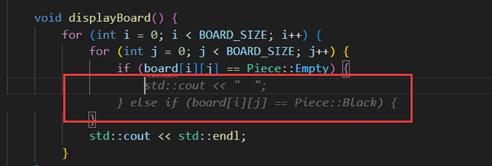
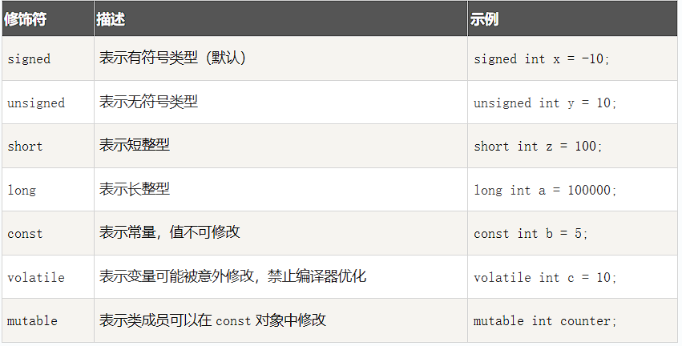
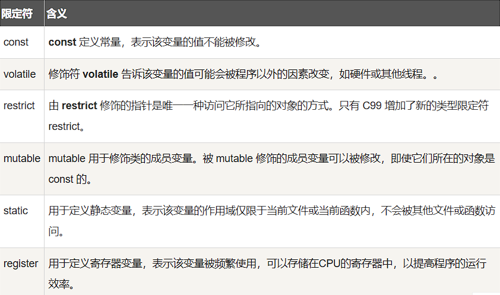
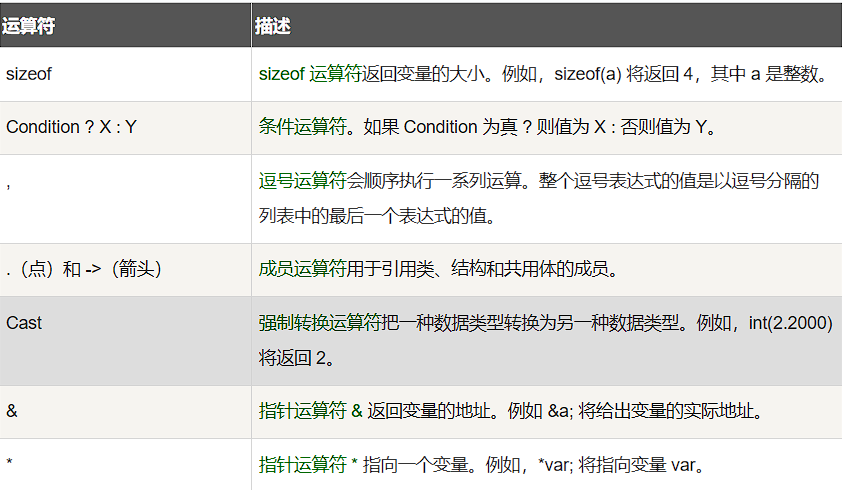

# C++基础

## 一、C++简介

### 1.1 简介

C++ 是一种静态类型的、编译式的、通用的、大小写敏感的、不规则的编程语言，支持过程化编程、面向对象编程和泛型编程。

C++ 被认为是一种中级语言，它综合了高级语言和低级语言的特点。

C++ 是由 Bjarne Stroustrup 于 1979 年在新泽西州美利山贝尔实验室开始设计开发的。C++ 进一步扩充和完善了 C 语言，最初命名为带类的C，后来在 1983 年更名为 C++。

C++ 是 C 的一个超集，事实上，任何合法的 C 程序都是合法的 C++ 程序。

注意：使用**静态类型的编程语言是在编译时执行类型检查**，而不是在运行时执行类型检查。

### 1.2 面向对象

C++ 完全支持面向对象的程序设计，包括面向对象开发的四大特性：

- 封装（Encapsulation）：
  封装是将数据和方法组合在一起，对外部隐藏实现细节，只公开对外提供的接口。这样可以提高安全性、可靠性和灵活性。
- 继承（Inheritance）：
  继承是从已有类中派生出新类，新类具有已有类的属性和方法，并且可以扩展或修改这些属性和方法。这样可以提高代码的复用性和可扩展性。
- 多态（Polymorphism）：
  多态是指同一种操作作用于不同的对象，可以有不同的解释和实现。它可以通过接口或继承实现，可以提高代码的灵活性和可读性。
- 抽象（Abstraction）：
  抽象是从具体的实例中提取共同的特征，形成抽象类或接口，以便于代码的复用和扩展。抽象类和接口可以让程序员专注于高层次的设计和业务逻辑，而不必关注底层的实现细节

### 1.3 标准库

标准的 C++ 由三个重要部分组成：

- 核心语言：
  提供了所有构件块，包括变量、数据类型和常量，等等。
- C++ 标准库
  提供了大量的函数，用于操作文件、字符串等。
- 标准模板库（STL）
  提供了大量的方法，用于操作数据结构等。

### 1.4 ANSI标准

ANSI 标准是为了确保 C++ 的便携性 —— 您所编写的代码在 Mac、UNIX、Windows、Alpha 计算机上都能通过编译。

由于 ANSI 标准已稳定使用了很长的时间，所有主要的 C++ 编译器的制造商都支持 ANSI 标准。

### 1.5 C++的学习和使用

学习 C++，关键是要理解概念，而不应过于深究语言的技术细节。

学习程序设计语言的目的是为了成为一个更好的程序员，也就是说，是为了能更有效率地设计和实现新系统，以及维护旧系统。

C++ 支持多种编程风格。您可以使用 Fortran、C、Smalltalk 等任意一种语言的编程风格来编写代码。每种风格都能有效地保证运行时间效率和空间效率。

C++ 语言在许多行业和领域都有广泛应用，包括：

- 游戏开发：
  C++ 是游戏开发领域中最常用的编程语言之一，因为它具有高效的性能和直接控制硬件的能力。许多主要的游戏引擎，如 Unreal Engine 和 Unity，都使用 C++ 编写。
- 嵌入式系统开发：
  C++ 可以在嵌入式系统中发挥重要作用，如智能手机、汽车、机器人和家电等领域。由于嵌入式系统通常具有严格的资源限制和实时要求，因此 C++ 的高效性能和内存控制功能非常有用。
- 金融领域：
  C++ 在金融领域中被广泛应用，如高频交易、算法交易和风险管理等领域。由于这些应用程序需要高效的性能和对硬件的直接控制，C++ 语言是一个合适的选择。
- 图形图像处理：
  C++ 可以用于开发图形和图像处理应用程序，如计算机视觉、计算机图形学和人工智能领域。由于这些应用程序需要高效的计算能力和对硬件的控制，因此 C++ 是一个很好的选择。
- 科学计算和数值分析：
  C++ 可以用于开发科学计算和数值分析应用程序，如数值模拟和高性能计算等领域。由于这些应用程序需要高效的计算能力和对硬件的直接控制，C++ 语言是一个很好的选择。

### 1.6 标准化


## 二、C++环境设置

如果您想要设置 C++ 语言环境，您需要确保电脑上有以下两款可用的软件，文本编辑器和 C++ 编译器。

### 2.1 文本编辑器

通过编辑器创建的文件通常称为源文件，源文件包含程序源代码。

C++ 程序的源文件通常使用扩展名 .cpp、.cp 或 .c。

在开始编程之前，请确保您有一个文本编辑器，且有足够的经验来编写一个计算机程序，然后把它保存在一个文件中，编译并执行它。

- Visual Studio Code：虽然它是一个通用的文本编辑器，但它有很多插件支持 C/C++ 开发，使其成为一个流行的选择，通过安装 C/C++ 插件和调整设置，你可以使其成为一个很好的 C 语言开发环境。
- Visual Studio： 面向 .NET 和 C++ 开发人员的综合性 Windows 版 IDE，可用于构建 Web、云、桌面、移动应用、服务和游戏。
- Vim 和 Emacs：这两个是传统的文本编辑器，它们有着强大的编辑功能和高度的可定制性，对于熟练的用户来说非常强大，有很多插件和配置可以支持C语言的开发。
- Eclipse：Eclipse 是另一个功能强大的集成开发环境，虽然它最初是为 Java 开发设计的，但通过安装 C/C++ 插件，可以使其支持 C 语言开发。

### 2.2 C++编译器

写在源文件中的源代码是人类可读的源。它需要"编译"，转为机器语言，这样 CPU 可以按给定指令执行程序。

C++ 编译器用于把源代码编译成最终的可执行程序。

大多数的 C++ 编译器并不在乎源文件的扩展名，但是如果您未指定扩展名，则默认使用 .cpp。

最常用的免费可用的编译器是 GNU 的 C/C++ 编译器，如果您使用的是 HP 或 Solaris，则可以使用各自操作系统上的编译器。

以下部分将指导您如何在不同的操作系统上安装 GNU 的 C/C++ 编译器。这里同时提到 C/C++，主要是因为**GNU 的 gcc 编译器适合于 C 和 C++ 编程语言**。

#### 2.2.1 UNIX安装

```sh
$g++ -v
```
如果您的计算机上已经安装了 GNU 编译器，则会显示如下消息：
```sh
Using built-in specs.
Target: i386-redhat-linux
Configured with: ../configure --prefix=/usr .......
Thread model: posix
gcc version 4.1.2 20080704 (Red Hat 4.1.2-46)
```

#### 2.2.2 Windows安装

**Cygwin**

Cygwin 是一个在 Windows 操作系统上模拟 Unix/Linux 环境的软件包，它允许用户在 Windows 上使用类 Unix 工具和应用程序。

Cygwin 通过提供一组 DLL（动态链接库），这些 DLL 充当 Unix 系统调用层和 Windows 内核之间的桥梁，使得 Unix 程序能够在 Windows 系统上运行。

Cygwin 官网：https://www.cygwin.com/。


**MinGW-w64**

为了在 Windows 上安装 GCC，您需要安装 MinGW-w64。

MinGW-w64 是一个开源项目，它为 Windows 系统提供了一个完整的 GCC 工具链，支持编译生成 32 位和 64 位的 Windows 应用程序。

访问 MinGW-w64 的主页 mingw-w64.org，进入 MinGW 下载页面 https://www.mingw-w64.org/downloads/，下载最新版本的 MinGW-w64 安装程序。

下载完成后，解压，在 bin 目录里面就可以找到 g++.exe 或者 gcc.exe：


当安装 MinGW 时，您至少要安装 gcc-core、gcc-g++、binutils 和 MinGW runtime，但是一般情况下都会安装更多其他的项。

添加您安装的 MinGW 的 bin 子目录到您的 PATH 环境变量中，这样您就可以在命令行中通过简单的名称来指定这些工具。

**使用Visual Studio编译**

略

#### 2.2.3 g++应用说明

程序 g++ 是将 gcc 默认语言设为 C++ 的一个特殊的版本，链接时它自动使用 C++ 标准库而不用 C 标准库。
通过遵循源码的命名规范并指定对应库的名字，用 gcc 来编译链接 C++ 程序是可行的，如下例所示：
```sh
$ gcc main.cpp -lstdc++ -o main
```
编写一个C++程序
最简单的编译方式：
```sh
g++ helloworld.cpp
```
由于命令行中未指定可执行程序的文件名，编译器采用默认的 a.out。程序可以这样来运行：
```sh
$ ./a.out
Hello, world!
```
通常我们使用 -o 选项指定可执行程序的文件名，以下实例生成一个 helloworld 的可执行文件：
```sh
$ g++ helloworld.cpp -o helloworld
```
执行：
```sh
$ ./helloworld
Hello, world!
```

如果是多个 C++ 代码文件，如 runoob1.cpp、runoob2.cpp，编译命令如下：
```sh
$ g++ runoob1.cpp runoob2.cpp -o runoob
```
生成一个 runoob 可执行文件。
g++ 有些系统默认是使用 C++98，我们可以指定使用 C++11 来编译 main.cpp 文件：
```sh
g++ -g -Wall -std=c++11 main.cpp
```

g++常用命令选项：


使用同gcc

## 三、C++ AI编程助手

适配了 Visual Studio(本文使用)，VS Code(本文使用)，JetBrains系列以及Vim等多种编译器环境的插件 Fitten Code，Fitten Code 是由非十大模型驱动的 AI 编程助手，它可以自动生成代码，提升开发效率，帮您调试 Bug，节省您的时间，另外还可以对话聊天，解决您编程碰到的问题。

Fitten Code免费且支持 80 多种语言：Python、C++、Javascript、Typescript、Java等。

目前对于 C++ 语言，Fitten Code 支持在多种文本编辑器或 IDE 上使用，接下来我们来详细看看 VS Code的安装与使用：

### 3.1 安装


下载Fitten Code插件并安装到VS Code。
注册账号密码后即可免费使用

### 3.2 智能补全

打开代码文件，输入一段代码，Fitten Code 就会为您自动补全代码：


按下 Tab 键接受所有补全建议

按下 Ctrl+→ 键(mac系统为Command+→)接收单个词补全建议

### 3.3 AI问答

用户可通过点击左上角工具栏中的Fitten Code – 开始对话或者使用快捷键Ctrl+Alt+C(mac系统为Control+Option+C)打开对话窗口进行对话：


当用户选中代码段再进行对话时，Fitten Code 会自动引用用户所选中的代码段，此时可直接针对该代码段进行问询等操作


### 3.4 生成代码

可在左侧 Fitten Code 工具栏中选择 "Fitten Code - 生成代码" 或者使用快捷键 Ctrl+Alt+G (mac系统为Control+Option+G)，如下图所示：


然后在输入框中输入指令即可生成代码：


利用对话功能生成代码：


### 3.5 代码翻译

编辑代码功能可以实现不同语言之间的转换，如Python语法转换成C++语法等。
选中需要进行编辑的代码段，右键选择 "Fitten Code – 编辑代码" 或点击左侧工具栏中的 "Fitten Code – 编辑代码" 或者使用快捷键 Ctrl+Alt+E (mac系统为Control+Option+E)，如下图所示：


然后在输入框中输入需求(如此处要求Fitten将Python代码转为C++代码)

也可以在Chat界面实现：选中需要进行编辑的代码段，右键选择 "Fitten Code – 开始聊天" 或点击左侧工具栏中的 "Fitten Code – 开始聊天" 或者使用快捷键 Ctrl+Alt+C

### 3.6 生成注释

Fitten Code 能够根据您的代码自动生成相关注释，通过分析您的代码逻辑和结构，为您的代码提供清晰易懂的解释和文档，不仅提高代码的可读性，还方便其他开发人员理解和使用您的代码。先选中需要生成注释的代码段，然后右键选择 "Fitten Code – 生成注释"

即可生成对应注释如下图所示，点击"Apply"后即可应用

### 3.7 解释代码

Fitten Code 可以对一段代码进行解释，可以通过选中代码段然后右键选择 "Fitten Code – 解释代码" 进行解释


此外，还可以进一步回答用户关于这段代码的疑问

### 3.8 生产测试

Fitten Code 拥有自动生成单元测试的功能，可以根据代码自动产生相应的测试用例，提高代码质量和可靠性。通过选中代码段后右键选择 "Fitten Code – 生成单元测试" 来实现


### 3.9 调试bug
Fitten Code 可以对一段代码检查可能的 bug，并给出修复建议。选中对应代码段，然后右键选择 "Fitten Code查找Bug"，如下图所示：


### 3.10 编辑代码

Fitten Code可根据用户指示对选定的代码块进行编辑，用户点击 "Apply" 后即可应用变更。通过选中代码段右键选择 "Fitten Code – 编辑代码" 或在左上角工具栏点击 "Fitten Code – 编辑代码"，如下图所示：


如果 VSCode 远程服务器 remote 无法连接外网时，请点击左下角⚙按钮，再点击设置：

进入json模式

添加指令
```sh
"remote.extensionKind": { "FittenTech.Fitten-Code": ["ui"] }
```

更多内容参考官网：https://code.fittentech.com/

## 四、C++基本语法

C++ 程序可以定义为对象的集合，这些对象通过调用彼此的方法进行交互。
现在让我们简要地看一下什么是类、对象，方法、即时变量。

- 对象 - 对象具有状态和行为。
  例如：一只狗的状态 - 颜色、名称、品种，行为 - 摇动、叫唤、吃。
  对象是类的实例。
- 类 - 类可以定义为描述对象行为/状态的模板/蓝图。
- 方法 - 从基本上说，一个方法表示一种行为。
  一个类可以包含多个方法。可以在方法中写入逻辑、操作数据以及执行所有的动作。
- 即时变量 - 每个对象都有其独特的即时变量。
  对象的状态是由这些即时变量的值创建的。

### 4.1 C++ 程序结构

```c++
#include <iostream>
using namespace std;
 
// main() 是程序开始执行的地方
 
int main()
{
   cout << "Hello World"; // 输出 Hello World
   return 0;
}
```

C++ 语言定义了一些头文件，这些头文件包含了程序中必需的或有用的信息。上面这段程序中，包含了头文件 <iostream>。
下一行 using namespace std; 告诉编译器使用 std 命名空间。命名空间是 C++ 中一个相对新的概念。
下一行 // main() 是程序开始执行的地方 是一个单行注释。单行注释以 // 开头，在行末结束。
下一行 int main() 是主函数，程序从这里开始执行。
下一行 cout << "Hello World"; 会在屏幕上显示消息 "Hello World"。
下一行 return 0; 终止 main( )函数，并向调用进程返回值 0。

### 4.2 编译执行C++程序

接下来让我们看看如何把源代码保存在一个文件中，以及如何编译并运行它。下面是简单的步骤：

1. 打开一个文本编辑器，添加上述代码。
2. 保存文件为 hello.cpp。
3. 打开命令提示符，进入到保存文件所在的目录。
4. 键入 'g++ hello.cpp '，输入回车，编译代码。如果代码中没有错误，命令提示符会跳到下一行，并生成 a.out 可执行文件。
5. 现在，键入 ' a.out' 来运行程序。
6. 您可以看到屏幕上显示 ' Hello World '。

请确保您的路径中已包含 g++ 编译器，并确保在包含源文件 hello.cpp 的目录中运行它。
您也可以使用 makefile 来编译 C/C++ 程序。

### 4.3 C++语法块

在 C++ 中，分号是语句结束符。
也就是说，每个语句必须以分号结束。它表明一个逻辑实体的结束。
语句块是一组使用大括号括起来的按逻辑连接的语句。
C++ 不以行末作为结束符的标识，因此，您可以在一行上放置多个语句。

### 4.4 C++标识符

标识符是 C++ 中用于命名变量、函数、类、结构等的名称。
一个标识符以字母 A-Z 或 a-z 或下划线 _ 开始，后跟零个或多个字母、下划线和数字（0-9）。

C++ 标识符内不允许出现标点字符，比如 @、& 和 %。C++ 是区分大小写的编程语言。因此，在 C++ 中，Manpower 和 manpower 是两个不同的标识符。

### 4.5 C++关键字

下表列出了 C++ 中的保留字。这些保留字不能作为常量名、变量名或其他标识符名称。


[关键字介绍](https://www.runoob.com/w3cnote/cpp-keyword-intro.html)

- asm (指令字符串)：允许在 C++ 程序中嵌入汇编代码。
- auto（自动，automatic）是存储类型标识符，表明变量"自动"具有本地范围，块范围的变量声明（如for循环体内的变量声明）默认为auto存储类型。
- bool (布尔类型)：表示逻辑值 true 或 false，可以与int混用。
- const 
  const（常量的，constant）所修饰的对象或变量不能被改变，修饰函数时，该函数不能改变在该函数外面声明的变量也不能调用任何非const函数。在函数的声明与定义时都要加上const，放在函数参数列表的最后一个括号后。在 C++ 中，用 const 声明一个变量，意味着该变量就是一个带类型的常量，可以代替 #define，且比 #define 多一个类型信息，且它执行内链接，可放在头文件中声明；但在 C 中，其声明则必须放在源文件（即 .C 文件）中，在 C 中 const 声明一个变量，除了不能改变其值外，它仍是一具变量。

- conts_cast (常量转换) `const_cast<type_id> (expression)`
  该运算符用来修改类型的 const 或 volatile 属性。除了 const 或 volatile 修饰之外， type_id 和 expression 的类型是一样的。常量指针被转化成非常量指针，并且仍然指向原来的对象；常量引用被转换成非常量引用，并且仍然指向原来的对象；常量对象被转换成非常量对象。
- dynamic_cast (动态类型转换)
  dynamic_cast（动态转换），允许在运行时刻进行类型转换，从而使程序能够在一个类层次结构安全地转换类型。dynamic_cast 提供了两种转换方式，把基类指针转换成派生类指针，或者把指向基类的左值转换成派生类的引用。
- explicit (显示转换)
  explicit（显式的）的作用是"禁止单参数构造函数"被用于自动型别转换，其中比较典型的例子就是容器类型。在这种类型的构造函数中你可以将初始长度作为参数传递给构造函数。
- mutable (可变的)
  mutable（易变的）是 C++ 中一个不常用的关键字。只能用于类的非静态和非常量数据成员。由于一个对象的状态由该对象的非静态数据成员决定，所以随着数据成员的改变，对像的状态也会随之发生变化。如果一个类的成员函数被声明为 const 类型，表示该函数不会改变对象的状态，也就是该函数不会修改类的非静态数据成员。但是有些时候需要在该类函数中对类的数据成员进行赋值，这个时候就需要用到 mutable 关键字。
- reinterpert_cast `reinpreter_cast<type-id> (expression)`
  type-id 必须是一个指针、引用、算术类型、函数指针或者成员指针。它可以把一个指针转换成一个整数，也可以把一个整数转换成一个指针（先把一个指针转换成一个整数，在把该整数转换成原类型的指针，还可以得到原先的指针值）。
- static_cast (静态类型转换)`static_cast < type-id > ( expression ) `
  该运算符把 expression 转换为 type-id 类型，但没有运行时类型检查来保证转换的安全性。它主要有如下几种用法：
  ① 用于类层次结构中基类和子类之间指针或引用的转换。进行上行转换（把子类的指针或引用转换成基类表示）是安全的；进行下行转换（把基类指针或引用转换成子类表示）时，由于没有动态类型检查，所以是不安全的。
  ② 用于基本数据类型之间的转换，如把 int 转换成 char，把 int 转换成 enum。这种转换的安全性也要开发人员来保证。
  ③ 把空指针转换成目标类型的空指针。
  ④ 把任何类型的表达式转换成void类?
- typeid (类型ID)
  指出指针或引用指向的对象的实际派生类型。
- wchart_t (宽字符类型)
  wchar_t 是宽字符类型，每个 wchar_t 类型占 2 个字节，16 位宽。汉字的表示就要用到 wchar_t。
  
### 4.6 C++三元字符

三字符组就是用于表示另一个字符的三个字符序列，又称为三字符序列。三字符序列总是以两个问号开头。

三字符序列不太常见，但 C++ 标准允许把某些字符指定为三字符序列。以前为了表示键盘上没有的字符，这是必不可少的一种方法。

三字符序列可以出现在任何地方，包括字符串、字符序列、注释和预处理指令。

下面是一些三字符序列：


如果希望在源程序中有两个连续的问号，且不希望被预处理器替换，这种情况出现在字符常量、字符串字面值或者是程序注释中，可选办法是用字符串的自动连接："...?""?..."或者转义序列："...?\?..."。

从Microsoft Visual C++ 2010版开始，该编译器默认不再自动替换三字符组。如果需要使用三字符组替换（如为了兼容古老的软件代码），需要设置编译器命令行选项/Zc:trigraphs
g++仍默认支持三字符组，但会给出编译警告。

### 4.7 C++中空格

只包含空格的行，被称为空白行，可能带有注释，C++ 编译器会完全忽略它。

在 C++ 中，空格用于描述空白符、制表符、换行符和注释。
空格分隔语句的各个部分，让编译器能识别语句中的某个元素（比如 int）在哪里结束，下一个元素在哪里开始。

### 4.8 C++注释

程序的注释是解释性语句，您可以在 C++ 代码中包含注释，这将提高源代码的可读性。所有的编程语言都允许某种形式的注释。

C++ 支持单行注释和多行注释。注释中的所有字符会被 C++ 编译器忽略。

C++ 注释一般有两种：

// - 一般用于单行注释。

/* ... */ - 一般用于多行注释，不可嵌套使用。

此外，#if 0 ... #endif 属于条件编译，0 即为参数。
此外，我们还可以使用 #if 0 ... #endif 来实现注释，且可以实现嵌套，格式为：
```c++
#if 0
code
#endif
```
你可以把 #if 0 改成 #if 1 来执行 code 的代码。
这种形式对程序调试也可以帮助，测试时使用 #if 1 来执行测试代码，发布后使用 #if 0 来屏蔽测试代码。

#if 后可以是任意的条件语句。
下面的代码如果 condition 条件为 true 执行 code1 ，否则执行 code2。
```c++
#if condition
  code1
#else
  code2
#endif
```

## 五、C++数据类型

使用编程语言进行编程时，需要用到各种变量来存储各种信息。当您创建一个变量时，就会在内存中保留一些空间。

您可能需要存储各种数据类型（比如字符型、宽字符型、整型、浮点型、双浮点型、布尔型等）的信息，操作系统会根据变量的数据类型，来分配内存和决定在保留内存中存储什么。

- 内存的名字可以利用内存
- 规定预留内存的大小

### 5.1 基本内置类型

C++ 为程序员提供了种类丰富的内置数据类型和用户自定义的数据类型。下表列出了七种基本的 C++ 数据类型：


对于wchar_t类型，它是一种宽字符类型，每个wchar_t类型占 2 个字节，16 位宽。汉字的表示就要用到 wchar_t。

定义：
```c++
typedef short int wchar_t;
```

所以 wchar_t 实际上的空间是和 short int 一样。

一些基本类型可以使用一个或多个类型修饰符进行修饰：


<span style="color:red">mutable: 关键字主要用于类成员变量。它允许在const对象中修改类的某些成员变量。通常情况下，如果类的对象被声明为const，它的所有成员变量在访问时也会被视为常量，无法修改。但通过使用mutable关键字，可以例外地修改这些特定的成员变量。</span>

```c++
#include <iostream>

class MyClass {
public:
    mutable int counter; // 使用 mutable 修饰
    void increment() const {
        counter++; // 即使在 const 函数中也可以修改
    }
};
int main() {
    const MyClass obj; // 声明为 const 对象
    obj.counter = 0;   // 修改 mutable 成员变量
    obj.increment();   // 调用 const 函数中修改 mutable 成员变量
    std::cout << "Counter: " << obj.counter << std::endl;
    return 0;
}
```

下表显示了各种变量类型在内存中存储值时需要占用的内存，以及该类型的变量所能存储的最大值和最小值。

注意：不同系统会有所差异，一字节为 8 位。

注意：默认情况下，int、short、long都是带符号的，即 signed。

注意：long int 8 个字节，int 都是 4 个字节，早期的 C 编译器定义了 long int 占用 4 个字节，int 占用 2 个字节，新版的 C/C++ 标准兼容了早期的这一设定。


wchar_t 类型Windows占 2 个字节，16 位宽。Linux占 4 个字节，32 位宽。
long类型占位需要视平台而定，long long一般定为8字节。

C++新增类型：


从上表可得知，变量的大小会根据编译器和所使用的电脑而有所不同。

下面实例会输出您电脑上各种数据类型的大小。
```C++
#include<iostream>  
#include <limits>
 
using namespace std;  
  
int main()  
{  
    cout << "type: \t\t" << "************size**************"<< endl;  
    cout << "bool: \t\t" << "所占字节数：" << sizeof(bool);  
    cout << "\t最大值：" << (numeric_limits<bool>::max)();  
    cout << "\t\t最小值：" << (numeric_limits<bool>::min)() << endl;  
    cout << "char: \t\t" << "所占字节数：" << sizeof(char);  
    cout << "\t最大值：" << (numeric_limits<char>::max)();  
    cout << "\t\t最小值：" << (numeric_limits<char>::min)() << endl;  
    cout << "signed char: \t" << "所占字节数：" << sizeof(signed char);  
    cout << "\t最大值：" << (numeric_limits<signed char>::max)();  
    cout << "\t\t最小值：" << (numeric_limits<signed char>::min)() << endl;  
    cout << "unsigned char: \t" << "所占字节数：" << sizeof(unsigned char);  
    cout << "\t最大值：" << (numeric_limits<unsigned char>::max)();  
    cout << "\t\t最小值：" << (numeric_limits<unsigned char>::min)() << endl;  
    cout << "wchar_t: \t" << "所占字节数：" << sizeof(wchar_t);  
    cout << "\t最大值：" << (numeric_limits<wchar_t>::max)();  
    cout << "\t\t最小值：" << (numeric_limits<wchar_t>::min)() << endl;  
    cout << "short: \t\t" << "所占字节数：" << sizeof(short);  
    cout << "\t最大值：" << (numeric_limits<short>::max)();  
    cout << "\t\t最小值：" << (numeric_limits<short>::min)() << endl;  
    cout << "int: \t\t" << "所占字节数：" << sizeof(int);  
    cout << "\t最大值：" << (numeric_limits<int>::max)();  
    cout << "\t最小值：" << (numeric_limits<int>::min)() << endl;  
    cout << "unsigned: \t" << "所占字节数：" << sizeof(unsigned);  
    cout << "\t最大值：" << (numeric_limits<unsigned>::max)();  
    cout << "\t最小值：" << (numeric_limits<unsigned>::min)() << endl;  
    cout << "long: \t\t" << "所占字节数：" << sizeof(long);  
    cout << "\t最大值：" << (numeric_limits<long>::max)();  
    cout << "\t最小值：" << (numeric_limits<long>::min)() << endl;  
    cout << "unsigned long: \t" << "所占字节数：" << sizeof(unsigned long);  
    cout << "\t最大值：" << (numeric_limits<unsigned long>::max)();  
    cout << "\t最小值：" << (numeric_limits<unsigned long>::min)() << endl;  
    cout << "double: \t" << "所占字节数：" << sizeof(double);  
    cout << "\t最大值：" << (numeric_limits<double>::max)();  
    cout << "\t最小值：" << (numeric_limits<double>::min)() << endl;  
    cout << "long double: \t" << "所占字节数：" << sizeof(long double);  
    cout << "\t最大值：" << (numeric_limits<long double>::max)();  
    cout << "\t最小值：" << (numeric_limits<long double>::min)() << endl;  
    cout << "float: \t\t" << "所占字节数：" << sizeof(float);  
    cout << "\t最大值：" << (numeric_limits<float>::max)();  
    cout << "\t最小值：" << (numeric_limits<float>::min)() << endl;  
    cout << "size_t: \t" << "所占字节数：" << sizeof(size_t);  
    cout << "\t最大值：" << (numeric_limits<size_t>::max)();  
    cout << "\t最小值：" << (numeric_limits<size_t>::min)() << endl;  
    cout << "string: \t" << "所占字节数：" << sizeof(string) << endl;  
    // << "\t最大值：" << (numeric_limits<string>::max)() << "\t最小值：" << (numeric_limits<string>::min)() << endl;  
    cout << "type: \t\t" << "************size**************"<< endl;  
    return 0;  
}
```


派生数据类型：


类型别名：


标准库类型：


### 5.2 typedef声明

您可以使用 typedef 为一个已有的类型取一个新的名字。下面是使用 typedef 定义一个新类型的语法：
`typedef type newname; `
例如，下面的语句会告诉编译器，feet 是 int 的另一个名称：
`typedef int feet;`
现在，下面的声明是完全合法的，它创建了一个整型变量 distance：
`feet distance;`

### 5.3 枚举类型

枚举类型(enumeration)是C++中的一种派生数据类型，它是由用户定义的若干枚举常量的集合。

如果一个变量只有几种可能的值，可以定义为枚举(enumeration)类型。所谓"枚举"是指将变量的值一一列举出来，变量的值只能在列举出来的值的范围内。

创建枚举，需要使用关键字 enum。枚举类型的一般形式为：

```c++
enum 枚举名{ 
     标识符[=整型常数], 
     标识符[=整型常数], 
... 
    标识符[=整型常数]
} 枚举变量; //直接定义变量名
```
```c++
#include <iostream>

enum color {red, green, blue};
enum Day {Sun, Mon, Tue, Wed, Thu, Fri, Sat} n;
int main() {
    color c = blue;
    enum color c2 = green;
    n = Mon;
    enum Day n2 = Sun;
    std::cout << "The value of c is: " << c << std::endl;
    std::cout << "The value of c2 is: " << c2 << std::endl;
    std::cout << "The value of n is: " << n << std::endl;
    std::cout << "The value of n2 is: " << n2 << std::endl;
    return 0;
}
```
默认情况下，第一个名称的值为 0，第二个名称的值为 1，第三个名称的值为 2，以此类推。但是，您也可以给名称赋予一个特殊的值，只需要添加一个初始值即可。例如，在下面的枚举中，green 的值为 5。
`enum color { red, green=5, blue };`
在这里，blue 的值为 6，因为默认情况下，每个名称都会比它前面一个名称大 1，但 red 的值依然为 0。

### 5.4 类型转化

类型转换是将一个数据类型的值转换为另一种数据类型的值。
C++ 中有四种类型转换：静态转换、动态转换、常量转换和重新解释转换。

#### 静态转化

静态转换是将一种数据类型的值**强制**转换为另一种数据类型的值。

静态转换通常用于比较类型相似的对象之间的转换，例如将 int 类型转换为 float 类型。

静态转换不进行任何运行时类型检查，因此可能会导致运行时错误。

```c++
int main(){
    int i = 10;
    float f = static_cast<float>(i); // 静态将int类型转换为float类型
    std::cout << "i = " << i << std::endl;
    std::cout << "f = " << f << std::endl;
}
```

#### 动态转化

动态转换（dynamic_cast）是 C++ 中用于在继承层次结构中进行向下转换（downcasting）的一种机制。

动态转换通常用于将**一个基类指针或引用转换为派生类指针或引用**。(父转子)

动态转换在运行时进行类型检查。如果转换失败，对于指针类型会返回 nullptr，对于引用类型则会抛出 std::bad_cast 异常。

dynamic_cast<目标类型>(表达式)
- 目标类型：必须是指针或引用类型。
- 表达式：需要转换的基类指针或引用。

实例：指针类型
```c++
#include <iostream>
 
class Base { //基类
public:
    virtual ~Base() = default; // 基类必须具有虚函数
};
 
class Derived : public Base { //继承自基类
public:
    void show() {
        std::cout << "Derived class method" << std::endl;
    }
};
 
int main() {
    Base* ptr_base = new Derived; // 基类指针指向派生类对象
 
    // 将基类指针转换为派生类指针
    Derived* ptr_derived = dynamic_cast<Derived*>(ptr_base);
 
    if (ptr_derived) {
        ptr_derived->show(); // 成功转换，调用派生类方法
    } else {
        std::cout << "Dynamic cast failed!" << std::endl;
    }
 
    delete ptr_base;
    return 0;
}
```
引用类型：
```c++
#include <iostream>
#include <typeinfo>

class Base {
public:
    virtual ~Base() = default; // 基类必须具有虚函数
};

class Derived : public Base {
public:
    void show() {
        std::cout << "Derived class method" << std::endl;
    }
};

int main() {
    Derived derived_obj;
    Base& ref_base = derived_obj; // 基类引用绑定到派生类对象

    try {
        // 将基类引用转换为派生类引用
        Derived& ref_derived = dynamic_cast<Derived&>(ref_base);
        ref_derived.show(); // 成功转换，调用派生类方法
    } catch (const std::bad_cast& e) {
        std::cout << "Dynamic cast failed: " << e.what() << std::endl;
    }

    return 0;
}
```

dynamic_cast 必须要求基类含有至少一个虚函数。

#### 常量转换

常量转换用于将 const 类型的对象转换为非 const 类型的对象。
常量转换只能用于转换掉 const 属性，不能改变对象的类型。

```c++
const int i = 10;
int& r = const_cast<int&>(i); // 常量转换，将const int转换为int
```
const_cast中只能是指针或者引用。
```c++
int main() {
    const int i = 10;
    int& e = const_cast<int&>(i); // 将const int类型转换为int类型
    e = 20; // 成功修改i的值
    std::cout << "i = " << i << std::endl; // 输出i的值 10
    std::cout << "e = " << e << std::endl; // 输出e的值 20
}   
```

#### 重新解释转换

重新解释转换将一个数据类型的值重新解释为另一个数据类型的值，通常用于在不同的数据类型之间进行转换。

重新解释转换不进行任何类型检查，因此可能会导致未定义的行为。
```c++
int i = 10;
float f = reinterpret_cast<float&>(i); // 重新解释将int类型转换为float类型
```

C++完全兼容C语言类型转化，隐式转化和显示转化。

## 六、C++变量类型

### 6.1 变量类型
变量其实只不过是程序可操作的存储区的名称。
在 C++ 中，有多种变量类型可用于存储不同种类的数据。
C++ 中每个变量都有指定的类型，类型决定了变量存储的大小和布局，该范围内的值都可以存储在内存中，运算符可应用于变量上。

变量的名称可以由字母、数字和下划线字符组成。它必须以字母或下划线开头。
大写字母和小写字母是不同的，因为 C++ 是大小写敏感的。
基于前一章讲解的基本类型，有以下几种基本的变量类型，将在下一章中进行讲解：


C++ 也允许定义各种其他类型的变量，比如枚举、指针、数组、引用、数据结构、类等等，这将会在后续的章节中进行讲解。


在 C++ 中，类型的长度（即占用的字节数）取决于编译器和计算机架构，然而，C++ 标准规定了不同整数类型的最小范围，而不是具体的字节数，这是为了确保代码在不同的系统上都能正确运行。
请注意，以上类型的范围只是 C++ 标准规定的最小要求，实际上，许多系统上这些类型可能占用更多的字节，例如，很多现代计算机上 int 通常占用 4 字节，而 long 可能占用 8 字节。

### 6.2 变量定义


### 6.3 变量声明

变量声明向编译器保证变量以给定的类型和名称存在，这样编译器在不需要知道变量完整细节的情况下也能继续进一步的编译。**变量声明只在编译时有它的意义**。

当您使用多个文件且只在其中一个文件中定义变量时（定义变量的文件在程序连接时是可用的），变量声明就显得非常有用。您可以使用 **extern** 关键字在任何地方声明一个变量。虽然您可以在 C++ 程序中多次声明一个变量，但变量只能在某个文件、函数或代码块中被定义一次。

### 6.4 C++左值（Lvalues）和右值（Rvalues）

C++ 中有两种类型的表达式：

- 左值（lvalue）：**指向内存位置的表达式**被称为左值（lvalue）表达式。左值可以出现在赋值号的左边或右边。
- 右值（rvalue）：术语右值（rvalue）指的是**存储在内存中某些地址的数值**。右值是不能对其进行赋值的表达式，也就是说，右值可以出现在赋值号的右边，但不能出现在赋值号的左边。

左值可以当做内存使用，右值只能当做数值。

## 七、C++变量作用域

一般来说有三个地方可以定义变量：

- 在函数或一个代码块内部声明的变量，称为**局部变量**。
- 在函数参数的定义中声明的变量，称为**形式参数**。
- 在所有函数外部声明的变量，称为**全局变量**。

作用域是程序的一个区域，变量的作用域可以分为以下几种：

- 局部作用域：在函数内部声明的变量具有局部作用域，它们只能在函数内部访问。局部变量在函数每次被调用时被创建，在函数执行完后被销毁。

- 全局作用域：在所有函数和代码块之外声明的变量具有全局作用域，它们可以被程序中的任何函数访问。全局变量在程序开始时被创建，在程序结束时被销毁。

- 块作用域：在代码块内部声明的变量具有块作用域，它们只能在代码块内部访问。块作用域变量在代码块每次被执行时被创建，在代码块执行完后被销毁。

- 类作用域：在类内部声明的变量具有类作用域，它们可以被类的所有成员函数访问。类作用域变量的生命周期与类的生命周期相同。

注意：如果在内部作用域中声明的变量与外部作用域中的变量同名，则内部作用域中的变量将覆盖外部作用域中的变量。

### 7.1 局部变量

在函数或一个代码块内部声明的变量，称为局部变量。它们只能被函数内部或者代码块内部的语句使用。

### 7.2 全局变量

在所有函数外部定义的变量（通常是在程序的头部），称为全局变量。全局变量的值在程序的整个生命周期内都是有效的。
全局变量可以被任何函数访问。也就是说，全局变量一旦声明，在整个程序中都是可用的。

在程序中，局部变量和全局变量的名称可以相同，但是在函数内，局部变量的值会覆盖全局变量的值。

### 7.3 变量初始化

当局部变量被定义时，系统不会对其初始化，您必须自行对其初始化。(垃圾数)
定义全局变量时，系统会自动初始化为下列值：


### 7.4 块作用域

块作用域指的是在代码块内部声明的变量。
```C
#include <iostream>

int main() {
    int a = 10;
    {
        int a = 20;  // 块作用域变量
        std::cout << "块变量: " << a << std::endl;
    }
    std::cout << "外部变量: " << a << std::endl;
    return 0;
}
```
以上实例中，内部的代码块中声明了一个名为 a 的变量，它与外部作用域中的变量 a 同名。内部作用域中的变量 a 将覆盖外部作用域中的变量 a，在内部作用域中访问 a 时输出的是20，而在外部作用域中访问 a 时输出的是 10。

当上面的代码被编译和执行时，它会产生下列结果：
```
块变量: 20
外部变量: 10
```

### 7.5 类作用域

类作用域指的是在类内部声明的变量：
```C++
#include <iostream>

class MyClass {
public:
    static int class_var;  // 类作用域变量
};

int MyClass::class_var = 30;

int main() {
    std::cout << "类变量: " << MyClass::class_var << std::endl;
    return 0;
}
```
以上实例中，MyClass 类中声明了一个名为 class_var 的类作用域变量。可以使用类名和作用域解析运算符 :: 来访问这个变量。在 main() 函数中访问 class_var 时输出的是 30。

## 八、C++常量

常量是固定值，在程序执行期间不会改变。这些固定的值，又叫做字面量。

常量可以是任何的基本数据类型，可分为整型数字、浮点数字、字符、字符串和布尔值。

### 8.1 常见的几种常量

#### 8.1.1 整型常量

整数常量可以是十进制、八进制或十六进制的常量。前缀指定基数：0x 或 0X 表示十六进制，0 表示八进制，不带前缀则默认表示十进制。

整数常量也可以带一个后缀，后缀是 U 和 L 的组合，U 表示无符号整数（unsigned），L 表示长整数（long）。后缀可以是大写，也可以是小写，U 和 L 的顺序任意。

几个整数常量实例：
```C++
212         // 合法的
215u        // 合法的
0xFeeL      // 合法的
078         // 非法的：8 不是八进制的数字
032UU       // 非法的：不能重复后缀

85         // 十进制
0213       // 八进制 
0x4b       // 十六进制 
30         // 整数 
30u        // 无符号整数 
30l        // 长整数 
30ul       // 无符号长整数
```

#### 8.1.2 浮点常量

浮点常量由整数部分、小数点、小数部分和指数部分组成。您可以使用小数形式或者指数形式来表示浮点常量。

当使用小数形式表示时，必须包含整数部分、小数部分，或同时包含两者。当使用指数形式表示时， 必须包含小数点、指数，或同时包含两者。带符号的指数是用 e 或 E 引入的。

```C++
3.14159       // 合法的 
314159E-5L    // 合法的 
510E          // 非法的：不完整的指数
210f          // 非法的：没有小数或指数
.e55          // 非法的：缺少整数或分数
```

#### 8.1.3 布尔常量

布尔常量共有两个，它们都是标准的 C++ 关键字：

true 值代表真。
false 值代表假。

我们不应把 true 的值看成 1，把 false 的值看成 0。

#### 8.1.4 字符常量 

字符常量是括在单引号中。如果常量以 L（仅当大写时）开头，则表示它是一个宽字符常量（例如 L'x'），此时它必须存储在 wchar_t 类型的变量中。否则，它就是一个窄字符常量（例如 'x'），此时它可以存储在 char 类型的简单变量中。

字符常量可以是一个普通的字符（例如 'x'）、一个转义序列（例如 '\t'），或一个通用的字符（例如 '\u02C0'）。**\u 是表示 Unicode 编码的前缀，后跟四个十六进制数字。**

常见的转义字符序列码：


#### 8.1.5 字符串常量

字符串字面值或常量是括在双引号 "" 中的。一个字符串包含类似于字符常量的字符：普通的字符、转义序列和通用的字符。

您可以使用 \ 做分隔符，把一个很长的字符串常量进行分行。

下面的实例显示了一些字符串常量：

```C++
#include <iostream>
#include <string>
using namespace std;

int main() {
    string greeting = "hello, runoob";
    cout << greeting;
    cout << "\n";     // 换行符
    string greeting2 = "hello, \
                        runoob";
    cout << greeting2;
    return 0;
}
```

### 8.2 常量定义

在 C++ 中，有两种简单的定义常量的方式：

- 使用 #define 预处理器。
- 使用 const 关键字。

#### 8.2.1 #define 预处理器

#define 预处理器是一个简单的文本替换工具，它允许您在程序中定义常量。

```C++
#define identifier value
```

在预处理阶段，identifier 会被替换为 value。

#### 8.2.2 const 关键字

您可以使用 const 前缀声明指定类型的常量，如下所示：
```C++
#include <iostream>
using namespace std;
 
int main()
{
   const int  LENGTH = 10;
   const int  WIDTH  = 5;
   const char NEWLINE = '\n';
   int area;  
   
   area = LENGTH * WIDTH;
   cout << area;
   cout << NEWLINE;
   return 0;
}
```

## 九、C++修饰符类型

### 9.1 数据类型修饰符

C++ 允许在 char、int 和 double 数据类型前放置修饰符。

修饰符是用于改变变量类型的行为的关键字，它更能满足各种情境的需求。

下面列出了数据类型修饰符：

- signed：表示变量可以存储负数。对于整型变量来说，signed 可以省略，因为整型变量默认为有符号类型。

- unsigned：表示变量不能存储负数。对于整型变量来说，unsigned 可以将变量范围扩大一倍。

- short：表示变量的范围比 int 更小。short int 可以缩写为 short。

- long：表示变量的范围比 int 更大。long int 可以缩写为 long。

- long long：表示变量的范围比 long 更大。C++11 中新增的数据类型修饰符。

- float：表示单精度浮点数。

- double：表示双精度浮点数。

- bool：表示布尔类型，只有 true 和 false 两个值。

- char：表示字符类型。

- wchar_t：表示宽字符类型，可以存储 Unicode 字符。

修饰符 signed、unsigned、long 和 short 可应用于整型
signed 和 unsigned 可应用于字符型
long 可应用于双精度型

这些修饰符也可以组合使用，修饰符 signed 和 unsigned 也可以作为 long 或 short 修饰符的前缀。例如：unsigned long int

C++ 允许使用速记符号来声明无符号短整数或无符号长整数。
您可以不写 int，只写单词 unsigned、short 或 long，int 是隐含的。

```C++
int main(){
    unsigned a = 10;
    std::cout << "a = " << a << std::endl;
}
```

### 9.2 类型限定符

类型限定符提供了变量的额外信息，用于在定义变量或函数时改变它们的默认行为的关键字



补充指针常量和常量指针：
常量指针： const int* p = &a; 指针的地址可修改，但是指向的变量的值不可以修改(执行一个常量)。
指针常量： int* const p = &a; 指针的地址不可修改，但是可以修改指向变量的值(数组名)

C++引用类型：
在C++中，引用（Reference）是一种非常重要的语言特性，它可以用来给变量**创建别名**。引用类型有助于更安全和方便地操作变量，尤其是在函数参数传递和返回值等场景中。
```c++
int a = 10;
int& ref = a;  // ref 是 a 的引用
```
特点：
- 必须初始化： 声明引用时必须立即对其进行初始化，不能像指针一样声明为空。

- 不可更改： 一旦引用了某个变量，就不能再改变引用的目标。

- 等价性： 引用只是目标变量的一个别名，所以它和原变量是等价的。

常见使用方式：

作为函数参数：使用引用可以避免拷贝数据，特别是对于大型结构或类对象。

```c++
void modify(int& x) {
    x = 20;  // 修改会直接影响原变量
}
int main() {
    int a = 10;
    modify(a);  // a 的值被修改为 20
}
```

返回值优化：
```c++
int& getElement(int arr[], int index) {
    return arr[index];  // 返回数组元素的引用
}
```

与常量结合：

```c++
void printValue(const int& x) {
    // x 的值不能被修改
}
```

引用本质上是对变量的直接内存访问，这使得它比指针更加简洁和安全。
引用在底层实现上通常是通过指针完成的，但是编译器在大多数场景下会将引用自动解引用。

## 十、C++存储类

存储类定义 C++ 程序中变量/函数的范围（可见性）和生命周期。这些说明符放置在它们所修饰的类型之前。
(作用域和生命周期)

C++ 存储类有以下几种：

- auto：这是默认的存储类说明符，通常可以省略不写。auto 指定的变量具有自动存储期，即它们的生命周期仅限于定义它们的块（block）。auto 变量通常在栈上分配。后续auto作为自动推导类型。

- register：用于建议编译器将**变量存储在CPU寄存器**中以提高访问速度。在 C++11 及以后的版本中，register 已经是一个废弃的特性，不再具有实际作用。

- static：用于定义具有静态存储期的变量或函数，它们的生命周期贯穿整个程序的运行期。在函数内部，static变量的值在**函数调用之间保持不变**。在文件内部或全局作用域，static变量具有**内部链接**，只能在定义它们的文件中访问。

- extern：用于声明具有外部链接的变量或函数，它们可以在多个文件之间共享。**默认情况下，全局变量和函数具有 extern 存储类**。在一个文件中使用extern声明另一个文件中定义的全局变量或函数，可以实现**跨文件共享**。

- mutable (C++11)：用于修饰类中的成员变量，允许在const成员函数中修改这些变量的值。通常用于缓存或计数器等需要在const上下文中修改的数据。

- thread_local (C++11)：用于定义具有线程局部存储期的变量，每个线程都有自己的独立副本。线程局部变量的生命周期与线程的生命周期相同。

从 C++ 17 开始，auto 关键字不再是 C++ 存储类说明符，且 register 关键字被弃用。

C++ 存储类说明符为程序员提供了控制变量和函数生命周期及可见性的手段。

合理使用存储类说明符可以提高程序的可维护性和性能。

**从 C++11 开始，register 已经失去了原有的作用**，而 mutable 和 thread_local 则是新引入的特性，用于解决特定的编程问题。

```c++
#include <iostream>

// 全局变量，具有外部链接，默认存储类为extern
int globalVar;

void function() {
    // 局部变量，具有自动存储期，默认存储类为auto
    auto int localVar = 10;

    // 静态变量，具有静态存储期，生命周期贯穿整个程序
    static int staticVar = 20;

    const int constVar = 30; // const变量默认具有static存储期

    // 尝试修改const变量，编译错误
    // constVar = 40;

    // mutable成员变量，可以在const成员函数中修改
    class MyClass {
    public:
        mutable int mutableVar;

        void constMemberFunc() const {
            mutableVar = 50; // 允许修改mutable成员变量
        }
    };

    // 线程局部变量，每个线程有自己的独立副本
    thread_local int threadVar = 60;
}

int main() {
    extern int externalVar; // 声明具有外部链接的变量

    function();

    return 0;
}
``` 
### 10.1 auto 存储类

auto作为存储类的用法已经弃用，自 C++ 11 以来，auto 关键字用于两种情况：声明变量时根据初始化表达式自动推断该变量的类型、声明函数时函数返回值的占位符。

C++98 标准中 auto 关键字用于自动变量的声明，但由于使用极少且多余，在 C++17 中已删除这一用法。

根据初始化表达式自动推断被声明的变量的类型，如：
```c++
auto f=3.14;      //double
auto s("hello");  //const char*
auto z = new auto(9); // int*
auto x1 = 5, x2 = 5.0, x3='r';//错误，必须是初始化为同一类型
```
auto s(value) 等价于 auto s = value;

### 10.2 register 存储类

register 是一种存储类（storage class），用于声明变量，并提示编译器将这些变量存储在寄存器中，以便快速访问。

使用 register 关键字可以提高程序的执行速度，因为它减少了对内存的访问次数。

然而，需要注意的是，register 存储类只是一种提示，编译器可以忽略它，因为现代的编译器通常会自动优化代码，选择合适的存储位置。

```c++
void loop() {
    register int i;
    for (i = 0; i < 1000; ++i) {
        // 循环体
    }
}
```
register 存储类用于提示编译器将变量存储在寄存器中，以便提高访问速度。然而，由于现代编译器的自动优化能力，使用 register 关键字并不是必需的，而且在实践中很少使用。

在 C++11 标准中，register 关键字不再是一个存储类说明符，而是一个废弃的特性。这意味着在 C++11 及以后的版本中，使用 register 关键字将不会对程序产生任何影响。

在 C++ 中，可以使用引用或指针来提高访问速度，尤其是在处理大型数据结构时。

### 10.3 static 存储类

static 存储类指示编译器在程序的生命周期内保持局部变量的存在，而不需要在每次它进入和离开作用域时进行创建和销毁。因此，使用 static 修饰局部变量可以在函数调用之间保持局部变量的值。

static 修饰符也可以应用于全局变量。当 static 修饰全局变量时，会使变量的作用域限制在声明它的文件内。

在 C++ 中，当 static 用在类数据成员上时，会导致仅有一个该成员的副本被类的所有对象共享。

### 10.4 extern 存储类

extern 存储类用于提供一个全局变量的引用，全局变量对所有的程序文件都是可见的。当您使用 'extern' 时，对于无法初始化的变量，会把变量名指向一个之前定义过的存储位置。

当您有多个文件且定义了一个可以在其他文件中使用的全局变量或函数时，可以在其他文件中使用 extern 来得到已定义的变量或函数的引用。可以这么理解，extern 是用来在另一个文件中声明一个全局变量或函数。

extern 修饰符通常用于当有两个或多个文件共享相同的全局变量或函数的时候.

### 10.5 mutable 存储类

mutable 是一个关键字，用于修饰类的成员变量，使其能够在 const 成员函数中被修改。通常情况下，const 成员函数不能修改对象的状态，但如果某个成员变量被声明为 mutable，则可以在 const 函数中对其进行修改。

特点：
- 允许修改：mutable 成员变量可以在 const 成员函数内被改变。
- 设计目的：通常用于需要在不改变对象外部状态的情况下进行状态管理的场景，比如缓存、延迟计算等。

适用场景：
- 缓存：在 const 函数中计算并缓存结果，而不影响对象的外部状态。
- 状态跟踪：如日志计数器，跟踪调用次数等信息，避免对类的逻辑进行侵入式修改。

注意事项：
- mutable 变量的使用应谨慎，以免导致意外的状态变化，影响代码的可读性和可维护性。
- mutable 适用于需要在 const 环境中更改状态的特定情况，而不是普遍的设计模式。

### 10.6 thread_local 存储类

thread_local 是 C++11 引入的一种存储类，用于在多线程环境中管理线程特有的变量。

使用 thread_local 修饰的变量在每个线程中都有独立的实例，因此每个线程对该变量的操作不会影响其他线程。

- 独立性：每个线程都有自己独立的变量副本，不同线程之间的读写操作互不干扰。
- 生命周期：thread_local 变量在其线程结束时自动销毁。
- 初始化：thread_local 变量可以进行静态初始化或动态初始化，支持在声明时初始化。

thread_local 适合用于需要存储线程状态、缓存或者避免数据竞争的场景，如线程池、请求上下文等。

```c++
#include <iostream>
#include <thread>
 
thread_local int threadSpecificVar = 0; // 每个线程都有自己的 threadSpecificVar
 
void threadFunction(int id) {
    threadSpecificVar = id; // 设置线程特有的变量
    std::cout << "Thread " << id << ": threadSpecificVar = " << threadSpecificVar << std::endl;
}
 
int main() {
    std::thread t1(threadFunction, 1);
    std::thread t2(threadFunction, 2);
 
    t1.join();
    t2.join();
 
    return 0;
}
```

- 性能：由于每个线程都有独立的副本，thread_local 变量的访问速度可能比全局或静态变量稍慢。
- 静态存储：thread_local 变量的存储类型为静态存储持续时间，因此在程序整个运行期间会一直存在。

## 十一、C++运算符

运算符是一种告诉编译器执行特定的数学或逻辑操作的符号。C++ 内置了丰富的运算符，并提供了以下类型的运算符：
算术运算符
关系运算符
逻辑运算符
位运算符
赋值运算符
杂项运算符

### 11.1 算术运算符


### 11.2 关系运算符

下表显示了 C++ 支持的关系运算符。
假设变量 A 的值为 10，变量 B 的值为 20，则：


### 11.3 逻辑运算符

下表显示了 C++ 支持的关系逻辑运算符。
假设变量 A 的值为 1，变量 B 的值为 0，则：


### 11.4 位运算符

位运算符作用于位，并逐位执行操作。&、 | 和 ^ 的真值表如下所示：


假设如果 A = 60，且 B = 13，现在以二进制格式表示，它们如下所示：

A = 0011 1100
B = 0000 1101

-----------------

A&B = 0000 1100
A|B = 0011 1101
A^B = 0011 0001
~A  = 1100 0011

下表显示了 C++ 支持的位运算符。假设变量 A 的值为 60，变量 B 的值为 13，则：


```c++
#include <iostream>
using namespace std;
 
int main()
{
   unsigned int a = 60;      // 60 = 0011 1100  
   unsigned int b = 13;      // 13 = 0000 1101
   int c = 0;           
 
   c = a & b;             // 12 = 0000 1100
   cout << "Line 1 - c 的值是 " << c << endl ;
 
   c = a | b;             // 61 = 0011 1101
   cout << "Line 2 - c 的值是 " << c << endl ;
 
   c = a ^ b;             // 49 = 0011 0001
   cout << "Line 3 - c 的值是 " << c << endl ;
 
   c = ~a;                // -61 = 1100 0011
   cout << "Line 4 - c 的值是 " << c << endl ;
 
   c = a << 2;            // 240 = 1111 0000
   cout << "Line 5 - c 的值是 " << c << endl ;
 
   c = a >> 2;            // 15 = 0000 1111
   cout << "Line 6 - c 的值是 " << c << endl ;
 
   return 0;
}
```


### 11.5 赋值运算符

下表列出了 C++ 支持的赋值运算符：


### 11.6 杂项运算符

下表列出了 C++ 支持的杂项运算符：


### 11.7 运算符优先级

运算符的优先级确定表达式中项的组合。这会影响到一个表达式如何计算。某些运算符比其他运算符有更高的优先级，例如，乘除运算符具有比加减运算符更高的优先级。

例如 x = 7 + 3 \* 2，在这里，x 被赋值为 13，而不是 20，因为运算符 \* 具有比 + 更高的优先级，所以首先计算乘法 3\*2，然后再加上 7。

下表将按运算符优先级从高到低列出各个运算符，具有较高优先级的运算符出现在表格的上面，具有较低优先级的运算符出现在表格的下面。在表达式中，较高优先级的运算符会优先被计算。


\*p++：
++后缀运算符优先级比取值运算法\*大，++为右结合运算符，故而，等价于\*(p++)

## 十二、C++控制语句

控制语句是用来控制程序执行流程的语句。C++ 支持以下类型的控制语句：

### 12.1 循环语句

#### 12.1.1 循环类型

C++ 编程语言提供了以下几种循环类型。


#### 12.1.2 循环控制语句

循环控制语句更改执行的正常序列。当执行离开一个范围时，所有在该范围中创建的自动对象都会被销毁。

C++ 提供了下列的控制语句。


#### 12.1.3 无限循环

如果条件永远不为假，则循环将变成无限循环。for 循环在传统意义上可用于实现无限循环。由于构成循环的三个表达式中任何一个都不是必需的，您可以将某些条件表达式留空来构成一个无限循环。

当条件表达式不存在时，它被假设为真。您也可以设置一个初始值和增量表达式，但是一般情况下，C++ 程序员偏向于使用 for(;;) 结构来表示一个无限循环。
注意：您可以按 Ctrl + C 键终止一个无限循环。

```c++
#include <iostream>
using namespace std;
 
int main ()
{
 
   for( ; ; )
   {
      printf("This loop will run forever.\n");
   }
 
   return 0;
}
```
### 12.2 分支语句

#### 12.2.1 分支语句


#### 12.2.2 ？：运算符

C++ 编程语言提供了一种简化的 if-else 语句，称为条件表达式。条件表达式的语法如下：
```c++
Exp1 ? Exp2 : Exp3;
```
其中，Exp1、Exp2 和 Exp3 是表达式。请注意，冒号的使用和位置。
? 表达式的值是由 Exp1 决定的。如果 Exp1 为真，则计算 Exp2 的值，结果即为整个 ? 表达式的值。如果 Exp1 为假，则计算 Exp3 的值，结果即为整个 ? 表达式的值。

## 十三、C++函数

函数声明告诉编译器函数的名称、返回类型和参数。函数定义提供了函数的实际主体。

C++ 标准库提供了大量的程序可以调用的内置函数。例如，函数 strcat() 用来连接两个字符串，函数 memcpy() 用来复制内存到另一个位置。

函数还有很多叫法，比如方法、子例程或程序，等等。

### 13.1 函数定义

在 C++ 中，函数由一个函数头和一个函数主体组成。下面列出一个函数的所有组成部分：
```c++
return_type function_name( parameter list )
{
   body of the function
}
```
- 返回类型：一个函数可以返回一个值。return_type 是函数返回的值的数据类型。有些函数执行所需的操作而不返回值，在这种情况下，return_type 是关键字 void。
- 函数名称：这是函数的实际名称。函数名和参数列表一起构成了函数签名。
- 参数：参数就像是占位符。当函数被调用时，您向参数传递一个值，这个值被称为实际参数。参数列表包括函数参数的类型、顺序、数量。参数是可选的，也就是说，函数可能不包含参数。
- 函数主体：函数主体包含一组定义函数执行任务的语句。

### 13.2 函数声明

函数声明告诉编译器函数的名称、返回类型和参数。函数声明只包含函数的原型，不包含函数的主体。函数声明的语法如下：
```c++
return_type function_name( parameter list );
```
在函数声明中，参数的名称并不重要，只有参数的类型是必需的，因此下面也是有效的声明：
```c++    
void myFunction(int, int);
```

当您在一个源文件中定义函数且在另一个文件中调用函数时，函数声明是必需的。在这种情况下，您应该在调用函数的文件顶部声明函数。

### 13.3 调用函数

创建 C++ 函数时，会定义函数做什么，然后通过调用函数来完成已定义的任务。

当程序调用函数时，程序控制权会转移给被调用的函数。被调用的函数执行已定义的任务，当函数的返回语句被执行时，或到达函数的结束括号时，会把程序控制权交还给主程序。

调用函数时，传递所需参数，如果函数返回一个值，则可以存储返回值。

### 13.4 函数参数

如果函数要使用参数，则必须声明接受参数值的变量。这些变量称为函数的形式参数。

形式参数就像函数内的其他局部变量，在进入函数时被创建，退出函数时被销毁。

当调用函数时，有三种向函数传递参数的方式：


默认情况下，C++ 使用传值调用来传递参数。一般来说，这意味着函数内的代码不能改变用于调用函数的参数。

### 13.5 参数默认值

当您定义一个函数，您可以为参数列表中后边的每一个参数指定默认值。当调用函数时，如果实际参数的值留空，则使用这个默认值。

这是通过在函数定义中使用赋值运算符来为参数赋值的。调用函数时，如果未传递参数的值，则会使用默认值，如果指定了值，则会忽略默认值，使用传递的值。请看下面的实例：
```C++
#include <iostream>
using namespace std;
 
int sum(int a, int b=20)
{
  int result;
 
  result = a + b;
  
  return (result);
}
 
int main ()
{
   // 局部变量声明
   int a = 100;
   int b = 200;
   int result;
 
   // 调用函数来添加值
   result = sum(a, b);
   cout << "Total value is :" << result << endl;
 
   // 再次调用函数
   result = sum(a);
   cout << "Total value is :" << result << endl;
 
   return 0;
}
```
### 13.6 Lambda 表达式

C++11 提供了对匿名函数的支持,称为 Lambda 函数(也叫 Lambda 表达式)。

Lambda 表达式把函数看作对象。Lambda 表达式可以像对象一样使用，比如可以将它们赋给变量和作为参数传递，还可以像函数一样对其求值。

Lambda 表达式本质上与函数声明非常类似。Lambda 表达式具体形式如下:
```c++
[capture](parameters)->return-type{body} //[捕获列表](参数列表) -> 返回类型 { 函数体 }
```

- 捕获列表：定义lambda访问外部变量的方式（值捕获、引用捕获等）。
- 参数列表：与普通函数参数类似。
- 返回类型：可省略，编译器自动推导（复杂时需显式指定）。
- 函数体：实现逻辑的代码块

示例：
```C++
[](int x, int y){ return x < y ; }
```
如果没有返回值可以表示为：
```C++
[capture](parameters){body}
```
如：
```C++
[]{ ++global_x; } 
```

在一个更为复杂的例子中，返回类型可以被明确的指定如下：
```C++
[](int x, int y) -> int { int z = x + y; return z + x; }
```

本例中，一个临时的参数 z 被创建用来存储中间结果。如同一般的函数，z 的值不会保留到下一次该不具名函数再次被调用时。

如果 lambda 函数没有传回值（例如 void），其返回类型可被完全忽略。

在Lambda表达式内可以访问当前作用域的变量，这是Lambda表达式的闭包（Closure）行为。 与JavaScript闭包不同，C++变量传递有传值和传引用的区别。可以通过前面的[]来指定：
```C++
[]      // 沒有定义任何变量。使用未定义变量会引发错误。
[x, &y] // x以传值方式传入（默认），y以引用方式传入。
[&]     // 任何被使用到的外部变量都隐式地以引用方式加以引用。
[=]     // 任何被使用到的外部变量都隐式地以传值方式加以引用。
[&, x]  // x显式地以传值方式加以引用。其余变量以引用方式加以引用。
[=, &z] // z显式地以引用方式加以引用。其余变量以传值方式加以引用。
```
另外有一点需要注意。对于[=]或[&]的形式，lambda 表达式可以直接使用 this 指针。但是，对于[]的形式，如果要使用 this 指针，必须显式传入：
```C++ 
[this]() { this->someFunc(); }();
```

示例：
```C++
#include <iostream>
#include <vector>
#include <algorithm>

int main() {
    std::vector<int> nums = {1, 2, 3, 4, 5};

    // 示例1：无捕获的lambda，用于排序（降序）
    std::sort(nums.begin(), nums.end(), [](int a, int b) { return a > b; });

    // 示例2：值捕获，计算总和
    int sum = 0;
    std::for_each(nums.begin(), nums.end(), [sum](int x) mutable { sum += x; });

    // 示例3：引用捕获，修改外部变量
    int count = 0;
    auto increment = [&count]() { count++; };
    increment();

    // 示例4：返回类型显式指定（复杂场景）
    auto square = [](double x) -> double { return x * x; };
}
```

## 十四、C++ 数字

### 14.1 C++定义数字

```c++
#include <iostream>
using namespace std;
 
int main ()
{
   // 数字定义
   short  s;
   int    i;
   long   l;
   float  f;
   double d;
   
   // 数字赋值
   s = 10;      
   i = 1000;    
   l = 1000000; 
   f = 230.47;  
   d = 30949.374;
   
   // 数字输出
   cout << "short  s :" << s << endl;
   cout << "int    i :" << i << endl;
   cout << "long   l :" << l << endl;
   cout << "float  f :" << f << endl;
   cout << "double d :" << d << endl;
 
   return 0;
}
```

### 14.2 C++数字运算

在 C++ 中，除了可以创建各种函数，还包含了各种有用的函数供您使用。这些函数写在标准 C 和 C++ 库中，叫做内置函数。您可以在程序中引用这些函数。

C++ 内置了丰富的数学函数，可对各种数字进行运算。下表列出了 C++ 中一些有用的内置的数学函数。

为了利用这些函数，您需要引用数学头文件 `<cmath>`


```c++
#include <iostream>
#include <cmath>
using namespace std;
 
int main ()
{
   // 数字定义
   short  s = 10;
   int    i = -1000;
   long   l = 100000;
   float  f = 230.47;
   double d = 200.374;
 
   // 数学运算
   cout << "sin(d) :" << sin(d) << endl;
   cout << "abs(i)  :" << abs(i) << endl;
   cout << "floor(d) :" << floor(d) << endl;
   cout << "sqrt(f) :" << sqrt(f) << endl;
   cout << "pow( d, 2) :" << pow(d, 2) << endl;
 
   return 0;
}
```

### 14.3 C++随机数

关于随机数生成器，有两个相关的函数。一个是 rand()，该函数只返回一个伪随机数。生成随机数之前必须先调用 srand() 函数。

下面是一个关于生成随机数的简单实例。实例中使用了 time() 函数来获取系统时间的秒数，通过调用 rand() 函数来生成随机数：

srand(time(0)); // 设置随机数种子
int random_num = rand() % 100; // 生成 0 到 99 的随机数

```c++
#include <iostream>
#include <ctime>
#include <cstdlib>
 
using namespace std;
 
int main ()
{
   int i,j;
 
   // 设置种子
   srand( (unsigned)time( NULL ) );
 
   /* 生成 10 个随机数 */
   for( i = 0; i < 10; i++ )
   {
      // 生成实际的随机数
      j= rand();
      cout <<"随机数： " << j << endl;
   }
 
   return 0;
}
```

### 14.4 C++数学常数

在 C++ 中，数学常数（如 π、e、黄金比例等）是许多算法和应用中不可或缺的部分，虽然早期版本的 C++ 中没有直接提供这些常数，但从 C++20 开始，标准库引入了几个常用的数学常数，并提供了更高效和统一的方式来访问它们。

**π**
常量：std::numbers::pi
类型：std::float32_t（32位浮动）、std::float64_t（64位浮动）

```c++
#include <cmath>
#include <numbers>
#include <iostream>

int main() {
    std::cout << "pi: " << std::numbers::pi << std::endl;
}
```

**e**
常量：std::numbers::e
类型：std::float32_t（32位浮动）、std::float64_t（64位浮动）

```c++
std::cout << "e: " << std::numbers::e << std::endl;
```

**黄金比例**
常量：std::numbers::phi
类型：std::float32_t（32位浮动）、std::float64_t（64位浮动）

```c++
std::cout << "phi: " << std::numbers::phi << std::endl;
```

如果你希望使用32位浮点数，可以写成 std::numbers::phi_v<float>。
如果你想使用64位浮点数，可以写成 std::numbers::phi_v<double>。

直接使用std::numbers::pi、std::numbers::e、std::numbers::phi，编译器可以自动推导。

可以使用decltype来获取变量确切类型，decltype关键字可以获取表达式或者变量的类型用于再定义。
```c++
int a = 42;
double c = 3.14;
decltype(a + c) d = a + c; // d 的类型是 double，因为 int + double 的结果是 double
```

可以使用typeid来获取变量的类型。
```c++
auto phi_single = std::numbers::phi_v<float>;
auto phi_double = std::numbers::phi_v<double>;
std::cout << "Type of phi_single: " << typeid(phi_single).name() << std::endl;
std::cout << "Type of phi_double: " << typeid(phi_double).name() << std::endl;
```

注意，`<numbers>`是C++20引入的新头文件

### 14.5 C++标准


在初学 C++ 时，经常听到 C++11，C++14，g++，msvc 等术语，它们之间既有关系，又是指代不同的东西，下面就来简单介绍一些这些术语之间的关系

#### 14.5.1 C++标准

C++ 标准就是 C++ 这门语言的规范和规范化的文件，它是有 ISO 这个标准化组织来制定的。所谓 C++ 标准简单可以理解为 C++ 这门语言的语法，语义，函数库等等，就好像我们说的普通话一样，是一种标准

#### 14.5.2 C++常见标准

C++ 标准主要有 C++98，C++11，C++14，C++17，C++20 以及 C++23。这里的 11,14，… 分别是指 2011,2014 年发布的，而 98 是指 1998 年发布的标准版本，每一次的标准变更都伴随着对 C++ 这门语言引入了比较大的更新（新增，废弃）。


查看C++标准：
```C++
#include <iostream>
using namespace std;

int main()
{
    cout << __cplusplus << endl; // 假设我的 C++ 版本是 199711，对比下面的参数是 C++98
}
```

```C++
C++ pre-C++98: __cplusplus is 1.
C++98: __cplusplus is 199711L.
C++98 + TR1: This reads as C++98 and there is no way to check that I know of.
C++11: __cplusplus is 201103L.
C++14: __cplusplus is 201402L.
C++17: __cplusplus is 201703L.
C++20: __cplusplus is 202002L.
```

自行测试：

我的编译器标准为C++14

__cplusplus 是预处理器宏。如果编译单元是使用 C++ 编译器编译的，则定义 __cplusplus 预处理器宏。它的值对应于编译器用来编译编译单元的 C++ 标准。

在编译时，使用下面的命令行语句，可以指定 C++ 标准：
g++ -std=c++11 "example.cpp" -o "example.exe"，比如我这里就指定了 C++11 为使用的标准

#### 14.5.3 C++编译器

正如前面所讲 C++ 的标准是指这门语言的语法，语义和函数库，它类比于我们说的普通话，而编译器则是将 C++ 这门高级语言翻译成机器语言的工具，机器语言就是给你的计算机看的语言，最终就是 0101 这样的二进制数

目前市面上有很多的编译器，如本文开头的图片所示，其中最流行的分别是 GUN 项目下的 g++ 编译器和微软的 MSVC 编译器（Microsoft Visual C++）。在下面的介绍中，我们也着重介绍如何查看这两种编译器的版本

那么 C++ 标准和编译器版本是什么关系呢？编译器本质上也可以理解为对 C++ 标准的实现。打一个比方，比如有一个当下的词汇叫做人工智能，你大脑这个现代词语编译器就能听懂人工智能，但如果你让一个秦朝人来听，那么他大脑里的词语编译器就无法理解人工智能是什么意思

**查看gcc g++版本：**

gcc 是 c 语言的编译器，g++ 全称是 gcc ++，是 C++ 的编译器，当然 g++ 只是一种 C++ 的编译器。而 gcc 和 g++ 这两款编译器都属于 GCC（GNU Compiler Collection）这个项目下的产品

这个比较简单，就是在命令行（如 Linux 下的终端或 Windows 下的 cmd）中输入，gcc -v 和 g++ -v 即可查看。很多 Linux 发行版都默认安装了 g++，例如 Ubuntu，而 Windows 往往没有默认安装 g++，因此若你需要在 Windows 下使用，需要自行安装


可见我的gcc版本为8.1.0

注意也可以使用gcc --version直接查看
**g++与C++版本的关系**

C++17：GCC7 完全支持，GCC6 和 GCC5 部分支持，GCC6 支持度当然比 GCC5 高，GCC4 及以下版本不支持
C++14：GCC5 就可以完全支持，GCC4 部分支持，GCC3 及以下版本不支持
C++11：GCC4.8.1 及以上可以完全支持。GCC4.3 部分支持，GCC4.3 以下版本不支持

详情见[官方文档](https://gcc.gnu.org/projects/cxx-status.html)


**Visual Studio 版本与 C++ 标准的关系**

1. Visual studio 是微软的一款集成开发环境的工具（不是 Visual Studio Code），如可以开发 C++ 程序，C# 程序，JavaScript 程序等
2. Visual C++ 是微软的一款 C++ 集成开发环境的工具，里面集成了 C++ 的编译器，比如大家熟悉的 Visual C++6.0。而现在的 Visual Studio 中集成了 Visual C++，简称 MSVC
3. 微软对它的 C++ 语言进行了扩充，所以我们会看到有时 Windows 下的 C++ 写法同其它平台的 C++ 有不同

由于 Visual C++ 这个编译器与 Visual Studio 是强相关的，因此一般情况下，我们知道 Visual Studio 的版本就知道了它所支持的 C++ 标准

C++20：vs2022支持
C++17：vs2017基本支持，vs2015部分支持
C++14：vs2017就可以完全支持，vs2015基本支持，vs2013部分支持
C++11：vs2015及以上可以完全支持。vs2013基本支持，vs2012部分支持，vs2010及以下版本不支持

### 14.6 命名空间

在C++中，命名空间（Namespace） 是用于组织代码、避免名称冲突的重要机制。以下是关于命名空间的详细说明：

命名空间的作用：

- 避免命名冲突
当不同库或模块中存在相同名称的类、函数或变量时，命名空间可以将其隔离，防止重复定义错误。

- 代码逻辑分组
将相关代码归类到同一命名空间中，提高可读性和可维护性。

基本使用：

定义命名空间：
```c++
namespace MyNamespace {
    int value = 42;
    void print() {
        std::cout << "Hello from MyNamespace!" << std::endl;
    }
}
//命名空间中可以包含多个变量，函数，类
``` 

访问命名空间成员

直接通过作用域符号
```c++
MyNamespace::value = 10;
MyNamespace::print();
```

使用using声明
```c++
using MyNamespace::value;
value = 20;  // 直接访问
```

使用using namespace声明 引入整个命名空间（慎用，可能导致污染）：
```c++
using namespace MyNamespace;
print();      // 直接调用函数
```

关键特性：

1. 嵌套命名空间
```c++
namespace A::B::C {
    void func() { ... }
}
// 等价于：
namespace A { namespace B { namespace C { ... }}}
```

2. 匿名命令空间
未命名的命名空间中的内容仅在当前文件内可见（类似static）：

```c++
namespace {
    int internalVar;  // 仅在当前.cpp文件中可访问
}
```

3. 命名空间别名

```C++
namespace a_very_long_name { ... }
namespace shortname = a_very_long_name;
```

4. 开放性
同一命名空间可分散定义在不同文件中：

```c++
// file1.cpp
namespace MyLib { void func1() {} }

// file2.cpp
namespace MyLib { void func2() {} }
// 最终 MyLib 包含 func1 和 func2
```

总结：命名空间是 C++ 语言的一个重要特性，它可以有效地组织代码，避免命名冲突，提高代码可读性和可维护性。


匿名命名空间只在本文件有效。

## 十五、C++数组

所有的数组都是由连续的内存位置组成。最低的地址对应第一个元素，最高的地址对应最后一个元素。

### 15.1 声明数组

在 C++ 中要声明一个数组，需要指定元素的类型和元素的数量。

```C++
double balance[10];
```

### 15.2 初始化数组

在 C++ 中，您可以逐个初始化数组，也可以使用一个初始化语句，如下所示：
```C++
double balance[5] = {1000.0, 2.0, 3.4, 7.0, 50.0};
```
大括号 { } 之间的值的数目不能大于我们在数组声明时在方括号 [ ] 中指定的元素数目。

如果您省略掉了数组的大小，数组的大小则为初始化时元素的个数。因此，如果：
```C++
double balance[] = {1000.0, 2.0, 3.4, 7.0, 50.0};
```
balance 的大小为 5。

下面是一个为数组中某个元素赋值的实例：

```C++
balance[4] = 50.0;
```


### 15.3 访问数组元素

数组元素可以通过数组名称加索引进行访问。元素的索引是放在方括号内，跟在数组名称的后边。

```C++
#include <iostream>
using namespace std;
 
#include <iomanip>
using std::setw;
 
int main ()
{
   int n[ 10 ]; // n 是一个包含 10 个整数的数组
 
   // 初始化数组元素          
   for ( int i = 0; i < 10; i++ )
   {
      n[ i ] = i + 100; // 设置元素 i 为 i + 100
   }
   cout << "Element" << setw( 13 ) << "Value" << endl;
 
   // 输出数组中每个元素的值                     
   for ( int j = 0; j < 10; j++ )
   {
      cout << setw( 7 )<< j << setw( 13 ) << n[ j ] << endl;
   }
 
   return 0;
}
```

上面的程序使用了 setw() 函数 来格式化输出。当上面的代码被编译和执行时，它会产生下列结果：


C++ setw() 函数用于设置字段的宽度，语法格式如下：

`setw(n)`
n 表示宽度，用数字表示。

setw() 函数只对紧接着的输出产生作用。

### 15.4 数组介绍

#### 15.4.1 多维数组

#### 15.4.2 指向数组的指针

#### 15.4.3 传递数组给函数

#### 15.4.4 从函数返回数组


## 十六、C++字符串

C++ 提供了以下两种类型的字符串表示形式：

C 风格字符串
C++ 引入的 string 类类型

### 16.1 C 风格字符串 

C 风格的字符串起源于 C 语言，并在 C++ 中继续得到支持。字符串实际上是使用 null 字符 \0 终止的一维字符数组。因此，一个以 null 结尾的字符串，包含了组成字符串的字符。

下面的声明和初始化创建了一个 RUNOOB 字符串。由于在数组的末尾存储了空字符，所以字符数组的大小比单词 RUNOOB 的字符数多一个。

```C++
char site[7] = {'R', 'U', 'N', 'O', 'O', 'B', '\0'};
```
依据数组初始化规则，您可以把上面的语句写成以下语句：

```C++
char site[] = "RUNOOB";
```

内存表示：


其实，您不需要把 null 字符放在字符串常量的末尾。C++ 编译器会在初始化数组时，自动把 \0 放在字符串的末尾。

注意：此种字符数组类型的字符串空间申请在栈区。
指针型字符串，字符串常量会申请在常量区，需要const修饰。
`const char* p = "RUNOOB";`
即使字符串申请在常量区，其仍以\0结尾。

C++ 中有大量的函数用来操作以 null 结尾的字符串:


示例：
```C++
#include <iostream>
#include <cstring>
 
using namespace std;
 
int main ()
{
   char str1[13] = "runoob";
   char str2[13] = "google";
   char str3[13];
   int  len ;
 
   // 复制 str1 到 str3
   strcpy( str3, str1);
   cout << "strcpy( str3, str1) : " << str3 << endl;
 
   // 连接 str1 和 str2
   strcat( str1, str2);
   cout << "strcat( str1, str2): " << str1 << endl;
 
   // 连接后，str1 的总长度
   len = strlen(str1);
   cout << "strlen(str1) : " << len << endl;
 
   return 0;
}
```

### 16.2 C++ 字符串类

C++ 标准库提供了 string 类类型，支持上述所有的操作，另外还增加了其他更多的功能。我们将学习 C++ 标准库中的这个类，现在让我们先来看看下面这个实例：

```C++
#include <iostream>
#include <string>
 
using namespace std;
 
int main ()
{
   string str1 = "runoob";
   string str2 = "google";
   string str3;
   int  len ;
 
   // 复制 str1 到 str3
   str3 = str1;
   cout << "str3 : " << str3 << endl;
 
   // 连接 str1 和 str2
   str3 = str1 + str2;
   cout << "str1 + str2 : " << str3 << endl;
 
   // 连接后，str3 的总长度
   len = str3.size();
   cout << "str3.size() :  " << len << endl;
 
   return 0;
}
``` 


注意：String类的字符串不以'\0'结尾。