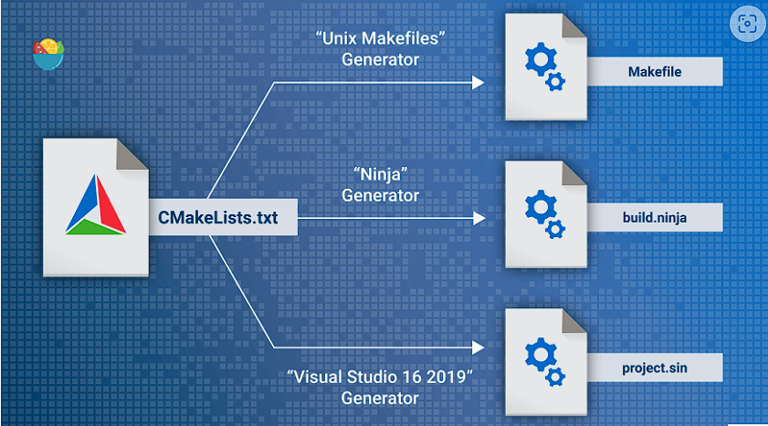
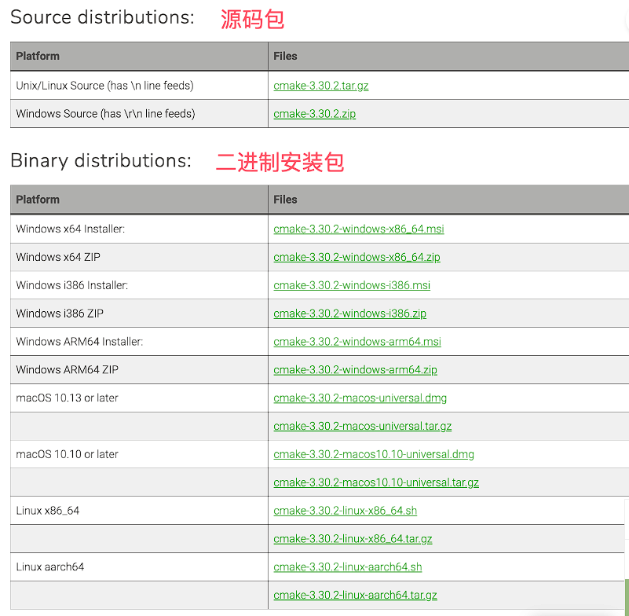
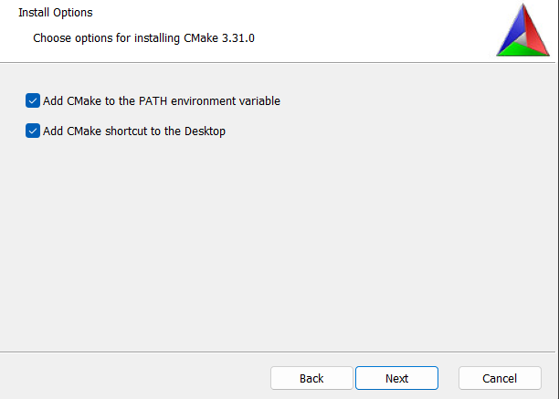
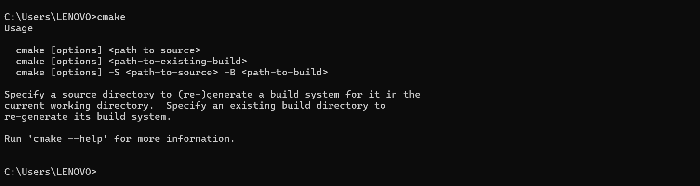
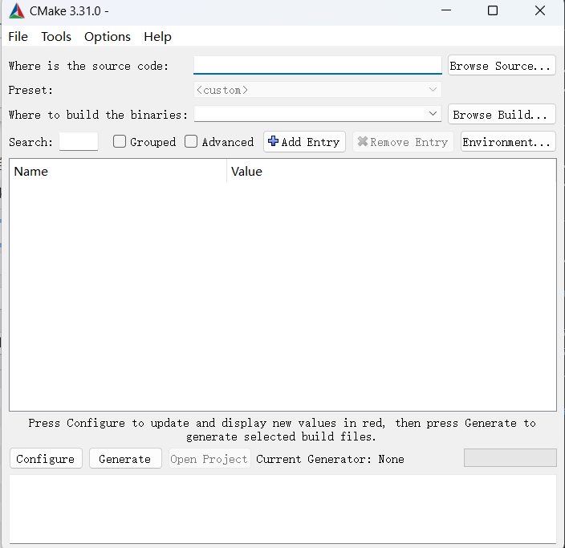
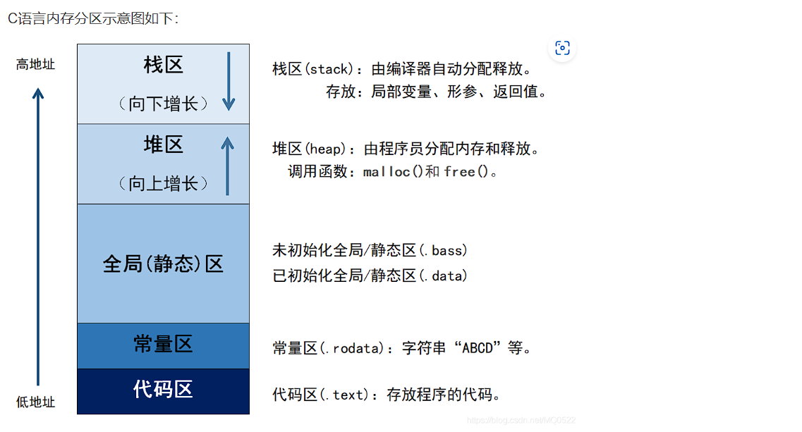
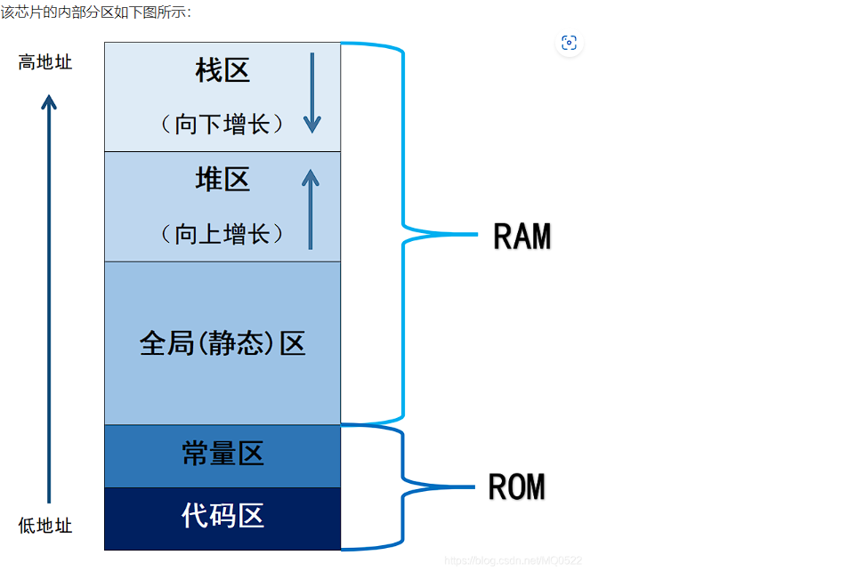
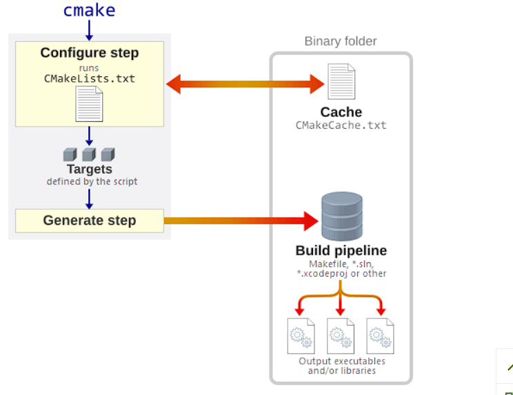
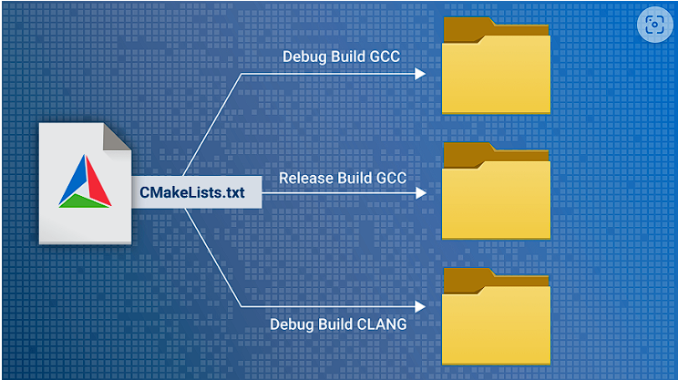
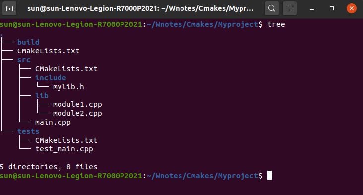

# Cmakes

## 一、Cmakes 介绍

### Cmakes简介

CMake 是个一个开源的跨平台自动化建构系统，用来管理软件建置的程序，并不依赖于某特定编译器，并可支持多层目录、多个应用程序与多个函数库。

CMake 通过使用简单的配置文件 CMakeLists.txt，自动生成不同平台的构建文件（如 Makefile、Ninja 构建文件、Visual Studio 工程文件等），简化了项目的编译和构建过程。

CMake 本身不是构建工具，而是生成构建系统的工具，它生成的构建系统可以使用不同的编译器和工具链

### Cmakes作用与优势

- 跨平台支持： CMake 支持多种操作系统和编译器，使得同一份构建配置可以在不同的环境中使用。
- 简化配置： 通过 CMakeLists.txt 文件，用户可以定义项目结构、依赖项、编译选项等，无需手动编写复杂的构建脚本。
- 自动化构建： CMake 能够自动检测系统上的库和工具，减少手动配置的工作量。
- 灵活性： 支持多种构建类型和配置（如 Debug、Release），并允许用户自定义构建选项和模块。

### 构建配置

- CMakeLists.txt 文件： CMake 的配置文件，用于定义项目的构建规则、依赖关系、编译选项等。每个 CMake 项目通常包含一个或多个 CMakeLists.txt 文件。

- 构建目录： 为了保持源代码的整洁，CMake 鼓励使用独立的构建目录（Out-of-source 构建）。这样，构建生成的文件与源代码分开存放。

### 基本工作流程

- 编写 CMakeLists.txt 文件： 定义项目的构建规则和依赖关系。

- 生成构建文件： 使用 CMake 生成适合当前平台的构建系统文件（例如 Makefile、Visual Studio 工程文件）。

- 执行构建： 使用生成的构建系统文件（如 make、ninja、msbuild）来编译项目。



学习链接：

[Cmake官网](https://cmake.org/)

[Cmake官方文档](https://cmake.org/cmake/help/latest/guide/tutorial/index.html)

[Cmake源码](https://github.com/Kitware/CMake)

[Cmake源码](https://gitlab.kitware.com/cmake/cmakeku)

## 二、Cmake安装与配置

CMake 支持的操作系统：

- Microsoft Windows
- Apple macOS
- Linux
- FreeBSD
- OpenBSD
- Solaris
- AIX

### 安装Cmake

CMake 可以在不同操作系统上进行安装，本文将介绍 Windows、Linux系统下的安装与配置。

[CMake 安装包下载地址](https://cmake.org/download/)



补充安装架构：

|  架构   |                  指令集位数                  | 原因                                                                                                                                                                                                                            |
| :-----: | :------------------------------------------: | :------------------------------------------------------------------------------------------------------------------------------------------------------------------------------------------------------------------------------ |
|   X86   |                     32位                     | 英特尔出的处理习惯以86为结尾，如80186、80286、80386，所以之后被称之为 X86                                                                                                                                                       |
|  AMD64  |                     64位                     | 32位向64位演进时，AMD 抢先制造出了兼容 X86 32位指令集的 64位处理器                                                                                                                                                              |
| X86-64  |                     64位                     | 因特尔设计 IA-64，比amd晚了一步，且不兼容 X86 32位指令集，比较惨淡。因此后续因特尔也采用 AMD64，但在此基础上进行了扩充，并改名为 X86-64。所以 x86_64，x64,AMD64基本上是同一个东西，现在用的intel/amd的桌面级CPU基本上都是x86_64 |
|   ARM   |                                              | 适用于移动通信这种低成本、高性能、低耗电的领域                                                                                                                                                                                  |
| ARM-V8  | AArch64：64位执行状态，AArch32：32位执行状态 | 有两种执行态，适用于 32位和64位                                                                                                                                                                                                 |
| AArch64 |                     64位                     | 从 ARM-V8 中独立出来                                                                                                                                                                                                            |

#### Windows下安装

运行下载的.msi文件即可



将Cmake添加进PATH


安装成功

#### Linux下安装

直接用包管理工具安装：

对于 Ubuntu 或 Debian 系统：sudo apt-get install cmake
对于 Fedora 系统：sudo dnf install cmake
对于 Arch Linux 系统：sudo pacman -S cmake

源码编译安装：

解压源码包，进入解压后的目录。
执行以下命令编译和安装：
```
./bootstrap
make
sudo make install
```

cmake --version 验证安装成功

### 配置Cmake

确保 CMake 的安装路径被添加到系统的 PATH 环境变量中，这样可以在任何位置的命令行中访问 CMake。

#### Windows下配置：

如果在安装过程中选择了将 CMake 添加到 PATH，则不需要额外配置。
如果未选择，可以手动添加：右键点击"计算机"或"此电脑"，选择"属性" -> "高级系统设置" -> "环境变量"，在"系统变量"中找到 Path，点击"编辑"，将 CMake 的安装路径添加进去。

#### Linux配置：

通常安装程序会自动配置 PATH，如果没有，可以手动配置。
打开终端，编辑 ~/.bash_profile 或 ~/.zshrc 文件，添加以下行：
```
export PATH="/usr/local/bin:$PATH"
```
export 常用于设置和显示环境变量：

#### 补充export：
在shell中执行程序时，shell会提供一组环境变量。export可新增，修改或删除环境变量，供后续执行的程序使用。
语法
```shell

export [-fnp][变量名称]=[变量设置值]
 
参数说明：
 
-f 　代表[变量名称]中为函数名称。
-n 　删除指定的变量。变量实际上并未删除，只是不会输出到后续指令的执行环境中。
-p 　列出所有的shell赋予程序的环境变量。

```
#将/tmp/hello的路径加入到PATH，从而可以在任何地方直接使用hello命令。

> export PATH=$PATH:/tmp/hello

该修改胜于修改环境变量，但只在本次登录中有效
注意：（与shell变量相结合）
 = 前PATH变量不加$符号，再增加的路径用：追加。

解释：
\$PATH 获取当前环境变量 : 可以追加新的变量
最后将新产生的变量赋值给PATH，并用PATH修改为环境变量

但是这种修改只是暂时的，只对当前bash起作用：

全局修改：

方式一：修改profile文件

```bash
sudo gedit /etc/profile     #该修改将对所有用户都起作用。
```
在里面加入

> export PATH=$PATH:opt/ros/bin

直接修改计算机配置文件，不建议如此使用

方式二：修改.bashrc或者bash_profile文件

> gedit ~/.bashrc  #只对本用户起作用。

内部加入

> export PATH=$PATH:/opt/ros/bin

注意：
1、执行脚本时是在一个子shell环境运行的，脚本执行完后该子shell自动退出；
2、一个shell中的系统环境变量才会被复制到子shell中（用export定义的变量）；
3、一个shell中的系统环境变量只对该shell或者它的子shell有效，该shell结束时变量消失（并不能返回到父shell中）。
4、不用export定义的变量只对该shell有效，对子shell也是无效的

#### 补充bash bashrc bash_profile

1. **profile文件**

profile，路径：/etc/profile，用于设置系统级的环境变量和启动程序，在这个文件下配置会对**所有用户**生效。

当用户登录（login）时，文件会被执行，并从/etc/profile.d目录的配置文件中查找shell设置。

一般不建议在/etc/profile文件中添加环境变量，因为在这个文件中添加的设置会对所有用户起作用。
当必须添加时，我们可以按以下方式添加：

> export HOST=xx.cn

添加时，可以在行尾使用;号，也可以不使用。
一个变量名可以对应多个变量值，多个变量值需要使用:进行分隔(如系统PATH变量)

添加环境变量后，需要重新登录才能生效，也可以使用 source 命令强制立即生效：

> source /etc/profile

查看是否生效可以使用 echo 命令：

> echo $HOST

2. **bashrc文件**

.bashrc是一个针对Bash shell的配置文件，用于交互式非登录shell会话。这意味着每次你打开一个新的终端窗口或标签页时，.bashrc中的配置就会被加载。

bashrc 文件有两种级别：

系统级
用户级

系统级
系统级的位于/etc/bashrc，对所有用户生效。

用户级
用户级的位于~/.bashrc，仅对当前用户生效。

bashrc 文件只会对指定的 shell 类型起作用，bashrc 只会被 bash shell 调用。

bashrc使用场景：

- 设置shell别名和函数
- 定义环境变量，这些变量仅在当前用户的shell会话中有效
- 修改命令提示符
- 设置shell的查找路径（$PATH）


3. **bash_profile**

.bash_profile（对于Bash shell）和.profile（对于其他sh兼容shell）是在登录shell会话开始时加载的配置文件。
当你通过图形界面登录、通过SSH远程连接到系统或通过终端登录时，这些文件中的设置就会生效。

使用场景：

- 环境变量的设置，这些变量在整个登录会话中都有效
- 启动必要的应用程序
- 读取其他配置文件，如.bashrc

bash_profile只对单一用户有效，文件存储位于~/.bash_profile，该文件是一个用户级的设置，可以理解为某一个用户的 profile 目录下。

这个文件同样也可以用于配置环境变量和启动程序，但只针对单个用户有效。

和 profile 文件类似，bash_profile 也会在用户登录（login）时生效，也可以用于设置环境变量。

但与 profile 不同，bash_profile 只会对当前用户生效。

如：
```bash
if [ -f ~/.bashrc ]; then
    source ~/.bashrc
fi
```
确保了登录shell时，.bashrc被调用

**读取顺序**：

首先读入全局环境变量设定档/etc/profile，然后根据其内容读取额外的设定的文档，如/etc/profile.d和/etc/inputrc；
根据不同使用者帐号，于其家目录内读取~/.bash_profile；
读取失败则会读取~/.bash_login；
再次失败则读取~/.profile（这三个文档设定基本上无差别，仅读取上有优先关系）；
最后，根据用户帐号读取~/.bashrc。

至于~/.profile与~/.bashrc都具有个性化定制功能，但~/.profile可以设定本用户专有的路径、环境变量等，它只能登入的时候执行一次。

~/.bashrc也是某用户专有设定文档，可以设定路径、命令别名，每次 shell script 的执行都会使用它一次

**区别与差异**：

- 交互式非登录vs登录Shell：

.bashrc适用于每次打开新终端时的交互式非登录shell。
.bash_profile和.profile适用于开始一个新的登录shell会话。

- 加载频率：

.bashrc在每次打开新的终端窗口或标签时加载。
.bash_profile和.profile仅在登录时加载。

- 通用性：

.profile可以被多种兼容sh的shell读取，而.bash_profile特定于Bash。

**如何选择**：

对于Bash用户：在.bash_profile中设置环境变量，并确保它加载.bashrc。
对于非Bash sh兼容shell用户：使用.profile来设置环境变量。
通用配置：可以将通用配置放在.profile中，特定于Bash的配置放在.bashrc中。

### Cmake GUI



Linux中输入camke-gui启动

设置源代码目录有构建目录：

- 源代码目录（Source Code Directory）： 指向包含 CMakeLists.txt 文件的目录。
- 构建目录（Build Directory）： 指向用于存放生成的构建文件的目录。建议使用独立的目录以保持源代码的整洁。

配置和生成：

- 点击 "Configure" 按钮，选择编译器和构建选项，CMake 会检查依赖项并生成配置。
- 点击 "Generate" 按钮，CMake 会生成适合当前平台的构建文件。

## 三、Cmake基础

CMakeLists.txt文件配置

CMakeLists.txt 是 CMake 的配置文件，用于定义项目的构建规则、依赖关系、编译选项等。
每个 CMake 项目通常都有一个或多个 CMakeLists.txt 文件。

### 文件结构与语法

#### 基础指令

CMakeLists.txt 文件使用一系列的 CMake 指令来描述构建过程。常见的指令包括：

1. 指定Cmake的最低版本要求

```cmake
cmake_minimum_required(VERSION <version>)

cmake_minimum_required(VERSION 3.10)
```

2. 定义项目名称与使用的编程语言

```cmake
project(<project_name> [<language>...])

project(MyProject CXX)
```

3. 指定要生成的可执行文件和七源文件

```cmake
add_executable(<target> <source_files>...)

add_executable(MyExecutable main.cpp other_file.cpp)
```

4. 创建一个库（静态库或者动态库）及其源文件

```cmake
add_library(<target> <source_files>...)

add_library(MyLibrary STATIC library.cpp)
```

创建一个库目标，名称为MyLibrary STATIC表明为静态库 

5. 链接目标文件与其他库

```cmake
target_link_libraries(<target> <libraries>...)

target_link_libraries(MyExecutable MyLibrary)
```
将库链接到可执行文件，MyExecutable为最终目标，MyLibrary为被连接的库名

6. 头文件搜索路径
   
```cmake
include_directories(<dirs>...)

include_directories(${PROJECT_SOURCE_DIR}/include)
```

执行包含文件目录，PROJECT_SOURCE_DIR为一个Cmake变量，获取变量值，名加上include目录

7. 设置变量值

```cmake
set(<variable> <value>...)

set(CMAKE_CXX_STANDARD 11)
```

8. 设置目标属性

```cmake
target_include_directories(TARGET target_name
                          [BEFORE | AFTER]
                          [SYSTEM] [PUBLIC | PRIVATE | INTERFACE]
                          [items1...])

target_include_directories(MyExecutable PRIVATE ${PROJECT_SOURCE_DIR}/include)
```
为特定目标添加包含目录。可以指定包含目录的作用范围与顺序
即为某个特定的可执行文件或库目标指定头文件的搜索路径。比include_directories控制更加精准

TARGET target_name : 指定目标的名称

[BEFORE | AFTER] : 指定包含目录是在现有目录之前还是之后 默认AFTER

[SYSTEM] : 指定包含目录标记为系统目录

[PUBLIC | PRIVATE | INTERFACE]

PRIVATE：仅对当前目标可见，依赖于这个目标的其他目标不会继承这些包含目录。
PUBLIC：对当前目标和依赖于该目标的其他目标都可见。
INTERFACE：当前目标不会使用这些包含目录，但依赖于它的其他目标可以使用。

示例：
MyProject/
├── CMakeLists.txt
├── include/
│   └── myheader.h
└── src/
    └── main.cpp

```cmake
add_library(MyLibrary STATIC src/library.cpp)
target_include_directories(MyLibrary PUBLIC ${PROJECT_SOURCE_DIR}/include)

add_executable(MyExecutable src/main.cpp)
target_link_libraries(MyExecutable MyLibrary)
```

9. 安装规则

```cmake
install(TARGETS target1 [target2 ...]
        [RUNTIME DESTINATION dir]
        [LIBRARY DESTINATION dir]
        [ARCHIVE DESTINATION dir]
        [INCLUDES DESTINATION [dir ...]]
        [PRIVATE_HEADER DESTINATION dir]
        [PUBLIC_HEADER DESTINATION dir])


install(TARGETS MyExecutable RUNTIME DESTINATION bin)
```
命令用于指定如何安装目标文件（如可执行文件、库等）。
这个命令可以将生成的目标文件安装到指定的目录中。

|              参数              |                                      说明                                       |
| :----------------------------: | :-----------------------------------------------------------------------------: |
| TARGETS target1 [target2 ...]  |   指定要安装的目标，可以是通过 add_executable() 或 add_library() 定义的目标。   |
|    RUNTIME DESTINATION dir     |     指定可执行文件的安装目录。通常用于安装由 add_executable() 创建的目标。      |
|    LIBRARY DESTINATION dir     |    指定动态库的安装目录。通常用于安装由 add_library() 创建的共享库（动态库）    |
|    ARCHIVE DESTINATION dir     |         指定静态库的安装目录。通常用于安装由 add_library() 创建的静态库         |
| INCLUDES DESTINATION [dir ...] | 指定头文件的安装目录。这个选项通常与 PUBLIC_HEADER 或 PRIVATE_HEADER 一起使用。 |
| PRIVATE_HEADER DESTINATION dir |      指定私有头文件的安装目录。私有头文件通常仅供库内部使用，不对外公开。       |
| PUBLIC_HEADER DESTINATION dir  |          指定公共头文件的安装目录。公共头文件对外公开，供其他项目使用           |

示例：
MyProject/
├── CMakeLists.txt
├── include/
│   └── myheader.h
├── src/
│   └── library.cpp
└── main.cpp

```cmake
# 定义静态库
add_library(MyLibrary STATIC src/library.cpp)
set_target_properties(MyLibrary PROPERTIES PUBLIC_HEADER include/myheader.h)

# 定义可执行文件
add_executable(MyExecutable main.cpp)

# 安装目标
install(TARGETS MyLibrary MyExecutable
        RUNTIME DESTINATION bin
        LIBRARY DESTINATION lib
        ARCHIVE DESTINATION lib
        PUBLIC_HEADER DESTINATION include)

```
10. 条件语句

```cmake
if(expression)
  # Commands
elseif(expression)
  # Commands
else()
  # Commands
endif()

if(CMAKE_BUILD_TYPE STREQUAL "Debug")
  message("Debug build")
endif()
```

CMAKE_BUILD_TYPE 表示當前的构建的类型变量

STREQUAL 字符串比较的关键字 可以返回TRUE或者FALSE

11. 自定义命令

```cmake
add_custom_command(
   TARGET target
   PRE_BUILD | PRE_LINK | POST_BUILD
   COMMAND command1 [ARGS] [WORKING_DIRECTORY dir]
   [COMMAND command2 [ARGS]]
   [DEPENDS [depend1 [depend2 ...]]]
   [COMMENT comment]
   [VERBATIM]
)

add_custom_command(
   TARGET MyExecutable POST_BUILD
   COMMAND ${CMAKE_COMMAND} -E echo "Build completed."
)
```
add_custom_command 命令用于为指定的目标添加自定义构建步骤

TARGET target：指定要添加自定义命令的目标。这个目标必须是通过 add_executable() 或 add_library() 创建的
PRE_BUILD | PRE_LINK | POST_BUILD：

    PRE_BUILD：在构建目标之前执行命令（仅适用于 Visual Studio）。
    PRE_LINK：在链接目标之前执行命令。
    POST_BUILD：在构建目标之后执行命令。
COMMAND command1 [ARGS] [WORKING_DIRECTORY dir]：指定要执行的命令及其参数。可以使用多个 COMMAND 来指定多个命令
DEPENDS [depend1 [depend2 ...]]：指定命令依赖的文件或目标。如果这些依赖项发生变化，命令将重新执行。
COMMENT comment：为命令添加注释，通常用于在构建输出中显示信息。
VERBATIM：确保命令参数被正确传递，不进行任何解释或替换。这对于包含特殊字符的命令非常有用

如：COMMAND ${CMAKE_COMMAND} -E echo "Build completed.

\${CMAKE_COMMAND}：这是一个CMake变量，表示CMake的可执行文件路径。使用这个变量可以确保命令在不同平台上都能正确找到CMake。
-E：这是CMake的一个选项，用于执行CMake内置的命令。
echo "Build completed."：这是CMake内置命令之一，用于在控制台输出指定的消息。在这个例子中，它会输出 "Build completed."

示例：
```cmake
cmake_minimum_required(VERSION 3.10)
project(MyProject CXX)

# 添加源文件
add_executable(MyExecutable main.cpp)

# 设置 C++ 标准
set(CMAKE_CXX_STANDARD 11)
```

#### **补充**：

##### C语言代码执行过程：

可以分为以下几个主要阶段：预处理、编译、汇编和链接。每个阶段都有其特定的任务和输出。

预处理阶段：
主要处理头文件、宏定义和注释。预处理器会生成一个扩展名为 .i 的中间文件。
主要任务有:

    展开头文件
    宏展开
    删除注释

编译阶段：
编译阶段将预处理后的代码转换为汇编代码，生成一个扩展名为 .s 的汇编文件。
主要任务有：

    语法分析：检查代码的语法是否正确。
    语义分析：检查代码的逻辑和语义是否正确。
    代码优化：对代码进行优化以提高执行效率。
    生成汇编代码：将高级语言代码转换为汇编语言。

汇编阶段：
汇编阶段将汇编代码转换为机器代码，生成一个扩展名为 .o（或 .obj）的目标文件
主要任务有：

    翻译汇编代码：将汇编语言指令转换为机器语言指令。
    生成目标文件：创建包含机器代码的目标文件。

链接阶段：
链接阶段将多个目标文件和库文件合并，生成最终的可执行文件。（可装入模块）
主要任务有：

    符号解析：解析并解决不同目标文件之间的符号引用。
    地址重定位：调整代码和数据的地址以生成可执行文件。
    生成可执行文件：创建包含所有必要代码和数据的可执行文件。

##### gcc静态库动态库的编写与连接：

动态库与静态库区别：

静态库（Static Library）:

    链接方式：在编译时将库的代码直接整合到目标程序中。生成的可执行文件包含所有需要的库代码。
    文件扩展名：通常为 .a（在Unix/Linux上）或 .lib（在Windows上）。
    优点：
        独立性：生成的可执行文件可以独立运行，不需要依赖外部库文件1。
        加载速度快：因为所有代码都已经包含在可执行文件中，运行时不需要额外加载库文件2。
    缺点：
        文件体积大：因为所有库代码都包含在可执行文件中，文件体积较大1。
        更新不便：如果库代码有更新，需要重新编译整个程序。

动态库（Dynamic Library）:

    链接方式：在运行时加载库文件。可执行文件中只包含对库的引用，实际的库代码在运行时加载。
    文件扩展名：通常为 .so（在Unix/Linux上）或 .dll（在Windows上）。
    优点：
        节省内存：多个程序可以共享同一个动态库，减少内存占用3。
        易于更新：更新库文件时，不需要重新编译整个程序，只需替换动态库文件1。
    缺点：
        加载速度慢：运行时需要加载库文件，可能会影响启动速度2。
        依赖性：可执行文件依赖于外部的动态库文件，如果库文件缺失或版本不匹配，程序可能无法运行3

静态库适用于需要独立运行且不频繁更新的程序，优点是独立性强、加载速度快，但文件体积大且更新不便。
动态库适用于需要共享库资源且频繁更新的程序，优点是节省内存、易于更新，但加载速度较慢且依赖外部库文件

静态库制作：
> ar rcs libname.a file1.o file2.o
- r (replace)：将文件插入到库中。如果库中已经存在同名文件，则替换它。
- c (create)：创建库文件。如果库文件不存在，则创建一个新的库文件。
- s (index)：创建库文件的索引。这个索引用于加速库文件的访问。

静态库使用：
> gcc test.c libmath.a -o a.out 

利用libmath.a生成a.out可装入模块

静态库在装入时，会链接到库文件，将静态库文件一起装入可装入模块
是一种静态链接的方式。

在编译阶段编译器需要知道函数和变量的声明，用于符号解释，这些声明一般在头文件中提供。
故而，编译时需要查找mylib.h 对应库文件的头文件。在链接阶段需要将制定库文件的头文件进行制定，利用-L参数
gcc main.o -L. -lmylib -I./include -o main
-L用于指定库文件目录 -l用于指定库文件的库名 -I可以指定头文件目录

在大型项目中可以使用Cmake进行管理头文件与库文件的依赖关系。
```cmake
add_library(MyLibrary STATIC mylib.c)
target_include_directories(MyLibrary PUBLIC ${PROJECT_SOURCE_DIR}/include)
```

动态库制作：

动态库采用动态加载的方式，会在运行时动态链接库文件加载到共享内存块中使用。
如：
```C
#include <stdio.h>
#include <dlfcn.h>

int main() {
    void *handle;
    void (*hello)();
    char *error;

    // 加载动态库
    handle = dlopen("./libmylib.so", RTLD_LAZY);
    if (!handle) {
        fprintf(stderr, "%s\n", dlerror());
        return 1;
    }

    // 获取函数地址
    dlerror(); // 清除任何现有的错误
    *(void **) (&hello) = dlsym(handle, "hello");
    if ((error = dlerror()) != NULL)  {
        fprintf(stderr, "%s\n", error);
        return 1;
    }

    // 调用函数
    hello();

    // 卸载动态库
    dlclose(handle);
    return 0;
}
```
在动态链接中，存在一个@plt 过程链接表。可以用于延迟绑定函数地址，用于动态链接库的函数调用。
PLT：

    作用：PLT 是一个函数指针数组，存储在可执行文件中。当程序调用动态库中的函数时，最初的调用会跳转到 PLT 中的一个入口。
    延迟绑定：PLT 允许在程序运行时动态解析函数地址，而不是在程序启动时一次性解析所有函数地址。这种机制可以减少程序启动时间，并且只在需要时解析函数地址。
    工作原理：
        当程序第一次调用一个动态库函数时，控制权会转移到 PLT 中的相应入口。
        PLT 会调用动态链接器（Dynamic Linker），动态链接器会查找实际的函数地址，并将其存储在全局偏移表（GOT）中。
        之后的调用会直接跳转到 GOT 中存储的实际函数地址，从而避免再次调用动态链接器。

使用示例：

    第一次调用：
        程序调用 foo 时，跳转到 PLT 中的 foo@plt 入口。
        foo@plt 调用动态链接器，动态链接器查找 foo 的实际地址，并将其存储在 GOT 中。
        动态链接器将控制权转移到 foo 的实际地址，执行函数。
    后续调用：
        程序再次调用 foo 时，直接跳转到 GOT 中存储的 foo 的实际地址，执行函数。

利用这种动态链接延迟绑定的方式，提高了程序的灵活度。

如何制作动态库呢？

> gcc -c add.c -o add.o -fPIC

通过此命令将源文件编译成机器码二进制文件，其中-fPIC参数旨在生成位置无关码
位置无关代码是一种编译方式，使得生成的机器代码可以在内存中的任何位置执行，而不需要进行重定位。
这对于动态库（共享库）的创建和使用非常重要。

然后利用gcc命令进行装入

> gcc -shared mylib.o -o libmylib.so

生成动态库

使用动态库：

> gcc main.c -L. -lmylib -I./includes -o main

需要分别利用-L指定库目录 -l指定库名 -I可以指定头文件目录

注意：此时生成的文件仍然会报错，出现找不到动态库的错误

原因：
以上指定，只是在编译时制定了动态库的路径，然而动态库在运行中也需要确保系统能够找到库。
故而运行时也需要指定库地址（供动态链接器使用）。通常是通过修改环境变量的方式进行。

方式一：设置动态链接器的环境变量

> export LD_LIBRARY_PATH=/path/to/your/library:$LD_LIBRARY_PATH

通过:添加新地址 export声明到全局
缺点是只能在此个shell有效

方式二：修改bashrc文件

在bashrc文件中添加命令
> export LD_LIBRARY_PATH=/path/to/your/library:$LD_LIBRARY_PATH
每次打开终端，都执行了bashrc
故而都只进行了变量的声明
./source 立即生效

方式三：移到C标准库

C语言的标准库也需要动态链接，环境变量中本身包含了C的基本库路径
故而把自己做的库添加进标准库即可，但是不推荐

一般添加进/lib或者/usr/lib即可

方式四：

修改ld动态链接的配置文件

/etc/ld.so.conf 文件

添加动态库路径

可以用ldd查看库链接

数据段的合并与main地址回填：（链接阶段）

数据段合并:

数据段的合并是指将程序中的不同数据段（如 .data 段、.bss 段、.rodata 段等）合并到一起，以优化内存使用。
这一过程通常在链接阶段进行，目的是减少内存碎片，提高内存利用率。

|.data 段：存储已初始化的全局变量和静态变量。
|.bss 段：存储未初始化的全局变量和静态变量。

|.rodata 段：存储只读数据，如字符串常量。
|.text 段：存储程序的代码。

通过将这些段合并，可以减少内存的浪费。例如，如果每个段单独占用一页（通常为4KB），合并后可以减少页的数量，从而节省内存





main地址回填：

地址回填是指在链接阶段，将函数调用的地址从相对地址转换为绝对地址。
具体来说，链接器会在生成可执行文件时，将 main 函数的地址确定下来，并将所有对 main 函数的调用地址进行回填。

编译阶段：在编译阶段，编译器生成的目标文件中，函数调用通常使用相对地址。例如，调用 main 函数时，目标文件中可能会有一个占位符。
链接阶段：在链接阶段，链接器将所有目标文件和库文件合并，并确定每个函数和变量的最终地址。此时，链接器会将 main 函数的实际地址填入到所有调用 main 函数的位置。

### 变量与缓存

CMake 使用变量来存储和传递信息，这些变量可以在 CMakeLists.txt 文件中定义和使用。

变量可以分为普通变量和缓存变量。

1. 变量的定义与使用

定义变量：

> set(MY_VAR "Hello world")

使用变量：

> message(STATUS "variable MY_VAR is ${MY_VAR}")

2. 缓存变量

缓存变量存储在 CMake 的缓存文件中，用户可以在 CMake 配置时修改这些值。
缓存变量通常用于用户输入的设置，例如编译选项和路径。

定义缓存变量

> set(MY_CACHE_VAR "DefaultValue" CACHE STRING "A cache variable")

定义MY_CACHE_VAR 默认值为DefaultValue 类型为STRING 描述为 A cache variable
使用缓存变量

> message(STATUS "Cache variable MY_CACHE_VAR is ${MY_CACHE_VAR}")

输出缓存变量的值，STATUS表示输出的为一个状态消息，显示时通常带有--前缀

### 查找包和库

#### find_package命令

CMake 可以通过 find_package() 指令自动检测和配置外部库和包。
常用于查找系统安装的库或第三方库。
如 查找Boost库
基本使用：
> find_package(Boost REQUIRED)

指定版本：
> find_package(Boost 1.70 REQUIRED)

查找库并指定库路径：
> find_package(OpenCV REQUIRED PATHS /path/to/opencv)

通过PATHS参数指定opencv的安装路径

使用查找到的库：
> target_link_libraries(MyExecutable Boost::Boost)

target_link_libraries：
这是CMake的一个命令，用于指定目标文件（如可执行文件或库）需要链接的库。
MyExecutable：
这是你的目标文件的名称。在这个例子中，MyExecutable是你要生成的可执行文件。
Boost::Boost：
这是要链接的库的名称。在这里，Boost::Boost表示Boost库。
使用这种命名方式是因为Boost库在CMake中通常是以目标的形式导出，这样可以确保正确的包含路径和链接选项。

设置包含目录与链接目录：
> include_directories(${Boost_INCLUDE_DIRS})
> link_directories(${Boost_LIBRARY_DIRS})

#### 使用第三方库

示例：

```cmake
cmake_minimum_required(VERSION 3.10)
project(MyProject CXX)

# 查找 Boost 库
find_package(Boost REQUIRED)

# 添加源文件
add_executable(MyExecutable main.cpp)

# 链接 Boost 库
target_link_libraries(MyExecutable Boost::Boost)
```

## 四、CMake的构建流程

CMake 的构建流程分为几个主要步骤，从设置项目到生成和执行构建命令。

1. 创建构建目录：保持源代码目录整洁。
2. 使用 CMake 生成构建文件：配置项目并生成适合平台的构建文件。
3. 编译和构建：使用生成的构建文件执行编译和构建。
4. 清理构建文件：删除中间文件和目标文件。
5. 重新配置和构建：处理项目设置的更改。



### 创建构建目录

CMake 推荐使用 "Out-of-source" 构建方式，即将构建文件放在源代码目录之外的独立目录中。

这样可以保持源代码目录的整洁，并方便管理不同的构建配置。



创建构建目录：
在项目的根目录下，创建一个新的构建目录。例如，可以创建一个名为 build 的目录

> mkdir build

进入构建目录

> cd build

### 使用CMake生成构建文件

在构建目录中运行 CMake，以生成适合当前平台的构建系统文件（例如 Makefile、Ninja 构建文件、Visual Studio 工程文件等）。

运行 CMake 配置：在构建目录中运行 CMake 命令，指定源代码目录。源代码目录是包含 CMakeLists.txt 文件的目录。

> cmake 源代码目录

注意源代码目录包含CMakeLists.txt文件 

注意如果需要指定生成器，可以使用-G参数

> cmake -G "Ninja" ..

指定构建类型，可以使用-DCMAKE_BUILD_TYPE参数指定

> cmake -DCMAKE_BUILD_TYPE=Release ..

检查配置结果：
CMake 会输出配置过程中的详细信息，包括找到的库、定义的选项等，如果没有错误，构建系统文件将被生成到构建目录中。

### 编译与构建

使用生成的构建文件进行编译和构建。
不同的构建系统使用不同的命令。

1. makefile构建的文件

> make 

即可编译

如果需要构建特定目标

> make MyExecutable

2. 使用Ninja构建系统

> ninja
> ninja MyExecutable

3. 使用Visual Studio构建系统

如果生成了 Visual Studio 工程文件，可以打开 .sln 文件，然后在 Visual Studio 中选择构建解决方案。
> msbuild MyProject.sln /p:Configuration=Release

### 清理构建文件

构建过程中生成的中间文件和目标文件可以通过清理操作删除

1. Makefile

运行 make clean 命令（如果定义了清理规则）来删除生成的文件。

> make clean

2. Ninja

运行 ninja clean 命令（如果定义了清理规则）来删除生成的文件。

> ninja clean

3. 手动删除

可以手动删除构建目录中的所有文件，但保留源代码目录不变。例如：

> rm -rf build/*

### 重新配置与构建

如果修改了 CMakeLists.txt 文件或项目设置，可能需要重新配置和构建项目。

重新运行 CMake 配置：在构建目录中重新运行 CMake 配置命令。

> cmake ..

重新编译：使用构建命令重新编译项目。

> make

## 五、构建实例

CMake 构建步骤如下：

   1. 创建 CMakeLists.txt 文件：定义项目、目标和依赖。
   2. 创建构建目录：保持源代码目录整洁。
   3. 配置项目：使用 CMake 生成构建系统文件。
   4. 编译项目：使用构建系统文件编译项目。
   5. 运行可执行文件：执行生成的程序。
   6. 清理构建文件：删除中间文件和目标文件。

假设我们有一个简单的 C++ 项目，包含一个主程序文件和一个库文件，我们将使用 CMake 构建这个项目。

我们的项目结构如下：

MyProject/

├── CMakeLists.txt
├── src/
│   ├── main.cpp
│   └── mylib.cpp
└── include/
    └── mylib.h

main.cpp：主程序源文件。
mylib.cpp：库源文件。
mylib.h：库头文件。
CMakeLists.txt：CMake 配置文件

### 1.创建 CMakeLists.txt 文件

在 MyProject 目录下创建 CMakeLists.txt 文件。
CMakeLists.txt 文件用于配置 CMake 项目。

```cmake
cmake_minimum_required(VERSION 3.10)   # 指定最低 CMake 版本

project(MyProject VERSION 1.0)          # 定义项目名称和版本

# 设置 C++ 标准为 C++11
set(CMAKE_CXX_STANDARD 11)
set(CMAKE_CXX_STANDARD_REQUIRED ON)

# 添加头文件搜索路径
include_directories(${PROJECT_SOURCE_DIR}/include)

# 添加源文件
add_library(MyLib src/mylib.cpp)        # 创建一个库目标 MyLib
add_executable(MyExecutable src/main.cpp)  # 创建一个可执行文件目标 MyExecutable

# 链接库到可执行文件
target_link_libraries(MyExecutable MyLib)
```
说明：
- cmake_minimum_required(VERSION 3.10)：指定 CMake 的最低版本为 3.10。
- project(MyProject VERSION 1.0)：定义项目名称为 MyProject，版本为 1.0。
- set(CMAKE_CXX_STANDARD 11)：指定 C++ 标准为 C++11。
- include_directories(${PROJECT_SOURCE_DIR}/include)：指定头文件目录。
- add_library(MyLib src/mylib.cpp)：创建一个名为 MyLib 的库，源文件是 mylib.cpp。
- add_executable(MyExecutable src/main.cpp)：创建一个名为 MyExecutable 的可执行文件，源文件是 main.cpp。
- target_link_libraries(MyExecutable MyLib)：将 MyLib 库链接到 MyExecutable 可执行文件。

### 2.创建构建目录

为了保持源代码目录的整洁，我们将在项目根目录下创建一个单独的构建目录。

创建构建目录

打开终端，进入 MyProject 目录，然后创建构建目录：

> mkdir build
> cd build

### 3.配置项目

在构建目录中使用 CMake 配置项目。
这将生成适合平台的构建系统文件（如 Makefile）

运行 CMake 配置

在构建目录中运行 CMake 配置命令：
>cmake ..

cmake ..：.. 指向源代码目录，即包含 CMakeLists.txt 文件的目录。
CMake 将读取 CMakeLists.txt 文件并生成构建系统文件。

### 4.编译项目

使用生成的构建系统文件编译项目。根据生成的构建系统文件类型，使用相应的构建命令。

使用 Makefile

如果生成了 Makefile（在大多数类 Unix 系统中默认生成），可以使用 make 命令进行编译：

> make

### 5.运行可执行文件

编译完成后，可以运行生成的可执行文件。
运行可执行文件
在构建目录中，运行 MyExecutable：

./MyExecutable

### 6.清理构建文件

清理构建文件以删除生成的中间文件和目标文件。

使用 make clean
如果在 CMakeLists.txt 中定义了清理规则，可以使用 make clean 命令：

> make clean
make clean：删除中间文件和目标文件。
手动删除

如果没有定义清理规则，可以手动删除构建目录中的所有文件：

> rm -rf build/*

## 六、CMake高级特性

CMake 高级特性允许我们更灵活地管理和配置 CMake 项目，以适应复杂的构建需求和环境。
本文将从以下几方面展开说明：

  1. 自定义 CMake 模块和脚本：创建自定义模块和脚本以简化构建过程。
  2. 构建配置和目标：使用多配置生成器和定义多个构建目标。
  3. 高级查找和配置：灵活地查找包和配置构建选项。
  4. 生成自定义构建步骤：添加自定义命令和目标以执行额外的构建操作。
  5. 跨平台和交叉编译：支持不同平台的构建和交叉编译。
  6. 目标属性和配置：设置和修改目标的属性，以满足特定需求。

### 1.自定义CMake模块与脚本

#### 1.1 自定义CMake模块
CMake 允许你创建和使用自定义模块，以简化常见的构建任务。
自定义模块通常包含自定义的 CMake 脚本和函数。

创建自定义CMake模块：

    在项目目录下创建一个 cmake/ 目录，用于存放自定义 CMake 模块。
    在 cmake/ 目录下创建一个 MyModule.cmake 文件。
    在 CMakeLists.txt 文件中包含自定义模块：

包含示例：
```cmake
list(APPEND CMAKE_MODULE_PATH "${CMAKE_SOURCE_DIR}/cmake")
include(MyModule)
```
解释：

list(APPEND …)：
    这是CMake的一个命令，用于向一个列表中追加元素。在这里，它向CMAKE_MODULE_PATH列表中追加一个新的路径。

CMAKE_MODULE_PATH：
    这是一个CMake变量，包含了CMake查找模块文件的路径列表。模块文件通常以.cmake为扩展名。

include(…)：
    这是CMake的一个命令，用于包含并执行指定的CMake模块文件。

自定义模块示例：

```cmake
function(my_custom_function)
  message(STATUS "This is a custom function!")
endfunction()
```
模块中定义了一个自定义函数
通过function(funname arg1 arg2) 与 endfunction

在CMakeLists.txt文件中可以直接调用自定义函数：

my_custom_function()

#### 1.2 使用CMake自定义脚本

自定义 CMake 脚本允许你执行自定义配置操作，灵活处理复杂的构建要求。

创建自定义脚本：

    在项目中创建一个脚本文件（例如 config.cmake）。
    在脚本中编写 CMake 指令。

调用脚本：

    include(${CMAKE_SOURCE_DIR}/config.cmake)

脚本和模块的区别：

    主要是内容，功能区别。实质上没有

CMake脚本
定义：

    CMake脚本通常是指包含CMake命令的文件，文件扩展名为.cmake。

执行方式：

    可以直接通过cmake -P script.cmake命令执行。(直接执行，而不走CMakeLists.txt文件)

用途：

    用于执行一系列CMake命令，通常用于配置、编译和安装过程中的特定任务。

示例：
```Cmake
# script.cmake
message(STATUS "This is a CMake script")
```
Cmake模块
定义：

    CMake模块也是包含CMake命令的文件，文件扩展名同样为.cmake，但它们通常用于实现模块化功能。

执行方式：

    通过include(ModuleName)命令包含到CMakeLists.txt中。

用途：

    用于定义和封装特定功能，可以在多个项目中重复使用。模块文件通常包含函数、宏和变量定义。

示例：
```cmake
# MyModule.cmake
function(my_custom_function)
  message(STATUS "This is a custom function from a module!")
endfunction()
```

主要区别

执行方式：

    1. 脚本：可以直接执行。
    2. 模块：需要通过include()命令包含到CMakeLists.txt中。
用途：

    1. 脚本：通常用于一次性任务或特定的构建步骤。
    2. 模块：用于封装和复用功能，可以在多个项目中共享。
作用域：

    1. 脚本：执行时的作用域是全局的。
    2. 模块：可以通过函数和宏来限制变量的作用域，避免全局污染。
   
### 2.构建配置与目标

#### 2.1 多配置生成器

CMake 支持多种构建配置（如 Debug、Release）。
多配置生成器允许你在同一构建目录中同时生成不同配置的构建。

**指定配置类型**

在 CMakeLists.txt 中设置默认配置：

> set(CMAKE_BUILD_TYPE "Release" CACHE STRING "Build type")

设置默认的缓存变量CMAKE_BUILD_TYPE为“Release” 
CACHE标识为缓存变量 STRING标识为字符创
“Build type”为注释 

使用 Visual Studio：

在 Visual Studio 中选择构建配置（Debug 或 Release）。

#### 2.2 构建目标 

你可以定义多个构建目标，每个目标可以有不同的构建设置和选项。

添加多个目标，设置目标名及其源文件

> add_executable(MyExecutable1 src/main1.cpp)
> add_executable(MyExecutable2 src/main2.cpp)

设置目标属性：

> set_target_properties(MyExecutable1 PROPERTIES COMPILE_DEFINITIONS "DEBUG")
> set_target_properties(MyExecutable2 PROPERTIES COMPILE_DEFINITIONS "RELEASE")

set_target_properties：

    这是CMake的一个命令，用于设置指定目标的属性。

MyExecutable1：

    这是目标的名称。在这个例子中，MyExecutable1是你要设置属性的可执行文件或库的名称。

PROPERTIES：

    这是一个关键字，表示接下来要设置的属性列表。

COMPILE_DEFINITIONS：

    这是一个属性名称，表示要为目标设置的编译定义。编译定义通常用于在编译时传递预处理器宏。

“DEBUG”：

    这是要设置的编译定义的值。在这个例子中，"DEBUG"是一个预处理器宏，它将在编译MyExecutable1时定义。这通常用于启用调试相关的代码块

补充：set_target_properties使用

基本语法：
```cmake
set_target_properties(target1 target2 ... PROPERTIES prop1 value1 prop2 value2 ...)
```

> target1 target2 …：要设置属性的目标名称，可以是一个或多个。
> PROPERTIES：关键字，表示接下来是属性和值的对。
> prop1 value1 prop2 value2 …：属性和值的对，可以设置多个属性。

常见属性：

    OUTPUT_NAME：更改目标文件的输出名称。
    VERSION 和 SOVERSION：设置动态库的版本号和API版本号。
    ARCHIVE_OUTPUT_DIRECTORY, LIBRARY_OUTPUT_DIRECTORY, RUNTIME_OUTPUT_DIRECTORY：设置静态库、动态库和可执行文件的输出目录。
    DEBUG_POSTFIX：为Debug模式下的目标文件名添加后缀。

### 3.高级查找与配置

#### 3.1 查找包的高级用法

find_package命令 用于查找和配置复杂的第三方库和包

```cmake
find_package(Boost REQUIRED COMPONENTS filesystem system)
```
Boost: 这是要查找的库的名称。在这种情况下，是 Boost 库。
REQUIRED: 表示这个库是必需的。如果找不到 Boost 库，CMake 将会终止并报告错误。
COMPONENTS: 指定要查找的 Boost 库组件。在这个例子中，指定了 filesystem 和 system 组件。

注意：

    在 CMake 中，查找库的组件是指库中具体的模块或部分。
    对于 Boost 库来说，组件是 Boost 提供的不同功能模块

设置shell的查找路径
```cmake
set(BOOST_ROOT "/path/to/boost")
find_package(Boost REQUIRED)
```

BOOST_ROOT 变量通常用于指定 Boost 库的根目录，这是一个约定俗成的命名方式。
CMake 和许多其他构建系统会检查这个变量，以确定 Boost 库的安装位置。

路径查找过程：

CMake 使用一系列查找模块和配置文件来解析和替换自定义变量名为对应库的根目录。

变量设置：

    当你在 CMakeLists.txt 文件中设置变量（例如 BOOST_ROOT）时，CMake 会将这个变量存储在其内部变量表中。
    例如：set(BOOST_ROOT "/path/to/boost")。

查找模块：

    CMake 使用 find_package 命令来查找库。这个命令会调用相应的查找模块（例如 FindBoost.cmake）。
    例如：find_package(Boost REQUIRED)。

查找路径：

    查找模块会使用预定义的变量（如 BOOST_ROOT）来确定库的安装路径。
    例如，FindBoost.cmake 会检查 BOOST_ROOT 变量，并在指定路径下查找 Boost 库。

配置文件：

    有些库会提供自己的配置文件（例如 BoostConfig.cmake），这些文件包含了库的详细信息和路径。
    CMake 会加载这些配置文件，以获取库的具体路径和其他相关信息。

路径替换：
    
    一旦找到库，CMake 会将变量名替换为实际的路径，并设置相应的变量（如 Boost_INCLUDE_DIRS 和 Boost_LIBRARIES）。
    这些变量可以在后续的 CMake 配置中使用，以确保正确链接和包含库文件。

#### 3.2 配置文件和构建选项

**配置选项**

```cmake
configure_file(config.h.in config.h)
```
configure_file: 这是 CMake 的一个命令，用于配置文件。
config.h.in: 这是输入文件的路径，通常是一个模板文件，包含需要替换的变量。
config.h: 这是输出文件的路径，生成的文件将被写入该路径。

工作原理：

    变量替换: configure_file 会读取 config.h.in 文件中的内容，并将其中的变量（例如 @VAR@ 或 ${VAR}）替换为 CMake 中定义的实际值。
    生成文件: 替换完成后，生成的内容会被写入 config.h 文件

示例：

```cmake
#ifndef CONFIG_H
#define CONFIG_H

#define VERSION_MAJOR @PROJECT_VERSION_MAJOR@
#define VERSION_MINOR @PROJECT_VERSION_MINOR@
#define INSTALL_PREFIX "@CMAKE_INSTALL_PREFIX@"

#endif // CONFIG_H
```

在CmakeLists.txt文件中

```cmake
set(PROJECT_VERSION_MAJOR 1)
set(PROJECT_VERSION_MINOR 0)
set(CMAKE_INSTALL_PREFIX "/usr/local")

configure_file(config.h.in config.h)
```

执行cmake后

```cmake
#ifndef CONFIG_H
#define CONFIG_H

#define VERSION_MAJOR 1
#define VERSION_MINOR 0
#define INSTALL_PREFIX "/usr/local"

#endif // CONFIG_H
```

**配置文件** 

配置config.h.in文件

```cmake
#define VERSION "@PROJECT_VERSION@"
```

**源文件中包含配置文件**

```c
#include "config.h"
```

生成的 config.h 文件可能包含一些宏定义和配置选项，这些内容可以在你的 C 或 C++ 源代码中使用。

### 4.生成自定义构建步骤

#### 4.1自定义命令

CMake 允许你添加自定义构建命令，以便在构建过程中执行额外的操作。

添加自定义命令：
```cmake
add_custom_command(
  OUTPUT ${CMAKE_BINARY_DIR}/generated_file.txt
  COMMAND ${CMAKE_COMMAND} -E echo "Generating file" > ${CMAKE_BINARY_DIR}/generated_file.txt
  DEPENDS ${CMAKE_SOURCE_DIR}/input_file.txt
)
```
add_custom_command:这是 CMake 的一个命令，用于定义自定义构建步骤  

OUTPUT 指定命令生成的文件

\${CMAKE_BINARY_DIR}/generated_file.txt CMAKE_BINARY_DIR为内置变量，表示构建目录

COMMAND 指定要执行的命令

\${CMAKE_COMMAND}: 这是 CMake 的可执行文件路径。

-E echo “Generating file” > ${CMAKE_BINARY_DIR}/generated_file.txt: 使用 CMake 的 -E 选项执行一个命令，这里是 echo 命令，将字符串 “Generating file” 写入到 generated_file.txt 文件中。

DEPENDS: 指定这个命令的依赖文件。
 
\${CMAKE_SOURCE_DIR}/input_file.txt 表示依赖的文件路径。‘{CMAKE_SOURCE_DIR}` 是 CMake 的内置变量，表示源代码目录。

故总结命令作用为：

    定义一个自定义命令，当 input_file.txt 文件发生变化时，生成 generated_file.txt 文件。
    生成文件的内容是字符串 “Generating file”。

添加自定义目标：

```cmake
add_custom_target(generate_file ALL
  DEPENDS ${CMAKE_BINARY_DIR}/generated_file.txt)
```

add_custom_target: 这是 CMake 的一个命令，用于定义一个自定义目标。
generate_file: 这是目标的名称。在这种情况下，目标名为 generate_file。
ALL: 这个选项表示每次运行 make 或 ninja 等构建工具时，都会构建这个目标。也就是说，这个目标会被包含在默认的构建集中。
DEPENDS: 指定这个目标的依赖文件。
\${CMAKE_BINARY_DIR}/generated_file.txt: 这是依赖的文件路径。这个文件是由之前定义的自定义命令生成的。

总结作用：

    定义一个名为 generate_file 的自定义目标。
    每次构建时，都会检查并构建这个目标。
    这个目标依赖于 generated_file.txt 文件。
    因此在构建 generate_file 目标时，会确保 generated_file.txt 文件已经生成。

#### 4.2自定义目标

自定义目标可以用来执行自定义构建步骤，如生成代码、处理资源等。

创建自定义目标：

```cmake
add_custom_target(my_target
  COMMAND ${CMAKE_COMMAND} -E echo "Running custom target"
  DEPENDS some_dependency
)
```

构建过程中执行目标

```cmake
cmake --build . --target my_target
```

### 5.跨平台和交叉编译

#### 5.1 跨平台构建

CMake 支持多平台构建，允许你为不同操作系统生成适当的构建文件。

指定平台：
```cmake
cmake -DCMAKE_SYSTEM_NAME=Linux ..
```

#### 5.2 交叉编译

CMake 支持交叉编译，即为不同的架构或平台构建项目。

指向工具链文件：

> cmake -DCMAKE_TOOLCHAIN_FILE=/path/to/toolchain.cmake ..

工具链文件示例 (toolchain.cmake)：

> set(CMAKE_SYSTEM_NAME Linux)
> set(CMAKE_SYSTEM_PROCESSOR arm)

### 6.目标属性和配置

#### 6.1 目标属性 

设置和修改目标的属性，如编译选项、链接选项等。

设置编译选项：

> set_target_properties(MyExecutable PROPERTIES COMPILE_OPTIONS "-Wall")

设置链接选项：

> set_target_properties(MyExecutable PROPERTIES LINK_FLAGS "-L/path/to/lib")

#### 6.2 自定义编译和链接选项

为特定目标设置自定义的编译和链接选项。

设置编译选项：

> target_compile_options(MyExecutable PRIVATE -Wall -Wextra)

PRIVATE 这是一个访问控制关键字，表示这些编译选项仅适用于 MyExecutable 目标本身，不会传播到依赖它的其他目标。
其他访问控制关键字包括 PUBLIC（选项适用于目标及其依赖的目标）和 INTERFACE（选项仅适用于依赖这个目标的其他目标）。

设置链接选项：

> target_link_options(MyExecutable PRIVATE -L/path/to/lib)

## 七、 Cmake实战

本文将演示如何使用 CMake 管理一个中等复杂度的项目，
从创建项目到编译和运行的整个过程，涵盖了从基本配置到高级特性的实际应用。

实战内容如下：

  1. 创建 CMakeLists.txt 文件：定义项目、库、可执行文件和测试。
  2. 编写源代码和测试：编写代码和测试文件。
  3. 创建构建目录：保持源代码目录整洁。
  4. 配置项目：生成构建系统文件。
  5. 编译项目：生成目标文件。
  6. 运行可执行文件：执行程序。
  7. 运行测试：验证功能正确性。
  8. 使用自定义命令和目标：执行额外操作。
  9. 跨平台和交叉编译：支持不同平台和架构。

C++项目结构如下：

MyProject/
├── CMakeLists.txt
├── src/
│   ├── main.cpp
│   ├── lib/
│   │   ├── module1.cpp
│   │   ├── module2.cpp
│   ├── include/
│       └── mylib.h
└── tests/
    ├── test_main.cpp
    └── CMakeLists.txt

### 7.1 创建CMakeLists.txt文件

**根目录下CmakeLists.txt文件**:

```cmake
cmake_minimum_required(VERSION 3.10)   # 指定最低 CMake 版本
project(MyProject VERSION 1.0)          # 定义项目名称和版本

# 设置 C++ 标准
set(CMAKE_CXX_STANDARD 11)
set(CMAKE_CXX_STANDARD_REQUIRED ON) #强制要求使用指定的 C++ 标准

# 包含头文件路径
include_directories(${PROJECT_SOURCE_DIR}/src/include)
#补：PROJECT_SOURCE_DIR 是 CMake 的一个内置变量，表示当前项目的根目录。这个变量在调用 project() 命令时自动设置，可以用于指定相对于项目根目录的路径。

# 添加子目录
add_subdirectory(src)
add_subdirectory(tests)
```

**src下得CmakeLists.txt文件**：

```cmake
# 创建库目标
add_library(MyLib STATIC
    lib/module1.cpp
    lib/module2.cpp
)

# 指定库的头文件
target_include_directories(MyLib PUBLIC ${CMAKE_SOURCE_DIR}/src/include)
#补：CMAKE_SOURCE_DIR表示顶层 CMakeLists.txt 文件所在的目录


# 创建可执行文件目标
add_executable(MyExecutable main.cpp)

# 链接库到可执行文件
target_link_libraries(MyExecutable PRIVATE MyLib)
```

**test目录下得CMakeList.txt**:

```cmake
# 查找 GTest 包
find_package(GTest REQUIRED)
include_directories(${GTEST_INCLUDE_DIRS})

# 创建测试目标
add_executable(TestMyLib test_main.cpp)

# 链接库和 GTest 到测试目标
target_link_libraries(TestMyLib PRIVATE MyLib ${GTEST_LIBRARIES})
```

include_directories:

    这是一个 CMake 命令，用于指定包含目录。编译器在编译源文件时会搜索这些目录，以找到头文件。

\${GTEST_INCLUDE_DIRS}:

    这是一个变量，通常由 find_package(GTest REQUIRED) 命令设置。
    GTEST_INCLUDE_DIRS 变量包含了 Google Test 库的头文件路径。

### 7.2 编写源代码和测试文件

src/main.cpp：

```c++
#include <iostream>
#include "mylib.h"

int main() {
    std::cout << "Hello, CMake!" << std::endl;
    return 0;
}
```

src/lib/module1.cpp:

```c++
#include "mylib.h"

// Implementation of module1
```

src/lib/module2.cpp:

```c++
#include "mylib.h"

// Implementation of module2
```

src/include/mylib.h

```c++
#ifndef MYLIB_H
#define MYLIB_H

// Declarations of module functions

#endif // MYLIB_H
```

tests/test_main.cpp

```c++
#include <gtest/gtest.h>

// Test cases for MyLib
TEST(MyLibTest, BasicTest) {
    EXPECT_EQ(1, 1);
}
```

### 7.3 创建构建目录

> mkdir build
> cd build

### 7.4 配置项目

建目录中运行 CMake 以配置项目

> cmake ..

### 7.5 编译项目

使用生成的构建系统文件进行编译，假设生成了 Makefile：

> make

### 7.6 运行可执行文件

> ./MyExecutable

### 7.7 运行测试

> ./TestMyLib

### 7.8 使用自定义的命令与目标

#### 自定义命令

src/中CmakeLists.txt添加：

```cmake
add_custom_command(
    TARGET MyExecutable
    POST_BUILD
    COMMAND ${CMAKE_COMMAND} -E echo "Build complete!"
)
```

#### 自定义目标 

```cmake
add_custom_target(run
    COMMAND ${CMAKE_BINARY_DIR}/MyExecutable
    DEPENDS MyExecutable
)
```

> make run #运行自定义目标

如下一个makefile文件：

```Makefile
# 指定编译器
CC = g++

# 指定编译选项
CFLAGS = -Wall -Wextra -std=c++17

# 指定源文件和目标文件
SRCS = main.cpp
OBJS = $(SRCS:.cpp=.o)
TARGET = my_program

# 默认目标
all: $(TARGET)

# 链接目标文件
$(TARGET): $(OBJS)
	$(CC) $(CFLAGS) -o $(TARGET) $(OBJS)

# 编译源文件
%.o: %.cpp
	$(CC) $(CFLAGS) -c $< -o $@

# 自定义运行目标
run: $(TARGET)
	./$(TARGET)

# 清理生成的文件
clean:
	rm -f $(OBJS) $(TARGET)
```

### 7.9 跨平台与交叉编译

#### 指定平台

如果需要指定平台进行构建，可以在运行 CMake 时指定平台：

> cmake -DCMAKE_SYSTEM_NAME=Linux ..

#### 使用工具链文件

创建一个工具链文件 toolchain.cmake：

```cmake
set(CMAKE_SYSTEM_NAME Linux)
set(CMAKE_SYSTEM_PROCESSOR arm)
```

使用工具链文件进行构建

> cmake -DCMAKE_TOOLCHAIN_FILE=toolchain.cmake ..

