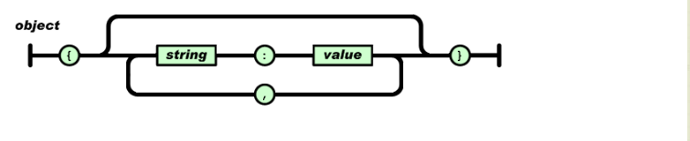
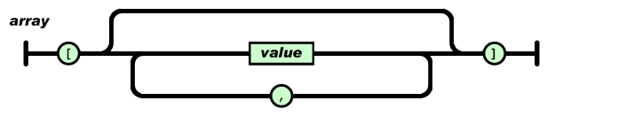
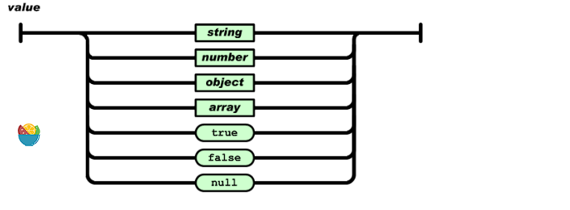
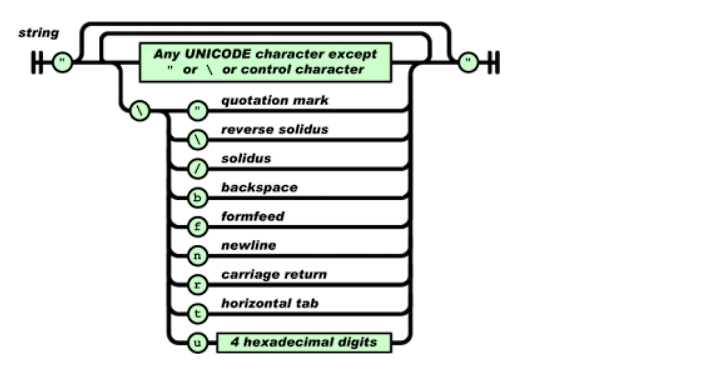
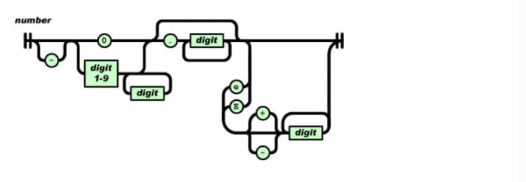

# json文件

## 一、json文件简介

 JSON(JavaScript Object Notation) 是一种轻量级的数据交换格式。 易于人阅读和编写。同时也易于机器解析和生成。
 它基于JavaScript Programming Language, Standard ECMA-262 3rd Edition - December 1999的一个子集。 JSON采用完全独立于语言的文本格式，但是也使用了类似于C语言家族的习惯（包括C, C++, C#, Java, JavaScript, Perl, Python等）。 这些特性使JSON成为理想的数据交换语言。

## 二、json两种结构

- “名称/值”对的集合（A collection of name/value pairs）。不同的语言中，它被理解为对象（object），纪录（record），结构（struct），字典（dictionary），哈希表（hash table），有键列表（keyed list），或者关联数组 （associative array）。

- 值的有序列表（An ordered list of values）。在大部分语言中，它被理解为数组（array）。

## 三、json形式

### 1.对象

对象是一个无序的“‘名称/值’对”集合。
一个对象以“{”（左括号）开始，“}”（右括号）结束。每个“名称”后跟一个“:”（冒号）；“‘名称/值’ 对”之间使用“,”（逗号）分隔。



### 2.数组

数组是值（value）的有序集合。一个数组以“[”（左中括号）开始，“]”（右中括号）结束。值之间使用“,”（逗号）分隔。



值（value）可以是双引号括起来的字符串（string）、数值(number)、true、false、 null、对象（object）或者数组（array）。这些结构可以嵌套



#### 类型

字符串：

由双引号包围的任意数量Unicode字符的集合，使用反斜线转义。一个字符（character）即一个单独的字符串（character string）。 




数值：

与C或者Java的数值非常相似。除去未曾使用的八进制与十六进制格式。除去一些编码细节。



## 四、json使用

1. 对象的每个属性都要有双引号，否则json数据不能正常加载

```python
import json

with open("data.json", 'r') as load_f:
    data=json.load(load_f)
    print(data)
```

（1）{"name":"taoeyhuang","age":18} 只要是字符串都需要加双引号

2. 多对象范例（数组+对象）

数组中可以嵌套数组也可以嵌套对象  

```json
{

    "name": "BeJson",

    "url": "http://www.bejson.com",

    "page": 88,

    "isNonProfit": true,

    "address": {

        "street": "科技园路.",

        "city": "江苏苏州",

        "country": "中国"

    },

    "links": [

        {

            "name": "Google",

            "url": "http://www.google.com"

        },

        {

            "name": "Baidu",

            "url": "http://www.baidu.com"

        },

        {

            "name": "SoSo",

            "url": "http://www.SoSo.com"

        }

    ]

}
```