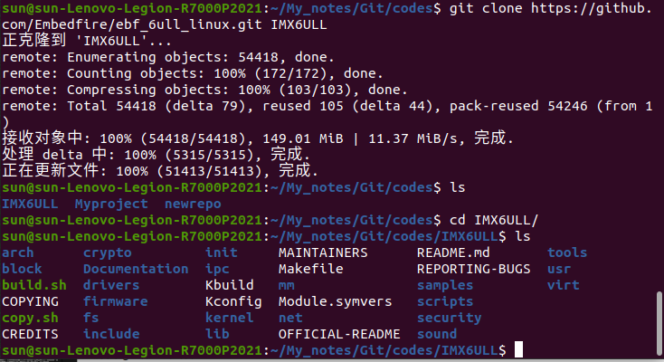
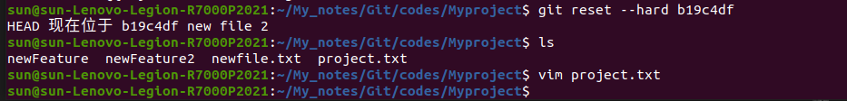
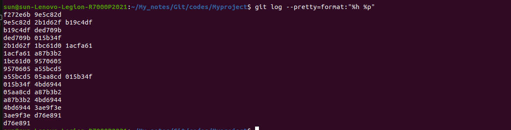
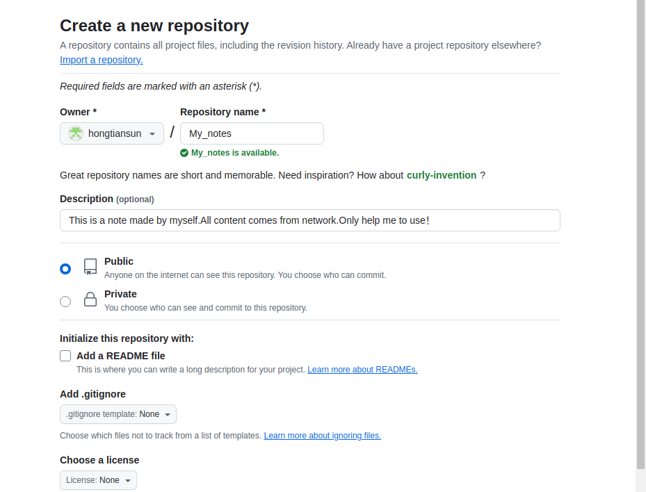

# Git教程

## 一、Git简介

Git 是一个开源的分布式版本控制系统，用于敏捷高效地处理任何或小或大的项目。

Git 是 Linus Torvalds 为了帮助管理 Linux 内核开发而开发的一个开放源码的版本控制软件。

Git 与常用的版本控制工具 CVS, Subversion 等不同，它采用了**分布式版本库**的方式，不必服务器端软件支持。

### Git与SVN区别

Git 不仅仅是个版本控制系统，它也是个内容管理系统(CMS)，工作管理系统等。
如果你是一个具有使用 SVN 背景的人，你需要做一定的思想转换，来适应 Git 提供的一些概念和特征。

Git 与 SVN 区别点：

1、Git 是分布式的，SVN 不是：这是 Git 和其它非分布式的版本控制系统，例如 SVN，CVS 等，最核心的区别。

2、Git 把内容按元数据方式存储，而 SVN 是按文件：所有的资源控制系统都是把文件的元信息隐藏在一个类似 .svn、.cvs 等的文件夹里。

3、Git 分支和 SVN 的分支不同：分支在 SVN 中一点都不特别，其实它就是版本库中的另外一个目录。

4、Git 没有一个全局的版本号，而 SVN 有：目前为止这是跟 SVN 相比 Git 缺少的最大的一个特征。

5、Git 的内容完整性要优于 SVN：Git 的内容存储使用的是 SHA-1 哈希算法。这能确保代码内容的完整性，确保在遇到磁盘故障和网络问题时降低对版本库的破坏。


### 学习网址

[GIT命令手册](http://git-scm.com/docs)

## 二、Git 安装

在使用 Git 前我们需要先安装 Git。
Git 目前支持 Linux/Unix、Solaris、Mac和 Windows 平台上运行。

[Git下载地址](http://git-scm.com/downloads)


### Linux 平台安装

#### 包安装

各大 Linux 平台可以使用包管理器（apt-get、yum 等）进行安装。

Debian/Ubuntu Git 安装最新稳定版本命令为：
> sudo apt-get install git

Centos/RedHat
如果你使用的系统是 Centos/RedHat 安装命令为：
> yum -y install git-core

Fedora 安装命令：
> \# yum install git (Fedora 21 及之前的版本)
> \# dnf install git (Fedora 22 及更高新版本)

FreeBSD 安装命令：
> pkg install git

OpenBSD 安装命令：
> pkg_add git

Alpine 安装命令：
> apk add git


安装系统时已经自带

#### 源码安装

[源码包地址](https://mirrors.edge.kernel.org/pub/software/scm/git/)


也可以在 GitHub 上克隆源码包：

> git clone https://github.com/git/git

解压安装下载的源码包：

```bash
$ tar -zxf git-1.7.2.2.tar.gz
$ cd git-1.7.2.2
$ make prefix=/usr/local all
$ sudo make prefix=/usr/local install
```

### Windows安装

在 Windows 平台上安装 Git 同样轻松，有个叫做 msysGit 的项目提供了安装包，可以到 GitHub 的页面上下载 exe 安装文件并运行：

[安装包下载地址](https://gitforwindows.org/)

[直接官网下载也可以](https://git-scm.com/download/win)

下载完整直接双击安装


完成安装之后，就可以使用命令行的 git 工具（已经自带了 ssh 客户端）了，另外还有一个图形界面的 Git 项目管理工具。

在开始菜单里找到 "Git"->"Git Bash"，会弹出 Git 命令窗口，你可以在该窗口进行 Git 操作

此外，
如果你已经安装了 winget，可以使用以下命令来安装：
> winget install --id Git.Git -e --source winget

### Mac端安装

通过 Homebrew 安装：

> brew install git

如果您想要安装 git-gui 和 gitk（git 的提交 GUI 和交互式历史记录浏览器），您可以使用 homebrew 进行安装：

> brew install git-gui

也可以使用图形化的 Git 安装工具

[下载地址为](https://sourceforge.net/projects/git-osx-installer/)

安装界面如下所示：


### Git 配置

#### 配置文件

Git 提供了一个叫做 git config 的命令，用来**配置或读取相应的工作环境变量**。

这些环境变量，决定了 Git 在各个环节的具体工作方式和行为。

这些变量可以存放在以下三个不同的地方：

    /etc/gitconfig 文件：系统中对所有用户都普遍适用的配置。
    若使用 git config 时用 --system 选项，读写的就是这个文件。
    
    ~/.gitconfig 文件：用户目录下的配置文件只适用于该用户。
    若使用 git config 时用 --global 选项，读写的就是这个文件。
    
    当前项目的 Git 目录中的配置文件（也就是工作目录中的 .git/config 文件）：这里的配置仅仅针对当前项目有效。
    每一个级别的配置都会覆盖上层的相同配置，所以 .git/config 里的配置会覆盖 /etc/gitconfig 中的同名变量。

在 Windows 系统上，Git 会找寻用户主目录下的 .gitconfig 文件。主目录即 $HOME 变量指定的目录，一般都是 C:\Documents and Settings\$USER。
此外，Git 还会尝试找寻 /etc/gitconfig 文件，只不过看当初 Git 装在什么目录，就以此作为根目录来定位。

#### 用户信息

配置个人的用户名称和电子邮件地址，这是为了在每次提交代码时**记录提交者的信息**
信息会保存在你的配置文件中

```bash
git config --global user.name "runoob"
git config --global user.email test@runoob.com
```

如果用了 --global 选项，那么更改的配置文件就是位于你用户主目录下的那个。
以后你所有的项目都会默认使用这里配置的用户信息。

如果要在某个特定的项目中使用其他名字或者电邮。
只要去掉 --global 选项重新配置即可，新的设定保存在当前项目的 .git/config 文件里。


#### 文本编辑器

设置 Git 默认使用的文本编辑器,一般可能会是 Vi 或者 Vim，如果你有其他偏好，比如 VS Code 的话，可以重新设置

> git config --global core.editor "code --wait"

core.editer 表示需要Git编辑文件时使用的编辑器

code --wait指定了使用vscode来进行编辑 --wair表示Git会确保用户在完成VScode编辑后才会继续操作

#### 差异分析工具

还有一个比较常用的是，在解决合并冲突时使用哪种差异分析工具。
比如要改用 vimdiff 的话：

> git config --global merge.tool vimdiff

Git 可以理解 kdiff3，tkdiff，meld，xxdiff，emerge，vimdiff，gvimdiff，ecmerge，和 opendiff 等合并工具的输出信息。
当然，你也可以指定使用自己开发的工具，具体怎么做可以参阅第七章。

#### 查看配置信息

要检查已有的配置信息，可以使用 git config --list 命令：

```bash
$ git config --list
http.postbuffer=2M
user.name=runoob
user.email=test@runoob.com
```

有时候会看到重复的变量名，那就说明它们来自不同的配置文件（比如 /etc/gitconfig 和 ~/.gitconfig）
不过最终 Git 实际采用的是最后一个。 

这些配置我们也可以在 ~/.gitconfig 或 /etc/gitconfig 看到，如下所示：

> vim ~/.gitconfig 

显示如下所示：
```bash
[http]
    postBuffer = 2M
[user]
    name = runoob
    email = test@runoob.com
```


也可以直接查阅某个环境变量的设定，只要把特定的名字跟在后面即可，像这样： 
```bash
$ git config user.name
runoob
```


#### 生成SSH密钥

如果你需要通过 SSH 进行 Git 操作。
可以生成 SSH 密钥并添加到你的 Git 托管服务（如 GitHub、GitLab 等）上。

> ssh-keygen -t rsa -b 4096 -C "your.email@example.com"

按提示完成生成过程，然后将生成的公钥添加到相应的平台.

#### 验证安装

在终端或命令行中运行以下命令，确保 Git 已正确安装并配置：

```bash
git --version
git config --list
```
## 三、Git工作流程

本章节我们将为大家介绍 Git 的工作流程。
下图展示了 Git 的工作流程：


1. 克隆仓库

如果你要参与一个已有的项目，首先需要将远程仓库克隆到本地：
```bash
git clone https://github.com/username/repo.git
cd repo
```

2. 创建新分支

为了避免直接在 main 或 master 分支上进行开发，通常会创建一个新的分支：

```bash
git checkout -b new-feature
```

3. 工作目录

在工作目录中进行代码编辑、添加新文件或删除不需要的文件。

4. 暂存文件

将修改过的文件添加到暂存区，以便进行下一步的提交操作：
```bash
git add filename
# 或者添加所有修改的文件
git add .
```

5. 提交修改

将暂存区的更改提交到本地仓库，并添加提交信息：
```bash
git commit -m "Add new feature"
```

6. 拉取最新修改

在推送本地更改之前，最好从远程仓库拉取最新的更改，以避免冲突：
```bash
git pull origin main
# 或者如果在新的分支上工作
git pull origin new-feature
```
7. 推送更改
   
将本地的提交推送到远程仓库：
```bash
git push origin new-feature
```
8. 创建Pull Request （PR）
   
在 GitHub 或其他托管平台上创建 Pull Request，邀请团队成员进行代码审查。
PR 合并后，你的更改就会合并到主分支。

9. 合并修改

在 PR 审核通过并合并后，可以将远程仓库的主分支合并到本地分支：
```bash
git checkout main
git pull origin main
git merge new-feature
```

10. 删除分支

如果不再需要新功能分支，可以将其删除：

`git branch -d new-feature`

或者从远程仓库删除分支：

`git push origin --delete new-feature`

## 四、Git工作区、暂存区和版本库

### 基本概念

我们先来理解下 Git 工作区、暂存区和版本库概念：

工作区：就是你在电脑里能看到的目录。
暂存区：英文叫 stage 或 index。一般存放在 .git 目录下的 index 文件（.git/index）中，所以我们把暂存区有时也叫作索引（index）。
版本库：工作区有一个隐藏目录 .git，这个不算工作区，而是 Git 的版本库。

关系图解：


解释：

图中左侧为工作区，右侧为版本库。
在版本库中标记为 "index" 的区域是暂存区（stage/index），标记为 "master" 的是 master 分支所代表的目录树。

图中我们可以看出此时 "HEAD" 实际是指向 master 分支的一个"游标"。
所以图示的命令中出现 HEAD 的地方可以用 master 来替换。 

图中的 objects 标识的区域为 Git 的对象库，实际位于 ".git/objects" 目录下，里面包含了创建的各种对象及内容

当对工作区修改（或新增）的文件执行 git add 命令时，暂存区的目录树被更新，同时工作区修改（或新增）的文件内容被写入到对象库中的一个新的对象中，而该对象的ID被记录在暂存区的文件索引中。 

当执行提交操作（git commit）时，暂存区的目录树写到版本库（对象库）中，master 分支会做相应的更新。
即 master 指向的目录树就是提交时暂存区的目录树。 

当执行 git reset HEAD 命令时，暂存区的目录树会被重写，被 master 分支指向的目录树所替换，但是工作区不受影响。 

当执行 git rm --cached <file> 命令时，会直接从暂存区删除文件，工作区则不做出改变。

当执行 git checkout . 或者 git checkout -- <file> 命令时，会用暂存区全部或指定的文件替换工作区的文件。
这个操作很危险，会清除工作区中未添加到暂存区中的改动。 

当执行 git checkout HEAD . 或者 git checkout HEAD <file> 命令时，会用 HEAD 指向的 master 分支中的全部或者部分文件替换暂存区和以及工作区中的文件。
这个命令也是极具危险性的，因为不但会清除工作区中未提交的改动，也会清除暂存区中未提交的改动。

### 工作区 

工作区是你在本地计算机上的项目目录，你在这里进行文件的创建、修改和删除操作。
工作区包含了当前项目的所有文件和子目录。
特点：

    显示项目的当前状态。
    文件的修改在工作区中进行，但这些修改还没有被记录到版本控制中。

### 暂存区

暂存区是一个临时存储区域，它包含了即将被提交到版本库中的文件快照。
在提交之前，你可以选择性地将工作区中的修改添加到暂存区。
特点：

    暂存区保存了将被包括在下一个提交中的更改。
    你可以多次使用 git add 命令来将文件添加到暂存区，直到你准备好提交所有更改。

常用命令：
```bash
git add filename       # 将单个文件添加到暂存区
git add .              # 将工作区中的所有修改添加到暂存区
git status             # 查看哪些文件在暂存区中
```

### 版本库

版本库包含项目的所有版本历史记录。
每次提交都会在版本库中创建一个新的快照，这些快照是不可变的，确保了项目的完整历史记录。

特点：

    版本库分为本地版本库和远程版本库。这里主要指本地版本库。
    本地版本库存储在 .git 目录中，它包含了所有提交的对象和引用。

常用命令：
```bash
git commit -m "Commit message"   # 将暂存区的更改提交到本地版本库
git log                          # 查看提交历史
git diff                         # 查看工作区和暂存区之间的差异
git diff --cached                # 查看暂存区和最后一次提交之间的差异
```

### 工作区、暂存区与版本库之间关系

 ***
1. 工作区 -> 暂存区

使用 git add 命令将工作区中的修改添加到暂存区。

`git add filename`

 ***
2. 暂存区 -> 版本库 

使用 git commit 命令将暂存区中的修改提交到版本库。

`git commit -m "Commit message"`

 ***
3. 版本库 -> 远程仓库

使用 git push 命令将本地版本库的提交推送到远程仓库。

`git push origin branch-name`

 ***
4. 远程仓库 -> 本地版本库

使用 git pull 或 git fetch 命令从远程仓库获取更新。

```Bash
git pull origin branch-name
# 或者
git fetch origin branch-name
git merge origin/branch-name
```

### 示例

假设你在工作目录中修改了 file.txt：

1、工作区

修改 file.txt 并保存。

2、暂存区

将修改添加到暂存区：

`git add file.txt`

3、版本库

将暂存区的修改提交到本地版本库：

`git commit -m "Update file.txt"`

4、远程仓库

将本地提交推送到远程仓库：

`git push origin main`

通过理解工作区、暂存区和版本库的作用及其相互关系，你可以更加高效地使用 Git 进行版本控制和协同开发.

## 五、Git创建仓库

本章节我们将为大家介绍如何创建一个 Git 仓库。
你可以使用一个已经存在的目录作为 Git 仓库。

### Git init  

Git 使用 git init 命令来初始化一个 Git 仓库，Git 的很多命令都需要在 Git 的仓库中运行，所以 git init 是使用 Git 的第一个命令。

在执行完成 git init 命令后，Git 仓库会生成一个 .git 目录，该目录包含了资源的所有元数据，其他的项目目录保持不变。


#### 使用方法

进入你想要创建仓库的目录，或者先创建一个新的目录：

```bash
mkdir my-project
cd my-project
```
使用当前目录作为 Git 仓库，我们只需使它初始化。 

`git init`

该命令执行完后会在当前目录生成一个 .git 目录。

当然我们也使用我们指定目录作为Git仓库。

`git init newrepo`

初始化后，会在 newrepo 目录下会出现一个名为 .git 的目录，所有 Git 需要的数据和资源都存放在这个目录中。
如图：


如果当前目录下有几个文件想要纳入版本控制，需要先用 git add 命令告诉 Git 开始对这些文件进行跟踪，然后提交： 

```bash
$ git add *.c
$ git add README
$ git commit -m '初始化项目版本'
```
以上命令将目录下以 .c 结尾及 README 文件提交到仓库中。

注意：
    
    在 Linux 系统中，commit 信息使用单引号 '
    Windows 系统，commit 信息使用双引号 "
    所以在 git bash 中 git commit -m '提交说明' 这样是可以的
    在 Windows 命令行中就要使用双引号 git commit -m "提交说明"

### Git clone

我们使用 git clone 从现有 Git 仓库中拷贝项目（类似 svn checkout）。

克隆仓库的命令格式为：

`git clone <repo>`

如果我们需要克隆到指定的目录，可以使用以下命令格式：

`git clone <repo> <directory>`

参数说明：

    repo:Git 仓库。
    directory:本地目录。

比如，要克隆 Ruby 语言的 Git 代码仓库 Grit，可以用下面的命令： 

`$ git clone git://github.com/schacon/grit.git`

执行该命令后，会在当前目录下创建一个名为grit的目录，其中包含一个 .git 的目录，用于保存下载下来的所有版本记录。

如果要自己定义要新建的项目目录名称，可以在上面的命令末尾指定新的名字：

`$ git clone git://github.com/schacon/grit.git mygrit`

示例：



### 配置

git 的设置使用 git config 命令。
显示当前的 git 配置信息： 

```bash
$ git config --list
credential.helper=osxkeychain
core.repositoryformatversion=0
core.filemode=true
core.bare=false
core.logallrefupdates=true
core.ignorecase=true
core.precomposeunicode=true
```


编辑 git 配置文件: 

`$ git config -e    # 针对当前仓库 `

或者 

`$ git config -e --global   # 针对系统上所有仓库`


默认编辑器为nano 如果不喜欢

`git config core.editor "vim"` 可以修改为vim

`git config core.editor "code --wait"` 可以修改为VScode

默认都是在当前目录下修改，记录在.gitconfig文件中

加入--global 修改~/下的.gitconfig 

加入--system 修改/etc/git/下的.gitconfig 


设置提交代码时的用户信息：
```bash
$ git config --global user.name "runoob"
$ git config --global user.email test@runoob.com
```

如果去掉 --global 参数只对当前仓库有效。

## 六、Git基本操作

Git 的工作就是创建和保存你项目的快照及与之后的快照进行对比。
本章将对有关创建与提交你的项目快照的命令作介绍。

Git 常用的是以下 6 个命令：
git clone、git push、git add 、git commit、git checkout、git pull
后面我们会详细介绍。


说明：


    workspace：工作区
    staging area：暂存区/缓存区
    local repository：版本库或本地仓库
    remote repository：远程仓库

一个简单的操作步骤：

```bash
$ git init    
$ git add .    
$ git commit  
```
- git init      - 初始化仓库。
- git add .     - 添加文件到暂存区。
- git commit    - 将暂存区内容添加到仓库中。

### 基本操作

#### 创建仓库

下表列出了 git 创建仓库的命令：

| 命令      | 说明                                   |
| --------- | -------------------------------------- |
| git init  | 初始化仓库                             |
| git clone | 拷贝一份远程仓库，也就是下载一个项目。 |

#### 提交与修改

Git 的工作就是创建和保存你的项目的快照及与之后的快照进行对比。
下表列出了有关创建与提交你的项目的快照的命令：

| 命令                              | 说明                                     |
| --------------------------------- | ---------------------------------------- |
| git add                           | 添加文件到暂存区                         |
| git status                        | 查看仓库当前的状态，显示有变更的文件。   |
| git diff                          | 比较文件的不同，即暂存区和工作区的差异。 |
| git difftool                      | 使用外部差异工具查看和比较文件的更改。   |
| git range-diff                    | 比较两个提交范围之间的差异。             |
| git commit                        | 提交暂存区到本地仓库。                   |
| git reset                         | 回退版本。                               |
| git rm                            | 将文件从暂存区和工作区中删除。           |
| git mv                            | 移动或重命名工作区文件。                 |
| git notes                         | 添加注释。                               |
| git checkout                      | 分支切换。                               |
| git switch （Git 2.23 版本引入）  | 更清晰地切换分支。                       |
| git restore （Git 2.23 版本引入） | 恢复或撤销文件的更改。                   |
| git show                          | 显示 Git 对象的详细信息。                |


#### 提交日志

| 命令             | 说明                                                              |
| ---------------- | ----------------------------------------------------------------- |
| git log          | 查看历史提交记录                                                  |
| git blame <file> | 以列表形式查看指定文件的历史修改记录                              |
| git shortlog     | 生成简洁的提交日志摘要                                            |
| git describe     | 生成一个可读的字符串，该字符串基于 Git 的标签系统来描述当前的提交 |


#### 远程操作

| 命令          | 说明                        |
| ------------- | --------------------------- |
| git remote    | 远程仓库操作                |
| git fetch     | 从远程获取代码库            |
| git pull      | 下载远程代码并合并          |
| git push      | 上传远程代码并合并          |
| git submodule | 管理包含其他 Git 仓库的项目 |

### Git文件状态

Git 的文件状态分为三种：
    
    工作目录（Working Directory）
    暂存区（Staging Area）
    本地仓库（Local Repository）

了解这些概念及其交互方式是掌握 Git 的关键。

#### 工作目录

工作目录是你在本地计算机上看到的项目文件。
它是你实际操作文件的地方，包括查看、编辑、删除和创建文件。
所有对文件的更改首先发生在工作目录中。

在工作目录中的文件可能有以下几种状态：

    未跟踪（Untracked）：新创建的文件，未被 Git 记录。
    已修改（Modified）：已被 Git 跟踪的文件发生了更改，但这些更改还没有被提交到 Git 记录中。

#### 暂存区

暂存区，也称为索引（Index），是一个临时存储区域，用于保存即将提交到本地仓库的更改。
你可以选择性地将工作目录中的更改添加到暂存区中，这样你可以一次提交多个文件的更改，而不必提交所有文件的更改。

使用 git add \<filename\> 命令将文件从工作目录添加到暂存区。
使用 git add . 命令将当前目录下的所有更改添加到暂存区。

```bash
git add < filename >  # 添加指定文件到暂存区
git add .           # 添加所有更改到暂存区
```

#### 本地仓库

本地仓库是一个隐藏在 .git 目录中的**数据库**，用于存储项目的所有提交历史记录。
每次你提交更改时，Git 会将暂存区中的内容保存到本地仓库中。

使用 git commit -m "commit message" 命令将暂存区中的更改提交到本地仓库。

`git commit -m "commit message"  # 提交暂存区的更改到本地仓库`

-m参数用于指定说明文档

#### 文件状态的转换流程

未跟踪（Untracked）： 新创建的文件最初是未跟踪的。它们存在于工作目录中，但没有被 Git 跟踪。

```bash
touch newfile.txt  # 创建一个新文件
git status         # 查看状态，显示 newfile.txt 未跟踪
```


 ***
已跟踪（Tracked）： 通过 git add 命令将未跟踪的文件添加到暂存区后，文件变为已跟踪状态。

```bash
git add newfile.txt  # 添加文件到暂存区
git status           # 查看状态，显示 newfile.txt 在暂存区
```


 ***
已修改（Modified）： 对已跟踪的文件进行更改后，这些更改会显示为已修改状态，但这些更改还未添加到暂存区。

```bash
echo "Hello, World!" > newfile.txt  # 修改文件
git status                          # 查看状态，显示 newfile.txt 已修改
```


 ***
已暂存（Staged）： 使用 git add 命令将修改过的文件添加到暂存区后，文件进入已暂存状态，等待提交。

```bash
git add newfile.txt  # 添加文件到暂存区
git status           # 查看状态，显示 newfile.txt 已暂存
```


 ***
已提交（Committed）： 使用 git commit 命令将暂存区的更改提交到本地仓库后，这些更改被记录下来，文件状态返回为已跟踪状态。

```bash
git commit -m "Added newfile.txt"  # 提交更改
git status                         # 查看状态，工作目录干净
```


## 七、Git分支管理

Git 分支管理是 Git 强大功能之一，能够让多个开发人员并行工作，开发新功能、修复 bug 或进行实验，而不会影响主代码库。

几乎每一种版本控制系统都以某种形式支持分支，一个分支代表一条独立的开发线。

使用分支意味着你可以从开发主线上分离开来，然后在不影响主线的同时继续工作。


Git 分支实际上是指向更改快照的指针。
有人把 Git 的分支模型称为必杀技特性，而正是因为它，将 Git 从版本控制系统家族里区分出来。

### 创建分支

创建新分支并切换到该分支：

`git checkout -b <branchname>`

git checkout：这是用于切换到已存在的分支或文件的命令。
-b：这是一个选项，表示创建并切换到新的分支。
\< branchname \>：这是你想要创建的新分支的名称。

示例：
`git checkout -b feature-xyz`


 ***

切换分支命令

`git checkout (branchname)`

例如：

`git checkout main`


当你切换分支的时候，Git 会用该分支的最后提交的快照**替换你的工作目录**的内容.
所以多个分支不需要多个目录。

### 查看分支

查看所有分支：

`git branch`

查看远程分支：

`git branch -r`

查看所有本地和远程分支：

`git branch -a`


 ***
命令详解：

执行效果：
```bash
$ git branch
* master
```
此例的意思就是，我们有一个叫做 master 的分支，并且该分支是当前分支。
当你执行 git init 的时候，默认情况下 Git 就会为你创建 master 分支。
如果我们要手动创建一个分支。执行 git branch (branchname) 即可。 

```bash
$ git branch testing
$ git branch
* master
  testing
```
现在我们可以看到，有了一个新分支 testing。
当你以此方式在上次提交更新之后创建了新分支(新分支相当于当前master的快照,可以继续开发)
如果后来master中又有更新提交。
然后又切换到了 testing 分支，Git 将还原你的工作目录到你创建分支时候的样子（快照）

示例用 git checkout (branch) 切换到我们要修改的分支

```bash
$ ls
README
$ echo 'runoob.com' > test.txt
$ git add .
$ git commit -m 'add test.txt'
[master 3e92c19] add test.txt
 1 file changed, 1 insertion(+)
 create mode 100644 test.txt
$ ls
README        test.txt
$ git checkout testing
Switched to branch 'testing'
$ ls
README
```
当我们切换到 testing 分支的时候，我们添加的新文件 test.txt 被移除了。
切换回 master 分支的时候，它们又重新出现了。
```bash
$ git checkout master
Switched to branch 'master'
$ ls
README        test.txt
```
使用 git checkout -b (branchname) 命令来创建新分支并立即切换到该分支下
从而在该分支中操作
示例:
```bash
$ git checkout -b newtest
Switched to a new branch 'newtest'
$ git rm test.txt 
rm 'test.txt'
$ ls
README
$ touch runoob.php
$ git add .
$ git commit -am 'removed test.txt、add runoob.php'
[newtest c1501a2] removed test.txt、add runoob.php
 2 files changed, 1 deletion(-)
 create mode 100644 runoob.php
 delete mode 100644 test.txt
$ ls
README        runoob.php
$ git checkout master
Switched to branch 'master'
$ ls
README        test.txt
```
如你所见，我们创建了一个分支，在该分支上移除了一些文件 test.txt，并添加了 runoob.php 文件，然后切换回我们的主分支，删除的 test.txt 文件又回来了，且新增加的 runoob.php 不存在主分支中。
使用分支将工作切分开来，从而让我们能够在不同开发环境中做事，并来回切换。

### 合并分支

将其他分支合并到当前分支：

`git merge <branchname>`

例如，切换到 main 分支并合并 feature-xyz 分支：
```bash
git checkout main
git merge feature-xyz
```


合并分支不会消除原有分支

默认状态下git log 各个分支有自己的记录
当完成合并分支后，master中就拥有了其他分支的git commit记录


 ***
合并详解

一旦某分支有了独立内容，你终究会希望将它合并回到你的主分支。
你可以使用以下命令将任何分支合并到当前分支中去：
`git merge`

```bash
$ git branch
* master
  newtest
$ ls
README        test.txt
$ git merge newtest
Updating 3e92c19..c1501a2
Fast-forward
 runoob.php | 0
 test.txt   | 1 -
 2 files changed, 1 deletion(-)
 create mode 100644 runoob.php
 delete mode 100644 test.txt
$ ls
README        runoob.php
```

以上实例中我们将 newtest 分支合并到主分支去，test.txt 文件被删除。
合并完后就可以删除分支:

```bash
$ git branch -d newtest
Deleted branch newtest (was c1501a2).
```
删除后， 就只剩下 master 分支了：

```bash
$ git branch
* master
```

### 合并冲突

当合并过程中出现冲突时，Git 会标记冲突文件，你需要手动解决冲突。
打开冲突文件，按照标记解决冲突。

标记冲突解决完成：

`git add <conflict-file>`

提交合并结果：

`git commit`

 ***

合并详解：
合并并不仅仅是简单的文件添加、移除的操作，Git 也会合并修改。
```bash
$ git branch
* master
$ cat runoob.php
```
我们创建一个叫做 change_site 的分支，切换过去，我们将 runoob.php 内容改为:
```php
<?php
echo 'runoob';
?>
```
创建 change_site 分支：
操作如下
```bash
#创建切换分支
$ git checkout -b change_site
Switched to a new branch 'change_site'
#修改内容
$ vim runoob.php
$ head -3 runoob.php
<?php
echo 'runoob';
?>
#提交分支到本地仓库
$ git commit -am 'changed the runoob.php'
[change_site 7774248] changed the runoob.php
 1 file changed, 3 insertions(+)
```

将修改的内容提交到 change_site 分支中。
现在，假如切换回 master 分支我们可以看内容恢复到我们修改前的(空文件，没有代码)
我们再次修改 runoob.php 文件。 
```bash
#切回原来分支
$ git checkout master
Switched to branch 'master'
#修改内容
$ cat runoob.php
$ vim runoob.php    # 修改内容如下
$ cat runoob.php
<?php
echo 1;
?>
#检测差异
$ git diff
diff --git a/runoob.php b/runoob.php
index e69de29..ac60739 100644
--- a/runoob.php
+++ b/runoob.php
@@ -0,0 +1,3 @@
+<?php
+echo 1;
+?>
#提交代码到本地库
$ git commit -am '修改代码'
[master c68142b] 修改代码
 1 file changed, 3 insertions(+)
```
现在这些改变已经记录到我的 "master" 分支了。接下来我们将 "change_site" 分支合并过来。
```bash
$ git merge change_site
Auto-merging runoob.php
CONFLICT (content): Merge conflict in runoob.php
Automatic merge failed; fix conflicts and then commit the result.

$ cat runoob.php     # 打开文件，看到冲突内容
<?php
<<<<<<< HEAD
echo 1;
=======
echo 'runoob';
>>>>>>> change_site
?>
```
我们将前一个分支合并到 master 分支，一个合并冲突就出现了，接下来我们需要手动去修改它。
```bash
$ vim runoob.php 
$ cat runoob.php
<?php
echo 1;
echo 'runoob';
?>
$ git diff
diff --cc runoob.php
index ac60739,b63d7d7..0000000
--- a/runoob.php
+++ b/runoob.php
@@@ -1,3 -1,3 +1,4 @@@
  <?php
 +echo 1;
+ echo 'runoob';
  ?>
```
在 Git 中，我们可以用 git add 要告诉 Git 文件冲突已经解决
```bash
$ git status -s
UU runoob.php
$ git add runoob.php
$ git status -s
M  runoob.php
$ git commit
[master 88afe0e] Merge branch 'change_site'
```
现在我们成功解决了合并中的冲突，并提交了结果.

### 删除分支

删除本地分支

`git branch -d <branchname>`

强制删除没有合并的分支

`git branch -D <branchname>`

删除远程分支

`git push origin --delete <branchname>`

### 示例

```bash
$ mkdir gitdemo
$ cd gitdemo/
$ git init
Initialized empty Git repository...
$ touch README
$ git add README
$ git commit -m '第一次版本提交'
[master (root-commit) 3b58100] 第一次版本提交
 1 file changed, 0 insertions(+), 0 deletions(-)
 create mode 100644 README
```
### 命令手册

 ***
- git branch

列出、创建或删除分支。
它不切换分支，只是用于管理分支的存在。 
| 示例                     | 解释         |
| ------------------------ | ------------ |
| git branch               | 列出所有分支 |
| git branch new-branch    | 创建新分支   |
| git branch -d old-branch | 删除分支     |

 ***
- git checkout

切换到指定的分支或恢复工作目录中的文件。
也可以用来检出特定的提交。
| 示例                         | 解释             |
| ---------------------------- | ---------------- |
| git checkout branch-name     | 切换分支         |
| git checkout file.txt        | 恢复文件到工作区 |
| git checkout < commit-hash > | 检出特定提交     |

 ***
- git switch

专门用于切换分支，相比 git checkout 更加简洁和直观，主要用于分支操作。
| 示例                     | 解释               |
| ------------------------ | ------------------ |
| git switch branch-name   | 切换到指定分支     |
| git switch -c new-branch | 创建并切换到新分支 |

 ***
- git merge

合并指定分支的更改到当前分支。
| 示例                  | 解释                           |
| --------------------- | ------------------------------ |
| git merge branch-name | 将指定分支的更改合并到当前分支 |

 ***
- git mergetool

启动合并工具，以解决合并冲突。
| 示例                              | 解释                     |
| --------------------------------- | ------------------------ |
| git mergetool                     | 使用默认合并工具解决冲突 |
| git mergetool --tool=< tool-name> | 指定合并工具             |

 *** 
- git log 

显示提交历史记录。
| 示例              | 解释                   |
| ----------------- | ---------------------- |
| git log           | 显示提交历史           |
| git log --oneline | 以简洁模式显示提交历史 |

 ***
- git stash

保存当前工作目录中的未提交更改，并将其恢复到干净的工作区。
| 示例           | 解释               |
| -------------- | ------------------ |
| git stash      | 保存当前更改       |
| git stash pop  | 恢复最近保存的更改 |
| git stash list | 列出所有保存的更改 |

 ***
- git tag 

创建、列出或删除标签。标签用于标记特定的提交。
| 示例            | 解释           |
| --------------- | -------------- |
| git tag         | 列出所有标签   |
| git tag v1.0    | 创建一个新标签 |
| git tag -d v1.0 | 删除标签       |

 ***
- git worktree

允许在一个仓库中检查多个工作区，适用于同时处理多个分支。
| 示例                                 | 解释                                     |
| ------------------------------------ | ---------------------------------------- |
| git worktree add < path> branch-name | 在指定路径添加新的工作区并切换到指定分支 |
| git worktree remove < path>          | 删除工作区                               |

## 八、Git查看提交历史

查看 Git 提交历史可以帮助你了解代码的变更情况和开发进度。
Git 提供了多种命令和选项来查看提交历史，从简单的日志到详细的差异对比。

Git 提交历史一般常用两个命令：

    git log - 查看历史提交记录。
    git blame <file> - 以列表形式查看指定文件的历史修改记录。

### Git Log

在使用 Git 提交了若干更新之后，又或者克隆了某个项目，想回顾下提交历史，我们可以使用 git log 命令查看。
git log 命令用于查看 Git 仓库中提交历史记录。
git log 显示了从最新提交到最早提交的所有提交信息，包括提交的哈希值、作者、提交日期和提交消息等。

git log 命令的基本语法：
`git log [选项] [分支名/提交哈希]`

常用的选项包括：
| 选项            | 解释                                     |
| --------------- | ---------------------------------------- |
| -p              | 显示提交的补丁（具体更改内容）。         |
| --oneline       | 以简洁的一行格式显示提交信息。           |
| --graph         | 以图形化方式显示分支和合并历史。         |
| --decorate      | 显示分支和标签指向的提交。               |
| --author=<作者> | 只显示特定作者的提交。                   |
| --since=<时间>  | 只显示指定时间之后的提交。               |
| --until=<时间>  | 只显示指定时间之前的提交。               |
| --grep=<模式>   | 只显示包含指定模式的提交消息。           |
| --no-merges     | 不显示合并提交。                         |
| --stat          | 显示简略统计信息，包括修改的文件和行数。 |
| --abbrev-commit | 使用短提交哈希值。                       |
| --pretty=<格式> | 使用自定义的提交信息显示格式。           |

git log --oneline


git log --graph


此外，你也可以用 --reverse 参数来逆向显示所有日志。


如果只想查找指定用户的提交日志可以使用命令：git log --author 
例如，比方说我们要找 Git 源码中 Linus 提交的部分：


如果你要指定日期，可以执行几个选项：--since 和 --before
但是你也可以用 --until 和 --after。 


 ***

常用选项：

限制显示的提交数:

`git log -n <number>`

例如，显示最近的 5 次提交：

`git log -n 5`

显示自指定日期之后的提交：

`git log --since="2024-01-01"`

显示指定日期之前的提交：

`git log --until="2024-07-01"`

只显示某个作者的提交：

`git log --author="Author Name"`

更多配置项 请看[官方文档](http://git-scm.com/docs/git-log),或使用git log --help 寻求帮助。

### git blame

git blame 命令用于逐行显示指定文件的每一行代码是由谁在什么时候引入或修改的。
git blame 可以追踪文件中每一行的变更历史，包括作者、提交哈希、提交日期和提交消息等信息。

如果要查看指定文件的修改记录可以使用 git blame 命令，格式如下：
`git blame [选项] <文件路径>`

常用选项：

| 选项                     | 解释                                         |
| ------------------------ | -------------------------------------------- |
| -L <起始行号>,<结束行号> | 只显示指定行号范围内的代码注释。             |
| -C                       | 对于重命名或拷贝的代码行，也进行代码行溯源。 |
| -M                       | 对于移动的代码行，也进行代码行溯源。         |
| -C -C 或 -M -M           | 对于较多改动的代码行，进行更进一步的溯源。   |
| --show-stats             | 显示包含每个作者的行数统计信息。             |

显示文件每一行的代码注释和相关信息：

`git blame <文件路径>`

只显示指定行号范围内的代码注释：

`git blame -L <起始行号>,<结束行号> <文件路径>`

对于重命名或拷贝的代码行进行溯源：

`git blame -C <文件路径>`

对于移动的代码行进行溯源：

`git blame -M <文件路径>`

显示行数统计信息：

`git blame --show-stats <文件路径>`


### 恢复和回退

Git 提供了多种方式来恢复和回退到之前的版本，不同的命令适用于不同的场景和需求。

以下是几种常见的方法：

    git checkout：切换分支或恢复文件到指定提交。
    git reset：重置当前分支到指定提交（软重置、混合重置、硬重置）。
    git revert：创建一个新的提交以撤销指定提交，不改变提交历史。
    git reflog：查看历史操作记录，找回丢失的提交。

#### git checkout：检查出特定版本的文件

git checkout 命令用于切换分支或恢复工作目录中的文件到指定的提交。

恢复工作目录中的文件到某个提交：

`git checkout <commit> -- <filename>`

例如，将 file.txt 恢复到 abc123 提交时的版本：

`git checkout abc123 -- file.txt`

切换到特定提交:

`git checkout <commit>`

例如：

`git checkout abc123`

这种方式切换到特定的提交时，处于分离头指针（detached HEAD）状态。


如果回退的是文件，会直接修改源文件到指定版本位置。
但是此时文件没有上传到本地库，仍可以返回源文件版本。

#### git reset：重置当前分支到特定提交

git reset 命令可以更改当前分支的提交历史
它有三种主要模式：--soft、--mixed 和 --hard。

--soft：只重置 HEAD 到指定的提交，暂存区和工作目录保持不变。

`git reset --soft <commit>`

--mixed（默认）：重置 HEAD 到指定的提交，暂存区重置，但工作目录保持不变。（工作目录不变，暂存区跳到当前版本）

`git reset --mixed <commit>`

--hard：重置 HEAD 到指定的提交，暂存区和工作目录都重置。(直接跳到指定提交版本)

`git reset --hard <commit>`

例如，将当前分支重置到 abc123 提交：

`git reset --hard abc123`

#### git revert：撤销某次提交

git revert 命令创建一个新的提交，用来撤销指定的提交，它不会改变提交历史，适用于已经推送到远程仓库的提交。

`git revert <commit>`

例如，撤销 abc123 提交：

`git revert abc123`

#### git reflog：查看历史操作记录

git reflog 命令记录了所有 HEAD 的移动。即使提交被删除或重置，也可以通过 reflog 找回。

`git reflog`


利用 reflog 可以找到之前的提交哈希，从而恢复到特定状态。例如：

`git reset --hard HEAD@{3}`



#### 实例：

以下是一个综合示例，演示如何使用这些命令恢复历史版本：

查看提交历史：

`git log --oneline`

假设输出如下：
```bash
abc1234 Commit 1
def5678 Commit 2
ghi9012 Commit 3
```
切换到 Commit 2（处于分离头指针状态）：

`git checkout def5678`

重置到 Commit 2，保留更改到暂存区：

`git reset --soft def5678`

重置到 Commit 2，取消暂存区更改：

`git reset --mixed def5678`

重置到 Commit 2，丢弃所有更改：

`git reset --hard def5678`

撤销 Commit 2：

`git revert def5678`

查看 reflog 找回丢失的提交：

`git reflog`

找到之前的提交哈希并恢复：

`git reset --hard HEAD@{3}`


### HEAD指针与git版本变化

#### HEAD指针

在 Git 中，HEAD 是一个非常重要的指针，它指向当前检出的分支或者当前检出的某个提交。
可以将它视作一个指示器，告诉 Git 当前工作目录中正在操作的分支或提交。

1. HEAD 指针的作用

    指向当前分支：
    当你在某个分支上工作时，HEAD 指向该分支的最新提交。
    例如，在 master 分支上，HEAD 指向 master 分支的最新提交。

    指向某个特定提交：
    在某些情况下，HEAD 可能直接指向某个具体的提交哈希（如在“detached HEAD”状态下）。
    此时，HEAD 不再指向分支，而是指向某个提交对象，这种状态下你可以查看或修改该提交，但不会对任何分支产生影响。

2. HEAD 的常见形式

    指向分支：
    例如，假设你当前在 main 分支上，那么 HEAD 会指向 main 分支的最新提交。
    你可以通过以下命令查看：
    git log --oneline -n 1
    这会显示 HEAD 当前指向的提交。

    Detached HEAD（游离 HEAD）：
    当你检出一个特定的提交（而不是分支）。
    HEAD 将处于游离状态，直接指向那个提交，而不是某个分支。
    例如：
    git checkout < commit-hash >
    在这种情况下，HEAD 不再指向任何分支，而是指向你检出的那个提交。
    这通常是一个临时状态，你可以在这里进行查看、修改或创建新的分支。
    如果不创建新的分支，修改将不会保存到任何分支。


#### 版本回退

Git 的版本回退功能是基于其 快照存储 和 指针管理 机制实现的。
以下是具体原理：

1. Git 的数据存储模型

Git 不是直接存储文件的差异，而是将项目在某一时刻的完整快照存储下来。
每次提交（commit）都会生成一个唯一的哈希值（SHA-1），用于标识该快照。

一个提交包含以下信息：

    提交哈希值
    指向该提交的父提交（parent commit）的指针
    提交时的树对象（保存文件和目录结构）
    提交信息（message）
    作者和时间戳

 ***
补充：父提交

父提交的指针是指向当前提交之前的一个或多个提交的引用，用于记录当前提交的历史来源。
它是 Git 提交对象中的一个重要组成部分。
主要作用有：
    记录历史： 每个提交会记录它的上一个提交（即父提交），这样所有提交会以链表的形式连接起来，形成一个完整的历史记录。

    构建提交图： Git 的提交历史以有向无环图（DAG）的形式存在，每个提交通过父提交指针建立关联。

    支持回溯： 基于父提交指针，Git 可以快速回溯到任意一个历史版本。

**单个父提交**：
在大多数情况下，普通的提交只有一个父提交。比如：
`A --> B --> C`
A 是 B 的父提交。
B 是 C 的父提交。
每个提交通过其父指针知道自己是从哪一个提交演变而来的。

**多个父提交（合并时）**：

当分支进行合并操作时，产生的合并提交会有两个或多个父提交。
```bash
  A
 / \
B   C
 \ /
  D
```
提交 D 是一个合并提交，拥有两个父提交：B 和 C。
Git 会通过这两个父提交来记录分支的合并点。

可以通过以下命令查看某个提交的父提交：
`git log --graph --oneline`


或者：

`git show <commit-hash>`

查看父提交指针：

- 直接查看父提交的哈希值

`git log --pretty=format:"%h %p"`
%h 显示提交的哈希值。
%p 显示父提交的哈希值。



- 访问父提交

HEAD^ 表示当前提交的第一个父提交。
HEAD^2 表示当前提交的第二个父提交（在合并提交中有意义）。
例如：
`git show HEAD^`


父提交在版本回退中的作用:

Git 的版本回退依赖父提交指针来找到之前的版本

    git reset 会根据父提交指针移动 HEAD 到指定的父提交。
    git revert 会根据父提交生成一个反向变更并创建新的提交。

 ***

2. HEAD 指针

Git 通过一个叫 HEAD 的指针来跟踪当前所在的提交。
HEAD 通常指向当前分支的最新提交。

3. 版本回退的本质

版本回退实际上是操作 HEAD 和分支指针的位置。常见的版本回退方式有以下几种：

(1)git reset

git reset 通过移动 HEAD 和分支指针来回退版本
分为以下三种模式：

- soft 模式：

仅移动 HEAD 和分支指针，不修改暂存区（staging area）和工作区（working directory）。

适合需要保留更改但重新组织提交的场景。
`git reset --soft <commit-hash>`

- mixed 模式（默认）

移动 HEAD 和分支指针，同时重置暂存区，使其与目标提交一致。
工作区不受影响。
`git reset --mixed <commit-hash>`

- hard 模式

移动 HEAD 和分支指针，同时重置暂存区和工作区。
不可恢复，谨慎使用！

`git reset --hard <commit-hash>`

(2)git revert

git revert 通过创建一个新的提交.
回滚指定提交的更改，而不会更改提交历史。

原理：基于目标提交的内容生成反向更改，并作为一个新提交应用。

`git revert <commit-hash>`

(3)git checkout 和 git switch

临时查看某个提交的内容，不会更改分支指针。
`git checkout <commit-hash>`

推荐使用Switch

4. 底层数据结构支撑

Git 的回退操作依赖于其数据模型：
    对象存储：Git 通过 blob（文件内容）、tree（目录结构）和 commit（版本信息）对象进行管理。
    有向无环图（DAG）：Git 的提交历史以有向无环图组织，使得版本回退、合并等操作高效且易管理。

#### 三种版本回退的应用场景

##### Git reset
应用场景：
- 当需要彻底移除某些提交记录，并且不希望在项目历史中保留痕迹。
- 适用于修改最近几次提交内容，重新组织提交记录。
- 有时用于回退代码到一个稳定的状态。
实际操作：
`git reset [--soft | --mixed | --hard] <commit-hash>`

--soft模式：

- 场景： 回退版本，但保留代码的所有更改到暂存区。适合调整提交内容。
- 操作： `git reset --soft HEAD^`

将 HEAD 指针回退到上一个提交，保留代码在暂存区。

- 解释：对上次的提交不满意，直接reset到HEAD^ 更改的代码会保留在暂存区可以选择性再次提交。


类似撤回提交操作

--mixed模式(默认)

- 场景： 回退版本，保留代码更改在工作区，但清空暂存区。适合修复暂存区不一致问题。

- 操作： `git reset --mixed HEAD~2`

HEAD~2 表示当前提交（HEAD）的第 2 个祖先提交。
（回退到倒数第二次提交，保留代码更改。）

- 解释：回退目标版本，HEAD指向，暂存区清理，工作目录不变


暂存区清零，工作目录不变，bumanyi文件属于未跟踪状态

--hard模式：

- 场景： 彻底删除提交记录，同时丢弃所有代码更改。适合需要完全恢复到某版本的场景。危险操作！
- 操作：`git reset --hard <commit-hash>`
- 解释：彻底退回版本


##### Git revert

- 应用场景：
当需要保留提交历史但撤销某次提交的更改时使用。
常用于团队协作，避免因版本回退影响其他开发人员的历史。

- 实际操作
```bash
# 生成一个新的提交，用于撤销指定提交的更改
git revert <commit-hash>
```


使用此回退不会修改git log日志内容


##### Git checkout / Git switch

- 应用场景：

    用于临时查看代码在某个提交的状态，而不更改当前分支的提交历史。
    适合调试或查看特定提交的状态，不会修改历史记录。

- 实际操作

```bash
# 检出到某个提交（进入“分离头指针”状态）
git checkout <commit-hash>
git checkout HEAD^
```
可以再次创建新的分支进行开发。

##### 对比

| 回退方式     | 应用场景                               | 是否保留历史 | 操作是否可逆 |
| ------------ | -------------------------------------- | ------------ | ------------ |
| git reset    | 彻底删除提交记录，重新组织历史         | 不保留历史   | 部分可逆     |
| git revert   | 撤销某次提交内容，但保留提交记录       | 保留历史     | 可逆         |
| git checkout | 临时查看某次提交的状态，不影响历史记录 | 无更改历史   | 无需回滚     |

#### HEAD的几种格式

 ***
HEAD^n:表示当前分支的第n个父提交
HEAD^:当前分支的父提交

 ***
HEAD~n：向上寻找第n层父提交
HEAD~1等价于HEAD^

 ***
HEAD@{}:表示引用reflog中记录的HEAD位置
可以用追踪HEAD的历史变动
HEAD@{0}：当前 HEAD 所在的位置。
HEAD@{n}：HEAD 在引用日志中的第 n 个历史位置（n 越大，时间越久远）。

 ***
HEAD:path/to/file
表示 某次提交中的特定文件。
用于查看或操作提交中的某个文件内容。

`git show HEAD:src/main.c`


 ***
HEAD^{}
表示将提交对象解析为 对应的提交类型（例如标记对象解析到实际的提交）。
通常用于操作标签（tag）对象，转换为指向的实际提交。

 ***
HEAD^^
表示 当前提交的第二级父提交（等价于 HEAD~2）。
用于合并提交的更复杂父关系。

 ***
(commit):path/to/file
表示从特定提交中获取某个文件的内容。
可用于比较或恢复历史版本的文件。

 ***
(commit)^{tree}
表示 当前提交对应的树对象。
用于查看或操作整个目录结构。
示例：
`git ls-tree HEAD^{tree}`


#### .git目录结构

在 Git 中，.git 是一个隐藏目录，用于存储版本控制相关的所有数据和元信息。了解 .git 的目录结构对深入理解 Git 的工作原理非常有帮助


```plaintext
.git/
├── HEAD
├── config
├── description
├── hooks/
├── info/
├── objects/
├── refs/
├── logs/
├── index
└── packed-refs
```

1. HEAD
作用： 指向当前分支或提交的位置。
内容：
    当你在某个分支上时，HEAD 指向对应分支的引用，例如：
    `ref: refs/heads/main`
    当你处于分离头指针状态时，HEAD 直接指向某个提交哈希值：
    `1b6d2aeabc1234567890abcdef1234567890abcd`

2. config
作用： 存储当前仓库的配置信息（如用户名、邮件地址、远程仓库 URL 等）。
内容：
```ini
[core]
    repositoryformatversion = 0
    filemode = true
    bare = false
[remote "origin"]
    url = https://github.com/user/repo.git
    fetch = +refs/heads/*:refs/remotes/origin/*
```

3. description
作用： 提供仓库的描述信息。
主要在裸仓库（bare repository）中使用，对普通 Git 操作无影响。

4. hooks/
作用： 包含各种客户端或服务器端的钩子脚本。
常见钩子：
pre-commit: 提交前的检查脚本。
post-commit: 提交完成后的操作。
pre-push: 推送到远程仓库前的操作。

```plaintext
hooks/
├── pre-commit.sample
├── pre-push.sample
└── post-commit.sample
```
5. info/
作用： 包含与当前仓库相关的额外信息。
文件：
    exclude：定义忽略的文件（类似 .gitignore）
```plaintext
# Patterns to exclude
*.log
*.tmp
```

6. objects/
作用： 存储所有 Git 的数据对象，包括提交（commit）、树（tree）、文件（blob）等。
结构：
```plaintext
objects/
├── 1b/
│   └── 6d2aeabc1234567890abcdef1234567890abcd
├── 3c/
│   └── 9f1ab1234567890abcdef1234567890abcdef
└── pack/
    ├── pack-xxxx.pack
    └── pack-xxxx.idx
```
前两位为子目录名，剩余的部分为文件名。
pack/ 子目录： 存储被压缩的对象，用于提高效率。

7. refs/
作用： 存储分支、标签等引用信息。
结构：
```plaintext
refs/
├── heads/         # 本地分支
│   ├── main
│   └── feature
├── remotes/       # 远程分支
│   └── origin/
│       ├── main
│       └── feature
└── tags/          # 标签
    └── v1.0
```
heads/： 保存本地分支的引用。
remotes/： 保存远程分支的引用。
tags/： 保存标签的引用。

8. logs/
作用： 保存引用日志（reflog），记录分支、HEAD 等引用的变动历史。
结构：
```plaintext
logs/
├── HEAD           # 记录 HEAD 的变动历史
└── refs/
    ├── heads/     # 记录本地分支的变动历史
    │   ├── main
    │   └── feature
    └── remotes/   # 记录远程分支的变动历史
        └── origin/
            ├── main
            └── feature
```
9. index
作用： Git 的暂存区（staging area）的二进制文件，记录哪些文件被暂存。
细节：
    包含文件路径、权限、内容哈希值等信息。
    在每次执行 git add 时更新。

10. packed-refs
作用： 存储被压缩的引用信息，减少磁盘占用。
内容示例：
```plaintext
# pack-refs with: peeled fully-peeled sorted
abc1234567890abcdef1234567890abcdef refs/heads/main
def1234567890abcdef1234567890abcdef refs/tags/v1.0
```

## 九、Git标签

### 标签的使用

如果你达到一个重要的阶段，并希望永远记住提交的快照，你可以使用 git tag 给它打上标签。

Git 标签（Tag）用于给仓库中的特定提交点加上标记，通常用于发布版本（如 v1.0, v2.0）。

比如说，我们想为我们的 runoob 项目发布一个 "1.0" 版本，我们可以用 git tag -a v1.0 命令给最新一次提交打上（HEAD） "v1.0" 的标签。

-a 选项意为"创建一个带注解的标签"，不用 -a 选项也可以执行的，但它不会记录这标签是啥时候打的，谁打的，也不会让你添加个标签的注解，我们推荐一直创建带注解的标签。

标签语法格式：

`git tag <tagname>`

示例：

`git tag v1.0`

-a 选项可以添加注解

`$ git tag -a v1.0 `

当你执行 git tag -a 命令时，Git 会打开你的编辑器，让你写一句标签注解，就像你给提交写注解一样。

现在，注意当我们执行 git log --decorate 时，我们可以看到我们的标签了

示例：


如果我们忘了给某个提交打标签，又将它发布了，我们可以给它追加标签。
例如，假设我们发布了提交 85fc7e7(上面实例最后一行)，但是那时候忘了给它打标签。 我们现在也可以：

`git tag -a v0.9 <commit-hash>`


如果我们要查看所有标签可以使用以下命令：

`git tag`


### 推送标签到远程仓库

默认情况下，git push 不会推送标签，你需要显式地推送标签。

`git push origin <tagname>` 

推送所有标签

`git push origin --tags`

### 删除标签

本地删除：

`git tag -d <tagname>`

远程删除：

`git push origin --delete <tagname>`

### 附注标签

附注标签存储了创建者的名字、电子邮件、日期，并且可以包含标签信息。
附注标签更为正式，适用于需要额外元数据的场景。

创建附注标签语法：
`git tag -a <tagname> -m "message"`
示例：
`git tag -a <tagname> -m "runoob,com标签"`

PGP 签名标签命令：
`git tag -s <tagname> -m "runoob.com标签"`

查看标签信息：
`git show <tagname>`


### 示例：

以下是一个综合示例，演示如何创建、查看、推送和删除标签。

创建轻量标签和附注标签：
```bash
git tag v1.0
git tag -a v1.1 -m "runoob.com标签"
```
查看标签和标签信息：
```bash
git tag
git show v1.1
```
推送到远程仓库：
```bash
git push origin v1.0
git push origin v1.1
git push origin --tags  # 推送所有标签
```
删除标签

本地删除：
`git tag -d v1.0`

远程删除：
`git push origin --delete v1.0`

## 十、Git Flow

Git Flow 是一种基于 Git 的分支模型，旨在帮助团队更好地管理和发布软件。

Git Flow 由 Vincent Driessen 在 2010 年提出，并通过一套标准的分支命名和工作流程，使开发、测试和发布过程更加有序和高效。

Git Flow 主要由以下几类分支组成：master、develop、feature、release、hotfix。

### Git Flow安装

#### 包安装：

Linux
Debian/Ubuntu:
`sudo apt-get install git-flow`

Fedora:
```bash
sudo dnf install gitflow
sudo apt-get install git-flow
```

macOS
在 macOS 上，你可以使用 Homebrew 来安装 Git Flow:
`brew install git-flow`


#### 源码安装

```bash
git clone https://github.com/nvie/gitflow.git
cd gitflow
sudo make install
```
验证安装
`git flow version`

#### Windows下安装

在 Windows 上，你可以通过以下方式安装 Git Flow：

- 使用 Git for Windows: Git for Windows 包含了 Git Flow。你可以从 Git for Windows 安装 Git，然后使用 Git Bash 来使用 Git Flow。

- 使用 Scoop: 如果你使用 Scoop 包管理工具，可以通过以下命令安装 Git Flow：

`scoop install git-flow`

- 使用 Chocolatey: 如果你使用 Chocolatey 包管理工具，可以通过以下命令安装 Git Flow：

`choco install gitflow`

### Git Flow分支模型

master 分支：

永远保持稳定和可发布的状态。
每次发布一个新的版本时，都会从 develop 分支合并到 master 分支。

 ***
develop 分支：

用于集成所有的开发分支。
代表了最新的开发进度。
功能分支、发布分支和修复分支都从这里分支出去，最终合并回这里。

 ***
feature 分支：

用于开发新功能。
从 develop 分支创建，开发完成后合并回 develop 分支。
命名规范：feature/feature-name。

 ***
release 分支：

用于准备新版本的发布。
从 develop 分支创建，进行最后的测试和修复，然后合并回 develop 和 master 分支，并打上版本标签。
命名规范：release/release-name。

 ***
hotfix 分支：

用于修复紧急问题。
从 master 分支创建，修复完成后合并回 master 和 develop 分支，并打上版本标签。
命名规范：hotfix/hotfix-name。


### 分支操作原理

- Master 分支上的每个 Commit 应打上 Tag，Develop 分支基于 Master 创建。
- Feature 分支完成后合并回 Develop 分支，并通常删除该分支。
- Release 分支基于 Develop 创建，用于测试和修复 Bug，发布后合并回 Master 和 Develop，并打 Tag 标记版本号。
- Hotfix 分支基于 Master 创建，完成后合并回 Master 和 Develop，并打 Tag 1。
 ***
Git Flow命令示例：

开始 Feature 分支：`git flow feature start MYFEATURE`
完成 Feature 分支：`git flow feature finish MYFEATURE`

开始 Release 分支：`git flow release start RELEASE [BASE]`
完成 Release 分支：合并到 Master 和 Develop，打 Tag，删除 Release 分支。

开始 Hotfix 分支：`git flow hotfix start HOTFIX [BASE]`
完成 Hotfix 分支：合并到 Master 和 Develop，打 Tag，删除 Hotfix 分支。

### Git Flow工作流程

#### 工作流程
1. 初始化 Git Flow
首先，在项目中初始化 Git Flow。可以使用 Git Flow 插件（例如 git-flow）来简化操作。
`git flow init`
初始化时，你需要设置分支命名规则和默认分支。
必须先初始化git init


2. 创建功能分支
当开始开发一个新功能时，从 develop 分支创建一个功能分支。
`git flow feature start feature-name`
完成开发后，将功能分支合并回 **develop** 分支，并删除功能分支。
`git flow feature finish feature-name`


自动完成删除与合并功能

3. 创建发布分支
当准备发布一个新版本时，从 develop 分支创建一个发布分支。

git flow release start release-name
在发布分支上进行最后的测试和修复，准备好发布后，将发布分支合并回 **develop 和 master** 分支，并打上版本标签。


测试完成后，打上版本标签会自动合并到develop和master


4. 创建修复分支
当发现需要紧急修复的问题时，从 master 分支创建一个修复分支。

`git flow hotfix start hotfix-name`

修复完成后，将修复分支合并回**master 和 develop** 分支，并打上版本标签。

`git flow hotfix finish hotfix-name`


#### 示例

以下是一个实际使用 Git Flow 的综合实例。

- 初始化 Git Flow：
`git flow init`

- 创建和完成功能分支：
```bash
git flow feature start new-feature # 开发新功能
git flow feature finish new-feature
```
- 创建和完成发布分支：
```bash
git flow release start v1.0.0 # 测试和修复
git flow release finish v1.0.0
```
- 创建和完成修复分支：
```bash
git flow hotfix start hotfix-1.0.1. # 修复紧急问题
git flow hotfix finish hotfix-1.0.1
```

### 优点和缺点
优点
    
    明确的分支模型：清晰的分支命名和使用规则，使得开发过程井然有序。
    隔离开发和发布：开发和发布过程分离，减少了开发中的不确定性对发布的影响。
    版本管理：每次发布和修复都会打上版本标签，方便回溯和管理。

缺点

    复杂性：对于小型团队或简单项目，Git Flow 的分支模型可能显得过于复杂。
    频繁的合并：在大型团队中，频繁的分支合并可能导致合并冲突增加。

Git Flow 是一种结构化的分支管理模型，通过定义明确的分支和工作流程，帮助团队更好地管理软件开发和发布过程。
虽然它增加了一定的复杂性，但对于大型项目和团队协作，Git Flow 提供了强大的支持和管理能力。

## 十一、Git进阶操作

在掌握了 Git 的基础操作之后，进阶操作可以帮助你更高效地管理和优化你的代码库。
以下是一些常见的进阶操作及其详细说明：

    交互式暂存：逐块选择要暂存的更改，精细控制提交内容。
    Git Stash：临时保存工作进度，方便切换任务。
    Git Rebase：将一个分支上的更改移到另一个分支之上，保持提交历史线性。
    Git Cherry-Pick：选择特定提交并应用到当前分支。

### 交互式暂存

git add 命令可以选择性地将文件或文件的一部分添加到暂存区，这在处理复杂更改时非常有用。

使用 git add -p：逐块选择要暂存的更改
`git add -p`

执行此命令后，Git 会逐块显示文件的更改，你可以选择是否暂存每个块。常用选项包括：
| 选项 | 描述           |
| ---- | -------------- |
| y    | 暂存当前块     |
| n    | 跳过当前块     |
| s    | 拆分当前块     |
| e    | 手动编辑当前块 |
| q    | 退出暂存       |


### git stash 临时保存工作进度

git stash 命令允许你临时保存当前工作目录的更改，以便你可以切换到其他分支或处理其他任务。

保存当前工作进度：
`git stash`

查看存储的进度：
`git stash list`

应用最近一次存储的进度：
`git stash apply`

应用并删除最近一次存储的进度：
`git stash pop`

删除特定存储：
`git stash drop stash@{n}`

清空所有存储：
`git stash clear`


不提前保存存储，是无法切换工作分支的

### Git Rebase

git rebase 命令用于将一个分支上的更改移到另一个分支之上。它可以帮助保持提交历史的线性，减少合并时的冲突。

变基当前分支到指定分支：
`git rebase <branchname>`
例如，将当前分支变基到 main 分支：
`git rebase main`

交互式变基：

`git rebase -i <commit>`

交互式变基允许你在变基过程中编辑、删除或合并提交。常用选项包括：
| 选项   | 操作                                       |
| ------ | ------------------------------------------ |
| pick   | 保留提交                                   |
| reword | 修改提交信息                               |
| edit   | 编辑提交                                   |
| squash | 将当前提交与前一个提交合并                 |
| fixup  | 将当前提交与前一个提交合并，不保留提交信息 |
| drop   | 删除提交                                   |

工作场景：

在多人协作开发中，主分支（如 main）经常更新，而你的功能分支（如 feature）可能落后于主分支。你需要将主分支的最新更改合并到功能分支中。

传统方法：merge
```bash
git checkout feature
git merge main
```
结果：
历史记录中会出现一个合并提交（merge commit）。
提交记录显示了分支的分叉和合并。
rebase 方法
```bash
git checkout feature
git rebase main
```
结果：
功能分支的提交会被重新定位到主分支的最新状态。
历史记录变得线性，没有额外的合并提交。
适用场景：

希望保持历史记录清晰、线性，便于审查代码和回溯问题。

### Git Cherry-Pick:挑选提交

git cherry-pick 命令允许你选择特定的提交并将其应用到当前分支。
它在需要从一个分支移植特定更改到另一个分支时非常有用。
在该分支获取其他分体的特定提交部分。

拣选提交：
`git cherry-pick <commit>`

例如，将 abc123 提交应用到当前分支：
`git cherry-pick abc123`

处理拣选冲突：如果拣选过程中出现冲突，解决冲突后使用
`git cherry-pick --continue` 继续拣选。


master的提交的name.b
被name分支，通过cherry-pick加载到当前分支

### 综合示例：

以下是一个综合示例，展示了如何使用这些进阶操作：

交互式暂存：
`git add -p`

保存工作进度：
`git stash`

查看存储的进度：
`git stash list`

应用存储的进度：
`git stash apply`

变基当前分支到 main 分支：
`git rebase main`

交互式变基，编辑提交历史：
`git rebase -i HEAD~3`

编辑提交历史，如合并和重命名提交。

拣选 feature 分支上的特定提交到 main 分支：
```bash
git checkout main
git cherry-pick abc123
```

## 十二、远程仓库Github

Git 并不像 SVN 那样有个中心服务器。

目前我们使用到的 Git 命令都是在本地执行，如果你想通过 Git 分享你的代码或者与其他开发人员合作。 你就需要将数据放到一台其他开发人员能够连接的服务器上。
（需要一台其他人员能够ping的服务器）


### 添加远程库

要添加一个新的远程仓库，可以指定一个简单的名字，以便将来引用,命令格式如下：

`git remote add [shortname] [url]`

本例以 Github 为例作为远程仓库，如果你没有 Github 可以在官网 https://github.com/注册。
由于你的本地 Git 仓库和 GitHub 仓库之间的传输是通过SSH加密的，所以我们需要配置验证信息：(采用ssh加密)

使用以下命令生成 SSH Key：
`$ ssh-keygen -t rsa -C "youremail@example.com"`
-t 用于指定加密算法 -C为注释 -f 可以指定路径文件名


注释的内容最后会加入到公钥的结尾，常用语标识所有者

至此，我们拥有了一对SSH密钥。我们需要把公钥上传到Github上

进入，Github设置（Settings）


选择new SSH keys


title 可以随便起
Key 粘贴公钥


至此，成功在Github里添加公钥。

然后我们可以进行验证连接是否成功：
`ssh -T git@github.com`
其中-T表示无需进入交互式终端


连接成功后获得github的服务器指纹，存储在known_hosts中


到此为止。我们就完成了与github的连接。

接下来，我们可以创建远程库。


进行库描述


接下来，我们就有了自己的库
我们可以使用ssh连接，或者http进行连接


我们接下来就可以把本地库直接上传到Github了
```bash
# 提交到 Github
$ git remote add origin git@github.com:tianqixin/runoob-git-test.git
$ git push -u origin master
```
远程服务器命名规则：
git@github.com:账户名/库名.git

`git remote add lib名 服务器地址` 创建远程库
`git push -u lib名 master` 把master分支push上去

-u：这是一个选项，用于设置默认的上游仓库。
这样以后就可以直接使用 git push 命令而不需要每次都指定远程仓库和分支。


成功push。

### 查看当前远程库

`git remote`


Test是我们在给远程库起的别名

### 提取远程仓库

Git 有两个命令用来提取远程仓库的更新。

1. 从远程仓库下载新分支与数据：

`git fetch`

该命令执行完后需要执行 git merge 远程分支到你所在的分支。

2. 从远端仓库提取数据并尝试合并到当前分支：

`git merge`

该命令就是在执行 git fetch 之后紧接着执行 git merge 远程分支到你所在的任意分支。

总体过程就是，获取远程分支，合并到主分支。


假设你配置好了一个远程仓库，并且你想要提取更新的数据，你可以首先执行 git fetch [alias] 告诉 Git 去获取它有你没有的数据.
然后你可以执行 git merge [alias]/[branch] 以将服务器上的任何更新（假设有人这时候推送到服务器了）合并到你的当前分支。

示例：

Github上远程修改了文档


本地修改


远程分支不会直接加到本地分支上，但是可以进行合并。

### 推送远程仓库

`git push [alias] [branch]`

alias 代表远程仓库名
branch 代表你的本地分支

可以使用 -u 记录分支和远程仓库名。
下次push直接git push即可


原因在于

-u选项可以修改config进行配置


### 删除远程仓库

`git remote rm [库名]`


成功删除。

## 十三、Github教程

github是一个基于git的代码托管平台，付费用户可以建私人仓库。
我们一般的免费用户只能使用公共仓库，也就是代码要公开。

Github 由Chris Wanstrath, PJ Hyett 与Tom Preston-Werner三位开发者在2008年4月创办。
迄今拥有59名全职员工，主要提供基于git的版本托管服务。

目前看来，GitHub这场冒险已经胜出。

### Github配置

见远程仓库上文

需要利用ssh连接，将公钥贴在Github上用以身份验证。

### 检出仓库

`git clone /path/to/repository `

可以克隆出一个本地仓库的克隆版本

`git clone username@host:/path/to/repository`
可以直接clone一个远程仓库

### 获取仓库

上文提到第一种方式，fetch and merge

`git fetch origin <remote_branch_name>`

现在我们使用第二种方式。

`git pull origin <remote_branch_name>`

从远程仓库origin中拉取remote_branch_name,并与当前本地分支进行合并

### 推送仓库

`git push [alias] [branch]`

即可
可以用-u参数设置remote，
下此使用直接git pull / git push 即可

### 查看远程仓库的分支

查看远程仓库分支

`git branch -r`

结果示例：

```bash
origin/main
origin/feature-branch
```

查看本地和远程分支
`git branch -a`

示例：
```bash
* main
  feature-branch
  remotes/origin/main
  remotes/origin/feature-branch
```
如果要指定远程仓库：

`git ls-remote <remote-name>`

即可


refs/heads/master

1. refs
refs 是 Git 中存储引用的顶层目录，引用是指向特定对象（通常是提交）的指针。
引用的类型：
refs/heads/：表示本地分支。
refs/remotes/：表示远程分支。
refs/tags/：表示标签。
refs/stash：表示临时存储的更改。

2. heads
heads 是一个子目录，表示当前存储的是 本地分支。
在 Git 中，每一个本地分支的名称都会存储在 refs/heads/ 目录中。例如：
refs/heads/main：表示本地的 main 分支。
refs/heads/feature：表示本地的 feature 分支。

3. master
master 是分支的名字，这是 Git 默认的主分支名称（早期版本的 Git 默认主分支名为 master，较新的版本已经改为 main，但 master 依然常见）。

在路径中，master 表示一个具体的分支名称。

remote config 配置：

```bash
复制代码
[remote "Test"]
    url = git@github.com:hongtiansun/Test.git
    fetch = +refs/heads/*:refs/remotes/Test/*
```
[remote "Test"]
定义了一个名为 Test 的远程仓库。

url = git\@github.com:hongtiansun/Test.git
指定了 Test 远程仓库的 URL，使用的是 SSH 协议。
这里表示远程仓库的地址为：git\@github.com:hongtiansun/Test.git。

fetch = +refs/heads/*:refs/remotes/Test/*
定义了从远程仓库拉取（fetch）的引用映射规则：

+：表示强制更新本地引用，即使远程分支被强制推送（rebase 或修改历史）。
refs/heads/*：匹配远程仓库的所有分支。
refs/remotes/Test/*：将这些远程分支映射到本地的 Test 名称空间中（远程分支的本地跟踪分支）。

```bash
[branch "master"]
    remote = Test
    merge = refs/heads/master
```
[branch "master"]
定义了本地分支 master 的相关配置。

remote = Test
指定本地 master 分支与远程 Test 仓库关联。

merge = refs/heads/master
表示本地 master 分支默认跟踪远程仓库 Test 中的 master 分支。
当你执行 git pull 或 git push 时，默认操作的是 Test 仓库的 master 分支。

## 十四、Git服务器搭建

我们远程仓库使用了 Github，Github 公开的项目是免费的，2019 年开始 Github 私有存储库也可以无限制使用。

当然我们也可以自己搭建一台 Git 服务器作为私有仓库使用。

### 使用裸存储库（Bare Repository）

登录服务器

1. 安装git

Ubuntu 服务器上安装 Git：
`sudo apt install git`
其余系统请见上文

2. 创建git用户组与用户，运行git服务(任意用户均可)

```bash
$ groupadd git
$ useradd git -g git
```


3. 创建裸存储库

登录到指定用户
`$ sudo su - git`
创建仓库目录为gitrepo
初始化裸仓库
```bash
$ cd gitrepo
$ git init --bare runoob.git
```
以上命令Git创建一个空仓库，服务器上的 Git 仓库通常都以 .git 结尾。
然后，把仓库所属用户改为 git（如果是其他用户操作，比如 root）：

`$ chown -R git:git runoob.git`

4. 创建证书登录

见SSH笔记

5. 测试仓库 

git clone


构建远程仓库


可以进行push / pull /fetch merge操作


注意：
裸仓库没有工作区，因此没有文件的实际内容。
而是通过 .git 文件夹的内部结构存储所有的版本数据。
各个文件存储内容，见.git目录结构

### Gitlab服务

GitLab 是一个功能强大的 Git 服务管理工具，适合中大型团队，提供了丰富的用户管理、CI/CD、代码审查等功能。

#### 安装Gitlab
```bash
sudo apt-get update
sudo apt-get install -y curl openssh-server ca-certificates tzdata perl
curl https://packages.gitlab.com/install/repositories/gitlab/gitlab-ee/script.deb.sh | sudo bash
sudo EXTERNAL_URL="http://yourdomain" apt-get install gitlab-ee
```
EXTERNAL_URL="http://yourdomain" 要设置自己的域名，或者公网 IP，比如：
`sudo EXTERNAL_URL=101.132.XX.XX yum install -y gitlab-ee`

解释：
`sudo apt-get install -y curl openssh-server ca-certificates tzdata perlsudo apt-get install -y curl openssh-server ca-certificates tzdata perl`安装多个包
-y
作用：自动回答 "yes" 以确认安装过程中的所有提示。
好处：避免交互式提示，适合脚本或批量操作。
包清单：
 ***
curl
作用：命令行工具，用于通过 HTTP、HTTPS、FTP 等协议传输数据。
常见用途：
    下载文件。
    测试 API 接口。
如：curl https://example.com。
 ***
openssh-server
作用：OpenSSH 的服务器端实现，允许远程用户通过 SSH 登录这台机器。
用途：
    设置远程登录服务。
    允许通过 ssh 访问和管理系统。
 ***
ca-certificates
作用：安装并维护系统中可信的证书颁发机构（CA）的证书。
用途：
    验证 HTTPS 连接的安全性。
    确保 curl 等工具能正确验证 SSL/TLS 证书。
 ***
tzdata
作用：时区数据库，用于设置和管理系统时区。
用途：
    确保时间和日期在不同地区显示正确。
    安装时可能会提示选择时区。
 ***
perl
作用：Perl 编程语言的解释器。
用途：
    支持运行许多系统管理脚本。
    许多系统工具（如 Git）依赖于 Perl 运行。
 ***

`curl https://packages.gitlab.com/install/repositories/gitlab/gitlab-ee/script.deb.sh | sudo bash`

下载官方安装脚本并直接输出bash执行

`sudo EXTERNAL_URL="http://yourdomain" apt-get install gitlab-ee`
配置外部访问的URL

示例：


本人服务器安装失败，后续不在演示：


#### 配置Gitlab

安装完成后，打开浏览器访问 http://yourdomain，设置管理员账户。
当出现类似如下回显信息，表示 GitLab 已经安装成功。


#### 创建项目

登录 GitLab，创建一个新的项目，用户名为 root。
获取登录密码：
`sudo cat /etc/gitlab/initial_root_password`
首次登录使用root用户名

#### 生成密钥对文件并获取公钥

不在赘述，详情请见SSH

#### 创建项目

在 GitLab 的主页中，点击 Create a project 选项：

点击 Create blank project，设置 Project name 和 Project URL，然后点击 Create project：


#### 添加SSH key

在当前 project 页面，点击 Add SSH key：

将公钥文件 id_rsa.pub 中的内容粘贴到 Key 所在的文本框中：

点击 Add key，SSH Key 添加完成后，如下图所示：

复制 Clone 链接，该链接在进行克隆操作时需要使用：


其余使用与裸仓库，Github仓库完全一致。


## 十五、Sourcetree 使用教程

SourceTree 是一个 Git 客户端管理工具，适用于 Windows 和 Mac 系统。

SourceTree 简化了开发者与代码仓库之间的 Git 操作方式，我们可以通过界面菜单很方便的处理 Git 操作，而不需要通过命令。

通过 SourceTree，我们可以管理所有的 Git 库，无论是远程还是本地的。SourceTree 支持 Bitbucket、GitHub 以及 Gitlab 等远程仓库。

### Sourcetree安装

[官网安装]( https://www.sourcetreeapp.com/)

### Souretree远程仓库

Souretree可以连接Github账户，管理远程仓库

### Sourcetree创建本地仓库

当然也可以创建本地仓库

不进行过多赘述！
