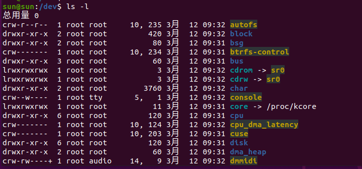

# 精通Linux

## 第一章 概述

### 1.1 Linux操作系统中的抽象级别和层次

在组织得当的前提下，通过抽象将系统分解为组件有助于我们了解其工作机制。
我们将组件划分为层次或级别。组件的层次（或级别）代表它在用户和硬件系统之间所处的位置。
Web浏览器、游戏等应用处于最高层，底层则是计算机硬件系统，如内存。操作系统处于这两层之间。

Linux操作系统主要分为三层。


**硬件系统：**
如图1-1所示，最底层是硬件系统，包括内存和中央处理器（用于计算和从内存中读写数据），此外硬盘和网络接口也是硬件系统的一部分。

**Linux内核：**
硬件系统之上是内核，它是操作系统的核心。内核是运行在内存中的软件，它向中央处理器发送指令。
内核管理硬件系统，是硬件系统和应用程序之间进行通信的接口。

**用户进程：**
进程是指计算机中运行的所有程序，由内核统一管理，它们组成了最顶层，称为用户空间。

**内核空间和用户空间：**
内核和用户进程之间最主要的区别是：
内核在内核模式(kernel mode)中运行，而用户进程则在用户模式（user mode）中运行。

在内核模式中运行的代码可以不受限地访问中央处理器和内存，这种模式功能强大，但也非常危险，因为内核进程可以轻而易举地使整个系统崩溃。那些只有内核可以访问的空间我们称为内核空间（kernel space）。

相对于内核模式，用户模式对内存和中央处理器的访问有一定程度的限制，可访问的内存空间通常很小，对CPU的操作也很安全。用户空间指的是那些用户进程能够访问的内存空间。如果一个用户进程出错并崩溃的话，其导致的后果也相对有限，并且能够被内核清理掉。例如，如果你的Web浏览器崩溃了，不会影响到你正在运行的其他程序。

理论上来说，一个用户进程出问题并不会对整个系统造成严重的影响。
当然这取决于我们如何定义“严重的影响”，并且还取决于该进程拥有的权限。因为不同的进程拥有的权限可能不同，一些进程能够执行一些别的进程无权执行的操作.

### 1.2 硬件系统

**主内存：**

基本上来讲，主内存存储0和1这样的数据。我们将每个0和1称为一个比特（或位，bit）。内核和进程就在主内存中运行，它们就是一系列比特的大合集。
所有外围设备的数据输入和输出都通过主内存完成，同样是以一系列0和1的形式。
中央处理器像一个操作员一样处理内存中的数据，它从内存读取指令和数据，然后将运算结果写回内存。

**状态：**

在我们谈论内存、进程、内核和其他内容时，你会经常看到状态（state）这个词。严格说来，一个状态就是一组特定排列的比特。

一个进程动辄由几百万个比特值组成，因而使用抽象词汇来描述状态可能比使用比特值更简单一些。我们可以使用进程已经完成的任务或者当前正在执行的任务来描述其状态，如“进程正在等待用户输入”或者“进程正在执行启动任务的第二个阶段”。

注意：我们通常使用抽象词汇而非比特值来描述状态，映像（image）这个词用来表示比特值在内存中的特定物理排列。

### 1.3 内核

我们之所以介绍主内存和状态，是因为内核的几乎所有操作都和主内存相关。其中之一是将内存划分为很多区块，并且一直维护着这些区块的状态信息。每一个进程拥有自己的内存区块，且内核必须确保每个进程只使用它自己的内存区块。

**内核管理以下四个方面：**
- 进程：内核决定哪个进程可以使用CPU。
- 内存：内核管理所有的内存，为进程分配内存，管理进程间的共享内存以及空闲内存。
- 设备驱动程序：作为硬件系统（如磁盘）和进程之间的接口，内核负责操控硬件设备。
- 系统调用和支持：进程通常使用系统调用和内核进行通信。

#### 1.3.1 进程管理

进程管理涉及进程的启动、暂停、恢复和终止。启动和终止进程比较直观，但是要解释清楚进程在执行过程中如何使用CPU则相对复杂一些。

**并发执行：**
在现代操作系统中，很多进程貌似都是“同时”运行的。例如，你可以同时在桌面打开Web浏览器和电子表格应用程序。然而，虽然它们表面上看是同时运行，但实际上这些应用程序背后的进程并不完全是同时运行的。

**上下文切换：**
我们设想一下，在只有一个CPU的计算机系统中，可能会有很多进程可以使用CPU，但是在任何一个特定的时间段内只能有一个进程可以使用CPU。所以实际上是多个进程轮流使用CPU，每个进程使用一段时间后就暂停，然后让另一个进程使用，依次轮流，时间单位是毫秒级。一个进程让出CPU使用权给另一个进程称为上下文切换（context switch）。

进程在其时间段内有足够的时间完成主要的计算工作（实际上，进程通常在单个时间段内就能完成它的工作）。由于时间段非常短，短到我们根本察觉不到，所以在我们看来，系统是在同时运行多个进程（我们称之为多任务执行）。

**上下文切换过程：**
内核负责上下文切换。我们来看看下面的场景，以便理解它的工作原理。
-  CPU为每个进程计时，到时即停止进程(@中断)，并切换至内核模式(@执行内核代码)，由内核接管CPU控制权。
-  内核记录下当前CPU和内存的状态信息，这些信息在恢复被停止的进程时需要用到。
-  **内核执行上一个时间段内的任务(&?)**（如从输入输出设备获得数据，磁盘读写操作等）。
-  内核准备执行下一个进程，从准备就绪的进程中选择一个执行(@就绪队列选择下一个进程)。
-  内核为新进程准备CPU和内存(@分配资源)。
-  内核将新进程执行的时间段通知CPU。
-  内核将CPU切换至用户模式，将CPU控制权移交给新进程。

上下文切换回答了一个十分重要的问题，即内核是在什么时候运行的。
答案就是，内核是在上下文切换时的时间段间隙中运行的。

在多CPU系统中，情况要稍微复杂一些。如果新进程将在另一个CPU上运行，内核就不需要让出当前CPU的使用权。不过为了将所有CPU的使用效率最大化，内核会使用一些其他的方式来获取CPU控制权。

#### 1.3.2 内存管理

内核在上下文切换过程中管理内存，这是一项十分复杂的工作，因为内核要保证以下所有条件：
- 内核需要自己的专有内存空间，其他的用户进程无法访问；(@内核空间)
- 每个用户进程有自己的专有内存空间；(进程内存独立)
- 一个进程不能访问另一个进程的专有内存空间；
- 用户进程之间可以共享内存；(共享内存区)
- 用户进程的某些内存空间可以是只读的
- 通过使用磁盘交换，系统可以使用比实际内存容量更多的内存空间。(虚拟内存)

**内存地址映射**
新型的CPU提供了MMU（Memory Management Unit，内存管理单元），MMU使用了一种叫作虚拟内存的内存访问机制，即进程不是直接访问内存的实际物理地址，而是通过内核使得进程看起来可以使用整个系统的内存。
当进程访问内存的时候，MMU截获访问请求，然后通过内存映射表将要访问的内存地址转换为实际的物理地址。内核需要初始化、维护和更新这个地址映射表。例如，在上下文切换时，内核将内存映射表从被移出进程转给被移入进程使用。

注：内存地址映射通过内存页面表（page table）来实现。

#### 1.3.3 设备驱动程序和设备管理

通常设备只能在内核模式中被访问（例如用户进程请求内核关闭系统电源），因为设备访问不当有可能会让系统崩溃。另一个原因是不同设备之间没有一个统一的编程接口，即使同类设备也如此，比如两个不同的网卡。
所以设备驱动程序传统意义上来说是内核的一部分，它们尽可能为用户进程提供统一的接口，以简化开发人员的工作。

#### 1.3.4 系统调用和系统支持

**系统调用**
内核还对用户进程提供其他功能。例如，系统调用（system call或syscall）为进程执行一些它们不擅长或无法完成的工作。打开、读取和写文件这些操作都涉及系统调用。

- fork()：当进程调用fork()时，内核创建一个和该进程几乎一模一样的副本。
- exec()：当进程调用exec(program)时，内核启动program来替换当前的进程。

除了init（参见第6章）以外，Linux中的所有用户进程都是通过fork()来启动的。
除了创建现有进程的副本外，大多数情况下你还可以使用exec()来启动新的进程。

一个简单的例子是你在命令行运行ls命令来显示目录内容。当你在终端窗口中输入ls时，终端窗口中的shell调用fork()创建一个shell的副本，然后该副本调用exec(ls)来运行ls。流程如图1-2

**系统支持**
除了传统的系统调用，内核还为用户进程提供其他很多功能，最为常见的是虚拟设备。
虚拟设备对于用户进程而言是物理设备，但其实它们都是通过软件实现的。
因此从技术角度来说，它们并不需要存在于内核中，但是实际上它们很多都存在于内核中。例如：内核的随机数生成器（/dev/random）这样的虚拟设备，如果由用户进程来实现，难度要大很多。

### 1.4 用户空间

内核分配给用户进程的内存我们称之为用户空间。
<span style="color:red">因为一个进程简单说就是内存中的一个状态。</span>
用户空间也可以指所有用户进程占用的所有内存。(用户空间还有一个不太正式的名称，叫userland。) 

**用户进程交互示例：**
Linux中大部分的操作都发生在用户空间中。
虽然从内核的角度来说所有进程都是一样的，但是实际上它们执行的是不同的任务。
相对于系统组件，用户进程位于一个基础服务层中。
图1-3就展示了一组组件在Linux系统中是如何交互工作的。其中最底层是基础服务层，工具服务在中间，用户使用的应用程序在最上层。图1-3是一个简化版本，你可以看到顶层距离用户最近（如用户接口和Web浏览器）。中间一层中有邮件服务器这样的组件供Web浏览器使用。最下层是一些更小的服务组件。


最下层通常是由一些小的组件组成，它们比较精巧，专注完成某一个特定功能。
中间层的组件比较大一些，如邮件、打印和数据库服务。
顶层组件完成用户交互和复杂的功能。
组件之间也可以相互调用。
如果组件A调用了组件B的功能，我们可以视为组件A和B在同一层级，或者B在A之下。（下层为上层提供接口服务）

图1-3只是一个粗略图，实际上用户空间里没有很明显的界限。例如许多应用程序和服务会将系统诊断信息写入日志，大部分程序使用标准的系统日志服务来完成，但也有一些程序是自己实现日志功能。

此外，很多用户空间组件比较难分类，像Web服务器和数据库服务器这样的服务组件，你可以认为它们在图1-3中属于高级别组件，因为它们复杂度很高。然而用户应用程序也会经常调用它们的功能，所以你也可以将它们归入中级别组件

### 1.5 用户

一个用户代表一个实体，它有权限运行用户进程，对文件拥有所有权。每个用户都有一个用户名，如billyjoe。然而内核是通过用户ID来管理用户的，用户ID是一串数字标识（详见第7章）。

**普通用户与权限管理**
用户机制主要用于权限管理。每一个用户进程都有一个用户作为所有者，我们称其为以该用户运行的进程。在一定限制条件下，用户可以终止和改变他的进程的行为。但是对其他用户的进程无权干预。此外，用户可以决定是否将属于自己的文件和其他用户共享。
**超级用户root**
Linux操作系统的用户包括系统自带用户和供人使用的用户。详情见第3章。其中最关键的用户是root用户（意思是根用户或超级用户）。root用户不受前面提到的种种权限的限制，它可以终止其他用户的进程，读取系统中的任何文件。因此root也被称作超级用户。Unix的系统管理员拥有超级用户权限。
注：root用户虽然权限很高，但是还是在用户模式而非内核模式中运行。

用户组是指一组用户的集合。用户组的主要作用是允许一个用户同组内的其他用户共享文件权限。

### 1.6 前瞻

至此我们对Linux系统的组成有了一个大致的了解。
用户和用户进程交互，内核管理进程和硬件系统。内核和进程都在内存中运行。
这些基础知识固然很重要，但如果想要了解更多的细节，你需要实际操作一番。

## 第二章 基础命令和目录结构

### 2.1 Bourne shell：/bin/sh

**shell介绍**
shell意思为命令行界面，是Unix操作系统中最为重要的部分之一。
shell是运行命令行的应用程序，而命令行就是用户输入的那些命令。同时它为Unix程序员提供了一个小的编程环境，在这里Unix程序员可以将通用的任务分解为一些小的组件，然后使用shell来管理和组织它们。

Unix操作系统中很多重要的部分其实都是shell脚本，它们是包含一系列shell命令的文本文件。如果你用过MS-DOS，你可以将shell脚本理解为功能强大的.bat批处理文件。我们将在第11章详细介绍shell脚本。

**bash**
Unix的shell有很多种，它们都是基于Bourne shell（/bin/sh）这个贝尔实验室开发的标准shell，在早期的Unix系统上运行。所有基于Unix的操作系统都需要Bourne shell才能正常工作。

Linux使用了一个增强版本的Bourne shell，我们称之为bash或者“Bourne-again” shell。大部分Linux系统的默认shell是bash，其通常有一个符号链接/bin/sh。你需要使用bash来运行本书中的例子。

注意：你的Unix系统管理员为你设置的默认shell可能不是bash，你可以使用chsh命令来更改，或者请管理员为你更改。

### 2.2 shell使用

安装Linux时，除了默认的root账号外，你还需要为自己创建至少一个普通用户账号，这些账号将会是你的个人账号。本章中你需要使用普通用户账号。

#### 2.2.1 shell窗口

登录系统后，打开一个shell窗口（也叫作终端窗口）。
打开shell窗口最简单的方法是，在Gnome或者Ubuntu Unity这样的图形用户界面（Graphical User Interface，以下简称GUI）中运行终端程序，这样就可以在新的窗口中启动shell。
通常在窗口的顶端你能看到一个\$提示符。在Ubuntu上，提示符是这样：name@host:path\$（用户名@主机名:路径\$）。在Fedora上，提示符是这样：[name@host path] \$。
shell窗口类似Windows上的DOS，OS X系统上的终端程序本质上和Linux中的shell窗口一样。

示例bash命令：
```sh
echo Hello there.
cat /etc/passwd
```
注意：本书中许多shell命令都以#开头，需要以root身份来运行，运行时需要格外小心。

#### 2.2.2 cat命令

cat命令很简单，它显示一个或者多个文件的内容，命令语法如下：
```sh
cat file1 file2 ...
```

上面这个cat命令会显示file1和file2等文件的内容，然后退出。
<span style="color:red">之所以叫cat是因为如果有多个文件的话，它会把这些文件的内容拼接起来显示。</span>

#### 2.2.3 标准输入输出

我们将使用cat命令来学习Unix的输入和输出（以下简称I/O）。
Unix进程使用I/O流来读写数据。进程从输入流中读取数据，向输出流写出数据。数据流非常灵活，比如输入流可以是文件、设备、终端，甚至还可以是来自其他进程的输出流。

**标准输入stdin**
想知道输入流的工作原理，只需要输入cat命令并回车，这时候你会看到屏幕上没有显示任何结果，因为cat命令仍在运行中。现在你输入几个字符然后回车，你会看到cat命令会在屏幕上显示出你刚刚输入的字符。最后你可以在任意空白行按CTRL-D终止cat命令的执行并回到shell提示符。由于运行cat时，你没有指定输入文件名，cat命令就从Linux内核提供的默认标准输入流中获得输入数据，这时运行cat命令的终端就成为标准输入。

注意：按CTRL-D终止当前终端的标准输入并终止命令（通常会终止一个程序）(**输入EOF**)。这和CTRL-C不一样。CTRL-C是终止当前进程的运行，无论是否有输入和输出。

**标准输出stdout**

标准输出也与之类似。内核为每个进程提供一个标准输出流供它们输出数据。cat命令在终端运行的时候，标准输出就和该终端建立连接，cat命令将数据输出到标准输出，就是你在屏幕上看到的结果。(**可以将输出流重定向的其他位置**)

**总结**

标准输入和标准输出通常简写为stdin和stdout。
很多命令和cat一样，如果你不为它们指定输入文件，他们就从标准输入获得数据。
输出则有点不同，一部分命令（如cat）将数据输出到标准输出，另一部分命令可以将数据直接输出到文件。
除了标准输入和输出外，还有标准错误信息流，我们将在2.14.1节介绍。

标准流的一个优点是你可以随心所欲地指定数据的输入输出来源，在2.14节中我们会介绍如何将流连接到文件和其他进程。

### 2.3 基础命令

#### 2.3.1 ls命令

ls命令显示指定目录的内容，默认参数为当前目录。
ls -l显示详细的列表，ls -F显示文件类型信息（文件类型和权限将在2.17节介绍）。

#### 2.3.2 cp命令

cp命令用来复制文件。下面的命令将文件file1复制到文件file2：
```sh
cp file1 file2
cp file1 ... fileN dir
```

#### 2.3.3 mv命令

mv命令有点类似cp，用来重命名文件。
你也可以使用mv将多个文件移动到某个目录：
```sh
mv file1 file2
mv file1 ... fileN dir
```

#### 2.3.4 touch命令

touch命令用来创建文件。
如果文件已经存在，则该命令会更新文件的时间戳，就是我们在ls -l命令的执行结果中看到的文件更新时间和日期。
下面的命令创建一个新的文件，内容为空：
```sh
touch file
```

#### 2.3.5 rm命令

rm命令用来删除文件，文件一旦被删除通常无法恢复：
```sh
rm file
```
#### 2.3.6 echo命令

echo命令将它的参数显示到标准输出
```sh
echo hello again
```

我们在查看shell通配符展开（如*这样的通配符）和环境变量（如$HOME）的时候经常使用echo命令，本章稍后会详细介绍。

更多命令请见Linux_command笔记

### 2.4 浏览目录

Unix的目录结构是从/开始，有时候也叫作root目录。目录之间使用斜杠/分隔，而不是Windows中的反斜杠\。root目录/下有子目录，如/usr，详见2.19节。

我们通过路径或路径名来访问文件。以/开头的路径（如/usr/lib）叫绝对路径。

两个点（..）代表一个目录的上层目录。
如果你当前在目录/usr/lib中，那..就代表/usr目录，../bin则代表/usr/bin。
一个点（.）代表当前目录。如果你当前在/usr/lib目录中，.就代表/usr/lib，./X11则代表/usr/lib/X11。通常我们不需要使用.，而是直接使用目录名来访问当前目录下的子目录，如X11效果和./X11一样。

不以/开头的路径叫相对路径，我们大部分时候都基于当前所在目录使用相对路径。下面介绍一些和目录操作相关的命令。

#### 2.4.1 cd命令

cd命令用来设置当前工作目录。
当前工作目录是指你的进程和shell当前所在的目录。
```sh
cd dir
```
如果不带dir参数，cd命令会返回你的个人主目录，指的是你登录系统后进入的目录（家目录）。

#### 2.4.2 mkdir命令

创建新目录
```sh
mkdir dir
```

#### 2.4.3 rmdir命令

删除空目录
```sh
rmdir dir
```

如果要删除的目录里面有内容（文件和其他目录），上面的命令会执行失败。
因为rmdir只能删除空目录，你可以使用rm -rf来删除一个目录以及其中的所有内容。
使用这个命令的时候要非常小心，尤其是当你是超级用户（root或superuser）的时候。
因为-r选项会依次删除dir中的所有文件和子目录，-f选项代表强制删除。所以使用-rf时尽量不要在参数里使用通配符（如*），并且执行命令前最好检查参数是否正确。

#### 2.4.4 shell通配符

shell可以使用通配符来匹配文件名和目录名。其他的操作系统也有通配符这个概念。比如*
代表任意字符和数字。下面的命令列出当前目录中的所有文件：
```sh
echo *
```
shell根据参数中的通配符来匹配文件名。shell将命令中的参数替换为实际的文件名，这个过程我们称为展开。
比如：
- at\*展开为所有以at开头的文件名；
- \*at展开为所有以at结尾的文件名；
- \*at\*展开为所有包含at的文件名。

如果通配符没有匹配的文件名，shell就不进行任何的展开，参数按照原样来执行，比如：`echo *dfkdsafh`

另外一个shell通配符问号（?）帮助shell确切匹配任意一个字符，如b?at与boat和brat相匹配。

如果不想让shell展开通配符，你可以使用单引号（''）。例如运行echo '\*'将会显示一个\*。在一些命令如grep和find中，这样做非常有用（这一内容将在11.2节详细介绍）。（**shell字符串**）

注意：shell是先展开通配符，然后执行命令行。如果*传递到命令行的时候仍然未能展开，shell则对此无能为力，一切都取决于命令本身如何处理。

### 2.5 中间命令

#### 2.5.1 grep命令

grep命令显示文件和输入流中和参数匹配的行。
如下面的命令显示文件/etc/passwd中包含文本root的所有行：
```sh
grep root /etc/passwd
```
在对多个文件进行批量操作的时候，grep命令非常好用，因为它显示文件名和匹配的内容。
如果你想查看目录/etc中所有包含root的文件，可以执行以下命令：
```sh
grep root /etc/*
```

grep命令有两个比较重要的选项，一个是-i（不区分大小写），一个是-v（反转匹配，就是显示所有不匹配的行）。
grep还有一个功能强大的变种叫作egrep（实际上就是grep -E）。

grep命令能够识别正则表达式。
正则表达式比通配符功能更强大，下面是两个例子：
- .\* 匹配任意多个字符（类似\*通配符）；
- .匹配任意一个字符。

#### 2.5.2 less命令

当要查看的文件过大或者内容多得需要滚动屏幕的时候，可以使用less命令。
如要查看像/usr/share/dict/words这样的大文件，可以使用less /usr/share/dict/words命令。
less命令可以将内容分屏显示，按空格键可查看下一屏，B键查看上一屏，Q键退出。

注意：
    
    less命令实际上是more命令的增强版本。绝大多数Linux系统中都有这个命令，但是一些Unix系统和嵌入式系统中没有这个命令，这时你可以使用more命令。

你可以在less命令的输出结果中进行搜索。
例如：使用/word从当前位置向前搜索word这个词，使用?word从当前位置向后搜索。
当找到一个匹配的时候，按N键可以跳到下一个匹配。小n可以找到上一个匹配。


你可以将几乎所有进程的输出作为另一个进程的输入，我们将在2.14节详细介绍。当你执行的命令涉及很多输出，或者你想使用less来查看输出结果的时候，这个方法非常管用，比如下例所示：
```sh
grep ie /usr/share/dict/words | less
```
grep显示输出接入less显示

#### 2.5.3 pwd命令

pwd命令仅输出当前的工作目录名。这个命令看上去不是那么有用，其实不然，它有以下两个用处。

首先，并不是所有的提示符都显示当前目录名，甚至有时候你需要摆脱它，因为它占用很大空间，这时候就需要使用pwd来解决。

其次，使用符号链接（我们将在2.17.2节介绍）的时候通常很难获知当前目录信息，这时我们可以使用pwd -P来查看。

pwd -P显示物理路径
```sh
$ ln -s /home/user/realpath /home/user/symlink
$ cd /home/user/symlink
$ pwd
/home/user/symlink
$ pwd -P
/home/user/realpath
```

#### 2.5.4 diff命令

diff命令用来查看两个文件之间的不同，例如：
```sh
diff file1 file2
```
该命令有几个选项可以让你设置输出结果的格式，不过默认的格式对于我们来说已经足够清晰易读了。
很多开发人员喜欢用diff -u格式，因为这个格式能被许多自动化工具很好地识别。
[格式解读](https://blog.csdn.net/longintchar/article/details/51174332)

#### 2.5.5 file命令
```sh
file file1
```


#### 2.5.6 find和locate命令

我们有时候会碰到一种让人抓狂的情况，就是明明知道有那么一个文件，但就是不知道它在哪个目录。
别急，使用find命令可以帮你在目录中寻找文件：
```sh
find dir -name file - print
```
find命令能做很多事情，但是在你确定你了解-name和-print选项之前，不要尝试诸如-exec这样的选项。
find命令可以使用模式匹配参数（如*），但是必须加引号（'*'），以免shell自动将它们展开。（回想2.4.4节讲的，shell在运行命令前会展开通配符。）

另外一个查找文件的命令是locate。
和find不同的是，locate在系统创建的文件索引中查找文件。这个索引由操作系统周期性地进行更新，查找速度比find更快。
但是locate对于查找新创建的文件可能会无能为力，因为它们有可能还没有被加入到索引中。

#### 2.5.7 head和tail命令

head命令显示文件的前10行内容（例如head /etc/passwd）。
tail命令显示文件的最后10行内容（如tail /etc/passwd）。
你可以使用-n选项来设置显示的行数（例如：head -5 /etc/passwd）。

**如果要从第n行开始显示所有内容，使用tail +n**。

#### 2.5.8 sort命令

sort命令将文件内的所有行按照字母顺序快速排序。
你可以使用-n选项按照数字顺序排序那些以数字开头的行。使用-r选项反向排序。


### 2.6 更改密码和shell

你可以使用passwd命令来更改密码，你需要输入一遍你的旧密码和两遍新密码。密码最好复杂一些，不要使用简单的词句，最好是数字、大小写字母和特殊字符混合。

你可以用chsh命令更改shell（如改为ksh或tcsh）。本书默认使用的shell是bash。

### 2.7 dot文件

现在跳转到你的home目录，分别运行ls和ls -a两个命令，你应该能够注意到一些区别。
如果没有-a选项，你无法看到那些叫作dot文件的配置文件，这些文件以.开头。
常见的dot文件有.bashrc和.login，还有以.开头的dot目录，如.ssh。

这些dot文件没有什么特别之处。
有些命令不显示它们是为了让你的个人主目录显得更简洁。
例如，除非使用-a选项，否则ls命令不显示dot文件。此外，shell通配符不匹配dot文件，除非明确指定.\*

注意：在通配符中使用.\*可能会导致一些问题，因为.\*匹配.和..（当前目录和上级目录）。你可以使用正则表达式.[^.]\*或.??\*来排除这两个目录。
.：匹配任意单个字符（除了换行符）。
[^.]：匹配除 . 之外的任意字符。[^...] 是一个字符类，表示不在括号内的字符。
\*：匹配前面的元素零次或多次。

.：匹配任意单个字符（除了换行符）。
?：匹配前面的元素零次或一次（非贪婪模式）。
?*：这是一个不常见的组合，通常会被解释为 ? 和 * 的独立使用

### 2.8 环境变量和shell变量

**shell变量**

shell中可以保存一些临时变量，称作shell变量，它们是一些字符值。
shell变量可以保存脚本执行过程中的数据，一些shell变量用来控制shell的运行方式（例如，bash shell在显示提示符前会读取变量PS1的值，如果PS1变量中有内容，则将它看作提示符）。


我们使用等号=为shell变量赋值，例如：
```sh
STUFF = blas
```
我们使用\$STUFF来获得该变量的值（例如，尝试一下echo \$STUFF这个命令）。我们将在第11章介绍更多的shell变量。

**环境变量**

环境变量和shell变量类似，但其不仅仅针对shell。
Unix系统中所有的进程都能够访问环境变量。

两者最大的区别是shell变量只能被当前的shell访问，在shell中运行的命令则无法直接访问(**子进程无法访问**)。而环境变量能够被shell中运行的所有进程访问。

重点在于范围：
- shell 仅在当前会话shell
- 环境  当前shell及其字进程

示例：

- sh：调用 Bourne shell（或兼容的 shell，如 Bash）。
- c：表示接下来的字符串是要执行的命令。
- 'echo \$MY_VAR'：这是要在新 shell 会话中执行的命令

环境变量可以通过export命令来设置。
例如，如果想将shell变量\$STUFF变成环境变量，可以执行如下命令：
```sh
$ STUFF=blah
$ export STUFF
```
**环境变量常用作用**

许多程序使用环境变量作为配置和选项信息。
例如，你可以使用LESS这个环境变量来配置less命令的参数（许多命令的帮助手册里都有ENVIRONMENT这一节，教你如何使用环境变量来设置该命令的参数和选项）。

### 2.9 命令路径

PATH是一个特殊的环境变量，它定义了命令路径，或简称为路径。
命令路径是一个系统目录列表，shell在执行一个命令的时候，会去这些目录中查找这个命令。

比如：运行ls命令时，shell会在PATH中定义的所有目录里查找ls，如果ls出现在多个目录中，shell会运行第一个匹配的程序。

如果你运行echo \$PATH，你会看到所有的路径组件，它们之间以冒号（:）分隔。


你可以设置PATH变量，为shell查找命令加入更多的路径。
例如，使用以下命令可以将路径dir加入到PATH的最前面，这样shell会先查找dir路径，然后再查找其他路径：

```sh
PATH = dir:$PATH
```

你也可以将路径加入到PATH变量的最后面，这样shell会最后查找dir路径：

```sh
PATH = $PATH:dir
```

注意：

    在更改PATH时需要特别小心，因为你有可能会不小心将PATH中所有的路径删除掉。不过也不用太担心，你只需要启动一个新的shell就可以找回原来的PATH。最简单的解决办法是关闭当前的终端窗口并启动一个新的窗口。

### 2.10 特殊字符

在谈论Linux的时候，我们需要了解一些术语。
如果你有兴趣了解，可参考[Jargon File](http://www.catb.org/jargon/html/)或者它的印刷版本The New Hacker’s Dictionary（MIT Press，1996）。

表2-1列出了一些特殊字符，其中很多本章已经介绍过。
一些工具，比如Perl编程语言，用到几乎所有这些特殊字符！（请注意这里使用的字符名称是美国英语名称。）


### 2.11 命令行编辑

在使用shell时，你应该能注意到可以使用左右箭头来编辑命令行，并且通过上下箭头来查看之前的命令。这是Linux系统的标准操作。

但使用ctrl键来代替箭头键会更加方便。
表2-2中的命令是Unix系统的文本编辑标准命令，掌握了这些，你就可以很方便地在任何Unix系统中编辑文本。


补充：
**光标移动**
​Ctrl + A：跳转到行首
​Ctrl + E：跳转到行尾
Ctrl + B：左移光标
Ctrl + F：右移光标
​Alt + B​（或 ​Esc + B）：向左移动一个单词
​Alt + F​（或 ​Esc + F）：向右移动一个单词
​Ctrl + ← / →​（部分终端支持）：按单词左右跳转

---

**文本编辑**
​Ctrl + U：删除光标到行首的内容
​Ctrl + K：删除光标到行尾的内容
​Ctrl + W：删除光标前的一个单词（以空格分隔）
​Alt + D：删除光标后的一个单词
​Ctrl + T：交换光标前两个字符的位置（纠正打字错误）
​Ctrl + _：撤销上一次操作（等价于 ​Ctrl + / 或 ​Ctrl + X + U）

---

**粘贴**
​Ctrl + Y：粘贴最近剪切的内容（配合 ​Ctrl+U/K/W 使用）

---

**历史命令**
​Ctrl + P：上一条命令（同 ​**↑** 键）
​Ctrl + N：下一条命令（同 ​**↓** 键）
​Ctrl + R：反向搜索历史命令（输入关键词匹配，按 ​Ctrl+C 退出）
​**!!**：执行上一条命令
​**!abc**：执行最近以 abc 开头的命令

---

**自动补全**
​Tab：补全文件名、命令或路径
​Alt + ​​（或 ​Esc + ​）：显示所有可能的补全结果

---

**其他实用操作**

Ctrl + L：清屏（等价于 clear 命令）
​Ctrl + D：结束输入或退出当前会话（如退出SSH或脚本）
​Ctrl + C：终止当前正在运行的命令
​Ctrl + Z：暂停当前进程（可用 fg 恢复）
​Alt + .：插入上一条命令的最后一个参数（重复按可回溯更早命令）
​Ctrl + XX：在行首和当前光标位置之间快速跳转


### 2.12 文本编辑器

要用好Unix，你必须能够编辑文本文件并且不对其造成损坏。
Unix系统使用纯文本文件来保存配置信息（如目录/etc中的文件）。编辑文件并不是难事，但由于要经常性地编辑这些文件，因此你需要一个强大的文本编辑器。

在众多文本编辑器中，你需要掌握vi和Emacs二者之一，它们是Unix系统中约定俗成所用的标准编辑器。很多Unix的配置向导对编辑器的选择很挑剔，但是没关系，你可以自己选择，选择标准就是它对你而言合不合适。

- 如果你想要一个万能的编辑器，功能强大，有在线帮助，你可以试试Emacs。不过它需要你进行一些额外的手动编辑。
- 如果想要高效快速，那么vi比较适合你。

其他的编辑器如Pico和myriad GUI editor可能界面会更加友好一些，但是你一旦习惯了vi和Emacs以后，也许就再也不想使用它们了

### 2.13 获取在线帮助

Linux系统的帮助文档非常丰富。帮助手册提供命令的使用说明。
比如你若是想了解ls命令的用法，只需运行：

```sh
man ls
```
帮助手册旨在提供基础知识和参考信息，有时会有一些实例和交叉索引，但是基本没有那种教程式的文档。
帮助手册会按系统排序方式（如按照字母顺序）列出命令的所有选项，但是不会突出重点（比如那些经常被使用的选项）。如果你有足够的耐性，可以逐个尝试，或者可以问别人。

下面的命令可以帮你借助关键字来查找相关帮助手册：
```sh
man -k keyword
```
如果你只知道某个功能，但是不知道命令名，你可以很方便地通过关键字来查找。比如你若想使用排序功能，就可以运行下面的命令来列出所有和排序有关的命令：


输出结果包括帮助手册的名称、所属的章节以及内容的简要描述。
帮助手册按照命令类型被组织为很多个章节，章节编号出现在章节名后面的括号中，例如ping(8)。
表2-3中列出了各章节和它们的编号。


章节1、5、7和8对本书的内容是很好的补充参考。
章节4用到的不多，章节6的内容稍微有些单薄。章节3主要是供开发人员参考。
在阅读完本书有关系统调用的部分后，你能对章节2的内容有更好的理解。

你可以按序号来选择章节，这会让搜索结果更加精确，因为一旦匹配了搜索关键字，帮助手册会定位到该关键字查找结果的第一页。

比如你要搜索有关passwd的信息，可以使用如下命令：
```sh
man 5 passwd
```
帮助手册涵盖的是基本内容，你还可以使用--help或者-h选项来获得帮助信息。如ls --help。
GNU项目因为不喜欢帮助手册这种方式，引入了info（或者texinfo）。info文档的内容更加丰富，同时也更复杂一些。可以使用info命令查看info文件内容：
```sh
info command
```

有一些程序将它们的文档放到目录/usr/share/doc中，而不是man和info里。
你可以在这里搜索需要的文档，当然别忘了还有互联网。


### 2.14 shell输入输出

至此你已经了解了Unix的基本命令，文件和目录，现在我们可以介绍标准输入输出的重定向了。让我们从标准输出开始。
如果想将命令的执行结果输出到文件（默认是终端屏幕），可以使用重定向字符>：
```sh
command > file
```
如果文件file不存在，shell会创建一个新文件file。
如果file文件已经存在，shell会先清空文件的内容。（一些shell可以通过设置参数来防止文件被清空，如：bash中的set -C命令。）

如果不想把原文件覆盖，你可以使用>>将命令的输出结果加入到文件末尾：
```sh
command >> file
```
这个方法在收集多个命令的执行结果时非常有用。
你还可以使用管道字符（|）将一个命令的执行结果输出到另一个命令。
例如：


你可以使用任意多个管道字符，只需要在每个额外的命令前各加一个管道符即可。

#### 2.14.1 标准错误输出

有的时候你会发现，即使重定向了标准输出，终端屏幕上还是会显示一些信息，其实这是标准错误输出，是用来显示系统错误和调试信息的一种额外的输出流。
比如，运行下面的命令后，会发生错误：
```sh
ls /fffff > f
```
输出完成后，f应该是空的，但你会在终端屏幕上看到以下错误信息，即标准错误输出：
```sh
ls: cannot access /fffffffff: No such file or directory
```
如果有必要，你可以使用2>重定向标准错误输出.
例如，使用2>向f发送标准输出，向e发送标准错误输出：
```sh
$ ls /fffffffff > f 2> e
```
这里的2是由shell修改的流ID，1是标准输出，2是标准错误输出。

你也可以使用>&将标准输出和标准错误输出重定向到同一个地方，例如，把标准输出和标准错误输出重定向到文件f中，可执行以下命令：
```sh
 ls /fffffffff > f 2>&1
```
`>&`或者`&>`
将两个文件描述符合并或重定向到同一目标

#### 2.14.2 标准输入重定向

使用<操作符将文件内容重定向为命令的标准输入：
```sh
$ head < /proc/cpuinfo
```
你偶尔会遇见要求这种类型的重定向的程序，但因为很多Unix命令可以使用文件名作为参数，所以不太常需要使用<来重定向文件。例如，上述命令也可以写成head /proc/cpuinfo。

### 2.15 理解错误信息

在Linux这样的基于Unix的操作系统中，程序运行出错时你要做的第一件事情必须是查看错误信息，因为大多数情况下，出错的具体原因都能在错误信息里找到。这一点Unix系统做得比其他有些操作系统要好。

#### 2.15.1 解析Unix的错误信息

绝大部分Unix上的应用程序都使用相同的方式处理错误信息，但在任意两个程序的输出结果之间可能会存在些微的差别。
例如，你可能会经常遇到这种情况：
```sh
$ ls /dsafsda
ls: cannot access /dsafsda: No such file or directory
```
该信息分为以下三部分。
- 命令文件名：ls
  一些程序不显示命令文件名，这对于脚本调试来说很不方便。
  但这也不是问题的关键。
- 文件路径：/dsafsda。
  这是一条更为具体的信息，而问题就出在这个文件路径上。
- 错误信息：No such file or directory。
  这一信息告诉我们错误出在文件路径名上。

将以上的信息综合起来看，你就能得出结论：ls想要访问文件/dsafsda，但是文件不存在。
在这个例子里，错误信息很易懂，但是如果你运行的是执行很多命令的脚本，出错信息会变得复杂难懂。

在排错时，务必从第一个错误开始入手。
程序报告错误时总是先告诉你它无法完成某一个操作，接下来告诉你一些其他的相关问题。
例如我们虚构这样一个场景：
```sh
scumd: cannot access /etc/scumd/config: No such file or directory
```
后面跟着一大串的错误信息，看起来问题很严重。
首先不要受它们的影响，专注于第一个错误信息你就知道，要解决的问题只不过是创建一个文件/etc/scumd/config而已。

注意：

    不要把错误信息和警告信息混为一谈。警告信息看起来像是错误信息，但是它只是告诉我们程序出了问题，但是还能够继续运行。要解决警告信息里面的问题，你可能需要终止当前进程。（有关查看和终止进程的内容，我们将在2.16节介绍。）

#### 2.15.2 常见错误

Unix程序的很多错误与文件和进程有关。下面我们列举一些常见的错误。

 ---
No such file or directory 
这可能是我们最常遇到的错误：访问一个不存在的文件或目录。由于Unix的I/O系统对文件和目录不做区分，所以当你试图访问一个不存在的文件，进入一个不存在的目录，或将文件写入一个不存在的目录时，都会出现这个错误。

 ---
File exists
如果新建文件的名称和现有的文件或者目录重名，就会出现这个错误。

 ---
Not a directory, Is a directory
这个错误出现在当你把文件当作目录或者反之，把目录当作文件。
例如：
```sh
$ touch a
$ touch a/b
touch: a/b: Not a directory 
```
错误出在第二个命令这里，将文件a当作了目录，很多时候你可能需要花点时间来检查文件路径。

 ---
No space left on device 
说明硬盘空间不足。

 ---
Permission denied 
当你试图读或写一个没有访问权限的文件或目录时，会遇到这个错误。
当你试图执行一个你无权执行（即使你有读的权限）的文件时也会出现这个错误。我们会在2.17节详细介绍。

 ---
Operation not permitted 
当你试图终止一个你无权终止的进程时，会出现这个错误。

 ---
Segmentation fault, Bus error 
分段故障，总线错误。分段故障这个错误通常是告诉你，你运行的程序出了问题。
可能你的程序试图访问它无权访问的内存空间，这时操作系统就会将其终止。
总线错误说明你的程序访问内存的方式有问题。
遇到这类错误通常是因为程序的输入数据有问题。

### 2.16 查看和操纵进程

我们在第1章介绍过，进程就是运行在内存中的程序。
每个进程都有一个数字ID，叫进程ID（Process ID，以下简称PID）。
可以使用ps命令列出所有正在运行的进程：


每行的字段依次代表以下内容。
- PID：进程ID。
- TTY：进程所在的终端设备，稍后详述。
- STAT：进程状态，就是进程在内存中的状态。例如，S表示进程正在休眠，R表示进程正在运行。（完整的状态列表请参阅帮助手册ps(1)。）
- TIME：进程目前为止所用CPU时长（格式：mm:ss），就是进程占用CPU的总时长。
- COMMAND：命令名，请注意进程有可能将其由初始值改为其他。

#### 2.16.1 命令选项
ps命令有很多选项，你可以使用三种方式来设置选项：Unix方式、BSD方式和GNU方式。
BSD方式被认为是比较好的一种，因为它相对简单一些。
本书也将使用BSD这种方式。下面是一些比较实用的选项组合。
- ps x 显示当前用户运行的所有进程。
- ps ax 显示系统当前运行的所有进程，包括其他用户的进程。
- ps u 显示更详细的进程信息。
- ps w 显示命令的全名，而非仅显示一行以内的内容。

和对其他程序一样，你可以对ps使用选项组合，如ps aux和ps auxw。
你可以将PID作为ps命令的一个参数，用来查看该特定进程的信息，如`ps u $$`，其中`$`是一个shell变量，表示当前的shell进程。
（在第8章我们将会介绍top和lsof管理员命令，它们能够帮助我们找到进程所在的位置。）

#### 2.16.2 终止进程
要终止一个进程，可以使用kill命令向其发送一个信号。
当kill命令运行时，它请求内核发送一个信号给进程。
大多数情况下，你可以执行下面的命令：
```sh
kill pid
```
信号的种类有很多，默认是TERM（或者terminate）。你可以设置选项来发送不同类型的信号。
例如，发送STOP信号可以让进程暂停，而不是终止：
```sh
kill -STOP pid
```
被暂停的进程仍然驻留在内存，等待被继续执行。使用CONT信号可以继续执行进程：
```sh
kill -CONT pid
```
注意：
你可以使用CTRL-C来终止当前运行的进程，效果和kill -INT命令一样。

终止进程最粗鲁的一种方式是使用KILL信号。
和其他信号不同，KILL会强行终止进程，并将其移出内存，不会给进程清理和收尾的机会。不到万不得已最好不要使用该信号。

不要随便终止一个你不知道的进程，不然很有可能遇到麻烦。
你还可以使用数字来代替信号名，例如：kill -9等同于kill -KILL。因为内核使用数字来代表不同的信号。如果你知道你想要发送的信号的数字号，可以使用这种方式。

#### 2.16.3 任务控制

Shell也支持任务控制（Job Control），是通过不同的按键和命令向进程发送TSTP（类似STOP）和CONT信号的一种方式。

例如，你可以使用CTRL-Z发送TSTP信号来停止进程，然后键入fg（将进程置于前台）或者bg（将进程移入后台，见下一小节）继续运行进程。
对初学者来说这些可能不太好理解，不过对于很多高级用户来说它们是很好用的命令。
如果使用CTRL-Z而不是CTRL-C，然后置之不理，最终会形成大量处于暂停状态的进程。

提示：你可以使用jobs命令来查看你暂停了哪些进程。

如果你想要运行多个shell，可以单独在每个终端窗口中运行一个程序，将非交互性质的程序置于后台运行（后面将会介绍），或者了解一下screen程序的使用方法。

#### 2.16.4 后台进程

当你在shell上运行命令时，命令行提示符会暂时消失，命令结束时又重新显示。
你可以使用&操作符将进程设置为后台运行，这样提示符会一直显示，你在进程运行过程中可以继续其他操作。
例如，如果你要解压缩一个很大的文件（我们将在2.18节介绍），同时又不想干等执行结果，你就可以使用下面的命令：
```sh
gunzip file.gz & 
```
Shell会显示后台新进程的PID，然后直接将命令行提示符显示回来，以便你继续进行其他操作。
后台进程在你退出系统后仍会一直运行，这比较适用于那些耗时很长的进程。（你可以设置shell让进程在结束时发送通知。）

后台进程的一个缺点是没法和用户交互（甚至会直接从终端获得输入）。
它们可以暂停（用fg恢复运行）或终止以便从标准输入获得数据，也可以将数据输出到标准输出和标准错误，这些数据显示在终端屏幕上，有时会和其他正在运行的进程的输出数据混在一起显示，让人难以辨别。

最好的方式是将输出重定向（输入也可以），比如重定向到文件或别的地方（我们已经在2.14节介绍过），这样屏幕上就不会出现杂乱无章的输出数据。

如果后台进程的输出结果杂乱无章，你需要知道如何整理你的终端窗口内容。
bash shell和大多数有全屏交互的程序支持CTRL-L命令，它会清空你的屏幕。
进程在从标准输入读取数据之前，经常先使用CTRL-R清空当前行，在错误的时间按了错误的键会让情况更糟。
如果不小心在bash提示符下按了CTRL-R，你会被切换到一个让人不知所云的反转搜索模式，这时你可以按ESC退出。

### 2.17 文件模式和权限

Unix系统中的每一个文件都有一组权限值，用来控制你是否能读、写和运行文件。
可以使用命令ls -l来查看这些信息。例如：


本例中第一个字符-是文件类型，-代表常规文件，常规文件是最常见的一种文件类型，另一种常见类型是目录，用d代表。（3.1节中会介绍其余的文件类型。）
本例中的其余部分是文件权限信息，由三部分组成：用户、用户组和其他。例如，rw-是用户权限，后面的r--是用户组权限，最后的r--是其他权限。

权限信息由四个字符组成：
- r 文件可读
- w 文件可写
- x 文件可执行
- \- 无

用户权限部分（第一组）是针对文件的拥有者，上例中是juser。
用户组权限部分是针对somegroup这个用户组中的所有用户。（命令groups可以显示你所在的用户组，详细内容在7.3.5节介绍。）
其他权限部分是针对系统中的所有其他用户，又称为全局权限。

注：权限信息中代表读、写和执行的这三个部分我们称为权限位，如：读位指的是所有三个代表读的部分

有些可执行文件的执行位是s（setuid）而不是x，表示你将以文件拥有者的身份运行该文件，而不是你自己。
很多程序使用s，如passwd命令，因为该命令需要更新/etc/passwd文件，所以必须以文件拥有者（即root用户）的身份运行。

**补充：特殊权限**

setuid：
```sh
chmod u+s /usr/bin/program  # 符号模式
chmod 4755 /usr/bin/program # 数字模式（4表示SUID）
```
允许用户以文件所有者的身份执行程序。
若文件所有者无执行权限（x），SUID 会显示为 S（大写），表示无效。

Setgid:
```sh
chmod g+s /shared_dir      # 符号模式
chmod 2775 /shared_dir     # 数字模式（2表示SGID）
```
对文件：以文件所属组的权限执行。
对目录：新创建的文件继承目录的所属组。
对可执行文件设置 SGID 时，程序会以文件所属组的权限运行（类似 SUID 的组版本）

粘滞位（Sticky Bit）:
```sh
chmod +t /tmp              # 符号模式
chmod 1777 /tmp            # 数字模式（1表示粘滞位）
```
仅允许文件所有者或root删除目录中的文件（常用于共享目录如 /tmp）
若目录无执行权限（x），粘滞位显示为 T（大写），表示无效。

#### 2.17.1 更改文件权限

使用chmod命令更改文件权限。
例如，对文件file，要为用户组g和其他用户o加上可读权限r
```sh
$ chmod g+r file
$ chmod o+r file
```
也可以使用一行命令：
```sh
$ chmod go+r file
```
要取消权限则使用go-r。

注解：不要将全局权限设置为可写，因为这样任何人都能够修改文件。但是这样会让互联网上的人更改你的文件吗？恐怕不能，除非你的系统有网络安全漏洞。果真是这样的话，文件权限也无能为力。

有时你会看到下面这样的命令，使用数字来代表权限：
```sh
$ chmod 644 file
```
这个命令会设置所有的权限位，我们称为绝对权限设置。要知道每一个数字（八进制）代表的权限，可以参考该命令的使用手册。请参考下面的表格。


**目录的rwx权限**

和文件一样，目录也有权限。
如果你对目录有读的权限，你就可以列出目录中的内容，但是如果要访问目录中的某个文件，你就必须对目录有可执行的权限（使用绝对值设置权限的时候，目录的可执行权限常常会被不小心取消）。

**umask掩码**
你还可以使用umask命令来为文件设置预定义的默认权限。
例如，如果你想让任何人对文件和目录有读的权限，使用umask 022，反之，如果不想让你的文件和目录可读，使用umask 077（在第13章中我们将详细介绍如何在启动文件中使用umask命令）。

#### 2.17.2 符号链接

符号链接是指向文件或者目录的文件，相当于文件的别名（类似Windows中的快捷方式）。符号链接为复杂的目录提供了便捷快速的访问方式。

在一个长目录列表里，符号链接如下例所示（请注意文件类型是l）：
```sh
lrwxrwxrwx 1 ruser users 11 Feb 27 13:52 somedir -> /home/origdir
```
如果你访问somedir，实际访问的是home/origdir目录，符号链接仅仅是指向另一个名字的名字，所以/home/origdir这个目录即使不存在也没有关系。

如果/home/origdir不存在的话，访问somedir的时候系统会报错称somedir不存在。
符号链接不提供其目标路径的详细信息，你只能自己打开这个链接，看看它指向的究竟是文件还是目录。
有时候一个符号链接还可以指向另一个符号链接，我们称为链式符号链接。

#### 2.17.3 创建符号链接

使用ln -s命令创建符号链接：
```sh
$ ln -s target linkname
```
linkname参数是符号链接名称，target参数是要指向的目标路径，-s选项表示这是一个符号链接（请见稍后的警告部分）。

运行这个命令之前请反复确认，如果你不小心调换了target和linkname这两个参数的位置，命令变成了：ln -s linkname target，如果linkname这个路径已经存在，一些有趣的事情就会发生。ln会在linkname目录中创建一个名为target的符号链接，如果linkname不是绝对路径，target就会指向它自己。

当你使用ln命令遇到问题的时候，请注意检查此类情况。
如果不知道符号链接已经存在的话，就会带来很多麻烦。例如，你有可能无意中会将符号链接文件当作普通文件进行编辑。

注意：

    创建符号链接的时候，请注意不要忘记-s选项。没有此选项的话，ln命令会创建一个硬链接，为文件创建一个新的名字。新文件拥有老文件的所有状态信息，和符号链接一样，打开这个新文件会直接打开文件内容。除非你掌握了4.5节的内容，否则不要使用符号链接。
符号链接能方便我们管理、组织、共享文件，所以即使有这么多“缺点”，我们还是会用到它。

### 2.18 归档和压缩文件

#### 2.18.1 gzip命令

gzip（GNU Zip）命令是Unix上众多标准压缩程序中的一个。GNU Zip生成的压缩文件带有后缀名.gz。解压缩.gz文件使用gunzip file.gz命令，压缩文件使用gzip file命令。
```sh
gzip file
gunzip file.gz
```
gzip压缩文件，但是只能压缩一个，多个文件需要先进行打包。

#### 2.18.2 tar命令

gzip命令只压缩单个文件，要压缩和归档多个文件和目录，可以使用tar命令：
```sh
tar cvf archive.tar file1 file2 ...
```
tar命令生成的文件带有后缀名.tar，archive.tar是生成的归档文件名，file1、file2等是要归档的文件和目录列表。
选项c代表创建文件。选项v和f的作用则更加具体。

选项v用来显示详细的命令执行信息（比如正在归档的文件和目录名），再加一个v选项可以显示文件大小和权限等信息。如果你不想看到这些信息，可以不用加v选项。

选项f代表文件，后面需要指定一个归档文件名（如<archive>.tar）。
如果不指定归档文件名，则归档到磁带设备，如果文件名为-,则是归档到标准输入或者输出。

解压缩tar文件
使用tar命令解压缩.tar文件:
```sh
tar xvf archive.tar
```
选项x代表解压模式。
你还可以只解压归档文件中的某几个文件，只需要在命令后面加上这些文件的文件名即可。

注解:tar命令解压后并不会删除归档文件。

内容预览表模式:

在解压一个归档文件之前，通常建议使用选项t来查看归档文件中的内容，t代表内容预览表模式，它会显示归档的文件列表，并且验证归档信息的完整性。如果你不做检查直接解压归档文件，有时会解压出一些很难清理的垃圾内容。你需要检查压缩包中的文件是否在同一目录下，你可以创建一个临时目录，在其中试着解压一下看看。

解压缩时，你可以使用选项p来保留被归档文件的权限信息。
当你使用超级用户运行解压命令时，选项p默认开启。
如果你在执行过程中遇到这样那样的问题，请确保你等到tar命令执行完毕并显示提示符。tar命令每次都处理整个归档文件，无论你是解压整个文件或者只是文件中的某部分，所以命令执行过程中请不要中断，因为有些操作是在文件检查之后才开始的，比如权限设置。

#### 2.18.3 压缩归档文件(.tar.gz)

许多初学者对被压缩后的归档文件（后缀为.tar.gz）比较费解。
我们可以按照从右到左的顺序来解压和打开此类文件。
例如，使用以下命令首先解压缩，然后校验及释放归档文件包：
```sh
gunzip file.tar.gz
tar xvf file.tar
```

如果需要归档并压缩，则按照相反顺序，先运行tar命令归档，然后运行gzip命令压缩。
你可能会逐渐觉得这两个步骤很麻烦，下面我们介绍一些更简便的方法。

#### 2.18.4 zcat命令

上面的命令缺点是执行效率不高，并且会占用很多硬盘空间。
管道命令是一个更好的选择，例如：
```sh
zcat file.tar.gz | tar xvf -
```
其中\-表示从标准输入接受数据


zcat命令等同于gunzip -dc命令。选项d代表解压缩，选项c代表将运行结果输出到标准输出（本例中是输出到tar命令）。

tar命令很常用，它的Linux版本有这样几个选项值得注意：选项z对归档文件自动运行gzip，对创建归档包和释放归档包均适用。例如使用以下命令来验证压缩文件：
```sh
tar ztvf file.tar.gz
tar zcvf file.tar.gz file...
tar zxvf file.tar.gz
```
然而，在走捷径以前，最好还是先掌握基本方法。

注意：
.tgz文件和.tar.gz文件没有区别，后缀.tgz主要是针对MS-DOS的FAT文件系统。

#### 2.18.5 其他压缩命令

Unix中的另一个压缩命令是bzip2，生成后缀名为.bz2的文件。
该命令执行效率比gzip稍慢，主要用来压缩文本文件，因而在压缩源代码文件的时候比较常用。
相应的解压缩命令是bunzip2，可用选项和gzip几乎相同，其中选项j是针对tar命令的压缩和解压缩。


此外xz是另外一个渐受欢迎的压缩命令，对应的解压缩命令是unxz，可用选项和gzip也十分类似。

Linux上的zip和unzip与Windows上的.zip文件格式大部分是兼容的，包括.zip和.exe自解压文件。
有一个很古老的Unix命令compress支持.Z格式，gunzip命令能够解压缩.Z文件，但是gzip不支持此格式文件的创建。


### 2.19 Linux目录结构

我们前面介绍了文件、目录和帮助手册，现在来看看系统文件。
Linux目录结构的详解可以参考文件系统标准结构[FHS](http://www.pathname.com/fhs/)。

图2-2为我们展示了Linux的基本目录结构，包括目录/、/usr和/var下的子目录。
请注意/usr下的子目录有些和/下的子目录一样。


下面这些目录需要重点介绍。
- /bin目录中存放的是可执行文件，包括大部分基础的Unix命令（如ls和cp）。
  该目录中的大部分是由C编译器创建的二进制文件，还有一些现代系统的shell脚本文件。
- /dev目录中是设备文件，将在第3章详细介绍。
- /etc目录（读作EHT-see）存放重要的系统配置文件.
  如用户密码文件、启动文件、设备、网络和其他配置文件。
  许多都是硬件系统的配置文件。例如，/etc/X11目录中是显示卡和视窗系统的配置文件。
- /home目录中是用户的个人目录。大多数Unix系统都遵循这个规范。
- /lib目录中是供可执行程序使用的各种代码库。
  代码库分为两种：静态库和共享库。/lib目录中一般只有共享库。其他代码库目录，如：/usr/lib中会有静态库和动态库，以及其他的辅助文件（将在第15章详细介绍）。
- /proc目录中通过一个可浏览的目录与文件接口来存放系统相关信息.
  比如当前运行的进程和内核的信息。Linux上这个目录的一大部分子目录结构相比其他Unix系统要特别一些，但其他Unix系统大多也有类似的特性。/proc目录中包含了当前正在运行的进程的信息以及一些内核参数。
- /sys目录类似/proc目录，里面是设备和系统的信息（将在第3章介绍）。
- /sbin目录中是可执行的系统文件，这些可执行文件用来管理系统。
  普通用户一般不需要使用，许多命令只能由root用户运行。
- /tmp目录存放无关紧要的临时文件。
  所有用户对该目录都有读和写的权限，不过可能对别人的文件没有权限。
  许多程序会使用这个目录作为保存数据的地方，但如果数据很重要的话请不要存放在/tmp目录中，因为很多系统会在启动时清空/tmp目录，甚至是经常性地清理这个目录里的旧文件。也注意不要让/tmp目录里的垃圾文件占用太多的硬盘空间。
- /usr目录虽然读作user，但里面并没有用户文件，而是存放着许多Linux系统文件。
  /usr目录中的很多目录名和root目录上的相同（如/usr/bin和/usr/lib），里面存放的文件类型也相同。（为了让root文件系统占用尽可能少的空间，许多系统文件并没有存放在系统root目录下。）
- /var目录是程序存放运行时信息的地方，如系统日志、用户信息、缓存和其他信息。
  （你可能会注意到这里有一个子目录/var/tmp，和/tmp不同的是，系统不会在启动时清空它。）

#### 2.19.1 root目录下的其他目录

root目录下还有以下这些子目录。
- /boot目录存放内核加载文件。
  这些文件中存放Linux在第一次启动时的信息，之后的信息并不保存在这里。详见第5章。
- /media目录是加载可移除设备的地方，比如可移动硬盘
- /opt目录一般存放第三方软件，许多系统并没有这个目录。

#### 2.19.2 usr目录

/usr目录中内容比它的名字多得多，你看一看/usr/bin和/usr/lib的内容就会知道，/usr目录存放那些运行在用户空间中的进程和数据。
除了/usr/bin、/usr/sbin1和/usr/lib外，还包括以下内容。

- /include目录存放C编译器需要使用的头文件。
- /info目录存放GNU帮助手册（参考2.13节）。
- /local目录是管理员安装软件的地方，它的结构和/以及/usr类似。
- /man存放用户手册。
- /share目录存放Unix系统间的共享文件。
  过去这个目录通常在网络中被共享，现在使用得越来越少，因为硬盘空间不再是一个大问题，且维护/share目录也让人头疼。/share目录中经常包括/man、/info和其他子目录。

#### 2.19.3 内核位置

Linux系统的内核通常在/vmlinuz或者/boot/vmlinuz中。
系统启动时，引导装载程序将这个文件加载到内存并运行（我们将在第5章详细介绍）。
引导装载程序执行完毕后，系统就不再需要内核文件了。不过，系统在运行过程中会根据需要加载和卸载许多模块，我们称之为可加载内核模块，它们在/lib/modules目录下可以找到。

### 2.20 超级用户身份运行命令

继续新内容之前，你需要了解如何以超级用户的身份运行命令。
你可能已经知道使用su命令然后输入root用户密码就可以启动root命令行，不过这个方法有以下几个缺点：

- 对更改系统的命令没有记录信息；
- 对运行上述命令的用户身份没有记录信息；
- 无法访问普通Shell环境；
- 必须输入root密码。

#### 2.20.1 sudo命令

大部分Linux系统中，管理员可以使用自己的用户账号登录，然后使用sudo来以root用户身份执行命令。
例如，在第7章中，我们会介绍如何使用vipw命令编辑/etc/passwd文件。
```sh
sudo vipw
```
执行sudo命令时，它会使用local2中的系统日志服务将操作写入日志。
我们将在第7章详细介绍。

#### 2.20.2 /etc/sudoers

系统当然不会允许任何用户都能够以超级用户的身份运行命令，你需要在/etc/sudoers文件中加入指定的用户。
sudo命令有很多选项，使用起来比较复杂。
例如，下面的设置允许用户user1和user2不用输入密码即可以超级用户身份运行命令：


第一行为user1和user2指定一个ADMINS别名，第二行赋予它们权限。
ALL = NOPASSWD: ALL表示有ADMINS别名的用户可以运行sudo命令。
该行中第二个ALL代表允许执行任何命令，第一个ALL表示允许在任何主机运行命令（如果你有多个主机，你可以针对某个主机或者某一组主机设置，这个我们在这里不详细介绍）。

root ALL=(ALL) ALL表示root用户能够在任何主机上执行任何命令。
(ALL)表示root用户可以以任何用户的身份运行命令。

你可以通过以下方式将(ALL)权限赋予有ADMINS别名的用户，将(ALL)加入到/etc/sudoers行，如➊所示：


注：可以使用visudo命令编辑/etc/sudoers文件，该命令在保存文件时会做语法检查。

sudo命令我们现在就介绍到这里，详细的使用方法请参考sudoers(5)和sudo(8)帮助手册。（用户切换的详细内容我们将在第7章介绍。）

## 第三章 设备管理

理解内核怎样在用户空间呈现新设备很关键。
udev系统让用户空间进程能够自动配置和使用新设备。
我们将介绍内核如何通过udev向用户空间进程发送消息，以及进程如何处理这些消息。

### 3.1 设备文件

**Unix下得设备管理**
在Unix系统中操纵大多数设备都很容易，因为很多I/O接口都是以文件的形式由内核呈现给用户的。（一切皆文件）
这些设备文件有时又叫作设备节点。
开发人员可以像操作文件一样来操作设备，一些Unix标准命令（如cat）也可以访问设备，所以不仅仅开发人员，普通用户也能够访问设备。
然而对文件接口所能执行的操作是有限制的，所以并不是所有设备或设备功能都能够通过标准文件I/O方式来访问。

**Linux下得设备文件**
Linux处理设备文件的方式和Unix一样。设备文件存放在/dev目录中，可以使用ls /dev命令来查看。

我们从下面这个命令开始：
```SH
$ echo blah blah > /dev/null
```
这个命令将执行结果从标准输出重定向到一个文件，这个文件是/dev/null，它是一个设备，内核决定如何处理设备的数据写入。
对/dev/null来说，内核直接忽略输入数据。(垃圾箱)

**设备文件类型**

你可以使用ls -l来查看设备及其权限。


请注意，上面每一行的第一个字符（代表文件模式）：
字符b（block）、c（character）、p（pipe）和s（socket）代表设备文件。
下面是详细介绍。

- 块设备
  程序从块设备中按**固定的块**大小读取数据。
  前面的例子中，sda1是一个磁盘设备，它是块设备的一种。我们能够轻松地将磁盘划分成数据区块。因为磁盘的容量是固定的，索引起来也很方便，所以进程能够通过内核访问磁盘上的任意区块。
- 字符设备
  字符设备处理流数据。你只能对字符设备读取和写入字符数据，如前面例子中的/dev/null。字符设备没有固定容量，当你对字符设备进行读写时，内核对相应的设备进行读写操作。
  字符设备的一个例子是打印机，值得注意的是，内核在流数据送达设备和进程后不会备份和再次验证。
- 管道设备
  命名管道设备和字符设备类似，不同的是输入输出端不是内核驱动程序，而是另外一个进程。
- 套接字设备
  套接字设备是跨进程通信经常用到的特殊接口。它们经常会存放于/dev目录之外。套接字文件代表Unix域套接字，我们将在第10章详细介绍。

在例3-1的第1、2行中，日期前的两个数字代表主要和次要设备号，它们是内核用来识别设备的数字。
相同类型的设备一般有相同的主设备号，比如sda3和sdb1（它们都是磁盘分区）。


注意：
并不是所有的设备都有对应的设备文件，因为块设备和字符设备并不是适合所有场合的。例如，网络接口没有设备文件，虽然其理论上可以使用字符设备来代表，但是实现起来实在很困难，所以内核采用了其他的I/O接口。

### 3.2 sysfs 设备路径

**/dev不足**
传统的Unix /dev目录为用户进程与使用内核支持的设备进行引用与交互提供了便利，但是它过于简单。
/dev目录中的文件名包含有关设备的一些信息，但不是很详尽。另一个问题是内核根据其找到设备的顺序为设备文件命名，所以系统每次重新启动后，设备文件名有可能不同。

**/sys**

补充：

  sysfs 是 Linux 内核提供的一种​虚拟的、基于内存的文件系统，自 2.6 内核起引入，旨在以层次化结构展示内核对象（如设备、驱动、总线）的属性和关系。
  它被固定挂载在 /sys 目录下，通过文件接口实现用户空间与内核空间的交互。

Linux内核通过一个文件和目录系统提供sysfs界面，旨在基于硬件属性统一显示设备的相关信息。设备以/sys/devices为root路径。
例如，/dev/sda代表的SATA硬盘在sysfs中的路径可能是：
```sh
/sys/devices/pci0000:00/0000:00:1f.2/host0/target0:0:0/0:0:0:0/block/sda
```
你可以看到，这个路径比文件名/dev/sda长很多，后者也是一个目录。
但你实际上不能对比这两个路径，因为它们的作用不一样。
/dev目录中的文件是**供用户进程使用设备**的，而/sys/devices中的文件是用来**查看设备信息和管理设备**用的。
如果你打开上述设备路径，就能够看到类似下面的内容：


这些文件和子目录一般都是供程序而不是用户访问的，但你可以通过诸如/dev文件这样的例子来了解它们包含和代表的内容。
运行命令cat dev会显示数字8:0，这刚好是/dev/sda设备的主要和次要编号。

/sys目录下有几个快捷方式。例如，/sys/block目录中包含系统中的所有块设备文件，不过它们都是符号链接。运行命令ls -l /sys/block可以显示指向sysfs的实际路径。


在/dev目录中查看设备文件的sysfs路径不太方便，可以使用udevadm命令来查看路径和其他属性：
```sh
$ udevadm info --query=all --name=/dev/sda
```


注解:udevadm命令在/sbin目录下，如果你的路径中没有，可以将该目录加到你的路径中。

udevadm和udev系统将在3.5节详细介绍。

### 3.3 dd命令和设备

**基本作用**
dd命令对于块设备和字符设备非常有用，它的主要功能是**从输入文件和输入流读取数据然后写入输出文件和输出流**，在此过程中可能涉及到编码转换。

**dd设备使用**
```sh
$ dd if=/dev/zero of=new_file bs=1024 count=1
```
dd命令的格式选项和大多数其他Unix命令不同，它沿袭了从前的IBM Job Control Language（JCL）的风格。它使用等号=而不是减号-来设定选项和参数值。

上面的例子是从/dev/zero复制一个大小为1024字节的数据块到文件new_file。


以下是dd命令的一些重要选项。

- if=file：代表输入文件，默认是标准输入。
- of=file：代表输出文件，默认是标准输出。
- bs=size：代表数据块大小。
  dd命令一次读取或者写入数据的大小。对于海量数据，你可以在数字后设置b和k来分别代表512字节和1024字节。如：bs=1k和bs=1024一样。
- ibs=size，obs=size：代表输入和输出块大小。
  如果输入输出块大小相同，你可以使用bs选项，如果不相同的话，可以使用ibs和obs分别指定。
  ibs主要是适配输入设备特性或转换需求
  obs可以优化写入性能或输出格式
- count=num：代表复制块的总数。
  在处理大文件或者无限数据流（/dev/zero）的时候，你可能会需要在某个地方停止dd复制，不然的话将会消耗大量硬盘空间和CPU时间。这时你可以使用count和skip选项从大文件或设备中复制一小部分数据。
- skip=num：代表跳过前面的num个块，不将它们复制到输出。

dd命令功能非常强大，你需要先对其充分了解再使用，否则稍一疏忽就会损坏文件和设备上的数据。dd命令通常用来将输出数据写入到新文件。

### 3.4 设备名总结

有时候查找设备的名称不是很方便（比如在为硬盘分区的时候），下面我们介绍一些简便的方法。

- 使用udevadm命令来查询udevd（见3.5节）。(**udevadm命令**)
- 在/sys目录下查找设备。(**常规**)
- 从dmesg（它显示最新的内核消息，见7.2节）命令的输出或者内核系统日志中查获设备名。(**内核或者日志查询**)
  这些地方通常会有系统设备的描述信息。
- 对系统已经找到的硬盘设备，可以使用mount命令查看结果。
- 运行cat /proc/devices命令，以查看系统为之配备了驱动程序的块设备和字符设备。(**从驱动程序信息**) proc记录内核信息和进程状态并实时更新等
  输出结果中的每一行包含设备的主要编号和名称（见3.1节）。你可以根据主要编号到/dev目录中查找对应的块设备和字符设备文件。


这些方法中只有第一个方法比较可靠，但是它需要udev。
如果你的系统中没有udev的话，你可以尝试其他几个方法，尽管有时候内核并没有一个设备文件来对应你要找的设备。

下面我们列出一些最常见的Linux设备及其命名规范。

#### 3.4.1 硬盘/dev/sd*

目前Linux系统中的硬盘设备大部分都以sd为前缀来命名，如/dev/sda，/dev/sdb等。这些设备代表整块硬盘，内核使用单独的设备文件名来代表硬盘上的分区，如/dev/sda1、/dev/sda2。

这里需要进一步解释一下命名规范。
sd代表SCSI disk。小型计算机系统接口（Small Computer System Inteface，以下简称SCSI）最初是作为设备之间通信的硬件协议标准而开发的，虽然现在的计算机并没有使用传统的SCSI硬件，但是SCSI协议的运用却非常广泛。
例如，USB存储设备就使用SCSI协议进行通信。SATA硬盘的情况相对复杂一些，但是Linux内核仍然在某些场合使用SCSI命令和它们通信。

我们可以使用sysfs系统提供的命令来查看系统中的SCSI设备。最常用的命令之一是lsscsi


上例中，➊字段是指设备在系统中的地址，➋字段是设备的描述信息，➌字段则是设备文件的路径。其余的是设备提供商的相关信息。

**Linux按照设备驱动程序检测到设备的顺序来分配设备文件。**
在前面的例子中，内核先检测到磁盘，然后是cd/dvd，最后是闪存盘。

悲剧的是，这种方式在重新配置硬件时会导致一些问题。
比如说你的系统有三块硬盘：/dev/sda、/dev/sdb和/dev/sdc，如果/dev/sdb损坏了，你必须将其移除才能使系统正常工作，然而/dev/sdc已经不存在了，之前的/dev/sdc现在成了/dev/sdb。
如果你在fstab文件（见4.2.8节）中引用了/dev/sdc，你就必须更新此文件。
为了解决这个问题，大部分现代的Linux系统使用通用唯一标识符（Universally Unique Identifier，以下简称UUID，见4.2.4节）来访问设备。

这里提到的内容不涉及硬盘和其他存储设备的使用细节，相关内容我们将在第4章介绍。在本章稍后我们会介绍SCSI如何支持Linux内核的运行。

#### 3.4.2 CD和DVD /dev/sr*

Linux系统能够将大多数光学存储设备识别为SCSI设备，如/dev/sr0、/dev/sr1等。
但是如果光驱使用的是老接口的话，可能会被识别为PATA设备。
/dev/sr*设备是只读的，它们只用于从光盘上读取数据。
可读写光盘驱动用/dev/sg0这样的设备文件表示，g代表“generic”。

#### 3.4.3 PATA硬盘 /dev/hd*

老版本的Linux内核常用设备文件/dev/hda、/dev/hdb、/dev/hdc和/dev/hdd来代表老的块设备。
这是基于主从设备接口0和1的固定设置方式。SATA设备有时候也会被这样识别，这表示SATA设备在兼容模式中运行，会造成性能损失。
你可以检查你的BIOS设置，看看能否将SATA控制器切换到它原有的模式。

#### 3.4.4 终端设备 

/dev/tty/*  /dev/pts/* /dev/tty

终端设备负责在用户进程和输入输出设备之间传送字符，通常是在终端显示屏上显示文字。终端设备接口由来已久，一直可以追溯到手动打字机时代。(**与计算机系统交互的设备**)

伪终端设备模拟终端设备的功能，由内核为程序提供I/O接口，而不是真实的I/O设备，shell窗口就是伪终端。(**非真实硬件设备**)

常见的两个终端设备是/dev/tty1（第一虚拟控制台）和/dev/pts/0（第一虚拟终端），/dev/pts目录中有一个专门的文件系统。
**/dev/tty代表当前进程正在使用的终端设备**，虽然不是每个进程都连接到一个终端设备。

**显示模式和虚拟控制台**

Linux系统有两种显示模式：
文本模式和X Windows系统服务器（即图形模式，通常是通过显示管理器）。
通常系统是在文本模式下启动，但是很多Linux发行版通过内核参数和内置图形显示机制（如plymouth）将文本模式完全屏蔽起来，这样系统从始至终是在图形模式下启动。

注意：X Window 采用客户端-服务器架构，但客户端（X Client）和服务器（X Server）可以运行在同一台机器上

Linux系统支持虚拟控制台来实现多个终端的显示，虚拟控制台可以在文本模式和图形模式下运行。
在**文本模式下，你可以使用ALT-Function在控制台之间进行切换**，例如ALT-F1切换到/dev/tty1，ALT-F2切换到/dev/tty2等等。
这些控制台通常会被getty进程占用以显示登录提示符，详见7.4节。

**X server在图形模式下使用的虚拟控制台稍微有些不同，它不是从init配置中获得虚拟控制台，而是由X server来控制一个空闲的虚拟控制台**，除非另外指定。
例如，如果tty1和tty2上运行着getty进程(终端登录管理进程)，X server就会使用tty3。
此外，X server将虚拟控制台设置为图形模式后，通常需要按CTRL-ALT-Function而不是ALT-Function来切换到其他虚拟控制台。

如果你想在系统启动后使用文本模式，可以按CTRL-ALT-F1。按ALT-F2、ALT-F3等返回X11会话。

如果在切换控制台的时候遇到问题，你可以尝试chvt命令强制系统切换工作台。例如：使用root运行以下命令切换到tty1：
```sh
chvt 1
```

#### 3.4.5 串行端口 /dev/ttyS*

老式的RS-232和串行端口是特殊的终端设备，串行端口设备在命令行上运用不太广，原因是需要处理诸如波特率和流控制等参数的设置。

Windows上的COM1端口在Linux中表示为/dev/ttyS0，COM2表示为/dev/ttyS1，以此类推。
可插拔USB串行适配器在USB和ACM模式下分别表示为：/dev/ttyUSB0、/dev/ttyACM0、/dev/ttyUSB1、/dev/ttyACM1等。

#### 3.4.6 并行端口 /dev/lp0 /dev/lp1

单向并行端口设备，目前被USB广泛取代的一种接口类型，表示为：/dev/lp0和/dev/lp1，分别代表Windows中的LPT1:和LPT2:。

你可以使用cat命令将整个文件（比如说要打印的文件）发送到并行端口，执行完毕后你可能需要向打印机发送另外的指令（form feed或reset）。
像CUPS这样的打印服务相比打印机来说提供了更好的用户交互体验。

双向并行端口表示为：/dev/parport0和/dev/parport1。

#### 3.4.7 音频设备 

/dev/snd/*、/dev/dsp、/dev/audio和其他

Linux系统有两组音频设备，分别是**高级Linux声音架构**（Advanced Linux Sound Architecture，以下简称ALSA）和**开放声音系统**（Open Sound System，以下简称OSS）。
ALSA在/dev/snd目录下，要直接使用不太容易。
如果Linux系统中加载了OSS内核支持，则ALSA可以向后兼容OSS设备。

OSS dsp和音频设备支持一些基本的操作。
例如，可以将WAV文件发送给/dev/dsp来播放。
然而如果频率不匹配的话，硬件有可能无法正常工作。并且在大多数系统中，音频设备在你登录时通常处于忙状态。

注:Linux的音频处理非常复杂，因为涉及很多层细节。我们刚刚介绍的是内核级设备，通常在用户空间中还有puls-audio这样的服务来负责处理不同来源和声音设备的音频处理。

#### 3.4.8 创建设备文件

在现代Linux系统中，你不需要创建自己的设备文件，这项工作是由devtmpfs和udev（见3.5节）来完成。不过了解一下这个过程总是有益的，以备不时之需。

mknod命令用来创建设备。你必须知道设备名以及主要和次要编号。例如，可以使用以下命令创建设备/dev/sda1：
```sh
mknod /dev/sda1 b 8 2
```
参数b 8 2分别代表块设备、主要编号8和次要编号2。
字符设备使用c，命名管道使用p（主要和次要编号可忽略）。

用mknod命令来创建临时的命名管道很方便，也可以用于在系统恢复的时候创建丢失的设备文件。

在老版本的Unix和Linux系统中，维护/dev目录不是一件容易的事情。
内核每次更新和增加新的驱动程序，能支持的设备就更多，同时也意味着一些新的主要和次要编号被指定给设备文件。
为了方便维护，系统使用/dev目录下的MAKEDEV程序来创建设备组。在系统升级的时候你可以看看有没有新版本的MAKEDEV，如果有的话可以运行它来创建新设备。

这样的静态管理系统非常不好用，所以出现了一些新的选择。
首先是devfs，它是/dev在内核空间的一个实现版本，包含内核支持的所有设备。
但是它的种种局限使得人们又开发了udev和devtmpfs。

### 3.5 udev