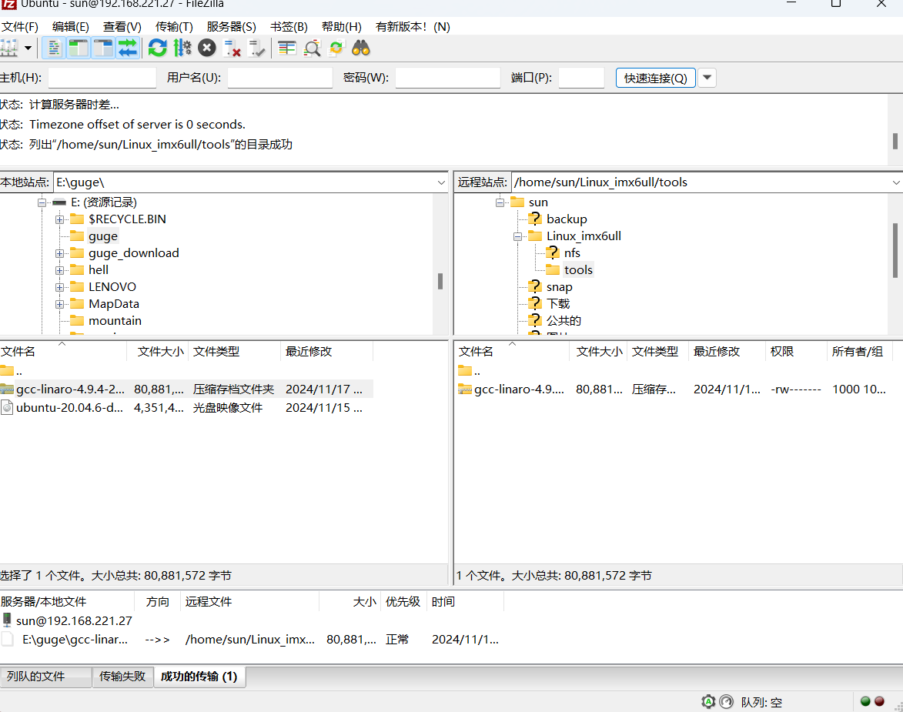
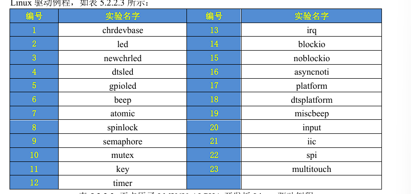
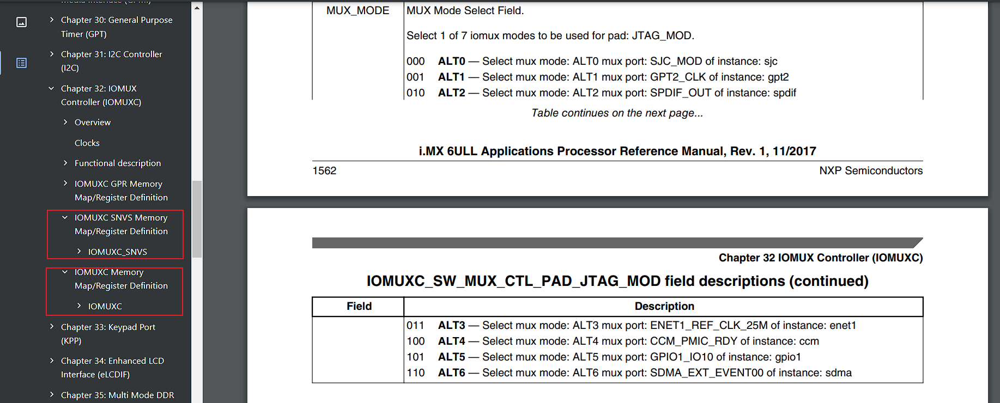
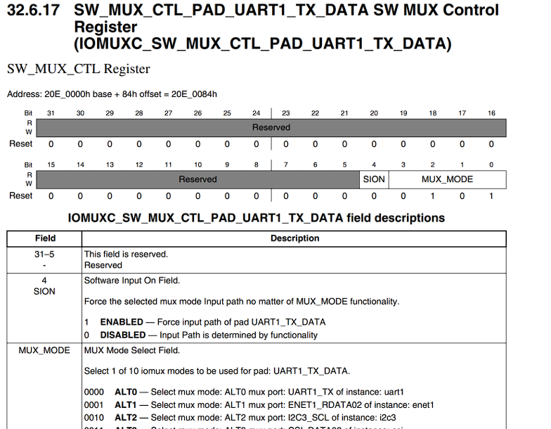
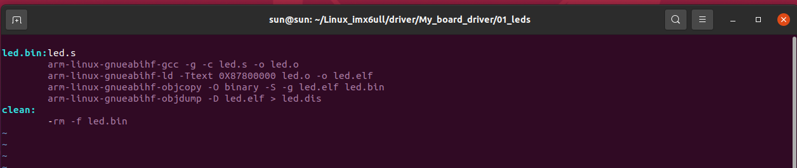

# 裸机开发篇

前言：

本篇讲解ARM的裸机开发，也就是不带操作系统开发，就和我们开发STM32一样，如果有STM32开发经验的话学起本篇会很容易。

裸机开发的基本原因：

1、裸机开发是了解所使用的CPU最直接、最简单的方法。
比如本教程使用的I.MX6U，跟STM32 一样，裸机开发是直接操作CPU的寄存器。
Linux驱动开发最终也是操作的寄存器，但是在操作寄存器之前要先编写一个符合Linux驱动的框架。
同样一个点灯驱动，裸机可能只需要十几行代码，但是Linux下的驱动就需要几十行代码。 

2、大部分Linux驱动初学者都是从STM32转过来的，Linux驱动开发和STM32开发区别很大，比如Linux没有MDK、IAR这样的集成开发环境。
Linux驱动开发需要我们自己在Ubuntu下搭建交叉编译环境。
直接上手Linux驱动开发可能会因为和STM32巨大的开发差异而打击学习信心。

3、裸机开发是连接Cortex-M（如STM32）单片机和Cortex-A(如 I.MX6U)处理器的桥梁。通过这十几个裸机例程也可以同时复习STM32，掌握很多MDK、IAR这种集成开发环境没有告诉你的“干货”。

## 第四章 开发环境搭建

要进行裸机开发肯定要先搭建好开发环境，我们在开始学习 STM32 的时候肯定需要安装一堆的软件，比如MDK、IAR、串口调试助手等等，这个就是STM32的开发环境搭建。
同样的，要想在Ubuntu 下进行 Cortex-A(I.MX6U)开发也需要安装一些软件，也就是网上说的开发环境搭建，环境搭建好以后我们就可以进行开发了。

环境搭建分为Ubuntu和Windows，因为我们最熟悉Windows
所以代码编写、查找资料等在Windows下进行的。
但是Linux开发又必须在Ubuntu下进行
所以还需要搭建Ubuntu下的开发环境，主要是交叉编译器的安装。
本章我们就分为Ubuntu和Windows，讲解这两种操作系统下的环境搭建。

### 4.1 Ubuntu与Windows下得文件互传

在Windwos下进行代码编写，然后将编写好的代码拿到Ubuntu下进行编译。
我们要做到Windows和Ubuntu下的文件互传，需要使用FTP服务。

1. Ubuntu下开启FTP服务

安装FTP服务
`sudo apt install vsftpd`
等待软件安装


安装完成以后使用VI命令打开/etc/vsftpd.conf
进行FTP服务器配置

配置如下两行：
```bash
local_enable=YES 
write_enable=YES 
```
利用vim 可以使用末行命令: ?词 进行查找


修改文件内容，权限不够加sudo


修改完以后重启FTP服务

`sudo /etc/init.d/vsftpd restart`

注意`/etc/init.d/vsftpd`这是 vsftpd 服务的启动脚本所在的位置。
`/etc/init.d/` 目录包含了系统中各种服务的启动脚本


FTP服务启动：

启动服务：
`sudo systemctl start vsftpd`
开机自启动：
`sudo systemctl enable vsftpd`
配置设置文件
`sudo nano /etc/vsftpd.conf`
重新启动
`sudo systemctl restart vsftpd`
注意：
默认情况下，vsftpd会创建一个名为ftp的用户，该用户可用于登录FTP服务器
`sudo passwd ftp`
用于设置密码

可以如下命令查看是否FTP已经启动
`sudo service vsftpd status`
也可以监测默认21号端口
`sudo netstat -tulpn | grep :21`


如图已经被监听21号端口

2. Windows下FTP客户端安装

Windows下我们使用免费的FTP客户端软件，FileZilla。
可以在官网下载
[FileZilla](https://www.filezilla.cn)


下载安装即可。

打开界面如下：


3. FileZilla设置 

Ubuntu 作为 FTP服务器，FileZilla 作为FTP客户端，客户端肯定要连接到服务器上。
打开站点管理器(文件->站点管理器)


在站点管理器中创建新站点，用于链接Ubuntu FTP服务器。


没有ipv4的地址，只有ipv6地址 2409:8902:6f43:15ae:8a9d:bac0:2db7:6f01
重启后出现ipv4地址


进行连接


链接建立
第一次连接可能会弹出提示是否保存密码的对话框，点击确定即可。

连接成功以后，其中左边就是 Windows 文件目录，右边是 Ubuntu 文件目录，默认进入用户根目录下（比如我电脑的“/home/sun”）。

此时，Utuntu下得文件以乱码形式存在，因为编码格式不对。
我们需要重新设置编码。

先断开连接，点击：服务器(S)->断开连接
然后打开站点管理器，选中要设置的站点“Ubuntu”，选择“字符集”UTF-8编码


再次链接，
显示已经正常


如果要将 Windows 下的文件或文件夹拷贝到 Ubuntu 中，只需要在左侧的Windows 区域选中要拷贝的文件或者文件夹，然后直接拖到右侧的Ubuntu中指定的目录即可。
将Ubuntu中的文件或者文件夹拷贝到Windows中也是直接拖放。 

### 4.2 Ubuntu下NFS和SSH服务

#### 4.2.1 NFS服务开启

NFS服务介绍：

NFS（Network File System，网络文件系统）是一种允许不同计算机通过网络共享文件的协议。
它最初由Sun Microsystems开发，主要用于UNIX和Linux系统。

NFS的主要功能
    
    文件共享：NFS允许网络中的计算机共享文件和目录，使得远程文件系统看起来像是本地文件系统。
    跨平台支持：NFS支持不同操作系统之间的文件共享，包括UNIX、Linux和Windows。
    透明访问：用户可以像访问本地文件一样访问远程文件，无需了解底层网络细节。

NFS的工作原理
    
    RPC（远程过程调用）：NFS使用RPC协议来管理和传输数据。RPC服务（如portmap或rpcbind）负责将NFS功能映射到特定的端口号。
    端口管理：NFS服务启动时，会随机选择一些端口用于数据传输，并向RPC服务注册这些端口。客户端通过RPC服务获取这些端口信息，从而建立连接。
    数据传输：一旦连接建立，客户端可以通过NFS协议访问和操作远程文件系统。

注意FTP只是实现了文件的传输，NFS才是实现了真正的文件共享。
 ***
后面进行Linux驱动开发的时候需要NFS启动
因此要先安装并开启Ubuntu中的NFS服务，使用如下命令安装NFS服务：

`sudo apt install nfs-kernel-server rpcbind` 


安装完成以后在用户根目录下创建一个名为“linux”的文件夹
以后所有的东西都放到这个“linux”文件夹里面，在“linux”文件夹里面新建一个名为“nfs”的文件夹，用于文件共享。


创建的nfs文件夹供nfs服务器使用，以后我们可以在开发板上通过网络文件系统来访问nfs文件夹.
首先配置nfs，使用如下命令打开nfs配置文件/etc/exports：
`sudo vim /etc/exports`

编辑 /etc/exports 文件，添加共享目录配置

`/home/sun/Linux_imx6ull/nfs *(rw,sync,no_root_squash) `


再重启服务即可,三种不同方式，类似上文FTP

```bash
sudo systemctl start nfs-kernel-server
sudo systemctl enable nfs-kernel-server
sudo systemctl restart nfs-kernel-server
```


#### 4.2.2 SSH服务开启

开启Ubuntu的SSH服务以后我们就可以在Windwos下使用终端软件登陆到Ubuntu，比如使用SecureCRT，Ubuntu 下使用如下命令开启SSH服务： 

`sudo apt-get install openssh-server `

上述命令安装ssh服务，ssh的配置文件为/etc/ssh/sshd_config，使用默认配置即可。 


### 4.3 Ubuntu交叉编译工具安装

#### 4.3.1 交叉编译器安装

ARM 裸机、Uboot 移植、Linux 移植这些都需要在 Ubuntu 下进行编译，编译就需要编译器，我们已经知道了如何在Liux进行C语言开发，使用的是gcc编译器。

但是Ubuntu自带的gcc编译器是针对X86架构的！而我们现在要编译的是ARM架构的代码。
所以我们需要一个在X86架构的PC上运行，可以编译ARM架构代码的GCC编译器，这个编译器就叫做交叉编译器。

总结一下：

    1、它肯定是一个GCC编译器。 
    2、这个GCC编译器是运行在X86架构的PC上的。 
    3、这个GCC编译器是编译ARM架构代码的，也就是编译出来的可执行文件是在ARM芯片上运行的。 

交叉编译器中“交叉”的意思就是在一个架构上编译另外一个架构的代码，相当于两种架构“交叉”起来了。

交叉编译器有很多种，我们使用Linaro出品的交叉编译器。
Linaro是一间非营利性质的开放源代码软件工程公司，Linaro开发了很多软件，最著名的就是Linaro GCC编译工具链(编译器)，关于 Linaro 详细的介绍可以到 Linaro 官网查阅。

[Linaro GCC](https://releases.linaro.org/components/toolchain/binaries/4.9-2017.01/arm-linux-gnueabihf/)

我们选择4.9版本的编译器，已经尝试过再IMX6ULL上可以运行。

我们需要关注这两种: gcc-linaro-4.9.4-2017.01i686_arm-linux-gnueabihf.tar.tar.xz 和 gcc-linaro-4.9.4-2017.01-x86_64_arm-linux-gnueabihf.tar.xz。
第一个是针对32位系统的，第二个是针对64位系统的。
大家根据自己所使用的Ubuntu系统类型选择合适的版本。


下载好编译器后，我们需要传送到Ubuntu中。
我们在这个 Ubuntu中的linux 文件夹里面再创建一个名为“tool”的文件夹，用来存放一些开发工具。
然后利用FTP将交叉编译器拷贝到tool中。



在Ubuntu中创建目录：/usr/local/arm
命令如下：
`sudo mkdir /usr/loacl/arm`

创建完成以后将刚刚拷贝的交叉编译器复制到/usr/local/arm 这个目录中,注意使用root权限。

拷贝完成以后在/usr/local/arm 目录中对交叉编译工具进行解压，解压命令如下：
`sudo tar -vxf gcc-linaro-4.9.4-2017.01-x86_64_arm-linux-gnueabihf.tar.xz `

等待解压完成，解压完成以后会生成一个名为“gcc-linaro-4.9.4-2017.01-x86_64_arm-linuxgnueabihf”的文件夹。
这个文件夹里面就是我们的交叉编译工具链。 如下图所示：


修改bash的环境变量
`sudo vim /etc/profile`
profile文件的具体作用请见SHELL笔记
添加如下命令：
`export PATH=$PATH:/usr/local/arm/gcc-linaro-4.9.4-2017.01-x86_64_arm-linux-gnueabihf/bin`
即声明环境变量PATH，添加交叉编译文件夹下得/bin文件夹


修改好后重启Ubuntu系统，交叉编译工具链就安装好了

#### 4.3.2 安装相关库

在使用交叉编译器之前还需要安装一下其它的库，命令如下： 
`sudo apt-get install lsb-core lib32stdc++6`


安装完成

#### 4.3.3 交叉编译器验证

首先查看一下交叉编译工具的版本号，输入如下命令： 

`arm-linux-gnueabihf-gcc -v`

如果交叉编译器安装正确的话就会显示版本号.


验证前先重启。

第三章“Linux C编程入门”中使用Ubuntu自带的GCC编译器，我们用的是命令“gcc”。
要使用刚刚安装的交叉编译器的时候使用的命令是“arm-linux-gnueabihf-gcc”。

arm-linux-gnueabihf-gcc的含义如下：

    1、arm 表示这是编译arm架构代码的编译器。 
    2、linux 表示运行在linux环境下。 
    3、gnueabihf 表示嵌入式二进制接口。 
    4、gcc 表示是gcc工具。

最好的验证方法就是直接编译一个例程，我们就编译第一个裸机例程“1_leds”试试。

验证：
在前面创建的linux文件夹下创建driver/board_driver 文件夹，用来存放裸机例程
第一个裸机例程“1_leds”拷贝到board_driver中

然后执行make命令进行编译


从图中可以看到例程“1_leds”编译成功了，编译生成了led.o和led.bin这两个文件
使用如下命令查看led.o文件信息： 
`file led.o`


如图表明 led.o 是 32 位 LSB 的ELF格式文件，目标机架构为ARM，说明交叉编译器正常工作。

补充：‌file命令用于识别文件类型。‌ 它能够根据文件的特征，如内容、元数据等，来判断文件的类型。这对于理解文件内容、进行文件管理或调试非常有用。

### 4.4 Source Insight软件使用

Source Inisght 是一款功能强大的代码编辑、阅读工具，工作在 Windows 下，我们可以用Source Insight来进行代码编写和阅读，编写完成以后将代码拷贝到Ubuntu中去编译即可。

[下载链接](https://www.sourceinsight.com/)

安装过程不在赘述。

可以自行安装，注意Source Insight为付费软件。

具体使用参见软件教程，不在赘述。

### 4.5 Vscode安装

#### 4.5.1 Vscode安装

Visual Stuio Code 和 Source Insight 一样，都是编辑器，Visual Studio Sode 本教程以后就简称为VSCode，VSCode 是微软出的一款编辑器，但是免费的。
VSCode 有 Windows、Linux 和macOS 三个版本的，是一个跨平台的编辑器。

[下载地址](https://code.visualstudio.com/)

建议Windows和Ubuntu下都要安装Vscode。具体安装方式请自行解决。

如图，我已经安装完毕


#### 4.5.2 Vscode使用

VSCode 支持多种语言，比如C/C++、Python、C#等等，本教程我们主要用来编写C/C++程序的，所以需要安装C/C++的扩展包，扩展包安装很简单

我们需要按照的插件有下面几个： 

- (1)、C/C++，这个肯定是必须的。 
- (2)、C/C++ Snippets，即 C/C++重用代码块。 
- (3)、C/C++ Advanced Lint,即 C/C++静态检测 。 
- (4)、Code Runner，即代码运行。 
- (5)、Include AutoComplete，即自动头文件包含。 
- (6)、Rainbow Brackets，彩虹花括号，有助于阅读代码。 
- (7)、One Dark Pro，VSCode 的主题。 
- (8)、GBKtoUTF8，将GBK转换为UTF8。 
- (9)、ARM，即支持ARM汇编语法高亮显示。 
- (10)、Chinese(Simplified)，即中文环境。 
- (11)、vscode-icons，VSCode 图标插件，主要是资源管理器下各个文件夹的图标。 
- (12)、compareit，比较插件，可以用于比较两个文件的差异。 
- (13)、DeviceTree，设备树语法插件。 
- (14)、TabNine，一款AI自动补全插件，强烈推荐，谁用谁知道！  

#### 4.5.3 Vscode新建工程

新建一个文件夹用于存放工程，比如我新建的文件夹目录E:\VScode_Program\1_test，路径尽量不要有中文和空格。打开VSCode，然后在VSCode上点击文件->打开文件夹…，选刚刚创建的“1_test”文件夹即可。

一般一个文件夹中会有一个.vscode文件夹，用于环境配置。

C/C++的配置文件是个json文件，名为：c_cpp_properties.json

这个json文件中的变量“includePath”用于指定工程中的头文件路径，但是“stdio.h”
是C语言库文件，而VSCode只是个编辑器，没有编译器，所以肯定是没有stdio.h的。
除非我们自行安装一个编译器，比如CygWin，然后在includePath 中添加编译器的头文件。
这里我们就不添加了，因为我们不会使用VSCode来编译程序，这里主要知道如何指定头文件路径就可以了，后面有实际需要的时候再来讲。

具体VScode如何使用请实战学习。

### 4.6 CH340串口驱动安装

我们一般在Windwos下通过串口来调试程序，或者使用串口作为终端。
I.MX6U-ALPHA开发板使用CH340这个芯片实现了USB转串口功能，CH340是一枚江苏沁恒生产的国产芯片，稳定性还是很不错的。

先通过USB线将开发板的串口和电脑连接起来起来。
CH340 是需要安装驱动的，驱动我们已经放到了开发板光盘中，直接双击安装即可。


成功安装。

### 4.7 SecureCRT 软件安装

#### 4.7.1 安装
在后续的开发过程中我们需要在 Windows 下使用 SecureCRT 作为终端，SecureCRT 支持SSH 以及串口，我们通常使用 SecureCRT 来作为串口终端使用

[下载链接](https://www.vandyke.com/download/index.html)

按照要求安装即可

#### 4.7.2 使用

SecureCRT 功能很强大，支持SSH，可以用来远程登陆；
支持串口，可以用来作为Linux开发板的串口终端。
我们用的最多的就是将SecureCRT作为串口终端来使用。

使用具体请按照工具自行学习，接下来做简单介绍

1. 链接开发板

查看当前开发板的串口号


如图，COM3

2. 设置SecureCRT


如图，新建一个快速连接

按照如下配置


如图，成功链接


I.MX6U-ALPHA 开发板默认出厂烧写了Linux系统，所以如果连接上SecureCRT以后会将串口作为终端，会输出Linux系统启动信息。
并且可以通过SecureCRT来操作开发板中的Linux系统，此时SecureCRT就是开发板的终端，和Ubuntu中的终端一样。


### 4.8 Putty软件

#### 4.8.1 Putty软件安装

Putty和SecureCRT是类似的软件，都是用来作为SSH或者串口终端的，区别在于SecureCRT是付费软件，而Putty是免费的！！！

[下载地址](https://www.chiark.greenend.org.uk/~sgtatham/putty/latest.html)

按照自己需求安装即可

#### 4.8.2 Putty的使用

是具体情况自己使用。

### 4.9  MobaXterm 软件安装和使用

#### 4.9.1 安装

MobaXterm 也是一个类似SecureCRT 和Putty 的终端软件，此软件是网友推荐的，功能强大而且免费(也有收费版)！

[下载地址](https://mobaxterm.mobatek.net/)

按要求安装即可

#### 4.9.2  MobaXterm 软件使用

不做具体描述，自行学习使用。

当然推荐还是使用SecureCRT 其次使用MobaxTerm也可。

## 第五章 开发平台介绍

本人使用的是的I.MX6U-Mini开发板。

### 5.1 资源初探

这款开发板，是正点原子推出的第一款Linux开发板，采用底板+核心板的形式。接下来我们分别介绍I.MX6U-ALPHA开发板的底板和核心板。 

#### 5.1.1 开发板底板资源


I.MX6U-Mini 开发板底板其实就是I.MX6U-ALPHA 开发板的精简底板。

具体板载资源见开发手册。

#### 5.1.2 核心板资源

我们来看I.MX6ULL核心板资源图，正点原子的I.MX6ULL核心板根据存储芯片的不同分为EMMC和NAND两种，根据对外提供的接口可以分为邮票孔和BTB两种。


正点原子I.MX6ULL EMMC版核心板板载资源如下： 
◆ CPU：MCIMX6Y2CVM08AB（工业级），800MHz(实际792MHz)，BGA289 
◆ 外扩DDR3L：NT5CC256M16EP-EK，512MB字节，商业级。 
◆ EMMC：KLM8G1GET，这是一个8GB的EMMC芯片。 
◆ 两个2*30的防反插BTB座，共引出120 PIN 

### 5.2 开发板资源说明

#### 5.2.1 Mini硬件资源说明

1.  SDIO WIFI接口
 
这是开发板上的一个SDIO WIFI(P2)接口，可以通过此接口连接正点原子出品的SDIO WIFI模块。
SDIO WIFI接口和TF卡共用一个USDHC接口，因此不能同时和TF卡使用。  

2. USB转串口 

USB 串口，为MiniUSB接口（USB_TTL），USB连接CH340C芯片，CH340C与I.MX6IULL的串口1相连接，从而实现USB转串口。
设计成USB串口，是出于现在电脑上串口正在消失，尤其是笔记本，几乎清一色的没有串口，所以板载USB串口可以方便大家调试。

3. I.MX6ULL核心板接口 

这是开发板底板上面的核心板接口，由2个2*30的贴片板对板接线端子（3710F公座）组成。
可以用来插正点原子的I.MX6UL/ULL核心板等，从而学习I.MX6UL/6ULL等芯片，达到一个开发板，学习多款SOC的目的，减少重复投资。

4. RGBLCD接口 

这是转接板自带的RGB LCD接口（LCD），可以连接各种正点原子的RGB LCD屏模块，并且支持触摸屏（电阻/电容屏都可以）。
采用的是RGB888格式，可显示1677万色，色彩显示丰富。

5. USB HOST接口 

这是开发板板载的一个卧式USB-A座（USB_HOST），我们可以通过这个USB-A座，连接U盘/USB鼠标/USB键盘等其他USB从设备，从而实现USB主机功能。

6. 后备电池接口 

这是I.MX6ULL后备区域的供电接口，可以用来给I.MX6ULL的后备区域提供能量，在外部电源断电的时候，维持SNVS区域数据的存储，以及RTC的运行。 

7. 启动(BOOT)拨码开关 

I.MX6U 支持多种启动方式，比如SD卡、EMMC、NAND、QSPI FALSH和USB等，要想从某一种设备启动就必须先设置好启动拨码开关。
I.MX6U-Mini 开发板用了一个 8P 的拨码开关来选择启动方式，支持从SD卡、EMCM、NAND和USB这四种启动方式，这四种启动方式对应的拨码开关拨动方式已经写在了开发板上。
大家在使用的时候根据自己的实际需求设置拨码开关即可。

8. 摄像头模块接口 

这是开发板板载的一个摄像头模块接口（P1），摄像头模块（需自备），对准插入到此插槽中。

9. ATK模块接口 

这是开发板板载的一个正点原子通用模块接口（P7），目前可以支持正点原子开发的 GPS模块、蓝牙模块、MPU6050模块、激光测距模块和手势识别模块等，直接插上对应的模块，就可以进行开发。
后续我们将开发更多兼容该接口的其他模块，实现更强大的扩展性能。 

10. 蜂鸣器 

这是一个有源蜂鸣器，通过高低电平控制蜂鸣器的开关。

11. ON/OFF 按键 

这是一个ON/OFF按键，连接到I.MX6ULL的OF/OFF引脚上。

12. 复位按键 

这是开发板板载的复位按键（RESET），用于复位I.MX6U，还具有复位液晶的功能。
因为液晶模块的复位引脚和 I.MX6U 的复位引脚是连接在一起的，当按下该键的时候，I.MX6U 和
液晶一并被复位。 

13. 用户按键KEY 

这是开发板板载的1个机械式输入按键（KEY0），可以做为普通按键输入使用。 

14. 蓝色电源指示LED灯 

这是开发板电源指示LED灯，为蓝色，当板子供电正常的时候此灯就会常亮。
如果此灯不亮的话就说明开发板供电有问题(排除LED灯本身损坏的情况)。

15. 红色用户LED灯 

这是开发板板载的1个LED灯，为红色，用户可以使用此LED灯。
在调试代码的时候，使用LED来指示程序状态，这是非常不错的一个辅助调试方法。

16. 引出的IO口 

这是开发板IO引出端口P4，采用2*24排针，总共引出41个IO口。 

17. 3.3V 电源输入/输出 

这是开发板板载的一组3.3V电源输入输出排针（2*3）（ JP1），用于给外部提供3.3V的电源，也可以用于从外部接3.3V的电源给板子供电。 
大家在实验的时候可能经常会为没有3.3V电源而苦恼不已，有了I.MX6U-Mini开发板，你就可以很方便的拥有一个简单的3.3V电源（最大电流不能超过3000mA）。 

18. 5V 电源输入/输出 
     
这是开发板板载的一组5V电源输入输出排针（2*3）（ JP2），该排针用于给外部提供5V的电源，也可以用于从外部接5V的电源给板子供电。 
同样大家在实验的时候可能经常会为没有5V 电源而苦恼不已，正点原子充分考虑到了大家需求，有了这组5V排针，你就可以很方便的拥有一个简单的5V电源。
注意：（USB供电的时候，最大电流不能超过500mA，外部供电的时候，最大可达3000mA）。

19. 电源开关 

这是开发板板载的电源开关。该开关用于控制整个开发板的供电。
这是一个自锁式开关，按下以后打开开发板电源，整个板子开始供电，电源指示灯(PWR)点亮。
再次按下开关弹起，关闭开发板电源，整个开发板都将断电，电源指示灯（PWR）会随之熄灭。

20. DC6~16V 电源输入 

这是开发板板载的一个外部电源输入口（DC_IN），采用标准的直流电源插座。
开发板板载了DC-DC芯片（JW5060T），用于给开发板提供高效、稳定的5V电源。
由于采用了DC-DC芯片，所以开发板的供电范围十分宽，大家可以很方便的找到合适的电源（只要输出范围在DC6~16V 的基本都可以）来给开发板供电。
在耗电比较大的情况下，比如用到4.3屏/7寸屏/网口的时候，建议使用外部电源供电，可以提供足够的电流给开发板使用。

21. 以太网接口(RJ45) 

这是开发板板载的以太网接口，连接到I.MX6U的ENET2网络接口。 

22. CAN接口 

这是开发板板载的CAN总线接口（CAN），通过2个端口和外部CAN总线连接，即CANH和CANL。
这里提醒大家：CAN通信的时候，必须CANH接CANH，CANL接CANL，否则可能通信不正常！ 

23. RS485/串口 3接口 

这是RS485 与 I.MX6ULL 串口 3 的跳线帽设置接口，如果将485_R 与 U3_T、485_T 与U3_R 连起来，那么RS485接口就会使用I.MX6ULL的串口3。
做RS485实验的时候一定要将此接口连起来。 

24. RS485 接口 

这是开发板板载的RS485总线接口（RS485），通过2个端口和外部485设备连接。
这里提醒大家，RS485通信的时候，必须A接A，B接B。否则可能通信不正常 

25. JTAG接口 

10P 的JTAG接口，可用于连接JLINK等调试器。

26. USB OTG接口 

这是开发板板载的一个MiniUSB头（USB_OTG），用于USB OTG实验。 

27. TF卡接口 

这是开发板板载的一个标准TF卡接口（TF_CARD），该接口在开发板的背面，采用小型的TF 卡接口，USDHC方式驱动，有了这个TF卡接口，就可以满足海量数据存储的需求。

#### 5.2.2 Mini软件资源

由于Mini 板是ALPHA的精简底板，因此Mini板的软件资源和ALPHA的软件资源可以共用，包括例程、视频和教程，除了Mini板没有的外设。

软件资源分为3部分：Linux系统驱动软件资源、裸机例程、Linux驱动例程。

裸机例程：


正点原子的I.MX6U-ALPHA开发板裸机例程似乎不是很多。
因为单片机学名叫做Microcontroller，也就是微控制器，主要用于控制相关的应用。
因此单片机的外设都比较多，比如很多路的IIC、SPI、UART、定时器等等。
嵌入式Linux开发主要注重于高端应用场合，比如音视频处理、网络处理等等。

具体区别示例：

比如一个机器人，高性能处理器加Linux系统(或者其他系统)作为机器人的大脑。
主要负责接收各个传感器采集的数据然后对原始数据进行处理，得到下一步执行指令，这个往往需要很高的性能。

当处理完成得到下一步要做的动作之后，大脑就会将数据发给控制机器人各个关节电机的驱动控制器，这些驱动控制器一般都是单片机做的。

所以大家在学习嵌入式Linux开发的时候一定不要深陷裸机。
我们之所以讲解裸机是为了给嵌入式Linux 打基础，让大家了解所使用的SOC、了解GCC那一套工作流程，最终的目的都是为了嵌入式Linux做准备的。

嵌入式驱动例程：



因为有些外设驱动在Linux内核里面已经集成了，因此并没有编写独立的驱动，我们会在相应的章节里面对这些驱动进行讲解。

#### 5.2.3 核心板硬件介绍

1. 核心板电源指示灯 

这是核心板板载的一个蓝色LED灯，用于指示核心板供电是否正常，如果核心板供电正常的话此灯就会点亮。 

2. NAND/EMMC存储芯片
 
这是核心板上板载的存储芯片，分为NAND和EMMC两种。
对于NAND版本的核心板共有 256MB 和 512MB 两种容量的 NAND，型号分别为 MT29F2G08ABAEAWP-IT 或 MT29F4G08ABADAWP-IT，这两种型号的NAND FLASH工作温度范围都为工业级。
EMMC版本的核心板使用8GB的EMMC，型号为KLM8G1GET。 

3. DDR3L芯片 

这是核心板板载的DDR3L芯片，NAND版本核心板的DDR3L容量为256MB，EMMC版本的核心板的DDR3L容量为512MB。
型号分别为NT5CC128M16JR-EK和NT5CC256M16EPEK。
如果要用于UI开发，那么最好选择512MB的DDR3L。

4. CPU 

这是核心板的 CPU，型号为 MCIMX6Y2CVM08AB，MCIMX6Y2CVM08AB 主频为800MHz(实际 792MHz)。
该芯片采用Coretx-A7 内核，自带32KB的L1指令 Cache、32KB 的L1 数据Cache、128KB 的 L2Cache、集成 NEON 和 SIMDv2、支持硬件浮点(FPU)计算单元。
浮点计算架构为VFPv4-D32、1个RGB LCD接口、2个CAN接口、2个10M/100M网络接口、2 个USB OTG接口(USB2.0)、2路ADC、8个串口、3个SAI、4个定时器、
8路PWM、4路I2C 接口、4路SPI接口、一路CSI摄像头接口、2个USDHC接口，支持4位SD卡，最高可
以支持UHS-I SDR 104模式，支持1/4/8位的EMMC，最高可达HS200模式、一个外部存储接
口、支持16位的LPDDR2-800、DDR3-800和DDR3L-800、支持8位的MLC/SLC NAND Flash，
支持2KB、4KB和8KB页大小，以及124个通用IO口等。 

5. 32.768KHz 晶振 
 
这是一个无源的32.768KHz晶振，供I.MX6U内部RTC使用。

6. 24MHz晶振 

这是一个无源的24MHz晶振，供I.MX6U使用。  
另外，I.MX6U 核心板的接口在底部，通过两个2*30的板对板端子（3710M母座）组成，总共引出了104个IO，通过这个接口，可以实现与I.MX6U-ALPHA底板对接。

### 5.3 开发板原理图介绍

具体请见数据手册

核心板与底板的接口：
I.MX6U-Mini开发板底板采用2个2*30的3710F（公座）板对板连接器来同核心板连接

引出IO口：

一共40个IO，外加一个GND、一个5V、一个3.3V、一个ON_OFF引脚

USB串口：

CH340C 内置晶振，因此就不需要再在外面连接一个晶振。
USB_TTL是本开发板的主要供电口.

RGBLCD接口：
见数据手册

复位电路：
低电平复位

启动模式设置：
支持多种启动方式

VBAT供电接口：

上图的VDD_COIN_3V通过核心板上的BAT54C，接VDD_SNVS_IN脚，从而给核心板的SNVS区域供电。这部分原理图在核心板上

VDD_SNVS_IN 使用 VDD_COIN_3V（接 CR1220 电池）和VDD_SNVS_3V3 混合供电的方式.
在有外部电源（VDD_SNVS_3V3）的时候，CR1220 不给VDD_SNVS_IN 供电，而在外部电源断开的时候，则由CR1220给其供电。
这样，VDD_SNVS_IN总是有电的，以保证RTC的走时。 

RS485接口：
RS485 电平也不能直接连接到I.MX6U，同样需要电平转换芯片。
这里我们使用SP3485来做485电平转换。

CAN接口：
CAN总线电平也不能直接连接到I.MX6U，同样需要电平转换芯片。
这里我们使用TJA1050来做CAN电平转换。

USB HOST 接口:
USB HOST连接到了I.MX6ULL的USB2接口。

USB OTG 接口:
USB OTG接口使用了I.MX6U的USB1接口。

LED灯：
PWR BLUE是系统电源指示灯，为蓝色。
LED1为用户LED灯，连接在I.MX6U的GPIO1_IO03上，此灯为红色。

KEY接口：
1个输入按键
KEY0 用作普通按键输入，分别连接I.MX6U的UART1_CTS引脚上，这里使用外部10K上拉电阻。

摄像头模块接口:
I.MX6U-Mini 开发板板载了一个摄像头模块接口，连接在I.MX6U的硬件摄像头接口（CSI）上面.

有源蜂鸣器：
自带了震荡电路的蜂鸣器，这种蜂鸣器一接上电就会自己震荡发声。
BEEP 信号直接连接在I.MX6U 的 SNVS_TAMPER1 引脚上，可以通过控制此引脚来控制蜂鸣器开关。 

TF卡：
TF卡接口和SDIO WIFI接口共用一个SDIO，因此TF卡和SDIO不能同时使用！

SDIO WIFI接口：
用 于 连接正点原子出品的 RTL8189 SDIO WIFI 模 块。

ATK模块接口：
可以用来连接正点原子推出的一些模块。
比如：蓝牙串口模块、GPS模块、MPU6050模块、激光测距模块、手势识别模块和RGB彩灯模块等。
有了这个接口，我们连接模块就非常简单，插上即可工作。

UART3_RXD/UART3_TXD连接到了I.MX6U的UART3上，和RS232、RS485共用一个串口，在使用ATK接口的时候需要将JP1跳线帽全部拔掉，防止RS232和RS485干扰到模块。

以太网模块：
I.MX6U-Mini 开发板板载了一个以太网接口(RJ45)： ENET2

电源：
详情见数据手册

电源输入输出接口:
I.MX6U-Mini 开发板板载了两组简单电源输入输出接口.
自带电源输出接口。5V/3.3V 

原理图只做简要介绍，详情见数据手册。

### 5.4 核心板原理图

SOC电路：
比较复杂详情请看开发板原理图。

BTB接口:
I.MX6U 核心板采用2个2*30的3710M（母座）板对板连接器来同底板连接(在转接板底面)，接插非常方便

EMMC:

EMMC也是存储Flash，相比NAND Flash，EMMC使用简单(和SD类似)、速度快、容量高。
目前EMMC已经逐渐的取代了NAND Flash，尤其是在手机、平板领域。

DDR3L芯片:
内存芯片

核心板电源：
I.MX6U 对于供电有严格的要求，尤其是上电顺序。
正点原子的 I.MX6U 核心板供电主要分5部分：SNVS供电、DCDC_3V3供电、ARM/SOC内核供电、DDR3L供电和SD卡供电

注意：

    所有的原理图分析，我们将在实际用到时做详细的分析。
    后面的开发也可能用到第五章的描述，具体请见数据手册。

### 5.5 开发板使用注意

第一点：
1个USB供电最多500mA，且由于导线电阻存在，供到开发板的电压，一般都不会有5V。
如果使用了很多大负载外设，比如4.3寸屏、网络、摄像头模块等，那么可能引起USB供电不够。
所以如果是使用4.3 屏的朋友，或者同时用到多个模块的时候，建议大家使用一个独立电源供电。 
如果没有独立电源，建议可以同时插2个USB口，并插上仿真器，这样供电可以更足一些。

第二点：
当你想使用某个IO口用作其他用处的时候，请先看看开发板的原理图，该IO口是否有连接在开发板的某个外设上。
如果有，该外设的这个信号是否会对你的使用造成干扰，先确定无干扰，再使用这个IO。

第三点：
开发板上的跳线帽比较多，大家在使用某个功能的时候，要先查查这个是否需要设置跳线帽，以免浪费时间。 

第四点：
当液晶显示白屏的时候，请先检查液晶模块是否插好（拔下来重插试试）。

第五点：
开发板的USB OTG的USB SLAVE和USB HOST共用同一个USB口，所以，他们不可以同时使用。使用的时候多加注意。

第六点：
当需要从底板上拆转接板下来的时候，请左右晃动取下，不要太大幅度，否则有可能拆坏座子。 

## 第六章 Cortex-A7 MPCore架构

前言：

I.MX6UL 使用的是Cortex-A7 架构，本章就给大家介绍一下Cortex-A7架构的一些基本知识。
了解了Cortex-A7架构以后有利于我们后面的学习。
因为后面有很多例程涉及到Cortex-A7架构方面的知识，比如处理器模型、Cortex-A7寄存器组等等，但是Cortex-A7架构很庞大，远不是一章就能讲完的，所以本章只是对Cortex-A7 架构做基本的讲解

参考文档：
《Cortex-A7 Technical ReferenceManua.pdf》和《ARM Cortex-A(armV7)编程手册V4.0.pdf》
均为ARM的官方文档

### 6.1 A7 MPCore介绍 

首先介绍MPCore，MPCore 是指 Multi-Processor Core，即多处理器核心架构。
它是一种多核处理器设计，允许在单个芯片上集成多个处理器核心，从而提高计算性能和效率12。
ARM 的 Cortex-A7 MPCore 处理器支持 1 到 4 个核心，通常与 Cortex-A15 组成 big.LITTLE 架构，Cortex-A15 负责高性能任务，而 Cortex-A7 负责低功耗任务。

其中big.LITTLE 架构是由 ARM 提出的异构多核处理器架构，旨在优化性能和功耗。
它结合了高性能核心（big）和高效能核心（LITTLE），以便在不同的工作负载下实现最佳的性能和能效平衡。
比如，Cortex-A15 作为大核负责高性能运算，比如玩游戏啥的，Cortex-A7负责普通应用，因为Cortex A7 省电。

ARM官网对Cortex-A7说明如下：

“在28nm工艺下，Cortex-A7 可以运行在 1.2~1.6GHz，并且单核面积不大于 0.45mm2(含有浮点单元、NEON和32KB的L1缓存)，
在典型场景下功耗小于100mW， 这使得它非常适合对功耗要求严格的移动设备，这意味着Cortex-A7 在获得与 Cortex-A9 相似性能的情况下，其功耗更低”。 

Cortex-A7 MPCore 支持在一个处理器上选配1~4个内核，Cortex-A7 MPCore多核配置如图：


Cortex-A7 MPCore 的 L1 可选择 8KB、16KB、32KB、64KB.
L2 Cache 可以不配，也可以选择128KB、256KB、512KB、1024KB。

I.MX6UL配置了32KB的L1指令Cache和32KB的L1 数据Cache，以及128KB的L2 Cache。
Cortex-A7MPCore使用ARMv7-A架构。

补充Cortex-A7MPCore与ARMv7-A区别：

    架构层面：
    ARMv7-A 是一个架构规范，定义了指令集、寄存器和其他处理器特性。它是 ARM 处理器的一个系列，包括 Cortex-A7、Cortex-A8、Cortex-A9 等。
    Cortex-A7 MPCore 是基于 ARMv7-A 架构的具体实现。它是一款高能效的多核处理器，专为低功耗和高性能的应用设计。
    
    处理器特性：
    Cortex-A7 MPCore 具有多核设计，支持 1 到 4 个核心，集成了 L1 和可选的 L2 缓存，支持 NEON SIMD 指令集、VFPv4 浮点单元和 TrustZone 技术12。
    ARMv7-A 架构支持多种处理器特性，但具体实现取决于不同的处理器型号，如 Cortex-A7、Cortex-A8 等12。

    应用场景：
    Cortex-A7 MPCore 通常用于入门级智能手机、平板电脑和其他移动设备，强调低功耗和高能效12。
    ARMv7-A 架构的处理器广泛应用于各种设备，从高性能服务器到嵌入式系统。

Cortex-A7MPCore主要特性：

①、SIMDv2扩展整形和浮点向量操作。 
②、提供了与 ARM VFPv4 体系结构兼容的高性能的单双精度浮点指令，支持全功能的IEEE754。 
③、支持大物理扩展(LPAE)，最高可以访问40位存储地址，也就是最高可以支持1TB的内存。 
④、支持硬件虚拟化。 
⑥、支持Generic Interrupt Controller(GIC)V2.0。  
⑦、支持NEON，可以加速多媒体和信号处理算法。
具体解释，用得时解释。

### 6.2 Cortex-A处理器运行模型

补充：什么叫做处理器运行模式

    处理器运行模型（Processor Operating Modes）是指处理器在不同状态下的工作模式。
    不同的运行模式允许处理器在处理不同类型的任务时，使用不同的权限和资源。
    这些模式通常包括用户模式和各种特权模式，每种模式都有特定的用途和权限级别。

模式切换的触发条件：

    中断（Interrupts）：当处理器接收到中断信号时，会从当前模式切换到中断处理模式（如 IRQ 模式或 FIQ 模式），以处理紧急任务或外部设备请求。
    异常（Exceptions）：当处理器遇到异常情况（如非法指令、内存访问错误等）时，会切换到异常处理模式（如 Abort 模式或 Undefined 模式），以处理这些异常。
    系统调用（System Calls）：当应用程序需要操作系统服务时，会通过系统调用触发模式切换，从用户模式切换到特权模式（如 Supervisor 模式），以执行特权指令。
    启动和重启（Boot and Reset）：处理器在启动或重启时，会进入特定的启动模式（如 Supervisor 模式），以初始化系统。
    安全需求（Security Requirements）：在使用 TrustZone 技术时，处理器会在普通模式和安全模式（Monitor 模式）之间切换，以处理安全相关任务。

    这些模式切换通常由硬件事件（如中断信号）或软件指令（如系统调用）触发，以确保处理器能够高效、安全地处理各种任务。

以前的ARM处理器有7中运行模型：
User、FIQ、IRQ、Supervisor(SVC)、Abort、Undef和 System，其中 User 是非特权模式，其余 6 中都是特权模式。
新的 Cortex-A 架构加入了TrustZone 安全扩展，所以就新加了一种运行模式：Monitor
新的处理器架构还支持虚拟化扩展，因此又加入了另一个运行模式：Hyp，所以Cortex-A7处理器有9种处理模式

| 模式            | 描述                                                           |
| --------------- | -------------------------------------------------------------- |
| User(USR)       | 用户模式，非特权模式，大部分程序运行的时候就处于此模式。       |
| FIQ             | 快速中断模式，进入FIQ中断异常 ，具有最高的优先级               |
| IRQ             | 一般中断模式                                                   |
| Supervisor(SVC) | 超级管理员模式，特权模式，供操作系统内核使用。                 |
| Monitor(MON)    | 监视模式？这个模式用于安全扩展模式。                           |
| Abort(ABT)      | 数据访问终止模式（内存访问错误等），用于虚拟存储以及存储保护。 |
| Hyp(HYP)        | 用于虚拟化扩展，支持虚拟机管理程序（Hypervisor）。             |
| Undef(UND)      | 未定义指令终止模式。                                           |
| System(SYS)     | 系统模式，用于运行特权级的操作系统任务                         |

除了User(USR)用户模式以外，其它8种运行模式都是特权模式。
这几个运行模式可以通过软件进行任意切换，也可以通过中断或者异常来进行切换。

大多数的程序都运行在用户模式，用户模式下是不能访问系统所有资源的。
有些资源是受限的，要想访问这些受限的资源就必须进行模式切换。

但是用户模式是不能直接进行切换的，用户模式下需要借助异常来完成模式切换。
当要切换模式的时候，应用程序可以产生异常，在异常的处理过程中完成处理器模式切换。 

当中断或者异常发生以后，处理器就会进入到相应的异常模式中，每一种模式都有一组寄存器供异常处理程序使用，
这样的目的是为了保证在进入异常模式以后，用户模式下的寄存器不会被破坏。 

如果学过STM32和UCOS、FreeRTOS就会知道，STM32只有两种运行模式，特权模式和非特权模式，但是Cortex-A就有9种运行模式。

### 6.3 Cortex-A寄存器组

ARM架构提供了16个32位的通用寄存器(R0~R15)供软件使用。
前15个(R0~R14)可以用作通用的数据存储，R15是程序计数器PC，用来保存将要执行的指令。

ARM还提供了一个当前程序状态寄存器CPSR和一个备份程序状态寄存器SPSR，SPSR寄存器就是CPSR寄存器的备份。

CPSR介绍：

    CPSR（Current Program Status Register，当前程序状态寄存器）是 ARM 处理器中的一个关键寄存器，用于存储处理器的当前状态和控制信息。
    它包含以下几个重要部分：

    条件码标志（Condition Flags）：
        N（Negative）：结果为负数时置位。
        Z（Zero）：结果为零时置位。
        C（Carry）：加法操作产生进位或减法操作产生借位时置位。
        V（Overflow）：有符号运算产生溢出时置位。
    控制位（Control Bits）：
        I（Interrupt Disable）：中断禁止位，置位时禁止 IRQ 中断。
        F（Fast Interrupt Disable）：快速中断禁止位，置位时禁止 FIQ 中断。
        T（Thumb State）：指示处理器当前是否处于 Thumb 状态。

    模式位（Mode Bits）：指示处理器当前的运行模式，如用户模式、管理模式、中断模式等。

    CPSR 在处理器的不同模式下都可以访问，并且在异常发生时，处理器会将当前的 CPSR 保存到相应的 SPSR（Saved Program Status Register）中，以便在异常处理完毕后恢复原来的状态。

寄存器如图所示：


上一小节我们讲了Cortex-A7有9种运行模式，每一种运行模式都有一组与之对应的寄存器组。
每一种模式可见的寄存器包括15个通用寄存器(R0~R14)、一两个程序状态寄存器和一个程序计数器PC。
在这些寄存器中，有些是所有模式所共用的同一个物理寄存器，有一些是各模式自己所独立拥有的.
见下表：


可以看出，在所有的模式中，低寄存器组(R0\~R7)是共享同一组物理寄存器的，只是一些高寄存器组在不同的模式有自己独有的寄存器，比如FIQ模式下R8~R14是独立的物理寄存器。
假如某个程序在FIQ模式下访问R13寄存器，那它实际访问的是寄存器R13_fiq。
如果程序处于SVC模式下访问R13寄存器，那它实际访问的是寄存器R13_svc。

总结：
①、34个通用寄存器，包括R15程序计数器(PC)，这些寄存器都是32位的。 
②、8个状态寄存器，包括CPSR和SPSR。 
③、Hyp模式下独有一个ELR_Hyp寄存器。

### 6.3.1 通用寄存器

R0~R15 就是通用寄存器，通用寄存器可以分为以下三类： 
①、未备份寄存器，即R0~R7。 
②、备份寄存器，即R8~R14。 
③、程序计数器PC，即R15。

#### 1.未备份寄存器

未备份寄存器指的是R0~R7这8个寄存器，因为在所有的处理器模式下这8个寄存
器都是同一个物理寄存器，在不同的模式下，这8个寄存器中的数据就会被破坏。
所以这8个寄存器并没有被用作特殊用途。 

#### 2.备份寄存器 

备份寄存器中的R8~R12这5个寄存器有两种物理寄存器。
在快速中断模式下(FIQ)它们对应着Rx_irq(x=8~12)物理寄存器，其他模式下对应着 Rx(8~12)物理寄存器。
FIQ 是快速中断模式，看名字就是知道这个中断模式要求快速执行！
FIQ模式下中断处理程序可以使用R8~R12寄存器，因为FIQ模式下的R8~R12是独立的，因此中断处理程序可以不用执行保存和恢复中断现场的指令，从而加速中断的执行过程。

备份寄存器R13一共有8个物理寄存器，其中一个是用户模式(User)和系统模式(Sys)共用的，剩下的7个分别对应7种不同的模式。
R13也叫做SP，用来做为栈指针。基本上每种模式都有一个自己的R13物理寄存器，应用程序会初始化R13，使其指向该模式专用的栈地址，这就是常说的初始化SP指针。

备份寄存器R14一共有7个物理寄存器，其中一个是用户模式(User)、系统模式(Sys)和超级监视模式(Hyp)所共有的，剩下的6个分别对应6种不同的模式。
R14也称为连接寄存器(LR)，LR寄存器在ARM中主要用作如下两种用途：
- 第一方面：
每种处理器模式使用R14(LR)来存放当前子程序的返回地址，如果使用BL或者BLX
来调用子函数的话，R14(LR)被设置成该子函数的返回地址，在子函数中，将R14(LR)中的值赋
给R15(PC)即可完成子函数返回，比如在子程序中可以使用如下代码：
`MOV PC, LR @寄存器LR中的值赋值给PC，实现跳转`
或者可以在子函数的入口出将LR入栈：
`PUSH {LR} @将LR寄存器压栈 `
在子函数的最后面出栈即可： 
```S
POP {PC} 
@将上面压栈的LR寄存器数据出栈给PC寄存器，严格意义上来讲应该是将
@LR-4 赋给PC，因为3级流水线，这里只是演示代码。
```

- 第二方面

当异常发生以后，该异常模式对应的R14寄存器被设置成该异常模式将要返回的地址，R14 也可以当作普通寄存器使用。

#### 3.程序计数器R15

程序计数器R15也叫做PC，R15保存着当前执行的指令地址值加8个字节，这是因为ARM的流水线机制导致的。
ARM处理器3级流水线：取指->译码->执行，这三级流水线循环执行。
比如当前正在执行第一条指令的同时也对第二条指令进行译码，第三条指令也同时被取出存放在 R15(PC)中。

我们喜欢以当前正在执行的指令作为参考点，也就是以第一条指令为参考点，那么 R15(PC)中存放的
就是第三条指令，换句话说就是 R15(PC)总是指向当前正在执行的指令地址再加上2条指令的地址。

对于32位的ARM处理器，每条指令是4个字节，所以:
`R15 (PC)值 = 当前执行的程序位置 + 8个字节。`

### 6.3.2 程序状态寄存器

所有的处理器模式都共用一个CPSR物理寄存器，因此CPSR可以在任何模式下被访问。
CPSR是当前程序状态寄存器，该寄存器包含了条件标志位、中断禁止位、当前处理器模式标志等一些状态位以及一些控制位。

所有的处理器模式都共用一个CPSR必然会导致冲突。
为此，除了User和Sys这两个模式以外，其他7个模式每个都配备了一个专用的物理状态寄存器，叫做SPSR(备份程序状态寄存器)，
当特定的异常中断发生时，SPSR寄存器用来保存当前程序状态寄存器(CPSR)的值，当异常退出以后可以用SPSR中保存的值来恢复CPSR。

因为User 和 Sys 这两个模式不是异常模式，所以并没有配备SPSR，因此不能在User和
Sys 模式下访问 SPSR，会导致不可预知的结果。由于 SPSR 是 CPSR 的备份，因此 SPSR 和
CPSR的寄存器结构相同


各部分解释：

N(bit31)：当两个补码表示的 有符号整数运算的时候，N=1表示运算对的结果为负数，N=0表示结果为正数。 

Z(bit30)：Z=1 表示运算结果为零，Z=0表示运算结果不为零，对于CMP指令，Z=1表示进行比较的两个数大小相等

C(bit29)：在加法指令中，当结果产生了进位，则C=1，表示无符号数运算发生上溢，其它
情况下C=0。在减法指令中，当运算中发生借位，则C=0，表示无符号数运算发生下溢，其它
情况下C=1。对于包含移位操作的非加/减法运算指令，C中包含最后一次溢出的位的数值，对
于其它非加/减运算指令，C位的值通常不受影响。 

V(bit28)：对于加/减法运算指令，当操作数和运算结果表示为二进制的补码表示的带符号
数时，V=1表示符号位溢出，通常其他位不影响V位。

Q(bit27)：仅 ARM v5TE_J 架构支持，表示饱和状态，Q=1表示累积饱和，Q=0表示累积
不饱和。

IT[1:0](bit26:25)：和 IT[7:2](bit15:bit10)一起组成 IT[7:0]，作为 IF-THEN 指令执行状态。

J(bit24)：仅 ARM_v5TE-J 架构支持，J=1 表示处于Jazelle状态，此位通常和T(bit5)位一起
表示当前所使用的指令集，
示例：
| J   | T   | 描述    |
| --- | --- | ------- |
| 0   | 0   | ARM     |
| 0   | 1   | Thumb   |
| 1   | 1   | ThumbEE |
| 1   | 0   | Jazelle |

GE[3:0](bit19:16)：SIMD 指令有效，大于或等于。 

IT[7:2](bit15:10)：参考 IT[1:0]。 

E(bit9)：大小端控制位，E=1表示大端模式，E=0表示小端模式。 

A(bit8)：禁止异步中断位，A=1表示禁止异步中断。 

I(bit7)：I=1 禁止 IRQ，I=0 使能IRQ。 

F(bit6)：F=1 禁止 FIQ，F=0使能FIQ。

T(bit5)：控制指令执行状态，表明本指令是ARM指令还是Thumb指令，通常和J(bit24)一
起表明指令类型，参考J(bit24)位。

M[4:0]：处理器模式控制位

| M[4:0] | Mode                |
| ------ | ------------------- |
| 10000  | User 模式           |
| 10001  | FIQ 模式            |
| 10010  | IRQ 模式            |
| 10011  | Supervisor(SVC)模式 |
| 10110  | Monitor(MON)模式    |
| 10111  | Abort(ABT)模式      |
| 11010  | Hyp(HYP)模式        |
| 11011  | Undef(UND)模式      |
| 11111  | System(SYS)模式     |

## 第七章 ARM汇编基础

前言：

我们在学习STM32的时候几乎没有用到过汇编，可能在学习UCOS、FreeRTOS等RTOS类操作系统移植的时候可能会接触到一点汇编。

但是我们在进行嵌入式Linux开发的时候是绝对要掌握基本的ARM汇编，因为Cortex-A芯片一上电SP指针还没初始化，C环境还没准备好，所以肯定不能运行C代码，必须先用汇编语言设置好C环境，比如初始化DDR、设置SP指针等等，当汇编把C环境设置好了以后才可以运行C代码。

所以Cortex-A一开始肯定是汇编代码，其实 STM32 也一样的，一开始也是汇编，以 STM32F103 为例，启动文件startup_stm32f10x_hd.s 就是汇编文件，只是这个文件ST 已经写好了，我们根本不用去修改，所以大部分学习者都没有深入的去研究。

我们使用的芯片是一款Cortex-A7内核的芯片，所以我们讲解Cortex-A的汇编指令。
参考文档为《ARM ArchitectureReference Manual ARMv7-A and ARMv7-R edition.pdf》和《ARM CortexA(armV7)编程手册 V4.0.pdf》
第一份文档主要讲解 ARMv7-A 和 ARMv7-R 指令集的开发，Cortex-A7 使用的是 ARMv7-A 指令集，第二份文档主要讲解Cortex-A(armV7)编程。

对于Cortex-A 芯片来讲，大部分芯片在上电以后C语言环境还没准备好，所以第一行程序肯定是汇编的，至于要写多少汇编程序，那就看你能在哪一步把C语言环境准备好。
所谓的C语言环境就是保证C语言能够正常运行。

C语言中的函数调用涉及到出栈入栈，出栈入栈就要对堆栈进行操作，所谓的堆栈其实就是一段内存，这段内存比较特殊，由SP指针访问，SP指针指向栈顶。
芯片一上电SP指针还没有初始化，所以C语言没法运行，对于有些芯片还需要初始化DDR，因为芯片本身没有RAM，或者内部RAM不开放给用户使用，用户代码需要在DDR中运行，因此一开始要用汇编来初始化DDR控制器。
后面学习Uboot和Linux 内核的时候汇编是必须要会的。

### 7.1 GNU汇编语法

如果大家使用过STM32的话就会知道MDK和IAR下的启动文件startup_stm32f10x_hd.s，其中的汇编语法是有所不同的，将MDK下的汇编文件直接复制到IAR下去编译就会出错，因为MDK和IAR的编译器不同，因此对于汇编的语法就有一些小区别。
我们要编写的是ARM汇编，编译使用的GCC交叉编译器，所以我们的汇编代码要符合GNU语法。 

GNU汇编语法适用于所有的架构，并不是ARM独享的，GNU汇编由一系列的语句组成，每行一条语句，每条语句有三个可选部分，如下： 
`label：instruction @ comment`
各部分解释：

label 即标号，表示地址位置，有些指令前面可能会有标号，这样就可以通过这个标号得到指令的地址，标号也可以用来表示数据地址。注意label后面的“：”，任何以“：”结尾的标识符都会被识别为一个标号。

instruction 即指令，也就是汇编指令或伪指令。 

@符号，表示后面的是注释，就跟C语言里面的“/*”和“*/”一样，其实在GNU汇编文件中我们也可以使用“/*”和“*/”来注释。 

comment 就是注释内容。

示例：
```s
add: 
    MOVS R0, #0X12 @设置 R0=0X12
```
上面代码中“add:”就是标号，“MOVS R0,#0X12”就是指令，最后的“@设置R0=0X12”就是注释。

<span style="color:red;">注意！ARM中的指令、伪指令、伪操作、寄存器名等可以全部使用大写，也可以全部使用小写，但是不能大小写混用</span>

用户可以使用.section伪操作来定义一个段
在汇编语言中，段（Segment）是内存管理的一种重要机制，用于将内存划分为逻辑上相关的部分。每个段都有其特定的功能和用途，下面是预定义的段名：

| 段名    | 作用           |
| ------- | -------------- |
| .text   | 代码段         |
| .rodata | 只读数据段     |
| .bss    | 未初始化数据段 |
| .data   | 初始化数据段   |

我们也可以自己定义段。
每个段以段名开始，以下一段名或者文件结尾结束。
示例：
`.section .testsection @定义一个testsetcion段`

汇编程序的默认入口标号是_start，不过我们也可以在链接脚本中使用ENTRY来指明其它的入口点，下面的代码就是使用_start作为入口标号：
```s
.global _start   
 
_start: 
 ldr r0, =0x12 @r0=0x12 
```
上面代码中.global是伪操作，表示_start是一个全局标号，类似C语言里面的全局变量一样,常见的伪操作有：

| 伪操作  | 描述                                                                      |
| ------- | ------------------------------------------------------------------------- |
| .byte   | 定义单字节数据，比如.byte 0x12。                                          |
| .short  | 定义双字节数据，比如.short 0x1234。                                       |
| .long   | 定义一个4字节数据，比如.long 0x12345678。                                 |
| .equ    | 赋值语句，格式为：.equ 变量名，表达式，比如.equ num, 0x12，表示num=0x12。 |
| .align  | 数据字节对齐，比如：.align 4表示4字节对齐。                               |
| .end    | 表示源文件结束。                                                          |
| .global | 定义一个全局符号，格式为：.global symbol，比如：.global _start。          |

GNU汇编还有其它的伪操作，但是最常见的就是上面这些，如果想详细的了解全部的伪操作，可以参考《ARM Cortex-A(armV7)编程手册V4.0.pdf》的57页。

补充标号与伪操作：

    在汇编语言中，标号（Label）是用于标识程序中特定位置的符号。
    它通常用于表示程序中的标签、函数、变量或代码块的起始位置。
    标号可以帮助程序在执行过程中进行跳转和分支。

    在汇编语言中，伪操作（Pseudo-operation）或伪指令（Pseudo-instruction）是一些特殊的指令，它们不会被翻译成机器指令，而是用于给汇编器提供各种指示。
    伪操作在汇编过程中起作用，但在程序执行时并不存在。
    它们主要用于以下目的：如数据定义、段定义、符号定义、对齐填充，调试信息等。

GNU汇编同样也支持函数，函数格式如下： 
```plaintext
函数名: 
    函数体 
    返回语句 
```
GNU汇编函数返回语句不是必须的，如下代码就是用汇编写的Cortex-A7中断服务函数:
```s
/* 未定义中断 */ 
Undefined_Handler: 
    ldr r0, =Undefined_Handler 
    bx r0 
 
/* SVC中断 */ 
SVC_Handler: 
    ldr r0, =SVC_Handler 
    bx r0 
 
/* 预取终止中断 */ 
PrefAbort_Handler: 
    ldr r0, =PrefAbort_Handler   
bx r0 
```
上述代码中定义了三个汇编函数：Undefined_Handler、SVC_Handler和PrefAbort_Handler。
以函数 Undefined_Handler 为例我们来看一下汇编函数组成， “Undefined_Handler”就是函数名，“ldr r0, =Undefined_Handler”是函数体，“bx r0”是函数返回语句，“bx”指令是返回指令，函数返回语句不是必须的。

总结一下，本节介绍了汇编的基本语法：
主要涉及，语句规则，标号，段名，伪指令/伪操作，函数定义等，其中介绍了一些预定义的伪操作与预定义段名。

### 7.2 Cortex-A7常用汇编指令

本节我们将介绍一些常用的Cortex-A7汇编指令，如果想系统的了解Cortex-A7的所有汇编指令请参考《ARM ArchitectureReference Manual ARMv7-A and ARMv7-R edition.pdf》的 A4章节。

#### 7.2.1 处理器内部数据传输指令

使用处理器做的最多事情就是在处理器内部来回的传递数据，常见的操作有：
①、将数据从一个寄存器传递到另外一个寄存器。 
②、将数据从一个寄存器传递到特殊寄存器，如CPSR和SPSR寄存器。 
③、将立即数传递到寄存器。
数据传输常用的指令有三个：MOV、MRS和MSR

| 指令 | 目的 | 源   | 描述                                   |
| ---- | ---- | ---- | -------------------------------------- |
| MOV  | R0   | R1   | 将R1里面的数据复制到R0中               |
| MRS  | R0   | CPSR | 将特殊寄存器CPSR里面的数据复制到R0中   |
| MSR  | CPSR | R1   | 将R1里面的数据复制到特殊寄存器CPSR里中 |

**1. MOV指令**

MOV指令用于将数据从一个寄存器拷贝到另外一个寄存器，或者将一个立即数传递到寄存器里面，使用示例如下：
```s
MOV R0,R1@将寄存器R1中的数据传递给R0，即R0=R1 
MOV R0,#0X12  @将立即数0X12传递给R0寄存器，即R0=0X12 
```

**2. MRS指令**

MRS 指令用于将特殊寄存器(如CPSR 和 SPSR)中的数据传递给通用寄存器，要读取特殊寄存器的数据只能使用MRS指令！
```s
MRS R0, CPSR @将特殊寄存器CPSR里面的数据传递给R0，即R0=CPSR
```

**3. MSR指令**

MSR指令和MRS刚好相反，MSR指令用来将普通寄存器的数据传递给特殊寄存器，也就是写特殊寄存器，写特殊寄存器只能使用MSR，使用示例如下
```s
MSR CPSR, R0 @将R0中的数据复制到CPSR中，即CPSR=R0
```
#### 7.2.2 存储器访问指令

ARM 不能直接访问寄存器，比如RAM中的数据，I.MX6UL 中的寄存器就是RAM 类型的，我们用汇编来配置I.MX6UL寄存器的时候需要借助存储器访问指令，一般先将要配置的值写入到Rx(x=0~12)寄存器中，然后借助存储器访问指令将Rx中的数据写入到I.MX6UL寄存器中。读取I.MX6UL寄存器也是一样的，只是过程相反。常用的存储器访问指令有两种：LDR和STR

| 指令                | 描述                                        |
| ------------------- | ------------------------------------------- |
| LDR Rd,[Rn,#offset] | 从存储器Rn+offset的位置读取数据存放到Rd中   |
| STR Rd,[Rn,#offset] | 将Rd中的数据写入到存储器中的Rn+offset位置。 |

补充ARM寄存器与SOC寄存器：

    ARM中的寄存器：
    ARM处理器中的寄存器（如R0-R15）是CPU内部的高速存储单元，用于存储临时数据和指令执行过程中的中间结果。
    ARM寄存器的特点包括：
    通用性：大多数寄存器是通用的，可以用于各种数据操作。
    数量：典型的ARM处理器有16个通用寄存器（R0-R15），其中R13是栈指针（SP），R14是链接寄存器（LR），R15是程序计数器（PC）。
    速度：寄存器访问速度非常快，因为它们位于CPU内部

    SoC中的寄存器通常指片上系统的外围设备寄存器，这些寄存器用于控制和配置各种外设模块，如GPIO、UART、SPI等。SoC寄存器的特点包括：
    专用性：这些寄存器通常是专用的，每个寄存器都有特定的功能和用途。
    地址映射：SoC寄存器通过内存映射IO（Memory-Mapped IO）方式进行访问，即这些寄存器映射到处理器的地址空间，可以通过特定的地址进行读写操作。
    多样性：不同的SoC设计可能包含大量不同类型的寄存器，每个寄存器的功能和配置方式可能各不相同。

    主要区别在于:
    用途：ARM寄存器主要用于CPU内部的数据处理和指令执行，而SoC寄存器用于控制和配置片上外设。
    访问方式：ARM寄存器直接由CPU指令访问，而SoC寄存器通过内存映射IO方式访问。
    功能：ARM寄存器是通用的高速存储单元，而SoC寄存器是专用的控制和状态寄存器。

指令详解：

**1. LDR指令**

LDR主要用于从存储加载数据到寄存器Rx中，LDR也可以将一个立即数加载到寄存器Rx中，LDR加载立即数的时候要使用“=”，而不是“#”。
在嵌入式开发中，LDR最常用的就是读取CPU的寄存器值，比如I.MX6UL有个寄存器GPIO1_GDIR，其地址为0X0209C004，我们现在要读取这个寄存器中的数据，示例代码如下： 
```s
1 LDR R0, =0X0209C004 @将寄存器地址0X0209C004加载到R0中，即R0=0X0209C004 
2 LDR R1, [R0]        @读取地址0X0209C004中的数据到R1寄存器中 
```
[R0] 表示对R0寄存器存储的地址取值

**2. STR指令**

LDR 是从存储器读取数据，STR 就是将数据写入到存储器中，同样以 I.MX6UL 寄存器GPIO1_GDIR 为例，现在我们要配置寄存器GPIO1_GDIR的值为0X20000002，示例代码如下： 
```s
1 LDR R0, =0X0209C004  @将寄存器地址0X0209C004加载到R0中，R0=0X0209C004 
2 LDR R1, =0X20000002  @R1保存要写入到寄存器的值，即R1=0X20000002 
3 STR R1, [R0]         @将R1中的值写入到R0中所保存的地址中 
```
LDR 和 STR 都是按照字进行读取和写入的，也就是操作的32位数据，如果要按照字节、半字进行操作的话可以在指令“LDR”后面加上B或H，比如按字节操作的指令就是LDRB和STRB，按半字操作的指令就是LDRH和STRH。

#### 7.2.3 压栈与出栈指令

我们通常会在A函数中调用B函数，当B函数执行完以后再回到A函数继续执行。
要想再跳回A函数以后代码能够接着正常运行，那就必须在跳到B函数之前将当前处理器状态保存起来(就是保存R0~R15 这些寄存器值)，当B函数执行完成以后再用前面保存的寄存器值恢复R0~R15 即可。
保存R0~R15寄存器的操作就叫做现场保护，恢复R0~R15寄存器的操作就叫做恢复现场。
在进行现场保护的时候需要进行压栈(入栈)操作，恢复现场就要进行出栈操作。
压栈的指令为PUSH，出栈的指令为POP，PUSH和POP是一种多存储和多加载指令，即可以一次操作多个寄存器数据，他们利用当前的栈指针SP来生成地址，PUSH和POP的用法如表：

| 指令            | 描述                 |
| --------------- | -------------------- |
| PUSH <reg list> | 将寄存器列表存入栈中 |
| POP  <reg list> | 从栈中恢复寄存器列表 |

示例：
假如我们现在要将R0~R3和R12这5个寄存器压栈，当前的SP指针指向0X80000000，处理器的堆栈是向下增长的，使用的汇编代码如下：
`PUSH {R0~R3, R12} @将R0~R3 和R12压栈 `
示意图：


就是对R0~R3,R12进行压栈以后的堆栈示意图，此时的SP指向了0X7FFFFFEC，假如我们现在要再将LR进行压栈，汇编代码如下： 
`PUSH {LR} @将LR进行压栈`
示意图：

LR存放的即为函数返回地址。

如果我们要出栈的话：
```s
POP {LR}        @先恢复LR 
POP {R0~R3,R12} @在恢复R0~R3,R12 
```
出栈的就是从栈顶，也就是 SP 当前执行的位置开始，地址依次减小来提取堆栈中的数据到要恢复的寄存器列表中。
PUSH和POP的另外一种写法是“STMFD SP！”和“LDMFD SP!”，
故而，上面代码可以改为：
```s
1 STMFD SP!,{R0~R3, R12}    @R0~R3,R12 入栈 
2 STMFD SP!,{LR}            @LR 入栈 
3  
4 LDMFD SP!, {LR}           @先恢复LR 
5 LDMFD SP!, {R0~R3, R12}   @再恢复R0~R3, R12 
```
STMFD可以分为两部分：STM和FD，同理，LDMFD也可以分为LDM和FD。
前面我们讲了LDR和STR，这两个是数据加载和存储指令，但是每次只能读写存储器中的一个数据。STM和LDM就是多存储和多加载，可以连续的读写存储器中的多个连续数据。 
FD 是Full Descending 的缩写，即满递减的意思。根据ATPCS规则,ARM使用的FD类型的堆栈，SP指向最后一个入栈的数值，堆栈是由高地址向下增长的，也就是前面说的向下增长的堆栈，因此最常用的指令就是STMFD和LDMFD。
STM和LDM的指令寄存器列表中编号小的对应低地址，编号高的对应高地址。

补充ATPCS规则：

    ATPCS（ARM-Thumb Procedure Call Standard）是ARM和Thumb程序中子程序调用的基本规则，旨在确保单独编译的C语言程序和汇编程序能够相互调用。
    1. 寄存器使用规则
        R0-R3：用于传递参数和返回值。这些寄存器在子程序调用之间不需要保存和恢复。
        R4-R11：用于保存局部变量。如果在子程序中使用了这些寄存器，进入子程序时需要保存它们的值，返回前需要恢复。
        R12：作为中间临时寄存器（IP）。
        R13：作为堆栈指针（SP），在子程序中不能用于其他用途。
        R14：作为链接寄存器（LR），保存子程序的返回地址。
        R15：作为程序计数器（PC），不能用于其他用途。
    2. 数据栈使用规则
        数据栈通常采用满降序栈（Full Descending Stack, FD），并且操作时保持8字节对齐。
        使用STMDB和LDMIA指令来操作数据栈，确保栈指针（SP）总是指向栈顶元素。
    3. 参数传递规则
        当参数个数不超过4个时，使用R0-R3寄存器传递参数。
        如果参数个数超过4个，剩余的参数通过数据栈传递。
    注意：Thumb指令集是ARM指令集的一个子集，设计用于提高代码密度和功耗效率，特别适用于嵌入式系统。

#### 7.2.4 跳转指令

有多种跳转操作，比如： 
①、直接使用跳转指令B、BL、BX等。 
②、直接向PC寄存器里面写入数据。 （PC程序计数器）
上述两种方法都可以完成跳转操作，但是一般常用的还是B、BL或BX。
| 指令       | 描述                                                                                                           |
| ---------- | -------------------------------------------------------------------------------------------------------------- |
| B <label>  | 跳转到label，如果跳转范围超过了+/-2KB，可以指定B.W <label>使用32 位版本的跳转指令， 这样可以得到较大范围的跳转 |
| BX <Rm>    | 间接跳转，跳转到存放于Rm中的地址处，并且切换指令集                                                             |
| BL <label> | 跳转到标号地址，并将返回地址保存在LR中                                                                         |
| BLX <Rm>   | 结合BX和BL的特点，跳转到Rm指定的地址，并将返回地址保存在LR中，切换指令集。                                     |

指令详解：

**1. B指令**

这是最简单的跳转指令，B指令会将PC寄存器的值设置为跳转目标地址， 一旦执行B指令，ARM处理器就会立即跳转到指定的目标地址。如果要调用的函数不会再返回到原来的执行处，那就可以用B指令：
```s
1 _start: 
2  
3   ldr sp,=0X80200000   @设置栈指针 
4   b main               @跳转到main函数 
```
上述代码就是典型的在汇编中初始化C运行环境，然后跳转到C文件的main函数中运行,上述代码只是初始化了SP指针，有些处理器还需要做其他的初始化，比如初始化DDR等等。
因为跳转到C文件以后再也不会回到汇编了，所以在第4行使用了B指令来完成跳转。 

**2. BL指令**

BL指令相比B指令，在跳转之前会在寄存器LR(R14)中保存当前PC寄存器值，所以可以通过将LR寄存器中的值重新加载到PC中来继续从跳转之前的代码处运行，这是子程序调用一个基本但常用的手段。

比如Cortex-A处理器的irq中断服务函数都是汇编写的，主要用汇编来实现现场的保护和恢复、获取中断号等。但是具体的中断处理过程都是C函数，所以就会存在汇编中调用C函数的问题。而且当C语言版本的中断处理函数执行完成以后是需要返回到irq汇编中断服务函数，因为还要处理其他的工作，一般是恢复现场。
这个时候就不能直接使用B指令了，因为B指令一旦跳转就再也不会回来了，这个时候要使用BL指令：
```s
1 push {r0, r1}              @保存r0,r1 
2 cps #0x13                  @进入SVC模式，允许其他中断再次进去 
3 
5 bl system_irqhandler       @加载C语言中断处理函数到r2寄存器中 
6 
7 cps #0x12                  @进入IRQ模式  
8 pop {r0, r1}               
9 str r0, [r1, #0X10]        @中断执行完成，写EOIR 
```
上述代码中第5行就是执行C语言版的中断处理函数，当处理完成以后是需要返回来继续执行下面的程序，所以使用了BL指令。 

#### 7.2.5 算术运算指令

汇编中也可以进行算术运算， 比如加减乘除，常用的运算指令用法如表所示：

<table>
  <tr>
    <th>指令</th>
    <th>计算公式</th>
    <th>备注</th>
  </tr>
  <tr>
    <td>ADD Rd, Rn, Rm</td>
    <td>Rd = Rn + Rm</td>
    <td rowspan="2">加法运算，指令为ADD</td>
  </tr>
  <tr>
    <td>ADD Rd, Rn, #immed</td>
    <td>Rd = Rn + #immed</td>
  </tr>
  <tr>
    <td>ADC Rd, Rn, Rm </td>
    <td>Rd = Rn + Rm + 进位 </td>
    <td rowspan="2">带进位的加法运算，指令为ADC</td>
  </tr>
  <tr>
    <td>ADC Rd, Rn, #immed</td>
    <td>Rd = Rn + #immed +进位</td>
  </tr>
  <tr>
    <td>SUB Rd, Rn, Rm </td>
    <td>Rd = Rn – Rm </td>
    <td rowspan="3">减法</td>
  </tr>
  <tr>
    <td>SUB Rd, #immed </td>
    <td>Rd = Rd - #immed </td>
  </tr>
  <tr>
    <td>SUB Rd, Rn, #immed </td>
    <td>Rd = Rn - #immed </td>
  </tr>
  <tr>
    <td>SBC Rd, Rn, #immed</td>
    <td>Rd = Rn - #immed – 借位</td>
    <td rowspan="2">带借位的减法 </td>
  </tr>
  <tr>
    <td>SBC Rd, Rn ,Rm</td>
    <td>Rd = Rn – Rm – 借位 </td>
  </tr>
  <tr>
    <td>MUL Rd, Rn, Rm </td>
    <td>Rd = Rn * Rm</td>
    <td>乘法(32位) </td>
  </tr>
  <tr>
    <td>UDIV Rd, Rn, Rm</td>
    <td>Rd = Rn / Rm</td>
    <td>无符号除法</td>
  </tr>
  <tr>
    <td>SDIV Rd, Rn, Rm </td>
    <td>Rd = Rn / Rm </td>
    <td>有符号除法</td>
  </tr>
</table>

在嵌入式开发中最常会用的就是加减指令，乘除基本用不到.

#### 7.2.6 逻辑运算指令

我们用C语言进行CPU寄存器配置的时候常常需要用到逻辑运算符号，比如“&”、“|”等逻辑运算符。使用汇编语言的时候也可以使用逻辑运算指令，常用的运算指令用法如表：

<table>
  <tr>
    <th>指令</th>
    <th>计算公式</th>
    <th>备注</th>
  </tr>
  <tr>
    <td>AND Rd, Rn </td>
    <td>Rd = Rd &Rn </td>
    <td rowspan="3">按位与 </td>
  </tr>
  <tr>
    <td>AND Rd, Rn, #immed</td>
    <td>Rd = Rn &#immed</td>
  </tr>
  <tr>
    <td>AND Rd, Rn, Rm </td>
    <td>Rd = Rn & Rm</td>
  </tr>
  
  <tr>
    <td>ORR Rd, Rn</td>
    <td>Rd = Rd | Rn</td>
    <td rowspan="3">按位或</td>
  </tr>
  <tr>
    <td>ORR Rd, Rn, #immed </td>
    <td>Rd = Rn | #immed</td>
  </tr>
   <tr>
    <td>ORR Rd, Rn, Rm </td>
    <td>Rd = Rn | Rm</td>
  </tr>

  <tr>
    <td>BIC Rd, Rn</td>
    <td>Rd = Rd & (~Rn)</td>
    <td rowspan="3">位清除</td>
  </tr>
  <tr>
    <td>BIC Rd, Rn, #immed</td>
    <td>Rd = Rn & (~#immed)</td>
  </tr>
   <tr>
    <td>BIC Rd, Rn , Rm</td>
    <td>Rd = Rn & (~Rm)</td>
  </tr>

  <tr>
    <td>ORN Rd, Rn, #immed</td>
    <td>Rd = Rn | (#immed)</td>
    <td rowspan="2">按位或非 </td>
  </tr>
  <tr>
    <td>ORN Rd, Rn, Rm </td>
    <td>Rd = Rn | (Rm) </td>
  </tr>

  <tr>
    <td>EOR Rd, Rn</td>
    <td>Rd = Rd ^ Rn </td>
    <td rowspan="3">按位异或</td>
  </tr>
  <tr>
    <td>EOR Rd, Rn, #immed</td>
    <td>Rd = Rn ^ #immed </td>
  </tr>
   <tr>
    <td>EOR Rd, Rn, Rm </td>
    <td>Rd = Rn ^ Rm </td>
  </tr>
</table>

逻辑运算指令都很好理解，后面时候汇编配置I.MX6UL的外设寄存器的时候可能会用到。

要想详细的学习 ARM 的所有指令请参考《ARM ArchitectureReference Manual ARMv7-A and ARMv7-R edition.pdf》和《ARM Cortex-A(armV7)编程手册V4.0.pdf》这两份文档。

## 第八章 汇编LED灯实验

本章开始编写本教程第一个裸机例程——经典的点灯试验，这也是我们嵌入式Linux学习的第一步。

本章使用汇编语言来编写，通过本章了解如何使用汇编语言来初始化I.MX6U外设寄存器、了解I.MX6UL最基本的IO输出功能。

### 8.1 I.MX6U GPIO详解

#### 8.1.1 STM32GPIO回顾

我们一般拿到一款全新的芯片，第一个要做的事情的就是驱动其GPIO，控制其GPIO输出高低电平，我们学习I.MX6U也一样的，先来学习一下I.MX6U的GPIO。
在学习I.MX6U的GPIO之前，我们先来回顾一下STM32的GPIO初始化：
```c
1  void LED_Init(void) 
2  { 
3   GPIO_InitTypeDef  GPIO_InitStructure; 
4        
5   RCC_APB2PeriphClockCmd(RCC_APB2Periph_GPIOB, ENABLE);//使能PB端口时钟 
6    
7   GPIO_InitStructure.GPIO_Pin = GPIO_Pin_5;//PB5 端口配置 
8   GPIO_InitStructure.GPIO_Mode = GPIO_Mode_Out_PP; //推挽输出 
9   GPIO_InitStructure.GPIO_Speed = GPIO_Speed_50MHz;//IO 口速度 
10  GPIO_Init(GPIOB, &GPIO_InitStructure); //根据设定参数初始化GPIOB 
11   
12  GPIO_SetBits(GPIOB,GPIO_Pin_5);//PB.5 输出高 
13 } 
```
上述代码就是使用库函数来初始化STM32的一个IO为输出功能，可以看出上述初始化代码中重点要做的事情有一下几个：
①、使能指定GPIO的时钟。 
②、初始化GPIO，比如输出功能、上拉、速度等等。 
③、STM32有的IO可以作为其它外设引脚，也就是IO复用，如果要将IO作为其它外设引脚使用的话就需要设置IO的复用功能。 
④、最后设置GPIO输出高电平或者低电平。 

STM32 的 GPIO 初始化就是以上四步，那么会不会也适用于 I.MX6U 的呢？
I.MX6U 的GPIO 是不是也需要开启相应的时钟？
是不是也可以设置复用功能？
是不是也可以设置输出或输入、上下拉、速度等等这些？
我们只有去看I.MX6U的数据手册和参考手册才能知道

I.MX6ULL 的数据手册有三种，分别对应：车规级、工业级和商用级。从我们写代码的角度看，这三份数据手册一模一样的，做硬件的在选型的时候才需要注意一下

#### 8.1.2 I.MX6U IO命名

打开I.MX6ULL 参考手册的第32章“Chapter 32: IOMUX Controller(IOMUXC)”



I.MX6ULL 的 IO 分为两类：SNVS 域的和通用的，这两类IO本质上都是一样的，我们就有下面的常用IO为例，讲解一下I.MX6ULL的IO命名方式。

形如“IOMUXC_SW_MUX_CTL_PAD_GPIO1_IO00”的就是GPIO命名。
命名形式即为IOMUXC_SW_MUC_CTL_PAD_<span style="color:red;">XX_XX</span>
后面的<span style="color:red;">XX_XX</span>即为GPIO命名。
示例：：GPIO1_IO01、UART1_TX_DATA、JTAG_MOD等等

I.MX6ULL的GPIO并不像STM32一样以 PA0~15 这样命名，他是根据某个 IO 所拥有的功能来命名的。比如我们一看到GPIO1_IO01 就知道这个肯定能做GPIO，看到UART1_TX_DATA肯定就知道这个IO肯定能做为UART1的发送引脚。
“Chapter 32: IOMUX Controller(IOMUXC)”这一章列出了I.MX6ULL的所有IO，如果你找遍32章的书签，你会发现貌似GPIO只有GPIO1_IO00~GPIO1_IO09，难道I.MX6ULL 的GPIO 只有这10个？显然不是的，我们知道STM32的很多IO是可以复用为其它功能的，那么 I.MX6ULL 的其它 IO 也是可以复用为 GPIO 功能。
GPIO1_IO00~GPIO_IO09 也是可以复用为其它外设引脚的，接下来就是I.MX6ULL IO复用。

示例：IOMUXC_SW_MUX_CTL_PAD_GPIO1_IO00各部分解释

IOMUXC：表示输入输出多路复用控制器（Input/Output Multiplexer Controller），负责管理引脚的复用功能。
SW：表示开关（Switch），指示这是一个开关控制寄存器。
MUX：表示多路复用（Multiplexer），用于选择引脚的功能。
CTL：表示控制（Control），指示这是一个控制寄存器。
PAD：表示引脚（Pad），指示这是与引脚相关的配置。
GPIO1_IO00：表示具体的引脚名称，这里是GPIO1组的第0个引脚。

#### 8.1.3 I.MX6U IO复用

以“IOMUXC_SW_MUX_CTL_PAD_GPIO1_IO00”这个IO为例，打开参考手册的1568页


IOMUXC_SW_MUX_CTL_PAD_GPIO1_IO00的寄存器，寄存器地址为0X020E005C，这个寄存器是32位的.
寄存器地址计算：
计算寄存器地址时，通常会有一个基地址（base address）和一个偏移量（offset）。32位地址需要8个十六进制数表示
20E_0000h base + 5Ch offset = 20E_005Ch就是一个典型的例子
基地址为20E_0000h _表示分隔标识，前面的0省略，偏移5Ch
表示地址为0X020E005C。

由寄存器位表得知前几位都是Reserved保留位没有使用，实际用得到只低5位。
其中bit0~bit3(MUX_MODE)就是设置GPIO1_IO00的复用功能的。

GPIO1_IO00一共可以复用为9种功能IO，分别对应ALT0~ALT8，其中ALT5就是作为GPIO1_IO00。
GPIO1_IO00还可以作为I2C2_SCL、GPT1_CAPTURE1、ANATOP_OTG1_ID等。这个就是I.MX6U的IO复用，我们学习STM32的时候STM32的GPIO也是可以复用的。

我们再举一个例子：
IOMUXC_SW_MUX_CTL_PAD_UART1_TX_DATA

UART1_TX_DATA可以复用为8种不同功能的IO，分为ALT0~ALT5 和ALT8、ATL9，其中ALT5表示UART1_TX_DATA可以复用为GPIO1_IO16

由此可见，I.MX6U的GPIO不止GPIO1_IO00~GPIO1_IO09这10个，其它的IO都可以复
用为GPIO来使用。

I.MX6U的GPIO一共有5组：GPIO1、GPIO2、GPIO3、GPIO4和GPIO5，
其中GPIO1有32个IO，GPIO2有22个IO，GPIO3有29个IO、GPIO4有29个IO，GPIO5最少，只有12个IO，这样一共有124个GPIO。

如果只想看每个IO能复用什么外设的话可以直接查阅《IMX6ULL参考手册》的第4章“Chapter 4 External Signals and Pin Multiplexing”。
如果我们要编写代码，设置某个 IO 的复用功能的话就需要查阅第 32 章“Chapter 32: IOMUX Controller(IOMUXC)”,第 32 章详细的列出了所有IO 对应的复用配置寄存器。

#### 8.1.4 I.MX6U IO配置

细心的读者应该会发现在《I.MX6UL 参考手册》第 30 章“Chapter 30: IOMUX Controller(IOMUXC)”的书签中，每一个IO会出现两次，它们的名字差别很小，不仔细看就看不出来。
示例：
`IOMUXC_SW_MUX_CTL_PAD_GPIO1_IO00`
`IOMUXC_SW_PAD_CTL_PAD_GPIO1_IO00`
上面两个都是跟GPIO_IO00有关的寄存器，IOMUX_SW_MUX_CTL_PAD_GPIO1_IO00我们前面已经说了，是用来配置GPIO1_IO00复用功能的，那么   IOMUXC_SW_PAD_CTL_PAD_GPIO1_IO00是做什么的呢？


IOMUXC_SW_PAD_CTL_PAD_GPIO1_IO00也是个寄存器，寄存器地址为0X020E02E8,也是一个32位寄存器，但是只用到了其中的低17位。
首先先复习一下GPIO功能图：
此寄存器主要用来控制GPIO设置


- HYS(bit16)
对应图中 HYS，用来使能迟滞比较器，当IO作为**输入功能**的时候有效，用于设置输入接收器的施密特触发器是否使能。如果需要对输入波形进行整形的话可以使能此位。此位为0的时候禁止迟滞比较器，为1的时候使能迟滞比较器。 

- PUS(bit15:14)
对应图中的 PUS，用来设置上下拉电阻的，一共有四种选项可以选择

| 位  | 含义     |
| --- | -------- |
| 00  | 100K下拉 |
| 01  | 47K上拉  |
| 10  | 100K上拉 |
| 11  | 22K上拉  |

- PUE(bit13)
图中没有给出来，当IO作为输入的时候，这个位用来设置IO使用上下拉还是状态保持器。
当为0的时候使用状态保持器，当为1的时候使用上下拉。
状态保持器在IO 作为输入的时候才有用，顾名思义，就是当外部电路断电以后此IO口可以保持住以前的状态

- PKE(bit12)
对应图中的PKE，此位用来使能或者禁止上下拉/状态保持器功能，为0 时禁止上下拉/状态保持器，为1时使能上下拉和状态保持器。 

- ODE(bit11)
对应图中的ODE，当 IO作为输出的时候，此位用来禁止或者使能开路输出，此位为0的时候禁止开路输出，当此位为1的时候就使能开路输出功能

- SPEED(bit7:6)
对应图中的SPEED，当 IO用作输出的时候，此位用来设置IO速度，设置如表所示：

| 位  | 含义         |
| --- | ------------ |
| 00  | 低速50M      |
| 01  | 中速100M     |
| 10  | 中速100M     |
| 11  | 最大速度200M |

- DSE(bit5:3)
对应图中的 DSE，当 IO 用作输出的时候用来设置 IO 的驱动能力，总共有8个可选选项，如表所示： 

| 位  |                          设置                           |
| --- | :-----------------------------------------------------: |
| 000 |                      输出驱动关闭                       |
| 001 | R0(3.3V 下 R0是260Ω，1.8V下R0是150Ω，接DDR的时候是240Ω) |
| 010 |                          R0/2                           |
| 011 |                          R0/3                           |
| 100 |                          R0/4                           |
| 101 |                          R0/5                           |
| 110 |                          R0/6                           |
| 111 |                          R0/7                           |

- SRE(bit0)
对应图中的 SRE，设置压摆率，当此位为0的时候是低压摆率，当为1的时候是高压摆率。
这里的压摆率就是IO电平跳变所需要的时间，比如从0到1需要多少时间，时间越小波形就越陡，说明压摆率越高；反之，时间越多波形就越缓，压摆率就越低。
如果你的产品要过EMC的话那就可以使用小的压摆率，因为波形缓和，如果你当前所使用的IO做高速通信的话就可以使用高压摆率。

总结：
寄存器 IOMUXC_SW_PAD_CTL_PAD_GPIO1_IO00 是用来配置GPIO1_IO00的，包括速度设置、驱动能力设置、压摆率设置等等
而IOMUXC_SW_MUX_CTL_PAD_GPIO1_IO00寄存器用来设置端口复用功能

#### 8.1.5 GPIO控制配置

IOMUXC_SW_MUX_CTL_PAD_XX_XX 和 IOMUXC_SW_PAD_CTL_PAD_XX_XX 这两种寄存器都是配置IO的，注意是IO！不是GPIO，GPIO是一个IO众多复用功能中的一种。
比如GPIO1_IO00这个 IO 可以复用为：I2C2_SCL、GPT1_CAPTURE1、ANATOP_OTG1_ID、ENET1_REF_CLK、MQS_RIGHT 、GPIO1_IO00 、ENET1_1588_EVENT0_IN 、SRC_SYSTEM_RESET 和 WDOG3_WDOG_B 这 9 个功能，GPIO1_IO00 是其中的一种，我们想要把GPIO1_IO00 用作哪个外设就复用为哪个外设功能即可。
但是，如果我们要用GPIO1_IO00来点个灯、作为按键输入啥的就是使用其GPIO(通用输入输出)的功能。将其复用为GPIO以后还需要对其GPIO的功能进行配置！


左下角的 IOMUXC 框图里面就有 SW_MUX_CTL_PAD_* 和 SW_PAD_CTL_PAD_*两种寄存器。这两种寄存器前面说了用来设置IO的复用功能和IO属性配置。
左上角部分的GPIO框图就是，当IO用作GPIO的时候需要设置的寄存器，一共有八个：DR、GDIR、PSR、ICR1、ICR2、EDGE_SEL、IMR 和 ISR。
前面我们说了 I.MX6U 一共有GPIO1~GPIO5 共五组GPIO，每组GPIO都有这8个寄存器.

寄存器介绍：

- DR寄存器


此寄存器是数据寄存器，是32位的，一个GPIO组最大只有32个IO，因此DR寄存器中的每个位都对应一个GPIO。
当GPIO被配置为输出功能以后，向指定的位写入数据那么相应的IO就会输出相应的高低电平，比如要设置GPIO1_IO00输出高电平，那么就应该设置GPIO1.DR=1。
当GPIO被设置为输入模式后，，此寄存器就保存着对应IO的电平值，每个位对对应一个GPIO，例如，当GPIO1_IO00这个引脚接地的话，那么GPIO1.DR的bit0就是0。 

- GDIR寄存器

方向寄存器，用来设置某个GPIO的工作方向的，即输入/输出

GDIR 寄存器也是32位的，此寄存器用来设置某个IO的工作方向，是输入还是输出。
同样的，每个IO对应一个位，如果要设置GPIO为输入的话就设置相应的位为0，如果要设置为输出的话就设置为1。

- PSR寄存器

GPIO状态寄存器


同样的PSR寄存器也是一个GPIO对应一个位，读取相应的位即可获取对应的GPIO的状态，也就是GPIO的高低电平值。功能和输入状态下的DR寄存器一样。

- ICR1/ICR2

中断控制寄存器，ICR1用于配置低16个GPIO，ICR2 用于配置高16个GPIO


ICR1 用于IO0~15的配置， ICR2用于IO16~31的配置。ICR1寄存器中一个GPIO用两个位，这两个位用来配置中断的触发方式，和 STM32 的中断很类似

| 位设置 | 触发方式   |
| ------ | ---------- |
| 00     | 低电平触发 |
| 01     | 高电平触发 |
| 10     | 上升沿触发 |
| 11     | 下降沿触发 |

以GPIO1_IO15为例，如果要设置GPIO1_IO15为上升沿触发中断，那么GPIO1.ICR1=2<<30

- IMR寄存器

中断屏蔽寄存器


IMR 寄存器也是一个GPIO对应一个位，IMR寄存器用来控制GPIO的中断禁止和使能，如果使能某个GPIO的中断，那么设置相应的位为1即可，反之，如果要禁止中断，那么就设置相应的位为0即可.

- ISR寄存器

中断状态寄存器


ISR 寄存器也是32位寄存器，一个GPIO对应一个位，只要某个GPIO的中断发生，那么ISR 中相应的位就会被置1。所以，我们可以通过读取ISR寄存器来判断GPIO中断是否发生，相当于ISR中的这些位就是中断标志位。

当我们处理完中断以后，必须清除中断标志位，清除方法就是向ISR中相应的位写1，也就是**写1清零**。(奇怪)

- EDGE_SEL寄存器
边沿选择寄存器


EDGE_SEL 寄存器用来设置边沿中断，这个寄存器会覆盖ICR1和ICR2的设置，同样是一个GPIO对应一个位。
如果相应的位被置1，那么就相当与设置了对应的GPIO是上升沿和下降沿(双边沿)触发。例如，我们设置GPIO1.EDGE_SEL=1，那么就表示GPIO1_IO01是双边沿触发中断，无论GFPIO1_CR1的设置为多少，都是双边沿触发。
此寄存器的设置会覆盖ICR1/ICR2的设置

#### 8.1.6 GPIO时钟使能

I.MX6U的GPIO是否需要使能时钟？
STM32的每个外设都有一个外设时钟，GPIO也不例外，要使用某个外设，必须要先使能对应的时钟。
I.MX6U其实也一样的，每个外设的时钟都可以独立的使能或禁止，这样可以关闭掉不使用的外设时钟，起到省电的目的。
I.MX6U 的系统时钟参考《I.MX6UL 参考手册》的第 18 章“Chapter 18: Clock Controller Module(CCM)”，这一章主要讲解 I.MX6U 的时钟系统，很复杂。

我们先不研究I.MX6U的时钟系统，我们只看一下 CCM 里面的外设时钟使能寄存器。
CMM 有CCM_CCGR0~CCM_CCGR6 这 7 个寄存器，这 7个寄存器控制着I.MX6U的所有外设时钟开关，我们以CCM_CCGR0 为例来看一下如何禁止或使能一个外设的时钟。

CCM(Clock Controller Module)


CCM_CCGR0 是个 32 位寄存器，其中每2位控制一个外设的时钟，比如bit31:30控制着GPIO2 的外设时钟，两个位就有4种操作方式.

| 位设置 | 时钟控制                                                           |
| ------ | ------------------------------------------------------------------ |
| 00     | 所有模式下关闭时钟                                                 |
| 01     | 只有在运行模式下打开外设时钟，等待模式和停止模式下均关闭外设时钟。 |
| 10     | 保留                                                               |
| 11     | 除了停止模式以外，其他所有模式下时钟都打开。                       |

如果我们要打开 GPIO2 的外设时钟，那么只需要设置CCM_CCGR0的bit31 和bit30 都为1即可，也就是CCM_CCGR0=3 << 30.
反之，如果要关闭GPIO2 的外设时钟，那就设置 CCM_CCGR0 的 bit31 和 bit30 都为 0 即可。

CCM_CCGR0~CCM_CCGR6 这 7 个寄存器操作都是类似的，只是不同的寄存器对应不同的外设时钟而已.

总结，使用I.MX6U的IO作为GPIO使用：

①、使能GPIO对应的时钟。 
②、设置寄存器IOMUXC_SW_MUX_CTL_PAD_XX_XX，设置IO的复用功能，使其复用为GPIO功能。 
③、设置寄存器IOMUXC_SW_PAD_CTL_PAD_XX_XX，设置IO的上下拉、速度等等。 
④、第②步已经将IO复用为了GPIO功能，所以需要配置GPIO，设置输入/输出、是否使用中断、默认输出电平等。 

### 8.2 硬件原理分析


一端接3.3V电压，一端接LED0引脚，配以510Ω的限流电阻。

LED0最终接到GPIO_3上，GPIO_3就是GPIO1_IO03，当 GPIO1_IO03输出低电平(0)的时候发光二极管LED0就会导通点亮，当GPIO1_IO03输出高电平(1)的时候发光二极管LED0不会导通，因此LED0也就不会点亮。所以LED0的亮灭取决于GPIO1_IO03的输出电平，输出0就亮，输出1就灭。

### 8.3 实验程序编写

1、使能GPIO1时钟

GPIO1 的时钟由CCM_CCGR1的bit27和bit26这两个位控制，将这两个位都设置位11即可。
本教程所有例程已经将I.MX6U的所有外设时钟都已经打开了，因此这一步可以不用做。

2、设置GPIO1_IO03的复用功能 

找到GPIO1_IO03的复用寄存器“IOMUXC_SW_MUX_CTL_PAD_GPIO1_IO03”的地址为0X020E0068，然后设置此寄存器，将GPIO1_IO03 这个 IO 复用为GPIO功能，也就是ALT5。

3、配置GPIO1_IO03

找到GPIO1_IO03 的配置寄存器“IOMUXC_SW_PAD_CTL_PAD_GPIO1_IO03”的地址为0X020E02F4，根据实际使用情况，配置此寄存器。(配置IO)

4、设置GPIO

找到GPIO3对应的GPIO组寄存器地址，在《IMX6ULL参考手册》的1357页


本实验中GPIO1_IO03是作为输出功能的，因此GPIO1_GDIR的bit3要设置为1，表示输出。 

5、控制GPIO的输出电平 

只需要向GPIO1_DR寄存器的bit3写入0即可控制GPIO1_IO03输出低电平，打开LED，向bit3写入1可控制GPIO1_IO03输出高电平，关闭LED。

所有的裸机实验我们都在Ubuntu下完成，使用VSCode编辑器！ 

新建一个名为“1_leds”的文件夹，然后在“1_leds”这个目录下新建一个名为“led.s”的汇编文件和一个名为“.vscode”的目录，创建好以后“1_leds”用code打开。

.vscode 文件夹里面存放 VSCode 的工程文件，led.s 就是我们新建的汇编文件

代码分析：
第2行定义了一个全局标号_start，代码就是从_start这个标号开始顺序往下执行的。
接下来就是_start标号的内容

第 11 行使用 ldr 指令向寄存器 r0 写入 0X020C4068，也就是 r0=0X020C4068，这个是CCM_CCGR0寄存器的地址

第12 行使用ldr指令向寄存器r1写入0XFFFFFFFF，也就是r1=0XFFFFFFFF。因为我们要开启所有的外设时钟，因此CCM_CCGR0~CCM_CCGR6所有寄存器的32位都要置1，也就是写入0XFFFFFFFF

第13行使用str将r1中的值写入到r0所保存的地址中去，也就是给0X020C4068这个地址写入0XFFFFFFFF，相当于CCM_CCGR0=0XFFFFFFFF，就是打开 CCM_CCGR0 寄存器所控制的所有外设时钟

第15~31 行都是向CCM_CCGRX(X=1~6)寄存器写入0XFFFFFFFF。这样我就通过汇编代码使能了I.MX6U的所有外设时钟

第35~37行是设置GPIO1_IO03的复用功能，GPIO1_IO03的复用寄存器地址为0X020E0068,寄存器 IOMUXC_SW_MUX_CTL_PAD_GPIO1_IO03 的 MUX_MODE 设置为 5 就是将GPIO1_IO03 设置为GPIO。 

第 49~51 行 是 设 置 GPIO1_IO03 的 配 置 寄 存 器 ， 也 就 是 寄 存 器IOMUX_SW_PAD_CTL_PAD_GPIO1_IO03 的值，此寄存器地址为0X020E02F4，代码里面已经给出了这个寄存器详细的位设置。 

第54~63行是设置GPIO功能，经过上面几步操作，GPIO1_IO03这个IO已经被配置为了GPIO 功能，所以还需要设置跟GPIO有关的寄存器。第54~56行是设置GPIO1->GDIR寄存器，将GPIO1_IO03设置为输出模式，也就是寄存器的GPIO1_GDIR的bit3置1。

第61~63 行设置 GPIO1->DR 寄存器，也就是设置GPIO1_IO03 的输出，我们要点亮开发板上的LED0，那么GPIO1_IO03就必须输出低电平，所以这里设置GPIO1_DR寄存器为0。

第68~69 行是死循环，通过b指令，CPU重复不断的跳到loop函数执行，进入一个死循
环。

code
```c
.global _start  /* 全局标号 程序入口*/
/*
 * 描述：	_start函数，程序从此函数开始执行此函数完成时钟使能、
 *		  GPIO初始化、最终控制GPIO输出低电平来点亮LED灯。
 */

_start:
    /* 1、使能所有时钟 */
    ldr r0, =0X020C4068 	/* CCGR0 */
    ldr r1, =0XFFFFFFFF  
    str r1, [r0]		

    ldr r0, =0X020C406C  	/* CCGR1 */
    str r1, [r0]    
    ldr r0, =0X020C4070  	/* CCGR2 */
    str r1, [r0]

    ldr r0, =0X020C4074  	/* CCGR3 */
    str r1, [r0]

    ldr r0, =0X020C4078  	/* CCGR4 */
    str r1, [r0]

    ldr r0, =0X020C407C  	/* CCGR5 */
    str r1, [r0]

    ldr r0, =0X020C4080  	/* CCGR6 */
    str r1, [r0]

    /* 2、设置GPIO1_IO03复用为GPIO1_IO03 */ 
    ldr r0, =0X020E0068	/* 将寄存器SW_MUX_GPIO1_IO03_BASE加载到r0中 */
    ldr r1, =0X5		/* 设置寄存器SW_MUX_GPIO1_IO03_BASE的MUX_MODE为5 */
    str r1,[r0]

    /* 3、配置GPIO1_IO03的IO属性	
    *bit 16:0 HYS关闭
    *bit [15:14]: 00 默认下拉
    *bit [13]: 0 kepper功能
    *bit [12]: 1 pull/keeper使能
    *bit [11]: 0 关闭开路输出
    *bit [7:6]: 10 速度100Mhz
    *bit [5:3]: 110 R0/6驱动能力
    *bit [0]: 0 低转换率
    */
    
    ldr r0, =0X020E02F4	/*寄存器SW_PAD_GPIO1_IO03_BASE */
    ldr r1, =0X10B0
    str r1,[r0]

    /* 4、设置GPIO1_IO03为输出 */
    ldr r0, =0X0209C004	/*寄存器GPIO1_GDIR */
    ldr r1, =0X0000008		
    str r1,[r0]

    /* 5、打开LED0
     * 设置GPIO1_IO03输出低电平
     */
    ldr r0, =0X0209C000	/*寄存器GPIO1_DR */
    ldr r1, =0		
    str r1,[r0]

/*
 * 描述：	loop死循环
 */
loop:
	b loop 				
```

### 8.4 编译下载执行

#### 8.4.1 编译代码

**1、arm-linux-gnueabihf-gcc 编译文件**

我们是要编译出在ARM开发板上运行的可执行文件，所以要使用我们在4.3小节安装的交叉编译器arm-linux-gnueabihf-gcc 来编译。
`arm-linux-gnueabihf-gcc -g -c led.s -o led.o`
上述命令就是将led.s编译为led.o，其中“-g”选项是产生调试信息，GDB能够使用这些调试信息进行代码调试.
“-c”选项是编译源文件，但是不链接。
“-o”选项是指定编译产生的文件名字，这里我们指定 led.s 编译完成以后的文件名字为 led.o。


led.o 文件并不是我们可以下载到开发板中运行的文件，一个工程中所有的C文件和汇编文件都会编译生成一个对应的.o文件，我们需要将这.o文件链接起来组合成可执行文件。

**2. arm-linux-gnueabihf-ld 链接文件**

arm-linux-gnueabihf-ld 用来将众多的.o 文件链接到一个指定的链接位置。
我们在学习SMT32 的时候基本就没有听过“链接”这个词，我们一般用MDK编写好代码，然后点击“编译”，MDK或者IAR就会自动帮我们编译好整个工程，最后再点击“下载”就可以将代码下载到开发板中。
这是因为链接这个操作MDK或者IAR已经帮你做好了，后面我就以MDK为例给大家讲解。

大家可以打开一个STM32的工程，然后编译一下，肯定能找到很多.o文件,这些.o 文件肯定会被MDK链接到某个地址去，如果使用MDK开发STM32的话肯定对下图所示界面很熟悉：

左侧的IROM1我们都知道是设置STM32芯片的ROM起始地址和大小的
右边的IRAM1是设置STM32芯片的RAM起始地址和大小的
其中0X08000000就是STM32内部 ROM 的起始地址，编译出来的指令肯定是要从 0X08000000 这个地址开始存放的。
对于STM32 来说0X08000000就是它的链接地址，这些.o文件就是这个链接地址开始依次存放，最终生成一个可以下载的hex或者bin文件。
我们可以打开.map文件查看一下这些文件的链接地址。


图中的.map 文件就详细的描述了各个.o文件都是链接到了什么地址.

我们用MDK开发STM32的时候也是有链接的，只是这些工作MDK都帮我们全部做好了，我们不用关心而已。但是我们在Linux下用交叉编译器开发ARM的是时候就需要自己处理这些了。

因此我们现在需要做的就是确定一下本试验最终的可执行文件其运行起始地址，也就是链接地址。
这里我们要区分“存储地址”和“运行地址”这两个概念，“存储地址”就是可执行文件存储在哪里，可执行文件的存储地址可以随意选择。
“运行地址”就是代码运行的时候所处的地址，这个我们在链接的时候就已经确定好了，代码要运行，那就必须处于运行地址处，否则代码肯定运行出错。

比如I.MX6U支持SD卡、EMMC、NAND启动，因此代码可以存储到SD卡、EMMC或者NAND中，但是要运行的话就必须将代码从SD卡、EMMC或者NAND中拷贝到其运行地址(链接地址)处，“存储地址”和“运行地址”可以一样，比如STM32 的存储起始地址和运行起始地址都是0X08000000。 

本教程所有的裸机例程都是烧写到SD卡中，上电以后I.MX6U的内部boot rom程序会将可执行文件拷贝到链接地址处，这个链接地址可以在 I.MX6U 的内部 128KB RAM 中(0X900000~0X91FFFF)，也可以在外部的 DDR 中。
本教程所有裸机例程的链接地址都在DDR中，链接起始地址为 0X87800000。

I.MX6U-ALPHA 开发板的 DDR 容量有两种：512MB 和256MB，起始地址都为0X80000000，只不过512MB的终止地址为0X9FFFFFFF，而 256MB容量的终止地址为0X8FFFFFFF。
之所以选择 0X87800000 这个地址是因为后面要讲的 Uboot 其链接地址就是0X87800000，这样我们统一使用0X87800000这个链接地址，不容易记混。 

执行如下命令：
`arm-linux-gnueabihf-ld -Ttext 0X87800000 led.o -o led.elf`
-Ttext就是指定链接地址，“-o”选项指定链接生成的elf文件名，这里我们命名为led.elf


led.elf 文件也不是我们最终烧写到SD卡中的可执行文件，我们要烧写的.bin文件，因此还需要将led.elf 文件转换为.bin文件，这里我们就需要用到arm-linux-gnueabihf-objcopy这个工具了。

**3. arm-linux-gnueabihf-objcopy 格式转换**

arm-linux-gnueabihf-objcopy 更像一个格式转换工具，我们需要用它将 led.elf 文件转换为led.bin 文件，命令如下：
`arm-linux-gnueabihf-objcopy -O binary -S -g led.elf led.bin`
“-O”选项指定以什么格式输出
后面的“binary”表示以二进制格式输出
选项“-S”表示不要复制源文件中的重定位信息和符号信息
“-g”表示不复制源文件中的调试信息


至此我们终于等到了想要的东西—led.bin文件

补充：elf与bin

    BIN文件是直接的二进制文件，内部没有地址标记。
    bin文件内部数据按照代码段或者数据段的物理空间地址来排列。一般用编程器烧写时从00开始，而如果下载运行，则下载到编译时的地址即可。

    在 Linux OS上，为了运行可执行文件，他们是遵循ELF格式的，通常gcc -o test test.c，生成的test文件就是ELF格式的，这样就可以运行了，执行elf文件，则内核会使用加载器来解析elf文件并执行。
即bin是纯二进制文件

**4. arm-linux-gnueabihf-objdump 反汇编**

大多数情况下我们都是用 C 语言写试验例程的，有时候需要查看其汇编代码来调试代码，因此就需要进行反汇编，一般可以将elf文件反汇编，比如如下命令：
`arm-linux-gnueabihf-objdump -D led.elf  >  led.dis`
上述代码中的“-D”选项表示反汇编所有的段，反汇编完成以后就会在当前目录下出现一个名为led.dis 文件


查看汇编代码


可以看出 led.dis 里面是汇编代码，而且还可以看到内存分配情况。

在0X87800000 处就是全局标号_start，也就是程序开始的地方。通过 led.dis 这个反汇编文件可以明显的看出我们的代码已经链接到了以0X87800000为起始地址的区域。

总结一下我们为了编译ARM开发板上运行的led.o这个文件使用了如下命令:
1. arm-linux-gnueabihf-gcc -g -c led.s -o led.o 
2. arm-linux-gnueabihf-ld -Ttext 0X87800000 led.o -o led.elf 
3. arm-linux-gnueabihf-objcopy -O binary -S -g led.elf led.bin 
4. arm-linux-gnueabihf-objdump -D led.elf  >  led.dis 

#### 8.4.2 Makefile文件

构建Makefile文件:
```makefile
led.bin:led.s 
    arm-linux-gnueabihf-gcc -g -c led.s -o led.o 
    arm-linux-gnueabihf-ld -Ttext 0X87800000 led.o -o led.elf 
    arm-linux-gnueabihf-objcopy -O binary -S -g led.elf led.bin 
    arm-linux-gnueabihf-objdump -D led.elf > led.dis 
clean: 
    -rm -rf *.o led.bin led.elf led.dis
```




至此，有关代码编译、arm-linux-gnueabihf交叉编译器的使用就到这里了，我们接下来讲解如何将led.bin烧写到SD卡中.

#### 8.4.3 代码烧写

我们学习STM32 等其他的单片机的时候，编译完代码以后可以直接通过 MDK 或者 IAR下载到内部的flash中。
但是I.MX6U 虽然内部有96K的ROM，但是这96K的ROM是NXP自己用的，不向用户开放。
所以相当于说I.MX6U是没有内部flash的，但是我们的代码得有地方存放啊，为此，I.MX6U支持从外置的NOR Flash、NAND Flash、SD/EMMC、SPI NOR Flash和QSPI Flash 这些存储介质中启动，所以我们可以将代码烧写到这些存储介质中中。

在这些存储介质中，除了SD卡以外，其他的一般都是焊接到了板子上的，我们没法直接烧写。但是SD卡是活动的，是可以从板子上插拔的，我们可以将SD卡插到电脑上，在电脑上使用软件将.bin文件烧写到SD 卡中，然后再插到板子上就可以了。

其他的几种存储介质是我们量产的时候用到的，量产的时候代码就不可能放到SD卡里面了，毕竟SD是活动的，不牢固，而其他的都是焊接到板子上的，很牢固。

因此，我们在调试裸机和Uboot的时候是将代码下载到SD中，因为方便嘛，当调试完成以后量产的时候要将裸机或者Uboot烧写到SPI NOR Flash、EMMC、NAND等这些存储介质中的。

那么，如何将我们前面编译出来的led.bin烧写到SD卡中呢？肯定有人会认为直接复制led.bin 到 SD 卡中不就行了，错！编译出来的可执行文件是怎么存放到SD中的，存放的位置是什么？这个NXP是有详细规定的！我们必须按照NXP的规定来将代码烧写到SD卡中，否则代码是绝对运行不起来的。

《IMX6UL参考手册》的第8章“Chapter 8 System Boot”就是专门讲解I.MX6U启动的，我们下一章会详细的讲解I.MX6U启动方式的。 

正点原子专门编写了一个软件来将编译出来的.bin 文件烧写到 SD 卡中，这个软件叫做“imxdownload”，软件我们已经放到了开发板光盘中，imxdownlaod 只能在Ubuntu下使用。

**1. 将imxdownload 拷贝到工程根目录下**

就是和led.bin处于同一个文件夹下


**2. 给予imxdownload可执行权限**

`chmod +x imxdownload`

**3. 确定要烧写的SD卡**

准备一张新的SD(TF)卡，确保SD卡里面没有数据，因为我们在烧写代码的时候可能会格
式化SD卡！！！

Ubuntu 下所有的设备文件都在目录“/dev”里面，所以插上SD卡以后也会出现在“/dev”
里面，其中存储设备都是以“/dev/sd”开头的。我们要先看一下不插SD卡的时候电脑都有哪些存储设备，以防插入SD卡以后分不清谁是谁.

`ls /dev/sd* `


从图中可以看到当前电脑有/dev/sda、/dev/sda1、/dev/sda2 和/dev/sda5 这5 个存储设备，使用读卡器将SD 卡插到电脑，一定要确保SD卡是挂载到了Ubuntu 系统中，而不是 Windows下。

倘若挂载到了Windows下,

在配置即可

插入读卡器，我的电脑多出了/dev/sdb、/dev/sdc、/dev/sdd、/dev/sdd1、/dev/sda和/dev/sdf 这 6 个存储设备。这是因为我的读卡器是多合一读卡器，所以会多出来这么多。

那这6个存储设备哪个才是我的SD卡呢？/dev/sdd和/dev/sdd1是我的SD卡，为什么呢？因为只有/dev/sdd有个对应的/dev/sdd1，/dev/sdd 是我的SD卡，/dev/sdd1 是 SD卡的第一个分区。

**4. 向SD卡烧写bin文件**

使用imxdownload 向SD卡烧写led.bin文件，命令格式如下：
`./imxdownload  <.bin file>  <SD Card> `

其中.bin 就是要烧写的.bin文件，SD Card就是你要烧写的SD卡，比如我的电脑使用如下命令烧写led.bin到/dev/sdd 中

`./imxdownload led.bin /dev/sdd//不能烧写到/dev/sda 或sda1 设备里面！那是系统磁盘`

烧写的过程中可能会让你输入密码，输入你的 Ubuntu 密码即可完成烧写.

烧写的最后一行会显示烧写大小、用时和速度，比如led.bin烧写到SD卡中的大小是3.2KB，用时0.0160821s，烧写速度是201KB/s。
注意这个烧写速度，如果这个烧写速度在几百KB/s以下那么就是正常烧写。 
<span style="color:red;">如果这个烧写速度大于几十MB/s、甚至几百MB/s那么肯定是烧写失败了！</span>

解决方法就是重新插拔SD卡，一般出现这种情况，重新插拔SD卡基本没啥用，只有重启Ubuntu，至于原因，我也不清楚.

烧写完成以后会在当前工程目录下生成一个load.imx的文件.
load.imx 这个文件就是软件imxdownload根据NXP官方启动方式介绍的内容，在led.bin文件前面添加了一些数据头以后生成的。最终烧写到SD卡里面的就是这个load.imx文件，而非led.bin。

#### 8.4.4 代码验证

代码已经烧写到了SD卡中了，接下来就是将SD卡插到开发板的SD卡槽中，然后设置拨码开关为SD卡启动，拨码开关设置


设置好以后按一下开发板的复位键，如果代码运行正常的话LED0就会被点亮.

可能 LED0 之前会有一点微亮，那是因为I.MX6U的IO默认电平可能让LED0导通了，但是IO的默认配置内部可能有很大的电阻，所以电流就很小，导致LED0微亮。但是我们自己编写代码、配置好IO以后就不会有这个问题，LED0就很亮了。 

自此第一个程序就编写完成了
