# 系统移植篇

在上一篇中我们学习了如何进行 I.MX6U 的裸机开发，通过 21 个裸机例程我们掌握了I.MX6U 的常用外设。
通过裸机的学习我们掌握了外设的底层原理，这样在以后进行 Linux 驱动开发的时候就只需要将精力放到 Linux 驱动框架上，在进行 Linux 驱动开发之前肯定需要先将Linux 系统移植到开发板上去。

如果学习过 UCOS/FreeRTOS 应该知道，UCOS/FreeRTOS 移植就是在官方的 SDK 包里面找一个和自己所使用的芯片一样的工程编译一下，然后下载到开发板就可以了。
那么 Linux 的移植是不是也是这样的，下载 Linux 源码，然后找个和我们所使用的芯片一样的工程编译一下就可以了？很明显不是的！Linux 的移植要复杂的多！！！

在移植 Linux之前我们需要先移植一个 bootloader 代码，这个 bootloader 代码用于启动 Linux 内核，bootloader有很多，常用的就是 U-Boot。
移植好 U-Boot 以后再移植 Linux 内核，移植完 Linux 内核以后Linux 还不能正常启动，还需要再移植一个根文件系统(rootfs)，根文件系统里面包含了一些最常用的命令和文件。

所以 U-Boot、Linux kernel 和 rootfs 这三者一起构成了一个完整的 Linux 系统，一个可以正常使用、功能完善的 Linux 系统。
在本篇我们就来讲解 U-Boot、Linux Kernel 和rootfs 的移植，与其说是“移植”，倒不如说是“适配”，因为大部分的移植工作都由 NXP 完成了，我们这里所谓的“移植”主要是使其能够在 I.MX6U-ALPHA 开发板上跑起来。

## 第三十章 U-Boot使用实验

在移植 U-Boot 之前，我们肯定要先使用一下 U-Boot，得先体验一下 U-Boot 是个什么东西。
I.MX6U-ALPHA 开发板光盘资料里面已经提供了一个正点原子团队已经移植好的 U-Boot，本章我们就直接编译这个移植好的 U-Boot，然后烧写到 SD 卡里面启动，启动 U-Boot 以后就可以学习使用 U-Boot 的命令。

### 30.1 U-Boot简介

Linux 系统要启动就必须需要一个 bootloader 程序，也就说芯片上电以后先运行一段bootloader程序。
这段bootloader程序会先初始化DDR等外设，然后将Linux内核从flash(NAND，NOR FLASH，SD，MMC 等)拷贝到 DDR 中，最后启动 Linux 内核。
当然了，bootloader 的实际工作要复杂的多，但是它最主要的工作就是启动 Linux 内核，bootloader 和 Linux 内核的关系就跟 PC 上的 BIOS 和 Windows 的关系一样，bootloader 就相当于 BIOS。
所以我们要先搞定bootloader，很庆幸，有很多现成的 bootloader 软件可以使用，比如 U-Boot、vivi、RedBoot 等等，其中以 U-Boot 使用最为广泛，为了方便书写，本书会将 U-Boot 写为 uboot。

uboot 的全称是 Universal Boot Loader，uboot 是一个遵循 GPL 协议的开源软件，uboot 是一个裸机代码，可以看作是一个裸机综合例程。
现在的 uboot 已经支持液晶屏、网络、USB 等高级功能。

[uboot官网](http://www.denx.de/wiki/U-Boot/)

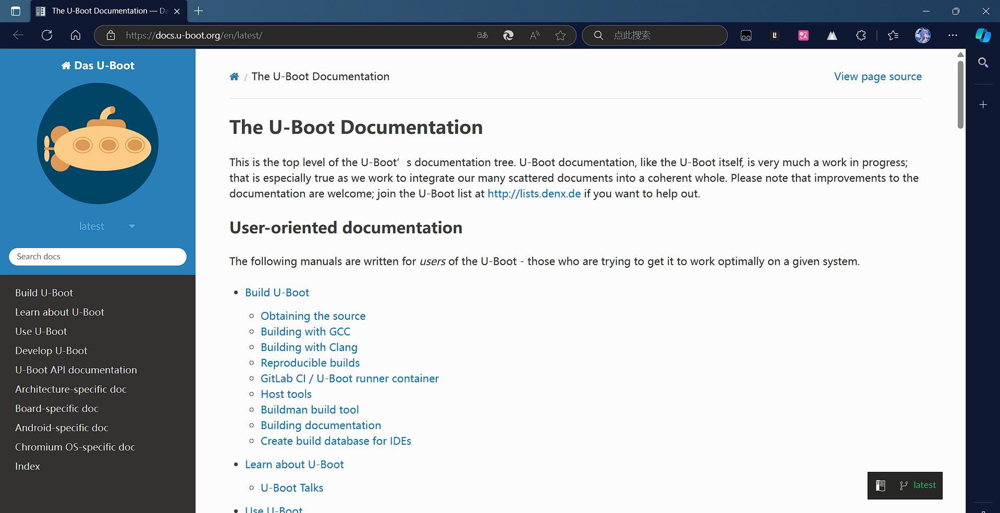

我们可以在 uboot 官网下载 uboot 源码

但是我们一般不会直接用 uboot 官方的 U-Boot 源码的。
uboot 官方的 uboot 源码是给半导体厂商准备的，半导体厂商会下载 uboot 官方的 uboot 源码，然后将自家相应的芯片移植进去。
也就是说半导体厂商会自己维护一个版本的 uboot，这个版本的 uboot 相当于是他们定制的。
既然是定制的，那么肯定对自家的芯片支持会很全，虽然 uboot 官网的源码中一般也会支持他们的芯片，但是绝对是没有半导体厂商自己维护的 uboot 全面。

NXP就维护的2016.03这个版本的uboot
[下载地址](http://git.freescale.com/git/cgit.cgi/imx/uboot-imx.git/tag/?h=imx_v2016.03_4.1.15_2.0.0_ga&id=rel_imx_4.1.15_2.1.0_ga)
（下载地址已经失效）

我们可以使用开发板自带的资料中的NXP官方uboot
路径为：开发板光盘->1、程序源码->4、NXP 官方原版 Uboot和Linux->uboot-imx-rel_imx_4.1.15_2.1.0_ga.tar.bz2。

NVP官方维护的uboot基本支持了 NXP 当前所有可以跑 Linux 的芯片，而且支持各种启动方式，比如 EMMC、NAND、NOR FLASH 等等，这些都是 uboot 官方所不支持的。但是此uboot 是针对NXP 自家评估板的，如果是我们自己做的板子就需要修改 NXP 官方的 uboot，使其支持我们自己做的板子，正点原子的 I.MX6U 开发板就是自己做的板子，虽然大部分都参考了 NXP 官方的I.MX6ULLEVK 开发板，但是还是有很多不同的地方，所以需要修改 NXP 官方的 uboot，使其适配正点原子的 I.MX6U 开发板。

所以当我们拿到开发板以后，是有三种 uboot 的，这三种 uboot的区别如表：
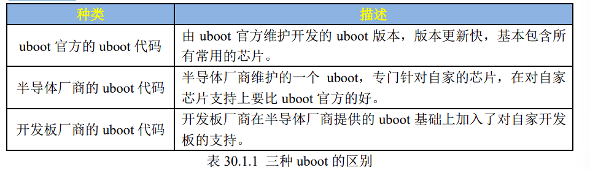

那么这三种 uboot 该如何选择呢？首先 uboot 官方的基本是不会用的，因为支持太弱了。
最常用的就是半导体厂商或者开发板厂商的 uboot，如果你用的半导体厂商的评估板，那么就使用半导体厂商的 uboot，如果你是购买的第三方开发板，比如正点原子的 I.MX6ULL 开发板，那么就使用正点原子提供的 uboot 源码（也是在半导体厂商的 uboot 上修改的）。
当然了，你也可以在购买了第三方开发板以后使用半导体厂商提供的 uboot，只不过有些外设驱动可能不支持，需要自己移植，这个就是我们常说的 uboot 移植。

本节是 uboot 的使用，所以就直接使用正点原子已经移植好的 uboot，这个已经放到了开发板光盘中了。
路径为：开发板光盘->1、程序源码->3、正点原子 Uboot 和 Linux 出厂源码->ubootimx-2016.03-2.1.0-ge468cdc-v1.5.tar.bz2。

### 30.2 U-boot初次编译

首先在 Ubuntu 中安装 ncurses 库，否则编译会报错，安装命令如下：
`sudo apt-get install libncurses5-dev`

安装如下：
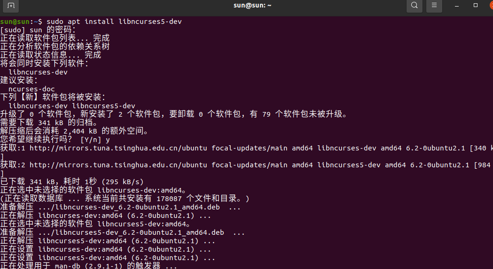

在 Ubuntu 中创建存放 uboot 的目录，比如我的是/home/sun/linux/uboot，然后在此目录下新建一个名为“alientek_uboot”的文件夹用于存放正点原子提供的 uboot 源码。
alientek_uboot文件夹创建成功以后使用 FileZilla 软件将正点原子提供的 uboot 源码拷贝到此目录中。

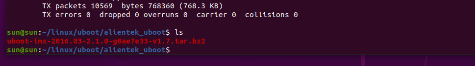

使用如下命令进行解压缩：
`tar -vxjf uboot-imx-2016.03-2.1.0-g8b546e4.tar.bz2`

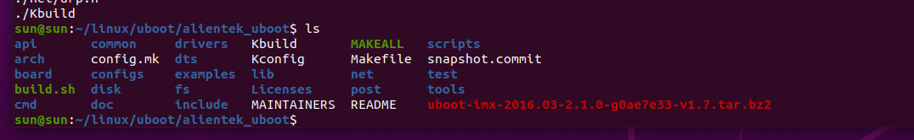

除了 uboot-imx-2016.03-2.1.0-g8b546e4.tar.bz2 这个正点原子提供的 uboot 源码压缩包以外，其他的文件和文件夹都是解压出来的 uboot 源码。

1. **512MB(DDR3)+8GB(EMMC)核心板**

如果使用的是 512MB+8GB 的 EMMC 核心板，使用如下命令来编译对应的 uboot：
```sh
make ARCH=arm CROSS_COMPILE=arm-linux-gnueabihf- distclean
make ARCH=arm CROSS_COMPILE=arm-linux-gnueabihf- (加空格)
                                    mx6ull_14x14_ddr512_emmc_defconfig
make V=1 ARCH=arm CROSS_COMPILE=arm-linux-gnueabihf- -j12
```

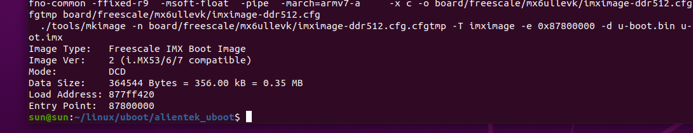

这三条命令中 ARCH=arm 设置目标为 arm 架构，CROSS_COMPILE 指定所使用的交叉编译器。
第一条命令相当于“make distclean”，目的是清除工程，一般在第一次编译的时候最好清理一下工程。
第二条指令相当于“make mx6ull_14x14_ddr512_emmc_defconfig”，用于配置 uboot，配置文件为 mx6ull_14x14_ddr512_emmc_defconfig。
最后一条指令相当于 “make -j12”也就是使用 12 核来编译 uboot

编译完成以后的 alentek_uboot 文件夹内容如图所示：
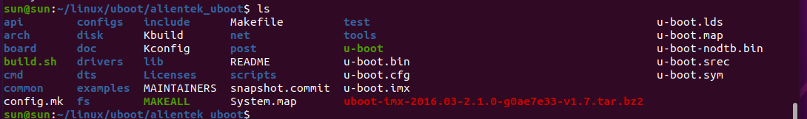

可以看出，编译完成以后 uboot 源码多了一些文件，其中 u-boot.bin 就是编译出来的 uboot二进制文件。uboot是个裸机程序，因此需要在其前面加上头部(IVT、DCD等数据)才能在I.MX6U上执行。
图中的 u-boot.imx 文件就是添加头部以后的 u-boot.bin，u-boot.imx 就是我们最终要烧写到开发板中的 uboot 镜像文件。

每次编译 uboot 都要输入一长串命令，为了简单起见，我们可以新建一个 shell 脚本文件，将这些命令写到 shell 脚本文件里面，然后每次只需要执行 shell 脚本即可完成编译工作。
新建名为 mx6ull_alientek_emmc.sh 的 shell 脚本文件，然后在里面输入如下内容：
```sh
1 #!/bin/bash
2 make ARCH=arm CROSS_COMPILE=arm-linux-gnueabihf- distclean
3 make ARCH=arm CROSS_COMPILE=arm-linux-gnueabihf- (加空格)
                        mx6ull_14x14_ddr512_emmc_defconfi
4 make V=1 ARCH=arm CROSS_COMPILE=arm-linux-gnueabihf- -j12
```
第 1 行是 shell 脚本要求的，必须是“#!/bin/bash”或者“#!/bin/sh”。

第 2 行使用了 make 命令，用于清理工程，也就是每次在编译 uboot 之前都清理一下工程。
这里的 make 命令带有三个参数，第一个是 ARCH，也就是指定架构，这里肯定是 arm；第二个参数 CROSS_COMPILE 用于指定编译器，只需要指明编译器前缀就行了，比如 arm-linuxgnueabihf-gcc 编译器的前缀就是“arm-linux-gnueabihf-”；
最后一个参数 distclean 就是清除工程。

第 3 行也使用了 make 命令，用于配置 uboot。
同样有三个参数，不同的是，最后一个参数是mx6ull_14x14_ddr512_emmc_defconfig。
前面说了 uboot 是 bootloader 的一种，可以用来引导Linux，但是 uboot 除了引导 Linux 以外还可以引导其它的系统，而且 uboot 还支持其它的架构和外设，比如 USB、网络、SD 卡等。
这些都是可以配置的，需要什么功能就使能什么功能。
所以在编译 uboot 之前，一定要根据自己的需求配置。
uboot.mx6ull_14x14_ddr512_emmc_defconfig就是正点原子针对 I.MX6U-ALPHA 的 EMMC 核心板编写的配置文件，这个配置文件在 uboot源码的 configs 目录中。
在 uboot 中，通过“make xxx_defconfig”来配置 uboot，xxx_defconfig就是不同板子的配置文件，这些配置文件都在 uboot/configs 目录中。

第 4 行有 4 个参数，用于编译 uboot，通过第 3 行配置好 uboot 以后就可以直接“make”编译 uboot 了。
其中 V=1 用于设置编译过程的信息输出级别；-j 用于设置主机使用多少线程编译uboot，最好设置成我们虚拟机所设置的核心数，如果在 VMware 里面给虚拟就分配了 4 个核，那么使用-j4 是最合适的，这样 4 个核都会一起编译。

使用 chmod 命令给予 mx6ull_alientek_emmc.sh 文件可执行权限，然后就可以使用这个 shell脚本文件来重新编译 uboot。

2. **256MB(DDR3)+ 512MB(NAND)核心板**

```sh
1 #!/bin/bash
2 make ARCH=arm CROSS_COMPILE=arm-linux-gnueabihf- distclean  
3 make ARCH=arm CROSS_COMPILE=arm-linux-gnueabihf- (加空格)  
                            mx6ull_14x14_ddr256_nand_defconfig  
4 make V=1 ARCH=arm CROSS_COMPILE=arm-linux-gnueabihf- -j12  
```

### 30.3 U-boot烧写与启动

uboot 编译好以后就可以烧写到板子上使用了，这里我们跟前面裸机例程一样，将 uboot烧写到 SD 卡中，然后通过 SD 卡来启动来运行 uboot。
使用 imxdownload 软件来进行烧写。

等待烧写完成，完成以后将 SD 卡插到 I.MX6U-ALPHA 开发板上，BOOT 设置从 SD 卡启动，使用 USB 线将 USB_TTL 和电脑连接，也就是将开发板的串口 1 连接到电脑上。
打开SecureCRT，设置好串口参数并打开，最后复位开发板。
在串口shell上出现“Hit any key to stop autoboot: ”倒计时的时候按下键盘上的回车键，默认是 3 秒倒计时，在 3 秒倒计时结束以后如果没有按下回车键的话 uboot 就会使用默认参数来启动 Linux 内核了。
如果在 3 秒倒计时结束之前按下回车键，那么就会进入 uboot 的命令行模式，如图所示：

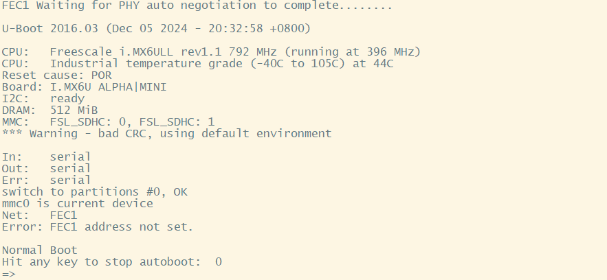

从图可以看出，当进入到 uboot 的命令行模式以后，左侧会出现一个“=>”标志。
uboot 启动的时候会输出一些信息，这些信息如下所示：

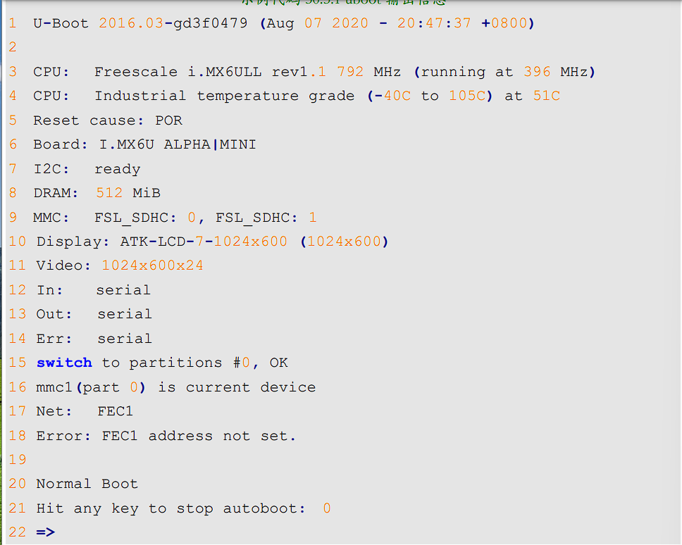

第 1 行是 uboot 版本号和编译时间，可以看出，当前的 uboot 版本号是 2016.03，编译时间是 2020 年 8 月 7 日凌晨 20 点 47 分。

第 3 和第 4 行是 CPU 信息，可以看出当前使用的 CPU 是飞思卡尔的 I.MX6ULL（I.MX 以前属于飞思卡尔，然而飞思卡尔被 NXP 收购了），频率为 792MHz，但是此时运行在 396MHz。这颗芯片是工业级的，结温为-40°C~105°C。

第 5 行是复位原因，当前的复位原因是 POR。I.MX6ULL 芯片上有个 POR_B 引脚，将这个引脚拉低即可复位 I.MX6ULL。

第 6 行是板子名字，当前的板子名字为“I.MX6U ALPHA|MINI”。

第 7 行提示 I2C 准备就绪。

第 8 行提示当前板子的 DRAM（内存）为 512MB，如果是 NAND 版本的话内存为 256MB。

第 9 行提示当前有两个 MMC/SD 卡控制器：FSL_SDHC(0)和 FSL_SDHC(1)。
I.MX6ULL支持两个 MMC/SD，正点原子的 I.MX6ULL EMMC 核心板上 FSL_SDHC(0)接的 SD(TF)卡，FSL_SDHC(1)接的 EMMC。

第 10 和第 11 行是 LCD 型号，当前的 LCD 型号是 ATK-LCD-7-1024x600 (1024x600)，分辨率为 1024x600，格式为 RGB888(24 位)。

第 12~14 是标准输入、标准输出和标准错误所使用的终端，这里都使用串口(serial)作为终端。

第 15 和 16 行是切换到 emmc 的第 0 个分区上，因为当前的 uboot 是 emmc 版本的，也就是从 emmc 启动的。我们只是为了方便将其烧写到了 SD 卡上，但是它的“内心”还是 EMMC的。所以 uboot 启动以后会将 emmc 作为默认存储器，当然了，你也可以将 SD 卡作为 uboot 的存储器，这个我们后面会讲解怎么做。

第 17 行是网口信息，提示我们当前使用的 FEC1 这个网口，I.MX6ULL 支持两个网口。

第 18 行提示 FEC1 网卡地址没有设置，后面我们会讲解如何在 uboot 里面设置卡地址。

第 20 行提示正常启动，也就是说 uboot 要从 emmc 里面读取环境变量和参数信息启动 Linux内核了。

第 21 行是倒计时提示，默认倒计时 3 秒，倒计时结束之前按下回车键就会进入 Linux 命令行模式。
如果在倒计时结束以后没有按下回车键，那么 Linux 内核就会启动，Linux 内核一旦启动，uboot 就会寿终正寝。

这个就是 uboot 默认输出信息的含义，NAND 版本的 uboot 也是类似的，只是 NAND 版本的就没有 EMMC/SD 相关信息了，取而代之的就是 NAND 的信息，比如 NAND 容量大小信息。

uboot 是来干活的，我们现在已经进入 uboot 的命令行模式了，进入命令行模式以后就可以给 uboot 发号施令了。当然了，不能随便发号施令，得看看 uboot 支持哪些命令，然后使用这些uboot 所支持的命令来做一些工作。下一节就讲解 uboot 命令的使用。

### 30.4 U-Boot命令使用

进入 uboot 的命令行模式以后输入“help”或者“？”，然后按下回车即可查看当前 uboot 所支持的命令，如图：
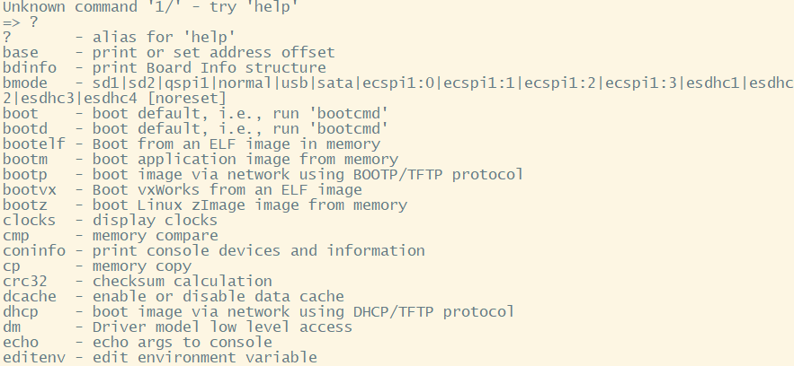

图中的命令并不是 uboot 所支持的所有命令，前面说过 uboot 是可配置的，需要什么命令就使能什么命令。
所以图中的命令是正点原子提供的 uboot 中使能的命令，uboot 支持的命令还有很多，而且也可以在 uboot 中自定义命令。
这些命令后面都跟有命令说明，用于描述此命令的作用，但是命令具体怎么用呢？
我们输入“help(或?) 命令名”既可以查看命令的详细用法，以“bootz”这个命令为例，我们输入如下命令即可查看“bootz”这个命令的用法：
```sh
? bootz
help bootz
```


图中就详细的列出了“bootz”这个命令的详细，其它的命令也可以使用此方法查询
具体的使用方法。
接下来我们学习一下一些常用的 uboot 命令。

#### 30.4.1 信息查询命令

常用的和信息查询有关的命令有 3 个：bdinfo、printenv 和 version。

先来看一下 bdinfo 命令，此命令用于查看板子信息，直接输入“bdinfo”即可：


从图中可以得出 DRAM 的起始地址和大小、启动参数保存起始地址、波特率、
sp(堆栈指针)起始地址等信息。

命令“printenv”用于输出环境变量信息，uboot 也支持 TAB 键自动补全功能，输入“print”然后按下 TAB 键就会自动补全命令，直接输入“print”也可以。
输入“print”，然后按下回车键，环境变量如图:

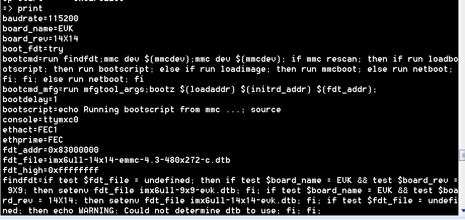

这里有很多的环境变量，比如 baudrate、board_name、board_rec、boot_fdt、bootcmd等等。
uboot 中的环境变量都是字符串，既然叫做环境变量，那么它的作用就和“变量”一样。
比如 bootdelay 这个环境变量就表示 uboot 启动延时时间，默认 bootdelay=3，也就默认延时 3秒。前面说的 3 秒倒计时就是由 bootdelay 定义的，如果将 bootdelay 改为 5 的话就会倒计时 5s了。
uboot 中的环境变量是可以修改的，有专门的命令来修改环境变量的值，稍后我们会讲解。

命令 version 用于查看 uboot 的版本号，输入“version”，uboot 版本号如图：
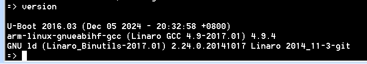

从图可以看出，当前 uboot 版本号,编译时间，编译器为arm-poky-linux-gnueabi-gcc，这是 NXP 官方提供的编译器，正点原子出厂系统用的此编译器编译的，但是本教程我们统一使用 arm-linux-gnueabihf-gcc。

#### 30.4.2 环境变量操作命令

1. **修改环境变量**

环境变量的操作涉及到两个命令：setenv 和 saveenv，命令 setenv 用于设置或者修改环境变量的值。
命令 saveenv 用于保存修改后的环境变量，一般环境变量是存放在外部 flash 中的，uboot 启动的时候会将环境变量从 flash 读取到 DRAM 中。
所以使用命令 setenv 修改的是 DRAM中的环境变量值，修改以后要使用 saveenv 命令将修改后的环境变量保存到 flash 中，否则的话uboot 下一次重启会继续使用以前的环境变量值。

比如我们要将环境变量 bootdelay 改为 5，就可以使用如下所示命令：
```sh
setenv bootdelay 5
saveenv
```
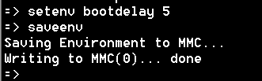

当我们使用命令 saveenv 保存修改后的环境变量的话会有保存过程提示信息，根据提示可以看出环境变量保存到了 MMC(0)中，也就是 SD 卡中。
因为我们现在将 uboot烧写到了 SD 卡里面，所以会保存到 MMC(0)中。
如果烧写到 EMMC 里面就会提示保存到MMC(1)，也就是 EMMC 设备，同理，如果是 NAND 版本核心板的话就会提示保存到 NAND中。

修改 bootdelay 以后，重启开发板，uboot 就是变为 5 秒倒计时.
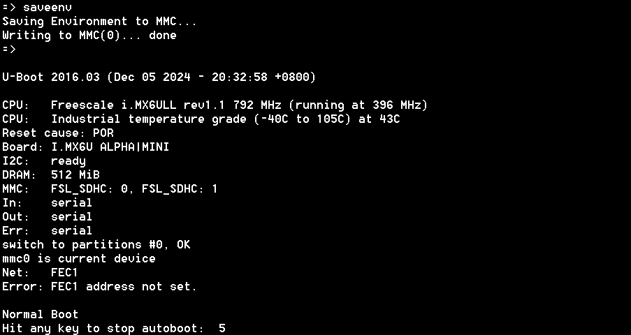

有时候我们修改的环境变量值可能会有空格，比如 bootcmd、bootargs 等，这个时候环境变量值就得用单引号括起来，比如下面修改环境变量 bootargs 的值：
```sh
setenv bootargs 'console=ttymxc0,115200 root=/dev/mmcblk1p2 rootwait rw'
saveenv
```
上面命令设置 bootargs 的值为“console=ttymxc0,115200 root=/dev/mmcblk1p2 rootwait rw”。
其中“console=ttymxc0,115200”、“root=/dev/mmcblk1p2”、“rootwait”和“rw”相当于四组“值”，这四组“值”之间用空格隔开，所以需要使用单引号‘’将其括起来，表示这四组“值”都属于环境变量 bootargs

2. **新建环境变量**

命令 setenv 也可以用于新建命令，用法和修改环境变量一样，比如我们新建一个环境变量author，author 的值为我的名字拼音：zuozhongkai，那么就可以使用如下命令：
```sh
setenv author zuozhongkai
saveenv
```
新建命令 author 完成以后重启 uboot，然后使用命令 printenv 查看当前环境变量:

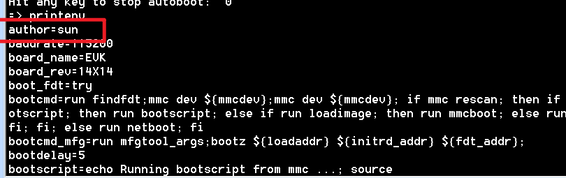

3. **删除环境变量**

既然可以新建环境变量，肯定也可以删除环境变量，删除环境变量也是使用命令 setenv，要删除一个环境变量只要给这个环境变量赋空值即可，比如我们删除掉上面新建的 author 这个环境变量，命令如下：
```sh
setenv author 
saveenv
```
通过 setenv 给 author 赋空值，也就是什么都不写来删除环境变量 author。
重启uboot 就会发现环境变量 author 没有了。

#### 30.4.3 内存操作指令

内存操作命令就是用于直接对 DRAM 进行读写操作的，常用的内存操作命令有 md、nm、mm、mw、cp 和 cmp。
我们依次来看一下这些命令都是做什么的。

1. **md指令**

md 命令用于显示内存值，格式如下：
`md[.b, .w, .l] address [# of objects]`
命令中的[.b .w .l]对应 byte、word 和 long，也就是分别以 1 个字节、2 个字节、4 个字节来显示内存值。
address 就是要查看的内存起始地址，[# of objects]表示要查看的数据长度，这个数据长度单位不是字节，而是跟你所选择的显示格式有关。
比如你设置要查看的内存长度为20(十六进制为 0x14)，如果显示格式为.b 的话那就表示 20 个字节；如果显示格式为.w 的话就表示 20 个 word，也就是 20\*2=40 个字节；如果显示格式为.l 的话就表示 20 个 long，也就是20\*4=80 个字节。
另外要注意：
uboot 命令中的数字都是十六进制的！不是十进制的！

比如你想查看以 0X80000000 开始的 20 个字节的内存值，显示格式为.b 的话，应该使用
如下所示命令：
`md.b 80000000 14`
而不是
`md.b 80000000 20`

uboot 命令里面的数字都是十六进制的，所以可以不用写“0x”前缀，十进制的 20 其十六进制为 0x14，所以命令 md 后面的个数应该是 14，如果写成 20 的话就表示查看32(十六进制为 0x20)个字节的数据。
分析下面三个命令的区别：
```sh
md.b 80000000 10
md.w 80000000 10
md.l 80000000 10
```
上面这三个命令都是查看以 0X80000000 为起始地址的内存数据，第一个命令以.b 格式显
示，长度为 0x10，也就是 16 个字节；第二个命令以.w 格式显示，长度为 0x10，也就是 16\*2=32个字节；最后一个命令以.l 格式显示，长度也是 0x10，也就是 16\*4=64 个字节。
这三个命令的执行结果如图所示：
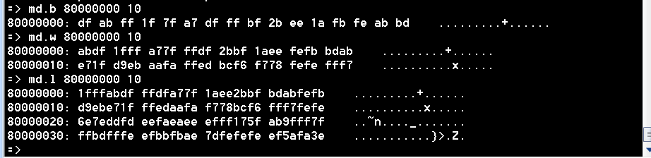

2. **nm命令**

nm 命令用于修改指定地址的内存值，命令格式如下：
`nm [.b, .w, .l] address`

nm 命令同样可以以.b、.w 和.l 来指定操作格式，比如现在以.l 格式修改 0x80000000 地址的数据为 0x12345678。
输入命令：
`nm.l 80000000`

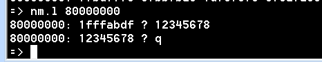

示例图：
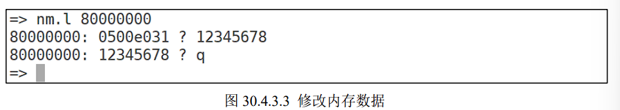

80000000 表示现在要修改的内存地址，0500e031 表示地址 0x80000000 现在的数据，？后面就可以输入要修改后的数据 0x12345678，输入完成以后按下回车，然后再输q即可推出。

修改完成以后在使用命令 md 来查看一下有没有修改成功
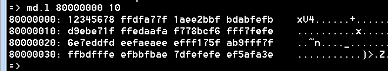

3. **mm命令**

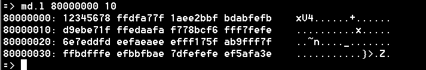
80000000地址下，对应8\*4\*4 = 128 bit = 16B
对应于80000010 跨越了16个地址，可见按字节编制！

mm 命令也是修改指定地址内存值的，使用 mm 修改内存值的时候地址会自增，而使用命令 nm 的话地址不会自增。
比如以.l 格式修改从地址 0x80000000 开始的连续 3 个内存块(3\*4=12个字节)的数据为 0X05050505，操作如图:

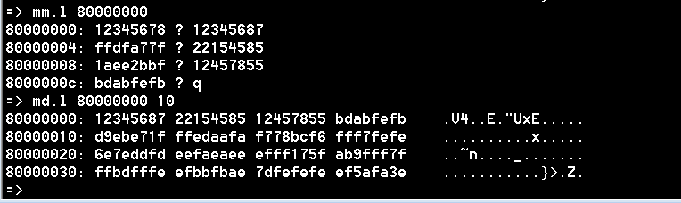

4. **mw命令**

命令 mw 用于使用一个指定的数据填充一段内存，命令格式如下：

`mw [.b, .w, .l] address value [count]`

mw 命令同样可以以.b、.w 和.l 来指定操作格式，address 表示要填充的内存起始地址，value为要填充的数据，count 是填充的长度。
比如使用.l 格式将以 0X80000000 为起始地址的 0x10 个内存块(0x10 * 4=64 字节)填充为 0X0A0A0A0A，命令如下：
`mw.l 80000000 0A0A0A0A 10`

查看如图：
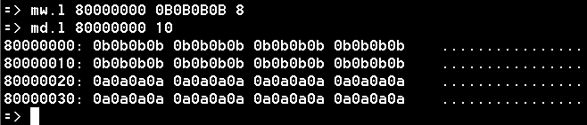

5. **cp命令**

cp 是数据拷贝命令，用于将 DRAM 中的数据从一段内存拷贝到另一段内存中，或者把 Nor Flash 中的数据拷贝到 DRAM 中。
命令格式如下：
`cp [.b, .w, .l] source target count`

cp 命令同样可以以.b、.w 和.l 来指定操作格式，source 为源地址，target 为目的地址，count为拷贝的长度。
我们使用.l 格式将 0x80000000 处的地址拷贝到 0X80000100 处，长度为 0x10 个内存块(0x10 * 4=64 个字节)，命令如下所示：
`cp.l 80000000 80000100 10`

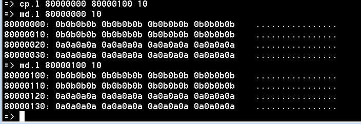

先使用 md.l 命令打印出地址 0x80000000 和 0x80000100 处的数据，然后使用命令cp.l将0x80000100处的数据拷贝到0x80000100处。最后使用命令md.l查看0x80000100处的数据有没有变化，检查拷贝是否成功.

6. **cmp命令**

cmp 是比较命令，用于比较两段内存的数据是否相等，命令格式如下：
`cmp [.b, .w, .l] addr1 addr2 count`

cmp 命令同样可以以.b、.w 和.l 来指定操作格式，addr1 为第一段内存首地址，addr2 为第二段内存首地址，count 为要比较的长度。
我们使用.l 格式来比较 0x80000000 和 0X80000100 这两个地址数据是否相等，比较长度为 0x10 个内存块(16 * 4=64 个字节)，命令如下所示：
`cmp.l 80000000 80000100 10`

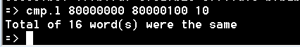

可以看出两段内存的数据相等。我们再随便挑两段内存比较一下，比如地址0x80002000 和 0x800003000，长度为 0X10:
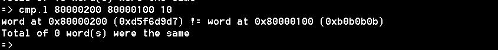

可以看出，0x80002000 处的数据和 0x80003000 处的数据就不一样。

#### 30.4.4 网络操作命令

