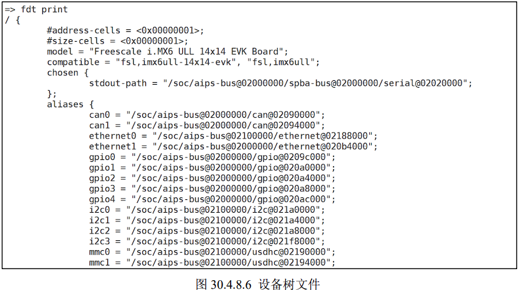
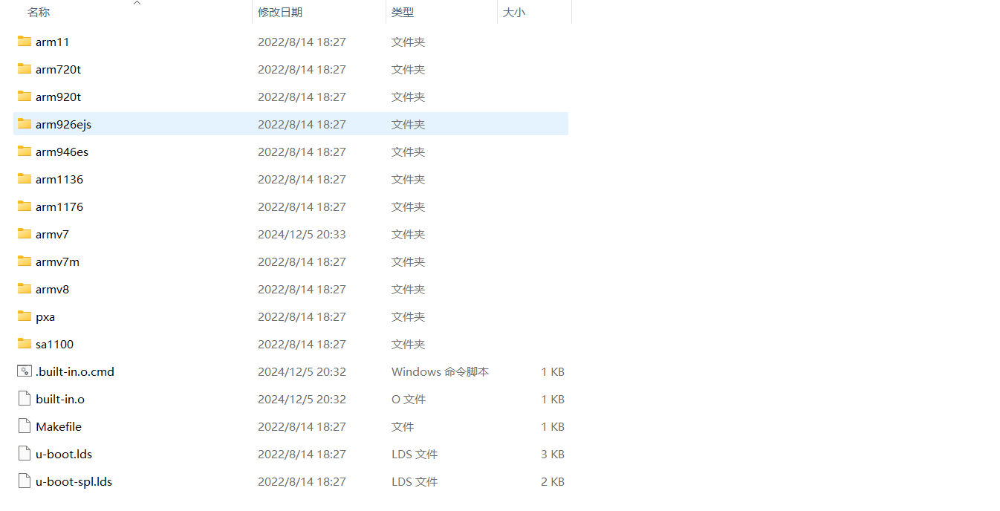
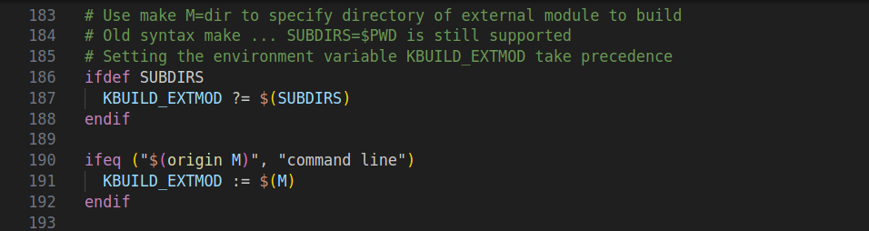
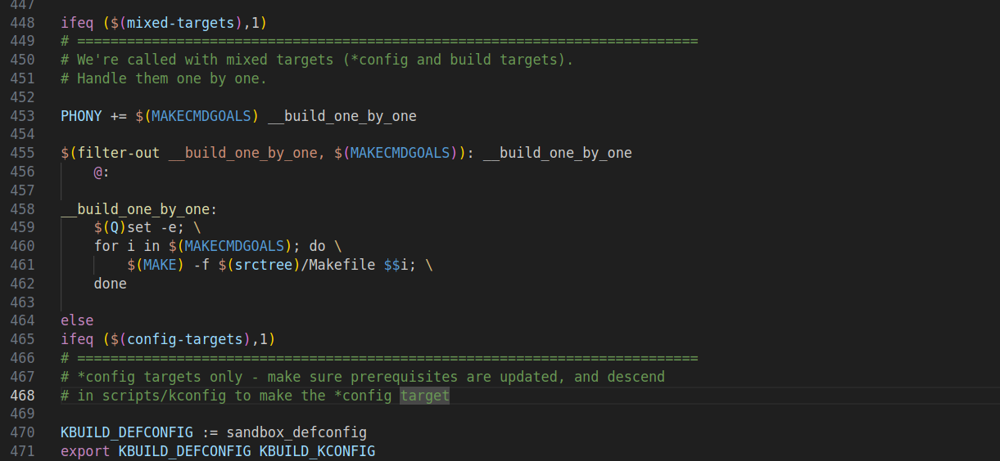
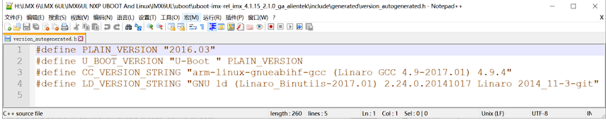

# 系统移植篇

在上一篇中我们学习了如何进行 I.MX6U 的裸机开发，通过 21 个裸机例程我们掌握了I.MX6U 的常用外设。
通过裸机的学习我们掌握了外设的底层原理，这样在以后进行 Linux 驱动开发的时候就只需要将精力放到 Linux 驱动框架上，在进行 Linux 驱动开发之前肯定需要先将Linux 系统移植到开发板上去。

如果学习过 UCOS/FreeRTOS 应该知道，UCOS/FreeRTOS 移植就是在官方的 SDK 包里面找一个和自己所使用的芯片一样的工程编译一下，然后下载到开发板就可以了。
那么 Linux 的移植是不是也是这样的，下载 Linux 源码，然后找个和我们所使用的芯片一样的工程编译一下就可以了？很明显不是的！Linux 的移植要复杂的多！！！

在移植 Linux之前我们需要先移植一个 bootloader 代码，这个 bootloader 代码用于启动 Linux 内核，bootloader有很多，常用的就是 U-Boot。
移植好 U-Boot 以后再移植 Linux 内核，移植完 Linux 内核以后Linux 还不能正常启动，还需要再移植一个根文件系统(rootfs)，根文件系统里面包含了一些最常用的命令和文件。

所以 U-Boot、Linux kernel 和 rootfs 这三者一起构成了一个完整的 Linux 系统，一个可以正常使用、功能完善的 Linux 系统。
在本篇我们就来讲解 U-Boot、Linux Kernel 和rootfs 的移植，与其说是“移植”，倒不如说是“适配”，因为大部分的移植工作都由 NXP 完成了，我们这里所谓的“移植”主要是使其能够在 I.MX6U-ALPHA 开发板上跑起来。

## 第三十章 U-Boot使用实验

在移植 U-Boot 之前，我们肯定要先使用一下 U-Boot，得先体验一下 U-Boot 是个什么东西。
I.MX6U-ALPHA 开发板光盘资料里面已经提供了一个正点原子团队已经移植好的 U-Boot，本章我们就直接编译这个移植好的 U-Boot，然后烧写到 SD 卡里面启动，启动 U-Boot 以后就可以学习使用 U-Boot 的命令。

### 30.1 U-Boot简介

Linux 系统要启动就必须需要一个 bootloader 程序，也就说芯片上电以后先运行一段bootloader程序。
这段bootloader程序会先初始化DDR等外设，然后将Linux内核从flash(NAND，NOR FLASH，SD，MMC 等)拷贝到 DDR 中，最后启动 Linux 内核。
当然了，bootloader 的实际工作要复杂的多，但是它最主要的工作就是启动 Linux 内核，bootloader 和 Linux 内核的关系就跟 PC 上的 BIOS 和 Windows 的关系一样，bootloader 就相当于 BIOS。
所以我们要先搞定bootloader，很庆幸，有很多现成的 bootloader 软件可以使用，比如 U-Boot、vivi、RedBoot 等等，其中以 U-Boot 使用最为广泛，为了方便书写，本书会将 U-Boot 写为 uboot。

uboot 的全称是 Universal Boot Loader，uboot 是一个遵循 GPL 协议的开源软件，uboot 是一个裸机代码，可以看作是一个裸机综合例程。
现在的 uboot 已经支持液晶屏、网络、USB 等高级功能。

[uboot官网](http://www.denx.de/wiki/U-Boot/)


我们可以在 uboot 官网下载 uboot 源码

但是我们一般不会直接用 uboot 官方的 U-Boot 源码的。
uboot 官方的 uboot 源码是给半导体厂商准备的，半导体厂商会下载 uboot 官方的 uboot 源码，然后将自家相应的芯片移植进去。
也就是说半导体厂商会自己维护一个版本的 uboot，这个版本的 uboot 相当于是他们定制的。
既然是定制的，那么肯定对自家的芯片支持会很全，虽然 uboot 官网的源码中一般也会支持他们的芯片，但是绝对是没有半导体厂商自己维护的 uboot 全面。

NXP就维护的2016.03这个版本的uboot
[下载地址](http://git.freescale.com/git/cgit.cgi/imx/uboot-imx.git/tag/?h=imx_v2016.03_4.1.15_2.0.0_ga&id=rel_imx_4.1.15_2.1.0_ga)
（下载地址已经失效）

我们可以使用开发板自带的资料中的NXP官方uboot
路径为：开发板光盘->1、程序源码->4、NXP 官方原版 Uboot和Linux->uboot-imx-rel_imx_4.1.15_2.1.0_ga.tar.bz2。

NVP官方维护的uboot基本支持了 NXP 当前所有可以跑 Linux 的芯片，而且支持各种启动方式，比如 EMMC、NAND、NOR FLASH 等等，这些都是 uboot 官方所不支持的。但是此uboot 是针对NXP 自家评估板的，如果是我们自己做的板子就需要修改 NXP 官方的 uboot，使其支持我们自己做的板子，正点原子的 I.MX6U 开发板就是自己做的板子，虽然大部分都参考了 NXP 官方的I.MX6ULLEVK 开发板，但是还是有很多不同的地方，所以需要修改 NXP 官方的 uboot，使其适配正点原子的 I.MX6U 开发板。

所以当我们拿到开发板以后，是有三种 uboot 的，这三种 uboot的区别如表：


那么这三种 uboot 该如何选择呢？首先 uboot 官方的基本是不会用的，因为支持太弱了。
最常用的就是半导体厂商或者开发板厂商的 uboot，如果你用的半导体厂商的评估板，那么就使用半导体厂商的 uboot，如果你是购买的第三方开发板，比如正点原子的 I.MX6ULL 开发板，那么就使用正点原子提供的 uboot 源码（也是在半导体厂商的 uboot 上修改的）。
当然了，你也可以在购买了第三方开发板以后使用半导体厂商提供的 uboot，只不过有些外设驱动可能不支持，需要自己移植，这个就是我们常说的 uboot 移植。

本节是 uboot 的使用，所以就直接使用正点原子已经移植好的 uboot，这个已经放到了开发板光盘中了。
路径为：开发板光盘->1、程序源码->3、正点原子 Uboot 和 Linux 出厂源码->ubootimx-2016.03-2.1.0-ge468cdc-v1.5.tar.bz2。

### 30.2 U-boot初次编译

首先在 Ubuntu 中安装 ncurses 库，否则编译会报错，安装命令如下：
`sudo apt-get install libncurses5-dev`

安装如下：


在 Ubuntu 中创建存放 uboot 的目录，比如我的是/home/sun/linux/uboot，然后在此目录下新建一个名为“alientek_uboot”的文件夹用于存放正点原子提供的 uboot 源码。
alientek_uboot文件夹创建成功以后使用 FileZilla 软件将正点原子提供的 uboot 源码拷贝到此目录中。


使用如下命令进行解压缩：
`tar -vxjf uboot-imx-2016.03-2.1.0-g8b546e4.tar.bz2`


除了 uboot-imx-2016.03-2.1.0-g8b546e4.tar.bz2 这个正点原子提供的 uboot 源码压缩包以外，其他的文件和文件夹都是解压出来的 uboot 源码。

1. **512MB(DDR3)+8GB(EMMC)核心板**

如果使用的是 512MB+8GB 的 EMMC 核心板，使用如下命令来编译对应的 uboot：

```sh
make ARCH=arm CROSS_COMPILE=arm-linux-gnueabihf- distclean
make ARCH=arm CROSS_COMPILE=arm-linux-gnueabihf- (加空格)
                                    mx6ull_14x14_ddr512_emmc_defconfig
make V=1 ARCH=arm CROSS_COMPILE=arm-linux-gnueabihf- -j12
```


这三条命令中 ARCH=arm 设置目标为 arm 架构，CROSS_COMPILE 指定所使用的交叉编译器。
第一条命令相当于“make distclean”，目的是清除工程，一般在第一次编译的时候最好清理一下工程。
第二条指令相当于“make mx6ull_14x14_ddr512_emmc_defconfig”，用于配置 uboot，配置文件为 mx6ull_14x14_ddr512_emmc_defconfig。
最后一条指令相当于 “make -j12”也就是使用 12 核来编译 uboot

编译完成以后的 alentek_uboot 文件夹内容如图所示：


可以看出，编译完成以后 uboot 源码多了一些文件，其中 u-boot.bin 就是编译出来的 uboot二进制文件。uboot是个裸机程序，因此需要在其前面加上头部(IVT、DCD等数据)才能在I.MX6U上执行。
图中的 u-boot.imx 文件就是添加头部以后的 u-boot.bin，u-boot.imx 就是我们最终要烧写到开发板中的 uboot 镜像文件。

每次编译 uboot 都要输入一长串命令，为了简单起见，我们可以新建一个 shell 脚本文件，将这些命令写到 shell 脚本文件里面，然后每次只需要执行 shell 脚本即可完成编译工作。
新建名为 mx6ull_alientek_emmc.sh 的 shell 脚本文件，然后在里面输入如下内容：

```sh
1 #!/bin/bash
2 make ARCH=arm CROSS_COMPILE=arm-linux-gnueabihf- distclean
3 make ARCH=arm CROSS_COMPILE=arm-linux-gnueabihf- (加空格)
                        mx6ull_14x14_ddr512_emmc_defconfi
4 make V=1 ARCH=arm CROSS_COMPILE=arm-linux-gnueabihf- -j12
```

第 1 行是 shell 脚本要求的，必须是“#!/bin/bash”或者“#!/bin/sh”。

第 2 行使用了 make 命令，用于清理工程，也就是每次在编译 uboot 之前都清理一下工程。
这里的 make 命令带有三个参数，第一个是 ARCH，也就是指定架构，这里肯定是 arm；第二个参数 CROSS_COMPILE 用于指定编译器，只需要指明编译器前缀就行了，比如 arm-linuxgnueabihf-gcc 编译器的前缀就是“arm-linux-gnueabihf-”；
最后一个参数 distclean 就是清除工程。

第 3 行也使用了 make 命令，用于配置 uboot。
同样有三个参数，不同的是，最后一个参数是mx6ull_14x14_ddr512_emmc_defconfig。
前面说了 uboot 是 bootloader 的一种，可以用来引导Linux，但是 uboot 除了引导 Linux 以外还可以引导其它的系统，而且 uboot 还支持其它的架构和外设，比如 USB、网络、SD 卡等。
这些都是可以配置的，需要什么功能就使能什么功能。
所以在编译 uboot 之前，一定要根据自己的需求配置。
uboot.mx6ull_14x14_ddr512_emmc_defconfig就是正点原子针对 I.MX6U-ALPHA 的 EMMC 核心板编写的配置文件，这个配置文件在 uboot源码的 configs 目录中。
在 uboot 中，通过“make xxx_defconfig”来配置 uboot，xxx_defconfig就是不同板子的配置文件，这些配置文件都在 uboot/configs 目录中。

第 4 行有 4 个参数，用于编译 uboot，通过第 3 行配置好 uboot 以后就可以直接“make”编译 uboot 了。
其中 V=1 用于设置编译过程的信息输出级别；-j 用于设置主机使用多少线程编译uboot，最好设置成我们虚拟机所设置的核心数，如果在 VMware 里面给虚拟就分配了 4 个核，那么使用-j4 是最合适的，这样 4 个核都会一起编译。

使用 chmod 命令给予 mx6ull_alientek_emmc.sh 文件可执行权限，然后就可以使用这个 shell脚本文件来重新编译 uboot。

2. **256MB(DDR3)+ 512MB(NAND)核心板**

```sh
1 #!/bin/bash
2 make ARCH=arm CROSS_COMPILE=arm-linux-gnueabihf- distclean  
3 make ARCH=arm CROSS_COMPILE=arm-linux-gnueabihf- (加空格)  
                            mx6ull_14x14_ddr256_nand_defconfig  
4 make V=1 ARCH=arm CROSS_COMPILE=arm-linux-gnueabihf- -j12  
```

### 30.3 U-boot烧写与启动

uboot 编译好以后就可以烧写到板子上使用了，这里我们跟前面裸机例程一样，将 uboot烧写到 SD 卡中，然后通过 SD 卡来启动来运行 uboot。
使用 imxdownload 软件来进行烧写。

等待烧写完成，完成以后将 SD 卡插到 I.MX6U-ALPHA 开发板上，BOOT 设置从 SD 卡启动，使用 USB 线将 USB_TTL 和电脑连接，也就是将开发板的串口 1 连接到电脑上。
打开SecureCRT，设置好串口参数并打开，最后复位开发板。
在串口shell上出现“Hit any key to stop autoboot: ”倒计时的时候按下键盘上的回车键，默认是 3 秒倒计时，在 3 秒倒计时结束以后如果没有按下回车键的话 uboot 就会使用默认参数来启动 Linux 内核了。
如果在 3 秒倒计时结束之前按下回车键，那么就会进入 uboot 的命令行模式，如图所示：


从图可以看出，当进入到 uboot 的命令行模式以后，左侧会出现一个“=>”标志。
uboot 启动的时候会输出一些信息，这些信息如下所示：


第 1 行是 uboot 版本号和编译时间，可以看出，当前的 uboot 版本号是 2016.03，编译时间是 2020 年 8 月 7 日凌晨 20 点 47 分。

第 3 和第 4 行是 CPU 信息，可以看出当前使用的 CPU 是飞思卡尔的 I.MX6ULL（I.MX 以前属于飞思卡尔，然而飞思卡尔被 NXP 收购了），频率为 792MHz，但是此时运行在 396MHz。这颗芯片是工业级的，结温为-40°C~105°C。

第 5 行是复位原因，当前的复位原因是 POR。I.MX6ULL 芯片上有个 POR_B 引脚，将这个引脚拉低即可复位 I.MX6ULL。

第 6 行是板子名字，当前的板子名字为“I.MX6U ALPHA|MINI”。

第 7 行提示 I2C 准备就绪。

第 8 行提示当前板子的 DRAM（内存）为 512MB，如果是 NAND 版本的话内存为 256MB。

第 9 行提示当前有两个 MMC/SD 卡控制器：FSL_SDHC(0)和 FSL_SDHC(1)。
I.MX6ULL支持两个 MMC/SD，正点原子的 I.MX6ULL EMMC 核心板上 FSL_SDHC(0)接的 SD(TF)卡，FSL_SDHC(1)接的 EMMC。

第 10 和第 11 行是 LCD 型号，当前的 LCD 型号是 ATK-LCD-7-1024x600 (1024x600)，分辨率为 1024x600，格式为 RGB888(24 位)。

第 12~14 是标准输入、标准输出和标准错误所使用的终端，这里都使用串口(serial)作为终端。

第 15 和 16 行是切换到 emmc 的第 0 个分区上，因为当前的 uboot 是 emmc 版本的，也就是从 emmc 启动的。我们只是为了方便将其烧写到了 SD 卡上，但是它的“内心”还是 EMMC的。所以 uboot 启动以后会将 emmc 作为默认存储器，当然了，你也可以将 SD 卡作为 uboot 的存储器，这个我们后面会讲解怎么做。

第 17 行是网口信息，提示我们当前使用的 FEC1 这个网口，I.MX6ULL 支持两个网口。

第 18 行提示 FEC1 网卡地址没有设置，后面我们会讲解如何在 uboot 里面设置卡地址。

第 20 行提示正常启动，也就是说 uboot 要从 emmc 里面读取环境变量和参数信息启动 Linux内核了。

第 21 行是倒计时提示，默认倒计时 3 秒，倒计时结束之前按下回车键就会进入 Linux 命令行模式。
如果在倒计时结束以后没有按下回车键，那么 Linux 内核就会启动，Linux 内核一旦启动，uboot 就会寿终正寝。

这个就是 uboot 默认输出信息的含义，NAND 版本的 uboot 也是类似的，只是 NAND 版本的就没有 EMMC/SD 相关信息了，取而代之的就是 NAND 的信息，比如 NAND 容量大小信息。

uboot 是来干活的，我们现在已经进入 uboot 的命令行模式了，进入命令行模式以后就可以给 uboot 发号施令了。当然了，不能随便发号施令，得看看 uboot 支持哪些命令，然后使用这些uboot 所支持的命令来做一些工作。下一节就讲解 uboot 命令的使用。

### 30.4 U-Boot命令使用

进入 uboot 的命令行模式以后输入“help”或者“？”，然后按下回车即可查看当前 uboot 所支持的命令，如图：


图中的命令并不是 uboot 所支持的所有命令，前面说过 uboot 是可配置的，需要什么命令就使能什么命令。
所以图中的命令是正点原子提供的 uboot 中使能的命令，uboot 支持的命令还有很多，而且也可以在 uboot 中自定义命令。
这些命令后面都跟有命令说明，用于描述此命令的作用，但是命令具体怎么用呢？
我们输入“help(或?) 命令名”既可以查看命令的详细用法，以“bootz”这个命令为例，我们输入如下命令即可查看“bootz”这个命令的用法：

```sh
? bootz
help bootz
```


图中就详细的列出了“bootz”这个命令的详细，其它的命令也可以使用此方法查询
具体的使用方法。
接下来我们学习一下一些常用的 uboot 命令。

#### 30.4.1 信息查询命令

常用的和信息查询有关的命令有 3 个：bdinfo、printenv 和 version。

先来看一下 bdinfo 命令，此命令用于查看板子信息，直接输入“bdinfo”即可：


从图中可以得出 DRAM 的起始地址和大小、启动参数保存起始地址、波特率、
sp(堆栈指针)起始地址等信息。

命令“printenv”用于输出环境变量信息，uboot 也支持 TAB 键自动补全功能，输入“print”然后按下 TAB 键就会自动补全命令，直接输入“print”也可以。
输入“print”，然后按下回车键，环境变量如图:


这里有很多的环境变量，比如 baudrate、board_name、board_rec、boot_fdt、bootcmd等等。
uboot 中的环境变量都是字符串，既然叫做环境变量，那么它的作用就和“变量”一样。
比如 bootdelay 这个环境变量就表示 uboot 启动延时时间，默认 bootdelay=3，也就默认延时 3秒。前面说的 3 秒倒计时就是由 bootdelay 定义的，如果将 bootdelay 改为 5 的话就会倒计时 5s了。
uboot 中的环境变量是可以修改的，有专门的命令来修改环境变量的值，稍后我们会讲解。

命令 version 用于查看 uboot 的版本号，输入“version”，uboot 版本号如图：


从图可以看出，当前 uboot 版本号,编译时间，编译器为arm-poky-linux-gnueabi-gcc，这是 NXP 官方提供的编译器，正点原子出厂系统用的此编译器编译的，但是本教程我们统一使用 arm-linux-gnueabihf-gcc。

#### 30.4.2 环境变量操作命令

1. **修改环境变量**

环境变量的操作涉及到两个命令：setenv 和 saveenv，命令 setenv 用于设置或者修改环境变量的值。
命令 saveenv 用于保存修改后的环境变量，一般环境变量是存放在外部 flash 中的，uboot 启动的时候会将环境变量从 flash 读取到 DRAM 中。
所以使用命令 setenv 修改的是 DRAM中的环境变量值，修改以后要使用 saveenv 命令将修改后的环境变量保存到 flash 中，否则的话uboot 下一次重启会继续使用以前的环境变量值。

比如我们要将环境变量 bootdelay 改为 5，就可以使用如下所示命令：

```sh
setenv bootdelay 5
saveenv
```


当我们使用命令 saveenv 保存修改后的环境变量的话会有保存过程提示信息，根据提示可以看出环境变量保存到了 MMC(0)中，也就是 SD 卡中。
因为我们现在将 uboot烧写到了 SD 卡里面，所以会保存到 MMC(0)中。
如果烧写到 EMMC 里面就会提示保存到MMC(1)，也就是 EMMC 设备，同理，如果是 NAND 版本核心板的话就会提示保存到 NAND中。

修改 bootdelay 以后，重启开发板，uboot 就是变为 5 秒倒计时.


有时候我们修改的环境变量值可能会有空格，比如 bootcmd、bootargs 等，这个时候环境变量值就得用单引号括起来，比如下面修改环境变量 bootargs 的值：

```sh
setenv bootargs 'console=ttymxc0,115200 root=/dev/mmcblk1p2 rootwait rw'
saveenv
```

上面命令设置 bootargs 的值为“console=ttymxc0,115200 root=/dev/mmcblk1p2 rootwait rw”。
其中“console=ttymxc0,115200”、“root=/dev/mmcblk1p2”、“rootwait”和“rw”相当于四组“值”，这四组“值”之间用空格隔开，所以需要使用单引号‘’将其括起来，表示这四组“值”都属于环境变量 bootargs

2. **新建环境变量**

命令 setenv 也可以用于新建命令，用法和修改环境变量一样，比如我们新建一个环境变量author，author 的值为我的名字拼音：zuozhongkai，那么就可以使用如下命令：

```sh
setenv author zuozhongkai
saveenv
```

新建命令 author 完成以后重启 uboot，然后使用命令 printenv 查看当前环境变量:


3. **删除环境变量**

既然可以新建环境变量，肯定也可以删除环境变量，删除环境变量也是使用命令 setenv，要删除一个环境变量只要给这个环境变量赋空值即可，比如我们删除掉上面新建的 author 这个环境变量，命令如下：

```sh
setenv author 
saveenv
```

通过 setenv 给 author 赋空值，也就是什么都不写来删除环境变量 author。
重启uboot 就会发现环境变量 author 没有了。

#### 30.4.3 内存操作指令

内存操作命令就是用于直接对 DRAM 进行读写操作的，常用的内存操作命令有 md、nm、mm、mw、cp 和 cmp。
我们依次来看一下这些命令都是做什么的。

1. **md指令**

md 命令用于显示内存值，格式如下：
`md[.b, .w, .l] address [# of objects]`
命令中的[.b .w .l]对应 byte、word 和 long，也就是分别以 1 个字节、2 个字节、4 个字节来显示内存值。
address 就是要查看的内存起始地址，[# of objects]表示要查看的数据长度，这个数据长度单位不是字节，而是跟你所选择的显示格式有关。
比如你设置要查看的内存长度为20(十六进制为 0x14)，如果显示格式为.b 的话那就表示 20 个字节；如果显示格式为.w 的话就表示 20 个 word，也就是 20\*2=40 个字节；如果显示格式为.l 的话就表示 20 个 long，也就是20\*4=80 个字节。
另外要注意：
uboot 命令中的数字都是十六进制的！不是十进制的！

比如你想查看以 0X80000000 开始的 20 个字节的内存值，显示格式为.b 的话，应该使用
如下所示命令：
`md.b 80000000 14`
而不是
`md.b 80000000 20`

uboot 命令里面的数字都是十六进制的，所以可以不用写“0x”前缀，十进制的 20 其十六进制为 0x14，所以命令 md 后面的个数应该是 14，如果写成 20 的话就表示查看32(十六进制为 0x20)个字节的数据。
分析下面三个命令的区别：

```sh
md.b 80000000 10
md.w 80000000 10
md.l 80000000 10
```

上面这三个命令都是查看以 0X80000000 为起始地址的内存数据，第一个命令以.b 格式显
示，长度为 0x10，也就是 16 个字节；第二个命令以.w 格式显示，长度为 0x10，也就是 16\*2=32个字节；最后一个命令以.l 格式显示，长度也是 0x10，也就是 16\*4=64 个字节。
这三个命令的执行结果如图所示：


2. **nm命令**

nm 命令用于修改指定地址的内存值，命令格式如下：
`nm [.b, .w, .l] address`

nm 命令同样可以以.b、.w 和.l 来指定操作格式，比如现在以.l 格式修改 0x80000000 地址的数据为 0x12345678。
输入命令：
`nm.l 80000000`


示例图：


80000000 表示现在要修改的内存地址，0500e031 表示地址 0x80000000 现在的数据，？后面就可以输入要修改后的数据 0x12345678，输入完成以后按下回车，然后再输q即可推出。

修改完成以后在使用命令 md 来查看一下有没有修改成功


3. **mm命令**


80000000地址下，对应8\*4\*4 = 128 bit = 16B
对应于80000010 跨越了16个地址，可见按字节编制！

mm 命令也是修改指定地址内存值的，使用 mm 修改内存值的时候地址会自增，而使用命令 nm 的话地址不会自增。
比如以.l 格式修改从地址 0x80000000 开始的连续 3 个内存块(3\*4=12个字节)的数据为 0X05050505，操作如图:


4. **mw命令**

命令 mw 用于使用一个指定的数据填充一段内存，命令格式如下：

`mw [.b, .w, .l] address value [count]`

mw 命令同样可以以.b、.w 和.l 来指定操作格式，address 表示要填充的内存起始地址，value为要填充的数据，count 是填充的长度。
比如使用.l 格式将以 0X80000000 为起始地址的 0x10 个内存块(0x10 * 4=64 字节)填充为 0X0A0A0A0A，命令如下：
`mw.l 80000000 0A0A0A0A 10`

查看如图：


5. **cp命令**

cp 是数据拷贝命令，用于将 DRAM 中的数据从一段内存拷贝到另一段内存中，或者把 Nor Flash 中的数据拷贝到 DRAM 中。
命令格式如下：
`cp [.b, .w, .l] source target count`

cp 命令同样可以以.b、.w 和.l 来指定操作格式，source 为源地址，target 为目的地址，count为拷贝的长度。
我们使用.l 格式将 0x80000000 处的地址拷贝到 0X80000100 处，长度为 0x10 个内存块(0x10 * 4=64 个字节)，命令如下所示：
`cp.l 80000000 80000100 10`


先使用 md.l 命令打印出地址 0x80000000 和 0x80000100 处的数据，然后使用命令cp.l将0x80000100处的数据拷贝到0x80000100处。最后使用命令md.l查看0x80000100处的数据有没有变化，检查拷贝是否成功.

6. **cmp命令**

cmp 是比较命令，用于比较两段内存的数据是否相等，命令格式如下：
`cmp [.b, .w, .l] addr1 addr2 count`

cmp 命令同样可以以.b、.w 和.l 来指定操作格式，addr1 为第一段内存首地址，addr2 为第二段内存首地址，count 为要比较的长度。
我们使用.l 格式来比较 0x80000000 和 0X80000100 这两个地址数据是否相等，比较长度为 0x10 个内存块(16 * 4=64 个字节)，命令如下所示：
`cmp.l 80000000 80000100 10`


可以看出两段内存的数据相等。我们再随便挑两段内存比较一下，比如地址0x80002000 和 0x800003000，长度为 0X10:


可以看出，0x80002000 处的数据和 0x80003000 处的数据就不一样。

#### 30.4.4 网络操作命令(*)

需要链接网线，暂时略过

#### 30.4.5 EMMC与SD卡命令(*)

uboot 支持 EMMC 和 SD 卡，因此也要提供 EMMC 和 SD 卡的操作命令。
一般认为 EMMC和 SD 卡是同一个东西，所以没有特殊说明，本教程统一使用 MMC 来代指 EMMC 和 SD 卡。
uboot 中常用于操作 MMC 设备的命令为“mmc”。

mmc 是一系列的命令，其后可以跟不同的参数，输入“？mmc”即可查看 mmc 有关的命令，如图：


从图可以看出，mmc 后面跟不同的参数可以实现不同的功能，如表所示：

| 命令            | 描述                                          |
| --------------- | --------------------------------------------- |
| mmc info        | 输出 MMC 设备信息                             |
| mmc read        | 读取 MMC 中的数据。                           |
| mmc wirte       | 向 MMC 设备写入数据。                         |
| mmc rescan      | 扫描 MMC 设备。                               |
| mmc part        | 列出 MMC 设备的分区。                         |
| mmc dev         | 切换 MMC 设备。                               |
| mmc list        | 列出当前有效的所有 MMC 设备。                 |
| mmc hwpartition | 设置 MMC 设备的分区。                         |
| mmc bootbus……   | 设置指定 MMC 设备的 BOOT_BUS_WIDTH 域的值。   |
| mmc bootpart……  | 设置指定 MMC 设备的 boot 和 RPMB 分区的大小。 |
| mmc partconf……  | 设置指定 MMC 设备的 PARTITION_CONFG 域的值。  |
| mmc rst         | 复位 MMC 设备                                 |
| mmc setdsr      | 设置 DSR 寄存器的值。                         |

1. **mmc info命令**

mmc info 命令用于输出当前选中的 mmc info 设备的信息，输入命令“mmc info”即可，如图所示：


参考图：


从图可以看出，当前选中的 MMC设备是 EMMC，版本为 5.0，容量为 7.1GiB(EMMC
为 8GB)，速度为 52000000Hz=52MHz，8 位宽的总线。
还有一个与 mmc info 命令相同功能的命令：mmcinfo，“mmc”和“info”之间没有空格。
实际量产的 EMMC 核心板所使用的 EMMC芯片是多厂商供应的，因此 EMMC 信息以实际为准，但是容量都为 8GB 的！

mmc info 只能展示当前的mmc设备
自行设置，当前设备为SD卡，故而为SD卡信息。

2. **mmc rescan 命令**

mmc rescan 命令用于扫描当前开发板上所有的 MMC 设备。
包括 EMMC 和 SD 卡，输入“mmc rescan”即可

3. **mmc list**

mmc list 命令用于来查看当前开发板一共有几个 MMC 设备，输入“mmc list”，结果如图所示：


可以看出当前开发板有两个 MMC 设备：FSL_SDHC:0 (SD)和 FSL_SDHC:1，这是因为我现在用的是 EMMC 版本的核心板，加上 SD 卡一共有两个 MMC 设备，FSL_SDHC:0 是 SD卡，FSL_SDHC:1(eMMC)是 EMMC。
输入“mmc info”查询到的是当前设备信息。要想查看其他设备信息，就要使用命令“mmc dev”来将 EMMC设置为当前的 MMC 设备。

4. **mmc dev 命令**

mmc dev 命令用于切换当前 MMC 设备，命令格式如下：
`mmc dev [dev] [part]`

[dev]用来设置要切换的 MMC 设备号，[part]是分区号。
如果不写分区号的话默认为分区 0。
如图：

通过这种方式可以轻松的实现mmc设备的切换

5. **mmc part命令**

有时候 SD 卡或者 EMMC 会有多个分区，可以使用命令“mmc part”来查看其分区，比如查看 EMMC 的分区情况，输入如下命令：

```sh
mmc dev 1 //切换到 EMMC
mmc part //查看 EMMC 分区
```


可以看出，此时 EMMC 有两个分区，第一个分区起始扇区为 20480，长度为 262144 个扇区；第二个分区起始扇区为 282624，长度为 14594048 个扇区。
如果 EMMC 里面烧写了 Linux 系统的话，EMMC 是有 3 个分区的，第 0 个分区存放 uboot，第 1 个分区存放Linux 镜像文件和设备树，第 2 个分区存放根文件系统。
但是在图中只有两个分区，那是因为第 0 个分区没有格式化，所以识别不出来，实际上第 0 个分区是存在的。
一个新的 SD卡默认只有一个分区，那就是分区 0，所以前面讲解的 uboot 烧写到 SD 卡，其实就是将 u-boot.bin烧写到了 SD 卡的分区 0 里面。

后面学习 Linux 内核移植的时候再讲解怎么在 SD 卡中创建并格式化第二个分区，并将 Linux 镜像文件和设备树文件存放到第二个分区中。

如果要将 EMMC 的分区 2 设置为当前 MMC 设备，可以使用如下命令：
`mmc dev 1 2`
如图：


mmcinfo #0 显示容量为7.3GB


65536\*15202304 \* 512 B /1024/1024/1024 ≈ 7.28GB

6. **mmc read命令**

mmc read 命令用于读取 mmc 设备的数据，命令格式如下：
`mmc read addr blk# cnt`

addr 是数据读取到 DRAM 中的地址，blk 是要读取的块起始地址(十六进制)，一个块是 512字节，这里的块和扇区是一个意思，在 MMC 设备中我们通常说扇区，cnt 是要读取的块数量(十六进制)。
比如从 EMMC 的第 1536(0x600)个块开始，读取 16(0x10)个块的数据到 DRAM 的0X80800000 地址处，命令如下：

```sh
mmc dev 1 0 //切换到 MMC 分区 0
mmc read 80800000 600 10 //读取数据
```

这里我们还看不出来读取是否正确，通过 md.b 命令查看 0x80800000 处的数据就行了，查看 16\*512=8192(0x2000)个字节的数据，命令如下：
`md.b 80800000 2000`


可以看到“baudrate=115200.board_name=EVK.board_rev=14X14.”等字样，这个就是 uboot 中的环境变量。
EMMC 核心板 uboot 环境变量的存储起始地址就是1536*512=786432。

7. **mmc write命令**

要将数据写到 MMC 设备里面，可以使用命令“mmc write”，格式如下：
`mmc write addr blk# cnt`

addr 是要写入 MMC 中的数据在 DRAM 中的起始地址，blk 是要写入 MMC 的块起始地址(十六进制)，cnt 是要写入的块大小，一个块为 512 字节。
我们可以使用命令“mmc write”来升级 uboot，也就是在 uboot 中更新 uboot。

这里要用到 nfs 或者 tftp 命令，通过 nfs 或者 tftp 命令将新的 u-boot.bin 下载到开发板的 DRAM 中，然后再使用命令“mmc write”将其写入到 MMC设备中。
我们就来更新一下 SD 中的 uboot，先查看一下 SD 卡中的 uboot 版本号，注意编译时间，输入命令：

```sh
mmc dev 0 //切换SD卡
version //1版本号
```


可以看出当前 SD 卡中的 uboot 的编译时间。

我们现在重新编译一下 uboot，然后将编译出来的 u-boot.imx(u-boot.bin 前面加了一些头文件)拷贝到 Ubuntu 中的tftpboot 目录下。
最后使用 tftp 命令将其下载到 0x80800000 地址处，命令如下：
`tftp 80800000 u-boot.imx`

如图：


u-boot.imx 大小为 379904 字节，379904/512=742，所以我们要向 SD 卡中写入742 个块，如果有小数的话就要加 1 个块。

使用命令“mmc write”从 SD 卡分区 0 第 2 个块(扇区)开始烧写，一共烧写 742(0x2E6)个块，命令如下：

```sh
mmc dev 0 0
mmc write 80800000 2 32E
```

烧写过程如图：


烧写成功，重启开发板(从 SD 卡启动)，重启以后再输入 version 来查看版本号，结果如图：


可以看出，此时的 uboot 的编译时间，说明 uboot更新成功。
这里我们就学会了如何在 uboot 中更新 uboot 了，如果要更新 EMMC 中的 uboot 也是一样的。
同理，如果要在 uboot 中更新 EMMC 对应的 uboot，可以使用如下所示命令：

```sh
mmc dev 1 0 //切换到 EMMC 分区 0
tftp 80800000 u-boot.imx //下载 u-boot.imx 到 DRAM
mmc write 80800000 2 32E //烧写 u-boot.imx 到 EMMC 中
mmc partconf 1 1 0 0 //分区配置，EMMC 需要这一步！
```

<span style="color:red"><b>千万不要写 SD 卡或者 EMMC 的前两个块(扇区)，里面保存着分区表！</b></span>

由于没有网线，本小节验证代码后续补充！

8. **mmc erase命令**  

如果要擦除 MMC 设备的指定块就是用命令“mmc erase”，命令格式如下：
`mmc erase blk# cnt`

blk 为要擦除的起始块，cnt 是要擦除的数量。没事不要用 mmc erase 来擦除 MMC 设备！！！

关于 MMC 设备相关的命令就讲解到这里，表中还有一些跟 MMC 设备操作有关的命令，但是很少用到，这里就不讲解了，感兴趣的可以上网查一下，或者在 uboot 中查看这些命令的使用方法。

#### 30.4.6 FAT格式文件系统操作命令(*)

有时候需要在 uboot 中对 SD 卡或者 EMMC 中存储的文件进行操作，这时候就要用到文件操作命令，跟文件操作相关的命令有：fatinfo、fatls、fstype、fatload 和 fatwrite，但是这些文件操作命令只支持 FAT 格式的文件系统！！

1. **fatinfo命令**

fatinfo 命令用于查询指定 MMC 设备分区的文件系统信息，格式如下：

`fatinfo <interface> [<dev[:part]>]`

interface 表示接口，比如 mmc，dev 是查询的设备号，part 是要查询的分区。
比如我们要查询 EMMC 分区 1 的文件系统信息，命令如下：
`fatinfo mmc 1:1`


从上图可以看出，EMMC 分区 1 的文件系统为 FAT32 格式的。

2. **fatls命令**

fatls 命令用于查询 FAT 格式设备的目录和文件信息，命令格式如下：
`fatls <interface> [<dev[:part]>] [directory]`

interface 是要查询的接口，比如 mmc，dev 是要查询的设备号，part 是要查询的分区，directory是要查询的目录。
比如查询 EMMC 分区 1 中的所有的目录和文件，输入命令：
`fatls mmc 1:1`


从上图可以看出，emmc 的分区 1 中存放着 8 个文件。

3. **fstype命令**

fstype 用于查看 MMC 设备某个分区的文件系统格式，命令格式如下：
`fstype <interface> <dev>:<part>`

正点原子 EMMC 核心板上的 EMMC 默认有 3 个分区，我们来查看一下这三个分区的文件系统格式，输入命令：

```sh
fstype mmc 1:0
fstype mmc 1:1
fstype mmc 1:2
```


从上图可以看出，分区 0 格式未知，因为分区 0 存放的 uboot，并且分区 0 没有格式化，所以文件系统格式未知。
分区 1 的格式为 fat，分区 1 用于存放 linux 镜像和设备树。
分区 2 的格式为 ext4，用于存放 Linux 的根文件系统(rootfs)。

4. **fatload命令**

fatload 命令用于将指定的文件读取到 DRAM 中，命令格式如下：
`fatload <interface> [<dev[:part]> [<addr> [<filename> [bytes [pos]]]]]`

interface 为接口，比如 mmc，dev 是设备号，part 是分区，addr 是保存在 DRAM 中的起始地址，filename 是要读取的文件名字。bytes 表示读取多少字节的数据，如果 bytes 为 0 或者省略的话表示读取整个文件。pos 是要读的文件相对于文件首地址的偏移，如果为 0 或者省略的话表示从文件首地址开始读取。
我们将 EMMC 分区 1 中的 zImage 文件读取到 DRAM 中的0X80800000 地址处，命令如下：
`fatload mmc 1:1 80800000 zImage`

从SD卡读取

从EMMC读取


5. **fatwrite命令**

注意！uboot 默认没有使能 fatwrite 命令，需要修改板子配置头文件，比如 mx6ullevk.h、mx6ull_alientek_emmc.h 等等，板子不同，其配置头文件也不同。
找到自己开发板对应的配置头文件然后添加如下一行宏定义来使能 fatwrite 命令：
`#define CONFIG_FAT_WRITE /* 使能 fatwrite 命令 */`

fatwirte 命令用于将 DRAM 中的数据写入到 MMC 设备中，命令格式如下：
`fatwrite <interface> <dev[:part]> <addr> <filename> <bytes>`

interface 为接口，比如 mmc，dev 是设备号，part 是分区，addr 是要写入的数据在 DRAM中的起始地址，filename 是写入的数据文件名字，bytes 表示要写入多少字节的数据。
我们可以通过 fatwrite 命令在 uboot 中更新 linux 镜像文件和设备树。

我们以更新 linux 镜像文件 zImage为例，首先将正点原子 I.MX6U-ALPHA 开发板提供的 zImage 镜像文件拷贝到 Ubuntu 中的tftpboot 目录下，zImage 镜像文件放到了开发板光盘中。
路径为：开发板光盘->8、系统镜像->1、出厂系统镜像->2、kernel 镜像->linux-imx-4.1.15-2.1.0-gbfed875-v1.6->zImage。

拷贝完成以后使用命令 tftp 将 zImage 下载到 DRAM 的 0X80800000 地址处，命令如下：
`tftp 80800000 zImage`

下载过程如图：


zImage 大小为 6785272(0X6788f8)个字节(注意，由于开发板系统在不断的更新中，因此zImage 大小不是固定的，一切以实际大小为准)，接下来使用命令 fatwrite 将其写入到 EMMC 的分区 1 中，文件名字为 zImage，命令如下：
`fatwrite mmc 1:1 80800000 zImage 6788f8`

结果如图：


完成以后使用“fatls”命令查看一下 EMMC 分区 1 里面的文件，结果如图:


#### 30.4.7 EXT格式文件系统操作命令

uboot 有 ext2 和 ext4 这两种格式的文件系统的操作命令，常用的就四个命令，分别为：ext2load、ext2ls、ext4load、ext4ls 和 ext4write。
这些命令的含义和使用与 fatload、fatls 和 fatwrite一样，只是 ext2 和 ext4 都是针对 ext 文件系统的。

比如 ext4ls 命令，EMMC 的分区 2 就是 ext4格式的，使用 ext4ls 就可以查询 EMMC 的分区 2 中的文件和目录，输入命令：
`ext4ls mmc 1:2`


关于 ext 格式文件系统其他命令的操作参考 30.4.6 小节的即可，这里就不讲解了。

#### 30.4.8 NAND操作命令(本人使用EMMC故而概述)

uboot 是支持 NAND Flash 的，所以也有 NAND Flash 的操作命令，前提是使用的 NAND 版本的核心板，并且编译 NAND 核心板对应的 uboot，然后使用 imxdownload 软件将 u-boot.bin 烧写到 SD 卡中，最后通过 SD 卡启动。
一般情况下 NAND 版本的核心板已经烧写好了 uboot、linux kernel 和 rootfs 这些文件，所以可以将 BOOT 拨到 NAND，然后直接从 NAND Flash 启动即可。

启动信息如图：


从图可以看出，当前开发板的 NAND 容量为 512MiB。输入“? nand”即可查看NAND 相关命令，如图所示：


1. **nand info**


打印NAND FLASH信息
给出了 NAND 的页大小、OOB 域大小，擦除大小等信息。可以对照着所使用的 NAND Flash 数据手册来查看一下这些信息是否正确。

2. **nand device 命令**

nand device 用于切换 NAND Flash，如果你的板子支持多片 NAND 的话就可以使用此命令来设置当前所使用的 NAND。
这个需要你的 CPU 有两个 NAND 控制器，并且两个 NAND 控制器各接一片 NAND Flash。
就跟 I.MX6U 有两个 SDIO 接口，这两个 SDIO 接口可以接两个 MMC设备一样。不过一般情况下 CPU 只有一个 NAND 接口，而且在使用中只接一片 NAND。

3. **nand erase命令**

nand erase 命令用于擦除 NAND Flash，NAND Flash 的特性决定了在向 NAND Flash 写数据之前一定要先对要写入的区域进行擦除。“nand erase”命令有三种形式：

```sh
nand erase[.spread] [clean] off size //从指定地址开始(off)开始，擦除指定大小(size)的区域。
nand erase.part [clean] partition //擦除指定的分区
nand erase.chip [clean] //全篇擦除
```

NAND 的擦除命令一般是配合写命令的，后面讲解 NAND 写命令的时候在演示如何使用“nand erase”。

4. **nand write**

此命令用于向 NAND 指定地址写入指定的数据，一般和“nand erase”命令配置使用来更新NAND 中的 uboot、linux kernel 或设备树等文件，命令格式如下：

`nand write addr off size`

addr 是要写入的数据首地址，off 是 NAND 中的目的地址，size 是要写入的数据大小。
由于 I.MX6ULL 要求 NAND 对应的 uboot 可执行文件还需要另外包含 BCB 和 DBBT，因此直接编译出来的 uboot.imx 不能直接烧写到 NAND 里面。
关于 BCB 和 DBBT 的详细介绍请参考《I.MX6ULL 参考手册》的 8.5.2.2 小节，笔者目前没有详细去研究 BCB 和 DBBT，因此我们不能在 NAND 版的 uboot 里面更新 uboot 自身。
除非大家去研究一下 I.MX6ULL 的 BCB 和DBBT，然后在 u-boot.imx 前面加上相应的信息，否则即使将 uboot 烧进去了也不能运行。
我们使用 mfgtool 烧写系统到 NAND 里面的时候，mfgtool 会使用一个叫做“kogs-ng”的工具完成BCB 和 DBBT 的添加。

但是我们可以在 uboot 里面使用“nand write”命令烧写 kernel 和 dtb。
先编译出来 NAND版本的 kernel 和 dtb 文件，在烧写之前要先对 NAND 进行分区，也就是规划好 uboot、linux kernel、设备树和根文件系统的存储区域，I.MX6U-ALPHA 开发板出厂系统 NAND 分区如下：

```sh
0x000000000000-0x0000003FFFFF : "boot"
0x000000400000-0x00000041FFFF : "env"
0x000000420000-0x00000051FFFF : "logo"
0x000000520000-0x00000061FFFF : "dtb"
0x000000620000-0x000000E1FFFF : "kernel"
0x000000E20000-0x000020000000 : "rootfs"
```

一共有六个分区，第一个分区存放 uboot，地址范围为 0x0~0x3FFFFF(共 4MB)；
第二个分区存放 env（环境变量），地址范围为 0x400000~0x420000(共 128KB)；
第三个分区存放 logo(启动图标)，地址范围为 0x420000~0x51FFFF(共 1MB)；
第四个分区存放 dtb(设备树)，地址范围为0x520000~0x61FFFF(共 1MB)；
第五个分区存放 kernel(也就是 linux kernel)，地址范围为0x620000~0xE1FFFF(共 8MB)；
剩下的所有存储空间全部作为最后一个分区，存放 rootfs(根文件系统)。

可以看出 kernel 是从地址 0x620000 开始存放的，将 NAND 版本 kernel 对应的 zImage 文件放到 Ubuntu 中的 tftpboot 目录中，然后使用 tftp 命令将其下载到开发板的 0X87800000 地址处，最终使用“nand write”将其烧写到 NAND 中，命令如下：

```sh
tftp 0x87800000 zImage //下载 zImage 到 DRAM 中
nand erase 0x620000 0x800000 //从地址 0x620000 开始擦除 8MB 的空间
nand write 0x87800000 0x620000 0x800000 //将接收到的 zImage 写到 NAND 中
```

这里我们擦除了 8MB 的空间，因为一般 zImage 就是 6,7MB 左右，8MB 肯定够了，如果不够的话就再多擦除一点就行了。

同理，最后烧写设备树(dtb)文件文件，命令如下：

```sh
tftp 0x87800000 imx6ull-14x14-emmc-7-1024x600-c.dtb //下载 dtb 到 DRAM 中
nand erase 0x520000 0x100000 //从地址 0x520000 开始擦除 1MB 的空间
nand write 0x87800000 0x520000 0x100000 //将接收到的 dtb 写到 NAND 中
```

dtb 文件一般只有几十 KB，所以擦除 1M 是绰绰有余的了。
注意！正点原子出厂系统在NAND 里面烧写了很多种设备树文件！
这里只是举例烧写一种的方法，我们在实际产品开发中肯定只有一种设备树。

根文件系统(rootfs)就不要在 uboot 中更新了，还是使用 NXP 提供的 Mfgtool 工具来烧写，因为根文件系统太大！很有可能超过开发板 DRAM 的大小，这样连下载都没法下载，更别说更新了。

5. **nand read**

此命令用于从 NAND 中的指定地址读取指定大小的数据到 DRAM 中，命令格式如下：
`nand read addr off size`
addr 是目的地址，off 是要读取的 NAND 中的数据源地址，size 是要读取的数据大小。
比如我们读取设备树(dtb)文件到 0x83000000 地址处，命令如下：

```sh
nand read 0x83000000 0x520000 0x19000
```

结果如图：


设备树文件读取到 DRAM 中以后就可以使用 fdt 命令来对设备树进行操作了，首先设置 fdt的地址，fdt 地址就是 DRAM 中设备树的首地址，命令如下：

`fdt addr 83000000`

设置好以后可以使用“fdt header”来查看设备树的头信息，输入命令：

`fdt header`


输入命令“fdt print”就可以查看设备树文件的内容，输入命令：
`fdt print`

结果如图：


图中的文件就是我们写到 NAND 中的设备树文件，至于设备树文件的详细内容我们后面会有专门的章节来讲解，这里大家知道这个文件就行了。
NAND 常用的操作命令就是擦除、读和写，至于其他的命令大家可以自行研究一下，一定不要尝试全片擦除 NAND 的指令！！否则 NAND 就被全部擦除掉了，什么都没有了，又得重头烧整个系统。

#### 30.4.9 BOOT操作命令(*)

uboot 的本质工作是引导 Linux，所以 uboot 肯定有相关的 boot(引导)命令来启动 Linux。  
常用的跟 boot 有关的命令有：bootz、bootm 和 boot。  

1. **bootz命令**  

要启动 Linux，需要先将 Linux 镜像文件拷贝到 DRAM 中，如果使用到设备树的话也需要将设备树拷贝到 DRAM 中。  
可以从 EMMC 或者 NAND 等存储设备中将 Linux 镜像和设备树文件拷贝到 DRAM，也可以通过 nfs 或者 tftp 将 Linux 镜像文件和设备树文件下载到 DRAM 中。  
不管用那种方法，只要能将 Linux 镜像和设备树文件存到 DRAM 中就行，然后使用 bootz 命令来启动，bootz 命令用于启动 zImage 镜像文件，bootz 命令格式如下：  
`bootz [addr [initrd[:size]] [fdt]]`  
命令 bootz 有三个参数，addr 是 Linux 镜像文件在 DRAM 中的位置，initrd 是 initrd 文件在DRAM 中的地址，如果不使用 initrd 的话使用‘-’代替即可，fdt 就是设备树文件在 DRAM 中的地址。  
现在我们使用网络和 EMMC 两种方法来启动 Linux 系统，首先将 I.MX6U-ALPHA 开发板的 Linux 镜像和设备树发送到 Ubuntu 主机中的 tftpboot 文件夹下。

Linux 镜像文件前面已经放到了 tftpboot 文件夹中，现在把设备树文件放到 tftpboot 文件夹里面。
由于不同的屏幕其设备树不同，因此我们出厂系统提供了很多设备树。  
路径为：开发板光盘->8、系统镜像->1、出厂系统镜像->2、kernel 镜像->linux-imx-4.1.15-2.1.0-gbfed875-v1.6.
所有设备树文件如图:


可以看出，我们提供了 14 种设备树，笔者正在使用的是 EMMC 核心板，7 寸1024×600 分辨率的屏幕，所以需要使用 imx6ull-14x14-emmc-7-1024x600-c.dtb 这个设备树。
将imx6ull-14x14-emmc-7-1024x600-c.dtb 发送到 Ubuntu 主机中的 tftpboot 文件夹里面，完成以后的 tftpboot 文件夹如图:


给予 imx6ull-14x14-emmc-7-1024x600-c.dtb 可执行权限，命令如下：

`chmod 777 imx6ull-14x14-emmc-7-1024x600-c.dtb`

Linux 镜像文件和设备树都准备好了，我们先学习如何通过网络启动 Linux，使用 tftp 命令将zImage下载到DRAM的0X80800000地址处，然后将设备树imx6ull-14x14-emmc-7-1024x600-c.dtb 下载到 DRAM 中的 0X83000000 地址处，最后之后命令 bootz 启动，命令如下：
```sh
tftp 80800000 zImage
tftp 83000000 imx6ull-14x14-emmc-7-1024x600-c.dtb
bootz 80800000 - 83000000
```

运行结果如图：


上图就是我们通过 tftp 和 bootz 命令来从网络启动 Linux 系统，如果我们要从 EMMC 中启动 Linux 系统的话只需要使用命令 fatload 将 zImage 和 imx6ull-14x14-emmc-7-1024x600-c.dtb 从EMMC 的分区 1 中拷贝到 DRAM 中，然后使用命令 bootz 启动即可。

先使用命令 fatls 查看要下 EMMC 的分区 1 中有没有 Linux 镜像文件和设备树文件，如果没有的话参考 30.4.6 小节中讲解的 fatwrite 命令将 tftpboot 中的 zImage 和 imx6ull-14x14-emmc-7-1024x600-c.dtb 文件烧写到 EMMC 的分区 1 中。
然后使用命令 fatload 将 zImage 和 imx6ull-14x14-emmc-7-1024x600-c.dtb文件拷贝到 DRAM 中，地址分别为 0X80800000 和 0X83000000，最后使用 bootz 启动，命令如下：

```sh
fatload mmc 1:1 80800000 zImage
fatload mmc 1:1 83000000 imx6ull-14x14-emmc-7-1024x600-c.dtb
bootz 80800000 - 83000000
```
查看文件是否存在

load入内存


bootz启动：


参考结果：


2. **bootm 命令**

bootm 和 bootz 功能类似，但是 bootm 用于启动 uImage 镜像文件。
如果不使用设备树的话启动 Linux 内核的命令如下：

`bootm addr`

addr 是 uImage 镜像在 DRAM 中的首地址。

如果要使用设备树，那么 bootm 命令和 bootz 一样，命令格式如下：

`bootm [addr [initrd[:size]] [fdt]]`

其中 addr 是 uImage 在 DRAM 中的首地址，initrd 是 initrd 的地址，fdt 是设备树(.dtb)文件在 DRAM 中的首地址，如果 initrd 为空的话，同样是用“-”来替代。

补充uImage 与 zImage:

    uImage 和 zImage 都是 Linux 内核映像文件格式，主要用于嵌入式系统和一些其他平台，它们的区别在于它们如何进行压缩和打包。
    下面是这两者的区别：
    1. uImage
        定义：uImage 是一个经过压缩并加上头部信息的内核映像文件格式。
        通常，它是通过 mkimage 工具从 zImage 文件生成的。
        结构：uImage 包含一个头部，这个头部描述了映像的类型、大小、加载地址、入口地址等信息。
        头部还包括校验和等元数据，用于引导加载程序（如 U-Boot）正确加载内核。
        压缩格式：uImage 通常使用 gzip、bzip2 或 lzma 等压缩格式来压缩内核映像。
        用途：uImage 格式的内核通常用于 U-Boot 引导加载器，U-Boot 会解析 uImage 文件头并将其加载到内存中，然后启动内核。

    2. zImage
        定义：zImage 是一个压缩过的内核映像文件，它是 Linux 内核的压缩版本，可以直接由引导加载程序（如 U-Boot 或其他）加载。
        结构：zImage 是直接压缩的内核映像文件，通常是通过 gzip 压缩生成的，但它没有额外的文件头信息（没有描述文件元数据的头部）。
        其大小相对较小。
        压缩格式：zImage 通常采用 gzip 压缩方式。
        用途：zImage 可以被直接加载到内存并启动，适用于很多嵌入式系统或一些简化的引导加载程序。
    
    总结
    uImage 是带有头部信息并且通常适合与 U-Boot 等引导加载器一起使用的内核映像格式。
    zImage 是直接压缩的内核映像格式，通常适用于更简单的引导加载程序，且不包含额外的头部信息。
    简而言之，uImage 可以看作是 zImage 的一种增强版，具有更多元数据来支持引导加载，而 zImage 则是更基础的、仅包含压缩内核的格式。

3. **boot命令**

boot 命令也是用来启动 Linux 系统的，只是 boot 会读取环境变量 bootcmd 来启动 Linux 系统，bootcmd 是一个很重要的环境变量！
其名字分为“boot”和“cmd”，也就是“引导”和“命令”，说明这个环境变量保存着引导命令，其实就是启动的命令集合，具体的引导命令内容是可以修改的。


比如我们要想使用 tftp 命令从网络启动 Linux 那么就可以设置 bootcmd 为“tftp
80800000 zImage; tftp 83000000 imx6ull-14x14-emmc-7-1024x600-c.dtb; bootz 80800000 - 83000000”，然后使用 saveenv 将 bootcmd 保存起来。

然后直接输入 boot 命令即可从网络启动Linux 系统，命令如下：
```sh
setenv bootcmd 'tftp 80800000 zImage; tftp 83000000 imx6ull-14x14-emmc-7-1024x600-c.dtb; bootz 80800000 - 83000000'
saveenv
boot
```
运行结果如图:


前面说过 uboot 倒计时结束以后就会启动 Linux 系统，其实就是执行的 bootcmd 中的启动命令。
只要不修改 bootcmd 中的内容，以后每次开机 uboot 倒计时结束以后都会使用 tftp 命令从网络下载 zImage 和 imx6ull-14x14-emmc-7-1024x600-c.dtb，然后启动 Linux。
如果想从 EMMC 启动那就设置 bootcmd 为“fatload mmc 1:1 80800000 zImage; fatload mmc 1:1 83000000 imx6ull-14x14-emmc-7-1024x600-c.dtb; bootz 80800000 - 83000000”，然后使用 boot命令启动即可，命令如下：
```sh
setenv bootcmd 'fatload mmc 1:1 80800000 zImage; fatload mmc 1:1 83000000 imx6ull-14x14-emmc-7-1024x600-c.dtb; bootz 80800000 - 83000000'
savenev
boot
```
运行结果如图:


如果不修改 bootcmd 的话，每次开机 uboot 倒计时结束以后都会自动从 EMMC 里面读取zImage 和 imx6ull-14x14-emmc-7-1024x600-c.dtb，然后启动 Linux。

在启动 Linux 内核的时候可能会遇到如下错误：
`“Kernel panic – not Syncing: VFS: Unable to mount root fs on unknown-block(0,0)”`

这个错误的原因是 linux 内核没有找到根文件系统，这个很正常，因为没有设置 uboot 的bootargs 环境变量，关于 bootargs 环境变量后面会讲解！
此处我们重点是验证 boot 命令，linux内核已经成功启动了，说明 boot 命令工作正常。

#### 30.4.10 其他常用命令

uboot 中还有其他一些常用的命令，比如 reset、go、run 和 mtest 等。

1. **reset命令**

reset 命令顾名思义就是复位的，输入“reset”即可复位重启，如图所示：


2. **go命令**

go 命令用于跳到指定的地址处执行应用，命令格式如下：
`go addr [arg ...]`

addr 是应用在 DRAM 中的首地址，我们可以编译一下裸机例程的实验 13_printf，然后将编译出来的 printf.bin 拷贝到 Ubuntu 中的 tftpboot 文件夹里面，注意，这里要拷贝 printf.bin 文件，不需要在前面添加 IVT 信息，因为 uboot 已经初始化好了 DDR 了。
使用 tftp 命令将 printf.bin下载到开发板 DRAM 的 0X87800000 地址处，因为裸机例程的链接首地址就是 0X87800000，最后使用 go 命令启动 printf.bin 这个应用，命令如下：
```sh
tftp 87800000 printf.bin
go 87800000
```
结果如下图：


通过 go 命令我们就可以在 uboot 中运行裸机例程。

3. **run命令**

run 命令用于运行环境变量中定义的命令，比如可以通过“run bootcmd”来运行 bootcmd 中的启动命令，但是 run 命令最大的作用在于运行我们自定义的环境变量。
在后面调试 Linux 系统的时候常常要在网络启动和 EMMC/NAND 启动之间来回切换，而 bootcmd 只能保存一种启动方式，如果要换另外一种启动方式的话就得重写 bootcmd，会很麻烦。
这里我们就可以通过自定义环境变量来实现不同的启动方式，比如定义环境变量 mybootemmc 表示从 emmc 启动，定义 mybootnet 表示从网络启动，定义 mybootnand 表示从 NAND 启动。
如果要切换启动方式的话只需要运行“run mybootxxx(xxx 为 emmc、net 或 nand)”即可。

说干就干，创建环境变量 mybootemmc、mybootnet 和 mybootnand，命令如下：
```sh
setenv mybootemmc 'fatload mmc 1:1 80800000 zImage; fatload mmc 1:1 83000000 imx6ull14x14-emmc-7-1024x600-c.dtb;bootz 80800000 - 83000000'

setenv mybootnand 'nand read 80800000 4000000 800000;nand read 83000000 6000000 100000;bootz 80800000 - 83000000'

setenv mybootnet 'tftp 80800000 zImage; tftp 83000000imx6ull-14x14-emmc-7-1024x600-c.dtb;bootz 80800000 - 83000000'

saveenv
```
创建环境变量成功以后就可以使用 run 命令来运行 mybootemmc、mybootnet 或 mybootnand来实现不同的启动：
```sh
run mybootemmc

run mytoobnand

run mybootnet
```

4. **mtest命令**

mtest 命令是一个简单的内存读写测试命令，可以用来测试自己开发板上的 DDR，命令格式如下：
`mtest [start [end [pattern [iterations]]]]`

start是要测试的DRAM 开始地址，end 是结束地址，比如我们测试 0X80000000~0X80001000这段内存
输入 `mtest 80000000 80001000`，结果如图:


如果要结束测试就按下键盘上的“Ctrl+C”键。

至此，uboot 常用的命令就讲解完了，如果要使用 uboot 的其他命令，可以查看 uboot 中的帮助信息，或者上网查询一下相应的资料。

## 第三十一章 U-Boot 顶层Makefile详解

上一章我们详细的讲解了 uboot 的使用方法，其实就是各种命令的使用，学会 uboot 使用以后就可以尝试移植 uboot 到自己的开发板上了，但是在移植之前需要我们得先分析一遍 uboot的启动流程源码，得捋一下 uboot 的启动流程，否则移植的时候都不知道该修改那些文件。
本章我们就来分析一下正点原子提供的 uboot 源码，重点是分析 uboot 启动流程，而不是整个 uboot源码，uboot 整个源码非常大，我们只看跟我们关心的部分即可。

### 31.1 U-Boot工程目录分析

本书我们以 EMMC 版本的核心板为例讲解，为了方便，uboot 启动源码分析就在 Windows下进行，将正点原子提供的 uboot 源码进行解压，解压完成以后的目录如图所示：


正点原子提供的未编译的 uboot 源码目录，我们在分析 uboot 源码之前一定要先在 Ubuntu 中编译一下 uboot 源码，因为编译过程会生成一些文件，而生成的这些恰恰是分析uboot 源码不可或缺的文件。
使用上一章创建的 shell 脚本来完成编译工作:
```sh
cd alientek_uboot //进入正点原子 uboot 源码目录
./mx6ull_alientek_emmc.sh //编译 uboot
cd ../ //返回上一级目录
tar -vcjf alientek_uboot.tar.bz2 alientek_uboot //压缩
```
上述tar命令只会打包，不会压缩！！！
注意：我们可以使用此命令 `tar -zcvf file.tar.gz 被压缩文件/目录` 进行压缩，然后导入Windows，解压！

解压中出现了如图错误！

编译后文档：


对比编译前和编译后的文档，可以看出编译后的 uboot 要比没编译之前多了好多文件，这些文件夹或文件的含义见图所示：
文件夹：


文件：


我们要关注的文件夹或文件如下：

1. **arch文件夹**

这个文件夹里面存放着和架构有关的文件
如图：


可以看出有很多架构，比如 arm、avr32、m68k 等，我们现在用的是 ARM 芯片，所以只需要关心 arm 文件夹即可，打开 arm 文件夹里面内容如图:


图中只截取了一部分，还有一部分 mach-xxx 的文件夹。
mach 开头的文件夹是跟具体的设备有关的，比如“mach-exynos”就是跟三星的 exyons 系列 CPU 有关的文件。
我们使用的是 I.MX6ULL，所以要关注“imx-common”这个文件夹。

另外“cpu”这个文件夹也是和 cpu 架构有关的，打开以后如图：


从图可以看出有多种 ARM 架构相关的文件夹，I.MX6ULL 使用的 Cortex-A7 内核，Cortex-A7 属于 armv7，所以我们要关心“armv7”这个文件夹。

cpu 文件夹里面有个名为“uboot.lds”的链接脚本文件，这个就是 ARM 芯片所使用的 u-boot 链接脚本文件！
armv7 这个文件夹里面的文件都是跟 ARMV7 架构有关的，是我们分析 uboot 启动源码的时候需要重点关注的。

2. **board文件夹**

board 文件夹就是和具体的板子有关的，打开此文件夹，里面全是不同的板子，毫无疑问正点原子的开发板肯定也在里面(正点原子添加的)，borad 文件夹里面有个名为“freescale”的文件夹，如图：


所有使用 freescale 芯片的板子都放到此文件夹中，I.MX 系列以前属于 freescale，只是freescale 后来被 NXP 收购了。
打开此 freescale 文件夹，在里面找到和 mx6u(I.MX6UL/ULL)有关的文件夹


图中有 5 个文件夹，这 5 个文件夹对应 5 种板子，以“mx6ul”开头的表示使用I.MX6UL 芯片的板子，以 mx6ull 开头的表示使用 I.MX6ULL 芯片的板子:
mx6ullevk 是 NXP官方的I.MX6ULL开发板，正点原子的ALPHA开发板就是在这个基础上开发的，因此mx6ullevk也是正点原子的开发板。
我们后面移植 uboot 到时候就是参考 NXP 官方的开发板，也就是要参考 mx6ullevk 这个文件夹来定义我们的板子。

3. **configs文件夹**

此文件夹为 uboot 配置文件，uboot 是可配置的，但是你要是自己从头开始一个一个项目的配置，那就太麻烦了，因此一般半导体或者开发板厂商都会制作好一个配置文件。
我们可以在这个做好的配置文件基础上来添加自己想要的功能，这些半导体厂商或者开发板厂商制作好的配置文件统一命名为“xxx_defconfig”，xxx 表示开发板名字，这些 defconfig 文件都存放在 configs文件夹，因此，NXP 官方开发板和正点原子的开发板配置文件肯定也在这个文件夹中，如图：


图中这 6 个文件就是正点原子 I.MX6U-ALPHA 开发板所对应的 uboot 默认配置文件。
我们只关心 mx6ull_14x14_ddr512_emmc_defconfig 和mx6ull_14x14_ddr256_nand_defconfig这两个文件，分别是正点原子 I.MX6ULL EMMC 核心板和 NAND 核心板的配置文件。
使用
“make xxx_defconfig”命令即可配置 uboot，比如：
`make mx6ull_14x14_ddr512_emmc_defconfig`

上述命令就是配置正点原子的 I.MX6ULL EMMC 核心板所使用的 uboot。
<span style="color:red">在编译 uboot 之前一定要使用 defconfig 来配置 uboot！</span>

在 mx6ull_alientek_emmc.sh 中就有下面这一句：
`make ARCH=arm CROSS_COMPILE=arm-linux-gnueabihf-  mx6ull_14x14_ddr512_emmc_defconfig`

这个就是调用 mx6ull_14x14_ddr512_emmc_defconfig 来配置 uboot，只是这个命令还带了一些其它参数而已。

4. **.u-boot.xxx_cmd文件**

.u-boot.xxx_cmd 是一系列的文件，这些文件都是编译生成的，都是一些命令文件，比如文件.u-boot.bin.cmd，看名字应该是和 u-boot.bin 有关的，此文件的内容如下：


.u-boot.bin.cmd 里面定义了一个变量：cmd_u-boot.bin，此变量的值为“cp u-boot-nodtb.bin u-boot.bin”，也就是拷贝一份 u-boot-nodtb.bin 文件，并且重命名为 u-boot.bin，这个就是 u-boot.bin的来源，来自于文件 u-boot-nodtb.bin。

那么u-boot-nodtb.bin是怎么来的呢？文件.u-boot-nodtb.bin.cmd就是用于生成uboot.nodtb.bin 的，此文件内容如下：


这里用到了 arm-linux-gnueabihf-objcopy，使用 objcopy 将 ELF 格式的 u-boot 文件转换为二进制的 u-boot-nodtb.bin 文件。
文件 u-boot 是 ELF 格式的文件，文件.u-boot.cmd 用于生成 u-boot,文件内容如下：


u-boot.cmd 使用到了 arm-linux-gnueabihf-ld.bfd，也就是链接工具，使用 ld.bfd 将各个 builtin.o 文件链接在一起就形成了 u-boot 文件。
uboot 在编译的时候会将同一个目录中的所有.c 文件都编译在一起，并命名为 built-in.o，相当于将众多的.c 文件对应的.o 文件集合在一起，这个就是 u-boot 文件的来源。

如果我们要用 NXP 提供的 MFGTools 工具向开发板烧写 uboot，此时烧写的是 u-boot.imx文件，而不是 u-boot.bin 文件。
u-boot.imx 是在 u-boot.bin 文件的头部添加了 IVT、DCD 等信息。
这个工作是由文件.u-boot.imx.cmd 来完成的，此文件内容如下：


可以看出，这里用到了工具 tools/mkimage，而 IVT、DCD 等数据保存在了文件board/freescale/mx6ullevk/imximage-ddr512.cfg.cfgtmp 中 (如果是NAND核心 板的话就是imximage-ddr256.cfg.cfgtmp)，工具 mkimage 就是读取文件 imximage-ddr512.cfg.cfgtmp 里面的信息，然后将其添加到文件 u-boot.bin 的头部，最终生成 u-boot.imx。

文件.u-boot.lds.cmd 就是用于生成 u-boot.lds 链接脚本的，由于.u-boot.lds.cmd 文件内容太多，这里就不列出来了。
uboot 根目录下的 u-boot.lds 链接脚本就是来源于 arch/arm/cpu/u-boot.lds文件。
还有一些其它的.u-boot.lds.xxx.cmd 文件，大家自行分析一下，关于.u-boot.lds.xxx.cmd 文件就讲解到这里。

5. **Makefile文件**

这个是顶层 Makefile 文件，Makefile 是支持嵌套的，也就是顶层 Makefile 可以调用子目录中的 Makefile 文件。
Makefile 嵌套在大项目中很常见，一般大项目里面所有的源代码都不会放到同一个目录中，各个功能模块的源代码都是分开的，各自存放在各自的目录中。
每个功能模块目录下都有一个 Makefile，这个 Makefile 只处理本模块的编译链接工作，这样所有的编译链接工作就不用全部放到一个 Makefile 中，可以使得 Makefile 变得简洁明了。

uboot 源码根目录下的 Makefile 是顶层 Makefile，他会调用其它的模块的 Makefile 文件，比如 drivers/adc/Makefile。
当然了，顶层 Makefile 要做的工作可远不止调用子目录 Makefile 这么简单，关于顶层 Makefile 的内容我们稍后会有详细的讲解。

6. **u-boot.xxx文件**

u-boot.xxx 同样也是一系列文件，包括 u-boot、u-boot.bin、u-boot.cfg、u-boot.imx、u-boot.lds、u-boot.map、u-boot.srec、u-boot.sym 和 u-boot-nodtb.bin，这些文件的含义如下：

u-boot：编译出来的 ELF 格式的 uboot 镜像文件。
u-boot.bin：编译出来的二进制格式的 uboot 可执行镜像文件。
u-boot.cfg：uboot 的另外一种配置文件。
u-boot.imx：u-boot.bin 添加头部信息以后的文件，NXP 的 CPU 专用文件。
u-boot.lds：链接脚本。
u-boot.map：uboot 映射文件，通过查看此文件可以知道某个函数被链接到了哪个地址上。
u-boot.srec：S-Record 格式的镜像文件。
u-boot.sym：uboot 符号文件。
u-boot-nodtb.bin：和 u-boot.bin 一样，u-boot.bin 就是 u-boot-nodtb.bin 的复制文件。

7. **.config文件**

uboot 配置文件，使用命令“make xxx_defconfig”配置 uboot 以后就会自动生成，.config 内容如下：


可以看出.config 文件中都是以“CONFIG_”开始的配置项，这些配置项就是 Makefile 中的变量，因此后面都跟有相应的值，uboot 的顶层 Makefile 或子 Makefile 会调用这些变量值。
在.config 中会有大量的变量值为‘y’，这些为‘y’的变量一般用于控制某项功能是否使能，为‘y’的话就表示功能使能，比如：
`CONFIG_CMD_BOOTM=y`

如果使能了 bootd 这个命令的话，CONFIG_CMD_BOOTM 就为‘y’。
在 cmd/Makefile 中有如下代码：

其中有一行代码为：
`obj-$(CONFIG_CMD_BOOTM) += bootm.o`

CONFIG_CMD_BOOTM=y，将其展开就是：
`obj-y += bootm.o`

也就是给 obj-y 追加了一个“bootm.o”，obj-y 包含着所有要编译的文件对应的.o 文件，这里表示需要编译文件 cmd/bootm.c。
相当于通过“CONFIG_CMD_BOOTD=y”来使能 bootm 这个命令，进而编译 cmd/bootm.c 这个文件，这个文件实现了命令 bootm。
在 uboot 和 Linux 内核中都是采用这种方法来选择使能某个功能，编译对应的源码文件。

8. **README**

README 文件描述了 uboot 的详细信息，包括 uboot 该如何编译、uboot 中各文件夹的含义、相应的命令等等。
建议大家详细的阅读此文件，可以进一步增加对 uboot 的认识。

关于 uboot 根目录中的文件和文件夹的含义就讲解到这里，接下来就要开始分析 uboot 的启动流程了。

### 31.2 VScode工程创建

先在 Ubuntu 下编译一下 uboot，然后将编译后的 uboot 文件夹复制到 windows 下，并创建VScode 工程。
打开 VScode，选择：文件->打开文件夹…，选中 uboot 文件夹，如图 ：


此时便可以在code中打开项目。
点击“文件->将工作区另存为…”，打开保存工作区对话框，将工作区保存到 uboot 源码根目录下，设置文件名为“uboot”，如图所示：


保存成功以后就会在 uboot 源码根目录下存在一个名为 uboot.code-workspace 的文件。
这样一个完整的 VSCode 工程就建立起来了。
但是这个 VSCode 工程包含了 uboot 的所有文件，uboot中有些文件是不需要的，比如 arch 目录下是各种架构的文件夹，如图:


在 arch 目录下，我们只需要 arm 文件夹，所以需要将其它的目录从 VSCode 中给屏蔽掉，比如将 arch/avr32 这个目录给屏蔽掉。

在 VSCode 上建名为“.vscode”的文件夹，如图:


在.vscode 文件夹中新建一个名为“settings.json”的文件，然后在 settings.json 中输入如下内容:
```json
1 {
2   "search.exclude": {
3       "**/node_modules": true,
4       "**/bower_components": true,
5   },
6   "files.exclude": {
7       "**/.git": true,
8       "**/.svn": true,
9       "**/.hg": true,
10      "**/CVS": true,
11      "**/.DS_Store": true,
12  }
13 }
```


其中"search.exclude"里面是需要在搜索结果中排除的文件或者文件夹，"files.exclude"是左侧工程目录中需要排除的文件或者文件夹。
我们需要将 arch/avr32 文件夹下的所有文件从搜索结果和左侧的工程目录中都排除掉，因此在"search.exclude"和"files.exclude"中输入如图所示内容：

保存一下 settings.json 文件，然后再看一下左侧的工程目录，发现 arch 目录下没有 avr32 这个文件夹了，说明 avr32 这个文件夹被排除掉了。


我们只是在"search.exclude"和"files.exclude"中加入了："arch/avr32": true，冒号前面的是要排除的文件或者文件夹，冒号后面为是否将文件排除，true 表示排除，false 表示不排除。
用这种方法即可将不需要的文件，或者文件夹排除掉，对于本章我们分析 uboot 而言，在"search.exclude"和"files.exclude"中需要输入的完成的内容如下：
```json
1 "**/*.o":true,
2 "**/*.su":true,
3 "**/*.cmd":true,
4 "arch/arc":true,
5 "arch/avr32":true,
6 "arch/blackfin":true,
7 "arch/m68k":true,
8 "arch/microblaze":true,
9 "arch/mips":true,
10 "arch/nds32":true,
11 "arch/nios2":true,
12 "arch/openrisc":true,
13 "arch/powerpc":true,
14 "arch/sandbox":true,
15 "arch/sh":true,
16 "arch/sparc":true,
17 "arch/x86":true,
18 "arch/arm/mach*":true,
19 "arch/arm/cpu/arm11*":true,
20 "arch/arm/cpu/arm720t":true,
21 "arch/arm/cpu/arm9*":true,
22 "arch/arm/cpu/armv7m":true,
23 "arch/arm/cpu/armv8":true,
24 "arch/arm/cpu/pxa":true,
25 "arch/arm/cpu/sa1100":true,
26 "board/[a-e]*":true,
27 "board/[g-z]*":true,
28 "board/[0-9]*":true,
29 "board/[A-Z]*":true,
30 "board/fir*":true,
31 "board/freescale/b*":true,
32 "board/freescale/l*":true,
33 "board/freescale/m5*":true,
34 "board/freescale/mp*":true,
35 "board/freescale/c29*":true,
36 "board/freescale/cor*":true,
37 "board/freescale/mx7*":true,
38 "board/freescale/mx2*":true,
39 "board/freescale/mx3*":true,
40 "board/freescale/mx5*":true,
41 "board/freescale/p*":true,
42 "board/freescale/q*":true,
43 "board/freescale/t*":true,
44 "board/freescale/v*":true,
45 "configs/[a-l]*":true,
46 "configs/[n-z]*":true,
47 "configs/[A-Z]*":true,
48 "configs/M[a-z]*":true,
49 "configs/M[A-Z]*":true,
50 "configs/M[0-9]*":true,
51 "configs/m[a-w]*":true,
52 "configs/m[0-9]*":true,
53 "configs/[0-9]*":true,
54 "include/configs/[a-l]*":true,
55 "include/configs/[n-z]*":true,
56 "include/configs/[A-Z]*":true,
57 "include/configs/m[a-w]*":true,
```

上述代码用到了通配符“\*”，比如“\*\*\/\*.o”表示所有.o 结尾的文件。“configs/[a-l]\*”表示 configs 目录下所有以‘a’\~‘l’开头的文件或者文件夹。   
上述配置只是排除了一部分文件夹，大家在实际的使用中可以根据自己的实际需求来选择将哪些文件或者文件夹排除掉。  
排除以后我们的工程就会清爽很多，搜索的时候也不会跳出很多文件了。  

### 31.3 U-Boot顶层Makefile分析

在阅读 uboot 源码之前，肯定是要先看一下顶层 Makefile，分析 gcc 版本代码的时候一定是先从顶层 Makefile 开始的，然后再是子 Makefile，这样通过层层分析 Makefile 即可了解整个工程的组织结构。
顶层 Makefile 也就是 uboot 根目录下的 Makefile 文件，由于顶层 Makefile 文件内容比较多，所以我们将其分开来看。

#### 31.3.1 版本号

顶层 Makefile 一开始是版本号，内容如下(为了方便分析，顶层 Makefile 代码段前段行号采用 Makefile 中的行号，因为 uboot 会更新，因此行号可能会与你所看的顶层 Makefile 有所不同)：


VERSION 是主版本号，PATCHLEVEL 是补丁版本号，SUBLEVEL 是次版本号，这三个一起构成了 uboot 的版本号，比如当前的 uboot 版本号就是“2016.03”。
EXTRAVERSION 是附加版本信息，NAME 是和名字有关的，一般不使用这两个。

#### 31.3.2 MAKEFLAGS变量

make 是支持递归调用的，也就是在 Makefile 中使用“make”命令来执行其他的 Makefile文件，一般都是子目录中的 Makefile 文件。
假如在当前目录下存在一个“subdir”子目录，这个子目录中又有其对应的 Makefile 文件，那么这个工程在编译的时候其主目录中的 Makefile 就可以调用子目录中的 Makefile，以此来完成所有子目录的编译。
主目录的 Makefile 可以使用如下代码来编译这个子目录：
`$(MAKE) -C subdir`

\$(MAKE)就是调用“make”命令，-C 指定子目录。
有时候我们需要向子 make 传递变量，这个时候使用“export”来导出要传递给子 make 的变量即可，如果不希望哪个变量传递给子make 的话就使用“unexport”来声明不导出:
```makefile
export VARIABLE …… //导出变量给子 make 。
unexport VARIABLE…… //不导出变量给子 make。
```
有两个特殊的变量：“SHELL”和“MAKEFLAGS”，这两个变量除非使用“unexport”声明，否则的话在整个make的执行过程中，它们的值始终自动的传递给子make。
在uboot的主Makefile中有如下代码：
`MAKEFLAGS += -rR --include-dir=$(CURDIR)`

上述代码使用“+=”来给变量 MAKEFLAGS 追加了一些值，“-rR”表示禁止使用内置的隐含规则和变量定义，“--include-dir”指明搜索路径，”\$(CURDIR)”表示当前目录。

#### 31.3.3 命令输出

uboot 默认编译是不会在终端中显示完整的命令，都是短命令，如图所示：


在终端中输出短命令虽然看起来很清爽，但是不利于分析 uboot 的编译过程。
可以通过设置变量“V=1“来实现完整的命令输出，这个在调试 uboot 的时候很有用，结果如图:


顶层 Makefile 中控制命令输出的代码如下：


上述代码中先使用 ifeq 来判断"`$(origin V)`"和"`command line`"是否相等。
这里用到了 Makefile中的函数 origin，origin 和其他的函数不一样，它不操作变量的值，origin 用于告诉你变量是哪来的，语法为：
`$(origin <variable>)`

variable 是变量名，origin 函数的返回值就是变量来源，因此`$(origin V)`就是变量 V 的来源。
如果变量 V 是在命令行定义的那么它的来源就是"`command line`"，这样"`$(origin V)`"和"`command line`"就相等了。

当这两个相等的时候变量 KBUILD_VERBOSE 就等于 V 的值，比如在命令行中输入“ V=1 “ 的 话 那 么 KBUILD_VERBOSE=1 。
如果没有在命令行输入 V 的话KBUILD_VERBOSE=0。

第 80 行判断 KBUILD_VERBOSE 是否为 1，如果 KBUILD_VERBOSE 为 1 的话变量 quiet 和 Q 都为空，如果 KBUILD_VERBOSE=0 的话变量 quiet 为“quiet_“，变量 Q 为“@”。
综上所述：
V=1 的话：


V=0 或者命令行不定义 V 的话：


Makefile 中会用到变量 quiet 和 Q 来控制编译的时候是否在终端输出完整的命令，在顶层Makefile 中有很多如下所示的命令：
`$(Q)$(MAKE) $(build)=tools`

如果 V=0 的话上述命令展开就是“`@ make $(build)=tools`”，make 在执行的时候默认会在终端输出命令，但是在命令前面加上“@”就不会在终端输出命令了。
当 V=1 的时候 Q 就为空，上述命令就是“make $(build)=tools”，因此在 make 执行的过程，命令会被完整的输出在终端上。

有些命令会有两个版本，比如：
```makefile
quiet_cmd_sym ?= SYM $@
cmd_sym ?= $(OBJDUMP) -t $< > $@
```
sym 命令分为“quiet_cmd_sym”和“cmd_sym”两个版本，这两个命令的功能都是一样的，区别在于 make 执行的时候输出的命令不同。
quiet_cmd_xxx 命令输出信息少，也就是短命令，而 cmd_xxx 命令输出信息多，也就是完整的命令。

如果变量 quiet 为空的话，整个命令都会输出。
如果变量 quiet 为“quiet_”的话，仅输出短版本。
如果变量 quiet 为“silent_”的话，整个命令都不会输出。

#### 31.3.4 静默输出

上一小节讲了，设置 V=0 或者在命令行中不定义 V 的话，编译 uboot 的时候终端中显示的短命令，但是还是会有命令输出，有时候我们在编译 uboot 的时候不需要输出命令，这个时候就可以使用 uboot 的静默输出功能。
编译的时候使用“make -s”即可实现静默输出，顶层 Makefile中相应的代码如下：


第 91 行判断当前正在使用的编译器版本号是否为 4\.x，判断`$(filter 4.\%,$(MAKE_VERSION))`和“ ”(空)是否相等，如果不相等的话就成立，执行里面的语句。
也就是说 `$(filter 4.%,$(MAKE_VERSION))`不为空的话条件就成立，这里用到了 Makefile 中的 filter 函数，这是个过滤函数，函数格式如下：
`$(filter <pattern...>,<text>)`
filter 函数表示以 pattern 模式过滤 text 字符串中的单词，仅保留符合模式 pattern 的单词，可以有多个模式。
函数返回值就是符合 pattern 的字符串。
因此`$(filter 4.%,$(MAKE_VERSION))`的含义就是在字符串“MAKE_VERSION”中找出符合“4.%”的字符(%为通配符)，MAKE_VERSION 是make工具的版本号，ubuntu16.04里面默认自带的make工具版本号为4.1，大家可以输入“make -v”查看。因此`$(filter 4.%,$(MAKE_VERSION))`不为空，条件成立，执行92~94 行的语句


第 92 行也是一个判断语句，如果`$(filter %s ,$(firstword x$(MAKEFLAGS)))`不为空的话条件成立，变量 quiet 等于“silent_”。
这里也用到了函数 filter，在`$(firstword x$(MAKEFLAGS)))`中过滤出符合“%s”的单词。
到了函数 firstword，函数 firstword 是获取首单词，函数格式如下：
`$(firstword <text>)`

firstword 函数用于取出 text 字符串中的第一个单词，函数的返回值就是获取到的单词。
当使用“make -s”编译的时候，“-s”会作为 MAKEFLAGS 变量的一部分传递给 Makefile。
在顶层 Makfile 中添加如图所示的代码：


图中的两行代码用于输出`$(firstword x$(MAKEFLAGS))`的结果，最后修改文件mx6ull_alientek_emmc.sh，在里面加入“-s”选项，结果如图所示：


再次运行


从图可以看出第一个单词是“xrRs”，将`$(filter %s ,$(firstword x$(MAKEFLAGS)))`展开就是`$(filter %s, xrRs)`，而`$(filter %s, xrRs)`的返回值肯定不为空，条件成立，quiet=silent_。

第 101 行 使用 export 导出变量 quiet、Q 和 KBUILD_VERBOSE。

#### 31.3.5 设置编译结果输出目录

uboot 可以将编译出来的目标文件输出到单独的目录中，在 make 的时候使用“O”来指定输出目录，比如“make O=out”就是设置目标文件输出到 out 目录中。、这么做是为了将源文件和编译产生的文件分开，当然也可以不指定 O 参数，不指定的话源文件和编译产生的文件都在同一个目录内，一般我们不指定 O 参数。
顶层 Makefile 中相关的代码如下：


第 124 行判断“O”是否来自于命令行，如果来自命令行的话条件成立，KBUILD_OUTPUT就为$(O)，因此变量 KBUILD_OUTPUT 就是输出目录。

第 135 行判断 KBUILD_OUTPUT 是否为空。

第 139 行调用 mkdir 命令，创建 KBUILD_OUTPUT 目录，并且将创建成功以后的绝对路径赋值给 KBUILD_OUTPUT。
至此，通过 O 指定的输出目录就存在了。

#### 31.3.6 代码检查

uboot 支持代码检查，使用命令“make C=1”使能代码检查，检查那些需要重新编译的文件。
“make C=2”用于检查所有的源码文件，顶层 Makefile 中的代码如下：


第 176 行判断 C 是否来源于命令行，如果 C 来源于命令行，那就将 C 赋值给变量KBUILD_CHECKSRC，如果命令行没有 C 的话 KBUILD_CHECKSRC 就为 0。

#### 31.3.7 模块编译

在 uboot 中允许单独编译某个模块，使用命令“make M=dir”即可，旧语法“make
SUBDIRS=dir”也是支持的。
顶层 Makefile 中的代码如下：



第 186 行 判 断 是 否 定 义 了 SUBDIRS ， 如 果 定 义 了 SUBDIRS ， 变 量KBUILD_EXTMOD=SUBDIRS，这里是为了支持老语法“make SUBIDRS=dir”

第 190 行判断是否在命令行定义了 M，如果定义了的话 KBUILD_EXTMOD=$(M)。

第 197 行判断 KBUILD_EXTMOD 时为空，如果为空的话目标_all 依赖 all，因此要先编译出 all。否则的话默认目标_all 依赖 modules，要先编译出 modules，也就是编译模块。
一般情况下我们不会在 uboot 中编译模块，所以此处会编译 all 这个目标。

第 203 行判断 KBUILD_SRC 是否为空，如果为空的话就设置变量 srctree 为当前目录，即srctree 为“.”，一般不设置 KBUILD_SRC。

第 214 行设置变量 objtree 为当前目录。
第 215 和 216 行分别设置变量 src 和 obj，都为当前目录。
第 218 行设置 VPATH。
第 220 行导出变量 scrtree、objtree 和 VPATH。

#### 31.3.8 获取主机架构和系统

接下来顶层 Makefile 会获取主机架构和系统，也就是我们电脑的架构和系统，代码如下：


第 227 行定义了一个变量 HOSTARCH，用于保存主机架构，这里调用 shell 命令“uname -m”获取架构名称，结果如图所示：


可以看出当前电脑主机架构为“x86_64”，shell 中的“|”表示管道，意思是将左边的输出作为右边的输入，sed -e 是替换命令，“sed -e s/i.86/x86/”表示将管道输入的字符串中的“i.86”替换为“x86”，其他的“sed -e s”命令同理。
对于我的电脑而言，HOSTARCH=x86_64。

第 237 行定义了变量 HOSTOS，此变量用于保存主机 OS 的值，先使用 shell 命“uname -s”来获取主机 OS，结果如图所示：


可以看出此时的主机 OS 为“Linux”，使用管道将“Linux”作为后面“tr '[:upper:]' '[:lower:]'”的输入，“tr '[:upper:]' '[:lower:]'”表示将所有的大写字母替换为小写字母，因此得到“linux”。
最后同样使用管道，将“linux”作为“`sed -e 's/\(cygwin\).*/cygwin/'`”的输入，用于将cygwin.\*替换为 cygwin。因此，HOSTOS=linux。

第 240 行导出 HOSTARCH=x86_64，HOSTOS=linux。


#### 31.3.9 设置目标架构、交叉编译器和配置文件

编译uboot的时候需要设置目标板架构和交叉编译器“ make ARCH=arm CROSS_COMPILE=arm-linux-gnueabihf-”就是用于设置 ARCH 和 CROSS_COMPILE，在顶层Makefile 中代码如下：


第 245 行判断 HOSTARCH 和 ARCH 这两个变量是否相等，主机架构(变量 HOSTARCH)是 x86_64，而我们编译的是 ARM 版本 uboot，肯定不相等，所以 CROSS_COMPILE= arm-linuxgnueabihf-。

从示例代码可以看出，每次编译 uboot 的时候都要在 make 命令后面设置ARCH 和 CROSS_COMPILE，使用起来很麻烦，可以直接修改顶层 Makefile，在里面加入 ARCH和 CROSS_COMPILE 的定义，如图所示：


按照图所示，直接在顶层 Makefile 里面定义 ARCH 和 CROSS_COMPILE，这样就不用每次编译的时候都要在 make 命令后面定义 ARCH 和 CROSS_COMPILE。

继续回到示例代码中，第 249 行定义变量 KCONFIG_CONFIG，uboot 是可以配置的，这里设置配置文件为.config，.config 默认是没有的，需要使用命令“make xxx_defconfig”对 uboot 进行配置，配置完成以后就会在 uboot 根目录下生成.config。
默认情况下.config 和xxx_defconfig 内容是一样的，因为.config 就是从 xxx_defconfig 复制过来的。
如果后续自行调整了 uboot 的一些配置参数，那么这些新的配置参数就添加到了.config 中，而不是 xxx_defconfig。
相当于 xxx_defconfig 只是一些初始配置，而.config 里面的才是实时有效的配置。

#### 31.3.10 调用 scripts/Kbuild.include

主 Makefile 会调用文件 scripts/Kbuild.include 这个文件，顶层 Makefile 中代码如下：


include是Makefile中的一个指令，用于在当前Makefile中包含另一个Makefile或脚本。
通过包含scripts/Kbuild.include文件，可以将该文件中定义的大量通用函数和变量引入到当前Makefile中，这些定义和规则随后可以在当前Makefile中被频繁调用，以实现特定的功能‌.

使用“include”包含了文件 scripts/Kbuild.include，此文件里面定义了很多变量，如图所示：


在 uboot 的编译过程中会用到 scripts/Kbuild.include 中的这些变量，后面用到的时候再分析。

#### 31.3.11 交叉编译工具变量的设置

上面我们只是设置了 CROSS_COMPILE 的名字，但是交叉编译器其他的工具还没有设置，顶层 Makefile 中相关代码如下：


#### 31.3.12 导出其他变量

接下来在顶层 Makefile 会导出很多变量，代码如下：


这些变量中大部分都已经在前面定义了，我们重点来看一下下面这几个变量:
`ARCH CPU BOARD VENDOR SOC CPUDIR BOARDDIR`

这 7 个变量在顶层 Makefile 是找不到的，说明这 7 个变量是在其他文件里面定义的，先来看一下这 7 个变量都是什么内容，在顶层 Makefile 中输入如图所示的内容：


修改好顶层 Makefile 以后执行如下命令：
`make ARCH=arm CROSS_COMPILE=arm-linux-gnueabihf- mytest`


可以看到这 7 个变量的值，这 7 个变量是从哪里来的呢？
在 uboot 根目录下有个文件叫做 config.mk，这 7 个变量就是在 config.mk 里面定义的，打开 config.mk 内容如下：


第 25 行定义变量ARCH，值为`$(CONFIG_SYS_ARCH:"%"=%)` ，也就是提取CONFIG_SYS_ARCH 里面双引号“”之间的内容。（模式匹配）
比如 CONFIG_SYS_ARCH=“arm”的话，ARCH=arm。
第 26 行定义变量 CPU，值为`$(CONFIG_SYS_CPU:"%"=%)`。
第 32 行定义变量 BOARD，值为`$(CONFIG_SYS_BOARD:"%"=%)`。
第 34 行定义变量 VENDOR，值为`$(CONFIG_SYS_VENDOR:"%"=%)`。
第 37 行定义变量 SOC，值为`$(CONFIG_SYS_SOC:"%"=%)`。
第 44 行定义变量 CPUDIR，值为` arch/$(ARCH)/cpu$(if $(CPU),/$(CPU),)`。
第 46 行 sinclude 和 include 的功能类似，在 Makefile 中都是读取指定文件内容，这里读取文件`$(srctree)/arch/$(ARCH)/config.mk` 的内容。
sinclude 读取的文件如果不存在的话不会报错。
第 47 行读取文件`$(srctree)/$(CPUDIR)/config.mk` 的内容。
第 50 行读取文件`$(srctree)/$(CPUDIR)/$(SOC)/config.mk` 的内容
第 54 行定义变量BOARDDIR，如果定义了VENDOR那么`BOARDDIR=$(VENDOR)/$(BOARD)`，否则的 `BOARDDIR=$(BOARD)`。
第 60 行读取文件`$(srctree)/board/$(BOARDDIR)/config.mk`。

接下来需要找到 CONFIG_SYS_ARCH、CONFIG_SYS_CPU、CONFIG_SYS_BOARD、CONFIG_SYS_VENDOR 和 CONFIG_SYS_SOC 这 5 个变量的值。


这 5 个变量在 uboot 根目录下的.config 文件中有定义，定义如下：


由此可知：


#### 31.3.13 make xxx_defconfig过程

在编译 uboot 之前要使用“make xxx_defconfig”命令来配置 uboot，那么这个配置过程是如何运行的呢？在顶层 Makefile 中有如下代码：





第 422 行定义了变量 version_h，这变量保存版本号文件，此文件是自动生成的。
文件include/generated/version_autogenerated.h 内容如图:


第 423 行定义了变量 timestamp_h，此变量保存时间戳文件，此文件也是自动生成的。
文件include/generated/timestamp_autogenerated.h 内容如图所示：


第 425 行定义了变量 no-dot-config-targets。
第 429 行定义了变量 config-targets，初始值为 0。
第 430 行定义了变量 mixed-targets，初始值为 0。
第 431 行定义了变量 dot-config，初始值为 1。
第 433 行将 MAKECMDGOALS 中不符合 no-dot-config-targets 的部分过滤掉，剩下的如果不为空的话条件就成立。
MAKECMDGOALS 是 make 的一个环境变量，这个变量会保存你所指定的终极目标列表，比如执行“make mx6ull_alientek_emmc_defconfig”，那么 MAKECMDGOALS就为 mx6ull_alientek_emmc_defconfig。
很明显过滤后为空，所以条件不成立，变量 dot-config 依旧为 1。
第439行判断KBUILD_EXTMOD是否为空，如果KBUILD_EXTMOD为空的话条件成立，经过前面的分析，我们知道 KBUILD_EXTMOD 为空，所以条件成立。
第 440 行将 MAKECMDGOALS 中不符合“config”和“%config”的部分过滤掉，如果剩下的部分不为空条件就成立，很明显此处条件成立，变量 config-targets=1。
第 442 行统计 MAKECMDGOALS 中的单词个数，如果不为 1 的话条件成立。
此处调用Makefile 中的 words 函数来统计单词个数，words 函数格式如下：
`$(words <text>)`

很明显，MAKECMDGOALS 的单词个数是 1 个，所以条件不成立，mixed-targets 继续为0。
综上所述，这些变量值如下：


第 448 行如果变量 mixed-targets 为 1 的话条件成立，很明显，条件不成立。
第 465 行如果变量 config-targets 为 1 的话条件成立，很明显，条件成立，执行这个分支。
第 473 行，没有目标与之匹配，所以不执行。
第 476 行，有目标与之匹配，**当输入“make xxx_defconfig”的时候就会匹配到%config 目标**，目标“%config”依赖于 scripts_basic、outputmakefile 和 FORCE。
FORCE 在顶层 Makefile的 1610 行有如下定义：

可以看出 FORCE 是没有规则和依赖的，所以每次都会重新生成 FORCE。当 FORCE 作为其他目标的依赖时，由于 FORCE 总是被更新过的，因此依赖所在的规则总是会执行的。

依赖 scripts_basic 和 outputmakefile 在顶层 Makefile 中的内容如下：


第 408 行，判断 KBUILD_SRC 是否为空，只有变量 KBUILD_SRC 不为空的时候outputmakefile 才有意义，经过我们前面的分析 KBUILD_SRC 为空，所以 outputmakefile 无效。
只有 scripts_basic 是有效的。

第 396~398 行是 scripts_basic 的规则，其对应的命令用到了变量 Q、MAKE 和 build，其中：
```makefile
Q=@或为空
MAKE=make
```
变量 build 是在 scripts/Kbuild.include 文件中有定义，定义如下：


可以看出 build=-f $(srctree)/scripts/Makefile.build obj，经过前面的分析可知，变量 srctree 为”.”，因此：
`build=-f ./scripts/Makefile.build obj`

scripts_basic 展开以后如下：


**scripts_basic 会调用文件./scripts/Makefile.build**，这个我们后面在分析。

接着回到示例代码中的%config 处，内容如下：


将命令展开就是：
`@make -f ./scripts/Makefile.build obj=scripts/kconfig xxx_defconfig`

同样也跟文件./scripts/Makefile.build 有关，我们后面再分析此文件。
使用如下命令配置 uboot，并观察其配置过程：
`make mx6ull_14x14_ddr512_emmc_defconfig V=1`


可以看出，我们的分析是正确的，接下来就要结合下面两行命令重点分析一下文件 scripts/Makefile.build。


#### 31.3.14 Makefile.build 分析

从上一小节可知，“make xxx_defconfig“配置 uboot 的时候如下两行命令会执行脚本scripts/Makefile.build：
```makefile
@make -f ./scripts/Makefile.build obj=scripts/basic
@make -f ./scripts/Makefile.build obj=scripts/kconfig xxx_defconfig
```
依次来分析一下：

1. **scripts_basic目标对应的命令**

scripts_basic 目标对应的命令为：@make -f ./scripts/Makefile.build obj=scripts/basic。
打开文件 scripts/Makefile.build，有如下代码：


第 9 行定义了变量 prefix 值为 tpl。
第 10 行定义了变量 src，这里用到了函数 patsubst，此行代码展开后为：
`$(patsubst tpl/%,%, scripts/basic)`

patsubst 是替换函数，格式如下：
`$(patsubst <pattern>,<replacement>,<text>)`

此函数用于在 text 中查找符合 pattern 的部分，如果匹配的话就用 replacement 替换掉。
pattern 是可以包含通配符“%”，如果 replacement 中也包含通配符“%”，那么 replacement 中的这个“%”将是 pattern 中的那个“%”所代表的字符串。
函数的返回值为替换后的字符串。
因此，第 10 行就是在“scripts/basic”中查找符合“tpl/%”的部分，然后将“tpl/”取消掉，但是“scripts/basic”没有“tpl/”，所以 src= scripts/basic。

第 11 行判断变量 obj 和 src 是否相等，相等的话条件成立，很明显，此处条件成立。
第 12 行和第 9 行一样，只是这里处理的是“spl”，“scripts/basic”里面也没有“spl/”，所以src 继续为 scripts/basic。

第 15 行因为变量 obj 和 src 相等，所以 prefix=.。

继续分析 scripts/Makefile.build，有如下代码：


将 kbuild-dir 展开后为：
`$(if $(filter /%, scripts/basic), scripts/basic, ./scripts/basic)`

因为没有以“/”为开头的单词，所以`$(filter /%, scripts/basic)`的结果为空，kbuilddir=./scripts/basic。

将 kbuild-file 展开后为：
`$(if $(wildcard ./scripts/basic/Kbuild), ./scripts/basic/Kbuild, ./scripts/basic/Makefile)`

因为 scrpts/basic 目录中没有 Kbuild 这个文件，所以 kbuild-file= ./scripts/basic/Makefile。

最后将 59 行展开，即：
`include ./scripts/basic/Makefile`

也就是读取 scripts/basic 下面的 Makefile 文件。

继续分析 scripts/Makefile.build，如下代码:


__build 是默认目标，因为命令“@make -f ./scripts/Makefile.build obj=scripts/basic”没有指定目标，所以会使用到默认目标：__build。

在顶层 Makefile 中，KBUILD_BUILTIN 为 1，KBUILD_MODULES 为 0，因此展开后目标__build 为：
```makefile
__build:$(builtin-target) $(lib-target) $(extra-y)) $(subdir-ym) $(always)
    @:
```
可以看出目标__build 有 5 个依赖：builtin-target、lib-target、extra-y、subdir-ym 和 always。
这 5 个依赖的具体内容我们就不通过源码来分析了，直接在 scripts/Makefile.build 中输入图所示内容，将这 5 个变量的值打印出来：

加上@表示不需要打印命令

执行如下命令：
`make mx6ull_14x14_ddr512_emmc_defconfig V=1`

结果如图：


从上图可以看出，只有 always 有效，因此__build 最终为：
```makefile
__build: scripts/basic/fixdep
    @:
```
__build 依赖于 scripts/basic/fixdep，所以要先编译 scripts/basic/fixdep.c，生成 fixdep，前面已经读取了 scripts/basic/Makefile 文件。
综上所述，scripts_basic 目标的作用就是编译出 scripts/basic/fixdep 这个软件。

2. **%config 目标对应的命令**

%config 目标对应的命令为：
`@make -f ./scripts/Makefile.build obj=scripts/kconfigxxx_defconfig`
各个变量值如下：
```makefile
src= scripts/kconfig
kbuild-dir = ./scripts/kconfig
kbuild-file = ./scripts/kconfig/Makefile
include ./scripts/kconfig/Makefile
```

可以看出，Makefilke.build 会读取 scripts/kconfig/Makefile 中的内容，此文件有如下所示内容：


目标%_defconfig 刚好和我们输入的 xxx_defconfig 匹配，所以会执行这条规则。
依赖为`$(obj)/conf`，展开后就是 scripts/kconfig/conf。
接下来就是检查并生成依赖 scripts/kconfig/conf。
conf 是主机软件，到这里我们就打住，不要纠结 conf 是怎么编译出来的，否则就越陷越深，太绕了，像 conf 这种主机所使用的工具类软件我们一般不关心它是如何编译产生的。
如果一定要看是 conf 是怎么生成的，可以输入如下命令重新配置 uboot，在重新配置 uboot 的过程中就会输出 conf 编译信息。
```sh
make distclean
make ARCH=arm CROSS_COMPILE=arm-linux-gnueabihf- mx6ull_14x14_ddr512_emmc_defconfig V=1
```
结果如图：


得到 scripts/kconfig/conf 以后就要执行目标%_defconfig 的命令：
`$(Q)$< $(silent) --defconfig=arch/$(SRCARCH)/configs/$@ $(Kconfig)`

相关的变量值如下：
```makefile
silent=-s 或为空
SRCARCH=..
Kconfig=Kconfig
```
将其展开就是：
`@ scripts/kconfig/conf --defconfig=arch/../configs/xxx_defconfig Kconfig`
上述命令用到了 xxx_defconfig 文件，比如 mx6ull_alientek_emmc_defconfig。
这里会将mx6ull_alientek_emmc_defconfig 中的配置输出到.config 文件中，最终生成 uboot 根目录下的.config 文件。

这个就是命令 make xxx_defconfig 执行流程，总结一下如图:


至此，make xxx_defconfig 就分析完了，接下来就要分析一下 u-boot.bin 是怎么生成的了。

#### 31.3.15 make过程

配置好 uboot 以后就可以直接 make 编译了，因为没有指明目标，所以会使用默认目标，主Makefile 中的默认目标如下：
```makefile
# That's our default target when none is given on the command line
PHONY := _all
_all:
```
目标_all 又依赖于 all，如下所示：
```makefile
# If building an external module we do not care about the all: rule
# but instead _all depend on modules
PHONY += all
ifeq ($(KBUILD_EXTMOD),)
_all: all
else
_all: modules
endif
```
如果 KBUILD_EXTMOD 为空的话_all依赖于all。这里不编译模块，所以KBUILD_EXTMOD 肯定为空，_all 的依赖就是 all。
在主 Makefile 中 all 目标规则如下：


从 802 行可以看出，all 目标依赖$(ALL-y)，而在顶层 Makefile 中，ALL-y 如下:


可以看出，ALL-y 包含 u-boot.srec、u-boot.bin、u-boot.sym、System.map、u-boot.cfg 和 binary_size_check 这几个文件。
根据 uboot 的配置情况也可能包含其他的文件，比如：
`ALL-$(CONFIG_ONENAND_U_BOOT) += u-boot-onenand.bin`

CONFIG_ONENAND_U_BOOT 就是 uboot 中跟 ONENAND 配置有关的，如果我们使能了ONENAND，那么在.config 配置文件中就会有“CONFIG_ONENAND_U_BOOT=y”这一句。
相当于 CONFIG_ONENAND_U_BOOT 是个变量，这个变量的值为“y”，所以展开以后就是：
`ALL-y += u-boot-onenand.bin`

这个就是.config 里面的配置参数的含义，这些参数其实都是变量，后面跟着变量值，会在顶层 Makefile 或者其他 Makefile 中调用这些变量。

ALL-y 里面有个 u-boot.bin，这个就是我们最终需要的 uboot 二进制可执行文件，所作的所有工作就是为了它。
在顶层 Makefile 中找到 u-boot.bin 目标对应的规则，如下所示：


第 825 行判断 CONFIG_OF_SEPARATE 是否等于 y，如果相等，那条件就成立，在.config中搜索“CONFIG_OF_SEPARAT”，没有找到，说明条件不成立。

第 832 行就是目标 u-boot.bin 的规则，目标 u-boot.bin 依赖于 u-boot-nodtb.bin，命令为`$(call if_changed,copy)` ，这里调用了if_changed，if_changed是 一个函数，这个函数在scripts/Kbuild.include 中有定义，而顶层 Makefile 中会包含 scripts/Kbuild.include 文件，这个前面已经说过了。
`$(call <function-name>,<arg1>,<arg2>,...)`
function-name 是一个变量，通常表示一个预先定义的函数。
arg1, arg2, ... 是传递给函数的参数，多个参数用逗号分隔。

if_changed 在 Kbuild.include 中的定义如下：


第 227 行为 if_changed 的描述，根据描述，在一些先决条件比目标新的时候，或者命令行有改变的时候，if_changed 就会执行一些命令。

第 257 行就是函数 if_changed，if_changed 函数引用的变量比较多，也比较绕，我们只需要知道它可以从 u-boot-nodtb.bin 生成 u-boot.bin 就行了。

既然 u-boot.bin 依赖于 u-boot-nodtb.bin，那么肯定要先生成 u-boot-nodtb.bin 文件，顶层Makefile 中相关代码如下：


目标 u-boot-nodtb.bin 又依赖于 u-boot，顶层 Makefile 中 u-boot 相关规则如下：


目标 u-boot 依赖于 u-boot_init、u-boot-main 和 u-boot.lds，u-boot_init 和 u-boot-main 是两个变量，在顶层 Makefile 中有定义，值如下：
```makefile
u-boot-init := $(head-y)
u-boot-main := $(libs-y)
```
`$(head-y)`跟 CPU 架构有关，我们使用的是 ARM 芯片，所以 head-y 在 arch/arm/Makefile 中被指定为：
`head-y := arch/arm/cpu/$(CPU)/start.o`
根据 31.3.12 小节的分析，我们知道 CPU=armv7，因此 head-y 展开以后就是：
`head-y := arch/arm/cpu/armv7/start.o`
因此：
`u-boot-init= arch/arm/cpu/armv7/start.o`

`$(libs-y)`在顶层 Makefile 中被定义为 uboot 所有子目录下 build-in.o 的集合，代码如下：


从上面的代码可以看出，libs-y 都是 uboot 各子目录的集合，最后：
`libs-y := $(patsubst %/, %/built-in.o, $(libs-y))`

这里调用了函数 patsubst，将 libs-y 中的“/”替换为”/built-in.o”，比如“drivers/dma/”就变为了“drivers/dma/built-in.o”，相当于将 libs-y 改为所有子目录中 built-in.o 文件的集合。
那么 uboot-main 就等于所有子目录中 built-in.o 的集合。

这个规则就相当于将以 u-boot.lds 为链接脚本，将 arch/arm/cpu/armv7/start.o 和各个子目录下的 built-in.o 链接在一起生成 u-boot。

u-boot.lds 的规则如下：


接下来的重点就是各子目录下的 built-in.o 是怎么生成的，以 drivers/gpio/built-in.o 为例，在drivers/gpio/目录下会有个名为.built-in.o.cmd 的文件，此文件内容如下：


从命令“cmd_drivers/gpio/built-in.o”可以看出，drivers/gpio/built-in.o 这个文件是使用 ld 命令由文件 drivers/gpio/mxc_gpio.o 生成而来的，mxc_gpio.o 是 mxc_gpio.c 编译生成的.o 文件，这个是 NXP 的 I.MX 系列的 GPIO 驱动文件。
这里用到了 ld 的“-r”参数，参数含义如下：

**-r –relocateable**: 产生可重定向的输出，比如，产生一个输出文件它可再次作为‘ld’的输入，这经常被叫做“部分链接”，当我们需要将几个小的.o 文件链接成为一个.o 文件的时候，需要使用此选项。

最终将各个子目录中的 built-in.o 文件链接在一起就形成了 u-boot，使用如下命令编译 uboot就可以看到链接的过程：

```sh
make ARCH=arm CROSS_COMPILE=arm-linux-gnueabihf- mx6ull_14x14_ddr512_emmc_defconfig V=1
make ARCH=arm CROSS_COMPILE=arm-linux-gnueabihf- V=1
```
编译的时候会有如图所示内容输出：


整理一下有：


可以看出最终是用 arm-linux-gnueabihf-ld.bfd 命令将 arch/arm/cpu/armv7/start.o 和其他众多的 built_in.o 链接在一起，形成 u-boot。

目标 all 除了 u-boot.bin 以外还有其他的依赖，比如 u-boot.srec 、u-boot.sym 、System.map、u-boot.cfg 和 binary_size_check 等等，这些依赖的生成方法和 u-boot.bin 很类似，大家自行查看一下顶层 Makefile，我们就不详细的讲解了。

总结一下make命令：


图中就是“make”命令的执行流程，关于 uboot 的顶层 Makefile 就分析到这里。

重点是“make xxx_defconfig”和“make”这两个命令的执行流程：

**make xxx_defconfig**：用于配置 uboot，这个命令最主要的目的就是生成.config 文件。
**make**：用于编译 uboot，这个命令的主要工作就是生成二进制的 u-boot.bin 文件和其他的一些与 uboot 有关的文件，比如 u-boot.imx 等等。

关于 uboot 的顶层 Makefile 就分析到这里，有些内容我们没有详细、深入的去研究，因为我们的重点是使用 uboot，而不是 uboot 的研究者，我们要做的是缕清 uboot 的流程。
至于更具体的实现，有兴趣的可以参考一下其他资料。

## 第三十二章 U-Boot启动流程详解

