# 裸机开发篇

前言：

本篇讲解ARM的裸机开发，也就是不带操作系统开发，就和我们开发STM32一样，如果有STM32开发经验的话学起本篇会很容易。

裸机开发的基本原因：

1、裸机开发是了解所使用的CPU最直接、最简单的方法。
比如本教程使用的I.MX6U，跟STM32 一样，裸机开发是直接操作CPU的寄存器。
Linux驱动开发最终也是操作的寄存器，但是在操作寄存器之前要先编写一个符合Linux驱动的框架。
同样一个点灯驱动，裸机可能只需要十几行代码，但是Linux下的驱动就需要几十行代码。 

2、大部分Linux驱动初学者都是从STM32转过来的，Linux驱动开发和STM32开发区别很大，比如Linux没有MDK、IAR这样的集成开发环境。
Linux驱动开发需要我们自己在Ubuntu下搭建交叉编译环境。
直接上手Linux驱动开发可能会因为和STM32巨大的开发差异而打击学习信心。

3、裸机开发是连接Cortex-M（如STM32）单片机和Cortex-A(如 I.MX6U)处理器的桥梁。通过这十几个裸机例程也可以同时复习STM32，掌握很多MDK、IAR这种集成开发环境没有告诉你的“干货”。

## 第四章 开发环境搭建

要进行裸机开发肯定要先搭建好开发环境，我们在开始学习 STM32 的时候肯定需要安装一堆的软件，比如MDK、IAR、串口调试助手等等，这个就是STM32的开发环境搭建。
同样的，要想在Ubuntu 下进行 Cortex-A(I.MX6U)开发也需要安装一些软件，也就是网上说的开发环境搭建，环境搭建好以后我们就可以进行开发了。

环境搭建分为Ubuntu和Windows，因为我们最熟悉Windows
所以代码编写、查找资料等在Windows下进行的。
但是Linux开发又必须在Ubuntu下进行
所以还需要搭建Ubuntu下的开发环境，主要是交叉编译器的安装。
本章我们就分为Ubuntu和Windows，讲解这两种操作系统下的环境搭建。

### 4.1 Ubuntu与Windows下得文件互传

在Windwos下进行代码编写，然后将编写好的代码拿到Ubuntu下进行编译。
我们要做到Windows和Ubuntu下的文件互传，需要使用FTP服务。

1. Ubuntu下开启FTP服务

安装FTP服务
`sudo apt install vsftpd`
等待软件安装

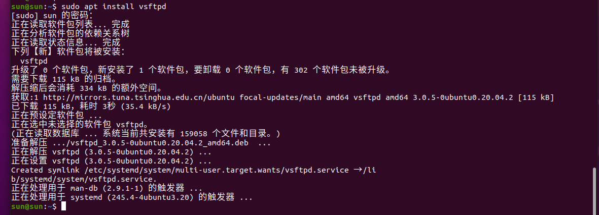

安装完成以后使用VI命令打开/etc/vsftpd.conf
进行FTP服务器配置

配置如下两行：
```bash
local_enable=YES 
write_enable=YES 
```
利用vim 可以使用末行命令: ?词 进行查找


修改文件内容，权限不够加sudo


修改完以后重启FTP服务

`sudo /etc/init.d/vsftpd restart`

注意`/etc/init.d/vsftpd`这是 vsftpd 服务的启动脚本所在的位置。
`/etc/init.d/` 目录包含了系统中各种服务的启动脚本


FTP服务启动：

启动服务：
`sudo systemctl start vsftpd`
开机自启动：
`sudo systemctl enable vsftpd`
配置设置文件
`sudo nano /etc/vsftpd.conf`
重新启动
`sudo systemctl restart vsftpd`
注意：
默认情况下，vsftpd会创建一个名为ftp的用户，该用户可用于登录FTP服务器
`sudo passwd ftp`
用于设置密码

可以如下命令查看是否FTP已经启动
`sudo service vsftpd status`
也可以监测默认21号端口
`sudo netstat -tulpn | grep :21`


如图已经被监听21号端口

2. Windows下FTP客户端安装

Windows下我们使用免费的FTP客户端软件，FileZilla。
可以在官网下载
[FileZilla](https://www.filezilla.cn)


下载安装即可。

打开界面如下：

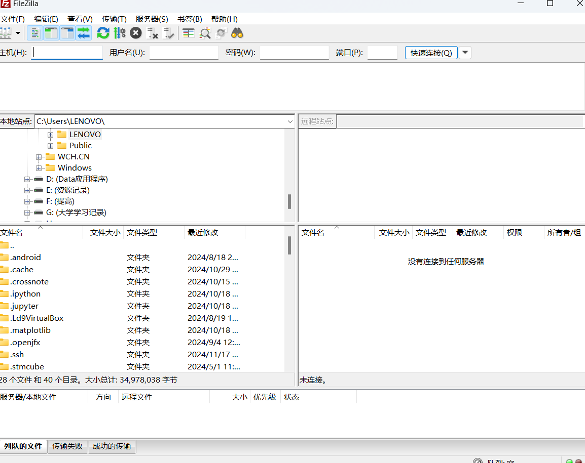

3. FileZilla设置 

Ubuntu 作为 FTP服务器，FileZilla 作为FTP客户端，客户端肯定要连接到服务器上。
打开站点管理器(文件->站点管理器)

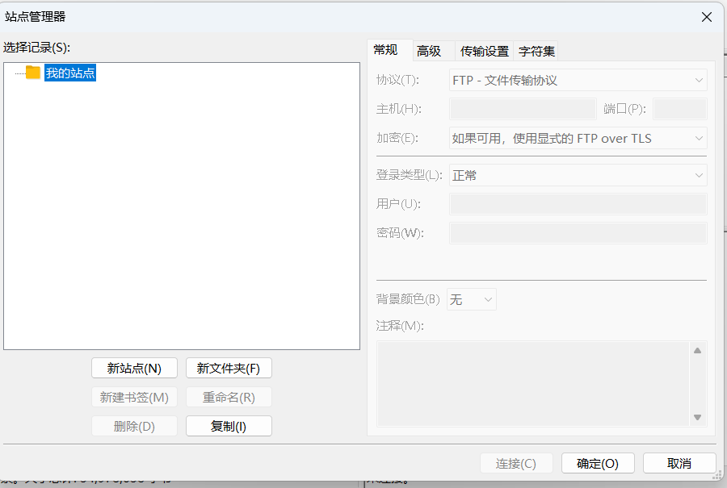

在站点管理器中创建新站点，用于链接Ubuntu FTP服务器。


没有ipv4的地址，只有ipv6地址 2409:8902:6f43:15ae:8a9d:bac0:2db7:6f01
重启后出现ipv4地址


进行连接


链接建立
第一次连接可能会弹出提示是否保存密码的对话框，点击确定即可。

连接成功以后，其中左边就是 Windows 文件目录，右边是 Ubuntu 文件目录，默认进入用户根目录下（比如我电脑的“/home/sun”）。

此时，Utuntu下得文件以乱码形式存在，因为编码格式不对。
我们需要重新设置编码。

先断开连接，点击：服务器(S)->断开连接
然后打开站点管理器，选中要设置的站点“Ubuntu”，选择“字符集”UTF-8编码

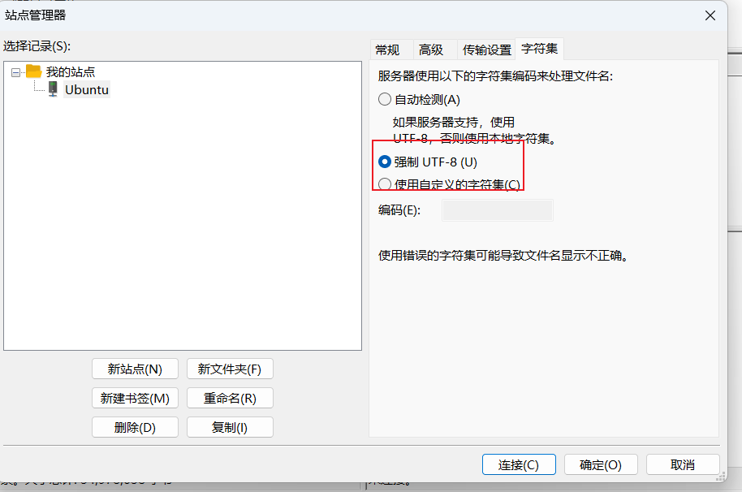

再次链接，
显示已经正常


如果要将 Windows 下的文件或文件夹拷贝到 Ubuntu 中，只需要在左侧的Windows 区域选中要拷贝的文件或者文件夹，然后直接拖到右侧的Ubuntu中指定的目录即可。
将Ubuntu中的文件或者文件夹拷贝到Windows中也是直接拖放。 

### 4.2 Ubuntu下NFS和SSH服务

#### 4.2.1 NFS服务开启

NFS服务介绍：

NFS（Network File System，网络文件系统）是一种允许不同计算机通过网络共享文件的协议。
它最初由Sun Microsystems开发，主要用于UNIX和Linux系统。

NFS的主要功能
    
    文件共享：NFS允许网络中的计算机共享文件和目录，使得远程文件系统看起来像是本地文件系统。
    跨平台支持：NFS支持不同操作系统之间的文件共享，包括UNIX、Linux和Windows。
    透明访问：用户可以像访问本地文件一样访问远程文件，无需了解底层网络细节。

NFS的工作原理
    
    RPC（远程过程调用）：NFS使用RPC协议来管理和传输数据。RPC服务（如portmap或rpcbind）负责将NFS功能映射到特定的端口号。
    端口管理：NFS服务启动时，会随机选择一些端口用于数据传输，并向RPC服务注册这些端口。客户端通过RPC服务获取这些端口信息，从而建立连接。
    数据传输：一旦连接建立，客户端可以通过NFS协议访问和操作远程文件系统。

注意FTP只是实现了文件的传输，NFS才是实现了真正的文件共享。
 ***
后面进行Linux驱动开发的时候需要NFS启动
因此要先安装并开启Ubuntu中的NFS服务，使用如下命令安装NFS服务：

`sudo apt install nfs-kernel-server rpcbind` 


安装完成以后在用户根目录下创建一个名为“linux”的文件夹
以后所有的东西都放到这个“linux”文件夹里面，在“linux”文件夹里面新建一个名为“nfs”的文件夹，用于文件共享。


创建的nfs文件夹供nfs服务器使用，以后我们可以在开发板上通过网络文件系统来访问nfs文件夹.
首先配置nfs，使用如下命令打开nfs配置文件/etc/exports：
`sudo vim /etc/exports`

编辑 /etc/exports 文件，添加共享目录配置

`/home/sun/Linux_imx6ull/nfs *(rw,sync,no_root_squash) `


再重启服务即可,三种不同方式，类似上文FTP

```bash
sudo systemctl start nfs-kernel-server
sudo systemctl enable nfs-kernel-server
sudo systemctl restart nfs-kernel-server
```


#### 4.2.2 SSH服务开启

开启Ubuntu的SSH服务以后我们就可以在Windwos下使用终端软件登陆到Ubuntu，比如使用SecureCRT，Ubuntu 下使用如下命令开启SSH服务： 

`sudo apt-get install openssh-server `

上述命令安装ssh服务，ssh的配置文件为/etc/ssh/sshd_config，使用默认配置即可。 


### 4.3 Ubuntu交叉编译工具安装

#### 4.3.1 交叉编译器安装

ARM 裸机、Uboot 移植、Linux 移植这些都需要在 Ubuntu 下进行编译，编译就需要编译器，我们已经知道了如何在Liux进行C语言开发，使用的是gcc编译器。

但是Ubuntu自带的gcc编译器是针对X86架构的！而我们现在要编译的是ARM架构的代码。
所以我们需要一个在X86架构的PC上运行，可以编译ARM架构代码的GCC编译器，这个编译器就叫做交叉编译器。

总结一下：

    1、它肯定是一个GCC编译器。 
    2、这个GCC编译器是运行在X86架构的PC上的。 
    3、这个GCC编译器是编译ARM架构代码的，也就是编译出来的可执行文件是在ARM芯片上运行的。 

交叉编译器中“交叉”的意思就是在一个架构上编译另外一个架构的代码，相当于两种架构“交叉”起来了。

交叉编译器有很多种，我们使用Linaro出品的交叉编译器。
Linaro是一间非营利性质的开放源代码软件工程公司，Linaro开发了很多软件，最著名的就是Linaro GCC编译工具链(编译器)，关于 Linaro 详细的介绍可以到 Linaro 官网查阅。

[Linaro GCC](https://releases.linaro.org/components/toolchain/binaries/4.9-2017.01/arm-linux-gnueabihf/)

我们选择4.9版本的编译器，已经尝试过再IMX6ULL上可以运行。

我们需要关注这两种: gcc-linaro-4.9.4-2017.01i686_arm-linux-gnueabihf.tar.tar.xz 和 gcc-linaro-4.9.4-2017.01-x86_64_arm-linux-gnueabihf.tar.xz。
第一个是针对32位系统的，第二个是针对64位系统的。
大家根据自己所使用的Ubuntu系统类型选择合适的版本。

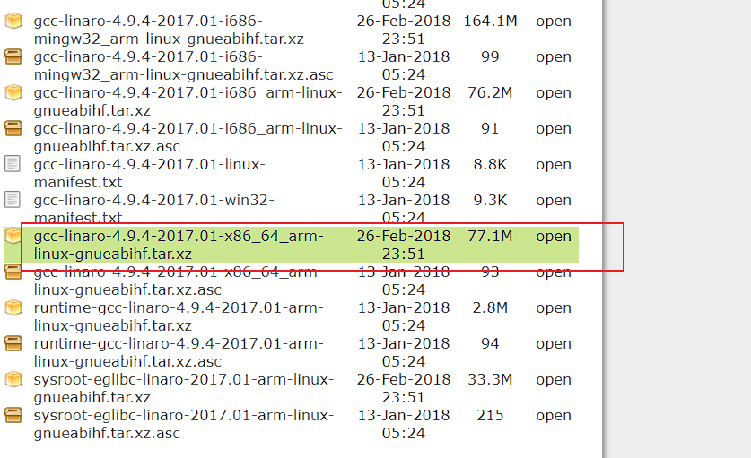

下载好编译器后，我们需要传送到Ubuntu中。
我们在这个 Ubuntu中的linux 文件夹里面再创建一个名为“tool”的文件夹，用来存放一些开发工具。
然后利用FTP将交叉编译器拷贝到tool中。


在Ubuntu中创建目录：/usr/local/arm
命令如下：
`sudo mkdir /usr/loacl/arm`

创建完成以后将刚刚拷贝的交叉编译器复制到/usr/local/arm 这个目录中,注意使用root权限。

拷贝完成以后在/usr/local/arm 目录中对交叉编译工具进行解压，解压命令如下：
`sudo tar -vxf gcc-linaro-4.9.4-2017.01-x86_64_arm-linux-gnueabihf.tar.xz `

等待解压完成，解压完成以后会生成一个名为“gcc-linaro-4.9.4-2017.01-x86_64_arm-linuxgnueabihf”的文件夹。
这个文件夹里面就是我们的交叉编译工具链。 如下图所示：


修改bash的环境变量
`sudo vim /etc/profile`
profile文件的具体作用请见SHELL笔记
添加如下命令：
`export PATH=$PATH:/usr/local/arm/gcc-linaro-4.9.4-2017.01-x86_64_arm-linux-gnueabihf/bin`
即声明环境变量PATH，添加交叉编译文件夹下得/bin文件夹

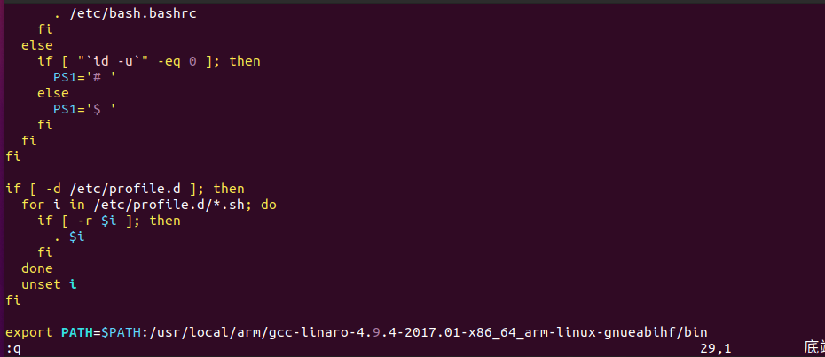

修改好后重启Ubuntu系统，交叉编译工具链就安装好了

#### 4.3.2 安装相关库

在使用交叉编译器之前还需要安装一下其它的库，命令如下： 
`sudo apt-get install lsb-core lib32stdc++6`


安装完成

#### 4.3.3 交叉编译器验证

首先查看一下交叉编译工具的版本号，输入如下命令： 

`arm-linux-gnueabihf-gcc -v`

如果交叉编译器安装正确的话就会显示版本号.

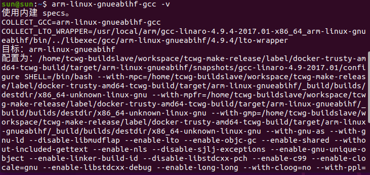

验证前先重启。

第三章“Linux C编程入门”中使用Ubuntu自带的GCC编译器，我们用的是命令“gcc”。
要使用刚刚安装的交叉编译器的时候使用的命令是“arm-linux-gnueabihf-gcc”。

arm-linux-gnueabihf-gcc的含义如下：

    1、arm 表示这是编译arm架构代码的编译器。 
    2、linux 表示运行在linux环境下。 
    3、gnueabihf 表示嵌入式二进制接口。 
    4、gcc 表示是gcc工具。

最好的验证方法就是直接编译一个例程，我们就编译第一个裸机例程“1_leds”试试。

验证：
在前面创建的linux文件夹下创建driver/board_driver 文件夹，用来存放裸机例程
第一个裸机例程“1_leds”拷贝到board_driver中

然后执行make命令进行编译


从图中可以看到例程“1_leds”编译成功了，编译生成了led.o和led.bin这两个文件
使用如下命令查看led.o文件信息： 
`file led.o`
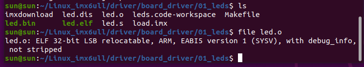

如图表明 led.o 是 32 位 LSB 的ELF格式文件，目标机架构为ARM，说明交叉编译器正常工作。

补充：‌file命令用于识别文件类型。‌ 它能够根据文件的特征，如内容、元数据等，来判断文件的类型。这对于理解文件内容、进行文件管理或调试非常有用。

### 4.4 Source Insight软件使用

Source Inisght 是一款功能强大的代码编辑、阅读工具，工作在 Windows 下，我们可以用Source Insight来进行代码编写和阅读，编写完成以后将代码拷贝到Ubuntu中去编译即可。

[下载链接](https://www.sourceinsight.com/)

安装过程不在赘述。

可以自行安装，注意Source Insight为付费软件。

具体使用参见软件教程，不在赘述。

### 4.5 Vscode安装

#### 4.5.1 Vscode安装

Visual Stuio Code 和 Source Insight 一样，都是编辑器，Visual Studio Sode 本教程以后就简称为VSCode，VSCode 是微软出的一款编辑器，但是免费的。
VSCode 有 Windows、Linux 和macOS 三个版本的，是一个跨平台的编辑器。

[下载地址](https://code.visualstudio.com/)

建议Windows和Ubuntu下都要安装Vscode。具体安装方式请自行解决。

如图，我已经安装完毕

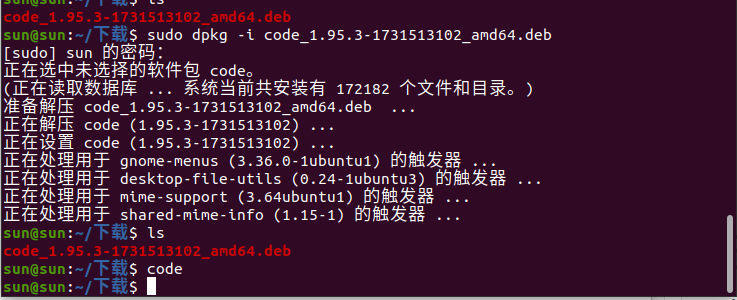

#### 4.5.2 Vscode使用

VSCode 支持多种语言，比如C/C++、Python、C#等等，本教程我们主要用来编写C/C++程序的，所以需要安装C/C++的扩展包，扩展包安装很简单

我们需要按照的插件有下面几个： 

- (1)、C/C++，这个肯定是必须的。 
- (2)、C/C++ Snippets，即 C/C++重用代码块。 
- (3)、C/C++ Advanced Lint,即 C/C++静态检测 。 
- (4)、Code Runner，即代码运行。 
- (5)、Include AutoComplete，即自动头文件包含。 
- (6)、Rainbow Brackets，彩虹花括号，有助于阅读代码。 
- (7)、One Dark Pro，VSCode 的主题。 
- (8)、GBKtoUTF8，将GBK转换为UTF8。 
- (9)、ARM，即支持ARM汇编语法高亮显示。 
- (10)、Chinese(Simplified)，即中文环境。 
- (11)、vscode-icons，VSCode 图标插件，主要是资源管理器下各个文件夹的图标。 
- (12)、compareit，比较插件，可以用于比较两个文件的差异。 
- (13)、DeviceTree，设备树语法插件。 
- (14)、TabNine，一款AI自动补全插件，强烈推荐，谁用谁知道！  

#### 4.5.3 Vscode新建工程

新建一个文件夹用于存放工程，比如我新建的文件夹目录E:\VScode_Program\1_test，路径尽量不要有中文和空格。打开VSCode，然后在VSCode上点击文件->打开文件夹…，选刚刚创建的“1_test”文件夹即可。

一般一个文件夹中会有一个.vscode文件夹，用于环境配置。

C/C++的配置文件是个json文件，名为：c_cpp_properties.json

这个json文件中的变量“includePath”用于指定工程中的头文件路径，但是“stdio.h”
是C语言库文件，而VSCode只是个编辑器，没有编译器，所以肯定是没有stdio.h的。
除非我们自行安装一个编译器，比如CygWin，然后在includePath 中添加编译器的头文件。
这里我们就不添加了，因为我们不会使用VSCode来编译程序，这里主要知道如何指定头文件路径就可以了，后面有实际需要的时候再来讲。

具体VScode如何使用请实战学习。

### 4.6 CH340串口驱动安装

我们一般在Windwos下通过串口来调试程序，或者使用串口作为终端。
I.MX6U-ALPHA开发板使用CH340这个芯片实现了USB转串口功能，CH340是一枚江苏沁恒生产的国产芯片，稳定性还是很不错的。

先通过USB线将开发板的串口和电脑连接起来起来。
CH340 是需要安装驱动的，驱动我们已经放到了开发板光盘中，直接双击安装即可。

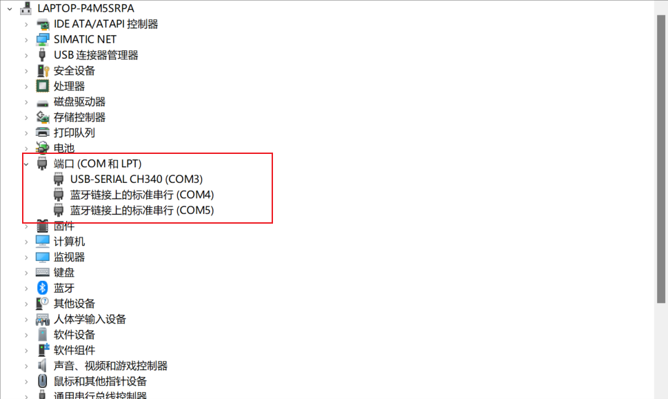

成功安装。

### 4.7 SecureCRT 软件安装

#### 4.7.1 安装
在后续的开发过程中我们需要在 Windows 下使用 SecureCRT 作为终端，SecureCRT 支持SSH 以及串口，我们通常使用 SecureCRT 来作为串口终端使用

[下载链接](https://www.vandyke.com/download/index.html)

按照要求安装即可

#### 4.7.2 使用

SecureCRT 功能很强大，支持SSH，可以用来远程登陆；
支持串口，可以用来作为Linux开发板的串口终端。
我们用的最多的就是将SecureCRT作为串口终端来使用。

使用具体请按照工具自行学习，接下来做简单介绍

1. 链接开发板

查看当前开发板的串口号


如图，COM3

2. 设置SecureCRT

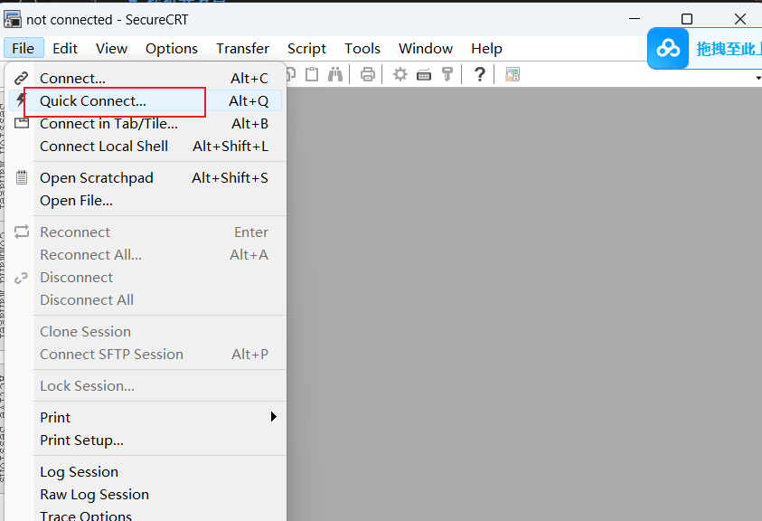
如图，新建一个快速连接

按照如下配置


如图，成功链接

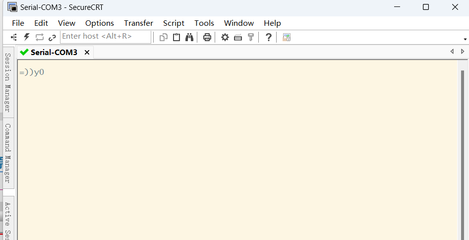

I.MX6U-ALPHA 开发板默认出厂烧写了Linux系统，所以如果连接上SecureCRT以后会将串口作为终端，会输出Linux系统启动信息。
并且可以通过SecureCRT来操作开发板中的Linux系统，此时SecureCRT就是开发板的终端，和Ubuntu中的终端一样。

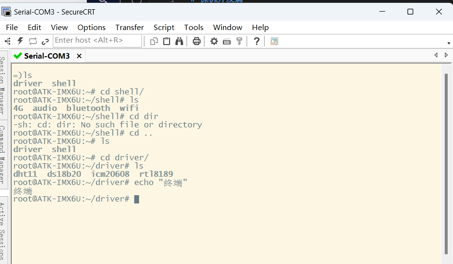


### 4.8 Putty软件

#### 4.8.1 Putty软件安装

Putty和SecureCRT是类似的软件，都是用来作为SSH或者串口终端的，区别在于SecureCRT是付费软件，而Putty是免费的！！！

[下载地址](https://www.chiark.greenend.org.uk/~sgtatham/putty/latest.html)

按照自己需求安装即可

#### 4.8.2 Putty的使用

是具体情况自己使用。

### 4.9  MobaXterm 软件安装和使用

#### 4.9.1 安装

MobaXterm 也是一个类似SecureCRT 和Putty 的终端软件，此软件是网友推荐的，功能强大而且免费(也有收费版)！

[下载地址](https://mobaxterm.mobatek.net/)

按要求安装即可

#### 4.9.2  MobaXterm 软件使用

不做具体描述，自行学习使用。

当然推荐还是使用SecureCRT 其次使用MobaxTerm也可。

## 第五章 开发平台介绍

本人使用的是的I.MX6U-Mini开发板。

### 5.1 资源初探

这款开发板，是正点原子推出的第一款Linux开发板，采用底板+核心板的形式。接下来我们分别介绍I.MX6U-ALPHA开发板的底板和核心板。 

#### 5.1.1 开发板底板资源

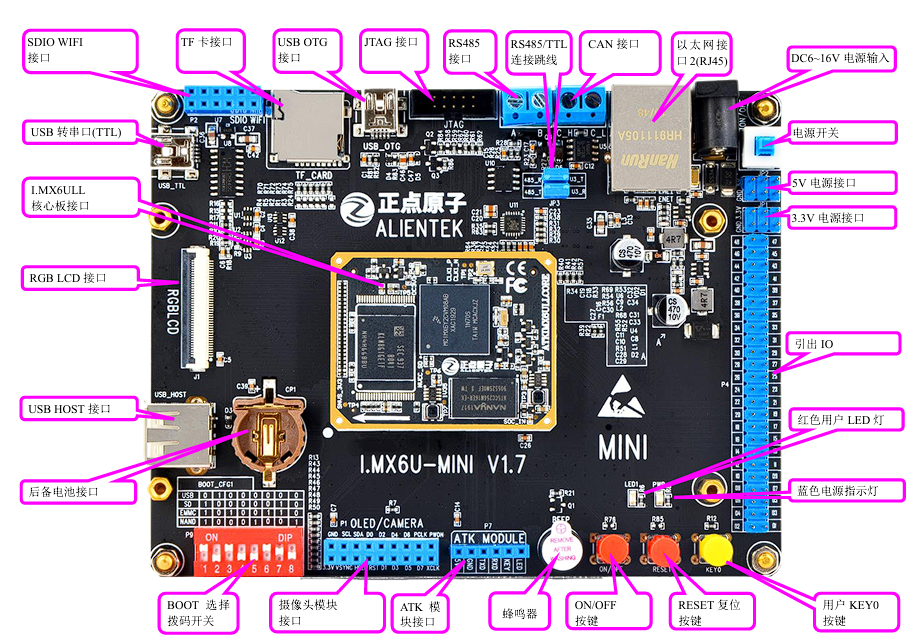

I.MX6U-Mini 开发板底板其实就是I.MX6U-ALPHA 开发板的精简底板。

具体板载资源见开发手册。

#### 5.1.2 核心板资源

我们来看I.MX6ULL核心板资源图，正点原子的I.MX6ULL核心板根据存储芯片的不同分为EMMC和NAND两种，根据对外提供的接口可以分为邮票孔和BTB两种。

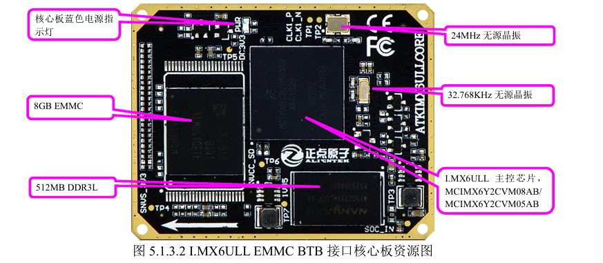

正点原子I.MX6ULL EMMC版核心板板载资源如下： 
◆ CPU：MCIMX6Y2CVM08AB（工业级），800MHz(实际792MHz)，BGA289 
◆ 外扩DDR3L：NT5CC256M16EP-EK，512MB字节，商业级。 
◆ EMMC：KLM8G1GET，这是一个8GB的EMMC芯片。 
◆ 两个2*30的防反插BTB座，共引出120 PIN 

### 5.2 开发板资源说明

#### 5.2.1 Mini硬件资源说明

1.  SDIO WIFI接口
 
这是开发板上的一个SDIO WIFI(P2)接口，可以通过此接口连接正点原子出品的SDIO WIFI模块。
SDIO WIFI接口和TF卡共用一个USDHC接口，因此不能同时和TF卡使用。  

2. USB转串口 

USB 串口，为MiniUSB接口（USB_TTL），USB连接CH340C芯片，CH340C与I.MX6IULL的串口1相连接，从而实现USB转串口。
设计成USB串口，是出于现在电脑上串口正在消失，尤其是笔记本，几乎清一色的没有串口，所以板载USB串口可以方便大家调试。

3. I.MX6ULL核心板接口 

这是开发板底板上面的核心板接口，由2个2*30的贴片板对板接线端子（3710F公座）组成。
可以用来插正点原子的I.MX6UL/ULL核心板等，从而学习I.MX6UL/6ULL等芯片，达到一个开发板，学习多款SOC的目的，减少重复投资。

4. RGBLCD接口 

这是转接板自带的RGB LCD接口（LCD），可以连接各种正点原子的RGB LCD屏模块，并且支持触摸屏（电阻/电容屏都可以）。
采用的是RGB888格式，可显示1677万色，色彩显示丰富。

5. USB HOST接口 

这是开发板板载的一个卧式USB-A座（USB_HOST），我们可以通过这个USB-A座，连接U盘/USB鼠标/USB键盘等其他USB从设备，从而实现USB主机功能。

6. 后备电池接口 

这是I.MX6ULL后备区域的供电接口，可以用来给I.MX6ULL的后备区域提供能量，在外部电源断电的时候，维持SNVS区域数据的存储，以及RTC的运行。 

7. 启动(BOOT)拨码开关 

I.MX6U 支持多种启动方式，比如SD卡、EMMC、NAND、QSPI FALSH和USB等，要想从某一种设备启动就必须先设置好启动拨码开关。
I.MX6U-Mini 开发板用了一个 8P 的拨码开关来选择启动方式，支持从SD卡、EMCM、NAND和USB这四种启动方式，这四种启动方式对应的拨码开关拨动方式已经写在了开发板上。
大家在使用的时候根据自己的实际需求设置拨码开关即可。

8. 摄像头模块接口 

这是开发板板载的一个摄像头模块接口（P1），摄像头模块（需自备），对准插入到此插槽中。

9. ATK模块接口 

这是开发板板载的一个正点原子通用模块接口（P7），目前可以支持正点原子开发的 GPS模块、蓝牙模块、MPU6050模块、激光测距模块和手势识别模块等，直接插上对应的模块，就可以进行开发。
后续我们将开发更多兼容该接口的其他模块，实现更强大的扩展性能。 

10. 蜂鸣器 

这是一个有源蜂鸣器，通过高低电平控制蜂鸣器的开关。

11. ON/OFF 按键 

这是一个ON/OFF按键，连接到I.MX6ULL的OF/OFF引脚上。

12. 复位按键 

这是开发板板载的复位按键（RESET），用于复位I.MX6U，还具有复位液晶的功能。
因为液晶模块的复位引脚和 I.MX6U 的复位引脚是连接在一起的，当按下该键的时候，I.MX6U 和
液晶一并被复位。 

13. 用户按键KEY 

这是开发板板载的1个机械式输入按键（KEY0），可以做为普通按键输入使用。 

14. 蓝色电源指示LED灯 

这是开发板电源指示LED灯，为蓝色，当板子供电正常的时候此灯就会常亮。
如果此灯不亮的话就说明开发板供电有问题(排除LED灯本身损坏的情况)。

15. 红色用户LED灯 

这是开发板板载的1个LED灯，为红色，用户可以使用此LED灯。
在调试代码的时候，使用LED来指示程序状态，这是非常不错的一个辅助调试方法。

16. 引出的IO口 

这是开发板IO引出端口P4，采用2*24排针，总共引出41个IO口。 

17. 3.3V 电源输入/输出 

这是开发板板载的一组3.3V电源输入输出排针（2*3）（ JP1），用于给外部提供3.3V的电源，也可以用于从外部接3.3V的电源给板子供电。 
大家在实验的时候可能经常会为没有3.3V电源而苦恼不已，有了I.MX6U-Mini开发板，你就可以很方便的拥有一个简单的3.3V电源（最大电流不能超过3000mA）。 

18. 5V 电源输入/输出 
     
这是开发板板载的一组5V电源输入输出排针（2*3）（ JP2），该排针用于给外部提供5V的电源，也可以用于从外部接5V的电源给板子供电。 
同样大家在实验的时候可能经常会为没有5V 电源而苦恼不已，正点原子充分考虑到了大家需求，有了这组5V排针，你就可以很方便的拥有一个简单的5V电源。
注意：（USB供电的时候，最大电流不能超过500mA，外部供电的时候，最大可达3000mA）。

19. 电源开关 

这是开发板板载的电源开关。该开关用于控制整个开发板的供电。
这是一个自锁式开关，按下以后打开开发板电源，整个板子开始供电，电源指示灯(PWR)点亮。
再次按下开关弹起，关闭开发板电源，整个开发板都将断电，电源指示灯（PWR）会随之熄灭。

20. DC6~16V 电源输入 

这是开发板板载的一个外部电源输入口（DC_IN），采用标准的直流电源插座。
开发板板载了DC-DC芯片（JW5060T），用于给开发板提供高效、稳定的5V电源。
由于采用了DC-DC芯片，所以开发板的供电范围十分宽，大家可以很方便的找到合适的电源（只要输出范围在DC6~16V 的基本都可以）来给开发板供电。
在耗电比较大的情况下，比如用到4.3屏/7寸屏/网口的时候，建议使用外部电源供电，可以提供足够的电流给开发板使用。

21. 以太网接口(RJ45) 

这是开发板板载的以太网接口，连接到I.MX6U的ENET2网络接口。 

22. CAN接口 

这是开发板板载的CAN总线接口（CAN），通过2个端口和外部CAN总线连接，即CANH和CANL。
这里提醒大家：CAN通信的时候，必须CANH接CANH，CANL接CANL，否则可能通信不正常！ 

23. RS485/串口 3接口 

这是RS485 与 I.MX6ULL 串口 3 的跳线帽设置接口，如果将485_R 与 U3_T、485_T 与U3_R 连起来，那么RS485接口就会使用I.MX6ULL的串口3。
做RS485实验的时候一定要将此接口连起来。 

24. RS485 接口 

这是开发板板载的RS485总线接口（RS485），通过2个端口和外部485设备连接。
这里提醒大家，RS485通信的时候，必须A接A，B接B。否则可能通信不正常 

25. JTAG接口 

10P 的JTAG接口，可用于连接JLINK等调试器。

26. USB OTG接口 

这是开发板板载的一个MiniUSB头（USB_OTG），用于USB OTG实验。 

27. TF卡接口 

这是开发板板载的一个标准TF卡接口（TF_CARD），该接口在开发板的背面，采用小型的TF 卡接口，USDHC方式驱动，有了这个TF卡接口，就可以满足海量数据存储的需求。

#### 5.2.2 Mini软件资源

由于Mini 板是ALPHA的精简底板，因此Mini板的软件资源和ALPHA的软件资源可以共用，包括例程、视频和教程，除了Mini板没有的外设。

软件资源分为3部分：Linux系统驱动软件资源、裸机例程、Linux驱动例程。

裸机例程：

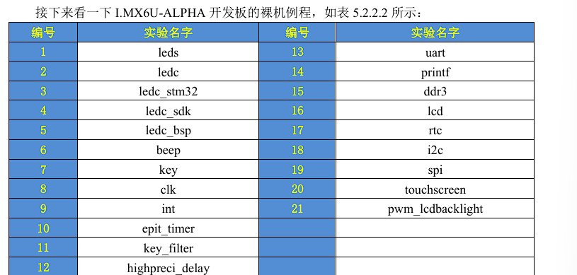

正点原子的I.MX6U-ALPHA开发板裸机例程似乎不是很多。
因为单片机学名叫做Microcontroller，也就是微控制器，主要用于控制相关的应用。
因此单片机的外设都比较多，比如很多路的IIC、SPI、UART、定时器等等。
嵌入式Linux开发主要注重于高端应用场合，比如音视频处理、网络处理等等。

具体区别示例：

比如一个机器人，高性能处理器加Linux系统(或者其他系统)作为机器人的大脑。
主要负责接收各个传感器采集的数据然后对原始数据进行处理，得到下一步执行指令，这个往往需要很高的性能。

当处理完成得到下一步要做的动作之后，大脑就会将数据发给控制机器人各个关节电机的驱动控制器，这些驱动控制器一般都是单片机做的。

所以大家在学习嵌入式Linux开发的时候一定不要深陷裸机。
我们之所以讲解裸机是为了给嵌入式Linux 打基础，让大家了解所使用的SOC、了解GCC那一套工作流程，最终的目的都是为了嵌入式Linux做准备的。

嵌入式驱动例程：


因为有些外设驱动在Linux内核里面已经集成了，因此并没有编写独立的驱动，我们会在相应的章节里面对这些驱动进行讲解。

#### 5.2.3 核心板硬件介绍

1. 核心板电源指示灯 

这是核心板板载的一个蓝色LED灯，用于指示核心板供电是否正常，如果核心板供电正常的话此灯就会点亮。 

2. NAND/EMMC存储芯片
 
这是核心板上板载的存储芯片，分为NAND和EMMC两种。
对于NAND版本的核心板共有 256MB 和 512MB 两种容量的 NAND，型号分别为 MT29F2G08ABAEAWP-IT 或 MT29F4G08ABADAWP-IT，这两种型号的NAND FLASH工作温度范围都为工业级。
EMMC版本的核心板使用8GB的EMMC，型号为KLM8G1GET。 

3. DDR3L芯片 

这是核心板板载的DDR3L芯片，NAND版本核心板的DDR3L容量为256MB，EMMC版本的核心板的DDR3L容量为512MB。
型号分别为NT5CC128M16JR-EK和NT5CC256M16EPEK。
如果要用于UI开发，那么最好选择512MB的DDR3L。

4. CPU 

这是核心板的 CPU，型号为 MCIMX6Y2CVM08AB，MCIMX6Y2CVM08AB 主频为800MHz(实际 792MHz)。
该芯片采用Coretx-A7 内核，自带32KB的L1指令 Cache、32KB 的L1 数据Cache、128KB 的 L2Cache、集成 NEON 和 SIMDv2、支持硬件浮点(FPU)计算单元。
浮点计算架构为VFPv4-D32、1个RGB LCD接口、2个CAN接口、2个10M/100M网络接口、2 个USB OTG接口(USB2.0)、2路ADC、8个串口、3个SAI、4个定时器、
8路PWM、4路I2C 接口、4路SPI接口、一路CSI摄像头接口、2个USDHC接口，支持4位SD卡，最高可
以支持UHS-I SDR 104模式，支持1/4/8位的EMMC，最高可达HS200模式、一个外部存储接
口、支持16位的LPDDR2-800、DDR3-800和DDR3L-800、支持8位的MLC/SLC NAND Flash，
支持2KB、4KB和8KB页大小，以及124个通用IO口等。 

5. 32.768KHz 晶振 
 
这是一个无源的32.768KHz晶振，供I.MX6U内部RTC使用。

6. 24MHz晶振 

这是一个无源的24MHz晶振，供I.MX6U使用。  
另外，I.MX6U 核心板的接口在底部，通过两个2*30的板对板端子（3710M母座）组成，总共引出了104个IO，通过这个接口，可以实现与I.MX6U-ALPHA底板对接。

### 5.3 开发板原理图介绍

具体请见数据手册

核心板与底板的接口：
I.MX6U-Mini开发板底板采用2个2*30的3710F（公座）板对板连接器来同核心板连接

引出IO口：

一共40个IO，外加一个GND、一个5V、一个3.3V、一个ON_OFF引脚

USB串口：
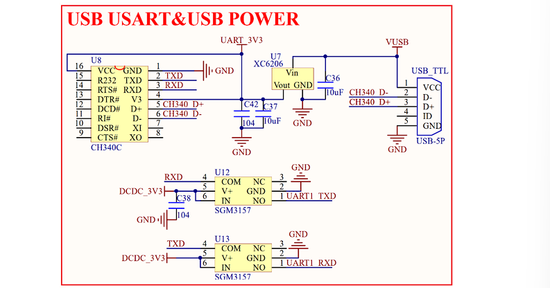
CH340C 内置晶振，因此就不需要再在外面连接一个晶振。
USB_TTL是本开发板的主要供电口.

RGBLCD接口：
见数据手册

复位电路：
低电平复位

启动模式设置：
支持多种启动方式

VBAT供电接口：

上图的VDD_COIN_3V通过核心板上的BAT54C，接VDD_SNVS_IN脚，从而给核心板的SNVS区域供电。这部分原理图在核心板上
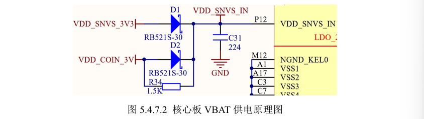
VDD_SNVS_IN 使用 VDD_COIN_3V（接 CR1220 电池）和VDD_SNVS_3V3 混合供电的方式.
在有外部电源（VDD_SNVS_3V3）的时候，CR1220 不给VDD_SNVS_IN 供电，而在外部电源断开的时候，则由CR1220给其供电。
这样，VDD_SNVS_IN总是有电的，以保证RTC的走时。 

RS485接口：
RS485 电平也不能直接连接到I.MX6U，同样需要电平转换芯片。
这里我们使用SP3485来做485电平转换。

CAN接口：
CAN总线电平也不能直接连接到I.MX6U，同样需要电平转换芯片。
这里我们使用TJA1050来做CAN电平转换。

USB HOST 接口:
USB HOST连接到了I.MX6ULL的USB2接口。

USB OTG 接口:
USB OTG接口使用了I.MX6U的USB1接口。

LED灯：
PWR BLUE是系统电源指示灯，为蓝色。
LED1为用户LED灯，连接在I.MX6U的GPIO1_IO03上，此灯为红色。

KEY接口：
1个输入按键
KEY0 用作普通按键输入，分别连接I.MX6U的UART1_CTS引脚上，这里使用外部10K上拉电阻。

摄像头模块接口:
I.MX6U-Mini 开发板板载了一个摄像头模块接口，连接在I.MX6U的硬件摄像头接口（CSI）上面.

有源蜂鸣器：
自带了震荡电路的蜂鸣器，这种蜂鸣器一接上电就会自己震荡发声。
BEEP 信号直接连接在I.MX6U 的 SNVS_TAMPER1 引脚上，可以通过控制此引脚来控制蜂鸣器开关。 

TF卡：
TF卡接口和SDIO WIFI接口共用一个SDIO，因此TF卡和SDIO不能同时使用！

SDIO WIFI接口：
用 于 连接正点原子出品的 RTL8189 SDIO WIFI 模 块。

ATK模块接口：
可以用来连接正点原子推出的一些模块。
比如：蓝牙串口模块、GPS模块、MPU6050模块、激光测距模块、手势识别模块和RGB彩灯模块等。
有了这个接口，我们连接模块就非常简单，插上即可工作。

UART3_RXD/UART3_TXD连接到了I.MX6U的UART3上，和RS232、RS485共用一个串口，在使用ATK接口的时候需要将JP1跳线帽全部拔掉，防止RS232和RS485干扰到模块。

以太网模块：
I.MX6U-Mini 开发板板载了一个以太网接口(RJ45)： ENET2

电源：
详情见数据手册

电源输入输出接口:
I.MX6U-Mini 开发板板载了两组简单电源输入输出接口.
自带电源输出接口。5V/3.3V 

原理图只做简要介绍，详情见数据手册。

### 5.4 核心板原理图

SOC电路：
比较复杂详情请看开发板原理图。

BTB接口:
I.MX6U 核心板采用2个2*30的3710M（母座）板对板连接器来同底板连接(在转接板底面)，接插非常方便

EMMC:

EMMC也是存储Flash，相比NAND Flash，EMMC使用简单(和SD类似)、速度快、容量高。
目前EMMC已经逐渐的取代了NAND Flash，尤其是在手机、平板领域。

DDR3L芯片:
内存芯片

核心板电源：
I.MX6U 对于供电有严格的要求，尤其是上电顺序。
正点原子的 I.MX6U 核心板供电主要分5部分：SNVS供电、DCDC_3V3供电、ARM/SOC内核供电、DDR3L供电和SD卡供电

注意：

    所有的原理图分析，我们将在实际用到时做详细的分析。
    后面的开发也可能用到第五章的描述，具体请见数据手册。

### 5.5 开发板使用注意

第一点：
1个USB供电最多500mA，且由于导线电阻存在，供到开发板的电压，一般都不会有5V。
如果使用了很多大负载外设，比如4.3寸屏、网络、摄像头模块等，那么可能引起USB供电不够。
所以如果是使用4.3 屏的朋友，或者同时用到多个模块的时候，建议大家使用一个独立电源供电。 
如果没有独立电源，建议可以同时插2个USB口，并插上仿真器，这样供电可以更足一些。

第二点：
当你想使用某个IO口用作其他用处的时候，请先看看开发板的原理图，该IO口是否有连接在开发板的某个外设上。
如果有，该外设的这个信号是否会对你的使用造成干扰，先确定无干扰，再使用这个IO。

第三点：
开发板上的跳线帽比较多，大家在使用某个功能的时候，要先查查这个是否需要设置跳线帽，以免浪费时间。 

第四点：
当液晶显示白屏的时候，请先检查液晶模块是否插好（拔下来重插试试）。

第五点：
开发板的USB OTG的USB SLAVE和USB HOST共用同一个USB口，所以，他们不可以同时使用。使用的时候多加注意。

第六点：
当需要从底板上拆转接板下来的时候，请左右晃动取下，不要太大幅度，否则有可能拆坏座子。 

## 第六章 Cortex-A7 MPCore架构

前言：

I.MX6UL 使用的是Cortex-A7 架构，本章就给大家介绍一下Cortex-A7架构的一些基本知识。
了解了Cortex-A7架构以后有利于我们后面的学习。
因为后面有很多例程涉及到Cortex-A7架构方面的知识，比如处理器模型、Cortex-A7寄存器组等等，但是Cortex-A7架构很庞大，远不是一章就能讲完的，所以本章只是对Cortex-A7 架构做基本的讲解

参考文档：
《Cortex-A7 Technical ReferenceManua.pdf》和《ARM Cortex-A(armV7)编程手册V4.0.pdf》
均为ARM的官方文档

### 6.1 A7 MPCore介绍 

首先介绍MPCore，MPCore 是指 Multi-Processor Core，即多处理器核心架构。
它是一种多核处理器设计，允许在单个芯片上集成多个处理器核心，从而提高计算性能和效率12。
ARM 的 Cortex-A7 MPCore 处理器支持 1 到 4 个核心，通常与 Cortex-A15 组成 big.LITTLE 架构，Cortex-A15 负责高性能任务，而 Cortex-A7 负责低功耗任务。

其中big.LITTLE 架构是由 ARM 提出的异构多核处理器架构，旨在优化性能和功耗。
它结合了高性能核心（big）和高效能核心（LITTLE），以便在不同的工作负载下实现最佳的性能和能效平衡。
比如，Cortex-A15 作为大核负责高性能运算，比如玩游戏啥的，Cortex-A7负责普通应用，因为Cortex A7 省电。

ARM官网对Cortex-A7说明如下：

“在28nm工艺下，Cortex-A7 可以运行在 1.2~1.6GHz，并且单核面积不大于 0.45mm2(含有浮点单元、NEON和32KB的L1缓存)，
在典型场景下功耗小于100mW， 这使得它非常适合对功耗要求严格的移动设备，这意味着Cortex-A7 在获得与 Cortex-A9 相似性能的情况下，其功耗更低”。 

Cortex-A7 MPCore 支持在一个处理器上选配1~4个内核，Cortex-A7 MPCore多核配置如图：


Cortex-A7 MPCore 的 L1 可选择 8KB、16KB、32KB、64KB.
L2 Cache 可以不配，也可以选择128KB、256KB、512KB、1024KB。

I.MX6UL配置了32KB的L1指令Cache和32KB的L1 数据Cache，以及128KB的L2 Cache。
Cortex-A7MPCore使用ARMv7-A架构。

补充Cortex-A7MPCore与ARMv7-A区别：

    架构层面：
    ARMv7-A 是一个架构规范，定义了指令集、寄存器和其他处理器特性。它是 ARM 处理器的一个系列，包括 Cortex-A7、Cortex-A8、Cortex-A9 等。
    Cortex-A7 MPCore 是基于 ARMv7-A 架构的具体实现。它是一款高能效的多核处理器，专为低功耗和高性能的应用设计。
    
    处理器特性：
    Cortex-A7 MPCore 具有多核设计，支持 1 到 4 个核心，集成了 L1 和可选的 L2 缓存，支持 NEON SIMD 指令集、VFPv4 浮点单元和 TrustZone 技术12。
    ARMv7-A 架构支持多种处理器特性，但具体实现取决于不同的处理器型号，如 Cortex-A7、Cortex-A8 等12。

    应用场景：
    Cortex-A7 MPCore 通常用于入门级智能手机、平板电脑和其他移动设备，强调低功耗和高能效12。
    ARMv7-A 架构的处理器广泛应用于各种设备，从高性能服务器到嵌入式系统。

Cortex-A7MPCore主要特性：

①、SIMDv2扩展整形和浮点向量操作。 
②、提供了与 ARM VFPv4 体系结构兼容的高性能的单双精度浮点指令，支持全功能的IEEE754。 
③、支持大物理扩展(LPAE)，最高可以访问40位存储地址，也就是最高可以支持1TB的内存。 
④、支持硬件虚拟化。 
⑥、支持Generic Interrupt Controller(GIC)V2.0。  
⑦、支持NEON，可以加速多媒体和信号处理算法。
具体解释，用得时解释。

### 6.2 Cortex-A处理器运行模型

补充：什么叫做处理器运行模式

    处理器运行模型（Processor Operating Modes）是指处理器在不同状态下的工作模式。
    不同的运行模式允许处理器在处理不同类型的任务时，使用不同的权限和资源。
    这些模式通常包括用户模式和各种特权模式，每种模式都有特定的用途和权限级别。

模式切换的触发条件：

    中断（Interrupts）：当处理器接收到中断信号时，会从当前模式切换到中断处理模式（如 IRQ 模式或 FIQ 模式），以处理紧急任务或外部设备请求。
    异常（Exceptions）：当处理器遇到异常情况（如非法指令、内存访问错误等）时，会切换到异常处理模式（如 Abort 模式或 Undefined 模式），以处理这些异常。
    系统调用（System Calls）：当应用程序需要操作系统服务时，会通过系统调用触发模式切换，从用户模式切换到特权模式（如 Supervisor 模式），以执行特权指令。
    启动和重启（Boot and Reset）：处理器在启动或重启时，会进入特定的启动模式（如 Supervisor 模式），以初始化系统。
    安全需求（Security Requirements）：在使用 TrustZone 技术时，处理器会在普通模式和安全模式（Monitor 模式）之间切换，以处理安全相关任务。

    这些模式切换通常由硬件事件（如中断信号）或软件指令（如系统调用）触发，以确保处理器能够高效、安全地处理各种任务。

以前的ARM处理器有7中运行模型：
User、FIQ、IRQ、Supervisor(SVC)、Abort、Undef和 System，其中 User 是非特权模式，其余 6 中都是特权模式。
新的 Cortex-A 架构加入了TrustZone 安全扩展，所以就新加了一种运行模式：Monitor
新的处理器架构还支持虚拟化扩展，因此又加入了另一个运行模式：Hyp，所以Cortex-A7处理器有9种处理模式

| 模式            | 描述                                                           |
| --------------- | -------------------------------------------------------------- |
| User(USR)       | 用户模式，非特权模式，大部分程序运行的时候就处于此模式。       |
| FIQ             | 快速中断模式，进入FIQ中断异常 ，具有最高的优先级               |
| IRQ             | 一般中断模式                                                   |
| Supervisor(SVC) | 超级管理员模式，特权模式，供操作系统内核使用。                 |
| Monitor(MON)    | 监视模式？这个模式用于安全扩展模式。                           |
| Abort(ABT)      | 数据访问终止模式（内存访问错误等），用于虚拟存储以及存储保护。 |
| Hyp(HYP)        | 用于虚拟化扩展，支持虚拟机管理程序（Hypervisor）。             |
| Undef(UND)      | 未定义指令终止模式。                                           |
| System(SYS)     | 系统模式，用于运行特权级的操作系统任务                         |

除了User(USR)用户模式以外，其它8种运行模式都是特权模式。
这几个运行模式可以通过软件进行任意切换，也可以通过中断或者异常来进行切换。

大多数的程序都运行在用户模式，用户模式下是不能访问系统所有资源的。
有些资源是受限的，要想访问这些受限的资源就必须进行模式切换。

但是用户模式是不能直接进行切换的，用户模式下需要借助异常来完成模式切换。
当要切换模式的时候，应用程序可以产生异常，在异常的处理过程中完成处理器模式切换。 

当中断或者异常发生以后，处理器就会进入到相应的异常模式中，每一种模式都有一组寄存器供异常处理程序使用，
这样的目的是为了保证在进入异常模式以后，用户模式下的寄存器不会被破坏。 

如果学过STM32和UCOS、FreeRTOS就会知道，STM32只有两种运行模式，特权模式和非特权模式，但是Cortex-A就有9种运行模式。

### 6.3 Cortex-A寄存器组

ARM架构提供了16个32位的通用寄存器(R0~R15)供软件使用。
前15个(R0~R14)可以用作通用的数据存储，R15是程序计数器PC，用来保存将要执行的指令。

ARM还提供了一个当前程序状态寄存器CPSR和一个备份程序状态寄存器SPSR，SPSR寄存器就是CPSR寄存器的备份。

CPSR介绍：

    CPSR（Current Program Status Register，当前程序状态寄存器）是 ARM 处理器中的一个关键寄存器，用于存储处理器的当前状态和控制信息。
    它包含以下几个重要部分：

    条件码标志（Condition Flags）：
        N（Negative）：结果为负数时置位。
        Z（Zero）：结果为零时置位。
        C（Carry）：加法操作产生进位或减法操作产生借位时置位。
        V（Overflow）：有符号运算产生溢出时置位。
    控制位（Control Bits）：
        I（Interrupt Disable）：中断禁止位，置位时禁止 IRQ 中断。
        F（Fast Interrupt Disable）：快速中断禁止位，置位时禁止 FIQ 中断。
        T（Thumb State）：指示处理器当前是否处于 Thumb 状态。

    模式位（Mode Bits）：指示处理器当前的运行模式，如用户模式、管理模式、中断模式等。

    CPSR 在处理器的不同模式下都可以访问，并且在异常发生时，处理器会将当前的 CPSR 保存到相应的 SPSR（Saved Program Status Register）中，以便在异常处理完毕后恢复原来的状态。

寄存器如图所示：

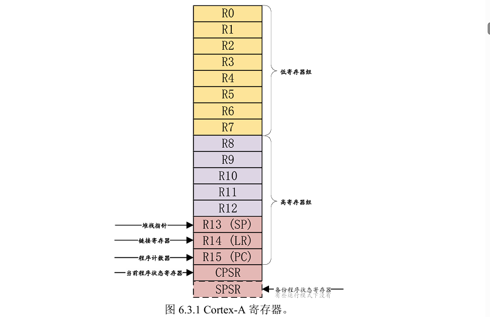

上一小节我们讲了Cortex-A7有9种运行模式，每一种运行模式都有一组与之对应的寄存器组。
每一种模式可见的寄存器包括15个通用寄存器(R0~R14)、一两个程序状态寄存器和一个程序计数器PC。
在这些寄存器中，有些是所有模式所共用的同一个物理寄存器，有一些是各模式自己所独立拥有的.
见下表：


可以看出，在所有的模式中，低寄存器组(R0\~R7)是共享同一组物理寄存器的，只是一些高寄存器组在不同的模式有自己独有的寄存器，比如FIQ模式下R8~R14是独立的物理寄存器。
假如某个程序在FIQ模式下访问R13寄存器，那它实际访问的是寄存器R13_fiq。
如果程序处于SVC模式下访问R13寄存器，那它实际访问的是寄存器R13_svc。

总结：
①、34个通用寄存器，包括R15程序计数器(PC)，这些寄存器都是32位的。 
②、8个状态寄存器，包括CPSR和SPSR。 
③、Hyp模式下独有一个ELR_Hyp寄存器。

### 6.3.1 通用寄存器

R0~R15 就是通用寄存器，通用寄存器可以分为以下三类： 
①、未备份寄存器，即R0~R7。 
②、备份寄存器，即R8~R14。 
③、程序计数器PC，即R15。

#### 1.未备份寄存器

未备份寄存器指的是R0~R7这8个寄存器，因为在所有的处理器模式下这8个寄存
器都是同一个物理寄存器，在不同的模式下，这8个寄存器中的数据就会被破坏。
所以这8个寄存器并没有被用作特殊用途。 

#### 2.备份寄存器 

备份寄存器中的R8\~R12这5个寄存器有两种物理寄存器。
在快速中断模式下(FIQ)它们对应着Rx_irq(x=8\~12)物理寄存器，其他模式下对应着 Rx(8\~12)物理寄存器。
FIQ 是快速中断模式，看名字就是知道这个中断模式要求快速执行！
FIQ模式下中断处理程序可以使用R8\~R12寄存器，因为FIQ模式下的R8\~R12是独立的，因此中断处理程序可以不用执行保存和恢复中断现场的指令，从而加速中断的执行过程。

备份寄存器R13一共有8个物理寄存器，其中一个是用户模式(User)和系统模式(Sys)共用的，剩下的7个分别对应7种不同的模式。
R13也叫做SP，用来做为栈指针。基本上每种模式都有一个自己的R13物理寄存器，应用程序会初始化R13，使其指向该模式专用的栈地址，这就是常说的初始化SP指针。

备份寄存器R14一共有7个物理寄存器，其中一个是用户模式(User)、系统模式(Sys)和超级监视模式(Hyp)所共有的，剩下的6个分别对应6种不同的模式。
R14也称为连接寄存器(LR)，LR寄存器在ARM中主要用作如下两种用途：
- 第一方面：
每种处理器模式使用R14(LR)来存放当前子程序的返回地址，如果使用BL或者BLX
来调用子函数的话，R14(LR)被设置成该子函数的返回地址，在子函数中，将R14(LR)中的值赋
给R15(PC)即可完成子函数返回，比如在子程序中可以使用如下代码：
`MOV PC, LR @寄存器LR中的值赋值给PC，实现跳转`
或者可以在子函数的入口出将LR入栈：
`PUSH {LR} @将LR寄存器压栈 `
在子函数的最后面出栈即可： 
```S
POP {PC} 
@将上面压栈的LR寄存器数据出栈给PC寄存器，严格意义上来讲应该是将
@LR-4 赋给PC，因为3级流水线，这里只是演示代码。
```

- 第二方面

当异常发生以后，该异常模式对应的R14寄存器被设置成该异常模式将要返回的地址，R14 也可以当作普通寄存器使用。

#### 3.程序计数器R15

程序计数器R15也叫做PC，R15保存着当前执行的指令地址值加8个字节，这是因为ARM的流水线机制导致的。
ARM处理器3级流水线：取指->译码->执行，这三级流水线循环执行。
比如当前正在执行第一条指令的同时也对第二条指令进行译码，第三条指令也同时被取出存放在 R15(PC)中。

我们喜欢以当前正在执行的指令作为参考点，也就是以第一条指令为参考点，那么 R15(PC)中存放的
就是第三条指令，换句话说就是 R15(PC)总是指向当前正在执行的指令地址再加上2条指令的地址。

对于32位的ARM处理器，每条指令是4个字节，所以:
`R15 (PC)值 = 当前执行的程序位置 + 8个字节。`

### 6.3.2 程序状态寄存器

所有的处理器模式都共用一个CPSR物理寄存器，因此CPSR可以在任何模式下被访问。
CPSR是当前程序状态寄存器，该寄存器包含了条件标志位、中断禁止位、当前处理器模式标志等一些状态位以及一些控制位。

所有的处理器模式都共用一个CPSR必然会导致冲突。
为此，除了User和Sys这两个模式以外，其他7个模式每个都配备了一个专用的物理状态寄存器，叫做SPSR(备份程序状态寄存器)，
当特定的异常中断发生时，SPSR寄存器用来保存当前程序状态寄存器(CPSR)的值，当异常退出以后可以用SPSR中保存的值来恢复CPSR。

因为User 和 Sys 这两个模式不是异常模式，所以并没有配备SPSR，因此不能在User和
Sys 模式下访问 SPSR，会导致不可预知的结果。由于 SPSR 是 CPSR 的备份，因此 SPSR 和
CPSR的寄存器结构相同


各部分解释：

N(bit31)：当两个补码表示的 有符号整数运算的时候，N=1表示运算对的结果为负数，N=0表示结果为正数。 

Z(bit30)：Z=1 表示运算结果为零，Z=0表示运算结果不为零，对于CMP指令，Z=1表示进行比较的两个数大小相等

C(bit29)：在加法指令中，当结果产生了进位，则C=1，表示无符号数运算发生上溢，其它
情况下C=0。在减法指令中，当运算中发生借位，则C=0，表示无符号数运算发生下溢，其它
情况下C=1。对于包含移位操作的非加/减法运算指令，C中包含最后一次溢出的位的数值，对
于其它非加/减运算指令，C位的值通常不受影响。 

V(bit28)：对于加/减法运算指令，当操作数和运算结果表示为二进制的补码表示的带符号
数时，V=1表示符号位溢出，通常其他位不影响V位。

Q(bit27)：仅 ARM v5TE_J 架构支持，表示饱和状态，Q=1表示累积饱和，Q=0表示累积
不饱和。

IT[1:0](bit26:25)：和 IT[7:2](bit15:bit10)一起组成 IT[7:0]，作为 IF-THEN 指令执行状态。

J(bit24)：仅 ARM_v5TE-J 架构支持，J=1 表示处于Jazelle状态，此位通常和T(bit5)位一起
表示当前所使用的指令集，
示例：
| J   | T   | 描述    |
| --- | --- | ------- |
| 0   | 0   | ARM     |
| 0   | 1   | Thumb   |
| 1   | 1   | ThumbEE |
| 1   | 0   | Jazelle |

GE[3:0](bit19:16)：SIMD 指令有效，大于或等于。 

IT[7:2](bit15:10)：参考 IT[1:0]。 

E(bit9)：大小端控制位，E=1表示大端模式，E=0表示小端模式。 

A(bit8)：禁止异步中断位，A=1表示禁止异步中断。 

I(bit7)：I=1 禁止 IRQ，I=0 使能IRQ。 

F(bit6)：F=1 禁止 FIQ，F=0使能FIQ。

T(bit5)：控制指令执行状态，表明本指令是ARM指令还是Thumb指令，通常和J(bit24)一
起表明指令类型，参考J(bit24)位。

M[4:0]：处理器模式控制位

| M[4:0] | Mode                |
| ------ | ------------------- |
| 10000  | User 模式           |
| 10001  | FIQ 模式            |
| 10010  | IRQ 模式            |
| 10011  | Supervisor(SVC)模式 |
| 10110  | Monitor(MON)模式    |
| 10111  | Abort(ABT)模式      |
| 11010  | Hyp(HYP)模式        |
| 11011  | Undef(UND)模式      |
| 11111  | System(SYS)模式     |

## 第七章 ARM汇编基础

前言：

我们在学习STM32的时候几乎没有用到过汇编，可能在学习UCOS、FreeRTOS等RTOS类操作系统移植的时候可能会接触到一点汇编。

但是我们在进行嵌入式Linux开发的时候是绝对要掌握基本的ARM汇编，因为Cortex-A芯片一上电SP指针还没初始化，C环境还没准备好，所以肯定不能运行C代码，必须先用汇编语言设置好C环境，比如初始化DDR、设置SP指针等等，当汇编把C环境设置好了以后才可以运行C代码。

所以Cortex-A一开始肯定是汇编代码，其实 STM32 也一样的，一开始也是汇编，以 STM32F103 为例，启动文件startup_stm32f10x_hd.s 就是汇编文件，只是这个文件ST 已经写好了，我们根本不用去修改，所以大部分学习者都没有深入的去研究。

我们使用的芯片是一款Cortex-A7内核的芯片，所以我们讲解Cortex-A的汇编指令。
参考文档为《ARM ArchitectureReference Manual ARMv7-A and ARMv7-R edition.pdf》和《ARM CortexA(armV7)编程手册 V4.0.pdf》
第一份文档主要讲解 ARMv7-A 和 ARMv7-R 指令集的开发，Cortex-A7 使用的是 ARMv7-A 指令集，第二份文档主要讲解Cortex-A(armV7)编程。

对于Cortex-A 芯片来讲，大部分芯片在上电以后C语言环境还没准备好，所以第一行程序肯定是汇编的，至于要写多少汇编程序，那就看你能在哪一步把C语言环境准备好。
所谓的C语言环境就是保证C语言能够正常运行。

C语言中的函数调用涉及到出栈入栈，出栈入栈就要对堆栈进行操作，所谓的堆栈其实就是一段内存，这段内存比较特殊，由SP指针访问，SP指针指向栈顶。
芯片一上电SP指针还没有初始化，所以C语言没法运行，对于有些芯片还需要初始化DDR，因为芯片本身没有RAM，或者内部RAM不开放给用户使用，用户代码需要在DDR中运行，因此一开始要用汇编来初始化DDR控制器。
后面学习Uboot和Linux 内核的时候汇编是必须要会的。

### 7.1 GNU汇编语法

如果大家使用过STM32的话就会知道MDK和IAR下的启动文件startup_stm32f10x_hd.s，其中的汇编语法是有所不同的，将MDK下的汇编文件直接复制到IAR下去编译就会出错，因为MDK和IAR的编译器不同，因此对于汇编的语法就有一些小区别。
我们要编写的是ARM汇编，编译使用的GCC交叉编译器，所以我们的汇编代码要符合GNU语法。 

GNU汇编语法适用于所有的架构，并不是ARM独享的，GNU汇编由一系列的语句组成，每行一条语句，每条语句有三个可选部分，如下： 
`label：instruction @ comment`
各部分解释：

label 即标号，表示地址位置，有些指令前面可能会有标号，这样就可以通过这个标号得到指令的地址，标号也可以用来表示数据地址。注意label后面的“：”，任何以“：”结尾的标识符都会被识别为一个标号。

instruction 即指令，也就是汇编指令或伪指令。 

@符号，表示后面的是注释，就跟C语言里面的“/*”和“*/”一样，其实在GNU汇编文件中我们也可以使用“/*”和“*/”来注释。 

comment 就是注释内容。

示例：
```s
add: 
    MOVS R0, #0X12 @设置 R0=0X12
```
上面代码中“add:”就是标号，“MOVS R0,#0X12”就是指令，最后的“@设置R0=0X12”就是注释。

<span style="color:red;">注意！ARM中的指令、伪指令、伪操作、寄存器名等可以全部使用大写，也可以全部使用小写，但是不能大小写混用</span>

用户可以使用.section伪操作来定义一个段
在汇编语言中，段（Segment）是内存管理的一种重要机制，用于将内存划分为逻辑上相关的部分。每个段都有其特定的功能和用途，下面是预定义的段名：

| 段名    | 作用           |
| ------- | -------------- |
| .text   | 代码段         |
| .rodata | 只读数据段     |
| .bss    | 未初始化数据段 |
| .data   | 初始化数据段   |

我们也可以自己定义段。
每个段以段名开始，以下一段名或者文件结尾结束。
示例：
`.section .testsection @定义一个testsetcion段`

汇编程序的默认入口标号是_start，不过我们也可以在链接脚本中使用ENTRY来指明其它的入口点，下面的代码就是使用_start作为入口标号：
```s
.global _start   
 
_start: 
 ldr r0, =0x12 @r0=0x12 
```
上面代码中.global是伪操作，表示_start是一个全局标号，类似C语言里面的全局变量一样,常见的伪操作有：

| 伪操作  | 描述                                                                      |
| ------- | ------------------------------------------------------------------------- |
| .byte   | 定义单字节数据，比如.byte 0x12。                                          |
| .short  | 定义双字节数据，比如.short 0x1234。                                       |
| .long   | 定义一个4字节数据，比如.long 0x12345678。                                 |
| .equ    | 赋值语句，格式为：.equ 变量名，表达式，比如.equ num, 0x12，表示num=0x12。 |
| .align  | 数据字节对齐，比如：.align 4表示4字节对齐。                               |
| .end    | 表示源文件结束。                                                          |
| .global | 定义一个全局符号，格式为：.global symbol，比如：.global _start。          |

GNU汇编还有其它的伪操作，但是最常见的就是上面这些，如果想详细的了解全部的伪操作，可以参考《ARM Cortex-A(armV7)编程手册V4.0.pdf》的57页。

补充标号与伪操作：

    在汇编语言中，标号（Label）是用于标识程序中特定位置的符号。
    它通常用于表示程序中的标签、函数、变量或代码块的起始位置。
    标号可以帮助程序在执行过程中进行跳转和分支。

    在汇编语言中，伪操作（Pseudo-operation）或伪指令（Pseudo-instruction）是一些特殊的指令，它们不会被翻译成机器指令，而是用于给汇编器提供各种指示。
    伪操作在汇编过程中起作用，但在程序执行时并不存在。
    它们主要用于以下目的：如数据定义、段定义、符号定义、对齐填充，调试信息等。

GNU汇编同样也支持函数，函数格式如下： 
```plaintext
函数名: 
    函数体 
    返回语句 
```
GNU汇编函数返回语句不是必须的，如下代码就是用汇编写的Cortex-A7中断服务函数:
```s
/* 未定义中断 */ 
Undefined_Handler: 
    ldr r0, =Undefined_Handler 
    bx r0 
 
/* SVC中断 */ 
SVC_Handler: 
    ldr r0, =SVC_Handler 
    bx r0 
 
/* 预取终止中断 */ 
PrefAbort_Handler: 
    ldr r0, =PrefAbort_Handler   
bx r0 
```
上述代码中定义了三个汇编函数：Undefined_Handler、SVC_Handler和PrefAbort_Handler。
以函数 Undefined_Handler 为例我们来看一下汇编函数组成， “Undefined_Handler”就是函数名，“ldr r0, =Undefined_Handler”是函数体，“bx r0”是函数返回语句，“bx”指令是返回指令，函数返回语句不是必须的。

总结一下，本节介绍了汇编的基本语法：
主要涉及，语句规则，标号，段名，伪指令/伪操作，函数定义等，其中介绍了一些预定义的伪操作与预定义段名。

### 7.2 Cortex-A7常用汇编指令

本节我们将介绍一些常用的Cortex-A7汇编指令，如果想系统的了解Cortex-A7的所有汇编指令请参考《ARM ArchitectureReference Manual ARMv7-A and ARMv7-R edition.pdf》的 A4章节。

#### 7.2.1 处理器内部数据传输指令

使用处理器做的最多事情就是在处理器内部来回的传递数据，常见的操作有：
①、将数据从一个寄存器传递到另外一个寄存器。 
②、将数据从一个寄存器传递到特殊寄存器，如CPSR和SPSR寄存器。 
③、将立即数传递到寄存器。
数据传输常用的指令有三个：MOV、MRS和MSR

| 指令 | 目的 | 源   | 描述                                   |
| ---- | ---- | ---- | -------------------------------------- |
| MOV  | R0   | R1   | 将R1里面的数据复制到R0中               |
| MRS  | R0   | CPSR | 将特殊寄存器CPSR里面的数据复制到R0中   |
| MSR  | CPSR | R1   | 将R1里面的数据复制到特殊寄存器CPSR里中 |

**1. MOV指令**

MOV指令用于将数据从一个寄存器拷贝到另外一个寄存器，或者将一个立即数传递到寄存器里面，使用示例如下：
```s
MOV R0,R1@将寄存器R1中的数据传递给R0，即R0=R1 
MOV R0,#0X12  @将立即数0X12传递给R0寄存器，即R0=0X12 
```

**2. MRS指令**

MRS 指令用于将特殊寄存器(如CPSR 和 SPSR)中的数据传递给通用寄存器，要读取特殊寄存器的数据只能使用MRS指令！
```s
MRS R0, CPSR @将特殊寄存器CPSR里面的数据传递给R0，即R0=CPSR
```

**3. MSR指令**

MSR指令和MRS刚好相反，MSR指令用来将普通寄存器的数据传递给特殊寄存器，也就是写特殊寄存器，写特殊寄存器只能使用MSR，使用示例如下
```s
MSR CPSR, R0 @将R0中的数据复制到CPSR中，即CPSR=R0
```
#### 7.2.2 存储器访问指令

ARM 不能直接访问寄存器，比如RAM中的数据，I.MX6UL 中的寄存器就是RAM 类型的，我们用汇编来配置I.MX6UL寄存器的时候需要借助存储器访问指令，一般先将要配置的值写入到Rx(x=0~12)寄存器中，然后借助存储器访问指令将Rx中的数据写入到I.MX6UL寄存器中。读取I.MX6UL寄存器也是一样的，只是过程相反。常用的存储器访问指令有两种：LDR和STR

| 指令                | 描述                                        |
| ------------------- | ------------------------------------------- |
| LDR Rd,[Rn,#offset] | 从存储器Rn+offset的位置读取数据存放到Rd中   |
| STR Rd,[Rn,#offset] | 将Rd中的数据写入到存储器中的Rn+offset位置。 |

补充ARM寄存器与SOC寄存器：

    ARM中的寄存器：
    ARM处理器中的寄存器（如R0-R15）是CPU内部的高速存储单元，用于存储临时数据和指令执行过程中的中间结果。
    ARM寄存器的特点包括：
    通用性：大多数寄存器是通用的，可以用于各种数据操作。
    数量：典型的ARM处理器有16个通用寄存器（R0-R15），其中R13是栈指针（SP），R14是链接寄存器（LR），R15是程序计数器（PC）。
    速度：寄存器访问速度非常快，因为它们位于CPU内部

    SoC中的寄存器通常指片上系统的外围设备寄存器，这些寄存器用于控制和配置各种外设模块，如GPIO、UART、SPI等。SoC寄存器的特点包括：
    专用性：这些寄存器通常是专用的，每个寄存器都有特定的功能和用途。
    地址映射：SoC寄存器通过内存映射IO（Memory-Mapped IO）方式进行访问，即这些寄存器映射到处理器的地址空间，可以通过特定的地址进行读写操作。
    多样性：不同的SoC设计可能包含大量不同类型的寄存器，每个寄存器的功能和配置方式可能各不相同。

    主要区别在于:
    用途：ARM寄存器主要用于CPU内部的数据处理和指令执行，而SoC寄存器用于控制和配置片上外设。
    访问方式：ARM寄存器直接由CPU指令访问，而SoC寄存器通过内存映射IO方式访问。
    功能：ARM寄存器是通用的高速存储单元，而SoC寄存器是专用的控制和状态寄存器。

指令详解：

**1. LDR指令**

LDR主要用于从存储加载数据到寄存器Rx中，LDR也可以将一个立即数加载到寄存器Rx中，LDR加载立即数的时候要使用“=”，而不是“#”。
在嵌入式开发中，LDR最常用的就是读取CPU的寄存器值，比如I.MX6UL有个寄存器GPIO1_GDIR，其地址为0X0209C004，我们现在要读取这个寄存器中的数据，示例代码如下： 
```s
1 LDR R0, =0X0209C004 @将寄存器地址0X0209C004加载到R0中，即R0=0X0209C004 
2 LDR R1, [R0]        @读取地址0X0209C004中的数据到R1寄存器中 
```
[R0] 表示对R0寄存器存储的地址取值

**2. STR指令**

LDR 是从存储器读取数据，STR 就是将数据写入到存储器中，同样以 I.MX6UL 寄存器GPIO1_GDIR 为例，现在我们要配置寄存器GPIO1_GDIR的值为0X20000002，示例代码如下： 
```s
1 LDR R0, =0X0209C004  @将寄存器地址0X0209C004加载到R0中，R0=0X0209C004 
2 LDR R1, =0X20000002  @R1保存要写入到寄存器的值，即R1=0X20000002 
3 STR R1, [R0]         @将R1中的值写入到R0中所保存的地址中 
```
LDR 和 STR 都是按照字进行读取和写入的，也就是操作的32位数据，如果要按照字节、半字进行操作的话可以在指令“LDR”后面加上B或H，比如按字节操作的指令就是LDRB和STRB，按半字操作的指令就是LDRH和STRH。

#### 7.2.3 压栈与出栈指令

我们通常会在A函数中调用B函数，当B函数执行完以后再回到A函数继续执行。
要想再跳回A函数以后代码能够接着正常运行，那就必须在跳到B函数之前将当前处理器状态保存起来(就是保存R0~R15 这些寄存器值)，当B函数执行完成以后再用前面保存的寄存器值恢复R0~R15 即可。
保存R0~R15寄存器的操作就叫做现场保护，恢复R0~R15寄存器的操作就叫做恢复现场。
在进行现场保护的时候需要进行压栈(入栈)操作，恢复现场就要进行出栈操作。
压栈的指令为PUSH，出栈的指令为POP，PUSH和POP是一种多存储和多加载指令，即可以一次操作多个寄存器数据，他们利用当前的栈指针SP来生成地址，PUSH和POP的用法如表：

| 指令            | 描述                 |
| --------------- | -------------------- |
| PUSH <reg list> | 将寄存器列表存入栈中 |
| POP  <reg list> | 从栈中恢复寄存器列表 |

示例：
假如我们现在要将R0~R3和R12这5个寄存器压栈，当前的SP指针指向0X80000000，处理器的堆栈是向下增长的，使用的汇编代码如下：
`PUSH {R0~R3, R12} @将R0~R3 和R12压栈 `
示意图：


就是对R0~R3,R12进行压栈以后的堆栈示意图，此时的SP指向了0X7FFFFFEC，假如我们现在要再将LR进行压栈，汇编代码如下： 
`PUSH {LR} @将LR进行压栈`
示意图：

LR存放的即为函数返回地址。

如果我们要出栈的话：
```s
POP {LR}        @先恢复LR 
POP {R0~R3,R12} @在恢复R0~R3,R12 
```
出栈的就是从栈顶，也就是 SP 当前执行的位置开始，地址依次减小来提取堆栈中的数据到要恢复的寄存器列表中。
PUSH和POP的另外一种写法是“STMFD SP！”和“LDMFD SP!”，
故而，上面代码可以改为：
```s
1 STMFD SP!,{R0~R3, R12}    @R0~R3,R12 入栈 
2 STMFD SP!,{LR}            @LR 入栈 
3  
4 LDMFD SP!, {LR}           @先恢复LR 
5 LDMFD SP!, {R0~R3, R12}   @再恢复R0~R3, R12 
```
STMFD可以分为两部分：STM和FD，同理，LDMFD也可以分为LDM和FD。
前面我们讲了LDR和STR，这两个是数据加载和存储指令，但是每次只能读写存储器中的一个数据。STM和LDM就是多存储和多加载，可以连续的读写存储器中的多个连续数据。 
FD 是Full Descending 的缩写，即满递减的意思。根据ATPCS规则,ARM使用的FD类型的堆栈，SP指向最后一个入栈的数值，堆栈是由高地址向下增长的，也就是前面说的向下增长的堆栈，因此最常用的指令就是STMFD和LDMFD。
STM和LDM的指令寄存器列表中编号小的对应低地址，编号高的对应高地址。

补充ATPCS规则：

    ATPCS（ARM-Thumb Procedure Call Standard）是ARM和Thumb程序中子程序调用的基本规则，旨在确保单独编译的C语言程序和汇编程序能够相互调用。
    1. 寄存器使用规则
        R0-R3：用于传递参数和返回值。这些寄存器在子程序调用之间不需要保存和恢复。
        R4-R11：用于保存局部变量。如果在子程序中使用了这些寄存器，进入子程序时需要保存它们的值，返回前需要恢复。
        R12：作为中间临时寄存器（IP）。
        R13：作为堆栈指针（SP），在子程序中不能用于其他用途。
        R14：作为链接寄存器（LR），保存子程序的返回地址。
        R15：作为程序计数器（PC），不能用于其他用途。
    2. 数据栈使用规则
        数据栈通常采用满降序栈（Full Descending Stack, FD），并且操作时保持8字节对齐。
        使用STMDB和LDMIA指令来操作数据栈，确保栈指针（SP）总是指向栈顶元素。
    3. 参数传递规则
        当参数个数不超过4个时，使用R0-R3寄存器传递参数。
        如果参数个数超过4个，剩余的参数通过数据栈传递。
    注意：Thumb指令集是ARM指令集的一个子集，设计用于提高代码密度和功耗效率，特别适用于嵌入式系统。

#### 7.2.4 跳转指令

有多种跳转操作，比如： 
①、直接使用跳转指令B、BL、BX等。 
②、直接向PC寄存器里面写入数据。 （PC程序计数器）
上述两种方法都可以完成跳转操作，但是一般常用的还是B、BL或BX。
| 指令       | 描述                                                                                                           |
| ---------- | -------------------------------------------------------------------------------------------------------------- |
| B <label>  | 跳转到label，如果跳转范围超过了+/-2KB，可以指定B.W <label>使用32 位版本的跳转指令， 这样可以得到较大范围的跳转 |
| BX <Rm>    | 间接跳转，跳转到存放于Rm中的地址处，并且切换指令集                                                             |
| BL <label> | 跳转到标号地址，并将返回地址保存在LR中                                                                         |
| BLX <Rm>   | 结合BX和BL的特点，跳转到Rm指定的地址，并将返回地址保存在LR中，切换指令集。                                     |

指令详解：

**1. B指令**

这是最简单的跳转指令，B指令会将PC寄存器的值设置为跳转目标地址， 一旦执行B指令，ARM处理器就会立即跳转到指定的目标地址。如果要调用的函数不会再返回到原来的执行处，那就可以用B指令：
```s
1 _start: 
2  
3   ldr sp,=0X80200000   @设置栈指针 
4   b main               @跳转到main函数 
```
上述代码就是典型的在汇编中初始化C运行环境，然后跳转到C文件的main函数中运行,上述代码只是初始化了SP指针，有些处理器还需要做其他的初始化，比如初始化DDR等等。
因为跳转到C文件以后再也不会回到汇编了，所以在第4行使用了B指令来完成跳转。 

**2. BL指令**

BL指令相比B指令，在跳转之前会在寄存器LR(R14)中保存当前PC寄存器值，所以可以通过将LR寄存器中的值重新加载到PC中来继续从跳转之前的代码处运行，这是子程序调用一个基本但常用的手段。

比如Cortex-A处理器的irq中断服务函数都是汇编写的，主要用汇编来实现现场的保护和恢复、获取中断号等。但是具体的中断处理过程都是C函数，所以就会存在汇编中调用C函数的问题。而且当C语言版本的中断处理函数执行完成以后是需要返回到irq汇编中断服务函数，因为还要处理其他的工作，一般是恢复现场。
这个时候就不能直接使用B指令了，因为B指令一旦跳转就再也不会回来了，这个时候要使用BL指令：
```s
1 push {r0, r1}              @保存r0,r1 
2 cps #0x13                  @进入SVC模式，允许其他中断再次进去 
3 
5 bl system_irqhandler       @加载C语言中断处理函数到r2寄存器中 
6 
7 cps #0x12                  @进入IRQ模式  
8 pop {r0, r1}               
9 str r0, [r1, #0X10]        @中断执行完成，写EOIR 
```
上述代码中第5行就是执行C语言版的中断处理函数，当处理完成以后是需要返回来继续执行下面的程序，所以使用了BL指令。 

#### 7.2.5 算术运算指令

汇编中也可以进行算术运算， 比如加减乘除，常用的运算指令用法如表所示：

<table>
  <tr>
    <th>指令</th>
    <th>计算公式</th>
    <th>备注</th>
  </tr>
  <tr>
    <td>ADD Rd, Rn, Rm</td>
    <td>Rd = Rn + Rm</td>
    <td rowspan="2">加法运算，指令为ADD</td>
  </tr>
  <tr>
    <td>ADD Rd, Rn, #immed</td>
    <td>Rd = Rn + #immed</td>
  </tr>
  <tr>
    <td>ADC Rd, Rn, Rm </td>
    <td>Rd = Rn + Rm + 进位 </td>
    <td rowspan="2">带进位的加法运算，指令为ADC</td>
  </tr>
  <tr>
    <td>ADC Rd, Rn, #immed</td>
    <td>Rd = Rn + #immed +进位</td>
  </tr>
  <tr>
    <td>SUB Rd, Rn, Rm </td>
    <td>Rd = Rn – Rm </td>
    <td rowspan="3">减法</td>
  </tr>
  <tr>
    <td>SUB Rd, #immed </td>
    <td>Rd = Rd - #immed </td>
  </tr>
  <tr>
    <td>SUB Rd, Rn, #immed </td>
    <td>Rd = Rn - #immed </td>
  </tr>
  <tr>
    <td>SBC Rd, Rn, #immed</td>
    <td>Rd = Rn - #immed – 借位</td>
    <td rowspan="2">带借位的减法 </td>
  </tr>
  <tr>
    <td>SBC Rd, Rn ,Rm</td>
    <td>Rd = Rn – Rm – 借位 </td>
  </tr>
  <tr>
    <td>MUL Rd, Rn, Rm </td>
    <td>Rd = Rn * Rm</td>
    <td>乘法(32位) </td>
  </tr>
  <tr>
    <td>UDIV Rd, Rn, Rm</td>
    <td>Rd = Rn / Rm</td>
    <td>无符号除法</td>
  </tr>
  <tr>
    <td>SDIV Rd, Rn, Rm </td>
    <td>Rd = Rn / Rm </td>
    <td>有符号除法</td>
  </tr>
</table>

在嵌入式开发中最常会用的就是加减指令，乘除基本用不到.

#### 7.2.6 逻辑运算指令

我们用C语言进行CPU寄存器配置的时候常常需要用到逻辑运算符号，比如“&”、“|”等逻辑运算符。使用汇编语言的时候也可以使用逻辑运算指令，常用的运算指令用法如表：

<table>
  <tr>
    <th>指令</th>
    <th>计算公式</th>
    <th>备注</th>
  </tr>
  <tr>
    <td>AND Rd, Rn </td>
    <td>Rd = Rd &Rn </td>
    <td rowspan="3">按位与 </td>
  </tr>
  <tr>
    <td>AND Rd, Rn, #immed</td>
    <td>Rd = Rn &#immed</td>
  </tr>
  <tr>
    <td>AND Rd, Rn, Rm </td>
    <td>Rd = Rn & Rm</td>
  </tr>
  
  <tr>
    <td>ORR Rd, Rn</td>
    <td>Rd = Rd | Rn</td>
    <td rowspan="3">按位或</td>
  </tr>
  <tr>
    <td>ORR Rd, Rn, #immed </td>
    <td>Rd = Rn | #immed</td>
  </tr>
   <tr>
    <td>ORR Rd, Rn, Rm </td>
    <td>Rd = Rn | Rm</td>
  </tr>

  <tr>
    <td>BIC Rd, Rn</td>
    <td>Rd = Rd & (~Rn)</td>
    <td rowspan="3">位清除</td>
  </tr>
  <tr>
    <td>BIC Rd, Rn, #immed</td>
    <td>Rd = Rn & (~#immed)</td>
  </tr>
   <tr>
    <td>BIC Rd, Rn , Rm</td>
    <td>Rd = Rn & (~Rm)</td>
  </tr>

  <tr>
    <td>ORN Rd, Rn, #immed</td>
    <td>Rd = Rn | (#immed)</td>
    <td rowspan="2">按位或非 </td>
  </tr>
  <tr>
    <td>ORN Rd, Rn, Rm </td>
    <td>Rd = Rn | (Rm) </td>
  </tr>

  <tr>
    <td>EOR Rd, Rn</td>
    <td>Rd = Rd ^ Rn </td>
    <td rowspan="3">按位异或</td>
  </tr>
  <tr>
    <td>EOR Rd, Rn, #immed</td>
    <td>Rd = Rn ^ #immed </td>
  </tr>
   <tr>
    <td>EOR Rd, Rn, Rm </td>
    <td>Rd = Rn ^ Rm </td>
  </tr>
</table>

逻辑运算指令都很好理解，后面时候汇编配置I.MX6UL的外设寄存器的时候可能会用到。

要想详细的学习 ARM 的所有指令请参考《ARM ArchitectureReference Manual ARMv7-A and ARMv7-R edition.pdf》和《ARM Cortex-A(armV7)编程手册V4.0.pdf》这两份文档。

## 第八章 汇编LED灯实验

本章开始编写本教程第一个裸机例程——经典的点灯试验，这也是我们嵌入式Linux学习的第一步。

本章使用汇编语言来编写，通过本章了解如何使用汇编语言来初始化I.MX6U外设寄存器、了解I.MX6UL最基本的IO输出功能。

### 8.1 I.MX6U GPIO详解

#### 8.1.1 STM32GPIO回顾

我们一般拿到一款全新的芯片，第一个要做的事情的就是驱动其GPIO，控制其GPIO输出高低电平，我们学习I.MX6U也一样的，先来学习一下I.MX6U的GPIO。
在学习I.MX6U的GPIO之前，我们先来回顾一下STM32的GPIO初始化：
```c
1  void LED_Init(void) 
2  { 
3   GPIO_InitTypeDef  GPIO_InitStructure; 
4        
5   RCC_APB2PeriphClockCmd(RCC_APB2Periph_GPIOB, ENABLE);//使能PB端口时钟 
6    
7   GPIO_InitStructure.GPIO_Pin = GPIO_Pin_5;//PB5 端口配置 
8   GPIO_InitStructure.GPIO_Mode = GPIO_Mode_Out_PP; //推挽输出 
9   GPIO_InitStructure.GPIO_Speed = GPIO_Speed_50MHz;//IO 口速度 
10  GPIO_Init(GPIOB, &GPIO_InitStructure); //根据设定参数初始化GPIOB 
11   
12  GPIO_SetBits(GPIOB,GPIO_Pin_5);//PB.5 输出高 
13 } 
```
上述代码就是使用库函数来初始化STM32的一个IO为输出功能，可以看出上述初始化代码中重点要做的事情有一下几个：
①、使能指定GPIO的时钟。 
②、初始化GPIO，比如输出功能、上拉、速度等等。 
③、STM32有的IO可以作为其它外设引脚，也就是IO复用，如果要将IO作为其它外设引脚使用的话就需要设置IO的复用功能。 
④、最后设置GPIO输出高电平或者低电平。 

STM32 的 GPIO 初始化就是以上四步，那么会不会也适用于 I.MX6U 的呢？
I.MX6U 的GPIO 是不是也需要开启相应的时钟？
是不是也可以设置复用功能？
是不是也可以设置输出或输入、上下拉、速度等等这些？
我们只有去看I.MX6U的数据手册和参考手册才能知道

I.MX6ULL 的数据手册有三种，分别对应：车规级、工业级和商用级。从我们写代码的角度看，这三份数据手册一模一样的，做硬件的在选型的时候才需要注意一下

#### 8.1.2 I.MX6U IO命名

打开I.MX6ULL 参考手册的第32章“Chapter 32: IOMUX Controller(IOMUXC)”


I.MX6ULL 的 IO 分为两类：SNVS 域的和通用的，这两类IO本质上都是一样的，我们就有下面的常用IO为例，讲解一下I.MX6ULL的IO命名方式。

形如“IOMUXC_SW_MUX_CTL_PAD_GPIO1_IO00”的就是GPIO命名。
命名形式即为IOMUXC_SW_MUC_CTL_PAD_<span style="color:red;">XX_XX</span>
后面的<span style="color:red;">XX_XX</span>即为GPIO命名。
示例：：GPIO1_IO01、UART1_TX_DATA、JTAG_MOD等等

I.MX6ULL的GPIO并不像STM32一样以 PA0~15 这样命名，他是根据某个 IO 所拥有的功能来命名的。比如我们一看到GPIO1_IO01 就知道这个肯定能做GPIO，看到UART1_TX_DATA肯定就知道这个IO肯定能做为UART1的发送引脚。
“Chapter 32: IOMUX Controller(IOMUXC)”这一章列出了I.MX6ULL的所有IO，如果你找遍32章的书签，你会发现貌似GPIO只有GPIO1_IO00~GPIO1_IO09，难道I.MX6ULL 的GPIO 只有这10个？显然不是的，我们知道STM32的很多IO是可以复用为其它功能的，那么 I.MX6ULL 的其它 IO 也是可以复用为 GPIO 功能。
GPIO1_IO00~GPIO_IO09 也是可以复用为其它外设引脚的，接下来就是I.MX6ULL IO复用。

示例：IOMUXC_SW_MUX_CTL_PAD_GPIO1_IO00各部分解释

IOMUXC：表示输入输出多路复用控制器（Input/Output Multiplexer Controller），负责管理引脚的复用功能。
SW：表示开关（Switch），指示这是一个开关控制寄存器。
MUX：表示多路复用（Multiplexer），用于选择引脚的功能。
CTL：表示控制（Control），指示这是一个控制寄存器。
PAD：表示引脚（Pad），指示这是与引脚相关的配置。
GPIO1_IO00：表示具体的引脚名称，这里是GPIO1组的第0个引脚。

#### 8.1.3 I.MX6U IO复用

以“IOMUXC_SW_MUX_CTL_PAD_GPIO1_IO00”这个IO为例，打开参考手册的1568页


IOMUXC_SW_MUX_CTL_PAD_GPIO1_IO00的寄存器，寄存器地址为0X020E005C，这个寄存器是32位的.
寄存器地址计算：
计算寄存器地址时，通常会有一个基地址（base address）和一个偏移量（offset）。32位地址需要8个十六进制数表示
20E_0000h base + 5Ch offset = 20E_005Ch就是一个典型的例子
基地址为20E_0000h _表示分隔标识，前面的0省略，偏移5Ch
表示地址为0X020E005C。

由寄存器位表得知前几位都是Reserved保留位没有使用，实际用得到只低5位。
其中bit0~bit3(MUX_MODE)就是设置GPIO1_IO00的复用功能的。

GPIO1_IO00一共可以复用为9种功能IO，分别对应ALT0~ALT8，其中ALT5就是作为GPIO1_IO00。
GPIO1_IO00还可以作为I2C2_SCL、GPT1_CAPTURE1、ANATOP_OTG1_ID等。这个就是I.MX6U的IO复用，我们学习STM32的时候STM32的GPIO也是可以复用的。

我们再举一个例子：
IOMUXC_SW_MUX_CTL_PAD_UART1_TX_DATA

UART1_TX_DATA可以复用为8种不同功能的IO，分为ALT0~ALT5 和ALT8、ATL9，其中ALT5表示UART1_TX_DATA可以复用为GPIO1_IO16

由此可见，I.MX6U的GPIO不止GPIO1_IO00~GPIO1_IO09这10个，其它的IO都可以复
用为GPIO来使用。

I.MX6U的GPIO一共有5组：GPIO1、GPIO2、GPIO3、GPIO4和GPIO5，
其中GPIO1有32个IO，GPIO2有22个IO，GPIO3有29个IO、GPIO4有29个IO，GPIO5最少，只有12个IO，这样一共有124个GPIO。

如果只想看每个IO能复用什么外设的话可以直接查阅《IMX6ULL参考手册》的第4章“Chapter 4 External Signals and Pin Multiplexing”。
如果我们要编写代码，设置某个 IO 的复用功能的话就需要查阅第 32 章“Chapter 32: IOMUX Controller(IOMUXC)”,第 32 章详细的列出了所有IO 对应的复用配置寄存器。

#### 8.1.4 I.MX6U IO配置

细心的读者应该会发现在《I.MX6UL 参考手册》第 30 章“Chapter 30: IOMUX Controller(IOMUXC)”的书签中，每一个IO会出现两次，它们的名字差别很小，不仔细看就看不出来。
示例：
`IOMUXC_SW_MUX_CTL_PAD_GPIO1_IO00`
`IOMUXC_SW_PAD_CTL_PAD_GPIO1_IO00`
上面两个都是跟GPIO_IO00有关的寄存器，IOMUX_SW_MUX_CTL_PAD_GPIO1_IO00我们前面已经说了，是用来配置GPIO1_IO00复用功能的，那么   IOMUXC_SW_PAD_CTL_PAD_GPIO1_IO00是做什么的呢？


IOMUXC_SW_PAD_CTL_PAD_GPIO1_IO00也是个寄存器，寄存器地址为0X020E02E8,也是一个32位寄存器，但是只用到了其中的低17位。
首先先复习一下GPIO功能图：
此寄存器主要用来控制GPIO设置
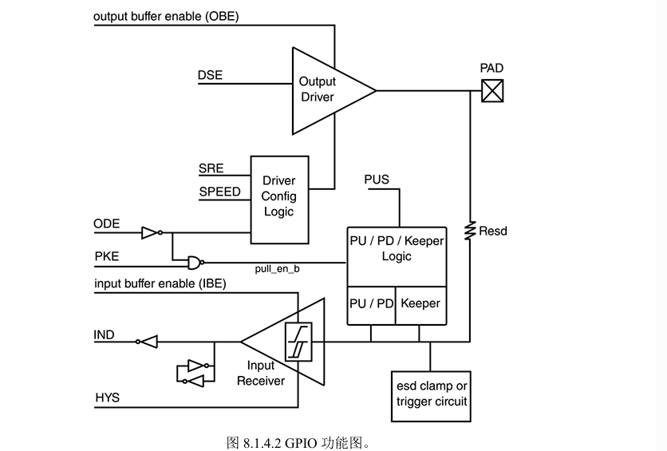

- HYS(bit16)
对应图中 HYS，用来使能迟滞比较器，当IO作为**输入功能**的时候有效，用于设置输入接收器的施密特触发器是否使能。如果需要对输入波形进行整形的话可以使能此位。此位为0的时候禁止迟滞比较器，为1的时候使能迟滞比较器。 

- PUS(bit15:14)
对应图中的 PUS，用来设置上下拉电阻的，一共有四种选项可以选择

| 位  | 含义     |
| --- | -------- |
| 00  | 100K下拉 |
| 01  | 47K上拉  |
| 10  | 100K上拉 |
| 11  | 22K上拉  |

- PUE(bit13)
图中没有给出来，当IO作为输入的时候，这个位用来设置IO使用上下拉还是状态保持器。
当为0的时候使用状态保持器，当为1的时候使用上下拉。
状态保持器在IO 作为输入的时候才有用，顾名思义，就是当外部电路断电以后此IO口可以保持住以前的状态

- PKE(bit12)
对应图中的PKE，此位用来使能或者禁止上下拉/状态保持器功能，为0 时禁止上下拉/状态保持器，为1时使能上下拉和状态保持器。 

- ODE(bit11)
对应图中的ODE，当 IO作为输出的时候，此位用来禁止或者使能开路输出，此位为0的时候禁止开路输出，当此位为1的时候就使能开路输出功能

- SPEED(bit7:6)
对应图中的SPEED，当 IO用作输出的时候，此位用来设置IO速度，设置如表所示：

| 位  | 含义         |
| --- | ------------ |
| 00  | 低速50M      |
| 01  | 中速100M     |
| 10  | 中速100M     |
| 11  | 最大速度200M |

- DSE(bit5:3)
对应图中的 DSE，当 IO 用作输出的时候用来设置 IO 的驱动能力，总共有8个可选选项，如表所示： 

| 位  |                          设置                           |
| --- | :-----------------------------------------------------: |
| 000 |                      输出驱动关闭                       |
| 001 | R0(3.3V 下 R0是260Ω，1.8V下R0是150Ω，接DDR的时候是240Ω) |
| 010 |                          R0/2                           |
| 011 |                          R0/3                           |
| 100 |                          R0/4                           |
| 101 |                          R0/5                           |
| 110 |                          R0/6                           |
| 111 |                          R0/7                           |

- SRE(bit0)
对应图中的 SRE，设置压摆率，当此位为0的时候是低压摆率，当为1的时候是高压摆率。
这里的压摆率就是IO电平跳变所需要的时间，比如从0到1需要多少时间，时间越小波形就越陡，说明压摆率越高；反之，时间越多波形就越缓，压摆率就越低。
如果你的产品要过EMC的话那就可以使用小的压摆率，因为波形缓和，如果你当前所使用的IO做高速通信的话就可以使用高压摆率。

总结：
寄存器 IOMUXC_SW_PAD_CTL_PAD_GPIO1_IO00 是用来配置GPIO1_IO00的，包括速度设置、驱动能力设置、压摆率设置等等
而IOMUXC_SW_MUX_CTL_PAD_GPIO1_IO00寄存器用来设置端口复用功能

#### 8.1.5 GPIO控制配置

IOMUXC_SW_MUX_CTL_PAD_XX_XX 和 IOMUXC_SW_PAD_CTL_PAD_XX_XX 这两种寄存器都是配置IO的，注意是IO！不是GPIO，GPIO是一个IO众多复用功能中的一种。
比如GPIO1_IO00这个 IO 可以复用为：I2C2_SCL、GPT1_CAPTURE1、ANATOP_OTG1_ID、ENET1_REF_CLK、MQS_RIGHT 、GPIO1_IO00 、ENET1_1588_EVENT0_IN 、SRC_SYSTEM_RESET 和 WDOG3_WDOG_B 这 9 个功能，GPIO1_IO00 是其中的一种，我们想要把GPIO1_IO00 用作哪个外设就复用为哪个外设功能即可。
但是，如果我们要用GPIO1_IO00来点个灯、作为按键输入啥的就是使用其GPIO(通用输入输出)的功能。将其复用为GPIO以后还需要对其GPIO的功能进行配置！


左下角的 IOMUXC 框图里面就有 SW_MUX_CTL_PAD_* 和 SW_PAD_CTL_PAD_*两种寄存器。这两种寄存器前面说了用来设置IO的复用功能和IO属性配置。
左上角部分的GPIO框图就是，当IO用作GPIO的时候需要设置的寄存器，一共有八个：DR、GDIR、PSR、ICR1、ICR2、EDGE_SEL、IMR 和 ISR。
前面我们说了 I.MX6U 一共有GPIO1~GPIO5 共五组GPIO，每组GPIO都有这8个寄存器.

寄存器介绍：

- DR寄存器


此寄存器是数据寄存器，是32位的，一个GPIO组最大只有32个IO，因此DR寄存器中的每个位都对应一个GPIO。
当GPIO被配置为输出功能以后，向指定的位写入数据那么相应的IO就会输出相应的高低电平，比如要设置GPIO1_IO00输出高电平，那么就应该设置GPIO1.DR=1。
当GPIO被设置为输入模式后，，此寄存器就保存着对应IO的电平值，每个位对对应一个GPIO，例如，当GPIO1_IO00这个引脚接地的话，那么GPIO1.DR的bit0就是0。 

- GDIR寄存器

方向寄存器，用来设置某个GPIO的工作方向的，即输入/输出

GDIR 寄存器也是32位的，此寄存器用来设置某个IO的工作方向，是输入还是输出。
同样的，每个IO对应一个位，如果要设置GPIO为输入的话就设置相应的位为0，如果要设置为输出的话就设置为1。

- PSR寄存器

GPIO状态寄存器


同样的PSR寄存器也是一个GPIO对应一个位，读取相应的位即可获取对应的GPIO的状态，也就是GPIO的高低电平值。功能和输入状态下的DR寄存器一样。

- ICR1/ICR2

中断控制寄存器，ICR1用于配置低16个GPIO，ICR2 用于配置高16个GPIO


ICR1 用于IO0~15的配置， ICR2用于IO16~31的配置。ICR1寄存器中一个GPIO用两个位，这两个位用来配置中断的触发方式，和 STM32 的中断很类似

| 位设置 | 触发方式   |
| ------ | ---------- |
| 00     | 低电平触发 |
| 01     | 高电平触发 |
| 10     | 上升沿触发 |
| 11     | 下降沿触发 |

以GPIO1_IO15为例，如果要设置GPIO1_IO15为上升沿触发中断，那么GPIO1.ICR1=2<<30

- IMR寄存器

中断屏蔽寄存器


IMR 寄存器也是一个GPIO对应一个位，IMR寄存器用来控制GPIO的中断禁止和使能，如果使能某个GPIO的中断，那么设置相应的位为1即可，反之，如果要禁止中断，那么就设置相应的位为0即可.

- ISR寄存器

中断状态寄存器

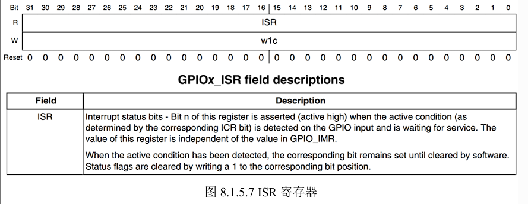

ISR 寄存器也是32位寄存器，一个GPIO对应一个位，只要某个GPIO的中断发生，那么ISR 中相应的位就会被置1。所以，我们可以通过读取ISR寄存器来判断GPIO中断是否发生，相当于ISR中的这些位就是中断标志位。

当我们处理完中断以后，必须清除中断标志位，清除方法就是向ISR中相应的位写1，也就是**写1清零**。(奇怪)

- EDGE_SEL寄存器
边沿选择寄存器


EDGE_SEL 寄存器用来设置边沿中断，这个寄存器会覆盖ICR1和ICR2的设置，同样是一个GPIO对应一个位。
如果相应的位被置1，那么就相当与设置了对应的GPIO是上升沿和下降沿(双边沿)触发。例如，我们设置GPIO1.EDGE_SEL=1，那么就表示GPIO1_IO01是双边沿触发中断，无论GFPIO1_CR1的设置为多少，都是双边沿触发。
此寄存器的设置会覆盖ICR1/ICR2的设置

#### 8.1.6 GPIO时钟使能

I.MX6U的GPIO是否需要使能时钟？
STM32的每个外设都有一个外设时钟，GPIO也不例外，要使用某个外设，必须要先使能对应的时钟。
I.MX6U其实也一样的，每个外设的时钟都可以独立的使能或禁止，这样可以关闭掉不使用的外设时钟，起到省电的目的。
I.MX6U 的系统时钟参考《I.MX6UL 参考手册》的第 18 章“Chapter 18: Clock Controller Module(CCM)”，这一章主要讲解 I.MX6U 的时钟系统，很复杂。

我们先不研究I.MX6U的时钟系统，我们只看一下 CCM 里面的外设时钟使能寄存器。
CMM 有CCM_CCGR0~CCM_CCGR6 这 7 个寄存器，这 7个寄存器控制着I.MX6U的所有外设时钟开关，我们以CCM_CCGR0 为例来看一下如何禁止或使能一个外设的时钟。

CCM(Clock Controller Module)


CCM_CCGR0 是个 32 位寄存器，其中每2位控制一个外设的时钟，比如bit31:30控制着GPIO2 的外设时钟，两个位就有4种操作方式.

| 位设置 | 时钟控制                                                           |
| ------ | ------------------------------------------------------------------ |
| 00     | 所有模式下关闭时钟                                                 |
| 01     | 只有在运行模式下打开外设时钟，等待模式和停止模式下均关闭外设时钟。 |
| 10     | 保留                                                               |
| 11     | 除了停止模式以外，其他所有模式下时钟都打开。                       |

如果我们要打开 GPIO2 的外设时钟，那么只需要设置CCM_CCGR0的bit31 和bit30 都为1即可，也就是CCM_CCGR0=3 << 30.
反之，如果要关闭GPIO2 的外设时钟，那就设置 CCM_CCGR0 的 bit31 和 bit30 都为 0 即可。

CCM_CCGR0~CCM_CCGR6 这 7 个寄存器操作都是类似的，只是不同的寄存器对应不同的外设时钟而已.

总结，使用I.MX6U的IO作为GPIO使用：

①、使能GPIO对应的时钟。 
②、设置寄存器IOMUXC_SW_MUX_CTL_PAD_XX_XX，设置IO的复用功能，使其复用为GPIO功能。 
③、设置寄存器IOMUXC_SW_PAD_CTL_PAD_XX_XX，设置IO的上下拉、速度等等。 
④、第②步已经将IO复用为了GPIO功能，所以需要配置GPIO，设置输入/输出、是否使用中断、默认输出电平等。 

### 8.2 硬件原理分析

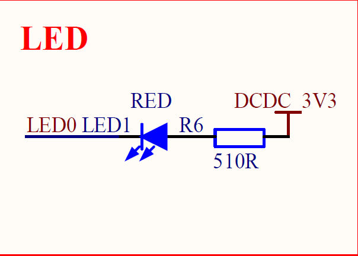

一端接3.3V电压，一端接LED0引脚，配以510Ω的限流电阻。

LED0最终接到GPIO_3上，GPIO_3就是GPIO1_IO03，当 GPIO1_IO03输出低电平(0)的时候发光二极管LED0就会导通点亮，当GPIO1_IO03输出高电平(1)的时候发光二极管LED0不会导通，因此LED0也就不会点亮。所以LED0的亮灭取决于GPIO1_IO03的输出电平，输出0就亮，输出1就灭。

### 8.3 实验程序编写

1、使能GPIO1时钟

GPIO1 的时钟由CCM_CCGR1的bit27和bit26这两个位控制，将这两个位都设置位11即可。
本教程所有例程已经将I.MX6U的所有外设时钟都已经打开了，因此这一步可以不用做。

2、设置GPIO1_IO03的复用功能 

找到GPIO1_IO03的复用寄存器“IOMUXC_SW_MUX_CTL_PAD_GPIO1_IO03”的地址为0X020E0068，然后设置此寄存器，将GPIO1_IO03 这个 IO 复用为GPIO功能，也就是ALT5。

3、配置GPIO1_IO03

找到GPIO1_IO03 的配置寄存器“IOMUXC_SW_PAD_CTL_PAD_GPIO1_IO03”的地址为0X020E02F4，根据实际使用情况，配置此寄存器。(配置IO)

4、设置GPIO

找到GPIO3对应的GPIO组寄存器地址，在《IMX6ULL参考手册》的1357页


本实验中GPIO1_IO03是作为输出功能的，因此GPIO1_GDIR的bit3要设置为1，表示输出。 

5、控制GPIO的输出电平 

只需要向GPIO1_DR寄存器的bit3写入0即可控制GPIO1_IO03输出低电平，打开LED，向bit3写入1可控制GPIO1_IO03输出高电平，关闭LED。

所有的裸机实验我们都在Ubuntu下完成，使用VSCode编辑器！ 

新建一个名为“1_leds”的文件夹，然后在“1_leds”这个目录下新建一个名为“led.s”的汇编文件和一个名为“.vscode”的目录，创建好以后“1_leds”用code打开。

.vscode 文件夹里面存放 VSCode 的工程文件，led.s 就是我们新建的汇编文件

代码分析：
第2行定义了一个全局标号_start，代码就是从_start这个标号开始顺序往下执行的。
接下来就是_start标号的内容

第 11 行使用 ldr 指令向寄存器 r0 写入 0X020C4068，也就是 r0=0X020C4068，这个是CCM_CCGR0寄存器的地址

第12 行使用ldr指令向寄存器r1写入0XFFFFFFFF，也就是r1=0XFFFFFFFF。因为我们要开启所有的外设时钟，因此CCM_CCGR0~CCM_CCGR6所有寄存器的32位都要置1，也就是写入0XFFFFFFFF

第13行使用str将r1中的值写入到r0所保存的地址中去，也就是给0X020C4068这个地址写入0XFFFFFFFF，相当于CCM_CCGR0=0XFFFFFFFF，就是打开 CCM_CCGR0 寄存器所控制的所有外设时钟

第15~31 行都是向CCM_CCGRX(X=1~6)寄存器写入0XFFFFFFFF。这样我就通过汇编代码使能了I.MX6U的所有外设时钟

第35~37行是设置GPIO1_IO03的复用功能，GPIO1_IO03的复用寄存器地址为0X020E0068,寄存器 IOMUXC_SW_MUX_CTL_PAD_GPIO1_IO03 的 MUX_MODE 设置为 5 就是将GPIO1_IO03 设置为GPIO。 

第 49~51 行 是 设 置 GPIO1_IO03 的 配 置 寄 存 器 ， 也 就 是 寄 存 器IOMUX_SW_PAD_CTL_PAD_GPIO1_IO03 的值，此寄存器地址为0X020E02F4，代码里面已经给出了这个寄存器详细的位设置。 

第54~63行是设置GPIO功能，经过上面几步操作，GPIO1_IO03这个IO已经被配置为了GPIO 功能，所以还需要设置跟GPIO有关的寄存器。第54~56行是设置GPIO1->GDIR寄存器，将GPIO1_IO03设置为输出模式，也就是寄存器的GPIO1_GDIR的bit3置1。

第61~63 行设置 GPIO1->DR 寄存器，也就是设置GPIO1_IO03 的输出，我们要点亮开发板上的LED0，那么GPIO1_IO03就必须输出低电平，所以这里设置GPIO1_DR寄存器为0。

第68~69 行是死循环，通过b指令，CPU重复不断的跳到loop函数执行，进入一个死循
环。

code
```c
.global _start  /* 全局标号 程序入口*/
/*
 * 描述：	_start函数，程序从此函数开始执行此函数完成时钟使能、
 *		  GPIO初始化、最终控制GPIO输出低电平来点亮LED灯。
 */

_start:
    /* 1、使能所有时钟 */
    ldr r0, =0X020C4068 	/* CCGR0 */
    ldr r1, =0XFFFFFFFF  
    str r1, [r0]		

    ldr r0, =0X020C406C  	/* CCGR1 */
    str r1, [r0]    
    ldr r0, =0X020C4070  	/* CCGR2 */
    str r1, [r0]

    ldr r0, =0X020C4074  	/* CCGR3 */
    str r1, [r0]

    ldr r0, =0X020C4078  	/* CCGR4 */
    str r1, [r0]

    ldr r0, =0X020C407C  	/* CCGR5 */
    str r1, [r0]

    ldr r0, =0X020C4080  	/* CCGR6 */
    str r1, [r0]

    /* 2、设置GPIO1_IO03复用为GPIO1_IO03 */ 
    ldr r0, =0X020E0068	/* 将寄存器SW_MUX_GPIO1_IO03_BASE加载到r0中 */
    ldr r1, =0X5		/* 设置寄存器SW_MUX_GPIO1_IO03_BASE的MUX_MODE为5 */
    str r1,[r0]

    /* 3、配置GPIO1_IO03的IO属性	
    *bit 16:0 HYS关闭
    *bit [15:14]: 00 默认下拉
    *bit [13]: 0 kepper功能
    *bit [12]: 1 pull/keeper使能
    *bit [11]: 0 关闭开路输出
    *bit [7:6]: 10 速度100Mhz
    *bit [5:3]: 110 R0/6驱动能力
    *bit [0]: 0 低转换率
    */
    
    ldr r0, =0X020E02F4	/*寄存器SW_PAD_GPIO1_IO03_BASE */
    ldr r1, =0X10B0
    str r1,[r0]

    /* 4、设置GPIO1_IO03为输出 */
    ldr r0, =0X0209C004	/*寄存器GPIO1_GDIR */
    ldr r1, =0X0000008		
    str r1,[r0]

    /* 5、打开LED0
     * 设置GPIO1_IO03输出低电平
     */
    ldr r0, =0X0209C000	/*寄存器GPIO1_DR */
    ldr r1, =0		
    str r1,[r0]

/*
 * 描述：	loop死循环
 */
loop:
	b loop 				
```

### 8.4 编译下载执行

#### 8.4.1 编译代码

**1、arm-linux-gnueabihf-gcc 编译文件**

我们是要编译出在ARM开发板上运行的可执行文件，所以要使用我们在4.3小节安装的交叉编译器arm-linux-gnueabihf-gcc 来编译。
`arm-linux-gnueabihf-gcc -g -c led.s -o led.o`
上述命令就是将led.s编译为led.o，其中“-g”选项是产生调试信息，GDB能够使用这些调试信息进行代码调试.
“-c”选项是编译源文件，但是不链接。
“-o”选项是指定编译产生的文件名字，这里我们指定 led.s 编译完成以后的文件名字为 led.o。


led.o 文件并不是我们可以下载到开发板中运行的文件，一个工程中所有的C文件和汇编文件都会编译生成一个对应的.o文件，我们需要将这.o文件链接起来组合成可执行文件。

**2. arm-linux-gnueabihf-ld 链接文件**

arm-linux-gnueabihf-ld 用来将众多的.o 文件链接到一个指定的链接位置。
我们在学习SMT32 的时候基本就没有听过“链接”这个词，我们一般用MDK编写好代码，然后点击“编译”，MDK或者IAR就会自动帮我们编译好整个工程，最后再点击“下载”就可以将代码下载到开发板中。
这是因为链接这个操作MDK或者IAR已经帮你做好了，后面我就以MDK为例给大家讲解。

大家可以打开一个STM32的工程，然后编译一下，肯定能找到很多.o文件,这些.o 文件肯定会被MDK链接到某个地址去，如果使用MDK开发STM32的话肯定对下图所示界面很熟悉：

左侧的IROM1我们都知道是设置STM32芯片的ROM起始地址和大小的
右边的IRAM1是设置STM32芯片的RAM起始地址和大小的
其中0X08000000就是STM32内部 ROM 的起始地址，编译出来的指令肯定是要从 0X08000000 这个地址开始存放的。
对于STM32 来说0X08000000就是它的链接地址，这些.o文件就是这个链接地址开始依次存放，最终生成一个可以下载的hex或者bin文件。
我们可以打开.map文件查看一下这些文件的链接地址。


图中的.map 文件就详细的描述了各个.o文件都是链接到了什么地址.

我们用MDK开发STM32的时候也是有链接的，只是这些工作MDK都帮我们全部做好了，我们不用关心而已。但是我们在Linux下用交叉编译器开发ARM的是时候就需要自己处理这些了。

因此我们现在需要做的就是确定一下本试验最终的可执行文件其运行起始地址，也就是链接地址。
这里我们要区分“存储地址”和“运行地址”这两个概念，“存储地址”就是可执行文件存储在哪里，可执行文件的存储地址可以随意选择。
“运行地址”就是代码运行的时候所处的地址，这个我们在链接的时候就已经确定好了，代码要运行，那就必须处于运行地址处，否则代码肯定运行出错。

比如I.MX6U支持SD卡、EMMC、NAND启动，因此代码可以存储到SD卡、EMMC或者NAND中，但是要运行的话就必须将代码从SD卡、EMMC或者NAND中拷贝到其运行地址(链接地址)处，“存储地址”和“运行地址”可以一样，比如STM32 的存储起始地址和运行起始地址都是0X08000000。 

本教程所有的裸机例程都是烧写到SD卡中，上电以后I.MX6U的内部boot rom程序会将可执行文件拷贝到链接地址处，这个链接地址可以在 I.MX6U 的内部 128KB RAM 中(0X900000~0X91FFFF)，也可以在外部的 DDR 中。
本教程所有裸机例程的链接地址都在DDR中，链接起始地址为 0X87800000。

I.MX6U-ALPHA 开发板的 DDR 容量有两种：512MB 和256MB，起始地址都为0X80000000，只不过512MB的终止地址为0X9FFFFFFF，而 256MB容量的终止地址为0X8FFFFFFF。
之所以选择 0X87800000 这个地址是因为后面要讲的 Uboot 其链接地址就是0X87800000，这样我们统一使用0X87800000这个链接地址，不容易记混。 

执行如下命令：
`arm-linux-gnueabihf-ld -Ttext 0X87800000 led.o -o led.elf`
-Ttext就是指定链接地址，“-o”选项指定链接生成的elf文件名，这里我们命名为led.elf


led.elf 文件也不是我们最终烧写到SD卡中的可执行文件，我们要烧写的.bin文件，因此还需要将led.elf 文件转换为.bin文件，这里我们就需要用到arm-linux-gnueabihf-objcopy这个工具了。

**3. arm-linux-gnueabihf-objcopy 格式转换**

arm-linux-gnueabihf-objcopy 更像一个格式转换工具，我们需要用它将 led.elf 文件转换为led.bin 文件，命令如下：
`arm-linux-gnueabihf-objcopy -O binary -S -g led.elf led.bin`
“-O”选项指定以什么格式输出
后面的“binary”表示以二进制格式输出
选项“-S”表示不要复制源文件中的重定位信息和符号信息
“-g”表示不复制源文件中的调试信息


至此我们终于等到了想要的东西—led.bin文件

补充：elf与bin

    BIN文件是直接的二进制文件，内部没有地址标记。
    bin文件内部数据按照代码段或者数据段的物理空间地址来排列。一般用编程器烧写时从00开始，而如果下载运行，则下载到编译时的地址即可。

    在 Linux OS上，为了运行可执行文件，他们是遵循ELF格式的，通常gcc -o test test.c，生成的test文件就是ELF格式的，这样就可以运行了，执行elf文件，则内核会使用加载器来解析elf文件并执行。
即bin是纯二进制文件

**4. arm-linux-gnueabihf-objdump 反汇编**

大多数情况下我们都是用 C 语言写试验例程的，有时候需要查看其汇编代码来调试代码，因此就需要进行反汇编，一般可以将elf文件反汇编，比如如下命令：
`arm-linux-gnueabihf-objdump -D led.elf  >  led.dis`
上述代码中的“-D”选项表示反汇编所有的段，反汇编完成以后就会在当前目录下出现一个名为led.dis 文件


查看汇编代码


可以看出 led.dis 里面是汇编代码，而且还可以看到内存分配情况。

在0X87800000 处就是全局标号_start，也就是程序开始的地方。通过 led.dis 这个反汇编文件可以明显的看出我们的代码已经链接到了以0X87800000为起始地址的区域。

总结一下我们为了编译ARM开发板上运行的led.o这个文件使用了如下命令:
1. arm-linux-gnueabihf-gcc -g -c led.s -o led.o 
2. arm-linux-gnueabihf-ld -Ttext 0X87800000 led.o -o led.elf 
3. arm-linux-gnueabihf-objcopy -O binary -S -g led.elf led.bin 
4. arm-linux-gnueabihf-objdump -D led.elf  >  led.dis 

#### 8.4.2 Makefile文件

构建Makefile文件:
```makefile
led.bin:led.s 
    arm-linux-gnueabihf-gcc -g -c led.s -o led.o 
    arm-linux-gnueabihf-ld -Ttext 0X87800000 led.o -o led.elf 
    arm-linux-gnueabihf-objcopy -O binary -S -g led.elf led.bin 
    arm-linux-gnueabihf-objdump -D led.elf > led.dis 
clean: 
    -rm -rf *.o led.bin led.elf led.dis
```


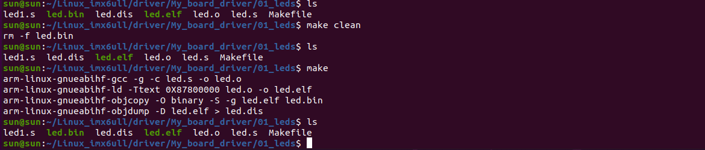

至此，有关代码编译、arm-linux-gnueabihf交叉编译器的使用就到这里了，我们接下来讲解如何将led.bin烧写到SD卡中.

#### 8.4.3 代码烧写

我们学习STM32 等其他的单片机的时候，编译完代码以后可以直接通过 MDK 或者 IAR下载到内部的flash中。
但是I.MX6U 虽然内部有96K的ROM，但是这96K的ROM是NXP自己用的，不向用户开放。
所以相当于说I.MX6U是没有内部flash的，但是我们的代码得有地方存放啊，为此，I.MX6U支持从外置的NOR Flash、NAND Flash、SD/EMMC、SPI NOR Flash和QSPI Flash 这些存储介质中启动，所以我们可以将代码烧写到这些存储介质中中。

在这些存储介质中，除了SD卡以外，其他的一般都是焊接到了板子上的，我们没法直接烧写。但是SD卡是活动的，是可以从板子上插拔的，我们可以将SD卡插到电脑上，在电脑上使用软件将.bin文件烧写到SD 卡中，然后再插到板子上就可以了。

其他的几种存储介质是我们量产的时候用到的，量产的时候代码就不可能放到SD卡里面了，毕竟SD是活动的，不牢固，而其他的都是焊接到板子上的，很牢固。

因此，我们在调试裸机和Uboot的时候是将代码下载到SD中，因为方便嘛，当调试完成以后量产的时候要将裸机或者Uboot烧写到SPI NOR Flash、EMMC、NAND等这些存储介质中的。

那么，如何将我们前面编译出来的led.bin烧写到SD卡中呢？肯定有人会认为直接复制led.bin 到 SD 卡中不就行了，错！编译出来的可执行文件是怎么存放到SD中的，存放的位置是什么？这个NXP是有详细规定的！我们必须按照NXP的规定来将代码烧写到SD卡中，否则代码是绝对运行不起来的。

《IMX6UL参考手册》的第8章“Chapter 8 System Boot”就是专门讲解I.MX6U启动的，我们下一章会详细的讲解I.MX6U启动方式的。 

正点原子专门编写了一个软件来将编译出来的.bin 文件烧写到 SD 卡中，这个软件叫做“imxdownload”，软件我们已经放到了开发板光盘中，imxdownlaod 只能在Ubuntu下使用。

**1. 将imxdownload 拷贝到工程根目录下**

就是和led.bin处于同一个文件夹下


**2. 给予imxdownload可执行权限**

`chmod +x imxdownload`

**3. 确定要烧写的SD卡**

准备一张新的SD(TF)卡，确保SD卡里面没有数据，因为我们在烧写代码的时候可能会格
式化SD卡！！！

Ubuntu 下所有的设备文件都在目录“/dev”里面，所以插上SD卡以后也会出现在“/dev”
里面，其中存储设备都是以“/dev/sd”开头的。我们要先看一下不插SD卡的时候电脑都有哪些存储设备，以防插入SD卡以后分不清谁是谁.

`ls /dev/sd* `


从图中可以看到当前电脑有/dev/sda、/dev/sda1、/dev/sda2 和/dev/sda5 这5 个存储设备，使用读卡器将SD 卡插到电脑，一定要确保SD卡是挂载到了Ubuntu 系统中，而不是 Windows下。

倘若挂载到了Windows下,

在配置即可

插入读卡器，我的电脑多出了/dev/sdb、/dev/sdc、/dev/sdd、/dev/sdd1、/dev/sda和/dev/sdf 这 6 个存储设备。这是因为我的读卡器是多合一读卡器，所以会多出来这么多。

那这6个存储设备哪个才是我的SD卡呢？/dev/sdd和/dev/sdd1是我的SD卡，为什么呢？因为只有/dev/sdd有个对应的/dev/sdd1，/dev/sdd 是我的SD卡，/dev/sdd1 是 SD卡的第一个分区。

**4. 向SD卡烧写bin文件**

使用imxdownload 向SD卡烧写led.bin文件，命令格式如下：
`./imxdownload  <.bin file>  <SD Card> `

其中.bin 就是要烧写的.bin文件，SD Card就是你要烧写的SD卡，比如我的电脑使用如下命令烧写led.bin到/dev/sdd 中

`./imxdownload led.bin /dev/sdd//不能烧写到/dev/sda 或sda1 设备里面！那是系统磁盘`

烧写的过程中可能会让你输入密码，输入你的 Ubuntu 密码即可完成烧写.

烧写的最后一行会显示烧写大小、用时和速度，比如led.bin烧写到SD卡中的大小是3.2KB，用时0.0160821s，烧写速度是201KB/s。
注意这个烧写速度，如果这个烧写速度在几百KB/s以下那么就是正常烧写。 
<span style="color:red;">如果这个烧写速度大于几十MB/s、甚至几百MB/s那么肯定是烧写失败了！</span>

解决方法就是重新插拔SD卡，一般出现这种情况，重新插拔SD卡基本没啥用，只有重启Ubuntu，至于原因，我也不清楚.

烧写完成以后会在当前工程目录下生成一个load.imx的文件.
load.imx 这个文件就是软件imxdownload根据NXP官方启动方式介绍的内容，在led.bin文件前面添加了一些数据头以后生成的。最终烧写到SD卡里面的就是这个load.imx文件，而非led.bin。

#### 8.4.4 代码验证

代码已经烧写到了SD卡中了，接下来就是将SD卡插到开发板的SD卡槽中，然后设置拨码开关为SD卡启动，拨码开关设置

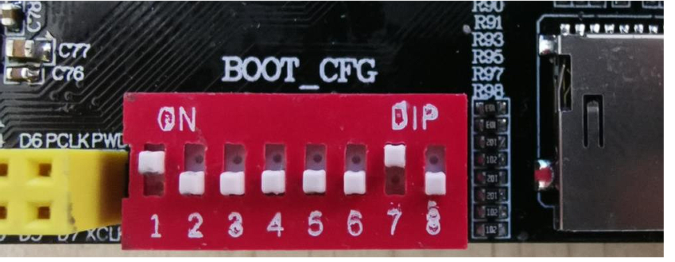

设置好以后按一下开发板的复位键，如果代码运行正常的话LED0就会被点亮.

可能 LED0 之前会有一点微亮，那是因为I.MX6U的IO默认电平可能让LED0导通了，但是IO的默认配置内部可能有很大的电阻，所以电流就很小，导致LED0微亮。但是我们自己编写代码、配置好IO以后就不会有这个问题，LED0就很亮了。 

自此第一个程序就编写完成了


## 第九章 I.MX6U的启动方式详解

I.MX6U 支持多种启动方式以及启动设备，比如可以从SD/EMMC、NAND Flash、QSPI Flash等启动。用户可以根据实际情况，选择合适的启动设备。

不同的启动方式其启动方式和启动要求也不一样，比如上一章中的从SD卡启动就需要在bin文件前面添加一个数据头，其它的启动设备也是需要这个数据头的。

本章我们就来学习一下I.MX6U的启动方式，以及不同设备启动的要求。

### 9.1 启动方式选择

BOOT的处理过程是发生在I.MX6U芯片上电以后，芯片会根据BOOT_MODE[1:0]的设置来选择BOOT方式。
BOOT_MODE[1:0]的值是可以改变的，有两种方式，一种是改写eFUSE(熔丝)，一种是修改相应的GPIO高低电平。

第一种修改eFUSE的方式只能修改一次，后面就不能再修改了，所以我们不使用。我们使用的是通过修改BOOT_MODE[1:0]对应的GPIO高低电平来选择启动方式，所有的开发板都使用的这种方式，I.MX6U 有一个 BOOT_MODE1 引脚和BOOT_MODE0 引脚，这两个引脚对应这 BOOT_MODE[1:0]。

引脚原理图：

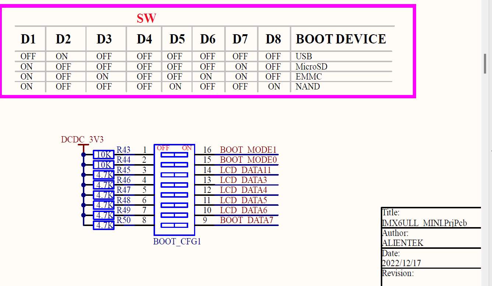

其中BOOT_MODE1和BOOT_MODE0在芯片内部是有100KΩ下拉电阻的，所以默认是0。
BOOT_MODE1 和 BOOT_MODE0 这两个引脚我们也接到了底板的拨码开关上，这样我们就可以通过拨码开关来控制BOOT_MODE1和BOOT_MODE0的高低电平。

以BOOT_MODE1为例，当我们把BOOT_CFG的第一个开关拨到“ON”的时候，就相当于BOOT_MODE1引脚通过R88这个10K电阻接到了3.3V电源，芯片内部的BOOT_MODE1又是100K下拉电阻接地，因此此时 BOOT_MODE1 的电压就是 100/(10+100)*3.3V= 3V，这是个高电平，因此BOOT_CFG 的中的8个开关拨到“ON”就是高电平，拨到“OFF”就是低电平。（电压型器件，引脚处没有电流流入）

图解：

而I.MX6U 有四个BOOT模式，这四个BOOT模式由BOOT_MODE[1:0]来控制，也就是BOOT_MODE1和BOOT_MODE0这两IO

| BOOT_MODE[1:0] | BOOT类型     |
| -------------- | ------------ |
| 00             | 从FUSE启动   |
| 01             | 串行下载     |
| 10             | 内部BOOT模式 |
| 11             | 保留         |

我们使用的只有第二种第三种BOOT方式

#### 9.1.1 串行下载(向Flash中下载程序)->Boot ROM中的下载模式

串口下载模式中，Bootloader 通常是从外部主机通过串行接口（如 UART）加载的

    进入下载模式：当系统检测到串口下载模式被激活（通常通过特定的引脚状态或配置），Boot ROM 会进入下载模式。
    等待下载命令：在下载模式下，Boot ROM 会通过串行接口等待来自主机的下载命令。
    接收 Bootloader：主机通过串行接口发送 Bootloader 镜像文件到设备。Boot ROM 接收并将其写入设备的闪存中。
    验证和启动：一旦 Bootloader 镜像文件下载完成并验证无误，Boot ROM 会将控制权交给新的 Bootloader，启动 Bootloader 进行进一步的系统初始化和操作系统加载。

当BOOT_MODE1 为0，BOOT_MODE0为1的时候此模式使能。
串行下载的意思就是可以通过USB或者UART将代码下载到板子上的外置存储设备中，我们可以使用OTG1这个USB口向开发板上的 SD/EMMC、NAND 等存储设备下载代码。

补充USB_TTL与USB_OTG:

    USB_TTL 和 USB_OTG 是两种不同的技术，主要区别在于它们的用途和功能：
  
    USB_OTG (On-The-Go)：
    功能：允许设备在主机和从机之间切换角色。这意味着支持 OTG 的设备可以直接与其他 USB 设备（如 USB 闪存驱动器、键盘或鼠标）进行通信，而无需通过计算机。
    应用：常用于智能手机和平板电脑，使它们能够直接读取和写入 USB 存储设备，或连接其他外设。
  
    USB_TTL (Transistor-Transistor Logic)：
    功能：是一种电平标准，用于描述数字电路中的信号电平1。在 USB 通信中，TTL 级别通常指的是 UART（通用异步收发传输）信号电平，用于串行通信。
    应用：常用于嵌入式系统和微控制器之间的串行通信。TTL 信号电平通常为 0V 和 5V 或 3.3V。
  
    总结来说，USB_OTG 是一种 USB 标准，允许设备在主机和从机之间切换角色，而 USB_TTL 是一种电平标准，用于描述数字电路中的信号电平，常用于串行通信中的 UART 信号

我们需要将 BOOT_MODE1 拨到“OFF”，将BOOT_MODE0拨到“ON”。这个下载是需要用到NXP提供的一个软件，一般用来最终量产的时候将代码烧写到外置存储设备中的，我们后面讲解如何使用。

#### 9.1.2 内部BOOT模式

当BOOT_MODE1为1，BOOT_MODE0为0的时候此模式使能。

在此模式下，芯片会执行内部的boot ROM代码，这段boot ROM代码会进行硬件初始化(一部分外设<span style="color:red"><u>计算机中的自检程序</u></span>)，然后从boot设备(就是存放代码的设备、比如SD/EMMC、NAND)中将代码拷贝出来复制到指定的 RAM 中，一般是DDR。

### 9.2 BOOT ROM初始化内容

当我们设置BOOT模式为“内部BOOT模式”以后，I.MX6U内部的boot ROM代码就会
执行(<span style="color:red"><u>BIOS</u></span>)，这个boot ROM代码都会做什么处理呢？首先肯定是初始化时钟，boot ROM设置的系统时钟如图所示

PLL 是 “Phase-Locked Loop”（锁相环）的缩写。
锁相环是一种控制系统，它生成一个输出信号，其相位与输入信号的相位相关。
具体来说，PLL 会调整输出信号的频率和相位，使其与输入信号保持同步。

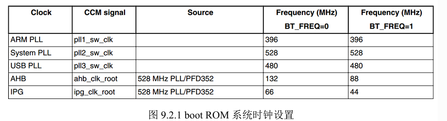

在图中 BT_FREQ 模式为0，可以看到，boot ROM会将I.MX6U的内核时钟设置为396MHz，也就是主频为396Mhz。System PLL=528Mhz，USB PLL=480MHz，AHB=132MHz，IPG=66MHz。
关于I.MX6U的系统时钟，我们后面会详细讲解

内部boot ROM为了加快执行速度会打开MMU和Cache，下载镜像的时候L1 ICache会打开，验证镜像的时候L1 DCache、L2 Cache和MMU都会打开。
一旦镜像验证完成，boot ROM就会关闭L1 DCache、L2 Cache和MMU。

解释：

    内部的boot ROM 下载镜像是为了初始化和启动系统。
    具体来说，boot ROM 的主要职责包括：

    硬件初始化：在系统启动时，boot ROM 会执行基本的硬件初始化，确保所有必要的硬件组件（如内存、处理器等）都处于可用状态。
    加载引导加载程序：boot ROM 会从预定义的存储位置（如闪存或外部存储设备）下载引导加载程序镜像。这个引导加载程序包含了启动操作系统所需的代码和数据。
    验证镜像：为了确保系统的安全性和完整性，boot ROM 会验证下载的镜像文件。这通常包括校验和验证，以确保镜像没有被篡改。
    启动操作系统：一旦镜像验证完成，boot ROM 会将控制权交给引导加载程序，引导加载程序随后会加载并启动操作系统。

    通过这些步骤，boot ROM 确保系统能够从一个已知的、可信的状态启动，并为操作系统的加载和运行做好准备

    注意：
    裸机开发中，boot ROM 启动时通常也需要下载镜像。
    这是因为裸机开发（Bare Metal Development）指的是在没有操作系统的情况下直接在硬件上运行代码。
    即使没有操作系统，系统仍然需要一个引导加载程序或初始代码来启动和运行应用程序。
    在 i.MX6ULL 处理器中，boot ROM 会根据配置从不同的存储设备（如 SD 卡、eMMC、NAND Flash 等）加载镜像，并将其复制到内存中执行。这些存储设备中的镜像文件通常包含引导加载程序或应用程序代码，boot ROM 会将其加载到内存中并执行，以启动系统。

中断向量偏移会被设置到boot ROM的起始位置，当boot ROM启动了用户代码以后就可以重新设置中断向量偏移了。一般是重新设置到我们用户代码的开始地方，关于中断的内容后面会详细讲解。

解释：

    中断向量偏移：中断向量表是一个存储中断服务程序（ISR）入口地址的表。系统启动时，中断向量表的偏移地址通常被设置为 boot ROM 的起始位置。这样，当发生中断时，处理器能够正确地跳转到 boot ROM 中的中断处理程序。
    
    启动用户代码：当 boot ROM 完成了初始化和加载用户代码（如引导加载程序或应用程序）后，系统会将控制权交给用户代码。
    
    重新设置中断向量偏移：一旦用户代码开始运行，它可以重新设置中断向量表的偏移地址，以指向新的中断服务程序。这通常是因为用户代码可能需要自定义的中断处理逻辑，而不是使用 boot ROM 中的默认处理程序

补充:

    Boot ROM（启动只读存储器）是嵌入在处理器芯片内的一小块只读存储器（ROM）或写保护闪存。
    它包含处理器在上电或复位时执行的第一个代码。
    Boot ROM 的主要职责包括：

    硬件初始化：在系统启动时，Boot ROM 会执行基本的硬件初始化，确保所有必要
    的硬件组件（如内存、处理器等）都处于可用状态。
    
    加载引导加载程序：Boot ROM 会从预定义的存储位置（如闪存、SD 卡或 USB 设备）下载引导加载程序或操作系统镜像。
    
    验证镜像：为了确保系统的安全性和完整性，Boot ROM 会验证下载的镜像文件。
    
    启动用户代码：一旦镜像验证完成，Boot ROM 会将控制权交给引导加载程序或直接启动应用程序。
    Boot ROM 是系统启动过程中的关键组件，确保系统能够从一个已知的、可信的状态启动，并为操作系统的加载和运行做好准备。

    与BIOS类似，BootROM是集成在嵌入式芯片内部的

    注意区分BootROM与Bootloader：

    Boot ROM：
    存储位置：嵌入在处理器芯片内的一小块只读存储器（ROM）或写保护闪存1。
    功能：负责系统上电或复位时的初始硬件初始化和加载引导加载程序（Bootloader）。它包含了启动系统所需的最基本代码。
    不可修改：由于是只读存储器，Boot ROM 的内容在芯片制造时就已经确定，通常无法修改。
    
    Bootloader：
    存储位置：存储在可写存储器中，如闪存、SD 卡或 eMMC。
    功能：在 Boot ROM 完成初始硬件初始化后，Bootloader 负责进一步初始化硬件、加载操作系统内核，并完成系统配置。它可以执行更多复杂的任务，如内存初始化、设备驱动加载等。
    可修改：Bootloader 是可编程的，可以根据需要进行修改和更新2。
    
    总结来说，Boot ROM 是系统启动的第一步，负责最基本的硬件初始化与加载Bootloader。

### 9.3 启动设备

当BOOT_MODE设置为内部BOOT模式以后，可以从以下设备中启动： 

①、接到EIM接口的CS0上的16位NOR Flash。 
②、接到EIM接口的CS0上的OneNAND Flash。 
③、接到GPMI接口上的MLC/SLC NAND Flash，NAND Flash页大小支持2KByte、4KByte和8KByte，8位宽。 
④、Quad SPI Flash。 
⑤、接到USDHC接口上的SD/MMC/eSD/SDXC/eMMC等设备。 
⑥、SPI接口的EEPROM。 

这些启动设备如何选择呢？I.MX6U同样提供了eFUSE和GPIO配置两种，eFUSE就不讲解了。我们重点看如何通过GPIO来选择启动设备，因为所有的I.MX6U开发板都是通过GPIO来配置启动设备的。

正如启动模式由 BOOT_MODE[1:0]来选择一样，启动设备是通过BOOT_CFG1[7:0]、BOOT_CFG2[7:0]和 BOOT_CFG4[7:0]这 24 个配置 IO。
这 24 个配置 IO刚好对应着LCD的24根数据线LCD_DATA0~LCDDATA23，当启动完成以后这24个IO就可以作为LCD 的数据线使用。
这24根线和BOOT_MODE1、BOOT_MODE0共同组成了I.MX6U的启动选择引脚。

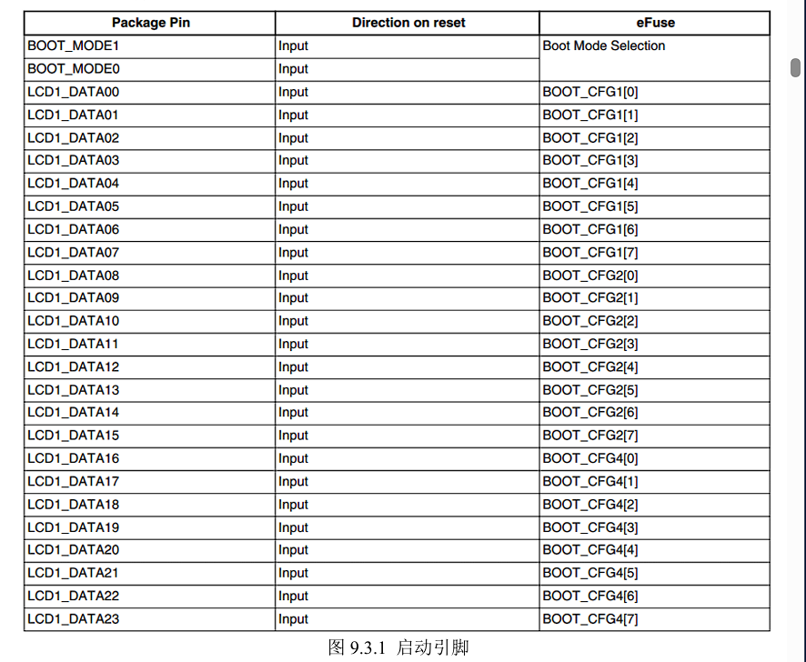

通过图中的 26 个启动IO 即可实现I.MX6U从不同的设备启动，BOOT_MODE1和
OOT_MODE0已经讲过了。
看到这24个IO是不是头大？调整这24个IO的高低电平得多复杂啊？其实不然，虽然有24个IO，但是实际需要调整的只有那几个IO，其它的IO全部下拉接地即可，也就是设置为0。

打开I.MX6U-ALPHA开发板的核心板原理图，这24个IO的默认设置如图

BOOT CFG --> boot config

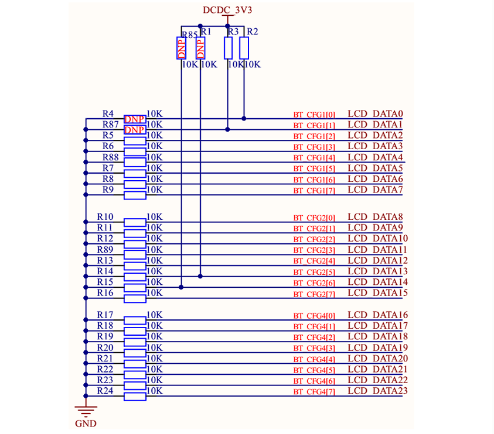

大部分的IO都接地了，只有几个IO接高，尤其是BOOT_CFG4[7:0]这8个IO都10K电阻下拉接地，所以我们压根就不需要去关注BOOT_CFG4[7:0]。
我们需要重点关注的就只剩下了BOOT_CFG2[7:0]和BOOT_CFG1[7:0]这 16 个 IO。

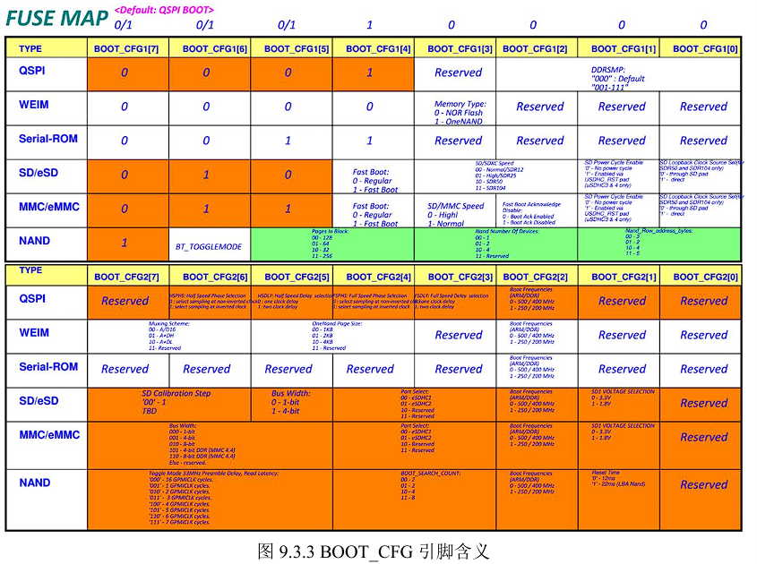

最终我们接到开发板上的启动方式只有如下几种：

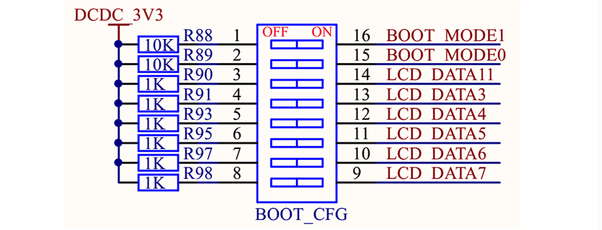

我们可以通过拨码开关设置对应的高低电平。
配置映射图如下：

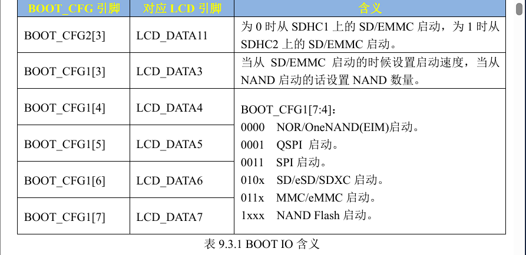

最终各个开关的设置如下：


我们在“第八章 汇编LED灯试验”中，最终的可执行文件led.bin烧写到了SD卡里面，然后开发板从SD卡启动，其拨码开关就是根据表来设置的，通过上面的讲解就知道为什么拨码开关要这么设置了。

"SD卡启动0100"疑惑？

### 9.4 镜像烧写

前面我们设置好BOOT以后就能从指定的设备启动了，但是你的设备里面得有代码啊，在第八章中我们使用imxdownload这个软件将led.bin烧写到了SD卡中。
imxdownload会在led.bin前面添加一些头信息，重新生成一个叫做load.imx的文件，最终实际烧写的是laod.imx。那么肯定就有人问：imxdownload 究竟做了什么？load.imx 和 led.bin 究竟是什么关系？
本节我们就来详细的讲解一下imxdownload是如何将led.bin打包成load.imx的。

学习STM32的时候我们可以直接将编译生成的.bin文件烧写到STM32内部flash里面，但是I.MX6U 不能直接烧写编译生成的.bin 文件，我们需要在.bin 文件前面添加一些头信息构成满足I.MX6U需求的最终可烧写文件。

I.MX6U的最终可烧写文件组成如下：

①、Image vector table，简称 IVT，IVT 里面包含了一系列的地址信息，这些地址信息在ROM中按照固定的地址存放着。
②、Boot data，启动数据，包含了镜像要拷贝到哪个地址，拷贝的大小是多少等等。
③、Device configuration data，简称 DCD，设备配置信息，重点是DDR3的初始化配置。
④、用户代码可执行文件，比如led.bin。

可以看出最终烧写到I.MX6U中的程序其组成为：IVT+Boot data+DCD+.bin。所以第八章中的imxdownload 所生成的 load.imx 就是在 led.bin 前面加上 IVT+Boot data+DCD。
内部 Boot ROM会将load.imx 拷贝到DDR中，用户代码是要一定要从0X87800000这个地方开始的，因为链接地址为0X87800000，load.imx 在用户代码前面又有 3KByte 的 IVT+Boot Data+DCD 数据，下面会讲为什么是 3KByte，因此 load.imx 在 DDR 中的起始地址就是 0X87800000-3072=0X877FF400

#### 9.4.1 IVT和BOOT Data数据

load.imx 最前面的就是IVT和Boot Data，IVT 包含了镜像程序的入口点、指向DCD的指针和一些用作其它用途的指针。
内部Boot ROM要求IVT应该放到指定的位置，不同的启动设备位置不同，而IVT在整个load.imx的最前面，其实就相当于要求load.imx在烧写的时候应该烧写到存储设备的指定位置去。
整个位置都是相对于存储设备的起始地址的偏移如下图：

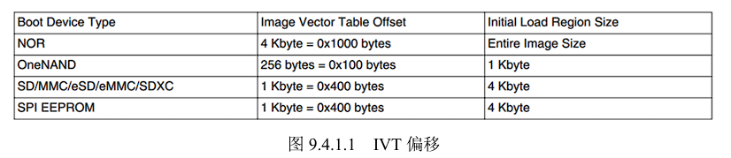

以 SD/EMMC 为例，IVT 偏移为 1Kbyte，IVT+Boot data+DCD 的总大小为 4KByte 1KByte=3KByte。
假如 SD/EMMC每个扇区为512字节，那么load.imx应该从第三个扇区开始烧写，前两个扇区要留出来（偏移1KByte）。
load.imx从第3KByte开始才是真正的.bin文件。

IVT实际存放表如下图：

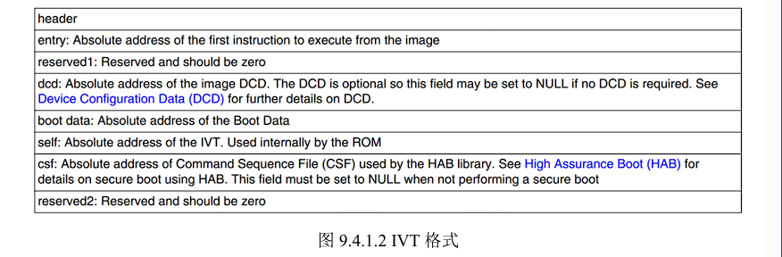

第一个存放的就是header(头)，header格式如下图：


Tag 为一个字节长度，固定为0XD1.
Length是两个字节，保存着IVT长度，为大端格式，也就是高字节保存在低内存中。
最后的 Version 是一个字节，为 0X40 或者0X41。 （标识版本信息）

Boot Data格式：


我们用winhex软件打开load.imx，winhex 可以直接查看一个文件的二进制格式数据，winhex软件我们已经放到了开发板光盘中，路径为：开发板光盘->3、软件-> winhexv19.7.zip，大家自行安装。

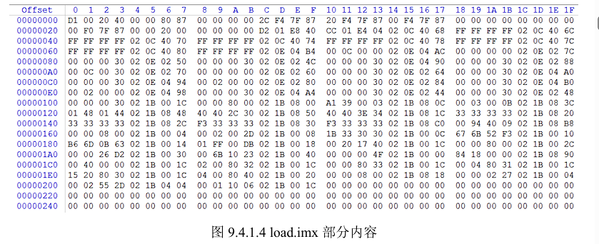

图是我们截取的load.imx 的一部分内容，从地址0X00000000~0X000025F，共 608个字节的数据。
我们将前44个字节的数据按照4个字节一组组合在一起就是：0X402000D1、0X87800000、0X00000000、0X877FF42C、0X877FF420、0X877FF400、0X00000000、0X00000000、0X877FF000、0X00200000、0X00000000。
这 44 个字节的数据就是IVT和Boot Data数据，按对应表如下图示：

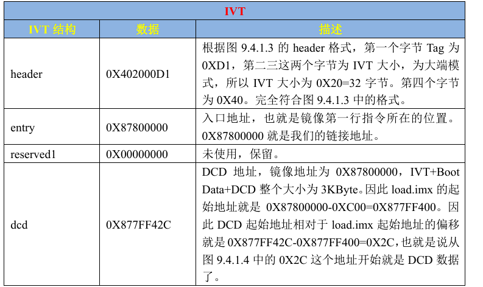
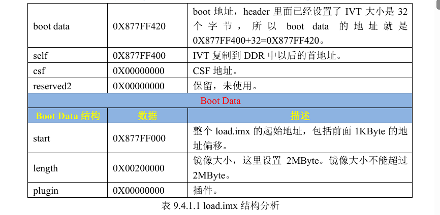

我们详细的列出了load.imx的IVT+Boot Data每32位数据所代表的意义。这些数据都是由imxdownload这个软件添加进去的。

#### 9.4.2 DCD数据

复位以后，I.MX6U 片内的所有寄存器都会复位为默认值，但是这些默认值往往不是我们想要的值，而且有些外设我们必须在使用之前初始化它。
为此I.MX6U提出了一个DCD(Device Config Data)的概念，和 IVT、Boot Data 一样，DCD也是添加到load.imx里面的，紧跟在IVT和Boot Data 后面，IVT里面也指定了DCD的位置。
DCD其实就是I.MX6U寄存器地址和对应的配置信息集合，Boot ROM 会使用这些寄存器地址和配置集合来初始化相应的寄存器，比如开启某些外设的时钟、初始化DDR等等。
DCD区域不能超过1768Byte，DCD 区域结构如图：
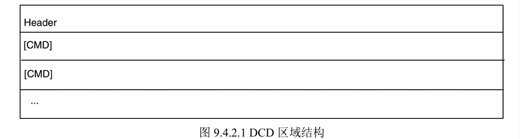

DCD的header和IVT的header类似


Tag是单字节，固定为0XD2，Length为两个字节，表示DCD区域的大小，包含header，同样是大端模式，Version是单字节，固定为0X40或者0X41。
图中的 CMD 就是要初始化的寄存器地址和相应的寄存器值,结构如下图：


Tag为一个字节，固定为0XCC。Length是两个字节，包含写入的命令数据长度，包含header，同样是大端模式。Parameter为一个字节，这个字节的每个位含义不同，可见下图：


bytes表示是目标位置宽度，单位为byte，可以选择1、2、和4字节
flags是命令控制标志位

Address和Vlalue/Mask就是要初始化的寄存器地址和相应的寄存器值，注意采用的是大端模式！

DCD结构就分析到这里，在分析IVT的时候我们就已经说过了，DCD
数据是从图的0X2C地址开始的。
根据我们分析的DCD结构可以得到load.imx的DCD
数据如表所示： 

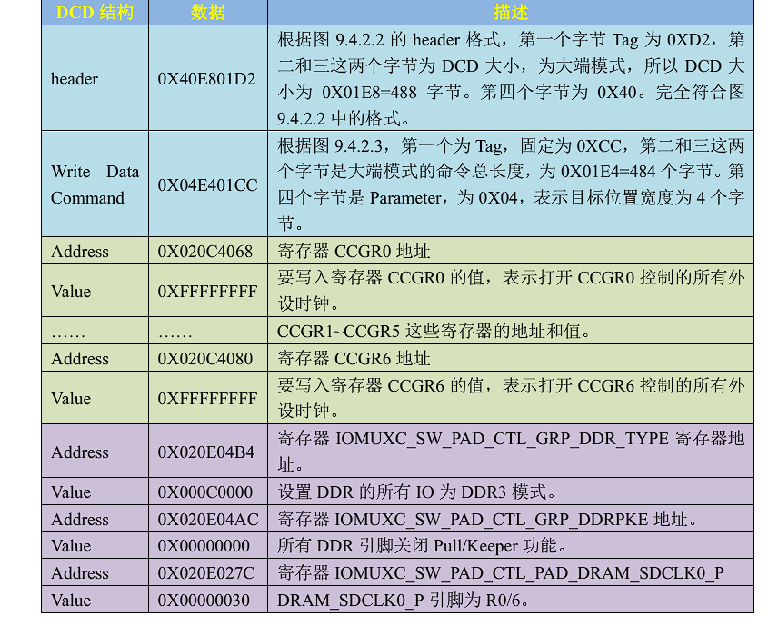
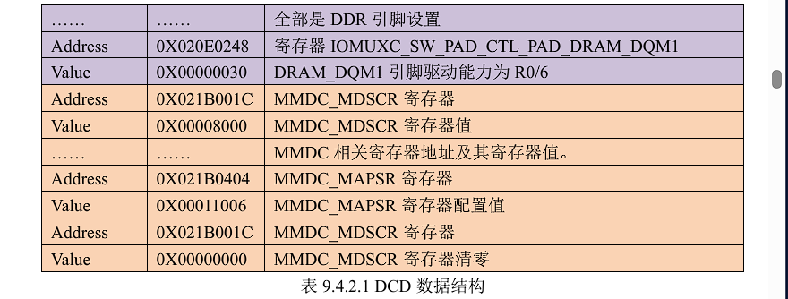

从表中可以看出，DCD里面的初始化配置主要包括三方面： 

①、设置CCGR0~CCGR6这7个外设时钟使能寄存器，默认打开所有的外设时钟。 
②、配置DDR3所用的所有IO。 
③、配置MMDC控制器，初始化DDR3。 

至此，我们介绍完了IMX6ULL的启动模式，启动设备类型与镜像烧写过程！

最后总结：

    IVT:一系列地址信息，包含镜像程序的入口点、指向DCD的指针和一些用作其它用途的指针
    BootData：镜像拷贝地址，大小等镜像信息
    DCD：初始化设备的寄存器配置(包含例如DDR设备的初始化配置)
    代码主体

#### 9.4.3 补充Bootloader与BootROM

补充大端模式与小端模式：

    大端模式（Big-Endian）和小端模式（Little-Endian）是两种不同的数据存储方式，主要用于描述多字节数据在内存中的排列顺序。

    大端模式（Big-Endian）
    存储顺序：高位字节存储在低地址，低位字节存储在高地址。
    应用场景：大端模式更适合人类阅读数据，因为我们习惯从高位到低位的顺序。网络协议（如 TCP/IP）通常使用大端模式。
    
    小端模式（Little-Endian）
    存储顺序：低位字节存储在低地址，高位字节存储在高地址。
    应用场景：小端模式更适合计算机内部处理，因为在某些情况下，它可以简化数据类型转换和计算2。大多数现代处理器（如 x86 架构）使用小端模式。

    举例说明
    假设有一个 32 位整数 0x12345678：

    大端模式：内存中的存储顺序为 12 34 56 78（从低地址到高地址）。
    小端模式：内存中的存储顺序为 78 56 34 12（从低地址到高地址）。
    
    跨平台兼容性
    由于不同平台可能采用不同的存储模式，因此在跨平台数据传输时，需要明确数据的字节序，并进行相应的转换。常用的转换函数包括 htons（主机到网络短整数）和 ntohl（网络到主机长整数）等。

区分：

    Load.imx与Bootloader：

    在给单片机下载程序时，通常需要将程序转换为特定格式的镜像文件（如 load.imx），并在镜像文件的开头添加头数据。
    这些头数据并不是 Bootloader，而是包含了启动信息和配置参数的元数据。具体来说：

    头数据（Header Data）：
    功能：头数据包含了启动所需的配置信息，如加载地址、入口点、校验和等。
    这些信息用于指导 Boot ROM 如何加载和启动镜像文件。
    内容：头数据通常包括镜像文件的大小、校验和、加载地址、入口点地址等信息。

    Bootloader：
    功能：Bootloader 是一个小型程序，负责进一步初始化硬件、加载操作系统内核或应用程序，并完成系统配置。
    位置：Bootloader 通常存储在镜像文件的主体部分，而不是头数据中。

    因此，头数据和 Bootloader 是两个不同的概念。头数据用于描述镜像文件的基本信息和启动参数，而 Bootloader 是实际执行启动过程的程序。

Bootloader存储：

    Bootloader 通常存储在设备的非易失性存储器中，这些存储器在设备断电后仍能保存数据。
    具体存储位置可能因设备和平台而异，常见的存储位置包括：

    内部闪存（Internal Flash）：
    在大多数嵌入式系统中，Bootloader 存储在内部闪存的起始位置。例如，在 STM32 单片机中，Bootloader 通常存储在地址 0x080000001。
    外部闪存（External Flash）：
    在一些系统中，Bootloader 可能存储在外部闪存中，特别是当内部闪存容量不足时。外部闪存通过 SPI、QSPI 等接口与处理器连接2。
    硬盘主引导记录（MBR）：
    在计算机系统中，Bootloader 通常存储在硬盘的主引导记录（MBR）中，这是硬盘的第一个扇区。
    其他非易失性存储器：
    其他类型的非易失性存储器，如 EEPROM 或 NAND Flash，也可以用于存储 Bootloader，具体取决于系统设计。

    Bootloader 的存储位置设计旨在确保系统上电或复位后能够立即执行 Bootloader 代码，从而进行进一步的系统初始化和操作系统加载。

系统上电顺序：

    系统上电后的操作过程可以分为几个主要阶段，每个阶段都有特定的任务和目标。以下是一个简要的概述：

    上电复位：
    当系统通电后，所有寄存器和内存被重置到初始状态。
    CPU开始从一个预定义的地址（通常是复位向量地址）执行指令。

    引导阶段（Boot阶段）：
    BIOS/Boot ROM：BIOS（基本输入输出系统）或Boot ROM代码开始执行，进行硬件初始化和自检（POST，Power-On Self Test）。

    引导加载程序（Bootloader）：BIOS完成自检后，将控制权交给引导加载程序。引导加载程序通常分为多个阶段：
    Stage 1：加载并执行Stage 2。
    Stage 2：进一步初始化硬件，加载操作系统内核到内存中。

    操作系统启动：
    内核初始化：操作系统内核开始执行，初始化内核数据结构和子系统。
    加载驱动程序：内核加载必要的设备驱动程序。
    挂载文件系统：内核挂载根文件系统，准备用户空间环境。
    用户空间初始化：
    启动系统服务：启动各种系统服务和守护进程。
    用户界面：加载并启动用户界面（如图形界面或命令行界面）。

    这个过程确保系统从硬件层面逐步过渡到软件层面，最终为用户提供一个可操作的环境.

对比Windows启动：

    CPU执行BIOS自检程序进行硬件初始化，读入磁盘中的MBR(磁盘引导程序)和分区表。然后找到C盘的PBR程序执行，最终找到C盘中的Boot执行

    计算机系统启动过程可以分为几个主要阶段，每个阶段都有特定的任务和目标。以下是详细的启动历程，并说明 Bootloader 在其中的作用：

    1. 上电自检（POST）
    任务：系统上电后，BIOS（基本输入输出系统）或 UEFI（统一可扩展固件接口）首先运行，进行硬件自检（POST，Power-On Self Test）。
    目标：确保所有硬件组件（如内存、硬盘、键盘等）正常工作。

    2. BIOS/UEFI 初始化
    任务：BIOS/UEFI 读取存储在 CMOS 中的配置参数，如启动顺序、硬盘设置等。
    目标：根据配置参数查找引导设备（如硬盘、光驱、USB 等）。

    3. 加载引导加载程序（Bootloader）
    任务：BIOS/UEFI 按照启动顺序查找引导设备，并加载第一个可引导设备的主引导记录（MBR）或 EFI 分区中的启动文件。
    目标：将控制权交给 Bootloader。

    4. Bootloader 启动
    任务：Bootloader 是负责加载操作系统内核的程序。常见的 Bootloader 包括 GRUB（GRand Unified Bootloader）和 Windows Boot Manager。
    阶段1：从 MBR 或 EFI 分区加载 Bootloader 的第一阶段代码。
    阶段1.5（可选）：识别文件系统并加载第二阶段代码。
    阶段2：加载 Bootloader 配置文件（如 grub.cfg），显示启动菜单，允许用户选择操作系统或内核。
    加载内核：从启动菜单选择操作系统后，Bootloader 加载内核到内存中。
    传递参数：Bootloader 传递内核参数（如启动选项）并将控制权交给内核123。
    
    5. 内核初始化
    任务：操作系统内核开始执行，初始化硬件和系统资源。
    目标：准备用户空间环境。
    
    6. 启动用户空间
    任务：内核启动 init 系统，加载系统服务和应用程序。
    目标：进入操作系统环境，提供用户界面和服务。

串口下载时的操作：

    在使用串口下载程序时，系统会执行一系列操作来确保程序能够正确地传输、存储和执行。以下是详细步骤：

    进入下载模式：
    系统上电或复位时，Boot ROM 检查是否需要进入串口下载模式。这通常通过检测特定引脚的状态（如 BOOT0 引脚）来实现1。(Boot ROM正确加载Bootloader进入Bootloader模式)

    初始化串口：
    一旦进入下载模式，Boot ROM 会初始化串口接口（如 UART），准备接收来自主机的下载命令和数据。

    等待下载命令：
    Bootloader通过串口接口等待来自主机的下载命令。主机通常使用专用的下载工具（如 STM32 的 Flash Loader）发送这些命令。

    接收程序代码：
    主机通过串口接口发送程序代码到设备。Bootloader 接收这些数据并将其写入设备的闪存中。

    验证数据：
    Bootloader 对接收到的数据进行校验，以确保数据传输过程中没有错误。常见的校验方法包括校验和或 CRC 校验。

    成功将程序写入Flash

    示例流程
    以 STM32 单片机为例，具体步骤如下：
    设置 BOOT 引脚：将 BOOT0 引脚设置为高电平，BOOT1 引脚设置为低电平，使单片机进入 Bootloader 模式。
    复位单片机：复位单片机，使其进入 Bootloader 模式。
    发送下载命令：使用上位机工具通过串口发送下载命令和程序代码。
    接收和写入：Bootloader 接收程序代码并写入闪存。
    校验和启动：校验数据完整性，然后启动新的程序代码。
    
    这种串口下载方法常用于嵌入式系统的固件更新，因为它不需要额外的编程设备，只需通过串口接口即可完成更新

区分Bootloader与Bootloader模式：

    Bootloader 模式和Bootloader之间有密切的关系，但它们指的是不同的概念：

    Bootloader：
    定义：Bootloader 是一个小型程序，负责在系统上电或复位后进行硬件初始化，并加载操作系统内核或应用程序。
    功能：它执行基本的硬件初始化、内存配置、设备驱动加载等任务，并最终将控制权交给操作系统内核。

    Bootloader 模式：
    定义：Bootloader 模式是设备进入的一种特殊状态，在这种状态下，Bootloader 可以接收和执行来自外部主机的命令。
    功能：在 Bootloader 模式下，用户可以通过串行接口（如 UART）或 USB 接口与设备通信，进行固件更新、调试、分区管理等操作。这通常用于开发、调试和恢复设备。

    关系
    启动过程：当设备上电或复位时，Boot ROM 会检查是否需要进入 Bootloader 模式。如果检测到特定条件（如特定引脚状态或命令），设备会进入 Bootloader 模式。
    操作：在 Bootloader 模式下，Bootloader 会等待并执行来自外部主机的命令，如下载新的固件、擦除闪存、重启设备等。
    退出模式：完成操作后，Bootloader 可以退出 Bootloader 模式，继续加载操作系统内核或应用程序。

    示例
    在 Android 设备中，Bootloader 模式通常用于解锁 Bootloader、刷入新的系统镜像或恢复出厂设置。用户可以通过特定的按键组合或命令进入 Bootloader 模式，然后使用工具（如 Fastboot）与设备通信。


注意：
BootROM是不可修改的，固化在芯片中的。
而Bootloader存在于Flash或者ROM中，他是可以修改的，可以对Bootloader进行固件更新。

**再注意Bootloader不是一个固化的程序，IMX6ull中移植Uboot是一个Bootloader，STM32中内嵌的串口下载模式也是Bootloader。**

## 第十章 C语言LED灯代码

第八章我们讲解了如何用汇编语言编写LED灯实验，但是实际开发过程中汇编用的很少，大部分都是 C语言开发，汇编只是用来完成 C语言环境的初始化。
本章我们就来学习如何用汇编来完成 C语言环境的初始化工作，然后从汇编跳转到 C语言代码里面去。
(这里的c语言环境指的是执行编译器编译出的C语言代码的环境，SP指针初始化等，STM32中也需要这个汇编文件)

### 10.1 C语言LED灯简介

第八章的汇编 LED灯实验中，我们讲解了如何使用汇编来编写 LED灯驱动，实际工作中是很少用到汇编去写嵌入式驱动的，毕竟汇编太难，而且写出来也不好理解，大部分情况下都是使用 C语言去编写的。

只是在开始部分用汇编来初始化一下 C语言环境，比如初始化 DDR、设置堆栈指针 SP等等，当这些工作都做完以后就可以进入 C语言环境，也就是运行 C语言代码，一般都是进入 main函数。

所以我们有两部分文件要做：
①、汇编文件  
汇编文件只是用来完成 C语言环境搭建。

②、 C语言文件 
C语言文件就是完成我们的业务层代码的，其实就是我们实际例程要完成的功能。

其实STM32也是这样的，只是我们在开发 STM32的时候没有想到这一点，以 STM32F103为例，其启动文件 startup_stm32f10x_hd.s这个汇编文件就是完成 C语言环境搭建的，当然还有一些其他的处理，比如中断向量表等等。

当 startup_stm32f10x_hd.s把 C语言环境初始化 完成以后就会进入 C语言环境。

### 10.2 硬件原理分析

只有一个LED0

### 10.3 实验程序编写

本实验对应的例程路径为： 
开发板光盘 -> 1、例程源码 ->1、裸机例程 ->2_ledc。

新建VScode工程，工程名字为“ ledc”，新建三个文件 start.S、 main.c和 main.h。
其中 start.S是汇编文件， main.c和 main.h是 C语言相关文件。

#### 10.3.1 汇编程序编写

在 STM32中，启动文件 startup_stm32f10x_hd.s就是完成 C语言环境搭建的，当然还有一些其他的处理，比如中断向量表等等。 
startup_stm32f10x_hd.s中堆栈初始化代码如下所示：
```s
1 Stack_Size EQU 0x00000400 
2 
3 AREA STACK, NOINIT, READWRITE, ALIGN=3 
4 Stack_Mem SPACE Stack_Size 
5 __initial_sp 
6 
7 ; <h> Heap Configuration 
8 ; <o> Heap Size (in Bytes) <0x0-0xFFFFFFFF:8> 
9 ; </h> 
10 
11 Heap_Size EQU 0x00000200 
12 
13 AREA HEAP, NOINIT, READWRITE, ALIGN=3 
14 __heap_base 
15 Heap_Mem SPACE Heap_Size
16 __heap_limit 
17 *******************省略掉部分代码*********************** 
18 Reset_Handler PROC 
19 EXPORT Reset_Handler [WEAK] 
20 IMPORT __main 
21 IMPORT SystemInit 
22 LDR R0, =SystemInit 
23 BLX R0 
24 LDR R0, =__main 
25 BX R0 
26 ENDP
```
第 1行代码就是设置栈大小，这里是设置为 0X400 4*16^2 即2^10=1024B
第 5行的 __initial_sp就是初始化 SP指针。
第 11行是设置堆大小。 0x200 2*16^2 即2^9 = 512B
第 18行是复位中断服务函数， STM32复位完成以后会执行此中断服务函数。
第 22行调用 SystemInit()函数来完成其他初始化工作。
第 24行调用 __main，，__main是库函数，其会调用 main()函数。

I.MX6U的汇编部分代码和 STM32的启动文件 startup_stm32f10x_hd.s基本类似的，只是本实验我们不考虑中断向量表，只考虑初始化 C环境即可。
在前面创建的 start.s中输入如下代码：
```s
1  .global _start       /* 全局标号 */ 
2   
3  /* 
4   * 描述： _start函数，程序从此函数开始执行，此函数主要功能是设置C 
5   *        运行环境。 
6   */ 
7  _start: 
8   
9    /* 进入SVC模式 */ 
10   mrs r0, cpsr 
11   bic r0, r0, #0x1f   /* 将r0的低5位清零，也就是cpsr的M0~M4    */ 
12   orr r0, r0, #0x13   /* r0或上0x13,表示使用SVC模式             */ 
13   msr cpsr, r0         /* 将r0 的数据写入到cpsr_c中          */ 
14  
15   ldr sp, =0X80200000  /* 设置栈指针             */ 
16   b main               /* 跳转到main函数       */  
```
第1行定义了一个全局标号_start。
第7行就是标号_start开始的地方，相当于是一个_start函数，这个_start就是第一行代码。
第10~13行就是设置处理器进入SVC模式，在6.2小节的“Cortex-A处理器运行模型”中我们说过Cortex-A有九个运行模型，这里我们设置处理器运行在SVC模式下。（超级管理员模式，供内核使用）
处理器模式的设置是通过修改CPSR(程序状态)寄存器来完成的，在6.3.2小节中我们详细的讲解了CPSR寄存器，其中M[4:0](CPSR的bit[4:0])就是设置处理器运行模式的，参考表6.3.2.2，如果要将处理器设置为SVC模式，那么M[4:0]就要等于0X13。
11~13行代码就是先使用指令MRS将CPSR寄存器的值读取到R0中，然后修改R0中的值，设置R0的bit[4:0]为0X13，然后再使用指令MSR将修改后的R0重新写入到CPSR中。

第15行通过ldr指令设置SVC模式下的SP指针=0X80200000。
因为I.MX6U-ALPHA开发板上的DDR3地址范围是0X80000000~0XA0000000(512MB)或者
0X80000000~0X90000000(256MB)，不管是512MB版本还是256MB版本的，其DDR3起始地
址都是0X80000000。

由于Cortex-A7的堆栈是向下增长的，所以将SP指针设置为0X80200000，因此SVC模式的栈大小0X80200000-0X80000000=0X200000=2MB，2MB的栈空间已经很大了，如果做裸机开发的话绰绰有余。 (SP指针开辟用户空间，第一个即为main函数)

补充一个地址换算：

    现代计算机普遍以1B为存储单元故而
    0X200000=2*16^5 即2^21 B
    2^21 B = 2 *2^20 即2MB

第16行就是跳转到main函数，main函数就是C语言代码了

至此汇编部分程序执行完成，就几行代码，用来设置处理器运行到SVC模式下、然后初始化SP指针、最终跳转到C文件的main函数中。
如果有玩过三星的S3C2440或者S5PV210的话会知道我们在使用SDRAM或者DDR之前必须先初始化SDRAM或者DDR。
所以S3C2440或者S5PV210的汇编文件里面是一定会有SDRAM或者DDR初始化代码的。
我们上面编写的start.s文件中却没有初始化DDR3的代码，但是却将SVC模式下的SP指针设置到了DDR3的地址范围中，这不会出问题吗？
肯定不会的，DDR3肯定是要初始化的，但是不需要在start.s文件中完成。在9.4.2小节里面分析DCD数据的时候就已经讲过了，DCD数据包含了DDR配置参数，I.MX6U内部的Boot ROM会读取DCD数据中的DDR配置参数然后完成DDR初始化的。 

#### 10.3.2 C语言代码编写

C语言部分有两个文件main.c和main.h，main.h里面主要是定义的寄存器地址，在main.h里面输入代码：

```C
#ifndef __MAIN_H 
#define __MAIN_H 

/*  
 * CCM相关寄存器地址  
 */ 
#define CCM_CCGR0             *((volatile unsigned int *)0X020C4068) 
#define CCM_CCGR1             *((volatile unsigned int *)0X020C406C) 
#define CCM_CCGR2             *((volatile unsigned int *)0X020C4070) 
#define CCM_CCGR3             *((volatile unsigned int *)0X020C4074) 
#define CCM_CCGR4             *((volatile unsigned int *)0X020C4078) 
#define CCM_CCGR5             *((volatile unsigned int *)0X020C407C) 
#define CCM_CCGR6             *((volatile unsigned int *)0X020C4080) 
 
/*  
 * IOMUX相关寄存器地址  
 */ 
#define SW_MUX_GPIO1_IO03 *((volatile unsigned int *)0X020E0068) 
#define SW_PAD_GPIO1_IO03    *((volatile unsigned int *)0X020E02F4) 
 
/*  
 * GPIO1相关寄存器地址  
 */ 
#define GPIO1_DR              *((volatile unsigned int *)0X0209C000) 
#define GPIO1_GDIR           *((volatile unsigned int *)0X0209C004) 
#define GPIO1_PSR             *((volatile unsigned int *)0X0209C008) 
#define GPIO1_ICR1            *((volatile unsigned int *)0X0209C00C) 
#define GPIO1_ICR2            *((volatile unsigned int *)0X0209C010) 
#define GPIO1_IMR             *((volatile unsigned int *)0X0209C014) 
#define GPIO1_ISR             *((volatile unsigned int *)0X0209C018) 
#define GPIO1_EDGE_SEL       *((volatile unsigned int *)0X0209C01C) 
 
#endif 
```
在main.h中我们以宏定义的形式定义了要使用到的所有寄存器，后面的数字就是其地址，比如CCM_CCGR0寄存器的地址就是0X020C4068
(CCM CLOCK CONTROL MODULE)

接下来编写main.c文件

```C

#include "main.h" 

/* 
 * @description : 使能I.MX6U所有外设时钟 
 * @param       : 无 
 * @return      : 无 
 */ 
void clk_enable(void) 
{ 
    CCM_CCGR0 = 0xffffffff; 
    CCM_CCGR1 = 0xffffffff; 
    CCM_CCGR2 = 0xffffffff; 
    CCM_CCGR3 = 0xffffffff; 
    CCM_CCGR4 = 0xffffffff; 
    CCM_CCGR5 = 0xffffffff; 
    CCM_CCGR6 = 0xffffffff; 
} 

/* 
 * @description : 初始化LED对应的GPIO 
 * @param       : 无 
 * @return      : 无 
 */ 
void led_init(void) 
{ 
    /* 1、初始化IO复用, 复用为GPIO1_IO03 */ 
    SW_MUX_GPIO1_IO03 = 0x5;    

    /* 2、配置GPIO1_IO03的IO属性   
     *bit 16:0 HYS关闭 
     *bit [15:14]: 00 默认下拉 
     *bit [13]: 0 kepper功能 
     *bit [12]: 1 pull/keeper使能 
     *bit [11]: 0 关闭开路输出 
     *bit [7:6]: 10 速度100Mhz 
     *bit [5:3]: 110 R0/6驱动能力 
     *bit [0]: 0 低转换率 
     */ 
    SW_PAD_GPIO1_IO03 = 0X10B0;      

    /* 3、初始化GPIO, GPIO1_IO03设置为输出 */ 
    GPIO1_GDIR = 0X0000008;  

    /* 4、设置GPIO1_IO03输出低电平，打开LED0 */ 
    GPIO1_DR = 0X0; 
} 

/* 
 * @description : 打开LED灯 
 * @param       : 无 
 * @return      : 无 
 */ 
void led_on(void) 
{ 
    /*  
     * 将GPIO1_DR的bit3清零   
     */ 
    GPIO1_DR &= ~(1<<3);  
    // 1111 1011 与等于 清零
    // 0000 0100 或等于 置位1
} 

/* 
 * @description : 关闭LED灯 
 * @param       : 无 
 * @return      : 无 
 */ 
void led_off(void) 
{ 
    /*     
     * 将GPIO1_DR的bit3置1 
     */ 
    GPIO1_DR |= (1<<3); 
} 

/* 
 * @description : 短时间延时函数 
 * @param - n   : 要延时循环次数(空操作循环次数，模式延时) 
 * @return      : 无 
 */ 
void delay_short(volatile unsigned int n) 
{ 
    while(n--){}
} 

/* 
 * @description : 延时函数,在396Mhz的主频下延时时间大约为1ms 
 * @param - n   : 要延时的ms数 
 * @return      : 无 
 */ 
void delay(volatile unsigned int n) 
{ 
    while(n--) 
    { 
        delay_short(0x7ff); 
    } 
} 

/* 
 * @description : main函数 
 * @param        : 无 
 * @return    : 无 
 */ 
int main(void) 
{ 
    clk_enable();     /* 使能所有的时钟     */ 
    led_init();       /* 初始化led          */ 

    while(1)           /* 死循环              */ 
    {    
        led_off();    /* 关闭LED            */ 
        delay(500);   /* 延时大约500ms      */ 

        led_on();      /* 打开LED            */ 
        delay(500);   /* 延时大约500ms      */ 
    } 

    return 0; 
}
```

解释：
main.c文件里面一共有7个函数，这7个函数都很简单。
clk_enable函数是使能CCGR0~CCGR6所控制的所有外设时钟。
led_init函数是初始化LED灯所使用的IO，包括设置IO的复用功能、IO的属性配置和GPIO功能，最终控制GPIO输出低电平来打开LED灯。
led_on和led_off这两个函数看名字就知道，用来控制LED灯的亮灭的。
delay_short()和delay()这两个函数是延时函数，delay_short()函数是靠空循环来实现延时的，delay()是对delay_short()的简单封装，在I.MX6U工作在396MHz(Boot ROM设置的396MHz)的主频的时候delay_short(0x7ff)基本能够实现大约1ms的延时，所以delay()函数我们可以用来完成ms延时。

main 函数就是我们的主函数了，在main函数中先调用函数clk_enable()和led_init()来完成时钟使能和LED初始化，最终在while(1)循环中实现LED循环亮灭，亮灭时间大约是500ms。

### 10.4 编译下载

#### 10.4.1 编写Makefile

编写Makefile文件

```makefile
  objs := start.o main.o 
  
  ledc.bin:$(objs) 
   arm-linux-gnueabihf-ld -Ttext 0X87800000 -o ledc.elf $^ 
   arm-linux-gnueabihf-objcopy -O binary -S ledc.elf $@ 
   arm-linux-gnueabihf-objdump -D -m arm ledc.elf > ledc.dis 

  %.o:%.s 
   arm-linux-gnueabihf-gcc -Wall -nostdlib -c  -o $@ $< 

  %.o:%.S 
   arm-linux-gnueabihf-gcc -Wall -nostdlib -c  -o $@ $< 

  %.o:%.c 
   arm-linux-gnueabihf-gcc -Wall -nostdlib -c  -o $@ $< 

  clean: 
   rm -rf *.o ledc.bin ledc.elf ledc.dis 
```
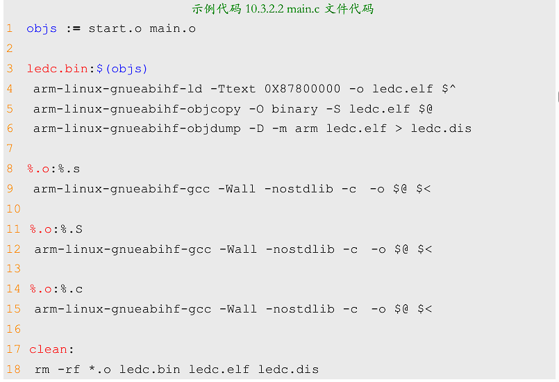

Makefile解释：
第1行定义了一个变量objs，objs包含着要生成ledc.bin所需的材料：start.o和main.o。
也就是当前工程下的start.s和main.c这两个文件编译后的.o文件。
这里要注意start.o一定要放到最前面！
因为在后面链接的时候start.o要在最前面，因为start.o是最先要执行的文件！ 

第3行就是默认目标，目的是生成最终的可执行文件ledc.bin，ledc.bin依赖start.o和main.o
如果当前工程没有start.o 和 main.o 的时候就会找到相应的规则去生成 start.o 和 main.o。比如start.o 是 start.s 文件编译生成的，因此会执行第8行的规则。

第4行是使用arm-linux-gnueabihf-ld 进行链接，链接起始地址是0X87800000，但是这一行用到了自动变量“$^”，“$^”的意思是所有依赖文件的集合，在这里就是 objs 这个变量的值：start.o 和 main.o。
此行类似为：
`arm-linux-gnueabihf-ld -Ttext 0X87800000 -o ledc.elf start.o main.o`
-tText指定链接地址，-o制定生成的文件名字

第5行使用arm-linux-gnueabihf-objcopy 来将 ledc.elf 文件转为 ledc.bin，本行也用到了自动变量“$@”，“$@”的意思是目标集合，在这里就是“ledc.bin”，那么本行就相当于：
`arm-linux-gnueabihf-objcopy -O binary -S ledc.elf ledc.bin`
-O指定输出格式为二进制
-S表示不保留重定位等信息

第6行使用arm-linux-gnueabihf-objdump 来反汇编，生成ledc.dis 文件
-D 表示反汇编所有的段
-m arm 指定目标架构为arm

第8~15 行就是针对不同的文件类型将其编译成对应的.o文件，其实就是汇编.s(.S)和.c 文件，比如start.s 就会使用第8行的规则来生成对应的start.o文件。
第9行就是具体的命令，这行也用到了自动变量“$@”和“$<”，其中“$<”的意思是依赖目标集合的第一个文件。
示例：
```makefile
start.o:start.s 
    arm-linux-gnueabihf-gcc -Wall -nostdlib -c -O2 -o start.o start.s 
```
其中-nostdlib表示不适用标准库链接
-O2表示对代码进行优化，提高程序的执行效率，2代表优化等级

第17行就是工程清理规则，通过命令“make clean”就可以清理工程。

到此为止我们就可以进行测试了。
测试成功
#### 10.4.2 链接脚本
在上面的Makefile中我们链接代码的时候使用如下语句：
`arm-linux-gnueabihf-ld -Ttext 0X87800000 -o ledc.elf $^ `
上面语句中我们是通过“-Ttext”来指定链接地址是0X87800000的，这样的话所有的文件都会链接到以0X87800000 为起始地址的区域。

但是有时候我们很多文件需要链接到指定的区域，或者叫做段里面，比如在Linux里面初始化函数就会放到init段里面。

因此我们需要能够自定义一些段，这些段的起始地址我们可以自由指定，同样的我们也可以指定一个文件或者函数应该存放到哪个段里面去。

要完成这个功能我们就需要使用到链接脚本，看名字就知道链接脚本主要用于链接的，用于描述文件应该如何被链接在一起形成最终的可执行文件。

其主要目的是描述输入文件中的段如何被映射到输出文件中，并且控制输出文件中的内存排布。比如我们编译生成的文件一般都包含text段、data段等等。

链接脚本的语法很简单，就是编写一系列的命令，这些命令组成了链接脚本，每个命令是一个带有参数的关键字或者一个对符号的赋值，可以使用分号分隔命令（KEY：Value）。像文件名之类的字符串可以直接键入，也可以使用通配符“*”。

最简单的链接脚本可以只包含一个命令“SECTIONS”,我们可以在这一个“SECTIONS”里面来描述输出文件的内存布局。
我们一般编译出来的代码都包含在text、data、bss 和 rodata 这四个段内，假设现在的代码要被链接到0X10000000 这个地址，数据要被链接到0X30000000这个地方，下面就是完成此功能的最简单的链接脚本：

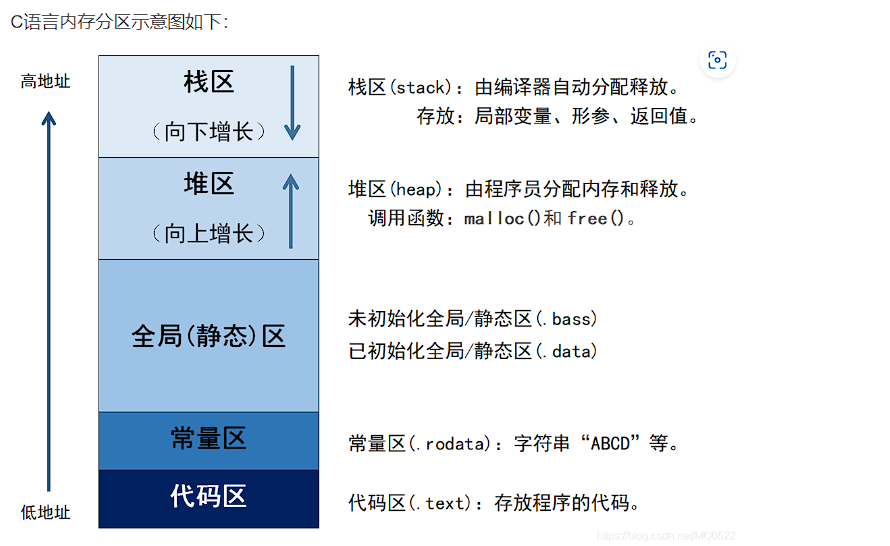

```C
1 SECTIONS{ 
2   . = 0X10000000; 
3   .text : {*(.text)} 
4   . = 0X30000000; 
5   .data ALIGN(4) : { *(.data) }      
6   .bss ALIGN(4)  : { *(.bss) }     
7 } 
```
第1行我们先写了一个关键字“SECTIONS”，后面跟了一个大括号，这个大括号和第7行的大括号是一对，这是必须的。看起来就跟C语言里面的函数一样。 

第2行对一个特殊符号“.”进行赋值，“.”在链接脚本里面叫做**定位计数器**，默认的定位计数器为0。
我们要求代码链接到以0X10000000 为起始地址的地方，因此这一行给“.”赋值0X10000000，表示以 0X10000000 开始，后面的文件或者段都会以 0X10000000 为起始地址开始链接。

第3 行的“.text”是段名，后面的冒号是语法要求，冒号后面的大括号里面可以填上要链接到“.text”这个段里面的所有文件，“*(.text)”中的“*”是通配符，表示所有输入文件的.text段都放到“.text”中。

第4行，我们的要求是数据放到0X30000000开始的地方，所以我们需要重新设置定位计数器“.”，将其改为0X30000000。
如果不重新设置的话会怎么样？假设“.text”段大小为0X10000，那么接下来的.data 段开始地址就是 0X10000000+0X10000=0X10010000，这明显不符合我们的要求。所以我们必须调整定位计数器为0X30000000。 

第5行跟第3行一样，定义了一个名为“.data”的段，然后所有文件的“.data”段都放到
这里面。
但是这一行多了一个“ALIGN(4)”，这是什么意思呢？这是用来对“.data”这个段的起始地址做字节对齐的，ALIGN(4)表示4字节对齐。也就是说段“.data”的起始地址要能被4整除，一般常见的都是ALIGN(4)或者ALIGN(8)，也就是4字节或者8字节对齐。

第6行定义了一个“.bss”段，所有文件中的“.bss”数据都会被放到这个里面，“.bss”数据就是那些定义了但是没有被初始化的变量。

上面就是链接脚本最基本的语法格式，我们接下来就按照这个基本的语法格式来编写我们本试验的链接脚本，我们本试验的链接脚本要求如下：
①、链接起始地址为0X87800000。 
②、start.o 要被链接到最开始的地方，因为start.o里面包含这第一个要执行的命令。

现在开始编写：
在Makefile同目录下新建一个名为“imx6ul.lds”的文件，然后在此文件里面输入如下所示代码：

```C
1  SECTIONS{ 
2    . = 0X87800000; 
3    .text : 
4    { 
5        start.o  
6        main.o  
7        *(.text) 
8    } 
9    .rodata ALIGN(4) : {*(.rodata*)}      
10   .data ALIGN(4)   : { *(.data) }     
11   __bss_start = .;     
12   .bss ALIGN(4)  : { *(.bss)  *(COMMON) }     
13   __bss_end = .; 
14 } 
```
第 2 行设置定位计数器为0X87800000，因为我们的链接地址就是0X87800000。
第 5行设置链接到开始位置的文件为start.o，因为start.o 里面包含着第一个要执行的指令，所以一定要链接到最开始的地方。
第6行是main.o这个文件，其实可以不用写出来，因为main.o的位置就无所谓了，可以由编译器自行决定链接位置。

在第11、13行有“__bss_start”和“__bss_end”这两个东西？
这个是什么呢？
“__bss_start”和“__bss_end”是符号，第11、13这两行其实就是对这两个符号进行赋值，其值为定位符“.”，这两个符号用来保存.bss 段的起始地址和结束地址。
前面说了.bss 段是定义了但是没有被初始化的变量，我们需要手动对.bss段的变量清零的，因此我们需要知道.bss段的起始和结束地址，这样我们直接对这段内存赋0即可完成清零。

通过第11、13行代码，.bss段的起始地址和结束地址就保存在了“__bss_start”和“__bss_end”中，我们就可以直接在汇编或者 C 文件里面使用这两个符号。

补充解释：
.rodata ALIGN(4) : {*(.rodata*)}

    .rodata：定义一个只读数据段，通常用于存储只读数据，如字符串常量和 const 修饰的变量。
    ALIGN(4)：指定该段的起始地址必须是 4 字节对齐。这意味着 .rodata 段的起始地址必须是 4 的整数倍。这样做的目的是提高内存访问效率，因为许多处理器在访问对齐的内存地址时性能更好。
    {*(.rodata*)}：将所有输入文件中名称匹配 .rodata* 的段内容放入这个 .rodata 段。* 是通配符，表示匹配所有以 .rodata 开头的段。

#### 10.4.3 修改Makefile

在上一小节中我们已经编写好了链接脚本文件：imx6ul.lds，我们肯定是要使用这个链接脚本文件的，将Makefile中的如下一行代码：
`arm-linux-gnueabihf-ld -Ttext 0X87800000 -o ledc.elf $^`
改为
`arm-linux-gnueabihf-ld -Timx6ul.lds -o ledc.elf $^ `

-Ttext 是一个链接器选项，用于指定代码段（.text 段）的起始地址。
这个选项通在嵌入式系统开发中使用，因为在这些系统中，开发者需要精确控制程序内存中的布局。

我们的修改，其实就是将-T 后面的 0X87800000 改为 imx6ul.lds，表示使用 imx6ul.lds 这个链接脚本文件。
修改完成以后使用新的Makefile和链接脚本文件重新编译工程，编译成功以后就可以烧写到SD卡中验证了。

#### 10.4.4 下载验证

使用软件imxdownload将编译出来的ledc.bin烧写到SD卡中即可。

## 第十一章 模仿STM32驱动开发格式实验

在上一章使用C语言编写LED灯驱动的时候，每个寄存器的地址我们都需要写宏定义，使用起来非常的不方便。
我们在学习STM32的时候，可以使用“GPIOB->ODR”这种方式来给GPIOB 的寄存器ODR赋值，因为在STM32中同属于一个外设的所有寄存器地址基本是相邻的(有些会有保留寄存器)。
因此我们可以借助C语言里面的结构体成员地址递增的特点来将某个外设的所有寄存器写入到一个结构体里面，然后定义一个结构体指针指向这个外设的寄存器基地址，这样我们就可以通过这个结构体指针来访问这个外设的所有寄存器。
同理，I.MX6U也可以使用这种方法来定义外设寄存器，本章我们就模仿 STM32 里面的寄存器定义方式来编写I.MX6U 的驱动，通过本章的学习也可以对STM32的寄存器定义方式有一个深入的认识。

### 11.1 模仿STM32寄存器定义

#### 11.1.1 STM32寄存器定义

为了开发方便，ST官方为STM32F103编写了一个叫做stm32f10x.h的文件，在这个文件里面定义了STM32F103所有外设寄存器，我们可以使用其定义的寄存器来进行开发，比如我们可以用如下代码来初始化一个GPIO：
```C
GPIOE->CRL&=0XFF0FFFFF; 
GPIOE->CRL|=0X00300000;  //PE5推挽输出 
GPIOE->ODR|=1<<5;        //PE5输出高 
```
上述代码是初始化STM32的PE5这个GPIO为推挽输出，需要配置的就是GPIOE的寄存器CRL和ODR， “GPIOE”的定义：
`#define GPIOE               ((GPIO_TypeDef *) GPIOE_BASE) `
可以看出“GPIOE”是个宏定义，是一个指向地址GPIOE_BASE的结构体指针，结构体为GPIO_TypeDef，GPIO_TypeDef和GPIOE_BASE的定义如下：
```C
typedef struct 
{ 
  __IO uint32_t CRL; 
  __IO uint32_t CRH; 
  __IO uint32_t IDR; 
  __IO uint32_t ODR; 
  __IO uint32_t BSRR; 
  __IO uint32_t BRR; 
  __IO uint32_t LCKR; 
} GPIO_TypeDef; 
 
#define GPIOE_BASE             (APB2PERIPH_BASE + 0x1800) 
#define APB2PERIPH_BASE        (PERIPH_BASE + 0x10000) 
#define PERIPH_BASE           ((uint32_t)0x40000000) 
```
GPIO_TypeDef是个结构体，结构体里面的成员变量有CRL、CRH、IDR、ODR、BSRR、BRR和LCKR，这些都是GPIO的寄存器，每个成员变量都是32位(4字节)，这些寄存
器在结构体中的位置都是按照其地址值从小到大排序的。(__IO 表示 volatile)

GPIOE_BASE就是GPIOE的基地址，其为：
```c
GPIOE_BASE=APB2PERIPH_BASE+0x1800 
   = PERIPH_BASE + 0x10000 + 0x1800 
   =0x40000000 + 0x10000 + 0x1800 
   =0x40011800 
```
GPIOE_BASE的基地址为0x40011800，宏GPIOE指向这个地址并强行转化为(GPIO_TypeDef *)类型，因此GPIOE的寄存器CRL的地址就是0X40011800，寄存器CRH的地址就是0X40011800+4=0X40011804，其他寄存器地址以此类推。

我们要操作GPIOE的ODR寄存器的话就可以通过“GPIOE->ODR”来实现，这个方法是借助了结构体成员地址连续递增的原理。

了解了STM32的寄存器定义以后，我们就可以参考其原理来编写I.MX6U的外设寄存器定义了。NXP官方并没有为I.MX6UL编写类似stm32f10x.h这样的文件，NXP只为I.MX6ULL提供了类似stm32f10x.h这样的文件，名为MCIMX6Y2.h，但是I.MX6UL和I.MX6ULL几乎一模一样，所以文件MCIMX6Y2.h可以用在I.MX6UL上。

关于文件MCIMX6Y2.h的移植我们在下一章讲解，本章我们参考stm32f10x.h来编写一个简单的MCIMX6Y2.h文件。

#### 11.1.2 I.MX6U寄存器定义

参考STM32的官方文件来编写I.MX6U的寄存器定义，比如IO复用寄存器组“IOMUX_SW_MUX_CTL_PAD_XX”，步骤如下：

**1. 编写外设结构体**

先将同属于一个外设的所有寄存器编写到一个结构体里面，如IO复用寄存器组的结构体如下：
```C
 /*  
  * IOMUX寄存器组 
  */ 
1   typedef struct  
2   { 
3    volatile unsigned int BOOT_MODE0; 
4    volatile unsigned int BOOT_MODE1; 
5    volatile unsigned int SNVS_TAMPER0; 
6    volatile unsigned int SNVS_TAMPER1; 
 ……… 
107  volatile unsigned int CSI_DATA00; 
108  volatile unsigned int CSI_DATA01; 
109  volatile unsigned int CSI_DATA02; 
110  volatile unsigned int CSI_DATA03; 
111  volatile unsigned int CSI_DATA04; 
112  volatile unsigned int CSI_DATA05; 
113  volatile unsigned int CSI_DATA06; 
114  volatile unsigned int CSI_DATA07; 
   /* 为了缩短代码，其余IO复用寄存器省略 */ 
115}IOMUX_SW_MUX_Tpye; 
```
上述结构体IOMUX_SW_MUX_Type就是IO复用寄存器组，成员变量是每个IO对应的复用寄存器，每个寄存器的地址是32位，每个成员都使用“volatile”进行了修饰，目的是防止编译器优化。 

**2. 定义IO复用寄存器组的基地址**

根据结构体IOMUX_SW_MUX_Type的定义，其第一个成员变量为BOOT_MODE0，也就是BOOT_MODE0这个IO的IO复用寄存器，查找I.MX6U的参考手册可以得知其地址为0X020E0014，所以IO复用寄存器组的基地址就是0X020E0014，定义如下：
`#define IOMUX_SW_MUX_BASE   (0X020E0014) `

**3. 定义访问指针**

`#define IOMUX_SW_MUX  ((IOMUX_SW_MUX_Type *)IOMUX_SW_MUX_BASE)`

通过上面三步我们就可以通过“IOMUX_SW_MUX->GPIO1_IO03”来访问GPIO1_IO03的IO复用寄存器了。
同样的，其他的外设寄存器都可以通过这三步来定义。 

### 11.2 硬件分析原理

LED0


一端接3.3V电压，一端接LED0引脚，配以510Ω的限流电阻。

LED0最终接到GPIO_3上，GPIO_3就是GPIO1_IO03，当 GPIO1_IO03输出低电平(0)的时候发光二极管LED0就会导通点亮，当GPIO1_IO03输出高电平(1)的时候发光二极管LED0不会导通，因此LED0也就不会点亮。所以LED0的亮灭取决于GPIO1_IO03的输出电平，输出0就亮，输出1就灭。

### 11.3 实验程序编写

本实验对应的例程路径为：开发板光盘-> 1、裸机例程-> 3_ledc_stm32。 
创建VSCode工程，工作区名字为“ledc_stm32”，新建三个文件：start.S、main.c和imx6ul.h。其中start.S是汇编文件，start.S文件的内容和第十章的start.S一样，直接复制过来就可以。main.c 和imx6ul.h是C文件。
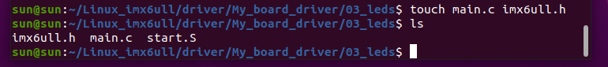

imx6ull.h代码如下：
```C
/*  
 * 外设寄存器组的基地址  
 */ 
1   #define CCM_BASE              (0X020C4000) 
2   #define CCM_ANALOG_BASE        (0X020C8000) 
3   #define IOMUX_SW_MUX_BASE      (0X020E0014) 
4   #define IOMUX_SW_PAD_BASE      (0X020E0204) 
5   #define GPIO1_BASE               (0x0209C000) 
6   #define GPIO2_BASE               (0x020A0000) 
7   #define GPIO3_BASE               (0x020A4000) 
8   #define GPIO4_BASE               (0x020A8000) 
9   #define GPIO5_BASE               (0x020AC000) 
10 
11  /*  
12   * CCM寄存器结构体定义，分为CCM和CCM_ANALOG  
13   */ 
14  typedef struct  
15  { 
16      volatile unsigned int CCR; 
17      volatile unsigned int CCDR; 
18      volatile unsigned int CSR; 
  …… 
46      volatile unsigned int CCGR6; 
47      volatile unsigned int RESERVED_3[1]; 
48      volatile unsigned int CMEOR;     
49  } CCM_Type;  
50   
51  typedef struct  
52  { 
53      volatile unsigned int PLL_ARM; 
54      volatile unsigned int PLL_ARM_SET; 
55      volatile unsigned int PLL_ARM_CLR; 
56      volatile unsigned int PLL_ARM_TOG; 
  …… 
110     volatile unsigned int MISC2; 
111     volatile unsigned int MISC2_SET; 
112     volatile unsigned int MISC2_CLR; 
113     volatile unsigned int MISC2_TOG; 
114 } CCM_ANALOG_Type;  
115 
116 /*  
117  * IOMUX寄存器组 
118  */ 
119 typedef struct  
120 { 
121     volatile unsigned int BOOT_MODE0; 
122     volatile unsigned int BOOT_MODE1; 
123     volatile unsigned int SNVS_TAMPER0; 
  …… 
241     volatile unsigned int CSI_DATA04; 
242     volatile unsigned int CSI_DATA05; 
243     volatile unsigned int CSI_DATA06; 
244     volatile unsigned int CSI_DATA07; 
245 }IOMUX_SW_MUX_Type; 
246 
247 typedef struct  
248 { 
249     volatile unsigned int DRAM_ADDR00; 
250     volatile unsigned int DRAM_ADDR01; 
  …… 
419     volatile unsigned int GRP_DDRPKE; 
420     volatile unsigned int GRP_DDRMODE; 
421     volatile unsigned int GRP_DDR_TYPE; 
422 }IOMUX_SW_PAD_Type; 
423  
424 /*  
425  * GPIO寄存器结构体 
426  */ 
427 typedef struct  
428 { 
429     volatile unsigned int DR;                            
430     volatile unsigned int GDIR;                              
431     volatile unsigned int PSR;                               
432     volatile unsigned int ICR1;                              
433     volatile unsigned int ICR2;                               
434     volatile unsigned int IMR;                                
435     volatile unsigned int ISR;           
436     volatile unsigned int EDGE_SEL;   
437 }GPIO_Type; 
438 
439  
440 /*  
441  * 外设指针  
442  */ 
443 #define CCM              ((CCM_Type *)CCM_BASE) 
444 #define CCM_ANALOG       ((CCM_ANALOG_Type *)CCM_ANALOG_BASE) 
445 #define IOMUX_SW_MUX    ((IOMUX_SW_MUX_Type *)IOMUX_SW_MUX_BASE) 
446 #define IOMUX_SW_PAD  ((IOMUX_SW_PAD_Type *)IOMUX_SW_PAD_BASE) 
447 #define GPIO1             ((GPIO_Type *)GPIO1_BASE) 
448 #define GPIO2              ((GPIO_Type *)GPIO2_BASE) 
449 #define GPIO3             ((GPIO_Type *)GPIO3_BASE) 
450 #define GPIO4              ((GPIO_Type *)GPIO4_BASE) 
451 #define GPIO5             ((GPIO_Type *)GPIO5_BASE) 
```
在编写寄存器组结构体的时候注意寄存器的地址是否连续，有些外设的寄存器地址可能不是连续的，会有一些保留地址，因此我们需要在结构体中留出这些保留的寄存器。
比如：
CCM的CCGR6寄存器地址为0X020C4080，而寄存器CMEOR的地址为0X020C4088。
按照地址顺序递增的原理，寄存器CMEOR的地址应该是0X020C4084，但是实际上CMEOR的地址是0X020C4088，相当于中间跳过了0X020C4088-0X020C4080=8个字节。
如果寄存器地址连续的话应该只差4个字节(32位)，但是现在差了8个字节，所以需要在寄存器CCGR6和CMEOR直接加入一个保留寄存器，这个就是“示例代码”中第47行RESERVED_3[1]的来源。
如果不添加保留位来占位的话就会导致寄存器地址错位！

main.c中编写下列文件：
```C
1   #include "imx6ul.h" 
2    
3   /* 
4    * @description : 使能I.MX6U所有外设时钟 
5    * @param       : 无 
6    * @return      : 无 
7    */ 
8   void clk_enable(void) 
9   { 
10      CCM->CCGR0 = 0XFFFFFFFF; 
11      CCM->CCGR1 = 0XFFFFFFFF; 
12      CCM->CCGR2 = 0XFFFFFFFF; 
13      CCM->CCGR3 = 0XFFFFFFFF; 
14      CCM->CCGR4 = 0XFFFFFFFF; 
15      CCM->CCGR5 = 0XFFFFFFFF; 
16      CCM->CCGR6 = 0XFFFFFFFF; 
17  } 
18   
19  /* 
20   * @description : 初始化LED对应的GPIO 
21   * @param       : 无 
22   * @return      : 无 
23   */ 
24  void led_init(void) 
25  { 
26      /* 1、初始化IO复用 */ 
27      IOMUX_SW_MUX->GPIO1_IO03 = 0X5;     /* 复用为GPIO1_IO03 */ 
28   
29   
30      /* 2、配置GPIO1_IO03的IO属性   
31       *bit 16:0 HYS关闭 
32       *bit [15:14]: 00 默认下拉 
33       *bit [13]: 0 kepper功能 
34       *bit [12]: 1 pull/keeper使能 
35       *bit [11]: 0 关闭开路输出 
36       *bit [7:6]: 10 速度100Mhz 
37       *bit [5:3]: 110 R0/6驱动能力 
38       *bit [0]: 0 低转换率 
39       */ 
40      IOMUX_SW_PAD->GPIO1_IO03 = 0X10B0; 
41
42
43      /* 3、初始化GPIO */ 
44      GPIO1->GDIR = 0X0000008;    /* GPIO1_IO03设置为输出 */ 
45   
46      /* 4、设置GPIO1_IO03输出低电平，打开LED0 */   
47      GPIO1->DR &= ~(1 << 3);  
48       
49  } 
50  
51  /* 
52   * @description : 打开LED灯 
53   * @param       : 无 
54   * @return      : 无 
55   */ 
56  void led_on(void) 
57  { 
58      /* 将GPIO1_DR的bit3清零     */ 
59      GPIO1->DR &= ~(1<<3);  
60  } 
61   
62  /* 
63   * @description : 关闭LED灯 
64   * @param       : 无 
65   * @return      : 无 
66   */ 
67  void led_off(void) 
68  { 
69      /* 将GPIO1_DR的bit3置1 */ 
70      GPIO1->DR |= (1<<3);  
71  } 
72   
73  /* 
74   * @description : 短时间延时函数 
75   * @param - n   : 要延时循环次数(空操作循环次数，模式延时) 
76   * @return      : 无 
77   */ 
78  void delay_short(volatile unsigned int n) 
79  { 
80      while(n--){} 
81  } 
82   
83  /* 
84   * @description : 延时函数,在396Mhz的主频下 
85   *                延时时间大约为1ms 
86   * @param - n   : 要延时的ms数 
87   * @return      : 无 
88   */ 
89  void delay(volatile unsigned int n) 
90  { 
91      while(n--) 
92      { 
93          delay_short(0x7ff); 
94      } 
95  } 
96   
97  /* 
98   * @description : main函数 
99   * @param       : 无 
100  * @return      : 无 
101  */ 
102 int main(void) 
103 { 
104     clk_enable();        /* 使能所有的时钟       */ 
105     led_init();          /* 初始化led           */ 
106  
107     while(1)             /* 死循环             */ 
108     {    
109         led_off();       /* 关闭LED             */ 
110         delay(500);      /* 延时500ms           */ 
111  
112         led_on();        /* 打开LED             */ 
113         delay(500);      /* 延时500ms           */ 
114     } 
115  
116     return 0; 
117 } 
```
main.c中7个函数，这7个函数的含义和第十章中的main.c文件一样，只是函数体写法变了，寄存器的访问采用imx6ul.h中定义的外设指针。
比如第27行设置GPIO1_IO03的复用功能就可以通过“IOMUX_SW_MUX->GPIO1_IO03”来给寄存SW_MUX_CTL_PAD_GPIO1_IO03赋值。

### 11.4 编译下载验证

#### 11.4.1 编写Makefile与lds脚本

```makefile
1  objs := start.o main.o 
2   
3  ledc.bin:$(objs) 
4    arm-linux-gnueabihf-ld -Timx6ul.lds -o ledc.elf $^ 
5    arm-linux-gnueabihf-objcopy -O binary -S ledc.elf $@ 
6    arm-linux-gnueabihf-objdump -D -m arm ledc.elf > ledc.dis 
7   
8  %.o:%.s 
9    arm-linux-gnueabihf-gcc -Wall -nostdlib -c -O2 -o $@ $< 
10   
11 %.o:%.S 
12   arm-linux-gnueabihf-gcc -Wall -nostdlib -c -O2 -o $@ $< 
13   
14 %.o:%.c 
15   arm-linux-gnueabihf-gcc -Wall -nostdlib -c -O2 -o $@ $< 
16   
17 clean: 
18   rm -rf *.o ledc.bin ledc.elf ledc.dis 
```
lds 与上节课代码完全一致

#### 11.4.2 编译下载

验证即可 成功

## 第十二章 官方SDK移植

在上一章中，我们参考ST官方给STM32编写的stm32f10x.h来自行编写I.MX6U的寄存器定义文件。
自己编写这些寄存器定义不仅费时费力，没有任何意义，而且很容易写错，幸好NXP官方为I.MX6ULL编写了SDK包，在SDK包里面NXP已经编写好了寄存器定义文件，所以我们可以直接移植SDK包里面的文件来用。
虽然NXP是为I.MX6ULL编写的SDK包，但是I.MX6UL也是可以使用的！
本章我们就来讲解如何移植SDK包里面重要的文件，方便我们的开发。

### 12.1 I.MX6ULL 官方SDK包简介

NXP 针对I.MX6ULL 编写了一个SDK包，这个SDK包就类似于STM32的STD库或者HAL 库，这个SDK包提供了Windows 和Linux 两种版本，分别针对主机系统是Windows和Linux。
因为我们是在Windows下使用Source Insight来编写代码的，因此我们使用的是Windows版本的。
Windows版本SDK里面的例程提供了IAR版本，肯定有人会问既然NXP提供了IAR
版本的SDK，那我们为什么不用IAR来完成裸机试验，偏偏要用复杂的GCC？
因为我们要从简单的裸机开始掌握Linux下的GCC开发方法，包括Ubuntu操作系统的使用、Makefile的编写、shell 等等。
如果为了偷懒而使用IAR开发裸机的话，那么后续学习Uboot移植、Linux移植和Linux 驱动开发就会很难上手，因为开发环境都不熟悉！
再者，不是所有的半导体厂商都会为Cortex-A 架构的芯片编写裸机SDK包，我使用过那么多的Cotex-A系列芯片，也就发现了NXP给I.MX6ULL 编写了裸机SDK包。
而且去NXP官网看一下，会发现只有I.MX6ULL这一款Cotex-A内核的芯片有裸机SDK包，NXP的其它Cotex-A芯片都没有。
说明在NXP的定位里面，I.MX6ULL就是一个Cotex-A内核的高端单片机，定位类似ST的STM32H7。
说这么多的目的就是想告诉大家，使用Cortex-A内核芯片的时候不要想着有类似STM32库一样的东西，I.MX6ULL 是一个特例，基本所有的Cortex-A 内核的芯片都不会提供裸机SDK包。因此在使用STM32 的时候那些用起来很顺手的库文件，在Cotex-A 芯片下基本都需要我们自行编写，比如.s启动文件、寄存器定义等等。

SDK包我们可以去NXP官网下载
开发板光盘-> 7、I.MX6U 参考资料->3、I.MX6ULL SDK 包-> SDK_2.2_MCIM6ULL_RFP_Win.exe。也有我们需要的包

双击下载即可。我们并不会讲解SDK包，只是需要SDK包的几个定义寄存器的头文件。

如下
fsl_common.h：
位置为 SDK_2.2_MCIM6ULL\devices\MCIMX6Y2\drivers\fsl_common.h。 
fsl_iomuxc.h:  
位置为 SDK_2.2_MCIM6ULL\devices\MCIMX6Y2\drivers\fsl_iomuxc.h。 
MCIMX6Y2.h: 
位置为SDK_2.2_MCIM6ULL\devices\MCIMX6Y2\MCIMX6YH2.h。

补充：
IAR介绍：

    IAR Systems是一家全球领先的嵌入式系统开发工具和服务的供应商，成立于1983年。
    该公司提供的产品和服务涵盖嵌入式系统的设计、开发和测试的每一个阶段，包括带有C/C++编译器和调试器的集成开发环境（IDE）、实时操作系统和中间件、开发套件、硬件仿真器以及状态机建模工具等‌。
    类比于keil5 MDK

SDK包：

    SDK包（Software Development Kit）是一组开发工具的集合，
    主要用于辅助软件工程师为特定的软件包、软件框架、硬件平台或操作系统创建应用软件。‌

    SDK通常包括编译器、调试器、软件框架等工具，这些工具能够促进应用程序的创建。
    SDK不仅提供应用程序接口（API）的相关文件，还可能包含与嵌入式系统通讯的复杂硬件组件


### 12.2 硬件原理图

LED1 同上诉完全一致

### 12.3 实验程序编写

本实验对应的例程路径为：开发板光盘-> 1、裸机例程-> 4_ledc_sdk

#### 12.3.1 SDK文件移植

使用VSCode新建工程，将fsl_common.h、fsl_iomuxc.h 和 MCIMX6Y2.h 这三个文件拷贝到工程中，这三个文件直接编译的话肯定会出错的！
需要对其做删减，因为这三个文件里面的代码都比较大，所以就不详细列出这三个文件删减以后的内容了。
大家可以参考我们提供的裸机例程来修改这三个文件，很简单的。

#### 12.3.2 创建cc.h文件

新建一个名为cc.h 的头文件，cc.h 里面存放一些 SDK 库文件需要使用到的数据类型，在cc.h 里面输入如下代码：
```C
#ifndef __CC_H 
#define __CC_H 
/* 
 * 自定义一些数据类型供库文件使用 
 */ 
#define     __I     volatile  
#define     __O     volatile  
#define     __IO    volatile 
 
#define      ON      1 
#define      OFF     0 
 
typedef    signed  char       int8_t; 
typedef    signed  short int  int16_t; 
typedef    signed        int  int32_t; 
typedef unsigned         char uint8_t; 
typedef unsigned  short  int  uint16_t; 
typedef unsigned         int  uint32_t; 
typedef unsigned  long   long uint64_t; 
typedef   signed  char           s8;       
typedef   signed  short  int     s16; 
typedef   signed  int            s32; 
typedef   signed  long  long  int  s64; 
typedef unsigned  char           u8; 
typedef unsigned  short  int     u16; 
typedef unsigned  int            u32; 
typedef unsigned  long  long  int  u64; 
 
#endif
```
#### 12.3.3 编写实验代码

新建start.S和main.c这两个文件，start.S文件的内容和上一章一样，直接复制过来就可以
main.c代码如下：
```C
1   #include "fsl_common.h" 
2   #include "fsl_iomuxc.h" 
3   #include "MCIMX6Y2.h" 
4    
5   /* 
6    * @description : 使能I.MX6U所有外设时钟 
7    * @param       : 无 
8    * @return      : 无 
9    */ 
10  void clk_enable(void) 
11  { 
12      CCM->CCGR0 = 0XFFFFFFFF; 
13      CCM->CCGR1 = 0XFFFFFFFF; 
14   
15      CCM->CCGR2 = 0XFFFFFFFF; 
16      CCM->CCGR3 = 0XFFFFFFFF; 
17      CCM->CCGR4 = 0XFFFFFFFF; 
18      CCM->CCGR5 = 0XFFFFFFFF; 
19      CCM->CCGR6 = 0XFFFFFFFF; 
20
21  } 
22   
23  /* 
24   * @description : 初始化LED对应的GPIO 
25   * @param       : 无 
26   * @return      : 无 
27   */ 
28  void led_init(void) 
29  { 
30      /* 1、初始化IO复用 */ 
31      IOMUXC_SetPinMux(IOMUXC_GPIO1_IO03_GPIO1_IO03,0); 
32   
33      /* 2、、配置GPIO1_IO03的IO属性    
34       *bit 16:0 HYS关闭 
35       *bit [15:14]: 00 默认下拉 
36       *bit [13]: 0 kepper功能 
37       *bit [12]: 1 pull/keeper使能 
38       *bit [11]: 0 关闭开路输出 
39       *bit [7:6]: 10 速度100Mhz 
40       *bit [5:3]: 110 R0/6驱动能力 
41       *bit [0]: 0 低转换率 
42       */ 
43      IOMUXC_SetPinConfig(IOMUXC_GPIO1_IO03_GPIO1_IO03,0X10B0); 
44   
45      /* 3、初始化GPIO,设置GPIO1_IO03设置为输出  */ 
46      GPIO1->GDIR |= (1 << 3);     
47       
48      /* 4、设置GPIO1_IO03输出低电平，打开LED0 */ 
49      GPIO1->DR &= ~(1 << 3);          
50  } 
51   
52  /* 
53   * @description : 打开LED灯 
54   * @param       : 无 
55   * @return      : 无 
56   */ 
57  void led_on(void) 
58  { 
59      /* 将GPIO1_DR的bit3清零     */ 
60      GPIO1->DR &= ~(1<<3);  
61  } 
62   
63  /*
64   * @description : 关闭LED灯 
65   * @param       : 无 
66   * @return      : 无 
67   */ 
68  void led_off(void) 
69  { 
70      /* 将GPIO1_DR的bit3置1 */ 
71      GPIO1->DR |= (1<<3);  
72  } 
73   
74  /* 
75   * @description : 短时间延时函数 
76   * @param - n   : 要延时循环次数(空操作循环次数，模式延时) 
77   * @return      : 无 
78   */ 
79  void delay_short(volatile unsigned int n) 
80  { 
81      while(n--){} 
82  } 
83   
84  /* 
85   * @description : 延时函数,在396Mhz的主频下 
86   *                  延时时间大约为1ms 
87   * @param - n   : 要延时的ms数 
88   * @return       : 无 
89   */ 
90  void delay(volatile unsigned int n) 
91  { 
92      while(n--) 
93      { 
94          delay_short(0x7ff); 
95      } 
96  } 
97   
98  /* 
99   * @description : main函数 
100  * @param       : 无 
101  * @return      : 无 
102  */ 
103 int main(void) 
104 { 
105     clk_enable();     /* 使能所有的时钟    */ 
106     led_init();       /* 初始化led        */ 
107  
108     while(1)         /* 死循环          */ 
109     {    
110         led_off();    /* 关闭LED         */ 
111         delay(500);   /* 延时500ms       */ 
112  
113         led_on();     /* 打开LED        */ 
114         delay(500);   /* 延时500ms       */ 
115     } 
116  
117     return 0; 
118 } 
```
我们重点来看一下led_init函数中的第31行和第43行，这两行的内容如下：
```C
IOMUXC_SetPinMux(IOMUXC_GPIO1_IO03_GPIO1_IO03,  0);  
IOMUXC_SetPinConfig(IOMUXC_GPIO1_IO03_GPIO1_IO03, 0X10B0);
```
这里使用了两个函数IOMUXC_SetPinMux和IOMUXC_SetPinConfig，其中函数IOMUXC_SetPinMux是用来设置IO复用功能的，最终肯定设置的是寄存器“IOMUXC_SW_<span style="color:red;">MUX</span>\_CTL_PAD_<span style="color:blue;">XX</span>”。
函数IOMUXC_SetPinConfig设置的是IO的上下拉、速度等的，也就是寄存器“IOMUXC_SW_<span style="color:red;">PAD</span>\_CTL_PAD_<span style="color:blue;">XX</span>”
故而：
上诉两个函数其实就是：
`IOMUX_SW_MUX->GPIO1_IO03 = 0X5;`
`IOMUX_SW_PAD->GPIO1_IO03 = 0X10B0;`

这两个函数均在在文件fsl_iomuxc.h中定义，源码如下：
```C
static inline void IOMUXC_SetPinMux(uint32_t muxRegister, 
                                    uint32_t muxMode, 
                                    uint32_t inputRegister, 
                                    uint32_t inputDaisy, 
                                    uint32_t configRegister, 
                                    uint32_t inputOnfield) 
{ 
    *((volatile uint32_t *)muxRegister) = 
        IOMUXC_SW_MUX_CTL_PAD_MUX_MODE(muxMode) |  
IOMUXC_SW_MUX_CTL_PAD_SION(inputOnfield); 
 
    if (inputRegister) 
    { 
        *((volatile uint32_t *)inputRegister) =  
IOMUXC_SELECT_INPUT_DAISY(inputDaisy); 
    } 
}
```
函数IOMUXC_SetPinMux有6个参数，这6个参数的函数如下：

muxRegister ： IO 的复用寄存器地址，比如 GPIO1_IO03 的 IO 复用寄存器SW_MUX_CTL_PAD_GPIO1_IO03 的地址为0X020E0068。

muxMode： IO复用值，也就是ALT0~ALT8，对应数字0~8，比如要将GPIO1_IO03设置为GPIO功能的话此参数就要设置为5。 

inputRegister：外设输入 IO 选择寄存器地址，有些IO在设置为其他的复用功能以后还需要设置 IO 输入寄存器，比如 GPIO1_IO03 要复用为 UART1_RX 的话还需要设置寄存器UART1_RX_DATA_SELECT_INPUT，此寄存器地址为0X020E0624。 

inputDaisy：寄存器 inputRegister 的值，比如 GPIO1_IO03 要作为UART1_RX引脚的话此参数就是1。 

configRegister：未使用，函数 IOMUXC_SetPinConfig 会使用这个寄存器。 

inputOnfield ： IO 软 件 输 入 使 能 ， 以 GPIO1_IO03 为 例 就 是 寄 存 器SW_MUX_CTL_PAD_GPIO1_IO03 的SION位(bit4)。如果需要使能GPIO1_IO03的软件输入功能的话此参数应该为1，否则的话就为0。 

IOMUXC_SetPinMux 的函数体很简单，就是根据参数对**寄存器muxRegister和inputRegister进行赋值**。

示例代码中的 31 行使用此函数将 GPIO1_IO03 的复用功能设置为
GPIO，如下：
`IOMUXC_SetPinMux(IOMUXC_GPIO1_IO03_GPIO1_IO03, 0); `

其中，IOMUXC_GPIO1_IO03_GPIO1_IO03 是个宏，在文件fsl_iomuxc.h 中有定义，NXP 的 SDK 库将一个 IO 的所有复用功能都定义了一个宏，如下：
```C
IOMUXC_GPIO1_IO03_I2C1_SDA 
IOMUXC_GPIO1_IO03_GPT1_COMPARE3                    
IOMUXC_GPIO1_IO03_USB_OTG2_OC                         
IOMUXC_GPIO1_IO03_USDHC1_CD_B                      
IOMUXC_GPIO1_IO03_GPIO1_IO03                        
IOMUXC_GPIO1_IO03_CCM_DI0_EXT_CLK                
IOMUXC_GPIO1_IO03_SRC_TESTER_ACK                     
IOMUXC_GPIO1_IO03_UART1_RX                       
IOMUXC_GPIO1_IO03_UART1_TX
```
上面9个宏定义分别对应着GPIO1_IO03的九种复用功能，比如复用为GPIO的宏定义就是：

```C
#define IOMUXC_GPIO1_IO03_GPIO1_IO03  0x020E0068U,  0x5U,  0x00000000U,  0x0U,    0x020E02F4U
```
将这个宏带入到“示例代码”的31行以后就是:
`IOMUXC_SetPinMux (0x020E0068U, 0x5U, 0x00000000U, 0x0U, 0x020E02F4U, 0); `

补充： SION位：

    SION位（Software Input On）在IOMUXC寄存器中用于强制激活输入路径。
    具体来说，当SION位被设置为1时，无论引脚的多路复用模式（MUX_MODE）如何配置，输入信号都会被传递到输入模块。
    
    应用场景：
    在SD卡接口中，SD_CMD引脚用于发送命令和接收响应。
    通常情况下，这个引脚需要在发送命令和接收响应之间快速切换其功能。
    通过设置SION位，可以简化这个过程：
    
    发送命令：SD控制器通过SD_CMD引脚发送命令到SD卡。
    接收响应：SD卡通过同一个SD_CMD引脚发送响应回SD控制器。
    
    如果不设置SION位，软件需要在每次发送命令和接收响应之间切换引脚的多路复用模式（MUX_MODE）。
    这不仅增加了代码复杂性，还可能导致时间延迟。通过设置SION位，SD_CMD引脚的输入路径始终激活，无需在发送命令和接收响应之间切换模式，从而简化了操作并提高了效率。(常说的软件输入功能)

总之，这样我们的代码就与IOMUXC_SetPinMux的参数对应起来了。

下面我们来看第二个函数，IOMUXC_SetPinConfig。在文件fsl_iomuxc.h中有定义，函数源码如下：
```C
static inline void IOMUXC_SetPinConfig(uint32_t muxRegister, 
                                       uint32_t muxMode,
                                       uint32_t inputRegister, 
                                       uint32_t inputDaisy, 
                                       uint32_t configRegister, 
                                       uint32_t configValue) 
{ 
    if (configRegister) 
    { 
        *((volatile uint32_t *)configRegister) = configValue; 
    } 
} 
```
函数IOMUXC_SetPinConfig有6个参数，其中前五个参数和函数IOMUXC_SetPinMux一
样，但是此函数只使用了参数configRegister和configValue，cofigRegister参数是IO配置寄存器地址.
比如GPIO1_IO03的IO配置寄存器为IOMUXC_SW_PAD_CTL_PAD_GPIO1_IO03，其地址为0X020E02F4，参数configValue就是要写入到寄存器configRegister的值。

同理：
`IOMUXC_SetPinConfig(IOMUXC_GPIO1_IO03_GPIO1_IO03, 0X10B0);`
展开后为
`IOMUXC_SetPinConfig(0x020E0068U, 0x5U, 0x00000000U, 0x0U, 0x020E02F4U, 0X10B0); `

根据函数IOMUXC_SetPinConfig的源码可以知道，上面函数就是将寄存器0x020E02F4的值设置为0X10B0。

函数IOMUXC_SetPinMux和IOMUXC_SetPinConfig就讲解到这里，我们以后就可以使用这两个函数来方便的配置IO的复用功能和IO配置。

### 12.4 编译验证

#### 12.4.1 编写Makefile与lds

Makefile文件是在第十一章中的Makefile上修改的，只是使用到了变量。链接脚本imx6ul.lds 的内容和上一章一样，可以直接使用上一章的链接脚本文件

```makefile
1  CROSS_COMPILE  ?= arm-linux-gnueabihf- 
2  NAME         ?= ledc 
3   
4  CC         := $(CROSS_COMPILE)gcc 
5  LD         := $(CROSS_COMPILE)ld 
6  OBJCOPY   := $(CROSS_COMPILE)objcopy 
7  OBJDUMP   := $(CROSS_COMPILE)objdump 
8   
9  OBJS     := start.o main.o 
10  
11 $(NAME).bin:$(OBJS) 
12   $(LD) -Timx6ul.lds -o $(NAME).elf $^ 
13   $(OBJCOPY) -O binary -S $(NAME).elf $@ 
14   $(OBJDUMP) -D -m arm $(NAME).elf > $(NAME).dis 
15  
16 %.o:%.s 
17   $(CC) -Wall -nostdlib -c -O2 -o $@ $< 
18   
19 %.o:%.S 
20   $(CC) -Wall -nostdlib -c -O2 -o $@ $< 
21   
22 %.o:%.c 
23   $(CC) -Wall -nostdlib -c -O2 -o $@ $< 
24   
25 clean: 
26   rm -rf *.o $(NAME).bin $(NAME).elf $(NAME).dis 
```
?= 表示条件赋值运算符。它的作用是 仅在变量未被定义时 赋值。定义后则不再赋值
:= 是一种简单赋值运算符。它的作用是立即对右侧的表达式求值，并将结果赋值给左侧的变量。
VAR = value：延迟求值，只有在变量被使用时才求值。

#### 12.4.2

下载验证即可，成功

## 第十三章 BSP工程管理实验

在前面的章节中，我们都是将所有的源码文件放到工程的根目录下，如果工程文件比较少的话这样做无可厚非，但是如果工程源文件达到几十、甚至数百个的时候，这样一股脑全部放到根目录下就会使工程显得混乱不堪。

所以我们必须对工程文件做管理，将不同功能的源码文件放到不同的目录中。
另外我们也需要将源码文件中，所有完成同一个功能的代码提取出来放到一个单独的文件中，也就是对程序分功能管理。
本章我们就来学习一下如何对一个工程进行整理，使其美观、功能模块清晰、易于阅读。 

### 13.1 工程管理简介

将所有的源码文件都放到工程根目录下，即使这个工程只是完成了一个简单的流水灯的功能，但是其工程根目录下的源码文件就已经不少了。
如果在添加一些其他的功能文件，那么文档就会更大，显得很混乱，所以我们需要对这个工程进行整理，将源码文件分模块、分功能整理。

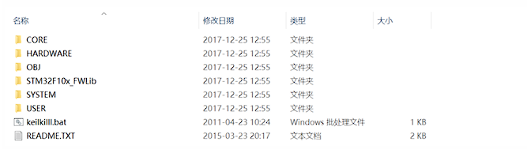

图13.1.2 中的工程目录就很美观、不同的功能模块文件放到不同的文件夹中，比如驱动文件就放到HARDWARE 文件夹中，ST的官方库就放到STM32F10x_FWLib 文件夹中，编译产生的过程文件放到 OBJ 文件夹中。

我们可以参考这个工程目录结构来整理第十二章的例程工程，新建名为“5_ledc_bsp”的文件夹，在里面新建bsp、imx6ul、obj和project这4个文件夹


其中bsp用来存放驱动文件；
imx6ul用来存放跟芯片有关的文件，比如NXP官方的SDK库文件；
obj用来存放编译生成的.o文件；
project存放start.S和main.c文件，也就是应用文件；

将十二章实验中的cc.h、fsl_common.h、fsl_iomuxc.h 和 MCIMX6Y2.h 这四个文件拷贝到文件夹imx6ul 中
将start.S 和 main.c 这两个文件拷贝到文件夹project中
我们前面的实验中所有
的驱动相关的函数都写到了main.c文件中，比如函数clk_enable、led_init和delay，这三个函数可以分为三类：时钟驱动、LED驱动和延时驱动。
因此我们可以在bsp文件夹下创建三个子文件夹：clk、delay 和 led，分别用来存放时钟驱动文件、延时驱动文件和 LED 驱动文件，这样main.c 函数就会清爽很多，程序功能模块清晰。

至此，工程文件夹都创建好了，接下来就是编写代码了，其实就是将时钟驱动、LED驱动和延时驱动相关的函数从main.c中提取出来做成一个独立的驱动文件 。

### 13.2 硬件原理分析

没错还是一个LED

### 13.3 实验程序编写

本实验对应的例程路径为：开发板光盘-> 1、裸机例程-> 5_ledc_bsp

#### 13.3.1 创建imx6ull.h

新建文件imx6ul.h，然后保存到文件夹imx6ul中，在imx6ul.h中输入如下内容：
```C
1  #ifndef __IMX6UL_H 
2  #define __IMX6UL_H 
3  /*************************************************************** 
4  Copyright © zuozhongkai Co., Ltd. 1998-2019. All rights reserved. 
5  文件名    : imx6ul.h 
6  作者      : 左忠凯 
7  版本      : V1.0 
8  描述      : 包含一些常用的头文件。 
9  其他      : 无 
10 论坛      : www.openedv.com 
11 日志      : 初版V1.0 2019/1/3 左忠凯创建 
12 ***************************************************************/ 
13 #include "cc.h" 
14 #include "MCIMX6Y2.h" 
15 #include "fsl_common.h" 
16 #include "fsl_iomuxc.h" 
17  
18 #endif 
```
文件imx6ul.h很简单，就是引用了一些头文件，以后我们就可以在其他文件中需要引用imx6ul.h就可以了。 

#### 13.3.2 编写led驱动

新建bsp_led.h和bsp_led.c两个文件，将这两个文件存放到bsp/led中，在bsp_led.h中输入输入如下内容： 

```C
1  #ifndef __BSP_LED_H 
2  #define __BSP_LED_H 
3  #include "imx6ul.h" 
4  /*************************************************************** 
5  Copyright © zuozhongkai Co., Ltd. 1998-2019. All rights reserved. 
6  文件名    : bsp_led.h 
7  作者      : 左忠凯 
8  版本      : V1.0 
9  描述      : LED驱动头文件。 
10 其他      : 无
11 论坛      : www.openedv.com 
12 日志      : 初版V1.0 2019/1/4 左忠凯创建 
13 ***************************************************************/ 
14  
15 #define LED0 0 
16  
17 /* 函数声明 */ 
18 void led_init(void); 
19 void led_switch(int led, int status); 
20 #endif 
```

```C
1  #include "bsp_led.h" 
2  /*************************************************************** 
3  Copyright © zuozhongkai Co., Ltd. 1998-2019. All rights reserved. 
4  文件名    : bsp_led.c 
5  作者      : 左忠凯 
6  版本      : V1.0 
7  描述      : LED驱动文件。 
8  其他      : 无 
9  论坛      : www.openedv.com 
10 日志      : 初版V1.0 2019/1/4 左忠凯创建 
11 ***************************************************************/ 
12  
13 /* 
14  * @description  : 初始化LED对应的GPIO 
15  * @param         : 无 
16  * @return        : 无 
17  */ 
18 void led_init(void) 
19 { 
20   /* 1、初始化IO复用 */ 
21   IOMUXC_SetPinMux(IOMUXC_GPIO1_IO03_GPIO1_IO03,0);        
22   
23   /* 2、、配置GPIO1_IO03的IO属性 */ 
24   IOMUXC_SetPinConfig(IOMUXC_GPIO1_IO03_GPIO1_IO03,0X10B0); 
25   
26   /* 3、初始化GPIO,GPIO1_IO03设置为输出*/ 
27   GPIO1->GDIR |= (1 << 3);      
28  
29   /* 4、设置GPIO1_IO03输出低电平，打开LED0*/ 
30   GPIO1->DR &= ~(1 << 3);      
31 }
32  
33 /* 
34  * @description     : LED控制函数，控制LED打开还是关闭 
35  * @param - led       : 要控制的LED灯编号 
36  * @param - status    : 0，关闭LED0，1 打开LED0 
37  * @return             : 无 
38  */ 
39 void led_switch(int led, int status) 
40 {     
41   switch(led) 
42   { 
43       case LED0: 
44            if(status == ON) 
45                GPIO1->DR &= ~(1<<3);   /* 打开LED0 */ 
46            else if(status == OFF) 
47                GPIO1->DR |= (1<<3);    /* 关闭LED0 */ 
48            break; 
49   } 
50 } 
```
bsp_led.c里面就两个函数led_init和led_switch.
led_init函数用来初始化LED所使用的IO，led_switch函数是控制LED灯的打开和关闭

#### 13.3.3 编写时钟驱动代码

新建bsp_clk.h和bsp_clk.c两个文件，将这两个文件存放到bsp/clk中，在bsp_clk.h中输入输入如下内容：

```C
1  #ifndef __BSP_CLK_H 
2  #define __BSP_CLK_H 
3  /*************************************************************** 
4  Copyright © zuozhongkai Co., Ltd. 1998-2019. All rights reserved. 
5  文件名    : bsp_clk.h 
6  作者      : 左忠凯 
7  版本      : V1.0 
8  描述      : 系统时钟驱动头文件。 
9  其他      : 无 
10 论坛      : www.openedv.com 
11 日志      : 初版V1.0 2019/1/4 左忠凯创建 
12 ***************************************************************/ 
13  
14 #include "imx6ul.h" 
15  
16 /* 函数声明 */ 
17 void clk_enable(void); 
18  
19 #endif 
```

```C
1  #include "bsp_clk.h" 
2   
3  /*************************************************************** 
4  Copyright © zuozhongkai Co., Ltd. 1998-2019. All rights reserved. 
5  文件名    : bsp_clk.c 
6  作者      : 左忠凯 
7  版本      : V1.0 
8  描述      : 系统时钟驱动。 
9  其他      : 无 
10 论坛      : www.openedv.com 
11 日志      : 初版V1.0 2019/1/4 左忠凯创建 
12 ***************************************************************/ 
13  
14 /* 
15  * @description   : 使能I.MX6U所有外设时钟 
16  * @param         : 无 
17  * @return        : 无 
18  */ 
19 void clk_enable(void) 
20 { 
21   CCM->CCGR0 = 0XFFFFFFFF; 
22   CCM->CCGR1 = 0XFFFFFFFF; 
23   CCM->CCGR2 = 0XFFFFFFFF; 
24   CCM->CCGR3 = 0XFFFFFFFF; 
25   CCM->CCGR4 = 0XFFFFFFFF; 
26   CCM->CCGR5 = 0XFFFFFFFF; 
27   CCM->CCGR6 = 0XFFFFFFFF; 
28 } 
```
bsp_clk.c只有一个clk_enable函数，用来使能所有的外设时钟。

#### 13.3.4 编写延时驱动代码

新建bsp_delay.h和bsp_delay.c两个文件，将这两个文件存放到bsp/delay中

```C
1  #ifndef __BSP_DELAY_H 
2  #define __BSP_DELAY_H 
3  /*************************************************************** 
4  Copyright © zuozhongkai Co., Ltd. 1998-2019. All rights reserved. 
5  文件名    : bsp_delay.h
6  作者      : 左忠凯 
7  版本      : V1.0 
8  描述      : 延时头文件。 
9  其他      : 无 
10 论坛      : www.openedv.com 
11 日志      : 初版V1.0 2019/1/4 左忠凯创建 
12 ***************************************************************/ 
13 #include "imx6ul.h" 
14  
15 /* 函数声明 */ 
16 void delay(volatile unsigned int n); 
17  
18 #endif
```

```C
/*************************************************************** 
Copyright © zuozhongkai Co., Ltd. 1998-2019. All rights reserved. 
文件名   : bsp_delay.c 
作者     : 左忠凯 
版本     : V1.0 
描述     : 延时文件。 
其他     : 无 
论坛     : www.openedv.com 
日志     : 初版V1.0 2019/1/4 左忠凯创建 
***************************************************************/ 
1  #include "bsp_delay.h" 
2   
3  /* 
4   * @description   : 短时间延时函数 
5   * @param - n     : 要延时循环次数(空操作循环次数，模式延时) 
6   * @return        : 无 
7   */ 
8  void delay_short(volatile unsigned int n) 
9  { 
10   while(n--){} 
11 } 
12  
13 /* 
14  * @description  : 延时函数,在396Mhz的主频下 
15  *                      延时时间大约为1ms 
16  * @param - n     : 要延时的ms数 
17  * @return         : 无 
18  */
19 void delay(volatile unsigned int n) 
20 { 
21   while(n--) 
22   { 
23       delay_short(0x7ff); 
24   } 
25 } 
```
bsp_delay.c里面就两个函数，delay_short和delay，这两个其实就是第十二章中main.c里面的函数。

#### 13.3.5 修改main文件

改为从模块调用：
```C
1  #include "bsp_clk.h" 
2  #include "bsp_delay.h" 
3  #include "bsp_led.h" 
4   
5  /* 
6   * @description  : main函数 
7   * @param         : 无 
8   * @return        : 无 
9   */ 
10 int main(void) 
11 { 
12   clk_enable();       /* 使能所有的时钟 */ 
13    led_init();         /* 初始化led     */ 
14  
15   while(1) 
16   {    
17       /* 打开LED0 */ 
18        led_switch(LED0,ON);         
19       delay(500); 
20  
21       /* 关闭LED0 */ 
22       led_switch(LED0,OFF);        
23       delay(500); 
24   } 
25  
26    return 0; 
27 } 
```

### 13.4 编译下载

#### 13.4.1 编写Makefile与lds

Makefile文件如下代码：
```makefile
1  CROSS_COMPILE ?= arm-linux-gnueabihf- 
2  TARGET           ?= bsp 
3   
4  CC                := $(CROSS_COMPILE)gcc 
5  LD                := $(CROSS_COMPILE)ld 
6  OBJCOPY       := $(CROSS_COMPILE)objcopy 
7  OBJDUMP       := $(CROSS_COMPILE)objdump 
8   
9  INCDIRS       := imx6ul \ 
10                   bsp/clk \ 
11                  bsp/led \ 
12                   bsp/delay  
13                              
14 SRCDIRS         := project \ 
15                   bsp/clk \ 
16                   bsp/led \ 
17                   bsp/delay  
18                          
19 INCLUDE         := $(patsubst %, -I %, $(INCDIRS))
20  
21 SFILES          := $(foreach dir, $(SRCDIRS), $(wildcard $(dir)/*.S)) 
22 CFILES          := $(foreach dir, $(SRCDIRS), $(wildcard $(dir)/*.c)) 
23  
24 SFILENDIR       := $(notdir  $(SFILES)) 
25 CFILENDIR       := $(notdir  $(CFILES)) 
26  
27 SOBJS           := $(patsubst %, obj/%, $(SFILENDIR:.S=.o)) 
28 COBJS           := $(patsubst %, obj/%, $(CFILENDIR:.c=.o)) 
29 OBJS          := $(SOBJS) $(COBJS) 
30  
31 VPATH          := $(SRCDIRS) 
32  
33 .PHONY: clean 
34   
35 $(TARGET).bin : $(OBJS) 
36   $(LD) -Timx6ul.lds -o $(TARGET).elf $^ 
37   $(OBJCOPY) -O binary -S $(TARGET).elf $@ 
38   $(OBJDUMP) -D -m arm $(TARGET).elf > $(TARGET).dis 
39  
40 $(SOBJS) : obj/%.o : %.S 
41   $(CC) -Wall -nostdlib -c -O2  $(INCLUDE) -o $@ $< 
42  
43 $(COBJS) : obj/%.o : %.c 
44   $(CC) -Wall -nostdlib -c -O2  $(INCLUDE) -o $@ $< 
45   
46 clean: 
47  rm -rf $(TARGET).elf $(TARGET).dis $(TARGET).bin $(COBJS) $(SOBJS) 
```
本章实验的Makefile文件要比前面的实验复杂很多，因为示例代码中的Makefile代码是一个通用Makefile，我们以后所有的裸机例程都使用这个Makefile。
使用时候只要将所需要编译的源文件所在的目录添加到Makefile中即可.

Makefile分析：

第1~7行定义了一些变量，除了第2行以外其它的都是跟编译器有关的，如果使用其它编
译器的话只需要修改第1行即可。
第2行的变量TARGET目标名字，不同的例程肯定名字不一样。
第9行的变量INCDIRS包含整个工程的.h头文件目录，文件中的所有头文件目录都要添加到变量INCDIRS中。
比如本例程中包含.h头文件的目录有imx6ul、bsp/clk、bsp/delay和bsp/led，所以就需要在变量INCDIRS中添加这些目录，即: 
`INCDIRS := imx6ul bsp/clk bsp/led bsp/delay`
第9~11行后面都会有一个符号“\”，这个相当于“换行符”，表示本行和下一行属于同一行，一般一行写不下的时候就用符号“\”来换行。

第14行是变量SRCDIRS，和变量INCDIRS一样，只是SRCDIRS包含的是整个工程的所有.c 和.S 文件目录。（源代码工程文件）
比如本例程包含有.c和.S的目录有bsp/clk、bsp/delay、bsp/led 和 project，即：
`SRCDIRS := project bsp/clk bsp/led bsp/delay `
后面的裸机例程中我们也要根据实际情况在变量 SRCDIRS 中添加相应的文件目录。 

第19行的变量INCLUDE使用到了函数patsubst，通过函数patsubst给变量INCDIRS添加一个“-I”，即：
`INCLUDE := -I imx6ul -I bsp/clk -I bsp/led -I bsp/delay `

gcc编译中-I可以指定头文件路径

补充：foreach函数

    在Makefile中，foreach函数用于遍历一个列表，并对列表中的每个元素执行指定的操作。
    语法：$(foreach <var>,<list>,<text>)
    <var>：临时变量，用于存储列表中的当前元素。
    <list>：要遍历的列表，元素之间用空格分隔。
    <text>：要对每个元素执行的操作，通常会使用<var>来引用当前元素。
    示例：
    names := a b c d
    files := $(foreach n,$(names),$(n).o)
    结果为$(files)的值将是a.o b.o c.o d.o
    其中$(n).o表示 取n的值.o表示字符串连上.o最终赋给files
    wildcard函数见Makefile笔记

第21 行变量SFILES 保存工程中所有的.s汇编文件(包含绝对路径)，变量SRCDIRS已经存放了工程中所有的.c和.S文件，所以我们只需要从里面挑出所有的.S汇编文件即可，这里借助了函数foreach和函数wildcard，最终SFILES如下：
`SFILES := project/start.S`

第22行变量CFILES和变量SFILES一样，只是CFILES保存工程中所有的.c文件(包含绝对路径)，最终CFILES如下：
`CFILES = project/main.c bsp/clk/bsp_clk.c bsp/led/bsp_led.c bsp/delay/bsp_delay.c`

第24和25行的变量SFILENDIR和CFILENDIR包含所有的.S汇编文件和.c文件，相比变量SFILES 和CFILES，SFILENDIR 和 CFILNDIR 只是文件名，不包含文件的绝对路径.
使用函数notdir 将SFILES和CFILES中的路径去掉即可，SFILENDIR和CFILENDIR如下：
```makefile
SFILENDIR = start.S 
CFILENDIR = main.c bsp_clk.c bsp_led.c bsp_delay.c 
```

补充 notdir函数：

    在Makefile中，notdir函数用于从文件路径中提取文件名部分，去掉目录路径。
    它的语法如下:$(notdir <names>)
    <names>：一个或多个文件路径，文件路径之间用空格分隔。
    notdir函数会从每个文件路径中去掉目录部分，只保留文件名。

第27和28行的变量SOBJS和COBJS是.S和.c文件编译以后对应的.o文件目录，默认所有的文件编译出来的.o文件和源文件在同一个目录中，这里我们将所有的.o文件都放到obj文件夹下，SOBJS和COBJS内容如下：

补充paysubst函数：

    patsubst函数用于模式字符串替换。
    语法为：$(patsubst <pattern>,<replacement>,<text>)
    <pattern>：要匹配的模式，可以包含通配符%，表示任意长度的字符串。
    <replacement>：替换模式，如果包含%，则表示匹配到的部分。
    <text>：要处理的文本，多个单词以空格分隔

    $(SFILENDIR:.S=.o)：
    这是一个模式替换操作，将变量SFILENDIR中的所有.S文件替换为.o文件。
    例如，如果SFILENDIR的值是file1.S file2.S，那么这个操作会将其转换为file1.o file2.o
    $(patsubst %, obj/%, $(SFILENDIR:.S=.o))  中第一个参数为%表示全匹配，然后目标为obj/% 即加上obj/的前缀

最终结果为
```makefile
SOBJS = obj/start.o 
COBJS = obj/main.o obj/bsp_clk.o obj/bsp_led.o obj/bsp_delay.o 
```
第29行变量OBJS是变量SOBJS和COBJS的集合，如下： 
`OBJS = obj/start.o obj/main.o obj/bsp_clk.o obj/bsp_led.o obj/bsp_delay.o `
即OBJS表示所有的待组合的.o文件
完成后，所有的文件将在obj文件夹中

第31行的VPATH是指定搜索目录的，这里指定的搜素目录就是变量SRCDIRS所保存的目录，这样当编译的时候所需的.S和.c文件就会在SRCDIRS中指定的目录中查找。
**VPATH为Makefile内置变量**

第33行指定了一个伪目标clean，伪目标表示一定执行(可重复执行)

第35~47行就很熟悉了，前几章都已经详细的讲解过了

示例代码中的 Makefile 文件内容重点工作是找到要编译哪些文件？编译的.o文件存放到哪里？
使用到的编译命令和前面实验使用的一样，其实Makefile的重点工作就是解决“从哪里来到哪里去的”问题，也就是找到要编译的源文件、编译结果存放到哪里？
真正的编译命令很简洁。 

链接脚本基本一致，但需要修改start.o位置

```C
1  SECTIONS{ 
2   . = 0X87800000; 
3   .text : 
4   { 
5       obj/start.o  
6       *(.text) 
7   } 
8   .rodata ALIGN(4) : {*(.rodata*)}      
9   .data ALIGN(4)   : { *(.data) }     
10  __bss_start = .;     
11  .bss ALIGN(4)  : { *(.bss)  *(COMMON) }     
12  __bss_end = .; 
13 } 
```
#### 13.4.2 编译下载

验证即可

## 第十四章 蜂鸣器实验

前几章试验中的驱动LED灯亮灭属于GPIO的输出控制，本章再巩固一下I.MX6U的GPIO输出控制，在I.MX6U-ALPHA开发板上有一个有源蜂鸣器，通过IO输出高低电平即可控制蜂
鸣器的开关，本质上也属于GPIO的输出控制

### 14.1 有源蜂鸣器介绍

蜂鸣器常用于计算机、打印机、报警器、电子玩具等电子产品中，常用的蜂鸣器有两种：有源蜂鸣器和无源蜂鸣器。
这里的有“源”不是电源，而是震荡源。
有源蜂鸣器内部带有震荡源，所以有源蜂鸣器只要通电就会叫。
无源蜂鸣器内部不带震荡源，直接用直流电是驱动不起来的，需要2K-5K的方波去驱动。
I.MX6U-ALPHA开发板使用的是有源蜂鸣器，因此只要给其供电就会工作，I.MX6U-ALPHA开发板所使用的有源蜂鸣器如图


有源蜂鸣器只要通电就会叫，所以我们可以做一个供电电路，这个供电电路可以由一个IO来控制其通断，一般使用三极管来搭建这个电路。（三极管放大电流）
为什么我们不能像控制LED灯一样，直接将GPIO 接到蜂鸣器的负极，通过 IO 输出高低来控制蜂鸣器的通断。
因为蜂鸣器工作的电流比LED灯要大，直接将蜂鸣器接到I.MX6U的GPIO上有可能会烧毁IO，所以我们需要通过一个三极管来间接的控制蜂鸣器的通断，相当于加了一层隔离。

### 14.2 硬件原理分析

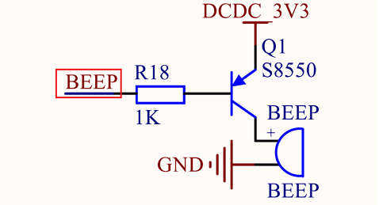

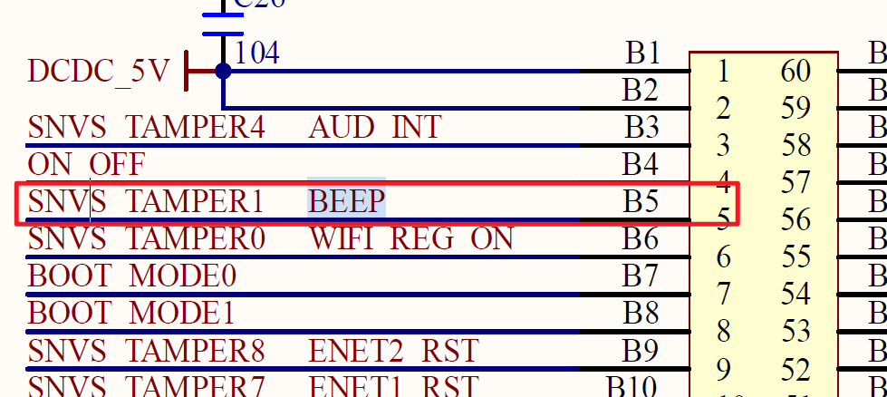

通过一个PNP型的三极管8550来驱动蜂鸣器，通过SNVS_TAMPER1这个IO来控制三极管Q1的导通，当SNVS_TAMPER1输出低电平的时候Q1导通，相当于蜂鸣器的正极连接到DCDC_3V3，蜂鸣器形成一个通路，因此蜂鸣器会鸣叫。
同理，当SNVS_TAMPER1输出高电平的时候Q1不导通，那么蜂鸣器就没有形成一个通路，因此蜂鸣器也就不会鸣叫。

### 14.3 程序编写

新建beep.h文件，保存到bsp/beep文件夹里面，在beep.h里面输入如下内容：
```C
1 #ifndef __BSP_BEEP_H 
2 #define __BSP_BEEP_H 
3  
4 #include "imx6ul.h" 
5  
6 /* 函数声明 */ 
7 void beep_init(void); 
8 void beep_switch(int status); 
9 #endif 
```
新建文件beep.c，然后在beep.c里面输入如下内容：
```C
1  #include "bsp_beep.h" 
2   
3  /* 
4   * @description  : 初始化蜂鸣器对应的IO 
5   * @param        : 无 
6   * @return       : 无 
7   */ 
8  void beep_init(void) 
9  { 
10   /* 1、初始化IO复用，复用为GPIO5_IO01 */ 
11   IOMUXC_SetPinMux(IOMUXC_SNVS_SNVS_TAMPER1_GPIO5_IO01,0);         
12   
13   /* 2、配置GPIO1_IO03的IO属性   */ 
14   IOMUXC_SetPinConfig(IOMUXC_SNVS_SNVS_TAMPER1_GPIO5_IO01,0X10B0); 
15   
16   /* 3、初始化GPIO,GPIO5_IO01设置为输出 */ 
17   GPIO5->GDIR |= (1 << 1);      
18  
19   /* 4、设置GPIO5_IO01输出高电平，关闭蜂鸣器 */ 
20   GPIO5->DR |= (1 << 1);     
21 } 
22  
23 /* 
24  * @description      : 蜂鸣器控制函数，控制蜂鸣器打开还是关闭 
25  * @param - status   : 0，关闭蜂鸣器，1 打开蜂鸣器 
26  * @return            : 无 
27  */ 
28 void beep_switch(int status) 
29 {     
30   if(status == ON) 
31       GPIO5->DR &= ~(1 << 1); /* 打开蜂鸣器 */ 
32   else if(status == OFF) 
33       GPIO5->DR |= (1 << 1);  /* 关闭蜂鸣器 */ 
34}
``` 

总结：
beep.c文件一共有两个函数：
beep_init和beep_switch，其中beep_init用来初始化BEEP所使用的GPIO，也就是SNVS_TAMPER1，将其复用为GPIO5_IO01，和上一章的LED灯初始化函数一样。
beep_switch函数用来控制BEEP的开关，也就是设置GPIO5_IO01的高低电平，很简单。 

main.c中编写
```C
1  #include "bsp_clk.h" 
2  #include "bsp_delay.h" 
3  #include "bsp_led.h" 
4  #include "bsp_beep.h" 
5   
6  /* 
7   * @description  : main函数 
8   * @param        : 无 
9   * @return       : 无 
10  */ 
11 int main(void) 
12 { 
13   clk_enable();       /* 使能所有的时钟    */ 
14   led_init();         /* 初始化led        */ 
15    beep_init();         /* 初始化beep      */ 
16  
17  while(1)             
18  {    
19      /* 打开LED0和蜂鸣器 */ 
20      led_switch(LED0,ON);     
21      beep_switch(ON); 
22      delay(500); 
23
24      /* 关闭LED0和蜂鸣器 */ 
25      led_switch(LED0,OFF);    
26      beep_switch(OFF); 
27      delay(500); 
28  } 
29  
30  return 0; 
31 } 
```

### 14.4 编译下载

#### 14.4.1 编写Makefile与lds

Makefile使用第十三章编写的通用Makefile
修改变量TARGET为beep
在变量INCDIRS 头文件目录中添加bsp/beep
在变量SRCDIRS 源文件目录中追加bsp/beep

lds同上

#### 14.4.2 下载验证

通过即可

## 第十五章 按键输入实验

I.MX6U-ALPHA开发板上有一个按键，按键连接了一个IO，将这个IO配置为输入功能，读取这个IO的值即可获取按键的状态(按下或松开)。
本章通过这个按键来控制蜂鸣器的开关，通过本章的学习你将掌握如何将I.MX6UL的IO 作为输入来使用。

### 15.1 按键输入简介

按键就两个状态：按下或弹起，将按键连接到一个IO上，通过读取这个IO的值就知道按键是按下的还是弹起的。
至于按键按下的时候是高电平还是低电平要根据实际电路来判断。
前面几章我们都是讲解I.MX6U的GPIO作为输出使用，当GPIO连接按键的时候就要做为输入使用。
关于I.MX6U的GPIO 已经在第八章详细的讲解了，本章我们的主要工作就是配置按键所连接的IO为输入功能，然后读取这个IO的值来判断按键是否按下。

### 15.2 硬件原理分析
本试验我们用到的硬件有： 
1）LED灯LED0。 
2）蜂鸣器。 
3）1个按键KEY0。 

LED0 以及 beep原理图从上文寻找即可。
KEY0原理图如下：

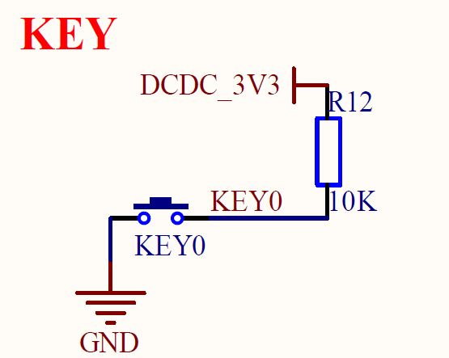

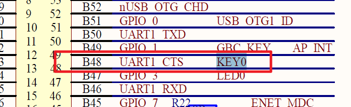

查找参考手册对照表
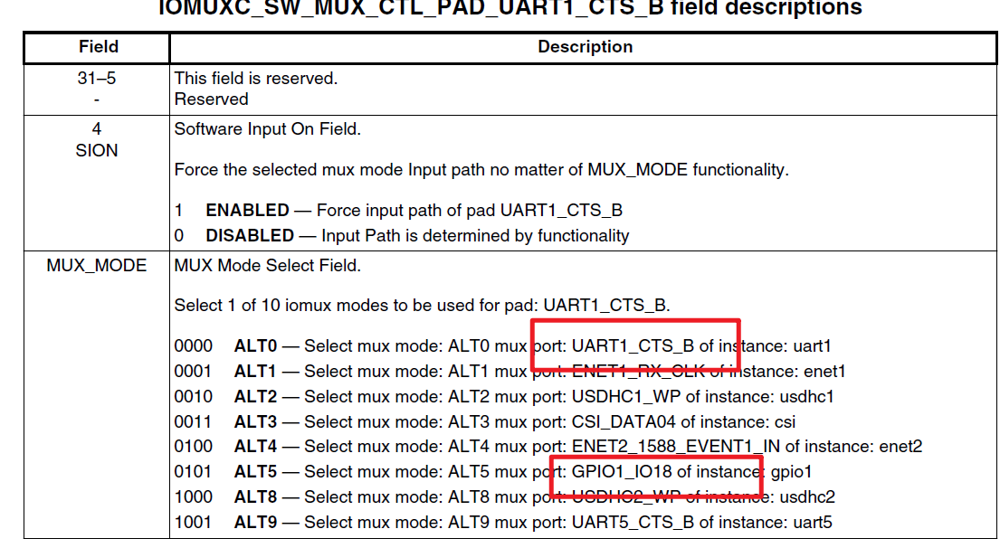

按键KEY0是连接到I.MX6U的UART1_CTS这个IO上的，KEY0接了一个10K的上拉电阻，因此KEY0没有按下的时候UART1_CTS应该是高电平，当KEY0按下以后UART1_CTS就是低电平

### 15.3 实验程序编写

本实验对应的例程路径为：开发板光盘-> 1、裸机例程-> 7_key

本试验在上一章试验例程的基础上完成，在工程目录的bsp文件夹中创建名为“key”和“gpio”两个文件夹。
按键相关的驱动文件都放到“key”文件夹中。
本章试验我们对GPIO的操作编写一个函数集合，也就是编写一个GPIO驱动文件，GPIO的驱动文件放到“gpio”文件夹里面。 

新建bsp_gpio.c 和 bsp_gpio.h 这两个文件，将这两个文件都保存到刚刚创建的bsp/gpio 文件夹里面，然后在bsp_gpio.h文件夹里面输入如下内容：

```C
1  #ifndef _BSP_GPIO_H 
2  #define _BSP_GPIO_H 
3  #define _BSP_KEY_H 
4  #include "imx6ul.h" 
5  /*************************************************************** 
6  Copyright © zuozhongkai Co., Ltd. 1998-2019. All rights reserved. 
7  文件名    : bsp_gpio.h 
8  作者      : 左忠凯 
9  版本      : V1.0 
10 描述      : GPIO操作文件头文件。 
11 其他      : 无 
12 论坛      : www.openedv.com 
13 日志      : 初版V1.0 2019/1/4 左忠凯创建 
14 ***************************************************************/ 
15  
16 /* 枚举类型和结构体定义 */ 
17 typedef enum _gpio_pin_direction 
18 { 
19     kGPIO_DigitalInput = 0U,         /* 输入 无符号整形0*/ 
20     kGPIO_DigitalOutput = 1U,        /* 输出 无符号整型1*/ 
21 } gpio_pin_direction_t; 
22   
23 /* GPIO配置结构体 */ 
24 typedef struct _gpio_pin_config 
25 { 
26     gpio_pin_direction_t direction; /* GPIO方向:输入还是输出   */ 
27     uint8_t outputLogic;             /* 如果是输出的话，默认输出电平  */ 
28 } gpio_pin_config_t; 
29  
30 
31 /* 函数声明 */ 
32 void gpio_init(GPIO_Type *base, int pin, gpio_pin_config_t *config); 
33 int gpio_pinread(GPIO_Type *base, int pin); 
34 void gpio_pinwrite(GPIO_Type *base, int pin, int value); 
35  
36 #endif 
```
bsp_gpio.h中定义了一个枚举类型gpio_pin_direction_t和结构体gpio_pin_config_t，枚举类型gpio_pin_direction_t表示GPIO方向，输入或输出。结构体gpio_pin_config_t是GPIO的配置结构体，里面有GPIO的方向和默认输出电平两个成员变量

```C
1  #include "bsp_gpio.h" 
2  /*************************************************************** 
3  Copyright © zuozhongkai Co., Ltd. 1998-2019. All rights reserved. 
4  文件名    : bsp_gpio.h
5  作者      : 左忠凯 
6  版本      : V1.0 
7  描述      : GPIO操作文件。 
8  其他      : 无 
9  论坛      : www.openedv.com 
10 日志      : 初版V1.0 2019/1/4 左忠凯创建 
11 ***************************************************************/ 
12 
13 /* 
14  * @description   : GPIO初始化。 
15  * @param - base  : 要初始化的GPIO组。 
16  * @param - pin    : 要初始化GPIO在组内的编号。 
17  * @param - config : GPIO配置结构体。 
18  * @return           : 无 
19  */ 
20 void gpio_init(GPIO_Type *base, int pin, gpio_pin_config_t *config) 
21 { //GDIR设置GPIO方向
22   if(config->direction == kGPIO_DigitalInput)  /* 输入 */ 
23   { 
24       base->GDIR &= ~( 1 << pin); 
25   } 
26    else                                           /* 输出 */ 
27   { 
28       base->GDIR |= 1 << pin; 
29       gpio_pinwrite(base,pin, config->outputLogic);/* 默认输出电平*/ 
30   } 
31 } 
32
33  /* 
34   * @description   : 读取指定GPIO的电平值 。 
35   * @param – base : 要读取的GPIO组。 
36   * @param - pin   : 要读取的GPIO脚号。 
37   * @return        : 无 
38   */ 
39  int gpio_pinread(GPIO_Type *base, int pin) 
40  { 
41    return (((base->DR) >> pin) & 0x1); 
42  } 
43  
44  /* 
45   * @description   : 指定GPIO输出高或者低电平 。 
46   * @param – base : 要输出的的GPIO组。 
47   * @param - pin   : 要输出的GPIO脚号。 
48   * @param – value : 要输出的电平，1 输出高电平， 0 输出低低电平 
49   * @return        : 无 
50   */ 
51 void gpio_pinwrite(GPIO_Type *base, int pin, int value) 
52 {DR数据寄存器 
53    if (value == 0U) 
54    { 
55        base->DR &= ~(1U << pin); /* 输出低电平 */ 
56    } 
57    else 
58    { 
59        base->DR |= (1U << pin); /* 输出高电平 */ 
60    } 
61 } 
```
GPIO的功能设置只需要配置好GDIR和DR即可

文件bsp_gpio.c中有三个函数：gpio_init、gpio_pinread和gpio_pinwrite，函数gpio_init用于初始化指定的GPIO引脚方向。

我们以后就可以使用函数gpio_init设置指定GPIO为输入还是输出，使用函数gpio_pinread和gpio_pinwrite来读写指定的GPIO。

下面编写按键驱动文件，
新建bsp_key.c和bsp_key.h这两个文件，将这两个文件都保存到刚刚创建的bsp/key文件夹里面，然后在bsp_key.h文件夹里面输入如下内容：

```C
1  #ifndef _BSP_KEY_H 
2  #define _BSP_KEY_H 
3  #include "imx6ul.h" 
4  /*************************************************************** 
5  Copyright © zuozhongkai Co., Ltd. 1998-2019. All rights reserved. 
6  文件名    : bsp_key.h 
7  作者      : 左忠凯 
8  版本      : V1.0 
9  描述      : 按键驱动头文件。 
10 其他      : 无 
11 论坛      : www.openedv.com 
12 日志      : 初版V1.0 2019/1/4 左忠凯创建 
13 ***************************************************************/ 
14  
15 /* 定义按键值 */ 
16 enum keyvalue{ 
17   KEY_NONE   = 0, 
18   KEY0_VALUE, 
19 }; 
20  
21 /* 函数声明 */ 
22 void key_init(void); 
23 int key_getvalue(void); 
24  
25 #endif 
```
bsp_key.h文件中定义了一个枚举类型：keyvalue，此枚举类型表示按键值，因为I.MX6UALPHA开发板上只有一个按键，因此枚举类型里面只到KEY0_VALUE.

```C
1  #include "bsp_key.h" 
2  #include "bsp_gpio.h" 
3  #include "bsp_delay.h" 
4  /*************************************************************** 
5  Copyright © zuozhongkai Co., Ltd. 1998-2019. All rights reserved. 
6  文件名    : bsp_key.c 
7  作者      : 左忠凯 
8  版本      : V1.0 
9  描述      : 按键驱动文件。 
10 其他      : 无 
11 论坛      : www.openedv.com 
12 日志      : 初版V1.0 2019/1/4 左忠凯创建 
13 ***************************************************************/ 
14 
15 /* 
16  * @description   : 初始化按键 
17  * @param         : 无 
18  * @return        : 无 
19  */ 
20 void key_init(void) 
21 {     
22   gpio_pin_config_t key_config; 
23   
24   /* 1、初始化IO复用, 复用为GPIO1_IO18 */ 
25   IOMUXC_SetPinMux(IOMUXC_UART1_CTS_B_GPIO1_IO18, 0); 
26 
27   /* 2、、配置UART1_CTS_B的IO属性   
28     *bit 16:0 HYS关闭 
29     *bit [15:14]: 11 默认22K上拉 
30     *bit [13]: 1 pull功能 
31     *bit [12]: 1 pull/keeper使能 
32     *bit [11]: 0 关闭开路输出 
33     *bit [7:6]: 10 速度100Mhz 
34     *bit [5:3]: 000 关闭输出 
35     *bit [0]: 0 低转换率 
36    */ 
37   IOMUXC_SetPinConfig(IOMUXC_UART1_CTS_B_GPIO1_IO18, 0xF080); 
38 
39   /* 3、初始化GPIO GPIO1_IO18设置为输入*/ 
40   key_config.direction = kGPIO_DigitalInput; 
41   gpio_init(GPIO1,18, &key_config); 
42   
43 } 
44  
45 /* 
46  * @description   : 获取按键值  
47  * @param         : 无 
48  * @return        : 0 没有按键按下，其他值:对应的按键值 
49  */ 
50 int key_getvalue(void) 
51 { 
52   int ret = 0; 
53   static unsigned char release = 1;  /* 按键松开 */  
54  
55   if((release==1)&&(gpio_pinread(GPIO1, 18) == 0)) /* KEY0按下 */ 
56   {    
57       delay(10);      /* 延时消抖 */ 
58       release = 0;    /* 标记按键按下 */ 
59       if(gpio_pinread(GPIO1, 18) == 0) 
60            ret = KEY0_VALUE;//KEY_BALUE=1 
61   } 
62   else if(gpio_pinread(GPIO1, 18) == 1)  /* KEY0未按下 */ 
63   { 
64       ret = 0; 
65       release = 1;    /* 标记按键释放 */ 
66   } 
67  
68   return ret;  
69 } 
```
bsp_key.c中一共有两个函数：key_init和key_getvalue，key_init是按键初始化函数，用来初始化按键所使用的UART1_CTS这个IO。
函数key_init先设置UART1_CTS复用为GPIO1_IO18，然后配置UART1_CTS这个IO为速度为100MHz，默认22K上拉。
最后调用函数gpio_init来设置GPIO1_IO18为输入功能。

函数key_getvalue用于获取按键值，此函数没有参数，只有一个返回值，返回值表示按键值，返回值为0的话就表示没有按键按下，如果返回其他值的话就表示对应的按键按下了。
获取按键值其实就是不断的读取GPIO1_IO18的值，如果按键按下的话相应的IO被拉低，那么GPIO1_IO18值就为0，如果按键未按下的话GPIO1_IO18的值就为1。此函数中静态局部变量release表示按键是否释放。

延时介绍：
理想按键变化：
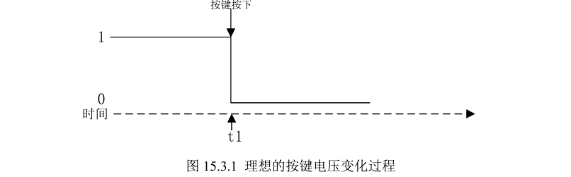

然而实际而言：
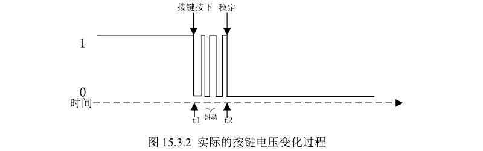

主要由于机械结构问题。

在图中t1时刻按键被按下，但是由于抖动的原因，直到t2时刻才稳定下来，t1到t2这段时间就是抖动。
一般这段时间就是十几ms左右，从图中可以看出在抖动期间会有多次触发，如果不消除这段抖动的话软件就会误判，本来按键就按下了一次，结果软件读取IO值发现电平多次跳变以为按下了多次。
所以我们需要跳过这段抖动时间再去读取按键的IO值，也就是至少要在t2时刻以后再去读IO值。
在“示例”中的57行是延时了大约10ms后再去读取GPIO1_IO18的IO值，如果此时按键的值依旧是0，那么就表示这是一次有效的按键触发。 

注意，本程序中release的存在保证了Key的作用只有一次，同时摁下时，立即生效，且不松开不会读取第二次。
还有一种按键可以设置为对应不同的值，对应于多个按键。
其抖动后的延迟可以用while判断，表示松开后生效。
详情可参见STM32矩阵按键设计。
即：
```C
uint8_t Key_GetNum(void)
{
	uint8_t KeyNum = 0;
	if (GPIO_ReadInputDataBit(GPIOB, GPIO_Pin_1) == 0)
	{
		Delay_ms(20);
		while (GPIO_ReadInputDataBit(GPIOB, GPIO_Pin_1) == 0);
		Delay_ms(20);
		KeyNum = 1;
	}
	if (GPIO_ReadInputDataBit(GPIOB, GPIO_Pin_11) == 0)
	{
		Delay_ms(20);
		while (GPIO_ReadInputDataBit(GPIOB, GPIO_Pin_11) == 0);
		Delay_ms(20);
		KeyNum = 2;
	}
	
	return KeyNum;
}
```
此种设计Key的作用只有一次。
本文的设计如果改用while循环判断，也可以实现松开后生效：
即下：
```c
55   if((release==1)&&(gpio_pinread(GPIO1, 18) == 0)) /* KEY0按下 */ 
56   {    
57       delay(10);      /* 延时消抖 */ 
58       release = 0;    /* 标记按键按下 */ 
59       while(gpio_pinread(GPIO1, 18) == 0); 
60       ret = KEY0_VALUE;//KEY_BALUE=1 
61   } 
```

下面是main.c内容
```c
1  #include "bsp_clk.h" 
2  #include "bsp_delay.h" 
3  #include "bsp_led.h" 
4  #include "bsp_beep.h" 
5  #include "bsp_key.h" 
6   
7  /* 
8   * @description   : main函数 
9   * @param         : 无 
10  * @return        : 无 
11  */ 
12 int main(void) 
13 { 
14   int i = 0; 
15   int keyvalue = 0; 
16   unsigned char led_state = OFF; 
17   unsigned char beep_state = OFF; 
18   
19   clk_enable();       /* 使能所有的时钟  */ 
20   led_init();         /* 初始化led      */ 
21   beep_init();        /* 初始化beep     */ 
22   key_init();         /* 初始化key      */ 
23 
24   while(1)             
25   {    
26       keyvalue = key_getvalue(); 
27       if(keyvalue) //摁下时生效
28       { 
29            switch (keyvalue) //匹配模板
30            { 
31                 case KEY0_VALUE: 
32                    beep_state = !beep_state; 
33                    beep_switch(beep_state); 
34                 break; 
35            } 
36       } 
37       i++; 
38       if(i==50) 
39       { 
40            i = 0; 
41            led_state = !led_state; 
42            led_switch(LED0, led_state); 
43       } 
44      delay(10); 
45   } 
46   return 0; 
47 } 
```
采用delay(10) i++到50的设计，可以增强按键的实时性

效果：
main.c函数先初始化led灯、蜂鸣器和按键，然后在while(1)循环中不断的调用函数key_getvalue来读取按键值。
如果KEY0按下的话就打开/关闭蜂鸣器。LED0作为系统提示指示灯闪烁，闪烁周期大约为500ms。

### 15.4 编译下载

#### 15.4.1 编写MakeFile

Makefile使用第十三章编写的通用Makefile
修改变量TARGET为key
在变量INCDIRS和SRCDIRS中追加“bsp/gpio”和“bsp/key 即可

lds 延续上文即可

#### 15.4.2 下载

编译下载即可

## 第十六章 主频与时钟配置实验

在前几章实验中我们都没有涉及到I.MX6U的时钟和主频配置操作，全部使用的默认配置，默认配置下I.MX6U工作频率为396MHz。
但是I.MX6U系列标准的工作频率为528MHz，有些型号甚至可以工作到696MHz。
本章我们就学习I.MX6U的时钟系统，学习如何配置I.MX6U的系统时钟和其他的外设时钟，使其工作频率为528MHz，其他的外设时钟源都工作在NXP推荐的频率。

### 16.1 I.MX6U时钟系统

I.MX6U 的系统主频为 528MHz，有些型号可以跑到 696MHz，但是默认情况下内部 boot rom 会将I.MX6U的主频设置为396MHz，这个我们在9.2小节已经讲过了。

我们在使用I.MX6U的时候肯定是要发挥它的最大性能，那么主频肯定要设置到 528MHz(其它型号可以设置更高，比如 696MHz)，其它的外设时钟也要设置到 NXP 推荐的值。

I.MX6U 的系统时钟在《I.MX6ULL/I.MX6UL 参考手册》的第10章“Chapter 10 Clock and Power Management”和第18 章“Chapter 18 Clock Controller Module (CCM)”这两章有详细的讲解。

#### 16.1.1 系统时钟来源

开发板时钟原理图如图：

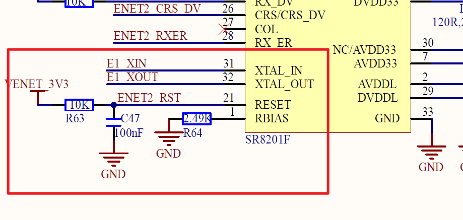

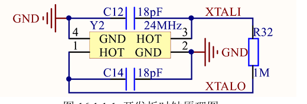

可以看出 I.MX6U-ALPHA 开发板的系统时钟来源于两部分：32.768KHz 和24MHz 的晶振.
其中32.768KHz晶振是I.MX6U 的RTC时钟源，24MHz晶振是I.MX6U内核和其它外设的时钟源，也是我们重点要分析的。

#### 16.1.2 七路PLL时钟源

I.MX6U 的外设有很多，不同的外设时钟源不同，NXP将这些外设的时钟源进行了分组，一共有7组，这7组时钟源都是从24MHz晶振PLL而来的，因此也叫做7组PLL。

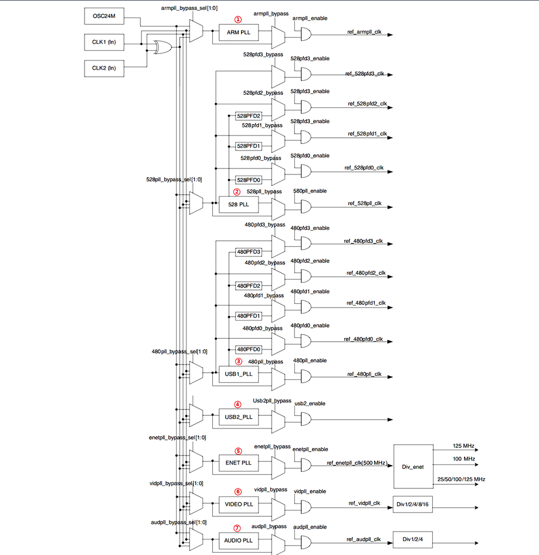

图中展示了7个PLL的关系，我们依次来看一下这7个PLL都是什么做什么的.

①、 ARM_PLL（PLL1），此路PLL是供**ARM内核**使用的，ARM内核时钟就是由此PLL生成的，此PLL通过编程的方式最高可倍频到1.3GHz。 

②、528_PLL(PLL2)，此路PLL也叫做**System_PLL**，此路PLL是固定的22倍频，不可编程修改。
因此，此路PLL时钟=24MHz * 22 = 528MHz，这也是为什么此PLL叫做528_PLL的原因。
此PLL分出了4路PFD，分别为：PLL2_PFD0~PLL2_PFD3，这 4路PFD 和528_PLL共同作为其它很多外设的根时钟源。
通常528_PLL和这4路PFD是**I.MX6U内部系统总线的时钟源**，比如内处理逻辑单元、DDR接口、NAND/NOR接口等等。

③、USB1_PLL(PLL3)，此路 PLL 主要用于 USBPHY，此 PLL 也有四路 PFD，为：PLL3_PFD0~PLL3_PFD3，USB1_PLL是固定的20倍频，因此USB1_PLL=24MHz *20=480MHz。
USB1_PLL虽然主要用于USB1PHY，但是其和四路PFD同样也可以作为其他外设的根时钟源。

④、USB2_PLL(PLL7，没有写错！就是PLL7，虽然序号标为4，但是实际是PLL7)，看名字就知道此路PLL是给USB2PHY使用的。
同样的，此路PLL固定为20倍频，因此也是480MHz。

⑤、ENET_PLL(PLL6),此路 PLL固定为20+5/6倍频，因此ENET_PLL=24MHz * (20+5/6) = 500MHz。
此路PLL用于生成网络所需的时钟，可以在此PLL的基础上生成25/50/100/125MHz的网络时钟。

⑥、VIDEO_PLL(PLL5),此路 PLL用于显示相关的外设，比如LCD，此路PLL的倍频可以调整，PLL 的输出范围在650MHz~1300MHz。
此路 PLL 在最终输出的时候还可以进行分频，可选1/2/4/8/16 分频。

⑦、AUDIO_PLL(PLL4),此路 PLL 用于音频相关的外设，此路PLL的倍频可以调整，PLL的输出范围同样也是650MHz~1300MHz.
此路 PLL 在最终输出的时候也可以进行分频，可选1/2/4 分频。

#### 16.1.3 时钟树简介

讲解了7路PLL，I.MX6U的所有外设时钟源都是从这7路PLL和有些PLL的PFD 而来的，这些外设究竟是如何选择PLL或者PFD的？
这个就要借助《IMX6ULL 参考手册》里面的时钟树了，在“Chapter 18 Clock Controller Module (CCM)”的 18.3小节给出了I.MX6U详细的时钟树图

补充：

    PLL(Phase Locked Loop)一种利用相位同步产生的电压去调谐压控振荡器以产生目标频率的负反馈控制系统。
    它通过外部输入的参考信号控制环路内部振荡信号的频率和相位，实现输出信号频率对输入信号频率的自动跟踪。
    锁相环主要由鉴相器、环路滤波器、分频器、压控振荡器（VCO）和晶体构成，其中VCO是锁相环中的一个重要组成部分。

    ‌PFD（鉴频鉴相器）在PLL（锁相环）中的作用是检测输入参考频率和反馈频率之间的相位差，并将相位差转换为电压信号，进而控制压控振荡器（VCO）的频率，以实现频率和相位的同步‌‌。

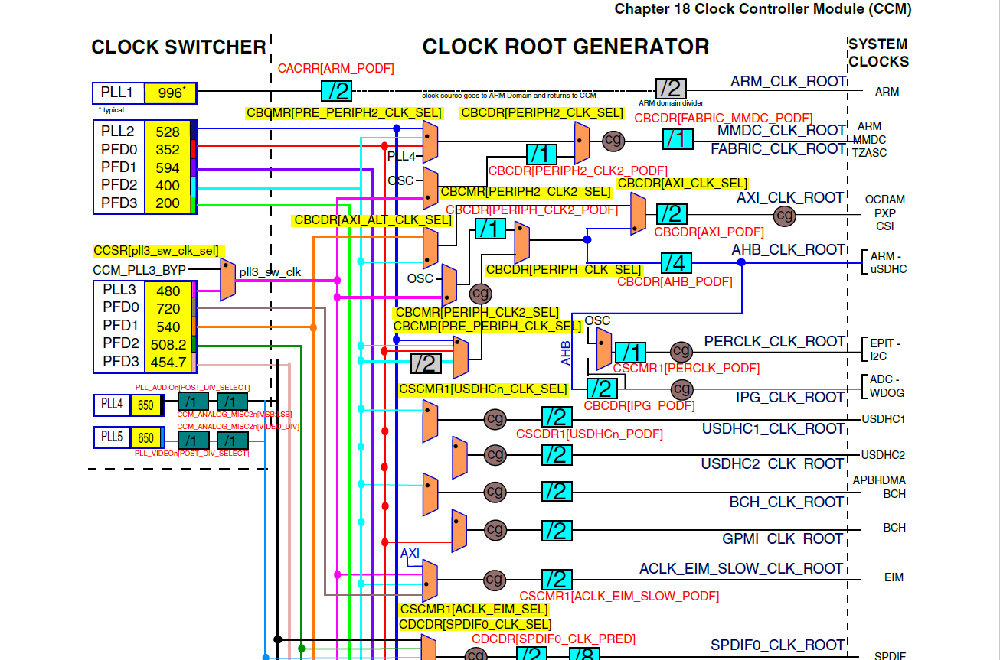
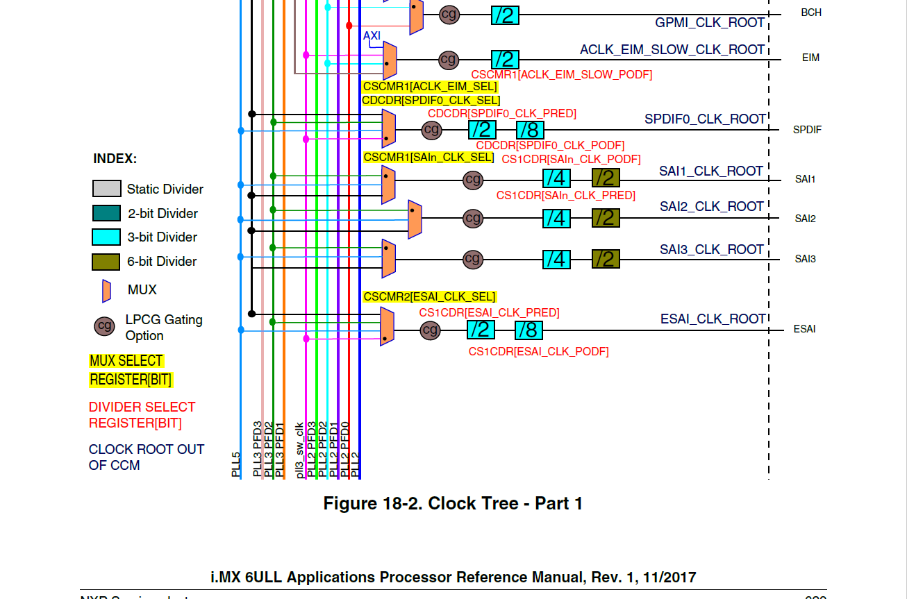


在图中一共有三部分：CLOCK_SWITCHER、CLOCK ROOT GENERATOR 和SYSTEM CLOCKS。
其中左边的CLOCK_SWITCHER就是我们上一小节讲解的那7路PLL和8 路PFD，右边SYSTEM CLOCKS就是芯片外设，中间的CLOCK ROOT GENERATOR是最复杂的！
这一部分就像“月老”一样， 给左边的CLOCK_SWITCHER和右边的SYSTEM CLOCKS进行牵线搭桥。

外设时钟源是有多路可以选择的，CLOCK ROOT GENERATOR就负责从7路PLL 和8路PFD中选择合适的时钟源给外设使用。
具体操作肯定是设置相应的寄存器，我们以ESAI 这个外设为例:
ESAI的时钟图如图:

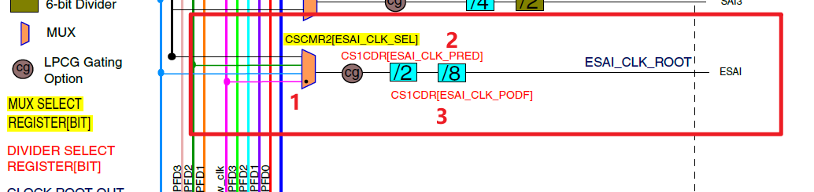

在图中我们分为了3部分，这三部分如下：

①、此部分是时钟源选择器，ESAI 有 4 个可选的时钟源：PLL4、PLL5、PLL3_PFD2 和pll3_sw_clk 。
具体选择哪一路作为 ESAI 的时钟源是由寄存器 CCM->CSCMR2 的ESAI_CLK_SEL 位来决定的，用户可以自由配置:

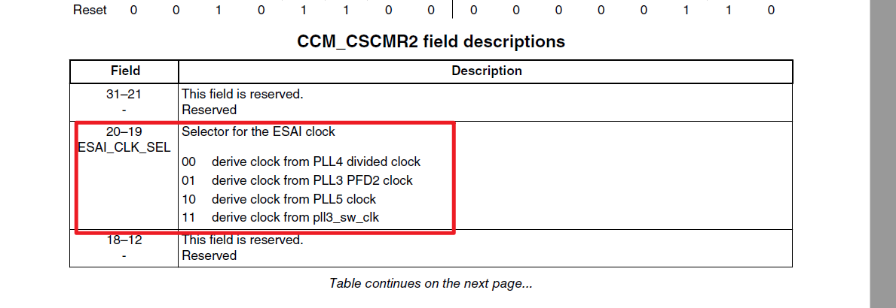

②、此部分是ESAI时钟的前级分频，分频值由寄存器CCM_CS1CDR的ESAI_CLK_PRED来确定的，可设置1~8分频。
假如现在PLL4=650MHz，我们选择PLL4作为ESAI时钟，前级分频选择2分频，那么此时的时钟就是650/2=325MHz。 

③、此部分又是一个分频器，对②中输出的时钟进一步分频，分频值由寄存器CCM_CS1CDR 的 ESAI_CLK_PODF 来决定，可设置 1~8 分频。
假如我们设置为8分频的话，经过此分频器以后的时钟就是 325/8=40.625MHz。因此最终进入到 ESAI 外设的时钟就是40.625MHz。

上面我们以外设ESAI 为例讲解了如何根据图来设置外设的时钟频率，其他的外设基本类似的，大家可以自行分析一下其他的外设。
关于外设时钟配置相关内容全部都在《I.MX6ULL 参考手册》的第18章。

#### 16.1.4 内核时钟设置

I.MX6U 的时钟系统前面几节已经分析的差不多了，现在就可以开始设置相应的时钟频率了。
先从主频开始，我们将I.MX6U的主频设置为528MHz，根据时钟树可以看到ARM内核时钟如图所示：

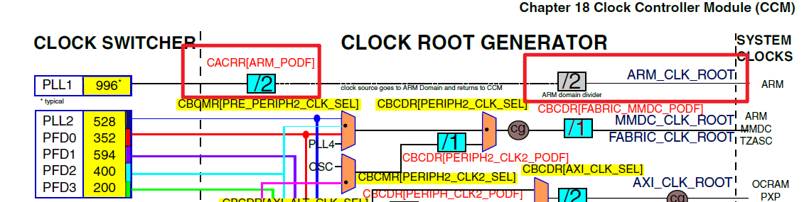

①、内核时钟源来自于PLL1，假如此时PLL1为996MHz。
②、通过寄存器CCM_CACRR的ARM_PODF位对PLL1进行分频，可选择1/2/4/8分频，假如我们选择2分频，那么经过分频以后的时钟频率是996/2=498MHz。 
③、大家不要被此处的2分频给骗了，此处没有进行2分频(我就被这个2分频骗了好久，主频一直配置不正确！)。
④、经过第②步2分频以后的498MHz就是ARM的内核时钟，也就是I.MX6U的主频。

经过上面几步的分析可知，假如我们要设置内核主频为 528MHz，那么 PLL1 可以设置为1056MHz，寄存器CCM_CACRR的ARM_PODF位设置为2分频即可。
同理，如果要将主频设置为696MHz，那么PLL1就可以设置为696MHz，CCM_CACRR的ARM_PODF设置为1分频即可。

现在问题很清晰了，寄存器CCM_CACRR的ARM_PODF位很好设置.
<span style="color:red">PLL1的频率可以通过寄存器CCM_ANALOG_PLL_ARMn 来设置</span>

接下来详细的看一下 CCM_CACRR 和CCM_ANALOG_PLL_ARMn这两个寄存器:


CCM_CACRR:

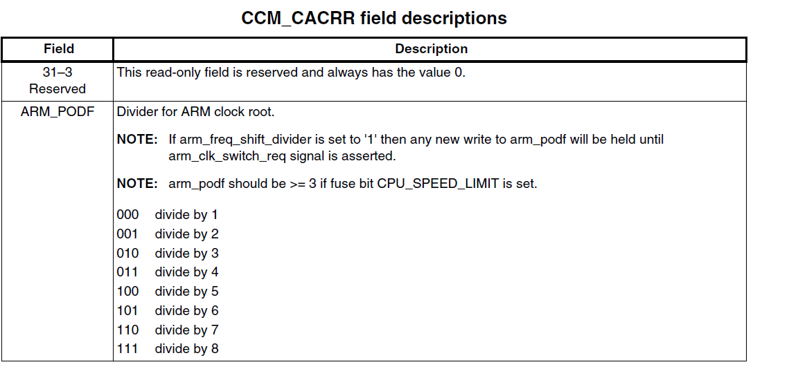

寄存器CCM_CACRR只有ARM_PODF位，可以设置为0\~7，分别对应1\~8分频。如果要设置为2分频的话CCM_CACRR就要设置为1。

CCM_ANALOG_PLL_ARMn:

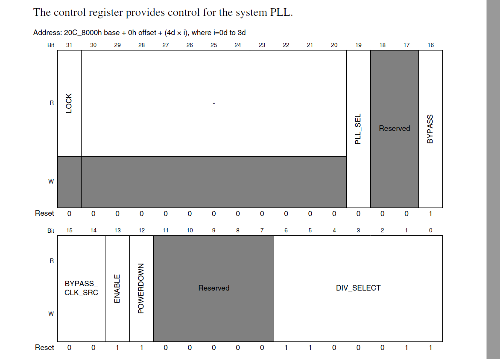
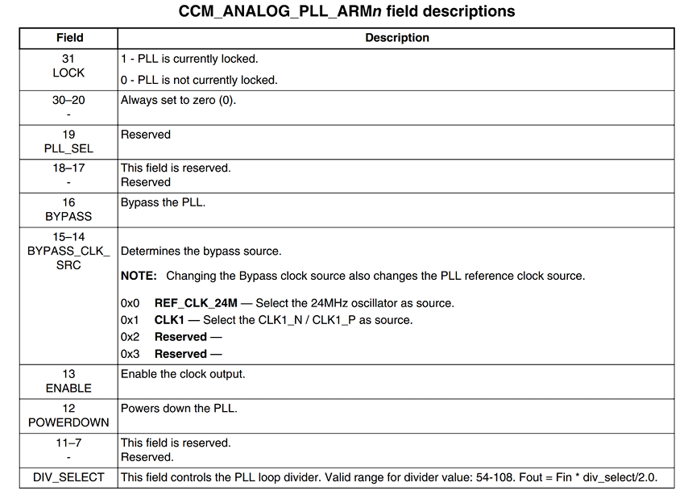

在寄存器CCM_ANALOG_PLL_ARMn中重要的位如下：

**ENABLE**: 时钟输出使能位，此位设置为1使能PLL1输出，如果设置为0的话就关闭PLL1输出。

**DIV_SELECT**: 此七位设置PLL1的输出频率，可设置范围为：54~108。
PLL1 CLK = Fin * div_seclec/2.0，Fin=24MHz。
如果 PLL1 要输出 1056MHz的话，div_select就要设置为88。

在修改PLL1时钟频率的时候我们需要先将内核时钟源改为其他的时钟源，PLL1可选择的时钟源如图：
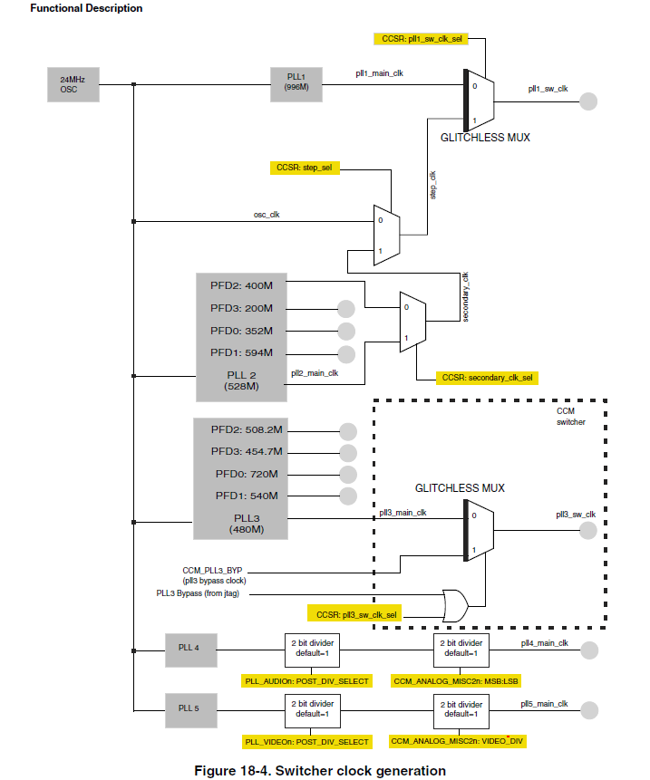
取下部分
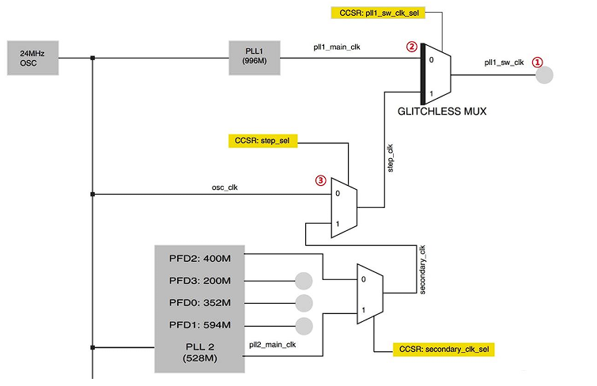

①、pll1_sw_clk 也就是PLL1 的最终输出频率。

②、此处是一个选择器，选择 pll1_sw_clk 的时钟源，由寄存器 CCM_CCSR 的PLL1_SW_CLK_SEL 位决定 pll1_sw_clk 是选择 pll1_main_clk 还是 step_clk。
正常情况下应该选择pll1_main_clk，但是如果要对pll1_main_clk(PLL1)的频率进行调整的话，比如我们要设置PLL1=1056MHz，此时就要先将pll1_sw_clk切换到step_clk 上。
等pll1_main_clk 调整完成以后再切换回来。 

③、此处也是一个选择器，选择step_clk的时钟源，由寄存器CCM_CCSR的STEP_SEL位来决定step_clk 是选择 osc_clk 还是 secondary_clk。一般选择 osc_clk，也就是 24MHz 的晶振。

故而我们需要调整两个寄存器，CCSR:Pll1_sw_clk_sel 和 CCSR:step_sel

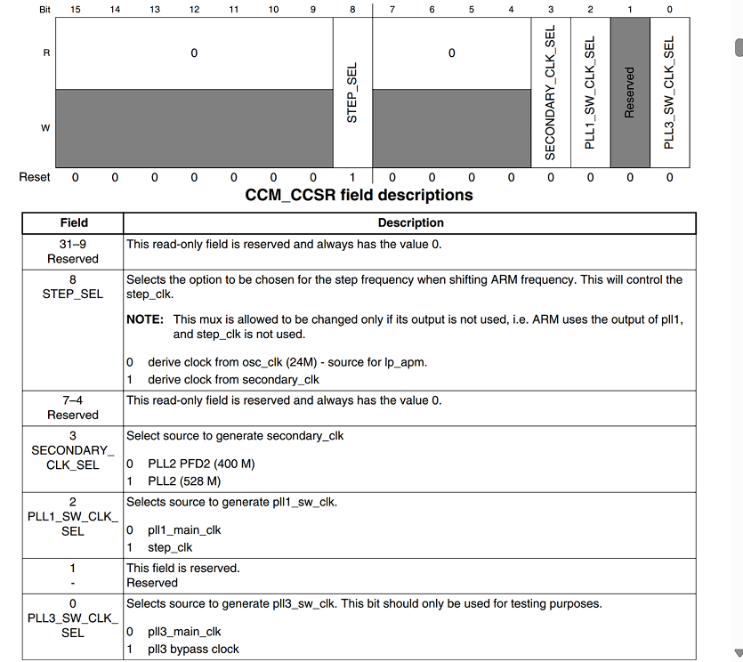

寄存器CCM_CCSR我们只用到了STEP_SEL、PLL1_SW_CLK_SEL这两个位，一个是用来选择step_clk 时钟源的，一个是用来选择pll1_sw_clk时钟源的。

到这里，修改I.MX6U主频的步骤就很清晰了，修改步骤如下：

①、 设置寄存器CCSR的STEP_SEL位，设置step_clk的时钟源为24M的晶振。 
②、设置寄存器 CCSR 的 PLL1_SW_CLK_SEL 位，设置 pll1_sw_clk 的时钟源为
step_clk=24MHz，通过这一步我们就将 I.MX6U 的主频先设置为 24MHz，直接来自于外部的24M晶振。 
③、设置寄存器CCM_ANALOG_PLL_ARMn，将pll1_main_clk(PLL1)设置为1056MHz。 
④、设置寄存器 CCSR 的 PLL1_SW_CLK_SEL 位，重新将 pll1_sw_clk 的时钟源切换回pll1_main_clk，切换回来以后的pll1_sw_clk 就等于 1056MHz。 
⑤、最后设置寄存器CCM_CACRR 的 ARM_PODF 为 2 分频，I.MX6U 的内核主频就为1056/2=528MHz。 

注意：

    ‌PLL1是I.MX6U处理器中的一个时钟源‌，主要用于生成ARM内核时钟。
    PLL1通过编程可以倍频到最高1.3GHz‌。

#### 16.1.5 PED时钟设置

设置好主频以后我们还需要设置好其他的PLL和PFD时钟，PLL1上一小节已经设置了，PLL2、PLL3 和 PLL7 固定为 528MHz、480MHz 和 480MHz，PLL4~PLL6 都是针对特殊外设的，用到的时候再设置。

接下来重点就是设置PLL2和PLL3的各自4路PFD，NXP推荐的这8路PFD频率如表：
| PFD       | NXP推荐值            |
| --------- | -------------------- |
| PLL2_PFD0 | 352MHz               |
| PLL2_PFD1 | 594MHz               |
| PLL2_PFD2 | 400MHz(实际为396MHz) |
| PLL2_PFD3 | 297MHz               |
| PLL3_PFD0 | 720MHz               |
| PLL3_PFD1 | 540MHz               |
| PLL3_PFD2 | 508.2MHz             |
| PLL3_PFD3 | 454.7MHz             |

先设置PLL2的4路PFD频率，用到寄存器是CCM_ANALOG_PFD_528n
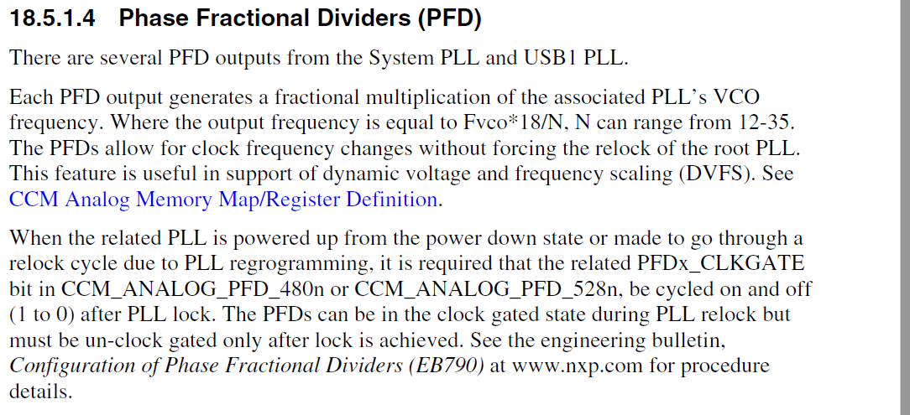

CCM_ANALOG_PFD_528n结构：
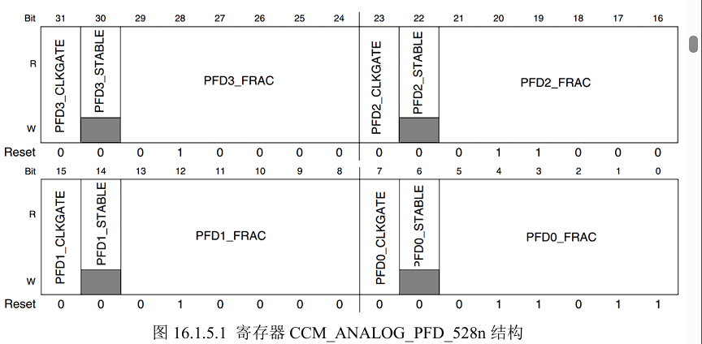

寄存器 CCM_ANALOG_PFD_528n 其实分为四组，分别对应PFD0~PFD3，每组8个bit，我们就以PFD0为例，看一下如何设置PLL2_PFD0的频率:

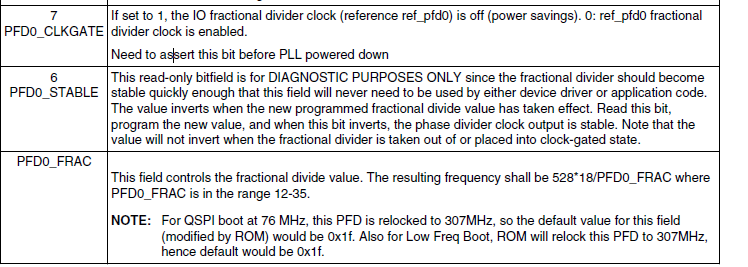

**PFD0_FRAC**: PLL2_PFD0 的分频数，PLL2_PFD0的计算公式为528*18/PFD0_FRAC，此位可设置的范围为12~35。
如果 PLL2_PFD0 的频率要设置为 352MHz 的话PFD0_FRAC=528*18/352=27。

**PFD0_STABLE**: 此位为只读位，可以通过读取此位判断PLL2_PFD0是否稳定。 

**PFD0_CLKGATE**: PLL2_PFD0 输出使能位，为1的时候关闭PLL2_PFD0的输出，为0的时候使能输出

如果我们要设置 PLL2_PFD0 的频率为 352MHz 的话就需要设置 PFD0_FRAC 为 27，PFD0_CLKGATE 为 0 。 
PLL2_PFD1~PLL2_PFD3 设置类似，频率计算公式都是528*18/PFDX_FRAC(X=1~3) ；
因此 PLL2_PFD1=594MHz 的话，PFD1_FRAC=16 ；
PLL2_PFD2=400MHz 的话 PFD2_FRAC不能整除，因此取最近的整数值，即PFD2_FRAC=24，这样PLL2_PFD2实际为396MHz；
PLL2_PFD3=297MHz的话，PFD3_FRAC=32。

下面设置PLL3_PFD0~PLL3_PFD3，使用到的寄存器是CCM_ANALOG_PFD_480n：

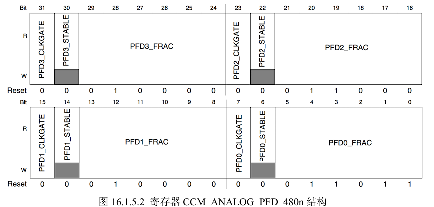

从图可以看出，寄存器CCM_ANALOG_PFD_480n和CCM_ANALOG_PFD_528n的结构是一模一样的，只是一个是PLL2的，一个是PLL3的。
寄存器位的含义也是一样的，只是频率计算公式不同，比如 PLL3_PFDX=480*18/PFDX_FRAC(X=0~3) 。

如果PLL3_PFD0=720MHz 的话，PFD0_FRAC=12；
如果 PLL3_PFD1=540MHz的话，PFD1_FRAC=16;
如果 PLL3_PFD2=508.2MHz 的话，PFD2_FRAC=17；
如果 PLL3_PFD3=454.7MHz 的话，PFD3_FRAC=19。 

#### 16.1.6 AHB、IPG和PERCLK时钟设置

7 路PLL和8路PFD设置完成以后最后还需要设置AHB_CLK_ROOT和IPG_CLK_ROOT的时钟，I.MX6U外设根时钟可设置范围如图所示：
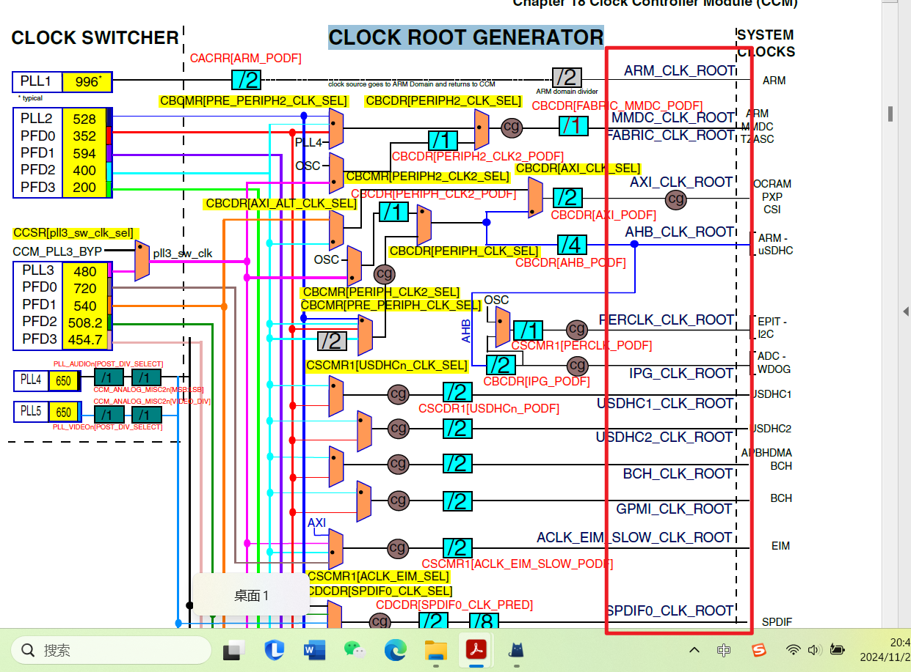
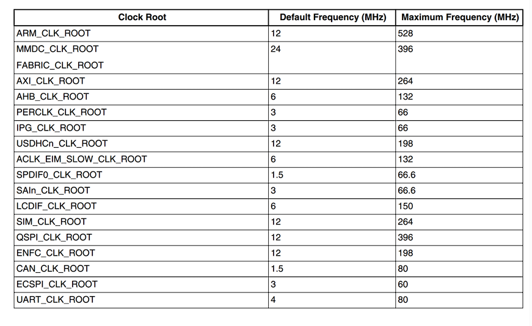

图中给出了大多数外设的根时钟设置范围，AHB_CLK_ROOT最高可以设置132MHz，IPG_CLK_ROOT和PERCLK_CLK_ROOT最高可以设置66MHz。
那我们就将AHB_CLK_ROOT、IPG_CLK_ROOT 和 PERCLK_CLK_ROOT 分别设置为 132MHz、66MHz、66MHz。

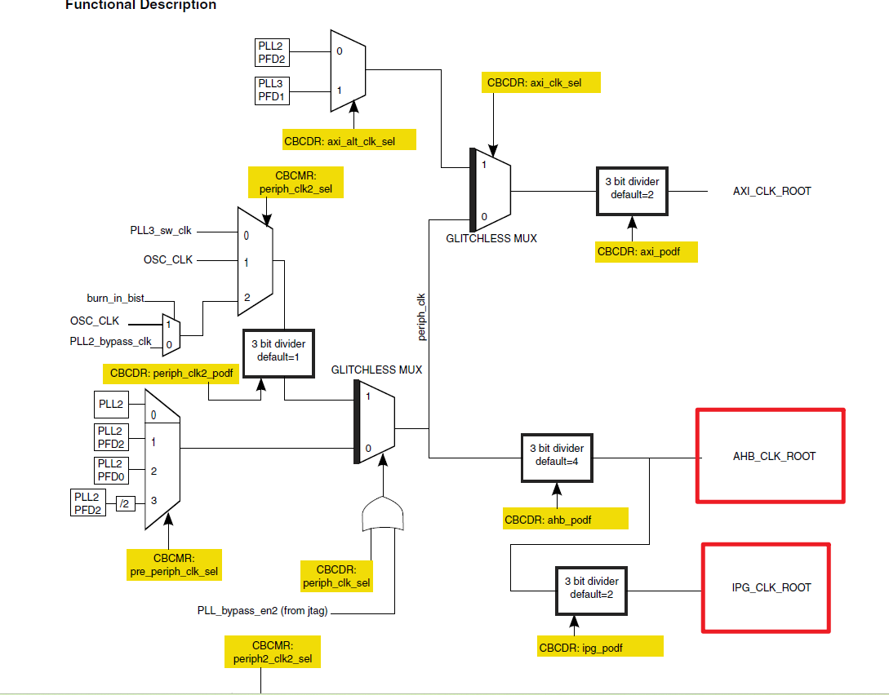
分部分分析：
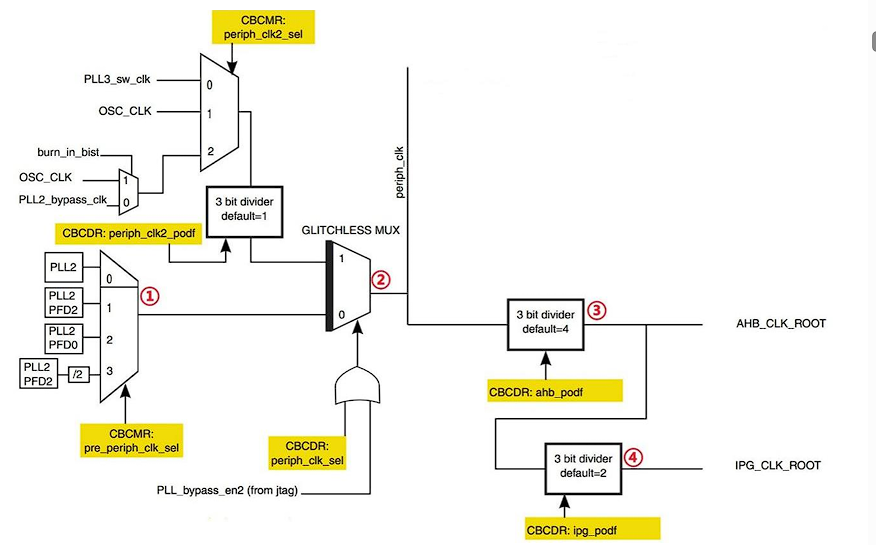

①、此选择器用来选择pre_periph_clk的时钟源，可以选择PLL2、PLL2_PFD2、PLL2_PFD0和PLL2_PFD2/2。
寄存器CCM_CBCMR的PRE_PERIPH_CLK_SEL 位决定选择哪一个，默认选择PLL2_PFD2，因此pre_periph_clk=PLL2_PFD2=396MHz。

②、此选择器用来选择periph_clk的时钟源，由寄存器CCM_CBCDR的PERIPH_CLK_SEL位与PLL_bypass_en2 组成的或来选择。
当CCM_CBCDR的PERIPH_CLK_SEL 位为0的时候periph_clk=pr_periph_clk=396MHz。

③、通过CBCDR的AHB_PODF位来设置AHB_CLK_ROOT的分频值，可以设置1~8分频，如果想要AHB_CLK_ROOT=132MHz的话就应该设置为3分频：396/3=132MHz。
图中虽然写的是默认4分频，但是I.MX6U的内部boot rom将其改为了3分频！ 

④、通过CBCDR的IPG_PODF位来设置IPG_CLK_ROOT的分频值，可以设置1~4分频，IPG_CLK_ROOT 时钟源是AHB_CLK_ROOT，要想IPG_CLK_ROOT=66MHz的话就应该设置2 分频：132/2=66MHz。 

最后要设置的就是PERCLK_CLK_ROOT时钟频率，其时钟结构图:

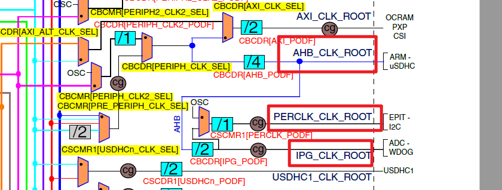

从图可 以看出，PERCLK_CLK_ROOT 来源有两种：OSC(24MHz)和IPG_CLK_ROOT，由寄存器 CCM_CSCMR1 的 PERCLK_CLK_SEL 位来决定，如果为 0 的话PERCLK_CLK_ROOT 的时钟源就是 IPG_CLK_ROOT=66MHz 。
可以通过寄存器CCM_CSCMR1的PERCLK_PODF位来设置分频，如果要设置PERCLK_CLK_ROOT为66MHz的话就要设置为1分频。

在上面的设置中用到了三个寄存器：CCM_CBCDR、CCM_CBCMR和CCM_CSCMR1，我们依次来看一下这些寄存器

CCM_CBCDR:
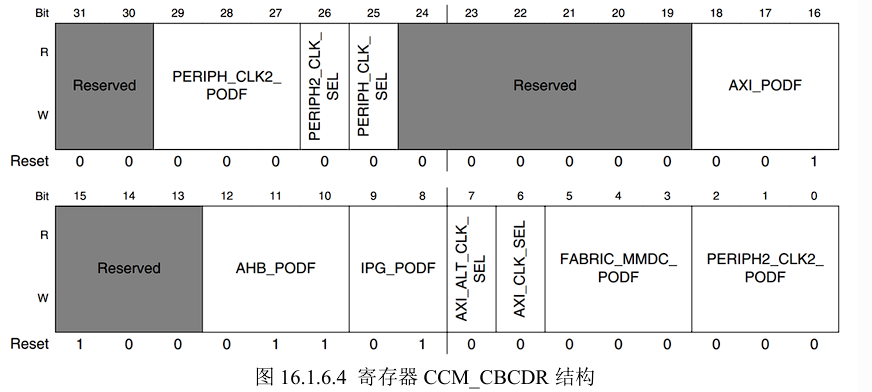

各个位的解释如下：

**PERIPH_CLK2_PODF**：periph2 时钟分频，可设置0~7，分别对应1~8分频。 
**PERIPH2_CLK_SEL**：选择peripheral2 的主时钟，如果为0的话选择PLL2，如果为1的话选择periph2_clk2_clk。修改此位会引起一次与 MMDC的握手，所以修改完成以后要等待握手完成，握手完成信号由寄存器CCM_CDHIPR中指定位表示。 
**PERIPH_CLK_SEL**：peripheral 主时钟选择，如果为 0 的话选择 PLL2，如果为 1 的话选择periph_clk2_clock。修改此位会引起一次与MMDC的握手，所以修改完成以后要等待握手完成，握手完成信号由寄存器CCM_CDHIPR中指定位表示。 
**AXI_PODF**：axi 时钟分频，可设置0~7，分别对应1~8分频。 
**AHB_PODF**：ahb 时钟分频，可设置 0~7，分别对应 1~8 分频。修改此位会引起一次与MMDC的握手，所以修改完成以后要等待握手完成，握手完成信号由寄存CCM_CDHIPR中指定位表示。 
**IPG_PODF**：ipg时钟分频，可设置0~3，分别对应1~4分频。 
**AXI_ALT_CLK_SEL**：axi_alt 时钟选择，为 0 的话选择 PLL2_PFD2，如果为 1 的话选择PLL3_PFD1。 
**AXI_CLK_SEL**：axi 时钟源选择，为0 的话选择periph_clk，为 1 的话选择 axi_alt 时钟。 
**FABRIC_MMDC_PODF**：fabric/mmdc 时钟分频设置，可设置0~7，分别对应1~8分频。 
**PERIPH2_CLK2_PODF**：periph2_clk2 的时钟分频，可设置0~7，分别对应1~8分频。

CCM_CBCMR：
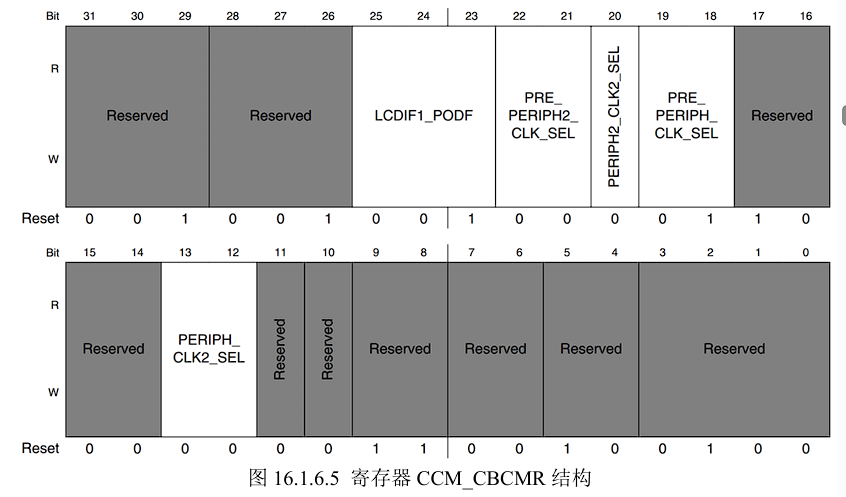
寄存器CCM_CBCMR各个位的含义如下:

**LCDIF1_PODF**：lcdif1 的时钟分频，可设置0~7，分别对应1~8分频。 
**PRE_PERIPH2_CLK_SEL**：pre_periph2 时钟源选择，00选择PLL2，01选择PLL2_PFD2，10 选择PLL2_PFD0，11 选择PLL4。 
**PERIPH2_CLK2_SEL**：periph2_clk2 时钟源选择为0的时候选择pll3_sw_clk，为 1的时候选择OSC。 
**PRE_PERIPH_CLK_SEL**：pre_periph 时钟源选择，00选择PLL2，01选择PLL2_PFD2，10选择PLL2_PFD0，11 选择PLL2_PFD2/2。 
**PERIPH_CLK2_SEL**：peripheral_clk2 时钟源选择，00 选择pll3_sw_clk，01 选择 osc_clk，10 选择pll2_bypass_clk。 

CCM_CSCMR1:
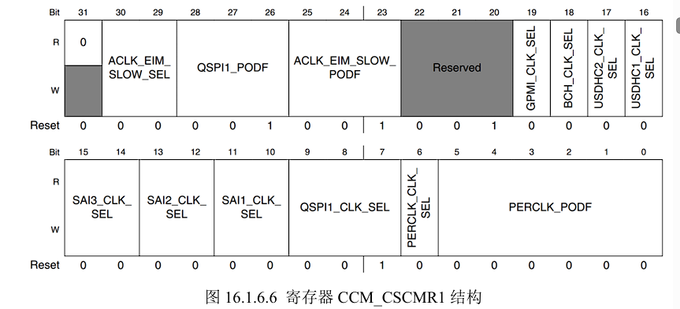
此寄存器主要用于外设时钟源的选择，比如QSPI1、ACLK、GPMI、BCH等外设，我们重点看一下下面两个位:

**PERCLK_CK_SEL**：perclk 时钟源选择，为0的话选择ipg clk，为1的话选择osc clk。
**PERCLK_PODF**：perclk的时钟分频，可设置0~7，分别对应1~8分频。

至此，此三个寄存器介绍完毕！
需要注意的是：
在修改如下时钟选择器或者分频器的时候会引起与MMDC的握手发生：
①、mmdc_podf 
②、periph_clk_sel 
③、periph2_clk_sel 
④、arm_podf 
⑤、ahb_podf 
发生握手信号以后需要等待握手完成，寄存器CCM_CDHIPR中保存着握手信号是否完成，如果相应的位为1的话就表示握手没有完成，如果为0的话就表示握手完成，很简单，这里就不详细的列举寄存器CCM_CDHIPR中的各个位了。 

补充：MMDC握手

    MMDC（Multi-Mode DDR Controller，多模式DDR控制器）是一种用于管理和控制动态随机存储器（DRAM）的硬件模块，通常应用于嵌入式系统、片上系统（SoC）或专用集成电路（ASIC）中。
    它主要负责协调处理器或其他模块与DDR存储器之间的数据传输，确保存储器的高效使用和系统性能的最大化。
    MMDC（Multimedia Domain Controller）握手通常是指MMDC与其配套的外设（如存储器、显示器等）或主机之间的数据传输初始化和握手协议过程。

另外在修改arm_podf和ahb_podf的时候需要先关闭其时钟输出，等修改完成以后再打开，否则的话可能会出现在修改完成以后没有时钟输出的问题。
本教程需要修改寄存器CCM_CBCDR的AHB_PODF位来设置AHB_ROOT_CLK的时钟，所以在修改之前必须先关闭AHB_ROOT_CLK的输出。
但是笔者没有找到相应的寄存器，因此目前没法关闭，那也就没法设置AHB_PODF了。
不过**AHB_PODF内部boot rom设置为了3分频**，如果pre_periph_clk的时钟源选择PLL2_PFD2的话，AHB_ROOT_CLK也是396MHz/3=132MHz。

至此，I.MX6U 的时钟系统就讲解完了，I.MX6U 的时钟系统还是很复杂的，大家要结合《I.MX6ULL 参考手册》中时钟相关的结构图来学习。
本章我们也只是讲解了如何进行主频、PLL、PFD 和一些总线时钟的设置，关于具体的外设时钟设置我们在学习到的时候在详细的讲解。

### 16.2 硬件原理分析

时钟原理图分析参考16.1.1小节

### 16.3 程序编写

补充：

    pll1_main_clk
    定义：
    pll1_main_clk 是由 PLL1（Phase Locked Loop 1）生成的主要时钟信号，直接输出自 PLL 的频率锁相环模块。
    该信号通常具有较高的精度和稳定性，用于为系统中对高频率或高精度时钟有需求的模块提供时钟。
    特点：
    源头直接：由 PLL1 的频率生成逻辑直接提供。
    固定频率：频率一般是通过硬件或软件配置，固定生成的（如 800 MHz）。
    用途：
    可用于系统总线时钟、核心处理器时钟或其他需要高性能的模块。

    pll1_sw_clk
    定义：
    pll1_sw_clk 是通过切换（Switch）逻辑生成的时钟信号，可能从多个时钟源中选择一个，包括 pll1_main_clk 和备用时钟（如外部晶振或内部低速时钟）。
    它允许动态切换时钟源，以便在系统中实现灵活的时钟管理。
    特点：
    动态选择：通过寄存器或硬件控制，可以选择使用 pll1_main_clk 或其他时钟源。
    灵活性：可根据系统状态（如低功耗模式、调试模式）切换到不同的时钟。
    用途：
    在低功耗模式下，可能切换到更低频率的时钟源。
    在正常运行模式下，可以选择高性能时钟源（如 pll1_main_clk）

本实验对应的例程路径为：开发板光盘-> 1、裸机例程-> 8_clk

本试验在上一章试验“7_key”的基础上完成，因为本试验是配置I.MX6U的系统时钟，因此我们直接在文件“bsp_clk.c”上做修改，修改bsp_clk.c的内容如下：

```C
1   #include "bsp_clk.h" 
2    
3   /*************************************************************** 
4   Copyright © zuozhongkai Co., Ltd. 1998-2019. All rights reserved. 
5   文件名   : bsp_clk.c 
6   作者     : 左忠凯 
7   版本     : V1.0 
8   描述     : 系统时钟驱动。 
9   其他     : 无 
10  论坛     : www.openedv.com 
11  日志     : 初版V1.0 2019/1/3 左忠凯创建 
12   
13            V2.0     2019/1/3 左忠凯修改 
14            添加了函数imx6u_clkinit()，完成I.MX6U的系统时钟初始化 
15  ***************************************************************/ 
16   
17  /* 
18   * @description : 使能I.MX6U所有外设时钟 
19   * @param       : 无 
20   * @return      : 无 
21   */ 
22  void clk_enable(void) 
23  { 
24      CCM->CCGR0 = 0XFFFFFFFF; 
25      CCM->CCGR1 = 0XFFFFFFFF; 
26      CCM->CCGR2 = 0XFFFFFFFF; 
27      CCM->CCGR3 = 0XFFFFFFFF; 
28      CCM->CCGR4 = 0XFFFFFFFF; 
29      CCM->CCGR5 = 0XFFFFFFFF; 
30      CCM->CCGR6 = 0XFFFFFFFF; 
31  } 
32   
33  /* 
34   * @description : 初始化系统时钟528Mhz，并且设置PLL2和PLL3各个 
35                    PFD时钟,所有的时钟频率均按照I.MX6U官方手册推荐的值. 
36   * @param       : 无 
37   * @return      : 无 
38   */ 
39  void imx6u_clkinit(void) 
40  { 
41      unsigned int reg = 0; 
42      /* 1、设置ARM内核时钟为528MHz */ 
43      /* 1.1、判断当使用哪个时钟源启动的，正常情况下是由pll1_sw_clk驱动的，而 
44       *      pll1_sw_clk有两个来源：pll1_main_clk和step_clk，如果要 
45       *      让I.MX6ULL跑到528M，那必须选择pll1_main_clk作为pll1的时钟 
46       *      源。如果我们要修改pll1_main_clk时钟的话就必须先将pll1_sw_clk从 
47       *      pll1_main_clk切换到step_clk,当修改完以后再将pll1_sw_clk切换 
48       *      回pll1_main_cl，step_clk等于24MHz。 
49       */ 
50
51      if((((CCM->CCSR) >> 2) & 0x1 ) == 0) /*   pll1_main_clk */ 
52      {    
53          CCM->CCSR &= ~(1 << 8);  /* 配置step_clk时钟源为24MHz OSC */     
54          CCM->CCSR |= (1 << 2);   /* 配置pll1_sw_clk时钟源为step_clk */ 
55      } 
56  
57      /* 1.2、设置pll1_main_clk为1056MHz,也就是528*2=1056MHZ, 
58       *      因为pll1_sw_clk进ARM内核的时候会被二分频！ 
59       *      配置CCM_ANLOG->PLL_ARM寄存器 
60       *      bit13: 1 使能时钟输出 
61       *      bit[6:0]: 88, 由公式：Fout = Fin * div_select / 2.0， 
62       *      1056=24*div_select/2.0, 得出：div_select=88。   
63       */ 
64      CCM_ANALOG->PLL_ARM = (1 << 13) | ((88 << 0) & 0X7F);  
65      CCM->CCSR &= ~(1 << 2);/* 将pll_sw_clk时钟切换回pll1_main_clk */ 
66      CCM->CACRR = 1;    /* ARM内核时钟为pll1_sw_clk/2=1056/2=528Mhz */ 
67 
68      /* 2、设置PLL2(SYS PLL)各个PFD */ 
69      reg = CCM_ANALOG->PFD_528; 
70      reg &= ~(0X3F3F3F3F); /* 清除原来的设置                   */ 
71      reg |= 32<<24;            /* PLL2_PFD3=528*18/32=297Mhz   */ 
72      reg |= 24<<16;            /* PLL2_PFD2=528*18/24=396Mhz   */ 
73      reg |= 16<<8;              /* PLL2_PFD1=528*18/16=594Mhz   */ 
74      reg |= 27<<0;             /* PLL2_PFD0=528*18/27=352Mhz   */ 
75      CCM_ANALOG->PFD_528=reg; /* 设置PLL2_PFD0~3                 */ 
76 
77      /* 3、设置PLL3(USB1)各个PFD */ 
78      reg = 0;                    /* 清零   */ 
79      reg = CCM_ANALOG->PFD_480; 
80      reg &= ~(0X3F3F3F3F);    /* 清除原来的设置                     */ 
81      reg |= 19<<24;            /* PLL3_PFD3=480*18/19=454.74Mhz    */ 
82      reg |= 17<<16;            /* PLL3_PFD2=480*18/17=508.24Mhz    */ 
83      reg |= 16<<8;             /* PLL3_PFD1=480*18/16=540Mhz        */ 
84      reg |= 12<<0;             /* PLL3_PFD0=480*18/12=720Mhz       */ 
85      CCM_ANALOG->PFD_480=reg;    /* 设置PLL3_PFD0~3                */   
86  
87      /* 4、设置AHB时钟 最小6Mhz， 最大132Mhz */ 
88      CCM->CBCMR &= ~(3 << 18);  /* 清除设置*/  
89      CCM->CBCMR |= (1 << 18);   /* pre_periph_clk=PLL2_PFD2=396MHz */ 
90      CCM->CBCDR &= ~(1 << 25);  /* periph_clk=pre_periph_clk=396MHz */ 
91      while(CCM->CDHIPR & (1 << 5));/* 等待握手完成 */ 
92           
93      /* 修改AHB_PODF位的时候需要先禁止AHB_CLK_ROOT的输出，但是 
94       * 我没有找到关闭AHB_CLK_ROOT输出的的寄存器，所以就没法设置。 
95       * 下面设置AHB_PODF的代码仅供学习参考不能直接拿来使用！！ 
96       * 内部boot rom将AHB_PODF设置为了3分频，即使我们不设置AHB_PODF， 
97       * AHB_ROOT_CLK也依旧等于396/3=132Mhz。 
98       */ 
99  #if 0 
100     /* 要先关闭AHB_ROOT_CLK输出，否则时钟设置会出错 */ 
101     CCM->CBCDR &= ~(7 << 10);/* CBCDR的AHB_PODF清零 */ 
102     CCM->CBCDR |= 2 << 10; /* AHB_PODF 3分频，AHB_CLK_ROOT=132MHz */ 
103     while(CCM->CDHIPR & (1 << 1));/* 等待握手完成 */ 
104 #endif 
105      
106     /* 5、设置IPG_CLK_ROOT最小3Mhz，最大66Mhz */ 
107     CCM->CBCDR &= ~(3 << 8); /* CBCDR的IPG_PODF清零 */ 
108     CCM->CBCDR |= 1 << 8;    /* IPG_PODF 2分频，IPG_CLK_ROOT=66MHz */ 
109      
110     /* 6、设置PERCLK_CLK_ROOT时钟 */ 
111     CCM->CSCMR1 &= ~(1 << 6);   /* PERCLK_CLK_ROOT时钟源为IPG */ 
112     CCM->CSCMR1 &= ~(7 << 0);   /* PERCLK_PODF位清零，即1分频 */ 
113 } 
```

文件bsp_clk.c中一共有两个函数：
clk_enable和imx6u_clkinit，其中函数clk_enable前面已经讲过了，就是使能I.MX6U的所有外设时钟。
函数imx6u_clkinit才是本章的重点，imx6u_clkinit先设置系统主频为528MHz，然后根据我们上一小节分析的I.MX6U时钟系统来设置8路PFD，最后设置AHB、IPG和PERCLK的时钟频率。 

在bsp_clk.h文件中添加函数imx6u_clkinit的声明，最后修改main.c文件，在main函数里面调用imx6u_clkinit来初始化时钟:
```C
1  int main(void) 
2  { 
3    int i = 0; 
4    int keyvalue = 0; 
5    unsigned char led_state = OFF; 
6    unsigned char beep_state = OFF; 
7   
8    imx6u_clkinit();     /* 初始化系统时钟       */ 
9    clk_enable();     /* 使能所有的时钟     */ 
10   led_init();          /* 初始化led          */ 
11   beep_init();         /* 初始化beep         */ 
12   key_init();          /* 初始化key         */ 
13  
14   /* 省略掉其它代码 */ 
15 } 
```
上述代码的第8行就是时钟初始化函数，时钟初始化函数最好放到最开始的地方调用。 

### 16.4 编译下载

Makefile和lds保持不变，可以将TARGET修改位clk

进行测试即可，本试验的主频被配置成了528MHz，因此代码执行速度会变快，所以延时函
数的运行就会加快，故而效果就是LED闪烁速度快一些 。
 ***
补充：pll1_main_clk 与pll1_sw_clk

pll1_main_clk是PLL1的主要输出频率，其频率由外界晶振24HZ配以锁相环倍数倍频而得，通过修改CCM_ANALOG_PLL_ARMn寄存器可以修改

在寄存器CCM_ANALOG_PLL_ARMn中重要的位如下：
**ENABLE**: 时钟输出使能位，此位设置为1使能PLL1输出，如果设置为0的话就关闭PLL1输出。
**DIV_SELECT**: 此七位设置PLL1的输出频率，可设置范围为：54~108。
PLL1 CLK = Fin * div_seclec/2.0，Fin=24MHz。
如果 PLL1 要输出 1056MHz的话，div_select就要设置为88。

功能：pll1_main_clk 是通过 PLL1（第一阶段相位锁定环）生成的主时钟。
它通常是 PLL1 输出的最直接时钟信号，并用于处理器的核心部分，或作为其他系统时钟源的基础。

来源：pll1_main_clk 的输入源是外部时钟源（如晶振）经过PLL1调节后产生的时钟。
PLL1根据配置的倍频因子生成该时钟，提供一个高频稳定的时钟信号。

用途：这个时钟一般用于CPU核心时钟（ARM Cortex-A7核）或系统总线，确保系统的高效运行。
 ***
pll1_sw_clk时钟

功能：pll1_sw_clk 是 PLL1 输出的另一时钟信号，通常作为软件可控制的时钟输出，允许通过时钟控制寄存器来进行切换、启用或禁用。
这种时钟常用于处理器的外围模块或外部接口设备。

来源：pll1_sw_clk 也是由 PLL1 产生，但它是经过某些额外的时钟分配单元、选择器或开关控制之后输出的。
可以通过软件配置选择是否启用该时钟，或者选择PLL1的不同输出之一。

用途：它通常供给非核心的模块或外设，比如外部总线、通信接口（如UART、SPI等），以及其他子模块，提供灵活的时钟源。

总结：
pll1_main_clk 是 PLL1 的主要输出时钟，直接连接到处理器的核心部分（如CPU或系统总线）。
pll1_sw_clk 是由 PLL1 生成的另一时钟输出，但它通常与时钟选择器或软件控制相关，用于非核心模块或外设，提供更灵活的时钟配置。
修改PLL1时钟时，需要先修改PLL1输出为pll1_sw_clk，然后去修改pll1_main_clk.
修改完main后，令pll1_sw_clk 等于 pll1_main_clk 
一般情形下，此两个时钟线始终相等。
pll1_sw_clk的一个很重要的应用就是单片机的低功耗模式。

## 第十七章 GPIO中断实验

中断系统是一个处理器重要的组成部分，中断系统极大的提高了CPU的执行效率，在学习STM32 的时候就经常用到中断。
本章就通过与 STM32 的对比来学习一下 Cortex-A7(I.MX6U)中断系统和Cortex-M(STM32)中断系统的异同，同时，本章会将I.MX6U的一个IO作为输入中断，借此来讲解如何对I.MX6U的中断系统进行编程。 

### 17.1 Cortex-A7中断系统详解

#### 17.1.1 STM32中断系统回顾

STM32的中断系统主要有以下几个关键点： 
 ①、中断向量表。 
 ②、NVIC(内嵌向量中断控制器)。 
 ③、中断使能。 
 ④、中断服务函数。

 ***
**中断向量表**

中断向量表是一个表，这个表里面存放的是中断向量。
中断服务程序的入口地址或存放中断服务程序的首地址成为中断向量，因此中断向量表是一系列中断服务程序入口地址组成的表。
这些中断服务程序(函数)在中断向量表中的位置是由半导体厂商定好的，当某个中断被触发以后就会自动跳转到中断向量表中对应的中断服务程序(函数)入口地址处。

中断向量表在整个程序的最前面，比如STM32F103的中断向量表如下所示：
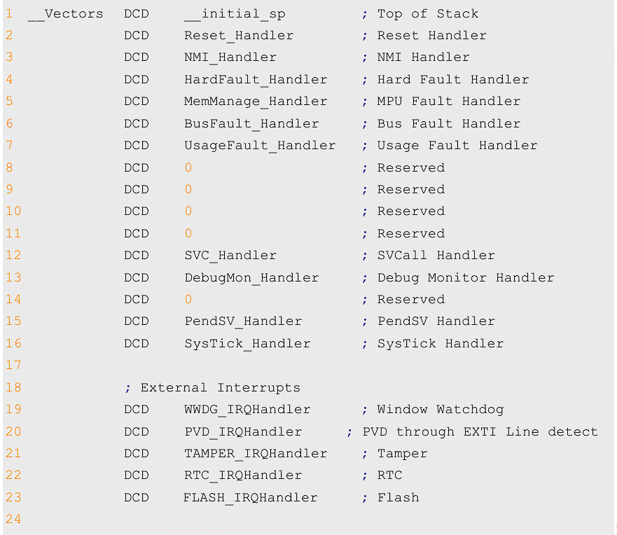
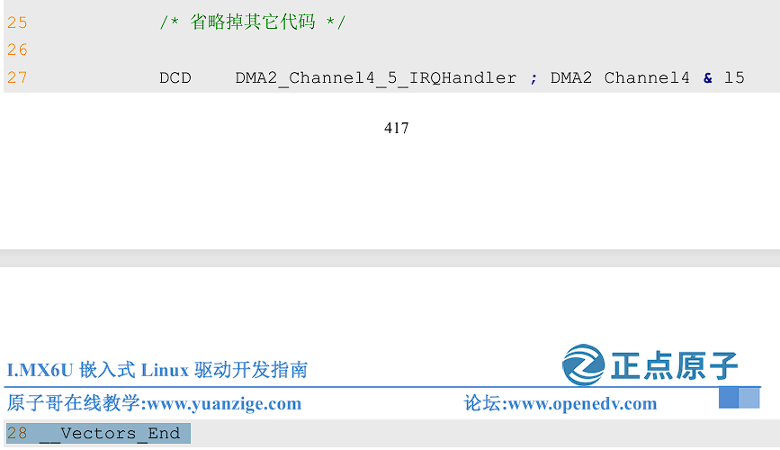
<span style="color:red"><b>(汇编代码)</b></span>
如图就是STM32F103的中断向量表，中断向量表都是链接到代码的最前面，比如一般ARM处理器都是从地址0X00000000开始执行指令的，那么中断向量表就是从0X00000000开始存放的。

图中第1行的“__initial_sp”就是第一条中断向量，存放的是栈顶指针，接下来是第2行复位中断复位函数Reset_Handler的入口地址，依次类推，直到第27行的最后一个中断服务函数DMA2_Channel4_5_IRQHandler的入口地址，这样STM32F103的中断向量表就建好了。

我们说ARM处理器都是从地址0X00000000开始运行的，但是我们学习STM32的时候代码是下载到0X8000000开始的存储区域中。
因此中断向量表是存放到0X8000000地址处的，而不是0X00000000，这样不是就出错了吗？
为了解决这个问题，Cortex-M架构引入了一个新的概念——中断向量表偏移，通过中断向量表偏移就可以将中断向量表存放到任意地址处，中断向量表偏移配置在函数SystemInit中完成，通过向SCB_VTOR寄存器写入新的中断向量表首地址即可：

```C
1  void SystemInit (void) 
2  { 
3    RCC->CR |= (uint32_t)0x00000001; 
4   
5    /* 省略其它代码 */ 
6   
7  #ifdef VECT_TAB_SRAM 
8    SCB->VTOR = SRAM_BASE | VECT_TAB_OFFSET;  
9  #else 
10   SCB->VTOR = FLASH_BASE | VECT_TAB_OFFSET;  
11 #endif  
12 } 
```
第8行和第10行就是设置中断向量表偏移，第8行是将中断向量表设置到RAM中。
第10行是将中断向量表设置到ROM中，基本都是将中断向量表设置到ROM中，也就是地址0X08000000处

第10行用到了FALSH_BASE和VECT_TAB_OFFSET，这两个都是宏，定义如下所示：
```C
#define FLASH_BASE       ((uint32_t)0x08000000) 
#define VECT_TAB_OFFSET   0x0 
```
因此第10行的代码就是：SCB->VTOR=0X080000000，中断向量表偏移设置完成。
通过上面的讲解我们了解了两个跟STM32中断有关的概念：中断向量表和中断向量表偏移，那么这个跟I.MX6U有什么关系呢？
因为I.MX6U所使用的Cortex-A7内核也有中断向量表和中断向量表偏移，而且其含义和STM32是一模一样的！只是用到的寄存器不同而已，概念完全相同！

附件 STM32存储器映像：


 ***
**NVIC内嵌向量中断控制器**

中断系统得有个管理机构，对于STM32这种Cortex-M内核的单片机来说这个管理机构叫做NVIC，全称叫做Nested Vectored Interrupt Controller。
关于NVIC本教程不作详细的讲解，既然Cortex-M内核有个中断系统的管理机构—NVIC，那么I.MX6U所使用的Cortex-A7内核是不是也有个中断系统管理机构？
答案是肯定的，不过Cortex-A内核的中断管理机构不叫做NVIC，而是叫做GIC，全称是general interrupt controller，后面我们会详细的讲解Cortex-A内核的GIC。

 ***
**中断使能**

要使用某个外设的中断，肯定要先使能这个外设的中断，以 STM32F103的 PE2这个 IO为例。
假如我们要使用PE2的输入中断肯定要使用如下代码来使能对应的中断：

```C
NVIC_InitStructure.NVIC_IRQChannel = EXTI2_IRQn; 
NVIC_InitStructure.NVIC_IRQChannelPreemptionPriority = 0x02; //抢占优先级 2
NVIC_InitStructure.NVIC_IRQChannelSubPriority = 0x02; //子优先级 2  
NVIC_InitStructure.NVIC_IRQChannelCmd = ENABLE; //使能外部中断通道
NVIC_Init(&NVIC_InitStructure);
```
上述代码就是使能 PE2对应 的 EXTI2中断，同理，如果要使用 I.MX6U的某个中断的话也需要使能其对应的中断。

 ***
**中断服务函数**

我们使用中断的目的就是为了使用中断服务函数，当中断发生以后中断服务函数就会被调用，我们要处理的工作就可以放到中断服务函数中去完成。
同样以 STM32F103的 PE2为例，
其中断服务函数如下所示：
```C
/* 外部中断 2服务程序 */ 
void EXTI2_IRQHandler(void) 
{ 
  /* 中断处理代码 */ 
}
```
当 PE2引脚的中断触发以后就会调用其对应的中断处理函数 EXTI2_IRQHandler，我们可以在函数 EXTI2_IRQHandler中添加中断处理代码。
同理， I.MX6U也有中断服务函数，当某个外设中断发生以后就会调用其对应的中断服务函数。

通过对 STM32中断系统的回顾，我们知道了 Cortex-M内核的中断处理过程，那么 Cortex-A内核的中断处理过程是否是一样的，有什么异同呢？
接下来我们带着这样的疑问来学习Cortex-A7内核的中断系统。

#### 17.1.2 Cortex-A7中断系统

跟 STM32一样， Cortex-A7也有中断向量表，中断向量表也是在代码的最前面。
Cortex-A7内核有 8个异常中断，这 8个异常中断的中断向量表如表所示：

| 向量地址 | 中断类型                              | 中断模式                  |
| -------- | ------------------------------------- | ------------------------- |
| 0X00     | 复位中断(Rest)                        | 特权模式(SVC)             |
| 0X04     | 未定义指令中断(Undefined Instruction) | 未定义指令中止模式(Undef) |
| 0X08     | 软中断(Software Interrupt,SWI)        | 特权模式(SVC)             |
| 0X0C     | 指令预取中止中断(Prefetch Abort)      | 中止模式                  |
| 0X10     | 数据访问中止中断(Data Abort)          | 中止模式                  |
| 0X14     | 未使用(Not Used)                      | 未使用                    |
| 0X18     | IRQ中断 (IRQ Interrupt)               | 外部中断模式(IRQ)         |
| 0X1C     | FIQ中断 (FIQ Interrupt)               | 快速中断模式(FIQ)         |

中断向量表里面都是中断服务函数的入口地址，因此一款芯片有什么中断都是可以从中断向量表看出来的。
从表中可以看出， Cortex-A7一共有 8个中断，而且还有一个中断向量未使用，实际只有7 个中断。

和上文中的STM32F103 中断向量表比起来少了很多！难道一个能跑Linux 的芯片只有这7 个中断？明显不可能的！
那类似STM32 中的EXTI9_5_IRQHandler、TIM2_IRQHandler 这样的中断向量在哪里？I2C、SPI、定时器等等的中断怎么处理呢？
这个就是Cortex-A 和Cotex-M 在中断向量表这一块的区别。
对于Cortex-M 内核来说，中断向量表列举出了一款芯片所有的中断向量，包括芯片外设的所有中断。对于Cotex-A 内核来说并没有这么做，在表中有个IRQ 中断， Cortex-A 内核CPU 的所有外部中断都属于这个IRQ 中断，当任意一个外部中断发生的时候都会触发IRQ 中断。
在IRQ 中断服务函数里面就可以读取指定的寄存器来判断发生的具体是什么中断，进而根据具体的中断做出相应的处理。
这些外部中断和IRQ 中断的关系如图所示：

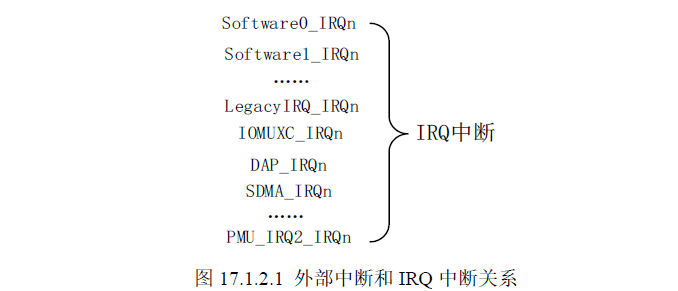

左侧的Software0_IRQn~PMU_IRQ2_IRQ 这些都是I.MX6U 的中断，他们都属于IRQ 中断。
当图左侧这些中断中任意一个发生的时候IRQ 中断都会被触发，所以我们需要在IRQ 中断服务函数中判断究竟是左侧的哪个中断发生了，然后再做出具体的处理。

接下来我们简要介绍下IMX6uLL的这七个中断：

①、复位中断(Rest)，CPU 复位以后就会进入复位中断，我们可以在复位中断服务函数里面做一些初始化工作，比如初始化SP 指针、DDR 等等。

②、未定义指令中断(Undefined Instruction)，如果指令不能识别的话就会产生此中断。

③、软中断(Software Interrupt,SWI)，由SWI 指令引起的中断，Linux 的系统调用会用SWI指令来引起软中断，**通过软中断来陷入到内核空间**。

④、指令预取中止中断(Prefetch Abort)，预取指令的出错的时候会产生此中断。

⑤、数据访问中止中断(Data Abort)，访问数据出错的时候会产生此中断。

⑥、IRQ 中断(IRQ Interrupt)，外部中断，前面已经说了，芯片内部的外设中断都会引起此中断的发生。

⑦、FIQ 中断(FIQ Interrupt)，快速中断，如果需要快速处理中断的话就可以使用此中断。

上面的7 个中断中，我们常用的就是复位中断和IRQ 中断，所以我们需要编写这两个中断的中断服务函数，稍后我们会讲解如何编写对应的中断服务函数。

首先我们要根据表的内容来创建中断向量表，中断向量表处于程序最开始的地方，比如我们前面例程的start.S 文件最前面，中断向量表如下：

```S
1 .global _start /* 全局标号 */
2
3 _start:/*中断向量表*/
4   ldr pc, =Reset_Handler /* 复位中断 */
5   ldr pc, =Undefined_Handler /* 未定义指令中断 */
6   ldr pc, =SVC_Handler /* SVC(Supervisor)中断 */
7   ldr pc, =PrefAbort_Handler /* 预取终止中断 */
8   ldr pc, =DataAbort_Handler /* 数据终止中断 */
9   ldr pc, =NotUsed_Handler /* 未使用中断 */
10  ldr pc, =IRQ_Handler /* IRQ 中断 */
11  ldr pc, =FIQ_Handler /* FIQ(快速中断)未定义中断 */
12  /* 中断服务函数*/
13 /* 复位中断 */
14 Reset_Handler:
15  /* 复位中断具体处理过程 */
16
17 /* 未定义中断 */
18 Undefined_Handler:
19  ldr r0, =Undefined_Handler
20  bx r0
21
22 /* SVC 中断 */
23 SVC_Handler:
24  ldr r0, =SVC_Handler
25  bx r0
26
27 /* 预取终止中断 */
28 PrefAbort_Handler:
29  ldr r0, =PrefAbort_Handler
30  bx r0
31
32 /* 数据终止中断 */
33 DataAbort_Handler:
34  ldr r0, =DataAbort_Handler
35  bx r0
36
37 /* 未使用的中断 */
38 NotUsed_Handler:
39
40  ldr r0, =NotUsed_Handler
41  bx r0
42
43 /* IRQ 中断！重点！！！！！ */
44 IRQ_Handler:
45  /* 复位中断具体处理过程 */
46 
47 /* FIQ 中断 */
48 FIQ_Handler:
49  ldr r0, =FIQ_Handler
50  bx r0 
```

第 4 到 11 行是中断向量表，当指定的中断发生以后就会调用对应的中断复位函数，比如复位中断发生以后就会执行第 4 行代码，也就是调用函数 Reset_Handler，函数 Reset_Handler就是复位中断的中断复位函数，其它的中断同理。

第 14 到 50 行就是对应的中断服务函数，**中断服务函数都是用汇编编写的**，我们实际需要编写的只有复位中断服务函数 Reset_Handler 和 IRQ 中断服务函数 IRQ_Handler，其它的中断本教程没有用到，所以都是死循环。
在编写复位中断复位函数和 IRQ 中断服务函数之前我们还需要了解一些其它的知识，否则的话就没法编写。

#### 17.1.3 GIC控制器

1. **GIC控制器总览**

STM32(Cortex-M)的中断控制器叫做 NVIC，I.MX6U(Cortex-A)的中断控制器叫做 GIC，关于 GIC 的详细内容请参考开发板光盘中的文档《ARM Generic Interrupt Controller(ARM GIC控制器)V2.0.pdf》。

GIC 是 ARM 公司给 Cortex-A/R 内核提供的一个中断控制器，类似 Cortex-M 内核中的NVIC。
目前 GIC 有 4 个版本:V1~V4，V1 是最老的版本，已经被废弃了。
V2~V4 目前正在大量的使用。
GIC V2 是给 ARMv7-A 架构使用的，比如 Cortex-A7、Cortex-A9、Cortex-A15 等，V3 和 V4 是给 ARMv8-A/R 架构使用的，也就是 64 位芯片使用的。
I.MX6U 是 Cortex-A 内核的，因此我们主要讲解 GIC V2。
GIC V2 最多支持 8 个核。ARM 会根据 GIC 版本的不同研发出不同的 IP 核，那些半导体厂商直接购买对应的 IP 核即可，比如 ARM 针对 GIC V2 就开发出了 GIC400 这个中断控制器 IP 核。（Intellectual Property Core 硬件模块）
当 GIC 接收到外部中断信号以后就会报给 ARM 内核，但是ARM 内核只提供了四个信号给 GIC 来汇报中断情况：VFIQ、VIRQ、FIQ 和 IRQ，
他们之间的关系如图所示：
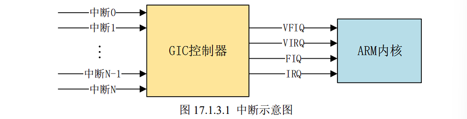

在图中，GIC 接收众多的外部中断，然后对其进行处理，最终就只通过四个信号报给 ARM 内核，这四个信号的含义如下：
- VFIQ:虚拟快速 FIQ。
- VIRQ:虚拟外部 IRQ。
- FIQ:快速中断 IRQ。
- IRQ:外部中断 IRQ。

VFIQ 和 VIRQ 是针对虚拟化的，我们不讨论虚拟化，剩下的就是 FIQ 和 IRQ 了，我们前面都讲了很多次了。
本教程我们只使用 IRQ，所以相当于 GIC 最终向 ARM 内核就上报一个 IRQ信号。
那么 GIC 是如何完成这个工作的呢？

GICV2逻辑图如下：

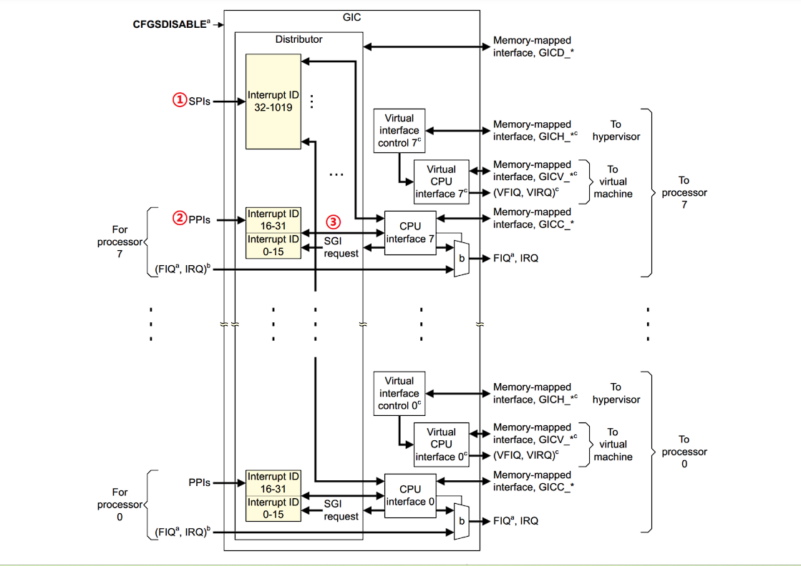

图中左侧部分就是中断源，中间部分就是 GIC 控制器，最右侧就是中断控制器向处理器内核发送中断信息。
我们重点要看的肯定是中间的 GIC 部分，GIC 将众多的中断源分为分为三类：

①、SPI(Shared Peripheral Interrupt),共享中断，顾名思义，所有 Core 共享的中断，这个是最常见的，那些外部中断都属于 SPI 中断(注意！不是 SPI 总线那个中断) 。
比如按键中断、串口中断等等，这些中断所有的 Core 都可以处理，不限定特定 Core。

②、PPI(Private Peripheral Interrupt)，私有中断，我们说了 GIC 是支持多核的，每个核肯定有自己独有的中断。
这些独有的中断肯定是要指定的核心处理，因此这些中断就叫做私有中断。

③、SGI(Software-generated Interrupt)，软件中断，由软件触发引起的中断，通过向寄存器GICD_SGIR 写入数据来触发，系统会使用 SGI 中断来完成多核之间的通信。

2. **中断ID**

中断源有很多，为了区分这些不同的中断源肯定要给他们分配一个唯一 ID，这些 ID 就是中断 ID。
每一个 CPU 最多支持 1020 个中断 ID，中断 ID 号为 ID0~ID1019。
这 1020 个 ID 包含了 PPI、SPI 和 SGI，那么这三类中断是如何分配这 1020 个中断 ID 的呢？
分配如下：
- ID0~ID15：这 16 个 ID 分配给 SGI。
- ID16~ID31：这 16 个 ID 分配给 PPI。
- ID32~ID1019：这 988 个 ID 分配给 SPI

像 GPIO 中断、串口中断等这些外部中断 ，至于具体到某个 ID 对应哪个中断那就由半导体厂商根据实际情况去定义了。
比如 I.MX6U 的总共使用了 128 个中断 ID，加上前面属于 PPI 和 SGI 的 32 个 ID，I.MX6U 的中断源共有 128+32=160个，这 128 个中断 ID 对应的中断在《I.MX6ULL 参考手册》的“3.2 CortexA7 interrupts”小节，

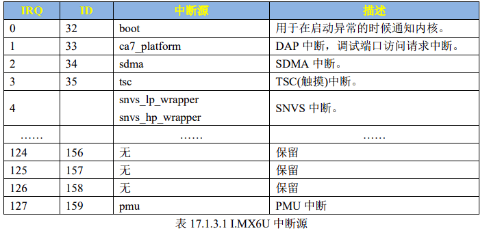

完整的中断源自行查阅《I.MX6ULL 参考手册》的 3.2 小节。
打开裸机例程“9_int”，我们前面移植了 NXP 官方 SDK中的文件 MCIMX6Y2C.h，在此文件中定义了一个枚举类型 IRQn_Type，此枚举类型就枚举出了 I.MX6U 的所有中断，代码如下所示:

```C
1 #define NUMBER_OF_INT_VECTORS 160 /* 中断源 160 个，SGI+PPI+SPI*/
2
3 typedef enum IRQn {
4 /* Auxiliary constants */
5 NotAvail_IRQn = -128,
6
7 /* Core interrupts */
8 Software0_IRQn = 0,
9 Software1_IRQn = 1,
10 Software2_IRQn = 2,
11 Software3_IRQn = 3,
12 Software4_IRQn = 4,
13 Software5_IRQn = 5,
14 Software6_IRQn = 6,
15 Software7_IRQn = 7,
16 Software8_IRQn = 8,
17 Software9_IRQn = 9,
18 Software10_IRQn = 10,
19 Software11_IRQn = 11,
20 Software12_IRQn = 12, 
21 Software13_IRQn = 13,
22 Software14_IRQn = 14,
23 Software15_IRQn = 15,
24 VirtualMaintenance_IRQn = 25,
25 HypervisorTimer_IRQn = 26,
26 VirtualTimer_IRQn = 27,
27 LegacyFastInt_IRQn = 28,
28 SecurePhyTimer_IRQn = 29,
29 NonSecurePhyTimer_IRQn = 30,
30 LegacyIRQ_IRQn = 31,
31
32 /* Device specific interrupts */
33 IOMUXC_IRQn = 32,
34 DAP_IRQn = 33,
35 SDMA_IRQn = 34,
36 TSC_IRQn = 35,
37 SNVS_IRQn = 36,
…… ...... ......
151 ENET2_1588_IRQn = 153,
152 Reserved154_IRQn = 154,
153 Reserved155_IRQn = 155,
154 Reserved156_IRQn = 156,
155 Reserved157_IRQn = 157,
156 Reserved158_IRQn = 158,
157 PMU_IRQ2_IRQn = 159
158} IRQn_Type;
```

3. **GIC逻辑分块**

GIC 架构分为了两个逻辑块：Distributor 和 CPU Interface，也就是分发器端和 CPU 接口端。这两个逻辑块的含义如下：

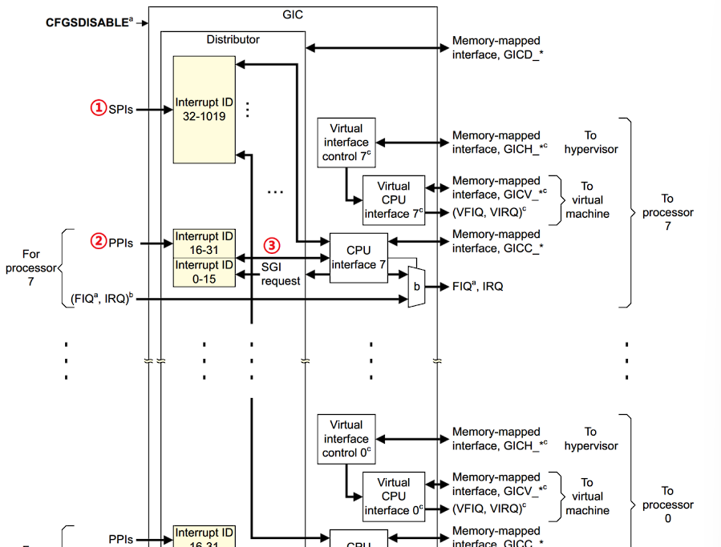

**Distributor(分发器端)**：从图可以看出，此逻辑块负责处理各个中断事件的分发问题，也就是中断事件应该发送到哪个 CPU Interface 上去。
分发器收集所有的中断源，可以控制每个中断的优先级，它总是将优先级最高的中断事件发送到 CPU 接口端。
分发器端要做的主要工作如下：
①、全局中断使能控制。
②、控制每一个中断的使能或者关闭。
③、设置每个中断的优先级。
④、设置每个中断的目标处理器列表。
⑤、设置每个外部中断的触发模式：电平触发或边沿触发。
⑥、设置每个中断属于组 0 还是组 1。

**CPU Interface(CPU 接口端)**：CPU 接口端听名字就知道是和 CPU Core 相连接的，因此在图中每个 CPU Core 都可以在 GIC 中找到一个与之对应的 CPU Interface。
CPU 接口端就是分发器和 CPU Core 之间的桥梁，CPU 接口端主要工作如下：
①、使能或者关闭发送到 CPU Core 的中断请求信号。
②、应答中断。
③、通知中断处理完成。
④、设置优先级掩码，通过掩码来设置哪些中断不需要上报给 CPU Core。
⑤、定义抢占策略。
⑥、当多个中断到来的时候，选择优先级最高的中断通知给 CPU Core。

例程“9_int”中的文件 core_ca7.h 定义了 GIC 结构体，此结构体里面的寄存器分为了分发器端和 CPU 接口端，寄存器定义如下所示：

```C
/*
* GIC 寄存器描述结构体，
* GIC 分为分发器端和 CPU 接口端
*/
1 typedef struct
2 {
3 /* 分发器端寄存器 */
4 uint32_t RESERVED0[1024];
5 __IOM uint32_t D_CTLR; /* Offset: 0x1000 (R/W) */
6 __IM uint32_t D_TYPER; /* Offset: 0x1004 (R/ ) */
7 __IM uint32_t D_IIDR; /* Offset: 0x1008 (R/ ) */
8 uint32_t RESERVED1[29];
9 __IOM uint32_t D_IGROUPR[16]; /* Offset: 0x1080 - 0x0BC (R/W) */
10 uint32_t RESERVED2[16];
11 __IOM uint32_t D_ISENABLER[16];/* Offset: 0x1100 - 0x13C (R/W) */
12 uint32_t RESERVED3[16];
13 __IOM uint32_t D_ICENABLER[16];/* Offset: 0x1180 - 0x1BC (R/W) */
14 uint32_t RESERVED4[16];
15 __IOM uint32_t D_ISPENDR[16]; /* Offset: 0x1200 - 0x23C (R/W) */
16 uint32_t RESERVED5[16];
17 __IOM uint32_t D_ICPENDR[16]; /* Offset: 0x1280 - 0x2BC (R/W) */
18 uint32_t RESERVED6[16];
19 __IOM uint32_t D_ISACTIVER[16];/* Offset: 0x1300 - 0x33C (R/W) */
20 uint32_t RESERVED7[16];
21 __IOM uint32_t D_ICACTIVER[16];/* Offset: 0x1380 - 0x3BC (R/W) */
22 uint32_t RESERVED8[16];
23 __IOM uint8_t D_IPRIORITYR[512];/* Offset: 0x1400 - 0x5FC (R/W) */
24 uint32_t RESERVED9[128];
25 __IOM uint8_t D_ITARGETSR[512];/* Offset: 0x1800 - 0x9FC (R/W) */
26 uint32_t RESERVED10[128];
27 __IOM uint32_t D_ICFGR[32]; /* Offset: 0x1C00 - 0xC7C (R/W) */
28 uint32_t RESERVED11[32];
29 __IM uint32_t D_PPISR; /* Offset: 0x1D00 (R/ ) */
30 __IM uint32_t D_SPISR[15]; /* Offset: 0x1D04 - 0xD3C (R/ ) */
31 uint32_t RESERVED12[112];
32 __OM uint32_t D_SGIR; /* Offset: 0x1F00 ( /W) */
33 uint32_t RESERVED13[3];
34 __IOM uint8_t D_CPENDSGIR[16];/* Offset: 0x1F10 - 0xF1C (R/W) */
35 __IOM uint8_t D_SPENDSGIR[16];/* Offset: 0x1F20 - 0xF2C (R/W) */
36 uint32_t RESERVED14[40];
37 __IM uint32_t D_PIDR4; /* Offset: 0x1FD0 (R/ ) */
38 __IM uint32_t D_PIDR5; /* Offset: 0x1FD4 (R/ ) */
39 __IM uint32_t D_PIDR6; /* Offset: 0x1FD8 (R/ ) */
40 __IM uint32_t D_PIDR7; /* Offset: 0x1FDC (R/ ) */
41 __IM uint32_t D_PIDR0; /* Offset: 0x1FE0 (R/ ) */
42 __IM uint32_t D_PIDR1; /* Offset: 0x1FE4 (R/ ) */
43 __IM uint32_t D_PIDR2; /* Offset: 0x1FE8 (R/ ) */
44 __IM uint32_t D_PIDR3; /* Offset: 0x1FEC (R/ ) */
45 __IM uint32_t D_CIDR0; /* Offset: 0x1FF0 (R/ ) */
46 __IM uint32_t D_CIDR1; /* Offset: 0x1FF4 (R/ ) */
47 __IM uint32_t D_CIDR2; /* Offset: 0x1FF8 (R/ ) */
48 __IM uint32_t D_CIDR3; /* Offset: 0x1FFC (R/ ) */
49
50 /* CPU 接口端寄存器 */
51 __IOM uint32_t C_CTLR; /* Offset: 0x2000 (R/W) */
52 __IOM uint32_t C_PMR; /* Offset: 0x2004 (R/W) */
53 __IOM uint32_t C_BPR; /* Offset: 0x2008 (R/W) */
54 __IM uint32_t C_IAR; /* Offset: 0x200C (R/ ) */
55 __OM uint32_t C_EOIR; /* Offset: 0x2010 ( /W) */
56 __IM uint32_t C_RPR; /* Offset: 0x2014 (R/ ) */
57 __IM uint32_t C_HPPIR; /* Offset: 0x2018 (R/ ) */
58 __IOM uint32_t C_ABPR; /* Offset: 0x201C (R/W) */
59 __IM uint32_t C_AIAR; /* Offset: 0x2020 (R/ ) */
60 __OM uint32_t C_AEOIR; /* Offset: 0x2024 ( /W) */
61 __IM uint32_t C_AHPPIR; /* Offset: 0x2028 (R/ ) */
62 uint32_t RESERVED15[41];
63 __IOM uint32_t C_APR0; /* Offset: 0x20D0 (R/W) */
64 uint32_t RESERVED16[3];
65 __IOM uint32_t C_NSAPR0; /* Offset: 0x20E0 (R/W) */
66 uint32_t RESERVED17[6];
67 __IM uint32_t C_IIDR; /* Offset: 0x20FC (R/ ) */
68 uint32_t RESERVED18[960];
69 __OM uint32_t C_DIR; /* Offset: 0x3000 ( /W) */
70 } GIC_Type;
```

示例代码中的结构体 GIC_Type 就是 GIC 控制器，列举出了 GIC 控制器的所有寄存器，可以通过结构体 GIC_Type 来访问 GIC 的所有寄存器。

第 5 行是 GIC 的分发器端相关寄存器，其相对于 GIC 基地址偏移为 0X1000，因此我们获取到 GIC 基地址以后只需要加上 0X1000 即可访问 GIC 分发器端寄存器。

第 51 行是 GIC 的 CPU 接口端相关寄存器，其相对于 GIC 基地址的偏移为 0X2000，同样的，获取到 GIC 基地址以后只需要加上 0X2000 即可访问 GIC 的 CPU 接口段寄存器。

那么问题来了？GIC 控制器的寄存器基地址在哪里呢？
这个就需要用到 Cortex-A 的 CP15 协处理器了.

#### 17.1.4 CP15协处理器

简介：

```markdown
CP15协处理器是ARM架构中的一个重要组件，主要负责系统控制和配置。
以下是CP15协处理器的一些关键功能和特点：

### CP15协处理器的功能
1. **系统控制寄存器**：
   - 包含系统级控制寄存器，用于控制和配置处理器行为，例如启用或禁用缓存、MMU（内存管理单元）、异常处理等。
2. **缓存控制**：
   - 控制一级和二级缓存的启用、禁用和刷新操作，管理缓存一致性和性能优化。
3. **内存管理单元（MMU）**：
   - 配置和管理虚拟内存地址到物理地址的映射，支持内存保护和分页机制。
4. **异常向量表配置**：
   - 配置和管理异常向量表，定义异常处理程序的入口地址。
5. **性能监控**：
   - 提供性能监控寄存器，用于收集和分析处理器的性能数据，例如指令计数、缓存命中率等。
6. **安全扩展**：
   - 支持ARM TrustZone技术，实现安全和非安全模式的切换和管理。

### CP15协处理器的工作原理
当处理器需要进行系统级配置或控制操作时，会通过特定的指令访问CP15协处理器。例如，以下ARM汇编代码展示了如何访问CP15的系统控制寄存器：

`MRC p15, 0, r0, c1, c0, 0   ; 读取CP15的系统控制寄存器到r0`
`ORR r0, r0, #1              ; 设置第0位以启用MMU`
`MCR p15, 0, r0, c1, c0, 0   ; 将修改后的值写回系统控制寄存器`

### 应用场景
CP15协处理器广泛应用于需要精细控制和优化的嵌入式系统中，例如：
- 操作系统内核的内存管理和任务调度。
- 高性能计算中的缓存和性能优化。
- 安全性要求高的应用场景，如金融和医疗设备。

通过CP15协处理器，开发者可以灵活地配置和控制处理器的行为，以满足不同应用场景的需求。如果你有更多关于CP15协处理器或ARM架构的具体问题，请随时告诉我！ 😊
```

关于 CP15 协处理器和其相关寄存器的详细内容，请参考下面两份文档：《ARM ArchitectureReference Manual ARMv7-A and ARMv7-R edition.pdf》第 1469 页“B3.17 Oranization of the CP15 registers in a VMSA implementation”。《Cortex-A7 Technical ReferenceManua.pdf》第55页“Capter 4 System Control”。

CP15 协处理器一般用于存储系统管理，但是在中断中也会使用到。
CP15 协处理器一共有16个32位寄存器。
CP15 协处理器的访问通过如下另个指令完成：

MRC: 将 CP15 协处理器中的寄存器数据读到 ARM 寄存器中。
MCR: 将 ARM 寄存器的数据写入到 CP15 协处理器寄存器中。
MRC 就是读 CP15 寄存器，MCR 就是写 CP15 寄存器，MCR 指令格式如下：
`MCR{cond} p15, <opc1>, <Rt>, <CRn>, <CRm>, <opc2>`

- cond:指令执行的条件码，如果忽略的话就表示无条件执行。
- opc1：协处理器要执行的操作码。
- Rt：ARM 源寄存器，要写入到 CP15 寄存器的数据就保存在此寄存器中。
- CRn：CP15 协处理器的目标寄存器。
- CRm：协处理器中附加的目标寄存器或者源操作数寄存器，如果不需要附加信息就将CRm 设置为 C0，否则结果不可预测。
- opc2：可选的协处理器特定操作码，当不需要的时候要设置为 0。

MRC 的指令格式和 MCR 一样，只不过在 MRC 指令中 Rt 就是目标寄存器，也就是从CP15 指定寄存器读出来的数据会保存在 Rt 中。
而 CRn 就是源寄存器，也就是要读取的写处理器寄存器。
`MCR{cond} p15, <opc1>, <Rt>, <CRn>, <CRm>, <opc2>`

假如我们要将 CP15 中 C0 寄存器的值读取到 R0 寄存器中，那么就可以使用如下命令：
`MRC p15, 0, r0, c0, c0, 0`

CP15 协处理器有 16 个 32 位寄存器，c0~c15，本章来看一下 c0、c1、c12 和 c15 这四个寄存器，因为我们本章实验要用到这四个寄存器，其他的寄存器大家参考上面的两个文档即可。

1. **C0寄存器**

CP15 协处理器有 16 个 32 位寄存器，c0~c15，在使用 MRC 或者 MCR 指令访问这 16 个寄存器的时候，指令中的 CRn、opc1、CRm 和 opc2 通过不同的搭配，其得到的寄存器含义是不同的。
比如 c0 在不同的搭配情况下含义如图：
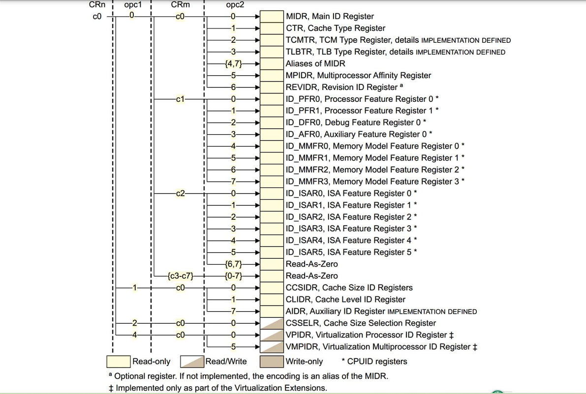

在图中当 MRC/MCR 指令中的 CRn=c0，opc1=0，CRm=c0，opc2=0 的时候就表示此时的 c0 就是 MIDR 寄存器，也就是主 ID 寄存器，这个也是 c0 的基本作用。
对于 Cortex-A7内核来说，c0 作为 MDIR 寄存器的时候其含义如图所示：

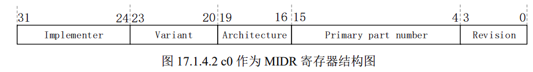

在图中各位所代表的含义如下:

- bit31:24：厂商编号，0X41，ARM。
- bit23:20：内核架构的主版本号，ARM 内核版本一般使用 rnpn 来表示，比如 r0p1，其中 r0后面的 0 就是内核架构主版本号。
- bit19:16：架构代码，0XF，ARMv7 架构。
- bit15:4：内核版本号，0XC07，Cortex-A7 MPCore 内核。
- bit3:0：内核架构的次版本号，rnpn 中的 pn，比如 r0p1 中 p1 后面的 1 就是次版本号。

2. **c1寄存器**

c1 寄存器同样通过不同的配置，其代表的含义也不同

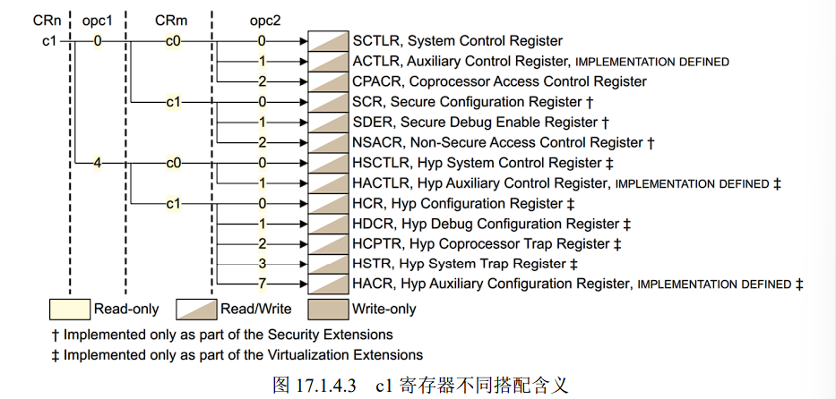

在图中当 MRC/MCR 指令中的 CRn=c1，opc1=0，CRm=c0，opc2=0 的时候就表示此时的 c1 就是 SCTLR 寄存器，也就是系统控制寄存器，这个是 c1 的基本作用。

SCTLR 寄存器主要是完成控制功能的，比如使能或者禁止 MMU、I/D Cache 等，c1 作为 SCTLR 寄存器的时候其含义如图所示：

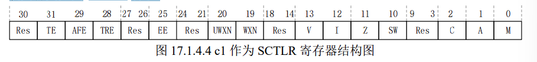

SCTLR 的位比较多，我们就只看本章会用到的几个位：

- bit13：V , 中断向量表基地址选择位，为 0 的话中断向量表基地址0X00000000，软件可以使用 VBAR 来重映射此基地址，也就是中断向量表重定位。
为 1 的话中断向量表基地址为0XFFFF0000，此基地址不能被重映射。
- bit12：I，I Cache 使能位，为 0 的话关闭 I Cache，为 1 的话使能 I Cache。
- bit11：Z，分支预测使能位，如果开启 MMU 的话，此位也会使能。
- bit10：SW，SWP 和 SWPB 使能位，当为 0 的话关闭 SWP 和 SWPB 指令，当为 1 的时候就使能 SWP 和 SWPB 指令。
- bit9:3：未使用，保留。
- bit2：C，D Cache 和缓存一致性使能位，为 0 的时候禁止 D Cache 和缓存一致性，为 1 时使能。
- bit1：A，内存对齐检查使能位，为 0 的时候关闭内存对齐检查，为 1 的时候使能内存对齐检查。
- bit0：M，MMU 使能位，为 0 的时候禁止 MMU，为 1 的时候使能 MMU。

如果要读写 SCTLR 的话，就可以使用如下命令：
```s
MRC p15, 0, <Rt>, c1, c0, 0 ;读取 SCTLR 寄存器，数据保存到 Rt 中。
MCR p15, 0, <Rt>, c1, c0, 0 ;将 Rt 中的数据写到 SCTLR(c1)寄存器中。
```

3. **c12寄存器**

c12 寄存器通过不同的配置，其代表的含义也不同
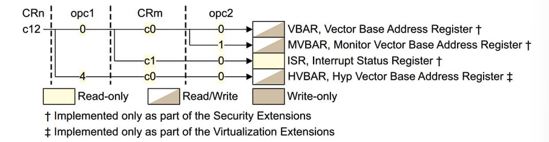

在图中当 MRC/MCR 指令中的 CRn=c12，opc1=0，CRm=c0，opc2=0 的时候就表示此时 c12 为 VBAR 寄存器，也就是向量表基地址寄存器。
设置中断向量表偏移的时候就需要将新的中断向量表基地址写入 VBAR 中，比如在前面的例程中，代码链接的起始地址为0X87800000，而中断向量表肯定要放到最前面，也就是 0X87800000 这个地址处。
所以就需要设置 VBAR 为 0X87800000，设置命令如下：
```s
ldr r0, =0X87800000 ; r0=0X87800000
MCR p15, 0, r0, c12, c0, 0 ;将 r0 里面的数据写入到 c12 中，即 c12=0X87800000
```

4. **c15寄存器**

c15 寄存器也可以通过不同的配置得到不同的含义，参考文档《Cortex-A7 Technical ReferenceManua.pdf》第 68 页“4.2.16 c15 registers”

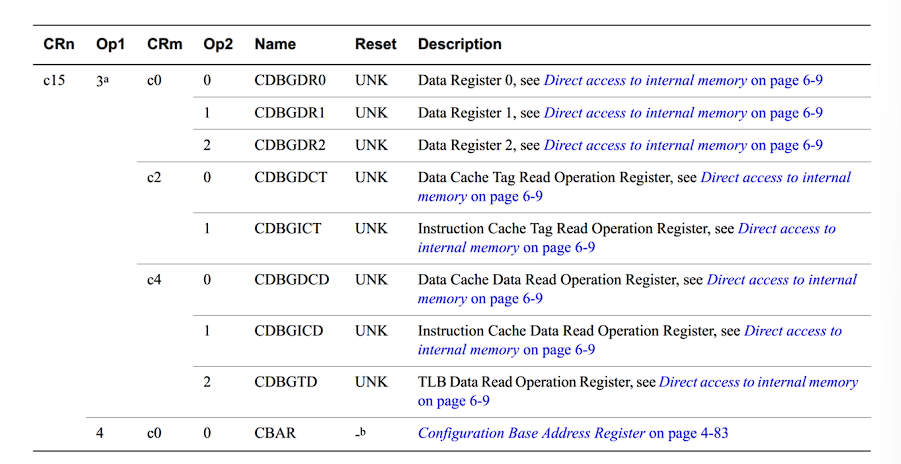

在图中，我们需要 c15 作为 CBAR 寄存器，因为 GIC 的基地址就保存在 CBAR
中，我们可以通过如下命令获取到 GIC 基地址：
`MRC p15, 4, r1, c15, c0, 0 ; 获取 GIC 基础地址，基地址保存在 r1 中。`

获取到 GIC 基地址以后就可以设置 GIC 相关寄存器了，比如我们可以读取当前中断 ID，当前中断 ID 保存在 GICC_IAR 中，寄存器 GICC_IAR 属于 CPU 接口端寄存器，寄存器地址相对于 CPU 接口端起始地址的偏移为 0XC，因此获取当前中断 ID 的代码如下：

```asm
MRC p15, 4, r1, c15, c0, 0 ;获取 GIC 基地址
ADD r1, r1, #0X2000;GIC 基地址加 0X2000 得到 CPU 接口端寄存器起始地址
LDR r0, [r1, #0XC] ;读取 CPU 接口端起始地址+0XC 处的寄存器值，也就是寄存器
                   ;GIC_IAR 的值
```
关于 CP15 协处理器就讲解到这里，简单总结一下.
通过 c0 寄存器可以获取到处理器内核信息；
通过 c1 寄存器可以使能或禁止 MMU、I/D Cache 等；
通过 c12 寄存器可以设置中断向量偏移；
通过 c15 寄存器可以获取 GIC 基地址。
关于 CP15 的其他寄存器，大家自行查阅本节前面列举的 2 份 ARM 官方资料

#### 17.1.5 中断使能

中断使能包括两部分，一个是 IRQ 或者 FIQ 总中断使能，另一个就是 ID0~ID1019 这 1020个中断源的使能。

1. **IRQ与FIQ总中断使能**

IRQ 和 FIQ 分别是外部中断和快速中断的总开关，就类似家里买的进户总电闸，然后ID0~ID1019 这 1020 个中断源就类似家里面的各个电器开关。
要想开电视，那肯定要保证进户总电闸是打开的，因此要想使用 I.MX6U 上的外设中断就必须先打开 IRQ 中断(本教程不使用FIQ)。
在“6.3.2 程序状态寄存器”小节已经讲过了，寄存器 CPSR 的 I=1 禁止 IRQ，当 I=0 使能 IRQ；F=1 禁止 FIQ，F=0 使能 FIQ。
我们还有更简单的指令来完成 IRQ 或者 FIQ 的使能和禁止，图表所示：

| 指令    | 描述            |
| ------- | --------------- |
| cpsid i | 禁止 IRQ 中断。 |
| cpsie i | 使能 IRQ 中断。 |
| cpsid f | 禁止 FIQ 中断。 |
| cpsie f | 使能 FIQ 中断。 |

2. **ID0\~ID1019中断使能**

GIC 寄存器 GICD_ISENABLERn 和 GICD_ ICENABLERn 用来完成外部中断的使能和禁止，对于 Cortex-A7 内核来说中断 ID 只使用了 512 个。
一个 bit 控制一个中断 ID 的使能，那么就需要 512/32=16 个 GICD_ISENABLER 寄存器来完成中断的使能。
同理，也需要 16 个GICD_ICENABLER 寄存器来完成中断的禁止。
其中 GICD_ISENABLER0 的 bit[15:0]对应ID15\~0 的 SGI 中断，GICD_ISENABLER0 的 bit[31:16]对应 ID31\~16 的 PPI 中断。
剩下的GICD_ISENABLER1~GICD_ISENABLER15 就是控制 SPI 中断的。

#### 17.1.6 中断优先级控制

1. **优先级数配置**

学过 STM32 都知道 Cortex-M 的中断优先级分为抢占优先级和子优先级，两者是可以配置的。
同样的 Cortex-A7 的中断优先级也可以分为抢占优先级和子优先级，两者同样是可以配置的。
GIC 控制器最多可以支持 256 个优先级，数字越小，优先级越高！Cortex-A7 选择了 32 个优先级。
在使用中断的时候需要初始化 GICC_PMR 寄存器，此寄存器用来决定使用几级优先级，寄存器结构如图所示：


GICC_PMR 寄存器只有低 8 位有效，这 8 位最多可以设置 256 个优先级，其他优先级数设置如表所示：
| bit7:0   | 优先级数       |
| -------- | -------------- |
| 11111111 | 256 个优先级。 |
| 11111110 | 128 个优先级。 |
| 11111100 | 64 个优先级。  |
| 11111000 | 32 个优先级    |
| 11110000 | 16 个优先级。  |

I.MX6U 是 Cortex-A7 内核，所以支持 32 个优先级，因此 GICC_PMR 要设置为 0b11111000。

2. **抢占优先级和子优先级位数设置**

抢占优先级和子优先级各占多少位是由寄存器 GICC_BPR 来决定的，GICC_BPR 寄存器结构如图所示：


寄存器 GICC_BPR 只有低 3 位有效，其值不同，抢占优先级和子优先级占用的位数也不同，配置如表所示

| Binary Point | 抢占优先级域 | 子优先级域 | 描述                           |
| :----------- | :----------- | :--------- | :----------------------------- |
| 0            | [7:1]        | [0]        | 7级抢占优先级，1 级子优先级。  |
| 1            | [7:2]        | [1:0]      | 6 级抢占优先级，2 级子优先级。 |
| 2            | [7:3]        | [2:0]      | 5 级抢占优先级，3 级子优先级。 |
| 3            | [7:4]        | [3:0]      | 4 级抢占优先级，4 级子优先级。 |
| 4            | [7:5]        | [4:0]      | 3 级抢占优先级，5 级子优先级。 |
| 5            | [7:6]        | [5:0]      | 2 级抢占优先级，6 级子优先级。 |
| 6            | [7:7]        | [6:0]      | 1 级抢占优先级，7 级子优先级。 |
| 7            | 无           | [7:0]      | 0 级抢占优先级，8 级子优先级。 |

为了简单起见，一般将所有的中断优先级位都配置为抢占优先级，比如 I.MX6U 的优先级位数为 5(32 个优先级)，所以可以设置 Binary point 为 2，表示 5 个优先级位全部为抢占优先级。

3. **优先级设置**

前面已经设置好了 I.MX6U 一共有 32 个抢占优先级，数字越小优先级越高。
具体要使用某个中断的时候就可以设置其优先级为 0~31。

某个中断 ID 的中断优先级设置由寄存器D_IPRIORITYR 来完成，前面说了 Cortex-A7 使用了 512 个中断 ID，每个中断 ID 配有一个优先级寄存器，所以一共有 512 个 D_IPRIORITYR 寄存器。

如果优先级个数为 32 的话，使用寄存器 D_IPRIORITYR 的 bit7:3 来设置优先级，也就是说实际的优先级要左移 3 位(左移到抢占优先级位置)。比如要设置ID40 中断的优先级为 5，示例代码如下：
`GICD_IPRIORITYR[40] = 5 << 3;`
解释：
0000 0101左移三位  001 01|000

有关优先级设置的内容就讲解到这里，优先级设置主要有三部分：

总结：

①、设置寄存器 GICC_PMR，配置优先级个数，比如 I.MX6U 支持 32 级优先级。(配置个数)
②、设置抢占优先级和子优先级位数，配置寄存器GICC_BPR，一般为了简单起见，会将所有的位数都设置为抢占优先级。(配置优先级域分配)
③、设置指定中断 ID的优先级，也就是设置外设优先级,配置寄存器D_IPRIORITYR。

### 17.2 硬件原理分析

同样使用按键控制，原理图见第十五章

### 17.3 实验程序编写

本实验对应的例程路径为：开发板光盘-> 1、裸机例程-> 9_int

本章试验的功能和第十五章一样，只是按键采用中断的方式处理。
当按下按键 KEY0 以后就打开蜂鸣器，再次按下按键 KEY0 就关闭蜂鸣器。在第十六章的试验上完成本章试验。

#### 17.3.1 移植SDK中有关中断的相关文件

将 SDK 包中的文件 core_ca7.h 拷贝到本章试验工程中的“imx6ul”文件夹中，参考试验“9_int”中 core_ca7.h 进行修改。
主要留下和 GIC 相关的内容，我们重点是需要 core_ca7.h 中的 10 个 API 函数。

十个函数如下：

| 函数                    | 描述                           |
| ----------------------- | ------------------------------ |
| GIC_Init                | 初始化 GIC。                   |
| GIC_EnableIRQ           | 使能指定的外设中断。           |
| GIC_DisableIRQ          | 关闭指定的外设中断。           |
| GIC_AcknowledgeIRQ      | 返回中断号。                   |
| GIC_DeactivateIRQ       | 无效化指定中断。               |
| GIC_GetRunningPriority  | 获取当前正在运行的中断优先级。 |
| GIC_SetPriorityGrouping | 设置抢占优先级位数。           |
| GIC_GetPriorityGrouping | 获取抢占优先级位数。           |
| GIC_SetPriority         | 设置指定中断的优先级。         |
| GIC_GetPriority         | 获取指定中断的优先级。         |

移植好 core_ca7.h 以后，修改文件 imx6ul.h，在里面加上如下一行代码：
`#include "core_ca7.h"`

#### 17.3.2 重新编写start.S

```S
/***************************************************************
Copyright © zuozhongkai Co., Ltd. 1998-2019. All rights reserved.
文件名 : start.s
作者 : 左忠凯
版本 : V2.0
描述 : I.MX6U-ALPHA/I.MX6ULL 开发板启动文件，完成 C 环境初始化，
       C 环境初始化完成以后跳转到 C 代码。
其他 : 无
论坛 : www.openedv.com
日志 : 初版 V1.0 2019/1/3 左忠凯修改
       V2.0 2019/1/4 左忠凯修改
       添加中断相关定义
**************************************************************/

1 .global _start /* 全局标号 */
2
3 /*
4 * 描述： _start 函数，首先是中断向量表的创建
5 */
6 _start:
 /*中断向量表，ldr pc用来初始化各个中断服务程序，pc指向下一个要执行的程序*/
7   ldr pc, =Reset_Handler /* 复位中断 */
8   ldr pc, =Undefined_Handler /* 未定义指令中断 */
9   ldr pc, =SVC_Handler /* SVC(Supervisor)中断*/
10  ldr pc, =PrefAbort_Handler /* 预取终止中断 */
11  ldr pc, =DataAbort_Handler /* 数据终止中断 */
12  ldr pc, =NotUsed_Handler /* 未使用中断 */
13  ldr pc, =IRQ_Handler /* IRQ 中断 */
14  ldr pc, =FIQ_Handler /* FIQ(快速中断) */
15
16 /* 复位中断 */
17 Reset_Handler:
18
19  cpsid i /* 关闭全局中断 */
20
21 /* 关闭 I,DCache 和 MMU
22 * 采取读-改-写的方式。
23 */
24  mrc p15, 0, r0, c1, c0, 0 /* 读取 CP15 的 C1 寄存器到 R0 中 */
25  bic r0, r0, #(0x1 << 12) /* 清除 C1 的 I 位，关闭 I Cache */
26  bic r0, r0, #(0x1 << 2) /* 清除 C1 的 C 位，关闭 D Cache */
27  bic r0, r0, #0x2 /* 清除 C1 的 A 位，关闭对齐检查 */
28  bic r0, r0, #(0x1 << 11) /* 清除 C1 的 Z 位，关闭分支预测 */
29  bic r0, r0, #0x1 /* 清除 C1 的 M 位，关闭 MMU */
30  mcr p15, 0, r0, c1, c0, 0 /* 将 r0 的值写入到 CP15 的 C1 中 */
31
32
33 #if 0
34  /* 汇编版本设置中断向量表偏移 */
35  ldr r0, =0X87800000
36
37  dsb
38  isb
39  mcr p15, 0, r0, c12, c0, 0
40  dsb
41  isb
42 #endif
43
44 /* 设置各个模式下的栈指针，
45 * 注意：IMX6UL 的堆栈是向下增长的！
46 * 堆栈指针地址一定要是 4 字节地址对齐的！！！
47 * DDR 范围:0X80000000~0X9FFFFFFF 或者 0X8FFFFFFF
48 */
49 /* 进入 IRQ 模式 */
50  mrs r0, cpsr
51  bic r0, r0, #0x1f /* 将 r0 的低 5 位清零，也就是 cpsr 的 M0~M4 */
52  orr r0, r0, #0x12 /* r0 或上 0x12,表示使用 IRQ 模式 */
53  msr cpsr, r0 /* 将 r0 的数据写入到 cpsr 中 */
54  ldr sp, =0x80600000 /* IRQ 模式栈首地址为 0X80600000,大小为 2MB */
55
56 /* 进入 SYS 模式 */
57  mrs r0, cpsr
58  bic r0, r0, #0x1f /* 将 r0 的低 5 位清零，也就是 cpsr 的 M0~M4 */
59  orr r0, r0, #0x1f /* r0 或上 0x1f,表示使用 SYS 模式 */
60  msr cpsr, r0 /* 将 r0 的数据写入到 cpsr 中 */
61  ldr sp, =0x80400000 /* SYS 模式栈首地址为 0X80400000,大小为 2MB */
62
63 /* 进入 SVC 模式 */
64  mrs r0, cpsr
65  bic r0, r0, #0x1f /* 将 r0 的低 5 位清零，也就是 cpsr 的 M0~M4 */
66  orr r0, r0, #0x13 /* r0 或上 0x13,表示使用 SVC 模式 */
67  msr cpsr, r0 /* 将 r0 的数据写入到 cpsr 中 */
68  ldr sp, =0X80200000 /* SVC 模式栈首地址为 0X80200000,大小为 2MB */
69
70  cpsie i /* 打开全局中断 */
71 
72 #if 0
73 /* 使能 IRQ 中断 */
74  mrs r0, cpsr /* 读取 cpsr 寄存器值到 r0 中 */
75  bic r0, r0, #0x80 /* 将 r0 寄存器中 bit7 清零，也就是 CPSR 中
76                    * 的 I 位清零，表示允许 IRQ 中断
77                    */
78  msr cpsr, r0 /* 将 r0 重新写入到 cpsr 中 */
79 #endif
80 
81  b main /* 跳转到 main 函数 */
82
83 /* 未定义中断 */
84 Undefined_Handler:
85  ldr r0, =Undefined_Handler
86  bx r0
87 
88 /* SVC 中断 */
89 SVC_Handler:
90  ldr r0, =SVC_Handler
91  bx r0
92
93 /* 预取终止中断 */
94 PrefAbort_Handler:
95  ldr r0, =PrefAbort_Handler
96  bx r0
97 
98 /* 数据终止中断 */
99 DataAbort_Handler:
100 ldr r0, =DataAbort_Handler
101 bx r0
102
103 /* 未使用的中断 */
104 NotUsed_Handler:
105
106 ldr r0, =NotUsed_Handler
107 bx r0
108
109 /* IRQ 中断！重点！！！！！ */
110 IRQ_Handler:
    /*保存现场*/
111   push {lr} /* 保存 lr 地址 */
112   push {r0-r3, r12} /* 保存 r0-r3，r12 寄存器 */
113
114   mrs r0, spsr /* 读取 spsr 寄存器 */
115   push {r0} /* 保存 spsr 寄存器 */
116
117   mrc p15, 4, r1, c15, c0, 0 /* 将 CP15 的 C0 内的值到 R1 寄存器中
118                               * 参考文档 ARM Cortex-A(armV7)编程手册 V4.0.pdf P49
119                               * Cortex-A7 Technical ReferenceManua.pdf P68 P138
120                               *读取GIC基地址到R1/
121   add r1, r1, #0X2000 /* GIC 基地址加 0X2000，得到 CPU 接口端基地址 */
122   ldr r0, [r1, #0XC] /* CPU 接口端基地址加 0X0C 就是 GICC_IAR 寄存器，
123                       * GICC_IAR 保存着当前发生中断的中断号，我们要根据
124                       * 这个中断号来绝对调用哪个中断服务函数
125                       * 把中断号存入R0/
126   push {r0, r1}       /* 保存 r0,r1 */
127
128   cps #0x13 /* 进入 SVC 模式，允许其他中断再次进去 */
129
130   push {lr} /* 保存 SVC 模式的 lr 寄存器 */
131   ldr r2, =system_irqhandler /* 加载 C 语言中断处理函数到 r2 寄存器中*/
132   blx r2 /* 运行 C 语言中断处理函数，带有一个参数 */
133
134   pop {lr} /* 执行完 C 语言中断服务函数，lr 出栈 */
135   cps #0x12 /* 进入 IRQ 模式 */
136   pop {r0, r1}
137   str r0, [r1, #0X10] /* 中断执行完成，写 EOIR */
138
    /*恢复现场*/
139   pop {r0}
140   msr spsr_cxsf, r0 /* 恢复 spsr */
141
142   pop {r0-r3, r12} /* r0-r3,r12 出栈 */
143   pop {lr} /* lr 出栈 */
144   subs pc, lr, #4 /* 将 lr-4 赋给 pc */
145
146 /* FIQ 中断 */
147 FIQ_Handler:
148
149   ldr r0, =FIQ_Handler
150   bx r0 
```

补充理解：

    中断向量表理解：
    _start 是上电后执行的第一个指令，
    直接将复位中断，加载到PC，然后进一步执行复位中断，中断最后直接b main

    IMX6ULL中有八个中断，对应地址为0x00~0x1C。
    由于其为32位的地址空间，故而一条指令占4B
    故而，
    4   ldr pc, =Reset_Handler /* 复位中断 */
    5   ldr pc, =Undefined_Handler /* 未定义指令中断 */
    6   ldr pc, =SVC_Handler /* SVC(Supervisor)中断 */
    7   ldr pc, =PrefAbort_Handler /* 预取终止中断 */
    8   ldr pc, =DataAbort_Handler /* 数据终止中断 */
    9   ldr pc, =NotUsed_Handler /* 未使用中断 */
    10  ldr pc, =IRQ_Handler /* IRQ 中断 */
    11  ldr pc, =FIQ_Handler /* FIQ(快速中断)未定义中断 */
    对应于0x00~0x1C，每当对应中断发生后，硬件固定执行对应地址的指令
    及对应于每条指令，然后每条指令的标号，对应于下面的中断处理程序(汇编)

    实际代码下载时，并不是在0x00上，故而需要对执行地址进行对应偏移，
    通过cp15的c12寄存器配置成VBAR 可以实现对应的基地址偏移。

汇编代码解释：

第 6 到 14 行是中断向量表，17.1.2 小节已经讲解过了。
第 17 到 81 行是复位中断服务函数 Reset_Handler，第 19 行先调用指令“cpsid i”关闭 IRQ，第 24 到 30 行是关闭 I/D Cache、MMU、对齐检测和分支预测。
第 33 行到 42 行是汇编版本的中断向量表重映射。
第 50 到 68 行是设置不同模式下的 sp 指针，分别设置 IRQ 模式、SYS 模式和 SVC 模式的栈指针，每种模式的栈大小都是 2MB。
第 70 行调用指令“cpsie i”重新打开IRQ 中断，第 72 到 79 行是操作 CPSR 寄存器来打开 IRQ 中断。
当初始化工作都完成以后就可以进入到 main 函数了，第 81 行就是跳转到 main 函数。
以上几位复位中断执行的默认操作，一旦上电或者复位，都会执行这些操作。

第 110 到 144 行是中断服务函数 IRQ_Handler，这个是本章的重点，因为所有的外部中断最终都会触发 IRQ 中断，所以 IRQ 中断服务函数主要的工作就是区分当前发生的什么中断(中断 ID)？然后针对不同的外部中断做出不同的处理。

第 111 到 115 行是保存现场，
111行先保存栈顶指针(LR 保存返回地址，执行完中断程序，可利用此地址返回)
112行，保存所有的执行现场寄存器值，R0-R3 ，R12寄存器
114 读取SPSR 保存有程序运行状态，115行入栈
补充： 
  
    SP保存的栈顶指针，指向当前栈的顶部
    LR保存存储函数/中断返回的地址

第 117 到 122行是获取当前中断号，中断号被保存到了 r0 寄存器中。
128行，保存完现场，可以允许其他中断进行抢占，push lr 将SVC返回地址入栈,方便执行完函数进行返回。(模式切换本身不会修改通用寄存器的值)(这个LR为了于实现中断抢占)

第 131 和 132 行才是中断处理的重点，这两行相当于调用了函数 system_irqhandler。
函数 system_irqhandler 是一个 C 语言函数，此函数有一个参数，这个参数中断号，所以我们需要传递一个参数。汇编中调用 C 函数如何实现参数传递呢？
根据 ATPCS(ARM-Thumb Procedure Call Standard)定义的函数参数传递规则，在汇编调用 C 函数的时候建议形参不要超过 4 个，形参可以由 r0~r3 这四个寄存器来传递，如果形参大于 4 个，那么大于 4 个的部分要使用堆栈进行传递。
所以给 r0 寄存器写入中断号就可以了函数 system_irqhandler 的参数传递，此步骤我们前面已经完成，并存入栈中。

中断的真正处理过程其实是在函数 system_irqhandler 中完成，稍后需要编写函数 system_irqhandler。
blx r2跳入函数中进行执行了，参数存放在R0中，为对应中断号

第 137 行向 GICC_EOIR 寄存器写入刚刚处理完成的中断号，当一个中断处理完成以后必须向 GICC_EOIR 寄存器写入其中断号表示中断处理完成。

第 139 到 143 行就是恢复现场。

第 144 行中断处理完成以后就要重新返回到曾经被中断打断的地方运行，这里为什么要将
lr-4 然后赋给 pc 呢？
而不是直接将 lr 赋值给 pc？
ARM 的指令是三级流水线：取指、译指、执行，pc 指向的是正在取值的地址，这就是很多书上说的 pc=当前执行指令地址+8。
比如下面代码示例：
```S
0X2000 MOV R1, R0 ;执行
0X2004 MOV R2, R3 ;译指
0X2008 MOV R4, R5 ;取值 PC
```
上面示例代码中，左侧一列是地址，中间是指令，最右边是流水线。
当前正在执行 0X2000地址处的指令“MOV R1, R0”，但是 PC 里面已经保存了 0X2008 地址处的指令“MOV R4, R5”。
假设此时发生了中断，中断发生的时候保存在 lr 中的是 pc 的值，也就是地址 0X2008。当中断处理完成以后肯定需要回到被中断点接着执行，如果直接跳转到 lr 里面保存的地址处(0X2008)开始运行，那么就有一个指令没有执行，那就是地址 0X2004 处的指令“MOV R2, R3”，显然这是一个很严重的错误！所以就需要将 lr-4 赋值给 pc，也就是 pc=0X2004，从指令“MOV R2，R3”开始执行。

入栈顺序：
LR入栈--当前指令地址
R0-R3，R12入栈--当前指令寄存器
入栈R0 ---SPSR寄存器
入栈R0,R1 ---中断号，CPU接口基地址
入栈SVC模式 LR --方便正确返回

出栈：
LR SVC模式下LR
R0 R1 --接口地址中断号，写入EOIR标志完成
出栈R0 --SPSR寄存器恢复
出栈R0-R3 R12 执行寄存器值
出栈LR，当前指令地址
 ***
汇编中调用C语言函数：
在汇编中调用 C 语言函数是嵌入式开发中常见的操作。
ARM 体系结构使用约定的调用规则来处理从汇编代码到 C 语言函数的调用和返回。
C 语言编译器通常会生成符合 ARM 调用约定的代码，而汇编代码需要遵循这些约定来正确调用 C 函数。
以下是汇编代码调用 C 语言函数的基本步骤：
1. 准备调用参数
根据 ARM 调用约定（通常是 AAPCS 或 AAPCS64），C 函数的参数通常通过寄存器传递。在 ARM 中，前四个参数通常通过以下寄存器传递：
R0：第一个参数
R1：第二个参数
R2：第三个参数
R3：第四个参数
如果有更多的参数，它们将通过栈传递。
2. 调用 C 语言函数
汇编调用 C 函数时，通常使用 bl（branch with link）指令。
该指令会跳转到目标函数地址并保存返回地址到 LR（链接寄存器）。
当 C 函数执行完后，会使用 bx lr 或 mov pc, lr 返回到调用处。
3. 返回值处理
如果 C 函数有返回值，返回值通常存储在 R0 寄存器中。
如果 C 函数没有返回值（void），则不需要关注返回值。
4. 栈的处理
在汇编调用 C 函数之前，如果需要保存一些寄存器（例如，保存返回地址或其他寄存器的值），应该先将它们压入栈中，调用 C 函数后再恢复。
 ***
IRQ程序段重点分析：
```asm
110 IRQ_Handler:
    /*保存现场*/
111   push {lr} /* 保存 lr 地址 */
112   push {r0-r3, r12} /* 保存 r0-r3，r12 寄存器 */
113
114   mrs r0, spsr /* 读取 spsr 寄存器 */
115   push {r0} /* 保存 spsr 寄存器 */
116
117   mrc p15, 4, r1, c15, c0, 0 /* 将 CP15 的 C0 内的值到 R1 寄存器中
118                               * 参考文档 ARM Cortex-A(armV7)编程手册 V4.0.pdf P49
119                               * Cortex-A7 Technical ReferenceManua.pdf P68 P138
120                               *读取GIC基地址到R1/
121   add r1, r1, #0X2000 /* GIC 基地址加 0X2000，得到 CPU 接口端基地址 */
122   ldr r0, [r1, #0XC] /* CPU 接口端基地址加 0X0C 就是 GICC_IAR 寄存器，
123                       * GICC_IAR 保存着当前发生中断的中断号，我们要根据
124                       * 这个中断号来绝对调用哪个中断服务函数
125                       * 把中断号存入R0/
126   push {r0, r1}       /* 保存 r0,r1 */
127
128   cps #0x13 /* 进入 SVC 模式，允许其他中断再次进去 */
129
130   push {lr} /* 保存 SVC 模式的 lr 寄存器，因为要执行函数了 */
131   ldr r2, =system_irqhandler /* 加载 C 语言中断处理函数到 r2 寄存器中*/
132   blx r2 /* 运行 C 语言中断处理函数，带有一个参数 */
133
134   pop {lr} /* 执行完 C 语言中断服务函数，lr 出栈 */
135   cps #0x12 /* 进入 IRQ 模式 */
136   pop {r0, r1}
137   str r0, [r1, #0X10] /* 中断执行完成，写 EOIR */
138
    /*恢复现场*/
139   pop {r0}
140   msr spsr_cxsf, r0 /* 恢复 spsr */
141
142   pop {r0-r3, r12} /* r0-r3,r12 出栈 */
143   pop {lr} /* lr 出栈 */
144   subs pc, lr, #4 /* 将 lr-4 赋给 pc */
```
中断发生时，或者进入函数时，都要先保存现场。
LR保存有返回指令地址，方便中断返回。
故而先将LR入栈
然后将寄存器状态入栈R0-R3，R12入栈
读取SPSR程序状态寄存器，入栈
至此完成现场的保存
利用MRC指令读取CP15的值获取GIC基地址
并计算出CPU接口端基地址与GICC——IAR寄存器获取中断号。
然后将R0 R1入栈保存接口基地址和中断号
进入SVC模式(内核模式)，允许中断处理期间其他中断进入。
并保存此时SVC模式下的LR寄存器入栈，方便可以正常恢复此时的LR，为下面执行函数做准备
然后进入C语言中断处理函数，R0保存有中断号，切换模式并没有改变R0寄存器值(此时，重要数据都入栈了，寄存器值可以修改，故而没有保存现场)
执行完函数后，需要返回到函数执行前地址pop LR 此时，LR存有函数执行前指令地址
然后cps #0x12恢复为IRQ模式进行现场的恢复，此时SVC模式切换回IRQ模式，ARM处理器可以自动使用LR地址跳回，无需手动bx LR跳转 
然后出栈GIC的CPU接口地址和中断号，写EOIR标志中断执行完毕
然后恢复SPSR
恢复R0-R3 r12
最后将LR出栈，把LR-4赋给PC表示下一条要执行的指令

#### 17.3.3 通用驱动文件编写

在 start.S 文件中我们在中断服务函数 IRQ_Handler 中调用了 C 函数 system_irqhandler 来处理具体的中断。
此函数有一个参数，参数是中断号，但是函数 system_irqhandler 的具体内容还没有实现，所以需要实现函数 system_irqhandler 的具体内容。
不同的中断源对应不同的中断处理函数，I.MX6U 有 160 个中断源，所以需要 160 个中断处理函数，我们可以将这些中断处理函数放到一个数组里面，中断处理函数在数组中的标号就是其对应的中断号。(中断号不等于中断ID)
当中断发生以后函数 system_irqhandler 根据中断号从中断处理函数数组中找到对应的中断处理函数并执行即可。
在 bsp 目录下新建名为“int”的文件夹，在 bsp/int 文件夹里面创建 bsp_int.c 和 bsp_int.h 这两个文件。在 bsp_int.h 文件里面输入如下内容：
```C
1 #ifndef _BSP_INT_H
2 #define _BSP_INT_H
3 #include "imx6ul.h"
4 /***************************************************************
5 Copyright © zuozhongkai Co., Ltd. 1998-2019. All rights reserved.
6 文件名 : bsp_int.h
7 作者 : 左忠凯
8 版本 : V1.0
9 描述 : 中断驱动头文件。
10 其他 : 无
11 论坛 : www.openedv.com
12 日志 : 初版 V1.0 2019/1/4 左忠凯创建
13 ***************************************************************/
14
15 /* 中断处理函数形式 */
16 typedef void (*system_irq_handler_t) (unsigned int giccIar,void *param);//定义函数指针类型
17
18 /* 中断处理函数结构体*/
19 typedef struct _sys_irq_handle
20 {
21    system_irq_handler_t irqHandler; /* 中断处理函数 */
22    void *userParam; /* 中断处理函数参数 */
23 } sys_irq_handle_t;
24
25 /* 函数声明 */
26 void int_init(void);
27 void system_irqtable_init(void);
28 void system_register_irqhandler(IRQn_Type irq,system_irq_handler_t handler,
void *userParam);
29 void system_irqhandler(unsigned int giccIar);
30 void default_irqhandler(unsigned int giccIar, void *userParam);
31
32 #endif
```
第 16~23 行是中断处理结构体，结构体 sys_irq_handle_t 包含一个中断处理函数和中断处理函数的用户参数。
一个中断源就需要一个 sys_irq_handle_t 变量，I.MX6U 有 160 个中断源，因此需要 160 个 sys_irq_handle_t 组成中断处理数组。

在 bsp_int.c 中输入如下所示代码:
```C
1 #include "bsp_int.h"
2 /***************************************************************
3 Copyright © zuozhongkai Co., Ltd. 1998-2019. All rights reserved.
4 文件名 : bsp_int.c
5 作者 : 左忠凯
6 版本 : V1.0
7 描述 : 中断驱动文件。
8 其他 : 无
9 论坛 : www.openedv.com
10 日志 : 初版 V1.0 2019/1/4 左忠凯创建
11 ***************************************************************/
12
13 /* 中断嵌套计数器 */
14 static unsigned int irqNesting;
15
16 /* 中断服务函数表 */
17 static sys_irq_handle_t irqTable[NUMBER_OF_INT_VECTORS];//对应160中断源个数
18
19 /*
20 * @description : 中断初始化函数
21 * @param : 无
22 * @return : 无
23 */
24 void int_init(void)
25 {
26    GIC_Init(); /* 初始化 GIC */
27    system_irqtable_init(); /* 初始化中断表 */
28    __set_VBAR((uint32_t)0x87800000); /* 中断向量表偏移 无需再C语言中设@core_ca*/
29 }
30
31 /*
32 * @description : 初始化中断服务函数表
33 * @param : 无
34 * @return : 无
35 */
36 void system_irqtable_init(void)
37 {
38    unsigned int i = 0;
39    irqNesting = 0;
40
41    /* 先将所有的中断服务函数设置为默认值 */
42    for(i = 0; i < NUMBER_OF_INT_VECTORS; i++)
43    {
44        system_register_irqhandler( (IRQn_Type)i,default_irqhandler,NULL);
45    }
46 }
47
48 /*
49 * @description : 给指定的中断号注册中断服务函数
50 * @param - irq : 要注册的中断号
51 * @param - handler : 要注册的中断处理函数
52 * @param - usrParam : 中断服务处理函数参数
53 * @return : 无
54 */
55 void system_register_irqhandler(IRQn_Type irq,system_irq_handler_t handler,void *userParam)
56 {
57    irqTable[irq].irqHandler = handler;
58    irqTable[irq].userParam = userParam;
59 }
60
61 /*
62  * @description : C 语言中断服务函数，irq 汇编中断服务函数会
63    调用此函数，此函数通过在中断服务列表中查
64    找指定中断号所对应的中断处理函数并执行。
65  * @param - giccIar : 中断号
66  * @return : 无
67  */
68 void system_irqhandler(unsigned int giccIar)
69 {
70
71    uint32_t intNum = giccIar & 0x3FFUL;
72
73    /* 检查中断号是否符合要求 */
74    if ((intNum == 1020) || (intNum >= NUMBER_OF_INT_VECTORS))
75    {
76      return;
77    }
78
79    irqNesting++; /* 中断嵌套计数器加一 */
80
81    /* 根据传递进来的中断号，在 irqTable 中调用确定的中断服务函数*/
82    irqTable[intNum].irqHandler(intNum, irqTable[intNum].userParam);
83
84    irqNesting--; /* 中断执行完成，中断嵌套寄存器减一 */
85
86 }
87
88 /*
89  * @description : 默认中断服务函数
90  * @param - giccIar : 中断号
91  * @param - usrParam : 中断服务处理函数参数
92  * @return : 无
93  */
94 void default_irqhandler(unsigned int giccIar, void *userParam)
95 {
96    while(1)
97    {
98    }
99 }
```
第 14 行定义了一个变量 irqNesting，此变量作为中断嵌套计数器。
第 17 行定了中断服务函数数组 irqTable，这是一个 sys_irq_handle_t 类型的结构体数组，数组大小为 I.MX6U 的中断源个数，即 160 个。
第 24~28 行是中断初始化函数 int_init，在此函数中首先初始化了 GIC，然后初始化了中断服务函数表，最终设置了中断向量表偏移。
第 36~46 行是中断服务函数表初始化函数 system_irqtable_init，初始化 irqTable，给其赋初值。
第 55~59 行是注册中断处理函数 system_register_irqhandler，此函数用来给指定的中断号注册中断处理函数。如果要使用某个外设中断，那就必须调用此函数来给这个中断注册一个中断处理函数。
第 68~86 行就是前面在 start.S 中调用的 system_irqhandler 函数，此函数根据中断号在中断处理函数表 irqTable 中取出对应的中断处理函数并执行。
第 94~99 行是默认中断处理函数 default_irqhandler，这是一个空函数，主要用来给初始化中断函数处理表。

补充：中断ID到中断号的对应

    uint32_t intNum = giccIar & 0x3FFUL;
    giccIar 是从 GIC (Generic Interrupt Controller) 中的 GICC_IAR 寄存器读取到的值。该寄存器包含了当前正在处理中断的 中断 ID。

    在 ARM 的 GIC 系统中，GICC_IAR 寄存器的值包含了一个 32 位的数据，其中 低 10 位（即 0-9 位）存储了 中断 ID，高位则用于表示其他信息（如是否有新的中断请求、优先级等）。
    通过与掩码0x3FF位与的操作可以提取到中断ID
    IRQn枚举中，0~160个中断号愚中断ID实际对应即可。

#### 17.3.4修改GPIO驱动文件

在前几章节试验中我们只是使用到了 GPIO 最基本的输入输出功能，本章我们需要使用GPIO 的中断功能。
所以需要修改文件 GPIO 的驱动文件 bsp_gpio.c 和 bsp_gpio.h，加上中断相关函数。
关于 GPIO 中断内容已经在 8.1.5 小节进行了详细的讲解，这里就不赘述了。
打开bsp_gpio.h 文件，重新输入如下内容：
使能中断，配置中断，编写中断服务函数并进行注册
```C
1 #ifndef _BSP_GPIO_H
2 #define _BSP_GPIO_H
3 #include "imx6ul.h"
4 /***************************************************************
5 Copyright © zuozhongkai Co., Ltd. 1998-2019. All rights reserved.
6 文件名 : bsp_gpio.h
7 作者 : 左忠凯
8 版本 : V1.0
9 描述 : GPIO 操作文件头文件。
10 其他 : 无
11 论坛 : www.openedv.com
12 日志 : 初版 V1.0 2019/1/4 左忠凯创建
13 V2.0 2019/1/4 左忠凯修改
14 添加 GPIO 中断相关定义
15
16 ***************************************************************/
17
18 /*
19  * 枚举类型和结构体定义
20  */
21 typedef enum _gpio_pin_direction
22 {
23    kGPIO_DigitalInput = 0U, /* 输入 */
24    kGPIO_DigitalOutput = 1U, /* 输出 */
25 } gpio_pin_direction_t;//方向类型
26
27 /*
28  * GPIO 中断触发类型枚举
29  */
30 typedef enum _gpio_interrupt_mode
31 {
32    kGPIO_NoIntmode = 0U, /* 无中断功能 */
33    kGPIO_IntLowLevel = 1U, /* 低电平触发 */
34    kGPIO_IntHighLevel = 2U, /* 高电平触发 */
35    kGPIO_IntRisingEdge = 3U, /* 上升沿触发 */
36    kGPIO_IntFallingEdge = 4U, /* 下降沿触发 */
37    kGPIO_IntRisingOrFallingEdge = 5U, /* 上升沿和下降沿都触发 */
38 } gpio_interrupt_mode_t; //中断类型 GPIO功能寄存器设置ICR位
39
40 /*
41  * GPIO 配置结构体
42  */ 
43 typedef struct _gpio_pin_config
44 {
45    gpio_pin_direction_t direction; /* GPIO 方向:输入还是输出 */
46    uint8_t outputLogic; /* 如果是输出的话，默认输出电平 */
47    gpio_interrupt_mode_t interruptMode; /* 中断方式 */
48 } gpio_pin_config_t;//GPIO配置结构体
49
50
51 /* 函数声明 */
52 void gpio_init(GPIO_Type *base, int pin, gpio_pin_config_t *config);
53 int gpio_pinread(GPIO_Type *base, int pin);
54 void gpio_pinwrite(GPIO_Type *base, int pin, int value);
55 void gpio_intconfig(GPIO_Type* base, unsigned int pin,gpio_interrupt_mode_t pinInterruptMode);
56 void gpio_enableint(GPIO_Type* base, unsigned int pin);
57 void gpio_disableint(GPIO_Type* base, unsigned int pin);
58 void gpio_clearintflags(GPIO_Type* base, unsigned int pin);
59
60 #endif
```
相比前面试验的 bsp_gpio.h 文件，“示例代码”中添加了一个新枚举类型：gpio_interrupt_mode_t，枚举出了 GPIO 所有的中断触发类型。
还修改了结构体 gpio_pin_config_t，在里面加入了 interruptMode 成员变量。
最后就是添加了一些跟中断有关的函数声明，bsp_gpio.h文件的内容总体还是比较简单的。

```C
1 #include "bsp_gpio.h"
2 /***************************************************************
3  Copyright © zuozhongkai Co., Ltd. 1998-2019. All rights reserved.
4  文件名 : bsp_gpio.c
5  作者 : 左忠凯
6  版本 : V1.0
7  描述 : GPIO 操作文件。
8  其他 : 无
9  论坛 : www.openedv.com
10 日志 : 初版 V1.0 2019/1/4 左忠凯创建
11 V2.0 2019/1/4 左忠凯修改:
12 修改 gpio_init()函数，支持中断配置.
13 添加 gpio_intconfig()函数，初始化中断
14 添加 gpio_enableint()函数，使能中断
15 添加 gpio_clearintflags()函数，清除中断标志位
16
17 ***************************************************************/
18
19 /*
20  * @description : GPIO 初始化。
21  * @param - base : 要初始化的 GPIO 组。
22  * @param - pin : 要初始化 GPIO 在组内的编号。
23  * @param - config : GPIO 配置结构体。
24  * @return : 无
25  */
26 void gpio_init(GPIO_Type *base, int pin, gpio_pin_config_t *config)
27 {
28    base->IMR &= ~(1U << pin);
29
30    if(config->direction == kGPIO_DigitalInput) /* GPIO 作为输入 */
31    {
32      base->GDIR &= ~( 1 << pin);
33    }
34    else /* 输出 */
35    {
36    base->GDIR |= 1 << pin;
37    gpio_pinwrite(base,pin, config->outputLogic);/* 设置默认电平 */
38    }
39    gpio_intconfig(base, pin, config->interruptMode);/* 中断功能配置 */
40 }
41
42 /*
43  * @description : 读取指定 GPIO 的电平值 。
44  * @param – base : 要读取的 GPIO 组。
45  * @param - pin : 要读取的 GPIO 脚号。
46  * @return : 无
47  */
48 int gpio_pinread(GPIO_Type *base, int pin)
49 {
50    return (((base->DR) >> pin) & 0x1);
51 }
52 
53 /*
54  * @description : 指定 GPIO 输出高或者低电平 。
55  * @param - base : 要输出的的 GPIO 组。
56  * @param - pin : 要输出的 GPIO 脚号。
57  * @param – value : 要输出的电平，1 输出高电平， 0 输出低低电平
58  * @return : 无
59  */
60 void gpio_pinwrite(GPIO_Type *base, int pin, int value)
61 {
62    if (value == 0U)
63    {
64      base->DR &= ~(1U << pin); /* 输出低电平 */
65    }
66    else
67    {
68      base->DR |= (1U << pin); /* 输出高电平 */
69    }
70 }
71
72 /*
73  * @description : 设置 GPIO 的中断配置功能
74  * @param - base : 要配置的 IO 所在的 GPIO 组。
75  * @param - pin : 要配置的 GPIO 脚号。
76  * @param – pinInterruptMode: 中断模式，参考 gpio_interrupt_mode_t
77  * @return : 无
78  */
79 void gpio_intconfig(GPIO_Type* base, unsigned int pin,gpio_interrupt_mode_t pin_int_mode)
80 {
81    volatile uint32_t *icr;
82    uint32_t icrShift;
83
84    icrShift = pin;
85
86    base->EDGE_SEL &= ~(1U << pin);
87
88    if(pin < 16) /* 低 16 位 */
89    {
90      icr = &(base->ICR1);
91    }
92    else /* 高 16 位 */
93    {
94      icr = &(base->ICR2);
95      icrShift -= 16;
96    }
97    switch(pin_int_mode)
98    {
99      case(kGPIO_IntLowLevel):
100        *icr &= ~(3U << (2 * icrShift));
101        break;
102     case(kGPIO_IntHighLevel):
103       *icr = (*icr & (~(3U << (2 * icrShift)))) |(1U << (2 * icrShift));
104       break;
105     case(kGPIO_IntRisingEdge):
106       *icr = (*icr & (~(3U << (2 * icrShift)))) |(2U << (2 * icrShift));
107       break;
108     case(kGPIO_IntFallingEdge):
109       *icr |= (3U << (2 * icrShift));
110       break;
111     case(kGPIO_IntRisingOrFallingEdge):
112       base->EDGE_SEL |= (1U << pin);
113       break;
114     default:
115       break;
116 }
117 }
118
119 /*
120  * @description : 使能 GPIO 的中断功能
121  * @param - base : 要使能的 IO 所在的 GPIO 组。
122  * @param - pin : 要使能的 GPIO 在组内的编号。
123  * @return : 无
124  */
125 void gpio_enableint(GPIO_Type* base, unsigned int pin)
126 {
127     base->IMR |= (1 << pin);
128 }
129
130 /*
131  * @description : 禁止 GPIO 的中断功能
132  * @param - base : 要禁止的 IO 所在的 GPIO 组。
133  * @param - pin : 要禁止的 GPIO 在组内的编号。
134  * @return : 无
135  */
136 void gpio_disableint(GPIO_Type* base, unsigned int pin)
137 {
138     base->IMR &= ~(1 << pin);
139 }
140
141 /*
142  * @description : 清除中断标志位(写 1 清除)
143  * @param - base : 要清除的 IO 所在的 GPIO 组。
144  * @param - pin : 要清除的 GPIO 掩码。
145  * @return : 无
146  */
147 void gpio_clearintflags(GPIO_Type* base, unsigned int pin)
148 {
149     base->ISR |= (1 << pin);
150 }
```
在 bsp_gpio.c 文件中首先修改了 gpio_init 函数，在此函数里面添加了中断配置代码。
另外也新增加了 4 个函数，如下：
gpio_intconfig：配置 GPIO 的中断功能。
gpio_enableint：GPIO 中断使能函数。
gpio_disableint：GPIO 中断禁止函数。
gpio_clearintflags：GPIO 中断标志位清除函数。
bsp_gpio.c 文件重点就是增加了一些跟 GPIO 中断有关的函数，都比较简单。
基本是对GPIO的几个功能寄存器进行配置：

复习：

| 寄存器    | 功能           |
| --------- | -------------- |
| DR        | 数据寄存器     |
| GDIR      | 方向寄存器     |
| PSR       | 状态寄存器     |
| ICR1/ICR2 | 中断触发方式   |
| IMR       | 中断使能       |
| ISR       | 中断标志位清楚 |
| EDGE_SEL  | 设置双边沿     |

#### 17.3.5 按键中断驱动文件

本例程的目的是以中断的方式编写 KEY 按键驱动，当按下 KEY 以后触发 GPIO 中断，然后在中断服务函数里面控制蜂鸣器的开关。
所以接下来就是要编写按键 KEY 对应的UART1_CTS 这个 IO 的中断驱动，在 bsp 文件夹里面新建名为“exit”的文件夹，然后在 bsp/exit里面新建 bsp_exit.c 和 bsp_exit.h 两个文件。
在 bsp_exit.h 文件中输入如下代码：
```C
1 #ifndef _BSP_EXIT_H
2 #define _BSP_EXIT_H
3 /***************************************************************
4 Copyright © zuozhongkai Co., Ltd. 1998-2019. All rights reserved.
5 文件名 : bsp_exit.h
6 作者 : 左忠凯
7 版本 : V1.0
8 描述 : 外部中断驱动头文件。
9 其他 : 配置按键对应的 GPIP 为中断模式
10 论坛 : www.openedv.com
11 日志 : 初版 V1.0 2019/1/4 左忠凯创建
12 ***************************************************************/
13 #include "imx6ul.h"
14
15 /* 函数声明 */
16 void exit_init(void); /* 中断初始化 */
17 void gpio1_io18_irqhandler(void); /* 中断处理函数 */
18
19 #endif
```
接下来在 bsp_exit.c 里面输入如下内容：
```C
1 #include "bsp_exit.h"//本文件的头文件
2 #include "bsp_gpio.h"//配置key的IO
3 #include "bsp_int.h"//配置中断
4 #include "bsp_delay.h"//消抖
5 #include "bsp_beep.h"//中断服务函数中开启蜂鸣器
6 
7 /*
8  * @description : 初始化外部中断
9  * @param : 无
10 * @return : 无
11 */
12 void exit_init(void)
13 {
14    gpio_pin_config_t key_config;
15
16    /* 1、设置 IO 复用 */
17    IOMUXC_SetPinMux(IOMUXC_UART1_CTS_B_GPIO1_IO18,0);
18    IOMUXC_SetPinConfig(IOMUXC_UART1_CTS_B_GPIO1_IO18,0xF080);
19
20    /* 2、初始化 GPIO 为中断模式 */
21    key_config.direction = kGPIO_DigitalInput;
22    key_config.interruptMode = kGPIO_IntFallingEdge;
23    key_config.outputLogic = 1;
24    gpio_init(GPIO1, 18, &key_config);
25    /* 3、使能 GIC 中断、注册中断服务函数、使能 GPIO 中断 */
26    GIC_EnableIRQ(GPIO1_Combined_16_31_IRQn);
27    system_register_irqhandler(GPIO1_Combined_16_31_IRQn,(system_irq_handler_t)gpio1_io18_irqhandler,NULL);
28    gpio_enableint(GPIO1, 18);
29 }
30
31 /*
32  * @description : GPIO1_IO18 最终的中断处理函数
33  * @param : 无
34  * @return : 无
35  */
36 void gpio1_io18_irqhandler(void)
37 {
38    static unsigned char state = 0;
39
40  /*
41   *采用延时消抖，中断服务函数中禁止使用延时函数！因为中断服务需要
42   *快进快出！！这里为了演示所以采用了延时函数进行消抖，后面我们会讲解
43   *定时器中断消抖法！！！
44   */
45
46    delay(10);
47    if(gpio_pinread(GPIO1, 18) == 0) /* 按键按下了 */
48    {
49      state = !state;
50      beep_switch(state);
51    }
52
53    gpio_clearintflags(GPIO1, 18); /* 清除中断标志位 */
54 }
```
bsp_exit.c 文件只有两个函数 exit_init 和 gpio1_io18_irqhandler，exit_init 是中断初始化函数。
第 14~24 行都是初始化 KEY 所使用的 UART1_CTS 这个 IO，设置其复用为 GPIO1_IO18，然后配置 GPIO1_IO18 为下降沿触发中断。

重点是第 26~28 行，在 26 行调用函数 GIC_EnableIRQ来使能 GPIO_IO18 所对应的中断总开关，I.MX6U 中 GPIO1_IO16~IO31 这 16 个 IO 共用 ID99。
27 行调用函数 system_register_irqhandler 注册 ID99 所对应的中断处理函数，GPIO1_IO16~IO31这 16 个 IO 共用一个中断处理函数，至于具体是哪个 IO 引起的中断，那就需要在中断处理函数(自行注册的函数)中判断了。
28 行通过函数 gpio_enableint 使能 GPIO1_IO18 这个 IO 对应的中断。

函数 gpio1_io18_irqhandler 就是 27 行注册的中断处理函数，也就是我们学习 STM32 的时候某个 GPIO 对应的中断服务函数。
在此函数里面编写中断处理代码，第 50 行就是蜂鸣器开关控制代码，也就是我们本试验的目的。当中断处理完成以后肯定要清除中断标志位，第 53行调用函数 gpio_clearintflags 来清除 GPIO1_IO18 的中断标志位。

总结：
使用中断，首先编写start.S确定中断向量表，由硬件捕捉中断信号，然后到指定地址执行指令。
执行汇编中的中断处理程序如Reset和IRQ中断的默认执行动作，（保存现场等）。
然后调用system_irqhandler函数，在Int模块中，配置默认的中断处理函数以及中断注册函数。
在GPIO中，利用GPIO的功能寄存器，配置中断的IO使能，标志位等功能，完成中断的配置。

使用中断时，如Key中：
先初始化IO为GPIO格式，然后配置GPIO的中断模式，包括输入方向，中断触发方式等。
然后调用GIC_EnableIRQ(GPIO1_Combined_16_31_IRQn);使能具体的中断IO开关
system_register_irqhandler(GPIO1_Combined_16_31_IRQn,(system_irq_handler_t)gpio1_io18_irqhandler,NULL);注册服务函数
最后在gpio_enableint(GPIO1, 18);在GPIO中使能中断即可。

中断的使能有三部分：
第一个是进入IRQ模式，CSPR寄存器即可
第二个是ID1020的开关，在GIC_Enable中使能
最后就是GPIO的中断使能
(中断优先级等有关中断设置均在GIC控制器中，GIC基地址，中断号等设计CPU在CP15中获取)
本次实验不涉及优先级

#### 17.3.6 main.c编写

```C
1 #include "bsp_clk.h"
2 #include "bsp_delay.h"
3 #include "bsp_led.h"
4 #include "bsp_beep.h"
5 #include "bsp_key.h"
6 #include "bsp_int.h"
7 #include "bsp_exit.h"
8
9 /*
10 * @description : main 函数
11 * @param : 无
12 * @return : 无
13 */
14 int main(void)
15 {
16    unsigned char state = OFF;
17
18    int_init(); /* 初始化中断(一定要最先调用！) */ //中断配置
19    imx6u_clkinit(); /* 初始化系统时钟 */ //主频
20    clk_enable(); /* 使能所有的时钟 */ //时钟使能
21    led_init(); /* 初始化 led */ 
22    beep_init(); /* 初始化 beep */
23    key_init(); /* 初始化 key */
24    exit_init(); /* 初始化按键中断 */ //按键中断
25
26    while(1)
27    {
28        state = !state;
29        led_switch(LED0, state);
30        delay(500);
31    }
32
33    return 0;
34 }
```
补充：

    以下是 CCGR0 到 CCGR6 控制的时钟模块（这些控制项是基于 i.MX6ULL 的硬件手册，具体内容会根据不同型号的 i.MX6 可能有所差异）：

    1. CCM->CCGR0
    控制以下外设时钟使能：

    AXI Bus：AXI 总线时钟
    APB1：APB1 总线时钟
    APB2：APB2 总线时钟
    GPU：图形处理单元（GPU）时钟
    VPU：视频处理单元（VPU）时钟
    SATA：SATA 接口时钟
    USB OTG 1：USB OTG 1 接口时钟
    USB OTG 2：USB OTG 2 接口时钟

    2. CCM->CCGR1
    控制以下外设时钟使能：

    Display：显示接口时钟
    CSI：摄像头接口时钟
    IPU：图像处理单元（IPU）时钟
    HDMI：HDMI 输出时钟
    I2C：I2C 总线时钟
    PWM：脉宽调制（PWM）时钟
    GPT：通用定时器时钟
    UART：串口时钟

    3. CCM->CCGR2
    控制以下外设时钟使能：

    CAN：CAN 总线时钟
    ADC：模拟数字转换器（ADC）时钟
    SPBA：SPBA 总线时钟
    SPI：SPI 总线时钟
    UART：更多的 UART 接口时钟
    FlexPWM：更多的 PWM 控制时钟
    Ethernet：以太网时钟

    4. CCM->CCGR3
    控制以下外设时钟使能：

    LPSPI：低功耗 SPI 总线时钟
    LPUART：低功耗 UART 时钟
    I2S：I2S 总线时钟
    SPDIF：SPDIF 音频传输时钟

    5. CCM->CCGR4
    控制以下外设时钟使能：

    LCDC：LCD 控制器时钟
    eMMC：eMMC 存储时钟
    SDMA：直接存储器访问（DMA）时钟

    6. CCM->CCGR5
    控制以下外设时钟使能：

    FLEXIO：FLEXIO 总线时钟
    GPT：更多的定时器时钟

    7. CCM->CCGR6
    控制以下外设时钟使能：

    I2C、SPI、UART 等其他外设时钟

内核时钟是在BootROM中初始化的

### 17.4 编译下载验证

#### 17.4.1 编写 Makefile 和链接脚本

在第十六章实验的 Makefile 基础上修改变量 TARGET 为 int
在变量 INCDIRS 和 SRCDIRS中追加“bsp/exit”和 bsp/int

lds不变

#### 17.4.2 验证下载

下载SD卡验证

## 第十八章 EPIT定时器实验

定时器是最常用的外设，常常需要使用定时器来完成精准的定时功能，I.MX6U 提供了多种硬件定时器，有些定时器功能非常强大。
本章我们从最基本的 **EPIT 定时器** 开始，学习如何配置 EPIT 定时器，使其按照给定的时间，周期性的产生定时器中断，在定时器中断里面我们可以做其它的处理，比如翻转 LED 灯。

### 18.1 EPIT定时器

EPIT 的全称是：Enhanced Periodic Interrupt Timer，直译过来就是增强的周期中断定时器，它主要是完成周期性中断定时的。
学过 STM32 的话应该知道，STM32 里面的定时器还有很多其它的功能，比如输入捕获、PWM 输出等等。
但是 I.MX6U 的 EPIT 定时器只是完成周期性中断定时的，仅此一项功能！
至于输入捕获、PWM 输出等这些功能，I.MX6U 由其它的外设来完成。

EPIT 是一个 32 位定时器，在处理器几乎不用介入的情况下提供精准的定时中断，软件使能以后 EPIT 就会开始运行，EPIT 定时器有如下特点：

①、时钟源可选的 32 位向下计数器。
②、12 位的分频值。
③、当计数值和比较值相等的时候产生中断。

定时器结构
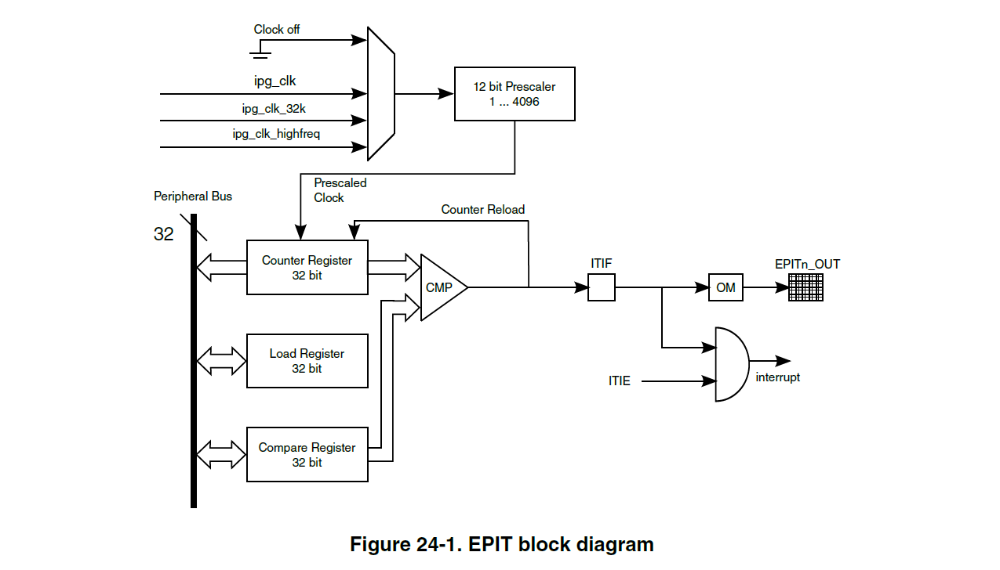

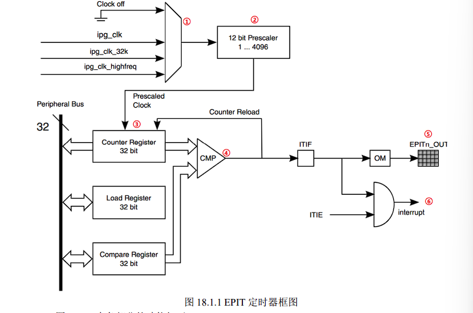

各部分硬件结构功能：

①、这是个多路选择器，用来选择 EPIT 定时器的时钟源，EPIT 共有 3 个时钟源可选择，ipg_clk、ipg_clk_32k 和 ipg_clk_highfreq。

②、这是一个 12 位的分频器，负责对时钟源进行分频，12 位对应的值是 0~4095，对应着1~4096 分频。

③、经过分频的时钟进入到 EPIT 内部，在 EPIT 内部有三个重要的寄存器：
计数寄存器(EPIT_CNR)、加载寄存器(EPIT_LR)和比较寄存器(EPIT_CMPR)，这三个寄存器都是 32 位的。
EPIT 是一个向下计数器，也就是说给它一个初值，它就会从这个给定的初值开始递减，直到减为 0，计数寄存器(EPIT_CNR)里面保存的就是当前的计数值。
如果 EPIT 工作在 set-and-forget 模式下，当计数寄存器里面的值减少到 0，EPIT 就会重新从加载寄存器读取数值到计数寄存器里面，重新开始向下计数。
比较寄存器里面保存的数值用于和计数寄存器里面的计数值比较，如果相等的话就会产生一个比较事件。

④、比较器。

⑤、EPIT 可以设置引脚输出，如果设置了的话就会通过指定的引脚输出信号。

⑥、产生比较中断，也就是定时中断。

EPIT 定时器有两种工作模式：set-and-forget 和 free-running，这两个工作模式的区别如下：

**set-and-forget 模式**：EPITx_CR(x=1，2)寄存器的 RLD 位置 1 的时候 EPIT 工作在此模式下，在此模式下 EPIT 的计数器从加载寄存器 EPITx_LR 中获取初始值，不能直接向计数器寄存器写入数据。
不管什么时候，只要计数器计数到 0，那么就会从加载寄存器 EPITx_LR 中重新加载数据到计数器中，周而复始。

**free-running 模式**：EPITx_CR 寄存器的 RLD 位清零的时候 EPIT 工作在此模式下，当计数器计数到0以后会重新从0XFFFFFFFF开始计数，并不是从加载寄存器EPITx_LR中获取数据。

接下来看一下 EPIT 重要的几个寄存器.

- EPITx_CR 定时器控制寄存器:

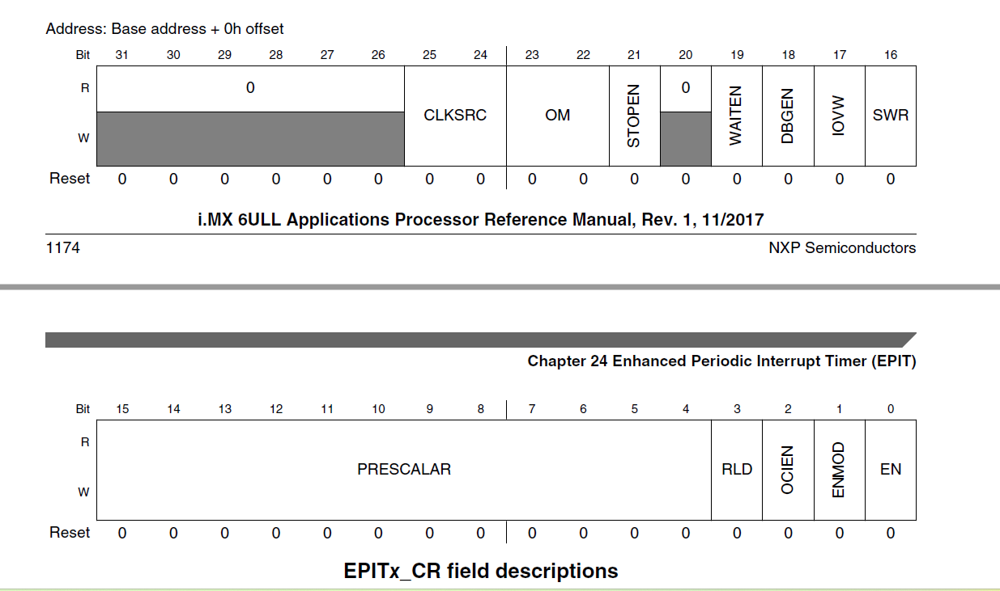

**CLKSRC(bit25:24)**：EPIT 时钟源选择位，为 0 的时候关闭时钟源，1 的时候选择选择Peripheral 时钟(ipg_clk)，为 2 的时候选择 High-frequency 参考时钟(ipg_clk_highfreq)，为 3 的时候选择 Low-frequency 参考时钟(ipg_clk_32k)。
在本例程中，我们设置为 1，也就是选择 ipg_clk作为 EPIT 的时钟源，<span style="color:red;">ipg_clk=66MHz</span>。

**PRESCALAR(bit15:4)**：EPIT 时钟源分频值，可设置范围 0~4095，分别对应 1~4096 分频。

**RLD(bit3)**：EPIT 工作模式，为 0 的时候工作在 free-running 模式，为 1 的时候工作在 setand-forget 模式。
本章例程设置为 1，也就是工作在 set-and-forget 模式。

**OCIEN(bit2)**：比较中断使能位，为 0 的时候关闭比较中断，为 1 的时候使能比较中断，本章试验要使能比较中断。

**ENMOD(bit1)**：设置计数器初始值，为 0 时计数器初始值等于上次关闭 EPIT 定时器以后计数器里面的值，为 1 的时候来源于加载寄存器。

**EN(bit0)**：EPIT 使能位，为 0 的时候关闭 EPIT，为 1 的时候使能 EPIT。

- EPITx_SR： EPIT状态寄存器

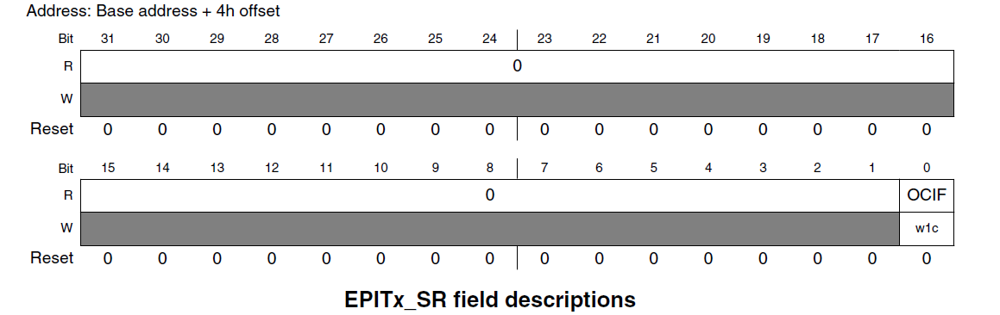

寄存器 EPITx_SR 只有一个位有效，那就是 OCIF(bit0)，这个位是比较中断标志位，为 0 的时候表示没有比较事件发生，为 1 的时候表示有比较事件发生。

当比较中断发生以后需要手动清除此位，此位是写 1 清零的。

补充：

    定时器触发事件是指定时器的状态变化或计数器达到特定值时产生的信号，它可以用于驱动一些操作，但不一定涉及中断。
    定时器触发中断是指定时器达到设定条件后产生的中断信号，这会导致MCU跳转到中断服务程序进行处理

此外：

寄存器 EPITx_LR、EPITx_CMPR 和 EPITx_CNR 分别为加载寄存器、比较寄存器和计数寄存器，这三个寄存器都是用来存放数据的，很简单。

本章我们使用 EPIT 产生定时中断，然后在中断服务函数里面翻转 LED0，接下来以 EPIT1 为例，讲解需要哪些步骤来实现这个功能。
EPIT 的配置步骤如下：

1. **设置EPIT1时钟源**

设置寄存器 EPIT1_CR 寄存器的 CLKSRC(bit25:24)位，选择 EPIT1 的时钟源。

2. **设置分频值**

设置寄存器 EPIT1_CR 寄存器的 PRESCALAR(bit15:4)位，设置分频值。

3. **设置工作模式**

设置寄存器 EPIT1_CR 的 RLD(bit3)位，设置 EPTI1 的工作模式。

4. **设置定时器初始值来源**

设置寄存器 EPIT1_CR 的 ENMOD(bit1)位，设置计数器的初始值来源。

5. **使能比较中断**

我们要使用到比较中断，因此需要设置寄存器 EPIT1_CR 的 OCIEN(bit2)位，使能比较中断。(IO中断使能)

6. **设置加载值和比较值**

设置寄存器 EPIT1_LR 中的加载值和寄存器 EPIT1_CMPR 中的比较值，通过这两个寄存器就可以决定定时器的中断周期

7. **EPIT1 中断设置和中断服务函数编写**

使能 GIC 中对应的 EPIT1 中断，注册中断服务函数，如果需要的话还可以设置中断优先级。最后编写中断服务函数。(GIC 中断ID使能)

8. **使能EPIT1定时器**

配置好 EPIT1 以后就可以使能 EPIT1 了，通过寄存器 EPIT1_CR 的 EN(bit0)位来设置。
通过以上几步我们就配置好 EPIT 了，通过 EPIT 的比较中断来实现 LED0 的翻转。

使用中断 基本操作：

    1. 使能IO出中断开关
    2. GIC初始化int_init() //自己不需要考虑
    3. 使能GIC对应的中断ID开关
    4. 注册中断函数
    5. 设置优先级
    6. 编写中断服务函数

### 18.2 硬件原理分析
①、LED0。
②、定时器 EPTI1。
硬件结构图见上文
### 18.3 代码编写

本实验对应的例程路径为：开发板光盘-> 1、裸机例程-> 10_epit_timer。

本章实验在上一章例程的基础上完成，更改工程名字为“epit_timer”，然后在 bsp 文件夹下创建名为“epittimer”的文件夹，然后在 bsp/epittimer 中新建 bsp_epittimer.c 和 bsp_epittimer.h 这两个文件。

```C
1  #ifndef _BSP_EPITTIMER_H
2  #define _BSP_EPITTIMER_H
3  /***************************************************************
4  Copyright © zuozhongkai Co., Ltd. 1998-2019. All rights reserved.
5  文件名 : bsp_epittimer.h
6  作者 : 左忠凯
7  版本 : V1.0
8  描述 : EPIT 定时器驱动头文件。
9  其他 : 无
10 论坛 : www.openedv.com
11 日志 : 初版 V1.0 2019/1/5 左忠凯创建
12 ***************************************************************/
13 #include "imx6ul.h"
14
15 /* 函数声明 */
16 void epit1_init(unsigned int frac, unsigned int value);
17 void epit1_irqhandler(void);
18
19 #endif
```

```C
1 #include "bsp_epittimer.h"
2 #include "bsp_int.h"
3 #include "bsp_led.h"
4
5 /*
6  * @description : 初始化 EPIT 定时器.
7  * EPIT 定时器是 32 位向下计数器,时钟源使用 ipg=66Mhz
8  * @param – frac : 分频值，范围为 0~4095，分别对应 1~4096 分频。
9  * @param - value : 倒计数值。
10 * @return : 无
11 */
12 void epit1_init(unsigned int frac, unsigned int value)
13 {
14      if(frac > 0XFFF) //超过最大分频值设置为最大
15          frac = 0XFFF;
16      EPIT1->CR = 0; /* 先清零 CR 寄存器 */
17
18     /*
19      * CR 寄存器:
20      * bit25:24 01 时钟源选择 Peripheral clock=66MHz
21      * bit15:4 frac 分频值
22      * bit3: 1 当计数器到 0 的话从 LR 重新加载数值
23      * bit2: 1 比较中断使能
24      * bit1: 1 初始计数值来源于 LR 寄存器值
25      * bit0: 0 先关闭 EPIT1
26      */
27      EPIT1->CR = (1<<24 | frac << 4 | 1<<3 | 1<<2 | 1<<1);
28      EPIT1->LR = value; /* 加载寄存器值 */
29      EPIT1->CMPR = 0; /* 比较寄存器值 */
30
31      /* 使能 GIC 中对应的中断 */
32      GIC_EnableIRQ(EPIT1_IRQn);
33
34      /* 注册中断服务函数 */
35      system_register_irqhandler(EPIT1_IRQn,(system_irq_handler_t)epit1_irqhandler,NULL);
36      EPIT1->CR |= 1<<0; /* 使能 EPIT1 */
37 }
38
39     /*
40      * @description : EPIT 中断处理函数
41      * @param : 无
42      * @return : 无
43      */
44      void epit1_irqhandler(void)
45      {
46          static unsigned char state = 0;
47          state = !state;
48          if(EPIT1->SR & (1<<0)) /* 判断比较事件发生 */
49          {
50              led_switch(LED0, state); /* 定时器周期到，反转 LED */
51          }
52          EPIT1->SR |= 1<<0; /* 清除中断标志位 */
53      }
```

epit1_irqhandler函数类型为 void (func) (void) 强转化为system_irq_handler_t类型。
typedef void (*system_irq_handler_t) (unsigned int giccIar,void *param);

实际调用到epit1_irqhandler时,由于强制的类型转化，会将其解释称system_irq_handler_t去执行，这个函数有两个参数，我们在注册函数时，会将这参数进行传入，到底层执行时会调用这个用的参数以及中断ID号，以防止报错！
(进行函数指针的强制类型转化，一定要保证执行时参数类型正确且能正确传递)

如下图：
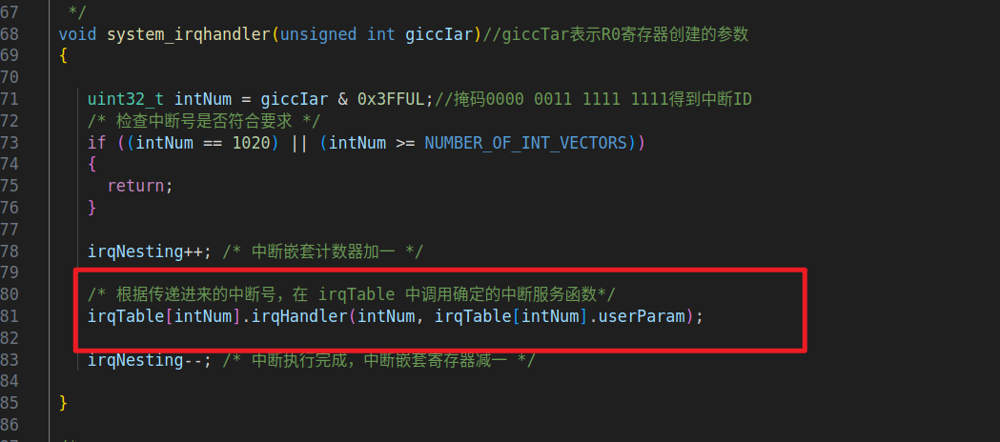

bsp_epittimer.c 里面有两个函数 epit1_init 和 epit1_irqhandler，分别是 EPIT1 初始化函数和EPIT1 中断处理函数。
epit1_init 有两个参数 frac 和 value，其中 frac 是分频值，value 是加载值。
在第 29 行设置比较寄存器为 0，也就是当计数器倒计数到 0 以后就会触发比较中断，因此分频值 frac 和 value 就可以决定中断频率，计算公式如下:

$T_{out} = ((frac +1 )* value) / T_{clk}$

frac值为0到4095 对应于1到4096的分频

Tclk：EPIT1 的输入时钟频率(单位 Hz)。
Tout：EPIT1 的溢出时间(单位 S)。
 
第 38 行设置了 EPIT1 工作模式为 set-and-forget，并且时钟源为 ipg_clk=66MHz。
假如我们现在要设置 EPIT1 中断周期为 500ms，可以设置分频值为 0，也就是 1 分频，这样进入 EPIT1的时钟就是 66MHz。
如果要实现 500ms 的中断周期，EPIT1 的加载寄存器就应该为66000000/2=33000000。

函数 epit1_irqhandler 是 EPIT1 的中断处理函数，此函数先读取 EPIT1_SR 寄存器，判断当前的中断是否为比较事件，如果是的话就翻转 LED 灯。
最后在退出中断处理函数的时候需要清除中断标志位。

最后编写main.c
```C
1 #include "bsp_clk.h"
2 #include "bsp_delay.h"
3 #include "bsp_led.h"
4 #include "bsp_beep.h"
5 #include "bsp_key.h"
6 #include "bsp_int.h"
7 #include "bsp_epittimer.h"
8 
9 /*
10 * @description : main 函数
11 * @param : 无
12 * @return : 无
13 */
14 int main(void)
15 {
16   int_init(); /* 初始化中断(一定要最先调用！) */
17   imx6u_clkinit(); /* 初始化系统时钟 */
18   clk_enable(); /* 使能所有的时钟 */
19   led_init(); /* 初始化 led */
20   beep_init(); /* 初始化 beep */
21   key_init(); /* 初始化 key */
22   epit1_init(0, 66000000/2); /* 初始化 EPIT1 定时器，1 分频
23                               * 计数值为:66000000/2，也就是
24                               * 定时周期为 500ms。
25                               */
26   while(1)
27   {
28     delay(500);
29   }
30
31   return 0;
32 }
```

main主程序十分简单

### 18.4 编译下载

#### 18.4.1 编写Makefile脚本

加入epittimer即可

lds保持不变

#### 18.4.2 下载验证

验证即可

## 第十九章 定时器按键消抖实验

在第十五章和第十七章实验中都用到了按键，用到按键就要处理因为机械结构带来的按键抖动问题，也就是按键消抖。前面的实验中都是直接使用了延时函数来实现消抖，因为简单，但是直接用延时函数来实现消抖会浪费 CPU 性能，因为在延时函数里面 CPU 什么都做不了。
如果按键使用中断的话更不能在中断里面使用延时函数，因为中断服务函数要快进快出！
本章我们学习如何使用定时器来实现按键消抖，使用定时器既可以实现按键消抖，而且也不会浪费CPU 性能，这个也是 Linux 驱动里面按键消抖的做法。

### 19.1 定时器按键消抖简介

按键消抖的原理在第十五章已经详细的讲解了，其实就是在按键按下以后延时一段时间再去读取按键值，如果此时按键值还有效那就表示这是一次有效的按键，中间的延时就是消抖的。
但是这有一个缺点，就是延时函数会浪费 CPU 性能，因为延时函数就是空跑。
如果按键是用中断方式实现的，那就更不能在中断服务函数里面使用延时函数，因为中断服务函数最基本的要求就是快进快出！
上一章我们学习了 EPIT 定时器，定时器设置好定时时间，然后 CPU 就可以做其他事情去了，定时时间到了以后就会触发中断，然后在中断中做相应的处理即可。
因而，我们可以采用下面的设计理念。

设计：
我们可以借助定时器来实现消抖，按键采用中断驱动方式，当按键按下以后触发按键中断，在按键中断中开启一个定时器，定时周期为 10ms，当定时时间到了以后就会触发定时器中断，最后在定时器中断处理函数中读取按键的值，如果按键值还是按下状态那就表示这是一次有效的按键。

定时器按键消抖示意图：


在图中 t1~t3 这一段时间就是按键抖动，是需要消除的。
设置按键为下降沿触发，因此会在 t1、t2 和 t3 这三个时刻会触发按键中断，每次进入中断处理函数都会重新开器定时器中断，所以会在 t1、t2 和 t3 这三个时刻开器定时器中断。
但是 t1~t2 和 t2~t3 这两个时间段是小于我们设置的定时器中断周期(也就是消抖时间，比如 10ms)，所以虽然 t1 开启了定时器，但是定时器定时时间还没到呢 t2 时刻就重置了定时器，最终只有 t3 时刻开启的定时器能完整的完成整个定时周期并触发中断。
我们就可以在中断处理函数里面做按键处理了，这就是定时器实现按键防抖的原理，Linux 里面的按键驱动用的就是这个原理！

关于定时器按键消抖的原理就介绍到这里，接下来讲解如何使用 EPIT1 来配合按键 KEY来实现具体的消抖，步骤如下：

1. **配置按键IO中断**

配置按键所使用的 IO，因为要使用到中断驱动按键，所以要配置 IO 的中断模式。

2. **初始化消抖所用定时器**

上面已经讲的很清楚了，消抖要用定时器来完成，所以需要初始化一个定时器，这里使用上一章讲解的 EPIT1 定时器，也算是对 EPIT1 定时器的一次巩固。
定时器的定时周期为 10ms，也可根据实际情况调整定时周期。

3. **编写中断处理函数**

需要编写两个中断处理函数：按键对应的 GPIO 中断处理函数和 EPIT1 定时器的中断处理函数。
在按键的中断处理函数中主要用于开启 EPIT1 定时器，EPIT1 的中断处理函数才是重点，按键要做的具体任务都是在定时器 EPIT1 的中断处理函数中完成的，比如控制蜂鸣器打开或关闭。

### 19.2 硬件原理分析

本试验用到的资源如下：
①、一个 LED 灯 LED0。
②、定时器 EPTI1。
③、一个按键 KEY。
④、一个蜂鸣器。
本试验效果和第十五章的试验效果一样，按下 KEY 会打开蜂鸣器，再次按下 KEY 就会关闭蜂鸣器。
LED0 作为系统提示灯不断的闪烁。

### 19.3 实验程序编写
例程路径为：开发板光盘-> 1、裸机例程-> 11_key_filter。

上一章例程的基础上完成，更改工程名字为“key_filter”，然后在 bsp 文件夹下创建名为“keyfilter”的文件夹，然后在 bsp/keyfilter 中新建 bsp_keyfilter.c 和 bsp_keyfilter.h 这两个文件。

```C
1 #ifndef _BSP_KEYFILTER_H
2 #define _BSP_KEYFILTER_H
3 /***************************************************************
4 Copyright © zuozhongkai Co., Ltd. 1998-2019. All rights reserved.
5 文件名 : bsp_keyfilter.h
6 作者 : 左忠凯
7 版本 : V1.0
8 描述 : 定时器按键消抖驱动头文件。
9 其他 : 无
10 论坛 : www.openedv.com
11 日志 : 初版 V1.0 2019/1/5 左忠凯创建
12 ***************************************************************/
13
14 /* 函数声明 */
15 void filterkey_init(void);
16 void filtertimer_init(unsigned int value);
17 void filtertimer_stop(void);
18 void filtertimer_restart(unsigned int value);
19 void filtertimer_irqhandler(void);
20 void gpio1_16_31_irqhandler(void);
21
22 #endif
```

```C
1 #include "bsp_key.h"
2 #include "bsp_gpio.h"
3 #include "bsp_int.h"
4 #include "bsp_beep.h"
5 #include "bsp_keyfilter.h"
6 
7 /*
8  * @description : 按键初始化
9  * @param : 无
10 * @return : 无
11 */
12 void filterkey_init(void)
13 {
14      gpio_pin_config_t key_config;
15
16      /* 1、初始化 IO */
17      IOMUXC_SetPinMux(IOMUXC_UART1_CTS_B_GPIO1_IO18, 0);
18      IOMUXC_SetPinConfig(IOMUXC_UART1_CTS_B_GPIO1_IO18, 0xF080);
19
20      /* 2、初始化 GPIO 为中断 */
21      key_config.direction = kGPIO_DigitalInput;
22      key_config.interruptMode = kGPIO_IntFallingEdge;
23      key_config.outputLogic = 1;
24      gpio_init(GPIO1, 18, &key_config);
25
26      /* 3、 使能 GPIO 中断，并且注册中断处理函数 */
27      GIC_EnableIRQ(GPIO1_Combined_16_31_IRQn);
28      system_register_irqhandler(GPIO1_Combined_16_31_IRQn,(system_irq_handler_t)gpio1_16_31_irqhandler,NULL);
29
30      gpio_enableint(GPIO1, 18); /* 使能 GPIO1_IO18 的中断功能 */
31      filtertimer_init(66000000/100); /* 初始化定时器,10ms */
32 }
33
34 /*
35  * @description : 初始化用于消抖的定时器，默认关闭定时器
36  * @param - value : 定时器 EPIT 计数值
37  * @return : 无
38  */
39 void filtertimer_init(unsigned int value)
40 {
41      EPIT1->CR = 0; /* 先清零 */
42      EPIT1->CR = (1<<24 | 1<<3 | 1<<2 | 1<<1);
43      EPIT1->LR = value; /* 计数值 */
44      EPIT1->CMPR = 0; /* 比较寄存器为 0 */
45
46      /* 使能 EPIT1 中断并注册中断处理函数*/
47      GIC_EnableIRQ(EPIT1_IRQn);
48      system_register_irqhandler(EPIT1_IRQn,(system_irq_handler_t)filtertimer_irqhandler,NULL);
49 }
50
51 /*
52  * @description : 关闭定时器
53  * @param : 无
54  * @return : 无
55  */
56 void filtertimer_stop(void)
57 {
58      EPIT1->CR &= ~(1<<0); /* 关闭定时器 */
59 }
60
61 /*
62  * @description : 重启定时器
63  * @param – value : 定时器 EPIT 计数值
64  * @return : 无
65  */
66 void filtertimer_restart(unsigned int value)
67 {
68      EPIT1->CR &= ~(1<<0); /* 先关闭定时器 */
69      EPIT1->LR = value; /* 计数值 */
70      EPIT1->CR |= (1<<0); /* 打开定时器 */
71 }
72
73 /*
74  * @description : 定时器中断处理函数
75  * @param : 无
76  * @return : 无
77  */
78 void filtertimer_irqhandler(void)
79 {
80      static unsigned char state = OFF;
81
82      if(EPIT1->SR & (1<<0)) /* 判断比较事件是否发生 */
83      {
84          filtertimer_stop(); /* 关闭定时器 */
85          if(gpio_pinread(GPIO1, 18) == 0) /* KEY0 按下 */
86          {
87              state = !state;
88              beep_switch(state); /* 反转蜂鸣器 */
89          }
90      }
91      EPIT1->SR |= 1<<0; /* 清除中断标志位 */
92 }
93 
94 /*
95  * @description : GPIO 中断处理函数
96  * @param : 无
97  * @return : 无
98  */
99 void gpio1_16_31_irqhandler(void)
100 {
101     filtertimer_restart(66000000/100); /* 开启定时器 */
102     gpio_clearintflags(GPIO1, 18); /* 清除中断标志位 */
103 }
```
文件 bsp_keyfilter.c 一共有 6 个函数，这 6 个函数其实都很简单。filterkey_init 是本试验的初始化函数，此函数首先初始化了 KEY 所使用的 UART1_CTS 这个 IO，设置这个 IO 的中断模式，并且注册中断处理函数，最后调用函数 filtertimer_init 初始化定时器 EPIT1 定时周期为10ms。
函数 filtertimer_init 是定时器 EPIT1 的初始化函数，内容基本和上一章实验的 EPIT1 初始化函数一样。
函数 filtertimer_stop 和 filtertimer_restart 分别是 EPIT1 的关闭和重启函数。
filtertimer_irqhandler 是 EPTI1 的中断处理函数，此函数里面就是按键要做的工作，在本例程里面就是开启或者关闭蜂鸣器。
函数 gpio1_16_31_irqhandler 是 GPIO1_IO18 的中断处理函数，此函数只有一个工作，那就是重启定时器 EPIT1。

main.c文件：
```C
1 #include "bsp_clk.h"
2 #include "bsp_delay.h"
3 #include "bsp_led.h"
4 #include "bsp_beep.h"
5 #include "bsp_key.h"
6 #include "bsp_int.h"
7 #include "bsp_keyfilter.h"
8
9 /*
10 * @description : main 函数
11 * @param : 无
12 * @return : 无
13 */
14 int main(void)
15 {
16      unsigned char state = OFF;
17
18      int_init(); /* 初始化中断(一定要最先调用！) */
19      imx6u_clkinit(); /* 初始化系统时钟 */
20      clk_enable(); /* 使能所有的时钟 */
21      led_init(); /* 初始化 led */
22      beep_init(); /* 初始化 beep */
23      filterkey_init(); /* 带有消抖功能的按键 */
24
25      while(1)
26      {
27          state = !state;
28          led_switch(LED0, state);
29          delay(500);
30      }
31
32      return 0;
33 }
```

main函数只需要进行LED0的反转即可

### 19.4 编译下载

修改 Makefile 中的 TARGET 为 keyfilter，在 INCDIRS 和 SRCDIRS 中加入“bsp/keyfilter”

lds不变

下载到SD中进行验证即可。

验证成功！

## 第二十章 高精度延迟实验

延时函数是很常用的 API 函数，在前面的实验中我们使用循环来实现延时函数，但是使用循环来实现的延时函数不准确，误差会很大。
虽然使用到延时函数的地方精度要求都不会很严格(要求严格的话就使用硬件定时器了)，但是延时函数肯定是越精确越好，这样延时函数就可以使用在某些对时序要求严格的场合。
本章我们就来学习一下如何使用硬件定时器来实现高精度延时。

### 20.1 高精度延时简介

#### 20.1.1 GPT定时器简介

学过 STM32 的同学应该知道，在使用 STM32 的时候可以使用 SYSTICK 来实现高精度延时。
I.MX6U 没有 SYSTICK 定时器，但是 I.MX6U 有其他定时器啊，比如第十八章讲解的 EPIT定时器。
本章我们使用 I.MX6U 的 GPT 定时器来实现高精度延时，顺便学习一下 GPT 定时器，GPT 定时器全称为 General Purpose Timer。

补充：SYSTICK时钟 @freertos定时器

    STM32 的 SysTick 定时器是一个内置于 Cortex-M 内核中的 24 位向下递减计数器。
    它主要用于产生系统时基，维持操作系统的心跳，或者用于延时操作。以下是一些关键点：
    1. **寄存器**：
       - **CTRL**：控制和状态寄存器，用于启用/禁用定时器，选择时钟源，和使能中断。
       - **LOAD**：重装载寄存器，设置计数器的初始值。
       - **VAL**：当前值寄存器，显示当前计数值。
       - **CALIB**：校准值寄存器，提供参考值。

    2. **时钟源**：
       - SysTick 的时钟源可以是 AHB 时钟（HCLK）或 HCLK 的 1/8。

    3. **配置函数**：
       - `SysTick_Config(uint32_t ticks)`：初始化并启动 SysTick 计数器及其中断。`ticks` 参数设置重装载寄存器的值，最大值为 16777216¹²。

    4. **使用场景**：
       - SysTick 常用于操作系统的心跳时钟，例如在 UCOS 中用作心跳时钟¹²。

    你可以通过调用 `SysTick_Config()` 函数来快速配置和启动 SysTick 定时器。
    这个函数会自动设置重装载寄存器的值，并启用中断和计数器。

GPT 定时器是一个 32 位向上定时器(也就是从 0X00000000 开始向上递增计数)，GPT 定时器也可以跟一个值进行比较，当计数器值和这个值相等的话就发生比较事件，产生比较中断。
GPT 定时器有一个 12 位的分频器，可以对 GPT 定时器的时钟源进行分频，GPT 定时器特性如下：

①、一个可选时钟源的 32 位**向上计数器**。
②、两个**输入捕获**通道，可以设置触发方式。
③、三个**输出比较**通道，可以设置输出模式。
④、可以生成捕获中断、比较中断和溢出中断。
⑤、计数器可以运行在重新启动(restart)或(自由运行)free-run 模式。

GPT定时器可选时钟源如下图：

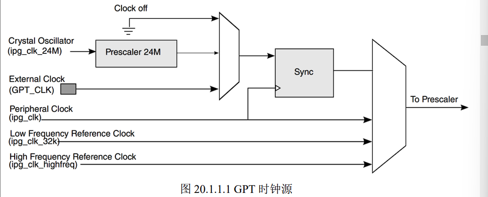

从图可以看出一共有五个时钟源，分别为：ipg_clk_24M、GPT_CLK(外部时钟)、ipg_clk、ipg_clk_32k 和 ipg_clk_highfreq。
本例程选择 ipg_clk 为 GPT 的时钟源，ipg_clk=66MHz。

GPT定时器结构：

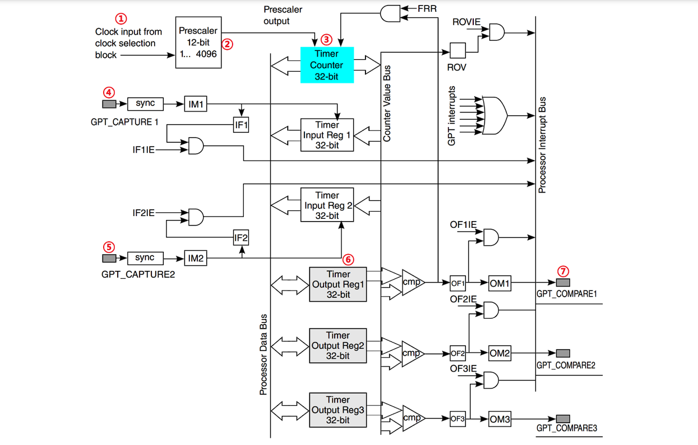

各部分解释：

①、此部分为 GPT 定时器的时钟源，前面已经说过了，本章例程选择 ipg_clk 作为 GPT 定时器时钟源。

②、此部分为 12 位分频器，对时钟源进行分频处理，可设置 0~4095，分别对应 1~4096 分频。

③、经过分频的时钟源进入到 GPT 定时器内部 32 位计数器。

④和⑤、这两部分是 GPT 的两路输入捕获通道，本章不讲解 GPT 定时器的输入捕获。

⑥、此部分为输出比较寄存器，一共有三路输出比较，因此有三个输出比较寄存器，输出比较寄存器是 32 位的。

⑦、此部分位输出比较中断，三路输出比较中断，当计数器里面的值和输出比较寄存器里面的比较值相等就会触发输出比较中断。

GPT 定时器有两种工作模式：重新启动(restart)模式和自由运行(free-run)模式，这两个工作模式的区别如下：

**重新启动(restart)模式**：当 GPTx_CR(x=1，2)寄存器的 FRR 位清零的时候 GPT 工作在此模式。
在此模式下，当计数值和比较寄存器中的值相等的话计数值就会清零，然后重新从
0X00000000 开始向上计数，**只有比较通道 1 才有此模式！**向比较通道 1 的比较寄存器写入任何数据都会复位 GPT 计数器。
对于其他两路比较通道（通道 2 和 3），当发生比较事件以后不会复位计数器。

**自由运行(free-run)模式**：当 GPTx_CR(x=1，2)寄存器的 FRR 位置 1 时候 GPT 工作在此模式下，此模式适用于所有三个比较通道，当比较事件发生以后并不会复位计数器，而是继续计数，直到计数值为 0XFFFFFFFF，然后重新回滚到 0X00000000。

接下来看GPT定时器的寄存器配置：

第一个就是 GPT 的配置寄存器 GPTx_CR，此寄存器的结构如图所示：

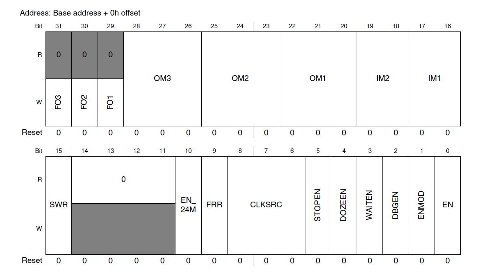

几个重要位配置如下：

**SWR(bit15)**：复位 GPT 定时器，向此位写 1 就可以复位 GPT 定时器，当 GPT 复位完成以后此为会自动清零。

**FRR(bit9)**：运行模式选择，当此位为 0 的时候比较通道 1 工作在重新启动(restart)模式。
当此位为 1 的时候所有的三个比较通道均工作在自由运行模式(free-run)。

**CLKSRC(bit8:6)**：GPT 定时器时钟源选择位，为 0 的时候关闭时钟源；
为 1 的时候选择ipg_clk 作为时钟源；
为 2 的时候选择 ipg_clk_highfreq 为时钟源；
为 3 的时候选择外部时钟为时钟源；
为 4 的时候选择 ipg_clk_32k 为时钟源；
为 5 的时候选择 ip_clk_24M 为时钟源。
本章例程选择 ipg_clk 作为 GPT 定时器的时钟源，因此此位设置位 1(0b001)。

**ENMOD(bit1)**：GPT 使能模式，此位为 0 的时候如果关闭 GPT 定时器，计数器寄存器保存定时器关闭时候的计数值。
此位为 1 的时候如果关闭 GPT 定时器，计数器寄存器就会清零。

**EN(bit)**：GPT 使能位，为 1 的时候使能 GPT 定时器，为 0 的时候关闭 GPT 定时器。

接下来看一下 GPT 定时器的分频寄存器 GPTx_PR，此寄存器结构如图
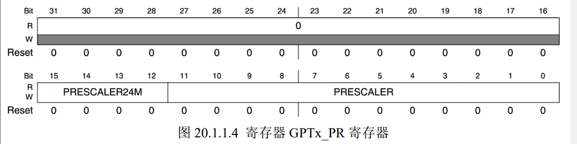

寄存器 GPTx_PR 我们用到的重要位就一个：PRESCALER(bit11:0)，这就是 12 位分频值，可设置 0~4095，分别对应 1~4096 分频。

接下来看一下 GPT 定时器的状态寄存器 GPTx_SR，此寄存器结构如图:

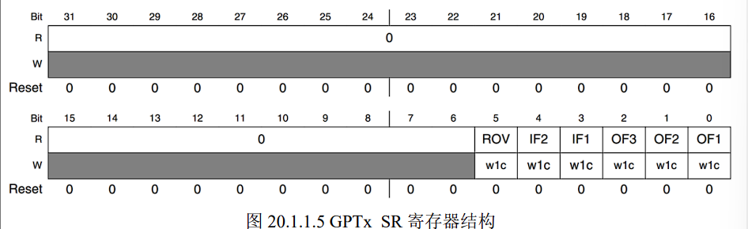

寄存器 GPTx_SR 重要的位如下：

**ROV(bit5)**：回滚标志位，当计数值从 0XFFFFFFFF 回滚到 0X00000000 的时候此位置 1。

**IF2~IF1(bit4:3)**：输入捕获标志位，当输入捕获事件发生以后此位置 1，一共有两路输入捕获通道。
如果使用输入捕获中断的话需要在中断处理函数中清除此位。

**OF3~OF1(bit2:0)**：输出比较中断标志位，当输出比较事件发生以后此位置 1，一共有三路输出比较通道。
如果使用输出比较中断的话需要在中断处理函数中清除此位。

接着看一下 GPT 定时器的计数寄存器 GPTx_CNT，这个寄存器保存着 GPT 定时器的当前计数值。

最后看一下 GPT 定时器的输出比较寄存器 GPTx_OCR，每个输出比较通道对应一个
输出比较寄存器，因此一个 GPT 定时器有三个 OCR 寄存器，它们的作都是相同的。
以输出比较通道 1 为例，其输出比较寄存器为 GPTx_OCR1，这是一个 32 位寄存器，用于存放 32 位的比较值。
当计数器值和寄存器 GPTx_OCR1 中的值相等就会产生比较事件，如果使能了比较中断的话就会触发相应的中断。

关于 GPT 的寄存器就介绍到这里，关于这些寄存器详细的描述，请参考《I.MX6ULL 参考手册》第 1432 页的 30.6 小节。

#### 20.1.2 定时器实现高精度延时原理

高精度延时函数的实现肯定是要借助硬件定时器，前面说了本章实验使用 GPT 定时器来实现高精度延时。
如果设置 GPT 定时器的时钟源为 ipg_clk=66MHz，设置 66 分频，那么进入 GPT定时器的最终时钟频率就是 66/66=1MHz，周期为 1us。
GPT 的计数器每计一个数就表示“过去”了 1us。
如果计 10 个数就表示“过去”了 10us。
通过读取寄存器 GPTx_CNT 中的值就知道计了个数，比如现在要延时 100us，那么进入延时函数以后纪录下寄存器 GPTx_CNT 中的值为 200，当 GPTx_CNT 中的值为 300 的时候就表示 100us 过去了，也就是延时结束。
GPTx_CNT 是个32 位寄存器，如果时钟为 1MHz 的话，GPTx_CNT 最多可以实现 0XFFFFFFFFus=4294967295us≈4294s≈72min。
也就是说 72 分钟以后 GPTx_CNT 寄存器就会回滚到 0X00000000，也就是溢出，所以需要在延时函数中要处理溢出的情况。
关于定时器实现高精度延时的原理就讲解到这里，原理还是很简单的，高精度延时的实现步骤如下：

1. **设置GPT1定时器**

首先设置 GPT1_CR 寄存器的 SWR(bit15)位来复位寄存器 GPT1。复位完成以后设置寄存器 GPT1_CR 寄存器的 CLKSRC(bit8:6)位，选择 GPT1 的时钟源为 ipg_clk。
设置定时器 GPT1的工作模式。

2. **设置GPT1的分频值**

设置寄存器 GPT1_PR 寄存器的 PRESCALAR(bit111:0)位，设置分频值。

3. **设置GPT1的比较值**

如果要使用 GPT1 的输出比较中断，那么 GPT1 的输出比较寄存器 GPT1_OCR1 的值可以根据所需的中断时间来设置。
本章例程不使用比较输出中断，所以将 GPT1_OCR1 设置为最大值，即：0XFFFFFFFF。

4. **使能GPT定时器**

设置好 GPT1 定时器以后就可以使能了，设置 GPT1_CR 的 EN(bit0)位为 1 来使能 GPT1 定时器。

5. **编写延时函数**

GPT1定时器已经开始运行了，可以根据前面介绍的高精度延时函数原理来编写延时函数，针对 us 和 ms 延时分别编写两个延时函数。

### 20.2 硬件原理图

本试验用到的资源如下：
①、一个 LED 灯：LED0。
②、定时器 GPT1。
本实验通过高精度延时函数来控制 LED0 的闪烁，可以通过示波器来观察 LED0 的控制 IO输出波形，通过波形的频率或者周期来判断延时函数精度是否正常。

### 20.3 实验程序编写

本实验对应的例程路径为：开发板光盘-> 1、裸机例程-> 12_highpreci_delay。

本章实验在上一章例程的基础上完成，更改工程名字为“delay”，直接修改 bsp_delay.c 和 bsp_delay.h 这两个文件，将 bsp_delay.h 文件改为如下所示内容：

```C
1 #ifndef __BSP_DELAY_H
2 #define __BSP_DELAY_H
3  /***************************************************************
4  Copyright © zuozhongkai Co., Ltd. 1998-2019. All rights reserved.
5  文件名 : bsp_delay.h
6  作者 : 左忠凯
7  版本 : V1.0
8  描述 : 延时头文件。
9  其他 : 无
10 论坛 : www.openedv.com
11 日志 : 初版 V1.0 2019/1/4 左忠凯创建
12
13 V2.0 2019/1/15 左忠凯修改
14 添加了一些函数声明。
15 ***************************************************************/
16 #include "imx6ul.h"
17
18 /* 函数声明 */
19 void delay_init(void);
20 void delayus(unsigned int usdelay);
21 void delayms(unsigned int msdelay);
22 void delay(volatile unsigned int n);
23 void gpt1_irqhandler(void);
24
25 #endif
```

```C
1 #include "bsp_delay.h"
2
3 /*
4  * @description : 延时有关硬件初始化,主要是 GPT 定时器
5                   GPT 定时器时钟源选择 ipg_clk=66Mhz
6  * @param : 无
7  * @return : 无
8  */
9  void delay_init(void)
10 {
11      GPT1->CR = 0; /* 清零 */
12      GPT1->CR = 1 << 15; /* bit15 置 1 进入软复位 定时器清零*/
13      while((GPT1->CR >> 15) & 0x01); /*等待复位完成 */
14
15      /*
16       * GPT 的 CR 寄存器,GPT 通用设置
17       * bit22:20 000 输出比较 1 的输出功能关闭，也就是对应的引脚没反应
18       * bit9: 0 Restart 模式,当 CNT 等于 OCR1 的时候就产生中断
19       * bit8:6 001 GPT 时钟源选择 ipg_clk=66Mhz
20       */
21      GPT1->CR = (1<<6); //时钟源
22
23      /*
24       * GPT 的 PR 寄存器，GPT 的分频设置
25       * bit11:0 设置分频值，设置为 0 表示 1 分频，
26       * 以此类推，最大可以设置为 0XFFF，也就是最大 4096 分频
27       */
28      GPT1->PR = 65; /* 66 分频，GPT1 时钟为 66M/(65+1)=1MHz */
29
30      /*
31       * GPT 的 OCR1 寄存器，GPT 的输出比较 1 比较计数值，
32       * GPT 的时钟为 1Mz，那么计数器每计一个值就是就是 1us。
33       * 为了实现较大的计数，我们将比较值设置为最大的 0XFFFFFFFF,
34       * 这样一次计满就是：0XFFFFFFFFus = 4294967296us = 4295s = 71.5min
35       * 也就是说一次计满最多 71.5 分钟，存在溢出。
36       */
37      GPT1->OCR[0] = 0XFFFFFFFF;
38      GPT1->CR |= 1<<0; /* 使能 GPT1 */
39
40      /* 以下屏蔽的代码是 GPT 定时器中断代码，
41       * 如果想学习 GPT 定时器的话可以参考以下代码。
42       */
43      #if 0
44      /*
45       * GPT 的 PR 寄存器，GPT 的分频设置
46       * bit11:0 设置分频值，设置为 0 表示 1 分频，
47       * 以此类推，最大可以设置为 0XFFF，也就是最大 4096 分频
48       */
49
50      GPT1->PR = 65; /* 66 分频，GPT1 时钟为 66M/(65+1)=1MHz */
51      /*
52       * GPT 的 OCR1 寄存器，GPT 的输出比较 1 比较计数值，
53       * 当 GPT 的计数值等于 OCR1 里面值时候，输出比较 1 就会发生中断
54       * 这里定时 500ms 产生中断，因此就应该为 1000000/2=500000;
55       */
56      GPT1->OCR[0] = 500000;
57
58      /*
59       * GPT 的 IR 寄存器，使能通道 1 的比较中断
60       * bit0： 0 使能输出比较中断
61       */
62       GPT1->IR |= 1 << 0;
63       
64       /*
65       * 使能 GIC 里面相应的中断，并且注册中断处理函数
66       */
67       GIC_EnableIRQ(GPT1_IRQn); /* 使能 GIC 中对应的中断 */
68       system_register_irqhandler(GPT1_IRQn,(system_irq_handler_t)gpt1_irqhandler,NULL);
69 #endif
70
71 }
72
73 #if 0
74 /* 中断处理函数 */
75 void gpt1_irqhandler(void)
76 {
77      static unsigned char state = 0;
78      state = !state;
79      /*
80       * GPT 的 SR 寄存器，状态寄存器
81       * bit2： 1 输出比较 1 发生中断
82       */
83      if(GPT1->SR & (1<<0))
84      {
85          led_switch(LED2, state);
86      }
87      GPT1->SR |= 1<<0; /* 清除中断标志位 写入1*/
88 }
89 #endif
90
91 /*
92  * @description : 微秒(us)级延时
93  * @param – usdelay : 需要延时的 us 数,最大延时 0XFFFFFFFFus
94  * @return : 无
95  */
96 void delayus(unsigned int usdelay)
97 {
98      unsigned long oldcnt,newcnt;
99      unsigned long tcntvalue = 0; /* 走过的总时间 */
100
101     oldcnt = GPT1->CNT;
102     while(1)
103     {
104         newcnt = GPT1->CNT;
105         if(newcnt != oldcnt)
106         {
107             if(newcnt > oldcnt) /* GPT 是向上计数器,并且没有溢出 */
108                 tcntvalue += newcnt - oldcnt;
109             else /* 发生溢出 */
110                 tcntvalue += 0XFFFFFFFF-oldcnt + newcnt;
111             oldcnt = newcnt;//记录此循环得到的tcntvalue 下一回合需要累加
112             if(tcntvalue >= usdelay) /* 延时时间到了 */
113                 break; /* 跳出 */
114         }
115     }
116 }
117
118 /*
119  * @description : 毫秒(ms)级延时
120  * @param - msdelay : 需要延时的 ms 数
121  * @return : 无
122  */
123 void delayms(unsigned int msdelay)
124 {
125     int i = 0;
126     for(i=0; i<msdelay; i++)
127     {
128         delayus(1000);
129     }
130 }
131
132 /*
133  * @description : 短时间延时函数
134  * @param - n : 要延时循环次数(空操作循环次数，模式延时)
135  * @return : 无
136  */
137 void delay_short(volatile unsigned int n)
138 {
139     while(n--){}
140 }
141
142 /*
143  * @description : 延时函数,在 396Mhz 的主频下
144  * 延时时间大约为 1ms
145  * @param - n : 要延时的 ms 数
146  * @return : 无
147  */
148 void delay(volatile unsigned int n)
149 {
150     while(n--)
151     {
152         delay_short(0x7ff);
153     }
154 }
```

文件 bsp_delay.c 中一共有 5 个函数，分别为：delay_init、delayus、delayms 、delay_short和 delay。
除了 delay_short 和 delay 以外，其他三个都是新增加的。
函数 delay_init 是延时初始化函数，主要用于初始化 GPT1 定时器，设置其时钟源、分频值和输出比较寄存器值。
第 43 到68 行被屏蔽掉的程序是 GPT1 的中断初始化代码，如果要使用 GPT1 的中断功能的话可以参考此部分代码。
第 73 到 89 行被屏蔽掉的程序是 GPT1 的中断处理函数 gpt1_irqhandler，同样的，如果需要使用 GPT1 中断功能的话可以参考此部分代码。

函数 delayus 和 delayms 就是 us 级和 ms 级的高精度延时函数，函数 delayus 就是按照我们在 20.1.2 小节讲解的高精度延时原理编写的，delayus 函数处理 GPT1 计数器溢出的情况。
函数delayus 只有一个参数 usdelay，这个参数就是要延时的 us 数。
delayms 函数很简单，就是对delayus(1000)的多次叠加，此函数也只有一个参数 msdelay，也就是要延时的 ms 数。

修改main.c文件

```C
1 #include "bsp_clk.h"
2 #include "bsp_delay.h"
3 #include "bsp_led.h"
4 #include "bsp_beep.h"
5 #include "bsp_key.h"
6 #include "bsp_int.h"
7 #include "bsp_keyfilter.h"
8
9 /*
10 * @description : main 函数
11 * @param : 无
12 * @return : 无
13 */
14 int main(void)
15 {
16  unsigned char state = OFF;
17
18  int_init(); /* 初始化中断(一定要最先调用！) */
19  imx6u_clkinit(); /* 初始化系统时钟 */
20  delay_init(); /* 初始化延时 */
21  clk_enable(); /* 使能所有的时钟 */
22  led_init(); /* 初始化 led */
23  beep_init(); /* 初始化 beep */
24
25  while(1)
26  {
27      state = !state;
28      led_switch(LED0, state);
29      delayms(500);
30  }
31
32  return 0;
33 }
```
main.c 函数很简单，在第 20 行调用 delay_init 函数进行延时初始化，最后在 while 循环中周期性的点亮和熄灭 LED0，调用函数 delayms 来实现延时。


### 20.4 编译下载即可

make下载到SD卡进行验证即可
可以使用示波器进行观察

## 第二十一章 UARST串口通信

不管是单片机开发还是嵌入式 Linux 开发，串口都是最常用到的外设。
可以通过串口将开发板与电脑相连，然后在电脑上通过串口调试助手来调试程序。
还有很多的模块，比如蓝牙、GPS、GPRS 等都使用的串口来与主控进行通信的，在嵌入式 Linux 中一般使用串口作为控制台，所以掌握串口是必备的技能。
本章我们就来学习如何驱动 I.MX6U 上的串口，并使用串口和电脑进行通信。

### 21.1 IMX6ULL串口简介

#### 21.1.1 UART简介

1. **UART通信格式**

串口全称叫做串行接口，通常也叫做 COM 接口，串行接口指的是数据一个一个的顺序传输，通信线路简单。
使用两条线即可实现双向通信，一条用于发送，一条用于接收。
串口通信距离远，但是速度相对会低，串口是一种很常用的工业接口。
I.MX6U 自带的 UART 外设就是串口的一种，UART 全称是 Universal Asynchronous Receiver/Trasmitter，也就是异步串行收发器。
既然有异步串行收发器，那肯定也有同步串行收发器，学过 STM32 的同学应该知道，STM32除了有 UART 外 ，还有 另 外一 个 叫 做 USART 的 东 西。 
USART 的全称是 Universal Synchronous/Asynchronous Receiver/Transmitter，也就是同步/异步串行收发器。
相比 UART 多了一个同步的功能，在硬件上体现出来的就是多了一条时钟线。
一般 USART 是可以作为 UART使用的，也就是不使用其同步的功能。

UART 作为串口的一种，其工作原理也是将数据一位一位的进行传输，发送和接收各用一条线。
因此通过 UART 接口与外界相连最少只需要三条线：TXD(发送)、RXD(接收)和 GND(地线)。
下图就是 UART 的通信格式：

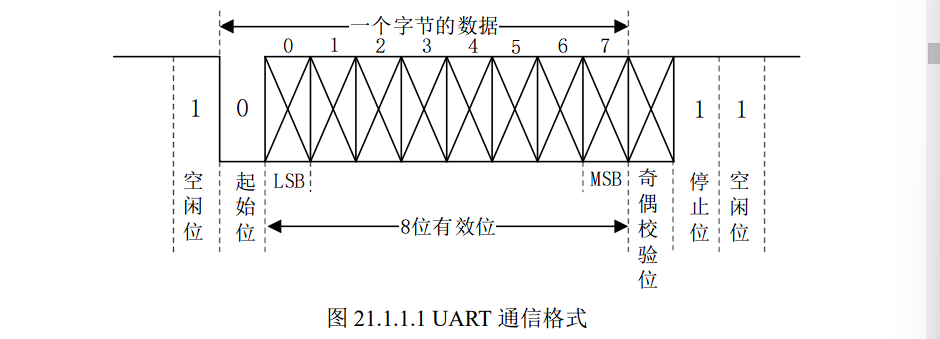

**空闲位**：数据线在空闲状态的时候为逻辑“1”状态，也就是高电平，表示没有数据线空闲，没有数据传输。
**起始位**：当要传输数据的时候先传输一个逻辑“0”，也就是将数据线拉低，表示开始数据传输。
**数据位**：数据位就是实际要传输的数据，数据位数可选择 5~8 位，我们一般都是按照字节传输数据的，一个字节 8 位，因此数据位通常是 8 位的。
低位在前，先传输，高位最后传输。
**奇偶校验位**：这是对数据中“1”的位数进行奇偶校验用的，可以不使用奇偶校验功能。
**停止位**：数据传输完成标志位，停止位的位数可以选择 1 位、1.5 位或 2 位高电平，一般都选择 1 位停止位。

**波特率**：波特率就是 UART 数据传输的速率，也就是每秒传输的数据位数，一般选择 9600、19200、115200 等。

2. **UART电平标准**

UART 一般的接口电平有 TTL 和 RS-232。
一般开发板上都有 TXD 和 RXD 这样的引脚，这些引脚低电平表示逻辑 0，高电平表示逻辑 1，这个就是 TTL 电平。
RS-232 采用差分线，-3~-15V 表示逻辑 1，+3~+15V 表示逻辑 0。

一般图中的接口就是 TTL 电平：
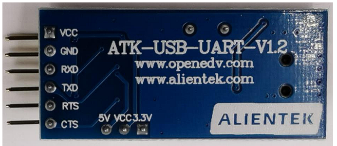

图中的模块就是 USB 转 TTL 模块，TTL 接口部分有 VCC、GND、RXD、TXD、RTS 和 CTS。
RTS 和 CTS 基本用不到，使用的时候通过杜邦线和其他模块的 TTL 接口相连即可。

RS-232 电平需要 DB9 接口，I.MX6U-ALPHA 开发板上的 COM3(UART3)口就是 RS-232 接口的:

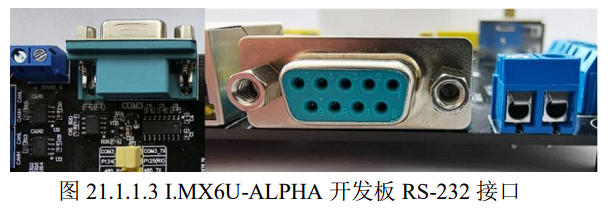

由于现在的电脑都没有 DB9 接口了，取而代之的是 USB 接口，所以就催生出了很多 USB转串口 TTL 芯片，比如 CH340、PL2303 等。
通过这些芯片就可以实现串口 TTL 转 USB。
I.MX6UALPHA开发板就使用CH340 芯片来完成UART1和电脑之间的连接，只需要一条USB 线即可。

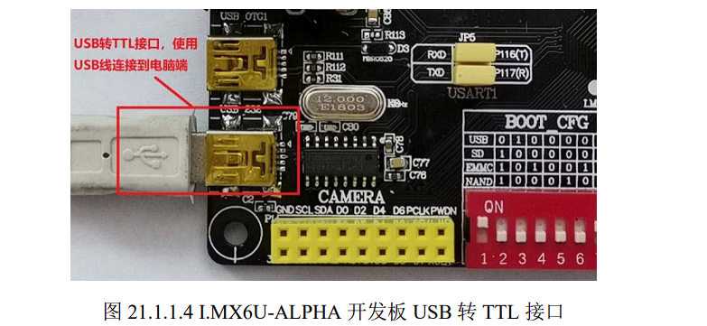

#### 21.1.2 IMX6ULL UART介绍

上一小节介绍了 UART 接口，本小节来具体看一下 I.MX6U 的 UART 接口，I.MX6U 一共有 8 个 UART，其主要特性如下：

①、兼容 TIA/EIA-232F 标准，速度最高可到 5Mbit/S。
②、支持串行 IR 接口，兼容 IrDA，最高可到 115.2Kbit/s。
③、支持 9 位或者多节点模式(RS-485)。
④、1 或 2 位停止位。
⑤、可编程的奇偶校验(奇校验和偶校验)。
⑥、自动波特率检测(最高支持 115.2Kbit/S)。

I.MX6U 的 UART 功能很多，但是我们本章就只用到其最基本的串口功能，关于 UART 其它功能的介绍请参考《I.MX6ULL 参考手册》第 3561 页的“Chapter 55 Universal Asynchronous Receiver/Transmitter(UART)”章节。

结构示意图：
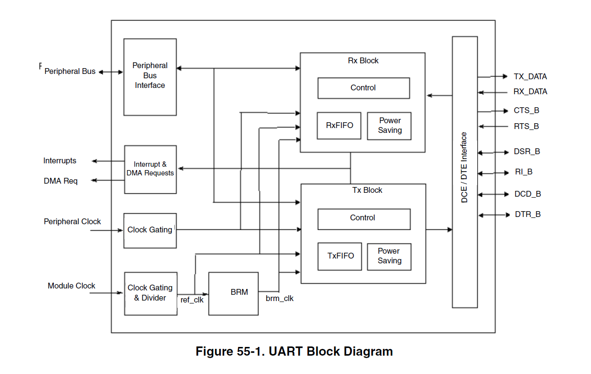

UART 的时钟源是由寄存器 CCM_CSCDR1 的 UART_CLK_SEL(bit)位来选择的，当为 0 的时候 UART 的时钟源为 pll3_80m(80MHz)，如果为 1 的时候 UART 的时钟源为 osc_clk(24M)，一般选择 pll3_80m 作为 UART 的时钟源。
寄存器 CCM_CSCDR1 的 UART_CLK_PODF(bit5:0)位是 UART 的时钟分频值，可设置 0~63，分别对应 1~64 分频，一般设置为 1 分频，因此最终进入 UART 的时钟为 80MHz。

接下来看一下 UART 几个重要的寄存器.

首先是UART控制寄存器1，UARTx_UCR1(x=1\~8)


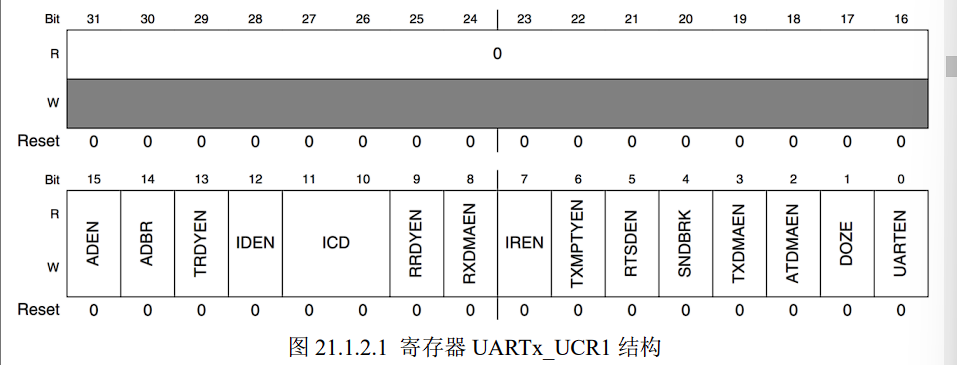

**ADBR(bit14)**：自动波特率检测使能位，为 0 的时候关闭自动波特率检测，为 1 的时候使能自动波特率检测。

**UARTEN(bit0)**：UART 使能位，为 0 的时候关闭 UART，为 1 的时候使能 UART。

其他介绍可以参见数据手册

接下来看一下 UART 的控制寄存器 2，即：UARTx_UCR2

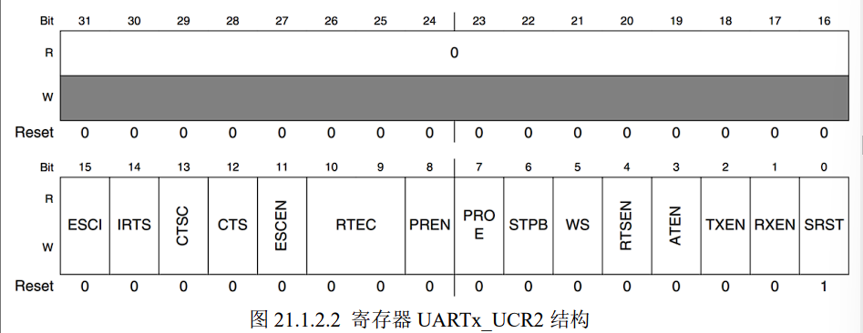

**IRTS(bit14)**：为 0 的时候使用 RTS 引脚功能，为 1 的时候忽略 RTS 引脚。

**PREN(bit8)**：奇偶校验使能位，为 0 的时候关闭奇偶校验，为 1 的时候使能奇偶校验。

**PROE(bit7)**：奇偶校验模式选择位，开启奇偶校验以后此位如果为 0 的话就使用偶校验，此位为 1 的话就使能奇校验。

**STOP(bit6)**：停止位数量，为 0 的话 1 位停止位，为 1 的话 2 位停止位。

**WS(bit5)**：数据位长度，为 0 的时候选择 7 位数据位，为 1 的时候选择 8 位数据位。

**TXEN(bit2)**：发送使能位，为 0 的时候关闭 UART 的发送功能，为 1 的时候打开 UART的发送功能。

**RXEN(bit1)**：接收使能位，为 0 的时候关闭 UART 的接收功能，为 1 的时候打开 UART的接收功能。

**SRST(bit0)**：软件复位，为 0 的是时候软件复位 UART，为 1 的时候表示复位完成。复位完成以后此位会自动置 1，表示复位完成。此位只能写 0，写 1 会被忽略掉。

接下来看一下 UARTx_UCR3 寄存器

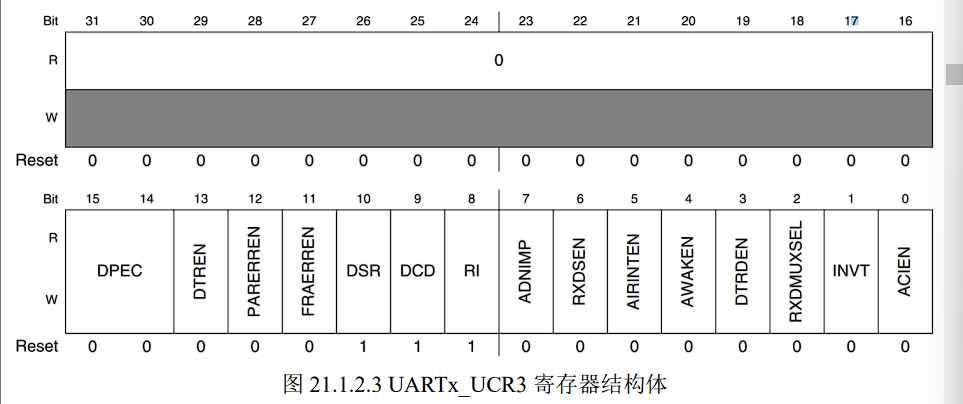

本章实验就用到了寄存器 UARTx_UCR3 中的位 RXDMUXSEL(bit2)，这个位应该始终为 1，这个在《I.MX6ULL 参考手册》第 3624 页有说明。

接下来看一下寄存器 UARTx_USR2，这个是 UART 的状态寄存器 2，此寄存器结构如图：

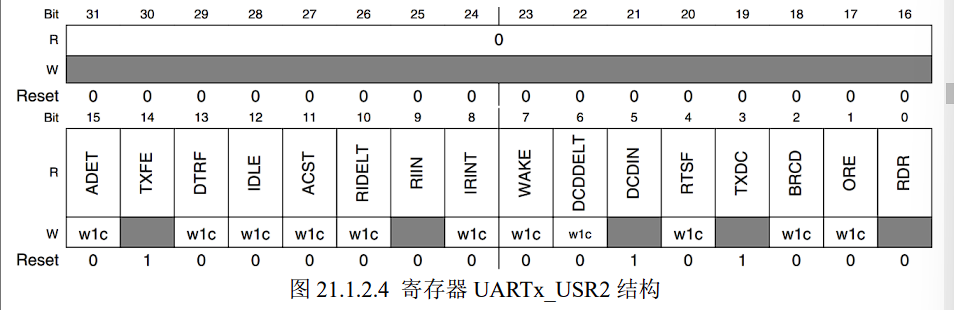

**TXDC(bit3)**：发送完成标志位，为 1 的时候表明发送缓冲(TxFIFO)和移位寄存器为空，也就是发送完成，向 TxFIFO 写入数据此位就会**自动清零**。

**RDR(bit0)**：数据接收标志位，为 1 的时候表明至少接收到一个数据，从寄存器UARTx_URXD 读取数据接收到的数据以后此位会**自动清零**。

接下来看一下寄存器UARTx_UFCR、UARTx_UBIR 和 UARTx_UBMR ， 寄 存 器UARTx_UFCR 中我们要用到的是位 **RFDIV(bit9:7)**，用来设置参考时钟分频，

| RFDIV(bit9:7) | 分频值 |
| ------------- | ------ |
| 000           | 6 分频 |
| 001           | 5 分频 |
| 010           | 4 分频 |
| 011           | 3 分频 |
| 100           | 2 分频 |
| 101           | 1 分频 |
| 110           | 7 分频 |
| 111           | 保留   |

通过这三个寄存器可以设置 UART 的波特率，波特率的计算公式如下：

```math
\text{Baud Rate} = \frac{\text{Ref Freq}}{16 \times \left(\frac{\text{UBMR} + 1}{\text{UBIR} + 1}\right)}
```

Ref Freq：经过分频以后进入 UART 的最终时钟频率。
UBMR：寄存器 UARTx_UBMR 中的值。
UBIR：寄存器 UARTx_UBIR 中的值。

通过 UARTx_UFCR 的 RFDIV 位、UARTx_UBMR 和 UARTx_UBIR 这三者的配合即可得到我们想要的波特率。
比如现在要设置 UART 波特率为 115200，那么可以设置 RFDIV 为5(0b101)，也就是 1 分频，因此 Ref Freq=80MHz。
设置 UBIR=71，UBMR=3124，根据上面的公式可以得到：

```math

\text{Baud Rate} = \frac{\text{Ref Freq}}{16 \times \left(\frac{\text{UBMR} + 1}{\text{UBIR} + 1}\right)}=\frac{80000000}{16 \times \frac{3124 + 1}{71 + 1}} = 115200

```

最后来看一下寄存器 UARTx_URXD 和 UARTx_UTXD，这两个寄存器分别为 UART 的接收和发送数据寄存器，这两个寄存器的低八位为接收到的和要发送的数据。

读取寄存器UARTx_URXD 即可获取到接收到的数据，如果要通过 UART 发送数据，直接将数据写入到寄存器 UARTx_UTXD 即可。

关于 UART 的寄存器就介绍到这里，关于这些寄存器详细的描述，请参考《I.MX6ULL 参考手册》第 3608 页的 55.15 小节。
本章我们使用 I.MX6U 的 UART1 来完成开发板与电脑串口调试助手之间串口通信.

UART1配置如下：

1. **设置UART1时钟源**

设置 UART 的时钟源为 pll3_80m，设置寄存器 CCM_CSCDR1 的 UART_CLK_SEL 位为 0即可。

2. **初始化UART1**

初始化 UART1 所使用 IO，设置 UART1 的寄存器 UART1_UCR1~UART1_UCR3，设置内容包括波特率，奇偶校验、停止位、数据位等等。

3. **使能UART1**

UART1 初始化完成以后就可以使能 UART1 了，设置寄存器 UART1_UCR1 的位 UARTEN为 1。

4. **编写收发函数**

编写两个函数用于 UART1 的数据收发操作。

### 21.2 硬件原理分析

本试验用到的资源如下：
①、一个 LED 灯：LED0。
②、串口 1。
I.MX6U-ALPHA 开发板串口 1 硬件原理图如图所示：

核心板输出
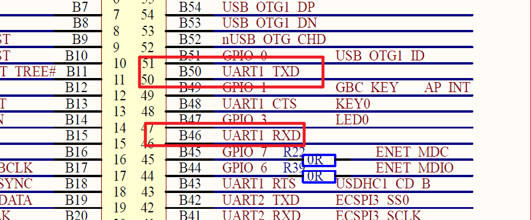

pin接口
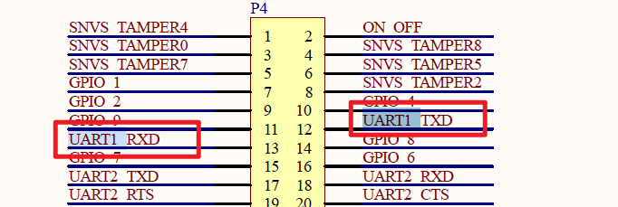

硬件核心：
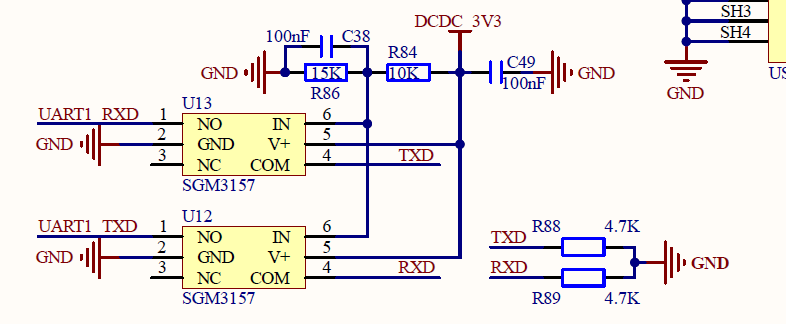

在做实验之前需要用 USB 串口线将串口 1 和电脑连接起来，并且还需要设置 JP5 跳线帽，将串口 1 的 RXD、TXD 两个引脚分别与 P116、P117 连接一起

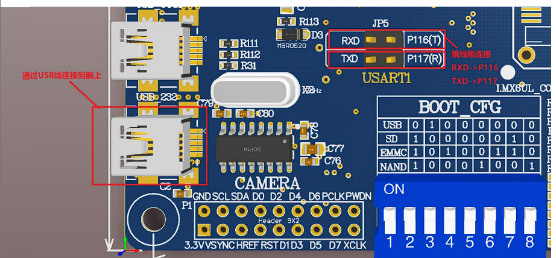

硬件连接设置好以后就可以开始软件编写了，本章实验我们初始化好 UART1，然后等待SecureCRT 给开发板发送一个字节的数据，开发板接收到 SecureCRT 发送过来的数据以后在同通过串口 1 发送给 SecureCRT。

补充：本开发板(MiNi)芯片内核有UART硬件，硬件接口出来就是UART_RXD 与UART_TXD 这两个接口是纯纯的串口传输的接口，然后被引导了，Pin引脚上。当然你可以自己找一块USB_TTL芯片，连接引脚进行通信。为了方便，本开发板将USB的power线，继承了一个USB_TTL的芯片，可以直接在此处进行数据传输。
当然两个方面你都可以进行通讯尝试。
 
<span style="color:red"><b>疑惑：采用CH340连接输出引脚，可以正常向计算机putc，但是getc时不起作用。getc时，CH340的指示灯十分微弱</b></span>

### 21.3 软件程序编写

本实验对应的例程路径为：开发板光盘-> 1、裸机例程-> 13_uart。

本章实验在上一章例程的基础上完成，更改工程名字为“uart”，然后在 bsp 文件夹下创建名为“uart”的文件夹，然后在 bsp/uart 中新建 bsp_uart.c 和 bsp_uart.h 这两个文件。

```C
1  #ifndef _BSP_UART_H
2  #define _BSP_UART_H
3  #include "imx6ul.h"
4  /***************************************************************
5  Copyright © zuozhongkai Co., Ltd. 1998-2019. All rights reserved.
6  文件名 : bsp_uart.h
7  作者 : 左忠凯
8  版本 : V1.0
9  描述 : 串口驱动文件头文件。
10 其他 : 无
11 论坛 : www.openedv.com
12 日志 : 初版 V1.0 2019/1/15 左忠凯创建
13 ***************************************************************/
15 /* 函数声明 */
16 void uart_init(void);
17 void uart_io_init(void);
18 void uart_disable(UART_Type *base);
19 void uart_enable(UART_Type *base);
20 void uart_softreset(UART_Type *base);
21 void uart_setbaudrate(UART_Type *base,unsigned int baudrate,unsigned int srcclock_hz);
22 void putc(unsigned char c);
23 void puts(char *str);
24 unsigned char getc(void);
25 void raise(int sig_nr);
26
27 #endif
```
bsp_uart.h 内容很简单，就是一些函数声明

```C
1 #include "bsp_uart.h"
2
3 /*
4  * @description : 初始化串口 1,波特率为 115200
5  * @param : 无
6  * @return : 无
7  */
8 void uart_init(void)
9 {
10  /* 1、初始化串口 IO */
11  uart_io_init();
12
13  /* 2、初始化 UART1 */
14  uart_disable(UART1); /* 先关闭 UART1 */
15  uart_softreset(UART1); /* 软件复位 UART1 */
16
17  UART1->UCR1 = 0; /* 先清除 UCR1 寄存器 */ //UCR1设置使能与波特率自动检测
18  UART1->UCR1 &= ~(1<<14); /* 关闭自动波特率检测 */
19
20 /*
21  * 设置 UART 的 UCR2 寄存器，设置字长，停止位，校验模式，关闭硬件流控
22  * bit14: 1 忽略 RTS 引脚
23  * bit8: 0 关闭奇偶校验 默认
24  * bit6: 0 1 位停止位 默认
25  * bit5: 1 8 位数据位
26  * bit2: 1 打开发送
27  * bit1: 1 打开接收
28  */  //UCR2设置串口的配置
29  UART1->UCR2 |= (1<<14) | (1<<5) | (1<<2) | (1<<1);//RT均使能UART打开后即可收发
30  UART1->UCR3 |= 1<<2; /* UCR3 的 bit2 必须为 1 */
31
32 /*
33  * 设置波特率
34  * 波特率计算公式:Baud Rate = Ref Freq / (16 * (UBMR + 1)/(UBIR+1))
35  * 如果要设置波特率为 115200，那么可以使用如下参数:
36  * Ref Freq = 80M 也就是寄存器 UFCR 的 bit9:7=101, 表示 1 分频
37  * UBMR = 3124
38  * UBIR = 71
39  * 因此波特率= 80000000/(16 * (3124+1)/(71+1))
40  * = 80000000/(16 * 3125/72)
41  * = (80000000*72) / (16*3125)
42  * = 115200
43  */
44  UART1->UFCR = 5<<7; /* ref freq 等于 ipg_clk/1=80Mhz */
45  UART1->UBIR = 71;
46  UART1->UBMR = 3124;
47 
48  #if 0
49  uart_setbaudrate(UART1, 115200, 80000000); /* 设置波特率 */
50  #endif
51
52  uart_enable(UART1); /* 使能串口 */
53 }
54
55 /*
56  * @description : 初始化串口 1 所使用的 IO 引脚
57  * @param : 无
58  * @return : 无
59  */
60 void uart_io_init(void)
61 {
62 /* 1、初始化串口 IO 复用功能以及IO配置
63  * UART1_RXD -> UART1_TX_DATA
64  * UART1_TXD -> UART1_RX_DATA
65  */
66  IOMUXC_SetPinMux(IOMUXC_UART1_TX_DATA_UART1_TX, 0);
67  IOMUXC_SetPinMux(IOMUXC_UART1_RX_DATA_UART1_RX, 0);
68  IOMUXC_SetPinConfig(IOMUXC_UART1_TX_DATA_UART1_TX, 0x10B0);
69  IOMUXC_SetPinConfig(IOMUXC_UART1_RX_DATA_UART1_RX, 0x10B0);
70 }
71
72 /*
73  * @description : 波特率计算公式，
74  * 可以用此函数计算出指定串口对应的 UFCR，
75  * UBIR 和 UBMR 这三个寄存器的值
76  * @param - base : 要计算的串口。
77  * @param - baudrate : 要使用的波特率。
78  * @param - srcclock_hz : 串口时钟源频率，单位 Hz
79  * @return : 无
80  */
81 void uart_setbaudrate(UART_Type *base,unsigned int baudrate,unsigned int srcclock_hz)
82 {
83  uint32_t numerator = 0u;
84  uint32_t denominator = 0U;
85  uint32_t divisor = 0U;
86  uint32_t refFreqDiv = 0U;
87  uint32_t divider = 1U;
88  uint64_t baudDiff = 0U;
89  uint64_t tempNumerator = 0U;
90  uint32_t tempDenominator = 0u;
91
92  /* get the approximately maximum divisor */
93  numerator = srcclock_hz;
94  denominator = baudrate << 4;
95  divisor = 1;
96
97  while (denominator != 0)
98  {
99      divisor = denominator;
100     denominator = numerator % denominator;
101     numerator = divisor;
102 }
103
104 numerator = srcclock_hz / divisor;
105 denominator = (baudrate << 4) / divisor;
106
107 /* numerator ranges from 1 ~ 7 * 64k */
108 /* denominator ranges from 1 ~ 64k */
109 if ((numerator > (UART_UBIR_INC_MASK * 7)) || (denominator > UART_UBIR_INC_MASK))
110 {
111     uint32_t m = (numerator - 1) / (UART_UBIR_INC_MASK * 7) + 1;
112     uint32_t n = (denominator - 1) / UART_UBIR_INC_MASK + 1;
113     uint32_t max = m > n ? m : n;
114     numerator /= max;
115     denominator /= max;
116     if (0 == numerator)
117     {
118         numerator = 1;
119     }
120     if (0 == denominator)
121     {
122         denominator = 1;
123     }
124 }
125 divider = (numerator - 1) / UART_UBIR_INC_MASK + 1;
126
127 switch (divider)
128 {
129     case 1:
130         refFreqDiv = 0x05;
131         break;
132     case 2:
133         refFreqDiv = 0x04;
134         break;
135     case 3:
136         refFreqDiv = 0x03;
137         break;
138     case 4:
139         refFreqDiv = 0x02;
140         break;
141     case 5:
142         refFreqDiv = 0x01;
143         break;
144     case 6:
145         refFreqDiv = 0x00;
146         break;
147     case 7:
148         refFreqDiv = 0x06;
149         break;
150     default:
151         refFreqDiv = 0x05;
152         break;
153 }
154 /* Compare the difference between baudRate_Bps and calculated
155 * baud rate. Baud Rate = Ref Freq / (16 * (UBMR + 1)/(UBIR+1)).
156 * baudDiff = (srcClock_Hz/divider)/( 16 * ((numerator /divider)/ denominator).
157 */
158 tempNumerator = srcclock_hz;
159 tempDenominator = (numerator << 4);
160 divisor = 1;
161 /* get the approximately maximum divisor */
162 while (tempDenominator != 0)
163 {
164     divisor = tempDenominator;
165     tempDenominator = tempNumerator % tempDenominator;
166     tempNumerator = divisor;
167 }
168 tempNumerator = srcclock_hz / divisor;
169 tempDenominator = (numerator << 4) / divisor;
170 baudDiff = (tempNumerator * denominator) / tempDenominator;
171 baudDiff = (baudDiff >= baudrate) ? (baudDiff - baudrate) :(baudrate - baudDiff);
172
173 if (baudDiff < (baudrate / 100) * 3)
174 {
175     base->UFCR &= ~UART_UFCR_RFDIV_MASK;
176     base->UFCR |= UART_UFCR_RFDIV(refFreqDiv);
177     base->UBIR = UART_UBIR_INC(denominator - 1);
178     base->UBMR = UART_UBMR_MOD(numerator / divider - 1);
179 }
180 }
181
182 /*
183  * @description : 关闭指定的 UART
184  * @param – base : 要关闭的 UART
185  * @return : 无
186  */
187 void uart_disable(UART_Type *base)
188 {
189     base->UCR1 &= ~(1<<0);
190 }
191
192 /*
193  * @description : 打开指定的 UART
194  * @param – base : 要打开的 UART
195  * @return : 无
196  */
197 void uart_enable(UART_Type *base)
198 {
199     base->UCR1 |= (1<<0);
200 }
201
202 /*
203 * @description : 复位指定的 UART
204 * @param – base : 要复位的 UART
205 * @return : 无
206 */
207 void uart_softreset(UART_Type *base)
208 {
209     base->UCR2 &= ~(1<<0); /* 复位 UART 写入0*/
210     while((base->UCR2 & 0x1) == 0); /* 等待复位完成 */
211 }
212
213 /*
214  * @description : 发送一个字符
215  * @param - c : 要发送的字符
216  * @return : 无
217  */
218 void putc(unsigned char c)
219 {
220     while(((UART1->USR2 >> 3) &0X01) == 0);/* 等待上一次发送完成 */
221     UART1->UTXD = c & 0XFF; /* 发送数据 只取低八位*/
222 }
223
224 /*
225  * @description : 发送一个字符串
226  * @param - str : 要发送的字符串
227  * @return : 无
228  */ //str结尾以\0 遇到\0后循环就停止
229 void puts(char *str)
230 {
231     char *p = str;//定义一个指针变量
232
233     while(*p)
234         putc(*p++);// p++ 表达式为 p p为++p 单目右向左结合
235 }
236
237 /*
238 * @description : 接收一个字符
239 * @param : 无
240 * @return : 接收到的字符
241 */
242 unsigned char getc(void)
243 {
244     while((UART1->USR2 & 0x1) == 0); /* 等待接收完成 收到时变为1自动清0*/
245     return UART1->URXD; /* 返回接收到的数据 */
246 }
247
248 /*
249 * @description : 防止编译器报错 平台一致性
250 * @param : 无
251 * @return : 无
252 */
253 void raise(int sig_nr)
254 {
255
256 }
```

文件 bsp_uart.c 中共有 10 个函数，我们依次来看一下这些函数都是做什么的。
第一个函数是 uart_init，这个函数是 UART1 初始化函数，用于初始化 UART1 相关的 IO、并且设置 UART1的波特率、字长、停止位和校验模式等，初始化完成以后就使能 UART1。
第二个函数是uart_io_init，用于初始化 UART1 所使用的 IO。
第三个函数是 uart_setbaudrate，这个函数是从NXP 官方的 SDK 包里面移植过来的，用于设置波特率。
我们只需将要设置的波特率告诉此函数，此函数就会使用逐次逼近方式来计算出寄存器 UART1_UFCR 的 FRDIV 位、寄存器UART1_UBIR 和寄存器 UART1_UBMR 这三个的值。
第四和第五这两个函数为 uart_disable 和uart_enable，分别是使能和关闭 UART1。
第六个函数是 uart_softreset，用于软件复位指定的 UART。
第七个函数是putc，用于通过UART1发送一个字节的数据。第八个函数是puts，用于通过UART1发送一串数据。
第九个函数是 getc，用于通过 UART1 获取一个字节的数据。
最后一个函数是raise，这是一个空函数，防止编译器报错。

main.c如下设计：
```C
1 #include "bsp_clk.h"
2 #include "bsp_delay.h"
3 #include "bsp_led.h"
4 #include "bsp_beep.h"
5 #include "bsp_key.h"
6 #include "bsp_int.h"
7 #include "bsp_uart.h"
8
9 /*
10 * @description : main 函数
11 * @param : 无
12 * @return : 无
13 */
14 int main(void)
15 {
16      unsigned char a=0;
17      unsigned char state = OFF;
18
19      int_init(); /* 初始化中断(一定要最先调用！) */
20      imx6u_clkinit(); /* 初始化系统时钟 */
21      delay_init(); /* 初始化延时 */
22      clk_enable(); /* 使能所有的时钟 */
23      led_init(); /* 初始化 led */
24      beep_init(); /* 初始化 beep */
25      uart_init(); /* 初始化串口，波特率 115200 */
26
27      while(1)
28      {
29          puts("请输入 1 个字符:"); //写入串口 显示
30          a=getc();//获取串口输入 没有输入恒等
31          putc(a); /* 回显功能到串口 */
32          puts("\r\n");
33
34          /* 显示输入的字符 */
35          puts("您输入的字符为:");
36          putc(a);
37          puts("\r\n\r\n");
38
39          state = !state;
40          led_switch(LED0,state);
41      }
42      return 0;
43 }
```
输入SecureCRT中输入时，就已经发送默认不回显，所以显putc(a)显示一下

### 21.4 编译下载

#### 21.4.1 编写Makefile

```makefile
1 CROSS_COMPILE ?= arm-linux-gnueabihf2 TARGET ?= uart
3
4 CC := $(CROSS_COMPILE)gcc
5 LD := $(CROSS_COMPILE)ld
6 OBJCOPY := $(CROSS_COMPILE)objcopy
7 OBJDUMP := $(CROSS_COMPILE)objdump
8
9 LIBPATH := -lgcc -L /usr/local/arm/gcc-linaro-4.9.4-2017.01-
x86_64_arm-linux-gnueabihf/lib/gcc/arm-linux-gnueabihf/4.9.4
10
11
12 INCDIRS := imx6ul \
13 bsp/clk \
14 bsp/led \
15 bsp/delay \
16 bsp/beep \
17 bsp/gpio \
18 bsp/key \
19 bsp/exit \
20 bsp/int \
21 bsp/epittimer \
22 bsp/keyfilter \
23 bsp/uart
24
25 SRCDIRS := project \
26 bsp/clk \
27 bsp/led \
28 bsp/delay \
29 bsp/beep \
30 bsp/gpio \
31 bsp/key \
32 bsp/exit \
33 bsp/int \
34 bsp/epittimer \
35 bsp/keyfilter \
36 bsp/uart
37
38
39 INCLUDE := $(patsubst %, -I %, $(INCDIRS))
40
41 SFILES := $(foreach dir, $(SRCDIRS), $(wildcard $(dir)/*.S))
42 CFILES := $(foreach dir, $(SRCDIRS), $(wildcard $(dir)/*.c))
43
44 SFILENDIR := $(notdir $(SFILES))
45 CFILENDIR := $(notdir $(CFILES))
46
47 SOBJS := $(patsubst %, obj/%, $(SFILENDIR:.S=.o))
48 COBJS := $(patsubst %, obj/%, $(CFILENDIR:.c=.o))
49 OBJS := $(SOBJS) $(COBJS)
50
51 VPATH := $(SRCDIRS)
52
53 .PHONY: clean
54
55 $(TARGET).bin : $(OBJS)
56 $(LD) -Timx6ul.lds -o $(TARGET).elf $^ $(LIBPATH)
57 $(OBJCOPY) -O binary -S $(TARGET).elf $@
58 $(OBJDUMP) -D -m arm $(TARGET).elf > $(TARGET).dis
59
60 $(SOBJS) : obj/%.o : %.S
61 $(CC) -Wall -nostdlib -fno-builtin -c -O2 $(INCLUDE) -o $@ $<
62
63 $(COBJS) : obj/%.o : %.c
64 $(CC) -Wall -nostdlib -fno-builtin -c -O2 $(INCLUDE) -o $@ $<
65
66 clean:
67 rm -rf $(TARGET).elf $(TARGET).dis $(TARGET).bin $(COBJS) $(SOBJS)
```
上述的 Makefile 文件内容和上一章实验的区别不大。将 TARGET 为 uart，在 INCDIRS 和SRCDIRS 中加入“bsp/uart”。

但是，相比上一章中的 Makefile 文件，本章实验的 Makefile 有两处重要的改变：

①、本章 Makefile 文件在链接的时候加入了数学库， 因为在 bsp_uart.c 中有个函数uart_setbaudrate，在此函数中使用到了除法运算，因此在链接的时候需要将编译器的数学库也链接进来。
第9行的变量LIBPATH就是数学库的目录，在第56行链接的时候使用了变量LIBPATH。

在后面的学习中，我们常常要用到一些第三方库，那么在连接程序的时候就需要指定这些第三方库所在的目录，Makefile 在链接的时候使用选项“-L”来指定库所在的目录，比如“示例代码”中第 9 行的变量 LIBPATH 就是指定了我们所使用的编译器库所在的目录。

②、在第 61 行和 64 行中，加入了选项“-fno-builtin”，否则编译的时候提示“putc”、“puts”这两个函数与内建函数冲突，错误信息如下所示：


在编译的时候加入选项“-fno-builtin”表示不使用内建函数，这样我们就可以自己实现 putc和 puts 这样的函数了。

-I 头文件地址 -l 库名 -L 库路径
链接脚本保持不变。

#### 21.4.2 编译下载

烧写成功以后将 SD 卡插到开发板的 SD 卡槽中，然后复位开发板。
打开 SourceCRT，点击 File->Quick Connect…，打开快速连接设置界面，设置好相应的串口参数，比如在我的电脑上是COM3

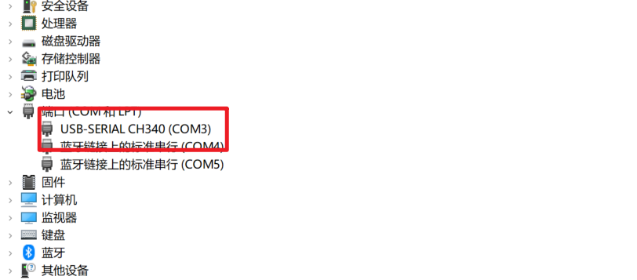

设置:
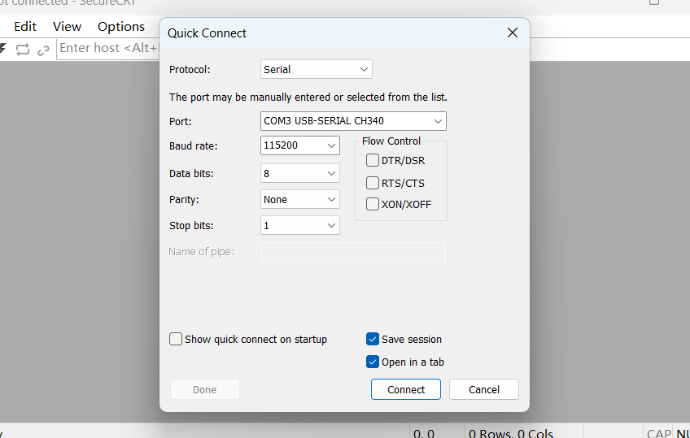

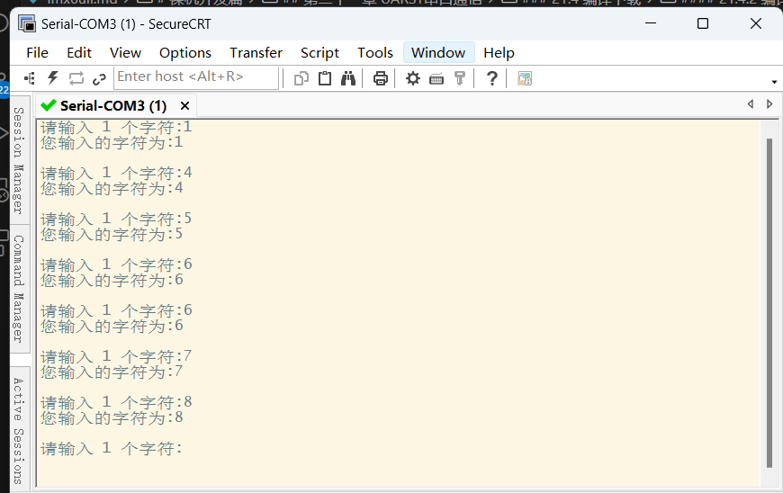

测试成功！！！

## 第二十二章 串口格式化函数

上一章实验我们实现了 UART1 基本的数据收发功能，虽然可以用来调试程序，但是功能太单一了，只能输出字符。
如果需要输出数字的时候就需要我们自己先将数字转换为字符，非常的不方便。
学习 STM32 串口的时候我们都会将 printf 函数映射到串口上，这样就可以使用printf 函数来完成格式化输出了，使用非常方便。
本章我们就来学习如何将 printf 这样的格式化函数移植到 I.MX6U-ALPHA 开发板上。

### 22.1 串口格式化函数简介

格式化函数说的是 printf、sprintf 和 scanf 这样的函数，分为格式化输入和格式化输出两类函数。
学习 C 语言的时候常常通过 printf 函数在屏幕上显示字符串，通过 scanf 函数从键盘获取输入。
这样就有了输入和输出了，实现了最基本的人机交互。学习 STM32 的时候会将 printf 映射到串口上，这样即使没有屏幕，也可以通过串口来和开发板进行交互。
在 I.MX6U-ALPHA 开发板上也可以使用此方法，将 printf 和 scanf 映射到串口上，这样就可以使用 SecureCRT 作为开发板的终端，完成与开发板的交互。
也可以使用 printf 和 sprintf 来实现各种各样的格式化字符串，方便我们后续的开发。
串口驱动我们上一章已经编写完成了，而且实现了最基本的字节收发，本章我们就通过移植网上别人已经做好的文件来实现格式化函数。

### 22.2 硬件原理

同21章

### 22.3 实验程序编写

本实验对应的例程路径为：开发板光盘-> 1、裸机例程-> 14_printf。

本章实验所需要移植的源码已经放到了开发板光盘中，路径为：1、例程源码->5、模块驱动源码->2、格式化函数源码->stdio，文件夹 stdio 里面的文件就是我们要移植的源码文件。
本章实验在上一章例程的基础上完成，将 stdio 文件夹复制到实验工程根目录中：
如图
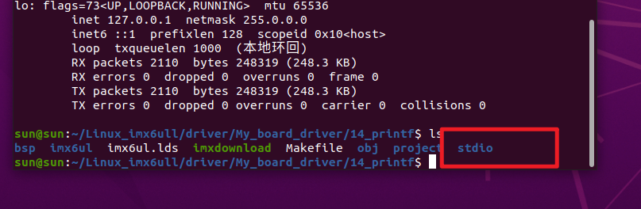

stdio 里面有两个文件夹：include 和 lib，这两个文件夹里面的内容如图 22.3.2 所示：

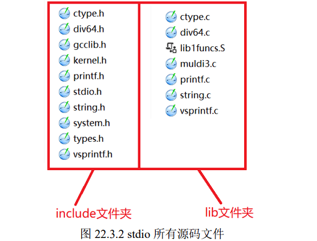

图中就是 stdio 里面的所有文件，stdio 里面的文件其实是从 uboot 里面移植过来的。
后面学习 uboot 以后大家有兴趣的话可以自行从 uboot 源码里面“扣”出相应的文件，完成格式化函数的移植。
这里要注意一点，stdio 中并没有实现完全版的格式化函数，比如 printf 函数并不支持浮点数，但是基本够我们使用了。

移植好以后就要测试相应的函数工作是否正常，我们使用 scanf 函数等待键盘输入两个整数，然后将两个整数进行相加并使用 printf 函数输出结果。
在 main.c 里面输入如下内容：
```C
1 #include "bsp_clk.h"
2 #include "bsp_delay.h"
3 #include "bsp_led.h"
4 #include "bsp_beep.h"
5 #include "bsp_key.h"
6 #include "bsp_int.h"
7 #include "bsp_uart.h"
8 #include "stdio.h"
9
10 /*
11  * @description : main 函数
12  * @param : 无
13  * @return : 无
14  */
15 int main(void)
16 {
17      unsigned char state = OFF;
18      int a , b;
19
20      int_init(); /* 初始化中断(一定要最先调用！) */
21      imx6u_clkinit(); /* 初始化系统时钟 */
22      delay_init(); /* 初始化延时 */
23      clk_enable(); /* 使能所有的时钟 */
24      led_init(); /* 初始化 led */
25      beep_init(); /* 初始化 beep */
26      uart_init(); /* 初始化串口，波特率 115200 */
27
28      while(1)
29      {
30          printf("输入两个整数，使用空格隔开:");
31          scanf("%d %d", &a, &b); /* 输入两个整数 */
32          printf("\r\n 数据%d + %d = %d\r\n\r\n", a, b, a+b);/* 输出和 */
33
34          state = !state;
35          led_switch(LED0,state);
36      }
37
38      return 0;
39 }
```

### 22.4 编译下载验证

#### 22.4.1 编写Makefile和链接脚本

修改 Makefile 中的 TARGET 为 printf，在 INCDIRS 中加入“stdio/include”，在 SRCDIRS中加入“stdio/lib”

INCDIRS 中添加头文件路径
SRCDIRS 中添加源文件路径

同时注意，（.c 到 .o）
在编译 C 文件的时候添加了选项“-Wa,-mimplicit-it=thumb”，否则的话会有如下类似的错误提示：


补充 参数解释：

    在 GCC 编译器中，-Wa 和 -mimplicit-it=thumb 是两个不同的选项，它们的作用如下：
    1. -Wa 参数：
        -Wa 选项用于传递选项给汇编器（assembler）。
        其后可以跟一个或多个汇编器选项。
        这意味着你通过 -Wa 告诉 GCC 将某些选项传递给底层的汇编器，而不是给 GCC 自身的编译器。
        例如：
        gcc -Wa,-option
        这会将 -option 传递给汇编器。这样，你可以控制汇编过程中的一些行为。

    在你的命令中，-Wa 后面跟的是 -mimplicit-it=thumb，意味着将 -mimplicit-it=thumb 选项传递给汇编器。

    2. -mimplicit-it=thumb 参数：
        -mimplicit-it=thumb 是与 ARM 架构相关的 GCC 编译选项，指定如何处理 IT（If-Then）指令和使用的指令集架构。
        IT 指令是 ARM 汇编语言中的一种条件执行指令，它可以使后续的一些指令只在满足某些条件时执行，这有助于减少代码大小。
        -mimplicit-it=thumb 选项的作用是启用在 Thumb 模式下使用 隐式 IT 指令。
        在 ARM 架构中，Thumb 模式是一种32位 ARM 指令集的精简版本，它将指令集大小从 32 位压缩到 16 位，因此在 Thumb 模式下执行的代码通常比 ARM 模式下更紧凑。

        具体含义：
        -mimplicit-it=thumb：启用在 Thumb 模式下隐式生成 IT 指令。
        这表示编译器在生成 Thumb 模式的代码时，会隐式地插入 IT 指令，以便后续的一些指令能够根据条件进行执行。
        
        在 Thumb 模式下，IT 指令常用于生成短的条件跳转（比如执行某个指令只有在满足条件时才会被执行）。
        启用这个选项意味着编译器会默认处理这些条件执行的指令，而不需要显式地在汇编代码中使用 IT 指令。

        例如，IT 指令允许在一个 16 位的 Thumb 指令流中执行多个条件指令（减少了控制流指令的数量，从而提高代码效率）。

        总结：
        -Wa,-mimplicit-it=thumb 告诉 GCC 将 -mimplicit-it=thumb 选项传递给汇编器，启用在 Thumb 模式下使用隐式的 IT 指令。
        这对 ARM 体系架构中的条件执行和代码优化非常重要，特别是在生成精简且高效的代码时。
        如果你正在为 ARM 架构编写代码并且希望优化代码体积，使用这种方式可以减少 if 或 switch 语句等条件控制流的开销，特别是针对使用 Thumb 模式的目标设备。

#### 22.4.2 编译下载

下载验证即可


测试成功

## 第二十三章 DDR3实验

I.MX6U-ALPHA 开发板上带有一个 256MB/512MB 的 DDR3 内存芯片，一般 Cortex-A 芯片自带的 RAM 很小，比如 I.MX6U 只有 128KB 的 OCRAM。
如果要运行 Linux 的话完全不够用的，所以必须要外接一片 RAM 芯片，I.MX6U 支持 LPDDR2、LPDDR3/DDR3，I.MX6U-ALPHA开发板上选择的是 DDR3。
本章就来学习如何驱动 I.MX6U-ALPHA 开发板上的这片 DDR3。

### 23.1 DDR3内存简介

在正式学习 DDR3 内存之前，我们要先了解一下 DDR 内存的发展历史，通过对比 SRAM、SDRAM、DDR、DDDR2 和 DDR3 的区别，有助于我们更加深入的理解什么是 DDR。
在看 DDR之前我们先来了解一个概念，那就是什么叫做 RAM?

#### 23.1.1 何为RAM和ROM

相信大家在购买手机、电脑等电子设备的时候，通常都会听到 RAM、ROM、硬盘等概念，很多人都是一头雾水的。
普通用户区分不清楚 RAM、ROM 到可以理解，但是作为一个嵌入式Linux 开发者，要是不清楚什么是 RAM、什么是 ROM 就绝对不行！
RAM 和 ROM 专业的解释如下:

**RAM**：随机存储器，可以随时进行读写操作，速度很快，掉电以后数据会丢失。比如内存条、SRAM、SDRAM、DDR 等都是 RAM。
RAM 一般用来保存程序数据、中间结果，比如我们在程序中定义了一个变量 a，然后对这个 a 进行读写操作，示例代码如下：
```C
1 int a;
2 a = 10;
```
a 是一个变量，我们需要很方便的对这个变量进行读写操作，方法就是直接“a”进行读写操作，不需要在乎具体的读写过程。
我们可以随意的对 RAM 中任何地址的数据进行读写操作，非常方便。

**ROM**：只读存储器，笔者认为目前“只读存储器”这个定义不准确。
比如我们买手机，通常会告诉你这个手机是 4+64 或 6+128 配置，说的就是 RAM 为 4GB 或 6GB，ROM 为 64G 或 128GB。
但是这个 ROM 是 Flash，比如 EMMC 或 UFS 存储器，因为历史原因，很多人还是将Flash 叫做 ROM。
但是 EMMC 和 UFS，甚至是 NAND Flash，这些都是可以进行写操作的！只
是写起来比较麻烦，要先进行擦除，然后再发送要写的地址或扇区，最后才是要写入的数据，学习过 STM32，使用过 WM25QXX 系列的 SPI Flash 的同学应该深有体会。
可以看出，相比于RAM，向 ROM 或者 Flash 写入数据要复杂很多，因此意味着速度就会变慢(相比 RAM)，但是ROM 和 Flash 可以将容量做的很大，而且掉电以后数据不会丢失，适合用来存储资料，比如音乐、图片、视频等信息。

综上所述，RAM 速度快，可以直接和 CPU 进行通信，但是掉电以后数据会丢失，容量不容易做大(和同价格的 Flash 相比)。
ROM(目前来说，更适合叫做 Flash)速度虽然慢，但是容量大、适合存储数据。
对于正点原子的 I.MX6U-ALPHA 开发板而言，256MB/512MB 的 DDR3 就是 RAM，而 512MB NANF Flash 或 8GB EMMC 就是 ROM。

#### 23.1.2 SRAM简介(六个cmos构成)

为什么要讲 SRAM 呢？因为大多数的朋友最先接触 RAM 芯片都是从 SRAM 开始的，因为大量的 STM32 单片机开发板都使用到了 SRAM，比如 F103、F407 等，基本都会外扩一个512KB 或 1MB 的 SRAM 的，因为 STM32F103/F407 内部 RAM 比较小，在一些比较耗费内存的应用中会出现内存捉紧的情况，比如 emWin 做 UI 界面。
我们简单回顾一下 SRAM，如果想要详细的了解 SRAM 请阅读正点原子 STM32F103 战舰开发板的开发指南。

SRAM 的全称叫做 Static Random-Access Memory，也就是静态随机存储器，这里的“静态”说的就是只要 SRAM 上电，那么 SRAM 里面的数据就会一直保存着，直到 SRAM 掉电。

对于RAM 而言需要可以随机的读取任意一个地址空间内的数据，因此采用了地址线和数据线分离的方式，这里就以 STM32F103/F407 开发板常用的 IS62WV51216 这颗 SRAM 芯片为例简单的讲解一下 SRAM，这是一颗 16 位宽(数据位为 16 位)、1MB 大小的 SRAM，芯片框图如图：

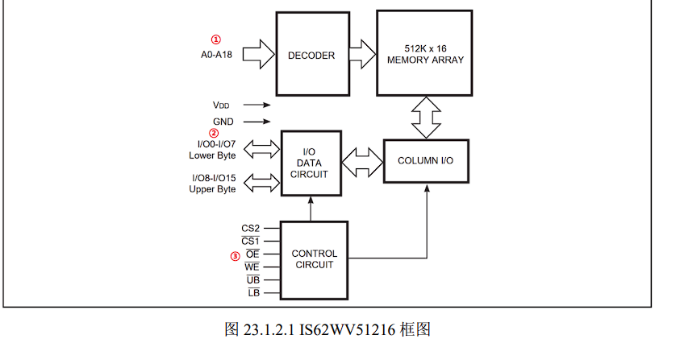

图主要分为三部分，我们依次来看一下这三部分：

①、**地址线**

这部分是地址线，一共 A0\~A18，也就是 19 根地址线，因此可访问的地址大小就是2^19=524288=512KB。
不是说 IS62WV51216 是个 1MB 的 SRAM 吗？为什么地址空间只有512KB？
前面我们说了 IS62WV51216 是 16 位宽的，也就是一次访问 2 个字节，因此需要对512KB 进行乘 2 处理，得到 512KB*2=1MB。
位宽的话一般有 8 位/16 位/32 位，根据实际需求选择即可，一般都是根据处理器的 SRAM 控制器位宽来选择 SRAM 位宽。

②、**数据线**

这部分是 SRAM 的数据线，根据 SRAM 位宽的不同，数据线的数量要不同，8 位宽就有 8根数据线，16 位宽就有 16 根数据线，32 位宽就有 32 根数据线。
IS62WV51216 是一个 16 位宽的 SRAM，因此就有 16 根数据线，一次访问可以访问 16bit 的数据，也就是 2 个字节。
因此就有高字节和低字节数据之分，其中 IO0\~IO7 是低字节数据，IO8\~IO15 是高字节数据。

③、**控制线**

SRAM 要工作还需要一堆的控制线，CS2 和 CS1 是片选信号，低电平有效，在一个系统中可能会有多片 SRAM(目的是为了扩展 SRAM 大小或位宽)，这个时候就需要 CS 信号来选择当前使用哪片 SRAM。
另外，有的 SRAM 内部其实是由两片 SRAM 拼接起来的，因此就会提供两个片选信号。
OE 是输出使能信号，低电平有效，也就是主控从 SRAM 读取数据。
WE 是写使能信号，低电平有效，也就是主控向 SRAM 写数据。
UB 和 LB 信号，前面我们已经说了，IS62WV51216 是个 16 位宽的 SRAM，分为高字节和低字节，那么如何来控制读取高字节数据还是低字节数据呢？
这个就是 UB 和 LB 这两个控制线的作用，这两根控制线都是低电平有效。
UB 为低电平的话表示访问高字节，LB 为低电平的话表示访问低字节。

关于 IS62WV51216 的简单原理就讲解到这里。

那么 SRAM 有什么缺点没有？那必须有的啊，要不然就不可能有本章教程了，SRAM 最大的缺点就是成本高！价格高！
大家可以在淘宝上搜索一下 IS62WV51216 这个仅仅只有 1MB大小的 SRAM 售价为多少，大概为 5,6 块钱。
大家再搜索一下 32MB 的 SDRAM 多钱，以华邦的 W9825G6KH 为例，大概 4,5 块钱，可以看出 SDRAM 比 SRAM 容量大，但是价格更低。
SRAM 突出的特点就是无需刷新(SDRAM 需要刷新，后面会讲解)，读写速度快！
所以 SRAM通常作为 SOC 的内部 RAM 使用或 Cache 使用，比如 STM32 内存的 RAM 或 I.MX6U 内部的OCRAM 都是 SRAM。

#### 23.1.3 SDRAM简介

前面给大家简单讲解了 SRAM，可以看出 SRAM 最大的缺点就是价格高、容量小！但是应用对于内存的需求越来越高，必须提供大内存解决方案。
为此半导体厂商想了很多办法，提出了很多解决方法，最终 SDRAM 应运而生，得到推广。

SDRAM 全称是 Synchronous Dynamic Random Access Memory，翻译过来就是同步动态随机存储器，“同步”的意思是 SDRAM 工作需要时钟线，“动态”的意思是 SDRAM 中的数据需要不断的刷新来保证数据不会丢失，“随机”的意思就是可以读写任意地址的数据。(DRAM的升级，以电容作为存储信息的元件)

与 SRAM 相比，SDRAM 集成度高、功耗低、成本低、适合做大容量存储，但是需要定时刷新来保证数据不会丢失。
因此 SDRAM 适合用来做内存条，SRAM 适合做高速缓存或 MCU内部的 RAM。

SDRAM 目前已经发展到了第四代，分别为：SDRAM、DDR SDRAM、DDR2 SDRAM、DDR3 SDRAM、DDR4 SDRAM。(2024年11/29日已经出现DDR5x)

STM32F429/F767/H743 等芯片支持 SDRAM，学过 STM32F429/F767/H743 的朋友应该知道 SDRAM，这里我们就以 STM32 开发板最常用的华邦W9825G6KH 为例。
W9825G6KH 是一款 16 位宽(数据位为 16 位)、32MB 的 SDRAM、速度一般为 133MHz、166MHz 或 200MHz。

W9825G6KH 框图如图：

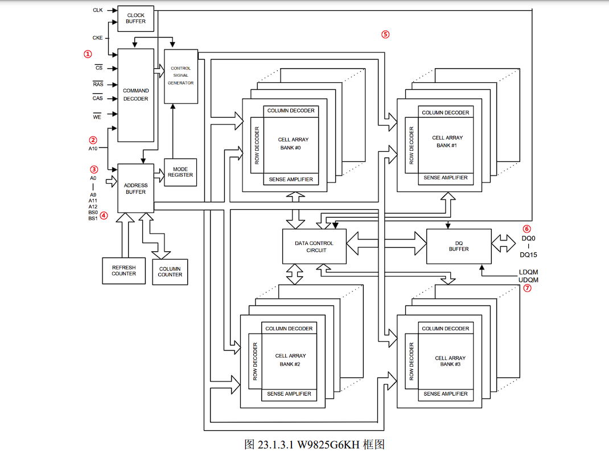

①、**控制线**
SDRAM 也需要很多控制线，我们依次来看一下：

CLK：时钟线，SDRAM 是同步动态随机存储器，“同步”的意思就是时钟，因此需要一根额外的时钟线，这是和 SRAM 最大的不同，SRAM 没有时钟线。
CKE：时钟使能信号线，SRAM 没有 CKE 信号。
CS：片选信号，这个和 SRAM 一样，都有片选信号。
RAS：行选通信号，低电平有效，SDRAM 和 SRAM 的寻址方式不同。
SDRAM 按照行、列来确定某个具体的存储区域。
因此就有行地址和列地址之分，行地址和列地址共同复用同一组地址线，要访问某一个地址区域，必须要发送行地址和列地址，指定要访问哪一行？哪一列？
RAS 是行选通信号，表示要发送行地址，行地址和列地址访问方式如图所示：

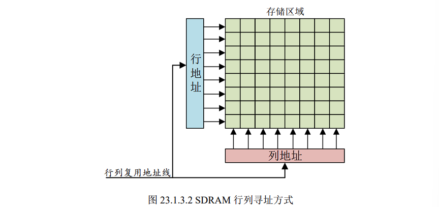

复用地址线 @计算机组成原理

②、**A10 地址线**

A10 是地址线，那么这里为什么要单独将 A10 地址线给提出来呢？
因为 A10 地址线还有另外一个作用，A10 还控制着 Auto-precharge，也就是预充电。
这里又提到了预充电的概念，SDRAM芯片内部会分为多个 BANK，关于 BANK 我们稍后会讲解。
SDRAM 在读写完成以后，如果要对同一个 BANK 中的另一行进行寻址操作就必须将原来有效的行关闭，然后发送新的行/列地址，关闭现在工作的行，准备打开新行的操作就叫做预充电。
一般 SDSRAM 都支持自动预充电的功能。

③、**地址线**
对于 W9825G6KH 来说一共有 A0\~A12，共 13 根地址线，但是我们前面说了 SDRAM 寻址是按照行地址和列地址来访问的，因此这 A0\~A12 包含了行地址和列地址。
不同的 SDRAM 芯片，根据其位宽、容量等的不同，行列地址数是不同的，这个在 SDRAM 的数据手册里面会也清楚的。
比如 W9825G6KH 的 A0\~A8 是列地址，一共 9 位列地址，A0\~A12 是行地址，一共 13位，因此可寻址范围为：2^9 * 2^13=4194304B=4MB，W9825G6KH 为 16 位宽(2 个字节)，因此还需要对 4MB 进行乘 2 处理，得到 4 * 2=8MB，但是 W9825G6KH 是一个 32MB 的 SDRAM 啊，为什么算出来只有 8MB，仅仅为实际容量的 1/4。
不要急，这个就是我们接下来要讲的 BANK，8MB 只是一个 BANK 的容量，W9825G6KH 一共有 4 个 BANK。

④、**BANK 选择线**
BS0 和 BS1 是 BANK 选择信号线，在一片 SDRAM 中因为技术、成本等原因，不可能做一个全容量的 BANK。
而且，因为 SDRAM 的工作原理，单一的 BANK 会带来严重的寻址冲突，减低内存访问效率。
为此，人们在一片 SDRAM 中分割出多块 BANK，一般都是 2 的 n 次方，比如 2，4，8 等。
图中的⑤就是 W9825G6KH 的 4 个 BANK 示意图，每个 SDRAM 数据手册里面都会写清楚自己是几 BANK。
前面我们已经计算出来了一个 BANK 的大小为 8MB，那么四个 BANK 的总容量就是 8MB * 4=32MB。

既然有4个BANK，那么在访问的时候就需要告诉SDRAM，我们现在需要访问哪个BANK，BS0 和 BS1 就是为此而生的，4 个 BANK 刚好 2 根线，如果是 8 个 BANK 的话就需要三根线，也就是 BS0~BS2。BS0、BS1 这两个线也是 SRAM 所没有的。

⑤、**BANK 区域**

关于 BANK 的概念前面已经讲过了，这部分就是 W9825G6KH 的 4 个 BANK 区域。这个概念也是 SRAM 所没有的。

⑥、**数据线**
W9825G6KH 是 16 位宽的 SDRAM，因此有 16 根数据线，DQ0~DQ15，不同的位宽其数据线数量不同，这个和 SRAM 是一样的。

⑦、**高低字节选择**

W9825G6KH 是一个 16 位的 SDRAM，因此就分为低字节数据和高字节数据，LDQM 和
UDQM 就是低字节和高字节选择信号，这个也和 SRAM 一样。

#### 23.1.4 DDR简介

终于到了 DDR 内存了，DDR 内存是 SDRAM 的升级版本，SDRAM 分为 SDR SDRAM、DDR SDRAM、DDR2 SDRAM、DDR3 SDRAM、DDR4 SDRAM。
可以看出 DDR 本质上还是SDRAM，只是随着技术的不断发展，DDR 也在不断的更新换代。
先来看一下 DDR，也就是DDR1，人们对于速度的追求是永无止境的，当发现 SDRAM 的速度不够快的时候人们就在思考如何提高 SDRAM 的速度，DDR SDRAM 由此诞生。

DDR 全称是 Double Data Rate SDRAM，也就是双倍速率 SDRAM，看名字就知道 DDR 的速率(数据传输速率)比 SDRAM 高 1 倍！
这 1 倍的速度不是简简单单的将 CLK 提高 1 倍，SDRAM 在一个 CLK 周期传输一次数据，DDR 在一个 CLK 周期传输两次数据，也就是在上升沿和下降沿各传输一次数据，这个概念叫做预取(prefetch)，相当于 DDR 的预取为 2bit，因此DDR 的速度直接加倍！
比如 SDRAM 速度一般是 133~200MHz，对应的传输速度就是133~200MT/s，在描述 DDR 速度的时候一般都使用 MT/s，也就是每秒多少兆次数据传输。
133MT/S 就是每秒 133M 次数据传输，MT/s 描述的是单位时间内传输速率。
同样 133~200MHz的频率，DDR 的传输速度就变为了 266~400MT/S，所以大家常说的 DDR266、DDR400 就是这么来的。

DDR2 在 DDR 基础上进一步增加预取(prefetch)，增加到了 4bit，相当于比 DDR 多读取一倍的数据，因此 DDR2 的数据传输速率就是 533~800MT/s，这个也就是大家常说的 DDR2 533、DDR2 800。当然了，DDR2 还有其他速度，这里只是说最常见的几种。

DDR3 在 DDR2 的基础上将预取(prefetch)提高到 8bit，因此又获得了比 DDR2 高一倍的传输速率，因此在总线时钟同样为 266~400MHz 的情况下，DDR3 的传输速率就是 1066~1600MT/S。

I.MX6U 的 MMDC 外设用于连接 DDR，支持 LPDDR2、DDR3、DDR3L，最高支持 16 位数据位宽。
总线速度为 400MHz(实际是 396MHz)，数据传输速率最大为 800MT/S。
这里我们讲一下LPDDR3、DDR3 和 DDR3L 的区别，这三个都是 DDR3，但是区别主要在于工作电压。
LPDDR3叫做低功耗 DDR3，工作电压为 1.2V。
DDR3 叫做标压 DDR3，工作电压为 1.5V，一般台式内存条都是 DDR3。
DDR3L 是低压 DDR3，工作电压为 1.35V，一般手机、嵌入式、笔记本等都使用 DDR3L。

正点原子的 I.MX6U-ALPHA 开发板上接了一个 256MB/512MB 的 DDR3L，16 位宽，型号为NT5CC128M16JR/MT5CC256M16EP，nanya 公司出品的，分为对应 256MB 和 512MB 容量。
EMMC 核心板上用的 512MB 容量的 DDR3L，NAND 核心板上用的 256MB 容量的 DDR3L。

本讲解我们就以 EMMC 核心板上使用的 NT5CC256M16EP-EK 为例讲解一下 DDR3。
可以到 nanya官网去查找一下此型号，信息如图：

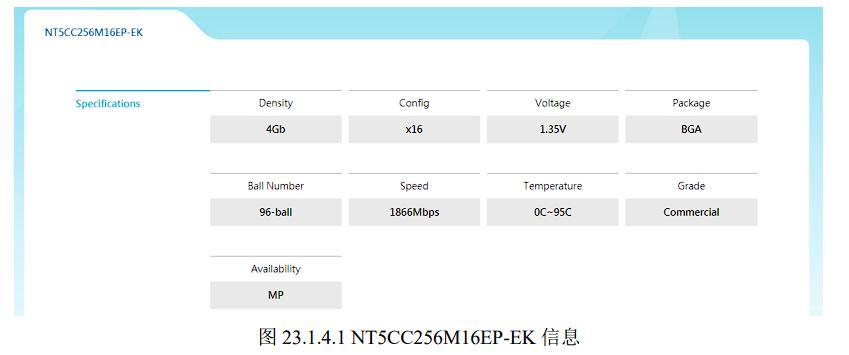

从图可以看出，NT5CC256M16EP-EK 是一款容量为 4Gb，也就是 512MB 大小、16 位宽、1.35V、传输速率为 1866MT/S 的 DDR3L 芯片。
NT5CC256M16EP-EK 的数据手册没有在 nanya 官网找到，但是找到了 NT5CC256M16ER-EK 数据手册，在官网上没有看出这两个有什么区别，因此我们就直接用 NT5CC256M16ER-EK 的数据手册。
数据手册已经放到了开发板光盘中，路径为：6、硬件资料-》1、芯片资料-》NT5CC256M16EP-EK.pdf。

但是数据手册并没有给出 DDR3L 对的结构框图，这里我就直接用镁光 MT41K256M16 数据手册里面的结构框图了，都是一样的，DDR3L 结构框图如图所示：

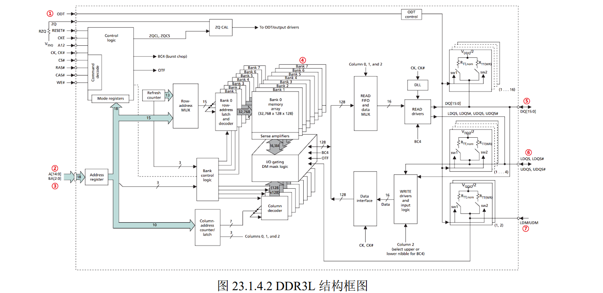

从图可以看出，DDR3L 和 SDRAM 对的结构框图很类似，但是还是有点区别。

①、**控制线**
ODT：片上终端使能，ODT 使能和禁止片内终端电阻。

ZQ：输出驱动校准的外部参考引脚，此引脚应该外接一个 240 欧的电阻到 VSSQ 上，一般就是直接接地了。

RESET：复位引脚，低电平有效。

CKE：时钟使能引脚。

A12：A12 是地址引脚，但是有也有另外一个功能，因此也叫做 BC 引脚，A12 会在 READ和 WRITE 命令期间被采样，以决定 burst chop 是否会被执行。

CK 和 CK#：时钟信号，DDR3 的时钟线是差分时钟线，所有的控制和地址信号都会在 CK对的上升沿和 CK#的下降沿交叉处被采集。

CS#：片选信号，低电平有效。

RAS#、CAS#和 WE#：行选通信号、列选通信号和写使能信号。

②、**地址线**

A[14:0]为地址线，A0~A14，一共 15 根地址线，根据 NT5CC256M16ER-EK 的数据手册可知，列地址为 A0~A9，共 10 根，行地址为 A0~A14，共 15 根，因此一个 BANK 的大小就是2^10 * 2^15 * 2 = 32MB * 2 = 64MB，根据图可知一共有 8 个 BANK，因此 DDR3L 的容量就是 64 * 8=512MB。

③、**BANK 选择线**

一片 DDR3 有 8 个 BANK，因此需要 3 个线才能实现 8 个 BANK 的选择，BA0~BA2 就是用于完成 BANK 选择的。

④、**BANK 区域**
DDR3 一般都是 8 个 BANK 区域。

⑤、**数据线**
因为是 16 位宽的，因此有 16 根数据线，分别为 DQ0~DQ15。

⑥、**数据选通引脚**

DQS 和 DQS#是数据选通引脚，为差分信号，读的时候是输出，写的时候是输入。
LDQS(有的叫做 DQSL)和 LDQS#(有的叫做 DQSL#)对应低字节，也就是 DQ0~7。
UDQS(有的叫做 DQSU)和 UDQS#(有的叫做 DQSU#)，对应高字节，也就是 DQ8~15。

⑦、**数据输入屏蔽引脚**

DM 是写数据输入屏蔽引脚。

关于 DDR3L 的框图就讲解到这里，想要详细的了解 DDR3 的组成，请阅读相应对的数据手册。

### 23.2 DDR3关键时间参数

大家在购买 DDR3 内存的时候通常会重点观察几个常用的时间参数：

1. **传输速率**

比如 1066MT/S、1600MT/S、1866MT/S 等，这个是首要考虑的，因为这个决定了 DDR3 内存的最高传输速率。

2. **tRCD参数**

tRCD 全称是 RAS-to-CAS Delay，也就是行寻址到列寻址之间的延迟。
DDR 的寻址流程是先指定 BANK 地址，然后再指定行地址，最后指定列地址确定最终要寻址的单元。
BANK 地址和行地址是同时发出的，这个命令叫做“行激活”(Row Active)。
行激活以后就发送列地址和具体的操作命令(读还是写)，这两个是同时发出的，因此一般也用“读/写命令”表示列寻址。
在行有效(行激活)到读写命令发出的这段时间间隔叫做 tRCD，如下图所示：


一 般 DDR3 数 据 手 册 中 都 会 给 出 tRCD 的 时 间 值 ， 比 如 正 点 原 子 所 使 用 的NT5CC256M16EP-EK 这个 DDR3，tRCD 参数如图所示：

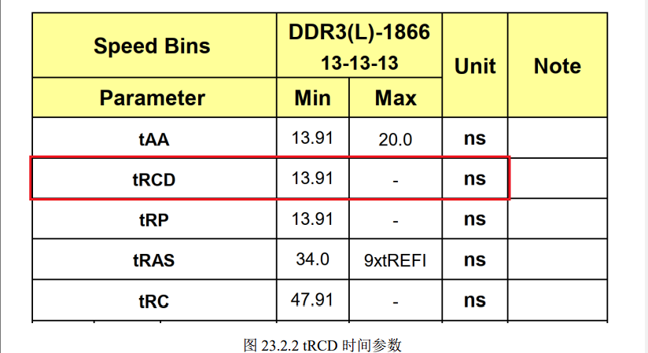

从图可以看出，tRCD 为 13.91ns，这个我们在初始化 DDR3 的时候需要配置。
有时候大家也会看到“13-13-13”之类的参数，这个是用来描述 CL-tRCD-TRP 的，如图所示：

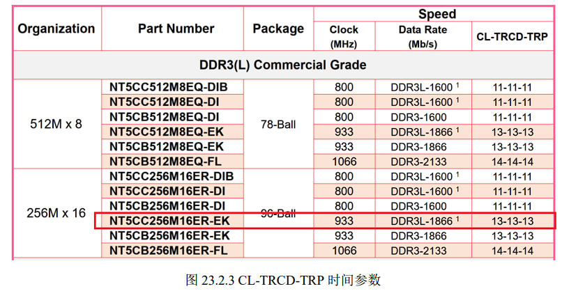

从图可以看出，NT5CC256M16ER-EK 这个 DDR3 的 CL-TRCD-TRP 时间参数为“13-13-13”。
因此 tRCD=13，这里的 13 不是 ns 数，而是 CLK 时间数，表示 13 个 CLK 周期。

3. **CL参数**

当列地址发出以后就会触发数据传输，但是数据从存储单元到内存芯片 IO 接口上还需要一段时间，这段时间就是非常著名的 CL(CAS Latency)，也就是列地址选通潜伏期，如图所示：

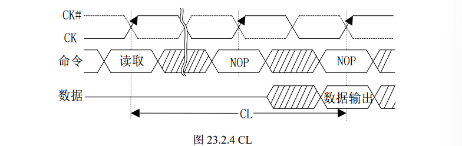

CL 参数一般在 DDR3 的数据手册中可以找到，比如 NT5CC256M16EP-EK 的 CL 值就是 13个时钟周期，一般 tRCD 和 CL 大小一样。

4. **AL参数**

在 DDR 的发展中，提出了一个前置 CAS 的概念，目的是为了解决 DDR 中的指令冲突，它允许 CAS 信号(列选通)紧随着 RAS (行选通)发送，相当于将 DDR 中的 CAS 前置了。
但是读/写操作并没有因此提前，依旧要保证足够的延迟/潜伏期，为此引入了 AL(Additive Latency)，单位也是时钟周期数。
AL+CL 组成了 RL(Read Latency)，从 DDR2 开始还引入了写潜伏期 WL(Write Latency)，WL 表示写命令发出以后到第一笔数据写入的潜伏期。

读写时序如下图:

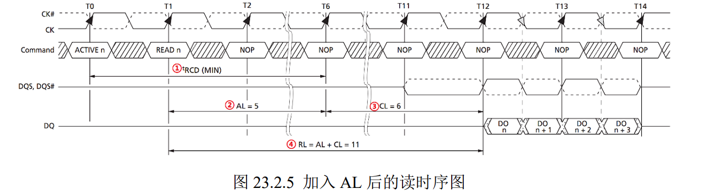

图中就是镁光 DDR3L 的读时序图，我们依次来看一下图中这四部分都是什么内容：
①、tRCD，前面已经说过了。
②、AL。
③、CL。
④、RL 为读潜伏期，RL=AL+CL。

5. **tRC参数**

tRC 是两个 ACTIVE 命令，或者 ACTIVE 命令到 REFRESH 命令之间的周期，DDR3L 数据手册会给出这个值，比如 NT5CC256M16EP-EK 的 tRC 值为 47.91ns，参考上图。

6. **tRAS参数**

tRAS 是 ACTIVE 命令到 PRECHARGE 命令之间的最小时间，DDR3L 的数据手册同样也会给出此参数，NT5CC256M16EP-EK 的 tRAS 值为 34ns，见上图

### 23.3 IMX6ULL MMDC控制器简介

#### 23.3.1 MMDC控制器

学过 STM32 的同学应该记得，STM32 的 FMC 或 FSMC 外设用于连接 SRAM 或 SDRAM，对于 I.MX6U 来说也有 DDR 内存控制器，否则的话它怎么连接 DDR 呢？

MMDC 就是 I.MX6U的内存控制器，MMDC 是一个多模的 DDR 控制器，可以连接 16 位宽的 DDR3/DDR3L、16 位宽的 LPDDR2，MMDC 是一个可配置、高性能的 DDR 控制器。

MMDC 外设包含一个内核(MMDC_CORE)和 物理层(MMDC_PHY)，内核和 PHY 的功能如下：

**MMDC 内核**：内核负责通过 AXI 接口与系统进行通信、DDR 命令生成、DDR 命令优化、读/写数据路径。
**MMDC PHY**：PHY 负责时序调整和校准，使用特殊的校准机制以保障数据能够在 400MHz被准确捕获。

MMDC的主要特性如下：

①、支持 DDR3/DDR3Lx16、支持 LPDDR2x16，不支持 LPDDR1MDDR 和 DDR2。
②、支持单片 256Mbit~8Gbit 容量的 DDR，列地址范围：8-12 位，行地址范围 11-16bit。2个片选信号。
③、对于 DDR3，最大支持 8bit 的突发访问。
④、对于 LPDDR2 最大支持 4bit 的突发访问。
⑤、MMDC 最大频率为 400MHz，因此对应的数据速率为 800MT/S。
⑥、支持各种校准程序，可以自动或手动运行。支持 ZQ 校准外部 DDR 设备，ZQ 校准 DDR I/O 引脚、校准 DDR 驱动能力。

```md
**补充DDR3 数据速率与预取位的差别：(解决上文可能存在的错误) SDRAM**

问题：如果DDR3的预取位为8，时钟频率为400MHZ那么对应的数据速率不就是3200MT/s吗，为什么是800MT/s

答：你提到的 预取位为 8 和 时钟频率 400 MHz 是 DDR3 内存的一个配置，但需要进一步澄清 预取长度 和 数据速率 的定义和关系。
你提到的 3200 MT/s 是 DDR3 在某些配置下的数据速率，而 800 MT/s 是基于时钟频率 400 MHz 的计算。让我来逐步解释这一点：

1. 预取长度（Prefetch Length）
在 DDR3 中，预取长度是 8 位，意味着每个时钟周期内，内存控制器能够预取 8 个数据位。
预取长度 是内存控制器内部的一个特性，它影响数据传输的带宽，但它并不直接等于 数据速率。
预取长度 8 位是指每个时钟周期内内存模块可以获取 8 个数据位（即每次访问可以并行传输 8 位数据）。

2. 数据速率（Data Rate）
数据速率 是指内存每秒能够完成的数据传输次数，通常以 MT/s（百万次传输每秒）为单位表示。在 DDR3 中，数据速率是由时钟频率的倍数决定的。
DDR3 使用 双倍数据速率（Double Data Rate，简称 DDR），意味着每个时钟周期内数据传输两次：一个是在时钟的上升沿，另一个是在时钟的下降沿。
所以，数据传输速率是时钟频率的 两倍。

3. 时钟频率与数据速率的关系
DDR3 内存的时钟频率是 400 MHz，表示时钟信号的频率为 400 MHz（即每秒 4 亿次时钟周期）。
由于 DDR3 是双倍数据速率（DDR），数据速率是时钟频率的两倍，因此数据速率为：
数据速率 = 400 MHz × 2 = 800 MT/s。

4. 为什么 400 MHz 对应 800 MT/s
时钟频率为 400 MHz 的 DDR3 内存，意味着它的内存控制器每秒钟进行 400 万次时钟周期，而 DDR3 在每个时钟周期的上升沿和下降沿都进行数据传输。因此，数据速率是 400 MHz 的两倍，即 800 MT/s。

5. 3200 MT/s 与 DDR3 的关系
如果你看到 3200 MT/s 这样的数据速率，通常表示 DDR3-3200 或 DDR3-1600 这样的配置，表示数据速率为 3200 MT/s。
这意味着 DDR3 的时钟频率为 1600 MHz，数据速率为 3200 MT/s。

对应的时钟频率是 1600 MHz，而 DDR3-1600 的数据速率是 3200 MT/s。

6. 总结
400 MHz 时钟频率 对应的数据速率是 800 MT/s，因为 DDR3 是双倍数据速率内存（每个时钟周期两次数据传输）。
3200 MT/s 的数据速率通常对应 1600 MHz 的时钟频率，不是 400 MHz。
预取长度（8 位）表示的是每个时钟周期内每次能预取的数据位数，它会影响带宽和性能，但并不是直接决定数据速率的唯一因素。
数据速率 是由时钟频率决定的，而不是直接等于预取长度的倍数。
```

#### 23.3.2 MMDC控制器信号引脚

我们在使用 STM32 的时候 FMC/FSMC 的 IO 引脚是带有复用功能的，如果不接 SRAM 或 SDRAM 的话 FMC/FSMC 是可以用作其他外设 IO 的。
但是，对于 DDR 接口就不一样了，因为DDR 对于硬件要求非常严格，因此 DDR 的引脚都是独立的，一般没有复用功能，只做为 DDR引脚使用。

I.MX6U 也有专用的 DDR 引脚

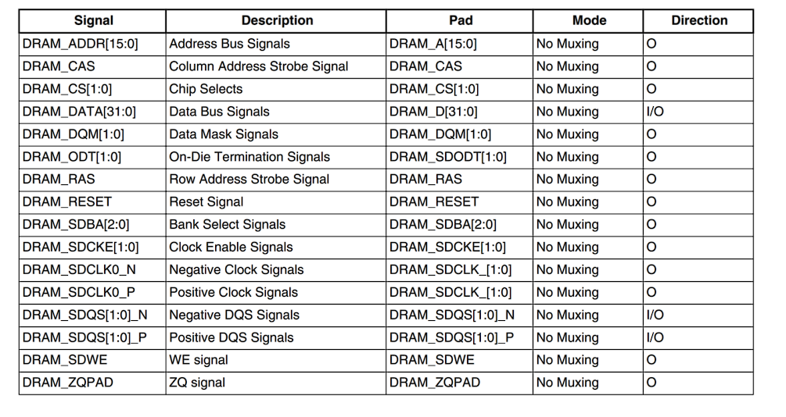

由于图中的引脚是 DDR 专属的，因此就不存在所谓的 DDR 引脚复用配置，只需要设置 DDR 引脚的电气属性即可，注意，DDR 引脚的电气属性寄存器和普通的外设引脚电气属性寄存器不同！
<span style="color:red">独有</span>

#### 23.3.3 MMDC控制器时钟源

前面说了很多次，I.MX6U 的 DDR 或者 MDDC 的时钟频率为 400MHz，那么这 400MHz 时钟源怎么来的呢？
这个就要查阅 I.MX6ULL 参考手册的《Chapter 18 Clock ControllerModule(CCM)》章节。

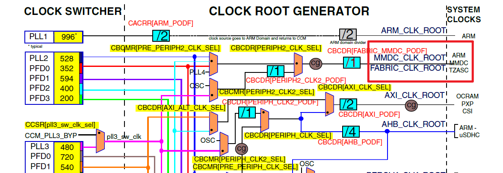

划分为四部分

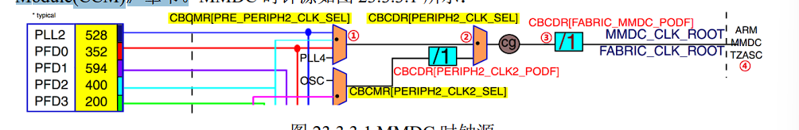

图就是 MMDC 的时钟源路径图，主要分为 4 部分，我们依次来看一下每部分所组的工作：

①、pre_periph2 时钟选择器，也就是 periph2_clkd 的前级选择器，由 CBCMR 寄存器的PRE_PERIPH2_CLK_SEL 位(bit22:21)来控制，一共有四种可选方案

| PRE_PERIPH2_CLK_SEL(bit22:21)       | 时钟源                                   |
| ----------------------------------- | ---------------------------------------- |
| 00                                  | PLL2                                     |
| <span style="color:red"> 01 </span> | <span style="color:red">PLL2_PED2</span> |
| 10                                  | PLL2_PED0                                |
| 11                                  | PLL4                                     | 、 |

可以看出，当 PRE_PERIPH2_CLK_SEL 为 0x1 的时候选中 PLL2_PFD2 为pre_periph2 时钟源。
在前面的《第十六章 主频和时钟配置》中我们已经将 PLL2_PFD2 设置为396MHz(约等于 400MHz)，I.MX6U 内部 boot rom 就是设置 PLL2_PFD2 作为 MMDC 的最终时钟源，这就是 I.MX6U 的 DDR 频率为 400MHz 的原因。
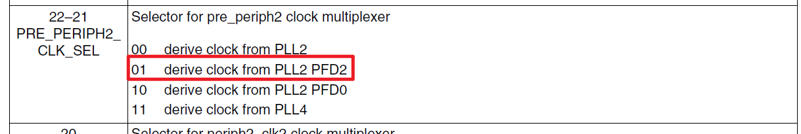

②、periph2_clk 时钟选择器，由 CBCDR 寄存器的 PERIPH2_CLK_SEL 位(bit26)来控制。
当为 0 的时候选择 pll2_main_clk 作为 periph2_clk 的时钟源，当为 1 的时候选择 periph2_clk2_clk作为 periph2_clk 的时钟源。
这里肯定要将 PERIPH2_CLK_SEL 设置为 0，也就是选择pll2_main_clk 作为 periph2_clk 的时钟源，因此 periph2_clk=PLL2_PFD0=396MHz。
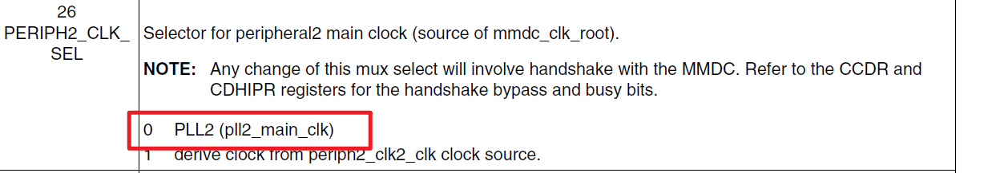

③、最后就是分频器，由 CBCDR 寄存器的 FABRIC_MMDC_PODF 位(bit5:3)设置分频值，可设置 0~7，分别对应 1~8 分频，要配置 MMDC 的时钟源为 396MHz，那么此处就要设置为 1分频，因此 FABRIC_MMDC_PODF=0。
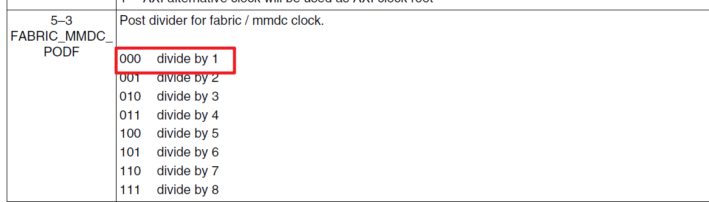

以上就是 MMDC 的时钟源设置，I.MX6U 参考手册一直说 DDR 的频率为 400MHz，但是实际只有 396MHz，就和 NXP 宣传自己的 I.MX6ULL 有 800MHz 一样，实际只有 792MHz。

### 23.4 开发板DDR3L原理图

开发板有 EMMC 和 NAND 两种核心板，EMMC 核心板使用的 DDR3L 的型号为NT5CC256M16EP-EK，容量为 512MB。
NAND 核心板使用的 DDR3L 型号为 NT5CC128M16JREK，容量为 256MB，这两种型号的 DDR3L 封装一摸一样，有人可能就有疑问了，容量不同的话地址线是不同的，比如行地址和列地址线数就不同。
没错！但是 DDR3L 厂商为了方便选择将不同容量的 DDR3 封装做成一样，没有用到的地址线 DDR3L 芯片会屏蔽掉。
而且，根据规定，所有厂商的 DDR 芯片 IO 一摸一样，不管是引脚定义还是引脚间距，但是芯片外形大小可能不同。
因此只要做好硬件，可以在不需要修改硬件 PCB 的前提下，随意的更换不同容量、不同品牌的 DDR3L 芯片，极大的方便了我们的芯片选型。

原理图如下：

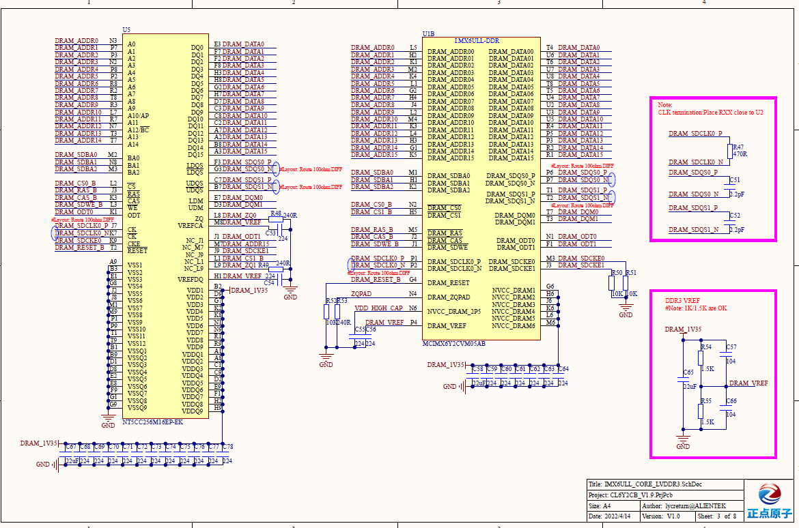

左侧是 DDR3L 原理图，可以看出图中 DDR3L 的型号为 MT41K256M16TW，这个是镁光的 512MB DDR3L。
但是我们实际使用的 512MB DDR3L 型号为 NT5CC256M16EPEK，不排除以后可能会更换 DDR3L 型号，更换 DDR3L 芯片是不需要修改 PCB.

### 23.5 DDR3L初始化测试

#### 23.5.1 ddr_stress_tester简介

NXP 提供了一个非常好用的 DDR 初始化工具，叫做 ddr_stress_tester。
此工具已经放到了开 发 板 光 盘 中 ， 路 径 为 ：
5、开发工具->5、NXP官方DDR初始化与测试工具->ddr_stress_tester_v2.90_setup.exe.zip

我们简单介绍一下 ddr_stress_tester 工具，此工具特点如下：

①、此工具通过 USB OTG 接口与开发板相连接，也就是通过 USB OTG 口进行 DDR 的初始化与测试。

②、此工具有一个默认的配置文件，为 excel 表，通过此表可以设置板子的 DDR 信息，最后生成一个.inc 结尾的 DDR 初始化脚本文件。
这个.inc 文件就包含了 DDR 的初始化信息，一般都是寄存器地址和对应的寄存器值。

③、此工具会加载.inc 表里面的 DDR 初始化信息，然后通过 USB OTG 接口向板子下载DDR 相关的测试代码，包括初始化代码。

④、对此工具进行简单的设置，即可开始 DDR 测试，一般要先做校准，因为不同的 PCB其结构肯定不同，必须要做一次校准，校准完成以后会得到两个寄存器对应的校准值，我们需要用这个新的校准值来重新初始化 DDR。

⑤、此工具可以测试板子的 DDR 超频性能，一般认为 DDR 能够以超过标准工作频率10%~20%稳定工作的话就认定此硬件 DDR 走线正常。

⑥、此工具也可以对 DDR 进行 12 小时的压力测试。

简要介绍下各个文件：

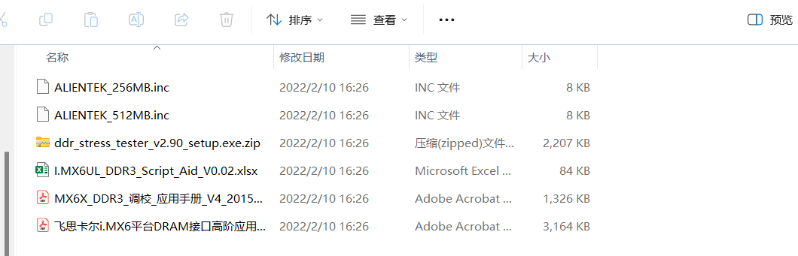

①、ALIENTEK_256MB.inc 和 ALIENTEK_512MB.inc，这两个就是通过 excel 表配置生成的，针对正点原子开发板的 DDR 配置脚本文件。

②、ddr_stress_tester_v2.90_setup.exe.zip 就是我们要用的 ddr_stress_tester 软件，大家自行安装即可，一定要记得安装路径。

③、I.MX6UL_DDR3_Script_Aid_V0.02.xlsx 就是 NXP 编写的针对 I.MX6UL 的 DDR 初始化 execl 文件，可以在此文件里面填写 DDR 的相关参数，然后就会生成对应的.inc 初始化脚本。

④、最后两个 PDF 文档就是关于 I.MX6 系列的 DDR 调试文档，这两个是 NXP 编写的。

#### 23.5.2 DDR3L驱动设置

补充： 

    IMX6ULL中的SRAM为256KB的内置，以及128KB的ROM，用于存放Boot ROM，用户不可用，故而用户需要再外置存储器SD卡或者EMMC中存放程序。

1. **安装DDR_STRESS_TESTER**

首先要安装 ddr_stress_testr 软件，安装方法很简单，这里就不做详细的讲解了。
但是一定要记得安装路径！因为我们要到安装路径里面找到测试软件。
安装完成以后就会在此目录下生成一个名为 ddr_stress_tester_v2.90 的文件夹，此文件夹就是 DDR 测试软件，进入到此文件夹中，里面的文件如图：

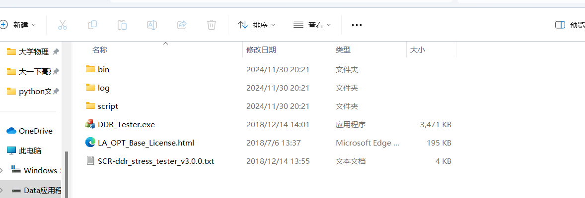

DDR_Tester.exe 就是我们稍后要使用的 DDR 测试软件

2. **配置DDR3L，生成初始化脚本**

将开发板光盘中的I.MX6UL_DDR3_Script_Aid_V0.02.xlsx 文件拷贝到 ddr_stress_testr 软件安装目录中，完成如下图：

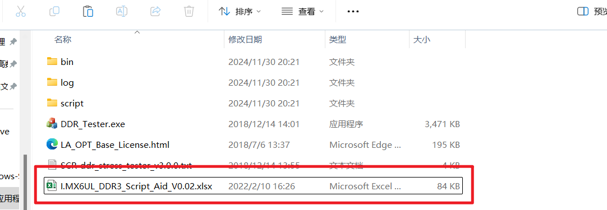

I.MX6UL_DDR3_Script_Aid_V0.02.xlsx就是NXP为I.MX6UL编写的DDR3配置excel表，虽然看名字是为 I.MX6UL 编写的，但是 I.MX6ULL 也是可以使用的。

execl表如下：
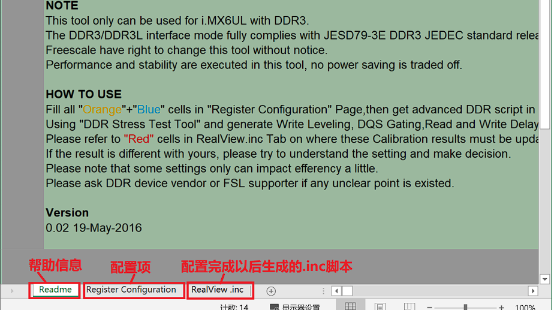

最下方有三个选项卡，这三个选项卡的功能如下：

①、Readme 选项卡，此选项卡是帮助信息，告诉用户此文件如何使用。
②、Register Configuration 选项卡，顾名思义，此选项卡用于完成寄存器配置，也就是配置DDR3，此选项卡是我们重点要讲解的。
③、RealView.inc 选项卡，当我们配置好 Register Configuration 选项卡以后，RealView.inc选项卡里面就保存着寄存器地址和对应的寄存器值。
我们需要另外新建一个后缀为.inc 的文件来保存 RealView.inc 中的初始化脚本内容，ddr_stress_testr 软件就是要使用此.inc 结尾的初始化脚本文件来初始化 DDR3。

配置卡如图：
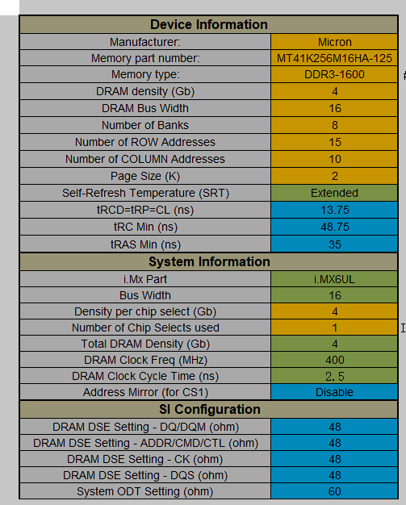

主要分为三部分：
①、Device Information

DDR3 芯片设备信息设置，此部分需要根据所使用的 DDR3 芯片来设置，具体的设置项如下：

Manufacturer：DDR3 芯片厂商，默认为镁光(Micron)，这个没有意义，比如我们用的 nanya的 DDR3，但是此配置文件也是可以使用的。

Memory part number：DDR3 芯片型号，可以不用设置，没有实际意义。

Memory type:DDR3 类型，有 DDR3-800、DDR3-1066、DDR3-1333 和 DDR3-1600，在此选项右侧有个下拉箭头，点击下拉箭头即可查看所有的可选选项。
可以看出，最大只能选择 DDR3-1600，没有 DDR3-1866 选项，因此我们就只能选择 DDR3-1600。

DRAM density(Gb)：DDR3 容量，根据实际情况选择，同样右边有个下拉箭头，打开下拉箭头即可看到所有可选的容量。
可以看出，可选的容量为 1、2、4 和 8Gb，如果使用的 512MB 的 DDR3 就应该选择 4，如果使用的 256MB 的 DDR3 就应该选择 2。

DRAM Bus width：DDR3 位宽，可选的选项只有 4 8 16：
正点原子 ALPHA 开发板所有的 DDR3 都是 16 位宽，因此选择 16。

Number of Banks：DDR3 内部 BANK 数量，对于 DDR3 来说内部都是 8 个 BANK，因此固定为 8。

Number of ROW Addresses：行地址宽度，可选 11~16 位，这个要具体所使用的 DDR3 芯片来定，如果是 EMMC 核心板(DDR3 型号为 NT5CC256M16EP-EK)，那么行地址为 15 位。
如果是 NAND 核心板(DDR3 型号为 NT5CC128M16JR-EK)，行地址就为 14 位。

Number COLUMN Addresses：列地址宽度，可选 9~12 位,EMMC 核心板和 NAND 核心板的 DDR3 列地址都为 10 位。

Page Size(K)：DDR3 页大小，可选 1 和 2，NT5CC256M16EP-EK 和 NT5CC128M16JR-EK的页大小都为 2KB，因此选择 2。

Self-Refresh Temperature(SRT)：固定为 Extended，不需要修改。

tRCD=tRP=CL(ns)：DDR3 的 tRCD-tRP-CL 时间参数，要查阅所使用的 DDR3 芯片手册，NT5CC256M16EP-EK 和 NT5CC128M16JR-EK 都为 13.91ns，因此在后面填写 13.91。

tRC Min(ns)：DDR3 的 tRC 时间参数，NT5CC256M16EP-EK 和 NT5CC128M16JR-EK 都为 47.91ns，因此在后面填写 47.91。

tRAS Min(ns)：DDR3 的 tRAS 时间参数，NT5CC256M16EP-EK 和 NT5CC128M16JR-EK都为 34ns，因此在后面填写 34。

②、System Information

此部分设置 I.MX6UL/6ULL 相关属性，具体的设置项如下：

i.Mx Part：固定为 i.MX6UL。

Bus Width：总线宽度，16 位宽。

Density per Chip select(Gb)：每个片选对应的 DDR3 容量，可选 1~16，根据实际所使用的DDR3 芯片来填写，512MB 的话就选择 4，256MB 的话就选择 2。

Number of Chip Select used：使用几个片选信号？可选择 1 或 2，正点原子所有的核心板都只使用了一个片选信号，因此选择 1。

Total DRAM Density(Gb)：整个 DDR3 的容量，单位为 Gb，如果是 512MB 的话就是 4，如果是 256MB 的话就是 2。

DRAM Clock Freq(MHz)：DDR3 工作频率，设置为 400MHz。

DRAM Clock Cycle Time(ns)：DDR3 工作频率对应的周期，单位为 ns，如果工作在 400MHz，那么周期就是 2.5ns。

Address Mirror(for CS1)：地址镜像，仅 CS1 有效，此处选择关闭，也就是“Disable”，此选项我们不需要修改。

③、SI Configuratin

此部分是信号完整性方面的配置，主要是一些信号线的阻抗设置，这个要咨询硬件工程师，这里我们直接使用 NXP 的默认设置即可。

EMMC配置如下图：

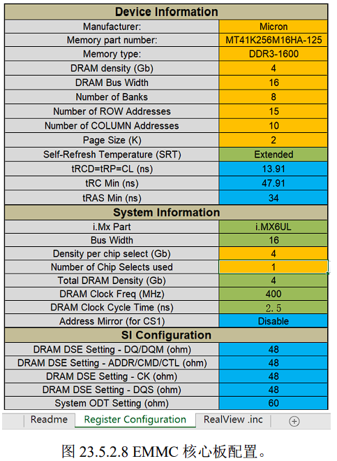

NAND配置如下图：

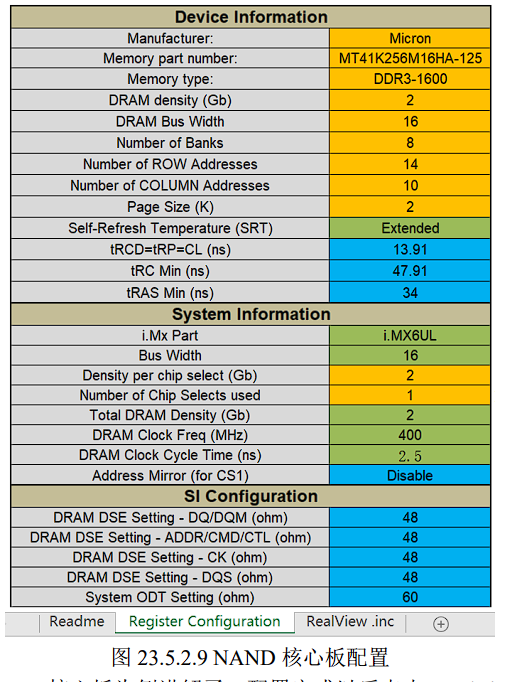

后面我就以 EMMC 核心板为例讲解了，配置完成以后点击 RealView.inc 选项卡.

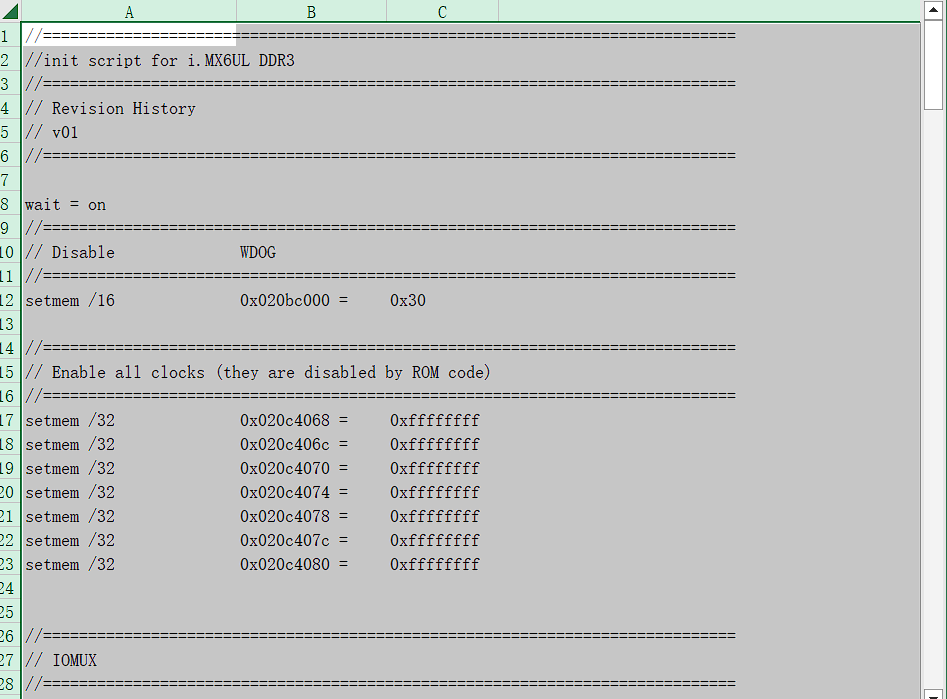

RealView.inc 就是生成的配置脚本，全部是“寄存器地址=寄存器值”这种形式。

RealView.inc 不能直接用，我们需要新建一个以.inc 结尾的文件，名字自定义，比如我名为“MyDDR3_512MB”的.inc 文件.

将execl文件全部拷贝到自己创建的inc文件中。

如图：


至此，DDR3 配置就全部完成，DDR3 的配置文件 ALIENTEK_512MB.inc 已经得到了，接下来就是使用此配置文件对正点原子 ALPHA 开发板的 DDR3 进行校准并进行超频测试。

#### 23.5.3 DDR3L校准

首先要用 DDR_Tester.exe 软件对正点原子 ALPAH 开发板的 DDR3L 进行校准，因为不同的 PCB 其走线不同，必须要进行校准，经过校准一会 DDR3L 就会工作到最佳状态。

1. **将开发板通过 USB OTG 线连接到电脑上**

DDR_Tester 软件通过 USB OTG 线将测试程序下载到开发板中，因此首先需要使用 USBOTG 线将开发板和电脑连接起来。
注意OTG没有供电引脚，还需要利用DC供电。

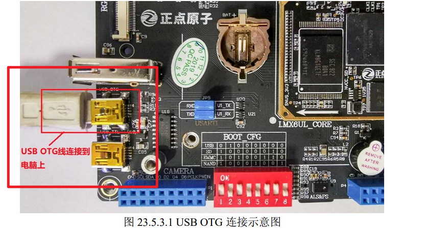

USB OTG 线连接成功以后还需要如下两步：
①、弹出 TF 卡，如果插入了 TF 卡，那么一定要弹出来！！
②、设置拨码开关从 USB 启动，如图所示：

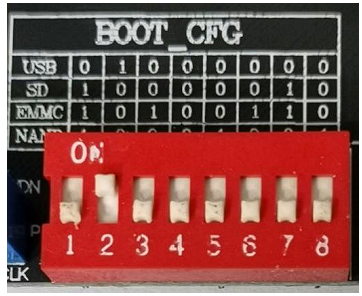

2. **DDR_Tester 软件**

双击“DDR_Tester.exe”，打开测试软件

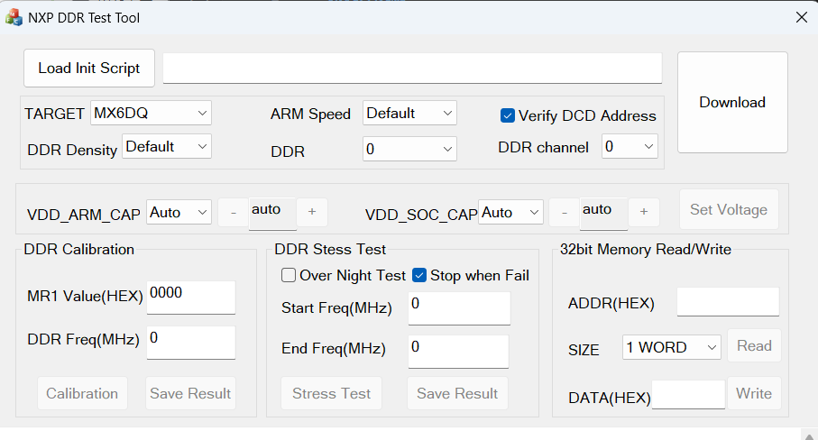

点击图中的 “ Load init Script ” 加载前面已经生成的初始化脚本文件.inc文件，注意，不能有中文路径，否则加载可能会失败！

.inc 文件加载成功以后还不能直接用，还需要对 DDR Test Tool 软件进行设置，设置完成以后如图：

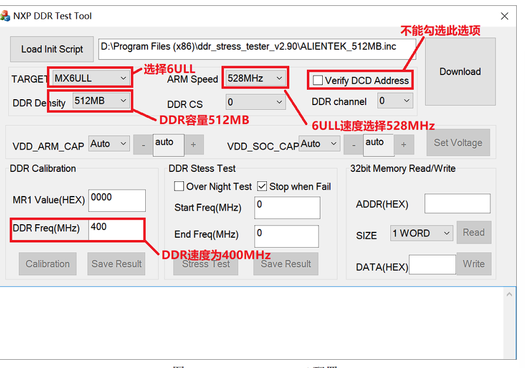

一切设置好以后点击图中右上方大大的“Download”按钮，将测试代码下载到开发板中(具体下载到哪里笔者也不清楚，估计是 I.MX6ULL 内部的 OCRAM)，下载完成以后 DDR Test Tool 下方的信息窗口就会输出一些内容:

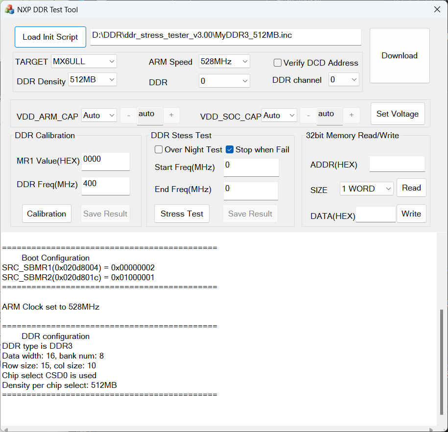

输出了一些关于板子的信息，比如 SOC 型号、工作频率、DDR 配置信息等等。

DDR Test Tool 工具有三个测试项：DDR Calibration、DDR Stess Test 和 32bit Memory Read/Write，我们首先要做校准测试，因为不同的 PCB、不同的 DDR3L 芯片对信号的影响不同，必须要进行校准，然后用新的校准值重新初始化 DDR。

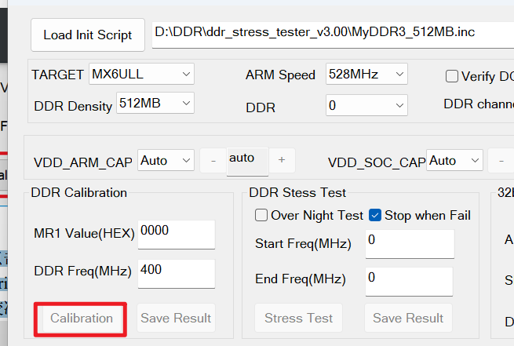

点击图中的“Calibration”按钮以后就会自动开始校准，最终会得到 Write leveling calibtarion、Read DQS Gating Calibration、Read calibration 和 Write calibration，一共四种校准结果，校准结果如下：

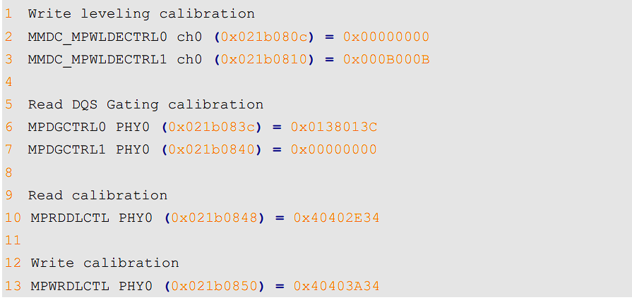

所谓的校准结果其实就是得到了一些寄存器对应的值，比如 MMDC_MPWLDECTRL0 寄存器地址为 0X021B080C，此寄存器是 PHY 写平衡延时寄存器 0，经过校准以后此寄存器的值应该为 0X00000000 ， 以 此 类 推 。 
我们需要修改ALIENTEK_512MB.inc 文件，找到MMDC_MPWLDECTRL0、MMDC_MPWLDECTRL1、MPDGCTRL0 PHY0、MPDGCTRL1 PHY0、MPRDDLCTL PHY0 和 MPWRDLCTL PHY0 这 6 个寄存器，然后将其值改为上图中的校准后的值 。

注意，在ALIENTEK_512MB.inc中可能找不到MMDC_MPWLDECTRL1(0x021b0810)和 MPDGCTRL1 PHY0(0x021b0840)这两个寄存器，找不到就不用修改了。
ALIENTEK_512MB.inc 修改完成以后重新加载并下载到开发板中，至此 DDR 校准完成，校准的目的就是得到示例代码 23.5.3.1 中这 6 个寄存器的值！

我的校准结果为：(校准时间较长需要等待)
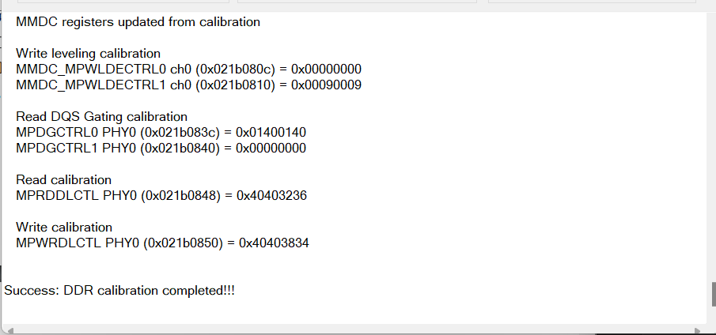

按照地址寻找哦！

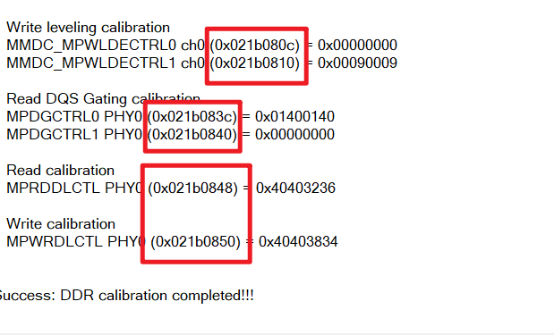

注意连接时，静场出现找不到设备错误：
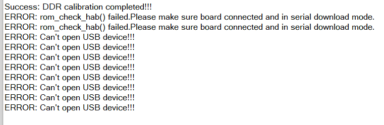
是在连接中，需要耐心等待。

完成！
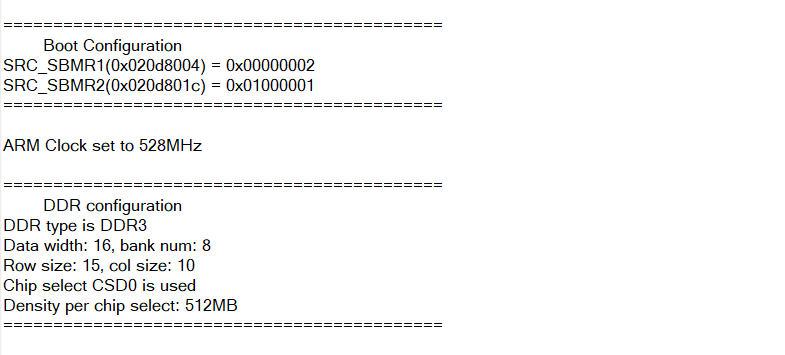

#### 23.5.4 DDR3L超频测试

校准完成以后就可以进行 DDR3 超频测试，超频测试的目的就是为了检验 DDR3 硬件设计合不合理，一般 DDR3 能够超频到比标准频率高 10%~15%的话就认为硬件没有问题，因此对于正点原子的 ALPHA 开发板而言，如果 DDR3 能够超频到 440MHz~460MHz 那么就认为DDR3 硬件工作良好。

DDR Test Tool 支持 DDR3 超频测试，只要指定起始频率和终止频率，那么工具就会自动开始一点点的增加频率，直到达到终止频率或者测试失败。

如图设置：
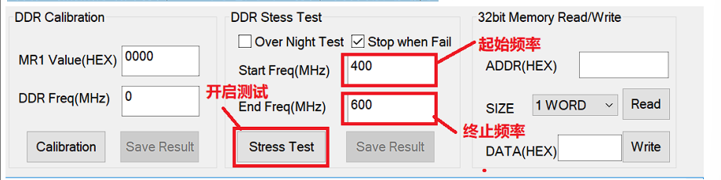

图中设置好起始频率为 400MHz，终止频率为 600MHz，设置好以后点击“Stress Test”开启超频测试，超频测试时间比较久，大家耐心等待测试结果即可。
超频测试完成以后结果如图所示(因为硬件不同，测试结果可能有些许区别)：

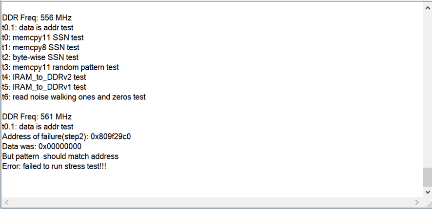

从图可以看出，正点原子的 ALPAH 开发板 EMMC 核心板 DDR3 最高可以超频到556MHz，当超频到 561MHz 的时候就失败了。
556MHz 超过了 460MHz，说明正点原子的 ALPHA开发板 DDR3 硬件是没有任何问题的。

我的超频结果如下：

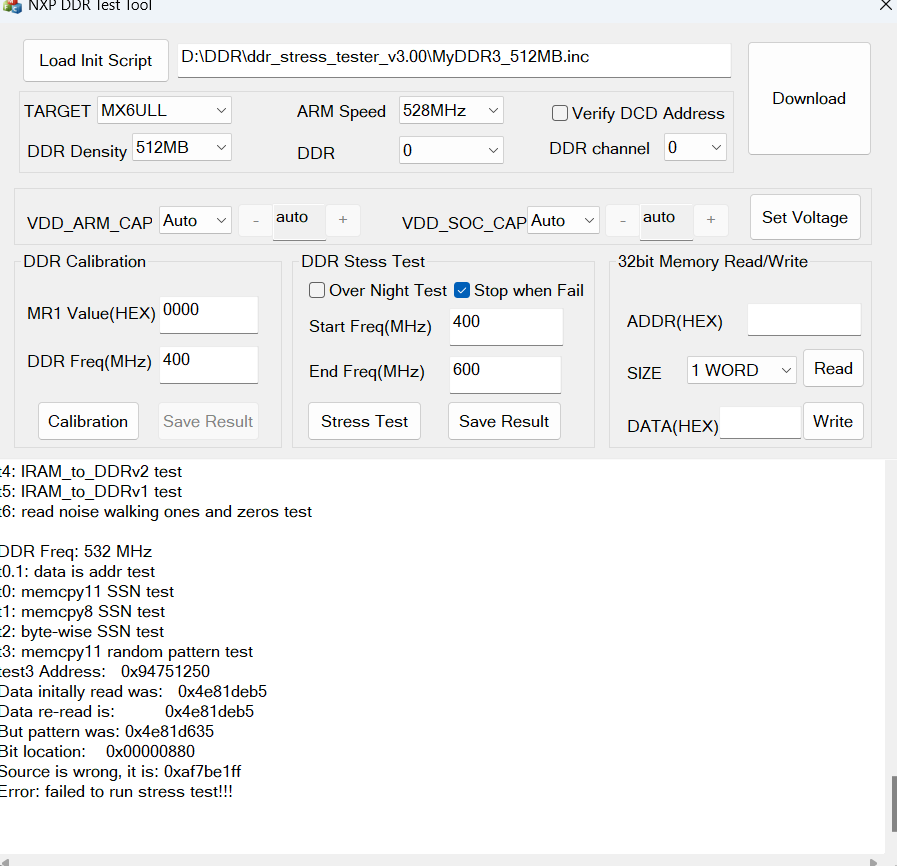

#### 23.5.5 DDR3L驱动总结

.inc 就是我们最终得到的 DDR3L 初始化脚本，其中包括了时钟、IO 等初始化。
I.MX6U 的 DDR3 接口关于 IO 有一些特殊的寄存器需要初始化，如下图：

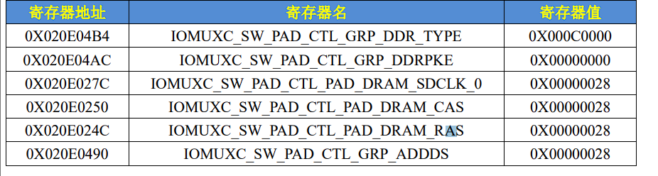

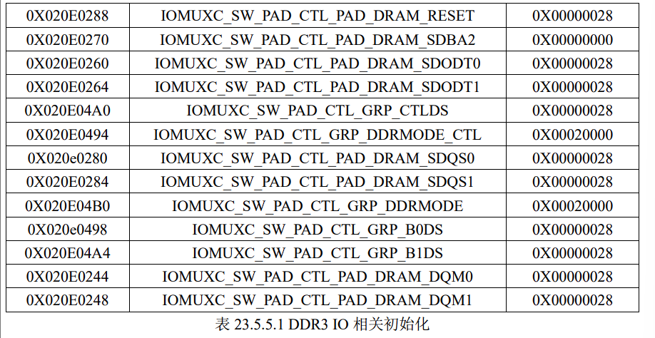

接下来看一下 MMDC 外设寄存器初始化:

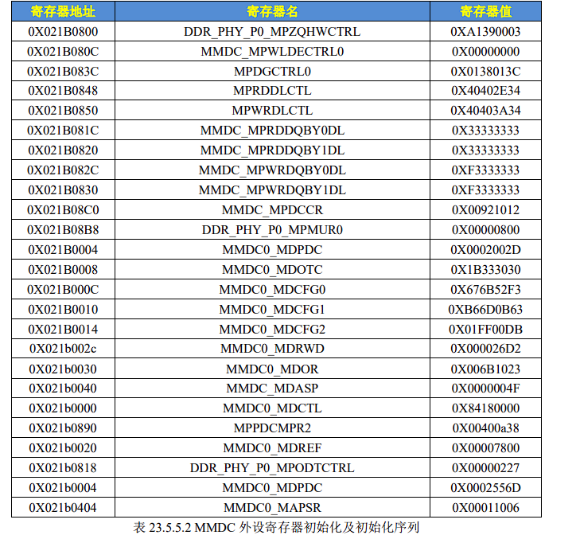

关于 I.MX6U 的 DDR3 就讲解到这里，因为牵扯到的寄存器太多了，因此没有详细的去分析这些寄存器，大家感兴趣的可以对照着参考手册去分析各个寄存器的含义以及配置值。

.inc文件，我们就可以利用这个文件去进行DDR初始化了。
具体我们要到系统编程中实现。

(一般而言，DDR初始化由U-Boot自动完成)
imxdownload中我们给bin文件添加了imx头数据其中有一个DCD部分，DCD中包含了ddr3的初始化。
SRAM中先运行boot Rom（SROM 芯片内置rom）的代码，加载头文件后配置好了DDR内存，后续代码即在DDR中运行！


## 第二十四章 RGBLCD显示实验

LCD 液晶屏是常用到的外设，通过 LCD 可以显示绚丽的图形、界面等，提高人机交互的效率。
I.MX6U 提供了一个 eLCDIF 接口用于连接 RGB 接口的液晶屏。
本章我们就学习如何驱动 RGB 接口液晶屏，并且在屏幕上显示字符。

### 24.1 LCD与eLCDIF简介

#### 24.1.1 LCD简介

LCD 全称是 Liquid Crystal Display，也就是液晶显示器，是现在最常用到的显示器，手机、电脑、各种人机交互设备等基本都用到了 LCD，最常见就是手机和电脑显示器了。
由于笔者不是 LCD 从业人员，对于 LCD 的具体原理不了解，百度百科对于 LCD 的原理解释如下：

LCD 的构造是在两片平行的玻璃基板当中放置液晶盒，下基板玻璃上设置 TFT（薄膜晶体管），上基板玻璃上设置彩色滤光片，通过 TFT 上的信号与电压改变来控制液晶分子的转动方向，从而达到控制每个像素点偏振光出射与否而达到显示目的。

我们现在要在 I.MX6U-ALPHA 开发板上使用 LCD，所以不需要去研究 LCD 的具体实现原理，我们只需要从使用的角度去关注 LCD 的几个重要点：

1. **分辨率**

提起 LCD 显示器，我们都会听到 720P、1080P、2K 或 4K 这样的字眼，这个就是 LCD 显示器分辨率。
LCD 显示器都是由一个一个的像素点组成，像素点就类似一个灯(在 OLED 显示器中，像素点就是一个小灯)，这个小灯是 RGB 灯，也就是由 R(红色)、G(绿色)和 B(蓝色)这三种颜色组成的，而 RGB 就是光的三原色。
1080P 的意思就是一个 LCD 屏幕上的像素数量是1920*1080 个，也就是这个屏幕一列 1080 个像素点，一共 1920 列。如下图：

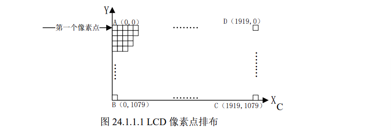

在图就是 1080P 显示器的像素示意图，X 轴就是 LCD 显示器的横轴，Y 轴就是显示器的竖轴。
图中的小方块就是像素点，一共有 1920*1080=2073600 个像素点。
左上角的 A 点是第一个像素点，右下角的 C 点就是最后一个像素点。
2K 就是 2560* 1440 个像素点，4K 是3840 * 2160 个像素点。
很明显，在 LCD 尺寸不变的情况下，分辨率越高越清晰。
同样的，分辨率不变的情况下，LCD 尺寸越小越清晰。
比如我们常用的 24 寸显示器基本都是 1080P 的，而我们现在使用的 5 寸的手机基本也是 1080P 的，但是手机显示细腻程度就要比 24 寸的显示器要好很多！

由此可见，LCD 显示器的分辨率是一个很重要的参数，但是并不是分辨率越高的 LCD 就越好。
衡量一款 LCD 的好坏，分辨率只是其中的一个参数，还有色彩还原程度、色彩偏离、亮度、可视角度、屏幕刷新率等其他参数。

2. **像素格式**

上面讲了，一个像素点就相当于一个 RGB 小灯，通过控制 R、G、B 这三种颜色的亮度就可以显示出各种各样的色彩。那该如何控制 R、G、B 这三种颜色的显示亮度呢？
一般一个 R、G、B 这三部分分别使用 8bit 的数据，那么一个像素点就是 8bit*3=24bit，也就是说一个像素点3 个字节，这种像素格式称为 RGB888.

如果再加入 8bit 的 Alpha(透明)通道的话一个像素点就是 32bit，也就是 4 个字节，这种像素格式称为 ARGB8888。
如果学习过 STM32 的话应该还听过 RGB565 这种像素格式，在本章实验中我们使用 ARGB8888 这种像素格式，一个像素占用 4个字节的内存，这四个字节每个位的分配如图所示：

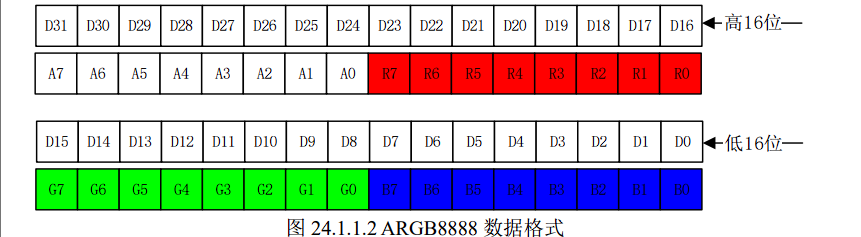

一个像素点是 4 个字节，其中 bit31~bit24 是 Alpha 通道，bit23~bit16 是RED 通道，bit15~bit14 是 GREEN 通道，bit7~bit0 是 BLUE 通道。
所以红色对应的值就是0X00FF0000，蓝色对应的值就是 0X000000FF，绿色对应的值为 0X0000FF00。
通过调节 R、G、B的比例可以产生其它的颜色，比如0X00FFFF00就是黄色，0X00000000就是黑色，0X00FFFFFF就是白色。
大家可以打开电脑的“画图”工具，在里面使用调色板即可获取到想要的颜色对应的数值，如图：

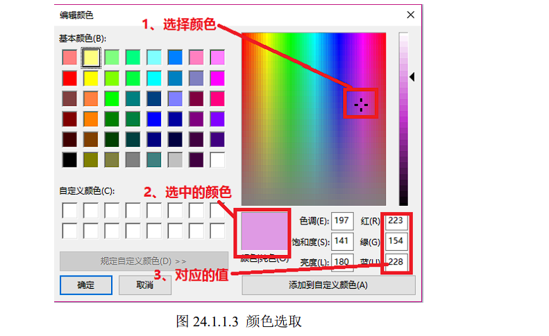

3. **LCD屏幕接口**

LCD 屏幕或者说显示器有很多种接口，比如在显示器上常见的 VGA、HDMI、DP 等等，但是I.MX6U-ALPHA开发板不支持这些接口。
I.MX6U-ALPHA支持RGB接口的LCD，RGBLCD接口的信号线如表所示：

| 信号线 | 描述             |
| ------ | ---------------- |
| R[7:0] | 8 根红色数据线。 |
| G[7:0] | 8 根绿色数据线。 |
| B[7:0] | 8 根蓝色数据线。 |
| DE     | 数据使能线。     |
| VSYNC  | 垂直同步信号线。 |
| HSYNC  | 水平同步信号线。 |
| PCLK   | 像素时钟信号线。 |

表就是RGBLCD的信号线，R[7:0]、G[7:0]和B[7:0]这24根是数据线，DE、VSYNC、HSYNC 和 PCLK 这四根是控制信号线。
RGB LCD 一般有两种驱动模式：DE 模式和 HV 模式，这两个模式的区别是 DE 模式需要用到 DE 信号线，而 HV 模式不需要用到 DE 信号线，在 DE模式下是可以不需要 HSYNC 信号线的，即使不接 HSYNC 信号线 LCD 也可以正常工作。

ALIENTEK 一共有三款 RGB LCD 屏幕，型号分别为：ATK-4342(4.3 寸，480 * 272)、ATK7084(7 寸，800 * 480)和 ATK-7016(7 寸，1024 * 600)，本教程就以 ATK-7016 这款屏幕为例讲解，ATK-7016 的屏幕接口原理图如图:
Mini版截图：
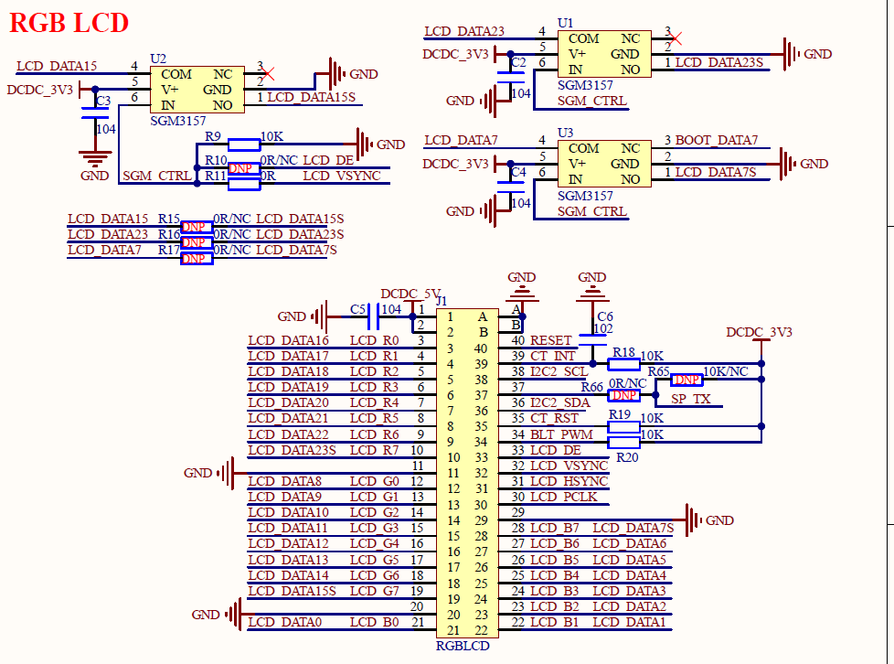
教程截图：


图中 J1 就是对外接口，是一个 40PIN 的 FPC 座（0.5mm 间距），通过 FPC 线，可以连接到 I.MX6U-ALPHA 开发板上面，从而实现和 I.MX6U 的连接。

该接口十分完善，采用 RGB888格式，并支持 DE&HV 模式，还支持触摸屏和背光控制。右侧的几个电阻，并不是都焊接的，而是可以用户自己选择。
默认情况，R1 和 R6 焊接，设置 LCD_LR 和 LCD_UD，控制 LCD 的扫描方向，是从左到右，从上到下（横屏看）。
而 LCD_R7/G7/B7 则用来设置 LCD 的 ID，由于RGBLCD 没有读写寄存器，也就没有所谓的 ID，这里我们通过在模块上面，控制 R7/G7/B7 的上/下拉，来自定义 LCD 模块的 ID，帮助 MCU 判断当前 LCD 面板的分辨率和相关参数，以提高程序兼容性：

位设置关系如表：

| M2(LCD_B7) | M1(LCD_G7) | M0(LCD_R7) | LCD_ID | 说明                                    |
| ---------- | ---------- | ---------- | ------ | --------------------------------------- |
| 0          | 0          | 0          | 4342   | ATK-4342 RGBLCD 模块，分辨率：480*272   |
| 0          | 0          | 1          | 7084   | ATK-7084 RGBLCD 模块，分辨率：800*480   |
| 0          | 1          | 0          | 7016   | ATK-7016，RGBLCD 模块，分辨率：1024*600 |
| 1          | 0          | 0          | 4384   | ATK-4384，RGBLCD 模块，分辨率：800*480  |
| X          | X          | X          | NC     | 暂时未用到                              |

ATK-7016 模块，就设置 M2:M0=010 即可。
这样，我们在程序里面，读取 LCD_R7/G7/B7，得到 M0:M2 的值，从而判断 RGBLCD 模块的型号，并执行不同的配置，即可实现不同 LCD 模块的兼容。

4. **LCD时间参数**

如果将 LCD 显示一帧图像的过程想象成绘画，那么在显示的过程中就是用一根“笔”在不同的像素点画上不同的颜色。
这根笔按照从左至右、从上到下的顺序扫描每个像素点，并且在像素画上对应的颜色，当画到最后一个像素点的时候一幅图像就绘制好了。
假如一个 LCD 的分辨率为 1024*600，那么其扫描如图所示：

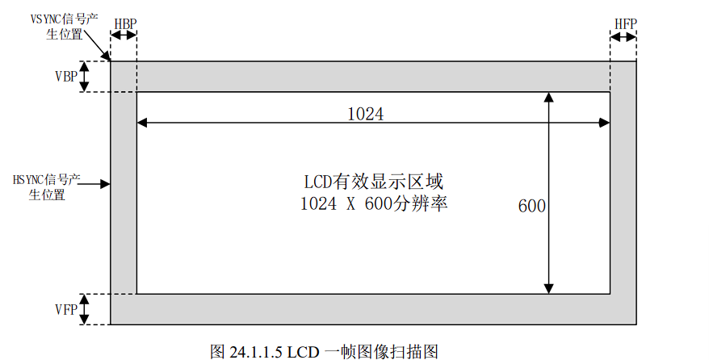

我们来看一下 LCD 是怎么扫描显示一帧图像的。
一帧图像也是由一行一行组成的。
HSYNC 是水平同步信号，也叫做行同步信号，当产生此信号的话就表示开始显示新的一行了，所以此信号都是在图的最左边。
当 VSYNC 信号是垂直同步信号，也叫做帧同步信号，当产生此信号的话就表示开始显示新的一帧图像了，所以此信号在图的左上角。

在图可以看到有一圈“黑边”，真正有效的显示区域是中间的白色部分。
那这一圈“黑边”是什么东西呢？这就要从显示器的“祖先”CRT 显示器开始说起了，CRT 显示器就是以前很常见的那种大屁股显示器，在 2019 年应该很少见了，如果在农村应该还是可以见到的。

CRT 显示器屁股后面是个电子枪，这个电子枪就是我们上面说的“画笔”，电子枪打出的电子撞击到屏幕上的荧光物质使其发光。
只要控制电子枪从左到右扫完一行(也就是扫描一行)，然后从上到下扫描完所有行，这样一帧图像就显示出来了。
也就是说，显示一帧图像电子枪是按照‘Z’形在运动，当扫描速度很快的时候看起来就是一幅完成的画面了。
当显示完一行以后会发出 HSYNC 信号，此时电子枪就会关闭，然后迅速的移动到屏幕的左边，当 HSYNC 信号结束以后就可以显示新的一行数据了，电子枪就会重新打开。在 HSYNC信号结束到电子枪重新打开之间会插入一段延时，这段延时就图中的 HBP。
当显示完一行以后就会关闭电子枪等待 HSYNC 信号产生，关闭电子枪到 HSYNC 信号产生之间会插入一段延时，这段延时就是图中的 HFP 信号。

同理，当显示完一帧图像以后电子枪也会关闭，然后等到 VSYNC 信号产生，期间也会加入一段延时，这段延时就是图中的 VFP。
VSYNC 信号产生，电子枪移动到左上角，当 VSYNC 信号结束以后电子枪重新打开，中间也会加入一段延时，这段延时就是图中的 VBP。

HBP、HFP、VBP 和 VFP 就是导致图中黑边的原因，但是这是 CRT 显示器存在黑边的原因，现在是 LCD 显示器，不需要电子枪了，那么为何还会有黑边呢？
这是因为 RGB LCD屏幕内部是有一个 IC 的，发送一行或者一帧数据给 IC，IC 是需要反应时间的。
通过这段反应时间可以让 IC 识别到一行数据扫描完了，要换行了，或者一帧图像扫描完了，要开始下一帧图像显示了。
因此，在 LCD 屏幕中继续存在 HBP、HFP、VPB 和 VFP 这四个参数的主要目的是为了锁定有效的像素数据。
这四个时间是 LCD 重要的时间参数，后面编写 LCD 驱动的时候要用到的，至于这四个时间参数具体值是多少，那要需要去查看所使用的 LCD 数据手册了。

5. **RGB LCD屏幕时序**

上面讲了行显示和帧显示，我们来看一下行显示对应的时序图：

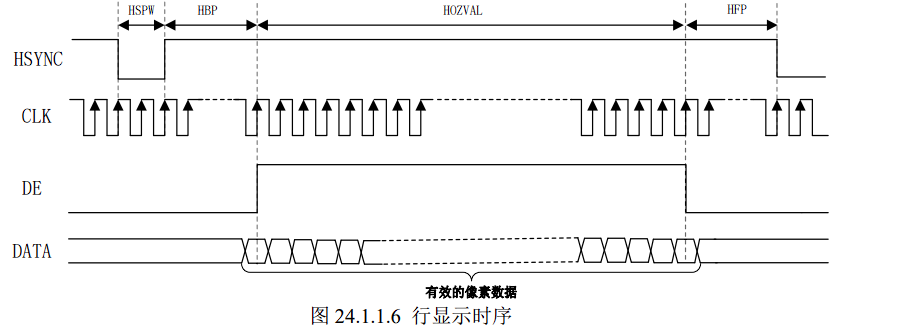

就是 RGB LCD 的行显示时序，我们来分析一下其中重要的几个参数：

**HSYNC**：行同步信号，当此信号有效的话就表示开始显示新的一行数据，查阅所使用的LCD 数据手册可以知道此信号是低电平有效还是高电平有效，假设此时是低电平有效。

**HSPW**：有些地方也叫做 thp，是 HSYNC 信号宽度，也就是 HSYNC 信号持续时间。
HSYNC信号**不是一个脉冲**，而是需要持续一段时间才是有效的，单位为 CLK。

**HBP**：有些地方叫做 thb，前面已经讲过了，术语叫做行同步信号后肩，单位是 CLK。

**HOZVAL**：有些地方叫做 thd，显示一行数据所需的时间，假如屏幕分辨率为 1024*600，那么 HOZVAL 就是 1024，单位为 CLK。

**HFP**：有些地方叫做 thf，前面已经讲过了，术语叫做行同步信号前肩，单位是 CLK。

当 HSYNC 信号发出以后，需要等待 HSPW+HBP 个 CLK 时间才会接收到真正有效的像素数据。
当显示完一行数据以后需要等待 HFP 个 CLK 时间才能发出下一个 HSYNC 信号，所以显示一行所需要的时间就是：HSPW + HBP + HOZVAL + HFP。

一帧图像就是由很多个行组成的，RGB LCD 的帧显示时序如下图:

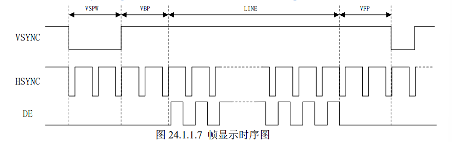

就是 RGB LCD 的帧显示时序，我们来分析一下其中重要的几个参数:

**VSYNC**：帧同步信号，当此信号有效的话就表示开始显示新的一帧数据，查阅所使用的LCD 数据手册可以知道此信号是低电平有效还是高电平有效，假设此时是低电平有效。

**VSPW**：有些地方也叫做 tvp，是 VSYNC 信号宽度，也就是 VSYNC 信号持续时间，单位为 1 行的时间。

**VBP**：有些地方叫做 tvb，前面已经讲过了，术语叫做帧同步信号后肩，单位为 1 行的时间。

**LINE**：有些地方叫做 tvd，显示一帧有效数据所需的时间，假如屏幕分辨率为 1024*600，那么 LINE 就是 600 行的时间。

**VFP**：有些地方叫做 tvf，前面已经讲过了，术语叫做帧同步信号前肩，单位为 1 行的时间。

显示一帧所需要的时间就是：VSPW+VBP+LINE+VFP 个行时间，最终的计算公式：

$T = (VSPW+VBP+LINE+VFP) * (HSPW + HBP + HOZVAL + HFP)$

因此我们在配置一款 RGB LCD 的时候需要知道这几个参数：
HOZVAL(屏幕有效宽度)、LINE(屏幕有效高度)、HBP、HSPW、HFP、VSPW、VBP 和 VFP
ALIENTEK 三款 RGB LCD屏幕的参数如表所示：

ATK4342屏幕:

| 参数         | 值  | 单位 |
| ------------ | --- | ---- |
| 水平显示区域 | 480 | tCLK |
| HSPW(thp)    | 1   | tCLK |
| HBP(thb)     | 40  | tCLK |
| HFP(thf)     | 5   | tCLK |
| 垂直显示区域 | 272 | th   |
| VSPW(tvp)    | 1   | th   |
| VBP(tvb)     | 8   | th   |
| VFP(tvf)     | 8   | th   |
| 像素时钟     | 9   | MHz  |

ATK4384屏幕：
| 参数         | 值  | 单位 |
| ------------ | --- | ---- |
| 水平显示区域 | 800 | tCLK |
| HSPW(thp)    | 48  | tCLK |
| HBP(thb)     | 88  | tCLK |
| HFP(thf)     | 40  | tCLK |
| 垂直显示区域 | 480 | th   |
| VSPW(tvp)    | 3   | th   |
| VBP(tvb)     | 32  | th   |
| VFP(tvf)     | 13  | th   |
| 像素时钟     | 31  | MHz  |

ATK7084屏幕：

| 参数         | 值   | 单位 |
| ------------ | ---- | ---- |
| 水平显示区域 | 800  | tCLK |
| HSPW(thp)    | 1    | tCLK |
| HBP(thb)     | 46   | tCLK |
| HFP(thf)     | 210  | tCLK |
| 垂直显示区域 | 480  | th   |
| VSPW(tvp)    | 1    | th   |
| VBP(tvb)     | 23   | th   |
| VFP(tvf)     | 22   | th   |
| 像素时钟     | 33.3 | MHz  |

ATK7016屏幕：
| 参数         | 值   | 单位 |
| ------------ | ---- | ---- |
| 水平显示区域 | 1024 | tCLK |
| HSPW(thp)    | 20   | tCLK |
| HBP(thb)     | 140  | tCLK |
| HFP(thf)     | 160  | tCLK |
| 垂直显示区域 | 600  | th   |
| VSPW(tvp)    | 3    | th   |
| VBP(tvb)     | 20   | th   |
| VFP(tvf)     | 12   | th   |
| 像素时钟     | 51.2 | MHz  |

6. **像素时钟**

像素时钟就是 RGB LCD 的时钟信号，以 ATK7016 这款屏幕为例，显示一帧图像所需要的时钟数就是：
= (VSPW+VBP+LINE+VFP) * (HSPW + HBP + HOZVAL + HFP) 
= (3 + 20 + 600 + 12) * (20 + 140 + 1024 + 160)
= 635 * 1344
= 853440。

显示一帧图像需要853440个时钟数，那么显示60帧就是：853440 * 60 = 51206400≈51.2M，所以像素时钟就是 51.2MHz。

I.MX6U 的 eLCDIF 接口时钟图如图所示：

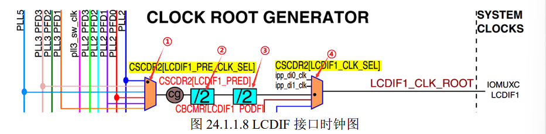

①、此部分是一个选择器，用于选择哪个 PLL 可以作为 LCDIF 时钟源，由寄存器
CCM_CSCDR2 的位 LCDIF1_PRE_CLK_SEL(bit17:15)来决定，LCDIF1_PRE_CLK_SEL 选择设置如表所示：

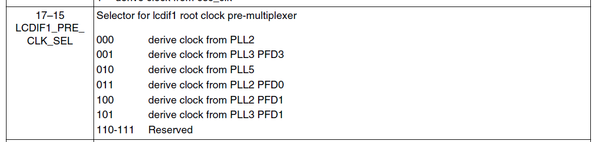

在第 16 章讲解 I.MX6U 时钟系统的时候说过有个专用的 PLL5 给 VIDEO 使用，所以LCDIF1_PRE_CLK_SEL 设置为 2。(PLL5作为时钟源)

②、此部分是 LCDIF 时钟的预分频器，由寄存器 CCM_CSCDR2 的位 LCDIF1_PRED 来决定预分频值。可设置值为 0~7，分别对应 1~8 分频。

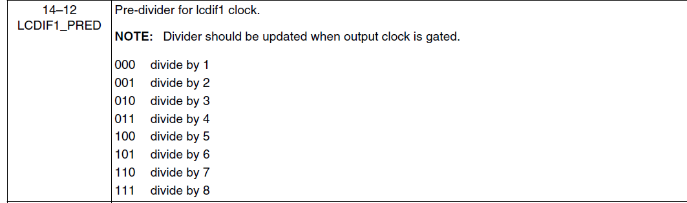

③、此部分进一步分频，由寄存器 CBCMR 的位 LCDIF1_PODF 来决定分频值。可设置值为 0~7，分别对应 1~8 分频。

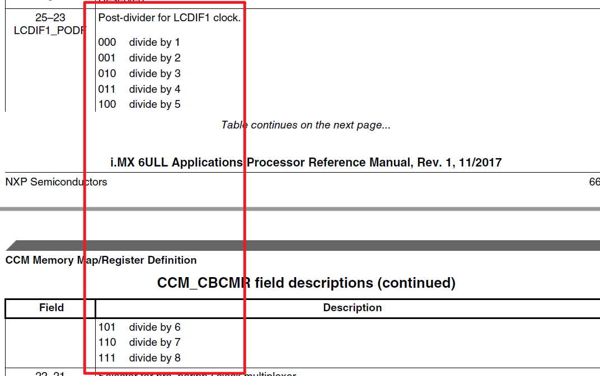

④、此部分是一个选择器，选择 LCDIF 最终的根时钟，由寄存器 CSCDR2 的位LCDIF1_CLK_SEL 决定，LCDIF1_CLK_SEL 选择设置如表:

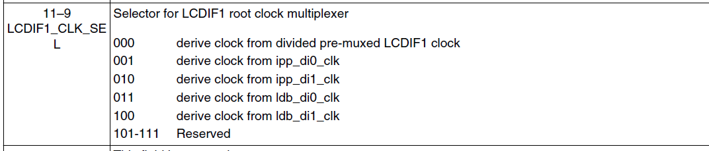

这里肯定选择 PLL5 出来的那一路时钟作为 LCDIF 的根时钟，因此 LCDIF1_CLK_SEL 设置为 0。

LCDIF 既然选择了 PLL5 作为时钟源，那么还需要初始化 PLL5，LCDIF 的时钟是由PLL5 和上图中的②、③这两个分频值决定的，所以需要对这三个进行合理的设置以搭配出所需的时钟值。
我们就以 ATK7016 屏幕所需的 51.2MHz 为例，看看如何进行配置：

PLL5 频率设置涉及到四个寄存器：CCM_PLL_VIDEO、CCM_PLL_VIDEO_NUM、CCM_PLL_VIDEO_DENOM 、 CCM_MISC2 。
其 中 CCM_PLL_VIDEO_NUM 和CCM_PLL_VIDEO_DENOM 这两个寄存器是用于小数分频的，我们这里为了简单不使用小数分频，因此这两个寄存器设置为 0。

PLL5 的时钟计算公式如下：
PLL5_CLK = OSC24M * (loopDivider + (denominator / numerator)) / postDivider

不使用小数分频的话 PLL5 时钟计算公式就可以简化为 ：
PLL5_CLK = OSC24M * loopDivider / postDivider

OSC24M 就是 24MHz 的有源晶振，现在的问题就是设置 loopDivider 和 postDivider。

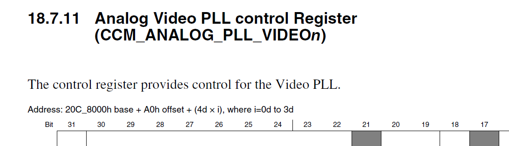
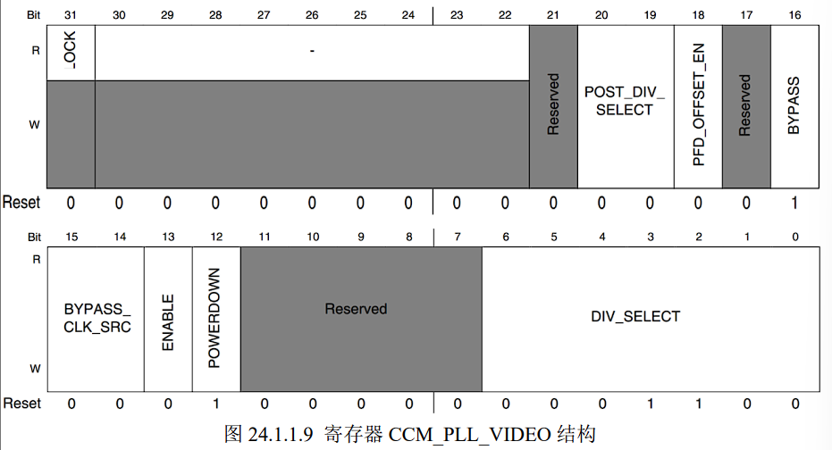

寄存器 CCM_PLL_VIDEO 用到的重要的位如下：

**POST_DIV_SLECT(bit20:19)**：此位和寄存器 CCM_ANALOG_CCMSC2 的 VIDEO_DIV 位共同决定了 postDivider，为 0 的话是 4 分频，为 1 的话是 2 分频，为 2 的话是 1 分频。
本章设置为 2，也就是 1 分频。

**ENABLE(bit13)**：PLL5(PLL_VIDEO)使能位，为 1 的话使能 PLL5，为 0 的话关闭 PLL5。

**DIV_SELECT(bit6:0)**：loopDivider 值，范围为 27~54，本章设置为 32。

寄存器 CCM_ANALOG_MISC2 的位 VIDEO_DIV(bit31:30)与寄存器 CCM_PLL_VIDEO 的位 POST_DIV_SLECT(bit20:19)共同决定了 postDivider，通过这两个的配合可以获得 2、4、8、16 分频。

本章将 VIDEO_DIV 设置为 0，也就是 1 分频，因此 postDivider 就是 1，loopDivider设置为 32，PLL5 的时钟频率就是：

PLL5_CLK = OSC24M * loopDivider / postDivider
= 24M * 32 / 1
= 768MHz。

PLL5 此时为 768MHz，在经过上图的②和③进一步分频，设置②中为 3 分频，也就是寄存器 CCM_CSCDR2 的位 LCDIF1_PRED(bit14:12)为 2。
设置③中为 5 分频，就是寄存器CCM_CBCMR 的位 LCDIF1_PODF(bit25:23)为 4。
设置好以后最终进入到 LCDIF 的时钟频率就是：768/3/5 =51.2MHz，这就是我们需要的像素时钟频率。

7. **显存**

在讲像素格式的时候就已经说过了，如果采用 ARGB8888 格式的话一个像素需要 4 个字节的内存来存放像素数据，那么 1024*600 分辨率就需要1024*600*4=2457600B≈2.4MB 内存。
但是 RGB LCD 内部是没有内存的，所以就需要在开发板上的 DDR3 中分出一段内存作为 RGBLCD 屏幕的显存，我们如果要在屏幕上显示什么图像的话直接操作这部分显存即可。

#### 24.1.2 eLCDIF接口

eLCDIF 是 I.MX6U 自带的液晶屏幕接口，用于连接 RGB LCD 接口的屏幕，eLCDIF 接口特性如下：
①、支持 RGB LCD 的 DE 模式。
②、支持 VSYNC 模式以实现高速数据传输。
③、支持 ITU-R BT.656 格式的 4:2:2 的 YCbCr 数字视频，并且将其转换为模拟 TV 信号。
④、支持 8/16/18/24/32 位 LCD。
eLCDIF 支持三种接口：MPU 接口、VSYNC 接口和 DOTCLK 接口，这三种接口区别如下：

1. **MPU接口**

MPU 接口用于在 I.MX6U 和 LCD 屏幕直接传输数据和命令，这个接口用于 6080/8080 接口的 LCD 屏幕，比如我们学习 STM32 的时候常用到的 MCU 屏幕。
如果寄存器 LCDIF_CTRL 的位 DOTCLK_MODE、DVI_MODE 和 VSYNC_MODE 都为 0 的话就表示 LCDIF 工作在 MPU接口模式。
关于 MPU 接口的详细信息以及时序参考《I.MX6ULL 参考手册》第 2150 页的“34.4.6MPU Interface”小节，本教程不使用 MPU 接口。

2. **VSYNC接口**

VSYNC 接口时序和 MPU 接口时序基本一样，只是多了 VSYNC 信号来作为帧同步，当LCDIF_CTRL 的位 VSYNC_MODE 为 1 的时候此接口使能。
关于 VSYNC 接口的详细信息请参考《I.MX6ULL 参考手册》第 2152 页的“34.4.7 VSYNC Interface”小节，本教程不使用 VSYNC接口。

3. **DOTCLK接口** 

DOTCLK 接口就是用来连接 RGB LCD 接口屏幕的， 它包括 VSYNC、HSYNC、DOTCLK和 ENABLE(可选的)这四个信号，这样的接口通常被称为 RGB 接口。
DOTCLK 接口时序如图：


DOTCLK 接口就是连接 RGB 屏幕的，本教程使用的就是 DOTCLK 接口。

eLCDIF 要驱动起来 RGB LCD 屏幕，重点是配置好上一小节讲解的那些时间参数即可，这个通过配置相应的寄存器就可以了。
所以我们接下来看一下 eLCDIF 接口的几个重要的寄存器，首先看一下 LCDIF_CTRL 寄存器，此寄存器结构如图：
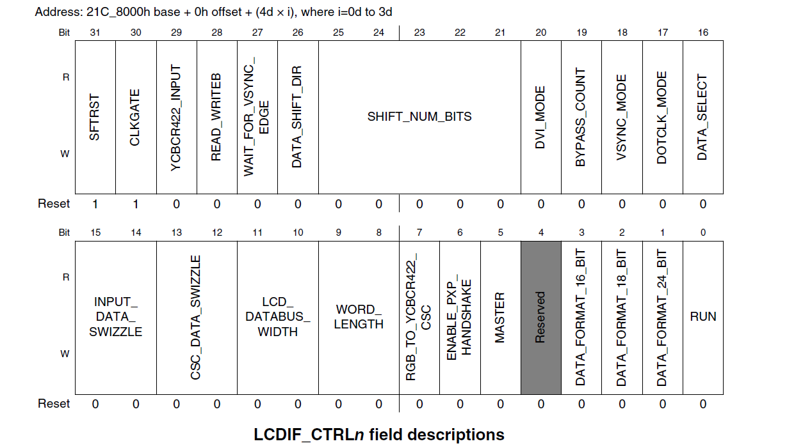

寄存器<span style="color:red"><b> LCDIF_CTRL </b></span>用到的重要位如下:

**SFTRST(bit31)**：eLCDIF 软复位控制位，当此位为 1 的话就会强制复位 LCD。

**CLKGATE(bit30)**：正常运行模式下，此位必须为 0！如果此位为 1 的话时钟就不会进入到LCDIF。

**BYPASS_COUNT(bit19)**：如果要工作在 DOTCLK 模式的话就此位必须为 1。

**VSYNC_MODE(bit18)**：此位为 1 的话 LCDIF 工作在 VSYNC 接口模式。

**DOTCLK_MODE(bit17)**：此位为 1 的话 LCDIF 工作在 DOTCLK 接口模式。

**INPUT_DATA_SWIZZLE(bit15:14)**：输入数据字节交换设置，此位为 0 的话不交换字节也就是小端模式；
为 1 的话交换所有字节，也就是大端模式；
为 2 的话半字交换；
为 3 的话在每个半字内进行字节交换。
本章我们设置为 0，也就是不使用字节交换。

**CSC_DATA_SWIZZLE(bit13:12)** ： CSC 数 据 字 节 交 换 设 置 ， 交 换 方 式 和INPUT_DATA_SWIZZLE 一样，本章设置为 0，不使用字节交换。

**LCD_DATABUS_WIDTH(bit11:10)**：LCD 数据总线宽度，
为 0 的话总线宽度为 16 位；
为1 的话总线宽度为 8 位；
为 2 的话总线宽度为 18 位；
为 3 的话总线宽度为 24 位。
本章我们使用 24 位总线宽度。

**WORD_LENGTH(bit9:8)**：输入的数据格式，也就是像素数据宽度。
为 0 的话每个像素 16位；
为 1 的话每个像素 8 位；
为 2 的话每个像素 18 位；
为 3 的话每个像素 24 位。

**MASTER(bit5)**：为 1 的话设置 eLCDIF 工作在主模式。

**DATA_FORMAT_16_BIT(bit3)**：当此位为 1 并且 WORD_LENGTH 为 0 的时候像素格式为 ARGB555，当此位为 0 并且 WORD_LENGTH 为 0 的时候像素格式为 RGB565。

**DATA_FORMAT_18_BIT(bit2)**：只有当 WORD_LENGTH 为 2 的时候此位才有效。
此位为 0 的话低 18 位有效，像素格式为 RGB666，高 14 位数据无效。
当此位为 1 的话高 18 位有效，像素格式依旧是 RGB666，但是低 14 位数据无效。

**DATA_FORMAT_24_BIT(bit1)**：只有当 WORD_LENGTH 为 3 的时候此位才有效，为 0 的时候表示全部的 24 位数据都有效。
为 1 的话实际输入的数据有效位只有 18 位，虽然输入的是24 位数据，但是每个颜色通道的高 2 位数据会被丢弃掉。

**RUN(bit0)**：eLCDIF 接口运行控制位，当此位为 1 的话 eLCDIF 接口就开始传输数据，也就是 eLCDIF 的使能位。

接下来看一看<span style="color:red"><b> LCDIF_CTRL1 </b></span>
此寄存器我们只用到位BYTE_PACKING_FORMAT(bit19:16)，此位用来决定在 32 位的数据中哪些字节的数据有效，默认值为 0XF，也就是所有的字节有效。
为 0 的话表示所有的字节都无效。
如果显示的数据是24 位(ARGB 格式，但是 A 通道不传输)的话就设置此位为 0X7。

接下来看一下寄存器 <span style="color:red"><b> LCDIF_TRANSFER_COUNT </b></span>，这个寄存器用来设置所连接的 RGB LCD 屏幕分辨率大小，此寄存器结构如图所示：

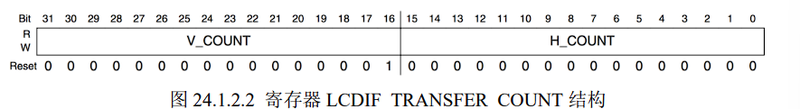

寄存器LCDIF_TRANSFER_COUNT分为两部分，高16位和低16位，高16位是V_COUNT，是 LCD 的垂直分辨率。
低 16 位是 H_COUNT，是 LCD 的水平分辨率。
如果 LCD 分辨率为1024*600 的话，那么 V_COUNT 就是 600，H_COUNT 就是 1024。

接下来看一下寄存器 <span style="color:red"><b> LCDIF_VDCTRL0 </b></span>，这个寄存器是 VSYNC 和 DOTCLK 模式控制寄存器 0，寄存器结构如图:

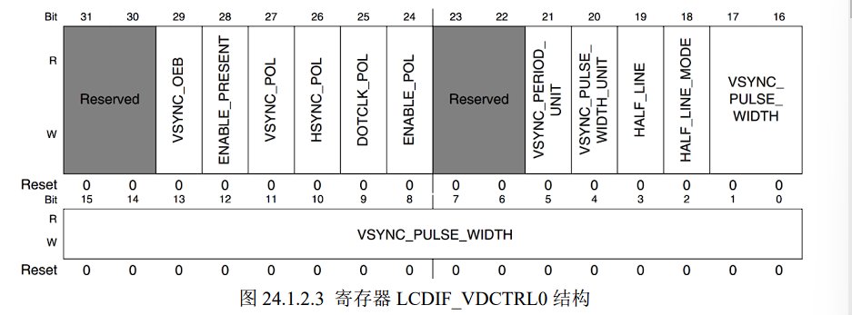

寄存器 LCDIF_VDCTRL0 用到的重要位如下：

**VSYNC_OEB(bit29)**：VSYNC 信号方向控制位，为 0 的话 VSYNC 是输出，为 1 的话VSYNC 是输入。

**ENABLE_PRESENT(bit28)**：EBABLE 数据线使能位，也就是 DE 数据线。
为 1 的话使能ENABLE 数据线，为 0 的话关闭 ENABLE 数据线。

**VSYNC_POL(bit27)**：VSYNC 数据线极性设置位，为 0 的话 VSYNC 低电平有效，为 1 的话 VSYNC 高电平有效，要根据所使用的 LCD 数据手册来设置。

**HSYNC_POL(bit26)**：HSYNC 数据线极性设置位，为 0 的话 HSYNC 低电平有效，为 1 的话 HSYNC 高电平有效，要根据所使用的 LCD 数据手册来设置。

**DOTCLK_POL(bit25)**：DOTCLK 数据线(像素时钟线 CLK) 极性设置位，为 0 的话下降沿锁存数据，上升沿捕获数据，为 1 的话相反，要根据所使用的 LCD 数据手册来设置。

**ENABLE_POL(bit24)**：EANBLE 数据线极性设置位，为 0 的话低电平有效，为 1 的话高电平有效。

**VSYNC_PERIOD_UNIT(bit21)**：VSYNC 信号周期单位，为 0 的话 VSYNC 周期单位为像素时钟。为 1 的话 VSYNC 周期单位是水平行，如果使用 DOTCLK 模式话就要设置为 1。

**VSYNC_PULSE_WIDTH_UNIT(bit20)** ： VSYNC信号脉冲宽度单位,和
VSYNC_PERIOD_UNUT 一样，如果使用 DOTCLK 模式的话要设置为 1。

**VSYNC_PULSE_WIDTH(bit17:0)**：VSPW 参数设置位。

接下来看一下寄存器 <span style="color:red"><b> LCDIF_VDCTRL1 </b></span>，这个寄存器是 VSYNC 和 DOTCLK 模式控制寄存器 1，此寄存器只有一个功能，用来设置 VSYNC 总周期，就是：
屏幕高度+VSPW+VBP+VFP。

接下来看一下寄存器 <span style="color:red"><b> LCDIF_VDCTRL2 </b></span>，这个寄存器分为高 16 位和低 16 位两部分，高16位是 HSYNC_PULSE_WIDTH，用来设置 HSYNC 信号宽度，也就是 HSPW。
低16位是 HSYNC_PERIOD，设置 HSYNC 总周期，就是：屏幕宽度+HSPW+HBP+HFP。

接下来看一下寄存器 <span style="color:red"><b> LCDIF_VDCTRL3 </b></span>，此寄存器结构如图:

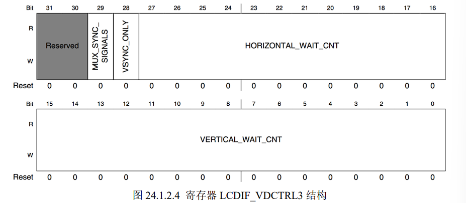

寄存器 LCDIF_VDCTRL3 用到的重要位如下：

**HORIZONTAL_WAIT_CNT(bit27:16)**：此位用于 DOTCLK 模式，用于设置 HSYNC 信号产生到有效数据产生之间的时间，也就是 HSPW+HBP。

**VERTICAL_WAIR_CNT(bit15:0)**：和 HORIZONTAL_WAIT_CNT 一样，只是此位用于VSYNC 信号，也就是 VSPW+VBP。

接下来看一下寄存器 <span style="color:red"><b> LCDIF_VDCTRL4 </b></span>，此寄存器结构如图:

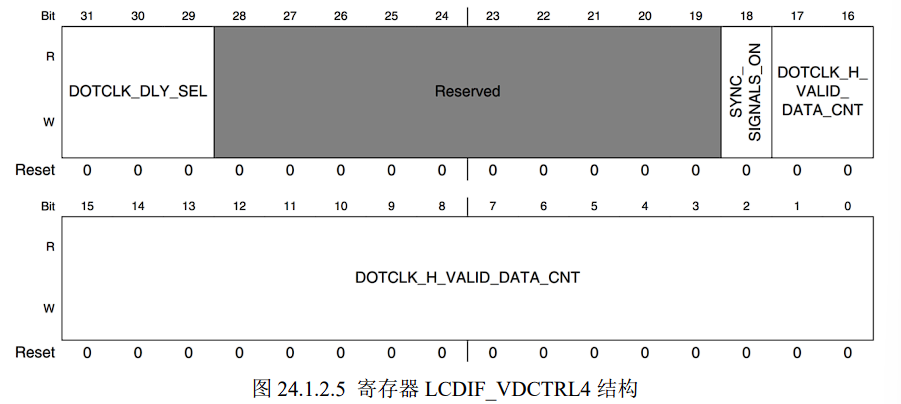

寄存器 LCDIF_VDCTRL4 用到的重要位如下：

**SYNC_SIGNALS_ON(bit18)**：同步信号使能位，设置为 1 的话使能 VSYNC、HSYNC、DOTCLK 这些信号。

**DOTCLK_H_VALID_DATA_CNT(bit15:0)**：设置 LCD 的宽度，也就是水平像素数量。

最后在看一下寄存器 <span style="color:red">LCDIF_CUR_BUF 和 LCDIF_NEXT_BUF</span>，这两个寄存器分别为当前帧和下一帧缓冲区，也就是 LCD 显存。
一般这两个寄存器保存同一个地址，也就是划分给 LCD的显存首地址。

关于 eLCDIF 接口的寄存器就介绍到这里，关于这些寄存器详细的描述，请参考《I.MX6ULL参考手册》第 2165 页的 34.6 小节。本章我们使用 I.MX6U 的 eLCDIF 接口来驱动 ALIENTEK的 ATK7016 这款屏幕:

1. **初始化 LCD 所使用的 IO**

首先肯定是初始化 LCD 所示使用的 IO，将其复用为 eLCDIF 接口 IO

2. **设置 LCD 的像素时钟**

查阅所使用的 LCD 屏幕数据手册，或者自己计算出的时钟像素，然后设置 CCM 相应的寄存器。

3. **配置 eLCDIF 接口**

设置 LCDIF 的寄存器 CTRL、CTRL1、TRANSFER_COUNT、VDCTRL0~4、CUR_BUF 和NEXT_BUF。
根据 LCD 的数据手册设置相应的参数。

4. **编写 API 函数**

驱动 LCD 屏幕的目的就是显示内容，所以需要编写一些基本的 API 函数，比如画点、画线、画圆函数，字符串显示函数等。

### 24.2 硬件原理分析

本试验用到的资源如下：
①、指示灯 LED0。
②、RGB LCD 接口。
③、DDR3
④、eLCDIF
RGB LCD 接口在 I.MX6U-ALPHA 开发板底板上


图中三个 SGM3157 的目的是在未使用 RGBLCD 的时候将 LCD_DATA7、LCD_DATA15 和 LCD_DATA23 这三个线隔离开来，因为 ALIENTEK 的屏幕的 LCD_R7/G7/B7这几个线用来设置 LCD 的 ID，所以这几根线上有上拉/下拉电阻。

但是 I.MX6U 的 BOOT 设置也用到了 LCD_DATA7、LCD_DATA15 和 LCD_DATA23 这三个引脚，所以接上屏幕以后屏幕上的 ID 电阻就会影响到 BOOT 设置，会导致代码无法运行，所以先将其隔离开来.
如果要使用 RGB LCD 屏幕的时候再通过 LCD_DE 将其“连接”起来。
我们需要 40P 的 FPC 线将 ATK7016屏幕和 I.MX6U-ALPHA 开发板连接起来:

补充：

    SGM3157 是一款双向 SPDT（单刀双掷）CMOS 模拟开关。
    它采用 1.8V 至 5.5V 单电源供电，具有低导通电阻、低电压和高带宽的特点。
    高性能使其非常适合多种应用，例如便携式设备、音频和视频信号路由等。
    低功耗也是使其成为理想选择的重要原因之一。
芯片模型

引脚介绍
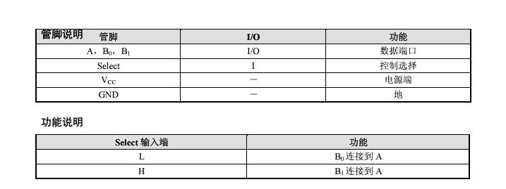

连接图：
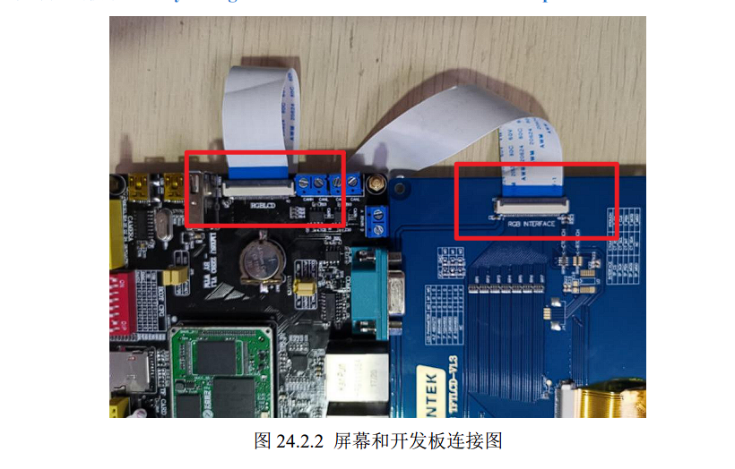

### 24.3 实验程序编写

开发板光盘-> 1、裸机例程-> 15_lcd。

本章实验在上一章例程的基础上完成，更改工程名字为“lcd”，然后在 bsp 文件夹下创建名为“lcd”的文件夹，在 bsp/lcd 中新建 bsp_lcd.c、bsp_lcd.h、bsp_lcdapi.c、bsp_lcdapi.h 和 font.h这五个文件。
bsp_lcd.c 和 bsp_lcd.h 是 LCD 的驱动文件。
bsp_lcdapi.c 和 bsp_lcdapi.h 是 LCD 的API 操作函数文件
font.h 是字符集点阵数据数组文件

```C
bsp_lcd.h
1 #ifndef _BSP_LCD_H
2 #define _BSP_LCD_H
3 /***************************************************************
4 Copyright © zuozhongkai Co., Ltd. 1998-2019. All rights reserved.
5 文件名 : bsp_lcd.h
6 作者 : 左忠凯
7 版本 : V1.0
8 描述 : LCD 驱动文件头文件。
9 其他 : 无
10 论坛 : www.openedv.com
11 日志 : 初版 V1.0 2019/1/3 左忠凯创建
12 ***************************************************************/
13 #include "imx6ul.h"
14
15 /* 颜色宏定义 */
16 #define LCD_BLUE 0x000000FF
17 #define LCD_GREEN 0x0000FF00
18 #define LCD_RED 0x00FF0000
19 /* 省略掉其它宏定义，完整的请参考实验例程 */
20 #define LCD_ORANGE 0x00FFA500
21 #define LCD_TRANSPARENT 0x00000000
22
23 #define LCD_FRAMEBUF_ADDR (0x89000000) /* LCD 显存地址 */
24
25 /* LCD 控制参数结构体 */
26 struct tftlcd_typedef{
27 unsigned short height; /* LCD 屏幕高度 */
28 unsigned short width; /* LCD 屏幕宽度 */
29 unsigned char pixsize; /* LCD 每个像素所占字节大小 */
30 unsigned short vspw; /* VSYNC 信号宽度 */
31 unsigned short vbpd; /* 帧同步信号后肩 */
32 unsigned short vfpd; /* 帧同步信号前肩 */
33 unsigned short hspw; /* HSYNC 信号宽度 */
34 unsigned short hbpd; /* 水平同步信号后见肩 */
35 unsigned short hfpd; /* 水平同步信号前肩 */
36 unsigned int framebuffer; /* LCD 显存首地址 */
37 unsigned int forecolor; /* 前景色 */
38 unsigned int backcolor; /* 背景色 */
39 };
40
41 extern struct tftlcd_typedef tftlcd_dev; //声明一个外部结构体
42
43 /* 函数声明 */
44 void lcd_init(void);
45 void lcdgpio_init(void);
46 void lcdclk_init(unsigned char loopDiv, unsigned char prediv，unsigned char div);
47 void lcd_reset(void);
48 void lcd_noreset(void);
49 void lcd_enable(void);
50 void video_pllinit(unsigned char loopdivi, unsigned char postdivi);
51 inline void lcd_drawpoint(unsigned short x,unsigned short y,unsigned int color);
52 inline unsigned int lcd_readpoint(unsigned short x,unsigned short y);
53 void lcd_clear(unsigned int color);
54 void lcd_fill(unsigned short x0, unsigned short y0,unsigned short x1, unsigned short y1,unsigned int color);
55 #endif
```
在文件 bsp_lcd.h 中一开始定义了一些常用的颜色宏定义，颜色格式都是 ARGB8888 的。
第 23 行的宏 LCD_FRAMEBUF_ADDR 是显存首地址，此处将显存首地址放到了 0X89000000地址处。
这个要根据所使用的 LCD 屏幕大小和 DDR 内存大小来确定的，前面我们说了 ATK7016这款 RGB 屏幕所需的显存大小为 2.4MB，而 I.MX6U-ALPHA 开发板配置的 DDR 有 256 和 512MB 两种类型，内存地址范围分别为 0X80000000~0X90000000 和 0X80000000~0XA0000000。
所以 LCD 显存首地址选择为 0X89000000 不管是 256MB 还是 512MB 的 DDR 都可以使用。

第 26 行的结构体 tftlcd_typedef 是 RGB LCD 的控制参数结构体，里面包含了跟 LCD 配置有关的一些成员变量。最后就是一些变量和函数是声明。

```C
bsp_lcd.c
1 #include "bsp_lcd.h"
2 #include "bsp_gpio.h"
3 #include "bsp_delay.h"
4 #include "stdio.h"
5 
6 /* 液晶屏参数结构体 */
7 struct tftlcd_typedef tftlcd_dev;
8
9 /*
10 * @description : 始化 LCD
11 * @param : 无
12 * @return : 无
13 */
14 void lcd_init(void)
15 {
16  lcdgpio_init(); /* 初始化 IO */
17  lcdclk_init(32, 3, 5); /* 初始化 LCD 时钟 */
18
19  lcd_reset(); /* 复位 LCD */
20  delayms(10); /* 延时 10ms */
21  lcd_noreset(); /* 结束复位 */
22
23  /* RGB LCD 参数结构体初始化 */
24  tftlcd_dev.height = 600; /* 屏幕高度 */
25  tftlcd_dev.width = 1024; /* 屏幕宽度 */
26  tftlcd_dev.pixsize = 4; /* ARGB8888 模式，每个像素 4 字节 */
27  tftlcd_dev.vspw = 3; /* VSYNC 信号宽度 */
28  tftlcd_dev.vbpd = 20; /* 帧同步信号后肩 */
29  tftlcd_dev.vfpd = 12; /* 帧同步信号前肩 */
30  tftlcd_dev.hspw = 20; /* HSYNC 信号宽度 */
31  tftlcd_dev.hbpd = 140; /* 水平同步信号后见肩 */
32  tftlcd_dev.hfpd = 160; /* 水平同步信号前肩 */
33  tftlcd_dev.framebuffer = LCD_FRAMEBUF_ADDR; /* 帧缓冲地址 */
34  tftlcd_dev.backcolor = LCD_WHITE; /* 背景色为白色 */
35  tftlcd_dev.forecolor = LCD_BLACK; /* 前景色为黑色 */
36
37 /* 初始化 ELCDIF 的 CTRL 寄存器
38  * bit [31] 0 : 停止复位
39  * bit [19] 1 : 旁路计数器模式
40  * bit [17] 1 : LCD 工作在 dotclk 模式
41  * bit [15:14] 00 : 输入数据不交换
42  * bit [13:12] 00 : CSC 不交换
43  * bit [11:10] 11 : 24 位总线宽度
44  * bit [9:8] 11 : 24 位数据宽度,也就是 RGB888
45  * bit [5] 1 : elcdif 工作在主模式
46  * bit [1] 0 : 所有的 24 位均有效
47  */
48  LCDIF->CTRL |= (1 << 19) | (1 << 17) | (0 << 14) | (0 << 12) |
49                (3 << 10) | (3 << 8) | (1 << 5) | (0 << 1);
50 /*
51  * 初始化 ELCDIF 的寄存器 CTRL1
52  * bit [19:16] : 0X7 ARGB 模式下，传输 24 位数据，A 通道不用传输
53  */
54  LCDIF->CTRL1 = 0X7 << 16;
55 
56 /*
57  * 初始化 ELCDIF 的寄存器 TRANSFER_COUNT 寄存器
58  * bit [31:16] : 高度
59  * bit [15:0] : 宽度
60  */
61  LCDIF->TRANSFER_COUNT = (tftlcd_dev.height << 16) | (tftlcd_dev.width << 0);
62 
63 /*
64  * 初始化 ELCDIF 的 VDCTRL0 寄存器
65  * bit [29] 0 : VSYNC 输出
66  * bit [28] 1 : 使能 ENABLE 输出
67  * bit [27] 0 : VSYNC 低电平有效
68  * bit [26] 0 : HSYNC 低电平有效
69  * bit [25] 0 : DOTCLK 上升沿有效
70  * bit [24] 1 : ENABLE 信号高电平有效
71  * bit [21] 1 : DOTCLK 模式下设置为 1
72  * bit [20] 1 : DOTCLK 模式下设置为 1
73  * bit [17:0] : vspw 参数
74  */
75  LCDIF->VDCTRL0 = 0; /* 先清零 */
76  LCDIF->VDCTRL0 = (0 << 29) | (1 << 28) | (0 << 27) |
77                   (0 << 26) | (0 << 25) | (1 << 24) |
78                   (1 << 21) | (1 << 20) | (tftlcd_dev.vspw << 0);
79 /*
80  * 初始化 ELCDIF 的 VDCTRL1 寄存器，设置 VSYNC 总周期
81  */ 
82  LCDIF->VDCTRL1 = tftlcd_dev.height + tftlcd_dev.vspw + tftlcd_dev.vfpd + tftlcd_dev.vbpd;
83
84 /*
85  * 初始化 ELCDIF 的 VDCTRL2 寄存器，设置 HSYNC 周期
86  * bit[31:18] ：hsw
87  * bit[17:0] : HSYNC 总周期
88  */
89  LCDIF->VDCTRL2 = (tftlcd_dev.hspw << 18) | (tftlcd_dev.width + tftlcd_dev.hspw + tftlcd_dev.hfpd + tftlcd_dev.hbpd);
90 
91 /*
92  * 初始化 ELCDIF 的 VDCTRL3 寄存器，设置 HSYNC 周期
93  * bit[27:16] ：水平等待时钟数
94  * bit[15:0] : 垂直等待时钟数
95  */
96  LCDIF->VDCTRL3 = ((tftlcd_dev.hbpd + tftlcd_dev.hspw) << 16) | (tftlcd_dev.vbpd + tftlcd_dev.vspw);
97
98 /*
99  * 初始化 ELCDIF 的 VDCTRL4 寄存器，设置 HSYNC 周期
100 * bit[18] 1 : 当使用 VSHYNC、HSYNC、DOTCLK 的话此为置 1
101 * bit[17:0] : 宽度
102 */
103 
104  LCDIF->VDCTRL4 = (1<<18) | (tftlcd_dev.width);
105
106 /*
107  * 初始化 ELCDIF 的 CUR_BUF 和 NEXT_BUF 寄存器
108  * 设置当前显存地址和下一帧的显存地址
109  */
110  LCDIF->CUR_BUF = (unsigned int)tftlcd_dev.framebuffer;
111  LCDIF->NEXT_BUF = (unsigned int)tftlcd_dev.framebuffer;
112
113  lcd_enable(); /* 使能 LCD */
114  delayms(10);
115  lcd_clear(LCD_WHITE); /* 清屏 */
116
117 }
118
119 /*
120  * @description : LCD GPIO 初始化
121  * @param : 无
122  * @return : 无
123  */
124 void lcdgpio_init(void)
125 {
126     gpio_pin_config_t gpio_config;
127
128     /* 1、IO 初始化复用功能 */
129     IOMUXC_SetPinMux(IOMUXC_LCD_DATA00_LCDIF_DATA00,0);
130     IOMUXC_SetPinMux(IOMUXC_LCD_DATA01_LCDIF_DATA01,0);
131     IOMUXC_SetPinMux(IOMUXC_LCD_DATA02_LCDIF_DATA02,0);
132     IOMUXC_SetPinMux(IOMUXC_LCD_DATA03_LCDIF_DATA03,0);
        ……  
154     IOMUXC_SetPinMux(IOMUXC_LCD_ENABLE_LCDIF_ENABLE,0);
155     IOMUXC_SetPinMux(IOMUXC_LCD_HSYNC_LCDIF_HSYNC,0);
156     IOMUXC_SetPinMux(IOMUXC_LCD_VSYNC_LCDIF_VSYNC,0);
157     IOMUXC_SetPinMux(IOMUXC_GPIO1_IO08_GPIO1_IO08,0); /* 背光引脚*/
158 
159     /* 2、配置 LCD IO 属性
160      *bit 16:0 HYS 关闭
161      *bit [15:14]: 0 默认 22K 上拉
162      *bit [13]: 0 pull 功能
163      *bit [12]: 0 pull/keeper 使能
164      *bit [11]: 0 关闭开路输出
165      *bit [7:6]: 10 速度 100Mhz
166      *bit [5:3]: 111 驱动能力为 R0/7
167      *bit [0]: 1 高转换率
168      */
169     IOMUXC_SetPinConfig(IOMUXC_LCD_DATA00_LCDIF_DATA00,0xB9);
170     IOMUXC_SetPinConfig(IOMUXC_LCD_DATA01_LCDIF_DATA01,0xB9);
        ……  
193     IOMUXC_SetPinConfig(IOMUXC_LCD_CLK_LCDIF_CLK,0xB9);
194     IOMUXC_SetPinConfig(IOMUXC_LCD_ENABLE_LCDIF_ENABLE,0xB9);
195     IOMUXC_SetPinConfig(IOMUXC_LCD_HSYNC_LCDIF_HSYNC,0xB9);
196     IOMUXC_SetPinConfig(IOMUXC_LCD_VSYNC_LCDIF_VSYNC,0xB9);
197     IOMUXC_SetPinConfig(IOMUXC_GPIO1_IO08_GPIO1_IO08,0xB9);
198 
199     /* GPIO 初始化 */
200     gpio_config.direction = kGPIO_DigitalOutput; /* 输出 */
201     gpio_config.outputLogic = 1; /* 默认关闭背光 */
202     gpio_init(GPIO1, 8, &gpio_config); /* 背光默认打开 */
203     gpio_pinwrite(GPIO1, 8, 1); /* 打开背光 */
204 }
205
206 /*
207  * @description : LCD 时钟初始化, LCD 时钟计算公式如下：
208  * LCD CLK = 24 * loopDiv / prediv / div
209  * @param - loopDiv : loopDivider 值
210  * @param - loopDiv : lcdifprediv 值
211  * @param - div : lcdifdiv 值
212  * @return : 无
213  */
214  void lcdclk_init(unsigned char loopDiv, unsigned char prediv,unsigned char div)
215 {
216     /* 先初始化 video pll
217      * VIDEO PLL = OSC24M * (loopDivider + (denominator /
            numerator)) / postDivider
218      *不使用小数分频器，因此 denominator 和 numerator 设置为 0
219      */
220     CCM_ANALOG->PLL_VIDEO_NUM = 0; /* 不使用小数分频器 */
221     CCM_ANALOG->PLL_VIDEO_DENOM = 0;
222
223     /*
224      * PLL_VIDEO 寄存器设置
225      * bit[13] : 1 使能 VIDEO PLL 时钟
226      * bit[20:19] : 2 设置 postDivider 为 1 分频
227      * bit[6:0] : 32 设置 loopDivider 寄存器
228      */
229     CCM_ANALOG->PLL_VIDEO = (2 << 19) | (1 << 13) | (loopDiv << 0);
230
231     /*
232      * MISC2 寄存器设置
233      * bit[31:30]: 0 VIDEO 的 post-div 设置，1 分频
234      */
235     CCM_ANALOG->MISC2 &= ~(3 << 30);
236     CCM_ANALOG->MISC2 = 0 << 30;
237
238     /* LCD 时钟源来源与 PLL5，也就是 VIDEO PLL */
239     CCM->CSCDR2 &= ~(7 << 15);
240     CCM->CSCDR2 |= (2 << 15); /* 设置 LCDIF_PRE_CLK 使用 PLL5 */
241
242     /* 设置 LCDIF_PRE 分频 */
243     CCM->CSCDR2 &= ~(7 << 12);
244     CCM->CSCDR2 |= (prediv - 1) << 12; /* 设置分频 */
245
246     /* 设置 LCDIF 分频 */
247     CCM->CBCMR &= ~(7 << 23);
248     CCM->CBCMR |= (div - 1) << 23;
249
250     /* 设置 LCD 时钟源为 LCDIF_PRE 时钟 */
251     CCM->CSCDR2 &= ~(7 << 9); /* 清除原来的设置 */
252     CCM->CSCDR2 |= (0 << 9); /* LCDIF_PRE 时钟源选择 LCDIF_PRE 时钟 */
253 }
254
255 /*
256  * @description : 复位 ELCDIF 接口
257  * @param : 无
258  * @return : 无
259  */
260 void lcd_reset(void)
261 {
262     LCDIF->CTRL = 1<<31; /* 强制复位 */
263 }
264
265 /*
266  * @description : 结束复位 ELCDIF 接口
267  * @param : 无
268  * @return : 无
269  */
270 void lcd_noreset(void)
271 {
272     LCDIF->CTRL = 0<<31; /* 取消强制复位 */
273 }
274
275 /*
276  * @description : 使能 ELCDIF 接口
277  * @param : 无
278  * @return : 无
279  */
280 void lcd_enable(void)
281 {
282     LCDIF->CTRL |= 1<<0; /* 使能 ELCDIF */
283 }
284
285 /*
286  * @description : 画点函数
287  * @param - x : x 轴坐标
288  * @param - y : y 轴坐标
289  * @param - color : 颜色值
290  * @return : 无
291  */
292 inline void lcd_drawpoint(unsigned short x,unsigned short y,
                              unsigned int color)
293 {
294 *(unsigned int*)((unsigned int)tftlcd_dev.framebuffer +
295        tftlcd_dev.pixsize * (tftlcd_dev.width * y + x)) = color;
296 }
297
298
299 /*
300  * @description : 读取指定点的颜色值
301  * @param - x : x 轴坐标
302  * @param - y : y 轴坐标
303  * @return : 读取到的指定点的颜色值
304  */
305 inline unsigned int lcd_readpoint(unsigned short x,
                                     unsigned short y)
306 {
307     return *(unsigned int*)((unsigned int)tftlcd_dev.framebuffer +
308             tftlcd_dev.pixsize * (tftlcd_dev.width * y + x));
309 }
310
311 /*
312  * @description : 清屏
313  * @param - color : 颜色值
314  * @return : 读取到的指定点的颜色值
315  */
316 void lcd_clear(unsigned int color)
317 {
318     unsigned int num;
319     unsigned int i = 0;
320
321     unsigned int *startaddr=(unsigned int*)tftlcd_dev.framebuffer;
322     num=(unsigned int)tftlcd_dev.width * tftlcd_dev.height;
323     for(i = 0; i < num; i++)
324     {
325         startaddr[i] = color;
326     }
327 }
328
329 /*
330  * @description : 以指定的颜色填充一块矩形
331  * @param - x0 : 矩形起始点坐标 X 轴
332  * @param - y0 : 矩形起始点坐标 Y 轴
333  * @param - x1 : 矩形终止点坐标 X 轴
334  * @param - y1 : 矩形终止点坐标 Y 轴
335  * @param - color : 要填充的颜色
336  * @return : 读取到的指定点的颜色值
337  */
338 void lcd_fill(unsigned short x0, unsigned short y0,
339         unsigned short x1, unsigned short y1,unsigned int color)
340 {
341     unsigned short x, y;
342
343     if(x0 < 0) x0 = 0;
344     if(y0 < 0) y0 = 0;
345     if(x1 >= tftlcd_dev.width) x1 = tftlcd_dev.width - 1;
346     if(y1 >= tftlcd_dev.height) y1 = tftlcd_dev.height - 1;
347
348     for(y = y0; y <= y1; y++)
349     {
350         for(x = x0; x <= x1; x++)
351             lcd_drawpoint(x, y, color);
352     }
353 }
```
文件 bsp_lcd.c 里面一共有 10 个函数，第一个函数是 lcd_init，这个是 LCD 初始化函数，此函数先调用 LCD 的 IO 初始化函数、时钟初始化函数、复位函数等，然后会按照我们前面讲解的步骤初始化 eLCDIF 相关的寄存器，最后使能 eLCDIF。
第二个函数是 lcdgpio_init，这个是LCD 的 IO 初始化函数。
第三个函数 lcdclk_init 是 LCD 的时钟初始化函数。
第四个函数 lcd_reset和第五个函数 lcd_noreset 分别为复位 LCD 的停止 LCD 复位函数。
第六个函数 lcd_enable 是eLCDIF 使能函数，用于使能 eLCDIF。
第七个和第八个是画点和读点函数，分别为 lcd_drawpoint和 lcd_readpoint，通过这两个函数就可以在 LCD 的指定像素点上显示指定的颜色，或者读取指定像素点的颜色。
第九个函数 lcd_clear 是清屏函数，使用指定的颜色清除整个屏幕。
最后一个函数 lcd_fill 是填充函数，使用此函数的时候需要指定矩形的起始坐标、终止坐标和填充颜色，这样就可以填充出一个矩形区域。

以上及完成了LCD的硬件初始化工作。
在 bsp_lcdapi.h 中输入如下所示内容：
```C
bsp_lcdapi.h
1 #ifndef BSP_LCDAPI_H
2 #define BSP_LCDAPI_H
3 /***************************************************************
4 Copyright © zuozhongkai Co., Ltd. 1998-2019. All rights reserved.
5 文件名 : bsp_lcdapi.h
6 作者 : 左忠凯
7 版本 : V1.0
8 描述 : LCD 显示 API 函数。
9 其他 : 无
10 论坛 : www.openedv.com
11 日志 : 初版 V1.0 2019/3/18 左忠凯创建
12 ***************************************************************/
13 #include "imx6ul.h"
14 #include "bsp_lcd.h"
15
16 /* 函数声明 */
17 void lcd_drawline(unsigned short x1, unsigned short y1, unsigned
                    short x2, unsigned short y2);
18 void lcd_draw_rectangle(unsigned short x1, unsigned short y1,
                    unsigned short x2, unsigned short y2);
19 void lcd_draw_circle(unsigned short x0,unsigned short y0,
                    unsigned char r);
20 void lcd_showchar(unsigned short x,unsigned short y,
                    unsigned char num,unsigned char size,
                    unsigned char mode);
21 unsigned int lcd_pow(unsigned char m,unsigned char n);
22 void lcd_shownum(unsigned short x, unsigned short y,
                    unsigned int num, unsigned char len,
                    unsigned char size);
23 void lcd_showxnum(unsigned short x, unsigned short y,
                    unsigned int num, unsigned char len,
                    unsigned char size, unsigned char mode);
24 void lcd_show_string(unsigned short x,unsigned short y,
                    unsigned short width, unsigned short height,
                    unsigned char size, char *p);
25 #endif
```

```C
bsp_lcdapi.c
1 #include "bsp_lcdapi.h"
2 #include "font.h"
3
4 /*
5  * @description : 画线函数
6  * @param - x1 : 线起始点坐标 X 轴
7  * @param - y1 : 线起始点坐标 Y 轴
8  * @param - x2 : 线终止点坐标 X 轴
9  * @param - y2 : 线终止点坐标 Y 轴
10 * @return : 无
11 */
12 void lcd_drawline(unsigned short x1, unsigned short y1,
                     unsigned short x2, unsigned short y2)
13 {
14      u16 t;
15      int xerr = 0, yerr = 0, delta_x, delta_y, distance;
16      int incx, incy, uRow, uCol;
17      delta_x = x2 - x1; /* 计算坐标增量 */
18      delta_y = y2 - y1;
19      uRow = x1;
20      uCol = y1;
21      if(delta_x > 0) incx = 1; /* 设置单步方向 */
22      else if(delta_x==0) incx = 0; /* 垂直线 */
23      else
24      {
25          incx = -1;
26          delta_x = -delta_x;
27      }
28 
29      if(delta_y>0) incy=1;
30      else if(delta_y == 0) incy=0; /* 水平线 */
31      else
32      {
33          incy = -1;
34          delta_y = -delta_y;
35      }
36      if( delta_x > delta_y) distance = delta_x; /*选取基本增量坐标轴 */
37      else distance = delta_y;
38      for(t = 0; t <= distance+1; t++ ) /* 画线输出 */
39      {
40          lcd_drawpoint(uRow, uCol, tftlcd_dev.forecolor);/* 画点 */
41          xerr += delta_x ;
42          yerr += delta_y ;
43          if(xerr > distance)
44          {
45              xerr -= distance;
46              uRow += incx;
47          }
48          if(yerr > distance)
49          {
50              yerr -= distance;
51              uCol += incy;
52          }
53      }
54 }
55 
56 /*
57  * @description : 画矩形函数
58  * @param - x1 : 矩形坐上角坐标 X 轴
59  * @param - y1 : 矩形坐上角坐标 Y 轴
60  * @param - x2 : 矩形右下角坐标 X 轴
61  * @param - y2 : 矩形右下角坐标 Y 轴
62  * @return : 无
63  */
64 void lcd_draw_rectangle(unsigned short x1, unsigned short y1,
                           unsigned short x2, unsigned short y2)
65 {
66      lcd_drawline(x1, y1, x2, y1);
67      lcd_drawline(x1, y1, x1, y2);
68      lcd_drawline(x1, y2, x2, y2);
69      lcd_drawline(x2, y1, x2, y2);
70 }
71
72 /*
73  * @description : 在指定位置画一个指定大小的圆
74  * @param - x0 : 圆心坐标 X 轴
75  * @param - y0 : 圆心坐标 Y 轴
76  * @param - y2 : 圆形半径
77  * @return : 无
78  */
79 void lcd_draw_circle(unsigned short x0,unsigned short y0,
                        unsigned char r)
80 {
81      int mx = x0, my = y0;
82      int x = 0, y = r;
83
84      int d = 1 - r;
85      while(y > x) /* y>x 即第一象限的第 1 区八分圆 */
86      {
87          lcd_drawpoint(x + mx, y + my, tftlcd_dev.forecolor);
88          lcd_drawpoint(y + mx, x + my, tftlcd_dev.forecolor);
89          lcd_drawpoint(-x + mx, y + my, tftlcd_dev.forecolor);
90          lcd_drawpoint(-y + mx, x + my, tftlcd_dev.forecolor);
91          
92          lcd_drawpoint(-x + mx, -y + my, tftlcd_dev.forecolor);
93          lcd_drawpoint(-y + mx, -x + my, tftlcd_dev.forecolor);
94          lcd_drawpoint(x + mx, -y + my, tftlcd_dev.forecolor);
95          lcd_drawpoint(y + mx, -x + my, tftlcd_dev.forecolor);
96          if( d < 0)
97          {
98              d = d + 2 * x + 3;
99          }
100         else
101         {
102             d= d + 2 * (x - y) + 5;
103             y--;
104         }
105         x++;
106     }
107 }
108
109 /*
110  * @description : 在指定位置显示一个字符
111  * @param - x : 起始坐标 X 轴
112  * @param - y : 起始坐标 Y 轴
113  * @param - num : 显示字符
114  * @param – size : 字体大小, 可选 12/16/24/32
115  * @param – mode : 叠加方式(1)还是非叠加方式(0)
116  * @return : 无
117  */
118 void lcd_showchar(unsigned short x, unsigned short y,
119                   unsigned char num, unsigned char size,
120                   unsigned char mode)
121 {
122     unsigned char temp, t1, t;
123     unsigned short y0 = y;
        /* 得到字体一个字符对应点阵集所占的字节数 */
124     unsigned char csize = (size / 8+ ((size % 8) ? 1 : 0)) *
                              (size / 2);
125     num = num - ' '; /* 得到偏移后的值（ASCII 字库是从空格开始取模，
                         所以-' '就是对应字符的字库） */
126     for(t = 0; t < csize; t++)
127     {
128     if(size == 12) temp = asc2_1206[num][t]; /* 调用 1206 字体 */
129     else if(size == 16)temp = asc2_1608[num][t];/* 调用 1608 字体 */
130     else if(size == 24)temp = asc2_2412[num][t];/* 调用 2412 字体 */
131     else if(size == 32)temp = asc2_3216[num][t];/* 调用 3216 字体 */
132     else return; /* 没有的字库 */
133     for(t1 = 0; t1 < 8; t1++)
134     {
135         if(temp & 0x80)lcd_drawpoint(x, y, tftlcd_dev.forecolor);
136         else if(mode==0)lcd_drawpoint(x, y,tftlcd_dev.backcolor);
137         temp <<= 1;
138         y++;
139         if(y >= tftlcd_dev.height) return; /* 超区域了 */
140         if((y - y0) == size)
141         {
142         y = y0;
143         x++;
144         if(x >= tftlcd_dev.width) return; /* 超区域了 */
145         break;
146         }
147     }
148     }
149 }
150
... 
下面的代码不在列出，详情请见历程
```

文件 bsp_lcdapi.h 里面都是一些 LCD 的 API 操作函数，比如画线、画矩形、画圆、显示数字、显示字符和字符串等函数。
这些函数都是从 STM32 例程里面移植过来的，如果学习过ALIENTEK 的 STM32 教程的话就会很熟悉，都是一些纯软件的东西。
lcd_showchar 函数是字符显示函数，要理解这个函数就得先了解一下字符（ASCII 字符集）在 LCD 上的显示原理。要显示字符，我们先要有字符的点阵数据，ASCII 常用的字符集总共有95个，这里不一一列出了。

我们先要得到这个字符集的点阵数据，这里我们介绍一个款很好的字符提取软件：PCtoLCD2002 完美版。
该软件可以提供各种字符，包括汉字（字体和大小都可以自己设置）阵提取，且取模方式可以设置好几种，常用的取模方式，该软件都支持。该软件还支持图形模式，也就是用户可以自己定义图片的大小，然后画图，根据所画的图形再生成点阵数据，这功能在制作图标或图片的时候很有用。

软件如图：
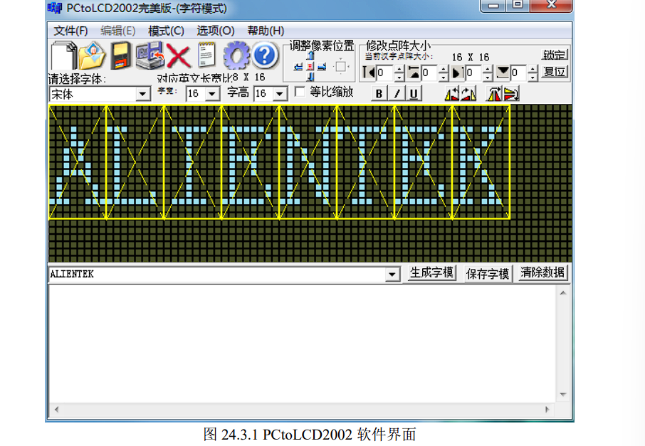

然后我们点击字模选项按钮 进入字模选项设置界面。
设置界面中点阵格式和取模方式等:
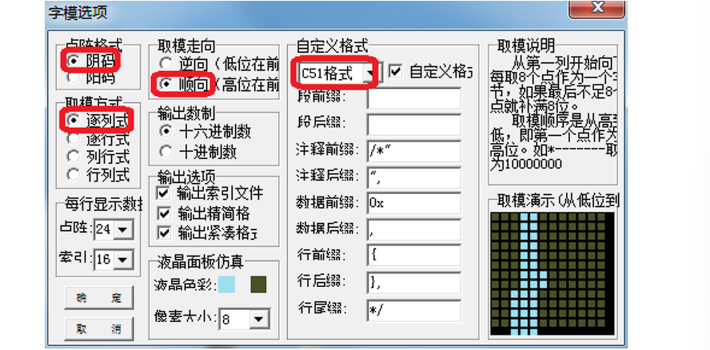

上图设置的取模方式，在右上角的取模说明里面有，即：从第一列开始向下每取 8 个点作为一个字节，如果最后不足 8 个点就补满 8 位。
取模顺序是从高到低，即第一个点作为最高位。如*-------取为 10000000。
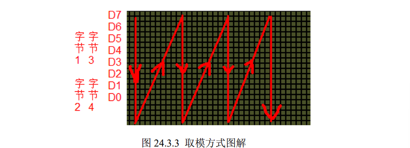

从上到下，从左到右，高位在前。
我们按这样的取模方式，然后把 ASCII 字符集按 12 * 6 大小、16 * 8、24 * 12 和 32 * 16 大小取模出来（对应汉字大小为 12 * 12、16 * 16、24 * 24 和 32 * 32，字符的只有汉字的一半大！）。
将取出的点阵数组保存在 font.h 里面，每个 12 * 6 的字符占用 12 个字节，每个 16 * 8 的字符占用 16 个字节，每个 24 * 12 的字符占用 36 个字节，每个 32 * 16 的字符占用 64 个字节。
font.h 中的字符集点阵数据数组 asc2_1206、asc2_1608、asc2_2412 和 asc2_3216就对应着这四个大小字符集，具体见 font.h 部分代码（该部分我们不再这里列出来了，请大家参考光盘里面的代码）。

最后就可以利用main.c进行测试了：

```C
1 #include "bsp_clk.h"
2 #include "bsp_delay.h"
3 #include "bsp_led.h"
4 #include "bsp_beep.h"
5 #include "bsp_key.h"
6 #include "bsp_int.h"
7 #include "bsp_uart.h"
8 #include "stdio.h"
9 #include "bsp_lcd.h"
10 #include "bsp_lcdapi.h"
11
12
13 /* 背景颜色数组 */
14 unsigned int backcolor[10] = {
15      LCD_BLUE, LCD_GREEN, LCD_RED, LCD_CYAN, LCD_YELLOW,
16      LCD_LIGHTBLUE, LCD_DARKBLUE, LCD_WHITE, LCD_BLACK, LCD_ORANGE
17
18 };
19
20 /*
21  * @description : main 函数
22  * @param : 无
23  * @return : 无
24  */
25 int main(void)
26 {
27  unsigned char index = 0;
28  unsigned char state = OFF;
29
30  int_init(); /* 初始化中断(一定要最先调用！) */
31  imx6u_clkinit(); /* 初始化系统时钟 */
32  delay_init(); /* 初始化延时 */
33  clk_enable(); /* 使能所有的时钟 */
34  led_init(); /* 初始化 led */
35  beep_init(); /* 初始化 beep */
36  uart_init(); /* 初始化串口，波特率 115200 */
37  lcd_init(); /* 初始化 LCD */
38
39  tftlcd_dev.forecolor = LCD_RED;
40  lcd_show_string(10,10,400,32,32,(char*)"ALPHA-IMX6ULELCD TEST");
41  lcd_draw_rectangle(10, 52, 1014, 290); /* 绘制矩形框 */
42  lcd_drawline(10, 52,1014, 290); /* 绘制线条 */
43  lcd_drawline(10, 290,1014, 52); /* 绘制线条 */
44  lcd_draw_Circle(512, 171, 119); /* 绘制圆形 */
46  while(1)
47  {
48      index++;
49      if(index == 10) index = 0;
50      lcd_fill(0, 300, 1023, 599, backcolor[index]);
51      lcd_show_string(800,10,240,32,32,(char*)"INDEX=");
52      lcd_shownum(896,10, index, 2, 32); /* 显示数字，叠加显示 */
53
54      state = !state;
55      led_switch(LED0,state);
56      delayms(1000); /* 延时一秒 */
57  }
58  return 0;
59 }
```
第 37 行调用函数 lcd_init 初始化 LCD。
第 39 行设置前景色，也就是画笔颜色为红色。
第 40~44 行都是调用 bsp_lcdapi.c 中的 API 函数在 LCD 上绘制各种图形和显示字符串。
第 46 行的 while 循环中每隔 1S 中就调用函数 lcd_fill 填充指定的区域，并且显示 index值。
main 函数很简单，重点就是初始化 LCD，然后调用 LCD 的 API 函数进行一些常用的操作，比如画线、画矩形、显示字符串和数字等等。

实际操作可以参考STM32 OLED屏幕使用。

### 24.4 编译下载
#### 24.4.1 编写 Makefile 和链接脚本

修改 Makefile 中的 TARGET 为 lcd，然后在 INCDIRS 和 SRCDIRS 中加入“bsp/lcd”。
连接脚本保持不变。

#### 24.4.2 

下载即可。

## 第二十五章 RTC实时时钟

实时时钟是很常用的一个外设，通过实时时钟我们就可以知道年、月、日和时间等信息。
因此在需要记录时间的场合就需要实时时钟，可以使用专用的实时时钟芯片来完成此功能，但是现在大多数的 MCU 或者 MPU 内部就已经自带了实时时钟外设模块。
比如 I.MX6U 内部的SNVS 就提供了 RTC 功能，本章我们就学习如何使用 I.MX6U 内部的 RTC 来完成实时时钟功能。

### 25.1 I.MX6U RTC 简介

如果学习过 STM32 的话应该知道，STM32 内部有一个 RTC 外设模块，这个模块需要一个32.768KHz 的晶振，对这个 RTC 模块进行初始化就可以得到一个实时时钟。
I.MX6U 内部也有个 RTC 模块，但是不叫作“RTC”，而是叫做“SNVS”，这一点要注意！
本章我们参考《I.MX6UL参考手册》，而不是《I.MX6ULL 参考手册》，因为《I.MX6ULL 参考手册》很多 SNVS 相关的寄存器并没有给出来，不知道是为何？
但是《I.MX6UL 参考手册》里面是完整的。
所以本章我们使用《I.MX6UL 参考手册》，如果直接在《I.MX6UL 参考手册》的书签里面找“RTC”相关的字眼是找不到的。
I.MX6U 系列的 RTC 是在 SNVS 里面，也就是《I.MX6UL 参考手册》的第46 章“Chapter 46 Secure Non-Volatile Storage(SNVS)”。

SNVS 直译过来就是安全的非易性存储，SNVS 里面主要是一些低功耗的外设，包括一个安全的实时计数器(RTC)、一个单调计数器(monotonic counter)和一些通用的寄存器，本章我们肯定只使用实时计数器(RTC)。
SNVS 里面的外设在芯片掉电以后由电池供电继续运行，I.MX6UALPHA 开发板上有一个纽扣电池，这个纽扣电池就是在主电源关闭以后为 SNVS 供电的，如图：

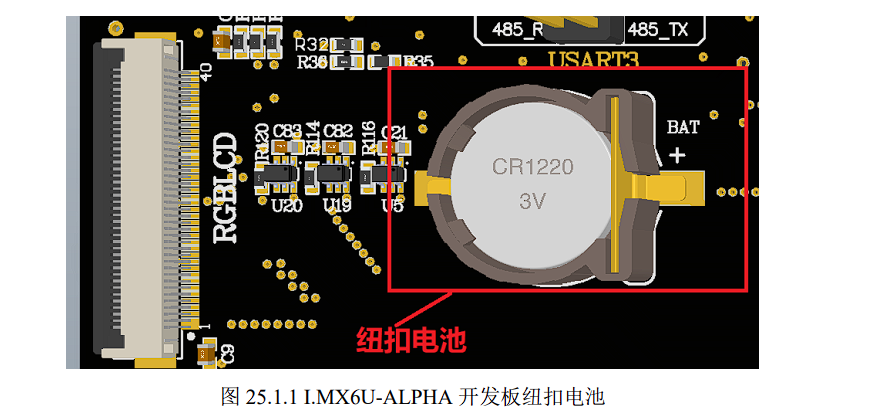

因为纽扣电池在掉电以后会继续给 SNVS 供电，因此实时计数器就会一直运行，这样的话时间信息就不会丢失，除非纽扣电池没电了。
在有纽扣电池作为后备电源的情况下，不管系统主电源是否断电，SNVS 都正常运行。

SNVS 有两部分：SNVS_HP 和 SNVS_LP，系统主电源断电以后 SNVS_HP 也会断电，但是在后备电源支持下，SNVS_LP 是不会断电的，而且 SNVS_LP是和芯片复位隔离开的，因此 SNVS_LP 相关的寄存器的值会一直保存着。

SNVS 分为两个子模块：SNVS_HP 和 SNVS_LP，也就是高功耗域(SNVS_HP)和低功耗域(SNVS_LP)，这两个域的电源来源如下：
**SNVS_LP**：专用的 always-powered-on 电源域，系统主电源和备用电源都可以为其供电。
**SNVS_HP**：系统(芯片)电源。

子模块电源如图：


各个部分功能如下：

①、VDD_HIGH_IN 是系统(芯片)主电源，这个电源会同时供给给 SNVS_HP 和 SNVS_LP。
②、VDD_SNVS_IN 是纽扣电池供电的电源，这个电源只会供给给 SNVS_LP，保证在系统主电源 VDD_HIGH_IN 掉电以后 SNVS_LP 会继续运行。
③、SNVS_HP 部分。
④、SNVS_LP 部分，此部分有个 SRTC，这个就是我们本章要使用的 RTC。

其实不管是 SNVS_HP 还是 SNVS_LP，其内部都有一个 SRTC，但是因为 SNVS_HP 在系统电源掉电以后就会关闭，所以我们本章使用的是 SNVS_LP 内部的 SRTC。
毕竟我们肯定都不想开发板或者设备每次关闭以后时钟都被清零，然后开机以后先设置时钟。

其实不管是 SNVS_HP 里面的 RTC，还是 SNVS_LP 里面的 SRTC，其本质就是一个定时器，和我们在第八章讲的 EPIT 定时器一样，只要给它提供时钟，它就会一直运行。
SRTC 需要外界提供一个 32.768KHz 的时钟，I.MX6U-ALPHA 核心板上的 32.768KHz 的晶振就是提供这个时钟的。

寄存器 SNVS_LPSRTCMR 和 SNVS_LPSRTCLR 保存着秒数，直接读取这两个寄存器的值就知道过了多长时间了。
一般以 1970 年 1 月 1 日为起点，加上经过的秒数即可得到现在的时间和日期，原理还是很简单的。
SRTC 也是带有闹钟功能的，可以在寄存器 SNVS_LPAR 中写入闹钟时间值，当时钟值和闹钟值匹配的时候就会产生闹钟中断，要使用时钟功能的话还需要进行一些设置，本章我们就不使用闹钟了。<span style="color:red">可以试试</span>

接下来我们看一下本章要用到的与 SRTC 相关的部分寄存器，首先是 **SNVS_HPCOMR** 寄存器，这个寄存器我们只用到了位：NPSWA_EN(bit31)，这个位是非特权软件访问控制位，如果非特权软件要访问 SNVS 的话此位必须为 1。

接下来看一下寄存器**SNVS_LPCR**寄存器，此寄存器也只用到了一个位：SRTC_ENV(bit0)，此位为 1 的话就使能 STC 计数器。

最后来看一下寄存器 SNVS_SRTCMR 和 SNVS_SRTCLR，这两个寄存器保存着 RTC 的秒数，按照NXP官方的《6UL参考手册》中的说法，SNVS_SRTCMR保存着高15位，SNVS_SRTCLR保存着低 32 位，因此 SRTC 的计数器一共是 47 位。
<span style="color:red">
但是！我在编写驱动的时候发现按照手册上说的去读取计数器值是错误的！
具体表现就是时间是混乱的，因此我在查找了 NXP 提供的 SDK 包中的 fsl_snvs_hp.c 以及 Linux 内核中的 rtcsnvs.c 这两个驱动文件以后发现《6UL 参考手册》上对 SNVS_SRTCMR 和 SNVS_SRTCLR 的解释是错误的。
经过查阅这两个文件，得到如下结论：
①、SRTC 计数器是 32 位的，不是 47 位！
②、SNVS_SRTCMR 的 bit14:0 这 15 位是 SRTC 计数器的高 15 位。
③、SNVS_SRTCLR 的 bit31:bit15 这 17 位是 SRTC 计数器的低 17 位。
</span>

按照上面的解释去读取这两个寄存器就可以得到正确的时间。
如果要调整时间的话也是向这两个寄存器写入要设置的时间值对应的秒数就可以了，但是要修改这两个寄存器的话要**先关闭 SRTC。**

关于 SNVS 中和 RTC 有关的寄存器就介绍到这里，关于这些寄存器详细的描述，请参考《I.MX6UL 参考手册》第 2931 页的 46.7 小节。
本章我们使用 I.MX6U 的 SNVS_LP 的 SRTC，配置步骤如下：

1. **初始化SNVS_SRTC**

初始化 SNVS_LP 中的 SRTC。

2. **设置RTC时间**

第一次使用 RTC 肯定要先设置时间。

3、**使能 RTC**

配置好 RTC 并设置好初始时间以后就可以开启 RTC 了。

### 25.2 硬件原理分析

本试验用到的资源如下：

①、指示灯 LED0。
②、RGB LCD 接口。
③、SRTC。

SRTC 需要外接一个 32.768KHz 的晶振，在 I.MX6U-ALPHA 核心板上就有这个 32.768KHz的晶振，原理图如图：

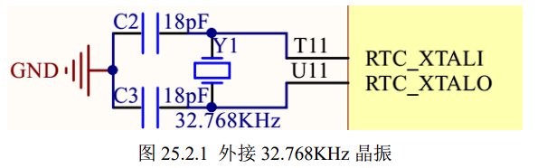

### 25.3 实验程序编写

开发板光盘-> 1、裸机例程-> 16_rtc。

#### 25.3.1 修改MCIMX6Y2.h

在第十三章移植的 NXP 官方 SDK 包是针对 I.MX6ULL 编写的，因此文件 MCIMX6Y2.h中的结构体 SNVS_Type 里面的寄存器是不全的，我们需要在其中加入本章实验所需要的寄存器，修改 SNVS_Type 为如下所示：

```C
1 typedef struct {
2 __IO uint32_t HPLR;
3 __IO uint32_t HPCOMR;
4 __IO uint32_t HPCR;
5 __IO uint32_t HPSICR;
6 __IO uint32_t HPSVCR;
7 __IO uint32_t HPSR;
8 __IO uint32_t HPSVSR;
9 __IO uint32_t HPHACIVR;
10 __IO uint32_t HPHACR;
11 __IO uint32_t HPRTCMR;
12 __IO uint32_t HPRTCLR;
13 __IO uint32_t HPTAMR;
14 __IO uint32_t HPTALR;
15 __IO uint32_t LPLR;
16 __IO uint32_t LPCR;
17 __IO uint32_t LPMKCR;
18 __IO uint32_t LPSVCR;
19 __IO uint32_t LPTGFCR;
20 __IO uint32_t LPTDCR;
21 __IO uint32_t LPSR;
22 __IO uint32_t LPSRTCMR;
23 __IO uint32_t LPSRTCLR;
24 __IO uint32_t LPTAR;
25 __IO uint32_t LPSMCMR;
26 __IO uint32_t LPSMCLR;
27 }SNVS_Type;
```

如图：
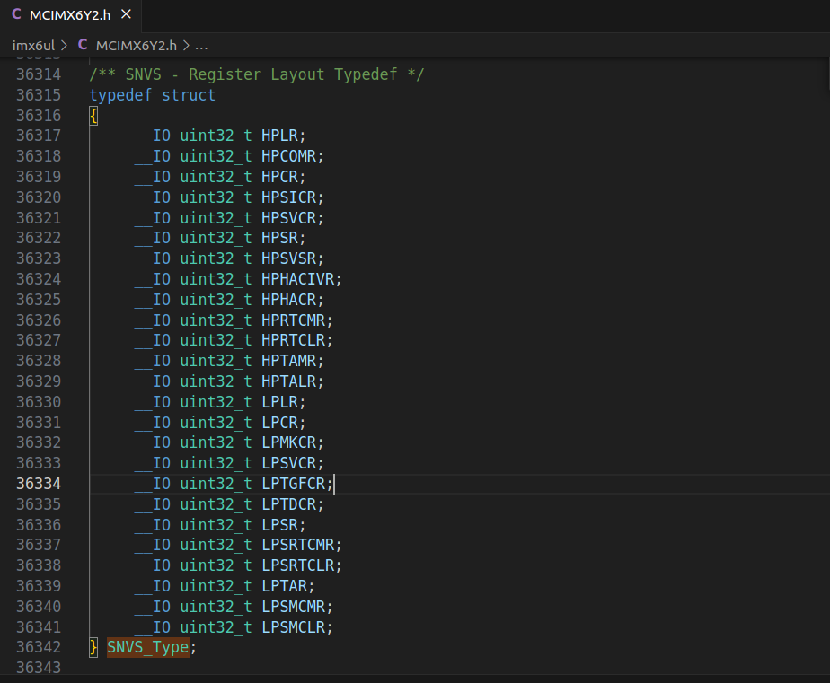

#### 25.3.2 编写实验程序

本章实验在上一章例程的基础上完成，更改工程名字为“rtc”，然后在 bsp 文件夹下创建名为“rtc”的文件夹.
然后在 bsp/rtc 中新建 bsp_rtc.c 和 bsp_rtc.h 这两个文件。
```C
1 #ifndef _BSP_RTC_H
2 #define _BSP_RTC_H
3 /***************************************************************
4 Copyright © zuozhongkai Co., Ltd. 1998-2019. All rights reserved
5 文件名 : bsp_rtc.h
6 作者 : 左忠凯
7 版本 : V1.0
8 描述 : RTC 驱动头文件。
9 其他 : 无
10 论坛 : www.openedv.com
11 日志 : 初版 V1.0 2019/1/3 左忠凯创建
12 ***************************************************************/
13 #include "imx6ul.h"
14
15 /* 相关宏定义 */
16 #define SECONDS_IN_A_DAY (86400) /* 一天 86400 秒 */
17 #define SECONDS_IN_A_HOUR (3600) /* 一个小时 3600 秒 */
18 #define SECONDS_IN_A_MINUTE (60) /* 一分钟 60 秒 */
19 #define DAYS_IN_A_YEAR (365) /* 一年 365 天 */
20 #define YEAR_RANGE_START (1970) /* 开始年份 1970 年 */
21 #define YEAR_RANGE_END (2099) /* 结束年份 2099 年 */
22
23 /* 时间日期结构体 */
24 struct rtc_datetime
25 {
26 unsigned short year; /* 范围为:1970 ~ 2099 */
27 unsigned char month; /* 范围为:1 ~ 12 */
28 unsigned char day; /* 范围为:1 ~ 31 (不同的月，天数不同).*/
29 unsigned char hour; /* 范围为:0 ~ 23 */
30 unsigned char minute; /* 范围为:0 ~ 59 */
31 unsigned char second; /* 范围为:0 ~ 59 */
32 };
33
34 /* 函数声明 */
35 void rtc_init(void);
36 void rtc_enable(void);
37 void rtc_disable(void);
38 unsigned int rtc_coverdate_to_seconds(struct rtc_datetime *datetime);
39 unsigned int rtc_getseconds(void);
40 void rtc_setdatetime(struct rtc_datetime *datetime);
41 void rtc_getdatetime(struct rtc_datetime *datetime);
42
43 #endif
```
第 16 到 21 行定义了一些宏，比如一天多少秒、一小时多少秒等等，这些宏将用于将秒转换为时间，或者将时间转换为秒。
第 24 行定义了一个结构体 rtc_datetime，此结构体用于描述日期和时间参数。剩下的就是一些函数声明了，很简单。

在文件 bsp_rtc.c 中输入如下内容：
```C
1 #include "bsp_rtc.h"
2 #include "stdio.h"
3
4   /*
5    * @description :初始化 RTC
6    */
7   void rtc_init(void)
8   {
9   /*
10   * 设置 HPCOMR 寄存器
11   * bit[31] 1 : 允许访问 SNVS 寄存器，一定要置 1
12   */
13      SNVS->HPCOMR |= (1 << 31);
14
15  #if 0
16      struct rtc_datetime rtcdate;
17
18      rtcdate.year = 2018U;
19      rtcdate.month = 12U;
20      rtcdate.day = 13U;
21      rtcdate.hour = 14U;
22      rtcdate.minute = 52;
23      rtcdate.second = 0;
24      rtc_setDatetime(&rtcdate); /* 初始化时间和日期 */
25  #endif
26      rtc_enable(); /* 使能 RTC */
27  }
28
29 /*
30  * @description : 开启 RTC
31  */
32 void rtc_enable(void)
33 {
34 /*
35  * LPCR 寄存器 bit0 置 1，使能 RTC
36  */
37  SNVS->LPCR |= 1 << 0;
38  while(!(SNVS->LPCR & 0X01)); /* 等待使能完成 */
39
40  }
41 
42 /*
43  * @description : 关闭 RTC
44  */
45  void rtc_disable(void)
46  {
47  /*
48   * LPCR 寄存器 bit0 置 0，关闭 RTC
49   */
50   SNVS->LPCR &= ~(1 << 0);
51   while(SNVS->LPCR & 0X01); /* 等待关闭完成*/
52  }
53
54 /*
55  * @description : 判断指定年份是否为闰年，闰年条件如下:
56  * @param – year : 要判断的年份
57  * @return : 1 是闰年，0 不是闰年
58  */
59 unsigned char rtc_isleapyear(unsigned short year)
60 {
61  unsigned char value=0;
62
63  if(year % 400 == 0) //四百年再闰
64  value = 1;
65  else
66  {
67      if((year % 4 == 0) && (year % 100 != 0)) //四年一闰 百年不闰
68          value = 1;
69      else
70          value = 0;
71  }
72  return value;
73 }
74 
75 /*
76  * @description : 将时间转换为秒数
77  * @param – datetime : 要转换日期和时间。
78  * @return : 转换后的秒数
79  */
80 unsigned int rtc_coverdate_to_seconds(struct rtc_datetime *datetime)
81 {
82  unsigned short i = 0;
83  unsigned int seconds = 0;
84  unsigned int days = 0;
85  unsigned short monthdays[] = {0U, 0U, 31U, 59U, 90U, 120U, 151U,181U, 212U, 243U, 273U, 304U, 334U};
86
87  for(i = 1970; i < datetime->year; i++)
88  {
89      days += DAYS_IN_A_YEAR; /* 平年，每年 365 天 */
90      if(rtc_isleapyear(i)) days += 1; /* 闰年多加一天 */
91  }
92
93  days += monthdays[datetime->month];
94  if(rtc_isleapyear(i) && (datetime->month >= 3)) days += 1;
95
96  days += datetime->day - 1;
97
98  seconds = days * SECONDS_IN_A_DAY +
99  datetime->hour * SECONDS_IN_A_HOUR +
100 datetime->minute * SECONDS_IN_A_MINUTE +
101 datetime->second;
102
103 return seconds;
104 }
105
106 /*
107  * @description : 设置时间和日期
108  * @param – datetime : 要设置的日期和时间
109  * @return : 无
110  */
111 void rtc_setdatetime(struct rtc_datetime *datetime)
112 {
113
114     unsigned int seconds = 0;
115     unsigned int tmp = SNVS->LPCR;
116 
117     rtc_disable(); /* 设置寄存器 HPRTCMR 和 HPRTCLR 前要先关闭 RTC */
118     /* 先将时间转换为秒 */
119     seconds = rtc_coverdate_to_seconds(datetime);
120     SNVS->LPSRTCMR = (unsigned int)(seconds >> 17); /* 设置高 17 位 */
121     SNVS->LPSRTCLR = (unsigned int)(seconds << 15); /* 设置低 15 位 */
122
123     /* 如果此前 RTC 是打开的在设置完 RTC 时间以后需要重新打开 RTC */
124     if (tmp & 0x1)
125     rtc_enable();
126 }
127
128 /*
129  * @description : 将秒数转换为时间
130  * @param - seconds : 要转换的秒数
131  * @param – datetime : 转换后的日期和时间
132  * @return : 无
133  */
134 void rtc_convertseconds_to_datetime(unsigned int seconds,struct rtc_datetime *datetime)
135 {
136     unsigned int x;
137     unsigned int secondsRemaining, days;
138     unsigned short daysInYear;
139
140     /* 每个月的天数 */
141     unsigned char daysPerMonth[] = {0U, 31U, 28U, 31U, 30U, 31U,30U, 31U, 31U, 30U, 31U, 30U, 31U};
142
143     secondsRemaining = seconds; /* 剩余秒数初始化 */
144     days = secondsRemaining / SECONDS_IN_A_DAY + 1;
145     secondsRemaining = secondsRemaining % SECONDS_IN_A_DAY;
146
147     /* 计算时、分、秒 */
148     datetime->hour = secondsRemaining / SECONDS_IN_A_HOUR;
149     secondsRemaining = secondsRemaining % SECONDS_IN_A_HOUR;
150     datetime->minute = secondsRemaining / 60;
151     datetime->second = secondsRemaining % SECONDS_IN_A_MINUTE;
152
153     /* 计算年 */
154     daysInYear = DAYS_IN_A_YEAR;
155     datetime->year = YEAR_RANGE_START;
156     while(days > daysInYear)
157     {
158     /* 根据天数计算年 */
159         days -= daysInYear;
160         datetime->year++;
161
162     /* 处理闰年 */
163         if (!rtc_isleapyear(datetime->year))
164             daysInYear = DAYS_IN_A_YEAR;
165         else /*闰年，天数加一 */
166             daysInYear = DAYS_IN_A_YEAR + 1;
167     }
168     /*根据剩余的天数计算月份 */
169     if(rtc_isleapyear(datetime->year)) /* 如果是闰年的话 2 月加一天 */
170         daysPerMonth[2] = 29;
171     for(x = 1; x <= 12; x++)
172     {
173         if (days <= daysPerMonth[x])
174         {
175             datetime->month = x;
176             break;
177         }
178     else
179         {
180             days -= daysPerMonth[x];
181         }
182     }
183         datetime->day = days;
184 }
185
186 /*
187  * @description : 获取 RTC 当前秒数
188  * @param : 无
189  * @return : 当前秒数
190  */
191 unsigned int rtc_getseconds(void)
192 {
193     unsigned int seconds = 0;
194
195     seconds = (SNVS->LPSRTCMR << 17) | (SNVS->LPSRTCLR >> 15);
196     return seconds;
197 }
198
199 /*
200  * @description : 获取当前时间
201  * @param – datetime : 获取到的时间，日期等参数
202  * @return : 无
203  */
204 void rtc_getdatetime(struct rtc_datetime *datetime)
205 {
206     unsigned int seconds = 0;
207     seconds = rtc_getseconds();
208     rtc_convertseconds_to_datetime(seconds, datetime);
209 }
```
文件 bsp_rtc.c 里面一共有 9 个函数，依次来看一下这些函数的意义。

函数 rtc_init 明显是初始化rtc的，主要是使能RTC，也可以在rtc_init函数里面设置时间。
函数 rtc_enable和rtc_disable分别是 RTC 的使能和禁止函数。
函数 rtc_isleapyear 用于判断某一年是否为闰年。
函数 rtc_coverdate_to_seconds 负责将给定的日期和时间信息转换为对应的秒数。
函数 rtc_setdatetime用于设置时间，也就是设置寄存器 SNVS_LPSRTCMR 和 SNVS_LPSRTCLR 。 
函数 rtc_convertseconds_to_datetime 用于将给定的秒数转换为对应的时间值。
函数 rtc_getseconds 获取 SRTC 当前秒数，其实就是读取寄存器 SNVS_LPSRTCMR 和 SNVS_LPSRTCLR，然后将其结合成 32 位的值。
最后一个函数 rtc_getdatetime 是获取时间值。

我们在 main 函数里面先初始化 RTC，然后进入 3S 倒计时， 如果这 3S 内按下了 KEY0 按键，那么就设置 SRTC 的日期。
如果 3S 倒计时结束以后没有按下 KEY0，也就是没有设置 SRTC时间的话就进入 while 循环，然后读取 RTC 的时间值并且显示在 LCD 上，在文件 main.c 中输
入如下所示内容：

```C
1  #include "bsp_clk.h"
2  #include "bsp_delay.h"
3  #include "bsp_led.h"
4  #include "bsp_beep.h"
5  #include "bsp_key.h"
6  #include "bsp_int.h"
7  #include "bsp_uart.h"
8  #include "bsp_lcd.h"
9  #include "bsp_lcdapi.h"
10 #include "bsp_rtc.h"
11 #include "stdio.h"
12
13 /*
14  * @description : main 函数
15  * @param : 无
16  * @return : 无
17  */
18 int main(void)
19 {
20  unsigned char key = 0;
21  int t = 0;
22  int i = 3; /* 倒计时 3S */
23  char buf[160];
24  struct rtc_datetime rtcdate;
25  unsigned char state = OFF;
26
27  int_init(); /* 初始化中断(一定要最先调用！) */
28  imx6u_clkinit(); /* 初始化系统时钟 */
29  delay_init(); /* 初始化延时 */
30  clk_enable(); /* 使能所有的时钟 */
31  led_init(); /* 初始化 led */
32  beep_init(); /* 初始化 beep */
33  uart_init(); /* 初始化串口，波特率 115200 */
34  lcd_init(); /* 初始化 LCD */
35  rtc_init(); /* 初始化 RTC */
36
37  tftlcd_dev.forecolor = LCD_RED;
38  lcd_show_string(50, 10, 400, 24, 24, (char*)"ALPHA-IMX6UL RTC TEST");/* 显示字符串 */
39 tftlcd_dev.forecolor = LCD_BLUE;
40  memset(buf, 0, sizeof(buf));
41
42 while(1)
43 {
44  if(t==100) /* 1s 时间到了 */
45  {
46      t=0;
47      printf("will be running %d s......\r", i);
48
49      lcd_fill(50, 40,370, 70, tftlcd_dev.backcolor); /* 清屏 */
50      sprintf(buf, "will be running %ds......", i);
51      lcd_show_string(50, 40, 300, 24, 24, buf);
52      i--;
53      if(i < 0)
54      break;
55  }
56
57  key = key_getvalue();
58  if(key == KEY0_VALUE)
59  {
60      rtcdate.year = 2018;
61      rtcdate.month = 1;
62      rtcdate.day = 15;
63      rtcdate.hour = 16;
64      rtcdate.minute = 23;
65      rtcdate.second = 0;
66      rtc_setdatetime(&rtcdate); /* 初始化时间和日期 */
67      printf("\r\n RTC Init finish\r\n");
68      break;
69  }
70
71  delayms(10);
72  t++;
73 }
74 tftlcd_dev.forecolor = LCD_RED;
75 lcd_fill(50, 40,370, 70, tftlcd_dev.backcolor); /* 清屏 */
76 lcd_show_string(50, 40, 200, 24, 24, (char*)"Current Time:");
77 tftlcd_dev.forecolor = LCD_BLUE;
78
79 while(1)
80 {
81  rtc_getdatetime(&rtcdate);
82  sprintf(buf,"%d/%d/%d %d:%d:%d",rtcdate.year, rtcdate.month,rtcdate.day, rtcdate.hour, rtcdate.minute, rtcdate.second);
83  lcd_fill(50,70, 300,94, tftlcd_dev.backcolor);
84  lcd_show_string(50,70,250,24,24,(char*)buf); /* 显示字符串 */
85
86  state = !state;
87  led_switch(LED0,state);
88  delayms(1000); /* 延时一秒 */
89 }
90  return 0;
91 }
```

### 25.4 编译下载
 
修改 Makefile 中的 TARGET 为 rtc，然后在在 INCDIRS 和 SRCDIRS 中加入“bsp/rtc”

lds保持不变

下载到SD卡运行即可

补充：

多个if判断语句推荐使用if-else或者switch-case(更高效)

```c
enum State { IDLE, RUNNING, STOPPED };
enum State current_state = IDLE;

switch (current_state) {
    case IDLE:
        // 处理空闲状态
        break;
    case RUNNING:
        // 处理运行状态
        break;
    case STOPPED:
        // 处理停止状态
        break;
    default:
        // 错误处理
        break;
}
```

## 第二十六章 IIC通信

I2C 是最常用的通信接口，众多的传感器都会提供 I2C 接口来和主控相连，比如陀螺仪、加速度计、触摸屏等等。
所以 I2C 是做嵌入式开发必须掌握的，I.MX6U 有 4 个 I2C 接口，可以通过这 4 个 I2C 接口来连接一些 I2C 外设。
I.MX6U-ALPHA 使用 I2C1 接口连接了一个距离传感器 AP3216C，本章我们就来学习如何使用 I.MX6U 的 I2C 接口来驱动 AP3216C，读取AP3216C 的传感器数据。

### 26.1 IIC & AP3216简介

#### 26.1.1 IIC简介

I2C 是很常见的一种总线协议，I2C 是 NXP 公司设计的，I2C 使用两条线在主控制器和从机之间进行数据通信。
一条是 SCL(串行时钟线)，另外一条是 SDA(串行数据线)，这两条数据线需要接上拉电阻，总线空闲的时候 SCL 和 SDA 处于高电平。
I2C 总线标准模式下速度可以达到 100Kb/S，快速模式下可以达到 400Kb/S。
I2C 总线工作是按照一定的协议来运行的，接下来就看一下 I2C 协议。

I2C 是支持多从机的，也就是一个 I2C 控制器下可以挂多个 I2C 从设备，这些不同的 I2C从设备有不同的器件地址，这样 I2C 主控制器就可以通过 I2C 设备的器件地址访问指定的 I2C设备了，一个 I2C 总线连接多个 I2C 设备如图所示：

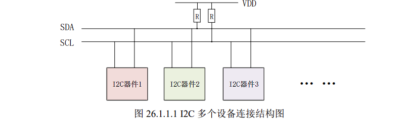

SDA 和 SCL 这两根线必须要接一个上拉电阻，一般是 4.7K。
其余的 I2C 从器件都挂接到 SDA 和 SCL 这两根线上，这样就可以通过 SDA 和 SCL 这两根线来访问多个 I2C设备。

接下来看一下 I2C 协议有关的术语：

1. **起始位**

顾名思义，也就是 I2C 通信起始标志，通过这个起始位就可以告诉 I2C 从机，“我”要开始进行 I2C 通信了。在 SCL 为高电平的时候，SDA 出现下降沿就表示为起始位。

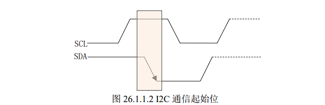

2. **停止位**

停止位就是停止 I2C 通信的标志位，和起始位的功能相反。
在 SCL 位高电平的时候，SDA出现上升沿就表示为停止位。


3. **数据传输**

I2C 总线在数据传输的时候要保证在 SCL 高电平期间，SDA 上的数据稳定，因此 SDA 上的数据变化只能在 SCL 低电平期间发生


4. **应答信号**

当 I2C 主机发送完 8 位数据以后会将 SDA 设置为输入状态，等待 I2C 从机应答，也就是等到 I2C 从机告诉主机它接收到数据了。
应答信号是由从机发出的，主机需要提供应答信号所需的时钟，主机发送完 8 位数据以后紧跟着的一个时钟信号就是给应答信号使用的。
从机通过将 SDA 拉低来表示发出应答信号，表示通信成功，否则表示通信失败。

5. **IIC写时序**

主机通过 I2C 总线与从机之间进行通信不外乎两个操作：写和读，I2C 总线单字节写时序如图：

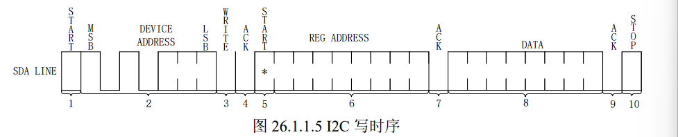

I2C 写时序，我们来看一下写时序的具体步骤：

1、开始信号。

2、发送 I2C 设备地址，每个 I2C 器件都有一个设备地址，通过发送具体的设备地址来决定访问哪个 I2C 器件。
这是一个 8 位的数据，其中高 7 位是设备地址，最后 1 位是读写位，为1 的话表示这是一个读操作，为 0 的话表示这是一个写操作。

3、 I2C 器件地址后面跟着一个读写位，为 0 表示写操作，为 1 表示读操作。

4、从机发送的 ACK 应答信号。

5、重新发送开始信号。

6、发送要写写入数据的寄存器地址。

7、从机发送的 ACK 应答信号。

8、发送要写入寄存器的数据。

9、从机发送的 ACK 应答信号。

10、停止信号。

6. **IIC读时序**

I2C 总线单字节读时序如图所示：（指定地址读）

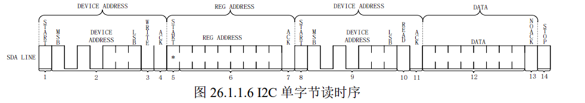

I2C 单字节读时序比写时序要复杂一点，读时序分为 4 大步，第一步是发送设备地址，第二步是发送要读取的寄存器地址(移动寄存器指针位置)，第三步重新发送设备地址，最后一步就是 I2C 从器件输出要读取的寄存器值，我们具体来看一下这几步。

1、主机发送起始信号。
2、主机发送要读取的 I2C 从设备地址。
3、读写控制位，因为是向 I2C 从设备发送数据，因此是写信号。
4、从机发送的 ACK 应答信号。
5、重新发送 START 信号。
6、主机发送要读取的寄存器地址。
7、从机发送的 ACK 应答信号。
8、重新发送 START 信号。
9、重新发送要读取的 I2C 从设备地址
10、读写控制位，这里是读信号，表示接下来是从 I2C 从设备里面读取数据。
11、从机发送的 ACK 应答信号。
12、从 I2C 器件里面读取到的数据。
13、主机发出 NO ACK 信号，表示读取完成，不需要从机再发送 ACK 信号了。
14、主机发出 STOP 信号，停止 I2C 通信。

7. **IIC多字节读写时序**

有时候我们需要读写多个字节，多字节读写时序和单字节的基本一致，只是在读写数据的时候可以连续发送多个自己的数据，其他的控制时序都是和单字节一样的。

主机接收完，发送应答信号ACK(拉低)，就继续接受后面的数据。
如果不发送应答信号，保持为高，不接受数据了，从机不再发，主机直接STOP即可。

IIC时序详情见STM32笔记

#### 26.1.2 IMX6ULL IIC简介

I.MX6U 提供了 4 个 I2C 外设，通过这四个 I2C 外设即可完成与 I2C 从器件进行通信，I.MX6U 的 I2C 外设特性如下：

①、与标准 I2C 总线兼容。
②、多主机运行
③、软件可编程的 64 中不同的串行时钟序列。
④、软件可选择的应答位。
⑤、开始/结束信号生成和检测。
⑥、重复开始信号生成。
⑦、确认位生成。
⑧、总线忙检测

I.MX6U 的 I2C 支持两种模式：标准模式和快速模式，标准模式下 I2C 数据传输速率最高是 100Kbits/s，在快速模式下数据传输速率最高为 400Kbits/s。

我们接下来看一下 I2C 的几个重要的寄存器，首先看一下 I2Cx_IADR(x=1~4)寄存器，这是I2C 的地址寄存器，此寄存器结构如图：

<span style="color:red"><b> I2Cx_IADR </b></span>

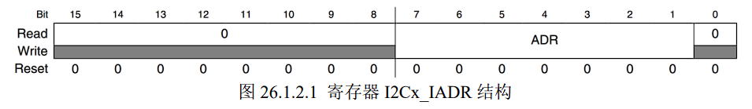

寄存器 I2Cx_IADR 只有 ADR(bit7:1)位有效，用来保存 I2C 从设备地址数据。当我们要访问某个 I2C 从设备的时候就需要将其设备地址写入到 ADR 里面。

接下来看一下寄存器I2Cx_IFDR，这个是 I2C 的分频寄存器，寄存器结构如图

<span style="color:red"><b> I2Cx_IFDR </b></span>

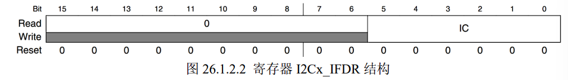

寄存器 I2Cx_IFDR 也只有 IC(bit5:0)这个位，用来设置 I2C 的波特率，I2C 的时钟源可以选择 IPG_CLK_ROOT=66MHz，通过设置 IC 位既可以得到想要的 I2C 波特率。
IC 位可选的设置如图所示：

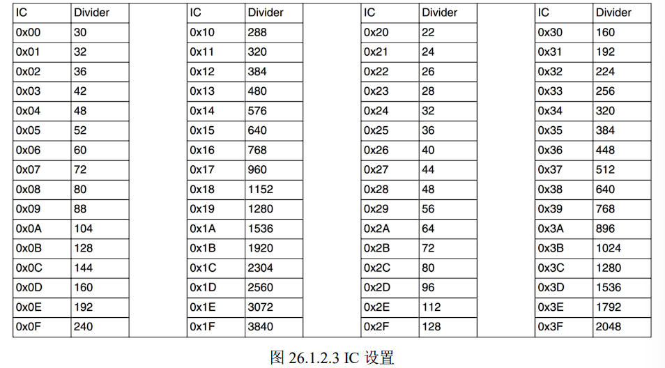

不像其他外设的分频设置一样可以随意设置，图中列出了 IC 的所有可选值。
比如现在I2C的时钟源为66MHz，我们要设置I2C的波特率为100KHz，那么IC就可以设置为0X15，也就是 640 分频。66000000/640=103.125KHz≈100KHz。

IIC的时钟配置
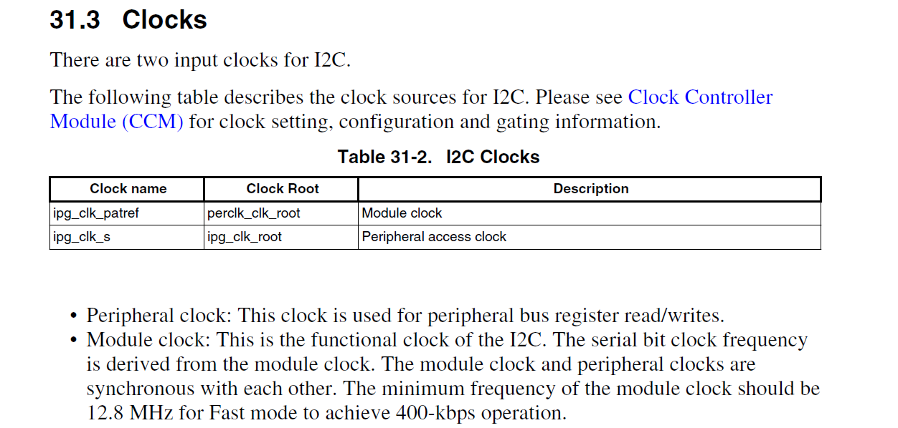

接下来看一下寄存器 I2Cx_I2CR，这个是 I2C 控制寄存器

<span style="color:red"><b> I2Cx_I2CR </b></span>

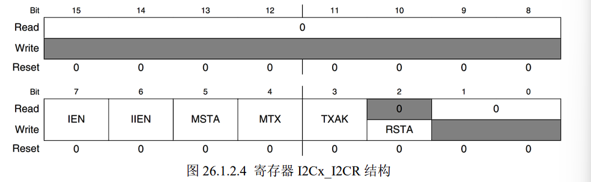

IEN(bit7)：I2C 使能位，为 1 的时候使能 I2C，为 0 的时候关闭 I2C。

IIEN(bit6)：I2C 中断使能位，为 1 的时候使能 I2C 中断，为 0 的时候关闭 I2C 中断。

MSTA(bit5)：主从模式选择位，设置 IIC 工作在主模式还是从模式，为 1 的时候工作在主模式，为 0 的时候工作在从模式。

MTX(bit4)：传输方向选择位，用来设置是进行发送还是接收，为 0 的时候是接收，为 1 的时候是发送。

TXAK(bit3)：传输应答位使能，为 0 的话发送 ACK 信号，为 1 的话发送 NO ACK 信号。

RSTA(bit2)：重复开始信号，为 1 的话产生一个重新开始信号。

接下来看一下寄存器 I2Cx_I2SR，这个是 I2C 的状态寄存器

<span style="color:red"><b> I2Cx_I2SR </b></span>

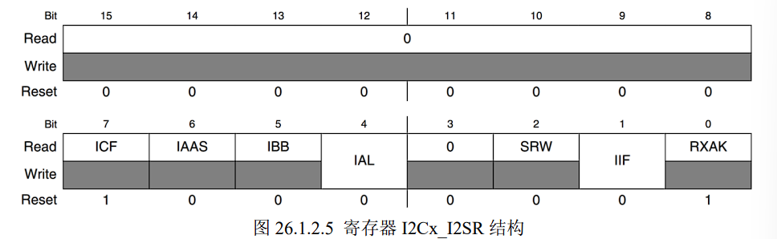

ICF(bit7)：数据传输状态位，为 0 的时候表示数据正在传输，为 1 的时候表示数据传输完成。

IAAS(bit6)：当为 1 的时候表示 I2C 地址，也就是 I2Cx_IADR 寄存器中的地址是从设备地址。

IBB(bit5)：I2C 总线忙标志位，当为 0 的时候表示 I2C 总线空闲，为 1 的时候表示 I2C 总线忙。

IAL(bit4)：仲裁丢失位，为 1 的时候表示发生仲裁丢失。

SRW(bit2)：从机读写状态位，当 I2C 作为从机的时候使用，此位用来表明主机发送给从机的是读还是写命令。为 0 的时候表示主机要向从机写数据，为 1 的时候表示主机要从从机读取数据。

IIF(bit1)：I2C 中断挂起标志位，当为 1 的时候表示有中断挂起，此位需要软件清零。

RXAK(bit0)：应答信号标志位，为 0 的时候表示接收到 ACK 应答信号，为 1 的话表示检测到 NO ACK 信号。

<span style="color:red"><b> I2Cx_I2DR </b></span>

最后一个寄存器就是 I2Cx_I2DR，这是 I2C 的数据寄存器，此寄存器只有低 8 位有效，当要发送数据的时候将要发送的数据写入到此寄存器，如果要接收数据的话直接读取此寄存器即可得到接收到的数据。

关于 I2C 的寄存器就介绍到这里，关于这些寄存器详细的描述，请参考《I.MX6ULL 参考手册》第 1462 页的 31.7 小节。

#### 26.1.3 AP3216C 简介

I.MX6U-ALPHA 开发板上通过 I2C1 连接了一个三合一环境传感器：AP3216C，AP3216C是由敦南科技推出的一款传感器，其支持环境光强度(ALS)、接近距离(PS)和红外线强度(IR)这三个环境参数检测。

该芯片可以通过 IIC 接口与主控制相连，并且支持中断，AP3216C 的特点如下：

①、I2C 接口，快速模式下波特率可以到 400Kbit/S
②、多种工作模式选择：ALS、PS+IR、ALS+PS+IR、PD 等等。
③、内建温度补偿电路。
④、宽工作温度范围(-30°C ~ +80°C)。
⑤、超小封装，4.1mm x 2.4mm x 1.35mm
⑥、环境光传感器具有 16 位分辨率。
⑦、接近传感器和红外传感器具有 10 位分辨率。

AP3216C 常被用于手机、平板、导航设备等，其内置的接近传感器可以用于检测是否有物体接近，比如手机上用来检测耳朵是否接触听筒，如果检测到的话就表示正在打电话，手机就会关闭手机屏幕以省电。
也可以使用环境光传感器检测光照强度，可以实现自动背光亮度调节。

AP3216C结构如图：

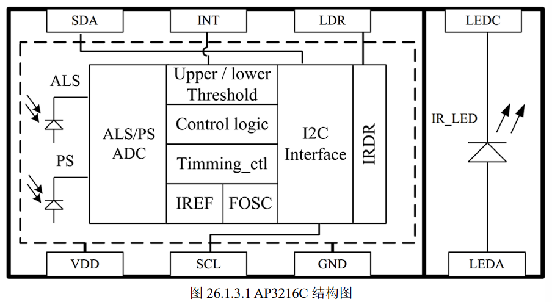

AP3216 的设备地址为 0X1E，同几乎所有的 I2C 从器件一样，AP3216C 内部也有一些寄存器，通过这些寄存器我们可以配置 AP3216C 的工作模式，并且读取相应的数据。
AP3216C 我们用的寄存器如表所示：

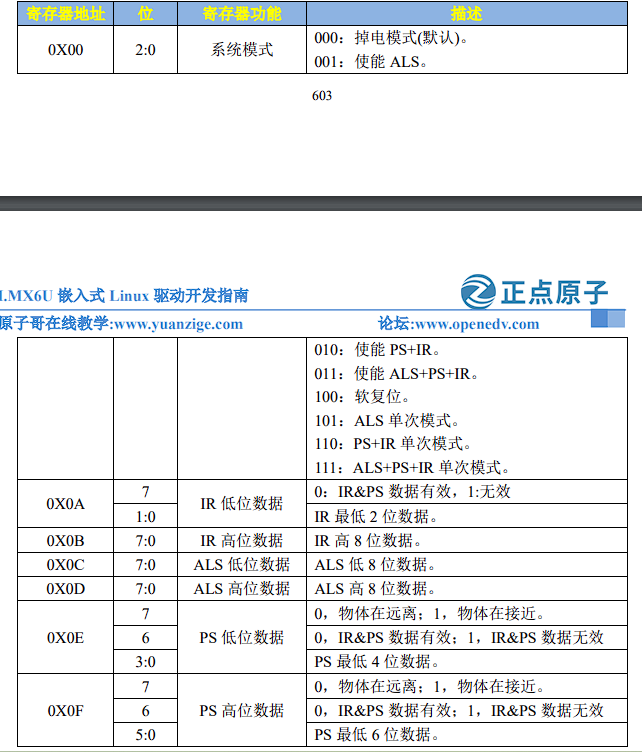

0X00 这个寄存器是模式控制寄存器，用来设置 AP3216C 的工作模式，一般开始先将其设置为 0X04，也就是先软件复位一次 AP3216C。

接下来根据实际使用情况选择合适的工作模式，比如设置为 0X03，也就是开启 ALS+PS+IR.

从 0X0A~0X0F 这 6 个寄存器就是数据寄存器，保存着 ALS、PS 和 IR 这三个传感器获取到的数据值。
如果同时打开 ALS、PS 和 IR 则读取间隔最少要 112.5ms，因为 AP3216C 完成一次转换需要 112.5ms。

关于 AP3216C的介绍就到这里，如果要想详细的研究此芯片的话，请大家自行查阅其数据手册。
<span style="color:blue"> 英文阅读以及数据手册文档阅读 </span>

本章实验中我们通过 I.MX6U 的 I2C1 来读取 AP3216C 内部的 ALS、PS 和 IR 这三个传感器的值，并且在 LCD 上显示。
开机会先检测 AP3216C 是否存在，一般的芯片是有个 ID 寄存器，通过读取 ID 寄存器判断 ID 是否正确就可以检测芯片是否存在。
但是 AP3216C 没有 ID 寄存器，所以我们就通过向寄存器 0X00 写入一个值，然后再读取 0X00 寄存器，判断读出得到值和写入的是否相等，如果相等就表示 AP3216C 存在，否则的话 AP3216C 就不存在。

本章配置如下：

1. **初始化相应的IO设备**

初始化 I2C1 相应的 IO，设置其复用功能，如果要使用 AP3216C 中断功能的话，还需要设置 AP3216C 的中断 IO。

2. **初始化IIC1**

初始化 I2C1 接口，设置波特率。

3. **初始化AP3216C**

初始化 AP3216C，读取 AP3216C 的数据。

### 26.2 硬件原理分析

本试验用到的资源如下：
①、指示灯 LED0。
②、RGB LCD 屏幕。
③、AP3216C
④、串口


AP3216C 使用的是 I2C1，其中 I2C1_SCL 使用的 UART4_TXD 这个IO、I2C1_SDA 使用的是 UART4_R XD 这个 IO。

### 26.3 实验程序编写

本实验对应的例程路径为：开发板光盘-> 1、裸机例程-> 17_i2c。

本章实验在上一章例程的基础上完成，更改工程名字为“ap3216c”，然后在 bsp 文件夹下创建名为“i2c”和“ap3216c”的文件夹。
在 bsp/i2c 中新建 bsp_i2c.c 和 bsp_i2c.h 这两个文件
在 bsp/ap3216c 中新建 bsp_ap3216c.c 和 bsp_ap3216c.h两个文件。
bsp_i2c.c 和 bsp_i2c.h 是I.MX6U 的 I2C 文件，bsp_ap3216c.c 和 bsp_ap3216c.h 是 AP3216C 的驱动文件。

```C
bsp_i2c.h

1  #ifndef _BSP_I2C_H
2  #define _BSP_I2C_H
3  /***************************************************************
4  Copyright © zuozhongkai Co., Ltd. 1998-2019. All rights reserved.
5  文件名 : bsp_i2c.h
6  作者 : 左忠凯
7  版本 : V1.0
8  描述 : IIC 驱动文件。
9  其他 : 无
10 论坛 : www.openedv.com
11 日志 : 初版 V1.0 2019/1/15 左忠凯创建
12 ***************************************************************/
13 #include "imx6ul.h"
14
15 /* 相关宏定义 */
16 #define I2C_STATUS_OK    (0)
17 #define I2C_STATUS_BUSY  (1)
18 #define I2C_STATUS_IDLE  (2)
19 #define I2C_STATUS_NAK   (3)
20 #define I2C_STATUS_ARBITRATIONLOST (4)
21 #define I2C_STATUS_TIMEOUT   (5)
22 #define I2C_STATUS_ADDRNAK   (6)
23
24 /*
25  * I2C 方向枚举类型
26  */
27 enum i2c_direction
28 {
29  kI2C_Write = 0x0, /* 主机向从机写数据 */
30  kI2C_Read = 0x1, /* 主机从从机读数据 */
31 };
32
33 /*
34  * 主机传输结构体
35  */
36 struct i2c_transfer
37 {
38  unsigned char slaveAddress; /* 7 位从机地址 */
39  enum i2c_direction direction; /* 传输方向 */
40  unsigned int subaddress; /* 寄存器地址 */
41  unsigned char subaddressSize; /* 寄存器地址长度 */
42  unsigned char *volatile data; /* 数据缓冲区 */
43  volatile unsigned int dataSize; /* 数据缓冲区长度 */
44 };
45
46 /*
47  *函数声明
48  */
49 void i2c_init(I2C_Type *base);
50 unsigned char i2c_master_start(I2C_Type *base,
                            unsigned char address,
                            enum i2c_direction direction);
51 unsigned char i2c_master_repeated_start(I2C_Type *base,
                            unsigned char address,
                            enum i2c_direction direction);
52 unsigned char i2c_check_and_clear_error(I2C_Type *base,
                            unsigned int status);
53 unsigned char i2c_master_stop(I2C_Type *base);
54 void i2c_master_write(I2C_Type *base,
                        const unsigned char *buf,
                        unsigned int size);
55 void i2c_master_read(I2C_Type *base, 
                        unsigned char *buf,
                        unsigned int size);
56 unsigned char i2c_master_transfer(I2C_Type *base,
                        struct i2c_transfer *xfer);
57
58 #endif
```
第16到22行定义了一些I2C状态相关的宏。
第27到31行定义了一个枚举类型i2c_direction，此枚举类型用来表示 I2C 主机对从机的操作，也就是读数据还是写数据。
第 36 到 44 行定义了一个结构体 i2c_transfer，此结构体用于 I2C 的数据传输。剩下的就是一些函数声明了，总体来说 bsp_i2c.h 文件里面的内容还是很简单的。

```C
***************************************************************/
1  #include "bsp_i2c.h"
2  #include "bsp_delay.h"
3  #include "stdio.h"
4
5 /*
6  * @description : 初始化 I2C，波特率 100KHZ
7  * @param – base : 要初始化的 IIC 设置
8  * @return : 无
9  */
10 void i2c_init(I2C_Type *base)
11 {
12      /* 1、配置 I2C */
13      base->I2CR &= ~(1 << 7); /* 要访问 I2C 的寄存器，首先需要先关闭 I2C */
14
15      /* 设置波特率为 100K
16       * I2C 的时钟源来源于 IPG_CLK_ROOT=66Mhz
17       * IFDR 设置为 0X15，也就是 640 分频，
18       * 66000000/640=103.125KHz≈100KHz。
19       */
20      base->IFDR = 0X15 << 0;
21 
22      /* 设置寄存器 I2CR，开启 I2C */
23      base->I2CR |= (1<<7);
24 }
25
26 /*
27  * @description : 发送重新开始信号
28  * @param - base : 要使用的 IIC
29  * @param - addrss : 设备地址
30  * @param - direction : 方向
31  * @return : 0 正常 其他值 出错
32  */
33 unsigned char i2c_master_repeated_start(I2C_Type *base,
                                    unsigned char address,
                            enum i2c_direction direction)
34 {
35      /* I2C 忙并且工作在从模式,跳出 */
36      if(base->I2SR & (1 << 5) && (((base->I2CR) & (1 << 5)) == 0))
37      return 1;
38
39      /*
40      * 设置寄存器 I2CR
41      * bit[4]: 1 发送
42      * bit[2]: 1 产生重新开始信号
43      */
44      base->I2CR |= (1 << 4) | (1 << 2);
45
46      /*
47       * 设置寄存器 I2DR，bit[7:0] : 要发送的数据，这里写入从设备地址
48       */
49      base->I2DR = ((unsigned int)address << 1) |         
                    ((direction == kI2C_Read)? 1 : 0);
50      return 0;
51 }
52
53 /*
54  * @description : 发送开始信号
55  * @param - base : 要使用的 IIC
56  * @param - addrss : 设备地址
57  * @param - direction : 方向
58  * @return : 0 正常 其他值 出错
59  */
60 unsigned char i2c_master_start(I2C_Type *base,
                                unsigned char address,
                                enum i2c_direction direction)
61 {
62      if(base->I2SR & (1 << 5)) /* I2C 忙 */
63          return 1;
64
65      /*
66       * 设置寄存器 I2CR
67       * bit[5]: 1 主模式
68       * bit[4]: 1 发送
69       */
70      base->I2CR |= (1 << 5) | (1 << 4);
71
72      /*
73       * 设置寄存器 I2DR，bit[7:0] : 要发送的数据，这里写入从设备地址
74       */
75      base->I2DR = ((unsigned int)address << 1) |
                    ((direction == kI2C_Read)? 1 : 0);
76      return 0;
77 }
78
79 /*
80  * @description : 检查并清除错误
81  * @param - base : 要使用的 IIC
82  * @param - status : 状态
83  * @return : 状态结果
84  */
85 unsigned char i2c_check_and_clear_error(I2C_Type *base,
                                            unsigned int status)
86 {
87  if(status & (1<<4)) /* 检查是否发生仲裁丢失错误 */
88  {
89      base->I2SR &= ~(1<<4); /* 清除仲裁丢失错误位 */
90      base->I2CR &= ~(1 << 7); /* 先关闭 I2C */
91      base->I2CR |= (1 << 7); /* 重新打开 I2C */
92      return I2C_STATUS_ARBITRATIONLOST;
93  }
94  else if(status & (1 << 0)) /* 没有接收到从机的应答信号 */
95  {
96      return I2C_STATUS_NAK; /* 返回 NAK(No acknowledge) */
97  }
98      return I2C_STATUS_OK;
99 }
100
101 /*
102  * @description : 停止信号
103  * @param - base : 要使用的 IIC
104  * @param : 无
105  * @return : 状态结果
106  */
107  unsigned char i2c_master_stop(I2C_Type *base)
108  {
109     unsigned short timeout = 0XFFFF;
110
111     /* 清除 I2CR 的 bit[5:3]这三位 */
112     base->I2CR &= ~((1 << 5) | (1 << 4) | (1 << 3));
113     while((base->I2SR & (1 << 5))) /* 等待忙结束 */
114     {
115         timeout--;
116         if(timeout == 0) /* 超时跳出 */
117         return I2C_STATUS_TIMEOUT;
118     }
119         return I2C_STATUS_OK;
120  }
121
122 /*
123  * @description : 发送数据
124  * @param - base : 要使用的 IIC
125  * @param - buf : 要发送的数据
126  * @param - size : 要发送的数据大小
127  * @param - flags : 标志
128  * @return : 无
129  */
130 void i2c_master_write(I2C_Type *base, const unsigned char *buf,
                                                unsigned int size)
131 {
132     while(!(base->I2SR & (1 << 7))); /* 等待传输完成 */
133     base->I2SR &= ~(1 << 1); /* 清除标志位 */
134     base->I2CR |= 1 << 4; /* 发送数据 */
135     while(size--)
136     {
137         base->I2DR = *buf++; /* 将 buf 中的数据写入到 I2DR 寄存器 */
138         while(!(base->I2SR & (1 << 1))); /* 等待传输完成 */
139         base->I2SR &= ~(1 << 1); /* 清除标志位 */
140
141         /* 检查 ACK */
142         if(i2c_check_and_clear_error(base, base->I2SR))
143             break;
144     }
145     base->I2SR &= ~(1 << 1);
146     i2c_master_stop(base); /* 发送停止信号 */
147 }
148
149 /*
150  * @description : 读取数据
151  * @param - base : 要使用的 IIC
152  * @param - buf : 读取到数据
153  * @param - size : 要读取的数据大小
154  * @return : 无
155  */
156  void i2c_master_read(I2C_Type *base, unsigned char *buf,
                                            unsigned int size)
157 {
158     volatile uint8_t dummy = 0;
159
160     dummy++; /* 防止编译报错 */
161     while(!(base->I2SR & (1 << 7))); /* 等待传输完成 */
162     base->I2SR &= ~(1 << 1); /* 清除中断挂起位 */
163     base->I2CR &= ~((1 << 4) | (1 << 3)); /* 接收数据 */
164     if(size == 1) /* 如果只接收一个字节数据的话发送 NACK 信号 */
165         base->I2CR |= (1 << 3);
166
167     dummy = base->I2DR; /* 假读 */
168     while(size--)
169     {
170         while(!(base->I2SR & (1 << 1))); /* 等待传输完成 */
171         base->I2SR &= ~(1 << 1); /* 清除标志位 */
172
173         if(size == 0)
174             i2c_master_stop(base); /* 发送停止信号 */
175         if(size == 1)
176             base->I2CR |= (1 << 3);
177         *buf++ = base->I2DR;
178     }
179 }
180
181 /*
182  * @description : I2C 数据传输，包括读和写
183  * @param – base : 要使用的 IIC
184  * @param – xfer : 传输结构体
185  * @return : 传输结果,0 成功，其他值 失败;
186  */
187 unsigned char i2c_master_transfer(I2C_Type *base,
                            struct i2c_transfer *xfer)
188 {
189     unsigned char ret = 0;
190     enum i2c_direction direction = xfer->direction;
191
192     base->I2SR &= ~((1 << 1) | (1 << 4)); /* 清除标志位 */
193     while(!((base->I2SR >> 7) & 0X1)){}; /* 等待传输完成 */
194     /* 如果是读的话，要先发送寄存器地址，所以要先将方向改为写 */
195     if ((xfer->subaddressSize > 0) && (xfer->direction ==
                                                    kI2C_Read))
196         direction = kI2C_Write;
197         ret = i2c_master_start(base, xfer->slaveAddress, direction);
198     if(ret)
199         return ret;
200     while(!(base->I2SR & (1 << 1))){}; /* 等待传输完成 */
201         ret = i2c_check_and_clear_error(base, base->I2SR);
202     if(ret)
203     {
204         i2c_master_stop(base); /* 发送出错，发送停止信号 */
205         return ret;
206     }
207 
208     /* 发送寄存器地址 */
209     if(xfer->subaddressSize)
210     {
211         do
212         {
213             base->I2SR &= ~(1 << 1); /* 清除标志位 */
214             xfer->subaddressSize--; /* 地址长度减一 */
215             base->I2DR = ((xfer->subaddress) >> (8 *
                                xfer->subaddressSize));
216         while(!(base->I2SR & (1 << 1))); /* 等待传输完成 */
217         /* 检查是否有错误发生 */
218         ret = i2c_check_and_clear_error(base, base->I2SR);
219         if(ret)
220         {
221             i2c_master_stop(base); /* 发送停止信号 */
222             return ret;
223         }
224         } while ((xfer->subaddressSize > 0) && 
                            (ret ==I2C_STATUS_OK));
225
226         if(xfer->direction == kI2C_Read) /* 读取数据 */
227         {
228             base->I2SR &= ~(1 << 1); /* 清除中断挂起位 */
229             i2c_master_repeated_start(base, xfer->slaveAddress,kI2C_Read);
230             while(!(base->I2SR & (1 << 1))){}; /* 等待传输完成 */
231
232             /* 检查是否有错误发生 */
233             ret = i2c_check_and_clear_error(base, base->I2SR);
234             if(ret)
235             {
236                 ret = I2C_STATUS_ADDRNAK;
237                 i2c_master_stop(base); /* 发送停止信号 */
238                 return ret;
239             }
240         }
241     }
242
243     /* 发送数据 */
244     if ((xfer->direction == kI2C_Write) && (xfer->dataSize > 0))
245         i2c_master_write(base, xfer->data, xfer->dataSize);
246     /* 读取数据 */
247     if ((xfer->direction == kI2C_Read) && (xfer->dataSize > 0))
248         i2c_master_read(base, xfer->data, xfer->dataSize);
249     return 0;
250 }
```
文件bsp_i2c.c中一共有8个函数，我们依次来看一下这些函数的功能.
首先是函数i2c_init，此函数用来初始化 I2C，重点是设置 I2C 的波特率，初始化完成以后开启 I2C。
第 2 个函数是i2c_master_repeated_start，此函数用来发送一个重复开始信号，发送开始信号的时候也会顺带发送从设备地址。
第 3 个函数是 i2c_master_start，此函数用于发送一个开始信号，发送开始信号的时候也顺带发送从设备地址。
第 4 个函数是 i2c_check_and_clear_error，此函数用于检查并清除错误。
第 5 个函数是 i2c_master_stop，用于产生一个停止信号。
第 6 和第 7 个函数分别为i2c_master_write 和 i2c_master_read，这两个函数分别用于完成向 I2C 从设备写数据和从 I2C 从设备读数据。
最后一个函数是 i2c_master_transfer，此函数就是用户最终调用的，用于完成 I2C通信的函数，此函数会使用前面的函数拼凑出 I2C 读/写时序。
此函数就是按照 26.1.1 小节讲解的 I2C 读写时序来编写的。

I2C 的操作函数已经准备好了，接下来就是使用前面编写 I2C 操作函数来配置 AP3216C 了
```C
bsp_ap3216c.h
1  #ifndef _BSP_AP3216C_H
2  #define _BSP_AP3216C_H
3  /***************************************************************
4  Copyright © zuozhongkai Co., Ltd. 1998-2019. All rights reserved.
5  文件名 : bsp_ap3216c.h
6  作者 : 左忠凯
7  版本 : V1.0
8  描述 : AP3216C 驱动头文件。
9  其他 : 无
10 论坛 : www.openedv.com
11 日志 : 初版 V1.0 2019/3/26 左忠凯创建
12 ***************************************************************/
13 #include "imx6ul.h"
14
15 #define AP3216C_ADDR 0X1E /* AP3216C 器件地址 */
16
17 /* AP3316C 寄存器 */
18 #define AP3216C_SYSTEMCONG 0x00 /* 配置寄存器 */
19 #define AP3216C_INTSTATUS 0X01 /* 中断状态寄存器 */
20 #define AP3216C_INTCLEAR 0X02 /* 中断清除寄存器 */
21 #define AP3216C_IRDATALOW 0x0A /* IR 数据低字节 */
22 #define AP3216C_IRDATAHIGH 0x0B /* IR 数据高字节 */
23 #define AP3216C_ALSDATALOW 0x0C /* ALS 数据低字节 */
24 #define AP3216C_ALSDATAHIGH 0X0D /* ALS 数据高字节 */
25 #define AP3216C_PSDATALOW 0X0E /* PS 数据低字节 */
26 #define AP3216C_PSDATAHIGH 0X0F /* PS 数据高字节 */
27
28 /* 函数声明 */
29 unsigned char ap3216c_init(void);
30 unsigned char ap3216c_readonebyte(unsigned char addr,
                                    unsigned char reg);
31 unsigned char ap3216c_writeonebyte(unsigned char addr,
                                    unsigned char reg,
                                    unsigned char data);
32 void ap3216c_readdata(unsigned short *ir, unsigned short *ps,
                                    unsigned short *als);
33
34 #endif
```
定义了一些宏，分别为 AP3216C 的设备地址和寄存器地址，剩下的就是函数声明。

```C
bsp_ap3216c.c
1 #include "bsp_ap3216c.h"
2 #include "bsp_i2c.h"
3 #include "bsp_delay.h"
4 #include "cc.h"
5 #include "stdio.h"
6
7 /*
8  * @description : 初始化 AP3216C
9  * @param : 无
10 * @return : 0 成功，其他值 错误代码
11 */
12 unsigned char ap3216c_init(void)
13 {
14  unsigned char data = 0;
15
16  /* 1、IO 初始化，配置 I2C IO 属性
17   * I2C1_SCL -> UART4_TXD
18   * I2C1_SDA -> UART4_RXD
19   */
20   IOMUXC_SetPinMux(IOMUXC_UART4_TX_DATA_I2C1_SCL, 1);
21   IOMUXC_SetPinMux(IOMUXC_UART4_RX_DATA_I2C1_SDA, 1);
22   IOMUXC_SetPinConfig(IOMUXC_UART4_TX_DATA_I2C1_SCL, 0x70B0);
23   IOMUXC_SetPinConfig(IOMUXC_UART4_RX_DATA_I2C1_SDA, 0X70B0);
24
25   /* 2、初始化 I2C1 */
26   i2c_init(I2C1);
27
28   /* 3、初始化 AP3216C */
29   /* 复位 AP3216C */
30   ap3216c_writeonebyte(AP3216C_ADDR, AP3216C_SYSTEMCONG, 0X04);
31   delayms(50); /* AP33216C 复位至少 10ms */
32
33   /* 开启 ALS、PS+IR */
34   ap3216c_writeonebyte(AP3216C_ADDR, AP3216C_SYSTEMCONG, 0X03);
35
36   /* 读取刚刚写进去的 0X03 */
37   data = ap3216c_readonebyte(AP3216C_ADDR, AP3216C_SYSTEMCONG);
38   if(data == 0X03)
39      return 0; /* AP3216C 正常 */
40   else
41      return 1; /* AP3216C 失败 */
42 }
43
44 /*
45  * @description : 向 AP3216C 写入数据
46  * @param – addr : 设备地址
47  * @param - reg : 要写入的寄存器
48  * @param – data : 要写入的数据
49  * @return : 操作结果
50  */
51 unsigned char ap3216c_writeonebyte(unsigned char addr,
                                        unsigned char reg,
                                        unsigned char data)
52 {
53      unsigned char status=0;
54      unsigned char writedata=data;
55      struct i2c_transfer masterXfer;
56
57      /* 配置 I2C xfer 结构体 */
58      masterXfer.slaveAddress = addr; /* 设备地址 */
59      masterXfer.direction = kI2C_Write; /* 写入数据 */
60      masterXfer.subaddress = reg; /* 要写入的寄存器地址 */
61      masterXfer.subaddressSize = 1; /* 地址长度一个字节 */
62      masterXfer.data = &writedata; /* 要写入的数据 */
63      masterXfer.dataSize = 1; /* 写入数据长度 1 个字节 */
64      
65      if(i2c_master_transfer(I2C1, &masterXfer))
66          status=1;
67
68      return status;
69 }
70
71 /*
72  * @description : 从 AP3216C 读取一个字节的数据
73  * @param – addr : 设备地址
74  * @param - reg : 要读取的寄存器
75  * @return : 读取到的数据。
76  */
77 unsigned char ap3216c_readonebyte(unsigned char addr,
                                    unsigned char reg)
78 {
79  unsigned char val=0;
80
81  struct i2c_transfer masterXfer;
82  masterXfer.slaveAddress = addr; /* 设备地址 */
83  masterXfer.direction = kI2C_Read; /* 读取数据 */
84  masterXfer.subaddress = reg; /* 要读取的寄存器地址 */
85  masterXfer.subaddressSize = 1; /* 地址长度一个字节 */
86  masterXfer.data = &val; /* 接收数据缓冲区 */
87  masterXfer.dataSize = 1; /* 读取数据长度 1 个字节 */
88  i2c_master_transfer(I2C1, &masterXfer);
89
90  return val;
91 }
92
93 /*
94  * @description : 读取 AP3216C 的原始数据，包括 ALS,PS 和 IR, 注意！如果
95  * :同时打开 ALS,IR+PS 两次数据读取的时间间隔要大于 112.5ms
96  * @param - ir : ir 数据
97  * @param - ps : ps 数据
98  * @param - ps : als 数据
99  * @return : 无。
100 */
101 void ap3216c_readdata(unsigned short *ir, unsigned short *ps,
                                            unsigned short *als)
102 {
103     unsigned char buf[6];
104     unsigned char i;
105
106     /* 循环读取所有传感器数据 */
107     for(i = 0; i < 6; i++)
108     {
109         buf[i] = ap3216c_readonebyte(AP3216C_ADDR,AP3216C_IRDATALOW + i);
110     }
111
112     if(buf[0] & 0X80) /* IR_OF 位为 1,则数据无效 */
113         *ir = 0;
114     else /* 读取 IR 传感器的数据 */
115         *ir = ((unsigned short)buf[1] << 2) | (buf[0] & 0X03);
116
117         *als = ((unsigned short)buf[3] << 8) | buf[2];/* 读取 ALS 数据 */
118 
119     if(buf[4] & 0x40) /* IR_OF 位为 1,则数据无效 */
120         *ps = 0;
121     else /* 读取 PS 传感器的数据 */
122         *ps = ((unsigned short)(buf[5] & 0X3F) << 4) |(buf[4] & 0X0F);
123 }
```
第 1 个函数是 ap3216c_init，顾名思义，此函数用于初始化 AP3216C，初始化成功的话返回 0，如果初始化失败就返回其他值。
此函数先初始化所使用到的 IO，比如初始化 I2C1 的相关 IO，并设置其复用为 I2C1。
然后此函数会调用 i2c_init来初始化 I2C1，最后初始化 AP3216C。

第 2 个和第 3 个函数分别为 ap3216c_writeonebyte 和ap3216c_readonebyte，这两个函数分别是向 AP3216C 写入数据和从 AP3216C 读取数据。
这两个函数都通过调用 bsp_i2c.c 中的函数 i2c_master_transfer 来完成对 AP3216C 的读写。
最后一个函数就是 ap3216c_readdata，此函数用于读取 AP3216C 中的 ALS、PS 和 IR 传感器数据。

最后是main.c程序编写
```C
1  #include "bsp_clk.h"
2  #include "bsp_delay.h"
3  #include "bsp_led.h"
4  #include "bsp_beep.h"
5  #include "bsp_key.h"
6  #include "bsp_int.h"
7  #include "bsp_uart.h"
8  #include "bsp_lcd.h"
9  #include "bsp_rtc.h"
10 #include "bsp_ap3216c.h"
11 #include "stdio.h"
12
13 /*
14  * @description : main 函数
15  * @param : 无
16  * @return : 无
17 */
18 int main(void)
19 {
20  unsigned short ir, als, ps;
21  unsigned char state = OFF;
22
23  int_init(); /* 初始化中断(一定要最先调用！) */
24  imx6u_clkinit(); /* 初始化系统时钟 */
25  delay_init(); /* 初始化延时 */
26  clk_enable(); /* 使能所有的时钟 */
27  led_init(); /* 初始化 led */
28  beep_init(); /* 初始化 beep */
29  uart_init(); /* 初始化串口，波特率 115200 */
30  lcd_init(); /* 初始化 LCD */
31
32  tftlcd_dev.forecolor = LCD_RED;
33  lcd_show_string(30, 50, 200, 16, 16,(char*)"ALPHA-IMX6U IIC TEST");
34  lcd_show_string(30, 70, 200, 16, 16, (char*)"AP3216C TEST");
35  lcd_show_string(30, 90, 200, 16, 16, (char*)"ATOM@ALIENTEK");
36  lcd_show_string(30, 110, 200, 16, 16, (char*)"2019/3/26");
37 
38  while(ap3216c_init()) /* 检测不到 AP3216C */
39  {
40  lcd_show_string(30, 130, 200, 16, 16,(char*)"AP3216C Check Failed!");
41  delayms(500);
42  lcd_show_string(30, 130, 200, 16, 16,(char*)"Please Check! ");
43  delayms(500);
44  } 
45
46  lcd_show_string(30, 130, 200, 16, 16, (char*)"AP3216C Ready!");
47  lcd_show_string(30, 160, 200, 16, 16, (char*)" IR:");
48  lcd_show_string(30, 180, 200, 16, 16, (char*)" PS:");
49  lcd_show_string(30, 200, 200, 16, 16, (char*)"ALS:");
50  tftlcd_dev.forecolor = LCD_BLUE; 
51 while(1)
52 {
53  ap3216c_readdata(&ir, &ps, &als); /* 读取数据 */
54  lcd_shownum(30 + 32, 160, ir, 5, 16); /* 显示 IR 数据 */
55  lcd_shownum(30 + 32, 180, ps, 5, 16); /* 显示 PS 数据 */
56  lcd_shownum(30 + 32, 200, als, 5, 16); /* 显示 ALS 数据 */
57  delayms(120);//两次读取数据之间延迟120ms
58  state = !state;
59  led_switch(LED0,state);
60 }
61  return 0;
62 }
```
调用 ap3216c_init 来初始化 AP3216C，如果 AP3216C 初始化失败的话就会进入循环，会在 LCD 上不断的闪烁字符串“AP3216C Check Failed!”和“Please Check!”，直到 AP3216C初始化成功。

第 53 行调用函数 ap3216c_readdata 来获取 AP3216C 的 ALS、PS 和 IR 传感器数据值，获取完成以后就会在 LCD 上显示出来。
文件 main.c 里面的内容总体上还是很简单的，实验程序的编写就到这里。

### 26.4 编译下载

修改 Makefile 中的 TARGET 为 ap3216c，然后在在 INCDIRS 和 SRCDIRS 中加入“bsp/i2c”和“bsp/ap3216c”

lds保持不变

下载到SD卡运行即可

由于本开发板用的mini版本，故而购买第三方模块完成此实验！

## 第二十七章 SPI通信

同 I2C 一样，SPI 是很常用的通信接口，也可以通过 SPI 来连接众多的传感器。
相比 I2C 接口，SPI 接口的通信速度很快，I2C 最多 400KHz，但是 SPI 可以到达几十 MHz。
I.MX6U 也有4 个 SPI 接口，可以通过这 4 个 SPI 接口来连接一些 SPI 外设。
I.MX6U-ALPHA 使用 SPI3 接口连接了一个六轴传感器 ICM-20608，本章我们就来学习如何使用 I.MX6U 的 SPI 接口来驱动ICM-20608，读取 ICM-20608 的六轴数据。

### 27.1 SPI&ICM-20608简介

#### 27.1.1 SPI简介

上一章我们讲解了 I2C，I2C 是串行通信的一种，只需要两根线就可以完成主机和从机之间的通信，但是 I2C 的速度最高只能到 400KHz，如果对于访问速度要求比价高的话 I2C 就不适合了。
本章我们就来学习一下另外一个和 I2C 一样广泛使用的串行通信：SPI，SPI 全称是 Serial Perripheral Interface，也就是串行外围设备接口。
SPI 是 Motorola 公司推出的一种同步串行接口技术，是一种高速、全双工的同步通信总线，SPI 时钟频率相比 I2C 要高很多，最高可以工作在上百 MHz。
SPI 以主从方式工作，通常是有一个主设备和一个或多个从设备，一般 SPI 需要4 根线，但是也可以使用三根线(单向传输)。
本章我们讲解标准的 4 线 SPI，这四根线如下：

①、**CS/SS，Slave Select/Chip Select**，这个是片选信号线，用于选择需要进行通信的从设备。
I2C 主机是通过发送从机设备地址来选择需要进行通信的从机设备的，SPI 主机不需要发送从机设备，直接将相应的从机设备片选信号拉低即可。

②、**SCK，Serial Clock**，串行时钟，和 I2C 的 SCL 一样，为 SPI 通信提供时钟。

③、**MOSI/SDO，Master Out Slave In/Serial Data Output**，简称主出从入信号线，这根数据线只能用于主机向从机发送数据，也就是主机输出，从机输入。

④、**MISO/SDI，Master In Slave Out/Serial Data Input**，简称主入从出信号线，这根数据线只能用户从机向主机发送数据，也就是主机输入，从机输出。

SPI 通信都是由主机发起的，主机需要提供通信的时钟信号。
主机通过 SPI 线连接多个从设备的结构如图：

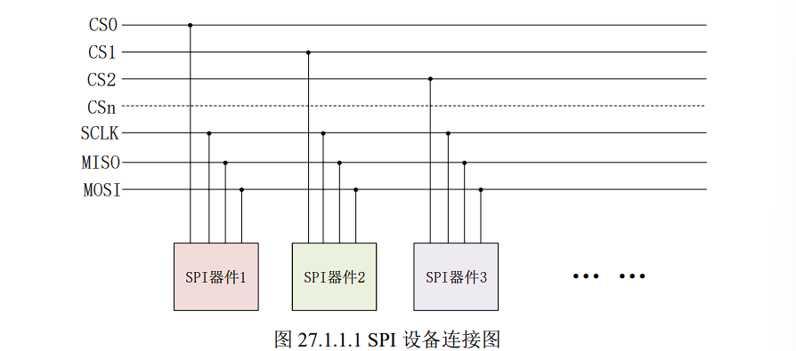

SPI 有四种工作模式，通过串行时钟极性(CPOL)和相位(CPHA)的搭配来得到四种工作模式：

①、CPOL=0，串行时钟空闲状态为低电平。
②、CPOL=1，串行时钟空闲状态为高电平。
此时可以通过配置时钟相位(CPHA)来选择具体的传输协议。

③、CPHA=0，串行时钟的第一个跳变沿(上升沿或下降沿)采集数据。
④、CPHA=1，串行时钟的第二个跳变沿(上升沿或下降沿)采集数据。

这四种工作模式如图：

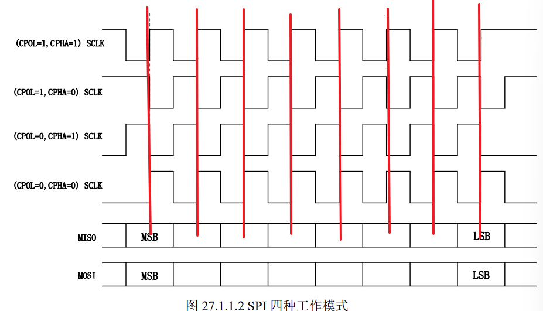

跟 I2C 一样，SPI 也是有时序图的，以 CPOL=0，CPHA=0 这个工作模式为例，SPI 进行全双工通信的时序如图:

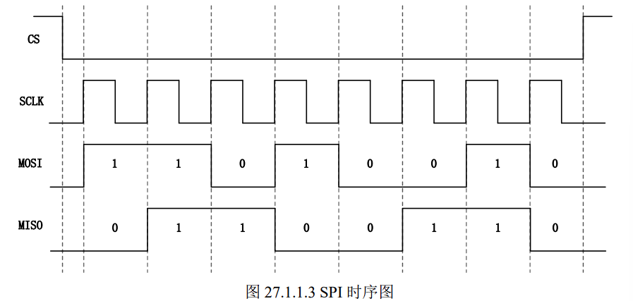

从图可以看出，SPI 的时序图很简单，不像 I2C 那样还要分为读时序和写时序，因为 SPI 是全双工的，所以读写时序可以一起完成。
图中，CS 片选信号先拉低，选中要通信的从设备，然后通过 MOSI 和 MISO 这两根数据线进行收发数据，MOSI 数据线发出了0XD2 这个数据给从设备，同时从设备也通过 MISO 线给主设备返回了 0X66 这个数据。
这个就是 SPI 时序图。

更多SPI时序可以参见STM32 SPI通信笔记。

#### 27.1.2 IMX6uLL ECSPI简介

I.MX6U 自带的 SPI 外设叫做 ECSPI，全称是 Enhanced Configurable Serial Peripheral Interface，别看前面加了个“EC”就以为和标准 SPI 有啥不同的，其实就是 SPI。
ECSPI 有 64 * 32 个接收FIFO(RXFIFO)和 64 * 32 个发送 FIFO(TXFIFO)，ECSPI 特性如下：

①、全双工同步串行接口。
②、可配置的主/从模式。
③、四个片选信号，支持多从机。
④、发送和接收都有一个 32x64 的 FIFO。
⑤、片选信号 SS/CS，时钟信号 SCLK 极性可配置。
⑥、支持 DMA。

I.MX6U 的 ECSPI 可以工作在主模式或从模式，本章我们使用主模式，I.MX6U 有 4 个ECSPI，每个 ECSPI 支持四个片选信号，也就说，如果你要使用 ECSPI 的硬件片选信号的话，一个 ECSPI 可以支持 4 个外设。
如果不使用硬件的片选信号就可以支持无数个外设，本章实验我们不使用硬件片选信号，因为硬件片选信号只能使用指定的片选 IO，软件片选的话可以使用任意的 IO。

我们接下来看一下 ECSPI 的几个重要的寄存器，首先看一下 ECSPIx_CONREG(x=1~4)寄存器，这是 ECSPI 的控制寄存器，此寄存器结构如图：
<span style = "color :red"> ECSPIx_CONREG </span>

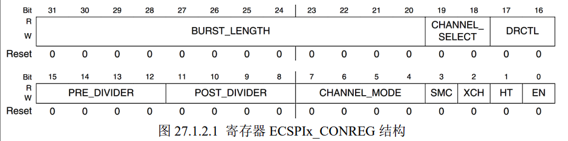

**BURST_LENGTH(bit31:24)**：突发长度，设置 SPI 的突发传输数据长度，在一次 SPI 发送中最大可以发送 2^12bit 数据。
可以设置 0X000~0XFFF，分别对应 1~2^12bit。
我们一般设置突发长度为一个字节，也就是 8bit，BURST_LENGTH=7。

**CHANNEL_SELECT(bit19:18)**：SPI 通道选择，一个 ECSPI 有四个硬件片选信号，每个片选信号是一个硬件通道，虽然我们本章实验使用的软件片选，但是 SPI 通道还是要选择的。
可设置为 0~3，分别对应通道 0~3。
I.MX6U-ALPHA 开发板上的 ICM-20608 的片选信号接的是ECSPI3_SS0，也就是 ECSPI3 的通道 0，所以本章实验设置为 0。

**DRCTL(bit17:16)**：SPI 的 SPI_RDY 信号控制位，用于设置 SPI_RDY 信号，为 0 的话不关心 SPI_RDY 信号；为 1 的话 SPI_RDY 信号为边沿触发；为 2 的话 SPI_DRY 是电平触发。

**PRE_DIVIDER(bit15:12)**：SPI 预分频，ECSPI 时钟频率使用两步来完成分频，此位设置的是第一步，可设置 0~15，分别对应 1~16 分频。

**POST_DIVIDER(bit11:8)**：SPI 分频值，ECSPI 时钟频率的第二步分频设置，分频值为2^POST_DIVIDER。

**CHANNEL_MODE(bit7:4)**：SPI 通道主/从模式设置，CHANNEL_MODE[3:0]分别对应 SPI通道 3~0，为 0 的话就是设置为从模式，如果为 1 的话就是主模式。
比如设置为 0X01 的话就是设置通道 0 为主模式。

**SMC(bit3)**：开始模式控制，此位只能在主模式下起作用，为 0 的话通过 XCH 位来开启 SPI突发访问，为 1 的话只要向 TXFIFO 写入数据就开启 SPI 突发访问。

**XCH(bit2)**：此位只在主模式下起作用，当 SMC 为 0 的话此位用来控制 SPI 突发访问的开启。

**HT(bit1)**：HT 模式使能位，I.MX6ULL 不支持。

**EN(bit0)**：SPI 使能位，为 0 的话关闭 SPI，为 1 的话使能 SPI。

接下来看一下寄存器 ECSPIx_CONFIGREG，这个也是 ECSPI 的配置寄存器，此寄存器结构如图 
<span style = "color :red"> ECSPIx_CONFIGREG </span>

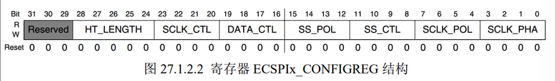

**HT_LENGTH(bit28:24)**：HT 模式下的消息长度设置，I.MX6ULL 不支持。

**SCLK_CTL(bit23:20)**：设置 SCLK 信号线空闲状态电平，SCLK_CTL[3:0]分别对应通道3~0，为 0 的话 SCLK 空闲状态为低电平，为 1 的话 SCLK 空闲状态为高电平。

**DATA_CTL(bit19:16)**：设置 DATA 信号线空闲状态电平，DATA_CTL[3:0]分别对应通道3~0，为 0 的话 DATA 空闲状态为高电平，为 1 的话 DATA 空闲状态为低电平。

**SS_POL(bit15:12)**：设置 SPI 片选信号极性设置，SS_POL[3:0]分别对应通道 3~0，为 0 的话片选信号低电平有效，为 1 的话片选信号高电平有效。

**SCLK_POL(bit7:4)**：SPI 时钟信号极性设置，也就是 CPOL，SCLK_POL[3:0]分别对应通道 3~0，为 0 的话 SCLK 高电平有效(空闲的时候为低电平)，为 1 的话 SCLK 低电平有效(空闲的时候为高电平)

**SCLK_PHA(bit3:0)**：SPI时钟相位设置，也就是CPHA，SCLK_PHA[3:0]分别对应通道3~0，为 0 的话串行时钟的第一个跳变沿(上升沿或下降沿)采集数据，为 1 的话串行时钟的第二个跳变沿(上升沿或下降沿)采集数据。

通过 SCLK_POL 和 SCLK_PHA 可以设置 SPI 的工作模式。

接下来看一下寄存器 ECSPIx_PERIODREG，这个是 ECSPI 的采样周期寄存器，此寄存器结构如图:

<span style="color:red"> ECSPIx_PERIODREG </span>

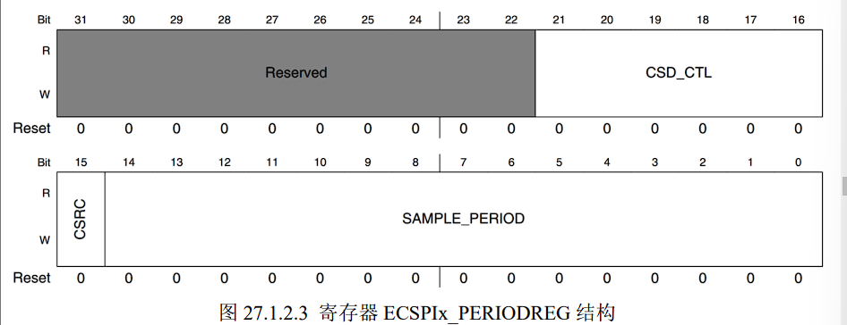

寄存器 ECSPIx_PERIODREG 用到的重要位如下：

**CSD_CTL(bit21:16)**：片选信号延时控制位，用于设置片选信号和第一个 SPI 时钟信号之间的时间间隔，范围为 0~63。

**CSRC(bit15)**：SPI 时钟源选择，为 0 的话选择 SPI CLK 为 SPI 的时钟源，为 1 的话选择32.768KHz 的晶振为 SPI 时钟源。
我们一般选择 SPI CLK 作为 SPI 时钟源，SPI CLK 时钟来源如图:

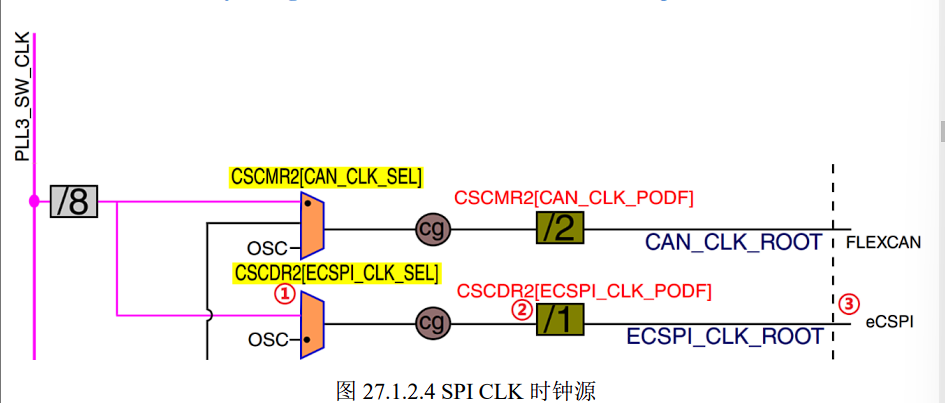

①、这是一个选择器，用于选择根时钟源，由寄存器 CSCDR2 的位 ECSPI_CLK_SEL 来控制，为 0 的话选择 pll3_60m 作为 ECSPI 根时钟源。为 1 的话选择 osc_clk 作为 ECSPI 时钟源。
本章我们选择 pll3_60m 作为 ECSPI 根时钟源。

②、ECSPI 时钟分频值，由寄存器 CSCDR2 的位 ECSPI_CLK_PODF 来控制，分频值为2^ECSPI_CLK_PODF。本章我们设置为 0，也就是 1 分频。

③、最终进入 ECSPI 的时钟，也就是 SPI CLK=60MHz。

**SAMPLE_PERIO**：采样周期寄存器，可设置为 0~0X7FFF 分别对应 0~32767 个周期。

接下来看一下寄存器 ECSPIx_STATREG，这个是 ECSPI 的状态寄存器，此寄存器结构如图
<span style="color:red"> ECSPIx_STATREG </span>

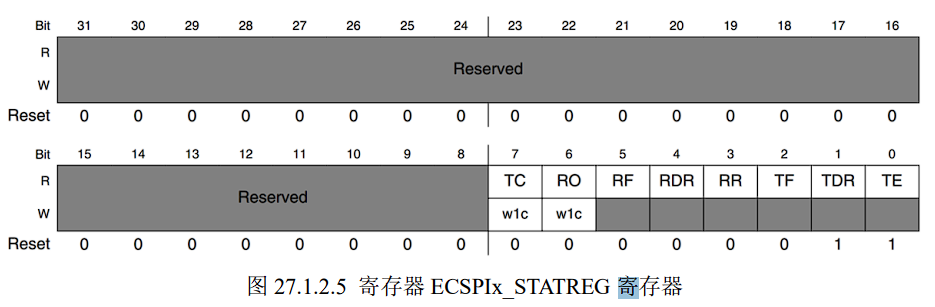

寄存器 ECSPIx_STATREG 用到的重要位如下：

**TC(bit7)**：传输完成标志位，为 0 表示正在传输，为 1 表示传输完成。
**RO(bit6)**：RXFIFO 溢出标志位，为 0 表示 RXFIFO 无溢出，为 1 表示 RXFIFO 溢出。
**RF(bit5)**：RXFIFO 空标志位，为 0 表示 RXFIFO 不为空，为 1 表示 RXFIFO 为空。
**RDR(bit4)**：RXFIFO 数据请求标志位，此位为 0 表示 RXFIFO 里面的数据不大于RX_THRESHOLD，此位为 1 的话表示 RXFIFO 里面的数据大于 RX_THRESHOLD。
**RR(bit3)**：RXFIFO 就绪标志位，为 0 的话 RXFIFO 没有数据，为 1 的话表示 RXFIFO 中至少有一个字的数据。
**TF(bit2)**：TXFIFO 满标志位，为 0 的话表示 TXFIFO 不为满，为 1 的话表示 TXFIFO 为满。
**TDR(bit1)**：TXFIFO 数据请求标志位，为 0 表示 TXFIFO 中的数据大于 TX_THRESHOLD，为 1 表示 TXFIFO 中的数据不大于 TX_THRESHOLD。
**TE(bit0)**：TXFIFO 空标志位，为 0 表示 TXFIFO 中至少有一个字的数据，为 1 表示 TXFIFO为空。

最后就是两个数据寄存器，ECSPIx_TXDATA 和 ECSPIx_RXDATA，这两个寄存器都是 32位的，如果要发送数据就向寄存器 ECSPIx_TXDATA 写入数据，读取及存取 ECSPIx_RXDATA里面的数据就可以得到刚刚接收到的数据。

关于 ECSPI 的寄存器就介绍到这里，关于这些寄存器详细的描述，请参考《I.MX6ULL 参考手册》第 805 页的 20.7 小节。

#### 27.1.3 ICM-20608简介

ICM-20608 是 InvenSense 出品的一款 6 轴 MEMS 传感器，包括 3 轴加速度和 3 轴陀螺仪。
ICM-20608 尺寸非常小，只有 3x3x0.75mm，采用 16P 的 LGA 封装。ICM-20608 内部有一个 512字节的 FIFO。
陀螺仪的量程范围可以编程设置，可选择±250，±500，±1000 和±2000°/s，加速度的量程范围也可以编程设置，可选择±2g，±4g，±8g 和±16g。
陀螺仪和加速度计都是 16 位的 ADC，并且支持 I2C 和 SPI 两种协议，使用 I2C 接口的话通信速度最高可以达到400KHz，使用 SPI 接口的话通信速度最高可达到 8MHz。
I.MX6U-ALPHA 开发板上的 ICM20608 通过 SPI 接口和 I.MX6U 连接在一起。
ICM-20608 特性如下：

①、陀螺仪支持 X,Y 和 Z 三轴输出，内部集成 16 位 ADC，测量范围可设置：±250，±500，±1000 和±2000°/s。
②、加速度计支持 X,Y 和 Z 轴输出，内部集成 16 位 ADC，测量范围可设置：±2g，±4g，±4g，±8g 和±16g。
③、用户可编程中断。
④、内部包含 512 字节的 FIFO。
⑤、内部包含一个数字温度传感器。
⑥、耐 10000g 的冲击。
⑦、支持快速 I2C，速度可达 400KHz。
⑧、支持 SPI，速度可达 8MHz。

陀螺仪如图：
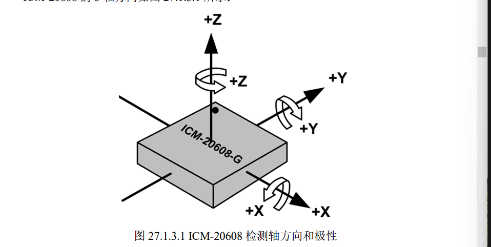

ICM-20608 的结构框图如图:
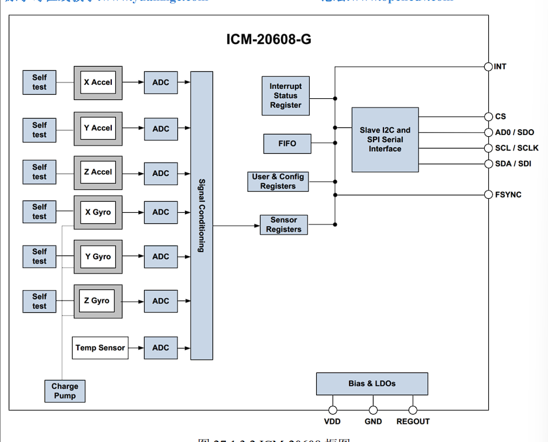

如果使用 IIC 接口的话 ICM-20608 的 AD0 引脚决定 I2C 设备从地址的最后一位，如果 AD0为 0 的话 ICM-20608 从设备地址是 0X68，如果 AD0 为 1 的话 ICM-20608 从设备地址为 0X69。

本章我们使用 SPI 接口，跟上一章使用 AP3216C 一样，ICM-20608 也是通过读写寄存器来配置和读取传感器数据，使用 SPI 接口读写寄存器需要 16 个时钟或者更多(如果读写操作包括多个字节的话)，第一个字节包含要读写的寄存器地址，寄存器地址最高位是读写标志位，如果是读的话寄存器地址最高位要为 1，如果是写的话寄存器地址最高位要为 0，剩下的 7 位才是实际的寄存器地址，寄存器地址后面跟着的就是读写的数据。

下图列出了本章实验用到的一些寄存器和位，关于 ICM-20608 的详细寄存器和位的介绍请参考 ICM-20608 的寄存器手册：
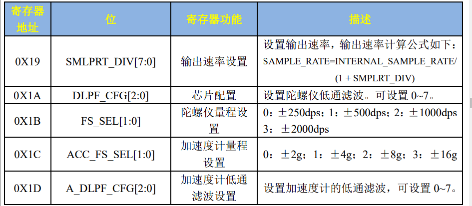
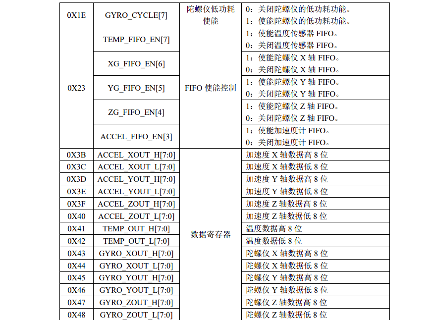
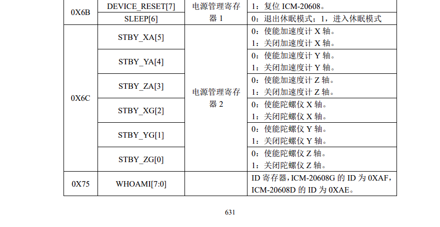
ICM-20608 的介绍就到这里，关于 ICM-20608 的详细介绍请参考 ICM-20608 的数据手册和寄存器手册。

### 27.2 硬件原理分析

本试验用到的资源如下：
①、指示灯 LED0。
②、RGB LCD 屏幕。
③、ICM20608
④、串口
ICM-20608 是在 I.MX6U-ALPHA 开发板底板上，原理图如图
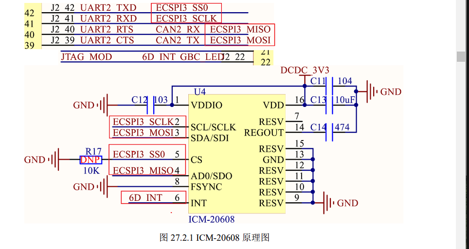

### 27.3 实验程序编写

本实验对应的例程路径为：开发板光盘-> 1、裸机例程-> 18_spi。
然后在 bsp 文件夹下创建名为“spi”和“icm20608”的文件
在 bsp/spi 中新建 bsp_spi.c 和 bsp_spi.h 这两个文件，
在 bsp/icm20608 中新建 bsp_icm20608.c 和 bsp_icm20608.h 这两个文件。bsp_spi.c 和 bsp_spi.h是 I.MX6U 的 SPI 文件
bsp_icm20608.c 和bsp_icm20608.h 是 ICM20608的驱动文件
```C
bsp_spi.h
#ifndef _BSP_SPI_H
#define _BSP_SPI_H
/***************************************************************
Copyright © zuozhongkai Co., Ltd. 1998-2019. All rights reserved.
文件名	: 	 bsp_spi.h
作者	   : 左忠凯
版本	   : V1.0
描述	   : SPI驱动头文件。
其他	   : 无
论坛 	   : www.wtmembed.com
日志	   : 初版V1.0 2019/1/17 左忠凯创建
***************************************************************/
#include "imx6ul.h"

/* 函数声明 */
void spi_init(ECSPI_Type *base); //SPI初始化
unsigned char spich0_readwrite_byte(ECSPI_Type *base, unsigned char txdata); //数据传输函数

#endif
```

```C
bsp_spi.c
/***************************************************************
Copyright © zuozhongkai Co., Ltd. 1998-2019. All rights reserved.
文件名	: 	 bsp_spi.c
作者	   : 左忠凯
版本	   : V1.0
描述	   : SPI驱动文件。
其他	   : 无
论坛 	   : www.wtmembed.com
日志	   : 初版V1.0 2019/1/17 左忠凯创建
***************************************************************/
#include "bsp_spi.h"
#include "bsp_gpio.h"
#include "stdio.h"

/*
 * @description		: 初始化SPI
 * @param - base	: 要初始化的SPI
 * @return 			: 无
 */
void spi_init(ECSPI_Type *base)
{
	/* 配置CONREG寄存器
	 * bit0 : 		1 	使能ECSPI
	 * bit3 : 		1	当向TXFIFO写入数据以后立即开启SPI突发。
	 * bit[7:4] : 	0001 SPI通道0主模式，根据实际情况选择，
	 *            	   	开发板上的ICM-20608接在SS0上，所以设置通道0为主模式
	 * bit[19:18]:	00 	选中通道0(其实不需要，因为片选信号我们我们自己控制)
	 * bit[31:20]:	0x7	突发长度为8个bit。 
	 */
	base->CONREG = 0; /* 先清除控制寄存器 */
	base->CONREG |= (1 << 0) | (1 << 3) | (1 << 4) | (7 << 20); /* 配置CONREG寄存器 */

	/*
     * ECSPI通道0设置,即设置CONFIGREG寄存器
     * bit0:	0 通道0 PHA为0
     * bit4:	0 通道0 SCLK高电平有效
     * bit8: 	0 通道0片选信号 当SMC为1的时候此位无效
     * bit12：	0 通道0 POL为0
     * bit16：	0 通道0 数据线空闲时高电平
     * bit20:	0 通道0 时钟线空闲时低电平
	 */
	base->CONFIGREG = 0; 		/* 设置通道寄存器 */
	
	/*  
     * ECSPI通道0设置，设置采样周期
     * bit[14:0] :	0X2000  采样等待周期，比如当SPI时钟为10MHz的时候
     *  		    0X2000就等于1/10000 * 0X2000 = 0.8192ms，也就是连续
     *          	读取数据的时候每次之间间隔0.8ms
     * bit15	 :  0  采样时钟源为SPI CLK
     * bit[21:16]:  0  片选延时，可设置为0~63
	 */
	base->PERIODREG = 0X2000;		/* 设置采样周期寄存器 */

	/*
     * ECSPI的SPI时钟配置，SPI的时钟源来源于pll3_sw_clk/8=480/8=60MHz
     * 通过设置CONREG寄存器的PER_DIVIDER(bit[11:8])和POST_DIVEDER(bit[15:12])来
     * 对SPI时钟源分频，获取到我们想要的SPI时钟：
     * SPI CLK = (SourceCLK / PER_DIVIDER) / (2^POST_DIVEDER)
     * 比如我们现在要设置SPI时钟为6MHz，那么PER_DIVEIDER和POST_DEIVIDER设置如下：
     * PER_DIVIDER = 0X9。
     * POST_DIVIDER = 0X0。
     * SPI CLK = 60000000/(0X9 + 1) = 60000000=6MHz
	 */
	base->CONREG &= ~((0XF << 12) | (0XF << 8));	/* 清除PER_DIVDER和POST_DIVEDER以前的设置 */
	base->CONREG |= (0X9 << 12);					/* 设置SPI CLK = 6MHz */
}

/*
 * @description		: SPI通道0发送/接收一个字节的数据
 * @param - base	: 要使用的SPI
 * @param - txdata	: 要发送的数据
 * @return 			: 无
 */
unsigned char spich0_readwrite_byte(ECSPI_Type *base, unsigned char txdata)
{ 
	uint32_t  spirxdata = 0;
	uint32_t  spitxdata = txdata;

    /* 选择通道0 */
	base->CONREG &= ~(3 << 18);
	base->CONREG |= (0 << 18);

  	while((base->STATREG & (1 << 0)) == 0){} /* 等待发送FIFO为空 */
		base->TXDATA = spitxdata;
	
	while((base->STATREG & (1 << 3)) == 0){} /* 等待接收FIFO有数据 */
		spirxdata = base->RXDATA;
	return spirxdata;
}

```
函数 spi_init 是 SPI 初始化函数，此函数会初始化 SPI 的时钟，通道等。
函数 spich0_readwrite_byte 是 SPI 收发函数，通过此函数即可完成 SPI 的全双工数据收发。

```C
#ifndef _BSP_ICM20608_H
#define _BSP_ICM20608_H
/***************************************************************
Copyright © zuozhongkai Co., Ltd. 1998-2019. All rights reserved.
文件名	: 	 bsp_icm20608.h
作者	   : 左忠凯
版本	   : V1.0
描述	   : ICM20608驱动文件。
其他	   : 无
论坛 	   : www.wtmembed.com
日志	   : 初版V1.0 2019/3/26 左忠凯创建
***************************************************************/
#include "imx6ul.h"
#include "bsp_gpio.h"


/* 宏定义 */
#define ICM20608_CSN(n)    (n ? gpio_pinwrite(GPIO1, 20, 1) : gpio_pinwrite(GPIO1, 20, 0))   /* SPI片选信号	 */

#define ICM20608G_ID			0XAF	/* ID值 */
#define ICM20608D_ID			0XAE	/* ID值 */

/* ICM20608寄存器 
 *复位后所有寄存器地址都为0，除了
 *Register 107(0X6B) Power Management 1 	= 0x40
 *Register 117(0X75) WHO_AM_I 				= 0xAF或0xAE
 */
/* 陀螺仪和加速度自测(出产时设置，用于与用户的自检输出值比较） */
#define	ICM20_SELF_TEST_X_GYRO		0x00
#define	ICM20_SELF_TEST_Y_GYRO		0x01
#define	ICM20_SELF_TEST_Z_GYRO		0x02
#define	ICM20_SELF_TEST_X_ACCEL		0x0D
#define	ICM20_SELF_TEST_Y_ACCEL		0x0E
#define	ICM20_SELF_TEST_Z_ACCEL		0x0F

/* 陀螺仪静态偏移 */
#define	ICM20_XG_OFFS_USRH			0x13
#define	ICM20_XG_OFFS_USRL			0x14
#define	ICM20_YG_OFFS_USRH			0x15
#define	ICM20_YG_OFFS_USRL			0x16
#define	ICM20_ZG_OFFS_USRH			0x17
#define	ICM20_ZG_OFFS_USRL			0x18

#define	ICM20_SMPLRT_DIV			0x19
#define	ICM20_CONFIG				0x1A
#define	ICM20_GYRO_CONFIG			0x1B
#define	ICM20_ACCEL_CONFIG			0x1C
#define	ICM20_ACCEL_CONFIG2			0x1D
#define	ICM20_LP_MODE_CFG			0x1E
#define	ICM20_ACCEL_WOM_THR			0x1F
#define	ICM20_FIFO_EN				0x23
#define	ICM20_FSYNC_INT				0x36
#define	ICM20_INT_PIN_CFG			0x37
#define	ICM20_INT_ENABLE			0x38
#define	ICM20_INT_STATUS			0x3A

/* 加速度输出 */
#define	ICM20_ACCEL_XOUT_H			0x3B
#define	ICM20_ACCEL_XOUT_L			0x3C
#define	ICM20_ACCEL_YOUT_H			0x3D
#define	ICM20_ACCEL_YOUT_L			0x3E
#define	ICM20_ACCEL_ZOUT_H			0x3F
#define	ICM20_ACCEL_ZOUT_L			0x40

/* 温度输出 */
#define	ICM20_TEMP_OUT_H			0x41
#define	ICM20_TEMP_OUT_L			0x42

/* 陀螺仪输出 */
#define	ICM20_GYRO_XOUT_H			0x43
#define	ICM20_GYRO_XOUT_L			0x44
#define	ICM20_GYRO_YOUT_H			0x45
#define	ICM20_GYRO_YOUT_L			0x46
#define	ICM20_GYRO_ZOUT_H			0x47
#define	ICM20_GYRO_ZOUT_L			0x48

#define	ICM20_SIGNAL_PATH_RESET		0x68
#define	ICM20_ACCEL_INTEL_CTRL 		0x69
#define	ICM20_USER_CTRL				0x6A
#define	ICM20_PWR_MGMT_1			0x6B
#define	ICM20_PWR_MGMT_2			0x6C
#define	ICM20_FIFO_COUNTH			0x72
#define	ICM20_FIFO_COUNTL			0x73
#define	ICM20_FIFO_R_W				0x74
#define	ICM20_WHO_AM_I 				0x75

/* 加速度静态偏移 */
#define	ICM20_XA_OFFSET_H			0x77
#define	ICM20_XA_OFFSET_L			0x78
#define	ICM20_YA_OFFSET_H			0x7A
#define	ICM20_YA_OFFSET_L			0x7B
#define	ICM20_ZA_OFFSET_H			0x7D
#define	ICM20_ZA_OFFSET_L 			0x7E

/*
 * ICM20608结构体
 */
struct icm20608_dev_struc
{
	signed int gyro_x_adc;		/* 陀螺仪X轴原始值 			*/
	signed int gyro_y_adc;		/* 陀螺仪Y轴原始值 			*/
	signed int gyro_z_adc;		/* 陀螺仪Z轴原始值 			*/
	signed int accel_x_adc;		/* 加速度计X轴原始值 			*/
	signed int accel_y_adc;		/* 加速度计Y轴原始值 			*/
	signed int accel_z_adc;		/* 加速度计Z轴原始值 			*/
	signed int temp_adc;		/* 温度原始值 				*/

	/* 下面是计算得到的实际值，扩大100倍 */
	signed int gyro_x_act;		/* 陀螺仪X轴实际值 			*/
	signed int gyro_y_act;		/* 陀螺仪Y轴实际值 			*/
	signed int gyro_z_act;		/* 陀螺仪Z轴实际值 			*/
	signed int accel_x_act;		/* 加速度计X轴实际值 			*/
	signed int accel_y_act;		/* 加速度计Y轴实际值 			*/
	signed int accel_z_act;		/* 加速度计Z轴实际值 			*/
	signed int temp_act;		/* 温度实际值 				*/
};

struct icm20608_dev_struc icm20608_dev;	/* icm20608设备 */


/* 函数声明 */
unsigned char icm20608_init(void);
void icm20608_write_reg(unsigned char reg, unsigned char value);
unsigned char icm20608_read_reg(unsigned char reg);
void icm20608_read_len(unsigned char reg, unsigned char *buf, unsigned char len);
void icm20608_getdata(void);


#endif
```
文件 bsp_icm20608.h 里面先定义了一个宏 ICM20608_CSN
这个是 ICM20608 的 SPI 片选引脚。
接下来定义了一些 ICM20608 的 ID 和寄存器地址。
第 41 行定义了一个结构体icm20608_dev_struc，这个结构体是 ICM20608 的设备结构体，里面的成员变量用来保存ICM20608 的原始数据值和经过转换得到的实际值。
实际值是有小数的，本章例程取两位小数，为了方便计算，实际值扩大了 100 倍，这样实际值就是整数了，但是在使用的时候要除 100 重新得到小数部分。
最后就是一些函数声明!

```C
bsp_icm20608.c
/***************************************************************
Copyright © zuozhongkai Co., Ltd. 1998-2019. All rights reserved.
文件名	: 	 bsp_icm20608.c
作者	   : 左忠凯
版本	   : V1.0
描述	   : ICM20608驱动文件。
其他	   : 无
论坛 	   : www.wtmembed.com
日志	   : 初版V1.0 2019/3/26 左忠凯创建
***************************************************************/
#include "bsp_icm20608.h"
#include "bsp_delay.h"
#include "bsp_spi.h"
#include "stdio.h"

struct icm20608_dev_struc icm20608_dev;	/* icm20608设备 */

/*
 * @description	: 初始化ICM20608
 * @param		: 无
 * @return 		: 0 初始化成功，其他值 初始化失败
 */
unsigned char icm20608_init(void)
{	
	unsigned char regvalue;
	gpio_pin_config_t cs_config;

	/* 1、ESPI3 IO初始化 
 	 * ECSPI3_SCLK 	-> UART2_RXD
 	 * ECSPI3_MISO 	-> UART2_RTS
 	 * ECSPI3_MOSI	-> UART2_CTS
 	 */
	IOMUXC_SetPinMux(IOMUXC_UART2_RX_DATA_ECSPI3_SCLK, 0);
	IOMUXC_SetPinMux(IOMUXC_UART2_CTS_B_ECSPI3_MOSI, 0);
	IOMUXC_SetPinMux(IOMUXC_UART2_RTS_B_ECSPI3_MISO, 0);
	
	/* 配置SPI   SCLK MISO MOSI IO属性	
	 *bit 16: 0 HYS关闭
	 *bit [15:14]: 00 默认100K下拉
	 *bit [13]: 0 keeper功能
	 *bit [12]: 1 pull/keeper使能 
	 *bit [11]: 0 关闭开路输出
 	 *bit [7:6]: 10 速度100Mhz
 	 *bit [5:3]: 110 驱动能力为R0/6
	 *bit [0]: 1 高转换率
 	 */
	IOMUXC_SetPinConfig(IOMUXC_UART2_RX_DATA_ECSPI3_SCLK, 0x10B1);
	IOMUXC_SetPinConfig(IOMUXC_UART2_CTS_B_ECSPI3_MOSI, 0x10B1);
	IOMUXC_SetPinConfig(IOMUXC_UART2_RTS_B_ECSPI3_MISO, 0x10B1);

	
	IOMUXC_SetPinMux(IOMUXC_UART2_TX_DATA_GPIO1_IO20, 0);
	IOMUXC_SetPinConfig(IOMUXC_UART2_TX_DATA_GPIO1_IO20, 0X10B0);
	cs_config.direction = kGPIO_DigitalOutput;
	cs_config.outputLogic = 0;
	gpio_init(GPIO1, 20, &cs_config);
	
	/* 2、初始化SPI */
	spi_init(ECSPI3);	

	icm20608_write_reg(ICM20_PWR_MGMT_1, 0x80);		/* 复位，复位后为0x40,睡眠模式 			*/
	delayms(50);
	icm20608_write_reg(ICM20_PWR_MGMT_1, 0x01);		/* 关闭睡眠，自动选择时钟 					*/
	delayms(50);

	regvalue = icm20608_read_reg(ICM20_WHO_AM_I);
	printf("icm20608 id = %#X\r\n", regvalue);
	if(regvalue != ICM20608G_ID && regvalue != ICM20608D_ID)
		return 1;
		
	icm20608_write_reg(ICM20_SMPLRT_DIV, 0x00); 	/* 输出速率是内部采样率					*/
	icm20608_write_reg(ICM20_GYRO_CONFIG, 0x18); 	/* 陀螺仪±2000dps量程 				*/
	icm20608_write_reg(ICM20_ACCEL_CONFIG, 0x18); 	/* 加速度计±16G量程 					*/
	icm20608_write_reg(ICM20_CONFIG, 0x04); 		/* 陀螺仪低通滤波BW=20Hz 				*/
	icm20608_write_reg(ICM20_ACCEL_CONFIG2, 0x04); 	/* 加速度计低通滤波BW=21.2Hz 			*/
	icm20608_write_reg(ICM20_PWR_MGMT_2, 0x00); 	/* 打开加速度计和陀螺仪所有轴 				*/
	icm20608_write_reg(ICM20_LP_MODE_CFG, 0x00); 	/* 关闭低功耗 						*/
	icm20608_write_reg(ICM20_FIFO_EN, 0x00);		/* 关闭FIFO						*/
	return 0;
}

	
/*
 * @description  : 写ICM20608指定寄存器
 * @param - reg  : 要读取的寄存器地址
 * @param - value: 要写入的值
 * @return		 : 无
 */
void icm20608_write_reg(unsigned char reg, unsigned char value)
{
	/* ICM20608在使用SPI接口的时候寄存器地址
	 * 只有低7位有效,寄存器地址最高位是读/写标志位
	 * 读的时候要为1，写的时候要为0。
	 */
	reg &= ~0X80;	
	
	ICM20608_CSN(0);						/* 使能SPI传输			*/
	spich0_readwrite_byte(ECSPI3, reg); 	/* 发送寄存器地址		*/ 
	spich0_readwrite_byte(ECSPI3, value);	/* 发送要写入的值			*/
	ICM20608_CSN(1);						/* 禁止SPI传输			*/
}	

/*
 * @description	: 读取ICM20608寄存器值
 * @param - reg	: 要读取的寄存器地址
 * @return 		: 读取到的寄存器值
 */
unsigned char icm20608_read_reg(unsigned char reg)
{
	unsigned char reg_val;	   	

	/* ICM20608在使用SPI接口的时候寄存器地址
	 * 只有低7位有效,寄存器地址最高位是读/写标志位
	 * 读的时候要为1，写的时候要为0。
	 */
	reg |= 0x80; 	
	
   	ICM20608_CSN(0);               					/* 使能SPI传输	 		*/
  	spich0_readwrite_byte(ECSPI3, reg);     		/* 发送寄存器地址  		*/ 
  	reg_val = spich0_readwrite_byte(ECSPI3, 0XFF);	/* 读取寄存器的值 			*/
 	ICM20608_CSN(1);                				/* 禁止SPI传输 			*/
  	return(reg_val);               	 				/* 返回读取到的寄存器值 */
}

/*
 * @description	: 读取ICM20608连续多个寄存器
 * @param - reg	: 要读取的寄存器地址
 * @return 		: 读取到的寄存器值
 */
void icm20608_read_len(unsigned char reg, unsigned char *buf, unsigned char len)
{  
	unsigned char i;
	
	/* ICM20608在使用SPI接口的时候寄存器地址，只有低7位有效,
	 * 寄存器地址最高位是读/写标志位读的时候要为1，写的时候要为0。
	 */
	reg |= 0x80; 
		
   	ICM20608_CSN(0);               				/* 使能SPI传输	 		*/
  	spich0_readwrite_byte(ECSPI3, reg);			/* 发送寄存器地址  		*/   	   
 	for(i = 0; i < len; i++)					/* 顺序读取寄存器的值 			*/
 	{
		buf[i] = spich0_readwrite_byte(ECSPI3, 0XFF);	
	}
 	ICM20608_CSN(1);                			/* 禁止SPI传输 			*/
}

/*
 * @description : 获取陀螺仪的分辨率
 * @param		: 无
 * @return		: 获取到的分辨率
 */
float icm20608_gyro_scaleget(void)
{
	unsigned char data;
	float gyroscale;
	
	data = (icm20608_read_reg(ICM20_GYRO_CONFIG) >> 3) & 0X3;
	switch(data) {
		case 0: 
			gyroscale = 131;
			break;
		case 1:
			gyroscale = 65.5;
			break;
		case 2:
			gyroscale = 32.8;
			break;
		case 3:
			gyroscale = 16.4;
			break;
	}
	return gyroscale;
}

/*
 * @description : 获取加速度计的分辨率
 * @param		: 无
 * @return		: 获取到的分辨率
 */
unsigned short icm20608_accel_scaleget(void)
{
	unsigned char data;
	unsigned short accelscale;
	
	data = (icm20608_read_reg(ICM20_ACCEL_CONFIG) >> 3) & 0X3;
	switch(data) {
		case 0: 
			accelscale = 16384;
			break;
		case 1:
			accelscale = 8192;
			break;
		case 2:
			accelscale = 4096;
			break;
		case 3:
			accelscale = 2048;
			break;
	}
	return accelscale;
}


/*
 * @description : 读取ICM20608的加速度、陀螺仪和温度原始值
 * @param 		: 无
 * @return		: 无
 */
void icm20608_getdata(void)
{
	float gyroscale;
	unsigned short accescale;
	unsigned char data[14];
	
	icm20608_read_len(ICM20_ACCEL_XOUT_H, data, 14);
	
	gyroscale = icm20608_gyro_scaleget();
	accescale = icm20608_accel_scaleget();

	icm20608_dev.accel_x_adc = (signed short)((data[0] << 8) | data[1]); 
	icm20608_dev.accel_y_adc = (signed short)((data[2] << 8) | data[3]); 
	icm20608_dev.accel_z_adc = (signed short)((data[4] << 8) | data[5]); 
	icm20608_dev.temp_adc    = (signed short)((data[6] << 8) | data[7]); 
	icm20608_dev.gyro_x_adc  = (signed short)((data[8] << 8) | data[9]); 
	icm20608_dev.gyro_y_adc  = (signed short)((data[10] << 8) | data[11]);
	icm20608_dev.gyro_z_adc  = (signed short)((data[12] << 8) | data[13]);

	/* 计算实际值 */
	icm20608_dev.gyro_x_act = ((float)(icm20608_dev.gyro_x_adc)  / gyroscale) * 100;
	icm20608_dev.gyro_y_act = ((float)(icm20608_dev.gyro_y_adc)  / gyroscale) * 100;
	icm20608_dev.gyro_z_act = ((float)(icm20608_dev.gyro_z_adc)  / gyroscale) * 100;

	icm20608_dev.accel_x_act = ((float)(icm20608_dev.accel_x_adc) / accescale) * 100;
	icm20608_dev.accel_y_act = ((float)(icm20608_dev.accel_y_adc) / accescale) * 100;
	icm20608_dev.accel_z_act = ((float)(icm20608_dev.accel_z_adc) / accescale) * 100;

	icm20608_dev.temp_act = (((float)(icm20608_dev.temp_adc) - 25 ) / 326.8 + 25) * 100;
}

```

main.c填写如下：

```C
/**************************************************************
Copyright © zuozhongkai Co., Ltd. 1998-2019. All rights reserved.
文件名	: 	 mian.c
作者	   : 左忠凯
版本	   : V1.0
描述	   : I.MX6U开发板裸机实验19 SPI实验
其他	   : SPI也是最常用的接口，ZERO开发板上有一个6轴传感器ICM20608，
		 这个六轴传感器就是SPI接口的，本实验就来学习如何驱动I.MX6U
		 的SPI接口，并且通过SPI接口读取ICM20608的数据值。
论坛 	   : www.wtmembed.com
日志	   : 初版V1.0 2019/1/17 左忠凯创建
**************************************************************/
#include "bsp_clk.h"
#include "bsp_delay.h"
#include "bsp_led.h"
#include "bsp_beep.h"
#include "bsp_key.h"
#include "bsp_int.h"
#include "bsp_uart.h"
#include "bsp_lcd.h"
#include "bsp_lcdapi.h"
#include "bsp_rtc.h"
#include "bsp_icm20608.h"
#include "bsp_spi.h"
#include "stdio.h"


/*
 * @description	: 指定的位置显示整数数据
 * @param - x	: X轴位置
 * @param - y 	: Y轴位置
 * @param - size: 字体大小
 * @param - num : 要显示的数据
 * @return 		: 无
 */
void integer_display(unsigned short x, unsigned short y, unsigned char size, signed int num)
{
	char buf[200];
	
	lcd_fill(x, y, x + 50, y + size, tftlcd_dev.backcolor);
	
	memset(buf, 0, sizeof(buf));
	if(num < 0)
		sprintf(buf, "-%d", -num);
	else 
		sprintf(buf, "%d", num);
	lcd_show_string(x, y, 50, size, size, buf); 
}


/*
 * @description	: 指定的位置显示小数数据,比如5123，显示为51.23
 * @param - x	: X轴位置
 * @param - y 	: Y轴位置
 * @param - size: 字体大小
 * @param - num : 要显示的数据，实际小数扩大100倍，
 * @return 		: 无
 */
void decimals_display(unsigned short x, unsigned short y, unsigned char size, signed int num)
{
	signed int integ; 	/* 整数部分 */
	signed int fract;	/* 小数部分 */
	signed int uncomptemp = num; 
	char buf[200];

	if(num < 0)
		uncomptemp = -uncomptemp;
	integ = uncomptemp / 100;
	fract = uncomptemp % 100;

	memset(buf, 0, sizeof(buf));
	if(num < 0)
		sprintf(buf, "-%d.%d", integ, fract);
	else 
		sprintf(buf, "%d.%d", integ, fract);
	lcd_fill(x, y, x + 60, y + size, tftlcd_dev.backcolor);
	lcd_show_string(x, y, 60, size, size, buf); 
}

/*
 * @description	: 使能I.MX6U的硬件NEON和FPU
 * @param 		: 无
 * @return 		: 无
 */
 void imx6ul_hardfpu_enable(void)
{
	uint32_t cpacr;
	uint32_t fpexc;

	/* 使能NEON和FPU */
	cpacr = __get_CPACR();
	cpacr = (cpacr & ~(CPACR_ASEDIS_Msk | CPACR_D32DIS_Msk))
		   |  (3UL << CPACR_cp10_Pos) | (3UL << CPACR_cp11_Pos);
	__set_CPACR(cpacr);
	fpexc = __get_FPEXC();
	fpexc |= 0x40000000UL;	
	__set_FPEXC(fpexc);
}

/*
 * @description	: main函数
 * @param 		: 无
 * @return 		: 无
 */
int main(void)
{
	unsigned char state = OFF;

	imx6ul_hardfpu_enable();	/* 使能I.MX6U的硬件浮点 			*/
	int_init(); 				/* 初始化中断(一定要最先调用！) */
	imx6u_clkinit();			/* 初始化系统时钟 					*/
	delay_init();				/* 初始化延时 					*/
	clk_enable();				/* 使能所有的时钟 					*/
	led_init();					/* 初始化led 					*/
	beep_init();				/* 初始化beep	 				*/
	uart_init();				/* 初始化串口，波特率115200 */
	lcd_init();					/* 初始化LCD 					*/		

	tftlcd_dev.forecolor = LCD_RED;
	lcd_show_string(50, 10, 400, 24, 24, (char*)"ALPHA-IMX6U SPI TEST");  
	lcd_show_string(50, 40, 200, 16, 16, (char*)"ICM20608 TEST");  
	lcd_show_string(50, 60, 200, 16, 16, (char*)"ATOM@ALIENTEK");  
	lcd_show_string(50, 80, 200, 16, 16, (char*)"2019/3/27");  
	
	while(icm20608_init())		/* 初始化ICM20608	 			*/
	{
		lcd_show_string(50, 100, 200, 16, 16, (char*)"ICM20608 Check Failed!");
		delayms(500);
		lcd_show_string(50, 100, 200, 16, 16, (char*)"Please Check!        ");
		delayms(500);
	}	

	lcd_show_string(50, 100, 200, 16, 16, (char*)"ICM20608 Ready");
	
	lcd_show_string(50, 130, 200, 16, 16, (char*)"accel x:");  
	lcd_show_string(50, 150, 200, 16, 16, (char*)"accel y:");  
	lcd_show_string(50, 170, 200, 16, 16, (char*)"accel z:");  
	lcd_show_string(50, 190, 200, 16, 16, (char*)"gyro  x:"); 
	lcd_show_string(50, 210, 200, 16, 16, (char*)"gyro  y:"); 
	lcd_show_string(50, 230, 200, 16, 16, (char*)"gyro  z:"); 
	lcd_show_string(50, 250, 200, 16, 16, (char*)"temp   :"); 

	lcd_show_string(50 + 181, 130, 200, 16, 16, (char*)"g");  
	lcd_show_string(50 + 181, 150, 200, 16, 16, (char*)"g");  
	lcd_show_string(50 + 181, 170, 200, 16, 16, (char*)"g");  
	lcd_show_string(50 + 181, 190, 200, 16, 16, (char*)"o/s"); 
	lcd_show_string(50 + 181, 210, 200, 16, 16, (char*)"o/s"); 
	lcd_show_string(50 + 181, 230, 200, 16, 16, (char*)"o/s"); 
	lcd_show_string(50 + 181, 250, 200, 16, 16, (char*)"C");
	
	tftlcd_dev.forecolor = LCD_BLUE;

	while(1)					
	{		
		icm20608_getdata();
		integer_display(50 + 70, 130, 16, icm20608_dev.accel_x_adc);
		integer_display(50 + 70, 150, 16, icm20608_dev.accel_y_adc);
		integer_display(50 + 70, 170, 16, icm20608_dev.accel_z_adc);
		integer_display(50 + 70, 190, 16, icm20608_dev.gyro_x_adc);
		integer_display(50 + 70, 210, 16, icm20608_dev.gyro_y_adc);
		integer_display(50 + 70, 230, 16, icm20608_dev.gyro_z_adc);
		integer_display(50 + 70, 250, 16, icm20608_dev.temp_adc);

		decimals_display(50 + 70 + 50, 130, 16, icm20608_dev.accel_x_act);
		decimals_display(50 + 70 + 50, 150, 16, icm20608_dev.accel_y_act);
		decimals_display(50 + 70 + 50, 170, 16, icm20608_dev.accel_z_act);
		decimals_display(50 + 70 + 50, 190, 16, icm20608_dev.gyro_x_act);
		decimals_display(50 + 70 + 50, 210, 16, icm20608_dev.gyro_y_act);
		decimals_display(50 + 70 + 50, 230, 16, icm20608_dev.gyro_z_act);
		decimals_display(50 + 70 + 50, 250, 16, icm20608_dev.temp_act);

#if 0		
		printf("accel x = %d\r\n",icm20608_dev.accel_x_adc);
		printf("accel y = %d\r\n",icm20608_dev.accel_y_adc);
		printf("accel z = %d\r\n",icm20608_dev.accel_z_adc);
		printf("gyrp  x = %d\r\n",icm20608_dev.gyro_x_adc);
		printf("gyro  y = %d\r\n",icm20608_dev.gyro_y_adc);
		printf("gyro  z = %d\r\n",icm20608_dev.gyro_z_adc);
		printf("temp    = %d\r\n",icm20608_dev.temp_adc);
#endif
		delayms(120);
		state = !state;
		led_switch(LED0,state);	
	}
	return 0;
}
```
文件 main.c 一开始有两个函数 integer_display 和 decimals_display，这两个函数用于在 LCD上显示获取到的 ICM20608 数据值，函数 integer_display 用于显示原始数据值，也就是整数值。
函数 decimals_display 用于显示实际值，实际值扩大了 100 倍，此函数会提取出实际值的整数部分和小数部分并显示在 LCD 上。
另一个重要的函数是 imx6ul_hardfpu_enable，这个函数用于开启 I.MX6U 的 NEON 和硬件 FPU(浮点运算单元)，因为本章使用到了浮点运算，而 I.MX6U 的Cortex-A7 是支持 NEON 和 FPU(VFPV4_D32)的，但是在使用 I.MX6U 的硬件 FPU 之前是先要开启的。
第 110 行调用了函数 icm20608_init 来初始化 ICM20608，如果初始化失败的话就会在 LCD上闪烁提示语句。

最后在 main 函数的 while 循环中不断的调用函数 icm20608_getdata 获取ICM20608 的传感器数据，并且显示在 LCD 上。实验程序编写就到这里结束了!

接下来就是编译、下载和验证了。

### 27.4 编译下载验证

修改 Makefile 中的 TARGET 为 icm20608，然后在在 INCDIRS 和SRCDIRS 中加入“bsp/spi”和“bsp/icm20608”

注意：
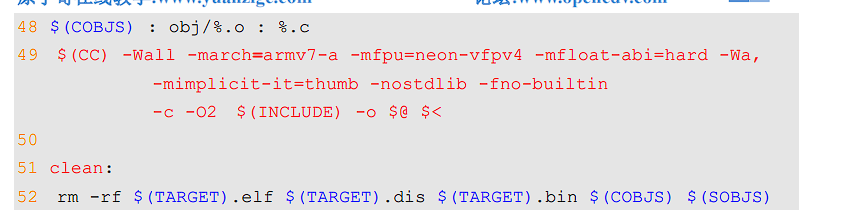
第 49 行加入了“-march=armv7-a -mfpu=neon-vfpv4 -mfloat-abi=hard”指令，这些指令用于指定编译浮点运算的时候使用硬件 FPU。
因为本章使用到了浮点运算，而 I.MX6U 是支持硬件FPU 的，虽然我们在 main 函数中已经打开了 NEON 和 FPU，但是在编译相应 C 文件的时候也要指定使用硬件 FPU 来编译浮点运算。

下载到SD卡运行即可

