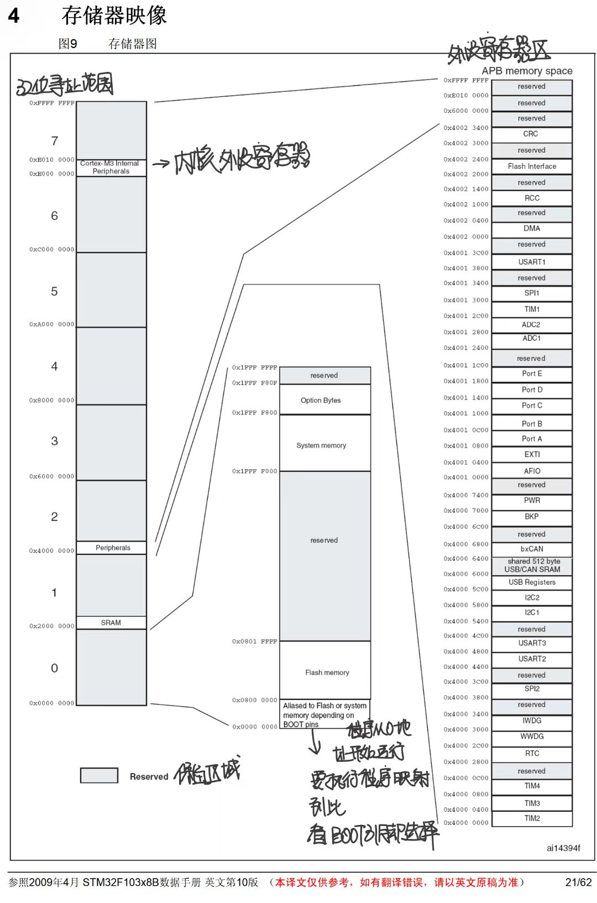

## 存储地址 链接地址和启动地址

### NAND Flash 与 NOR Flash

**NOR Flash** 和 **NAND Flash** 是两种常见的非易失性存储技术，它们在结构、性能、用途和成本上有一些显著的区别。
以下是它们的对比及每种存储类型的优缺点。

#### 1.NOR Flash

**NOR Flash** 是一种基于 NOR 间接存储器阵列的闪存类型，通常用于需要直接执行代码的应用中（如嵌入式系统中的程序存储）。

##### 主要特点：

- **存储结构**：NOR Flash 的存储单元通过串联的晶体管构成，类似于常规的静态 RAM（SRAM）架构。因此，它提供了一个可以按字节直接访问的存储结构。
- **地址访问**：每个存储单元都可以通过一个地址来直接访问，因此它支持 **随机访问**。这意味着可以像访问普通内存一样直接读取存储器中的数据。
- **读取速度**：由于其直接随机访问特性，NOR Flash 的读取速度通常较快，适合执行代码（如存储程序代码）。
- **写入和擦除速度**：写入和擦除速度较慢。因为它是按 **块（block）** 来擦除的，并且在写入过程中必须先擦除旧数据才能写入新数据。
- **成本**：通常比 NAND Flash 更昂贵。
- **耐久性**：NOR Flash 的擦写次数（即写入次数）比 NAND Flash 少。

##### 典型用途：

- **代码存储**：由于它的 **字节级随机访问** 特性，NOR Flash 适用于存储 **引导加载程序（bootloader）**、**操作系统** 或 **嵌入式应用程序代码**，并且因为可以直接执行存储在其中的代码，常用于嵌入式系统（如微控制器或嵌入式处理器）。
- **配置存储**：例如，存储固件或系统设置。

##### 示例：
- **STMicroelectronics NOR Flash**：如 M25P 系列。
- **Micron NOR Flash**：如 MT28EW系列。

#### 2.NAND Flash
**NAND Flash** 是另一种广泛使用的闪存类型，采用了 NAND 型存储架构。它的读写速度较快，适合大容量存储，但与 NOR Flash 相比，它在直接执行代码（XIP）方面表现较差。

##### 主要特点：
- **存储结构**：NAND Flash 的存储单元通过 **NAND 门**阵列组织，这使得它的存储密度更高。NAND Flash 按 **页（page）** 来存储数据，每个页一般为 2KB 至 16KB，大多数 NAND Flash 都是 **块（block）** 形式的，每个块包含多个页（一般为 64 页或更多）。
- **读取速度**：由于它是按 **页** 和 **块** 来组织存储的，NAND Flash 的 **顺序读取速度** 很快，尤其适合用于 **大容量存储**。
- **写入和擦除速度**：NAND Flash 的写入速度较快，但它也需要按块进行擦除。在写入数据之前，必须擦除所在的块。写入操作是按页进行的，而擦除是按块进行的，通常为 128KB、256KB 或 512KB 等块大小。
- **成本**：由于存储密度高，NAND Flash 的成本通常较低，适合大容量数据存储。
- **耐久性**：NAND Flash 在擦写次数上比 NOR Flash 多一些，通常达到 10,000 到 100,000 次。

##### 典型用途：
- **大容量存储**：NAND Flash 适用于存储大量数据，如 **固态硬盘（SSD）**、**USB 闪存驱动器**、**移动设备存储**、**相机存储卡** 等。
- **操作系统存储**：因为它的高密度和较低成本，常用于存储 **操作系统** 和 **大文件**（如多媒体文件、数据库等）。
- **数据存储**：大多数便携式设备（如智能手机、平板电脑、USB 存储器等）都采用 NAND Flash 来存储数据。

##### 示例：
- **Micron NAND Flash**：如 MT29F 系列。
- **Samsung NAND Flash**：如 K9系列。

#### 3.NOR Flash 与 NAND Flash 的对比

| 特性                | **NOR Flash**                                    | **NAND Flash**                               |
|---------------------|--------------------------------------------------|----------------------------------------------|
| **存储单元结构**     | 每个存储单元可以直接访问（字节级随机访问）       | 按块和页组织（块擦除，页写入）               |
| **读取速度**        | 快（适合随机读取，适合程序执行）                  | 较快（顺序读取速度高）                       |
| **写入/擦除速度**   | 较慢（按块擦除，逐页写入）                        | 较快（页写入，但按块擦除）                   |
| **存储容量**        | 较小（通常为几百 MB 到 1GB）                    | 较大（可达几 TB，适合大容量存储）            |
| **成本**            | 较高                                           | 较低                                        |
| **耐久性**          | 较低（通常为 10,000 到 100,000 次擦写）          | 较高（通常为 30,000 到 100,000 次擦写）      |
| **主要用途**        | 程序代码存储、固件存储                          | 数据存储、操作系统存储、大容量存储（SSD、USB）|
| **文件系统支持**    | 支持（通常是 FAT 文件系统）                     | 支持（通常是 EXT4、FAT、exFAT 文件系统）     |
| **随机访问支持**    | 支持（字节级访问）                              | 不支持（页级、块级访问）                     |

#### 4.使用场景和选择
- **NOR Flash 适用场景**：
  - **代码执行（XIP）**：由于其字节级访问，NOR Flash 适合存储程序代码，尤其是在嵌入式系统中，允许直接执行存储在其中的代码（如从 Flash 中直接启动操作系统）。
  - **固件和引导加载程序**：用于存储固件或引导加载程序（如 Bootloader），因为它可以快速访问并执行代码。

- **NAND Flash 适用场景**：
  - **大容量存储**：由于其高存储密度和低成本，NAND Flash 适用于需要大量数据存储的应用，如存储多媒体文件、操作系统镜像、数据库等。
  - **便携式存储设备**：USB 闪存驱动器、移动设备、数码相机等通常使用 NAND Flash 作为存储介质。
  - **固态硬盘（SSD）**：SSD 采用 NAND Flash 存储，提供快速的数据访问和高容量存储。

#### 5.总结
- **NOR Flash** 更适合 **程序存储和执行**，由于其支持字节级访问，非常适合用于嵌入式系统中存储代码。它的成本较高且存储容量较小，但在读取速度上表现更好，适用于需要快速执行的嵌入式应用。
- **NAND Flash** 则更适合用于 **大容量存储**，如 SSD、存储卡和大容量数据存储设备。它具有更高的存储密度和较低的成本，适用于需要大量存储空间的应用。

根据具体应用场景选择合适的存储技术，将有助于提高系统性能、降低成本，并满足系统的需求。

### STM32存储器映射



STM32微控制器的地址映射是系统内存、外设和其他资源如何在内存空间中分布的一种表示。
STM32系列微控制器的地址映射因型号不同而有所差异，但通常包括内核、外设、系统控制器、内存等区域。
以下是STM32常见的地址映射概述：

#### 1.内核和内存映射
STM32微控制器通常采用ARM Cortex-M系列处理器核（如Cortex-M3、M4、M7），其地址映射遵循ARM的内存映射规范。
典型的STM32内存映射包括以下几个主要区域：

##### 从地址 0x00000000 开始

- **0x00000000 - 0x1FFFFFFF**：**Flash存储器**（程序存储区）
  - 存储程序代码和常量。STM32微控制器的Flash大小可以是32KB、64KB、128KB、256KB等，具体取决于型号。
  
- **0x20000000 - 0x3FFFFFFF**：**SRAM**（静态随机访问存储器）
  - 存储运行时的数据、堆栈和变量。STM32的SRAM一般为几十KB，具体取决于型号。

- **0x40000000 - 0x500607FF**：**外设寄存器**（外设区域）
  - 这部分区域映射到微控制器的外设控制寄存器，包括GPIO、USART、SPI、I2C、定时器、DMA等外设。

- **0xE000E000 - 0xE00FFFFF**：**系统控制块和中断控制**（System Control Space）
  - 包括处理器的系统控制寄存器、嵌套向量中断控制器（NVIC）以及系统定时器（SysTick）等。

##### 特殊地址区域
- **0x1FF00000 - 0x1FF1FFFF**：**系统Flash控制寄存器**
  - STM32部分型号的Flash控制寄存器映射地址。

- **0xE0000000 - 0xE00FFFFF**：**外部设备控制区域**
  - 用于连接外部外设和系统控制器，如外部存储器接口、SD卡控制器等。

##### 外部存储器映射（根据需要）
- **0x60000000 - 0x9FFFFFFF**：**外部存储器映射区**
  - 用于连接外部RAM、外部Flash等存储器。

#### 2.外设地址映射
STM32的外设控制寄存器映射在地址空间的`0x40000000`到`0x500607FF`之间。具体的外设地址分配取决于芯片型号，但通常是根据外设种类来分配的。例如：

- **0x40010000 - 0x400103FF**：GPIO端口
- **0x40020000 - 0x400203FF**：USART
- **0x40021000 - 0x400213FF**：SPI
- **0x40022000 - 0x400223FF**：I2C
- **0x40023000 - 0x400233FF**：定时器
- **0x40024000 - 0x400243FF**：ADC
- **0x40025000 - 0x400253FF**：DAC
- **0x40026000 - 0x400263FF**：DMA

#### 3.系统控制寄存器
STM32中有一部分地址是专门用于系统控制和中断管理的，这些控制寄存器主要映射在以下区域：
- **0xE000E000 - 0xE00FFFFF**：ARM的系统控制块和中断控制器（例如：NVIC、SysTick等）。

#### 4.中断向量表
中断向量表位于内存的起始位置（`0x00000000`），具体位置取决于芯片的启动模式。中断向量表是处理器在重启或中断时根据中断向量跳转的地方。

#### 5.STM32的特殊映射
STM32还包括一些芯片特定的映射区域，如：
- **0x1FFF0000 - 0x1FFF77FF**：存储器映射的设备ID和唯一标识符（UID），用于识别芯片。
- **0x20000000 - 0x2001FFFF**：SRAM，内存区块。

#### 地址映射总结：
- **Flash**：从 `0x00000000` 起，存储程序代码。
- **SRAM**：从 `0x20000000` 起，存储数据、堆栈等。
- **外设寄存器**：从 `0x40000000` 开始，映射所有外设的控制寄存器。
- **系统控制区域**：从 `0xE000E000` 开始，存放ARM系统控制和中断管理相关的寄存器。

注：具体的地址映射会有所不同，取决于STM32微控制器的具体型号。例如，STM32F1、STM32F4和STM32L4系列在外设、Flash、SRAM等区域的映射上可能有所不同，因此在开发时需要查看相应芯片的参考手册。

### 链接地址、启动地址与存储地址

STM32微控制器的存储地址与链接地址（Link Address）是两个重要的概念，涉及程序在内存中的布局。
理解它们对嵌入式开发和程序的加载非常重要。

#### 1.存储地址
存储地址通常指的是程序或数据在物理内存中被存放的位置。
在STM32微控制器中，存储地址指的是Flash、SRAM、外设寄存器等资源在内存中的物理地址。

##### 内存区域
- **Flash存储器**：程序代码和常量数据存储的地方。通常映射到地址`0x00000000`及其后续区域，具体取决于芯片的大小和配置。例如，STM32F1系列的Flash可能是16KB、32KB、64KB、128KB等，映射到地址`0x08000000`开始。
- **SRAM**：运行时数据存储区，包括栈、堆和全局变量。通常在STM32微控制器中，SRAM映射在地址`0x20000000`附近。
- **外设**：STM32的外设寄存器（GPIO、USART、SPI、I2C等）映射在`0x40000000`到`0x500607FF`的地址范围内。

#### 2.链接地址（Link Address）
链接地址是指程序在链接阶段（Linking）指定的虚拟地址，它决定了程序在执行时应如何映射到内存中的特定位置。**链接地址通常由链接器在生成最终的可执行文件时确定。**

##### 链接地址的设置
链接地址决定了程序的各个段（如`.text`段、`.data`段、`.bss`段等）在内存中的起始位置。链接器脚本（`ld`脚本）通常用于定义这些地址。

例如：
- **代码段（.text段）**：通常存储在Flash中，链接地址为`0x08000000`（假设Flash映射起始地址）。
- **数据段（.data段）**：初始化的数据存储区域，链接地址通常为`0x20000000`，映射到SRAM中。
- **堆栈和堆（.stack、.heap段）**：这些通常会被链接到SRAM的某个特定区域，如`0x20010000`。


##### 启动地址与链接地址的关系
- **启动地址**：指的是STM32微控制器在启动时执行程序的地址，通常是Flash的起始地址（如`0x08000000`）。
- **链接地址**：链接地址是编译链接时定义的地址，它指示程序段在目标内存区域中的位置。最终执行时，程序加载到这些地址空间并执行。

##### 链接脚本示例
在STM32项目中，通常会有一个链接脚本（`.ld`文件）来定义各个段的链接地址。例如：
```ld
ENTRY(Reset_Handler)  /* 设置程序的入口点 */

MEMORY {
  FLASH (rx) : ORIGIN = 0x08000000, LENGTH = 512K   /* Flash的起始地址和长度 */
  SRAM (rw)  : ORIGIN = 0x20000000, LENGTH = 64K    /* SRAM的起始地址和长度 */
}

SECTIONS {
  .text : { *(.text) } > FLASH    /* 代码段 (.text) 被链接到 FLASH 区域 */
  .data : { *(.data) } > SRAM    /* 数据段 (.data) 被链接到 SRAM 区域 */
  .bss  : { *(.bss) } > SRAM     /* 未初始化数据段 (.bss) 被链接到 SRAM 区域 */
  .stack : { *(.stack) } > SRAM  /* 堆栈段 (.stack) 被链接到 SRAM 区域 */
}
```
在上述链接脚本中：
- `.text`段的代码被链接到Flash的起始地址`0x08000000`。
- `.data`和`.bss`段的变量被链接到SRAM的起始地址`0x20000000`。

#### 3.启动和重定位
在STM32微控制器中，通常需要使用启动代码来设置正确的链接地址和处理程序的启动。启动代码（如`startup_stm32.s`或`system_stm32.c`）会初始化系统堆栈、设置中断向量表，并将数据从Flash复制到SRAM中。

- **中断向量表**：通常存储在Flash的起始地址（`0x08000000`）处。中断向量表在启动时会被加载到处理器的中断控制寄存器中，指向对应的中断服务程序（ISR）。

- **重定位**：如果程序需要重定位（例如在不同的内存区域运行），则链接器脚本会将代码段、数据段等段映射到不同的地址，并在启动时执行相应的重定位操作。

#### 4.实际使用中的链接地址设置
- **程序在内存中的映射**：当代码执行时，程序会根据链接地址加载到内存中。启动时，微控制器会从Flash的起始地址开始执行代码。然后，在初始化过程中，程序会将必要的数据从Flash复制到SRAM中（如`.data`段）。
- **内存布局设计**：在设计内存布局时，需要考虑Flash和SRAM的大小限制，以及程序的不同段（如代码段、数据段）的需求。

#### 总结
- **存储地址**：是程序在实际内存中分配的位置，如Flash和SRAM的地址范围。
- **链接地址**：是编译和链接时指定的地址，决定了程序和数据在内存中的布局。
- **启动地址**：通常是程序执行的起始地址，通常为Flash的起始地址`0x08000000`。

理解这些概念有助于在嵌入式开发中合理地安排程序的内存布局，确保代码和数据能够正确加载和执行。

STM32中的启动地址Flash中的0x0800000；

### imx6ull的启动地址

i.MX6ULL（由NXP半导体生产）是基于ARM Cortex-A7核心的处理器，其启动地址是由系统架构和硬件设计决定的。
在i.MX6ULL中，启动地址主要涉及到从存储设备（如NAND Flash、eMMC或SD卡）加载引导程序（Bootloader）和操作系统的过程。
以下是i.MX6ULL的启动过程和相关的启动地址信息。

#### 1.启动过程概述
i.MX6ULL的启动过程通常如下：
1. **引导加载程序（Bootloader）**：设备上电后，首先会加载启动引导加载程序（如U-Boot）。这通常从NAND Flash、eMMC或SD卡中的特定位置开始执行。
2. **U-Boot加载器**：引导加载程序（如U-Boot）会初始化硬件，检测存储设备，然后加载操作系统（如Linux）到内存中。
3. **操作系统启动**：操作系统内核（如uImage或zImage）被加载到内存并开始执行。

#### 2.启动地址
在i.MX6ULL中，启动地址和存储设备的选择有关。默认的启动顺序如下：

##### 从NAND Flash启动
- **NAND Flash**的启动地址通常从`0x10000000`开始，这个地址是i.MX6ULL处理器内存映射的一部分。具体的启动地址取决于引导加载程序（如U-Boot）的位置和偏移量。

##### 从eMMC或SD卡启动
- **eMMC/SD卡**上的引导程序通常存储在设备的前几个扇区（如SD卡的第一个扇区）或特定位置。在使用SD卡时，U-Boot通常会在SD卡的启动分区（例如第一个分区）加载。
- 在eMMC或SD卡的启动过程中，启动地址通常会在引导加载程序内配置。一般来说，SD卡或eMMC的引导程序会加载到内存的低地址部分，然后引导操作系统内核。

##### 从NAND Flash或eMMC加载到内存的地址
在i.MX6ULL中，操作系统内核通常会被加载到内存中的特定区域。例如：
- **内核加载地址**（对于uImage或zImage）：通常会加载到内存的`0x12000000`或`0x10800000`等地址。
- **设备树文件**：设备树文件（.dtb）和内核映像文件会一起被加载到内存中，通常与内核映像一起加载，地址范围通常是`0x12000000`及其附近的内存区域。

#### 3.内存映射和启动地址示例
在i.MX6ULL的启动过程中，U-Boot会负责引导操作系统内核，它会从预设的存储设备（NAND、eMMC、SD卡等）加载内核到内存中，具体的映射如下：

- **NAND Flash起始地址**：`0x10000000`（通常，U-Boot会从此地址读取并执行引导加载程序）
- **内核加载地址**：`0x12000000`（或类似地址，具体取决于配置）
- **设备树地址**：`0x13000000`（或紧随内核之后）
- **堆栈、BSS段等**：通常映射到SRAM或其他内存区域，具体位置依赖于内存分配。

#### 4.U-Boot的启动地址
U-Boot的启动地址通常位于NAND Flash的一个特定分区或eMMC/SD卡的特定偏移位置。这个地址可以通过U-Boot的配置文件来设置。在U-Boot启动后，它会加载操作系统（如Linux内核）到内存中的预定位置。U-Boot本身也会在内存的某个地址范围内运行，通常在低地址段（例如`0x10008000`等）执行。

#### 5.处理器启动流程总结
- **处理器复位**时，i.MX6ULL从固定的起始地址（通常是内部SRAM）开始执行。
- **引导程序（如U-Boot）**会首先从预定义的存储设备（如NAND Flash、eMMC、SD卡）加载，并执行一些初始化操作。
- **内核加载**：U-Boot将操作系统内核加载到内存（通常在`0x12000000`附近）并启动它。
- **内核启动**：操作系统内核会接管控制并初始化系统，进入主应用程序。

#### 总结
- **启动地址**：i.MX6ULL的启动地址通常取决于引导加载程序的位置。默认情况下，处理器的引导加载程序（如U-Boot）会从存储设备（如NAND Flash、eMMC或SD卡）加载，启动地址通常为`0x10000000`（NAND Flash起始地址）或`0x12000000`（内核加载地址）。
- **内核加载地址**：内核通常会加载到`0x12000000`附近的内存区域，具体取决于配置。

<span style="color:red">自此我们解决了，imx6ull的启动地址问题：imx6ull是从emmc sd卡等设备启动的，其存储设备均为NAND Flash，这个flash的特点是按页读取和擦除。我们在管理时，是按照分区和文件系统的概念管理。所以不存在启动地址一说。
我们在imx6ull链接阶段是完全的把所有的代码加载到了DDR中 0x89800000 我们也可以通过编写链接脚本，设置不同段的存储地址不同，这个是链接地址的意义，链接地址不存在是属于RAM还是ROM，stm32中flash 采用的是NOR flash 可以按照字节编制，所有有了启动地址的概念，所以我们链接时直接连接到flash中，从flash中读取代码执行。
具体到RAM中的哪里去执行，我们还是要通过编写链接脚本实现。链接地址 --- 确定代码的位置</span>


### imx6ull链接地址

在 i.MX6ULL 这样的 ARM Cortex-A7 处理器上，**链接地址**是指在编译和链接过程中，程序的各个段（如 `.text` 段、`.data` 段、`.bss` 段等）在内存中分配的虚拟地址。
链接地址是由链接器脚本（`.ld` 文件）在构建阶段指定的，它决定了程序在执行时如何映射到内存。

i.MX6ULL 作为 ARM Cortex-A7 处理器，它的内存架构和启动过程会影响链接地址的设置。
通常，链接地址会根据目标设备的内存布局来设计，以确保程序的代码、数据、堆栈等部分能够正确加载和运行。

#### i.MX6ULL的常见链接地址布局
i.MX6ULL的内存空间包括Flash、SRAM和外部存储（如eMMC、NAND Flash）。
根据这些内存资源，链接地址会根据程序存储位置（Flash、RAM等）和加载位置来设置。

##### 1.内核的链接地址
通常，在嵌入式开发中，内核（比如uImage或zImage）会被加载到物理内存中的某个位置。对于 i.MX6ULL，内核的链接地址通常位于：

- **内核代码（`.text`段）**：通常链接到内存的某个地址，如 `0x10800000` 或 `0x12000000`（具体取决于配置和启动流程）。
- **设备树文件（`.dtb`段）**：通常与内核一起加载，链接到与内核相邻的内存地址。

##### 2.启动代码（Bootloader）的链接地址
启动代码（如 U-Boot）通常被加载到较低的地址，并负责初始化系统。U-Boot的常见链接地址可能如下：
- **U-Boot的链接地址**：例如 `0x10008000`，这个地址通常指向内部RAM或特定的NAND Flash区域。

##### 3.内存区域和链接地址的分配
i.MX6ULL的内存布局通常包括以下几个主要区域（以MB为单位）：

- **NAND Flash**（如果存在）: 用于存储引导程序、操作系统镜像等，通常从 `0x10000000` 开始。
- **eMMC/SD卡**：用于存储操作系统和文件系统等，启动过程通过引导加载程序加载内核。
- **内存（RAM）**：SRAM区域通常从 `0x10000000` 或 `0x20000000` 开始。

在链接脚本中，开发者需要根据这些内存区域的地址来定义程序和数据的加载地址。

##### 4.链接地址示例（链接脚本）
假设一个简单的嵌入式应用程序，内核（uImage）和设备树文件（.dtb）都要加载到内存中。以下是一个简化的链接脚本示例，展示了如何为内核和设备树设置链接地址：

```ld
ENTRY(_start)  /* 设置程序的入口点 */

MEMORY {
  FLASH (rx) : ORIGIN = 0x08000000, LENGTH = 256K  /* Flash区 */
  RAM (rw)   : ORIGIN = 0x10000000, LENGTH = 512M  /* 内存区 */
}

SECTIONS {
  /* 内核代码段 .text 链接到 RAM */
  .text : { *(.text) } > RAM
  
  /* 数据段 .data 链接到 RAM */
  .data : { *(.data) } > RAM
  
  /* BSS段 .bss 链接到 RAM */
  .bss : { *(.bss) } > RAM

  /* 设备树文件 .dtb 链接到 RAM */
  .dtb : { *(.dtb) } > RAM

  /* 堆栈和堆的分配 */
  .stack : { *(.stack) } > RAM
  .heap : { *(.heap) } > RAM
}
```

在上面的链接脚本中：
- **内核代码**（`.text`段）和**数据段**（`.data`段）都被链接到RAM（例如 `0x10000000`）。
- 设备树文件（`.dtb`）也被链接到RAM中的地址，通常紧随内核加载。
  
具体的地址取决于你的硬件配置和U-Boot、内核等软件的设置。内核映像通常会加载到 `0x12000000` 或 `0x10800000` 等地址。

##### 5.典型的链接地址配置
在实际的开发过程中，链接地址和内存布局的配置会依据以下几个因素决定：
- **内核加载地址**：通常为 `0x12000000` 或类似的较高地址。
- **引导加载程序地址（如U-Boot）**：通常为较低地址，如 `0x10008000` 或 `0x10000000`。
- **设备树文件地址**：通常紧随内核后面，如 `0x13000000`。
- **堆和栈的地址**：会根据内存分配策略放置在合适的RAM区域。

##### 6.链接器脚本的重要性
链接器脚本（`.ld` 文件）是嵌入式开发中至关重要的文件，它定义了程序在内存中的布局。开发者需要根据目标硬件平台的内存布局，调整链接地址，确保程序能够正确加载并在设备上运行。

#### 总结
- **链接地址**指程序的各个部分（如代码段、数据段）在内存中的分配地址，通常由链接器脚本指定。
- 在 i.MX6ULL 中，常见的内核链接地址为 `0x12000000`，U-Boot的链接地址通常较低，如 `0x10008000`。
- 根据系统的内存布局（如内存、Flash、eMMC等），链接地址会相应地配置。
- 开发者通常会通过修改链接脚本来确保程序和数据正确映射到目标内存区域。

### 链接地址位置

**链接地址**可以是 **RAM**（随机访问内存）的地址，也可以是 **ROM**（只读存储器，如 Flash）的地址，这取决于程序的不同阶段和内存区域的用途。
简而言之，**链接地址**并不固定，它依赖于程序的目标存储设备以及内存布局设计。

以下是针对 **RAM** 和 **ROM** 的一些常见情况：

#### 1.程序在ROM中的链接地址（如 Flash）
- **ROM**（如 Flash）通常存储程序的代码、常量数据以及启动代码。链接地址通常指定程序的各个段（如 `.text`、`.data`）应该如何存储到 Flash 的特定位置。
  
- **启动代码**（如 U-Boot 或启动引导程序）通常存储在 Flash 中。其链接地址通常在 Flash 的某个位置，如 `0x08000000`（对于 i.MX6ULL）。此时，**链接地址**指向的是 Flash 中的某个地址。

- **内核代码**（例如 Linux 内核、uImage 或 zImage）通常会链接到 Flash 中。启动时，程序会从 Flash 中加载到 RAM 中执行。

##### 例子：
- **Flash 中的启动代码**：
    - 假设 U-Boot 存储在 Flash 的地址 `0x08000000`，链接地址就是 `0x08000000`。
    - 启动程序会从该位置加载到 RAM 中，接着执行初始化。

- **内核加载地址**：
    - 对于 Linux 内核，它可能存储在 Flash 中，如 `0x08008000`（假设程序从该位置加载），但最终会被加载到 RAM 中的某个位置进行执行。

#### 2.程序在RAM中的链接地址
- **RAM** 通常存储程序运行时的数据，包括 **堆栈**、**堆** 和 **全局变量**，以及操作系统的内核（如 Linux 内核）在启动后从存储设备加载到 RAM 的位置。
  
- 当程序运行时，启动代码会从 Flash 或其他外部存储设备加载到 RAM 中。内核、堆栈、全局数据等通常会链接到 RAM 的地址。

- 在启动过程中，**链接地址**通常指定程序段应该被加载到 RAM 的具体位置。

##### 例子：
- **内核在 RAM 中的链接地址**：
    - 例如，uImage 或 zImage 在编译和链接过程中指定了一个链接地址，比如 `0x12000000`（假设这是 RAM 中的某个地址）。这个链接地址是在链接阶段定义的，但它指示程序应该在实际执行时被加载到 RAM 中。

- **数据段和堆栈的链接地址**：
    - `.data` 和 `.bss` 段通常会链接到 RAM 中的某个位置，例如 `0x20000000`（这是常见的 SRAM 起始地址），这些区域存储运行时的全局变量和未初始化数据。

#### 3.链接地址与内存布局
- **ROM（Flash）**：存储程序的代码、启动代码、固件等。在嵌入式系统中，通常会从 ROM 中的特定地址加载程序到 RAM 中。
    - **链接地址**：ROM 中的链接地址是指程序代码（如启动代码、引导程序、固件等）在 ROM 中的存储地址。

- **RAM**：存储程序运行时需要的数据，如堆、栈、全局变量、动态分配的内存等。在程序加载后，RAM 是程序运行的主要存储区域。
    - **链接地址**：RAM 中的链接地址通常指定程序在 RAM 中的存储位置，尤其是在程序执行时。

#### 4.链接地址设置
- **对于程序代码（`.text`段）**，如果程序从 Flash 中加载到 RAM 中执行，链接地址通常在 **Flash** 中定义，但程序最终会在 RAM 中执行。链接脚本会指定 `.text`、`.data`、`.bss` 等段的具体链接地址。
  
- **对于数据段（`.data`和`.bss`）**，这些通常会链接到 **RAM** 中，例如 SRM 或 DRAM，这部分内存会在程序启动时初始化。

#### 5.启动过程与链接地址
- **从ROM（如 Flash）加载到RAM**：启动程序（如 U-Boot 或引导加载程序）通常存储在 Flash 中，在启动时被加载到 RAM 中，并在 RAM 中执行。程序链接到 Flash 的地址通常是启动代码所在的地址，而程序执行后会使用 RAM 作为运行时存储。

- **RAM 地址**：程序在执行时使用 RAM 来存储堆、栈和全局变量等。链接器脚本会根据目标内存布局将数据段和代码段链接到指定的内存地址。

#### 总结
- **链接地址**可以是 **ROM**（如 Flash）的地址，通常用于存储程序代码、引导程序等，程序会从这些位置加载到内存中执行。
- **链接地址**也可以是 **RAM** 的地址，程序或数据段会被链接到 RAM 中，程序执行时需要从 RAM 中运行。

具体的链接地址设置取决于程序的目标存储设备、内存布局以及链接脚本的配置。

### SD卡启动

在 **STM32** 中，Flash 存储器有非常明确的地址概念，因为它是一个非易失性存储器，通常用于存储程序代码、常量数据以及启动代码。STM32 的 Flash 存储器有固定的物理地址，如 `0x08000000`，并且程序通过链接器配置文件（Linker Script）将代码和数据映射到这些地址。

然而，**SD卡** 和 **eMMC** 与 STM32 中的 Flash 存储有一些重要的区别。
它们不是内嵌式的固定存储器，而是基于文件系统和分区的外部存储介质。
因此，它们没有像 STM32 Flash 那样的直接地址映射概念，但可以通过分区、块地址和文件系统来访问。

#### 1.SD卡和 eMMC 存储原理
- **SD卡** 和 **eMMC** 是 **外部存储介质**，它们通常是 **块存储设备**。SD 卡和 eMMC 没有固定的“地址”概念，像 Flash 那样直接映射到程序执行的内存区域。相反，它们通过块（block）和扇区（sector）来管理存储。
  - **块（block）**：SD卡或eMMC的存储单元，通常是512字节或更大，按块进行读写。
  - **扇区（sector）**：是块的细分单位，通常为512字节或1024字节。
- 它们的存储分为多个分区，每个分区可以有不同的格式（如 FAT32 或 EXT4），并且每个分区有自己的文件系统。

#### 2.SD卡和eMMC 中的“地址”概念
虽然 SD 卡 和 eMMC 没有像 STM32 中 Flash 那样的固定地址，但可以通过以下几种方式理解其存储“地址”：

##### 2.1 分区
SD 卡 和 eMMC 通常被分为多个分区（例如，启动分区和数据分区），每个分区有一个 **起始地址** 和 **大小**，这些分区可以被操作系统识别并格式化为文件系统（如 FAT32、EXT4）。

- **SD 卡分区**：例如，`/dev/mmcblk0p1` 代表 SD 卡的第一个分区，`/dev/mmcblk0p2` 代表第二个分区。
- **eMMC 分区**：eMMC 设备通常也有多个分区，像 `/dev/mmcblk0p1`、`/dev/mmcblk0p2` 等表示不同的分区。

通过分区和文件系统，SD 卡和 eMMC 可以存储多个文件，并且可以通过文件路径来访问其中的内容，而不是通过直接的地址。

##### 2.2 扇区/块地址
- 在硬件层面，SD 卡和 eMMC 都是基于 **块地址（Block Address）** 进行数据存储和访问的，每个块通常是 512 字节。你可以通过块地址进行低级别的读写操作，而不需要了解具体的文件内容。

  - **块地址**：例如，`mmcblk0` 是 SD 卡或 eMMC 的设备名，`mmcblk0p1` 是分区名。
  - 你可以使用工具如 `dd` 或 `blockdev` 来直接操作这些设备，按块读写数据。例如：

    ```bash
    dd if=/dev/mmcblk0p1 of=boot.img bs=512 seek=2048
    ```

    这条命令将从 SD 卡或 eMMC 的第 2048 块（以 512 字节为单位）读取数据，并保存为 `boot.img`。

##### 2.3 启动加载器和文件系统
- **引导加载器（Bootloader）**（如 U-Boot）负责从 SD 卡或 eMMC 的特定位置加载启动代码。在 U-Boot 中，你通常会看到配置的启动命令来指定 SD 卡或 eMMC 的特定分区和地址，如下所示：

  ```bash
  mmc dev 0  # 选择第一个 SD 卡设备
  mmc read $loadaddr 0x1000 0x2000  # 从 SD 卡的起始位置读取到指定的 RAM 地址
  ```

  在这种情况下，`0x1000` 和 `0x2000` 是 SD 卡的扇区/块地址，而 `$loadaddr` 是加载到内存中的地址。

#### 3.启动代码从 SD 卡 或 eMMC 加载
在 **i.MX6ULL** 等处理器中，通常会从 SD 卡的第一个分区（例如 `mmcblk0p1`）加载启动代码（如 U-Boot）。此时，SD 卡分区的地址和起始扇区通常由 **Boot ROM** 或启动加载程序配置。

- **从 SD 卡启动时**，Boot ROM 会尝试从 SD 卡的第一个分区（通常是 `mmcblk0p1`）加载引导程序。分区的位置通常通过 Boot ROM 或 U-Boot 的配置文件来指定。例如，U-Boot 可能会配置 `mmc read` 命令来从 SD 卡的特定分区和起始位置读取 U-Boot 镜像，并将其加载到 RAM 中。

##### 示例 U-Boot 启动命令：
```bash
mmc dev 0  # 选择第 0 个设备（通常是 SD 卡）
mmc read $loadaddr 0x2000 0x1000  # 从 SD 卡的第 0x2000 扇区开始读取 U-Boot 镜像，读取 0x1000 个块
```

#### 4.如何确定从 SD 卡 或 eMMC 读取的地址
1. **分区表**：SD 卡和 eMMC 通常有一个分区表，通过查看分区表（如通过 `fdisk` 或 `parted`），可以确定启动代码存储的位置。
2. **文件系统**：通过文件系统（如 FAT32）可以读取分区中的文件。启动代码（如 `u-boot.img` 或 `zImage`）通常存储在特定的文件位置，U-Boot 或其他引导程序会从这些文件中加载启动镜像。
3. **引导加载程序配置**：引导加载程序（如 U-Boot）会配置从 SD 卡或 eMMC 的哪个分区和地址加载启动代码。你可以查看 U-Boot 的配置文件或使用 `mmc read` 命令查看它的行为。

#### 5.总结
- **SD 卡** 和 **eMMC** 并没有像 **STM32 Flash** 那样的物理地址概念。它们通过 **块地址** 和 **扇区地址** 进行数据存取，文件系统和分区管理则提供了对文件的访问。
- **从 SD 卡或 eMMC 启动**时，**Boot ROM** 和引导加载程序（如 U-Boot）会从 SD 卡的特定分区和地址读取启动代码。启动代码通常存储在分区的特定位置。
- **启动分区和地址**通常通过 U-Boot 配置文件中的命令来指定，如 `mmc read`，并由 Boot ROM 和引导加载程序执行。

你可以通过查看 **分区表**、**文件系统**以及 **引导加载程序的配置**来确定启动代码的存储位置。


<span style="color:red">以上内容全部由AI生产，仅供参考</span>

<span style="color:red">1. 主要理解NAND Flash NOR Flash的区别
2. 为什么imx6ull链接时是在DDR中，而STM32是在Flash中
3. 存储地址 启动地址 以及 链接地址的真正含义</span>

新问题？为什么要链接到DDR的87800000地址？？链接到DDR其他地址还能正常运行吗？