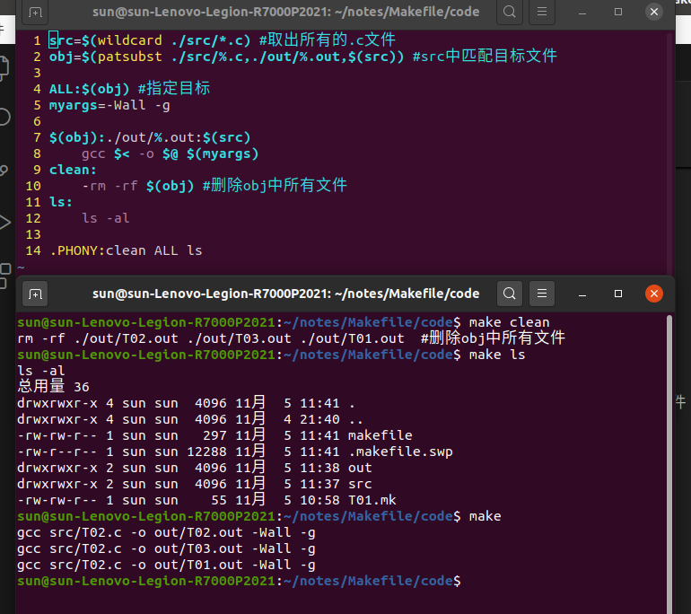
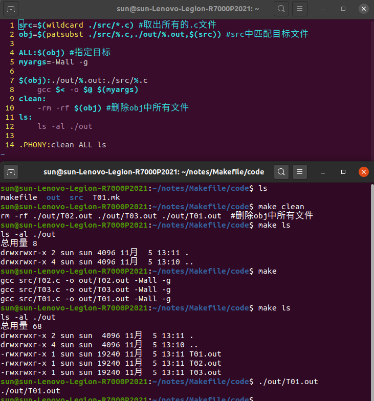

# Makefile

## 一、介绍

makefile 可以作为一个项目管理工具，放入项目文件夹，使用固定的规则来管理项目类似cmake

makefile的标准命名：
- makefile
- Makefile

## 二、语法

多文件编译
> gcc hello.c sub.c add.c -o hello.out

将多个源文件编译成一个可执行文件(在Makefile中一般会各自编译，最后一起链接，实现只能编译)

### 2.1 一个规则
```
目标：依赖条件
    命令 #(一个tap)
```
智能编译：

    1. 目标文件时间晚于所有的依赖条件时间，否则说明条件文件改变，进行编译更新
    2. 依赖条件不存在，会自动寻找新的规则，以产生依赖条件（存在直接生成，不存在向下继续匹配生成）

### 2.2 最终目标

```
ALL:output.out
#生成后退出makefile文件
```

### 2.3 两个函数

- 提取源文件：
    src=$(wildcard ./src/*.c) #src中会返回./src中 所有的以.c结尾的文件名
- 文件名替换：
    obj=\$(patsubstv ./src/\%.c, \./obj/\%.o,\$(src))
    \%代表不变量，匹配任意字符不改变
    此函数操作会将$(src)中取得的所有的./src/\%.c 文件替换为./obj/\%.o并将替换后的结果存入obj

**makefile**函数的使用：

- 函数调用： $(函数名 参数)
- 函数返回值： src=$(函数 参数) 返回值只有字符串类型，但是可以组成列表
- 取值： $(src) 可以从src取得内部的值

### 2.4 makefile命令

make命令： 默认执行文件夹内命名为makefile的脚本文件

make -f filename：执行文件名为filename的makefile脚本文件

注意：可以在文件中添加有目标但是无依赖的命令，用于执行某些操作
如：
```
clean:
    -rm -rf $(obj) a.out
```
命名了clean命令 循环删除obj和a.out文件,-rm表示及时删除出错，也不做任何反应，继续执行

执行时：

> make -f file.mk clean -n 

执行文件中clean命令 -n表示模拟执行

### 2.5 三个自动变量

只存在于规则中的命令中，其范围是规则中的目标和条件

- \$@:表示目标
- \$<:表示第一个依赖条件
- \$^:表示全部的依赖条件(列表)
  
### 2.6 注释

\#号注释

### 2.7 模式匹配 \%匹配

普通模式匹配:
```
./obj/%.o:./src/%.c #目标./obj/%.o,条件./src/%.c 条件满足既可以匹配成功
    gcc -c $< -o $@ $(myargs) #将条件编译称目标 myargs自己定义的其它参数
```
静态模式匹配：
```
$(obj):%.o:%.c
    gcc -c $< -o $@
```
指定只有obj中的.o文件可以套用此模式，指定模板范围

### 2.8 伪目标

make clean 由于本身没有条件，故而目录中有clean文件后就不在执行

可以加个伪目标用于重复执行

.PHONY：clean ALL

伪目标声明的文件其命令一定会被执行（必须声明）
### 2.9 自定义变量
```
myargs=-Wall -g
```
用$(myargs)访问即可

补充：makefile有默认的库变量如cc，与用户自定义变量冲突，优选选取自定义
## 三、实战项目

项目构造: 

projectfile : src out makefile

每次make会将src中文件生成文件放于out中

```
  1 src=$(wildcard ./src/*.c) #取出所有的.c文件
  2 obj=$(patsubst ./src/%.c,./out/%.out,$(src)) #src中匹配目标文件
  3 
  4 ALL:$(obj) #指定目标
  5 myargs=-Wall -g
  6 
  7 $(obj):./out/%.out:$(src) #只对obj中的属性进行匹配
  8     gcc $< -o $@ $(myargs)
  9 clean:
 10     -rm -rf $(obj) #删除obj中所有文件
 11 ls:
 12     ls -al
 13 
 14 .PHONY:clean ALL ls                         
```


