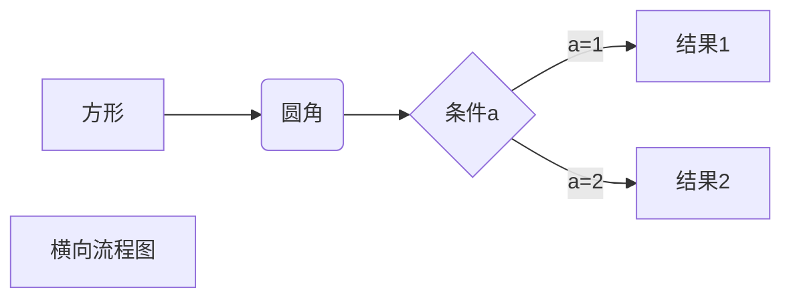
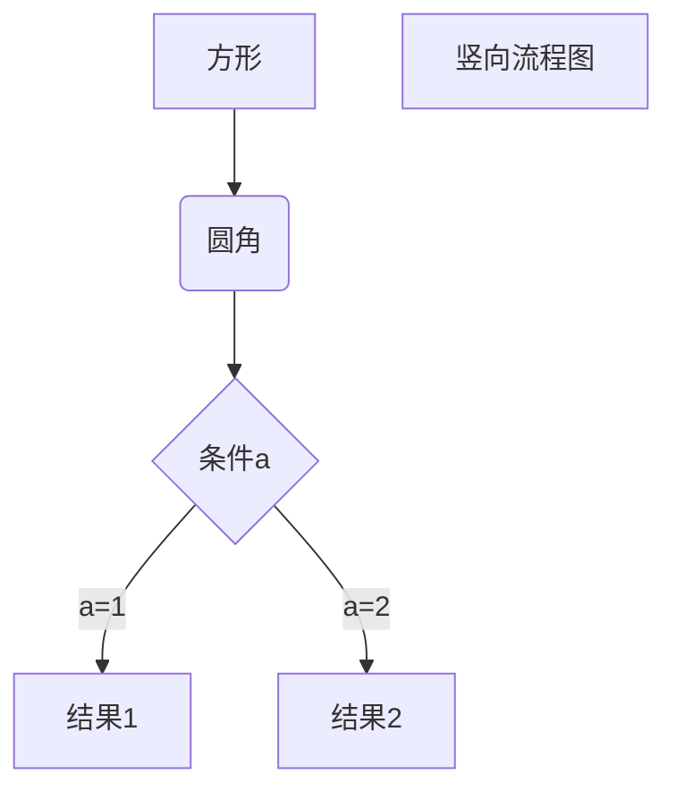

# Markdown高级技巧

## 支持HTML标签编写

如：\<kbd> \<b> \<i> \<em> \<sup> \<sub> \<br>等
``` html
使用 <kbd>Ctrl</kbd>+<kbd>Alt</kbd>+<kbd>Del</kbd> 重启电脑
```

HTML基本标签：随用随查

笔记记录：


## 转义字符

Markdown 使用了很多特殊符号来表示特定的意义，如果需要显示特定的符号则需要使用转义字符，Markdown 使用反斜杠转义特殊字符“

```
**文本加粗** 
\*\* 正常显示星号 \*\*
```

Markdown 支持以下这些符号前面加上反斜杠来帮助插入普通的符号：

```
\   反斜线
`   反引号
*   星号
_   下划线
{}  花括号
[]  方括号
()  小括号
#   井字号
+   加号
-   减号
.   英文句点
!   感叹号
```

## 公式

\$...\$ 或者 \\(...\\) 中的数学表达式将会在行内显示。
\$\$...\$\$ 或者 \\[...\\] 或者 ```math 中的数学表达式将会在块内显示

示例方式1：
$$
\begin{Bmatrix}
   a & b \\
   c & d
\end{Bmatrix}
$$
$$
\begin{CD}
   A @>a>> B \\
@VbVV @AAcA \\
   C @= D
\end{CD}
$$

示例方式2：
```math
\begin{Bmatrix}
   a & b \\
   c & d
\end{Bmatrix}
```

示例方式3：

\[
    \begin{Bmatrix}
   a & b \\
   c & d
\end{Bmatrix}
\]

## 流程图

### 横向流程图源码
```

```
展示：


### 竖向流程图
```

```
展示：


