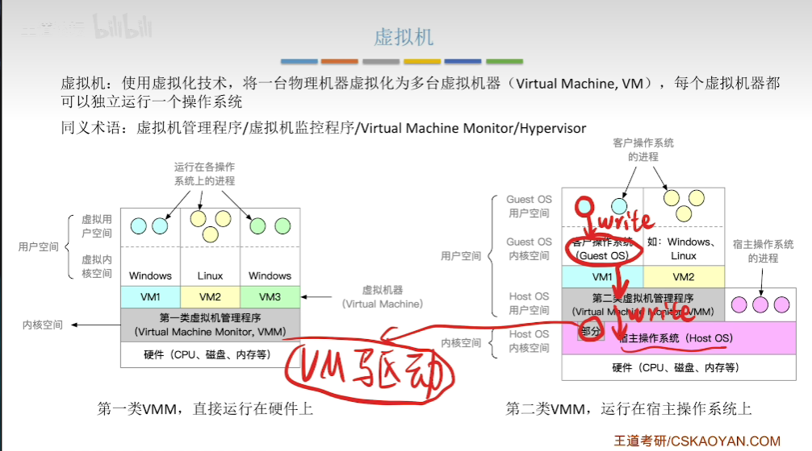

# OS笔记

## 第一章 操作系统基本概念

### 1.1 OS的概念和功能

#### 1.1.1 概念

**计算机系统的层次结构**：

**OS的基本定义**：

控制和管理整个计算机系统的硬件和软件资源，并合理组织分配计算机工作和资源的分配，提供给用户和其他软件方便的接口和环境 (操作系统是最基本的系统软件)

功能：
- 操作系统是系统资源的管理者
- 向上层提供方便易用的服务
- 最接近硬件的软件

#### 1.1.2 功能

**OS的基本功能**：

作为系统管理者：

- 文件管理
- 存储器管理(内存控制)
- 处理机管理(进程管理)
- 设备管理

目标为了实现安全和高效

 ---

为上层提供服务：

封装思想：将硬件的二进制接口封装成简单易用的服务，提供给上层应用程序调用

服务如下：
- GUI图像化用户接口(普通用户)
- 命令式接口服务(普通用户)
  - 联机命令接口(交互式) cmd命令
  - 脱机命令接口(批处理) bat批处理
- 程序接口(程序员软件配置)
  - 程序中使用系统调用使用程序接口

系统调用也被称为广义指令，他是程序调用系统资源的唯一方式。

程序接口和命令接口也被称之为用户接口

 ---

最接近硬件的层次：

实现了对硬件机器的扩展功能

没有任何软件支持的计算机被称为逻机
覆盖了软件的机器被称为扩充机器或者虚拟机

### 1.2 操作系统的特征

#### 1.2.1 并发

**概念**

两个或多个事件在同一时间间隔内发生
- 宏观 同时发生
- 微观 交替发生

区分并发和并行：
两个或者多个事件在同一时刻一起发生才叫并行

**操作系统并发性**

操作系统中，同时运行着多个程序宏观上同时 微观上交替
操作系统伴随着多道程序技术出现，因而操作系统与并发是一起诞生的

并发性是操作系统最基本的特征。

**cpu影响**

- 单核cpu 同一时刻只能执行一个程序，多程序 并发
- 多核cpu 同一时刻可以同时执行多个程序，多程序可以并行

#### 1.2.2 共享

**概念**

资源共享：系统中的资源可以供给内存中多个并发执行的进程共同使用

**基本方式**

互斥共享方式：一个时间段内只允许一个进程访问该资源

同时共享方式：允许一个时间段内，多个进程同时对它进行访问

注意：同时表示宏观上的同时，微观上可能是交替对该资源进行访问(微观不确定哦)

并发与共享的关系：
并发性指计算机系统可以同时运行多个程序
共享性指系统中的资源可以供给多个并发的进程共同使用
并发共享互为存在条件

#### 1.2.3 虚拟

把**一个物理上的实体变为若干个逻辑上的对应物**
物理实体是实际存在的
逻辑对应物用户感受到的

虚拟技术：
时分复用技术：虚拟处理器技术(时分复用技术)
空分复用技术：虚拟存储器技术(空分复用技术)
		
没用并发性就谈不上虚拟性

#### 1.2.4 异步

多道程序环境下，允许多个程序并发执行
由于资源有限，进程的执行不是一贯到底的，而是走走停停，以不可预知的速度前进(异步性)

只有系统拥有并发性，才有可能导致异步性

总结
- 并发与共享互为存在条件
- 没有并发与共享，就谈不上虚拟和异步，因而并发与共享是操作系统的最基本特征
- 并发和共享是操作系统的最基本特征

### 1.3 操作系统的发展与分类

#### 1.3.1 手工操作阶段

打孔编程，放入纸带机，计算机计算，打孔机打孔，程序员分析

缺点：
- 用户独占全机
- 人机速度矛盾导致资源利用率极低

#### 1.3.2 批处理阶段

单道批处理系统：

引入脱机输入输出技术(外围机+磁带)，由监督程序负责控制作业的输入输出

磁带到计算机到磁带：读入读出，速度更快

优点：缓解了人机速度矛盾 资源利用率有所提升
缺点：
- 内存中仅有一道程序运行
- CPU有大量空闲时间等待IO
- 资源利用率低

---

多道批处理系统:

操作系统正式诞生，支持多道程序并发运行
读入时，每次往内存中读入多道程序

优点:
- 多道程序并发执行，共享计算机资源
- 资源利用率大幅提升
- CPU和其他资源保持忙绿状态，系统吞吐量增大
缺点:
- 没有人机交互功能
- 无法调试程序

#### 1.3.3 分时操作系统

计算机以时间片为单位轮流为各个用户/作业服务，各个用户可以通过终端与计算机进行交互

优点：解决人机交互问题
缺点：不能优先处理紧急任务

#### 1.3.4 实时操作系统

优先响应一些紧急任务。某些任务，不需要时间片排队
保证在严格的时限内处理完时间，保证及时性和可靠性

分类：
- 硬实时系统：严格在规定时间内完成处理，如导弹控制，自动驾驶
- 软实时系统：能接受偶尔违反时间规定，如12306火车订票

#### 1.3.5 网络操作系统

实现网络中各种资源的共享(文件共享)和各台计算机之间的通信
如Windows NT

#### 1.3.6 分布式操作系统

- 分布性
- 并行性

系统中各台计算机地位相同，任何工作都可以分布在这些计算机上，由他们并行协同完成任务

#### 1.3.7 个人操作系统

Windows 7 Macos

### 1.4 运行机制

#### 1.4.1 预备知识

程序如何运行？
C语言代码->编译->机器指令(二进制)，一条高级语言代码可能对应多条机器指令

指令，即为CPU能识别，执行的最基本命令（CPU指令集）(计算机组成原理)

#### 1.4.2 两种指令

**特权指令**

内核作为管理者，让CPU执行的特权指令，如内存清零指令
影响重大，可能会影响其他程序
只允许操作系统内核使用

**非特权指令**

应用程序只能使用非特权指令 (如加法指令，减法指令)

注意：
程序的执行：CPU执行一条一条的机器指令的过程
CPU在设计和生产的时候就划分了特权指令和非特权指令，CPU可以区分指令类型(PSW程序状态寄存器)

#### 1.4.3 两种CPU状态

- 用户态(目态)(核心态)
	CPU用户态，运行应用程序只能执行非特权指令
- 内核态(管态)
	CPU内核态，运行的是内核程序可移植性特权指令

判断状态：程序状态寄存器(PSW)
- 1表示内核态
- 0表示用户态

CPU状态切换过程：
- 开机时：CPU为内核态，内核程序先在CPU上运行
- 开机完成，用户启动某个程序
- 内核程序在合适时机让出CPU，应用程序在CPU上运行
	让出CPU之前，内核在让出CPU之前，用特权指令令PSW的标志位设置为用户态
- 应用程序运行在用户态
- CPU发现自己执行的指令为特权指令时，自己又在用户态
- 此非法事件引发一个中断信号(处理中断信号的是内核程序)
	CPU检测到中断信号，立即变为核心态，停止运行当前应用程序，转而运行处理中断信号的内核程序
- CPU在内核态下，执行内核指令
- 中断使操作系统再次夺回CPU控制权
- 操作系统对中断事件处理
  处理完了后再把CPU使用权交给应用程序

总结：
- 内核到用户：执行特权指令 操作系统主动让出CPU使用权修改PSW(特权指令)
- 用户到内核：中断引发 硬件自动完成变态过程
  触发中断信号，意味着操作系统将强夺CPU的使用权(中断,硬件自动完成)

#### 1.4.4 两种程序

内核程序：

许多内核程序实现操作系统：
- 许多的内核程序组成了系统内核(Kernel)
- 内核是最接近硬件的部分

一个操作系统只需要内核就可以实现功能(Docker->仅仅需要Linux内核)

注意:操作系统功能不一定全在内核中，如GUI

---

应用程序：

程序员编写

### 1.5 中断

#### 1.5.1 中断作用

**引言**
CPU运行两种程序
- 内核程序：系统管理者
- 应用程序

合适的情况下，操作系统内核会将CPU使用权主动让给应用程序(内核到应用程序)

**中断使操作系统内核夺回CPU使用权的唯一途径**(应用程序到内核)
如果没有中断，应用程序在CPU运行后，CPU会一直运行他（无法实现并发）
没有中断 就没有操作系统

#### 1.5.2 中断类型

**内中断：**

产生的原因与当前执行的指令有关系，其中断信号来源于CPU内部

常见的例子是
- 用户态下执行特权指令

触发内中断，转换为核心态，执行处理中断的内核程序

- 当前的指令本身非法：除法指令，除数为0

- 陷入指令(trap)
应用程序想要请求操作系统内核的服务，执行一条特殊的指令，陷入指令，引发一个内部中断信号

注意：
陷入指令不是特权指令，意味着应用程序主动转移控制权给内核，会引发一个中断信号
**系统调用通过陷入指令实现**

内中断分类：

- 陷入(trap):由陷入指令引发，程序故意引发,例如系统调用
- 故障fault
	由错误条件引起，可能被内核修复，修复完成后，主动将CPU使用权交还给应用程序，继续执行。例如，缺页故障
- 终止abort
	由致命错误引起，内核程序无法修复，一般直接终止应用程序
	例如，除数为0或者非法使用特权指令

---

**外中断**

与当前执行的指令无关，中断信号来源于CPU外部
常见的例子：
- 时钟中断
  由时钟部件发来的中断，实现并发运行
	每隔一个时间片，会给CPU发送一个中断信号，然后切换内核态执行处理信号的程序，执行完，转换为内核态执行另一个程序(并发)
- 输入输出中断(外部中断)

注意：每一条指令执行结束后，都会判断是否有中断信号产生

#### 1.5.3 中断向量表

不同中断信号，需要不同的中断处理程序处理
中断向量表：一种内核程序(运行在内核态)
对应于，触发中断后跳转的固定地址的位置。

### 1.6 系统调用

#### 1.6.1 概念

操作系统需要向上提供简单的服务
- 用户
  GUI
  命令接口：联机命令接口和脱机命令接口
- 程序
  程序接口(有一组系统调用组成)
	
系统调用:
提供给应用程序(编程人员)使用的接口,可以理解为程序调用的特殊函数,应用程序可以通过系统调用来请求获得操作系统内核的服务,利用系统调用实现内核服务
利用系统调用实现内核服务

#### 1.6.2 库函数关系
	
使用系统调用来实现内核服务

#### 1.6.3 系统调用的原因

1. 防止应用程序直接请求内核操作
2. 实现内核的统一管理

#### 1.6.4 功能分类

- 设备管理：完成设备的请求/释放/启动功能
- 文件管理：完成文件的读写创建删除 等功能
- 进程控制：完成进程的创建/撤销/阻塞/唤醒等功能
- 进程通信：完成进程之间的消息传递/信号传递 等功能
- 内存管理：完成内存的分配/回收等功能

凡是与共享资源有关的操作，都需要通过系统调用的方式向操作系统内核我出服务请求
保证系统的稳定性，安全性

#### 1.6.5 系统调用过程

1. 通过传参数指令，向CPU中的通用寄存器传递执行系统调用参数
2. 参数存入寄存器后，执行陷入指令，引发内中断
3. cpu检测到内部中断信号，进入内核态，转入相应的中断处理程序(系统调用的入口程序)
4. 调用对应的系统调用的处理程序
5. 处理完成后，转回用户态

由陷入指令实现内中断，进入内核态。
先进行中断处理，然后再执行相应的调用程序

### 1.7 体系结构

#### 1.7.1 操作系统内核

操作系统最基本，最核心的部分
实现操作系统内核功能的程序就是内核程序

#### 1.7.2 内核类型

**大内核**

又叫宏内核/单内核
所有内核成分都包含(大内核)
- 进程管理，内存管理，设备管理
- 时钟管理，中断管理，原语

举例
- Linux
- UNIX

优点：高性能
缺点：内核代码量大，结构混乱 ，难以维护

**微内核**

只包含接近硬件的部分(微内核)，如时钟管理，中断处理，原语
采用微内核，进程管理，内存管理，设备管理等运行在用户态
示例：

举例：Windows NT
优点：内核功能少，结构清晰，方便维护
缺点：性能低

主要区别：

微内核会影响性能：状态转化有成本，频繁转换会降低系统性能

#### 1.7.3 分层结构

内核分为多层，每层可以调用相邻的更低一层的接口

优点：
- 便于调试和验证，自底向上
- 易于扩充和维护，各层之间的接口服务固定

缺点：
- 仅仅可以调用相邻的底层，但是更层次不好界定
- 效率低，不能扩层调用，系统调用时间很长

#### 1.7.4 模块化思想

内核划分成多个模块，各个模块相互协作的工作

内核=主模块+可加载内核模块
- 主模块
  核心功能(进程 内存管理等)
- 可加载模块(如驱动程序)
  可动态加载到内核
无需总体编译

优点：
- 逻辑清晰，易于维护，确定接口后，可以并行开发
- 支持动态加载新的内核模块，增强OS适应性
- 任何模块之间可以直接调用，无需消息传递进行通信，效率高（消息传递 微内核）

缺点：
- 接口未必合理使用
- 模块之间相互依赖，不好调试

模块化设计思想下，将系统功能全放在内核中，就是宏内核(大内核)
微内核架构中，各个模块之间的通信需要进行消息传递(通过内核传递)

宏内核：
优点：性能高
缺点：
  功能复杂，不易维护
	内核中的某个功能模块出错，可能导致系统崩溃

微内核：
优点：
	内核小功能少，易于维护，可靠性高
	内核外的某个功能出错，不会导致系统的崩溃
缺点：
	性能低
	需要消息传递

#### 1.7.5 外核

内核负责进程调度，进程通信等功能
只管与硬件分配无关的工作

外核负责为用户进程分配未经抽象的硬件资源
外核负责保证资源使用安全
- 负责分配硬件
- 未经抽象的硬件资源
  物理资源映射到连续虚拟资源

优点：
- 直接给用户进程分配不虚拟 不抽象的硬件资源，使得用户进程可以灵活使用硬件资源
- 减少了虚拟硬件资源的映射层 提高效率
缺点
- 降低了系统的一致性
- 使系统更加复杂

### 1.8 操作系统的引导

什么是操作系统引导？
开机的时候，怎么让操作系统运行起来

磁盘中有哪些数据？
- MBR主引导记录：包含磁盘引导程序和分区表
- C盘(活动分区)
  PBR 引导记录(负责找到启动管理者)
	根目录
	其他
- D盘
- E盘
- ...

CPU主存分类：
- RAM
	随机存储器
	关机断电丢失
- ROM
  只读存储器
  BIOS集成在主板上，包含ROM引导程序(自举程序)
  永久保存

开机过程：
1. cpu执行ROM程序把磁盘的MBR读入主存
2. 执行MBR 根据分区表找到C盘 读入PBR
3. 执行PBR 找到启动管理器(位于启动管理程序)
4. 执行启动管理程序，完成操作系统运行

初始化程序：
Windows/boot
操作系统初始化程序(启动管理程序)

### 1.9 虚拟机

#### 1.9.1 虚拟机

传统计算机：一台物理机器上只能运行一个操作系统

虚拟机：
虚拟化技术，把一台物理机器虚拟化为多态虚拟机器，每个虚拟机器都可以独立运行一个操作系统VM
需要使用虚拟机管理程序VMM/虚拟机监控程序 Hypervisor

#### 1.9.2 两种实现方式

虚拟机的两种方式：
方式1：直接运行在硬件上

- 硬件时间片划分，分配给不同的虚拟机
- 类似传统操作系统，负责分配硬件资源
- 第一类虚拟机管理程序，运行在内核态，只有他可以使用特权指令
- 上层的操作系统运行在用户态下(使用特权指令怎么办？)

使用特权指令
1. 虚拟机管理程序进行截获
2. 模拟执行

上层操作系统运行在用户空间
- 虚拟用户空间
- 虚拟内核空间

方式2：运行在宿主操作系统上Host Os

操作系统运行VMM和其他程序
- VMM
	VM1 Linux
	VM2 Windows
- 其他程序

VMM想要分配硬件资源，需要向宿主操作系统请求，然后再分配

两种方式对比：
**第一类VMM**
1. 运行在硬件
2. 安装Os时，可以直接在硬盘上自行分配存储空间，类似外核分配，分配未经抽象的物理硬件
3. 性能好
4. 支持的虚拟机数量更多
5. 可迁移性差
6. 运行在最高特权级Ring 0，可以执行最高特权的指令

**第二类VMM**
1. 运行在HostOS 依赖其分配
2. 分配的资源经过抽象，分配的是虚拟内存，多层次映射
3. 性能差
4. 支持的虚拟机少
5. 迁移性好，直接导出
6. 运行在用户态，部分在内核态，在内核态部分以VM驱动加载到内核态

#### 1.9.3 指令级别划分

通过权级划分，增强性能
只需要检查Ring0权级

总结：
