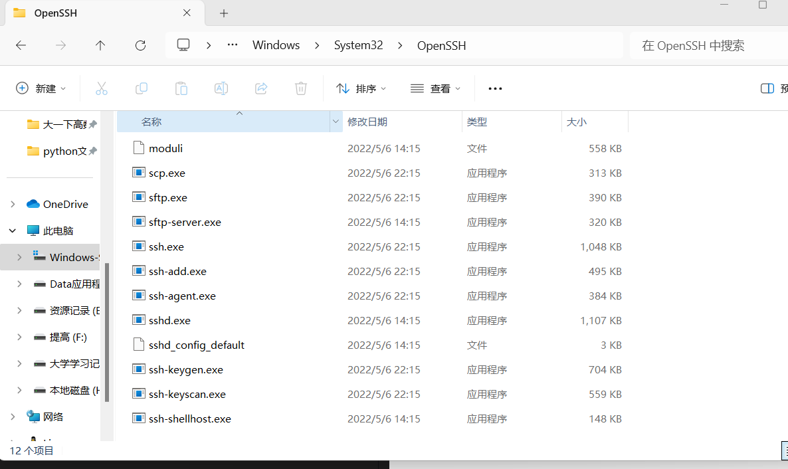

# 问题汇总

AI回答，copilot

## 问题一、SSH介绍

SSH（Secure Shell）是一种用于在不安全的网络上进行安全通信的协议。它被广泛应用于远程登录、执行命令、传输文件等任务。以下是SSH的一些关键点：

1. **加密通信**：SSH通过加密来保护数据的传输，防止网络窃听和中间人攻击。
2. **身份验证**：支持多种身份验证方法，包括密码验证、基于公钥的认证和双因素认证。
3. **端口转发**：允许用户将本地端口重定向到远程机器的端口，这对于穿越防火墙和访问受限资源非常有用。
4. **文件传输**：通过SCP（Secure Copy）和SFTP（Secure File Transfer Protocol）实现安全的文件传输。

## 问题二、计算机上有多个SSH秘钥时，计算机如何寻找到正确秘钥


1. **SSH配置文件**

首先，SSH客户端会查找用户的SSH配置文件（通常位于`~/.ssh/config`）。
这个文件可以包含针对不同服务器的特定设置，包括指定使用哪个秘钥。
例如，你可以这样配置：
```bash
   Host server1.example.com
       User yourusername
       IdentityFile ~/.ssh/id_rsa_server1

   Host server2.example.com
       User yourusername
       IdentityFile ~/.ssh/id_rsa_server2
```
通过如此设置，可以指定链接哪个服务器时。使用那个秘钥进行解密

2. **默认秘钥位置**

如果没有配置文件，SSH客户端会查找默认位置的秘钥
例如`~/.ssh/id_rsa`、`~/.ssh/id_dsa`等。

3. **尝试所有秘钥**

如果没有明确指定使用哪个秘钥，SSH客户端会尝试所有可用的秘钥来进行认证。
这可能会导致连接速度变慢，特别是在有很多秘钥的情况下。

4. **ssh-agent**

在某些情况下，你可能会使用`ssh-agent`来管理你的秘钥。
`ssh-agent`会缓存你的解锁的SSH秘钥，从而简化后续的连接过程。
你可以使用`ssh-add`命令将多个秘钥添加到`ssh-agent`。

总结起来，SSH客户端主要通过配置文件和默认位置来确定使用哪个秘钥。
如果你有多个秘钥，建议在配置文件中为每个服务器指定相应的秘钥，这样可以避免连接过程中的混乱。

## 问题三、如何给github服务器进行制定秘钥

给GitHub指定SSH秘钥的步骤如下：

1. **生成新的SSH秘钥**（如果还没有秘钥）：
   ```sh
   ssh-keygen -t ed25519 -C "your_email@example.com"
   ```
   如果你使用的是更老版本的系统，可以用`rsa`代替`ed25519`：
   ```sh
   ssh-keygen -t rsa -b 4096 -C "your_email@example.com"
   ```
   按提示操作，并记下秘钥保存的路径。

   其中-C参数用于指定秘钥注释，最终会加到公钥结尾部分

2. **添加秘钥到`ssh-agent`**：
   启动`ssh-agent`：
   ```sh
   eval "$(ssh-agent -s)"
   ```
   添加新的SSH秘钥到`ssh-agent`：
   ```sh
   ssh-add ~/.ssh/id_ed25519
   ```
   或者如果你使用的是`rsa`秘钥：
   ```sh
   ssh-add ~/.ssh/id_rsa
   ```

3. **将SSH公钥添加到GitHub账户**：
   复制SSH公钥内容：
   ```sh
   cat ~/.ssh/id_ed25519.pub
   ```
   或者如果你使用的是`rsa`秘钥：
   ```sh
   cat ~/.ssh/id_rsa.pub
   ```

   1. 登录GitHub账户。
   2. 进入`Settings`。
   3. 在`SSH and GPG keys`选项卡中，点击`New SSH key`。
   4. 粘贴你的公钥内容，并点击`Add SSH key`。

4. **配置SSH使用指定的秘钥连接到GitHub**：
   编辑`~/.ssh/config`文件，添加如下配置：
   ```sh
   Host github.com
       User git
       HostName github.com
       IdentityFile ~/.ssh/id_ed25519
       IdentitiesOnly yes
   ```
   如果使用的是`rsa`秘钥：
   ```sh
   Host github.com
       User git
       HostName github.com
       IdentityFile ~/.ssh/id_rsa
       IdentitiesOnly yes
   ```

这样配置后，当你连接GitHub时，SSH客户端会自动使用指定的秘钥。

如果在设置过程中遇到任何问题，请告诉我，我会尽力帮助你！

## 问题四、IdentityFile与IdentitiesOnly

`IdentityFile`用于指定秘钥文件位置。

`IdentitiesOnly` 是SSH配置文件中的一个选项，当它被设置为`yes`时.
SSH客户端只会使用你通过`IdentityFile`指定的那些密钥进行身份验证，而不会尝试使用其他加载在`ssh-agent`中的密钥。
这个选项有助于提高连接的确定性和安全性。

假设你的`~/.ssh/config`文件中有如下配置：
```sh
Host github.com
    User git
    HostName github.com
    IdentityFile ~/.ssh/id_ed25519
    IdentitiesOnly yes
```

当你连接到GitHub时，SSH客户端只会使用`~/.ssh/id_ed25519`这个密钥进行身份验证，而不会尝试使用`ssh-agent`中的其他密钥。这样做的好处是可以避免由于使用错误密钥而导致的身份验证失败，也可以提升安全性和管理密钥的便利性。

希望这对你有所帮助！还有其他关于SSH的问题吗？ 😊

## 问题五、ssh-agent介绍

`ssh-agent` 是一个运行在后台的程序，它帮助用户管理SSH私钥的解锁和存储。
使用 `ssh-agent` 的主要目的是在使用SSH进行多次连接时，不需要每次都输入密码来解锁私钥。以下是 `ssh-agent` 的一些关键功能：

1. **秘钥管理**： `ssh-agent` 可以管理多个SSH私钥，你可以使用 `ssh-add` 命令将私钥添加到 `ssh-agent` 中。
2. **自动认证**： 当你尝试连接远程服务器时，`ssh-agent` 会自动提供已解锁的私钥进行身份验证，而无需手动输入密码。
3. **方便安全**： 使用 `ssh-agent` 可以避免在命令行中暴露私钥密码，增强安全性。

### 使用步骤
1. 启动 `ssh-agent`：
   ```sh
   eval "$(ssh-agent -s)"
   ```
2. 添加私钥到 `ssh-agent`：
   ```sh
   ssh-add ~/.ssh/id_rsa
   ```

### 栗子

假设你有两个私钥文件 `id_rsa_server1` 和 `id_rsa_server2`，你可以将它们添加到 `ssh-agent`：
```sh
ssh-add ~/.ssh/id_rsa_server1
ssh-add ~/.ssh/id_rsa_server2
```

这样，当你尝试连接到服务器时，`ssh-agent` 会自动提供相应的私钥进行身份验证，而不需要你每次手动输入密码。

这不仅简化了连接过程，也提高了使用SSH的安全性和便利性。如果还有其他关于SSH或`ssh-agent`的问题，请告诉我，我很乐意帮助！ 😊

## 问题六、一台服务器设置多个秘钥

在 SSH 配置中，通常每个服务器只需要一个身份验证的密钥文件（`IdentityFile`）。
如果你希望在连接同一台服务器时使用多个密钥，这种情况下你需要选择一个作为主密钥，通常使用配置文件指定它。
在大多数情况下，只需要一个主密钥就足够了。

不过，如果你确实需要在特定情况下尝试多个密钥，可以通过不使用 `IdentitiesOnly yes` 选项来允许 SSH 尝试所有在 `ssh-agent` 中加载的密钥，或者在 `~/.ssh/config` 文件中指定多个主机配置块。例如：

```sh
Host github.com
    User git
    HostName github.com
    IdentityFile ~/.ssh/id_rsa_key1
    IdentitiesOnly yes

Host github.com
    User git
    HostName github.com
    IdentityFile ~/.ssh/id_ed25519_key2
    IdentitiesOnly yes
```

在这种配置下，每次连接都会尝试使用不同的密钥文件。
如果第一个密钥失败，SSH 客户端会继续尝试下一个配置块中的密钥。

不过请记住，这可能增加管理的复杂性。
如果可以的话，最好确定使用一个稳定的密钥文件进行连接。
如果你有其他特定需求或更多细节，请告诉我，我可以提供更详细的建议！ 😊

## 问题七、一个配置块中可以使用逗号分隔不同秘钥吗

在SSH配置文件中，每个`IdentityFile`指令只能指定一个密钥文件，因此你不能在一个`IdentityFile`行中使用逗号分隔多个密钥文件。
然而，你可以通过在配置文件中添加多行`IdentityFile`指令来指定多个密钥文件。
SSH客户端会按照配置文件中的顺序尝试这些密钥。示例如下：

```sh
Host github.com
    User git
    HostName github.com
    IdentityFile ~/.ssh/id_rsa_key1
    IdentityFile ~/.ssh/id_ed25519_key2
    IdentitiesOnly yes
```

在这种情况下，SSH客户端会先尝试使用 `id_rsa_key1` 密钥进行身份验证，如果失败，则尝试使用 `id_ed25519_key2` 密钥。

这可以实现你使用多个密钥文件连接同一台服务器的需求。

如果你有更多关于SSH配置的问题，请告诉我！ 😊

## 问题八、Windows下使用SSH

是的，Windows下可以使用SSH！目前有几种方式可以在Windows系统上使用SSH：

1. **使用Windows 10内置的OpenSSH客户端**：从Windows 10开始，微软在系统中内置了OpenSSH客户端。你可以通过以下步骤启用和使用它：
   1. 打开“设置”应用，进入“应用和功能”。
   2. 点击“管理可选功能”。
   3. 如果没有看到OpenSSH客户端，可以点击“添加功能”按钮，然后找到并安装OpenSSH客户端。
   4. 打开命令提示符或PowerShell，输入`ssh`命令进行测试。

2. **使用PowerShell**：PowerShell支持SSH，你可以直接在PowerShell中使用SSH命令。例如：
   ```sh
   ssh username@hostname
   ```

3. **使用第三方SSH客户端**：你也可以使用PuTTY等流行的SSH客户端。PuTTY是一个功能强大的SSH和Telnet客户端，使用方法如下：
   1. 从PuTTY官方网站下载并安装PuTTY。
   2. 打开PuTTY，输入远程主机的IP地址或主机名，以及端口号（默认是22）。
   3. 点击“Open”按钮，开始连接到远程服务器。

以上几种方法都可以让你在Windows上轻松使用SSH进行远程连接。如果有更多具体需求或疑问，可以随时告诉我！ 😃

## 问题九、Windows下.ssh的配置文件位置

在 Windows 自带的 OpenSSH 中，配置文件通常位于以下位置：

- **OpenSSH 安装目录**：`C:\Windows\System32\OpenSSH\`
- **配置文件**：`C:\Windows\System32\OpenSSH\sshd_config`

你可以在这个目录下找到并编辑 `sshd_config` 文件来配置 OpenSSH 服务器。如果你有任何其他问题或需要进一步的帮助，请告诉我！

示例：



## 问题十、Windows下创建的秘钥文件在哪里

在 Windows 下使用 `ssh-keygen` 创建的 SSH 密钥对，默认会存放在用户主目录的 `.ssh` 文件夹中。具体路径如下：

```plaintext
C:\Users\你的用户名\.ssh\
```

在这个目录下，你会找到生成的私钥和公钥文件。默认情况下，私钥文件名是 `id_rsa` 或 `id_ed25519`（取决于你选择的加密类型），而公钥文件名会是 `id_rsa.pub` 或 `id_ed25519.pub`。

例如：

- 私钥：`C:\Users\你的用户名\.ssh\id_rsa`
- 公钥：`C:\Users\你的用户名\.ssh\id_rsa.pub`

如果你在生成密钥时指定了其他名称，文件名和路径会根据你的输入进行调整。

如果有任何疑问或需要进一步的帮助，请随时告诉我！ 😊

示例：


## 问题十一、用户下的config配置

在 Windows 下的 `.ssh` 文件夹中可以配置 `config` 文件来管理你的 SSH 连接。
通过创建和编辑 `config` 文件，你可以为不同的服务器设置特定的配置，从而简化连接过程。

以下是在 `.ssh` 文件夹中配置 `config` 文件的步骤：

1. **打开命令提示符或PowerShell**。
2. **导航到 `.ssh` 文件夹**，通常位于 `C:\Users\你的用户名\.ssh\`：
   ```sh
   cd %USERPROFILE%\.ssh
   ```

3. **创建或编辑 `config` 文件**，你可以使用内置的记事本或任何文本编辑器：
   ```sh
   notepad config
   ```

4. **在 `config` 文件中添加你的配置**，例如：
   ```sh
   Host github.com
       User git
       HostName github.com
       IdentityFile ~/.ssh/id_ed25519
       IdentitiesOnly yes

   Host example.com
       User yourusername
       HostName example.com
       IdentityFile ~/.ssh/id_rsa
   ```

5. **保存并关闭 `config` 文件**。

通过这种方式，当你使用 `ssh` 命令连接到指定的服务器时，SSH 客户端会自动应用你在 `config` 文件中定义的设置，从而简化连接过程并确保使用正确的密钥。

如果还有其他问题或需要进一步的帮助，请告诉我！ 😊

示例：


此时JK 已经可以代表sun@74.226.155.16

## 问题十二、Windows下得包管理工具

Windows 上有几个类似于 Linux 的 `apt` 包管理工具。以下是一些常用的工具：

1. **Chocolatey**: 这是一个强大的包管理工具，可以安装、升级和管理 Windows 上的软件包。它使用命令行界面，类似于 Linux 的 `apt`。

2. **Scoop**: 这是一个轻量级的包管理工具，专注于安装命令行工具和编程语言。它也使用命令行界面，操作简单。

3. **Ninite**: 这是一个图形化的工具，可以一次性安装多个应用程序。虽然不是完全命令行的工具，但它也非常方便。

这些工具都可以帮助你更方便地管理 Windows 上的软件包。你有尝试过其中的某个工具吗？

## 问题十三、Bash提示符别名设置

当然可以设置别名，以缩短Bash提示符中的用户名@计算机名。
你可以通过修改Bash的配置文件来实现这个目的。

通常，Bash的提示符由环境变量`PS1`定义。你可以在`.bashrc`或`.bash_profile`文件中修改`PS1`以设置自定义的提示符。

以下是一个示例，如何在你的`.bashrc`文件中设置别名：

1. **打开你的`.bashrc`文件**：
   ```sh
   nano ~/.bashrc
   ```

2. **找到或添加`PS1`变量的定义**，并进行修改。例如，假设你希望只显示简短的用户名和计算机名，你可以这样设置：
   ```sh
   PS1='\u@shortname:\w\$ '
   ```
   这里，`\u`表示用户名，`shortname`是你想要显示的计算机名别名，`\w`表示当前工作目录。

3. **保存文件并退出编辑器**。在nano中，你可以按`Ctrl + X`，然后按`Y`确认保存。

4. **使更改生效**，可以使用以下命令重新加载`.bashrc`文件：
   ```sh
   source ~/.bashrc
   ```

这样，你的Bash提示符就会使用新的格式显示。你可以根据自己的需要，进一步自定义提示符的内容和格式。

希望这对你有帮助！如果你有更多问题或需要更详细的解释，请告诉我！ 😊

## 问题十四、PS1变量介绍

`PS1` 变量在 Bash 中定义了命令提示符的外观。这个变量包含一些特定的转义字符和文本，用来显示提示符中的各种信息，比如用户名、主机名、当前目录等等。通过修改 `PS1` 变量，你可以自定义你的命令提示符，使其显示所需的任何信息。

以下是一些常用的转义字符，可以在 `PS1` 中使用：

- `\u`：当前用户的用户名
- `\h`：主机名（仅第一个点号前的部分）
- `\H`：完整的主机名
- `\w`：当前工作目录
- `\W`：当前工作目录的最后一个组件（仅目录名）
- `\d`：当前日期
- `\t`：当前时间（24小时制）
- `\T`：当前时间（12小时制）
- `\n`：换行符
- `\[\033[xxm\]`：设置终端文本颜色（`xx`为颜色代码）

例如，你可以这样设置 `PS1`：
```sh
PS1='\u@\h:\w\$ '
```

这个设置会使提示符显示成 `用户名@主机名:当前工作目录$`，像这样：
```sh
user@host:/home/user$
```

你可以根据自己的喜好来定制你的提示符，使其更加便于使用和美观。如果你想要在不同情况下显示不同的信息，可以尝试组合使用这些转义字符。

希望这些信息对你有帮助！如果你还有其他问题或者需要进一步解释，请告诉我！ 😊

示例：


补充颜色代码：
前景色（文本颜色）：30-37

    30: 黑色
    31: 红色
    32: 绿色
    33: 黄色
    34: 蓝色
    35: 紫色
    36: 青色
    37: 白色
背景色：40-47

    40: 黑色
    41: 红色
    42: 绿色
    43: 黄色
    44: 蓝色
    45: 紫色
    46: 青色
    47: 白色
样式代码：

    0: 重置所有属性
    1: 高亮（粗体）
    4: 下划线
    5: 闪烁
    7: 反显（背景和前景色互换）
    8: 隐藏

注意：

    可以叠加使用 

示例：`echo -e "\033[1;31m高亮红色文本\033[0m"`
解释：
```plaintext
\033[1;31m：
\033：这是 ESC 字符，表示转义序列的开始。
[1;31m：这是颜色和样式代码。
1：表示高亮（粗体）。
31：表示前景色为红色。
高亮红色文本：这是实际的文本内容，会以高亮红色显示。
\033[0m：
\033：同样是 ESC 字符。
[0m：表示重置所有属性，将颜色和样式恢复到默认状态。
```
\033 是一个转义字符，表示 ASCII 码中的 ESC（Escape）字符。
它用于引导终端解释后续的字符序列为控制命令，而不是普通文本。


## 问题十五、类似PS1的终端变量

除了`PS1`之外，Bash 还有几个其他的提示符相关变量，可以让你进一步定制你的终端环境：

1. **`PS2`**：用于多行命令的次要提示符。默认是`> `，当你输入多行命令时会出现这个提示符。例如，当你没有关闭一个引号时，`PS2` 会在下一行提示你继续输入。
   ```sh
   PS2='>'
   ```

2. **`PS3`**：用于`select`命令的提示符。`select`命令用于生成简单的菜单，从用户输入中选择一个选项。
   ```sh
   PS3='Please choose: '
   ```

3. **`PS4`**：用于`bash -x`模式下的调试提示符。默认是`+`，在调试脚本时会使用这个提示符。
   ```sh
   PS4='+ '
   ```

这些变量可以帮助你更灵活地控制不同场景下的提示符格式。

如果你对 Bash 的提示符定制还有其他问题或需要更多示例，随时告诉我！😊

## 问题十六、 Windows下git bash设置别名

在 Windows 下的 Git Bash 中，你可以通过修改 `.bashrc` 文件来设置别名和自定义提示符，来缩短开头的长度。以下是步骤：

1. **打开 Git Bash**。
2. **编辑 `.bashrc` 文件**。你可以使用内置的文本编辑器 `nano` 或者其他你喜欢的编辑器：
   ```sh
   nano ~/.bashrc
   ```

3. **修改 `PS1` 变量**。在文件中添加或修改 `PS1` 变量来定义你的自定义提示符。例如，以下是一个简化的提示符设置：
   ```sh
   PS1='\u@shortname:\W\$ '
   ```
   这里，`\u` 表示用户名，`shortname` 是你想要显示的计算机名别名，`\W` 表示当前工作目录的最后一个组件（仅目录名）。

4. **保存文件并退出编辑器**。在 `nano` 中，你可以按 `Ctrl + X`，然后按 `Y` 确认保存。

5. **使更改生效**。可以使用以下命令重新加载 `.bashrc` 文件：
   ```sh
   source ~/.bashrc
   ```

这样，你的 Git Bash 提示符就会简化为你设置的格式。例如：
```plaintext
username@shortname:directory$
```

如果你想要更多的自定义选项或有其他问题，请告诉我！ 😊

注意，git bash中没有.bash_profile来启动.bashrc。首次使用会自动创建.bash_profile


## 问题十七、Git bash目录结构

在 Git Bash 中，目录结构与 Unix 类系统非常相似。Git Bash 使用一种名为 MinGW 的环境来模拟 Unix 样式的目录和工具。以下是 Git Bash 的常见目录结构：

1. **根目录 `/`**：
   - `/bin`：存放各种可执行文件，包括常用的 Unix 工具，如 `ls`、`grep` 等。
   - `/usr`：包含用户级的应用程序和库文件。
     - `/usr/bin`：存放用户级的可执行文件。
     - `/usr/lib`：包含库文件。
     - `/usr/share`：包含共享的文件，如文档和配置文件。
   - `/etc`：系统级的配置文件目录。
   - `/home`：用户的主目录。
     - `/home/your_username`：你的个人主目录。

2. **用户目录**：
   - `~/.ssh`：存放 SSH 密钥和配置文件。
   - `~/.gitconfig`：用户级的 Git 配置文件。
   - `~/.bashrc`：用户级的 Bash 配置文件，可以在这里设置环境变量和别名。

3. **MinGW 相关目录**：
   - `/mingw64`：MinGW 的安装目录，包含了编译器和相关工具。
     - `/mingw64/bin`：MinGW 的可执行文件目录。
     - `/mingw64/lib`：MinGW 的库文件目录。
     - `/mingw64/include`：MinGW 的头文件目录。

4. **临时目录 `/tmp`**：存放临时文件。

这种目录结构使得 Git Bash 用户可以使用类似于 Unix 系统的命令和工具，大大方便了跨平台开发和管理任务。如果你有更多关于 Git Bash 的问题或需要进一步的解释，请告诉我！ 😊

## 问题十八、Windows下git bash与Windows目录映射

在 Git Bash 中，目录结构与 Windows 文件系统之间有一些映射，使得你可以使用 Unix 风格的路径来访问 Windows 上的文件。以下是一些关键点，说明 Git Bash 如何映射这些目录：

1. **根目录 `/`**：
   - Git Bash 将根目录 `/` 映射到 Git Bash 安装目录，一般在 `C:\Program Files\Git` 下。例如，`/bin` 实际上是 `C:\Program Files\Git\usr\bin`。

2. **用户主目录 `/home`**：
   - Git Bash 中的 `/home` 目录映射到 Windows 用户的主目录。例如，`/home/your_username` 对应于 `C:\Users\your_username`。

3. **驱动器映射**：
   - Windows 的驱动器在 Git Bash 中以 `/` 开头。例如，Windows 的 `C:\` 驱动器在 Git Bash 中表示为 `/c/`，同理，`D:\` 驱动器在 Git Bash 中表示为 `/d/`。
   - 示例：
     ```sh
     /c/Users/your_username/Documents
     ```
     对应于 Windows 路径：
     ```plaintext
     C:\Users\your_username\Documents
     ```

4. **环境变量**：
   - Git Bash 会使用 `MSYS` 来处理路径转换，使得在 Git Bash 中可以使用 Unix 风格的路径，同时在内部转换为 Windows 路径。

这种映射方式使得 Git Bash 用户可以方便地使用 Unix 风格的命令和路径来访问 Windows 文件系统，极大地方便了开发和系统管理工作。如果你有更多具体的问题或者需要示例，请告诉我！ 😊

## 问题十九、 git push出现错误

错误类型：ssh: connect to host github.com port 22: Connection timed out
解决方法一：
更改访问端口：

`ssh -T -p 443 git@ssh.github.com`
在修改config配置
```bash
# Add section below to it
Host github.com
  Hostname ssh.github.com
  Port 443
```

区分github.com与ssh.github.com:（DeepSeek）

`ssh -T git@github.com` 和 `ssh -T git@ssh.github.com` 的主要区别在于它们连接的 GitHub 服务器不同。

1. `ssh -T git@github.com`
- **用途**：这是标准的 GitHub SSH 连接方式，用于验证 SSH 密钥是否配置正确。
- **服务器**：连接到 GitHub 的主 SSH 服务器。
- **功能**：执行此命令时，GitHub 会返回一条欢迎消息（如 "Hi username! You've successfully authenticated..."），表明 SSH 密钥配置正确。

2. `ssh -T git@ssh.github.com`
- **用途**：这是 GitHub 提供的备用 SSH 服务器，用于解决某些网络环境下的连接问题。
- **服务器**：连接到 GitHub 的备用 SSH 服务器。
- **功能**：与 `git@github.com` 类似，也会返回一条欢迎消息，确认 SSH 密钥配置正确。

主要区别
- **服务器不同**：`github.com` 是主服务器，`ssh.github.com` 是备用服务器。
- **网络环境**：在某些网络环境下，主服务器可能无法访问，备用服务器可以作为替代方案。

使用场景
- **常规情况**：使用 `ssh -T git@github.com` 即可。
- **网络问题**：如果 `github.com` 无法连接，可以尝试 `ssh -T git@ssh.github.com`。
总结
两者都用于验证 SSH 密钥，区别在于连接的服务器不同。备用服务器主要用于解决主服务器连接问题。

更改并未解决问题，出现如下错误：
git@ssh.github.com: Permission denied (publickey).
重新配置公钥后成功！
同时发现ping github.com失败？
但是ping ssh.github.com成功！
config:
```bash
Host github.com
        Hostname ssh.github.com
        Port 22
        IdentityFile ~/.ssh/git
```
最终：


