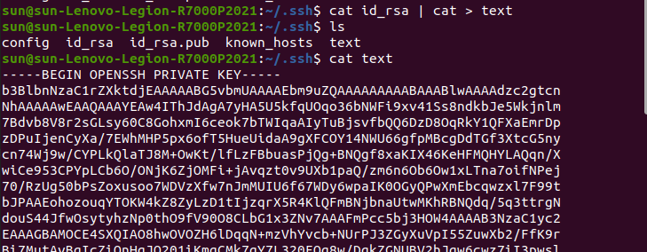
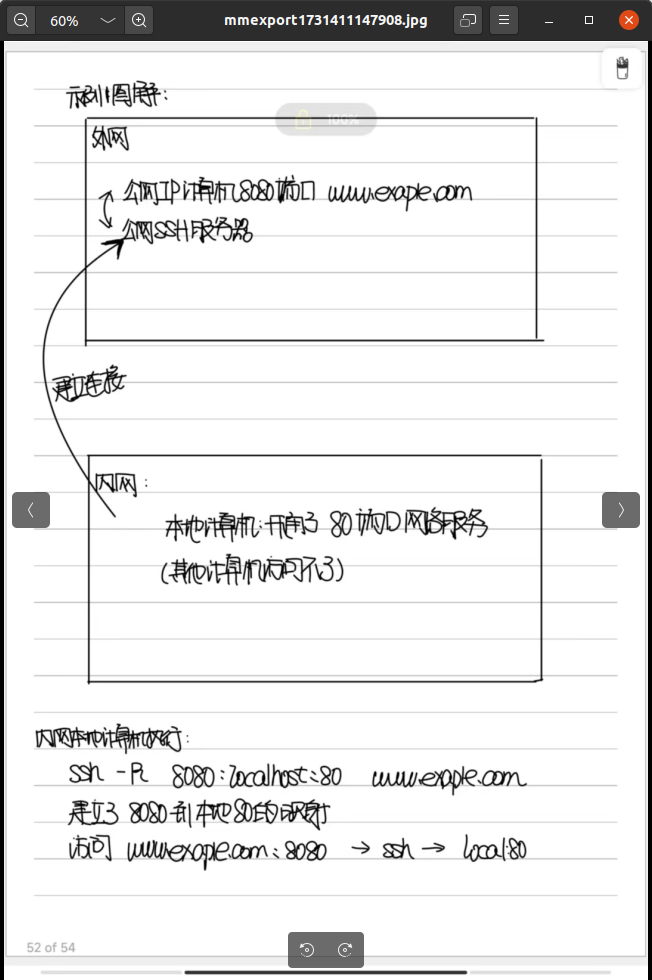

# SSH教程

SSH 是 Linux 系统的登录工具，现在广泛用于服务器登录和各种加密通信。

## 一、SSH基本知识

SSH（Secure Shell 的缩写）是一种网络协议，用于加密两台计算机之间的通信，并且支持各种身份验证机制。
实务中，它主要用于保证远程登录和远程通信的安全，任何网络服务都可以用这个协议来加密。 

### SSH诞生原因

原因：

    历史上，网络主机之间的通信是不加密的，属于明文通信。
    这使得通信很不安全，一个典型的例子就是服务器登录。
    登录远程服务器的时候，需要将用户输入的密码传给服务器，
    如果这个过程是明文通信，就意味着传递过程中，线路经过的中间计算机都能看到密码，这是很可怕的。

诞生：

    SSH 就是为了解决这个问题而诞生的，它能够加密计算机之间的通信，保证不被窃听或篡改。
    它还能对操作者进行认证（authentication）和授权（authorization）。
    明文的网络协议可以套用在它里面，从而实现加密。

### SSH历史

1995年，芬兰赫尔辛基工业大学的研究员 Tatu Ylönen 设计了 SSH 协议的第一个版本（现称为 SSH 1），同时写出了第一个实现（称为 SSH1）。

当时，他所在的大学网络一直发生密码嗅探攻击，他不得不为服务器设计一个更安全的登录方式。写完以后，他就把这个工具公开了，允许其他人免费使用。

SSH 可以替换 rlogin、TELNET、FTP 和 rsh 这些不安全的协议，所以大受欢迎，用户快速增长，1995年底已经发展到五十个国家的20,000个用户。SSH 1 协议也变成 IETF 的标准文档。

1995年12月，由于客服需求越来越大，Tatu Ylönen 就成立了一家公司 SCS，专门销售和开发 SSH。这个软件的后续版本，逐渐从免费软件变成了专有的商业软件。

SSH 1 协议存在一些安全漏洞，所以1996年又提出了 SSH 2 协议（或者称为 SSH 2.0）。这个协议与1.0版不兼容，在1997年进行了标准化，1998年推出了软件实现 SSH2。但是，官方的 SSH2 软件是一个专有软件，不能免费使用，而且 SSH1 的有些功能也没有提供。 

1999年，OpenBSD 的开发人员决定写一个 SSH 2 协议的开源实现，这就是 OpenSSH 项目。该项目最初是基于 SSH 1.2.12 版本，那是当时 SSH1 最后一个开源版本。但是，OpenSSH 很快就完全摆脱了原始的官方代码，在许多开发者的参与下，按照自己的路线发展。OpenSSH 随 OpenBSD 2.6 版本一起提供，以后又移植到其他操作系统，成为最流行的 SSH 实现。目前，Linux 的所有发行版几乎都自带 OpenSSH。

现在，SSH-2 有多种实现，既有免费的，也有收费的。本书的内容主要是针对 OpenSSH。 

### SSH架构

SSH 的软件架构是服务器-客户端模式（Server - Client）。在这个架构中，SSH 软件分成两个部分：向服务器发出请求的部分，称为客户端（client），OpenSSH 的实现为 ssh；接收客户端发出的请求的部分，称为服务器（server），OpenSSH 的实现为 sshd。

本教程约定，大写的 SSH 表示协议，小写的 ssh 表示客户端软件。

另外，OpenSSH 还提供一些辅助工具软件（比如 ssh-keygen 、ssh-agent）和专门的客户端工具（比如 scp 和 sftp），这个教程也会予以介绍。 

## 二、SSH客户端

### 简介

OpenSSH 的客户端是二进制程序 ssh。它在 Linux/Unix 系统的位置是/usr/local/bin/ssh，Windows 系统的位置是\Program Files\OpenSSH\bin\ssh.exe。


Linux 系统一般都自带 ssh，如果没有就需要安装。

\# Ubuntu 和 Debian 

> $ sudo apt install openssh-client 

\# CentOS 和 Fedora 

> $ sudo dnf install openssh-clients

安装以后，可以使用-V参数输出版本号，查看一下是否安装成功。


### 基本使用

ssh 最常见的用途就是登录服务器，这要求服务器安装并正在运行 SSH 服务器软件

> $ ssh hostname 

上面命令中，hostname是主机名，它可以是域名，也可能是IP 地址或局域网内部的主机名。不指定用户名的情况下，将使用客户端的当前用户名，作为远程服务器的登录用户名。如果要指定用户名，可以采用下面的语法。

> $ ssh user@hostname 

-l 参数：指定用户名 

> $ ssh -l username host

-p 设置连接端口，默认22号

> ssh -p 8821 foo.com

### 连接过程

ssh 连接远程服务器后，首先有一个验证过程，验证远程服务器是否为陌生地址。
如果是第一次连接某一台服务器，命令行会显示一段文字，表示不认识这台机器，提醒用户确认是否需要连接。

```bash
The authenticity of host 'foo.com (192.168.121.111)' can't be established.
ECDSA key fingerprint is SHA256:Vybt22mVXuNuB5unE++yowF7lgA/9/2bLSiO3qmYWBY.
Are you sure you want to continue connecting (yes/no)? 
```
上面这段文字告诉用户，foo.com这台服务器的指纹是陌生的，让用户选择是否要继续连接（输入 yes 或 no）。

注意：

    “服务器指纹”，指的是 SSH 服务器公钥的哈希值。每台 SSH 服务器都有唯一一对密钥，用于跟客户端通信，其中公钥的哈希值就可以用来识别服务器。

ssh 会将本机连接过的所有服务器公钥的指纹，都储存在本机的~/.ssh/known_hosts文件中。每次连接服务器时，通过该文件判断是否为陌生主机（陌生公钥）。 


查看公钥指纹：
> ssh-keygen -l -f 公钥.pub


在上面这段文字后面，输入yes，就可以将当前服务器的指纹也储存在本机~/.ssh/known_hosts文件中，并显示下面的提示。以后再连接的时候，就不会再出现警告了。

```bash
Warning: Permanently added 'foo.com (192.168.121.111)' (RSA) to the list of known hosts 
```

然后，客户端就会跟服务器建立连接。接着，ssh 就会要求用户输入所要登录账户的密码。用户输入并验证密码正确以后，就能登录远程服务器的 Shell 了。

### 服务器秘钥变更

服务器指纹可以防止有人恶意冒充远程主机。如果服务器的密钥发生变更（比如重装了 SSH 服务器），客户端再次连接时，就会发生公钥指纹不吻合的情况。这时，客户端就会中断连接，并显示一段警告信息。 


上面这段文字的意思是，该主机的公钥指纹跟~/.ssh/known_hosts文件储存的不一样，必须处理以后才能连接。这时，你需要确认是什么原因，使得公钥指纹发生变更，到底是恶意劫持，还是管理员变更了 SSH 服务器公钥。 

如果新的公钥确认可以信任，需要继续执行连接，你可以执行下面的命令，将原来的公钥指纹从~/.ssh/known_hosts文件删除。 

> ssh-keygen -R hostname

hostname为发生公钥变更的主机名

当然也可以手动删除known_hosts文件，再重新ssh连接

### 执行远程命令

 SSH 登录成功后，用户就进入了远程主机的命令行环境，所看到的提示符，就是远程主机的提示符。这时，你就可以输入想要在远程主机执行的命令。

 另外也可以在连接时指定：

 > ssh username@hostname command 

 登陆成功后立即执行command

 注意：
 
    采用这种语法执行命令时，ssh 客户端不会提供互动式的 Shell 环境，而是直接将远程命令的执行结果输出在命令行。


若需要互动式的Shell，使用 -t 命令


命令完成后会立即退出系统

### 加密参数

SSH 连接的握手阶段，客户端必须跟服务端约定加密参数集（cipher suite）。

加密参数集包含了若干不同的加密参数，它们之间使用下划线连接在一起，下面是一个例子。

```bash
TLS_RSA_WITH_AES_128_CBC_SHA 
```
TLS：加密通信协议
RSA：密钥交换算法
AES：加密算法
128：加密算法的强度
CBC：加密算法的模式
SHA：数字签名的 Hash 函数

示例：

```
Handshake protocol: ClientHello
    Version: TLS 1.2
    Random
        Client time: May 22, 2030 02:43:46 GMT
        Random bytes: b76b0e61829557eb4c611adfd2d36eb232dc1332fe29802e321ee871
    Session ID: (empty)
    Cipher Suites
        Suite: TLS_ECDHE_RSA_WITH_AES_128_GCM_SHA256”
        Suite: TLS_DHE_RSA_WITH_AES_128_GCM_SHA256
        Suite: TLS_RSA_WITH_AES_128_GCM_SHA256
        Suite: TLS_ECDHE_RSA_WITH_AES_128_CBC_SHA
        Suite: TLS_DHE_RSA_WITH_AES_128_CBC_SHA
        Suite: TLS_RSA_WITH_AES_128_CBC_SHA
        Suite: TLS_RSA_WITH_3DES_EDE_CBC_SHA
        Suite: TLS_RSA_WITH_RC4_128_SHA
    Compression methods
        Method: null
    Extensions
        Extension: server_name
            Hostname: www.feistyduck.com
        Extension: renegotiation_info
        Extension: elliptic_curves
            Named curve: secp256r1
            Named curve: secp384r1
        Extension: signature_algorithms
            Algorithm: sha1/rsa
            Algorithm: sha256/rsa
            Algorithm: sha1/ecdsa
            Algorithm: sha256/ecdsa” 
```

上面的握手信息（ClientHello）之中，Cipher Suites字段就是客户端列出可选的加密参数集，服务器在其中选择一个自己支持的参数集

服务器选择完毕之后，向客户端发出回应。

```
Handshake protocol: ServerHello
    Version: TLS 1.2
    Random
        Server time: Mar 10, 2059 02:35:57 GMT”
        Random bytes: 8469b09b480c1978182ce1b59290487609f41132312ca22aacaf5012
    Session ID: 4cae75c91cf5adf55f93c9fb5dd36d19903b1182029af3d527b7a42ef1c32c80
    Cipher Suite: TLS_ECDHE_RSA_WITH_AES_128_GCM_SHA256
    Compression method: null
    Extensions
        Extension: server_name
        Extension: renegotiation_info” 
```
上面的回应信息（ServerHello）中，Cipher Suite字段就是服务器最终选定的加密参数。 

### SSH连接过程


SSH协议的通信认证过程可以分为以下几个阶段：

    握手阶段
    密钥交换阶段
    用户认证阶段
    会话建立阶段

1. 握手阶段

    客户端发送初始握手消息：客户端向服务器发送SSH协议版本信息，这是握手的第一步，用于确定双方支持的协议版本。
    服务器响应握手消息：服务器回应客户端的版本信息，并确认协议版本。

2. 密钥交换阶段

    选择加密算法：客户端和服务器协商加密算法、压缩算法等，确定双方都支持的算法。
    密钥交换：客户端和服务器通过一种安全的方式交换密钥。常用的密钥交换算法有DH（Diffie-Hellman）算法，它可以确保即使中间人监听到通信，也无法获得实际的会话密钥。
    生成会话密钥：客户端和服务器各自根据密钥交换的结果生成会话密钥。会话密钥用于加密后续的数据传输。

3. 用户认证阶段

    选择认证方式：客户端和服务器协商认证方式。常见的认证方式有密码认证、公钥认证、键盘交互认证等。
    认证过程：
        密码认证：客户端输入用户名和密码，服务器验证用户名和密码是否匹配服务端密钥hash值。
        公钥认证：客户端使用私钥对认证信息进行签名，服务器使用公钥验证签名是否正确。
        键盘交互认证：服务器向客户端提出一系列问题，客户端回答问题，服务器验证答案是否正确。

4. 会话建立阶段

    建立会话：认证成功后，客户端和服务器之间建立一个安全的会话。
    数据传输：客户端和服务器之间可以开始安全的数据传输。所有数据都会使用前面生成的会话密钥进行加密。

### SSH命令行配置项


#### 命令行参数

-c参数指定加密算法。

> $ ssh -c blowfish,3des server.example.com 

或者 

> $ ssh -c blowfish -c 3des server.example.com

上面命令指定使用加密算法blowfish或3des。 

---

-C参数表示压缩数据传输。

> $ ssh -C server.example.com 

---

-D参数指定本机的 Socks 监听端口，该端口收到的请求，都将转发到远程的 SSH 主机，又称动态端口转发，详见《端口转发》一章。

> $ ssh -D 1080 server

上面命令将本机 1080 端口收到的请求，都转发到服务器server。

---

-f参数表示 SSH 连接在后台运行。 

---

-F参数指定配置文件。

> $ ssh -F /usr/local/ssh/other_config 

上面命令指定使用配置文件other_config。 

---

-i参数用于指定私钥，意为“identity_file”，默认值为~/.ssh/id_dsa（DSA 算法）和~/.ssh/id_rsa（RSA 算法）。注意，对应的公钥必须存放到服务器，详见《密钥登录》一章。

> $ ssh -i my-key server.example.com 

---

-l参数指定远程登录的账户名。

> $ ssh -l sally server.example.com 

等同于 

> $ ssh sally@server.example.com 

--- 

-L参数设置本地端口转发，详见《端口转发》一章。

> $ ssh  -L 9999:targetServer:80 user@remoteserver 

上面命令中，所有发向本地9999端口的请求，都会经过remoteserver发往 targetServer 的 80 端口，这就相当于直接连上了 targetServer 的 80 端口。 

---

-m参数指定校验数据完整性的算法（message authentication code，简称 MAC）。

> $ ssh -m hmac-sha1,hmac-md5 server.example.com 

上面命令指定数据校验算法为hmac-sha1或hmac-md5。 

---

-N参数用于端口转发，表示建立的 SSH 只用于端口转发，不能执行远程命令，这样可以提供安全性，详见《端口转发》一章。 

---

-o参数用来指定一个配置命令。

> $ ssh -o "Keyword Value" 

举例而言：
配置文件
```
User sally
Port 220 
```
> \$ ssh -o "User sally" -o "Port 220" server.example.com 
> \$ ssh -o User=sally -o Port=220 server.example.com 

--- 

-p参数指定 SSH 客户端连接的服务器端口。

> \$ ssh -p 2035 server.example.com 

上面命令连接服务器的2035端口。 

---

-q参数表示安静模式（quiet），不向用户输出任何警告信息。

> $ ssh –q foo.com
> root’s password: 

上面命令使用-q参数，只输出要求用户输入密码的提示。 

---

-R参数指定远程端口转发，详见《端口转发》一章。

> \$ ssh -R 9999:targetServer:902 local 

上面命令需在跳板服务器执行，指定本地计算机local监听自己的 9999 端口，所有发向这个端口的请求，都会转向 targetServer 的 902 端口

---

-t参数在 ssh 直接运行远端命令时，提供一个互动式 Shell。

> $ ssh -t server.example.com emacs 

---

-v参数显示详细信息。

> $ ssh -v server.example.com 

-v可以重复多次，表示信息的详细程度，比如-vv和-vvv。

> $ ssh -vvv server.example.com 

或者 

> $ ssh -v -v -v server.example.com

上面命令会输出最详细的连接信息。 

---

-V参数输出 ssh 客户端的版本。

> $ ssh –V
> ssh: SSH Secure Shell 3.2.3 (non-commercial version) on i686-pc-linux-gnu 

上面命令输出本机 ssh 客户端版本是SSH Secure Shell 3.2.3。 

---

-X参数表示打开 X 窗口转发。

> $ ssh -X server.example.com 

---

-1参数指定使用 SSH 1 协议。

-2参数指定使用 SSH 2 协议。

> $ ssh -2 server.example.com 

---

-4指定使用 IPv4 协议，这是默认值。

> $ ssh -4 server.example.com 

-6指定使用 IPv6 协议。

> $ ssh -6 server.example.com 

#### 客户端配置文件


##### 位置

SSH 客户端的全局配置文件是/etc/ssh/ssh_config，用户个人的配置文件在~/.ssh/config，优先级高于全局配置文件。

除了配置文件，~/.ssh目录还有一些用户个人的密钥文件和其他文件。
下面是其中一些常见的文件。 

    ~/.ssh/id_ecdsa：用户的 ECDSA 私钥。
    ~/.ssh/id_ecdsa.pub：用户的 ECDSA 公钥。
    ~/.ssh/id_rsa：用于 SSH 协议版本2 的 RSA 私钥。
    ~/.ssh/id_rsa.pub：用于SSH 协议版本2 的 RSA 公钥。
    ~/.ssh/identity：用于 SSH 协议版本1 的 RSA 私钥。
    ~/.ssh/identity.pub：用于 SSH 协议版本1 的 RSA 公钥。
    ~/.ssh/known_hosts：包含 SSH 服务器的公钥指纹。

##### 主机设置

用户个人的配置文件~/.ssh/config，可以按照不同服务器，列出各自的连接参数，从而不必每一次登录都输入重复的参数。下面是一个例子。 
```shell
Host *
     Port 2222

Host remoteserver
     HostName remote.example.com
     User neo
     Port 2112 
```
Host *表示对所有主机生效，后面的Port 2222表示所有主机的默认连接端口都是2222，这样就不用在登录时特别指定端口了。
这里的缩进并不是必需的，只是为了视觉上，易于识别针对不同主机的设置。

后面的Host remoteserver表示，下面的设置只对主机remoteserver生效。remoteserver只是一个别名，具体的主机由HostName命令指定，User和Port这两项分别表示用户名和端口。这里的Port会覆盖上面Host *部分的Port设置。

配置完成后，登录remote.example.com时，只要执行ssh remoteserver命令，就会自动套用 config 文件里面指定的参数。

如下：
```
 $ ssh remoteserver 

# 等同于 

$ ssh -p 2112 neo@remote.example.com 
```
注意：

    Host命令的值可以使用通配符，比如Host *表示对所有主机都有效的设置。
    Host *.edu表示只对一级域名为.edu的主机有效的设置。
    它们的设置都可以被单个主机的设置覆盖。 

##### 配置命令语法

ssh 客户端配置文件的每一行，就是一个配置命令。配置命令与对应的值之间，可以使用空格，也可以使用等号。
```
Compression yes 

# 等同于 

Compression = yes

#开头的行表示注释，会被忽略。空行等同于注释。 
```

主要的配置命令：

| 配置                                                        | 解释                                                                                                                                                                                                                             |
| :---------------------------------------------------------- | -------------------------------------------------------------------------------------------------------------------------------------------------------------------------------------------------------------------------------- |
| AddressFamily inet                                          | 表示只使用 IPv4 协议。如果设为inet6，表示只使用 IPv6 协议。                                                                                                                                                                      |
| BindAddress 192.168.10.235                                  | 指定本机的 IP 地址（如果本机有多个 IP 地址）。                                                                                                                                                                                   |
| CheckHostIP yes                                             | 检查 SSH 服务器的 IP 地址是否跟公钥数据库吻合。                                                                                                                                                                                  |
| Ciphers blowfish,3des                                       | 指定加密算法。                                                                                                                                                                                                                   |
| Compression yes                                             | 是否压缩传输信号。                                                                                                                                                                                                               |
| ConnectionAttempts 10                                       | 客户端进行连接时，最大的尝试次数。                                                                                                                                                                                               |
| ConnectTimeout 60                                           | 客户端进行连接时，服务器在指定秒数内没有回复，则中断连接尝试。                                                                                                                                                                   |
| DynamicForward 1080                                         | 指定动态转发端口。                                                                                                                                                                                                               |
| GlobalKnownHostsFile /users/smith/.ssh/my_global_hosts_file | 指定全局的公钥数据库文件的位置。                                                                                                                                                                                                 |
| Host server.example.com                                     | 指定连接的域名或 IP 地址，也可以是别名，支持通配符。Host命令后面的所有配置，都是针对该主机的，直到下一个Host命令为止。                                                                                                           |
| HostKeyAlgorithms ssh-dss,ssh-rsa                           | 指定密钥算法，优先级从高到低排列。                                                                                                                                                                                               |
| HostName myserver.example.com                               | 在Host命令使用别名的情况下，HostName指定域名或 IP 地址。                                                                                                                                                                         |
| IdentityFile keyfile                                        | 指定私钥文件。                                                                                                                                                                                                                   |
| LocalForward 2001 localhost:143                             | 指定本地端口转发。                                                                                                                                                                                                               |
| LogLevel QUIET                                              | 指定日志详细程度。如果设为QUIET，将不输出大部分的警告和提示。                                                                                                                                                                    |
| MACs hmac-sha1,hmac-md5                                     | 指定数据校验算法。                                                                                                                                                                                                               |
| NumberOfPasswordPrompts 2                                   | 密码登录时，用户输错密码的最大尝试次数。                                                                                                                                                                                         |
| PasswordAuthentication no                                   | 指定是否支持密码登录。不过，这里只是客户端禁止，真正的禁止需要在 SSH 服务器设置。                                                                                                                                                |
| Port 2035                                                   | 指定客户端连接的 SSH 服务器端口。                                                                                                                                                                                                |
| PreferredAuthentications publickey,hostbased,password       | 指定各种登录方法的优先级。                                                                                                                                                                                                       |
| Protocol 2                                                  | 支持的 SSH 协议版本，多个版本之间使用逗号分隔。                                                                                                                                                                                  |
| PubKeyAuthentication yes                                    | 是否支持密钥登录。这里只是客户端设置，还需要在 SSH 服务器进行相应设置。                                                                                                                                                          |
| RemoteForward 2001 server:143                               | 指定远程端口转发。                                                                                                                                                                                                               |
| SendEnv COLOR                                               | SSH 客户端向服务器发送的环境变量名，多个环境变量之间使用空格分隔。环境变量的值从客户端当前环境中拷贝。                                                                                                                           |
| ServerAliveCountMax 3                                       | 如果没有收到服务器的回应，客户端连续发送多少次keepalive信号，才断开连接。该项默认值为3。                                                                                                                                         |
| ServerAliveInterval 300                                     | 客户端建立连接后，如果在给定秒数内，没有收到服务器发来的消息，客户端向服务器发送keepalive消息。如果不希望客户端发送，这一项设为0。                                                                                               |
| StrictHostKeyChecking yes                                   | yes表示严格检查，服务器公钥为未知或发生变化，则拒绝连接。no表示如果服务器公钥未知，则加入客户端公钥数据库，如果公钥发生变化，不改变客户端公钥数据库，输出一条警告，依然允许连接继续进行。ask（默认值）表示询问用户是否继续进行。 |
| TCPKeepAlive yes                                            | 客户端是否定期向服务器发送keepalive信息。                                                                                                                                                                                        |
| User userName                                               | 指定远程登录的账户名。                                                                                                                                                                                                           |
| UserKnownHostsFile /users/smith/.ssh/my_local_hosts_file    | 指定当前用户的known_hosts文件（服务器公钥指纹列表）的位置。                                                                                                                                                                      |
| VerifyHostKeyDNS yes                                        | 是否通过检查 SSH 服务器的 DNS 记录，确认公钥指纹是否与known_hosts文件保存的一致。                                                                                                                                                |

## 三、秘钥登录

SSH 默认采用密码登录，这种方法有很多缺点，简单的密码不安全，复杂的密码不容易记忆，每次手动输入也很麻烦。密钥登录是比密码登录更好的解决方案。

### 密钥

密钥（key）是一个非常大的数字，通过加密算法得到。
对称加密只需要一个密钥，非对称加密需要两个密钥成对使用，分为公钥（public key）和私钥（private key）。

SSH 密钥登录采用的是非对称加密，每个用户通过自己的密钥登录。
其中，私钥必须私密保存，不能泄漏；公钥则是公开的，可以对外发送。
它们的关系是，公钥和私钥是一一对应的，每一个私钥都有且仅有一个对应的公钥，反之亦然。 

如果数据使用公钥加密，那么只有使用对应的私钥才能解密，其他密钥都不行；
反过来，如果使用私钥加密（这个过程一般称为“**签名**”），只有使用对应的公钥解密。

### 密钥登录过程

SSH 密钥登录分为以下的步骤。 

预备步骤，客户端通过ssh-keygen生成自己的公钥和私钥。

第一步，手动将客户端的公钥放入远程服务器的指定位置。

第二步，客户端向服务器发起 SSH 登录的请求。

第三步，服务器收到用户 SSH 登录的请求，发送一些随机数据给用户，要求用户证明自己的身份。

第四步，客户端收到服务器发来的数据，使用私钥对数据进行签名，然后再发还给服务器。

第五步，服务器收到客户端发来的加密签名后，使用对应的公钥解密，然后跟原始数据比较。如果一致，就允许用户登录。 

### ssh-keygen命令

#### 基本用法

密钥登录时，首先需要生成公钥和私钥。
OpenSSH 提供了一个工具程序ssh-keygen命令，用来生成密钥。

直接输入ssh-keygen，程序会询问一系列问题，然后生成密钥。 

> ssh-keygen

通常做法是使用-t参数，指定密钥的加密算法。

> ssh-keygen -t dsa 

一般会选择 DSA 算法或 RSA 算法。如果省略该参数，默认使用 RSA 算法。 

输入上面的命令以后，ssh-keygen会要求用户回答一些问题。 

```bash
$ ssh-keygen -t dsa
Generating public/private dsa key pair.
Enter file in which to save the key (/home/username/.ssh/id_dsa):  press ENTER
Enter passphrase (empty for no passphrase): ********
Enter same passphrase again: ********
Your identification has been saved in /home/username/.ssh/id_dsa.
Your public key has been saved in /home/username/.ssh/id_dsa.pub.
The key fingerprint is:
14:ba:06:98:a8:98:ad:27:b5:ce:55:85:ec:64:37:19 username@shell.isp.com
```
上面示例中，执行ssh-keygen命令以后。
出现第一个问题，询问密钥保存的文件名，默认是~/.ssh/id_dsa文件，这个是私钥的文件名，对应的公钥文件~/.ssh/id_dsa.pub是自动生成的。
用户的密钥一般都放在主目录的.ssh目录里面。

如果选择rsa算法，生成的密钥文件默认就会是~/.ssh/id_rsa（私钥）和~/.ssh/id_rsa.pub（公钥）。 

接着，就会是第二个问题，询问是否要为私钥文件设定密码保护（passphrase）。
这样的话，即使入侵者拿到私钥，还是需要破解密码。
如果为了方便，不想设定密码保护，可以直接按回车键，密码就会为空。
后面还会让你再输入一次密码，两次输入必须一致。
注意，这里“密码”的英文单词是 passphrase，这是为了避免与 Linux 账户的密码单词 password 混淆，表示这不是用户系统账户的密码。 

就会生成私钥和公钥，屏幕上还会给出公钥的指纹，以及当前的用户名和主机名作为注释，用来识别密钥的来源。 

公钥文件和私钥文件都是文本文件，可以用文本编辑器看一下它们的内容。公钥文件的内容类似下面这样。 

```bash
ssh-rsa AAAAB3NzaC1yc2EAAAABIwAAAIEAvpB4lUbAaEbh9u6HLig7amsfywD4fqSZq2ikACIUBn3GyRPfeF93l/
weQh702ofXbDydZAKMcDvBJqRhUotQUwqV6HJxqoqPDlPGUUyo8RDIkLUIPRyq
ypZxmK9aCXokFiHoGCXfQ9imUP/w/jfqb9ByDtG97tUJF6nFMP5WzhM= username@shell.isp.com 
```
上面示例中，末尾的username@shell.isp.com是公钥的注释，用来识别不同的公钥，表示这是哪台主机（shell.isp.com）的哪个用户（username）的公钥，不是必需项。

注意，公钥只有一行。因为它太长了，所以上面分成三行显示。 

展示用户所有的公钥

> ls -l ~/.ssh/id_*.pub

生成密钥后建议修改权限，防止他人读取：

> chmod 600 ~/.ssh/id_rsa
> chmod 600 ~/.ssh/id_rsa.pub

同文件下的config文件也建议设为600 即rw- --- ---

#### ssh-keygen配置项

- -b 

-b参数指定密钥的二进制位数。这个参数值越大，密钥就越不容易破解，但是加密解密的计算开销也会加大。

一般来说，-b至少应该是1024，更安全一些可以设为2048或者更高。 

---

- -C 

-C参数可以为密钥文件指定新的注释，格式为username@host。

下面命令生成一个4096位 RSA 加密算法的密钥对，并且给出了用户名和主机名。

> $ ssh-keygen -t rsa -b 4096 -C "your_email@domain.com" 

---

- -f

指定生成的私钥文件

> $ ssh-keygen -t dsa -f mykey 

上面命令会在当前目录生成私钥文件mykey和公钥文件mykey.pub。 

---

- -F

-F参数检查某个主机名是否在known_hosts文件里面。

> $ ssh-keygen -F example.com 

---

- -N

N参数用于指定私钥的密码（passphrase）

> ssh-keygen -t dsa -N secretword

---

- -P 

-p参数用于重新指定私钥的密码（passphrase）。
它与-N的不同之处在于，新密码不在命令中指定，而是执行后再输入。
ssh 先要求输入旧密码，然后要求输入两遍新密码。 

---

- -R 

-R参数将指定的主机公钥指纹移出known_hosts文件。 

> ssh-keygen -R example.com

---

- -t 

-t参数用于指定生成密钥的加密算法，一般为dsa或rsa

### 手动上传密钥

生成密钥以后，公钥必须上传到服务器，才能使用公钥登录。 

OpenSSH 规定，用户公钥保存在服务器的~/.ssh/authorized_keys文件。
你要以哪个用户的身份登录到服务器，密钥就必须保存在该用户主目录的~/.ssh/authorized_keys文件。
只要把公钥添加到这个文件之中，就相当于公钥上传到服务器了。
每个公钥占据一行。如果该文件不存在，可以手动创建。 

用户可以手动编辑该文件，把公钥粘贴进去，也可以在本机计算机上，执行下面的命令。 

> cat ~/.ssh/id_dsa.pub | ssh user@host "mkdir -p ~/.ssh && cat >> ~/.ssh/authorized_keys"

上面示例中，user@host要替换成你所要登录的用户名和主机名。

-p 表示如果父目录不存在，连同父目录一起创建

&& 为逻辑与操作符，可以连接两个命令
只有前一个命名成功执行，返回0，后一个命令才会被执行
cat >> ~/.ssh/authorized_keys接受管道输出的内容重定向到filename中

注释：

    当你使用cat >> filename这样的命令时，cat实际上是在等待标准输入（stdin）的数据。
    重定向操作符>>告诉cat将接收到的任何输入追加到指定的文件（在这个例子中是~/.ssh/authorized_keys）末尾，而不是输出到标准输出。

    当cat >> ~/.ssh/authorized_keys命令与管道|结合使用时，管道的作用是将前一个命令的输出作为后一个命令的输入。
    这意味着，任何通过管道传输到cat >> ~/.ssh/authorized_keys的内容都会被cat命令读取，并追加到指定的文件中。



其中，authorized_keys文件的权限要设为644，即只有文件所有者才能写。如果权限设置不对，SSH 服务器可能会拒绝读取该文件。 

只要公钥上传到服务器，下次登录时，OpenSSH 就会自动采用密钥登录，不再提示输入密码。

```bash
$ ssh -l username shell.isp.com
Enter passphrase for key '/home/you/.ssh/id_dsa': ************
Last login: Mon Mar 24 02:17:27 2014 from ex.ample.com
shell.isp.com> 
```
上面例子中，SSH 客户端使用私钥之前，会要求用户输入密码（passphrase），用来解开私钥。 

### 自动上传密钥

OpenSSH 自带一个ssh-copy-id命令，可以自动将公钥拷贝到远程服务器的~/.ssh/authorized_keys文件。
如果~/.ssh/authorized_keys文件不存在，ssh-copy-id命令会自动创建该文件。

即执行以下命令：

> ssh-copy-id -i keyfile user@host

-i参数用来指定公钥文件，user是所要登录的账户名，host是服务器地址。
如果省略用户名，默认为当前的本机用户名。执行完该命令，公钥就会拷贝到服务器。

注意：

    公钥文件可以不指定路径和.pub后缀名，ssh-copy-id会自动在~/.ssh目录里面寻找。 

> ssh-copy-id -i in_rsa user@HostKeyAlgorithms #同样成功

ssh-copy-id会采用密码登录，系统会提示输入远程服务器的密码。 

注意：

    ssh-copy-id是直接将公钥添加到authorized_keys文件的末尾。
    如果authorized_keys文件的末尾不是一个换行符，会导致新的公钥添加到前一个公钥的末尾，两个公钥连在一起，使得它们都无法生效。
    所以，如果authorized_keys文件已经存在，使用ssh-copy-id命令之前，务必保证authorized_keys文件的末尾是换行符（假设该文件已经存在）。

### ssh-agent命令与ssh-add命令

#### 基本用法

私钥设置了密码以后，每次使用都必须输入密码，有时让人感觉非常麻烦。
比如，连续使用scp命令远程拷贝文件时，每次都要求输入密码。

ssh-agent命令就是为了解决这个问题而设计的，它让用户在整个 Bash 对话（session）之中，只在第一次使用 SSH 命令时输入密码。
然后将私钥保存在内存中，后面都不需要再输入私钥的密码了。 

1. 第一步 利用ssh-agent 创建对话

> ssh-agent bash

上面命令中，如果你使用的命令行环境不是 Bash，可以用其他的 Shell 命令代替。比如zsh和fish。 

如果想在当前对话启用ssh-agent

> eval `ssh-agent`

上面命令中，ssh-agent会先自动在后台运行，并将需要设置的环境变量输出在屏幕上，类似下面这样。

```bash

$ ssh-agent
SSH_AUTH_SOCK=/tmp/ssh-barrett/ssh-22841-agent; export SSH_AUTH_SOCK;
SSH_AGENT_PID=22842; export SSH_AGENT_PID; echo Agent pid 22842; 

```

eval命令的作用，就是运行上面的ssh-agent命令的输出，设置环境变量。 

2. 第二步，在新建的 Shell 对话里面，使用ssh-add命令添加默认的私钥

比如~/.ssh/id_rsa，或~/.ssh/id_dsa，或~/.ssh/id_ecdsa，或~/.ssh/id_ed25519

```bash
$ ssh-add
Enter passphrase for /home/you/.ssh/id_dsa: ********
Identity added: /home/you/.ssh/id_dsa (/home/you/.ssh/id_dsa) 
```
添加私钥时，会要求输入密码。
以后，在这个对话里面再使用密钥时，就不需要输入私钥的密码了，因为私钥已经加载到内存里面了。 

如果添加的不是默认私钥，ssh-add命令需要显式指定私钥文件。 

> ssh-add myotherkeyfile

3. 第三步，用 ssh 命令正常登录远程服务器

> ssh remoteHost

上面命令中，remoteHost是远程服务器的地址，ssh 使用的是默认的私钥。
这时如果私钥设有密码，ssh 将不再询问密码，而是直接取出内存里面的私钥。 

如果要使用其他私钥登录服务器，需要使用 ssh 命令的-i参数指定私钥文件。

> ssh –i OpenSSHPrivateKey remoteHost 

最后，退出ssh-agent 直接退出shell即可

也可以：

> ssh-agent -k

#### ssh-add命令

ssh-add命令用来将私钥加入ssh-agent，它有如下的参数。 

- -d

-d参数从内存中删除指定的私钥。

> ssh-add -d name-of-key-file

---

- -D 

-D参数从内存中删除所有已经添加的私钥。

> ssh-add -D 

---

- -l

-l参数列出所有已经添加的私钥。

> ssh-add -l 

---

### 关闭密码登录

为了安全性，启用密钥登录之后，最好关闭服务器的密码登录。

对于 OpenSSH，具体方法就是打开服务器 sshd 的配置文件/etc/ssh/sshd_config，将PasswordAuthentication这一项设为no。 

> PasswordAuthentication no 

修改配置文件以后，不要忘了重新启动 sshd，否则不会生效。

## 四、SSH服务端

### 简介

SSH 的架构是服务器/客户端模式，两端运行的软件是不一样的。OpenSSH 的客户端软件是 ssh，服务器软件是 sshd。本章介绍 sshd 的各种知识。

安装sshd
```bash
# Debian

$ sudo aptitude install openssh-server 

# Red Hat 

$ sudo yum install openssh-server 

```

一般来说，sshd 安装后会跟着系统一起启动。如果当前 sshd 没有启动，可以用下面的命令启动。 

> sshd

上面的命令运行后，如果提示“sshd re-exec requires execution with an absolute path”，就需要使用绝对路径来启动。
这是为了防止有人出于各种目的，放置同名软件在$PATH变量指向的目录中，代替真正的 sshd。 

> /usr/sbin/sshd

上面的命令运行以后，sshd 自动进入后台，所以命令后面不需要加上&。 

除了直接运行可执行文件，也可以通过 Systemd 启动 sshd。

```bash
# 启动 

$ sudo systemctl start sshd.service 

# 停止 

$ sudo systemctl stop sshd.service 

# 重启 

$ sudo systemctl restart sshd.service 
```

下面的命令让 sshd 在计算机下次启动时自动运行。 

> sudo systemctl enable sshd.service 

### sshd 配置文件

sshd 的配置文件在/etc/ssh目录，主配置文件是sshd_config，此外还有一些安装时生成的密钥。 

- /etc/ssh/sshd_config：配置文件
- /etc/ssh/ssh_host_ecdsa_key：ECDSA 私钥。
- /etc/ssh/ssh_host_ecdsa_key.pub：ECDSA 公钥。
- /etc/ssh/ssh_host_key：用于 SSH 1 协议版本的 RSA 私钥。
- /etc/ssh/ssh_host_key.pub：用于 SSH 1 协议版本的 RSA 公钥。
- /etc/ssh/ssh_host_rsa_key：用于 SSH 2 协议版本的 RSA 私钥。
- /etc/ssh/ssh_host_rsa_key.pub：用于 SSH 2 协议版本的 RSA 公钥。
- /etc/pam.d/sshd：PAM 配置文件。

如果重装 sshd，上面这些密钥都会重新生成，导致客户端重新连接 ssh 服务器时，会跳出警告，拒绝连接。
为了避免这种情况，可以在重装 sshd 时，先备份/etc/ssh目录，重装后再恢复这个目录。

配置文件sshd_config的格式是，每个命令占据一行。
每行都是配置项和对应的值，配置项的大小写不敏感，与值之间使用空格分隔。
如：
> Port 2034 

上面的配置命令指定，配置项Port的值是2034。Port写成port也可。
配置文件还有另一种格式，就是配置项与值之间有一个等号，等号前后的空格可选。 

> Port = 2034

配置文件中使用# 表示注释

注意，注释只能放在一行的开头，不能放在一行的结尾。

> Port 2034 # 此处不允许注释 

另外，空行等同于注释。

sshd 启动时会自动读取默认的配置文件。
如果希望使用其他的配置文件，可以用 sshd 命令的-f参数指定。

> sshd -f /usr/local/ssh/my_config 

上面的命令指定 sshd 使用另一个配置文件my_config。 

修改配置文件以后，可以用 sshd 命令的-t（test）检查有没有语法错误。 

> sshd -t

配置文件修改以后，并不会自动生效，必须重新启动 sshd

> sudo systemctl restart sshd.service 

### sshd密钥

sshd 有自己的一对或多对密钥。
它使用密钥向客户端证明自己的身份。
所有密钥都是公钥和私钥成对出现，公钥的文件名一般是私钥文件名加上后缀.pub

DSA 格式的密钥文件默认为/etc/ssh/ssh_host_dsa_key（公钥为ssh_host_dsa_key.pub）。
RSA 格式的密钥为/etc/ssh/ssh_host_rsa_key（公钥为ssh_host_rsa_key.pub）。
如果需要支持 SSH 1 协议，则必须有密钥/etc/ssh/ssh_host_key。 

如果密钥不是默认文件，那么可以通过配置文件sshd_config的HostKey配置项指定。
默认密钥的HostKey设置如下。 

```bash
# HostKey for protocol version 1 
# HostKey /etc/ssh/ssh_host_key 
# HostKeys for protocol version 2 
# HostKey /etc/ssh/ssh_host_rsa_key 
# HostKey /etc/ssh/ssh_host_dsa_ke
```

上面命令前面的#表示这些行都是注释，因为这是默认值，有没有这几行都一样。

如果要修改密钥，就要去掉行首的#，指定其他密钥。 

```bash
HostKey /usr/local/ssh/my_dsa_key
HostKey /usr/local/ssh/my_rsa_key
HostKey /usr/local/ssh/my_old_ssh1_key 
```

补充：

    SSH 使用一种安全的方式来验证你是你。
    这是通过使用加密的密钥完成的。当你使用 SSH 连接到一个服务器时，服务器会提供一个公钥给你。你的客户端会检查这个公钥是否在已知的公钥列表里。
    如果在，客户端就会生成一个随机的密钥对，并用服务器的公钥加密它。
    然后，这个加密的密钥对发送给服务器。服务器接收到这个密钥对后，用自己的私钥解密。
    如果解密成功，服务器就知道这个密钥对是安全的，并且是客户端提供的，因为只有客户端才有服务器的私钥。这个过程被称为密钥认证。

    在SSH中，服务器和客户端都有自己的密钥对。
    服务器有一个私钥和一个公钥。
    私钥必须严格保密，而公钥可以发送给任何请求访问服务器的客户端。
    客户端也有一对密钥，私钥保存在客户端，公钥则发送给服务器。
    服务器使用自己的私钥来验证客户端发送的数据
    而客户端也可以用服务器的公钥来验证服务器的身份。 

### sshd配置项

以下是/etc/ssh/sshd_config文件里面的配置项。 

- AcceptEnv

AcceptEnv指定允许接受客户端通过SendEnv命令发来的哪些环境变量，即允许客户端设置服务器的环境变量清单，变量名之间使用空格分隔（AcceptEnv PATH TERM）。

---

- AllowGroups

AllowGroups指定允许登录的用户组（AllowGroups groupName，多个组之间用空格分隔。如果不使用该项，则允许所有用户组登录。

---

- AllowUsers

AllowUsers指定允许登录的用户，用户名之间使用空格分隔（AllowUsers user1 user2），也可以使用多行AllowUsers命令指定，用户名支持使用通配符。如果不使用该项，则允许所有用户登录。该项也可以使用用户名@域名的格式（比如AllowUsers jones@example.com）。

---

- AllowTcpForwarding

AllowTcpForwarding指定是否允许端口转发，默认值为yes（AllowTcpForwarding yes），local表示只允许本地端口转发，remote表示只允许远程端口转发。

---

- AuthorizedKeysFile

AuthorizedKeysFile指定储存用户公钥的目录，默认是用户主目录的ssh/authorized_keys目录（AuthorizedKeysFile .ssh/authorized_keys）。 

---

- Banner

Banner指定用户登录后，sshd 向其展示的信息文件（Banner /usr/local/etc/warning.txt），默认不展示任何内容。

---

- ChallengeResponseAuthentication

ChallengeResponseAuthentication指定是否使用“键盘交互”身份验证方案，默认值为yes（ChallengeResponseAuthentication yes）。

从理论上讲，“键盘交互”身份验证方案可以向用户询问多重问题，但是实践中，通常仅询问用户密码。如果要完全禁用基于密码的身份验证，请将PasswordAuthentication和ChallengeResponseAuthentication都设置为no。

---

- Ciphers

Ciphers指定 sshd 可以接受的加密算法（Ciphers 3des-cbc），多个算法之间使用逗号分隔。

---

- ClientAliveCountMax

ClientAliveCountMax指定建立连接后，客户端失去响应时，服务器尝试连接的次数（ClientAliveCountMax 8）。 

---

- ClientAliveInterval

ClientAliveInterval指定允许客户端发呆的时间，单位为秒（ClientAliveInterval 180）。如果这段时间里面，客户端没有发送任何信号，SSH 连接将关闭。

---

- Compression

Compression指定客户端与服务器之间的数据传输是否压缩。默认值为yes（Compression yes）

---

- DenyGroups

DenyGroups指定不允许登录的用户组（DenyGroups groupName）。

---

- DenyUsers

DenyUsers指定不允许登录的用户（DenyUsers user1），用户名之间使用空格分隔，也可以使用多行DenyUsers命令指定。 

---

- FascistLogging

SSH 1 版本专用，指定日志输出全部 Debug 信息（FascistLogging yes）。

---

- HostKey

HostKey指定 sshd 服务器的密钥，详见前文。

---

- KeyRegenerationInterval

KeyRegenerationInterval指定 SSH 1 版本的密钥重新生成时间间隔，单位为秒，默认是3600秒（KeyRegenerationInterval 3600）。 

---

- ListenAddress

ListenAddress指定 sshd 监听的本机 IP 地址，即 sshd 启用的 IP 地址，默认是 0.0.0.0（ListenAddress 0.0.0.0）表示在本机所有网络接口启用。可以改成只在某个网络接口启用（比如ListenAddress 192.168.10.23），也可以指定某个域名启用（比如ListenAddress server.example.com）。

如果要监听多个指定的 IP 地址，可以使用多行ListenAddress命令。

> ListenAddress 172.16.1.1
> ListenAddress 192.168.0.1 

---

- LoginGraceTime

LoginGraceTime指定允许客户端登录时发呆的最长时间，比如用户迟迟不输入密码，连接就会自动断开，单位为秒（LoginGraceTime 60）。如果设为0，就表示没有限制。

---

- LogLevel

LogLevel指定日志的详细程度，可能的值依次为QUIET、FATAL、ERROR、INFO、VERBOSE、DEBUG、DEBUG1、DEBUG2、DEBUG3，默认为INFO（LogLevel INFO）。

---

- MACs

MACs指定sshd 可以接受的数据校验算法（MACs hmac-sha1），多个算法之间使用逗号分隔。

---

- MaxAuthTries

MaxAuthTries指定允许 SSH 登录的最大尝试次数（MaxAuthTries 3），如果密码输入错误达到指定次数，SSH 连接将关闭。 

---

- MaxStartups

MaxStartups指定允许同时并发的 SSH 连接数量（MaxStartups）。如果设为0，就表示没有限制。

这个属性也可以设为A:B:C的形式，比如MaxStartups 10:50:20，表示如果达到10个并发连接，后面的连接将有50%的概率被拒绝；如果达到20个并发连接，则后面的连接将100%被拒绝。

---

- PasswordAuthentication

PasswordAuthentication指定是否允许密码登录，默认值为yes（PasswordAuthentication yes），建议改成no（禁止密码登录，只允许密钥登录）。

---

- PermitEmptyPasswords

PermitEmptyPasswords指定是否允许空密码登录，即用户的密码是否可以为空，默认为yes（PermitEmptyPasswords yes），建议改成no（禁止无密码登录）。 

---

- PermitRootLogin

PermitRootLogin指定是否允许根用户登录，默认为yes（PermitRootLogin yes），建议改成no（禁止根用户登录）。

还有一种写法是写成prohibit-password，表示 root 用户不能用密码登录，但是可以用密钥登录。 

> PermitRootLogin prohibit-password 

---

- PermitUserEnvironment

PermitUserEnvironment指定是否允许 sshd 加载客户端的~/.ssh/environment文件和~/.ssh/authorized_keys文件里面的environment= options环境变量设置。默认值为no（PermitUserEnvironment no）。 

---

- Port

Port指定 sshd 监听的端口，即客户端连接的端口，默认是22（Port 22）。出于安全考虑，可以改掉这个端口（比如Port 8822）。

配置文件可以使用多个Port命令，同时监听多个端口。 

```bash
Port 22
Port 80
Port 443
Port 8080 
```

---

- PrintMotd

PrintMotd指定用户登录后，是否向其展示系统的 motd（Message of the day）的信息文件/etc/motd。该文件用于通知所有用户一些重要事项，比如系统维护时间、安全问题等等。默认值为yes（PrintMotd yes），由于 Shell 一般会展示这个信息文件，所以这里可以改为no。

---

- PrintLastLog

PrintLastLog指定是否打印上一次用户登录时间，默认值为yes（PrintLastLog yes）。

---

- Protocol

Protocol指定 sshd 使用的协议。Protocol 1表示使用 SSH 1 协议，建议改成Protocol 2（使用 SSH 2 协议）。Protocol 2,1表示同时支持两个版本的协议。

---

- PubKeyAuthentication

PubKeyAuthentication指定是否允许公钥登录，默认值为yes（PubKeyAuthentication yes）。

---

- QuietMode

SSH 1 版本专用，指定日志只输出致命的错误信息（QuietMode yes）。

---

- RSAAuthentication

RSAAuthentication指定允许 RSA 认证，默认值为yes（RSAAuthentication yes）。 

---

- ServerKeyBits

ServerKeyBits指定 SSH 1 版本的密钥重新生成时的位数，默认是768（ServerKeyBits 768）。

---

- StrictModes

StrictModes指定 sshd 是否检查用户的一些重要文件和目录的权限。默认为yes（StrictModes yes），即对于用户的 SSH 配置文件、密钥文件和所在目录，SSH 要求拥有者必须是根用户或用户本人，用户组和其他人的写权限必须关闭。

---

- SyslogFacility

SyslogFacility指定 Syslog 如何处理 sshd 的日志，默认是 Auth（SyslogFacility AUTH）。

---

- TCPKeepAlive

TCPKeepAlive指定打开 sshd 跟客户端 TCP 连接的 keepalive 参数（TCPKeepAlive yes）。

---

- UseDNS

UseDNS指定用户 SSH 登录一个域名时，服务器是否使用 DNS，确认该域名对应的 IP 地址包含本机（UseDNS yes）。打开该选项意义不大，而且如果 DNS 更新不及时，还有可能误判，建议关闭。

---

- UseLogin

UseLogin指定用户认证内部是否使用/usr/bin/login替代 SSH 工具，默认为no（UseLogin no）。

---

- UserPrivilegeSeparation

UserPrivilegeSeparation指定用户认证通过以后，使用另一个子线程处理用户权限相关的操作，这样有利于提高安全性。默认值为yes（UsePrivilegeSeparation yes）。 

---

- VerboseMode

SSH 2 版本专用，指定日志输出详细的 Debug 信息（VerboseMode yes）。 

---

- X11Forwarding

X11Forwarding指定是否打开 X window 的转发，默认值为 no（X11Forwarding no）。 

---

修改配置文件以后，可以使用下面的命令验证，配置文件是否有语法错误。 

> sshd -t

新的配置文件生效，必须重启 sshd。 

> sudo systemctl restart sshd 

### sshd 命令行配置

sshd 命令有一些配置项。这些配置项在调用时指定，可以覆盖配置文件的设置。 

- d

-d参数用于显示 debug 信息。 

> sshd -d

---

- D 

-D参数指定 sshd 不作为后台守护进程运行。 

> sshd -D

---

- e

-e参数将 sshd 写入系统日志 syslog 的内容导向标准错误（standard error）。

---

- f

-f参数指定配置文件的位置。

---

- h

-h参数用于指定密钥。 

> sshd -h /usr/local/ssh/my_rsa_key 

---

- o

-o参数指定配置文件的一个配置项和对应的值。

> $ sshd -o "Port 2034" 

配置项和对应值之间，可以使用等号。

> $ sshd -o "Port = 2034" 

如果省略等号前后的空格，也可以不使用引号。

> $ sshd -o Port=2034 

-o参数可以多个一起使用，用来指定多个配置关键字。 

---

- p

-p参数指定 sshd 的服务端口。

> $ sshd -p 2034 

上面命令指定 sshd 在2034端口启动。

-p参数可以指定多个端口。

> $ sshd -p 2222 -p 3333 

--- 

- t

检查配置文件语法知否正确

## 五、SSH端口转发

### 简介

SSH 除了登录服务器，还有一大用途，就是作为加密通信的中介，充当两台服务器之间的通信加密跳板，使得原本不加密的通信变成加密通信。
这个功能称为端口转发（port forwarding），又称 SSH 隧道（tunnel）。 

端口转发有两个主要作用：

1. 将不加密的数据放在 SSH 安全连接里面传输，使得原本不安全的网络服务增加了安全性，比如通过端口转发访问 Telnet、FTP 等明文服务，数据传输就都会加密。

2. 作为数据通信的加密跳板，绕过网络防火墙。

端口转发有三种使用方法：动态转发，本地转发，远程转发。下面逐一介绍。 

### 动态转发

动态转发指的是，本机与 SSH 服务器之间创建了一个加密连接，然后本机内部针对某个端口的通信，都通过这个加密连接转发。
它的一个使用场景就是，访问所有外部网站，都通过 SSH 转发。 


动态转发需要把本地端口绑定到 SSH 服务器。
至于 SSH 服务器要去访问哪一个网站，完全是动态的，取决于原始通信，所以叫做动态转发。 

> ssh -D local-port tunnel-host -N 

上面命令中，-D表示动态转发，local-port是本地端口，tunnel-host是 SSH 服务器，-N表示这个 SSH 连接只进行端口转发，不登录远程 Shell，不能执行远程命令，只能充当隧道。

如：如果本地端口是2121，那么动态转发的命令就是下面这样。

> ssh -D 2121 tunnel-host -N

注意，这种转发采用了 SOCKS5 协议。
访问外部网站时，需要把 HTTP 请求转成 SOCKS5 协议，才能把本地端口的请求转发出去。 

如下：

> curl -x socks5://localhost:2121 http://www.example.com 

-x 指定代理服务器，通过本地的2121端口，访问http://www.example.com

如果经常使用动态转发，可以将设置写入 SSH 客户端的用户个人配置文件（~/.ssh/config）

> DynamicForward tunnel-host:local-port 

#### 补充：介绍SSH动态转发

SSH动态转发（SSH Dynamic Port Forwarding）是一种通过SSH隧道实现的代理功能，它允许在本地计算机上创建一个SOCKS代理服务器，从而使得所有通过这个代理的流量都通过SSH隧道加密并转发到远程服务器。

原理：
SSH动态转发利用SSH隧道技术，在本地计算机和远程服务器之间建立一个加密的通信通道。
当本地应用程序尝试访问网络资源时，它会将请求发送到本地计算机上运行的SOCKS代理服务器。
SOCKS代理服务器接收请求后，通过SSH隧道将请求转发到远程服务器。
远程服务器再代表本地应用程序访问目标网络资源，并将响应结果通过SSH隧道返回给本地计算机。

动态转发格式：

> ssh -D [本地端口] [远程用户名]@[远程服务器地址]


#### 补充 curl命令：

Curl是一种常用的命令行工具，用于获取或发送数据使用各种协议。
Curl支持的协议包括HTTP, HTTPS, SCP, SFTP, FTP, FTPS, TFTP, TELNET, DICT, LDAP, LDAPS, FILE, POP3, IMAP, SMTP和RTSP。

特点：


    多协议：Curl支持http, https, ftp, gopher, telnet, dict, file, 和ldap协议。

    方便的命令行操作：可以用-O，-L等简单操作实现下载、上传、链接跟踪等功能。

    对SSL的支持：Curl支持SSL和SSH，可以很安全的下载和上传。

    代理支持：Curl支持HTTP, SOCKS4, SOCKS5代理，可以方便地进行数据传输。

    配置简单：只需一条命令，就可以完成大多数的下载和上传工作。

    多平台支持：Curl可以在大多数操作系统上运行，包括Unix、Windows、MacOS等。

使用：

基本格式：

> curl [options] [URL...]

示例：

获取一个网页内容

> curl http://example.com

获取内容保存在文件 -o参数 

> curl -o example.html http://example.com

后台获取文件 -o

> curl -O http://example.com/files/example.pdf

要发送POST请求，可以使用-d选项，并且可以指定HTTP头部信息：

> curl -d "param1=value1&param2=value2" -H "Content-Type: application/x-www-form-urlencoded" http://example.com

curl使用用户名与密码

> curl -u username:password http://example.com

设置http方法

> curl -X GET http://example.com

要在curl命令中设置HTTP请求的头部信息

> curl -H "Content-Type: application/json" http://example.com

设置超时时间

> curl -m 60 http://example.com

设置代理服务器

> curl -x http://proxyserver.com:3128 http://example.com

#### 补充：SOCKS5协议

SOCKS5协议‌是一种网络代理协议，主要用于在客户端和服务器之间安全地交换网络数据。
它位于OSI模型的第五层，即会话层，是一种代理协议，通过一个代理服务器在客户端和服务端之间转发数据‌。

SOCKS5协议是SOCKS协议的第五个版本，相比之前的版本，增加了对UDP的支持和认证功能。
它允许客户端通过代理服务器连接到其他网络服务，支持多种协议，包括TCP和UDP，适用于多种网络应用‌。

工作过程：

    建立TCP连接‌：客户端首先与SOCKS5代理服务器建立TCP连接。
‌    发起请求‌：客户端通过建立的连接发送请求到代理服务器。
‌    代理服务器转发请求‌：代理服务器将请求转发到目标服务器。
‌    目标服务器响应‌：目标服务器响应代理服务器的请求，并将响应返回给代理服务器。
‌    代理服务器返回响应‌：代理服务器将响应转发给客户

### 本地转发

本地转发（local forwarding）指的是，SSH 服务器作为中介的跳板机，建立本地计算机与特定目标网站之间的加密连接。
本地转发是在本地计算机的 SSH 客户端建立的转发规则。

它会指定一个本地端口（local-port），所有发向那个端口的请求，都会转发到 SSH 跳板机（tunnel-host）。
然后 SSH 跳板机作为中介，将收到的请求发到目标服务器（target-host）的目标端口（target-port）。

> ssh -L local-port:target-host:target-port tunnel-host 

上面命令中，
-L参数表示本地转发
local-port是本地端口
target-host是你想要访问的目标服务器
target-port是目标服务器的端口
tunnel-host是 SSH 跳板机。

举例来说，现在有一台 SSH 跳板机tunnel-host.
我们想要通过这台机器，在本地2121端口与目标网站www.example.com的80端口之间建立 SSH 隧道，就可以写成下面这样。 

> ssh -L 2121:www.example.com:80 tunnel-host -N 

然后，访问本机的2121端口，就是访问www.example.com的80端口。 

> curl http://localhost:2121 

注意： 本地端口转发采用 HTTP 协议，不用转成 SOCKS5 协议。 

另一个例子是加密访问邮件获取协议 POP3。 

> ssh -L 1100:mail.example.com:110 mail.example.com 

上面命令将本机的1100端口，绑定邮件服务器mail.example.com的110端口（POP3 协议的默认端口）。
端口转发建立以后，POP3 邮件客户端只需要访问本机的1100端口，请求就会通过 SSH 跳板机（这里是mail.example.com），自动转发到mail.example.com的110端口。
由邮件服务器自己充当SSH服务器

上面这种情况有一个前提条件，就是mail.example.com必须运行 SSH 服务器。
否则，就必须通过另一台 SSH 服务器中介，执行的命令要改成下面这样。

> $ ssh -L 1100:mail.example.com:110 other.example.com 

上面命令中，本机的1100端口还是绑定mail.example.com的110端口，但是由于mail.example.com没有运行 SSH 服务器，所以必须通过other.example.com中介。
本机的 POP3 请求通过1100端口，先发给other.example.com的22端口（sshd 默认端口），再由后者转给mail.example.com，得到数据以后再原路返回。

需要注意的是：

    注意，采用上面的中介方式，只有本机到other.example.com的这一段是加密的。
    other.example.com到mail.example.com的这一段并不加密。

这个命令最好加上-N参数，表示不在 SSH 跳板机执行远程命令，让 SSH 只充当隧道。
另外还有一个-f参数表示 SSH 连接在后台运行。

同样的如果经常使用本地转发，可以将设置写入SSH客户端的个人配置文件

```bash
Host test.example.com
LocalForward client-IP:client-port server-IP:server-port 
```

### 远程转发

远程转发指的是在远程 SSH 服务器建立的转发规则。

它跟本地转发正好反过来。
建立本地计算机到远程计算机的 SSH 隧道以后，本地转发是通过本地计算机访问远程计算机，而远程转发则是通过远程计算机访问本地计算机。
它的命令格式如下:

> ssh -R remote-port:target-host:target-port -N remotehost 

解释：

-R参数表示远程端口转发
remote-port是远程计算机的端口
target-host和target-port是目标服务器及其端口
remotehost是远程计算机。

示例1：

第一个例子是内网某台服务器localhost在 80 端口开了一个服务。
可以通过远程转发将这个 80 端口，映射到具有公网 IP 地址的my.public.server服务器的 8080 端口，使得访问my.public.server:8080这个地址，就可以访问到那台内网服务器的 80 端口。 

命令如下：
> ssh -R 8080:localhost:80 -N my.public.server 

上面命令是在内网localhost服务器上执行，建立从localhost到my.public.server的 SSH 隧道。
运行以后，用户访问my.public.server:8080，就会自动映射到localhost:80

示例1图解：



示例2：

第二个例子是本地计算机local在外网，SSH 跳板机和目标服务器my.private.server都在内网，必须通过 SSH 跳板机才能访问目标服务器。
但是，本地计算机local无法访问内网之中的 SSH 跳板机，而 SSH 跳板机可以访问本机计算机。

由于本机无法访问内网 SSH 跳板机，就无法从外网发起 SSH 隧道，建立端口转发。
必须反过来，从 SSH 跳板机发起隧道，建立端口转发，这时就形成了远程端口转发。

跳板机执行下面的命令，绑定本地计算机local的2121端口，去访问my.private.server:80

> ssh -R 2121:my.private.server:80 -N local 

上面命令是在 SSH 跳板机上执行的，建立跳板机到local的隧道，并且这条隧道的出口映射到my.private.server:80

显然，远程转发要求本地计算机local也安装了 SSH 服务器，这样才能接受 SSH 跳板机的远程登录。

执行上面的命令以后，跳板机到local的隧道已经建立了。
然后，就可以从本地计算机访问目标服务器了，即在本机执行下面的命令。 

> curl http://localhost:2121 

本机执行上面的命令以后，就会输出服务器my.private.server的 80 端口返回的内容。

示例2图解：


同样的如果经常使用远程端口转发，可以修改配置文件：

```bash
Host remote-forward
  HostName test.example.com
  RemoteForward remote-port target-host:target-port 
```
完成设置后：

> ssh -N remote-forward 

等同于 

> ssh -R remote-port:target-host:target-port -N test.example.com 

#### 补充：查看Linux端口占用的方式

方式一: lsof 命令

> lsof -i:端口号

方式二：netstat命令

> netstat -tunlp | grep 端口号

t:表示TCP相关
u:表示UDP相关
l:仅显示监听中的
n:拒绝显示行号
p:显示相关程序名

方式三:telnet命令

> telnet IP地址 端口号

示例:


#### 补充代理知识：
 
---

v2ray代理：

V2Ray 是一个功能强大的代理工具，主要用于科学上网和网络加速。
它的基本原理可以分为以下几个方面：

- 多协议支持：

    V2Ray 支持多种代理协议，包括 VMess、VLESS、Shadowsocks、Socks、HTTP 等。
    每种协议都有不同的加密和传输方式，适用于不同的使用场景。

- 传输方式：
    
    V2Ray 支持多种传输方式，如 TCP、mKCP、WebSocket、HTTP/2、QUIC 等。
    这些传输方式可以帮助绕过防火墙和网络封锁，提高连接的稳定性和速度。

- 动态端口：
    
    V2Ray 可以动态分配端口，增加了代理服务器的隐蔽性和安全性，减少被封锁的风险。

- 路由功能：
    
    V2Ray 内置强大的路由功能，可以根据不同的规则将流量分流到不同的出口。
    例如，可以将国内流量直接走本地网络，而将国际流量通过代理服务器转发。

- 加密和认证：
    
    V2Ray 使用强大的加密算法来保护数据传输的安全性。
    不同的协议有不同的加密方式，例如 VMess 使用 AES-256-GCM 加密。

- 插件支持：
    
    V2Ray 支持各种插件，可以扩展其功能。
    例如，使用 obfs 插件可以对流量进行混淆，进一步提高隐蔽性。

- 多平台支持：
    
    V2Ray 支持多种操作系统，包括 Windows、macOS、Linux、Android 和 iOS，用户可以在不同设备上使用 V2Ray 进行代理。

通过这些功能，V2Ray 可以提供高效、安全、灵活的代理服务，帮助用户绕过网络封锁，访问被限制的网站和服务。

---

1.1.1.1 是一个特殊的 IP 地址，主要由 Cloudflare 和 APNIC（亚太互联网信息中心）共同管理和使用。
它被用于提供公共 DNS 服务。

- 公共 DNS 服务：

    1.1.1.1 是一个免费的公共 DNS 解析服务，旨在提供快速且注重隐私的 DNS 查询。
    Cloudflare 宣称这是“互联网最快、隐私优先的消费者 DNS 服务”。

隐私保护：
   
    该服务注重用户隐私，承诺在 24 小时内删除所有日志数据。

- 全球覆盖：
    
    1.1.1.1 通过任播技术（Anycast）将请求路由到最近的服务器，从而提高查询速度和可靠性。

- 合作背景：
    
    2018 年 4 月 1 日，Cloudflare 与 APNIC 合作推出了 1.1.1.1 DNS 服务，旨在改善互联网的速度和安全性。

---

Vmess:

VMess 是 V2Ray 框架中的一种加密传输协议，专门设计用于在客户端和服务器之间建立安全可靠的通信。
以下是 VMess 协议的一些关键点：

- 加密和认证：

    VMess 使用强大的加密算法（如 AES-128-GCM 和 Chacha20-Poly1305）来确保数据传输的安全性。它还通过 UUID（通用唯一标识符）进行用户认证，确保只有授权用户才能访问代理服务。

- 动态端口分配：

    VMess 支持动态端口分配，这有助于提高代理服务器的隐蔽性和安全性，减少被封锁的风险。

- 流量混淆：

    VMess 可以对流量进行混淆，使其看起来像普通的 HTTPS 流量，从而绕过网络审查和封锁。

- 多协议支持：

    VMess 可以与其他传输协议（如 TCP、mKCP、WebSocket、HTTP/2、QUIC 等）结合使用，以提高连接的稳定性和速度。

- 时间同步：
    
    VMess 依赖于系统时间进行加密和认证，因此需要确保客户端和服务器的系统时间同步。通常可以通过安装 NTP 服务来自动同步时间。

- 配置灵活：
    
    VMess 的配置文件分为入站和出站两部分，分别对应客户端和服务器的设置。用户可以根据需要自定义配置，以满足不同的使用场景。

通过这些功能，VMess 提供了一种高效、安全的方式来绕过网络封锁，访问被限制的内容。

---

Shadowsocks

Shadowsocks 是一种开源的代理工具，主要用于绕过网络审查和加密通信。
以下是 Shadowsocks 的一些关键点：

- 基本原理：

    Shadowsocks 基于 SOCKS5 协议，分为本地端（ss-local）和远程端（ss-remote）。
    本地端将数据加密后发送到远程端，远程端解密并转发到目标服务器。
    返回的数据同样经过加密和解密处理。

- 加密：

    Shadowsocks 使用多种加密算法（如 AES、ChaCha20）来保护数据传输的安全性。
    用户可以根据需要选择不同的加密方式。

- 跨平台支持：

    Shadowsocks 支持多种操作系统，包括 Windows、macOS、Linux、Android 和 iOS，用户可以在不同设备上使用2。

- 性能优化：

    Shadowsocks 采用异步 I/O 和事件驱动编程技术，具有高效的性能和低延迟。
    它还针对移动设备和无线网络进行了优化，减少了 CPU 和带宽的使用。

- 灵活性：

    Shadowsocks 支持自定义加密算法和插件，用户可以根据需要进行扩展和定制。

- 使用场景：
    
    Shadowsocks 广泛用于绕过网络封锁，特别是在中国等互联网审查严格的地区。
    它可以帮助用户访问被限制的网站和服务。

---

Clash 是一个跨平台的规则基代理工具，支持多种代理协议。
以下是 Clash 支持的主要协议：

- HTTP：

    传统的 HTTP 代理协议，适用于大多数网络请求。

- SOCKS：
    
    支持 SOCKS5 协议，提供更高的灵活性和安全性。

- Shadowsocks：
    
    一种加密代理协议，广泛用于绕过网络审查。

- VMess：

    V2Ray 的加密传输协议，提供高安全性和隐蔽性。

- VLESS：
    
    V2Ray 的另一种传输协议，设计为更轻量和高效。

- Trojan：
    
    一种基于 TLS 的代理协议，旨在提供高安全性和隐蔽性。

- Snell：

    一种专为 Shadowsocks 设计的传输协议，提供更好的性能和安全性。

这些协议使 Clash 能够适应不同的网络环境和需求，提供灵活且安全的代理服务。

---

Clash 支持通过 URL 导入配置文件，这使得配置过程更加简便和高效。
导入的配置文件通常包含以下内容：

- 代理服务器信息：

    包括服务器地址、端口、协议类型（如 Shadowsocks、VMess、Trojan 等）1。

- 规则设置：

    用于判断哪些请求走代理，哪些请求直连。这些规则可以基于域名、IP 地址、地理位置等条件1。

- 策略组：

    定义不同的代理策略组，用户可以根据需要选择不同的代理策略，如自动选择最快的服务器、手动选择服务器等1。

- DNS 配置：
    
    包含 DNS 服务器的设置，确保 DNS 查询的隐私和速度。

通过URL下载配置文件YAML格式，包含详细的代理和规则设置，确保 Clash 能够高效地处理流量。

---

VMess 链接包含了用于配置 V2Ray 客户端连接到服务器的所有必要信息。
具体来说，VMess 链接通常包含以下内容：

- 协议类型：

    指定使用的协议类型，例如 vmess。

- 服务器地址：
    
    服务器的 IP 地址或域名。

- 服务器端口：
    
    服务器监听的端口号。

- 用户 ID：
    
    一个唯一的 UUID，用于用户认证。

- 额外 ID（alterId）：

    用于进一步防止被探测的额外 ID 数量。

- 加密方式：

    数据传输的加密方式，例如 aes-128-gcm 或 chacha20-poly1305。

- 传输方式：

    数据传输的方式，例如 TCP、mKCP、WebSocket 等。

- 路径（path）：

    如果使用 WebSocket 或 HTTP/2 传输方式，可能还会包含路径信息。

- 额外参数：

    其他可能的配置参数，例如伪装域名（host）、伪装类型（type）等。

一个典型的 VMess 链接格式如下：

vmess://base64_encoded_json

其中，base64_encoded_json 是一个经过 Base64 编码的 JSON 字符串，包含上述所有配置信息。

当然通过一些开源工具可以很轻松的把Vmess链接编辑成yaml文件。

### 实例

#### 简易VPN

VPN 用来在外网与内网之间建立一条加密通道。
内网的服务器不能从外网直接访问，必须通过一个跳板机，如果本机可以访问跳板机，就可以使用 SSH 本地转发，简单实现一个 VPN。 

> $ ssh -L 2080:corp-server:80 -L 2443:corp-server:443 tunnel-host -N 

#### 两级跳板

端口转发可以有多级，比如新建两个 SSH 隧道，第一个隧道转发给第二个隧道，第二个隧道才能访问目标服务器。

示例：

- 首先，在本机新建第一级隧道。 

> $ ssh -L 7999:localhost:2999 tunnel1-host 

上面命令在本地7999端口与tunnel1-host之间建立一条隧道，隧道的出口是tunnel1-host的localhost:2999，也就是tunnel1-host收到本机的请求以后，转发给自己的2999端口。 

- 然后，在第一台跳板机（tunnel1-host）执行下面的命令，新建第二级隧道。

> $ ssh -L 2999:target-host:7999 tunnel2-host -N 

上面命令将第一台跳板机tunnel1-host的2999端口，通过第二台跳板机tunnel2-host，连接到目标服务器target-host的7999端口。 

最终效果就是，访问本机的7999端口，就会转发到target-host的7999端口。 

## 六、SSH证书登录(了解)

SSH 是服务器登录工具，一般情况下都采用密码登录或密钥登录。
但是，SSH 还有第三种登录方法，那就是证书登录。
某些情况下，它是更合理、更安全的登录方法，本文就介绍这种登录方法。

### 非证书登录的缺点

密码登录和密钥登录，都有各自的缺点。

密码登录需要输入服务器密码，这非常麻烦，也不安全，存在被**暴力破解**的风险。

密钥登录需要服务器保存用户的公钥，也需要用户保存服务器公钥的指纹。这对于多用户、多服务器的大型机构很不方便，如果有员工离职，需要将他的公钥从每台服务器删除。 (不移除的话他仍可以通过秘钥认证的方式访问服务器)

### 证书登录简介

证书登录就是为了解决上面的缺点而设计的。
它引入了一个证书颁发机构（Certificate Authority，简称 CA），对信任的服务器颁发服务器证书，对信任的用户颁发用户证书。（第三方机构）

登录时，用户和服务器不需要提前知道彼此的公钥，只需要交换各自的证书，验证是否可信即可。(利用各自的证书进行验证)

证书登录的主要优点有两个：

    （1）用户和服务器不用交换公钥，这更容易管理，也具有更好的可扩展性。
    （2）证书可以设置到期时间，而公钥没有到期时间。
         针对不同的情况，可以设置有效期很短的证书，进一步提高安全性。

### 证书登录流程

SSH 证书登录之前，如果还没有证书，需要生成证书。
具体方法是：

（1）用户和服务器都将自己的公钥，发给 CA；（CA就是一个第三方的服务器）
（2）CA 使用服务器公钥，生成服务器证书，发给服务器；
（3）CA 使用用户的公钥，生成用户证书，发给用户。
(公钥可以用于加密)

有了证书以后，用户就可以登录服务器了。
整个过程都是 SSH 自动处理，用户无感知。

- 第一步，用户登录服务器时，SSH 自动将用户证书发给服务器。

- 第二步，服务器检查用户证书是否有效，以及是否由可信的 CA 颁发。证实以后，就可以信任用户。

- 第三步，SSH 自动将服务器证书发给用户。

- 第四步，用户检查服务器证书是否有效，以及是否由信任的 CA 颁发。证实以后，就可以信任服务器。

- 第五步，双方建立连接，服务器允许用户登录。

### 生成CA的秘钥

证书登录的前提是，必须有一个 CA，而 CA 本质上就是一对密钥，跟其他密钥没有不同，CA 就用这对密钥去签发证书。（CA本质是个第三方服务器的加密秘钥）

虽然 CA 可以用同一对密钥签发用户证书和服务器证书，但是出于安全性和灵活性，最好用不同的密钥分别签发。
所以，CA 至少需要两对密钥，一对是签发用户证书的密钥，假设叫做user_ca，另一对是签发服务器证书的密钥，假设叫做host_ca。

用自己的计算机模拟CA服务器。

生成user_ca 用于用户端:

> ssh-keygen -t rsa -b 4096 -f ~/.ssh/user_ca -C user_ca

参数解释：

- t rsa：指定密钥算法 RSA。
- b 4096：指定密钥的位数是4096位。安全性要求不高的场合，这个值可以小一点，但是不应小于1024。
- f ~/.ssh/user_ca：指定生成密钥的位置和文件名。
- C user_ca：指定密钥的识别字符串，相当于注释，可以随意设置。

生成host_ca 用于服务端：

> \# 生成 CA 签发服务器证书的密钥 
> ssh-keygen -t rsa -b 4096 -f host_ca -C host_ca

参数解释同上

现在，~/.ssh目录应该至少有四把密钥。

~/.ssh/user_ca
~/.ssh/user_ca.pub
~/.ssh/host_ca
~/.ssh/host_ca.pub

以上两队秘钥都存储在CA服务器上

### CA签发服务器证书

有了 CA 以后，就可以签发服务器证书了。

签发证书，除了 CA 的密钥以外，还需要服务器的公钥。一般来说，SSH 服务器（通常是sshd）安装时，已经生成密钥/etc/ssh/ssh_host_rsa_key了。
如果没有的话，可以用下面的命令生成。

> sudo ssh-keygen -f /etc/ssh/ssh_host_rsa_key -b 4096 -t rsa 

上面命令会在/etc/ssh目录，生成ssh_host_rsa_key（私钥）和ssh_host_rsa_key.pub（公钥）。
然后，需要把服务器公钥ssh_host_rsa_key.pub，复制或上传到 CA 所在的服务器。

上传以后，CA 就可以使用密钥host_ca为服务器的公钥ssh_host_rsa_key.pub签发服务器证书。

> ssh-keygen -s host_ca -I host.example.com -h -n host.example.com -V +52w ssh_host_rsa_key.pub 

上面的命令会生成服务器证书ssh_host_rsa_key-cert.pub（服务器公钥名字加后缀-cert）。

证书即为CA私钥对服务器公钥加密的结果而得的证书

这个命令各个参数的含义如下:

- s：指定 CA 签发证书的密钥。
- I：身份字符串，可以随便设置，相当于注释，方便区分证书，将来可以使用这个字符串撤销证书。
- h：指定该证书是服务器证书，而不是用户证书。
- n host.example.com：指定服务器的域名，表示证书仅对该域名有效。如果有多个域名，则使用逗号分隔。用户登录该域名服务器时，SSH 通过证书的这个值，分辨应该使用哪张证书发给用户，用来证明服务器的可信性。
- V +52w：指定证书的有效期，这里为52周（一年）。默认情况下，证书是永远有效的。建议使用该参数指定有效期，并且有效期最好短一点，最长不超过52周。
- ssh_host_rsa_key.pub：服务器公钥。

生成证书以后，可以使用下面的命令，查看证书的细节。

> ssh-keygen -L -f ssh_host_rsa_key-cert.pub 

最后，为证书设置权限

> chmod 600 ssh_host_rsa_key-cert.pub 

### CA签发用户证书

下面，再用 CA 签发用户证书。
这时需要用户的公钥，如果没有的话，客户端可以用下面的命令生成一对密钥。

> ssh-keygen -f ~/.ssh/user_key -b 4096 -t rsa 

上面命令会在~/.ssh目录，生成user_key（私钥）和user_key.pub（公钥）。

然后，将用户公钥user_key.pub，上传或复制到 CA 服务器。
接下来，就可以使用 CA 的密钥user_ca为用户公钥user_key.pub签发用户证书。

> ssh-keygen -s user_ca -I user@example.com -n user -V +1d user_key.pub 

上面的命令会生成用户证书user_key-cert.pub（用户公钥名字加后缀-cert）。
即用CA服务器秘钥对用户端公钥加密而得的证书。

命令各个参数的含义如下：

- s：指定 CA 签发证书的密钥
- I：身份字符串，可以随便设置，相当于注释，方便区分证书，将来可以使用这个字符串撤销证书。
- n user：指定用户名，表示证书仅对该用户名有效。如果有多个用户名，使用逗号分隔。用户以该用户名登录服务器时，SSH 通过这个值，分辨应该使用哪张证书，证明自己的身份，发给服务器。
- V +1d：指定证书的有效期，这里为1天，强制用户每天都申请一次证书，提高安全性。默认情况下，证书是永远有效的。
- user_key.pub：用户公钥。

生成证书以后，可以使用下面的命令，查看证书的细节。

> ssh-keygen -L -f user_key-cert.pub 

最后，为证书设置权限。

>$ chmod 600 user_key-cert.pub 

### 服务器安装证书

CA 生成服务器证书ssh_host_rsa_key-cert.pub以后，需要将该证书发回服务器，可以使用下面的scp命令，将证书拷贝过去。

> scp ~/.ssh/ssh_host_rsa_key-cert.pub root@host.example.com:/etc/ssh/ 

然后，将下面一行添加到服务器配置文件/etc/ssh/sshd_config(配置服务器配置文件)

> HostCertificate /etc/ssh/ssh_host_rsa_key-cert.pub 

上面的代码告诉 sshd，服务器证书是哪一个文件。

重新启动 sshd。

```bash
$ sudo systemctl restart sshd.service 
# 或者
$ sudo service sshd restart
```

### 服务器安装CA公钥

为了让服务器信任用户证书，必须将 CA 签发**用户证书的公钥**user_ca.pub，拷贝到服务器。

> scp ~/.ssh/user_ca.pub root@host.example.com:/etc/ssh/ 

上面的命令，将 CA 签发用户证书的公钥user_ca.pub，拷贝到 SSH 服务器的/etc/ssh目录。

然后，将下面一行添加到服务器配置文件/etc/ssh/sshd_config(配置服务器配置文件)

> TrustedUserCAKeys /etc/ssh/user_ca.pub 

上面的做法是将user_ca.pub加到/etc/ssh/sshd_config，这会产生全局效果，即服务器的所有账户都会信任user_ca签发的所有用户证书。

另一种做法是将user_ca.pub加到服务器某个账户的~/.ssh/authorized_keys文件
只让该账户信任user_ca签发的用户证书。
具体方法是打开~/.ssh/authorized_keys，追加一行，开头是@cert-authority principals="..."，然后后面加上user_ca.pub的内容，大概是下面这个样子

> @cert-authority principals="user" ssh-rsa AAAAB3Nz...XNRM1EX2gQ== 

上面代码中，principals="user"指定用户登录的服务器账户名，一般就是authorized_keys文件所在的账户。

重新启动sshd
```bash
$ sudo systemctl restart sshd.service
# 或者
$ sudo service sshd restart 
```
至此，SSH 服务器已配置为信任user_ca签发的证书。

注意：

    CA不仅要把证书发给服务器，服务器进行配置文件（/etc/ssh下）
    CA还要把用户的公钥发给服务器，可以直接配置在/etc下得sshconfig
    也可以在~/.ssh/authorized_keys下进行配置

### 客户端安装证书

客户端安装用户证书很简单，就是从 CA 将用户证书user_key-cert.pub复制到客户端，与用户的密钥user_key保存在同一个目录即可。~/.ssh即可

### 客户端安装CA公钥

为了让客户端信任服务器证书，必须将 CA 签发服务器证书的公钥host_ca.pub，加到客户端的/etc/ssh/ssh_known_hosts文件（全局级别）或者~/.ssh/known_hosts文件（用户级别）。

具体做法是打开ssh_known_hosts或known_hosts文件。
追加一行，开头为@cert-authority *.example.com，然后将host_ca.pub文件的内容（即公钥）粘贴在后面，大概是下面这个样子

> \@cert-authority *.example.com ssh-rsa AAAAB3Nz...XNRM1EX2gQ== 

上面代码中，\*.example.com是域名的模式匹配，表示只要服务器符合该模式的域名，且签发服务器证书的 CA 匹配后面给出的公钥，就都可以信任。如果没有域名限制，这里可以写成*。
如果有多个域名模式，可以使用逗号分隔；
如果服务器没有域名，可以用主机名（比如host1,host2,host3）或者 IP 地址（比如11.12.13.14,21.22.23.24）。

然后，就可以使用证书，登录远程服务器了。

>ssh -i ~/.ssh/user_key user@host.example.com 

### 废除密钥

废除证书的操作，分成用户证书的废除和服务器证书的废除两种。

服务器证书的废除，用户需要在known_hosts文件里面，修改或删除对应的@cert-authority命令的那一行。

用户证书的废除，需要在服务器新建一个/etc/ssh/revoked_keys文件，然后在配置文件sshd_config添加一行，内容如下。

> RevokedKeys /etc/ssh/revoked_keys 

revoked_keys文件保存不再信任的用户公钥，由下面的命令生成。

> ssh-keygen -kf /etc/ssh/revoked_keys -z 1 ~/.ssh/user1_key.pub 

上面命令中，-z参数用来指定用户公钥保存在revoked_keys文件的哪一行，这个例子是保存在第1行

如果以后需要废除其他的用户公钥，可以用下面的命令保存在第2行。

> ssh-keygen -ukf /etc/ssh/revoked_keys -z 2 ~/.ssh/user2_key.pub 

ssh-keygen: SSH密钥生成和管理工具。4

-kf /etc/ssh/revoked_keys: 指定撤销列表文件的路径（/etc/ssh/revoked_keys）。

-z 1: 指定序列号（1），用于标识撤销列表中的条目。

~/.ssh/user1_key.pub: 要撤销的公钥文件路径。

-u: 更新现有的撤销列表文件，而不是创建一个新的文件。

执行这个命令后，~/.ssh/user1_key.pub中的公钥将被添加到/etc/ssh/revoked_keys文件中，表示该公钥已被撤销，不再被信任用于SSH连接。

**疑问解答**：
在SSH证书登录中，即使服务端和客户端都有对方的证书，仍然需要CA（证书颁发机构）对各自的公钥进行加密和签名，主要原因有以下几点：

- 验证身份：CA签发的证书包含了公钥和其他身份信息，并且由CA的私钥签名。这样，任何一方都可以使用CA的公钥验证证书的真实性和完整性，确保证书确实是由可信的CA签发的

- 防止篡改：CA的签名保证了证书在传输过程中没有被篡改。如果证书内容被修改，签名验证将失败，从而防止中间人攻击

- 简化管理：使用CA签发的证书，可以简化公钥的管理。客户端和服务端只需要信任CA的公钥，而不需要单独管理每个对等方的公钥。这对于大规模系统尤其重要

- 证书撤销：CA可以维护一个证书撤销列表（CRL），用于撤销不再可信的证书。如果某个证书被撤销，任何一方在验证时都会发现该证书已失效，从而拒绝连接

通过这些机制，CA在SSH证书登录中扮演了重要的角色，确保了通信的安全性和可靠性。

## 七、scp命令

scp是 SSH 提供的一个客户端程序，用来在两台主机之间加密传送文件（即复制文件）

### 简介 

scp是 secure copy 的缩写，相当于cp命令 + SSH。
它的底层是 SSH 协议，默认端口是22，相当于先使用ssh命令登录远程主机，然后再执行拷贝操作。

scp主要用于以下三种复制操作。

    本地复制到远程。
    远程复制到本地。
    两个远程系统之间的复制。

使用scp传输数据时，文件和密码都是加密的，不会泄漏敏感信息。

### 基本语法

scp的语法类似cp的语法。
```bash
scp source destination
```
上面命令中，source是文件当前的位置，destination是文件所要复制到的位置。
它们都可以包含用户名和主机名 user@host:位置
示例：
```bash
scp user@host:foo.txt bar.txt 
```

上面命令将远程主机（user@host）用户主目录下的foo.txt，复制为本机当前目录的bar.txt。
可以看到，主机与文件之间要使用冒号（:）分隔。

scp会先用 SSH 登录到远程主机，然后在加密连接之中复制文件。
客户端发起连接后，会提示用户输入密码，这部分是跟 SSH 的用法一致的。

用户名和主机名都是可以省略的。
用户名的默认值是本机的当前用户名，主机名默认为当前主机。
注意，scp会使用 SSH 客户端的配置文件.ssh/config，如果配置文件里面定义了主机的别名，这里也可以使用别名连接。

scp支持一次复制多个文件。

示例：
```bash
scp source1 source2 destination 
```
上面命令会将source1和source2两个文件，复制到destination。

注意:

    如果所要复制的文件，在目标位置已经存在同名文件
    scp会在没有警告的情况下覆盖同名文件。

### 用法示例

#### 本地文件复制到远程

```bash
# 语法 
scp SourceFile user@host:directory/TargetFile 

# 示例 
scp file.txt remote_username@10.10.0.2:/remote/directory
```

如果要复制整个目录：

```bash
# 将本机的 documents 目录拷贝到远程主机， 

# 会在远程主机创建 documents 目录 

scp -r documents username@server_ip:/path_to_remote_directory 

# 将本机整个目录拷贝到远程目录下 

$ scp -r localmachine/path_to_the_directory username@server_ip:/path_to_remote_directory/ 

# 将本机目录下的所有内容拷贝到远程目录下 

$ scp -r localmachine/path_to_the_directory/* username@server_ip:/path_to_remote_directory/
```
会自动创建目录

#### 远程文件复制到本地

```bash

# 语法 

scp user@host:directory/SourceFile TargetFile 

# 示例 

scp remote_username@10.10.0.2:/remote/file.txt /local/directory

```

复制整个目录

```bash
# 拷贝一个远程目录到本机目录下  

$ scp -r username@server_ip:/path_to_remote_directory local-machine/path_to_the_directory/  

# 拷贝远程目录下的所有内容，到本机目录下  

$ scp -r username@server_ip:/path_to_remote_directory/* local-machine/path_to_the_directory/ 

$ scp -r user@host:directory/SourceFolder TargetFolder 
```

#### 两个远程系统之间的复制

本机发出指令，从远程主机 A 拷贝到远程主机 B 的用法如下。

```bash
# 语法 

scp user@host1:directory/SourceFile user@host2:directory/SourceFile 

# 示例 

scp user1@host1.com:/files/file.txt user2@host2.com:/files
```
系统将提示你输入两个远程帐户的密码。
数据将直接从一个远程主机传输到另一个远程主机。

### 配置项

- c

-c参数用来指定文件拷贝数据传输的加密算法。

> scp -c blowfish some_file your_username@remotehost.edu:~ 

上面代码指定加密算法为blowfish。

---

- C

-C参数表示是否在传输时压缩文件。

> scp -c blowfish -C local_file your_username@remotehost.edu:~ 

---

- F

-F参数用来指定 ssh_config 文件，供 ssh 使用。

> scp -F /home/pungki/proxy_ssh_config Label.pdf root@172.20.10.8:/root 

---

- i

-i参数用来指定密钥。

> scp -vCq -i private_key.pem ~/test.txt root@192.168.1.3:/some/path/test.txt 

---

- l
 
-l参数用来限制传输数据的带宽速率，单位是 Kbit/sec。对于多人分享的带宽，这个参数可以留出一部分带宽供其他人使用。

> scp -l 80 yourusername@yourserver:/home/yourusername/* . 

上面代码中，scp命令占用的带宽限制为每秒 80K 比特位，即每秒 10K 字节。

---

- p

-p参数用来保留修改时间（modification time）、访问时间（access time）、文件状态（mode）等原始文件的信息。

> scp -p ~/test.txt root@192.168.1.3:/some/path/test.txt 

---

- P

-P参数用来指定远程主机的 SSH 端口。如果远程主机使用默认端口22，可以不用指定，否则需要用-P参数在命令中指定。

> scp -P 2222 user@host:directory/SourceFile TargetFile 

---

- q

-q参数用来关闭显示拷贝的进度条。

> scp -q Label.pdf mrarianto@202.x.x.x:. 

---

- r

-r参数表示是否以递归方式复制目录。

---

- v

-v参数用来显示详细的输出。

> scp -v ~/test.txt root@192.168.1.3:/root/help2356.txt

---

## 八、rsync命令

### 简介


rsync 是一个常用的 Linux 应用程序，用于文件同步。

它可以在本地计算机与远程计算机之间，或者两个本地目录之间同步文件（但不支持两台远程计算机之间的同步）。
它也可以当作文件复制工具，替代cp和mv命令。

它名称里面的r指的是 remote，rsync 其实就是“远程同步”（remote sync）的意思。
与其他文件传输工具（如 FTP 或 scp）不同，rsync 的最大特点是会检查发送方和接收方已有的文件，仅传输有变动的部分（默认规则是文件大小或修改时间有变动）。

虽然 rsync 不是 SSH 工具集的一部分，但因为也涉及到远程操作，所以放在这里一起介绍。

### 安装 

如果本机或者远程计算机没有安装 rsync，可以用下面的命令安装。

```bash
# Ubuntu 
sudo apt-get install rsync 

# Red Hat/CentOs
sudo yum install rsync 

# Arch Linux 
sudo pacman -S rsync
```
注意，传输的双方**都必须安装** rsync。

### 基本用法

rsync 可以用于本地计算机的两个目录之间的同步。
下面就用本地同步举例，顺便讲解 rsync 几个主要参数的用法

 ***
- r参数

本机使用 rsync 命令时，可以作为cp和mv命令的替代方法，将源目录拷贝到目标目录。

```bash
rsync -r source destination
```
上面命令中，-r表示递归，即包含子目录。
注意，-r是必须的，否则 rsync 运行不会成功。
source目录表示源目录，destination表示目标目录。
上面命令执行以后，目标目录下就会出现destination/source这个子目录。

如果有多个文件或目录需要同步，可以写成下面这样。

```bash
rsync -r source1 source2 destination 
```
上面命令中，source1、source2都会被同步到destination目录。

 ***
- a参数

-a参数可以替代-r，除了可以递归同步以外，还可以同步元信息（比如修改时间、权限等）。
由于 rsync 默认使用文件大小和修改时间决定文件是否需要更新，所以-a比-r更有用。
下面的用法才是常见的写法。
```bash
rsync -a source destination 
```

目标目录destination如果不存在，rsync 会**自动创建**。
执行上面的命令后，源目录source被完整地复制到了目标目录destination下面，即形成了destination/source的目录结构。

如果只想同步源目录source里面的内容到目标目录destination，则需要在源目录后面加上斜杠。
```bash
rsync -a source/ destination 
```
上面命令执行后，source目录里面的内容，就都被复制到了destination目录里面，并不会在destination下面创建一个source子目录。

 ***
-n参数
如果不确定 rsync 执行后会产生什么结果，可以先用-n或--dry-run参数模拟执行的结果。

```bash
rsync -anv source/ destination 
```

上面命令中，-n参数模拟命令执行的结果，并不真的执行命令。
-v参数则是将结果输出到终端，这样就可以看到哪些内容会被同步。

 ***
--delete参数(确保同步)

默认情况下，rsync 只确保源目录的所有内容（明确排除的文件除外）都复制到目标目录。
它不会使两个目录保持相同，并且不会删除文件。
如果要使得目标目录成为源目录的镜像副本，则必须使用--delete参数，这将删除只存在于目标目录、不存在于源目录的文件。

```bash
rsync -av --delete source/ destination 
```

上面命令中，--delete参数会使得destination成为source的一个镜像。

### 排除文件

--exclude参数

有时，我们希望同步时排除某些文件或目录，这时可以用--exclude参数指定排除模式。

```bash
rsync -av --exclude='*.txt' source/ destination 
# 或者 
rsync -av --exclude '*.txt' source/ destination
```
上面命令排除了所有 TXT 文件。

注意，rsync 会同步以“点”开头的隐藏文件.
如果要排除隐藏文件，可以这样写--exclude=".*"。

如果要排除某个目录里面的所有文件，但不希望排除目录本身，可以写成下面这样。
```bash
rsync -av --exclude 'dir1/*' source/ destination 
```

多个排除模式，可以用多个--exclude参数
```bash
rsync -av --exclude 'file1.txt' --exclude 'dir1/*' source/ destination 
```

多个排除模式也可以利用 Bash 的大扩号的扩展功能，只用一个--exclude参数。
```bash
rsync -av --exclude={'file1.txt','dir1/*'} source/ destination 
```

如果排除模式很多，可以将它们写入一个文件，每个模式一行，然后用--exclude-from参数指定这个文件。
```bash
rsync -av --exclude-from='exclude-file.txt' source/ destination 
```

 ***

--include参数

--include参数用来指定必须同步的文件模式，往往与--exclude结合使用。

```bash
rsync -av --include="*.txt" --exclude='*' source/ destination 
```
上面命令指定同步时，排除所有文件，但是会包括 TXT 文件。

### 远程同步

#### SSH协议

rsync 除了支持本地两个目录之间的同步，也支持远程同步。
它可以将本地内容，同步到远程服务器。

```bash
rsync -av source/ username@remote_host:destination
```

也可以将远程内容同步到本地

```bash
rsync -av username@remote_host:source/ destination 
```

rsync 默认使用 SSH 进行远程登录和数据传输。

由于早期 rsync 不使用 SSH 协议，需要用-e参数指定协议，后来才改的。

所以，下面-e ssh可以省略。
```bash
rsync -av -e ssh source/ user@remote_host:/destination
```
但是，如果 ssh 命令有附加的参数，则必须使用-e参数指定所要执行的 SSH 命令。

```bash
rsync -av -e 'ssh -p 2234' source/ user@remote_host:/destination 
```
上面命令中，-e参数指定 SSH 使用2234端口。

#### rsync协议

除了使用 SSH，如果另一台服务器安装并运行了 rsync 守护程序，则也可以用rsync://协议（默认端口873）进行传输。
具体写法是服务器与目标目录之间使用双冒号分隔::。

```bash
rsync -av source/ 192.168.122.32::module/destination 
```
注意，上面地址中的module并不是实际路径名，而是 rsync 守护程序指定的一个资源名，由管理员分配。

如果想知道 rsync 守护程序分配的所有 module 列表，可以执行下面命令。
```bash
rsync rsync://192.168.122.32 
```

rsync 协议除了使用双冒号，也可以直接用rsync://协议指定地址。

```bash
rsync -av source/ rsync://192.168.122.32/module/destination 
```

### 增量备份

rsync 的最大特点就是它可以完成增量备份，也就是默认只复制有变动的文件。

除了源目录与目标目录直接比较，rsync 还支持使用基准目录，即将源目录与基准目录之间变动的部分，同步到目标目录。

具体做法是，第一次同步是全量备份，所有文件在基准目录里面同步一份。
以后每一次同步都是增量备份，只同步源目录与基准目录之间有变动的部分，将这部分保存在一个新的目标目录。
这个新的目标目录之中，也是包含所有文件，但实际上，只有那些变动过的文件是存在于该目录，其他没有变动的文件都是指向基准目录文件的硬链接。

--link-dest参数用来指定同步时的基准目录。

```bash
rsync -a --delete --link-dest /compare/path /source/path /target/path 
```

上面命令中，--link-dest参数指定基准目录/compare/path，然后源目录/source/path跟基准目录进行比较，找出变动的文件.
将它们拷贝到目标目录/target/path。那些没变动的文件则会生成硬链接。
这个命令的第一次备份时是全量备份，后面就都是增量备份了。

下面是一个脚本示例，备份用户的主目录。

```bash

#!/bin/bash

# A script to perform incremental backups using rsync

set -o errexit
set -o nounset
set -o pipefail

readonly SOURCE_DIR="${HOME}"
readonly BACKUP_DIR="/mnt/data/backups"
readonly DATETIME="$(date '+%Y-%m-%d_%H:%M:%S')"
readonly BACKUP_PATH="${BACKUP_DIR}/${DATETIME}"
readonly LATEST_LINK="${BACKUP_DIR}/latest"

mkdir -p "${BACKUP_DIR}"

rsync -av --delete \
  "${SOURCE_DIR}/" \
  --link-dest "${LATEST_LINK}" \
  --exclude=".cache" \
  "${BACKUP_PATH}"

rm -rf "${LATEST_LINK}"
ln -s "${BACKUP_PATH}" "${LATEST_LINK}"

```

脚本解释：

这些命令是用于增强 Bash 脚本的健壮性和可靠性的。
以下是每个命令的作用：
set -o errexit (set -e): 当命令返回非零状态时，脚本会立即退出。这有助于防止脚本在遇到错误时继续执行。
set -o nounset (set -u): 当使用未定义的变量时，脚本会退出。这有助于捕获拼写错误和未初始化的变量。
set -o pipefail: 如果管道中的任何命令失败，整个管道的返回值将是失败的那个命令的返回值。这有助于捕获管道中的错误。

readonly 命令用于将变量或函数标记为只读。
一旦标记为只读，变量或函数的值就不能被修改或重新赋值

```bash
readonly SOURCE_DIR="${HOME}": 设置源目录为用户的主目录。
readonly BACKUP_DIR="/mnt/data/backups": 设置备份目录为 /mnt/data/backups。
readonly DATETIME="$(date '+%Y-%m-%d_%H:%M:%S')": 使用当前日期和时间生成时间戳。
readonly BACKUP_PATH="${BACKUP_DIR}/${DATETIME}": 将备份路径设置为备份目录加上时间戳。
readonly LATEST_LINK="${BACKUP_DIR}/latest": 设置最新备份的符号链接路径。
```

mkdir -p "\${BACKUP_DIR}"
创建目录，不存在父目录也直接创建

```bash
rsync -av --delete \
  "${SOURCE_DIR}/" \
  --link-dest "${LATEST_LINK}" \
  --exclude=".cache" \
  "${BACKUP_PATH}"
```

备份

```bash
rm -rf "${LATEST_LINK}"
ln -s "${BACKUP_PATH}" "${LATEST_LINK}"
```

删除就得符号链接生成新的符号链接

综上：
```
上面脚本中，每一次同步都会生成一个新目录${BACKUP_DIR}/${DATETIME}。
并将软链接${BACKUP_DIR}/latest指向这个目录。
下一次备份时，就将${BACKUP_DIR}/latest作为基准目录，生成新的备份目录。
最后，再将软链接${BACKUP_DIR}/latest指向新的备份目录。
```
### 配置项

-a、--archive参数表示存档模式，保存所有的元数据，比如修改时间（modification time）、权限、所有者等，并且软链接也会同步过去。

--append参数指定文件接着上次中断的地方，继续传输。

--append-verify参数跟--append参数类似，但会对传输完成后的文件进行一次校验。如果校验失败，将重新发送整个文件。

-b、--backup参数指定在删除或更新目标目录已经存在的文件时，将该文件更名后进行备份，默认行为是删除。更名规则是添加由--suffix参数指定的文件后缀名，默认是~。

--backup-dir参数指定文件备份时存放的目录，比如--backup-dir=/path/to/backups。

--bwlimit参数指定带宽限制，默认单位是 KB/s，比如--bwlimit=100。

-c、--checksum参数改变rsync的校验方式。默认情况下，rsync 只检查文件的大小和最后修改日期是否发生变化，如果发生变化，就重新传输；使用这个参数以后，则通过判断文件内容的校验和，决定是否重新传输。

--delete参数删除只存在于目标目录、不存在于源目标的文件，即保证目标目录是源目标的镜像。

-e参数指定使用 SSH 协议传输数据。

--exclude参数指定排除不进行同步的文件，比如--exclude="*.iso"。

--exclude-from参数指定一个本地文件，里面是需要排除的文件模式，每个模式一行。

--existing、--ignore-non-existing参数表示不同步目标目录中不存在的文件和目录。

-h参数表示以人类可读的格式输出。

-h、--help参数返回帮助信息。

-i参数表示输出源目录与目标目录之间文件差异的详细情况。

--ignore-existing参数表示只要该文件在目标目录中已经存在，就跳过去，不再同步这些文件。

--include参数指定同步时要包括的文件，一般与--exclude结合使用。

--link-dest参数指定增量备份的基准目录。

-m参数指定不同步空目录。

--max-size参数设置传输的最大文件的大小限制，比如不超过200KB（--max-size='200k'）。

--min-size参数设置传输的最小文件的大小限制，比如不小于10KB（--min-size=10k）。

-n参数或--dry-run参数模拟将要执行的操作，而并不真的执行。配合-v参数使用，可以看到哪些内容会被同步过去。

-P参数是--progress和--partial这两个参数的结合。

--partial参数允许恢复中断的传输。不使用该参数时，rsync会删除传输到一半被打断的文件；使用该参数后，传输到一半的文件也会同步到目标目录，下次同步时再恢复中断的传输。一般需要与--append或--append-verify配合使用。

--partial-dir参数指定将传输到一半的文件保存到一个临时目录，比如--partial-dir=.rsync-partial。一般需要与--append或--append-verify配合使用。

--progress参数表示显示进展。

-r参数表示递归，即包含子目录。

--remove-source-files参数表示传输成功后，删除发送方的文件。

--size-only参数表示只同步大小有变化的文件，不考虑文件修改时间的差异。

--suffix参数指定文件名备份时，对文件名添加的后缀，默认是~。

-u、--update参数表示同步时跳过目标目录中修改时间更新的文件，即不同步这些有更新的时间戳的文件。

-v参数表示输出细节。-vv表示输出更详细的信息，-vvv表示输出最详细的信息。

--version参数返回 rsync 的版本。

-z参数指定同步时压缩数据。

### 常用备份命令

两个文件夹的计算机安装rsync

本机之间备份

> rsync -av --delete SOURCE_DIR/ destination_DIR 

构建 SOURCE_DIR 与 destination_DIR 的映射（不存在直接创建）

如果不加/ destination_DIR中会被创建一个SOURCE_DIR
可以用n参数试运行

本机与远程之间

> rsync -av --delete username@remote_host:source/ destination 

不加/会自动创建soure文件夹

## 九、sftp命令

sftp是 SSH 提供的一个客户端应用程序，主要用来安全地访问 FTP。
因为 FTP 是不加密协议，很不安全，sftp就相当于将 FTP 放入了 SSH。

```bash
sftp username@hostname 
```
执行上面的命令，会要求输入 FTP 的密码。
密码验证成功以后，就会出现 FTP 的提示符sftp>，下面是一个例子。

```bash
$ sftp USER@penguin.example.com
USER@penguin.example.com's password:
Connected to penguin.example.com.
sftp> 
```

FTP 的提示符下面，就可以输入各种 FTP 命令了，这部分完全跟传统的 FTP 用法完全一样。

ls [directory]：列出一个远程目录的内容。如果没有指定目标目录，则默认列出当前目录。
cd directory：从当前目录改到指定目录。
mkdir directory：创建一个远程目录。
rmdir path：删除一个远程目录。
put localfile [remotefile]：本地文件传输到远程主机。
get remotefile [localfile]：远程文件传输到本地。
help：显示帮助信息。
bye：退出 sftp。
quit：退出 sftp。
exit：退出 sftp。

