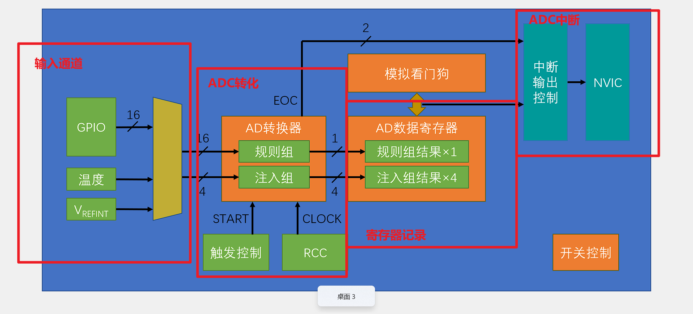
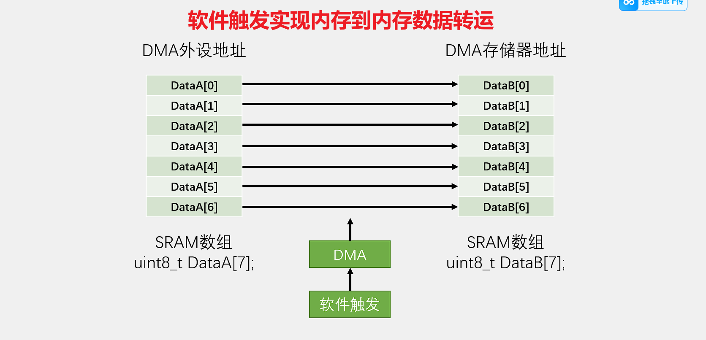
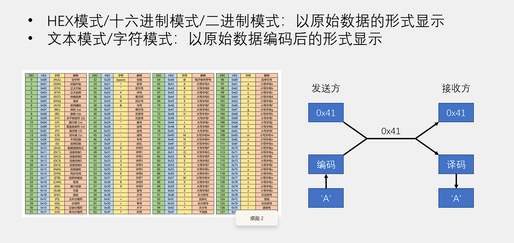
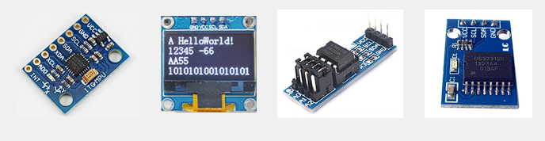
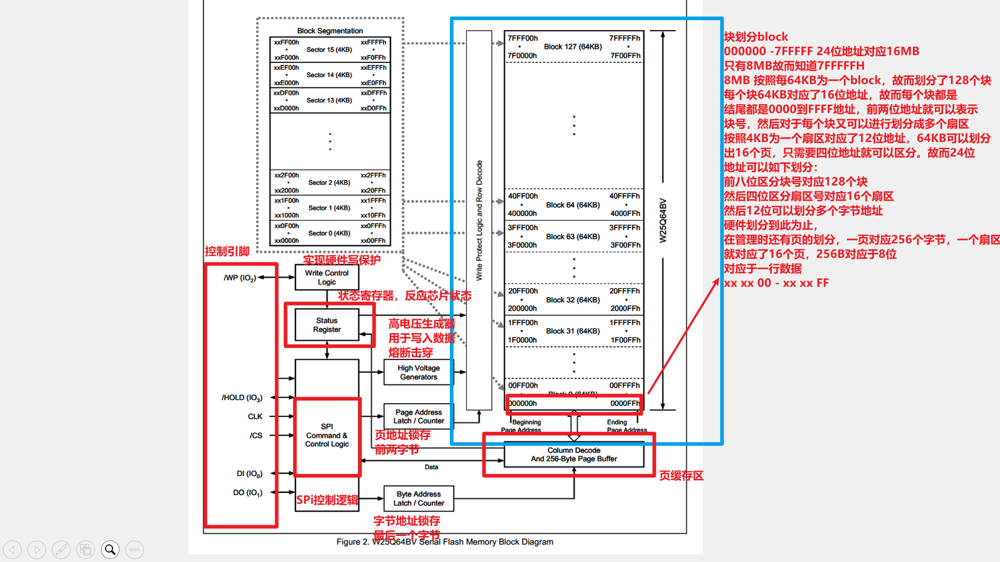
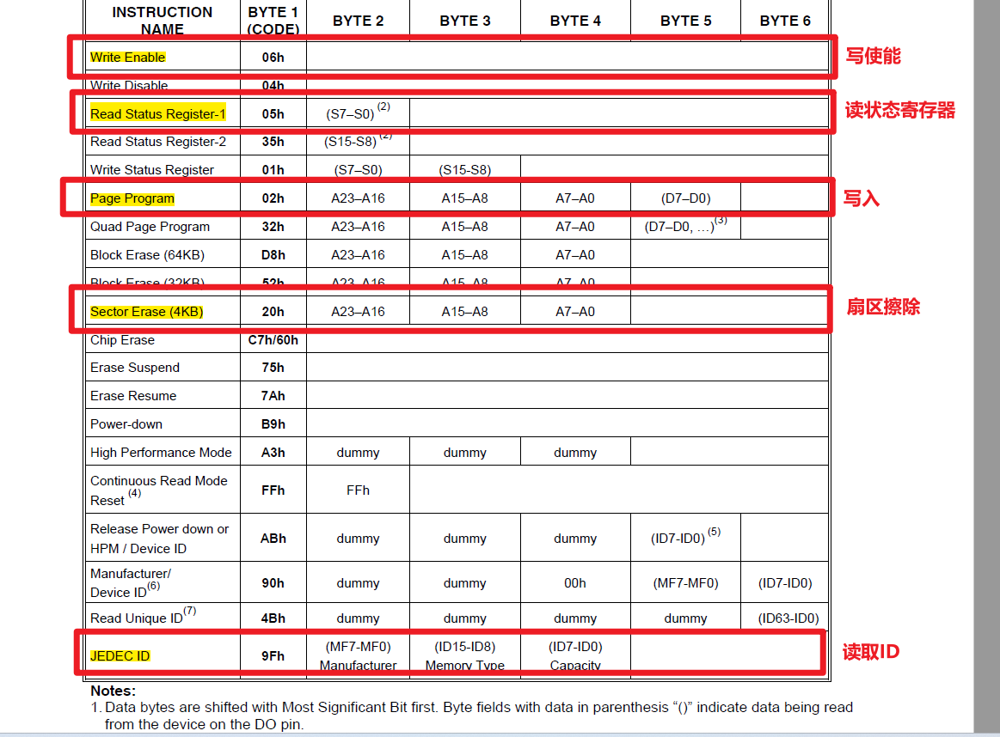

# STM32标准库整理

## 一、综述

### STM32简介

STM32 是ST公司基于ARMCortex-M内核开发的32位微控制器
STM32常应用在嵌入式领域，如智能车、无人机、机器人、无线通信、物联网、工业控制、娱乐电子产品等
STM32功能强大、性能优异、片上资源丰富、功耗低，是一款经典的嵌入式微控制器

STM32系列：


### ARM介绍

ARM既指ARM公司，也指ARM处理器内核
- ARM公司是全球领先的半导体知识产权（IP）提供商，全世界超过95%的智能手机和平板电脑都采用ARM架构
- ARM公司设计ARM内核，半导体厂商完善内核周边电路并生产芯片

ARM架构系列：


### 芯片介绍

#### 简介

- 系列：主流系列STM32F1
- 内核：ARM Cortex-M3
- 主频：72MHz
- RAM：20K（SRAM）
- ROM：64K（Flash）
- 供电：2.0~3.6V（标准3.3V）
- 封装：LQFP48

#### 外设资源：


#### 芯片命名规则：


#### 系统结构图：


#### 引脚定义图


#### 启动配置


#### 最小系统电路原理图


## 二、软件安装MDK

### 安装Keil5
拒绝解释，详细请网上教程

- 安装Keil5 MDK
- 安装器件支持包
- 软件注册
- 安装STLINK驱动
- 安装USB转串口驱动

### 工程架构

型号分类：


新建工程：

- 建立工程文件夹，Keil中新建工程，选择型号
- 工程文件夹里建立Start、Library、User等文件夹，复制固件库里面的文件到工程文件夹
- 工程里对应建立Start、Library、User等同名称的分组，然后将文件夹内的文件添加到工程分组里
- 工程选项，C/C++，Include Paths内声明所有包含头文件的文件夹
- 工程选项，C/C++，Define内定义USE_STDPERIPH_DRIVER
- 工程选项，Debug，下拉列表选择对应调试器，Settings，Flash Download里勾选Reset and Run

工程架构：


补充： 

    SystemInit 函数在嵌入式系统中非常重要，特别是对于像 STM32 系列的微控制器。
    它通常定义在 system_<device>.c 文件中，负责在主应用程序启动之前设置系统时钟和其他低级硬件配置。
    主要功能有：

    时钟配置：设置系统时钟源（如 HSI、HSE、PLL）并配置时钟树，包括 AHB、APB1 和 APB2 预分频器。
    外设初始化：初始化系统正常运行所需的基本外设。
    向量表重定位：设置向量表基地址，这对于中断处理非常重要。
    内存配置：如果使用外部内存，SystemInit 可能会配置内存控制器

SystemInit示例代码:
```C
void SystemInit(void) {
    /* 重置 RCC 时钟配置为默认复位状态 */
    RCC->CR |= (uint32_t)0x00000001; /* 设置 HSION 位 */
    RCC->CFGR &= (uint32_t)0xF8FF0000; /* 重置 SW、HPRE、PPRE1、PPRE2、ADCPRE 和 MCO 位 */
    RCC->CR &= (uint32_t)0xFEF6FFFF; /* 重置 HSEON、CSSON 和 PLLON 位 */
    RCC->CR &= (uint32_t)0xFFFBFFFF; /* 重置 HSEBYP 位 */
    RCC->CFGR &= (uint32_t)0xFF80FFFF; /* 重置 PLLSRC、PLLXTPRE、PLLMUL 和 USBPRE/OTGFSPRE 位 */
    RCC->CIR = 0x009F0000; /* 禁用所有中断并清除挂起位 */
    
    /* 配置系统时钟频率、HCLK、PCLK2 和 PCLK1 预分频器 */
    SetSysClock();
    
    /* 内部 FLASH 中的向量表重定位 */
    SCB->VTOR = FLASH_BASE | VECT_TAB_OFFSET;
}
```

STM32启动历程：

STM32 微控制器的启动历程是一个系统化的过程，涉及从复位到执行主程序的一系列步骤。以下是详细的启动过程：

1. 上电或复位
当 STM32 上电或复位时，系统首先会读取 BOOT 引脚（BOOT0 和 BOOT1）的状态。
这些引脚决定了启动模式，有三种主要启动模式：

从主 Flash 启动：这是最常见的启动模式，系统从内置 Flash 中的用户代码开始执行。
从系统存储器启动：用于 ISP 编程，通过内置的引导加载程序（Bootloader）从 UART、USB 等接口下载固件。
从嵌入式 SRAM 启动：用于调试，代码从 SRAM 中执行，但掉电后数据会丢失。

2. 向量表重定位
根据启动模式，向量表的基地址会被重定位到 0x00000000 地址。
对于从主 Flash 启动，向量表基地址为 Flash 的起始地址；
对于从系统存储器启动，基地址为系统存储器的起始地址。

3. 执行启动代码
处理器从 0x00000000 地址开始执行代码，这段代码通常是启动文件（bootloader）。
启动文件负责初始化系统，包括设置时钟、初始化堆栈和中断向量表等。

4. 系统初始化
启动文件中的 SystemInit 函数会配置系统时钟、初始化外设和设置向量表地址。例如：
```C
void SystemInit(void) {
    /* 配置系统时钟 */
    SetSysClock();
    /* 向量表重定位 */
    SCB->VTOR = FLASH_BASE | VECT_TAB_OFFSET;
}
```
5. 跳转到主程序
启动文件完成初始化后，会跳转到主程序的入口点（通常是 main 函数）。主程序开始执行用户代码。

详细步骤
复位向量：复位后，处理器会从向量表中读取复位向量，跳转到复位处理函数（Reset_Handler）。
堆栈指针初始化：从向量表中读取初始堆栈指针（SP）地址，并将其加载到 SP 寄存器中。
复位处理函数：Reset_Handler 函数会调用 SystemInit 进行系统初始化，然后调用 main 函数。
启动模式选择
BOOT0 = 0：从主 Flash 启动。
BOOT0 = 1：根据 BOOT1 的状态选择从系统存储器或 SRAM 启动。
启动文件的作用
启动文件的主要作用是初始化系统，包括：

配置时钟系统。
初始化堆栈和中断向量表。
初始化全局变量和静态变量。
清空未初始化的变量区（.bss 段）。
总结
STM32 的启动过程确保微控制器在每次上电或复位后都能以一致的方式启动和运行，提供了一个稳定的运行环境1。

STM32内嵌的Bootloader存放在系统存储区，由ST在生产线上写入，用于通过可用的串行接口对闪存存储器进行重新编程
STM32上电后也会执行一个汇编程序用于硬件的初始化。如`startup_stm32f4xx.s`

## 三、GPIO

### GPIO简介

- GPIO（General Purpose Input Output）通用输入输出口
- 可配置为8种输入输出模式
- 引脚电平：0V~3.3V，部分引脚可容忍5V
- 输出模式下可控制端口输出高低电平，用以驱动LED、控制蜂鸣器、模拟通信协议输出时序等
- 输入模式下可读取端口的高低电平或电压，用于读取按键输入、外接模块电平信号输入、ADC电压采集、模拟通信协议接收数据等

### 基本结构


PA0~PA15 16个引脚 但是寄存器是32位寄存器 故而只有低16位有效
GPIOA/GPIOB均挂载在APB2外设总线上

### GPIO 位结构

输入结构分析：


模块1：保护机制

当输入电压大于VDD3.3V时，打通保护二极管，钳位为0.7V故输入保持为4V
当输入电压小于0V时，下二极管导通，钳位为0.7，故保持为-0.7V维持稳定
当输入电压在0~3.3V之间，二极管处于截止区，断开，正常输入

模块2：默认电平设计

上开关闭合，默认输入会被上拉直VDD
下开关闭合，默认输入被下来至VSS
开关均断开，配置为浮空输入模式

模块3：

施密特触发器，对输入电平进行整形，提高边缘性

施密特触发器：V正与V负并不相同，边沿性好，不影响逻辑功能
常用于：
    
    1. 波形转化
    2. 检测过高幅或者过低幅
    3. 脉冲整形，得到干净方波

模块4：输入数据寄存器

输入信号由寄存器记录，最终单片机进行读取

模块5：片上外设

输入信号不流入寄存器，流入外设，实现复用功能
如硬件IIC

输出结构分析：


模块1：单片机输出

通过设置寄存器直接输出到控制端控制
位寄存器可以直接设计某个位控制
而直接寄存器可以使用|=设置1 或者&=设置0

模块2：片上外设输出

片上外设输出信号，实现复用功能

模块3：输出控制 

可以控制输出为推挽输出还是开漏输出
又或者是关闭模式(输入模式)

补充：三极管与MOS管 与CMOS工艺

二极管：


三极管与MOS管：


CMOS反相器:


### GPIO模式

配置GPIO的端口配置寄存器，可以有以下八种模式：


浮空/上拉/下拉输入


模拟输入：


如ADC配置

推挽开漏输出：


复用开漏推挽：


输入模式下，输出无效。同时输出模式下，输入也无效。

各个控制寄存器的外设地址可以查询STM32的数据手册

### LED和蜂鸣器介绍

- LED：发光二极管，正向通电点亮，反向通电不亮
- 有源蜂鸣器：内部自带振荡源，将正负极接上直流电压即可持续发声，频率固定
- 无源蜂鸣器：内部不带振荡源，需要控制器提供振荡脉冲才可发声，调整提供振荡脉冲的频率，可发出不同频率的声音

蜂鸣器需要驱动电路，因为单片机的引脚电流小，没有太强的驱动能力


三极管增大驱动电流

驱动电路示例：


### 按键及传感器模块

- 按键：常见的输入设备，按下导通，松手断开
- 按键抖动：由于按键内部使用的是机械式弹簧片来进行通断的，所以在按下和松手的瞬间会伴随有一连串的抖动


存在按键抖动

传感器模块：
传感器元件（光敏电阻/热敏电阻/红外接收管等）的电阻会随外界模拟量的变化而变化，通过与定值电阻分压即可得到模拟电压输出，再通过电压比较器进行二值化即可得到数字电压输出

结构示意图：


LED1为电源指示灯
LED2为DO指示灯 DO=0时，亮 DO=1时，灭
R5上拉电阻，可以保证默认输入为高电平

硬件电路：


### 语言补充

类型：


枚举：


### 调试方式

- 串口调试：通过串口通信，将调试信息发送到电脑端，电脑使用串口助手显示调试信息

- 显示屏调试：直接将显示屏连接到单片机，将调试信息打印在显示屏上

- Keil调试模式：借助Keil软件的调试模式，可使用单步运行、设置断点、查看寄存器及变量等功能

### 代码函数：

三种外设RCC启动使能AHB / APB2 / APB1 总线
```C
void RCC_AHBPeriphClockCmd(uint32_t RCC_AHBPeriph, FunctionalState NewState);
void RCC_APB2PeriphClockCmd(uint32_t RCC_APB2Periph, FunctionalState NewState);
void RCC_APB1PeriphClockCmd(uint32_t RCC_APB1Periph, FunctionalState NewState);
```

GPIO库函数
```c
void GPIO_DeInit(GPIO_TypeDef* GPIOx); //复位
void GPIO_AFIODeInit(void); //AFIO复位 AFIO实现端口重映射以及中断引脚选择

void GPIO_Init(GPIO_TypeDef* GPIOx, GPIO_InitTypeDef* GPIO_InitStruct);//结构体初始化
void GPIO_StructInit(GPIO_InitTypeDef* GPIO_InitStruct);// 利用结构体赋给默认值

uint8_t GPIO_ReadInputDataBit(GPIO_TypeDef* GPIOx, uint16_t GPIO_Pin);// 读取某一位输入下
uint16_t GPIO_ReadInputData(GPIO_TypeDef* GPIOx);//读取某一组输入下
uint8_t GPIO_ReadOutputDataBit(GPIO_TypeDef* GPIOx, uint16_t GPIO_Pin);//读取一位输出模式下
uint16_t GPIO_ReadOutputData(GPIO_TypeDef* GPIOx);//读取一组输出模式下
void GPIO_SetBits(GPIO_TypeDef* GPIOx, uint16_t GPIO_Pin);//设置某一位为1
void GPIO_ResetBits(GPIO_TypeDef* GPIOx, uint16_t GPIO_Pin);//设置某一位为0
void GPIO_WriteBit(GPIO_TypeDef* GPIOx, uint16_t GPIO_Pin, BitAction BitVal);//指定端口指定位 BitVal为一个枚举类型
void GPIO_Write(GPIO_TypeDef* GPIOx, uint16_t PortVal);//指定写入某一组
//解释见后文
void GPIO_PinLockConfig(GPIO_TypeDef* GPIOx, uint16_t GPIO_Pin);
void GPIO_EventOutputConfig(uint8_t GPIO_PortSource, uint8_t GPIO_PinSource);
void GPIO_EventOutputCmd(FunctionalState NewState);
void GPIO_PinRemapConfig(uint32_t GPIO_Remap, FunctionalState NewState);
void GPIO_EXTILineConfig(uint8_t GPIO_PortSource, uint8_t GPIO_PinSource);
void GPIO_ETH_MediaInterfaceConfig(uint32_t GPIO_ETH_MediaInterface);
```

GPIO_InitTypeDef结构体
```c
typedef struct
{
  uint16_t GPIO_Pin;             /*!< Specifies the GPIO pins to be configured.
                                      This parameter can be any value of @ref GPIO_pins_define */

  GPIOSpeed_TypeDef GPIO_Speed;  /*!< Specifies the speed for the selected pins.
                                      This parameter can be a value of @ref GPIOSpeed_TypeDef */

  GPIOMode_TypeDef GPIO_Mode;    /*!< Specifies the operating mode for the selected pins.
                                      This parameter can be a value of @ref GPIOMode_TypeDef */
}GPIO_InitTypeDef;
```

## 四、OLED调试工具

### 简要介绍

OLED（Organic Light Emitting Diode）：有机发光二极管
OLED显示屏：性能优异的新型显示屏，具有功耗低、相应速度快、宽视角、轻薄柔韧等特点
0.96寸OLED模块：小巧玲珑、占用接口少、简单易用，是电子设计中非常常见的显示屏模块
供电：3~5.5V，通信协议：I2C/SPI，分辨率：128*64


常见的调试方法:
- 串口调试
- 显示屏调试(OLED)
- Keil 调试
  
补充： 

    有机发光二极管，每个像素都可以自发光，对比需要背光的LCD，其功耗更低，刷新率更大，时角更宽(各个角度看更加清晰)

### 硬件电路


### OLED 驱动函数

128 * 64 划分 8 * 16 小格，共64个。


| 函数                                  | 作用                 |
| ------------------------------------- | -------------------- |
| OLED_Init();                          | 初始化               |
| OLED_Clear();                         | 清屏                 |
| OLED_ShowChar(1, 1, 'A');             | 显示一个字符         |
| OLED_ShowString(1, 3, "HelloWorld!"); | 显示字符串           |
| OLED_ShowNum(2, 1, 12345, 5);         | 显示十进制数字       |
| OLED_ShowSignedNum(2, 7, -66, 2);     | 显示有符号十进制数字 |
| OLED_ShowHexNum(3, 1, 0xAA55, 4);     | 显示十六进制数字     |
| OLED_ShowBinNum(4, 1, 0xAA55, 16);    | 显示二进制数字       |

### 补充C语言基础

#### C语言中.h 与 .c文件对应

在 C 语言中，.h 文件（头文件）和 .c 文件（源文件）通过包含预处理指令 #include 关联起来。
头文件通常包含函数声明、宏定义、类型定义和全局变量声明，而源文件包含函数定义和具体实现。
通过在源文件中包含头文件，可以使源文件知道头文件中声明的内容。

关联步骤：
1. 创建头文件：
头文件通常包含函数声明、宏定义、类型定义和全局变量声明。
使用包含保护（include guard）防止头文件被多次包含。

2. 创建源文件：
源文件包含头文件，并实现头文件中声明的函数。
定义头文件中声明的全局变量。

3. 在另一个源文件中使用头文件：
通过包含头文件，可以在其他源文件中使用头文件中声明的函数和变量。

4. 编译和链接：
编译器将每个源文件编译成目标文件（.o 或 .obj 文件）。
链接器将所有目标文件链接成一个可执行文件。

在 C 语言中，包含头文件（.h 文件）并不会直接定位到对应的源文件（.c 文件）。
头文件的作用是提供函数声明、宏定义、类型定义和全局变量声明，**使得包含该头文件的源文件能够知道这些声明的存在**。
实际的函数定义和全局变量定义是在 example.c 中实现的。
编译器会分别编译 main.c 和 example.c，生成对应的目标文件（如 main.o 和 example.o）。
链接器会将这些目标文件链接在一起，生成最终的可执行文件。

#### C语言中的const关键字
嵌入式中const修饰变量会开辟在Flash中，减少内部SRAM的空间使用。

在 C 语言中，使用 const 定义的变量在头文件中包含保护（#ifndef、#define、#endif）下仍然会导致重复定义错误，这是因为 const 变量在 C 语言中默认具有内部链接性（internal linkage）。
这意味着每个包含该头文件的源文件都会有一个独立的副本，从而导致重复定义。OLED_Font.h重复定义

要解决这个问题，可以使用 extern 关键字在头文件中声明 const 变量，并在一个源文件中定义它。
这样可以确保 const 变量只在一个源文件中定义，而在其他源文件中引用。

本项目的OLED 字模数组定义在.h文件中，我们只在OLED.c中包含一次即可。

const关键字特点：
1. 只读属性：
const 修饰的变量在初始化后不能被修改。
试图修改 const 变量的值会导致编译错误。

2. 编译时常量：
const 变量的值在编译时确定，并且在程序运行期间保持不变。

3. 作用域和链接性：
在函数内部定义的 const 变量具有自动存储期（automatic storage duration），即局部变量。
在文件作用域（全局作用域）定义的 const 变量具有内部链接性（internal linkage），即仅在定义它的源文件中可见。
可以使用 extern 关键字在头文件中声明 const 变量，并在一个源文件中定义它，以便在多个源文件中共享。

4. 指针和 const：
const 可以修饰指针本身或指针指向的内容，或者两者都修饰。
const int *ptr：指向 const int 的指针，不能通过 ptr 修改指向的值。
int *const ptr：const 指针，指针本身不能修改，但可以修改指向的值。
const int *const ptr：指向 const int 的 const 指针，指针和指向的值都不能修改。

const 修饰局部变量仍然存储在栈区，局部变量的生命周期是从声明开始到所在的代码块结束，不可修改。
const 修饰的全局变量通常存储在只读数据段（.rodata）中。
全局变量的生命周期是整个程序运行期间。
由于 const 修饰的全局变量是只读的，编译器通常会将它们放在只读数据段，以防止在运行时修改它们。(ROM中)

内存分区：


## 五、中断系统

### 中断系统介绍

中断：在主程序运行过程中，出现了特定的中断触发条件（中断源），使得CPU暂停当前正在运行的程序，转而去处理中断程序，处理完成后又返回原来被暂停的位置继续运行

中断优先级：当有多个中断源同时申请中断时，CPU会根据中断源的轻重缓急进行裁决，优先响应更加紧急的中断源

中断嵌套：当一个中断程序正在运行时，又有新的更高优先级的中断源申请中断，CPU再次暂停当前中断程序，转而去处理新的中断程序，处理完成后依次进行返回

### 中断流程图解


中断源触发中断 --> 中断向量表 --> 保护现场，执行默认程序 --> 中断处理程序 --> 恢复现场 --> 继续执行

### STM32中断介绍

中断类型：
68个可屏蔽中断通道，包含EXTI、TIM、ADC、USART、SPI、I2C、RTC等多个外设

中断管理：
使用NVIC统一管理中断，每个中断通道都拥有16个可编程的优先等级，可对优先级进行分组，进一步设置抢占优先级和响应优先级

中断向量表：


灰色部分为内核中断，白色部分为外设中断

### NVIC 控制器

NVIC为内核外设，辅助CPU工作，管理中断系统。
含有多个中断输入，经抉择后，单个输出到CPU。

基本结构：


NVIC 优先级分组

NVIC的中断优先级由**优先级寄存器**的4位（0~15）决定，这4位可以进行切分，分为高n位的抢占优先级和低4-n位的响应优先级抢占优先级高的可以中断嵌套，响应优先级高的可以优先排队，抢占优先级和响应优先级均相同的按中断号排队

| 分组方式 | 抢占优先级  | 响应优先级  |
| -------- | ----------- | ----------- |
| 分组0    | 0位 取值为0 | 4位 0\~15   |
| 分组1    | 1位 0\~1    | 3位 0\~7    |
| 分组2    | 2位 0\~3    | 2位 0\~3    |
| 分组3    | 3位 0\~7    | 1位 0\~1    |
| 分组4    | 4位 0\~15   | 0位 取值为0 |

### EXIT简介

EXTI（Extern Interrupt）外部中断
EXTI可以监测指定GPIO口的电平信号，当其指定的GPIO口产生电平变化时，EXTI将立即向NVIC发出中断申请，经过NVIC裁决后即可中断CPU主程序，使CPU执行EXTI对应的中断程序

支持的触发方式：上升沿/下降沿/双边沿/软件触发
支持的GPIO口：所有GPIO口，但相同的Pin不能同时触发中断
通道数：16个GPIO_Pin，外加PVD输出、RTC闹钟、USB唤醒、以太网唤醒
触发响应方式：中断响应/事件响应

示例：
外部中断主要用于检测GPIO变化，触发的方式多种多样
PA0 PB0 PC0不能同时出发中断
PVD输出 RTC USB唤醒 ETH唤醒等主要用于电源电压检测，停止模式恢复，低功耗唤醒等功能

补充中断和事件区别：

    中断(CPU参与)
    中断是一种机制，当特定的事件发生时，微控制器会暂停当前的执行流程，跳转到一个预定义的中断服务程序（ISR）来处理该事件。
    中断通常用于处理需要立即响应的事件，如外部信号、定时器溢出等。
    优先级：中断具有优先级，可以配置不同中断的优先级，以便在多个中断同时发生时，优先处理高优先级的中断。
    中断向量表：每个中断都有一个对应的中断向量，指向中断服务程序的入口地址。
    中断服务程序（ISR）：当中断发生时，微控制器会跳转到对应的 ISR 执行处理代码。
    中断嵌套：高优先级的中断可以打断低优先级的中断服务程序，实现中断嵌套。

    事件(无CPU参与)
    事件是一种机制，用于在外设之间传递信号，而不需要 CPU 的干预。
    事件通常用于同步外设操作，如定时器、DMA 等。
    事件不会触发中断服务程序，而是直接在硬件层面进行处理。
    无优先级：事件没有优先级的概念，所有事件都是平等的。
    无中断服务程序：事件不会触发中断服务程序，而是直接在硬件层面进行处理。
    外设同步：事件通常用于外设之间的同步操作，如定时器触发 ADC 转换等。
    低功耗：事件机制可以在不唤醒 CPU 的情况下进行外设操作，有助于降低功耗。

EXTI 基本结构：


图解：
1. 5~9 分配一个通道 10~15分配一个通道，这些引脚触发中断，对应的中断处理程序相同，可以在函数内部通过标志位区分
2. 触发事件(不经过CPU直接通往其他外设)
3. 数据选择器的Pin只有16个引脚，GPIOA/B/C均有16个引脚，故而三个公用一个

AFIO数据选择器：

作用一： 选择使用外部中断引脚
作用二：设置引脚复用

AFIO主要用于引脚复用功能的选择和重定义
在STM32中，AFIO主要完成两个任务：复用功能引脚重映射、中断引脚选择


AFIO 寄存器：
相关EXTI选择的AFIO_EXTICR1\~4
每个寄存器配置四个EXTI 
EXTI0 \~ EXTI15


故而共16个Pin通道，到达NVIC时5\~9 10\~15会发生合并

引脚复用功能图：


EXTI框图：

事件触发框图：


中断触发图：


### 旋转编码器介绍

旋转编码器：用来测量位置、速度或旋转方向的装置，当其旋转轴旋转时，其输出端可以输出与旋转速度和方向对应的方波信号，读取方波信号的频率和相位信息即可得知旋转轴的速度和方向
类型：机械触点式/霍尔传感器式/光栅式


硬件电路：


工作原理：
AB 相旋转编码器是一种常见的增量式编码器，用于测量旋转轴的位置、速度和方向。
它通过两个相位相差 90 度的方波信号（A 相和 B 相）来实现这些测量。

位置测量：
编码器的旋转轴每旋转一定角度，会产生一对 A 相和 B 相的方波信号。
通过计数 A 相或 B 相的脉冲数，可以确定旋转轴的位置。

速度测量：
通过测量单位时间内产生的脉冲数，可以计算旋转轴的速度。
速度 = 脉冲数 / 时间间隔。

方向测量：
通过比较 A 相和 B 相的相位关系，可以确定旋转方向。
如果 A 相领先 B 相，则表示顺时针旋转；如果 B 相领先 A 相，则表示逆时针旋转


补充：

    我的工程中有主程序main.c以及用到的OLED.c模块，生成的main.o和OLED.o最终链接在一起，main.c中定义的宏，对OLED.c有效吗
    答：
    不可以。main.c 中定义的宏对 OLED.c 无效。
    每个源文件在编译时都是独立处理的，main.c 中定义的宏不会自动传递到 OLED.c 中。
    要使宏在多个文件中有效，可以在头文件中定义宏，并在需要使用宏的源文件中包含该头文件。

    条件编译发生在预处理阶段。预处理是编译过程的第一个阶段，在这个阶段，编译器会处理所有的预处理指令，例如 #include、#define、#ifdef、#ifndef 等。
    在main.c中没有定义宏 定义宏 包含了头文件，最后生成main.o 。
    在time.c中main.c的宏不会起到作用，故而又定义了宏包含了头文件，链接阶段时，main.o与time.o链接在一起。
    注意宏，条件编译只在预处理阶段起作用，达到main.o文件时，已经为二进制文件了。include 宏 只是声明作用，不起定义作用。故而可以重复包含，单个文件中不能重复包含，故而需要头文件守卫。
    宏、条件编译等均为编译器解析动作，汇编中没有体现。

    综上，.h文件只能含义声明语句，不能含有定义语句。

变量定义
`int a;`分配空间
变量声明
`extern int a;`声明a 不分配空间

函数定义
函数体；
函数声明
`int func (int,int);` 包含返回值类型 函数名 参数，只声明不分配空间。extern修饰表示外部函数。
## 六、定时器系统

### 定时器系统简介

- TIM（Timer）定时器
- 定时器可以对输入的时钟进行计数，并在计数值达到设定值时触发中断
- 16位计数器、预分频器、自动重装寄存器的时基单元，在72MHz计数时钟下可以实现最大59.65s的定时
- 不仅具备基本的定时中断功能，而且还包含内外时钟源选择、输入捕获、输出比较、编码器接口、主从触发模式等多种功能
- 根据复杂度和应用场景分为了高级定时器、通用定时器、基本定时器三种类型

定时器类型

| 类型       | 编号                   | 总线 | 功能                                                                                                 |
| ---------- | ---------------------- | ---- | ---------------------------------------------------------------------------------------------------- |
| 高级定时器 | TIM1、TIM8             | APB2 | 拥有通用定时器全部功能，并额外具有重复计数器、死区生成、互补输出、刹车输入等功能                     |
| 通用定时器 | TIM2、TIM3、TIM4、TIM5 | APB1 | 拥有基本定时器全部功能，并额外具有内外时钟源选择、输入捕获、输出比较、编码器接口、主从触发模式等功能 |
| 基本定时器 | TIM6、TIM7             | APB1 | 拥有定时中断、主模式触发DAC的功能                                                                    |

STM32C8T6 定时器资源有 TIM1\~4（一个高级三个通用）

### 定时器结构

#### 基本定时器


PSC 预分频器： 16位，最大65536分频
CNT 计数器： 16位，最大0\~65535,只能向上计数
ARR ：16位，自动重装载

产生的定时器中断，进入NVIC选择，进入CPU中断系统
产生事件，可以出发其他外设工作

主从触发模式：


#### 通用寄存器

时钟控制部分电路

捕获比较中断电路


主从触发模式：

主模式：
主模式（Master Mode）是指定时器作为主设备，控制其他定时器或外设的运行。
主模式下，定时器可以生成触发信号，触发其他定时器或外设的操作。
主模式通过配置定时器的主模式控制寄存器（TIMx_CR2）中的主模式选择位（MMS）来实现。常见的主模式包括：
- 复位模式（Reset Mode）：当定时器的计数器达到更新事件时，生成复位信号。
- 使能模式（Enable Mode）：当定时器的计数器使能时，生成使能信号。
- 更新模式（Update Mode）：当定时器的计数器达到更新事件时，生成更新信号。
- 比较脉冲模式（Compare Pulse Mode）：当定时器的输出比较事件发生时，生成比较脉冲信号。
```C
#include "stm32f10x.h"
void TIM2_MasterMode_Config(void) {
    TIM_TimeBaseInitTypeDef TIM_TimeBaseStructure;
    TIM_OCInitTypeDef TIM_OCInitStructure;

    // 配置 TIM2 基本时间基
    RCC_APB1PeriphClockCmd(RCC_APB1Periph_TIM2, ENABLE);
    TIM_TimeBaseStructure.TIM_Period = 999;
    TIM_TimeBaseStructure.TIM_Prescaler = 71;
    TIM_TimeBaseStructure.TIM_ClockDivision = 0;
    TIM_TimeBaseStructure.TIM_CounterMode = TIM_CounterMode_Up;
    TIM_TimeBaseInit(TIM2, &TIM_TimeBaseStructure);

    // 配置 TIM2 为主模式
    TIM_SelectOutputTrigger(TIM2, TIM_TRGOSource_Update);

    // 启动 TIM2
    TIM_Cmd(TIM2, ENABLE);
}

int main(void) {
    TIM2_MasterMode_Config();
    while (1) {
        // 主循环
    }
}
```
从模式：
从模式（Slave Mode）是指定时器作为从设备，受其他定时器或外设的控制。
定时器在从模式下，可以根据外部触发信号进行同步操作。
从模式通过配置定时器的从模式控制寄存器（TIMx_SMCR）中的从模式选择位（SMS）和触发选择位（TS）来实现。
常见的从模式包括：
- 关闭模式（Disabled Mode）：从模式关闭，定时器独立运行。
- 复位模式（Reset Mode）：当触发信号到来时，复位定时器的计数器。
- 门控模式（Gated Mode）：当触发信号有效时，定时器计数器运行；当触发信号无效时，定时器计数器停止。
- 触发模式（Trigger Mode）：当触发信号到来时，启动定时器的计数器。
- 外部时钟模式1（External Clock Mode 1）：使用外部触发信号作为定时器的时钟源。

```C
#include "stm32f10x.h"

void TIM3_SlaveMode_Config(void) {
    TIM_TimeBaseInitTypeDef TIM_TimeBaseStructure;

    // 配置 TIM3 基本时间基
    RCC_APB1PeriphClockCmd(RCC_APB1Periph_TIM3, ENABLE);
    TIM_TimeBaseStructure.TIM_Period = 999;
    TIM_TimeBaseStructure.TIM_Prescaler = 71;
    TIM_TimeBaseStructure.TIM_ClockDivision = 0;
    TIM_TimeBaseStructure.TIM_CounterMode = TIM_CounterMode_Up;
    TIM_TimeBaseInit(TIM3, &TIM_TimeBaseStructure);

    // 配置 TIM3 为从模式，触发源为 TIM2
    TIM_SelectSlaveMode(TIM3, TIM_SlaveMode_Reset);
    TIM_SelectInputTrigger(TIM3, TIM_TS_ITR1); // ITR1 对应 TIM2

    // 启动 TIM3
    TIM_Cmd(TIM3, ENABLE);
}

int main(void) {
    TIM2_MasterMode_Config();
    TIM3_SlaveMode_Config();
    while (1) {
        // 主循环
    }
}
```
主从触发：自己的触发事件触发自己复位，实现自动复位。

内部触发连接：


#### 高级定时器

框图：


### 定时器中断


### 预分频器时序


计数器计数频率： CK_CNT = CK_PSC / (PSC + 1) ;

### 计数器时序


计数器溢出频率：CK_CNT_OV = CK_CNT / (ARR +1) = CK_PSC / (PSC + 1) / (ARR + 1);

### 计数器ARR 无预装寄存器时序


写入新值后，立即起作用。没有影子寄存器

### 计数器ARR 有预装寄存器时序


写入新值后，下一个时期才会起作用。
主要目的是为了保证时序的同步

### RCC 时钟数

main 函数在执行前，会运行SystemInit函数，主要作用是配置时钟树。

时钟信号产生电路


CSS 时钟安全系统
8MHZ外部晶振 经锁相环倍频后得到721MHZ系统时钟，分配给AHB、APB1、APB2总线

当外部时钟损坏后，系统使用内部8MHZ的时钟弥补，在感官上，时钟慢了近十倍

时钟信号分配：


APB1最大36MHZ APB2最大72MHZ
TIM固定72MHZ

## 七、定时器使用

### 定时器中断


配置步骤：
- 配置RCC使能
- 配置内部时钟模式
- 配置时基单元
- 配置中断输出控制
- 配置NVIC 定时器中断
- 运行控制

配置函数：
```C
void TIM_DeInit(TIM_TypeDef* TIMx); //默认设置
void TIM_TimeBaseInit(TIM_TypeDef* TIMx, TIM_TimeBaseInitTypeDef* TIM_TimeBaseInitStruct);//时基单元初始化
void TIM_Cmd(TIM_TypeDef* TIMx, FunctionalState NewState);//使能控制
void TIM_TimeBaseStructInit(TIM_TimeBaseInitTypeDef* TIM_TimeBaseInitStruct);//结构体变量赋给默认值

void TIM_InternalClockConfig(TIM_TypeDef* TIMx);//内部时钟
void TIM_ITRxExternalClockConfig(TIM_TypeDef* TIMx, uint16_t TIM_InputTriggerSource);//选择ITR定时器
void TIM_TIxExternalClockConfig(TIM_TypeDef* TIMx, uint16_t TIM_TIxExternalCLKSource,
                                uint16_t TIM_ICPolarity, uint16_t ICFilter); //选择捕获通道时钟
void TIM_ETRClockMode1Config(TIM_TypeDef* TIMx, uint16_t TIM_ExtTRGPrescaler, uint16_t TIM_ExtTRGPolarity,
                             uint16_t ExtTRGFilter);//选择外部时钟1 输入时钟
void TIM_ETRClockMode2Config(TIM_TypeDef* TIMx, uint16_t TIM_ExtTRGPrescaler, 
                             uint16_t TIM_ExtTRGPolarity, uint16_t ExtTRGFilter);//选择外部时钟2 输入时钟
void TIM_ETRConfig(TIM_TypeDef* TIMx, uint16_t TIM_ExtTRGPrescaler, uint16_t TIM_ExtTRGPolarity,
                             uint16_t ExtTRGFilter); //单独配置ETR引脚预分频器极性滤波器等

void TIM_PrescalerConfig(TIM_TypeDef* TIMx, uint16_t Prescaler, uint16_t TIM_PSCReloadMode);//设置实际单元分频值
void TIM_CounterModeConfig(TIM_TypeDef* TIMx, uint16_t TIM_CounterMode);//设置计数模式
void TIM_ARRPreloadConfig(TIM_TypeDef* TIMx, FunctionalState NewState);//设置ARR模式 有预装 无预装
void TIM_SetCounter(TIM_TypeDef* TIMx, uint16_t Counter);//设置计数器值
void TIM_SetAutoreload(TIM_TypeDef* TIMx, uint16_t Autoreload);//设置ARR值
uint16_t TIM_GetCounter(TIM_TypeDef* TIMx);//获取计数器值
uint16_t TIM_GetPrescaler(TIM_TypeDef* TIMx);//获取预分频器值
FlagStatus TIM_GetFlagStatus(TIM_TypeDef* TIMx, uint16_t TIM_FLAG);//获取标志位
void TIM_ClearFlag(TIM_TypeDef* TIMx, uint16_t TIM_FLAG);//清楚标志位
ITStatus TIM_GetITStatus(TIM_TypeDef* TIMx, uint16_t TIM_IT);//中断中获取
void TIM_ClearITPendingBit(TIM_TypeDef* TIMx, uint16_t TIM_IT);//中断中清除
```
TIM_IT 中断标志位：
TIM_IT_Update: 定时器更新中断源。当定时器计数器溢出或更新事件发生时触发。
TIM_IT_CC1: 定时器捕获比较1中断源。当捕获/比较寄存器1匹配计数器值时触发。
TIM_IT_CC2: 定时器捕获比较2中断源。当捕获/比较寄存器2匹配计数器值时触发。
TIM_IT_CC3: 定时器捕获比较3中断源。当捕获/比较寄存器3匹配计数器值时触发。
TIM_IT_CC4: 定时器捕获比较4中断源。当捕获/比较寄存器4匹配计数器值时触发。
TIM_IT_COM: 定时器换向中断源。用于高级控制定时器的换向事件。
TIM_IT_Trigger: 定时器触发中断源。当触发输入事件发生时触发。
TIM_IT_Break: 定时器断裂中断源。用于高级控制定时器的紧急停止事件。

时基单元结构体：
```C
typedef struct
{
  uint16_t TIM_Prescaler; //预分频器值
  uint16_t TIM_CounterMode;//计数模式 
  uint16_t TIM_Period; //ARR 自动重装载 
  uint16_t TIM_ClockDivision; //采样频率分频 
  uint8_t TIM_RepetitionCounter;  //重复计数器值（高级计数器才有）
} TIM_TimeBaseInitTypeDef;    
```

补充：滤波器

    滤波原理：
    固定时钟信号F采样，值相同，则稳定输出
    值并不相同，输出为0或者保持原样输出

    采样频率越高，采样点越多，滤波效果越好，对应的延迟也越大
    采样频率的来源：时钟分频 TIM_ClockDivision决定

static 修饰作用：

修饰局部变量： 内存申请在静态区，出函数后不会被销毁。
作用域不变，生命周期被延长

修饰全局变量： 全局变量本身有外部链接属性，可用extern 声明外部文件变量。static修饰以后，成为文件内部属性，不可被外联。
生命周期不变，作用域改变。

修饰函数： 同全局变量

补充： 刚一上电可能立即进入中断

    TIM_TimeBaseInit 函数中，会自动生成一个更新事件。
    来重装预分频器，更新事件与更新中断，同时产生。
    生成更新事件的同时，中断标志位置位1，因而复位时会立即进入中断，
    初始化时，需要清楚标志位。
    TIM_ClearFlag(TIM,TIM_FLAG_Update);

### 输出比较功能

#### 输出比较简介

OC（Output Compare）输出比较
输出比较可以通过比较CNT与CCR寄存器值的关系，来对输出电平进行置1、置0或翻转的操作，用于输出一定频率和占空比的PWM波形(输出比较)
每个高级定时器和通用定时器都拥有4个输出比较通道 (四个通道)
高级定时器的前3个通道额外拥有死区生成和互补输出的功能(用于驱动三相电机)

会对比CNT 与 CCR的值大小，通过大小比较输出0/1

#### PWM波形

PWM（Pulse Width Modulation）脉冲宽度调制
在具有惯性的系统中，可以通过对一系列脉冲的宽度进行调制，来等效地获得所需要的模拟参量，常应用于电机控速等领域
PWM参数：
- 周期 = TS
- 频率 = 1 / TS  频率越大，性能越平稳，功耗也越大。
- 占空比 = TON / TS 高电平占比，表示等效的模拟量
- 分辨率 = 占空比变化步距 表示占空比变化（调节步频）

图解：


#### 输出比较输出PWM

输出比较通道


输出比较模式


PWM结构


f频率可调，占空比可调

#### PWM参数计算


PWM频率: Freq = CK_PSC / (PSC + 1) / (ARR + 1) (时钟频率)
PWM占空比： Duty = CCR / (ARR + 1) 
PWM分辨率： Reso = 1 / (ARR + 1) 

补充一下高级定时器输出比较：


#### 舵机

舵机是一种根据输入PWM信号占空比来控制输出角度的装置
输入PWM信号要求：周期为20ms，高电平宽度为0.5ms~2.5ms


硬件电路：


#### 直流电机

直流电机是一种将电能转换为机械能的装置，有两个电极，当电极正接时，电机正转，当电极反接时，电机反转
直流电机属于大功率器件，GPIO口无法直接驱动，需要配合电机驱动电路来操作
TB6612是一款双路H桥型的直流电机驱动芯片，可以驱动两个直流电机并且控制其转速和方向


硬件驱动电路：


#### PWM 相关函数

```C
void TIM_ForcedOC1Config(TIM_TypeDef* TIMx, uint16_t TIM_ForcedAction);//强制输出0/1
void TIM_ForcedOC2Config(TIM_TypeDef* TIMx, uint16_t TIM_ForcedAction);
void TIM_ForcedOC3Config(TIM_TypeDef* TIMx, uint16_t TIM_ForcedAction);
void TIM_ForcedOC4Config(TIM_TypeDef* TIMx, uint16_t TIM_ForcedAction);

void TIM_OC1PreloadConfig(TIM_TypeDef* TIMx, uint16_t TIM_OCPreload);//设置CCR寄存器 带有影子寄存器
void TIM_OC2PreloadConfig(TIM_TypeDef* TIMx, uint16_t TIM_OCPreload);
void TIM_OC3PreloadConfig(TIM_TypeDef* TIMx, uint16_t TIM_OCPreload);
void TIM_OC4PreloadConfig(TIM_TypeDef* TIMx, uint16_t TIM_OCPreload);

void TIM_OC1FastConfig(TIM_TypeDef* TIMx, uint16_t TIM_OCFast); //快速配置使能
void TIM_OC2FastConfig(TIM_TypeDef* TIMx, uint16_t TIM_OCFast);
void TIM_OC3FastConfig(TIM_TypeDef* TIMx, uint16_t TIM_OCFast);
void TIM_OC4FastConfig(TIM_TypeDef* TIMx, uint16_t TIM_OCFast);

void TIM_ClearOC1Ref(TIM_TypeDef* TIMx, uint16_t TIM_OCClear);//清楚REF信号
void TIM_ClearOC2Ref(TIM_TypeDef* TIMx, uint16_t TIM_OCClear);
void TIM_ClearOC3Ref(TIM_TypeDef* TIMx, uint16_t TIM_OCClear);
void TIM_ClearOC4Ref(TIM_TypeDef* TIMx, uint16_t TIM_OCClear);

void TIM_OC1Init(TIM_TypeDef* TIMx, TIM_OCInitTypeDef* TIM_OCInitStruct); //输出比较初始化
void TIM_OC2Init(TIM_TypeDef* TIMx, TIM_OCInitTypeDef* TIM_OCInitStruct);
void TIM_OC3Init(TIM_TypeDef* TIMx, TIM_OCInitTypeDef* TIM_OCInitStruct);
void TIM_OC4Init(TIM_TypeDef* TIMx, TIM_OCInitTypeDef* TIM_OCInitStruct);

void TIM_OCStructInit(TIM_OCInitTypeDef* TIM_OCInitStruct); //结构体默认初始化

void TIM_OC1PolarityConfig(TIM_TypeDef* TIMx, uint16_t TIM_OCPolarity); //配置输出有效极性
void TIM_OC1NPolarityConfig(TIM_TypeDef* TIMx, uint16_t TIM_OCNPolarity); //互补通道设置

void TIM_CCxCmd(TIM_TypeDef* TIMx, uint16_t TIM_Channel, uint16_t TIM_CCx);// 修改使能参数
void TIM_CCxNCmd(TIM_TypeDef* TIMx, uint16_t TIM_Channel, uint16_t TIM_CCxN);

void TIM_SelectOCxM(TIM_TypeDef* TIMx, uint16_t TIM_Channel, uint16_t TIM_OCMode);//修改输出比较模式

void TIM_SetCompare1(TIM_TypeDef* TIMx, uint16_t Compare1);//设置占空比

```

输出比较结构体
```C
typedef struct
{
  uint16_t TIM_OCMode;        /*!< Specifies the TIM mode.
                                   This parameter can be a value of @ref TIM_Output_Compare_and_PWM_modes */

  uint16_t TIM_OutputState;   /*!< Specifies the TIM Output Compare state.
                                   This parameter can be a value of @ref TIM_Output_Compare_state */

  uint16_t TIM_OutputNState;  /*!< Specifies the TIM complementary Output Compare state.
                                   This parameter can be a value of @ref TIM_Output_Compare_N_state
                                   @note This parameter is valid only for TIM1 and TIM8. */

  uint16_t TIM_Pulse;         /*!< Specifies the pulse value to be loaded into the Capture Compare Register. 
                                   This parameter can be a number between 0x0000 and 0xFFFF */

  uint16_t TIM_OCPolarity;    /*!< Specifies the output polarity.
                                   This parameter can be a value of @ref TIM_Output_Compare_Polarity */

  uint16_t TIM_OCNPolarity;   /*!< Specifies the complementary output polarity.
                                   This parameter can be a value of @ref TIM_Output_Compare_N_Polarity
                                   @note This parameter is valid only for TIM1 and TIM8. */

  uint16_t TIM_OCIdleState;   /*!< Specifies the TIM Output Compare pin state during Idle state.
                                   This parameter can be a value of @ref TIM_Output_Compare_Idle_State
                                   @note This parameter is valid only for TIM1 and TIM8. */

  uint16_t TIM_OCNIdleState;  /*!< Specifies the TIM Output Compare pin state during Idle state.
                                   This parameter can be a value of @ref TIM_Output_Compare_N_Idle_State
                                   @note This parameter is valid only for TIM1 and TIM8. */
} TIM_OCInitTypeDef;   
```

引脚复用：

倘若PA0已经占用，可以重映射到替他位置。

重映射需要利用AFIO
重映射：
```C
//配置引脚重映射
RCC_APB2PeriphClockCmd(RCC_APB2Periph_AFIO,ENABLE); //开启AFIO
GPIO_PinRemapConfig(GPIO_PartialRemap1_TIM2,ENABLE);//TIM2CH1复用功能开启 复用到A15
GPIO_PinRemapConfig(GPIO_Remap_SWJ_JTAGDisable,ENABLE);//关闭A15原本的ATAG调试功能使之成为普通io
```
函数描述：
```C
/**
  * @brief  Changes the mapping of the specified pin.
  * @param  GPIO_Remap: selects the pin to remap.
  *   This parameter can be one of the following values:
  *     @arg GPIO_Remap_SPI1             : SPI1 Alternate Function mapping
  *     @arg GPIO_Remap_I2C1             : I2C1 Alternate Function mapping
  *     @arg GPIO_Remap_USART1           : USART1 Alternate Function mapping
  *     @arg GPIO_Remap_USART2           : USART2 Alternate Function mapping
  *     @arg GPIO_PartialRemap_USART3    : USART3 Partial Alternate Function mapping
  *     @arg GPIO_FullRemap_USART3       : USART3 Full Alternate Function mapping
  *     @arg GPIO_PartialRemap_TIM1      : TIM1 Partial Alternate Function mapping
  *     @arg GPIO_FullRemap_TIM1         : TIM1 Full Alternate Function mapping
  *     @arg GPIO_PartialRemap1_TIM2     : TIM2 Partial1 Alternate Function mapping
  *     @arg GPIO_PartialRemap2_TIM2     : TIM2 Partial2 Alternate Function mapping
  *     @arg GPIO_FullRemap_TIM2         : TIM2 Full Alternate Function mapping
  *     @arg GPIO_PartialRemap_TIM3      : TIM3 Partial Alternate Function mapping
  *     @arg GPIO_FullRemap_TIM3         : TIM3 Full Alternate Function mapping
  *     @arg GPIO_Remap_TIM4             : TIM4 Alternate Function mapping
  *     @arg GPIO_Remap1_CAN1            : CAN1 Alternate Function mapping
  *     @arg GPIO_Remap2_CAN1            : CAN1 Alternate Function mapping
  *     @arg GPIO_Remap_PD01             : PD01 Alternate Function mapping
  *     @arg GPIO_Remap_TIM5CH4_LSI      : LSI connected to TIM5 Channel4 input capture for calibration
  *     @arg GPIO_Remap_ADC1_ETRGINJ     : ADC1 External Trigger Injected Conversion remapping
  *     @arg GPIO_Remap_ADC1_ETRGREG     : ADC1 External Trigger Regular Conversion remapping
  *     @arg GPIO_Remap_ADC2_ETRGINJ     : ADC2 External Trigger Injected Conversion remapping
  *     @arg GPIO_Remap_ADC2_ETRGREG     : ADC2 External Trigger Regular Conversion remapping
  *     @arg GPIO_Remap_ETH              : Ethernet remapping (only for Connectivity line devices)
  *     @arg GPIO_Remap_CAN2             : CAN2 remapping (only for Connectivity line devices)
  *     @arg GPIO_Remap_SWJ_NoJTRST      : Full SWJ Enabled (JTAG-DP + SW-DP) but without JTRST
  *     @arg GPIO_Remap_SWJ_JTAGDisable  : JTAG-DP Disabled and SW-DP Enabled
  *     @arg GPIO_Remap_SWJ_Disable      : Full SWJ Disabled (JTAG-DP + SW-DP)
  *     @arg GPIO_Remap_SPI3             : SPI3/I2S3 Alternate Function mapping (only for Connectivity line devices)
  *                                        When the SPI3/I2S3 is remapped using this function, the SWJ is configured
  *                                        to Full SWJ Enabled (JTAG-DP + SW-DP) but without JTRST.   
  *     @arg GPIO_Remap_TIM2ITR1_PTP_SOF : Ethernet PTP output or USB OTG SOF (Start of Frame) connected
  *                                        to TIM2 Internal Trigger 1 for calibration (only for Connectivity line devices)
  *                                        If the GPIO_Remap_TIM2ITR1_PTP_SOF is enabled the TIM2 ITR1 is connected to 
  *                                        Ethernet PTP output. When Reset TIM2 ITR1 is connected to USB OTG SOF output.    
  *     @arg GPIO_Remap_PTP_PPS          : Ethernet MAC PPS_PTS output on PB05 (only for Connectivity line devices)
  *     @arg GPIO_Remap_TIM15            : TIM15 Alternate Function mapping (only for Value line devices)
  *     @arg GPIO_Remap_TIM16            : TIM16 Alternate Function mapping (only for Value line devices)
  *     @arg GPIO_Remap_TIM17            : TIM17 Alternate Function mapping (only for Value line devices)
  *     @arg GPIO_Remap_CEC              : CEC Alternate Function mapping (only for Value line devices)
  *     @arg GPIO_Remap_TIM1_DMA         : TIM1 DMA requests mapping (only for Value line devices)
  *     @arg GPIO_Remap_TIM9             : TIM9 Alternate Function mapping (only for XL-density devices)
  *     @arg GPIO_Remap_TIM10            : TIM10 Alternate Function mapping (only for XL-density devices)
  *     @arg GPIO_Remap_TIM11            : TIM11 Alternate Function mapping (only for XL-density devices)
  *     @arg GPIO_Remap_TIM13            : TIM13 Alternate Function mapping (only for High density Value line and XL-density devices)
  *     @arg GPIO_Remap_TIM14            : TIM14 Alternate Function mapping (only for High density Value line and XL-density devices)
  *     @arg GPIO_Remap_FSMC_NADV        : FSMC_NADV Alternate Function mapping (only for High density Value line and XL-density devices)
  *     @arg GPIO_Remap_TIM67_DAC_DMA    : TIM6/TIM7 and DAC DMA requests remapping (only for High density Value line devices)
  *     @arg GPIO_Remap_TIM12            : TIM12 Alternate Function mapping (only for High density Value line devices)
  *     @arg GPIO_Remap_MISC             : Miscellaneous Remap (DMA2 Channel5 Position and DAC Trigger remapping, 
  *                                        only for High density Value line devices)     
  * @param  NewState: new state of the port pin remapping.
  *   This parameter can be: ENABLE or DISABLE.
  * @retval None
  */
 ```

输出GPIO时，由定时器输出，故而配置成AF_PP功能。复用推挽输出

示例：
1KHZPWM波，占空比为50% 分辨率为1%
1KHZ = 72 000 000 / (PSC + 1) / (ARR + 1)
50% = CRR / (ARR + 1)
1% = 1 / (ARR + 1)

得PSC = 720
CRR = 50
ARR = 99

### 输入捕获

#### 输入捕获功能简介

IC（Input Capture）输入捕获
输入捕获模式下，当通道输入引脚出现指定电平跳变时，当前CNT的值将被锁存到CCR中，可用于测量PWM波形的频率、占空比、脉冲间隔、电平持续时间等参数
每个高级定时器和通用定时器都拥有4个输入捕获通道
可配置为**PWMI模式**，同时测量频率和占空比
可配合**主从触发模式**，实现硬件全自动测量

对于同一个定时器，输入捕获与输出比较只能使用一个(使用同一个CRR寄存器)

#### 频率测量


测频法：在闸门时间T内，对上升沿计次，得到N，则频率$𝑓_𝑥=𝑁 / 𝑇$. 更加稳定适合高频信号。

测周法：在两个上升沿内，用标准频率fc计次，则频率为$f_x = f_c / N$. 适合低频，更新快

中界频率：测频法与测周法误差相等的频率点 $ 𝑓_𝑚= \sqrt{𝑓_𝑐  / 𝑇}$ （N值相等）

#### 输入捕获部分电路设计


滤波器采样频率越低，采样个数越多 其滤波效果越好

#### 主从触发模式

在 STM32 微控制器中，定时器可以配置为主模式或从模式，以实现复杂的定时和同步功能。

主模式是指定时器作为主设备，生成触发信号来控制其他定时器或外设的运行。
在主模式下，定时器可以通过特定事件（如更新事件、比较事件等）生成触发输出信号（TRGO），这些信号可以用于启动或同步其他定时器或外设。

配置主模式:
主模式通过配置定时器的主模式控制寄存器（TIMx_CR2）中的主模式选择位（MMS）来实现。常见的主模式包括：
复位模式（Reset Mode）：当定时器的计数器达到更新事件时，生成复位信号。
使能模式（Enable Mode）：当定时器的计数器使能时，生成使能信号。
更新模式（Update Mode）：当定时器的计数器达到更新事件时，生成更新信号。
比较脉冲模式（Compare Pulse Mode）：当定时器的输出比较事件发生时，生成比较脉冲信号。

从模式是指定时器作为从设备，受其他定时器或外设的控制。
在从模式下，定时器可以根据外部触发信号进行同步操作，如启动、复位或作为时钟源。

配置从模式：
从模式通过配置定时器的从模式控制寄存器（TIMx_SMCR）中的从模式选择位（SMS）和触发选择位（TS）来实现。常见的从模式包括：
关闭模式（Disabled Mode）：从模式关闭，定时器独立运行。
复位模式（Reset Mode）：当触发信号到来时，复位定时器的计数器。
门控模式（Gated Mode）：当触发信号有效时，定时器计数器运行；当触发信号无效时，定时器计数器停止。
触发模式（Trigger Mode）：当触发信号到来时，启动定时器的计数器。
外部时钟模式1（External Clock Mode 1）：使用外部触发信号作为定时器的时钟源。

TRGO 与 TRGI信号：

TRGO 是定时器的触发输出信号。定时器可以在特定事件发生时生成 TRGO 信号，用于触发其他定时器或外设。
TRGO 信号可以由多种事件生成，如更新事件、比较事件等。
配置 TRGO
TRGO 的配置通过定时器的主模式控制寄存器（TIMx_CR2）中的主模式选择位（MMS）来实现。
常见的 TRGO 配置选项包括：
复位模式（Reset Mode）：当定时器的计数器达到更新事件时，生成复位信号。
使能模式（Enable Mode）：当定时器的计数器使能时，生成使能信号。
更新模式（Update Mode）：当定时器的计数器达到更新事件时，生成更新信号。
比较脉冲模式（Compare Pulse Mode）：当定时器的输出比较事件发生时，生成比较脉冲信号。
比较 - OC1REF 模式（Compare - OC1REF Mode）：当输出比较 1 事件发生时，生成 OC1REF 信号。
比较 - OC2REF 模式（Compare - OC2REF Mode）：当输出比较 2 事件发生时，生成 OC2REF 信号。
比较 - OC3REF 模式（Compare - OC3REF Mode）：当输出比较 3 事件发生时，生成 OC3REF 信号。
比较 - OC4REF 模式（Compare - OC4REF Mode）：当输出比较 4 事件发生时，生成 OC4REF 信号。

TRGI 是定时器的触发输入信号。
定时器可以通过 TRGI 信号接收来自其他定时器或外设的触发信号，从而实现同步操作，如启动、复位或作为时钟源。
配置 TRGI
TRGI 的配置通过定时器的从模式控制寄存器（TIMx_SMCR）中的触发选择位（TS）来实现。
常见的 TRGI 配置选项包括：
内部触发 0（ITR0）：来自其他定时器的内部触发信号 0。
内部触发 1（ITR1）：来自其他定时器的内部触发信号 1。
内部触发 2（ITR2）：来自其他定时器的内部触发信号 2。
内部触发 3（ITR3）：来自其他定时器的内部触发信号 3。
TI1 边沿检测（TI1 Edge Detector）：TI1 输入的边沿检测信号。
过滤后的 TI1（Filtered TI1）：过滤后的 TI1 输入信号。
过滤后的 TI2（Filtered TI2）：过滤后的 TI2 输入信号。
外部触发输入（ETRF）：外部触发输入信号。


#### 输入捕获的基本结构


#### PWMI基本结构


#### 配置函数

基本配置过程

1. RCC开启GPIO TIM时钟
2. GPIO 引脚初始化
3. 配置时基单元TIM
4. 配置输入捕获单元
5. 选择从模式触发源
6. 选择从模式的触发作用
7. 开启定时器

基本配置函数：
```C
void TIM_ICInit(TIM_TypeDef* TIMx, TIM_ICInitTypeDef* TIM_ICInitStruct); //初始化函数 四个通道共用一个
void TIM_PWMIConfig(TIM_TypeDef* TIMx, TIM_ICInitTypeDef* TIM_ICInitStruct); //配置输入捕获单元 快速配置为PWMI模式
void TIM_ICStructInit(TIM_ICInitTypeDef* TIM_ICInitStruct); //IC结构体
void TIM_SelectInputTrigger(TIM_TypeDef* TIMx, uint16_t TIM_InputTriggerSource); //配置输入TRGI触发源 从
void TIM_SelectOutputTrigger(TIM_TypeDef* TIMx, uint16_t TIM_TRGOSource); //配置输出TRGO触发源 主
void TIM_SelectSlaveMode(TIM_TypeDef* TIMx, uint16_t TIM_SlaveMode); //从模式选择

void TIM_SetIC1Prescaler(TIM_TypeDef* TIMx, uint16_t TIM_ICPSC);//配置输入通道分频器
void TIM_SetIC2Prescaler(TIM_TypeDef* TIMx, uint16_t TIM_ICPSC);
void TIM_SetIC3Prescaler(TIM_TypeDef* TIMx, uint16_t TIM_ICPSC);
void TIM_SetIC4Prescaler(TIM_TypeDef* TIMx, uint16_t TIM_ICPSC);

uint16_t TIM_GetCapture1(TIM_TypeDef* TIMx);//获取捕获CRR值
uint16_t TIM_GetCapture2(TIM_TypeDef* TIMx);
uint16_t TIM_GetCapture3(TIM_TypeDef* TIMx);
uint16_t TIM_GetCapture4(TIM_TypeDef* TIMx);

typedef struct
{

  uint16_t TIM_Channel;      /*!< Specifies the TIM channel.
                                  This parameter can be a value of @ref TIM_Channel */

  uint16_t TIM_ICPolarity;   /*!< Specifies the active edge of the input signal.
                                  This parameter can be a value of @ref TIM_Input_Capture_Polarity */

  uint16_t TIM_ICSelection;  /*!< Specifies the input.
                                  This parameter can be a value of @ref TIM_Input_Capture_Selection */

  uint16_t TIM_ICPrescaler;  /*!< Specifies the Input Capture Prescaler.
                                  This parameter can be a value of @ref TIM_Input_Capture_Prescaler */

  uint16_t TIM_ICFilter;     /*!< Specifies the input capture filter.
                                  This parameter can be a number between 0x0 and 0xF */
} TIM_ICInitTypeDef;
```

注意CRR 输入只能SetCapture 输出只能GetCapture

补充：
PWMI模式配置
1. 直接对通道2初始化，交叉输入，下降沿触发
2. TIM_PWMIConfig 配置 STC官方设置的配置，自动配置相反的设置(只支持通道1和通道2)

测频性能：
假设标准频率（TIM时钟设置）为1MHz
最低：1M/65535 = 15Hz
最高：标准频率 1M/1 = 1M

测周法只适合低频信号

### 旋转编码器接口

#### 简介
Encoder Interface 编码器接口
编码器接口可接收增量（正交）编码器的信号，根据编码器旋转产生的正交信号脉冲，自动控制CNT自增或自减，从而指示编码器的位置、旋转方向和旋转速度
每个高级定时器和通用定时器都拥有1个编码器接口
两个输入引脚借用了**输入捕获的通道1和通道2**

编码器输入引脚为CH1和CH2，正交编码器，两端口波形相差90度。
此外若资源紧张仍可以使用外部中断来连接编码器。

正交编码器：


A相超前于B相时，正转。 A上升沿时,B即将上升沿，故B为低电平。
A相滞后于B相时，反转。 A上升沿时,B已经上升沿，故B为高电平。

正交信号优点：
1. 精度更高
2. 抗噪声(设计抗噪声电路)

正交编码器示例：


#### 基本结构

电路结构：

从模式编码器接口控制时基单元，CNT变化受编码器接口控制。

结构示意图：


#### 工作模式


仅在TI1计数 仅在TI2计数 TI1，TI2都计数
对应于仅在A相上升沿下降沿自增自减，或者仅在B相上升沿下降沿自增自减，以及AB相均自增自减
A相仅上升沿计数，一个周期记一次
A相每个边沿都计数，一个周期记两次
AB均每个边沿都计数，一个周期记四次

均不反相：

交替变化可以实现抗噪声的效果(一增一减计数不变)。

T1反相：

即反不反相在于是否存在非门。
选择上升沿，直接输入不存在非门。
选择下降沿，增加非门，会导致计数方向改变。
可以通过改变一个引脚的极性，来改变计数方向。(改两回又变回去了)

#### 代码逻辑

代码结构：
1. 开启RCC时钟 TIM GPIO
2. 配置GPIO
3. 配置时基单元
4. 配置输入捕获单元
5. 配置编码器模式
6. 启动TIM

要测编码器位置： 读取CNT值
要测编码器速度和方向： 隔一段时间读取CNT 并清零

相关函数：
```C
TIM_EncoderInterFaceConfig() //配置编码器模式
TIM_ICInitStructure.TIM_ICPolarity //此时并非捕获边沿而是极性选择（是否加非门）
```
TI1 TI2都计数的模式下，转动一次计数四次

测试频率速度需要设置闸门，每搁一段时间读取CNT。
1. CNT的大小代表速度
2. CNT的正负代表方向

## 八、ADC数模转换

### ADC简介

ADC（Analog-Digital Converter）模拟-数字转换器
ADC可以将引脚上连续变化的模拟电压转换为内存中存储的数字变量，建立模拟电路到数字电路的桥梁
**12位逐次逼近型ADC**，**1us**转换时间
输入电压范围：0\~3.3V，转换结果范围：0\~4095
18个输入通道，可测量16个外部和2个内部信号源
规则组和注入组两个转换单元
模拟看门狗自动监测输入电压范围
STM32F103C8T6 ADC资源：ADC1、ADC2，10个外部输入通道

ADC实现了模拟信号到数字信号的转化。
补充：

    PWM也可以实现数字到模拟的转化。PWM只有0/1两种状态，可以输入到直流电机进行调速。但是只适用于惯性系统

12位逐次逼近型ADC，12位的分辨率 0\~2^12-1 对应于 0\~4095 ,分辨率的位数越高，其结果就越精细。
1us的转化时间表示为，AD转化从开始到结束需要1us的时间，对应于AD的转化频率为1MHZ。

假设输入和转化范围为 0 - 3.3 对应于 0 - 4095 其为一一对应的线性关系。

18个输入通道：包含16个GPIO口，其可以直接接入模拟源即可。 2个内部信号源，对应于温湿度传感器（测量CPU温度），内部参考电压(1.2V基准)

规则组和注入组两个转换单元。

模拟看门狗实现自动检测

stm32F103对应有ADC1 ADC2两个ADC 对应于10个外部通道(其他八个未接入)

### 逐次逼近型ADC

ADC转化的基本原理


### STM32ADC框图介绍

电路图介绍


ADC生图：


ADC通道引脚对应图


ADC基本结构图


补充：

    双ADC模式，ADC1 ADC2一起工作构成同步交叉模式。

### ADC工作模式

转化：
    单次转化
    连续转化
扫描：
    扫描模式
    非扫描模式
构成四种工作模式

#### 单次转化非扫描模式


只有序列1的位置有效，且转化一次以后立即停止。

#### 连续转化非扫描模式


只有序列1的位置有效，但是可以转化多次。EOC触发下一次的序列一转化。

#### 单次转化扫描模式


多个序列有效，但是只触发一次。
规则组寄存器只有16位，需要立即利用DMA转移走。

#### 连续转化扫描模式


多序列有效，且可以连续触发。

### 触发控制


### 数据对齐


### 转化时间


### ADC校准


### ADC函数

ADC初始化部分：
1. 开启RCC时钟 GPIO ADC
2. 配置GPIO
3. 配置多路开关选择ADC通道
4. 配置AD 转换器
5. 开关使能

相关配置库函数：
```C
void ADC_DeInit(ADC_TypeDef* ADCx); //ADC回复默认值
void ADC_Init(ADC_TypeDef* ADCx, ADC_InitTypeDef* ADC_InitStruct);//ADC根据结构体初始化
void ADC_StructInit(ADC_InitTypeDef* ADC_InitStruct);//ADC结构体赋默认值
void ADC_Cmd(ADC_TypeDef* ADCx, FunctionalState NewState);//ADC使能
void ADC_DMACmd(ADC_TypeDef* ADCx, FunctionalState NewState);//ADC DMA使能
void ADC_ITConfig(ADC_TypeDef* ADCx, uint16_t ADC_IT, FunctionalState NewState);//中断配置 使能ADC中断

void ADC_ResetCalibration(ADC_TypeDef* ADCx);//复位校准寄存器
FlagStatus ADC_GetResetCalibrationStatus(ADC_TypeDef* ADCx);//获取校准寄存器复位状态
void ADC_StartCalibration(ADC_TypeDef* ADCx);//开始校准
FlagStatus ADC_GetCalibrationStatus(ADC_TypeDef* ADCx);//获取校准状态
void ADC_SoftwareStartConvCmd(ADC_TypeDef* ADCx, FunctionalState NewState);//使能软件触发ADC转换
FlagStatus ADC_GetSoftwareStartConvStatus(ADC_TypeDef* ADCx);//获取ADC软件启动转换状态

FlagStatus ADC_GetFlagStatus(ADC_TypeDef* ADCx, uint8_t ADC_FLAG);//获取标志位状态 转化是否结束
void ADC_ClearFlag(ADC_TypeDef* ADCx, uint8_t ADC_FLAG);//清楚标志位
ITStatus ADC_GetITStatus(ADC_TypeDef* ADCx, uint16_t ADC_IT);//中断中获取
void ADC_ClearITPendingBit(ADC_TypeDef* ADCx, uint16_t ADC_IT);//中断中清除

void ADC_DiscModeChannelCountConfig(ADC_TypeDef* ADCx, uint8_t Number);//间断通道配置
void ADC_DiscModeCmd(ADC_TypeDef* ADCx, FunctionalState NewState);//启用间断模式
void ADC_RegularChannelConfig(ADC_TypeDef* ADCx, uint8_t ADC_Channel, uint8_t Rank, uint8_t ADC_SampleTime);//规则组通道设置
void ADC_ExternalTrigConvCmd(ADC_TypeDef* ADCx, FunctionalState NewState);//ADC外部触发转化控制
uint16_t ADC_GetConversionValue(ADC_TypeDef* ADCx);//ADC获取转换值
uint32_t ADC_GetDualModeConversionValue(void);//ADC获取双模式转化值

//看门狗配置
void ADC_AnalogWatchdogCmd(ADC_TypeDef* ADCx, uint32_t ADC_AnalogWatchdog);
void ADC_AnalogWatchdogThresholdsConfig(ADC_TypeDef* ADCx, uint16_t HighThreshold, uint16_t LowThreshold);
void ADC_AnalogWatchdogSingleChannelConfig(ADC_TypeDef* ADCx, uint8_t ADC_Channel);

RCC_ADCCLKConfig(RCC_PCLK2_Div6);//配置ADC分频
//结构体
typedef struct
{
  uint32_t ADC_Mode;                      /*!< Configures the ADC to operate in independent or
                                               dual mode. 
                                               This parameter can be a value of @ref ADC_mode */

  FunctionalState ADC_ScanConvMode;       /*!< Specifies whether the conversion is performed in
                                               Scan (multichannels) or Single (one channel) mode.
                                               This parameter can be set to ENABLE or DISABLE */

  FunctionalState ADC_ContinuousConvMode; /*!< Specifies whether the conversion is performed in
                                               Continuous or Single mode.
                                               This parameter can be set to ENABLE or DISABLE. */

  uint32_t ADC_ExternalTrigConv;          /*!< Defines the external trigger used to start the analog
                                               to digital conversion of regular channels. This parameter
                                               can be a value of @ref ADC_external_trigger_sources_for_regular_channels_conversion */

  uint32_t ADC_DataAlign;                 /*!< Specifies whether the ADC data alignment is left or right.
                                               This parameter can be a value of @ref ADC_data_align */

  uint8_t ADC_NbrOfChannel;               /*!< Specifies the number of ADC channels that will be converted
                                               using the sequencer for regular channel group.
                                               This parameter must range from 1 to 16. */
}ADC_InitTypeDef;
```

注意 EOC转换结束位，可以再读取ADC_DR后自动清除。

补充：

    输出产生抖动。
    1. 双阈值避免抖动。@施密特触发器
    2. 使用滤波方式消抖

### 热敏电阻模块 KY - 013 


## 九、DMA模块

### DMA简介

DMA（Direct Memory Access）直接存储器存取
DMA可以提供外设和存储器或者存储器和存储器之间的高速数据传输，无须CPU干预，节省了CPU的资源
12个独立可配置的通道： **DMA1（7个通道）， DMA2（5个通道）**
每个通道都支持软件触发和特定的硬件触发
STM32F103C8T6 DMA资源：DMA1（7个通道）

补充：
DMA被提供了直接访问STM32内存的权限
其主要功能就是直接搬运数据，减少CPU负担
其数据的转运路径有12个通道（STM32中）
触发方式有两种：
1. 外设到存储器转运：硬件转运（有转运的时机）
2. 存储器到存储器转运：软件转运

### 存储器映像
存储器被映射到了什么样的逻辑地址


### DMA框图


1. 主动单元拥有对存储器访问权限，被动单元只能被主动单元读写
2. DMA有访问内存的主动权，方便转运数据
3. DMA既是主动单元又是被动单元
4. Flash只读 总线直接访问会出错。DMA目的地址不能直接填写Flash地址，需要配置Flash接口控制器

### DMA基本结构


注意：写入传输计数器时，应当先关闭DMA再写入。

### DMA请求


### 数据宽度与对齐


### DMA示例




### DMA相关函数

#### 地址映射范围

uint8_t aa = 0x66; 展示地址：2000 0002 存储在SRAM中
const uint8_t aa = 0x66; 展示地址：0800 09C0 存储再flash中

const修饰后会存入flash，如OLED字模库加入const修饰后存入Flash

查询外设寄存器地址方式： (uint32_t)&ADC->DR 固定地址

寄存器地址分配方式：基地址加偏地址 利用结构体的地址顺序排序性设计
ADC1->DR ADC1基地址 DR偏移地址。
ADC1中仍可以按照基地址+偏移地址的方式继续排列

#### DMA配置函数

```C
void DMA_DeInit(DMA_Channel_TypeDef* DMAy_Channelx); //恢复默认
void DMA_Init(DMA_Channel_TypeDef* DMAy_Channelx, DMA_InitTypeDef* DMA_InitStruct); //DMA结构体初始化
void DMA_StructInit(DMA_InitTypeDef* DMA_InitStruct); //结构体赋给默认值
void DMA_Cmd(DMA_Channel_TypeDef* DMAy_Channelx, FunctionalState NewState); //DMA使能
void DMA_ITConfig(DMA_Channel_TypeDef* DMAy_Channelx, uint32_t DMA_IT, FunctionalState NewState); //DMA中断配置
void DMA_SetCurrDataCounter(DMA_Channel_TypeDef* DMAy_Channelx, uint16_t DataNumber); //设置当前计数器
uint16_t DMA_GetCurrDataCounter(DMA_Channel_TypeDef* DMAy_Channelx); //获取当前计数器

FlagStatus DMA_GetFlagStatus(uint32_t DMAy_FLAG); //标志位获取与清楚
void DMA_ClearFlag(uint32_t DMAy_FLAG);
ITStatus DMA_GetITStatus(uint32_t DMAy_IT);
void DMA_ClearITPendingBit(uint32_t DMAy_IT);

typedef struct
{
  __IO uint32_t CCR; //通道配置寄存器
  __IO uint32_t CNDTR; //数据传输数量
  __IO uint32_t CPAR; //外设地址寄存器
  __IO uint32_t CMAR; //存储器地址寄存器
} DMA_Channel_TypeDef;
CCR
__IO uint32_t CCR - DMA 通道配置寄存器（DMA Channel Configuration Register）
作用：配置 DMA 通道的各种参数和控制选项。
主要字段：
EN：使能位，启用或禁用 DMA 通道。
TCIE：传输完成中断使能位。
HTIE：半传输完成中断使能位。
TEIE：传输错误中断使能位。
DIR：数据传输方向（从内存到外设或从外设到内存）。
CIRC：循环模式使能位。
PINC：外设地址增量模式使能位。
MINC：存储器地址增量模式使能位。
PSIZE：外设数据宽度（8 位、16 位或 32 位）。
MSIZE：存储器数据宽度（8 位、16 位或 32 位）。
PL：通道优先级（低、中、高、非常高）。

__IO uint32_t CNDTR - DMA 通道数据传输数量寄存器（DMA Channel Number of Data Register）
作用：指定要传输的数据项数量。
主要字段：
NDT：要传输的数据项数量。当 DMA 传输开始时，该值会自动递减，直到传输完成。

__IO uint32_t CPAR - DMA 通道外设地址寄存器（DMA Channel Peripheral Address Register）
作用：指定外设的基地址。
主要字段：
PA：外设地址。该地址是 DMA 传输过程中数据的源地址或目标地址，具体取决于传输方向。

__IO uint32_t CMAR - DMA 通道存储器地址寄存器（DMA Channel Memory Address Register）
作用：指定存储器的基地址。
主要字段：
MA：存储器地址。该地址是 DMA 传输过程中数据的源地址或目标地址，具体取决于传输方向。

typedef struct
{
  uint32_t DMA_PeripheralBaseAddr; /*!< Specifies the peripheral base address for DMAy Channelx. */

  uint32_t DMA_MemoryBaseAddr;     /*!< Specifies the memory base address for DMAy Channelx. */

  uint32_t DMA_DIR;                /*!< Specifies if the peripheral is the source or destination.
                                        This parameter can be a value of @ref DMA_data_transfer_direction */

  uint32_t DMA_BufferSize;         /*!< Specifies the buffer size, in data unit, of the specified Channel. 
                                        The data unit is equal to the configuration set in DMA_PeripheralDataSize
                                        or DMA_MemoryDataSize members depending in the transfer direction. */

  uint32_t DMA_PeripheralInc;      /*!< Specifies whether the Peripheral address register is incremented or not.
                                        This parameter can be a value of @ref DMA_peripheral_incremented_mode */

  uint32_t DMA_MemoryInc;          /*!< Specifies whether the memory address register is incremented or not.
                                        This parameter can be a value of @ref DMA_memory_incremented_mode */

  uint32_t DMA_PeripheralDataSize; /*!< Specifies the Peripheral data width.
                                        This parameter can be a value of @ref DMA_peripheral_data_size */

  uint32_t DMA_MemoryDataSize;     /*!< Specifies the Memory data width.
                                        This parameter can be a value of @ref DMA_memory_data_size */

  uint32_t DMA_Mode;               /*!< Specifies the operation mode of the DMAy Channelx.
                                        This parameter can be a value of @ref DMA_circular_normal_mode.
                                        @note: The circular buffer mode cannot be used if the memory-to-memory
                                              data transfer is configured on the selected Channel */

  uint32_t DMA_Priority;           /*!< Specifies the software priority for the DMAy Channelx.
                                        This parameter can be a value of @ref DMA_priority_level */

  uint32_t DMA_M2M;                /*!< Specifies if the DMAy Channelx will be used in memory-to-memory transfer.
                                        This parameter can be a value of @ref DMA_memory_to_memory */
}DMA_InitTypeDef;
```

DMA工作三个条件：
1. 计数器大于0
2. 触发源有触发信号(内存到内存模式，启动DMA时可以直接触发)
3. 使能

## 十、USART串口通信

### 通信接口

通信的目的：将一个设备的数据传送到另一个设备，扩展硬件系统
通信协议：制定通信的规则，通信双方按照协议规则进行数据收发

常见的通信接口


相关概念：
全双工 半双工 单工
同步 异步
单端电平(共地) 差分电平(速率更高 性能更好)
点对点运输 多设备运输


### 串口通信

串口是一种应用十分广泛的通讯接口，串口成本低、容易使用、通信线路简单，可实现两个设备的互相通信
单片机的串口可以使单片机与单片机、单片机与电脑、单片机与各式各样的模块互相通信，极大地扩展了单片机的应用范围，增强了单片机系统的硬件实力

#### 硬件电路

简单双向串口通信有两根通信线（发送端TX和接收端RX）
TX与RX要交叉连接
当只需单向的数据传输时，可以只接一根通信线
**当电平标准不一致时，需要加电平转换芯片**


注意单端信号需要共地，各自有自己的VCC供电，可以不介入VCC链接

#### 电平标准

电平标准是数据1和数据0的表达方式，是传输线缆中人为规定的电压与数据的对应关系，串口常用的电平标准有如下三种：

TTL电平：+3.3V或+5V表示1，0V表示0
RS232电平：-3\~-15V表示1，+3\~+15V表示0(大型机器使用)
RS485电平：两线压差+2\~+6V表示1，-2\~-6V表示0（差分信号）
差分信号抗干扰能力强，通信距离可达上千米

#### 串口参数

波特率：串口通信的速率(双方约定)
起始位：标志一个数据帧的开始，固定为低电平
数据位：数据帧的有效载荷，1为高电平，0为低电平，**低位先行**
校验位：用于数据验证，根据数据位计算得来
停止位：用于数据帧间隔，固定为高电平

时序图：


时序示例：


奇偶校验：  
可以判断奇数位错误
当进行奇校验时，奇数个1 (异或)'
当进行偶校验时，偶数个1 (异或)

### USART 串口

#### 简介

USART（Universal Synchronous/Asynchronous Receiver/Transmitter）通用同步/异步收发器
USART是STM32内部集成的硬件外设，可根据数据寄存器的一个字节数据自动生成数据帧时序，从TX引脚发送出去，也可自动接收RX引脚的数据帧时序，拼接为一个字节数据，存放在数据寄存器里
自带波特率发生器，**最高达4.5Mbits/s**
可配置数据位长度（8/9）、停止位长度（0.5/1/1.5/2）
可选校验位（无校验/奇校验/偶校验）
支持同步模式、硬件流控制、DMA、智能卡、IrDA、LIN

STM32F103C8T6 USART资源： USART1(APB2)、 USART2(APB1)、 USART3

S代表Synchronous支持时钟输出

#### USART硬件结构


唤醒单元可以实现串口挂载多设备
为每一个串口设备分配一个地址，利用唤醒单元唤醒指定设备。

#### 串口引脚


#### 简化结构图


#### 数据帧


停止位时长可选


#### 起始帧检测

示意图：


采样时钟：配置成波特率的十六倍频
所有的1位传输就要触发十六次采样边沿
当第一次检测到0判断进入起始位，之后第 3 5 7 一批采样 8 9 10又一批
且要求三次采样中至少两个0.加入采样到2个0 1个1.则置位NE表示需要噪声处理

当起始边沿采样通过后，此后均在第 8 9 10次边沿采样，保持在数据中间位采样。

采样流程：


#### 波特率发生器(分频器)


USART 寄存器配置： 
状态寄存器 SR
数据寄存器 DR
配置寄存器 CR

#### 数据模式



HEX数据包：


文本数据包：


数据包接收的状态转移图


通过数据包可以接受多位数据。
可以自行设计数据包的分隔模式。
自己设计问题：出现载荷重复问题
1. 限制载荷的数据范围
2. 使用固定长度包，数据对齐
3. 增加包头包尾数目
其他解决办法参见计算机网络透明传输

数据包传输的是字节流，可以传输任意类型，double，结构体等等
发送的数据可以经过译码翻译，适用于指令输入
是人机交互的一种方式。
eg 蓝亚AT模式

ASCII 7位编码 8位扩展码
汉字编码：GBK GB2312 GB180030

统一字符集 Unicode UTF-8编码

### USART函数代码

初始化过程：
1. RCC时钟开启 GPIO USART
2. GPIO初始化 TX复用输出 RX输入
3. 配置USART 结构
4. 开始USART
5. 接收配置IT中断 ITConfig NVIC配置
6. 调用函数 发送接收状态位

库函数：
```C
void USART_DeInit(USART_TypeDef* USARTx);//恢复默认值
void USART_Init(USART_TypeDef* USARTx, USART_InitTypeDef* USART_InitStruct);//串口初始化
void USART_StructInit(USART_InitTypeDef* USART_InitStruct);//结构体赋给默认值

void USART_ClockInit(USART_TypeDef* USARTx, USART_ClockInitTypeDef* USART_ClockInitStruct); //时钟输出话
void USART_ClockStructInit(USART_ClockInitTypeDef* USART_ClockInitStruct); //时钟结构体赋给默认值

void USART_Cmd(USART_TypeDef* USARTx, FunctionalState NewState);//开启USART
void USART_ITConfig(USART_TypeDef* USARTx, uint16_t USART_IT, FunctionalState NewState);//中断配置
void USART_DMACmd(USART_TypeDef* USARTx, uint16_t USART_DMAReq, FunctionalState NewState);//DMA使能配置

void USART_SetAddress(USART_TypeDef* USARTx, uint8_t USART_Address);//设置USART地址
void USART_WakeUpConfig(USART_TypeDef* USARTx, uint16_t USART_WakeUp);//唤醒USART设备

void USART_SendData(USART_TypeDef* USARTx, uint16_t Data);//发送数据 写DR寄存器
uint16_t USART_ReceiveData(USART_TypeDef* USARTx);//接收数据 读DR寄存器

FlagStatus USART_GetFlagStatus(USART_TypeDef* USARTx, uint16_t USART_FLAG);//获取标志位
void USART_ClearFlag(USART_TypeDef* USARTx, uint16_t USART_FLAG);//清楚标志位
ITStatus USART_GetITStatus(USART_TypeDef* USARTx, uint16_t USART_IT);
void USART_ClearITPendingBit(USART_TypeDef* USARTx, uint16_t USART_IT);

注意： 无需手动清楚接收标志位，自动清零。

USART结构体：
typedef struct
{
  uint32_t USART_BaudRate;            /*!< This member configures the USART communication baud rate.
                                           The baud rate is computed using the following formula:
                                            - IntegerDivider = ((PCLKx) / (16 * (USART_InitStruct->USART_BaudRate)))
                                            - FractionalDivider = ((IntegerDivider - ((u32) IntegerDivider)) * 16) + 0.5 */

  uint16_t USART_WordLength;          /*!< Specifies the number of data bits transmitted or received in a frame.
                                           This parameter can be a value of @ref USART_Word_Length */

  uint16_t USART_StopBits;            /*!< Specifies the number of stop bits transmitted.
                                           This parameter can be a value of @ref USART_Stop_Bits */

  uint16_t USART_Parity;              /*!< Specifies the parity mode.
                                           This parameter can be a value of @ref USART_Parity
                                           @note When parity is enabled, the computed parity is inserted
                                                 at the MSB position of the transmitted data (9th bit when
                                                 the word length is set to 9 data bits; 8th bit when the
                                                 word length is set to 8 data bits). */
 
  uint16_t USART_Mode;                /*!< Specifies wether the Receive or Transmit mode is enabled or disabled.
                                           This parameter can be a value of @ref USART_Mode */

  uint16_t USART_HardwareFlowControl; /*!< Specifies wether the hardware flow control mode is enabled
                                           or disabled.
                                           This parameter can be a value of @ref USART_Hardware_Flow_Control */
} USART_InitTypeDef;
```

printf()移植方法：

方法一：


选中嵌入式平台优化的精简库。
对printf函数进行重定向，由STDIO标准输出到串口，从而显示在计算机上。

在Serial.c文件中，包含stdio.h头文件。重写底层fputc()函数
注意重写的fputc()函数无需再Serial.h中声明。
且换行需要使用\r\n =>受制于平台问题

此方法只适用于单一串口。
```C
int fputc(int ch, FILE *f)
{
	Serial_SendByte(ch);
	return ch;
}
```

方法二：
printf指定到某一个串口发送
sprintf(String,"format",arg);
Serial_SendString(String);
不涉及重定向问题

方法三：
对sprintf进行封装。
```C
void Serial_Printf(char *format, ...)
{
	char String[100];
	va_list arg;
	va_start(arg, format);
	vsprintf(String, format, arg);
	va_end(arg);
	Serial_SendString(String);
}
```

改字报错问题：


编码问题：
统一使用UTF-8编码
中文使用GBK2312与GBK编码兼容

## 十一、单总线通信

### 18B20 温度传感器

#### 模块简介

该模块使用的是单总线数字温度传感器 DS18B20，外界供电电压范围为 3.0 V 至 5.5 V，无需备用电源。 
测量温度范围为-55 ° C 至+125 ℃ ， 华氏相当于是67 ° F 到 257° F。
-10 °C 至+85 ° C 范围内精度为±0.5 ° C 。

温度传感器可编程的分辨率为 9~12 位，温度转换为 12 位数字格式。
最大值为 750 毫秒 用户可定义的非易失性温度报警设置。

每一个 DS18B20 的包含一个独特的序号，多个 ds18b20s 可以同时存在于一条总线。
温度传感器可同时放置在多个不同的地方检测温度。


#### 模块使用

##### DS18B20引脚链接


##### DS18B20工作时序

单总线是一种半双工通信方式，DS18B20共有6种信号类型：复位脉冲、应答脉冲、写0、写1、读0和读1。
所有这些信号，除了应答脉冲以外，都由主机发出同步信号。
并且发送所有的命令和数据都是字节的低位在前。


初始化序列如下：


可配置成**开漏输出**模式。
1. 主机输出低电平维持480us\-960us 产生复位脉冲
2. 主机释放总线，上拉电阻将总线拉高，其中需要15\-60us
3. 之后主机进入接受模式，DS18B20拉低总线60\-240us,产生低电平应答脉冲

完成初始化时序

写时序如下：

包含写1 和 写0时序


发送一位：
主机将总线拉低60~120us，然后释放总线，表示发送0；
主机将总线拉低1~15us，然后释放总线，表示发送1。
从机将在总线拉低30us后（典型值）读取电平，整个时间片应大于60us


读时序如下：


接收一位：
主机将总线拉低1~15us，然后释放总线，并在拉低后15us内读取总线电平（尽量贴近15us的末尾），读取为低电平则为接收0，读取为高电平则为接收1 ，整个时间片应大于60us

发送接收一个字节：


##### DS18B20工作流程

初始化：从机复位，主机判断从机是否响应
ROM操作：ROM指令+本指令需要的读写操作
功能操作：功能指令+本指令需要的读写操作

指令如下：


##### DS18B20数据帧

温度变换数据帧：


初始化，跳过ROM指令，开启温度变化。

温度读取指令：


初始化，跳过ROM指令，读取暂存器。
读操作低位在前，高位在后。

##### DS18B20温度格式


### DHT11 温湿度传感器

DHT11数字温湿度传感器是一款含有已校准数字信号输出的温湿度复合传感器，传感器内部包括一个8位单片机控制一个电阻式感湿元件和一个NTC测温元件

类单总线协议传输数据，使用简单便捷
测量温度范围在0-50℃，分辨率为1℃，误差在±2℃。
湿度的测量范围位20%-95%RH，分辨率为1%RH，误差在±5%RH
工作电压：3.3V-5.5V

#### 原理图

下图为DHT11和单片机之间的接线图
DHT11的数据输出口接单片机的IO口，需要上拉一个5K左右的上拉电阻，保证空闲时刻处在高电平


注意DHT11一般是自带上拉电阻的，无需自行加装。

#### 工作原理

DHT11采用**类单总线协议传输数据**，与1\-Wire协议存在异同之处
DHT11一次通信时间4ms左右，仪器上电后，要等待1s以越过不稳定状态，在此期间无需发送任何指令

数据分为小数部分和整数部分，一次完整的数据传输为40bit，高位先出

数据格式：8bit湿度整数数据+8bit湿度小数数据+8bit温度整数数据+8bit温度小数数据+8bit校验
其中8bit校验 = 8bit湿度整数数据+8bit湿度小数数据+8bit温度整数数据+8bit温度小数数据校验可以判断数据是否正确发送

时序如下：

主机发送起始信号以后，DHT11发送响应信号，然后发送40bit的数据，**高位在前**


起始信号：总线空闲状态由DHT11内置上拉电阻拉高，**主机拉低总线至少18ms后释放总线20-40us**

DHT11响应：存在的DHT11会及时响应主机，同时**拉低总线80us后，释放总线80us，然后拉低总线**，表示开始传送数据


发送数据：当总线是低电平是表示开始发送数据，同时存在50us低电平时隙，之后**拉高总线，高电平的持续时间表示发送0或者1，当高电平持续时间为26us-28us表示发送0，高电平持续时间为70us时，表示发送1**
数据发送完毕，由上拉电阻拉高，置回空闲高电平状态

发送“0”：

发送“1”：


DHT11与STM32单片机连接使用时，需要将VCC接3.3V，GND接地，DAT接IO口。
**由于DHT11内置上拉电阻，可以将IO口配置成开漏输出模式，这样就不需要切换输入输出模式** 
如果配置成推挽输出模式，只能输出，不能输入，还需要在STM32接收数据时，配置成输入模式，比较麻烦。

<span style="color:red">开漏输出在芯片内置上拉电阻时，可以直接读入输入电平
推挽输出则需要切换输入输出模式</span>
原因：开漏输出模式下，输出1时，若外部接有上拉电阻，此时引脚的电平完全由外界控制。可以读取引脚电平。
#### 示例代码

```C
/*
@brief:DHT11初始化
@param:无
@retval:无
*/
void DHT11_Init(void)
{
	RCC_APB2PeriphClockCmd(RCC_APB2Periph_GPIOA,ENABLE);	//开启GPIOA时钟
	GPIO_InitTypeDef GPIO_Initstructure;
	GPIO_Initstructure.GPIO_Mode = GPIO_Mode_Out_OD;		//开漏输出
	GPIO_Initstructure.GPIO_Pin = GPIO_Pin_7;
	GPIO_Initstructure.GPIO_Speed = GPIO_Speed_50MHz;
	GPIO_Init(GPIOA,&GPIO_Initstructure);					//初始化GPIOPA7
	
	GPIO_SetBits(GPIOA,GPIO_Pin_7);							//默认高电平
}

/*
@brief:置PA7高低电平
@param:BitValue:1|0
@retval:无
*/
void WriteIO(uint8_t BitValue)
{
	GPIO_WriteBit(GPIOA,GPIO_Pin_7,(BitAction)BitValue);
}

/*
@brief:DHT11起始信号
@param:无
@retval:无
*/
void DHT11_Start()
{
	WriteIO(0);		//主机拉低总线
	Delay_ms(20);	//至少拉低18ms
	WriteIO(1);		//释放总线
	Delay_us(30);	//释放总线20~40us
}

/*
@brief:起始信号以后检测DHT11的响应信号
@param:无
@retval:stateData,1表示DHT11响应,2表示DHT11无响应
*/
uint8_t DHT11_Check()
{
	uint8_t stateData = 0;
	if(GPIO_ReadInputDataBit(GPIOA,GPIO_Pin_7) == RESET)//DHT11收到起始信号后会把总线拉低
	{
		Delay_us(80);//等待80us
		if(GPIO_ReadInputDataBit(GPIOA,GPIO_Pin_7) == SET)//DHT11拉高表示响应信号有用
		{
			stateData = 1;
		}
		else
		{
			stateData = 2;
		}
		while(GPIO_ReadInputDataBit(GPIOA,GPIO_Pin_7) == SET);//引脚恢复低电平则表示传感器准备发数据
	}
	return stateData;
}
/*
@brief:接收DHT11传感器的一个字节数据
@param:无
@retval:Byte:接收的数据
*/
uint8_t DHT11_ReadByte()
{
	uint8_t i,Byte = 0x00;// i是位数 byte是接受的字节
	for(i=0;i<8;i++)
	{
		while(GPIO_ReadInputDataBit(GPIOA,GPIO_Pin_7) == RESET);//DHT11每发一位数据之前,都先拉低,所以等待总线拉高
		Delay_us(40);//等待40us
		//高电平持续时间26-28us为0,70us为1
		if(GPIO_ReadInputDataBit(GPIOA,GPIO_Pin_7))
		{
			Byte |= (0x80>>i);//高位在前
		}
		while(GPIO_ReadInputDataBit(GPIOA,GPIO_Pin_7) == SET);//等待高电平结束,为下一次接收数据做准备
	}
	return Byte;
}

/*
@brief:接收DHT11传感器的温度和湿度
@param1:
@param1:
@retval:Byte:接收的数据
*/
uint8_t DHT11_ReadData(uint8_t *Hum,uint8_t *FHum,uint8_t *Temp,uint8_t *FTemp)
{
	uint8_t Buf[5];//传来的40bit数据
	uint8_t i,Flag = 0;
	DHT11_Start();//起始信号
	if(DHT11_Check() == 1)//DHT11正确响应
	{
		for(i=0;i<5;i++) //循环读取五次 五个字节
		{
			Buf[i] = DHT11_ReadByte();//读取5个字节存在数组中
		}
		Delay_us(60);//保证完整读取
		if(Buf[0] + Buf[1] + Buf[2] + Buf[3] == Buf[4])//校验数据是否有效,如果有效
		{
			*Hum = Buf[0];		//湿度整数部分
			*FHum = Buf[1];		//湿度小数部分
			*Temp = Buf[2];		//温度整数部分
			*FTemp = Buf[3];	//温度小数部分
			Flag = 2;			//验证读取数据是否正确
			return Flag;
		}
		else//校验失败
		{
			*Hum = 0xFF;
			*FHum = 0xFF;
			*Temp = 0xFF;
			*FTemp = 0xFF;
		}
	}
	else//DHT11无响应
	{
		*Hum = 0xFF;
		*FHum = 0xFF;
		*Temp = 0xFF;
		*FTemp = 0xFF;
	}
}

DHT11_ReadData(&Hum_int,&Hum_dec,&Temp_int,&Temp_dec);	//读取DHT11的值,湿度整数,湿度小数,温度整数,湿度小数
OLED_ShowNum(40,25,Temp_int,2,OLED_8X16);			//温度整数部分
OLED_ShowChar(56,25,'.',OLED_8X16);
OLED_ShowNum(60,25,Temp_dec,1,OLED_8X16);			//温度小数部分
OLED_ShowNum(95,25,Hum_int,2,OLED_8X16);			//湿度整数部分

```

## 十二、蜂鸣器

### 简介 

蜂鸣器是一种将电信号转换为声音信号的器件，常用来产生设备的按键音、报警音等提示信号
蜂鸣器按驱动方式可分为有源蜂鸣器和无源蜂鸣器
有源蜂鸣器：内部自带振荡源，将正负极接上直流电压即可持续发声，频率固定
无源蜂鸣器：内部不带振荡源，需要控制器提供振荡脉冲才可发声，调整提供振荡脉冲的频率，可发出不同频率的声音

### 驱动电路


加大电流，增强其驱动能力

### 音频对照


可以通过PWM来控制音乐的音调的时长，利用stm32产生PWM信号
选择定时器：选择一个适合的定时器，比如TIM2或TIM3。
配置定时器：设置定时器的计数频率，计算所需的PWM频率（比如440Hz对应音乐中的A4音符）。

PWM周期：对应音符的频率。
PWM占空比：设置蜂鸣器的响度，通常为50%（即高电平和低电平的时间相等）。效果不明显

补充PWM1/2模式：


## 十三、IIC协议

### IIC 简介

异步时序：省时钟线，节省资源但是对时间的要求非常严格，对硬件电路比较依赖。
同步时序：对时间要求不高，对硬件电路不产生依赖，但是多一个是时钟线。

I2C（Inter IC Bus）是由Philips公司开发的一种通用数据总线
两根通信线：SCL（Serial Clock）、SDA（Serial Data）
同步，半双工
带数据应答
支持总线挂载多设备（一主多从、多主多从）

一主多从：单片机作为主机，其他挂在设备作为从机。从机被主机点名后才能控制IIC设备
多主多从：多个主机，IIC总线上任意一个设备都能担任主机任务，控制IIC总线，总线冲突时，会产生仲裁。

IIC设备:



### 硬件电路

所有I2C设备的SCL连在一起，SDA连在一起
设备的SCL和SDA均要配置成**开漏输出**模式
SCL和SDA各添加一个上拉电阻，阻值一般为4.7KΩ左右

上拉电阻 + 开漏输出 输出端要么是0 要么是高组态

对于SCL，主机拥有绝对的控制权，可以配置成推挽输出。
对于SDA，禁止所有设备输出高电平，配置开漏输出模式。

1. 保证电路安全
2. 避免引脚切换，同时可以兼具输入输出功能
3. 实现线与功能


### IIC时序

#### 起始终止条件

起始条件：SCL高电平期间，SDA从高电平切换到低电平 (拉低)
终止条件：SCL高电平期间，SDA从低电平切换到高电平 (释放)
起始终止均由主机发送
总线空闲时，从机保持高组态。


#### 发送/接收一个字节

发送一个字节：
SCL低电平期间，主机将数据位依次放到SDA线上（高位先行），然后释放SCL，从机将在SCL高电平期间读取数据位，所以SCL高电平期间SDA不允许有数据变化，依次循环上述过程8次，即可发送一个字节


接收一个字节：
SCL低电平期间，从机将数据位依次放到SDA线上（高位先行），然后释放SCL，主机将在SCL高电平期间读取数据位，所以SCL高电平期间SDA不允许有数据变化，依次循环上述过程8次，即可接收一个字节（主机在接收之前，需要释放SDA）


#### 发送/接收应答

发送应答：
主机在接收完一个字节之后，在下一个时钟发送一位数据，数据0表示应答，数据1表示非应答

接收应答：
主机在发送完一个字节之后，在下一个时钟接收一位数据，判断从机是否应答，数据0表示应答，数据1表示非应答（主机在接收之前，需要释放SDA）


#### 时序示意图

指定地址写：
对于指定设备（Slave Address），在指定地址（Reg Address）下，写入指定数据（Data）


当前地址读：
对于指定设备（Slave Address），在当前地址指针指示的地址下，读取从机数据（Data）


指定地址读:
对于指定设备（Slave Address），在指定地址（Reg Address）下，读取从机数据（Data）

第一个R0中是从机先释放，主机在得到SDA权限后，再拉下。

若实现多个字节一次性读写，在第一个字节应答后不停止继续发送即可。
从机地址会自动加1，继续写入，最后只加一个结束位即可。

若只读取一个字节，从机发送数据后，主机发送非应答，以终止继续读写，从机送换SDA权限。
否则SDA仍受从机控制，从机则会继续向后读取数据，实现多个字节则主机前面全部应答，最后一个字节非应答即可。

### MPU6050

#### MPU6050 简介

MPU6050是一个6轴姿态传感器，可以测量芯片自身X、Y、Z轴的加速度、角速度参数，通过数据融合，可进一步得到姿态角，常应用于平衡车、飞行器等需要检测自身姿态的场景
3轴加速度计（Accelerometer）：测量X、Y、Z轴的加速度
3轴陀螺仪传感器（Gyroscope）：测量X、Y、Z轴的角速度

欧拉角：
1. 俯仰角
2. 滚转角
3. 偏航角
利用欧拉角可以表示出此时的状态。


**16位ADC**采集传感器的模拟信号，量化范围：-32768~32767 自带AD转化器
加速度计满量程选择：±2、±4、±8、±16（g）
陀螺仪满量程选择： ±250、±500、±1000、±2000（°/sec）
AD值与满量程值一一对应，满量程值越小，测量就越细腻。

可配置的数字低通滤波器
可配置的时钟源
可配置的采样分频 可以设置AD转换的时钟频率

IIC从机地址: 1101000（AD0=0） 1101001（AD0=1）

#### 硬件电路及引脚设置


配置有终端输出引脚，可以设置中断输出。

标准供电为2.37 \- 3.46 配置有3.3V稳压器。

若直接有稳定的3.3V供电，可以不用LD0稳压器输出稳定电压。

#### MPU6050框图


1. 读取寄存器可以得到测量值，芯片内部的转换芯片会自动进行，每个ADC对应有16为数据寄存器，不存在数据覆盖的问题，配置后频率后，会自动刷新，需要时直接读取即可。
2. 每个传感器都有自测单元，可以验证芯片的好坏。使能自测，读取数据。失能自测，读取数据。两次数据相减，得到自测响应，查看是否在合格范围内。

MPU6050寄存器数据请见数据手册。


```C
#define	MPU6050_SMPLRT_DIV		0x19
#define	MPU6050_CONFIG			0x1A
#define	MPU6050_GYRO_CONFIG		0x1B
#define	MPU6050_ACCEL_CONFIG	0x1C

#define	MPU6050_ACCEL_XOUT_H	0x3B
#define	MPU6050_ACCEL_XOUT_L	0x3C
#define	MPU6050_ACCEL_YOUT_H	0x3D
#define	MPU6050_ACCEL_YOUT_L	0x3E
#define	MPU6050_ACCEL_ZOUT_H	0x3F
#define	MPU6050_ACCEL_ZOUT_L	0x40
#define	MPU6050_TEMP_OUT_H		0x41
#define	MPU6050_TEMP_OUT_L		0x42
#define	MPU6050_GYRO_XOUT_H		0x43
#define	MPU6050_GYRO_XOUT_L		0x44
#define	MPU6050_GYRO_YOUT_H		0x45
#define	MPU6050_GYRO_YOUT_L		0x46
#define	MPU6050_GYRO_ZOUT_H		0x47
#define	MPU6050_GYRO_ZOUT_L		0x48

#define	MPU6050_PWR_MGMT_1		0x6B
#define	MPU6050_PWR_MGMT_2		0x6C
#define	MPU6050_WHO_AM_I		0x75
```
寄存器介绍：
MPU6050_PWR_MGMT_1 (0x6B)：
用于电源管理，控制设备的唤醒和时钟源选择。
你需要将其电源管理寄存器（PWR_MGMT_1）的睡眠位（bit 6）清零
默认值：0x40（设备处于睡眠模式）。

MPU6050_PWR_MGMT_2 (0x6C)
用于进一步的电源管理，控制加速度计和陀螺仪的启用/禁用。
默认值：0x00（所有传感器均处于启用状态）。

MPU6050_SMPLRT_DIV (0x19)：
用于设置采样率分频器。
采样率 = 陀螺仪输出率 / (1 + SMPLRT_DIV)。
默认值：0x07（采样率为1kHz）

MPU6050_CONFIG (0x1A)：
用于配置数字低通滤波器（DLPF）和外部帧同步。
默认值：0x00（DLPF禁用）。


MPU6050_GYRO_CONFIG (0x1B)：
用于配置陀螺仪的量程。
默认值：0x00（±250度/秒）。


MPU6050_ACCEL_CONFIG (0x1C)：
用于配置加速度计的量程。
默认值：0x00（±2g）。


MPU6050自带有上拉电阻，可以直接连接入GPIO。
MPU6050设备地址：
0xD0是MPU6050的从机地址，融入了读写位的从机地址
如果说0x68是MPU6050的从机地址，这是直接把7位地址转换十六进制得到的，在实际发送第一个字节时，先左移1位，再或上读写位。

以上是两种从机地址的表示方式，无论哪种表示方式，得到I2C第一个字节都是一样的。

#### 欧拉角的计算

欧拉角计算可以使用官方自带的DMP库

$\text{Roll} = \arctan\left(\frac{A_y}{A_z}\right)$
$\text{Pitch} = \arctan\left(\frac{-A_x}{\sqrt{A_y^2 + A_z^2}}\right)$
$\text{Yaw} = \text{Yaw}_{\text{previous}} + \text{Gyro}_z \times \Delta t$

自行计算 计算原理：
俯仰角（Pitch）和滚转角（Roll）：
俯仰角和滚转角可以通过加速度计的数据计算得到。加速度计测量的是设备在各个轴上的加速度，包括重力加速度。
因此，通过分析加速度计的数据，可以推算出设备相对于水平面的倾斜角度。
计算公式如下：
$\text{Roll} = \arctan\left(\frac{A_y}{A_z}\right)$ 
$\text{Pitch} = \arctan\left(\frac{-A_x}{\sqrt{A_y^2 + A_z^2}}\right)$

其中，(A_x)、(A_y) 和 (A_z) 分别是加速度计在 X、Y 和 Z 轴上的读数。
偏航角（Yaw）：
偏航角的计算通常需要使用磁力计的数据，因为陀螺仪只能测量角速度，无法直接提供绝对的方向信息。然而，如果没有磁力计，可以通过对陀螺仪的 Z 轴角速度进行积分来近似计算偏航角。
计算公式如下：
$\text{Yaw} = \text{Yaw}_{\text{previous}} + \text{Gyro}_z \times \Delta t $
其中，$\text{Gyro}_z$ 是陀螺仪在 Z 轴上的角速度，$\Delta t$ 是时间间隔。

需要注意的是：
使用 MPU6050 传感器时，读取的加速度计和陀螺仪的原始数据需要进行缩放，以转换为实际的物理单位。
加速度计的数据需要转换为 g（重力加速度），陀螺仪的数据需要转换为度每秒（°/s）
MPU6050 的加速度计可以配置不同的量程（±2g、±4g、±8g、±16g）。默认情况下，加速度计的量程设置为 ±2g。加速度计的输出是一个 16 位的有符号整数，表示从 -32768 到 32767 的范围。

对于 ±2g 的量程，每个单位对应的加速度值为：
$\text{Scale Factor} = \frac{2g}{32768} = \frac{1g}{16384}$

因此，读取的原始加速度计数据需要除以 16384 才能转换为 g（重力加速度）单位。
MPU6050 的陀螺仪可以配置不同的量程（±250°/s、±500°/s、±1000°/s、±2000°/s）。默认情况下，陀螺仪的量程设置为 ±250°/s。陀螺仪的输出也是一个 16 位的有符号整数，表示从 -32768 到 32767 的范围。

对于 ±250°/s 的量程，每个单位对应的角速度值为： 
$\text{Scale Factor} = \frac{250°/s}{32768} = \frac{1°/s}{131} $

因此，读取的原始陀螺仪数据需要除以 131 才能转换为度每秒（°/s）单位。


#### SysTick定时器

Systick定时器是一个24bit的倒计数（向下计数）定时器，功能就是实现简单的延时。
当计数到 0 时，将从RELOAD 寄存器中自动重装载定时初值。
只要不把它在SysTick 控制及状态寄存器 中的使能位清除，就永不停息，即使在睡眠模式下也能工作。
SysTick定时器被捆绑在NVIC中，用于产生SYSTICK异常。

例如：计数初值为10，经过一个时钟周期后，计数值减一，即9，8，7……1，0；计数至0后，又重新开始从10开始倒计数至0。​ 可以借此做精准延时。

Systick的四个寄存器：
- CTRL         SysTick 控制和状态寄存器（地址：0xE000_E010）
- LOAD         SysTick 自动重装载除值寄存器（地址：0xE000_E014）
- VAL          SysTick 当前值寄存器（地址：0xE000_E018）
- CALIB        SysTick 校准值寄存器（地址：0xE000_E01C）


### 硬件IIC资源

#### 简介

STM32内部集成了硬件I2C收发电路，可以由硬件自动执行时钟生成、起始终止条件生成、应答位收发、数据收发等功能，减轻CPU的负担
支持**多主机模型**  
支持7位/10位地址模式
支持不同的通讯速度，标准速度(高达100 kHz)，快速(高达400 kHz)
支持DMA 对多字节可以提高效率
兼容SMBus协议 系统关系总线(常用于电源管理)

STM32F103C8T6 硬件I2C资源：I2C1、I2C2

补充：
硬件IIC优点在于速度快，可以减轻CPU负担，CPU只需要对CR，DR，SR读写即可。
支持多主机模式 可变多主机，默认从机模式，被召唤后转化为主机模式
其中十位地址，两个字节，前五位作为标记位11110 十位地址 + 1位读写(标志位可以判断是否为十位地址)

#### 硬件框图


#### IIC配置框图


1. RCC开启IIC GPIO
2. GPIO配置
3. IIC配置
4. 启动IIC

复用开漏输出


#### 发送接收流程

主机发送：

事件对应了一组标志位，相当于对应了多个标志位的大标志位。检查事件就是检查SR寄存器中的标志位

1. START起始条件，寄存器START位产生起始条件，硬件自动清除。会给SB赋值1
2. EV5事件，SB = 1 检测起始条件已发送，若SB = 0表示没有起始条件发送，读取SR寄存器将地址写入DR寄存器后，EV5事件解除，SB自动清零
3. Ev6事件：ADDR=1表示地址发送结束
4. Ev8_1事件：置TXE标志位为1，表示移位寄存器为空，数据寄存器为空，可以下入数据，写入DR寄存器，事件结束
5. EV8事件：TXE标志位为1，移位寄存器非空，数据寄存器空，写入DR寄存器清除该事件。**一旦检测到Ev8事件即可进入下一个时序**
6. Ev8_2事件：TXE=1，BTF=1，请求停止位，TXE BTF硬件清除
7. Stop停止位，硬件清除，置1时发送发送停止信号。

Ev5标志着开始信号的结束
Ev6标志着设备地址发送成功
Ev8_1表示可以发送当前数据
Ev8表示，DR为空，可以将下一位数据写入，此时数据还没发送完成
Ev8_2表示可以开始停止位
最终结果：写入CR，DR可以控制时序单元的发生，读取SR可以等待时序单元完成。

主机接受：


1. 写入Start位，发送起始条件，产生EV5事件。
2. Ev5事件等待S信号结束，写入设备地址后结束。等待应答后，开启EV6事件，令ADDR=1，表示 地址发送完成
3. Ev6_1事件：没有对应事件标志，此时仍在移位，数据并未接受完毕，硬件自动配置发送应答位。
4. Ev7事件，移位数据写入数据寄存器，置RxNe为1，读取DR时清除
5. Ev7_1事件：RXNE=1，读取DR请求。设置ACK=0和STOP请求
6. 发送为应答然后发送停止位。

软硬件波形对比：

软件时序不规整
硬件时序规整，写数据写入读取紧贴边沿进行
由于同步时序，不规整不会影响通信结果。

#### 数据手册

1. 默认工作在从模式，接口生成起始条件后转化为主模式
2. 错误处理
3. IIc中断
4. IIc寄存器
   IIC_CR1
   IIC_CR2
   IIC_OAR1
   IIC_OAR1
   IIC_DR
   IIC_SR1
   IIC_CCR

#### 基本函数

```C
void I2C_DeInit(I2C_TypeDef* I2Cx);
void I2C_Init(I2C_TypeDef* I2Cx, I2C_InitTypeDef* I2C_InitStruct);
void I2C_StructInit(I2C_InitTypeDef* I2C_InitStruct);
void I2C_Cmd(I2C_TypeDef* I2Cx, FunctionalState NewState);

void I2C_GenerateSTART(I2C_TypeDef* I2Cx, FunctionalState NewState);
void I2C_GenerateSTOP(I2C_TypeDef* I2Cx, FunctionalState NewState);
void I2C_AcknowledgeConfig(I2C_TypeDef* I2Cx, FunctionalState NewState);//配置应答

void I2C_SendData(I2C_TypeDef* I2Cx, uint8_t Data);
uint8_t I2C_ReceiveData(I2C_TypeDef* I2Cx);

void I2C_Send7bitAddress(I2C_TypeDef* I2Cx, uint8_t Address, uint8_t I2C_Direction);//发送地址
uint16_t I2C_ReadRegister(I2C_TypeDef* I2Cx, uint8_t I2C_Register);

ErrorStatus I2C_CheckEvent(I2C_TypeDef* I2Cx, uint32_t I2C_EVENT);//监控事件发生
uint32_t I2C_GetLastEvent(I2C_TypeDef* I2Cx);

FlagStatus I2C_GetFlagStatus(I2C_TypeDef* I2Cx, uint32_t I2C_FLAG);
void I2C_ClearFlag(I2C_TypeDef* I2Cx, uint32_t I2C_FLAG);
ITStatus I2C_GetITStatus(I2C_TypeDef* I2Cx, uint32_t I2C_IT);
void I2C_ClearITPendingBit(I2C_TypeDef* I2Cx, uint32_t I2C_IT);
```

软件IIC 阻塞式结构
硬件IIC 非阻塞，只配置寄存器，不在乎波形变化，等待相应标志位即可

注意：
时序在推进过程中，当Ev7事件发售收到数据后，ACK已经发出
故而ACK需要提前置0且STOP提前发,也会等到接受数据后再起作用。

总结：
读取多个字节，直接等待Ev7事件，读DR依次接受
当读取到最后一个字节，读取Ev7_1事件，提前设置ACK与STOP标志位
若只读取一个字节，Ev6事件之后，立即ACK置0，STOP置1.

while（1）死循环锁死问题：
1. 内部计数器设置超时退出
2. 封转Check_Event函数

## 十四、SPI协议

### SPI简介

SPI（Serial Peripheral Interface）是由Motorola公司开发的一种通用数据总线
四根通信线：SCK（Serial Clock）、MOSI（Master Output Slave Input）、MISO（Master Input Slave Output）、SS（Slave Select）
同步，全双工
支持总线挂载多设备（仅支持一主多从）


对应的SPI设备选择W25Q64，flash存储芯片，8MB，掉电不丢失。

对比IIC：

    IIC设计精致，对硬件的需求少，且软件时序设计方便，但是由于开漏输出的结构，通信线的高电平驱动能力较弱。从低电平到高电平的耗时长，影响传输速度
    而SPI，输出速度更快，功能相对一IIC更少，写消耗的资源更多。

引脚定义：
- SCK 提供同步信号。
- MOSI 主机发送从机接受
- MISO 主机接受从机发送
- SS 用于指定通信设备，为从机选择线

SPI不存在应答机制
对于一个从机设备其DI表示数据收入，与主机的MOSI相接。DO表述数据输出，与主机的MISO相接。

### SPI硬件电路

所有SPI设备的SCK、MOSI、MISO分别连在一起
主机另外引出多条SS控制线，分别接到各从机的SS引脚
输出引脚配置为推挽输出，输入引脚配置为浮空或上拉输入

采用推挽输出，其边沿性好，SPI信号变化速度快，可以达到更高的速度
单端信号需要主从设备共地，若从设备有供电部分，就无需再接入VCC供电。
SCL完全由主机控制，SS线低电平有效，同一时间内只能有一台设备被选中。

注意：MISO为了防止冲突，当SS=1时，设计成高阻态进行电气隔离，SS=0时则设置为推挽输出。


### SPI移位

SPI数据的传输模拟移位操作，左移位高位先行。
当SCL上升沿时，主机移位输出，达到下降沿时，主机在采样输入。
多个时钟后，主从机发生了一个字节的交换。

通过字节交换的原理，实现了发送、接受、发送接收三个功能。
主机从机在某个边沿都会移除数据，数据被转移到通信线上，然后下一个时钟沿，在同时采样输入。


### SPI时序

#### 起始终止时序


通过SS片选线实现

#### 交换一个字节 模式0

模式选择可以通过CPOL和CPHA来选择交换模式
CPOL时钟极性CPHA时钟极性

交换一个字节（模式0）
CPOL=0：空闲状态时，SCK为低电平
CPHA=0：SCK第一个边沿移入数据(上升沿)，第二个边沿移出数据(下降沿)

第一个边沿就要移入数据，没有数据怎么办呢？SS被视为一个下降沿移出。
相位会提前半个时钟，需要提前移走数据，SS下降沿被视为一个时钟边沿。

#### 交换一个字节 模式1

交换一个字节（模式1）
CPOL=0：空闲状态时，SCK为低电平
CPHA=1：SCK第一个边沿移出数据(上升沿)，第二个边沿移入数据(下降沿)
若交换多个字节，不必SS频繁重复置0/1，重复通信时序即可。

MOSI MISO在时序图中只表示总线电平，SCK上升沿时，MOSI表示主机的高位电平，MISO表述从机的高位电平。

#### 交换一个字节 模式2

交换一个字节（模式2）
CPOL=1：空闲状态时，SCK为高电平
CPHA=0：SCK第一个边沿移入数据，第二个边沿移出数据


此时第一个边沿为下降沿，移入数据，所以也要提前移出数据，SS下降沿移出一次。

#### 交换一个字节 模式3

交换一个字节（模式3）
CPOL=1：空闲状态时，SCK为高电平
CPHA=1：SCK第一个边沿移出数据，第二个边沿移入数据


总结：
- SPOL SCK默认的高低电平
- CPHA 时钟的相位

### SPI有效字节流

IIC时序中，有效字节流为第一个为寄存器地址，第二个为读写数据
SPI时序中，有效字节流为指令码+读写数据的模型，每块从机芯片对应有相关的指令集(摩托罗拉造手机的)

#### 发送单字节指令

发送指令
向SS指定的设备，发送指令（0x06）

在W25Q64中0x06表示写使能

#### W25Q64指定地址写

指定地址写
向SS指定的设备，发送写指令（0x02），
随后在指定地址（Address[23:0]）下，写入指定数据（Data）

W25Q64中也有字节地址指针，连续写多个数据，可以自动移位

#### W25Q64指定地址读
指定地址读
向SS指定的设备，发送读指令（0x03），
随后在指定地址（Address[23:0]）下，读取从机数据（Data）


### W25Q64

#### 简介

W25Qxx系列是一种低成本、小型化、使用简单的非易失性存储器，常应用于**数据存储、字库存储、固件程序存储**等场景
存储介质：Nor Flash（闪存） 可字节寻址
时钟频率：80MHz / 160MHz (Dual SPI) / 320MHz (Quad SPI)


存储容量（24位地址）：

    W25Q40:4Mbit / 512KByte
    W25Q80:8Mbit / 1MByte
    W25Q16:16Mbit / 2MByte
    W25Q32:32Mbit / 4MByte
    W25Q64:64Mbit / 8MByte
    W25Q128:128Mbit / 16MByte
    W25Q256:256Mbit / 32MByte  32000000 32MB M对应20根线 32对应5根线固有25位地址，所以有三字节地址模式，也有四字节地址模式。(三字节只能使用16MB的空间)

#### 硬件电路


#### W25Q64框图



写入数据后，数据会先存入页缓存区RAM，然后芯片慢慢写入存储块中，进行永久保存。
SPI的写入速度很高，存储块的速度很慢，RAM做速度的缓冲，256B的限制对应一页(一次写不能超过256B)。
故而，写入时序结束后，芯片进入忙状态，用于写入存储块，状态寄存器中写入Busy位，而读取速度更加迅速。

#### Flash写入注意事项

**写入操作时：**

写入操作前，必须先进行写使能 **(进入写使能状态)**
每个数据位只能由1改写为0，不能由0改写为1 **(只能击穿改写为0)**
**写入数据前必须先擦除**，擦除后，所有数据位变为1 
擦除必须按**最小擦除单元**进行
连续写入多字节时，**最多写入一页的数据**，超过页尾位置的数据，会回到页首覆盖写入（页存储缓冲就只有256B）
写入操作结束后，芯片进入忙状态，不响应新的读写操作(等待转存到存储块的完成)

注意写入某一个字节，只能全部擦除后再写，只能通过软件优化。
多字节写入时，不能跨页，否则会重写写到页首。

**读取操作时：**

直接调用读取时序，无需使能，无需额外操作，没有页的限制，读取操作结束后不会进入忙状态
**不能在忙状态时读取**

总结一下就是，Flash的非易失性，速度快成本低，可以用软件进行优化。

补充芯片指令：

无需写失能，可以自动关门。

### 硬件SPI

#### 外设简介

利用硬件SPI高性能节省CPU资源

STM32内部集成了硬件SPI收发电路，可以由硬件自动执行时钟生成、数据收发等功能，减轻CPU的负担
可配置8位/16位数据帧、高位先行/低位先行 **(常用8为数据帧，高位先行)**
时钟频率： fPCLK / (2, 4, 8, 16, 32, 64, 128, 256) 其代表了传输速度，只能选择如上几种频率
支持多主机模型、主或从操作 (了解)
可精简为半双工/单工通信 **可以用于减少数据线**
支持DMA 可以进行自动的DMA数据转移
兼容I2S协议 常用于音频传输 **数字信号发送到音频解码器DAC中的协议**

STM32F103C8T6 硬件SPI资源：SPI1、SPI2
SPI1为APB2外设，fPCLK为72MHZ
SPI2为APB1外设，FPCLK为32MHZ

#### 外设电路


简化框图：


#### 传输时序图

全双工连续时序：


非连续传输时序：


非连续速度慢，但是较好编写
极限模式下进行高性能传输，采样全双工连续
低频率下，非连续不影响

#### 波形对比


## 十五、RTC 实时时钟