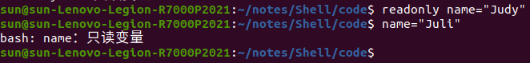
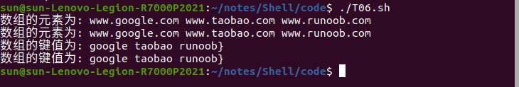
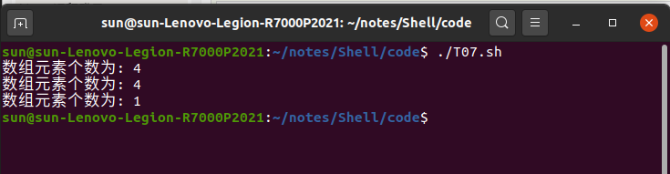
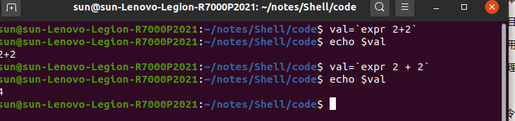
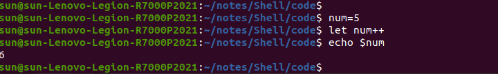

# Shell教程

## 一、Shell介绍

### 1.1 简介
1. Shell 是一个用 C 语言编写的程序，它是用户使用 Linux 的桥梁。Shell 既是一种命令语言，又是一种程序设计语言。
> 通过Shell可以更好的使用Linux系统

2. Shell 是指一种应用程序，这个应用程序提供了一个界面，用户通过这个界面访问操作系统内核的服务。Ken Thompson 的 sh 是第一种 Unix Shell，Windows Explorer 是一个典型的图形界面 Shell
> 对应于Shell的一个应用程序接口，通过这个接口使用shell语言可以更好的使用Linux

### 1.2 Shell脚本

Shell 脚本（shell script），是一种为 shell 编写的脚本程序。
业界所说的 shell 通常都是指 shell 脚本，shell 和 shell script 是两个不同的概念。
由于习惯的原因，简洁起见，本文出现的 "shell编程" 都是指 shell 脚本编程，不是指开发 shell 自身。
> Shell 开发的程序框架称之为Shell脚本

### 1.3 Shell环境

对应于一个能写代码的文本编辑器与一个能对代码进行解释的脚本解释器即可

Linux shell:
- Bourne Shell（/usr/bin/sh或/bin/sh）
- Bourne Again Shell（/bin/bash）
- C Shell（/usr/bin/csh）
- K Shell（/usr/bin/ksh）
- Shell for Root（/sbin/sh）
- ...

本文关注Bourne Again Shell 即常说的bash（Linux默认的Shell）

一般而言，不区分Bourne Shell 与Bourne Again Shell #!/bin/sh 也可以改为#!/bin/bash
> #!用于指定解释此脚本文件的Shell文件

### 1.4 使用bash

打开文本编辑器(可以使用 vi/vim 命令来创建文件)，新建一个文件 test.sh，扩展名为 sh（sh代表shell），扩展名并不影响脚本执行，见名知意就好，如果你用 php 写 shell 脚本，扩展名就用 php 好了


运行脚本：

1. 直接作为可执行程序
>chmod +x ./test.sh  #使脚本具有执行权限     
>./test.sh  #执行脚本

注意：运行时需要指定路径名即./test.sh，在Linux中只有被添加进PATH中的可执行文件如/bin, /sbin, /usr/bin，/usr/sbin等，直接输入命令名会自动到PATH寻找并执行

2. 作为解释器参数执行
>/bin/sh test.sh
>/bin/php test.php

表示为运行解释器，并传入文件参数（指定了解释器后，文件的第一行就没有必要再指定）


## 二、Shell变量

同大部分编程语言一样，变量是用于存储数据的一块内存
定义变量，变量名不加$(PHP需要加)

eg. your_name="hello world"

注意：变量名与等号之间不能有空格

### 2.1 变量名的规则

遵循C语言规则即可

- 只包含字母、数字和下划线： 变量名可以包含字母（大小写敏感）、数字和下划线 _，不能包含其他特殊字符。
- 不能以数字开头： 变量名不能以数字开头，但可以包含数字。
- 避免使用 Shell 关键字： 不要使用Shell的关键字（例如 if、then、else、fi、for、while 等）作为变量名，以免引起混淆。
- 使用大写字母表示常量： 习惯上，常量的变量名通常使用大写字母，例如 PI=3.14。
- 避免使用特殊符号： 尽量避免在变量名中使用特殊符号，因为它们可能与 Shell 的语法产生冲突。
- 避免使用空格： 变量名中不应该包含空格，因为空格通常用于分隔命令和参数。

有效命名：
```
RUNOOB="www.runoob.com"
LD_LIBRARY_PATH="/bin/"
_var="123"
var2="abc"
```

无效命名：
```
# 避免使用if作为变量名
if="some_value"
# 避免使用 $ 等特殊符号
variable_with_$=42
?var=123
user*name=runoob
# 避免空格
variable with space="value"
```

注意：等号两边不要使用空格

此外也可以用语句对变量进行赋值：
```
for file in `ls /etc`
或
for file in $(ls /etc)
```

### 2.2 变量使用

在变量前加$即可使用变量
```
your_name="qinjx"
echo $your_name
echo ${your_name}
```


{} 为了帮助解释器识别变量边界


已经定义的变量可以重复定义实现覆盖

### 2.3 只读变量

可以使用readonly 命令声明定义为只读变量，只读变量值不可修改
```
#!/bin/bash
myUrl="https://www.google.com"
readonly myUrl
myUrl="https://www.runoob.com"
```



### 2.4 删除变量
```
unset variable_name
```
删除后不可再次使用，unset无法删除只读变量


### 2.5 变量类型

Shell支持多种类型的变量如:

#### 2.5.1 字符串类型
```
String=“name”
```
可以使用单引号或者双引号定义字符串类型

#### 2.5.2 整数类型

在一些Shell中，你可以使用 declare 或 typeset 命令来声明整数变量。
```
declare -i my_i=42
```
声明中表明了将my_i视为整数，当赋值给他非整数值时，Shell会尝试将其转化为整数

#### 2.5.3 数组变量

整数数组：
```
my_array=(1,2,3,4,5)
```
关联数组：
```
declare -A associative_array
associative_array["name"]="John"
associative_array["age"]=30
```
可以使用中括号索引 0起步


#### 2.5.4 环境变量

这些是由操作系统或用户设置的特殊变量，用于配置 Shell 的行为和影响其执行环境。

```
echo $PATH
```
表示打印操作系统搜索可执行文件的路径

#### 2.5.5 特殊变量

| 特殊变量 |         含义         |
| :------: | :------------------: |
|    $0    |       脚本名称       |
| \$1 \$2  |       脚本参数       |
|    $#    | 传递给脚本的参数数量 |
|    $?    | 上一个命令的退出状态 |

#### 2.5.6 declare 声明命令

declare 用于在shell中声明变量的属性和类型
常用参数：

| 参数  |             含义             |
| :---: | :--------------------------: |
|  -r   |           只读参数           |
|  -i   |           整数类型           |
|  -a   |           数组类型           |
|  -f   |      函数类型，可存函数      |
|  -x   | 设置为环境变量，在子进程可用 |
|  +r   |           取消可读           |
|  +i   |           取消整数           |
|  -p   |        显示类型和属性        |

#### 2.5.7 变量其他设置

```
set命令 显示系统所有的变量
env命令 显示所有全局环境变量

printenv：查看所有的系统全局环境变量
printenv 环境变量：查看指定的环境变量（变量前不需要加 $）
```


在bash中默认变量为字符串，不能直接进行数值运算

export 变量名 
>可以把变量提升为全局变量，供给其他shell程序使用

设置环境变量
- export 变量名=变量值 （功能描述：将 shell 变量输出为系统环境变量）
- source 配置文件 （功能描述：让修改后的配置信息立即生效）
- echo $ 变量名 （功能描述：查询环境变量的值）

### 2.6 Shell字符串

字符串是shell编程中最常用最有用的数据类型，字符串可以用单引号，也可以用双引号，也可以不用引号。 

单引号字符串：（纯字符串）
- 单引号里的任何字符都会**原样输出**，单引号字符串中的变量是无效的；
- 单引号字符串中**不能出现单独一个的单引号**（对单引号使用转义符后也不行），但可成对出现，作为字符串拼接使用。

双引号字符串：（可加变量）
- 双引号里可以有变量
- 双引号里可以出现转义字符


echo -e 参数表明支持shell解释反斜杠转义字符

#### 2.6.1 拼接字符串

```
your_name="runoob"
# 使用双引号拼接
greeting="hello, "$your_name" !"
greeting_1="hello, ${your_name} !"
echo $greeting  $greeting_1

# 使用单引号拼接
greeting_2='hello, '$your_name' !'
greeting_3='hello, ${your_name} !'
echo $greeting_2  $greeting_3
```


表明在单引号字符串中，无法用$获取到变量，但是复用‘’拼接可以
可以解释为‘hello，’ + ${name}

显然双引号下的字符串也有这种特性，可以得出如下结论：
> Shell 下的字符串可以直接拼接，无需其他操作

#### 2.6.2 获取字符串长度

利用#号提取个数


#### 2.6.3 提取字符串
```
string="runoob is a great site"
echo ${string:1:4} # 输出 unoo
```


#### 2.6.4 查找字符串

查找字符 i 或 o 的位置(哪个字母先出现就计算哪个)：
```
string="runoob is a great site"
echo `expr index "$string" io`  # 输出 4
```
注意： 以上脚本中 ` 是反引号，而不是单引号 '，不要看错了哦

echo `命令` 表示显示命令执行结果

expr命令：
常用于求值并输出算数结果
expr [选项] 表达式
- 数值运算：expr 2 + 3
- 字符串长度：expr length "string"
- 字符串匹配：expr "string" : 'pattern'
- 模式匹配：expr "accounts.doc" : '.*\.doc$'
- 索引：expr index “hello world” “oi” **查找i或者o 而不是oi**

补充：
>.*匹配 
>.匹配除换行符以外的任意单个字符
>*匹配前面的字符零次或者多次
>.*表示匹配任意长度的字符串
>$ 常匹配结尾
>.*\.doc$ 匹配.doc结尾的字符

### 2.7 Shell数组

在 Shell 中，用括号来表示数组，数组元素用"空格"符号分割开。（逗号被标识为一个元素）

#### 2.7.1 声明
声明：数组名=(值1 值2 ... 值n)

当然可以单独声明：

array_name[0]=value0
array_name[1]=value1
array_name[n]=valuen

可以不连续的使用下标，而且下标没有范围限制

#### 2.7.2 读取数组

读取单个元素：
valuen=${array_name[n]}

读取所有元素：
echo ${array_name[@]} @或者*都可以

#### 2.7.3 获取数组长度
用#获取
```
# 取得数组元素的个数
length=${#array_name[@]}
# 或者
length=${#array_name[*]}
# 取得数组单个元素的长度
length=${#array_name[n]}
```

### 2.8 注释

**多行注释：使用here文档**

:<<EOF
...
EOF

以上例子中，: 是一个空命令，用于执行后面的 Here 文档，<<'EOF' 表示开启 Here 文档，COMMENT 是 Here 文档的标识符，在这两个标识符之间的内容都会被视为注释，不会被执行。EOF 也可以使用其他符号

```
: <<'COMMENT'
这是注释的部分。
可以有多行内容。
COMMENT

:<<'
注释内容...
注释内容...
注释内容...
'

:<<!
注释内容...
注释内容...
注释内容...
!
```

**直接使用冒号** 冒号+空格+单引号
```
: '
这是注释的部分。
可以有多行内容。
'
```

单行注释直接使用井号键

## 三、Shell传递参数

我们可以在执行 Shell 脚本时，向脚本传递参数，脚本内获取参数的格式为 $n，n 代表一个数字，1 为执行脚本的第一个参数，2 为执行脚本的第二个参数。

例如可以使用 $1、$2 等来引用传递给脚本的参数，其中 $1 表示第一个参数，$2 表示第二个参数，依此类推。

实例：
```
#!/bin/bash
# author:菜鸟教程
# url:www.runoob.com

echo "Shell 传递参数实例！";
echo "执行的文件名：$0";
echo "第一个参数为：$1";
echo "第二个参数为：$2";
echo "第三个参数为：$3";
```
第一个脚本参数默认为文件名


关于参数的几个特殊字符
| 参数  |                             说明                              |
| :---: | :-----------------------------------------------------------: |
|  $#   |                           参数个数                            |
|  $*   |           以一个单字符串显示所有向脚本传递的参数。            |
|  $$   |                          当前进程ID                           |
|  $!   |                   后台运行的最后一个进程ID                    |
|  $@   |     与$*相同，但是使用时加引号，并在引号中返回每个参数。      |
|  $-   |         显示Shell使用的当前选项，与set命令功能相同。          |
|  $?   | 显示最后命令的退出状态。0表示没有错误，其他任何值表明有错误。 |

测试：
```
  1 #!/bin/bash
  2 # author:菜鸟教程
  3 # url:www.runoob.com
  4 
  5 echo "Shell 传递参数实例！";
  6 echo "第一个参数为：$1";
  7 
  8 echo "当前进程ID $$"
  9 echo "后台最后一个进程ID $!"
 10 echo "参数个数为：$#";
 11 echo "当前选项 $-"
 12 echo "最后一个命令的退出状态 $?"
 13 
 14 echo "传递的参数作为一个字符串显示：$*";
 15 echo "传递的参数多个字符串显示：$@"

```


$* 与 $@ 区别：
- 相同点：都是引用所有参数。
- 不同点：只有在双引号中体现出来。假设在脚本运行时写了三个参数 1、2、3，则 " * " 等价于 "1 2 3"（传递了一个参数），而 "@" 等价于 "1" "2" "3"（传递了三个参数）。

对比演示：
```
#!/bin/bash
# author:菜鸟教程
# url:www.runoob.com

echo "-- \$* 演示 ---"
for i in "$*"; do
    echo $i
done

echo "-- \$@ 演示 ---"
for i in "$@"; do
    echo $i
done
```

补充：在shell脚本中，可执行文件后面加上&符号表示将该命令在后台运行。

## 四、Shell数组

数组中可以存放多个值。Bash Shell 只支持一维数组（不支持多维数组），初始化时不需要定义数组大小（与 PHP 类似）。
与大部分编程语言类似，数组元素的下标由 0 开始。
Shell 数组用括号来表示，元素用"空格"符号分割开，语法格式如下：
```
array_name=(value1 value2 ... valuen)
```
逗号分隔表示一个元素

### 4.1 定义数组

1. 直接创建

```
#!/bin/bash
# author:菜鸟教程
# url:www.runoob.com

my_array=(A B "C" D)
```


2. 下标定义

```
array_name[0]=value0
array_name[1]=value1
array_name[2]=value2
```

### 4.2 读取数组  

> ${my_array[index]}即可使用变量

### 4.3 关联数组

Bash 支持关联数组，可以使用任意的字符串、或者整数作为下标来访问数组元素。
declare -A array_name即可声明
示例：
```
declare -A site=(["google"]="www.google.com" ["runoob"]="www.runoob.com" ["taobao"]="www.taobao.com")
```
此外也可以先声明关联数组，再设置键值对
```
declare -A site
site["google"]="www.google.com"
site["runoob"]="www.runoob.com"
site["taobao"]="www.taobao.com"
```

但是注意声明时下标一定用【】索引起来


访问关联数组和普通数组方法完全一样，区别只在于键是由自己定义的

### 4.4 获取数组所有元素

- 获取数组所有的值可以用@或者*索引起来

```
declare -A site
site["google"]="www.google.com"
site["runoob"]="www.runoob.com"
site["taobao"]="www.taobao.com"

echo "数组的元素为: ${site[*]}"
echo "数组的元素为: ${site[@]}"
```

- 获取数组所有的键可以在数组前加！实现

```
declare -A site
site["google"]="www.google.com"
site["runoob"]="www.runoob.com"
site["taobao"]="www.taobao.com"

echo "数组的键为: ${!site[*]}"
echo "数组的键为: ${!site[@]}"
```

示例：




### 4.5 获取数组长度

前面加#即可

```
#!/bin/bash
# author:菜鸟教程
# url:www.runoob.com

my_array[0]=A
my_array[1]=B
my_array[2]=C
my_array[3]=D

echo "数组元素个数为: ${#my_array[*]}"
echo "数组元素个数为: ${#my_array[@]}"
```




## 五、 Shell基本运算符

Shell 和其他编程语言一样，支持多种运算符，包括：

- 算数运算符
- 关系运算符
- 布尔运算符
- 字符串运算符
- 文件测试运算符

原生bash不支持简单的数学运算，但是可以通过其他命令来实现，例如 awk 和 expr，expr 最常用。
expr 是一款表达式计算工具，使用它能完成表达式的求值操作。 

在bash中`命令` 可以用于指定命令行命令

```
#!/bin/bash

val=`expr 2 + 2`
echo "两数之和为 : $val"
```



注意：
> 表达式和运算符之间要有空格，例如 2+2 是不对的，必须写成 2 + 2，这与我们熟悉的大多数编程语言不一样。
> 完整的表达式要被 ` ` 包含，注意这个字符不是常用的单引号，在 Esc 键下边。

### 5.1 算数运算符

| 运算符 |                     说明                      |             举例              |
| :----: | :-------------------------------------------: | :---------------------------: |
|   +    |                     加法                      |  `expr $a + $b` 结果为 30。   |
|   -    |                     减法                      |  `expr $a - $b` 结果为 -10。  |
|   *    |                     乘法                      | `expr $a \* $b` 结果为  200。 |
|   /    |                     除法                      |   `expr $b / $a` 结果为 2。   |
|   %    |                     取余                      |   `expr $b % $a` 结果为 0。   |
|   =    |                     赋值                      |  a=$b 把变量 b 的值赋给 a。   |
|   ==   |   相等。用于比较两个数字，相同则返回 true。   |   [ $a == $b ] 返回 false。   |
|   !=   | 不相等。用于比较两个数字，不相同则返回 true。 |   [ $a != $b ] 返回 true。    |

> 注意：条件表达式要放在方括号之间，并且要有空格，例如: [$a==$b] 是错误的，必须写成 [ $a == $b ]。

expr 中计算即使是字符串同样可以计算，Shell中变量未声明下默认也为字符串


```
#!/bin/bash
# author:菜鸟教程
# url:www.runoob.com

a=10
b=20

val=`expr $a + $b`
echo "a + b : $val"

val=`expr $a - $b`
echo "a - b : $val"

val=`expr $a \* $b`
echo "a * b : $val"

val=`expr $b / $a`
echo "b / a : $val"

val=`expr $b % $a`
echo "b % a : $val"

if [ $a == $b ]
then
   echo "a 等于 b"
fi
if [ $a != $b ]
then
   echo "a 不等于 b"
fi
```

示例：


注意：

>乘号(*)前边必须加反斜杠(\)才能实现乘法运算；
>if...then...fi 是条件语句，后续将会讲解。
>在 MAC 中 shell 的 expr 语法是：$((表达式))，此处表达式中的 "*" 不需要转义符号 "\" 。


### 5.2 关系运算符

关系运算符只支持数字，不支持字符串，除非字符串的值是数字。expr自动转化

| 运算符 |                         说明                          |            举例             |
| :----: | :---------------------------------------------------: | :-------------------------: |
|  -eq   |          检测两个数是否相等，相等返回 true。          | [ \$a -eq $b ] 返回 false。 |
|  -ne   |        检测两个数是否不相等，不相等返回 true。        | [ \$a -ne $b ] 返回 true。  |
|  -gt   |   检测左边的数是否大于右边的，如果是，则返回 true。   | [ \$a -gt $b ] 返回 false。 |
|  -lt   |   检测左边的数是否小于右边的，如果是，则返回 true。   | [ \$a -lt $b ] 返回 true。  |
|  -ge   | 检测左边的数是否大于等于右边的，如果是，则返回 true。 | [ \$a -ge $b ] 返回 false。 |
|  -le   | 检测左边的数是否小于等于右边的，如果是，则返回 true。 | [ \$a -le $b ] 返回 true。  |

关系运算符返回只有True 或者 False 关系式需要[]括起来且需要空格隔开

```
#!/bin/bash
# author:菜鸟教程
# url:www.runoob.com

a=10
b=20

if [ $a -eq $b ]
then
   echo "$a -eq $b : a 等于 b"
else
   echo "$a -eq $b: a 不等于 b"
fi
if [ $a -ne $b ]
then
   echo "$a -ne $b: a 不等于 b"
else
   echo "$a -ne $b : a 等于 b"
fi
if [ $a -gt $b ]
then
   echo "$a -gt $b: a 大于 b"
else
   echo "$a -gt $b: a 不大于 b"
fi
if [ $a -lt $b ]
then
   echo "$a -lt $b: a 小于 b"
else
   echo "$a -lt $b: a 不小于 b"
fi
if [ $a -ge $b ]
then
   echo "$a -ge $b: a 大于或等于 b"
else
   echo "$a -ge $b: a 小于 b"
fi
if [ $a -le $b ]
then
   echo "$a -le $b: a 小于或等于 b"
else
   echo "$a -le $b: a 大于 b"
fi
```
运行结果：


### 5.3 逻辑运算符
| 运算符 |    说明    |                     举例                      |
| :----: | :--------: | :-------------------------------------------: |
|   &&   | 逻辑的 AND | \[\[ \$a -lt 100 && \$b -gt 100 ]] 返回 false |
|  \|\|  | 逻辑的 OR  | `[[ $a -lt 100`\|\|`$b -gt 100 ]]` 返回 true  |

```
#!/bin/bash
# author:菜鸟教程
# url:www.runoob.com

a=10
b=20

if [[ $a -lt 100 && $b -gt 100 ]]
then
   echo "返回 true"
else
   echo "返回 false"
fi

if [[ $a -lt 100 || $b -gt 100 ]]
then
   echo "返回 true"
else
   echo "返回 false"
fi
```


 
原因？？

### 5.4 字符串运算符

| 运算符 |                     说明                     |           举例            |
| :----: | :------------------------------------------: | :-----------------------: |
|   =    |   检测两个字符串是否相等，相等返回 true。    | [ \$a = $b ] 返回 false。 |
|   !=   | 检测两个字符串是否不相等，不相等返回 true。  | [ \$a != $b ] 返回 true。 |
|   -z   |    检测字符串长度是否为0，为0返回 true。     |  [ -z $a ] 返回 false。   |
|   -n   | 检测字符串长度是否不为 0，不为 0 返回 true。 |  [ -n "$a" ] 返回 true。  |
|   $    |   检测字符串是否不为空，不为空返回 true。    |    [ $a ] 返回 true。     |

示例：
```
#!/bin/bash
# author:菜鸟教程
# url:www.runoob.com

a="abc"
b="efg"

if [ $a = $b ]
then
   echo "$a = $b : a 等于 b"
else
   echo "$a = $b: a 不等于 b"
fi
if [ $a != $b ]
then
   echo "$a != $b : a 不等于 b"
else
   echo "$a != $b: a 等于 b"
fi
if [ -z $a ]
then
   echo "-z $a : 字符串长度为 0"
else
   echo "-z $a : 字符串长度不为 0"
fi
if [ -n "$a" ] #可不加字符串，本身就已经是字符串
then
   echo "-n $a : 字符串长度不为 0"
else
   echo "-n $a : 字符串长度为 0"
fi
if [ $a ]
then
   echo "$a : 字符串不为空"
else
   echo "$a : 字符串为空"
fi
```
结果：


### 5.5 文件测试运算符

文件测试运算符用于检测 Unix 文件的各种属性。
| 运算符  | 说明                                                                        |           举例            |
| :-----: | :-------------------------------------------------------------------------- | :-----------------------: |
| -b file | 检测文件是否是块设备文件，如果是，则返回 true。                             | [ -b $file ] 返回 false。 |
| -c file | 检测文件是否是字符设备文件，如果是，则返回 true。                           | [ -c $file ] 返回 false。 |
| -d file | 检测文件是否是目录，如果是，则返回 true。                                   | [ -d $file ] 返回 false。 |
| -f file | 检测文件是否是普通文件（既不是目录，也不是设备文件），如果是，则返回 true。 | [ -f $file ] 返回 true。  |
| -g file | 检测文件是否设置了 SGID 位，如果是，则返回 true。                           | [ -g $file ] 返回 false。 |
| -k file | 检测文件是否设置了粘着位(Sticky Bit)，如果是，则返回 true。                 | [ -k $file ] 返回 false。 |
| -p file | 检测文件是否是有名管道，如果是，则返回 true。                               | [ -p $file ] 返回 false。 |
| -u file | 检测文件是否设置了 SUID 位，如果是，则返回 true。                           | [ -u $file ] 返回 false。 |
| -r file | 检测文件是否可读，如果是，则返回 true。                                     | [ -r $file ] 返回 true。  |
| -w file | 检测文件是否可写，如果是，则返回 true。                                     | [ -w $file ] 返回 true。  |
| -x file | 检测文件是否可执行，如果是，则返回 true。                                   | [ -x $file ] 返回 true。  |
| -s file | 检测文件是否为空（文件大小是否大于0），不为空返回 true。                    | [ -s $file ] 返回 true。  |
| -e file | 检测文件（包括目录）是否存在，如果是，则返回 true。                         | [ -e $file ] 返回 true。  |

同样返回逻辑值判断需要用[]括起来且需要空格隔开
同样的还有一些其他检查符号
**-S** 是否为socket文件
**-L** 是否为符号链接
```
#!/bin/bash
# author:菜鸟教程
# url:www.runoob.com

file="/var/www/runoob/test.sh"
if [ -r $file ]
then
   echo "文件可读"
else
   echo "文件不可读"
fi
if [ -w $file ]
then
   echo "文件可写"
else
   echo "文件不可写"
fi
if [ -x $file ]
then
   echo "文件可执行"
else
   echo "文件不可执行"
fi
if [ -f $file ]
then
   echo "文件为普通文件"
else
   echo "文件为特殊文件"
fi
if [ -d $file ]
then
   echo "文件是个目录"
else
   echo "文件不是个目录"
fi
if [ -s $file ]
then
   echo "文件不为空"
else
   echo "文件为空"
fi
if [ -e $file ]
then
   echo "文件存在"
else
   echo "文件不存在"
fi
```

结果为：


### 5.6 自增自减运算符

尽管 Shell 本身没有像 C、C++ 或 Java 那样的 ++ 和 -- 操作符，但可以通过其他方式实现相同的功能。以下是一些常见的方法：

- let 命令 允许对整数进行算术运算
```
#!/bin/bash
# 初始化变量
num=5
# 自增
let num++
# 自减
let num--
echo $num
```


补充：let命令

let赋值： let a=5+4
let利用双小括号进行复杂运算


- 使用$(( )) 进行算术运算

```
#!/bin/bash

# 初始化变量
num=5
# 自增
num=$((num + 1))
# 自减
num=$((num - 1))
echo $num
```


- 使用expr命令（用去求表达式的值）
```
#!/bin/bash

# 初始化变量
num=5
# 自增
num=$(expr $num + 1)
# 自减
num=$(expr $num - 1)
echo $num
```


补充：shell中``和$()可以用于执行命令行命令


- 使用(())进行算术计算
与$(( ))类似
```
#!/bin/bash
# 初始化变量
num=5
# 自增
((num++))
# 自减
((num--))
echo $num
```


整体测试文档：见T13.sh

结果：


## 六、echo命令

Shell 的 echo 指令与 PHP 的 echo 指令类似，都是用于字符串的输出。命令格式：

echo String

当然也有复杂一点的显示操作：

### 6.1 显示普通字符串

> echo "It is a test"

这里的双引号可以直接省略

> echo It is a test

一样的效果

### 6.2 显示转义字符

> echo "\"It is a test\""

注意只有在双引号的字符串下有作用，单引号字符串输出原文本

同样，双引号可以省略

### 6.3 显示变量

read命令可以从标准输入中读取一行，并把输入行的每个字段的值指定给特定变量

```
#!/bin/sh
read name 
echo "$name It is a test"
```


### 6.4 显示换行

> echo -e "OK! \n" # -e 开启转义
> echo "It is a test"

-e参数表示翻译转义字符功能


### 6.5 显示不换行

> echo -e "OK! \c" #自动换行用\c结束接下来的输出
> echo "It is a book"


带有功能描述的转义字符如\n \c 双引号必须

补充：
    在C语言中，\c是一个转义字符，用于在输出时停止当前字符串的输出，并清除输出缓冲区中的剩余内容‌。这意味着，当使用printf函数输出字符串时，如果遇到\c，则会停止输出后续内容，并清除缓冲区中的内容，直到下一次输出开始‌。

### 6.6 显示见过定向值文件

> \>  表示覆盖
> \>> 表示继续

> echo "It is a test" > myfile #定向至文件


### 6.7 原样输出

单引号字符串

> echo '$name\"'

### 6.8 显示命令结果

> echo `date`

OR

> echo $(date)


## 七、printf命令

上一章节我们学习了 Shell 的 echo 命令，本章节我们来学习 Shell 的另一个输出命令 printf。
printf 命令模仿 C 程序库（library）里的 printf() 程序。
printf 由 POSIX 标准所定义，因此使用 printf 的脚本比使用 echo 移植性好。
printf 使用引用文本或空格分隔的参数，外面可以在 printf 中使用格式化字符串，还可以制定字符串的宽度、左右对齐方式等。默认的 printf 不会像 echo 自动添加换行符，我们可以手动添加 \n。（格式化输出）

基本语法：

printf  format-string  [arguments...]

- format-string : 格式化的字符串，包含普通文本和格式说明符
- argument : 用于填充格式说明符的参数列表
  
| 格式说明符 |          描述          |
| :--------: | :--------------------: |
|     %s     |         字符串         |
|     %d     |       十进制整数       |
|     %f     |         浮点数         |
|     %c     |          字符          |
|     %x     |       十六进制数       |
|     %o     |        八进制数        |
|     %b     |        二进制数        |
|     %e     | 科学计数法表示的浮点数 |

示例：


echo 与 printf对比


%s %c %d %f 都是格式替代符，％s 输出一个字符串，％d 整型输出，％c 输出一个字符，％f 输出实数，以小数形式输出。
%-10s 指一个宽度为 10 个字符（- 表示左对齐，没有则表示右对齐），任何字符都会被显示在 10 个字符宽的字符内，如果不足则自动以空格填充，超过也会将内容全部显示出来。
%-4.2f 指格式化为小数，其中 .2 指保留 2 位小数。

```
#!/bin/bash
# author:菜鸟教程
# url:www.runoob.com
 
# format-string为双引号
printf "%d %s\n" 1 "abc" #参数列表对应输出

# 单引号与双引号效果一样 
printf '%d %s\n' 1 "abc" #printf中不区分单引号双引号

# 没有引号也可以输出
printf %s abcdef #没有引号同样可以输出但是%s%d不能有空格，否则进入参数列表

# 格式只指定了一个参数，但多出的参数仍然会按照该格式输出，format-string 被重用
printf %s abc def

printf "%s\n" abc def

printf "%s %s %s\n" a b c d e f g h i j

# 如果没有 arguments，那么 %s 用NULL代替，%d 用 0 代替
printf "%s and %d \n"
```
结果：


注意：

匹配字符串只能有一个

printf转义字符列表

| 字符  | 描述                                             |
| :---- | :----------------------------------------------- |
| \a    | 警告字符，通常为ASCII的BEL字符                   |
| \b    | 后退                                             |
| \c    | 结束后面的输出                                   |
| \f    | 换页（formfeed）                                 |
| \n    | 换行                                             |
| \r    | 回车（Carriage return）                          |
| \t    | 水平制表符                                       |
| \v    | 垂直制表符                                       |
| \\\   | 一个字面上的反斜杠字符                           |
| \ddd  | 表示1到3位数八进制值的字符。仅在格式字符串中有效 |
| \0ddd | 表示1到3位的八进制值字符                         |

示例：


%b C语言中并没有 接受二进制 任何字符都可翻译成二进制，故此\n在这里可以起到作用
理解为%b: 字符串--相对应的参数被视为含有要被处理的转义序列之字符串

## 八、Shell test命令

Shell中的 test 命令用于检查某个条件是否成立，它可以进行数值、字符和文件三个方面的测试。

### 8.1 数值测试

| 参数 | 说明           |
| :--- | :------------- |
| -eq  | 等于则为真     |
| -ne  | 不等于则为真   |
| -gt  | 大于则为真     |
| -ge  | 大于等于则为真 |
| -lt  | 小于则为真     |
| -le  | 小于等于则为真 |


两者的输出相同

```
#!/bin/bash
num1=100
num2=100
if test $[num1] -eq $[num2]
then
    echo '两个数相等！'
else
    echo '两个数不相等！'
fi
```

代码中的[]表示进行数值计算

```
#!/bin/bash

a=5
b=6

result=$[a+b] # 注意等号两边不能有空格 带空格用于逻辑判断
echo "result 为： $result"
```
注意换成$(())也可以


### 8.2 字符串测试

| 参数       | 说明                     |
| :--------- | :----------------------- |
| =          | 等于则为真               |
| !=         | 不相等则为真             |
| -z  字符串 | 字符串的长度为零则为真   |
| -n  字符串 | 字符串的长度不为零则为真 |


### 8.3 文件测试
| 参数      | 说明                                 |
| :-------- | :----------------------------------- |
| -e 文件名 | 如果文件存在则为真                   |
| -r 文件名 | 如果文件存在且可读则为真             |
| -w 文件名 | 如果文件存在且可写则为真             |
| -x 文件名 | 如果文件存在且可执行则为真           |
| -s 文件名 | 如果文件存在且至少有一个字符则为真   |
| -d 文件名 | 如果文件存在且为目录则为真           |
| -f 文件名 | 如果文件存在且为普通文件则为真       |
| -c 文件名 | 如果文件存在且为字符型特殊文件则为真 |
| -b 文件名 | 如果文件存在且为块特殊文件则为真     |

```
cd /bin
if test -e ./bash
then
    echo '文件已存在!'
else
    echo '文件不存在!'
fi
```

另外，Shell 还提供了与( -a )、或( -o )、非( ! )三个逻辑操作符用于将测试条件连接起来，其优先级为： ! 最高， -a 次之， -o 最低。例如：

```
cd /bin
if test -e ./notFile -o -e ./bash
then
    echo '至少有一个文件存在!'
else
    echo '两个文件都不存在'
fi
```


补充可以用[] 直接测试，注意两边要有空格


常见文件比较符：
    -e 判断对象是否存在
    -d 判断对象是否存在，并且为目录
    -f 判断对象是否存在，并且为常规文件
    -L 判断对象是否存在，并且为符号链接
    -h 判断对象是否存在，并且为软链接
    -s 判断对象是否存在，并且长度不为0
    -r 判断对象是否存在，并且可读
    -w 判断对象是否存在，并且可写
    -x 判断对象是否存在，并且可执行
    -O 判断对象是否存在，并且属于当前用户
    -G 判断对象是否存在，并且属于当前用户组
    -nt 判断file1是否比file2新  [ "/data/file1" -nt "/data/file2" ]
    -ot 判断file1是否比file2旧  [ "/data/file1" -ot "/data/file2" ]

测试：


## 九、Shell流程控制

和 Java、PHP 等语言不一样，sh 的流程控制不可为空，为空就不写
### 9.1 条件语句

#### 9.1.1 if

```
if condition
then
    command1 
    command2
    ...
    commandN 
fi #if倒过来
```

也可以写成一行在命令行中 
> if [ $(ps -ef | grep -c "ssh") -gt 1 ]; then echo "true"; fi

#### 9.1.2 if-else

```
if condition
then
    command1 
    command2
    ...
    commandN
else
    command
fi
```

#### 9.1.3 if-else-if-else

```
if condition1
then
    command1
elif condition2 
then 
    command2
else
    commandN
fi
```

注意判断语句中可以使用test也可以使用[]
使用[]两侧要保留一个空格且大于-gt 小于为-le
也可以使用(( )) 大于可以直接使用> 和 <

示例:


(())不需要用空格隔开，但是[]需要用空格隔开

(())的使用：


test的使用:


其中的[]并不是用于逻辑判断，而是用于数值计算，无需加空格

对test代码的思考：
```
sh中不存在变量赋值，即num=1;num2=num 无法成立
那么怎么对num2赋值num呢 简单 num2=$num 即可，即先取值再赋值
[2*3]中进行的是数值计算，返回一个不知名的对象
对对象进行取值在赋值即可赋值
故而有了num1=$[2*3]
那么在对if test \$[num1] -eq \$[num2]进行分析
[]不加空格，我们知道是对传入的表达式进行计算
那么[num]本身就是返回计算的结果对象再用$取值，即可得到结果值
那么这样我们就可以用结果值进行比较了
不在(())中的表达式我们就需要用 -eq d等来比较
```

### 9.2 for 循环语句

基本语法：
```
for var in item1 item2 ... itemN
do
    command1
    command2
    ...
    commandN
done
```
也可以写成一行在命令行中

> for var in item1 item2 ... itemN; do command1; command2… done;

当变量值在列表里，for 循环即执行一次所有命令，使用变量名获取列表中的当前取值。命令可为任何有效的 shell 命令和语句。in 列表可以包含替换、字符串和文件名。

in列表是可选的，如果不用它，for循环使用命令行的位置参数。

例如，顺序输出当前列表中的数字：

示例1：
```
for loop in 1 2 3 4 5
do
    echo "The value is: $loop"
done
```
输出：
```
The value is: 1
The value is: 2
The value is: 3
The value is: 4
The value is: 5
```
示例2：
```
#!/bin/bash

for str in This is a string
do
    echo $str
done
```
输出:
```
This
is
a
string
```
当不指定in列表后，var取命令行参数


遍历数组:


### 9.3 while循环

while 循环用于不断执行一系列命令，也用于从输入文件中读取数据。其语法格式为：
```
while condition
do
    command
done
```
简单的示例：
```
#!/bin/bash
int=1
while(( $int<=5 ))
do
    echo $int
    let "int++"
done
```


也可以用(( ))判断


(())可用于逻辑判断(直接使用符号)，也可以用于算术计算

((int=int + 2))也是成立的

补充:bash let命令

let 命令是 BASH 中用于计算的工具，用于执行一个或多个表达式，变量计算中不需要加上 $ 来表示变量。如果表达式中包含了空格或其他特殊字符，则必须引起来。

语法:
```
let arg [arg ...]
```
arg 表示要执行的表达式

示例
```
#!/bin/bash

let a=5+4
let b=9-3 
echo $a $b
```
> let A+=10 也是成立的

while用于读取键盘信息

```
echo '按下 <CTRL-D> 退出'
echo -n '输入你最喜欢的网站名: ' #-n表示不换行输出
while read FILM
do
    echo "是的！$FILM 是一个好网站"
done
```
read 命令：
   read 命令在 shell 脚本中用于接收用户的输入。它通常在 read 后跟一个或多个变量作为参数，来存储输入的数据。read 命令会从标准输入（通常是键盘）读取数据。read 命令的返回值表示读取操作是否成功。如果成功读取到数据，它会返回状态码 0；如果由于某种原因没有读取到数据（例如，用户输入被中断），它会返回非零状态码。
执行结果:


无限循环：

方式一：
```
while :
do
    command
done
```

方式二：
```
while true
do
    command
done
```

方式三：
```
for (( ; ; ))
```

### 9.4 until循环

until 循环执行一系列命令直至条件为 true 时停止。
until 循环与 while 循环在处理方式上刚好相反。
一般 while 循环优于 until 循环，但在某些时候—也只是极少数情况下，until 循环更加有用。 
对比：
| while          | until          |
| -------------- | -------------- |
| 条件为真时执行 | 条件为假时执行 |

语法格式：
```
until condition
do
    command
done
```

示例：
```
#!/bin/bash

a=0

until [ ! $a -lt 10 ]
do
   echo $a
   a=`expr $a + 1`
done
```


### 9.5 多选择语句

case ... esac 为多选择语句，与其他语言中的 switch ... case 语句类似，是一种多分支选择结构，每个 case 分支用右圆括号开始，用两个分号 ;; 表示 break，即执行结束，跳出整个 case ... esac 语句，esac（就是 case 反过来）作为结束标记。
可以用 case 语句匹配一个值与一个模式，如果匹配成功，执行相匹配的命令。
语法格式：

```
case 值 in
模式1)
    command1
    command2
    ...
    commandN
    ;;
模式2)
    command1
    command2
    ...
    commandN
    ;;
esac
```
case工作方式:

case 工作方式如上所示，取值后面必须为单词 in，每一模式必须以右括号结束。取值可以为变量或常数，匹配发现取值符合某一模式后，其间所有命令开始执行直至 ;;。
取值将检测匹配的每一个模式。**一旦模式匹配，则执行完匹配模式相应命令后不再继续其他模式**。如果**无一匹配模式，使用星号 * 捕获该值**，再执行后面的命令。 

示例：
```
echo '输入 1 到 4 之间的数字:'
echo '你输入的数字为:'
read aNum
case $aNum in
    1)  echo '你选择了 1'
    ;;
    2)  echo '你选择了 2'
    ;;
    3)  echo '你选择了 3'
    ;;
    4)  echo '你选择了 4'
    ;;
    *)  echo '你没有输入 1 到 4 之间的数字'
    ;;
esac
```


脚本匹配字符串


### 9.6 跳出循环

#### 9.6.1 break

break 命令允许跳出所有循环（终止执行后面的所有循环）。
下面的例子中，脚本进入死循环直至用户输入数字大于5。要跳出这个循环，返回到shell提示符下，需要使用break命令。 
```
#!/bin/bash
while :
do
    echo -n "输入 1 到 5 之间的数字:"
    read aNum
    case $aNum in
        1|2|3|4|5) echo "你输入的数字为 $aNum!"
        ;;
        *) echo "你输入的数字不是 1 到 5 之间的! 游戏结束"
            break
        ;;
    esac
done
```


#### 9.6.2 continue

 continue 命令与 break 命令类似，只有一点差别，它不会跳出所有循环，仅仅跳出当前循环。

```
#!/bin/bash
while :
do
    echo -n "输入 1 到 5 之间的数字: "
    read aNum
    case $aNum in
        1|2|3|4|5) echo "你输入的数字为 $aNum!"
        ;;
        *) echo "你输入的数字不是 1 到 5 之间的!"
            continue
            echo "游戏结束"
        ;;
    esac
done
```

## 十、Shell函数

### 10.1 函数定义

linux shell 可以用户定义函数，然后在shell脚本中可以随便调用。

函数格式:
```
[ function ] funname [()]

{

    action;

    [return int;]

}
```

说明：
- 可以带 function fun() 定义，也可以直接 fun() 定义,不带任何参数。
- 参数返回，可以显示加：return 返回，**如果不加，将以最后一条命令运行结果，作为返回值**。 return 后跟数值 n(0-255). 

示例:

```
#!/bin/bash
# author:菜鸟教程
# url:www.runoob.com

demoFun(){
    echo "这是我的第一个 shell 函数!"
}
echo "-----函数开始执行-----"
demoFun
echo "-----函数执行完毕-----"
```


无参定义，隐式返回 echo成功返回0


显式返回，函数返回值通过$？获得

注意：所有函数在**使用前必须定义**。这意味着必须将函数放在脚本开始部分，直至shell解释器首次发现它时，才可以使用。调用函数仅使用其函数名即可。
注意： return 语句只能返回一个介于 0 到 255 之间的整数，而两个输入数字的和可能超过这个范围。要解决这个问题，您可以修改 return 语句，直接使用 echo 输出和而不是使用 return

```
funWithReturn(){
    echo "这个函数会对输入的两个数字进行相加运算..."
    echo "输入第一个数字: "
    read aNum
    echo "输入第二个数字: "
    read anotherNum
    sum=$(($aNum + $anotherNum)) ##(())算数运算并用$取值赋给sum
    echo "两个数字分别为 $aNum 和 $anotherNum !"
    echo $sum  # 输出两个数字的和
}
```

### 10.2 函数参数

在Shell中，调用函数时可以向其传递参数。在函数体内部，通过 $n 的形式来获取参数的值，例如，$1表示第一个参数，$2表示第二个参数... 

```
#!/bin/bash
# author:菜鸟教程
# url:www.runoob.com

funWithParam(){
    echo "第一个参数为 $1 !"
    echo "第二个参数为 $2 !"
    echo "第十个参数为 $10 !"
    echo "第十个参数为 ${10} !"
    echo "第十一个参数为 ${11} !"
    echo "参数总数有 $# 个!"
    echo "作为一个字符串输出所有参数 $* !"
}
funWithParam 1 2 3 4 5 6 7 8 9 34 73
```


特殊字符表:

| 特殊字符 | 说明                                                          |
| :------- | :------------------------------------------------------------ |
| $#       | 传递到脚本或函数的参数个数                                    |
| $*       | 以一个单字符串显示所有向脚本传递的参数                        |
| $$       | 脚本运行的当前进程ID号                                        |
| $!       | 后台运行的最后一个进程的ID号                                  |
| $@       | 与$*相同，但是使用时加引号，并在引号中返回每个参数。          |
| $-       | 显示Shell使用的当前选项，与set命令功能相同。                  |
| $?       | 显示最后命令的退出状态。0表示没有错误，其他任何值表明有错误。 |

补充:

\$? 仅对其上一条指令负责，一旦函数返回后其返回值没有立即保存入参数，那么其返回值将不再能通过 \$? 获得。只能记录最后命令的退出状态


函数与命令的执行结果可以作为条件语句使用。要注意的是，和 C 语言不同，shell 语言中 0 代表 true，0 以外的值代表 false。
一般而言，命令成功执行会返回0

## 十一、Shell输入输出重定向

大多数 UNIX 系统命令从你的终端接受输入并将所产生的输出发送回​​到您的终端。一个命令通常从一个叫标准输入的地方读取输入，默认情况下，这恰好是你的终端。同样，一个命令通常将其输出写入到标准输出，默认情况下，这也是你的终端。

重定向列表：
| 命令            | 说明                                               |
| :-------------- | :------------------------------------------------- |
| command > file  | 将输出重定向到 file。                              |
| command < file  | 将输入重定向到 file。                              |
| command >> file | 将输出以追加的方式重定向到 file。                  |
| n > file        | 将文件描述符为 n 的文件重定向到 file。             |
| n >> file       | 将文件描述符为 n 的文件以追加的方式重定向到 file。 |
| n >& m          | 将输出文件 m 和 n 合并。                           |
| n <& m          | 将输入文件 m 和 n 合并。                           |
| << tag          | 将开始标记 tag 和结束标记 tag 之间的内容作为输入。 |

补充：
需要注意的是文件描述符 0 通常是标准输入（STDIN），1 是标准输出（STDOUT），2 是标准错误输出（STDERR）。

### 11.1 输出重定向

重定向一般通过在命令间插入特定的符号来实现。特别的，这些符号的语法如下所示:
> command > file1

上面这个命令执行command1然后将输出的内容存入file1。
注意任何file1内的已经存在的内容将被新内容替代。如果要将新内容添加在文件末尾，请使用>>操作符。 


不想覆盖的话采用>>方式

### 11.2 输入重定向

和输出重定向一样，Unix 命令也可以从文件获取输入，语法为： 
> command < file1


### 11.3 重定向提高

一般情况下，每个 Unix/Linux 命令运行时都会打开三个文件：

    标准输入文件(stdin)：stdin的文件描述符为0，Unix程序默认从stdin读取数据。
    标准输出文件(stdout)：stdout 的文件描述符为1，Unix程序默认向stdout输出数据。
    标准错误文件(stderr)：stderr的文件描述符为2，Unix程序会向stderr流中写入错误信息。

默认情况下，command > file 将 stdout 重定向到 file，command < file 将stdin 重定向到 file。

如果希望 stderr 重定向到 file，可以这样写：

> command 2> file

> command 2>> file

2表示标准错误，倘若ls执行出错会将错误信息传入file


若想将正确输出和错误输出合并：
```
$ command > file 2>&1

或者

$ command >> file 2>&1
```


>$ command < file1 >file2

标准输入定向到file1 标准输出定向到file2

### 11.4 Here Document

Here Document 是 Shell 中的一种特殊的重定向方式，用来将输入重定向到一个交互式 Shell 脚本或程序。 
```
command << delimiter
    document
delimiter
```
它的作用是将两个 delimiter 之间的内容(document) 作为输入传递给 command。

注意:
   结尾的delimiter 一定要顶格写，前面不能有任何字符，后面也不能有任何字符，包括空格和 tab 缩进。
   开始的delimiter前后的空格会被忽略掉。

示例:


### 11.5 /dev/null 

如果希望执行某个命令，但又不希望在屏幕上显示输出结果，那么可以将输出重定向到 /dev/null

/dev/null 是一个特殊的文件，写入到它的内容都会被丢弃；如果尝试从该文件读取内容，那么什么也读不到。但是 /dev/null 文件非常有用，将命令的输出重定向到它，会起到"禁止输出"的效果。

如果希望屏蔽 stdout 和 stderr，可以这样写：
> $ command > /dev/null 2>&1
注意：0 是标准输入（STDIN），1 是标准输出（STDOUT），2 是标准错误输出（STDERR）。
这里的 2 和 > 之间不可以有空格，2> 是一体的时候才表示错误输出。


补充:
\$ command > file 2>&1
\$ command >> file 2>&1

这里的&没有固定的意思

放在>后面的&，表示重定向的目标不是一个文件，而是一个文件描述符，内置的文件描述符如下
1 => stdout
2 => stderr
0 => stdin

换言之 2>1 代表将stderr重定向到当前路径下文件名为1的regular file中，而2>&1代表将stderr重定向到文件描述符为1的文件(即/dev/stdout)中，这个文件就是stdout在file system中的映射

## 十二、Shell文件包含

和其他语言一样，Shell 也可以包含外部脚本。这样可以很方便的封装一些公用的代码作为一个独立的文件。

Shell 文件包含的语法格式如下：
```
. filename   # 注意点号(.)和文件名中间有一空格

或

source filename
```

示例：
test1.sh
```
#!/bin/bash
# author:菜鸟教程
# url:www.runoob.com

url="http://www.runoob.com"
```
test2.sh
```
#!/bin/bash
# author:菜鸟教程
# url:www.runoob.com

#使用 . 号来引用test1.sh 文件
. ./test1.sh

# 或者使用以下包含文件代码
# source ./test1.sh

echo "菜鸟教程官网地址：$url"
```

注：被包含的文件 test1.sh 不需要可执行权限。

结果：


