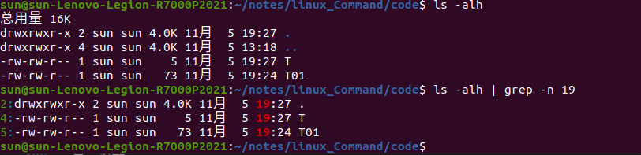
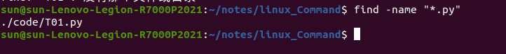

# Linux Command

## Linux目录结构


多用户操作系统，各个用户可以在同一时间共享系统资源


各个目录解释：

- /bin：bin 是 Binaries (二进制文件) 的缩写, 这个目录存放着最**经常使用的命令**。

- /boot：这里存放的是**启动** Linux 时使用的一些核心文件，包括一些连接文件以及镜像文件。

- /dev ：dev 是 Device(设备) 的缩写, 该目录下存放的是 Linux 的**外部设备**，在 Linux 中访问设备的方式和访问文件的方式是相同的。

- /etc：etc 是 Etcetera(等等) 的缩写,这个目录用来存放所有的**系统管理所需要的配置文件和子目录**。

- /home：用户的主目录，在 Linux 中，每个用户都有一个自己的目录，一般该目录名是以用户的账号命名的，如上图中的 alice、bob 和 eve。

- /lib：lib 是 Library(库) 的缩写这个目录里存放着**系统最基本的动态连接共享库**，其作用类似于 Windows 里的 DLL 文件。几乎所有的应用程序都需要用到这些共享库。

- /lost+found：这个目录一般情况下是空的，当系统**非法关机**后，这里就存放了一些文件。

- /media：linux 系统会**自动识别一些设备**，例如U盘、光驱等等，当识别后，Linux 会把识别的设备挂载到这个目录下。

- /mnt：系统提供该目录是为了让用户**临时挂载别的文件系统的**，我们可以将光驱挂载在 /mnt/ 上，然后进入该目录就可以查看光驱里的内容了。

- /opt：opt 是 optional(可选) 的缩写，这是给主机额外安装软件所摆放的目录。比如你安装一个ORACLE数据库则就可以放到这个目录下。默认是空的。

- /proc：proc 是 Processes(进程) 的缩写，/proc 是一种伪文件系统（也即虚拟文件系统），存储的是当前内核运行状态的一系列特殊文件，**这个目录是一个虚拟的目录，它是系统内存的映射，我们可以通过直接访问这个目录来获取系统信息**。
这个目录的内容不在硬盘上而是在内存里，我们也可以直接修改里面的某些文件，比如可以通过下面的命令来屏蔽主机的ping命令，使别人无法ping你的机器：
> echo 1 > /proc/sys/net/ipv4/icmp_echo_ignore_all

- /root：该目录为系统管理员，也称作**超级权限**者的用户主目录。

- /sbin：s 就是 Super User 的意思，是 Superuser Binaries (超级用户的二进制文件) 的缩写，这里存放的是系统管理员使用的系统管理程序。

- /selinux：这个目录是 Redhat/CentOS 所特有的目录，Selinux 是一个安全机制，类似于 windows 的防火墙，但是这套机制比较复杂，这个目录就是存放selinux相关的文件的。

- /srv：该目录存放一些服务启动之后需要提取的数据。

- /sys：这是 Linux2.6 内核的一个很大的变化。该目录下安装了 2.6 内核中新出现的一个文件系统 sysfs 。sysfs 文件系统集成了下面3种文件系统的信息：针对进程信息的 proc 文件系统、针对设备的 devfs 文件系统以及针对伪终端的 devpts 文件系统。该文件系统是内核设备树的一个直观反映。当一个内核对象被创建的时候，对应的文件和目录也在内核对象子系统中被创建。

- /tmp：tmp 是 temporary(临时) 的缩写这个目录是用来存放一些临时文件的。

- /usr：usr 是 unix system resources(unix 系统资源) 的缩写，这是一个非常重要的目录，用户的很多应用程序和文件都放在这个目录下，类似于 windows 下的 program files 目录。

- /usr/bin：系统用户使用的应用程序。

- /usr/sbin：超级用户使用的比较高级的管理程序和系统守护程序。

- /usr/src：内核源代码默认的放置目录。

- /var：var 是 variable(变量) 的缩写，这个目录中存放着在不断扩充着的东西，我们习惯将那些经常被修改的目录放在这个目录下。包括各种日志文件。

- /run：是一个临时文件系统，存储系统启动以来的信息。当系统重启时，这个目录下的文件应该被删掉或清除。如果你的系统上有 /var/run 目录，应该让它指向 run。

注意：

在 Linux 系统中，有几个目录是比较重要的，平时需要注意不要误删除或者随意更改内部文件。
/etc： 上边也提到了，这个是系统中的配置文件，如果你更改了该目录下的某个文件可能会导致系统不能启动。
/bin, /sbin, /usr/bin, /usr/sbin: 这是系统预设的执行文件的放置目录，比如 ls 就是在 /bin/ls 目录下的。
值得提出的是 /bin、/usr/bin 是给系统用户使用的指令（除 root 外的通用用户），而/sbin, /usr/sbin 则是给 root 使用的指令。
/var： 这是一个非常重要的目录，系统上跑了很多程序，那么每个程序都会有相应的日志产生，而这些日志就被记录到这个目录下，具体在 /var/log 目录下，另外 mail 的预设放置也是在这里。

## Linux启动历程

linux启动时我们会看到许多启动信息。

Linux系统的启动过程并不是大家想象中的那么复杂，其过程可以分为5个阶段：
  - 内核的引导。
  - 运行 init。
  - 系统初始化。
  - 建立终端 。
  - 用户登录系统。
  
init程序的类型：

  - SysV: init, CentOS 5之前, 配置文件： /etc/inittab。
  - Upstart: init,CentOS 6, 配置文件： /etc/inittab, /etc/init/*.conf。
  - Systemd： systemd, CentOS 7,配置文件： /usr/lib/systemd/system、 /etc/systemd/system。

### 内核引导

当计算机打开电源后，首先是**BIOS开机自检**，按照BIOS中设置的启动设备（通常是硬盘）来启动。
操作系统接管硬件以后，首先读入 /boot 目录下的内核文件。 


### 运行init

init 进程是系统所有进程的起点，你可以把它比拟成系统所有进程的老祖宗，没有这个进程，系统中任何进程都不会启动。

init 程序首先是需要读取配置文件 /etc/inittab。 


运行级别：

许多程序需要开机启动。它们在Windows叫做"服务"（service），在Linux就叫做"守护进程"（daemon）。
init进程的一大任务，就是去**运行这些开机启动的程序**。
但是，不同的场合需要启动不同的程序，比如用作服务器时，需要启动Apache，用作桌面就不需要。

Linux允许为不同的场合，分配不同的开机启动程序，这就叫做"运行级别"（runlevel）。也就是说，启动时**根据"运行级别"，确定要运行哪些程序**

- 运行级别0：系统停机状态，系统默认运行级别不能设为0，否则不能正常启动
- 运行级别1：单用户工作状态，root权限，用于系统维护，禁止远程登录
- 运行级别2：多用户状态(没有NFS)
- 运行级别3：完全的多用户状态(有NFS)，登录后进入控制台命令行模式
- 运行级别4：系统未使用，保留
- 运行级别5：X11控制台，登录后进入图形GUI模式
- 运行级别6：系统正常关闭并重启，默认运行级别不能设为6，否则不能正常启动


### 系统初始化

在init的配置文件中有这么一行： si::sysinit:/etc/rc.d/rc.sysinit　它调用执行了/etc/rc.d/rc.sysinit，而rc.sysinit是一个bash shell的脚本，它主要是完成一些系统初始化的工作，rc.sysinit是每一个运行级别都要首先运行的重要脚本。

它主要完成的工作有：激活交换分区，检查磁盘，加载硬件模块以及其它一些需要优先执行任务。 

> l5:5:wait:/etc/rc.d/rc 5

这一行表示以5为参数运行/etc/rc.d/rc，/etc/rc.d/rc是一个Shell脚本，它接受5作为参数，去执行/etc/rc.d/rc5.d/目录下的所有的rc启动脚本，/etc/rc.d/rc5.d/目录中的这些启动脚本实际上都是一些连接文件，而不是真正的rc启动脚本，真正的rc启动脚本实际上都是放在/etc/rc.d/init.d/目录下。

而这些rc启动脚本有着类似的用法，它们一般能接受start、stop、restart、status等参数。

/etc/rc.d/rc5.d/中的rc启动脚本通常是K或S开头的连接文件，对于以 S 开头的启动脚本，将以start参数来运行。

而如果发现存在相应的脚本也存在K打头的连接，而且已经处于运行态了(以/var/lock/subsys/下的文件作为标志)，则将首先以stop为参数停止这些已经启动了的守护进程，然后再重新运行。

这样做是为了保证是当init改变运行级别时，所有相关的守护进程都将重启。

至于在每个运行级中将运行哪些守护进程，用户可以通过chkconfig或setup中的"System Services"来自行设定


### 建立终端

rc执行完毕后，返回init。这时基本系统环境已经设置好了，各种守护进程也已经启动了。
init接下来会打开6个终端，以便用户登录系统。在inittab中的以下6行就是定义了6个终端
```
1:2345:respawn:/sbin/mingetty tty1
2:2345:respawn:/sbin/mingetty tty2
3:2345:respawn:/sbin/mingetty tty3
4:2345:respawn:/sbin/mingetty tty4
5:2345:respawn:/sbin/mingetty tty5
6:2345:respawn:/sbin/mingetty tty6
```

从上面可以看出在2、3、4、5的运行级别中都将以respawn方式运行mingetty程序，mingetty程序能打开终端、设置模式。
同时它会显示一个文本登录界面，这个界面就是我们经常看到的登录界面，在这个登录界面中会提示用户输入用户名，而用户输入的用户将作为参数传给login程序来验证用户的身份。

### 用户登录

三种登录方式：
    （1）命令行登录
    （2）ssh登录
    （3）图形界面登录


对于运行级别为5的图形方式用户来说，他们的登录是通过一个图形化的登录界面。登录成功后可以直接进入 KDE、Gnome 等窗口管理器。
而本文主要讲的还是文本方式登录的情况：当我们看到mingetty的登录界面时，我们就可以输入用户名和密码来登录系统了。
Linux 的账号验证程序是 login，login 会接收 mingetty 传来的用户名作为用户名参数。
然后 login 会对用户名进行分析：如果用户名不是 root，且存在 /etc/nologin 文件，login 将输出 nologin 文件的内容，然后退出。
这通常用来系统维护时防止非root用户登录。只有/etc/securetty中登记了的终端才允许 root 用户登录，如果不存在这个文件，则 root 用户可以在任何终端上登录。
/etc/usertty文件用于对用户作出附加访问限制，如果不存在这个文件，则没有其他限制。

### 图形模式与文字模式切换方式

Linux预设提供了六个命令窗口终端机让我们来登录。

默认我们登录的就是第一个窗口，也就是tty1，这个六个窗口分别为tty1,tty2 … tty6，你可以按下Ctrl + Alt + F1 ~ F6 来切换它们。

如果你安装了图形界面，默认情况下是进入图形界面的，此时你就可以按Ctrl + Alt + F1 ~ F6来进入其中一个命令窗口界面。

当你进入命令窗口界面后再返回图形界面只要按下Ctrl + Alt + F7 就回来了。

如果你用的vmware 虚拟机，命令窗口切换的快捷键为 Alt + Space + F1~F6. 如果你在图形界面下请按Alt + Shift + Ctrl + F1~F6 切换至命令窗口。 


### Linux关机

在linux领域内大多用在服务器上，很少遇到关机的操作。毕竟服务器上跑一个服务是永无止境的，除非特殊情况下，不得已才会关机。

正确的关机流程为：sync > shutdown > reboot > halt

关机指令为：shutdown ，你可以man shutdown 来看一下帮助文档

```
sync 将数据由内存同步到硬盘中。

shutdown 关机指令，你可以man shutdown 来看一下帮助文档。例如你可以运行如下命令关机：

shutdown –h 10 ‘This server will shutdown after 10 mins’ 这个命令告诉大家，计算机将在10分钟后关机，并且会显示在登陆用户的当前屏幕中。

shutdown –h now 立马关机

shutdown –h 20:25 系统会在今天20:25关机

shutdown –h +10 十分钟后关机

shutdown –r now 系统立马重启

shutdown –r +10 系统十分钟后重启

reboot 就是重启，等同于 shutdown –r now

halt 关闭系统，等同于shutdown –h now 和 poweroff

```
指定时间 shutdown -t 10 #10秒后关机

关机命令可以直接 halt/poweroff
重启命令可以直接 reboot

## 常用基本命令

| 命令  |     描述     |
| :---: | :----------: |
|  ls   |  打开文件夹  |
|  pwd  | 打印工作目录 |
|  cd   |   切换目录   |
| touch |   创建文件   |
| mkdir |   创建目录   |
|  rm   | 删除文件目录 |
| clear |     清屏     |

命令格式：
- Command [-option] [parameter] 方括号表示可选
eg rm -r dir 递归删除，可以删除目录

命令帮助信息查询：
- command --help 在当前界面查看帮助信息
- man command 在man文档查看帮助信息

man文档的基本操作方式：
- 空格 翻一页
- 回车 翻一行
- f   forward 前进一屏
- b   back 回退一屏
- q   退出man文档
  
### ls命令

| 参数  |       描述       |
| :---: | :--------------: |
|   a   |   查看all文件    |
|   l   | 列表显示详细信息 |
|   h   |    人性化显示    |
|   R   |     递归查看     |

可以复合使用


### 终端通配符

不同于正则表达式

| 参数  |       描述       |
| :---: | :--------------: |
|   *   | 匹配任意多个字符 |
|  ？   |  匹配任意单字符  |

示例：
> ls 1* #展示1开头的文件
> ls *1.txt #展示1结束的文件


通配字符组：
> ls [1 2 3 4 5]23.txt
> ls [1-5]23.txt

两者相同

### touch命令

- 不存在 创建
- 存在 修改时间，不改内容


### mkdir命令

注意：
1. 只能用来创建目录
2. 目录与文件不能同名

递归创建：
> mkdir -p a/b/c/d

rmdir 可以删除空目录（只能删空目录）
### rm命令

| 参数  |         描述         |
| :---: | :------------------: |
|   r   |  递归删除，可删目录  |
|   f   | 强制删除，无提示信息 |

> rm -r * 删除全部文件（当前目录下）

### 文件移动命令

#### tree 命令

需要自己安装
以树状图显示展示目录结构


> tree -d ~ 只显示目录 不显示文件

#### cp命令

```
cp 源文件 目标文件夹/文件
```
有目标文件则覆盖，没有则创建新文件

注意：
> 复制时若名字不用发生改变，只需要给定目标目录即可。

| 参数  |       说明        |
| :---: | :---------------: |
|   i   |   覆盖文件提醒    |
|   r   | 递归复制,复制目录 |
|  -l   |    信息全拷贝     |
|  -a   | 文件属性同样拷贝  |

补充l参数：‌cp命令的-l参数用于创建硬链接‌。使用-l参数时，cp命令不会复制文件的内容，而是创建一个指向原始文件的链接。这意味着，链接和原始文件指向同一个物理位置，修改链接所指向的文件会影响原始文件，反之亦然


补充a参数：

    递归复制‌：递归地复制目录及其子目录和文件。
    保留属性‌：保留原文件的属性，包括修改时间、访问时间、文件模式、文件所有权和组所有权等。
    符号链接‌：如果源文件是符号链接，则目标文件或目录也会建立为符号链接，并指向与源文件或目录连接的原始文件或目录。
    保留链接‌：如果源文件是链接文件，则复制链接文件的属性而非文件本身。
使用场景

    ‌备份‌：在进行系统或重要文件的备份时，使用-a参数可以确保备份文件的完整性和一致性。
    ‌复制目录‌：在复制整个目录及其子目录时，使用-a参数可以确保所有文件和目录都被正确复制，并且保留其属性


obj与jbo完全一致

#### mv命令

```
mv 源文件 目标文件
```
直接移动文件或者目录(文件目录都可以直接移动)

注意：

若 源文件/目录 与 目标文件/目录 位置相同，产生重命名效果

-i 发生覆盖时，提供覆盖提示

### 文件查看命令

#### cat命令

**cat filename**：一次性显示全部内容


| 参数  |     说明     |
| :---: | :----------: |
|   b   |    加行号    |
|   n   | 空行也加行号 |

直接输入cat读取终端内容

补充：**tac命令** 与cat完全相同但是到着显示

#### more命令

**more filename**：分屏显示，空格显示更多 f/b/q 同man文档

**less filename**:分屏显示 利用q退出，与more的区别在于不显示百分比

#### head命令

> head -n 文件 

默认显示文件前n行

> tail -n 文件

默认显示文件后n行

#### wc命令

wc命令是‌Linux中用于统计文件中的字节数、字数和行数的工具。它主要用于显示文件的统计信息，包括字节数、字数和行数。wc命令是‌word count的缩写，意味着“单词计数”。

    -c：统计字节数。
    -m：统计字符数。
    -l：统计行数。
    -L：显示文件中最长行的长度。
    -w：统计字数。


#### od命令

od 命令在Linux中用来读取和输出文件中的数据。它可以以二进制或其他格式按照指定的字节、字符或字段来查看文件内容

od [option] [filename]

    -t 或 --format：指定输出格式，如c（字符）、d（十进制）、f（浮点数）、o（八进制）、x（十六进制）。

    -A：指定字节和位的地址基数，如u（无）、d（十进制）、o（八进制）、x（十六进制大写）、X（十六进制小写）。

    -j 或 --skip-bytes=BYTES：跳过指定的字节数。

    -N 或 --read-bytes=BYTES：读取指定的字节数。

    -v 或 --output-duplicates：输出时不省略重复的数据。

    -w 或 --width=BYTES：设置每行的字节数，默认是16。


#### grep命令

查找文档内固定字符

| 参数  |        说明        |
| :---: | :----------------: |
|   n   |      显示行号      |
|   v   | 反操作，不匹配的行 |
|   i   |     忽略大小写     |

注意所有句子需要用双引号括起来


grep 可以使用正则表达式匹配

如正则表达式：
| 参数  |   说明    |
| :---: | :-------: |
|  ^a   | a开头的行 |
|  k$   | k结尾的行 |


空格也在查找的范围内


awk命令 按照列拆分
sed命令 按照行拆分

### echo命令

见shell脚本
> echo 参数

显示参数

### 重定向

见Shell脚本
    
    > 直接覆盖
    >> 追加

目标文件如果不存在可以直接创建

### 管道

管道符号： |

一个命令的输出进入管道作为另外一个命令的输入



### which命令

基本文件信息
/etc 保存有系统的配置信息
/etc/passwd 保存用户信息 密码存于/etc/shadow文件中
/user/bin 存有各种终端命令 如passwd 可以用于修改密码 sudo passwd username

which命令可以用于查看各种可执行文件的位置信息

如下：


### find命令

> find [路径] [条件] “目标”

查找所有文件



直接find 按照字符串查找

其他查找模式：

| 模式                              | 描述                |
| --------------------------------- | ------------------- |
| find ./ -type "l"                 | 递归按类型查找      |
| find ./ -name "*.jpg"             | 按名字查找          |
| find ./ -maxdepth 1 -name "*.jpg" | 目录深度和名字查找  |
| find ./ -size +20M -size -50M     | 查找20以上50以下M的 |

补充：M兆K千字节 默认是b block 512B

其他的一些参数：

- atime 最近访问     amin  
- mtime 最近更改属性  mmin
- ctime 最近改动内容  cmin

time 天为单位 min 分钟单位


- exec参数：
-exec 参数后面跟的是command命令，它的终止是以;为结束标志的，所以这句命令后面的分号是不可缺少的，考虑到各个系统中分号会有不同的意义，所以前面加反斜杠。
{}花括号代表前面find查找出来的文件名。


写入文件


> stat filename

显示文件的基础信息


### history命令

history 显示最近输入记录

终端快捷键：

| 快捷键    | 说明     |
| --------- | -------- |
| ctrl+p    | 上一个   |
| ctrl+n    | 下一个   |
| ctrl+b    | 后退左移 |
| ctrl+f    | 前进右移 |
| ctrl+d    | 删除     |
| ctrl+a    | 光标头   |
| ctrl+e    | 光标尾   |
| backspace | 退格     |

### jobs命令

可以查看后台运行作业

cat & 通过&可使得进程运行在后台
利用jobs可以查看后台作业

fg 将后台作业放到前台终端运行
bg 将前台作业放到后台运行

kill命令可以直接杀死进程


### env命令

查看环境变量

补充：clear 可以直接ctrl + l

### man命令

可以查看帮助文档

man 2 open

查看open函数的第二章文档

对应关系：
| 文章数 | 类型         |
| ------ | ------------ |
| 1      | shell命令    |
| 2      | 系统调用     |
| 3      | 库调用       |
| 4      | 特殊文件     |
| 5      | 文件格式     |
| 6      | 游戏         |
| 7      | 其他         |
| 8      | 系统管理命令 |
| 9      | 内核历程     |

在vim中可以直接 n K跳转


### alias命令

可以为一个组合起其他名字


但是只在此终端有效

如何终端永久生效？

修改bash配置 .bashrc文件


.bashrc文件 内部就是shell脚本


自己添加配置

### umask命令

设置掩码，可以指定用户创建文件时的权限

0002 第一个零表示8进制

过程：

全文件权限为777
则默认掩码 + 显示权限 = 777


当前掩码为002 则创建文件权限为775 对应于rwxrwxr-x

但是注意，普通文件默认是没有执行权限的。
所有默认普通文件就是rw-rw-rw-

掩码为002 对应的就是0 0 w 减去对应权限为rw-rw-r--


可以修改为0 226 对应的为w w r 创建的就是r--/r--/---


同样的只能临时其效果，若全句修改可以在.bashrc文件中设置

### 远程管理命令

#### 关机重启

shutdown:
shutdown [选项] [时间]
1. 默认行为为关机 时间60s
2. -r 行为为重启
3. -c 取消关机/重启

时间参数：
1. now 立即执行
2. +10 10分钟后
3. 20：15 具体时间

简便指令：

poweroff 关机
reboot 重启

#### 配置网卡

网卡：负责网络通信的设备
IP地址：网卡的地址信息

ifconfig：查看网卡配置信息


ping ICMP协议 测试连接是否正常

ping + ip地址 ctrl c结束


URL 经过DNS服务器可以解析成IP地址 URL就是IP地址

netstat
可以查看网络状态


#### 远程登录

##### SSH基础：
ssh是Linux的终端工具
利用ssh协议可以远程连接计算机软件，进行远程控制

补充：
‌‌SSH（‌Secure Shell）是一种‌网络安全协议，用于在计算机网络上进行安全远程访问和执行命令。‌ 它通过‌加密和认证机制实现安全的访问和文件传输等业务，确保数据在传输过程中不被窃听或篡改。‌
主要功能和优点

    安全远程访问‌：SSH允许用户通过网络安全地远程登录到其他计算机，执行命令、访问文件和管理服务等。
    ‌加密通信‌：SSH传输的数据都经过加密，使用的加密算法包括对称加密（如AES）和非对称加密（如RSA）。
    ‌多种身份验证方法‌：SSH支持多种身份验证方法，包括密码、公钥、证书等，提高了系统的安全性。
    ‌文件传输‌：SSH支持安全的文件传输协议（SFTP），允许用户在本地计算机和远程计算机之间传输文件。
    ‌端口转发‌：SSH允许用户设置本地端口转发，进一步增强了网络访问的安全性。
    ‌配置灵活性‌：SSH服务器和客户端都有配置文件，可以根据需求进行精确的配置。
    ‌跨平台支持‌：SSH是一种开放标准，被广泛采用，主流操作系统和网络设备都支持SSH。

##### SSH公钥私钥

公钥和私钥是成对生成的，用于加密和解密数据。它们是通过SSH密钥生成工具（如ssh-keygen）创建的，生成后分别存放在客户端和服务器上。

公钥和私钥的来源及放置：

生成密钥对：
- 可以使用命令ssh-keygen在客户端生成公钥和私钥。
- 生成的过程中，用户可以选择密钥类型（如RSA、ECDSA等）和密钥长度，并设置一个用于保护私钥的密码短语（可以为空）
  
存放位置：
- 私钥（Private Key）：保存在客户端，一般位于用户主目录下的隐藏文件夹中，路径为~/.ssh/id_rsa或类似的文件。这个文件非常重要，不能泄露，因为任何人拿到它就可以以你的身份登录服务器。
- 公钥（Public Key）：需要放在服务器端，通常添加到服务器上的~/.ssh/authorized_keys文件中。服务器利用这个公钥来验证客户端的连接。

配置过程：
- 客户端生成密钥对后，将公钥手动或自动上传到服务器的authorized_keys文件中。
- 当客户端尝试连接服务器时，服务器使用存储的公钥验证客户端的私钥，确保客户端是合法的用户。

密钥的安全性：
- 私钥要保存在本地，且权限应设置为仅用户可读（例如：chmod 600 ~/.ssh/id_rsa）。
- 公钥可以公开共享，但只能用于验证私钥而不能反向推导出私钥。

```
# 在客户端生成密钥对
ssh-keygen -t rsa -b 4096 -C "your_email@example.com"

# 将公钥上传到服务器
ssh-copy-id user@server
```

##### 域名,端口号

域名URL 可以被解析成IP地址，应用于寻找网络中的服务器
端口号对应于服务器中的一个进程

端口号一般16为两个字节对应于1~65535

前1024个一般是默认的被称为公认端口，通常表明了某种服务的协议
1024-49151 用于服务器端，松散的绑定一些服务，为注册端口
49152-65535 动态端口，用于客户端进程

常用的公认端口：
21：FTP服务所开放的端口，用于上传、下载文件。
22：SSH端口，用于通过命令行模式远程连接Linux服务器或vps。
23：Telnet端口，用于Telnet远程登录服务器。
25：SMTP服务所开放的端口，用于发送邮件。
80：HTTP用于HTTP服务提供访问功能，例如，IIS、Apache、Nginx 等服务。
110：POP3用于POP3 协议，POP3 是电子邮件收发的协议。
143：IMAP用于IMAP（Internet Message Access Protocol）协议，IMAP 是用于电子邮件的接收的协议。
443：HTTPS 用于HTTPS服务提供访问功能。HTTPS 是一种能提供加密和通过安全端口传输的一种协议。
1433：SQL Server SQL Server的TCP 端口，用于供SQL Server对外提供服务。
1434：SQL Server SQL Server的UDP端口，用于返回SQL Server使用了哪个 TCP/IP 端口。
1521：Oracle通信端口，服务器上部署了Oracle SQL需要放行的端口。
3306：MySQL数据库对外提供服务的端口。
3389：远程桌面服务端口，可以通过这个端口远程连接服务器。
8080：代理端口,同80端口一样，8080 端口常用于WWW代理服务，实现网页浏览。

##### SSH客户端简单使用

user：代表远程机器用户
remote:服务器地址
port：监听端口

> ssh [-p port] user@remote

远程连接到目标主机

exit退出


scp远程拷贝：

实现客户端与服务器之间远程的文件传输

参数指定-P 端口号 有默认可省略 服务器端需要加上user@remote

示例：
```
scp -P 22 01.py user@remote:Desktop/01.py
```
实现了将本机文件复制到服务器端

```
scp -P 22 user@remote:Desktop/01.py ./Demo
```
实现了服务器文件复制到本机

-r 参数可以实现对目录的复制

传一个文件：


##### SSH高级使用

用户目录下，存储有.ssh目录，内部有SSH的配置信息
第一次连接服务器时会建立文件，存有服务器私钥


每次登录都需要密码进行身份验证，如何利用公私钥实现免密登录

利用ssh-keygen 生成ssh秘钥对，存放于.ssh配置文件中

执行 ssh-copy-id -P port user@remote
将公钥上传至服务器即可

此后在进行ssh连接利用公私钥配对无需密码。


成功生成公私钥


上传公钥

免密登录成功实现，那么可以对服务器进行命名吗？
当然可以！
touch ~/.ssh/config
创建配置文件

进行配置
```
  1 Host JK
  2 Hostname 74.226.155.16
  3 User sun
  4 Port 22
```
注意：给600的权限

否则报错：


ssh JK 即可链接
scp 


## Linux基础知识

### Linux简介

Linux is not unix

主流Linux：
  - Debian：Ubuntu系统
  - Fedora：CentOS，RedHat系统

Linux发行版：


### 文件权限

每个系统至少有一个用户，不同用户对不同的系统资源有不同的使用权限

对文件目录的权限：
| 描述 | 字符 | 代号 |
| :--- | :--- | :--- |
| 读   | r    | 4    |
| 写   | w    | 2    |
| 执行 | x    | 1    |

#### 组权限：
将不同用户添加到不同组，一个组队目录/文件有相同的权限
可以适用于多人开发

ls -l 的详细信息中就包含了权限信息从头到尾分别是当前用户，组，其他用户


#### 硬链接数
硬链接数：索引节点对应的目录项个数，全部删除后才能彻底删除文件
在Linux文件系统中，每个文件都有一个唯一的索引节点（inode），用于存储文件的元数据（如文件大小、权限、时间戳等）和实际数据块的引用。硬链接是通过增加一个指向该inode的目录项来实现的，这意味着多个文件名可以指向同一个inode，从而共享相同的数据块。因此，硬链接数实际上是指向同一个inode的目录项的数目

当一个新目录被创建时，系统会为该目录分配一个新的inode，并且目录本身会包含至少两个条目：一个是当前目录（.），另一个是父目录（..）。因此，新创建的目录至少有两个硬链接：一个是指向其自身的条目（.），另一个是指向其父目录的条目（..）。

#### chmod

可以改变文件或者目录的权限
```
chmod +/- rwx filename
```


对于目录权限：
| 权限 | 描述                 |
| ---- | -------------------- |
| w    | touch文件 创建目录项 |
| r    | ls查看文件目录项     |
| x    | 无法进入目录         |

#### 权限修改命令

- chown命令：
  可以修改文件或者目录的拥有者
  chown [option] username filename
  将filename的拥有者改为username
  若同时改变群组
  chown user1:group1 file1.txt
  对于目录可以使用 -R参数实现递归修改

  

    系统自带有nobody用户和nogroup组
- chgrp命令:
> sudo chgrp -R groupname demo

递归修改目录的所属组

- chmod命令：
  修改文件属性
> sudo chmod -R 755 文件/目录名


> chomd +/-/= r/w/x filename

不能精确到所有者/组/其他，一起执行的。其中=表示赋给给定权限，其他全取消


添加了执行权限，所有的都有了执行权限

> sudo chmod a/u/g/o + r/w/x filename

具体到给某一方面加权限，a for all 默认


### 用户管理

每个系统至少有一个用户，不同用户对不同的系统资源有不同的使用权限

#### 超级用户

root用户 对所有文件都有权限，专门用于维护

sudo 可以以超级用户身份执行

#### 组管理

添加删除组：
```
sudo groupadd groupname 
sudo groupdel groupname
```
查看组信息：
```
cat /etc/group
```


‌‌chgrp命令：
可以改变改变文件或目录的所属组

命令格式：chgrp [选项] [组] [文件]
功能：使用组名称或组识别码（GID）来改变文件或目录的所属组
常用选项

    -c 或 --changes：仅在更改组时显示消息。
    -f 或 --silent 或 --quiet：不显示错误信息。
    -v 或 --verbose：为每个处理的文件输出诊断信息。
    -h 或 --no-dereference：影响符号链接本身而不是引用的文件。
    -R 或 --recursive：递归地改变目录及其内容的所属组。
    --dereference：默认选项，影响符号链接引用的文件。
    --no-preserve-root：特别对待根目录。
    --preserve-root：不特别对待根目录。
    --reference=RFILE：使用RFILE的组而不是指定的组值。

> sudo chgrp -R groupname demo


#### 用户创建与删除

```
sudo useradd -m -g groupname username
```
-m参数可以自动创建家目录 
-g可以指定组默认创建用户同名组

```
sudo passwd username
```
可以用来设置用户密码，也可以修改密码

密码信息存储在/etc/passwd中

> cat -n /etc/passwd

查看，也可以用grep筛选


删除用户：

> userdel [选项] 用户名

常用参数

    -f：强制删除用户，即使用户当前已登录。
    -r：删除用户的同时，也删除用户的主目录和用户的邮件池。
    -R：后跟一个目录名（CHROOT_DIR），表示在指定目录中执行 userdel 操作，并且使用指定目录下的配置文件。
    -P：后跟一个目录名（PREFIX_DIR），表示在指定目录中执行 userdel 操作，并且使用指定目录下的配置文件。但该选项不会进行 chroot 操作，旨在为交叉编译目标准备环境。
    -Z：删除与用户相关的 SELinux 用户映射。
    --help：显示帮助信息

常用的相关文件：

    /etc/group：用户组信息。
    /etc/login.defs：为 shadow 密码套件提供的配置信息。
    /etc/passwd：用户账户信息。
    /etc/shadow：用户账户的安全信息，包含密码的散列值及账户有效期等，只能由 root 账户读取。
    /etc/subgid：存储每个用户辅助组ID信息。
    /etc/subuid：存储每个用户的辅助用户ID信息

**su [用户名]可以用于切换用户**

直接su进入root用户


密码设置为021223


exit 退出当前用户

当前用于exit 退出shell

#### 查看用户信息:

- id [user] 查看用户id 
  用户uid 与组id gid


用户id 可以在/etc/passwd中查询


6个分号显示了七组信息

从左到右为：用户名:密码加密:UID:GID:用户全名(注释):目录路径:运行shell环境

gid 可以在/etc/group中查询


显示信息：

    组名‌：用户组的名称，由字母或数字构成，不应重复。
    ‌密码‌：用户组的密码，通常为空或设置为“x”，具体内容存储在/etc/shadow文件中。
    ‌组标识号（GID）‌：用于表示用户组的唯一标识符。
    ‌组内成员列表‌：属于该用户组的所有用户的用户名，不同用户之间用逗号分隔‌


- 查看所有用户登录列表
  who命令


- 查看当前用户
  whoami


#### usermod命令

主组 由新建用户时指定，/etc/passwd中GID对应的组
附加组 可以在用户创建时为用户添加其他组

可以用usermod添加组

> usermod -G groupname username （附加组）
> usermod -g groupname username  (主组)

用groups可以查看当前用户的所有组
getent命令：该命令可以查看组内的所有成员。只需在终端输入”getent group groupname 命令，即可显示组内成员。


容易得出sheng已经加入sun的组内

usermod 命令用于修改用户账户。
它可以用来更改用户的主目录、用户组、登录名、登录shell等。

    -c：修改用户账户的注释信息；

    -d：修改用户的主目录；如 usermod -d /new/home/username username

    -e：修改账户的过期时间；

    -g：修改用户的初始用户组；

    -G：修改用户的附加用户组；

    -l：修改用户账户的登录名； 如 usermod -l newloginname oldloginname

    -s：修改用户的登录shell。如 usermod -s /bin/bash


### 系统信息

#### 时间信息

date指令


cal -y 日历


#### 磁盘信息

df -h  显示剩余空间


du -h [目录]

显示目录下磁盘占用

#### 进程信息

- ps 默认查看当前用户启动的应用程序(用户交互进程)


| 参数 | 说明                 |
| ---- | -------------------- |
| a    | 所有用户终端进程     |
| u    | 进程详细信息         |
| x    | 没有控制终端进程     |
| f    | 全格式显示           |
| l    | 长格式显示           |
| r    | 只显示正在运行的进程 |
| w    | 宽输出               |
| h    | 不显示标题           |
| e    | 显示所有进程         |


- top 可以用于动态显示
用q退出显示

- kill [option] PID
通过信号杀死进程


#### 系统信息

uname -a 内核版本

lsb-release -a 发行版版本 安装


cat /etc/os-release


free -m 查看空闲内存

    -b：以字节为单位显示内存信息。
    -k：以‌KB（千字节）为单位显示内存信息。
    -g：以‌GB（吉字节）为单位显示内存信息。
    ‌tera：以‌TB（太字节）为单位显示内存信息。
    -h：以人类可读的格式显示内存信息，即自动选择合适的单位（KB、MB、GB等）

free -s N：表示每隔N秒打印一次内存信息，直到用ctrl+c结束。
free -c N：表示重复打印内存信息N次。
例如，free -hs 3：以人类可读的方式，每隔3秒打印一次内存信息，直到ctrl+c结束


### 软硬链接

- 软连接
类似快捷方式，内部存储的是绝对路径

> ln -s orginalfile linkfile

内部存储的就是路径

一般命名以.s结尾 大小4B
软连接本身的权限时全开放的，与其指向的文件无关 rwxrwxrwx
同一文件，不同的访问路径，大小不一定相同


- 硬链接 
  
ln即创建硬链接，对应于inode的目录项，指向同一个inode(同一个文件)

一般文件以.h结尾
可以通过ls -l查看硬链接数

三个文件公用同一个inode，故三个文件是同步的


### 打包压缩
| 平台    | 格式    |
| ------- | ------- |
| Windows | rar格式 |
| Mac     | zip格式 |
| Linux   | tar.gz  |

| 参数 | 说明                                                                                                 |
| ---- | ---------------------------------------------------------------------------------------------------- |
| ‌c‌   | 创建一个新的档案文件。如果用户想备份一个目录或是一些文件，就要选择这个选项。                         |
| ‌x‌   | 从档案文件中释放文件。                                                                               |
| ‌t‌   | 列出档案文件的内容，查看已经备份了哪些文件。                                                         |
| ‌f‌   | 使用档案文件或设备，这个选项通常是必选的。                                                           |
| ‌v‌   | 详细报告tar处理的文件信息，显示操作的详细过程。                                                      |
| ‌z‌   | 使用gzip压缩/解压缩文件。                                                                            |
| ‌j‌   | 使用bzip2压缩/解压文件。                                                                             |
| ‌J‌   | 使用xz压缩/解压文件。                                                                                |
| ‌r‌   | 向现有压缩文件中追加文件。                                                                           |
| ‌u‌   | 更新文件，用新增的文件取代原备份文件，如果在备份文件中找不到要更新的文件，则把它追加到备份文件的最后 |

#### 打包文件

> tar -cvf 目标文件.tar 被打包的文件
> tar -xvf 打包文件.tar 


注意：以上操作只进行了文件的打包，没有进行压缩，为打包解包的过程

#### 压缩与解压缩

tar 只进行打包不进行压缩
可以利用gzip进行解压缩生产.tar.gz文件

> tar -zcvf file.tar.gz 被压缩文件/目录
> tar -zxvf file.tar.gz
> tar -zcvf file.tar.gz -C 目标路径


#### bzip2解压缩

利用bzip2进行解压缩，扩展名为xxx.tar.bz2解压缩

> tar -jcvf xxx.tar.bz2 目录
> tar -jxvf xxx.tar.bz2
> tar -jxvf xxx.tar.bz2 -C 目标

与gzip完全一致，只是压缩格式不同


#### zip与unzip

扩展名为.zip

> zip target.zip file1 file2 file3 压缩文件

> zip -r target.zip folder -r递归压缩目录

> unzip -d destination_folder source.zip -d解压到固定目录

> zip -r target.zip folder -x "*.txt" -x "*.log" -x压缩时排除某些文件

#### rar压缩

安装 sudo apt install rar

rar a -r newdir 材料
会自动把newdir转化成newdir.rar


unrar x 压缩包rar


利用apt show命令可以查看安装包信息

sudo apt show rar


### 软件安装

安装命令： apt-get也是一个Debian系统常用的暗转程序但是apt更新

> sudo apt install 软件包 #安装软件包
> sudo apt remove 软件包 #卸载软件包
> sudo apt upgrade #软件包升级

软件源：


利用国内镜像源可以提高下载速度

配置镜像源：

在Linux中配置软件安装源，通常是通过编辑 /etc/apt/sources.list 文件（Debian/Ubuntu系统）或 /etc/yum.repos.d/ 目录下的文件（CentOS/RedHat系统）来实现。

```
sudo vim /etc/apt/sources.list

deb http://archive.ubuntu.com/ubuntu/ bionic main restricted universe multiverse
deb http://archive.ubuntu.com/ubuntu/ bionic-updates main restricted universe multiverse

sudo apt update
```


离线安装：

deb包安装：

Debian 系统普遍以deb安装包进行离线安装

安装命令：

- sudo dpkg -i xxx.deb 本地包安装
- sudo dpkg -r xxx 卸载软件包
- sudo dpkg -r --purge xxx 连同配置文件一起删除
- sudo dpkg --info xxx.deb 软件包信息
- sudo dpkg -L xxx 查看已经安装包的所有文件
- sudo dpkg -c xxx.deb 查看未安装包的所有文件
- sudo dpkg -l 已经安装的软件包信息
- sudo dpkg-reconfigue xxx 重新配置软件包 

[参考文档](https://www.cnblogs.com/xzongblogs/p/15535087.html)


源码安装：

github README安装教程

解压缩源码包
cd 目标目录
./configure配置文件 创建makefile文件
make 进行编译
sudo make install  //安装
sudo make distclean //卸载


### Shell解释器

具体shell语法请见shell.md

终端：一切输入输出的设备总称
虚拟终端：可以模拟计算机的行为

查看shell 
所有shell
> cat /etc/shells

当前shell
> echo $SHELL


### 文件类型

ls -lh 解析


文件类型：所有者：同组成员：其他用户：硬链接数：所有用户：所有组：大小：时间：名字

其中linux中总共有8种文件类型

| 文件类型     | 符号 |
| ------------ | ---- |
| 普通文件     | -    |
| 目录文件     | d    |
| 字符设备文件 | c    |
| 块设备文件   | b    |
| 软连接       | l    |
| 套接字文件   | s    |
| 管道文件     | p    |
| 未知文件     |      |

### Linux前后台任务

#### 前言

在Linux系统中，进程管理是至关重要的一个环节。其中，前后台任务和守护进程是进程管理中不可忽视的两个概念。前后台任务决定了进程与用户交互的方式，而守护进程则以其独特的运行方式，为系统提供稳定且持续的服务。本文将深入探讨Linux系统中的前后台任务与守护进程，帮助读者更好地理解和运用它们。

#### 前后台任务介绍 

在Linux系统中，进程（process）是程序执行的实例，而任务（task）通常是指进程所要执行的具体工作。当我们谈到前后台任务时，我们实际上是在讨论进程与用户交互的方式以及它们在终端中的表现。

#### 前台任务 

前台任务是指那些直接与终端交互的进程。
当我们在终端中输入命令并按下回车键时，这个命令通常会作为一个前台任务启动。
前台任务占据整个终端窗口，它的输出会直接显示在终端上，而任何需要用户输入的操作也会直接在终端上提示。
前台任务通常需要用户的实时关注，因为它依赖于用户的输入来继续执行。
前台任务的一个显著特点是它会阻塞终端，这意味着当前台任务正在运行时，用户不能在同一终端窗口中启动其他任务。如果前台任务是一个长时间运行的操作，比如文件复制或大型程序的编译，用户可能需要等待它完成才能继续在终端中工作。

#### 后台任务

与前台任务不同，后台任务是在后台运行的进程，它们不与终端直接交互。
后台任务通常通过在前台任务运行时按下Ctrl + Z暂停，然后使用bg命令将其放到后台继续执行。
后台任务会释放终端的控制权，使得用户可以在同一终端窗口中启动其他任务。

后台任务的输出通常不会直接显示在终端上，而是可能被重定向到文件或其他地方。
用户可以通过其他方式（如查看日志文件或使用特定命令）来检查后台任务的执行状态和结果。
后台任务不依赖于用户的实时输入，它们可以在用户离开终端或执行其他任务时继续运行。

示例：


前后台切换

#### 前后台任务管理 


分析：
原因在于，process这个进程运行之后成了前台进程，而bash进程（也就是我们输入命令的进程）自动被被=切换到了后台进程，而后台进程不能与用户交互，所以用户输入的命令会没有反应。
如果我们要将process这个进程切换到后台，可以先ctrl+z，然后用bg命令将其切换到后台进程，此时bash进程会被自动切换到前台进程，因为前台只有一个进程并且必须都要有一个进程与用户进行交互，所以当前台进程(非bash进程)被切换时，那么处于后台的bash会直接被系统自动切换到前台。


过程分析：
执行./a.out后,a.out位于前台执行，bash切入后台。此时输入指令没有任意意义。
但是ctrl+z 暂停当前前台命令后，bash切回前台。我们通过bg命令把a.out放于后台执行。但是a.out一直在执行输出到标准输出的操作，故终端一直有输出出现。
但是此时输入命令是有效的。
最后我们执行fg把a.out切换为前台。ctrl+c结束进程。

总结：

1.将前台任务转为后台任务：

    使用Ctrl + Z组合键可以将正在运行的前台任务暂停并放到后台。此时任务处于暂停状态。
    使用bg命令可以将一个在后台暂停的命令变成在后台继续执行。

2.直接在后台启动任务：

    在命令的后面添加&字符，可以在后台启动一个任务。这样即使关闭当前的终端，任务也会继续在后台运行。

3.查看后台任务：

    使用jobs命令可以查看当前终端后台运行的任务。
    使用ps命令也可以查看后台运行的任务，但它显示的是系统中所有进程的状态，不仅仅是后台任务。

4.关闭后台任务：

    要关闭后台任务，首先需要找到该任务的进程ID（PID），然后使用kill命令加上PID来终止任务。

#### fg与bg命令

fg命令：
‌fg命令用于将后台作业（在后台运行的或者在后台挂起的作业）放到前台终端运行‌。
如果后台任务中只有一个，使用该命令时可以省略任务号。

bg命令：
bg命令用于将一个当前在前台运行的作业放到后台执行。
在‌Linux中，作业是指在shell中启动的任何进程。
当用户在终端中启动一个命令时，该命令通常会在前台运行，直到完成为止。
如果用户希望继续使用终端执行其他任务，而当前命令又需要长时间运行，这时就可以使用bg指令将该命令放到后台执行。
默认一般是把上次暂停的任务放入后台。

jobs命令：

可以查看所有的后台任务


#### 守护进程

服务器进程

区别：
1.运行环境：

    守护进程独立于用户的登录会话，可以在系统启动时自动运行，并持续在后台运行。
    普通进程则依赖于用户的操作或终端会话来启动和运行。

2.权限与特权：

    守护进程通常以超级用户权限（root）运行，这意味着它们可以访问系统的各种资源和敏感信息。
    普通进程的权限通常受到用户的限制，无法执行一些需要特权的操作。

3.生命周期：

    守护进程通常是长期驻留于内存中的，它们会在系统启动时被启动，并持续运行，直到系统关闭或管理员手动停止。
    普通进程的生命周期则通常与用户的操作或终端会话相关，当用户退出登录或关闭终端时，普通进程也会随之终止。

4.交互性：

    守护进程是在后台运行的，它们通常没有控制台窗口，也不需要交互式的用户界面。它们的主要任务是执行后台任务或提供服务。
    普通进程则通常与用户进行交互，可能需要用户输入或向用户展示输出

5.任务与功能：

    守护进程主要用于提供系统级的服务，如网络服务（如Web服务器、数据库服务器）、日志记录、定时任务调度等。
    普通进程则执行各种任务，其范围广泛，从简单的命令行工具到复杂的图形界面应用程序等。

6.独立性：

    守护进程在系统级别运行，与特定用户无关，它们不会受到特定用户登录或注销的影响。
    普通进程则可能受到用户会话状态的影响。

#### 会话窗口

Session窗口在计算机领域中，特别是在Linux操作系统和某些应用框架（如Apache Flink）中，是指用户登录后拥有的一系列进程、窗口站、桌面和窗口的集合。
这个集合代表了一个用户的工作站登录会话，是用户与系统进行交互的界面和平台。

Session窗口的概念和作用：它为用户提供了一个独立、私有的工作环境，使用户能够高效、安全地执行各种任务。

分析：
Linux操作系统可以有多个session窗口，这主要基于其多任务处理的特性和用户交互的需求。

首先，Linux作为一个多用户、多任务的操作系统，允许多个用户同时登录并进行操作。每个用户登录后，系统都会为其创建一个独立的session，这样每个用户都有自己独立的操作环境，互不干扰。每个session都包含了用户登录、执行命令、注销等一系列操作，具有持续性和独立性。

其次，即使对于单个用户，也可能需要同时管理多个任务或项目。在这种情况下，用户可以通过创建多个session窗口来分别处理这些任务。每个session窗口都可以看作是一个独立的终端环境，用户可以在不同的窗口中执行不同的命令或运行不同的程序。

此外，Linux中的session不仅仅局限于本地终端窗口，还可以通过远程连接（如SSH）创建远程session。这样，用户即使不在本地计算机前，也能通过远程session访问和管理Linux系统。

因此，Linux操作系统可以有多个session窗口，这为用户提供了极大的灵活性和便利性，使其能够同时处理多个任务或项目，提高工作效率。同时，多个session窗口的存在也保证了不同用户或任务之间的独立性，避免了相互干扰。

session小故事：
```
下面，我将通过一个简单的故事来解释Session窗口的概念：

在一个繁忙的图书馆里，每个读者都有一个专属的座位和书桌，这个座位和书桌就可以类比为一个Session窗口。
当读者（用户）坐下来开始阅读或学习时，他们就进入了一个会话（Session）。
在这个会话中，读者可以打开多本书（相当于打开多个应用程序或窗口），进行各种学习和研究活动。

假设一个读者（我们称他为小明）想要写一篇关于历史的论文。
他坐下后，打开了他的电脑（登录系统，开始一个Session），并在桌面上打开了多个窗口：一个窗口用于浏览网页查找资料，另一个窗口用于编写论文，还有一个窗口用于与导师或同学交流讨论。
这些窗口就构成了小明在这个Session中的工作环境。

在这个故事中，小明的座位和书桌（Session窗口）是他进行学习和工作的平台，而他在平台上打开的各种书籍和窗口则是他完成任务所需的工具和资源。
就像在计算机中，用户通过Session窗口与系统交互，执行各种任务，打开和关闭应用程序，管理文件和资源。

值得注意的是，每个读者（用户）在图书馆都有自己的座位和书桌（Session窗口），互不干扰。
同样，在计算机系统中，每个用户也有自己的Session窗口，保证了各自工作的独立性和安全性。
```
我们打开多个终端时，对应的就创建了多个session。

## Linux常见问题

### Linux 磁盘管理

Linux 磁盘管理好坏直接关系到整个系统的性能问题。

Linux 磁盘管理常用三个命令为 df、du 和 fdisk。

    df（英文全称：disk free）：列出文件系统的整体磁盘使用量
    du（英文全称：disk used）：检查磁盘空间使用量
    fdisk：用于磁盘分区

#### df 

df命令参数功能：检查文件系统的磁盘空间占用情况。可以利用该命令来获取硬盘被占用了多少空间，目前还剩下多少空间等信息。 
语法：
```
df [-ahikHTm] [目录或文件名]
```

    -h：以人类可读的方式显示输出结果（例如，使用 KB、MB、GB 等单位）。

    -T：显示文件系统的类型。

    -t <文件系统类型>：只显示指定类型的文件系统。

    -i：显示 inode 使用情况。

    -H：该参数是 -h 的变体，但是使用 1000 字节作为基本单位而不是 1024 字节。这意味着它会以 SI（国际单位制）单位（例如 MB、GB）而不是二进制单位（例如 MiB、GiB）来显示磁盘使用情况。

    -k：这个选项会以 KB 作为单位显示磁盘空间使用情况。

    -a：该参数将显示所有的文件系统，包括虚拟文件系统，例如 proc、sysfs 等。如果没有使用该选项，默认情况下，df 命令不会显示虚拟文件系统。

#### du

Linux du 命令也是查看使用空间的，但是与 df 命令不同的是 Linux du 命令是对文件和目录磁盘使用的空间的查看，还是和df命令有一些区别的，这里介绍 Linux du 命令。 
```
du [-ahskm] 文件或目录名称
```

    -a ：列出所有的文件与目录容量，因为默认仅统计目录底下的文件量而已。
    -h ：以人们较易读的容量格式 (G/M) 显示；
    -s ：仅显示指定目录或文件的总大小，而不显示其子目录的大小。
    -S ：包括子目录下的总计，与 -s 有点差别。
    -k ：以 KBytes 列出容量显示；
    -m ：以 MBytes 列出容量显示；

#### fdisk

fdisk 是 Linux 的磁盘分区表操作工具

```
fdisk [-l] 装置名称
```
-l 参数：输出后面接的装置所有的分区内容。
若仅有 fdisk -l 时， 则系统将会把整个系统内能够搜寻到的装置的分区均列出来。


#### 磁盘格式化

磁盘分割完毕后自然就是要进行文件系统的格式化，格式化的命令非常的简单，使用 mkfs（make filesystem） 命令。
语法
```
mkfs [-t 文件系统格式] 装置文件名
```

#### 磁盘检验

fsck（file system check）用来检查和维护不一致的文件系统。

若系统掉电或磁盘发生问题，可利用fsck命令对文件系统进行检查。

语法：
```
fsck [-t 文件系统] [-ACay] 装置名称

```
     -t : 给定档案系统的型式，若在 /etc/fstab 中已有定义或 kernel 本身已支援的则不需加上此参数
    -s : 依序一个一个地执行 fsck 的指令来检查
    -A : 对/etc/fstab 中所有列出来的 分区（partition）做检查
    -C : 显示完整的检查进度
    -d : 打印出 e2fsck 的 debug 结果
    -p : 同时有 -A 条件时，同时有多个 fsck 的检查一起执行
    -R : 同时有 -A 条件时，省略 / 不检查
    -V : 详细显示模式
    -a : 如果检查有错则自动修复
    -r : 如果检查有错则由使用者回答是否修复
    -y : 选项指定检测每个文件是自动输入yes，在不确定那些是不正常的时候，可以执行 # fsck -y 全部检查修复。

#### 磁盘挂载与删除

Linux 的磁盘挂载使用 mount 命令，卸载使用 umount 命令。

```
mount [-t 文件系统] [-L Label名] [-o 额外选项] [-n]  装置文件名  挂载点
```

```
umount [-fn] 装置文件名或挂载点
```