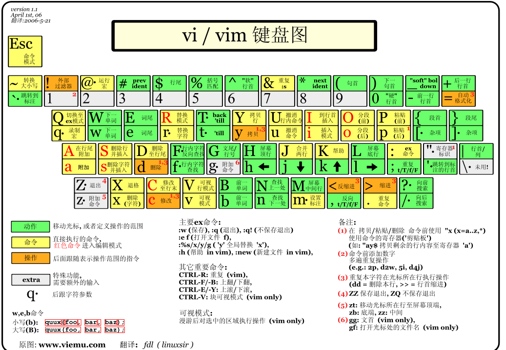
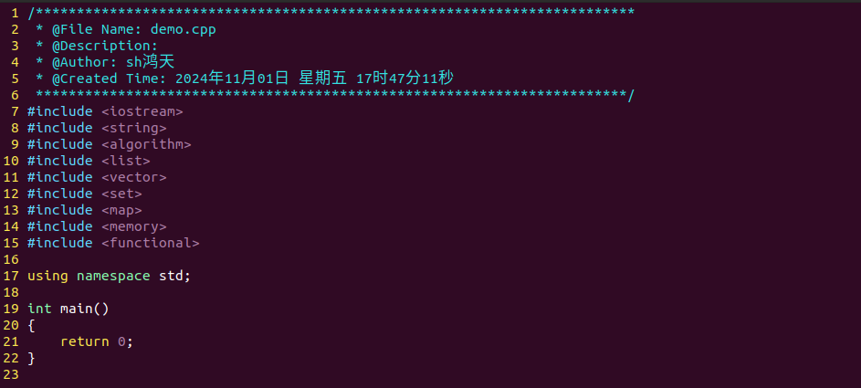
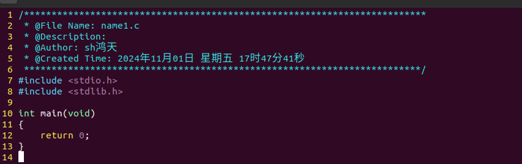

# Vim工具的基本使用

## 一、介绍

Vim是一个高度可配置的‌文本编辑器，用于创建和更改任何类型的文本。它是Vi编辑器的改进版，提供了许多高级功能和自定义选项，特别受到程序员和系统管理员的欢迎。Vim可以在‌Unix及类Unix系统中运行，是Linux系统的默认文本编辑器之一。

## 二、键位图

## 三、模式切换

### 3.1.模式介绍
- 命令模式： 可以移动光标、复制、粘贴和删除文本等操作(文本操作)
- 文本模式： 主要用于文本的输入(文本输入)
- 末行模式： 可以输入各种指令，对文件进行操作(控制命令)
  
### 3.2.模式切换

vim filename 创建文件 --> 命令模式

- 命令模式进入文本模式：s，i，a，o

| 操作  |       作用       | 操作  |       作用       |
| :---: | :--------------: | :---: | :--------------: |
|   a   |    单词后插入    |   A   |    此句后插入    |
|   i   |    单词前插入    |   I   |    此句前插入    |
|   o   | 光标行下一行插入 |   O   | 光标行前一行插入 |
|   s   |  删除选中并插入  |   S   |   删除此行插入   |

- 文本模式退出命令模式： Esc

- 命令模式进入末行模式： :

- 末行模式进入命令模式： Esc Esc

保存退出：
1. 末行模式下 wq(w表示保存 q表示退出)
2. 命令模式下 ZZ(大写)

## 四、光标移动

|          描述          |    操作方式1    |     操作方式2      |
| :--------------------: | :-------------: | :----------------: |
|    **单字符移动：**    |     方向键      | h左  j下  k上  l右 |
|      **指定行：**      | 末行命令 ：行号 | 命令模式 ：行号+G  |
|     **文件末尾：**     |        G        |
|     **文件头部：**     |       gg        |
|     **文件中间：**     |        M        |
| **该屏幕的最后一行：** |        L        |
|     **下一个标点**     |        w        |
|     **上一个标点**     |        b        |
|       **段上移**       |        {        |
|       **段下移**       |        }        |
|      **此行行首**      |        ^        |
|      **从行行尾**      |        $        |

## 五、删除操作

vim中没有明确的删除操作，准确的说是剪切

|     描述     |      操作1       |   操作2    |
| :----------: | :--------------: | :--------: |
|   删除此行   |        dd        |
|   删除n行    |       ndd        |    dnd     |
|   删除一块   | v可视化选中d删除 | V行选v字选 |
|    Delete    |      delete      |     x      |
|  backspace   |        X         |
| 删除某个单词 |        dw        |  空格分割  |
| 光标后全删除 |       d $        |     D      |
| 光标前全删除 |       d ^        |    d 0     |
|     替换     |        r         |

## 六、复制粘贴

|    描述    |          操作          |
| :--------: | :--------------------: |
|    剪切    | 删除即可，删除即为剪切 |
| 复制所在行 |           yy           |
|  复制多行  |          nyy           |
|   复制块   |       v可视化,yy       |
|  粘贴后面  |        p(小写)         |
|  粘贴前面  |        P(大写)         |

补充: 
> 终端输入时,选中时即完成了复制,鼠标中键进行粘贴
> ctrl + shift + c 复制 ctrl + shift + v 粘贴

## 七、查找替换

|      描述      |             操作             |      其他       |
| :------------: | :--------------------------: | :-------------: |
|   查找设定词   |          末行: /词           | n上一个 N下一个 |
| 向上查找设想词 |          末行: ?词           | n上一个 N下一个 |
|   筛选设想词   |             g/词             |   查看相关词    |
|    查选中词    |             * #              |    选中查找     |
|    单行替换    |       末行： s/old/new       |
|    通篇首替    |       末行：%s/old/new       |     区别？      |
|    通篇替换    |      末行：%s/old/new/g      |                 |
|    区块替换    | 末行命令：29，35 s/old/new/g |  29到35行替换   |

## 八、分屏操作

- 末行命令：sp 横分
- 末行命令：vsp 竖分
- 末行命令：q 退出当前分屏 qall 退出所有分屏

## 九、其他操作

### 9.1 撤销

- u： 撤销刚才的操作
- ctrl u：撤销刚才的撤销
  
### 9.2 格式化

- gg = G

### 9.3 括号匹配

- 括号+% 自动跳转

### 9.4 查看宏

选中宏 [ d

### 9.5 查看man卷

选中函数 K  /  n+K 查看第几卷

## 十、其他末行命令

|   命令   |      左右      |
| :------: | :------------: |
|    w     |      保存      |
|    q     |   不修改退出   |
|    q!    |  放弃修改退出  |
|  ！命令  | 执行命令行程序 |
|  set nu  |    设置行号    |
| set nonu |    关闭行号    |

## 十一、 补充知识

- **Man查看**：
    回车：行翻页
    空格：屏翻页
    ctrl-f：下一屏
    ctrl-b：上一屏
    ctrl-d：下半屏
    ctrl-v：上半屏
- **bash shell**:
    ctrl a : home
    ctrl e : end
    ctrl u : 清空
    上下键：上下行翻

## 十二、Vim配置

通常可以在用户文件夹下新建一个.vimrc的隐藏文件，用于vim配置（must用户文件夹~）
此文件夹即其子文件夹创建新的文件时会遵从配置标准

常用配置
syntax on                                 " 自动语法高亮
set number                                " 显示行号
set smartindent                           " 智能自动缩进
set shiftwidth=4                          " 设置自动缩进时，每一级缩进4个空格的宽度
set tabstop=4                             " 设定 tab 长度为 4 
set expandtab                             " 将tab转换为等量的空格
set softtabstop=4                         " 按退格键时一次删掉4个空格
set nobackup                              " 覆盖文件时不备份
set autochdir                             " 自动切换当前目录为当前文件所在的目录
set backupcopy=yes                        " 设置备份时的行为为覆盖
set ignorecase smartcase                  " 搜索时忽略大小写
set nowrapscan                            " 禁止在搜索到文件两端时重新搜索
set incsearch                             " 输入搜索内容时就显示搜索结果
set hlsearch                              " 搜索时高亮显示被找到的文本
set showmatch                             " 插入括号时，短暂地跳转到匹配的对应括号
set matchtime=2                           " 短暂跳转到匹配括号的时间
set hidden                                " 允许在有未保存的修改时切换缓冲区，此时的修改由 vim 负责保存
set cmdheight=1                           " 设定命令行的行数为 1
set cursorline                            " 突出显示当前行
set ruler                                 " 打开状态栏标尺
set laststatus=2                          " 显示状态栏 (默认值为 1, 无法显示状态栏)
set statusline=\ %<%F[%1*%M%*%n%R%H]%=\ %y\ %0(%{&fileformat}\ %{&encoding}\ %c:%l/%L%)\ 
" 设置在状态行显示的信息

文件头配置：

" 定义函数 SetTitle，自动插入文件头
func! SetTitle()
    " 插入文件头
    call setline(1, "/*************************************************************************")
    call append(1, " * @File Name: ".expand("%"))
    call append(2, " * @Description: ")
    call append(3, " * @Author: 少即多~")
    call append(4, " * @Created Time: ".strftime("%c"))
    call append(5, " ************************************************************************/")
 
    " 根据文件类型插入不同的代码
    let filetype = expand("%:e")
    if filetype == 'c'
        call append(6, "#include <stdio.h>")
        call append(7, "#include <stdlib.h>")
        call append(8, "")
        call append(9, "int main(void)")
        call append(10, "{")
        call append(11, "    return 0;")
        call append(12, "}")
        call append(13, "")
    elseif filetype == 'cpp' || filetype == 'cc'
        call append(6, "#include <iostream>")
        call append(7, "#include <string>")
        call append(8, "#include <algorithm>")
        call append(9, "#include <list>")
        call append(10, "#include <vector>")
        call append(11, "#include <set>")
        call append(12, "#include <map>")
        call append(13, "#include <memory>")
        call append(14, "#include <functional>")
        call append(15, "")
        call append(16, "using namespace std;")
        call append(17, "")
        call append(18, "int main()")
        call append(19, "{")
        call append(20, "    return 0;")
        call append(21, "}")
        call append(22, "")
    endif
 
    normal G " 新建文件后，自动定位到文件末尾
    w        " 自动保存插入的文件头，w为小写。
endfunc
 
" 当创建新的 C/C++ 文件时自动调用 SetTitle 函数
autocmd BufNewFile *.cpp,*.c,*.cc exec ":call SetTitle()"
    
配置用户下永久生效 .vimrc cd~下创建配置文件

